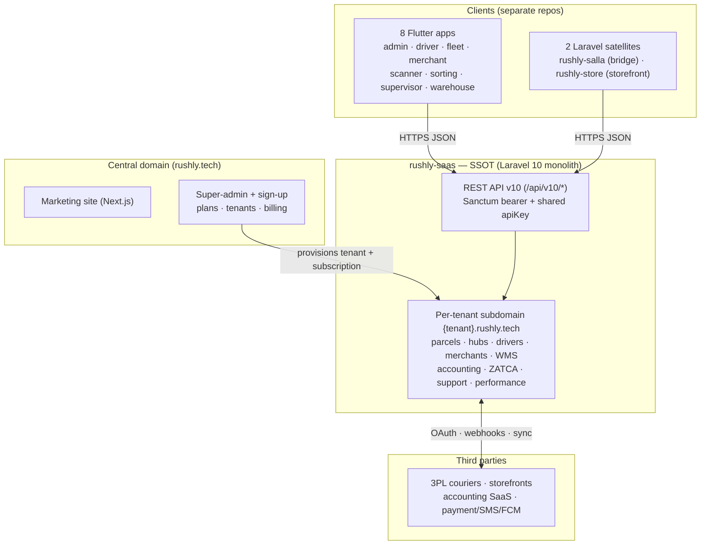
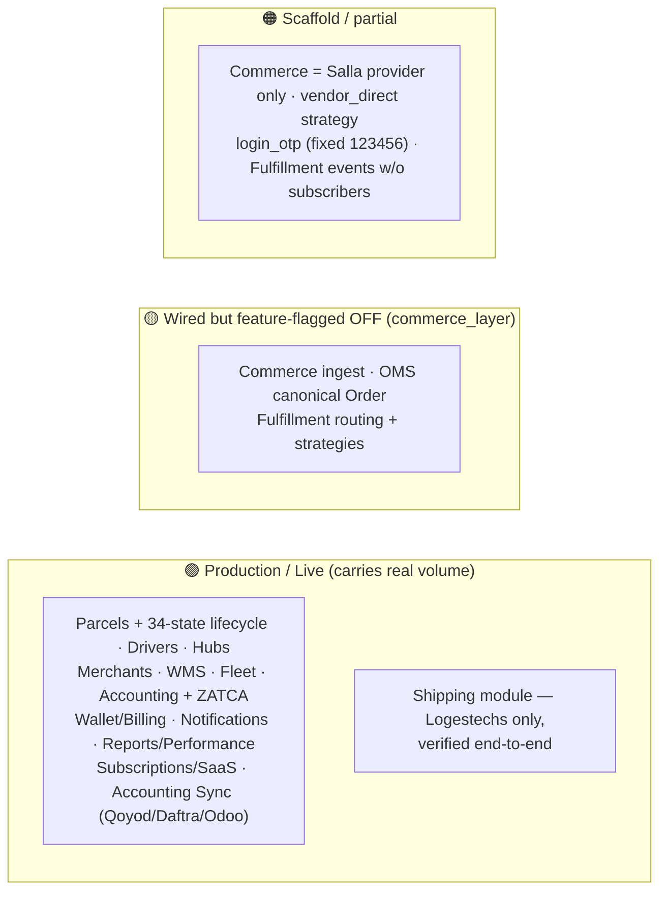

# 00 — Executive Summary

> **Audience:** C-suite / leadership. **Purpose:** one coherent read on what Rushly
> is, what actually ships today, and where the strategic risk sits — before you drill
> into the 23 numbered docs, 20 module docs, and 11 app docs that back every claim here.
>
> `rushly-saas` (`/var/www/rushly-saas`) is the **single source of truth (SSOT)**;
> everything else is a client of it. Every figure below traces to an existing doc or a
> real source file. Compiled **2026-07-27**.

---

## The punchline

**Rushly is a MENA-first, multi-tenant B2B logistics SaaS — one Laravel monolith that
runs a whole courier/3PL/fulfillment operation for many companies at once, surrounded by
a free ecosystem of 8 Flutter apps and 2 storefront/e-commerce satellites.** The core
platform (parcels, hubs, drivers, merchants, cash/COD, WMS, accounting, ZATCA
e-invoicing) is **mature and carries real production volume**. The next-generation
"commerce-to-carrier" pipeline (Commerce → OMS → Fulfillment) is **architecturally
excellent but feature-flagged OFF by default** — the schema ships, the behavior is dark.

The platform is **fundamentally sound but pilot-grade in three places that matter for
scale**: (1) a **cross-tenant data-leak hole** in the legacy 3PL path, (2) an
**application-maintained, non-double-entry accounting model** that can silently drift, and
(3) an **infrastructure default (`sync` queue) that defeats the async architecture the
code was designed around**. None are hard to fix; all must be closed before aggressive
growth. Separately, the marketing site materially oversells the product (AI dispatch, SOC
2/ISO, headline customer logos) versus what the code implements — leadership should treat
those as positioning, not shipped reality.

---

## What Rushly is, in one diagram

**Business model:** B2B SaaS. Rushly sells **time-boxed, module-gated, quota-shaped
subscription plans** to logistics operators (couriers, 3PLs, fulfillment centers,
warehouses). One operator = one tenant = one subdomain. Enforcement is by
`subscriptionCheckMiddleware` + plan `modules` → user permissions; billing is either
super-admin provisioning or tenant self-serve **Stripe Checkout**. The marketed "eight
products" (OMS, WMS, Fleet, Fulfillment, Delivery, Merchant, Customer, API) are **feature
bundles of the single monolith**, not separate deployables. Detail: [02-Project-Overview.md](02-Project-Overview.md) §5–7.

**Market:** MENA-first, and this focus *is* grounded in code (ZATCA Saudi e-invoicing;
Salla/Zid storefronts; Qoyod/Daftra accounting; Arabic/RTL first-class), even though the
marketing site's global logos, KPIs, and USD pricing are illustrative copy.

---

## The 11 projects and how they integrate

| # | Project | Type | Role |
|---|---|---|---|
| 1 | **rushly-saas** | Laravel 10 + Inertia/React | Backend, API, admin web. **SSOT.** |
| 2–9 | 8 Flutter apps | Flutter | Role-specific thin clients: admin, driver, fleet, merchant, scanner, sorting, supervisor, warehouse |
| 10 | rushly-store | Laravel 11 | Standalone storefront / e-commerce (EcommerceGo) |
| 11 | rushly-salla | Laravel 10 | Standalone Salla ↔ Rushly bridge (OAuth, webhooks, order→parcel, AWB writeback) |

It is a **hub-and-spoke star**: `rushly-saas` is the hub; every app and satellite reaches
it over the v10 API. **No spoke talks to another spoke** — they all rendezvous through the
SaaS. The 8 Flutter apps hold **no business logic of record**; they render and mutate SaaS
state. `rushly-salla` is bidirectional (pushes orders in, receives status writeback);
`rushly-store` feeds orders via the storefront-ingest surface. Full topology:
[01-Workspace-Inventory.md](01-Workspace-Inventory.md), [05-System-Architecture.md](05-System-Architecture.md) §2, §6.

---

## Architecture in brief

A **layered, module-augmented Laravel 10 monolith**. Requests flow HTTP → middleware →
controller → (repository | service | module factory) → Eloquent → **one shared MySQL DB**.
The defining trait of the current codebase is a set of **self-contained domain modules**
under `app/<Module>/` (Shipping, Commerce, Oms, Fulfillment, Wms, plus Salla and the
Qoyod/Daftra/Odoo/Zatca integration modules), each with the same folder shape and its own
service provider. Business logic depends on **interfaces + config, never concrete classes**
— "add a capability = drop a class in, add a config row." Modules integrate through
**explicit events** (`EventServiceProvider`), not direct calls. See the nine reconstructed
decisions in [26-Architecture-Decisions.md](26-Architecture-Decisions.md).

**Multi-tenancy is the load-bearing design choice:** `stancl/tenancy` identifies tenants by
subdomain, but the `DatabaseTenancyBootstrapper` is **commented out** — there is **one
shared database**, and isolation is enforced **entirely at the application layer** by a
`company_id` column + `scopeCompanywise()` on each model. Only **2 of ~120 models**
(`Parcel`, `ParcelEvent`) auto-scope; the rest rely on developers remembering a manual
`where('company_id', …)`. **A forgotten filter is a real cross-tenant leak, not a
theoretical one** — this fact drives Risk #1 below. See [17-Security.md](17-Security.md) §4.

> ⚠️ **Doc vs Code (recurring):** `README.md` / `ARCHITECTURE.md` claim "Laravel 12 /
> PHP 8.4". **`composer.json` is authoritative: Laravel `^10.10`, PHP `^8.1`.** The
> `bootstrap/app.php` classic-L10 form confirms it. Any onboarding doc quoting "Laravel
> 12" is wrong.

---

## Current maturity — production vs feature-flagged vs scaffold

- **The mature core is the legacy MVC platform** (Parcels, Accounting, Merchants, Drivers,
  Hubs, WMS, Fleet, Subscriptions). It is live and battle-tested.
- **The Phase-6 module stack** (Commerce → OMS → Fulfillment) is architecturally clean and
  *wired*, but every consumer 404s behind `abort_unless(config('features.commerce_layer'),
  404)` — **default OFF**. Schema and bindings load; behavior is dark. Its lifecycle events
  (`FulfillmentRequested/Started/Completed/Failed`, `OrderUpdated`) fire **without
  subscribers** — e.g. storefront edits do not yet propagate to a created parcel.
- **Shipping** is production for **Logestechs only**; Aramex / J&T / Zajel / DeliveryPanda
  remain on the legacy per-service pattern (Risk #1 / #4).
- **Frontend** is **mid-migration Blade → Inertia/React** (191 `.jsx` pages vs ~405 backend
  Blade files). Both stacks run side by side.

Maturity matrix per module: [11-Modules.md](11-Modules.md) §21. Feature-flag rationale:
[26-Architecture-Decisions.md](26-Architecture-Decisions.md) ADR-006.

---

## Top strategic risks

| # | Risk | Severity | Why it matters | Where |
|---|---|---|---|---|
| 1 | **Multi-tenant leak on legacy 3PL** | 🔴 Critical | `parcels_3pl` (Panda/Zajel/Aramex/J&T) has **no `company_id`**; Panda endpoints are **unauthenticated**; crons/webhooks resolve by AWB. One tenant's cron can mark **another tenant's parcel** delivered. Shared-DB tenancy means this is a live disclosure/integrity hole. | [22](22-Technical-Debt.md) TD-01/02/07, [17](17-Security.md) F2, `3PL.md` |
| 2 | **Non-double-entry accounting** | 🔴 High | Money is tracked as **per-party scalar running balances** (`current_balance`) + append-only statement ledgers — it *looks* like a ledger but isn't double-entry. Several key movers (`parcelDelivered`, `ReceivedRepository::store`, `IncomeRepository`) are **not wrapped in DB transactions**, and the wallet debit has **no overdraft guard** — balances can silently drift on partial failure. | [11](11-Modules.md) §8, `ACCOUNTING.md` §4/§8, [_FINDINGS.md](_FINDINGS.md) |
| 3 | **`sync` queue defeats the async design** | 🟠 High | `QUEUE_CONNECTION=sync` runs all 27 `ShouldQueue` jobs **inline in the web request**. Tracking sync, fulfillment routing, accounting push, stock fan-out — all designed as async fan-out — block the operator's request and lose retry. A slow courier API stalls the UI. Fix is infra, not code. | [22](22-Technical-Debt.md) TD-04, [05](05-System-Architecture.md) §7.4 |
| 4 | **Legacy vs module duplication** | 🟠 High | Three half-migrated dualities coexist "on purpose": legacy 3PL services vs `app/Shipping/`; `Parcel` vs canonical `Order` (bridged by `OrderToParcelBridge`); Blade vs Inertia/React. Each doubles the surface a developer must hold in mind and keeps the risky legacy paths alive (Risk #1 lives here). | [22](22-Technical-Debt.md) TD-05/06/11, [26](26-Architecture-Decisions.md) cross-cutting themes |

**Honorable mentions** (fast, high-value hardening): a **shared API key hard-coded and
committed** in `config/rxcourier.php` — identical on every install ([17](17-Security.md) F1);
**`APP_DEBUG=true` in production** leaking SQL in stack traces ([22](22-Technical-Debt.md)
TD-03); non-expiring Sanctum tokens; a fixed `123456` login OTP; no login-specific
rate-limit on mobile auth.

**Suggested remediation order** (cheapest-highest-impact first): `APP_DEBUG=false` →
authenticate + permission-fix the Panda endpoints → add `company_id` + scope to
`parcels_3pl` → move to a real queue backend → port the four legacy couriers into
`app/Shipping/` → continue the Blade→React migration. Full plan: [22-Technical-Debt.md](22-Technical-Debt.md) §9.

---

## Headline stats

| Metric | Value | Source |
|---|---|---|
| Ecosystem | **11 projects** (3 Laravel + **8 Flutter clients**) | [01](01-Workspace-Inventory.md) |
| Backend size | **~94k LOC** in `app/` · 120 models · 219 controllers · 60 services | `_CONTEXT_BRIEF.md` |
| Schema history | **191 migrations** (2014→2026), single shared DB | [22](22-Technical-Debt.md) TD-08 |
| Framework | **Laravel `^10.10`, PHP `^8.1`** (not "12/8.4") | `composer.json` |
| Multi-tenancy | `stancl/tenancy ^3`, **shared DB**, `company_id`-scoped | [05](05-System-Architecture.md) §4 |
| Frontend | Inertia + React, **191 `.jsx` pages**, mid-migration from ~405 Blade | [22](22-Technical-Debt.md) TD-05 |
| Parcel lifecycle | **34-state** `ParcelStatus` + NDR + COD | [03](03-Business-Domain.md), [11](11-Modules.md) §3 |
| API | versioned **v10**, Sanctum bearer + shared `apiKey`, 60 req/min | [05](05-System-Architecture.md) §5 |
| Runtime posture | queue `sync`, cache `file`, broadcast `null` — **inline & file-backed; Redis dormant** | [05](05-System-Architecture.md) §14 |
| Known issues logged | **243 doc-vs-code conflicts + 246 gaps** already catalogued | [_FINDINGS.md](_FINDINGS.md) |

---

## Bottom line for leadership

Rushly is a **genuinely integrated, MENA-native logistics platform with a strong modular
architecture** and a broad first-party app ecosystem — its real differentiators are the
commerce-to-carrier pipeline design, ZATCA/Salla/Zid/Qoyod integrations, the 8-app floor
coverage, and the rich parcel state machine. The gap between the codebase and the
marketing narrative (AI dispatch, compliance badges, enterprise logos, fixed USD pricing)
is **positioning, not product** and should be managed accordingly.

Before scaling, three items are non-negotiable: **close the 3PL tenant-leak hole, put the
accounting money-movers behind transactions (or move to true double-entry), and switch off
the `sync` queue.** After that, the strategic work is **consolidation** — finishing the
Commerce/OMS/Fulfillment flag-flip, porting the legacy couriers into the Shipping module,
and completing the Blade→React migration — to retire the half-migrated dualities that are
today's main source of complexity and risk.

---

## Sources

Synthesized from these knowledge-base docs (read in full or in relevant part):

- [01-Workspace-Inventory.md](01-Workspace-Inventory.md) — the 11 projects, stats
- [02-Project-Overview.md](02-Project-Overview.md) — business model, market, revenue, marketing-vs-code
- [03-Business-Domain.md](03-Business-Domain.md) — domain map, business lines
- [05-System-Architecture.md](05-System-Architecture.md) — topology, tenancy, API, events, runtime
- [11-Modules.md](11-Modules.md) — module index + maturity matrix
- [17-Security.md](17-Security.md) — tenant isolation, API key, findings F1–F12
- [22-Technical-Debt.md](22-Technical-Debt.md) — debt register TD-01…TD-14, remediation order
- [26-Architecture-Decisions.md](26-Architecture-Decisions.md) — ADR-001…ADR-009
- [_FINDINGS.md](_FINDINGS.md) — 243 conflicts + 246 gaps; [_CONTEXT_BRIEF.md](_CONTEXT_BRIEF.md) — ground-truth metrics

Key code/config corroboration: `composer.json` (Laravel `^10.10`), `config/tenancy.php`
(DatabaseTenancyBootstrapper off), `config/features.php` (`commerce_layer` default off),
`config/queue.php` (`sync`), `config/rxcourier.php` (committed API key),
`app/Models/Backend/Parcel.php` (tenant global scope), `app/Models/Backend/Parcels_3pl.php`
(no `company_id`), `ACCOUNTING.md`, `3PL.md`, `docs/shipping-architecture.md`.
