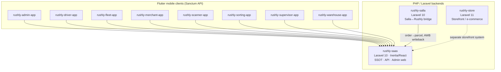
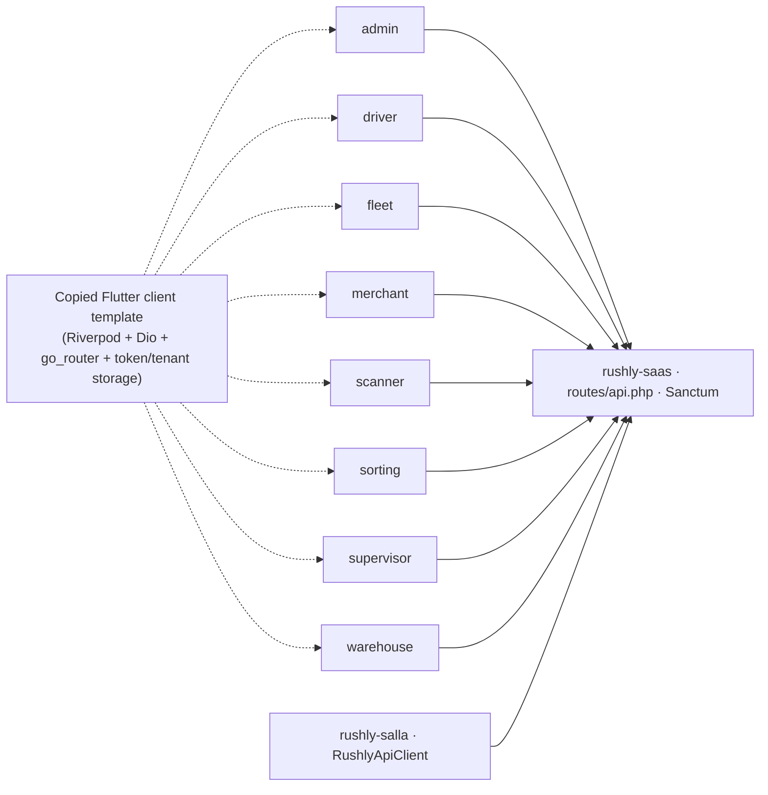

# 01 — Workspace Inventory

> **Phase 1 deliverable.** A complete inventory of the Rushly enterprise logistics
> platform workspace: every in-scope project, its technology stack, its
> project/app/library structure, packages, shared code, configuration, build
> systems, git state, and quantitative statistics.
>
> **Grounding:** Compiled by reading the actual codebase on **2026-07-27**. Every
> non-trivial claim cites a real source file. `rushly-saas` is the **single source
> of truth** (SSOT); all Flutter apps are clients of its API. Where an existing doc
> conflicts with code, a **⚠️ Doc vs Code** note is added — code wins.
>
> See the shared grounding brief: [`docs/_CONTEXT_BRIEF.md`](_CONTEXT_BRIEF.md).

---

## 1. Scope — what is (and is not) in the workspace

The filesystem root `/var/www` contains **~40 directories**, but only **11** belong
to the Rushly ecosystem and are in scope for this documentation set. All other
folders (`3plink`, `aayin`, `alowaifi`, `apbs`, `bna`, `bostaexpress`, `faalia`,
`gosmle`, `html`, `investorshub*`, `juthoori`, `lewa`, `mahmoud`, `navix*`,
`oqooledu`, `rakizah-web`, `rewashmultivendor`, `shifitt`, `sudanmart`, `tajco`,
`taskflow`, `thecarage`, `try*`, `unifex`, `useatheer`, `velto-admin`, `zeina`,
etc.) are unrelated tenants/projects and are **ignored** per the context brief.

> **Note on `navix-rushly-saas`:** a directory named `/var/www/navix-rushly-saas`
> exists but is **not** one of the 11 canonical Rushly projects listed in the
> context brief. It is treated as out of scope. Not analyzed further in the current
> documentation set.

### The 11 Rushly projects

| # | Project | Path | Type | Role |
|---|---|---|---|---|
| 1 | **rushly-saas** | `/var/www/rushly-saas` | Laravel 10 + Inertia/React | Backend platform, REST API, admin web. **SSOT.** |
| 2 | rushly-admin-app | `/var/www/rushly-admin-app` | Flutter | Back-office / admin mobile client |
| 3 | rushly-driver-app | `/var/www/rushly-driver-app` | Flutter | Last-mile driver mobile client |
| 4 | rushly-fleet-app | `/var/www/rushly-fleet-app` | Flutter | Fleet driver (trips/vehicle/fuel/maintenance) |
| 5 | rushly-merchant-app | `/var/www/rushly-merchant-app` | Flutter | Merchant portal mobile client |
| 6 | rushly-scanner-app | `/var/www/rushly-scanner-app` | Flutter | Universal barcode scanner client |
| 7 | rushly-sorting-app | `/var/www/rushly-sorting-app` | Flutter | Sorting-center operations client |
| 8 | rushly-supervisor-app | `/var/www/rushly-supervisor-app` | Flutter | Field supervisor client |
| 9 | rushly-warehouse-app | `/var/www/rushly-warehouse-app` | Flutter | Warehouse / WMS operations client |
| 10 | rushly-store | `/var/www/rushly-store` | Laravel 11 | Standalone storefront / e-commerce system |
| 11 | rushly-salla | `/var/www/rushly-salla` | Laravel 10 | Standalone Salla ↔ Rushly bridge app |

**Composition:** 3 PHP/Laravel backends + 8 Flutter mobile/tablet clients.

---

## 2. Workspace tree (high level)



All 8 Flutter apps authenticate against and consume `rushly-saas`'s API
(`routes/api.php`, Sanctum). `rushly-salla` is a thin standalone Laravel app that
bridges Salla's OAuth/webhook events into `rushly-saas`. `rushly-store` is a
separate full e-commerce platform (its own vast payment/gateway stack).

---

## 3. rushly-saas (SSOT) — the platform

Path: `/var/www/rushly-saas` · **~1.1 GB** on disk (includes `vendor/`, `node_modules/`, storage).

### 3.1 Technology stack (from `composer.json`)

| Layer | Technology | Version pin |
|---|---|---|
| Framework | **Laravel** | `^10.10` |
| Language | PHP | `^8.1` (ext: curl, gd, json, mysqli, pdo) |
| Multi-tenancy | **stancl/tenancy** | `^3.7` |
| API auth | **laravel/sanctum** | `^3.2` |
| Server rendering | **inertiajs/inertia-laravel** | `^2.0` |
| Route helper (JS) | **tightenco/ziggy** | `^2.6` |
| Social login | laravel/socialite | `^5.8` |
| Excel import/export | maatwebsite/excel | `^3.1` |
| PDF | carlos-meneses/laravel-mpdf | `^2.1` |
| Barcode | milon/barcode | `^10.0` |
| Activity log | spatie/laravel-activitylog | `^4.7` |
| Salla OAuth | salla/ouath2-merchant | `^2.0` |
| SMS | twilio/sdk `^8.2`, vonage/client `^4.0` | |
| Payments | stripe/stripe-php `^10.17`, cartalyst/stripe-laravel `^15.0`, srmklive/paypal `^3.0`, razorpay `^2.8`, anandsiddharth/laravel-paytm-wallet `^2.0`, obydul/laraskrill `^1.2` | |
| HTTP | guzzlehttp/guzzle | `^7.2` |
| Env editor | geo-sot/laravel-env-editor | `^2.1` |
| UI toasts | brian2694/laravel-toastr `^5.57`, realrashid/sweet-alert `^7.0` | |

> **⚠️ Doc vs Code:** `README.md` claims **"Laravel 12"**. `composer.json` pins
> `laravel/framework ^10.10`. **Code wins — this is Laravel 10.** (Confirmed in the
> context brief and `composer.json`.)

**Frontend build (`package.json`):** Vite (`laravel-vite-plugin`), React 18
(`@vitejs/plugin-react`), Inertia React (`@inertiajs/react`), TailwindCSS +
`tailwindcss-animate` + `tailwind-merge`, Radix UI primitives
(`@radix-ui/react-dropdown-menu`, `-label`, `-slot`), `lucide-react` icons,
`class-variance-authority`, `clsx`, `ziggy-js`. Legacy Bootstrap + Sass +
`@popperjs/core` are also present (mid-migration Blade→React). Build config:
`vite.config.js`, `tailwind.config.js`.

> **⚠️ Doc vs Code (mid-migration):** The frontend is mid-migration from Blade to
> React+Inertia — evidenced by **both** Bootstrap/Sass **and** React/Tailwind in
> `package.json`, and the migration notes in `docs/inertia/`. `resources/js`
> contains `Pages/` (Inertia, **191 `.jsx` pages**), `Layouts/`, `Components/`,
> `Tour/`, `merchant.jsx`, `app.js`, `bootstrap.js`.

### 3.2 Application structure — scoped module namespaces

`app/` uses **domain-scoped module namespaces** (`App\<Module>\`) alongside classic
Laravel folders. Top-level `app/` directories:

```
app/
├── Commerce/      generic storefront ingestion (feature-flagged)  → see COMMERCE.md
├── Oms/           canonical Order model + normalization pipeline   → see OMS.md
├── Fulfillment/   FulfillmentRouter + strategies                  → see FULFILLMENT.md
├── Shipping/      generic courier abstraction (Logestechs first)  → docs/shipping-architecture.md
├── Wms/           warehouse observers/events (models in Models/Backend/Wms)
├── Salla/         Salla-specific bridge (ApiClient, 5 models)
├── Qoyod/ Daftra/ Odoo/   per-tenant accounting sync              → see ACCOUNTING.md
├── Logestechs/    legacy Logestechs settings model
├── Services/      60 services incl. legacy 3PL (Aramex/Jet/Zajel/…), Performance/, Zatca/
├── Http/          Controllers (219), Middleware, Services (Push/Sms/…), Requests
├── Models/        120 model files (core + Backend/* + Backend/Wms/*)
├── Enums/         ParcelStatus, NdrStatus, … + Wms/ Zatca/ Wallet/ subfolders
├── Jobs/ Observers/ Providers/ Repositories/ Library/ Support/ Traits/
├── Console/ Exceptions/ Exports/ Imports/ Mail/
```

Each business module follows a consistent internal shape:
`Contracts/ + DTOs/ + Providers|Strategies/ + Services/ + Models/ + Events/ + Listeners/`.
See the module deep-dives in sibling docs (Phase 2+) and the module doc set
under [`docs/modules/`](modules/).

### 3.3 Quantitative inventory (ground truth, verified 2026-07-27)

| Metric | Count | Verified by |
|---|---|---|
| Migrations | **191** | `find database/migrations -name '*.php'` |
| Model files | **120** | `find app/Models -name '*.php'` |
| Controllers | **219** | `find app/Http/Controllers -name '*.php'` |
| PHP files in `app/` | **996** | `find app -name '*.php'` |
| PHP LOC in `app/` | **~94,376** | `find app -name '*.php' -exec cat` |
| Services | ~60 | (context brief; `app/Services/` + module `Services/`) |
| Inertia React pages | **191 `.jsx`** | `resources/js/Pages/**` |

### 3.4 Routes

`routes/` (sizes are the current on-disk byte sizes; line counts per brief):

| File | Size | Purpose |
|---|---|---|
| `web.php` | ~178 KB | Web + admin routes (largest; Blade + Inertia) |
| `superadmin.php` | ~45 KB | SuperAdmin panel routes |
| `api.php` | ~29 KB | Mobile/API routes (Sanctum) — consumed by all 8 Flutter apps |
| `tenant.php` | 720 B | Tenant-context routes |
| `console.php` | 592 B | Artisan/scheduler |
| `channels.php` | 558 B | Broadcast channels |
| `admin.php` | 276 B | Admin stub |

Every route is enumerated in the repo-root [`ROUTES.md`](../ROUTES.md) (244 KB).

### 3.5 Configuration

`config/` (30 files). Rushly-specific / notable:

- `features.php` — **feature flags** read via `config('features.<flag>')`. Env key
  convention `FEATURE_<UPPER_SNAKE>`. Currently:
  `commerce_layer` (`FEATURE_COMMERCE_LAYER`, default **off**) and
  `login_otp` (`FEATURE_LOGIN_OTP`, default **off**). Source: `config/features.php`.
- `tenancy.php` — stancl/tenancy config (per-subdomain identification,
  `{tenant}.rushly.tech`, central `127.0.0.1`/`localhost`, UUID tenant IDs,
  `tenant_model = App\Models\Tenant`).
- `commerce.php`, `fulfillment.php`, `shipping.php`, `salla.php`, `rxcourier.php`,
  `merchantpayment.php`, `barcode.php`, `pdf.php`, `excel.php`, `paypal.php` —
  module/integration config.
- Standard Laravel: `app.php`, `auth.php`, `cache.php`, `queue.php`, `session.php`,
  `database.php`, `broadcasting.php`, `filesystems.php`, `mail.php`, `logging.php`,
  `cors.php`, `sanctum.php`, `services.php`, `hashing.php`, `view.php`, `env-editor.php`, `toastr.php`.

Defaults (per context brief): **queue** default `sync`, **cache** default `file`,
**broadcast** default `null`. Web guard = `session` (only `web` guard defined in
`config/auth.php`). `.env.example` present.

### 3.6 Build system & assets

- **PHP:** Composer (`composer.json` / `composer.lock`), Artisan (`console.php`).
- **JS:** Vite + Laravel Vite plugin; Tailwind + PostCSS + Autoprefixer.
- Assets served from `resources/` (js, css, views) → compiled to `public/build`.

### 3.7 Git

| Field | Value |
|---|---|
| Remote | `git@repo-27017:haniusif/rushly-saas.git` |
| Branch | `main` |
| Commits | **264** |
| Latest | `6c33cea` (2026-07-27) — "salla → wms: create fulfillment on order.created for delivery+fulfillment tenants" |

By far the most active repo (264 commits vs single digits for the mobile apps),
consistent with its SSOT role.

---

## 4. Flutter client apps (8)

All eight apps share a near-identical architecture and stack — they are thin,
feature-sliced clients of the `rushly-saas` API. They are **not** monorepo packages;
each is an independent Git repo and Flutter project.

### 4.1 Shared Flutter stack

| Aspect | Value | Source |
|---|---|---|
| Dart SDK | `>=3.3.0 <4.0.0` | each `pubspec.yaml` `environment.sdk` |
| Flutter | `>=3.19.0` | `environment.flutter` |
| Version | `1.0.0+1` (all 8) | `pubspec.yaml` `version` |
| State mgmt | **flutter_riverpod** `^2.5.1` | all apps |
| HTTP | **dio** `^5.5.0` + `pretty_dio_logger` | all apps |
| Routing | **go_router** `^14.2.0` | all apps |
| Secure storage | `flutter_secure_storage` `^9.2.2` (tokens) | all apps |
| Prefs | `shared_preferences` `^2.2.3` | all apps |
| i18n | `intl` `^0.20.2` + `flutter_localizations` | all apps |
| Config | `flutter_dotenv` `^5.1.0` (env/base-URL) | all apps |
| Fonts | `google_fonts` `^6.2.1` | all apps |

**Standard `lib/` layout** (verified in `rushly-admin-app`):

```
lib/
├── main.dart
├── core/     api (dio_client, api_endpoints, providers), config (env),
│             error (api_exception), push (push_service),
│             storage (token_storage, tenant_storage), utils
├── shared/   l10n (app_localizations, locale_controller, language toggle),
│             router, theme
└── features/ one folder per feature slice (see per-app tables below)
```

The `core/storage/tenant_storage.dart` + `token_storage.dart` pair implements the
per-tenant + Sanctum-token auth against `rushly-saas`. `core/push/push_service.dart`
wires Firebase Cloud Messaging.

### 4.2 Per-app inventory

| App | Dart files | Dart LOC | Feature slices | Extra packages beyond shared |
|---|---:|---:|---|---|
| **rushly-admin-app** | 69 | 8,507 | approvals, auth, dashboard, drivers, fraud, hub_cash, hubs, map, merchants, parcels, support, tenant, wms | `fl_chart`, `cached_network_image`, `firebase_core/messaging`, `flutter_local_notifications`, `permission_handler`, `url_launcher`, `package_info_plus`, `flutter_map`+`latlong2`, `mobile_scanner` |
| **rushly-driver-app** | 55 | 6,054 | auth, cash, dashboard, earnings, ndr, notifications, parcels, support, tenant | Largest dep set (35): `geolocator`, `google_maps_flutter`, `flutter_map`, `flutter_background_service`, `image_picker`, `mobile_scanner`, `reactive_forms`, `freezed_annotation`+`json_annotation`+`riverpod_annotation`, `connectivity_plus`, firebase, `flutter_svg` |
| **rushly-fleet-app** | 26 | 2,560 | auth, dashboard, fleet, tenant | Minimal (12 deps) — Trips / Vehicle / Fuel / Maintenance tabs |
| **rushly-merchant-app** | 71 | 8,054 | auth, dashboard, fraud, invoices, ndr, news, parcels, payments, reports, settings, shops, store_connections, support, tenant | `fl_chart`, `pdf`+`printing` (AWB/label printing), `file_picker`, `csv`, `share_plus`, `image_picker`, firebase, `flutter_map` |
| **rushly-scanner-app** | 27 | 1,994 | auth, dashboard, scanner, tenant | `mobile_scanner` (Scan + History tabs) |
| **rushly-sorting-app** | 30 | 2,232 | auth, dashboard, sorting, tenant | `mobile_scanner` (Scan In / Sort / Bags / Routes) |
| **rushly-supervisor-app** | 33 | 2,518 | assignments, auth, dashboard, drivers, exceptions, reports, tenant | Minimal (12 deps) |
| **rushly-warehouse-app** | 36 | 4,252 | auth, dashboard, fulfillment, tenant, wms | `mobile_scanner` (Receive / Pick&Pack / Inventory / Dispatch) |

**Totals:** 8 apps · **347 Dart files** · **~36,171 Dart LOC**.

### 4.3 Flutter apps — Git

| App | Remote (`git@github.com:haniusif/…`) | Commits | Latest commit |
|---|---|---:|---|
| rushly-admin-app | `rushly-admin-app.git` | 8 | `b4f802e` 2026-07-17 — parcel tracking map + WMS cycle count + damage reports |
| rushly-driver-app | `rushly-driver-app.git` | 7 | `b7c4458` 2026-07-17 — notifications inbox |
| rushly-fleet-app | `rushly-fleet-app.git` | 2 | `40bcc48` 2026-07-17 — F1–F4 tabs |
| rushly-merchant-app | `rushly-merchant-app.git` | 7 | `c32363d` 2026-07-17 — signin screen polish |
| rushly-scanner-app | `rushly-scanner-app.git` | 2 | `62f4465` 2026-07-17 — universal Scan + History |
| rushly-sorting-app | `rushly-sorting-app.git` | 2 | `ec1ab92` 2026-07-17 — Scan In/Sort/Bags/Routes |
| rushly-supervisor-app | `rushly-supervisor-app.git` | 2 | `cb2811a` 2026-07-17 — feature-complete (4 tabs) |
| rushly-warehouse-app | `rushly-warehouse-app.git` | 2 | `55fff0c` 2026-07-17 — Receive/Pick&Pack/Inventory/Dispatch |

All on `main`, all last touched 2026-07-17 (a single build wave). Note the mobile
apps are on **GitHub** (`github.com`), while `rushly-saas` and `rushly-store` are on
private Git hosts (`repo-27017`, `repo-9931`).

For app roles, tab layouts, and screen inventories see the repo-root
[`MOBILE_APPS.md`](../MOBILE_APPS.md) and [`RUSHLY_APPS_OVERVIEW.md`](../RUSHLY_APPS_OVERVIEW.md).

---

## 5. rushly-store — storefront / e-commerce system

Path: `/var/www/rushly-store`. A **separate, full e-commerce platform** (not merely a
theme). It is the heaviest dependency stack in the workspace.

### 5.1 Stack (from `composer.json`)

| Layer | Technology | Version |
|---|---|---|
| Framework | **Laravel** | `^11.9` |
| Language | PHP | `^8.2` |
| API auth | laravel/sanctum | `^4.0` |
| Roles | santigarcor/laratrust | `^8.3` |
| JWT | php-open-source-saver/jwt-auth | `^2.6` |
| 2FA | pragmarx/google2fa(-laravel) | `^8.0` / `^2.2` |
| AWS/S3 | aws/aws-sdk-php `^3.321`, league/flysystem-aws-s3-v3 | `^3.28` |
| PDF/QR/barcode | barryvdh/laravel-dompdf `^3.0`, simplesoftwareio/simple-qrcode `^4.2`, milon/barcode `^11.0` | |
| DataTables | yajra/laravel-datatables | `^11.0` |
| Theming | qirolab/laravel-themer `^2.3`, konekt/html | `^6.5` |
| Installer | rachidlaasri/laravel-installer | `^4.1` |
| AI | orhanerday/open-ai | `^5.2` |
| Email/IMAP | resend/resend-laravel `^1.4`, webklex/laravel-imap | `^5.3` |
| WooCommerce | codexshaper/laravel-woocommerce | `^3.0` |
| Model caching | genealabs/laravel-model-caching | `^12.0` |
| Impersonate | lab404/laravel-impersonate | `^1.7` |

**Payment gateways (very extensive):** Stripe `^15.8`, PayPal, Braintree,
Authorize.Net, Mollie, Midtrans, MercadoPago, Paddle (cashier-paddle), PayTabs,
Razorpay/PayTM, Xendit, Yookassa, CoinGate, FedaPay, iyzico, PhonePe, eSewa, Khalti,
PayHere, PayNow, MyFatoorah, Skrill, plus SMS gateways (Twilio, Clockwork,
Melipayamak, SMSGatewayMe, tzsk/sms). This breadth signals a white-label,
multi-region SaaS storefront.

**Frontend build:** Vite + TailwindCSS (`@tailwindcss/forms`), **Alpine.js**,
Axios, PostCSS, Autoprefixer (`package.json` — no runtime `dependencies`, all
dev-tooling). This app is **Blade + Alpine**, not React/Inertia (unlike rushly-saas).

### 5.2 Inventory

| Metric | Count |
|---|---|
| PHP files in `app/` | **412** |
| PHP LOC in `app/` | **~94,663** |
| Model files | **85** |
| Migrations | **109** |

`app/` folders include integration-specific dirs: `Coingate/`, `Khalti/`, `Xendit/`,
`Delivery/`, `Classes/`, `DataTables/`, `Facades/`, `Helper/`, `Libraries/`,
`Package/`, plus standard Laravel (`Http/`, `Models/`, `Services/`, `Events/`,
`Listeners/`, `Jobs/`, `Notifications/`, `Mail/`, `Exports/`, `Providers/`, `Traits/`, `View/`).

### 5.3 Git

| Field | Value |
|---|---|
| Remote | `git@repo-9931:haniusif/rushly-store.git` |
| Branch | `main` |
| Commits | **26** |
| Latest | `14b39f44` (2026-07-27) — "fix(seeder): prepend storage/ to demo product image paths" |

---

## 6. rushly-salla — Salla ↔ Rushly bridge

Path: `/var/www/rushly-salla`. A **minimal standalone Laravel app** whose sole job is
to bridge the Salla e-commerce platform to `rushly-saas` (OAuth, webhooks,
order→parcel creation, AWB writeback, public `/track/{tn}`).

### 6.1 Stack (from `composer.json`)

| Layer | Technology | Version |
|---|---|---|
| Framework | **Laravel** | `^10.10` |
| Language | PHP | `^8.1` |
| API auth | laravel/sanctum | `^3.3` |
| Salla OAuth | **salla/ouath2-merchant** | `^2.0` |
| HTTP | guzzlehttp/guzzle | `^7.2` |
| Tinker | laravel/tinker | `^2.8` |

Deliberately lean — **6 require entries**. Frontend build is bare Vite + Axios (no
UI framework). This app has no admin UI of its own; it is integration plumbing.

### 6.2 Inventory

| Metric | Count |
|---|---|
| PHP files in `app/` | **46** |
| PHP LOC in `app/` | **~1,900** |

`app/` structure: `Console/`, `Exceptions/`, `Http/` (Controllers, Middleware,
Kernel), `Jobs/`, `Models/`, `Providers/`, `Services/`, `Webhooks/`.

- **Models (6):** `SallaMerchant`, `SallaOrder`, `SallaSettings`, `SallaShipment`,
  `SallaWebhookLog`, `User` — under `app/Models/`.
- **Services (2):** `SallaApiClient.php` (calls Salla) and `RushlyApiClient.php`
  (calls rushly-saas). This pair *is* the bridge: Salla → Rushly.
- `app/Webhooks/` handles inbound Salla webhook events.

Routes: `web.php` (1.2 KB, incl. tracking), `api.php`, `console.php`, `channels.php`.

> **Note:** `rushly-salla` is the standalone bridge app. The `rushly-saas` codebase
> *also* contains an `app/Salla/` module (ApiClient, SallaWmsFulfillmentService,
> ParcelCreationService, 5 models) and an `app/Commerce/` Salla provider — the
> in-platform Salla integration. The two coexist; the standalone app predates /
> complements the in-platform Commerce layer. See [`COMMERCE.md`](../COMMERCE.md).

### 6.3 Git

| Field | Value |
|---|---|
| Remote | `git@github.com:haniusif/rushly-salla.git` |
| Branch | `main` |
| Commits | **8** |
| Latest | `a8e14e0` (2026-05-27) — "server updates" |

The oldest "latest commit" of any project (2026-05-27), consistent with it being a
stable, low-churn bridge. (Git required a `safe.directory` exception due to
`www-data` ownership.)

---

## 7. Shared code & cross-project relationships

There is **no shared package/monorepo** — each project is an independent repo with
its own dependency tree. Sharing happens through **contracts, not code**:

- **The API contract.** `rushly-saas` `routes/api.php` (Sanctum) is the shared
  surface for all 8 Flutter apps. Each app hard-codes the same auth pattern
  (`core/storage/token_storage.dart`, `tenant_storage.dart`) and the same
  Dio/Riverpod/go_router stack, effectively a **copied — not packaged — client
  template**. Divergence risk: each app pins its own package versions independently.
- **Tenancy contract.** All apps and bridges pass a tenant context; `rushly-saas`
  resolves it via stancl/tenancy (per-subdomain, UUID tenant IDs).
- **Salla bridge contract.** `rushly-salla`'s `RushlyApiClient.php` speaks to
  `rushly-saas`'s API; the platform also ingests Salla via its own `app/Commerce/`.
- **WMS/fulfillment contract.** The warehouse & admin Flutter apps' `wms`/
  `fulfillment` feature slices map onto `rushly-saas`'s `app/Wms/`, `app/Fulfillment/`,
  and `app/Models/Backend/Wms/*`.



---

## 8. Aggregate statistics (whole workspace)

### 8.1 Lines of code (application code only; excludes vendor/node_modules)

| Project | Language | Files | LOC |
|---|---|---:|---:|
| rushly-saas (`app/`) | PHP | 996 | ~94,376 |
| rushly-saas (`Pages`) | JSX/React | 191 | (pages) |
| rushly-store (`app/`) | PHP | 412 | ~94,663 |
| rushly-salla (`app/`) | PHP | 46 | ~1,900 |
| rushly-admin-app | Dart | 69 | 8,507 |
| rushly-driver-app | Dart | 55 | 6,054 |
| rushly-merchant-app | Dart | 71 | 8,054 |
| rushly-warehouse-app | Dart | 36 | 4,252 |
| rushly-supervisor-app | Dart | 33 | 2,518 |
| rushly-fleet-app | Dart | 26 | 2,560 |
| rushly-sorting-app | Dart | 30 | 2,232 |
| rushly-scanner-app | Dart | 27 | 1,994 |
| **PHP subtotal** | PHP | **1,454** | **~190,939** |
| **Dart subtotal** | Dart | **347** | **~36,171** |

> LOC counts are raw `wc -l` over `*.php` in `app/` (backends) and `*.dart` in `lib/`
> (Flutter). They exclude blade/jsx views, config, migrations' body counts beyond
> `app/`, tests, and third-party code. The JSX page count (191) is files, not LOC.

### 8.2 Languages & frameworks present

| Language | Where |
|---|---|
| PHP 8.1–8.2 | rushly-saas (`^8.1`), rushly-store (`^8.2`), rushly-salla (`^8.1`) |
| Dart (SDK 3.3+) | 8 Flutter apps |
| JavaScript / JSX | rushly-saas React/Inertia frontend |
| Blade (PHP templates) | rushly-saas (legacy), rushly-store, rushly-salla |

| Framework / runtime | Where |
|---|---|
| Laravel 10 | rushly-saas, rushly-salla |
| Laravel 11 | rushly-store |
| Inertia.js + React 18 + Tailwind | rushly-saas |
| Bootstrap + Sass (legacy) | rushly-saas |
| Alpine.js + Tailwind (Blade) | rushly-store |
| Flutter 3.19+ / Riverpod | 8 mobile apps |
| stancl/tenancy (multi-tenant) | rushly-saas |
| Vite | all 3 backends |
| Composer | all 3 backends |
| Firebase Cloud Messaging | admin, driver, merchant apps |

### 8.3 Git activity summary

| Project | Host | Commits | Latest |
|---|---|---:|---|
| rushly-saas | `repo-27017` (private) | 264 | 2026-07-27 |
| rushly-store | `repo-9931` (private) | 26 | 2026-07-27 |
| rushly-salla | github.com | 8 | 2026-05-27 |
| rushly-admin-app | github.com | 8 | 2026-07-17 |
| rushly-driver-app | github.com | 7 | 2026-07-17 |
| rushly-merchant-app | github.com | 7 | 2026-07-17 |
| rushly-fleet-app | github.com | 2 | 2026-07-17 |
| rushly-scanner-app | github.com | 2 | 2026-07-17 |
| rushly-sorting-app | github.com | 2 | 2026-07-17 |
| rushly-supervisor-app | github.com | 2 | 2026-07-17 |
| rushly-warehouse-app | github.com | 2 | 2026-07-17 |

All repos are on branch `main`. Owner org: `haniusif`.

---

## 9. Key findings (Phase 1)

1. **Three backends, one truth.** Only `rushly-saas` is the SSOT. `rushly-store` is a
   fully separate e-commerce platform (Laravel 11, huge payment stack) and
   `rushly-salla` is a lean bridge (Laravel 10, 6 deps). They are on **different
   Laravel major versions and different Git hosts** — treat them as independent
   deployables, not one codebase.
2. **Laravel version conflict.** `rushly-saas` `README.md` says Laravel 12; the code
   is Laravel **10** (`^10.10`). Documented as ⚠️ Doc vs Code (§3.1). The two
   companion backends are 10 (salla) and 11 (store) respectively.
3. **Frontend mid-migration.** `rushly-saas` carries both legacy Blade/Bootstrap and
   new React/Inertia/Tailwind — 191 Inertia pages already exist (§3.1).
4. **Flutter apps are a copied template, not a shared package.** 8 apps share an
   identical Riverpod+Dio+go_router core but pin dependencies independently — a
   maintenance/divergence risk worth a shared package in future (§7).
5. **Scale.** ~191k PHP LOC across backends + ~36k Dart LOC across 8 apps; 191
   migrations, 120 models, 219 controllers in the SSOT alone (§8).

---

## 10. Related documents

- [`_CONTEXT_BRIEF.md`](_CONTEXT_BRIEF.md) — shared grounding brief.
- Repo-root primary sources: [`ARCHITECTURE.md`](../ARCHITECTURE.md),
  [`ROUTES.md`](../ROUTES.md), [`RUSHLY_APPS_OVERVIEW.md`](../RUSHLY_APPS_OVERVIEW.md),
  [`MOBILE_APPS.md`](../MOBILE_APPS.md), [`INTEGRATIONS.md`](../INTEGRATIONS.md),
  [`COMMERCE.md`](../COMMERCE.md), [`OMS.md`](../OMS.md),
  [`FULFILLMENT.md`](../FULFILLMENT.md), [`ACCOUNTING.md`](../ACCOUNTING.md),
  [`3PL.md`](../3PL.md), [`GAPS.md`](../GAPS.md).
- Later phase docs (to be produced): architecture, modules, database, API, etc.

---

## Sources

Files and directories actually opened / inspected on 2026-07-27:

- `docs/_CONTEXT_BRIEF.md` (shared brief)
- `ls /var/www` (workspace enumeration)
- `rushly-saas/composer.json`, `rushly-saas/package.json`, `rushly-saas/config/features.php`
- `rushly-saas/app/` (top-level module listing), `rushly-saas/config/` (30 files),
  `rushly-saas/routes/` (file sizes), `rushly-saas/resources/js/` (Pages/Layouts/Components/Tour)
- `rushly-saas/tailwind.config.js`, `rushly-saas/vite.config.js`, `rushly-saas/.env.example`
- `find` counts: `app/**/*.php` (996), `database/migrations` (191), `app/Models` (120),
  `app/Http/Controllers` (219), `resources/js/Pages/**/*.jsx` (191)
- `rushly-store/composer.json`, `rushly-store/package.json`, `rushly-store/app/` listing,
  `rushly-store/database/migrations`, `rushly-store/app/Models`
- `rushly-salla/composer.json`, `rushly-salla/package.json`, `rushly-salla/app/` listing,
  `rushly-salla/app/Models/`, `rushly-salla/app/Services/`, `rushly-salla/routes/`
- Per Flutter app: `pubspec.yaml` (name/version/env/dependencies),
  `lib/` structure (`rushly-admin-app/lib/{core,shared,features}`),
  `find lib -name '*.dart'` counts for all 8 apps
- `git -C <project> log -1 / rev-list --count / remote -v / branch` for all 11 projects
