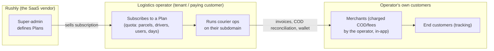
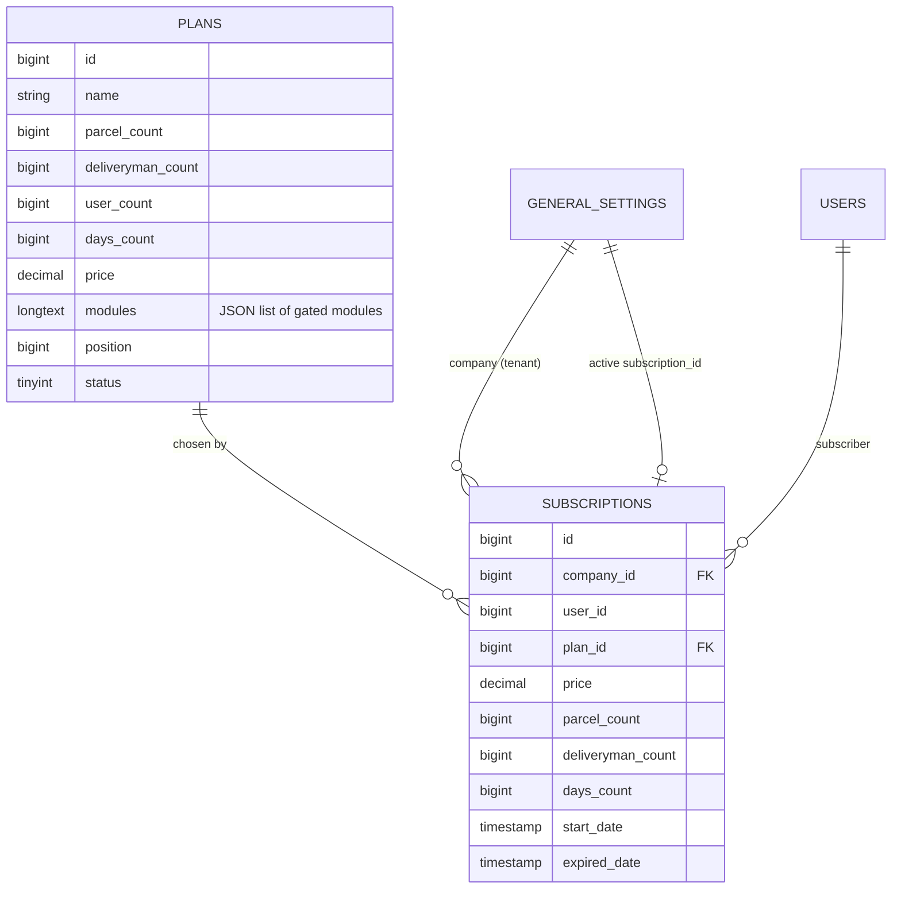
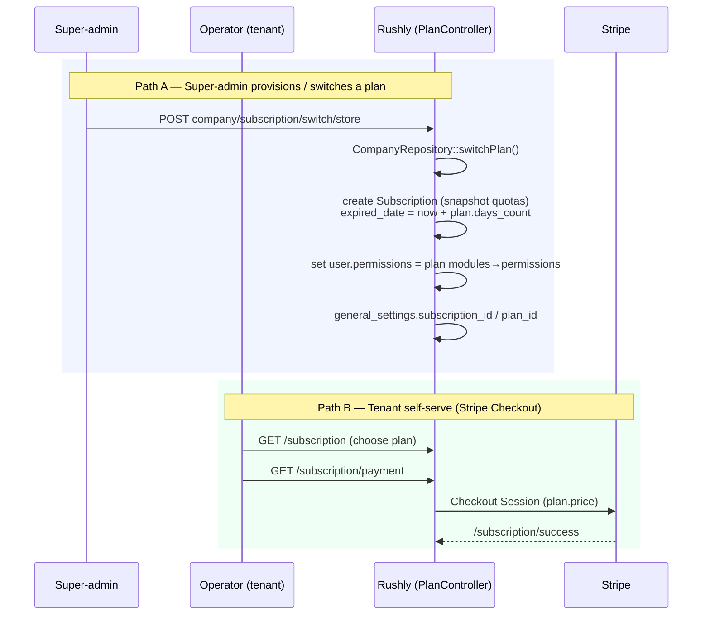

# 02 — Project Overview

> **Scope:** Product identity, mission/vision, core business, target market, customer
> segments, business model, competitive positioning, USPs, and revenue model of the
> **Rushly** platform.
>
> **Single source of truth:** `/var/www/rushly-saas` (the Laravel backend + admin web).
> The Flutter apps and the storefront bridges are *clients* of this platform. The
> Next.js site under `marketing/` is **positioning copy** — it is aspirational marketing
> and is explicitly flagged where it diverges from what the code implements.
>
> See sibling docs: [01 — Architecture / System Map](05-System-Architecture.md) ·
> [03 — Modules](11-Modules.md) · [06 — Database](06-Database.md) ·
> [Super-admin & Billing](../super-admin.md).

---

## 1. Product identity

| Attribute | Value | Source |
|---|---|---|
| Product name | **Rushly** (marketed as **"Rushly OS" / The AI Logistics Operating System"**) | `marketing/app/layout.tsx` (`title`), `marketing/components/sections/nav.tsx` (logo + "OS" badge) |
| Legal / corporate name | **Rushly Technologies** | `marketing/components/sections/footer.tsx` (© line) |
| Category | Multi-tenant **logistics + order-management SaaS** (courier / 3PL / fulfillment operations platform) | `README.md` line 3, `RUSHLY_APPS_OVERVIEW.md` §0 |
| Marketing domain | `rushly.tech` | `marketing/app/layout.tsx` (`metadataBase`) |
| Tenant domains | `{tenant}.rushly.tech` (per-subdomain identification) | `README.md` line 95, `config/tenancy.php` |
| Production API host (referenced by bridges) | `https://admin.rushly-logistic.com/api/v10/...` | `RUSHLY_APPS_OVERVIEW.md` §3 |

**One-line description (from the codebase):**
> "Multi-tenant logistics + order-management platform. Laravel monolith with a
> scoped-namespace module architecture (`app/<Module>/`)." — `README.md` line 3

**One-line description (from marketing positioning):**
> "One platform for every shipment, every warehouse, every merchant, every courier.
> Orchestrate orders, warehouses, fleets and last-mile — powered by AI, built for
> enterprise scale." — `marketing/components/sections/hero.tsx` lines 48–51

> ⚠️ **Doc vs Code — product surface vs marketing surface.** The marketing site presents
> Rushly as a polished, AI-first, multi-product enterprise suite ("8 products", "AI
> Dispatch", "Smart Routing", "ETA Prediction", SOC 2 / ISO 27001 / GDPR badges, 82M+
> orders, named enterprise logos). The **shipping codebase does not yet implement** the
> AI/ML dispatch, routing, or ETA-prediction models, and the trust/compliance badges,
> customer logos, and headline metrics are illustrative copy, not verifiable in the
> repo. Treat §1's marketing rows as *positioning*, and §3/§4/§7 (grounded in code) as
> *what actually ships today*.

---

## 2. Mission & vision

There is **no formal `MISSION.md` / `VISION.md`** in the repo — *"Not found in the
current codebase."* The mission/vision below is **reconstructed from the marketing
copy** (the only place the company states intent) and cross-checked against what the
code actually does.

### Mission (as expressed in marketing copy)
> "Rushly replaces the spreadsheet, the WhatsApp group and the six admin panels you
> check every morning." — `marketing/components/sections/platform-overview.tsx` line 139

> "One system of record for logistics." — same file, line 138

The consistent theme across the site is **consolidation**: replace a fragmented stack of
point tools (OMS + WMS + fleet + carrier panels + spreadsheets) with a single
system-of-record that every role in the supply chain logs into.

### Vision (as expressed in marketing copy)
> "The AI Logistics Operating System … built for enterprise scale."
> — `marketing/app/layout.tsx`, `marketing/components/sections/hero.tsx`

> "Start your logistics transformation today … Live in 24 hours — no re-implementation
> required." — `marketing/components/sections/final-cta.tsx` lines 468–474

The aspirational end-state is an **AI operations layer** ("running your business at 3am")
that auto-dispatches, routes, forecasts and detects fraud —
`marketing/components/sections/ai-automation.tsx` lines 350–369.

> ⚠️ **Doc vs Code.** The "AI operations layer" is a *vision statement*, not a shipped
> capability. The nearest thing in code is `app/Services/Performance/AiInsightsService.php`
> (KPI/analytics insights) — there is no dispatch/routing/ETA ML model in the repo.
> See [03 — Modules](11-Modules.md).

---

## 3. Core business — what Rushly actually is

Rushly is a **B2B SaaS platform sold to logistics operators** (courier companies, 3PLs,
fulfillment centers, warehouse operators). A single Laravel deployment is **multi-tenant**:
one logistics company = one *tenant* = one subdomain, running the full operational
workflow in isolation.

```mermaid
flowchart TB
    subgraph central["Central domain (rushly.tech)"]
        MKT["Marketing site<br/>(Next.js, marketing/)"]
        SIGNUP["Sign-up + Super-admin<br/>routes/superadmin.php"]
    end

    subgraph tenant["Per-tenant subdomain ({tenant}.rushly.tech)"]
        OPS["Operational app:<br/>parcels · hubs · drivers · merchants<br/>payments · accounting · WMS · support"]
    end

    subgraph clients["Client apps (separate repos)"]
        FLUTTER["8 Flutter apps<br/>(driver, merchant, warehouse,<br/>sorting, scanner, fleet, admin, supervisor)"]
        BRIDGES["Storefront bridges<br/>(Salla · Zid · WooCommerce · Shopify)"]
    end

    MKT --> SIGNUP
    SIGNUP -->|provisions tenant + subscription| tenant
    clients -->|/api/v10/* (Sanctum + apiKey)| tenant
```
*Sources: `RUSHLY_APPS_OVERVIEW.md` §0, `README.md`, `_CONTEXT_BRIEF.md`.*

### What each tenant runs
Each tenant company operates the full courier/logistics workflow — *"parcels, hubs,
delivery men, merchants, payments, reporting, accounting, payroll, support, fraud,
news"* (`RUSHLY_APPS_OVERVIEW.md` line 63). Concretely, the code implements:

| Domain | Where in code |
|---|---|
| **Order management (OMS)** — canonical order model + normalization pipeline | `app/Oms/` — see [`OMS.md`](../OMS.md) |
| **Storefront ingestion (Commerce)** — Salla/Zid/Woo/Shopify orders → Rushly | `app/Commerce/` — see [`COMMERCE.md`](../COMMERCE.md) |
| **Fulfillment routing** — WMS / 3PL-dropship / merchant-self strategies | `app/Fulfillment/` — see [`FULFILLMENT.md`](../FULFILLMENT.md) |
| **Shipping / courier abstraction** — outbound carriers, AWB, tracking | `app/Shipping/` — see [`docs/shipping-architecture.md`](shipping-architecture.md) |
| **Warehouse management (WMS)** — bin-level stock, GRN, picking, cycle counts | `app/Wms/`, `app/Models/Backend/Wms/*` |
| **Last-mile / parcel lifecycle** — 34-state `ParcelStatus`, NDR, COD | `app/Enums/ParcelStatus.php`, `app/Support/ParcelStatusHelper` |
| **Merchant portal** — pickups, invoices, wallet, statements, returns | `DashbordController` MERCHANT branch — see [`MERCHANT_DASHBOARD.md`](../MERCHANT_DASHBOARD.md) |
| **Accounting sync** — Qoyod / Daftra / Odoo per-tenant | `app/Qoyod/`, `app/Daftra/`, `app/Odoo/` — see [`ACCOUNTING.md`](../ACCOUNTING.md) |
| **Saudi e-invoicing (ZATCA Phase 1)** | `app/Services/Zatca/`, `app/Enums/Zatca/*` |
| **Performance / KPI analytics** | `app/Services/Performance/*` |

### The eight marketed "products"
The marketing site frames the platform as **"Eight products. One platform. One
contract."** (`marketing/components/sections/products.tsx` line 23). These are *feature
bundles* of the single monolith, not separate deployables:

| Marketed product | Backs onto (code) |
|---|---|
| Rushly OMS | `app/Oms/` |
| Rushly WMS | `app/Wms/` + `app/Models/Backend/Wms/*` |
| Rushly Fleet | fleet/driver features (client: `rushly-fleet-app`) |
| Rushly Fulfillment | `app/Fulfillment/` |
| Rushly Delivery | last-mile / `app/Shipping/` + parcel lifecycle |
| Rushly Merchant | merchant panel (`MerchantPanel/` controllers) |
| Rushly Customer | public tracking + notifications |
| Rushly API | `routes/api.php` (`/api/v10/*`) |

*Source: `marketing/components/sections/products.tsx` lines 6–15; module mapping from
`README.md` "Quick module map" and `_CONTEXT_BRIEF.md` §"Module architecture".*

---

## 4. Target market & customer segments

### 4.1 Primary customer (who pays Rushly)
The **paying customer is the logistics operator** — the company that signs up as a
tenant. The self-serve subscription flow (`PlanController@subscription`) and the
super-admin company provisioning (`CompanyController@switchSubscription`) are the two
ways a tenant is created and billed. See §7.

### 4.2 Segments (from marketing `Solutions`)
The site defines six go-to-market segments (`marketing/components/sections/solutions.tsx`
lines 63–70):

| Segment | Positioning line | Marketed KPI (illustrative) |
|---|---|---|
| **Merchants** | "Sell everywhere, ship from one panel." | +38% shipped orders / month |
| **Fulfillment centers** | "Onboard merchants in a day." | 3× orders per FTE |
| **Delivery companies** | "Fleet, hubs, drivers, cash." | −24% km driven |
| **Warehouses** | "Bin-level control, batch/expiry, transfers." | 99.6% inventory accuracy |
| **Enterprises** | "Multi-region, SSO, roles, audit, SLA." | 99.99% availability |
| **SMEs** | "Start free, scale as you grow." | Live in under 24h |

By industry vertical the nav lists **E-commerce, Retail, Grocery, Pharma**
(`marketing/components/sections/nav.tsx` lines 707–716).

### 4.3 Geography
Marketing claims **MENA-first** with global reach: *"Real teams running real ops on
Rushly — in Saudi, the Gulf, and now four continents"*
(`marketing/components/sections/testimonials.tsx` line 593); FAQ lists regional
deployments in **KSA, UAE, EU and North America** (`faq.tsx` line 508).

**Code corroboration of the MENA focus** (this part *is* grounded):
- Saudi e-invoicing (**ZATCA**) is implemented — `app/Services/Zatca/`.
- First storefront integrations are the Saudi platforms **Salla** and **Zid** —
  `app/Commerce/` (Salla provider), `app/Salla/`, and the `rushly-salla` / `rushly-zid`
  bridge apps.
- Regional accounting providers **Qoyod** (Saudi) and **Daftra** are wired —
  `app/Qoyod/`, `app/Daftra/`.
- Arabic (AR) is a first-class UI language with RTL support — `lang/ar/*`, bilingual
  onboarding tours (`RUSHLY_APPS_OVERVIEW.md` line 106).

> ⚠️ **Doc vs Code.** The customer roster ("Aramex, SMSA, DHL, FedEx…" marquee in
> `trusted-by.tsx`; testimonials from "Nassab Logistics", "Baytha 3PL", "Ateer
> Fulfillment") and the segment KPIs are **marketing placeholders** — none are present
> as data, seeds, or config in the repo. The MENA/e-commerce focus, by contrast, *is*
> supported by real integrations (Salla, Zid, ZATCA, Qoyod).

### 4.4 End-users of the platform (roles, per tenant)
Distinct from *customers*, these are the operational roles that log in. Each maps to a
`UserType` enum value (`app/Enums/UserType.php`) and/or a companion Flutter app:

| Role | Where |
|---|---|
| Super-admin (SaaS owner) | `UserType::SUPER_ADMIN`, `routes/superadmin.php` |
| Tenant admin / ops | `UserType::ADMIN`, `Backend/` controllers |
| Hub manager | `HubPanel/` controllers |
| Merchant | `UserType::MERCHANT`, `MerchantPanel/`, `rushly-merchant-app` |
| Delivery man / driver | `rushly-driver-app` |
| Fleet driver, warehouse, sorting, scanner, supervisor | respective Flutter apps (`_CONTEXT_BRIEF.md` ecosystem table) |

---

## 5. Business model

Rushly is a **B2B multi-tenant SaaS** with a **plan-based subscription** business model,
layered on top of a **single shared database** with application-level tenant scoping.



Two revenue layers must not be conflated:

1. **Rushly → operator (the SaaS revenue).** Subscription plans. This is Rushly
   Technologies' actual revenue. Covered in §7.
2. **Operator → merchants (the operator's revenue, facilitated by Rushly).** Delivery
   charges, COD collection/reconciliation, packaging/VAT/fragile fees, merchant wallets,
   invoices and statements. This flows through the merchant dashboard
   (`active_amounts`, `fees_amounts`, `delivery_amounts` in
   [`MERCHANT_DASHBOARD.md`](../MERCHANT_DASHBOARD.md)) but is the *tenant's* money, not
   Rushly's. It is a product capability, not Rushly's business model.

### Key model characteristics
- **Land-and-expand / modular adoption.** *"Adopt what you need today, turn on the rest
  when you're ready. No new logins, no re-implementation."*
  (`marketing/components/sections/products.tsx` line 24). Mechanically, a plan carries a
  `modules` JSON list that gates which admin permission-modules the tenant's users get
  (see §7.3).
- **Multi-tenant, shared-DB.** `stancl/tenancy` with per-subdomain identification and
  per-model `company_id` scoping (`scopeCompanywise()`) — `_CONTEXT_BRIEF.md` §Stack,
  `RUSHLY_APPS_OVERVIEW.md` line 80.
- **Ecosystem play.** Free companion apps (8 Flutter clients) and free storefront bridges
  (Salla/Zid/Woo/Shopify) drive adoption and lock-in around the paid platform. The
  bridges are documented in [`RUSHLY_APPS_OVERVIEW.md`](../RUSHLY_APPS_OVERVIEW.md).

---

## 6. Competitive positioning, advantages & USPs

### 6.1 Positioning statement
Rushly positions itself **one layer above carriers and shipping APIs** — as the operating
system that *orchestrates* them:

> "Rushly is the operating system that sits above your carriers. Rushly runs OMS, WMS,
> Fleet, Fulfillment and the merchant/customer portals — with carrier and channel
> integrations baked in." — `marketing/components/sections/faq.tsx` line 505

### 6.2 Unique selling propositions (as marketed)
| USP | Evidence in copy | Grounded in code? |
|---|---|---|
| **All-in-one, one contract** — OMS+WMS+Fleet+Fulfillment+portals in one system | `products.tsx` L23, `platform-overview.tsx` L138 | ✅ Modules exist as one monolith |
| **Multi-tenant / multi-hub / multi-carrier from day one** | `faq.tsx` L506 | ✅ `stancl/tenancy`, `app/Shipping/` provider factory, hubs |
| **Bring-your-own fleet + 3PL + public carriers, routed side-by-side** | `faq.tsx` L506 | ✅ `app/Fulfillment/` strategies (WMS / 3PL-dropship / merchant-self) |
| **Native e-commerce integrations** (Salla, Zid, Shopify, Woo, Magento, OpenCart) | `faq.tsx` L509, `integrations.tsx` | ⚠️ Salla/Zid/Woo/Shopify have real bridges; Magento/OpenCart **not found in codebase** |
| **Fast time-to-value** — merchants live in <24h, FCs in 2–4 wks, enterprise 6–12 wks | `faq.tsx` L507, `solutions.tsx` L69 | ⚠️ Onboarding tours exist (`TOURS.md`) but timelines are claims |
| **Developer platform** — REST + signed/retried webhooks + SDKs (Node/PHP/Python/Go) | `integrations.tsx`, `nav.tsx` Developers menu | ⚠️ `/api/v10/*` + webhooks are real; multi-language SDKs & `api.rushly.tech/v1` **not found in codebase** |
| **AI operations layer** — dispatch, routing, ETA, forecasting, fraud | `ai-automation.tsx` | ❌ Not implemented (only `AiInsightsService`); aspirational |
| **Compliance/enterprise** — SOC 2, ISO 27001, GDPR, SSO/SAML, on-prem/VPC | `hero.tsx`, `faq.tsx`, `pricing.tsx` | ❌ Not evidenced in repo; ZATCA e-invoicing *is* real |

### 6.3 Grounded competitive advantages (verifiable in code)
These are the differentiators that the **codebase actually backs**:

1. **Genuinely integrated ingestion→fulfillment→shipping pipeline.** A storefront webhook
   flows *Commerce → OMS `OrderReceived` → Fulfillment strategy → Shipping/WMS/vendor*
   as first-class, event-driven modules (`README.md` "Standard flows";
   `app/Commerce/`, `app/Oms/`, `app/Fulfillment/`, `app/Shipping/`).
2. **Pluggable, config-driven extensibility.** *"Adding a new capability is a 'drop a
   class in, add a config row' exercise — no business-logic changes"* (`README.md` L68).
   Each module follows `Contracts/ + DTOs/ + Providers|Strategies/ + Services/ + …`.
3. **MENA-native compliance & integrations** — ZATCA e-invoicing, Salla/Zid, Qoyod/Daftra
   (§4.3).
4. **Broad first-party app ecosystem** — 8 role-specific Flutter apps covering the whole
   operational floor (driver, warehouse, sorting, scanner, fleet, supervisor, merchant,
   admin) — `_CONTEXT_BRIEF.md` ecosystem table.
5. **Rich parcel state machine** — 34-state `ParcelStatus` with NDR handling, richer than
   the native status vocabularies of the storefronts it integrates with (e.g. it must
   register custom `rushly-*` statuses in WooCommerce because Woo's 8 native states can't
   represent it) — `RUSHLY_APPS_OVERVIEW.md` line 178.

---

## 7. Revenue model (grounded in code)

Rushly's revenue is **subscription plans sold to tenants**. The model is implemented by
three tables and a permission-gating mechanism.

### 7.1 Data model



**`plans`** — the sellable catalog. Columns: `name`, `parcel_count`,
`deliveryman_count`, `user_count`, `days_count`, `price`, `description`, `position`,
`modules` (JSON), `status`.
*Sources: `database/migrations/2023_12_24_102349_create_plans_table.php`,
`database/migrations/2026_07_05_100001_add_user_count_to_plans.php`,
`app/Models/Backend/Superadmin/Plan.php`.*

**`subscriptions`** — a tenant's active/historical subscription. It **snapshots** the
plan's quotas at purchase time and computes an `expired_date`.
*Source: `database/migrations/2023_12_28_090620_create_subscriptions_table.php`,
`app/Models/Backend/Subscription.php`.*

**`subscribes`** — unrelated to billing: it is a newsletter/email capture table
(`email`, `company_id`). Do not confuse with `subscriptions`.
*Source: `database/migrations/2022_08_17_145916_create_subscribes_table.php`,
`app/Models/Subscribe.php`.*

> Note: `subscriptions.company_id` and `plan.company_id` references point at the
> **`general_settings`** table — i.e. a "company" *is* the tenant's general-settings row.
> `settings()->id` is the current tenant/company id (`app/Models/Subscribe.php` scope).

### 7.2 How a subscription is created (two paths)



**Path A — administered provisioning.** `CompanyController@switchSubscription` /
`switchSubscriptionStore` → `CompanyRepository::switchPlan()` creates a `Subscription`,
snapshots `parcel_count / deliveryman_count / user_count / days_count / price` from the
plan, sets `start_date = now()` and `expired_date = now()->addDays(plan.days_count)`, and
writes `general_settings.subscription_id` + `plan_id`.
*Source: `app/Repositories/Superadmin/Company/CompanyRepository.php::switchPlan()`.*

**Path B — self-serve via Stripe Checkout.** `PlanController@subscriptionPayment` builds a
`\Stripe\Checkout\Session` from the tenant's own Stripe secret key (read from `Setting`
where `key='stripe_secret_key'`), gated behind a `stripe_status` toggle;
`success`/`cancel` land on `StripePaymentSuccess` / `StripePaymentCancel`.
*Sources: `app/Http/Controllers/Backend/Superadmin/PlanController.php` lines 249–302,
381–419; `routes/web.php` lines 303–311.*

### 7.3 Enforcement — plans gate access three ways
1. **Time.** `subscriptionCheckMiddleware` redirects any non-super-admin whose
   subscription has lapsed to `subscription.index`. The `subscriptionCheck()` helper
   returns `true` (or remaining days) only while `today <= expired_date`.
   *Sources: `app/Http/Middleware/subscriptionCheckMiddleware.php`,
   `app/Http/Helper/Helper.php` lines 1125–1151.*
2. **Feature modules.** A plan's `modules` JSON list is converted to user permissions on
   subscribe (`switchPlan()` → `$user->permissions = $this->permissions($plan)`),
   so the plan literally controls which sidebar modules the tenant can use.
3. **Quotas.** `parcel_count`, `deliveryman_count`, `user_count`, `days_count` are carried
   onto the subscription as usage ceilings (the plan's advertised limits).

### 7.4 The only seeded plan
The repo seeds exactly one plan out of the box — **"Vendor"** (drivers + TMS + reports):
`parcel_count=5000`, `deliveryman_count=100`, `user_count=5`, `days_count=30`,
`price=0`, `modules=['dashboard','delivery_man','tms','reports']`.
*Source: `database/migrations/2026_07_05_100005_seed_vendor_plan.php`.* All other plans
are created by the super-admin at runtime (`plan/create`, `plan/edit` — see
[`super-admin.md`](../super-admin.md)).

### 7.5 Marketed pricing (illustrative only)
The marketing site shows three tiers (`marketing/components/sections/pricing.tsx`):

| Tier | Monthly | Yearly | Positioning |
|---|---|---|---|
| **Starter** | $149 | $119 | "For growing merchants" — OMS + Merchant Portal, ≤5k orders/mo, 3 integrations |
| **Scale** *(most popular)* | $749 | $599 | "For 3PL & fulfillment" — + WMS/Fleet/Fulfillment, ≤100k orders/mo, AI Dispatch, 4h SLA |
| **Enterprise** | Custom | Custom | "For national logistics" — unlimited, SSO/SAML, VPC/on-prem, 99.99% SLA |

> ⚠️ **Doc vs Code.** These prices, tiers, USD currency, order-volume limits, and the
> "Save 20% yearly" toggle are **hard-coded marketing copy** in `pricing.tsx`. They do
> **not** correspond to the actual plan model, which is (a) admin-defined at runtime,
> (b) priced in the **tenant's own currency** (`GeneralSettings.currency`), (c)
> quota-shaped as `parcel_count / deliveryman_count / user_count / days_count` — there is
> no "orders/month" or per-seat concept in the schema — and (d) ships with only the free
> **Vendor** plan seeded. The real billing surface is the super-admin Plan CRUD +
> Stripe Checkout described in §7.2–7.3.

---

## 8. Stack & scale (the platform behind the business)

| Layer | Reality (code wins) | Source |
|---|---|---|
| Framework | **Laravel `^10.10`** | `composer.json` line 22 |
| Language | **PHP `^8.1`** | `composer.json` line 8 |
| Multi-tenancy | `stancl/tenancy ^3` (per-subdomain, shared DB, UUID tenant ids) | `_CONTEXT_BRIEF.md` §Stack |
| API auth | `laravel/sanctum ^3` + shared `apiKey` header (`CheckApiKeyMiddleware`) | `RUSHLY_APPS_OVERVIEW.md` line 102 |
| Frontend | Inertia.js + React (mid-migration from Blade), Vite | `_CONTEXT_BRIEF.md` §metrics |
| Payments (libs present) | Stripe, PayPal, Razorpay, PayTM, Skrill | `composer.json` / `_CONTEXT_BRIEF.md` |
| Scale | 191 migrations · 120 models · 219 controllers · 60 services · ~94k LOC in `app/` | `_CONTEXT_BRIEF.md` §metrics |

> ⚠️ **Doc vs Code — repeated version conflict.** `README.md` line 3 and
> `RUSHLY_APPS_OVERVIEW.md` (§0, lines 58, 69–72) claim **"Laravel 12 / PHP 8.4 /
> tenancy v3.7"**. The marketing "enterprise scale" framing reinforces the impression of
> a bleeding-edge stack. **`composer.json` is authoritative: Laravel `^10.10`, PHP
> `^8.1`.** Use those numbers.

> ⚠️ **Doc vs Code — frontend.** `RUSHLY_APPS_OVERVIEW.md` line 73 says the frontend is
> "Blade + pre-compiled `public/css`/`public/js` (Vite config exists but unused)". This
> is outdated: the app is **mid-migration to Inertia + React** with **191 `.jsx` pages**
> and Vite in active use (`_CONTEXT_BRIEF.md` §metrics; `docs/inertia/`). Both statements
> capture a moment in a moving migration — current state is *Blade → Inertia/React,
> partially complete*.

---

## 9. Summary

Rushly is a **MENA-first, multi-tenant B2B logistics SaaS** ("The AI Logistics Operating
System") that sells **subscription plans to logistics operators** (couriers, 3PLs,
fulfillment centers, warehouses). Its core business is consolidating the
ingestion→OMS→fulfillment→shipping→last-mile→merchant/customer stack into one Laravel
monolith with a pluggable, config-driven module architecture, surrounded by a free
ecosystem of 8 Flutter apps and 4 storefront bridges. Revenue is realized through
time-boxed, module-gated, quota-shaped **plans** (`plans` → `subscriptions`), enforced by
`subscriptionCheckMiddleware` and billed either by super-admin provisioning or tenant
self-serve **Stripe Checkout**. The marketing site's AI capabilities, compliance badges,
customer logos, headline metrics, and fixed USD pricing are **positioning, not shipped
reality** — the grounded differentiators are the genuinely integrated commerce-to-carrier
pipeline, MENA-native compliance/integrations (ZATCA, Salla/Zid, Qoyod/Daftra), the broad
first-party app ecosystem, and the rich 34-state parcel lifecycle.

---

## Sources

**Existing docs (primary):**
- `README.md`, `RUSHLY_APPS_OVERVIEW.md`, `MERCHANT_DASHBOARD.md`, `super-admin.md`
- `docs/_CONTEXT_BRIEF.md`
- Cross-referenced: `OMS.md`, `COMMERCE.md`, `FULFILLMENT.md`, `ACCOUNTING.md`,
  `docs/shipping-architecture.md`, `TOURS.md`

**Marketing site (positioning copy):**
- `marketing/app/layout.tsx`, `marketing/app/page.tsx`
- `marketing/components/sections/hero.tsx`, `pricing.tsx`, `products.tsx`, `solutions.tsx`,
  `platform-overview.tsx`, `performance.tsx`, `integrations.tsx`, `ai-automation.tsx`,
  `faq.tsx`, `testimonials.tsx`, `trusted-by.tsx`, `final-cta.tsx`, `nav.tsx`, `footer.tsx`

**Revenue-model code (ground truth):**
- `database/migrations/2023_12_24_102349_create_plans_table.php`
- `database/migrations/2023_12_28_090620_create_subscriptions_table.php`
- `database/migrations/2022_08_17_145916_create_subscribes_table.php`
- `database/migrations/2026_07_05_100001_add_user_count_to_plans.php`
- `database/migrations/2026_07_05_100005_seed_vendor_plan.php`
- `app/Models/Backend/Superadmin/Plan.php`, `app/Models/Backend/Subscription.php`,
  `app/Models/Subscribe.php`
- `app/Http/Controllers/Backend/Superadmin/PlanController.php`
- `app/Repositories/Superadmin/Company/CompanyRepository.php` (`switchPlan()`)
- `app/Http/Middleware/subscriptionCheckMiddleware.php`
- `app/Http/Helper/Helper.php` (`subscriptionCheck()`, lines 1125–1151)
- `routes/web.php` (subscription routes, lines 303–311)

**Stack verification:**
- `composer.json` (Laravel `^10.10`, PHP `^8.1`)
