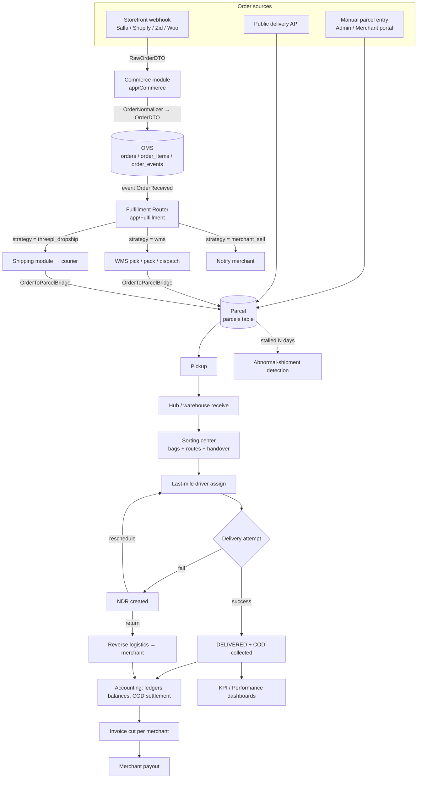
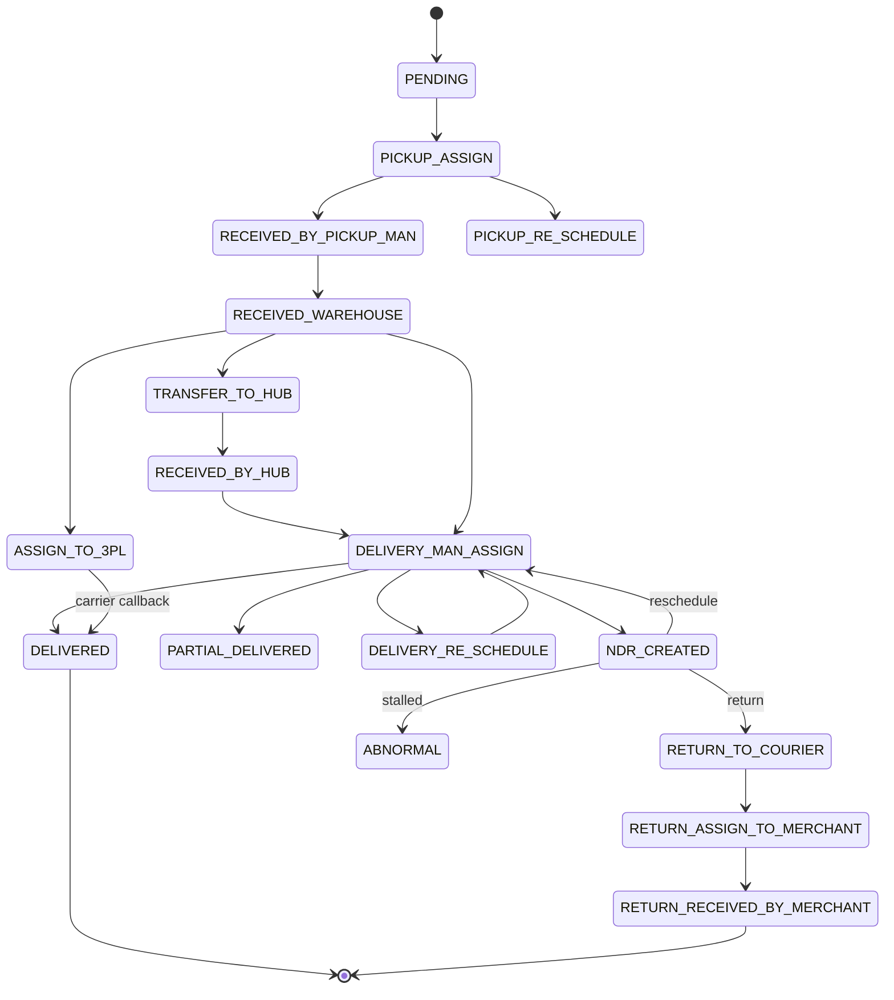
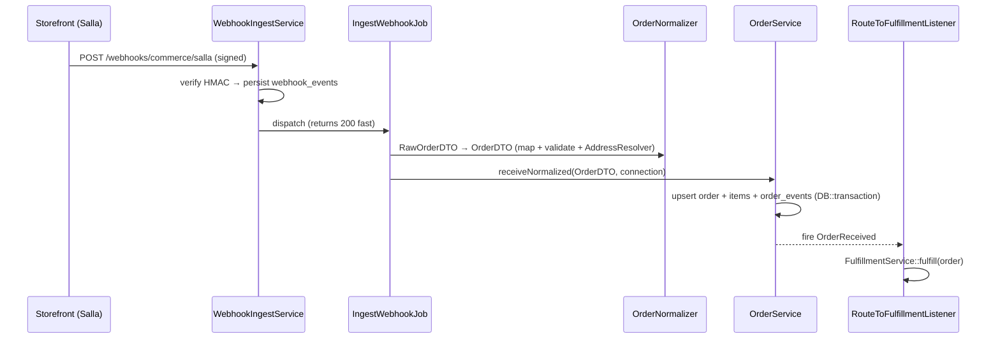
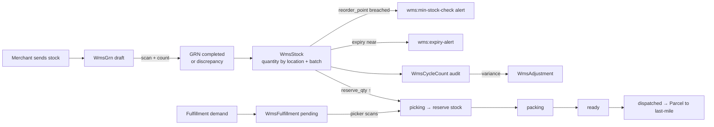
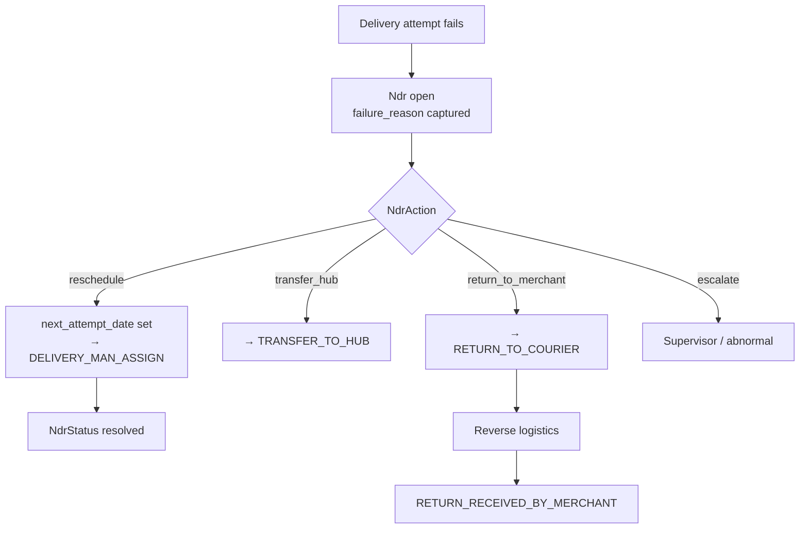
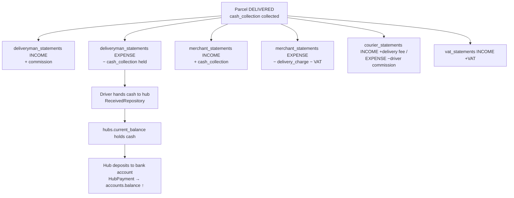

# 03 — Business Domain (Phase 3)

> **Scope**: what the Rushly logistics business actually *does*, mapped to the code that implements it. This is the domain map: OMS, storefront ingestion, fulfillment routing, warehouse operations (WMS), inventory, 3PL / courier hand-off, last-mile transportation, fleet, sorting, scanning, driver management, pickup, delivery, tracking, proof-of-delivery, returns / reverse logistics, NDR (non-delivery reports), abnormal-shipment detection, COD / cash collection, billing / accounting / settlement, invoices, KPI / analytics, and the automation & business rules that tie them together.
>
> `rushly-saas` (`/var/www/rushly-saas`) is the **single source of truth**. Every Flutter app is a thin client of its API. See [`_CONTEXT_BRIEF.md`](_CONTEXT_BRIEF.md) and [`01-Workspace-Inventory.md`](01-Workspace-Inventory.md) for the ecosystem-wide picture.
>
> Every non-trivial claim below cites a real source file. Where an existing repo doc conflicts with code, a **⚠️ Doc vs Code** note is added.

---

## 1. What the business is

Rushly is a **multi-tenant enterprise logistics / last-mile delivery platform** ("courier + fulfillment SaaS"). A single Laravel monolith runs many independent logistics operators ("companies" / tenants), each on its own subdomain (`{tenant}.rushly.tech`), each isolated by a `company_id` column and query-time scopes rather than separate databases (`config/tenancy.php` has `DatabaseTenancyBootstrapper` disabled — see `VENDOR.md` §6).

A tenant operates one or more of these business lines:

| Business line | What it means | Primary domain object |
|---|---|---|
| **Courier / last-mile** | Pick up a parcel from a merchant, move it through hubs, deliver to the end customer, collect cash (COD), settle money back to the merchant. | `Parcel` (`app/Models/Backend/Parcel.php`) |
| **Order management (OMS)** | Ingest orders from storefronts (Salla, Shopify, …), normalize to one canonical shape. | `Order` (`app/Oms/Models/Order.php`) |
| **Fulfillment routing** | Decide *how* an order ships: own warehouse, drop-ship via a courier, or leave it to the merchant. | `Fulfillment` (`app/Fulfillment/Models/Fulfillment.php`) |
| **Warehouse / 3PL fulfillment (WMS)** | Receive stock (GRN), store it by location, hold inventory, pick/pack/dispatch on demand, cycle-count, handle damage. | `Wms*` models (`app/Models/Backend/Wms/*`) |
| **3PL / carrier hand-off** | Sub-contract the physical move to an external courier (Aramex, J&T, Zajel, DeliveryPanda, Logestechs, iMile). | `Parcels_3pl` + `Shipment` |
| **Money / settlement** | Ledgers, per-party running balances, COD collection, merchant payouts, invoices, VAT, e-invoicing. | statement/ledger tables (`ACCOUNTING.md`) |

The Flutter apps each own a slice of the operation: admin back-office, last-mile driver, fleet driver, merchant portal, universal scanner, sorting center, supervisor, and warehouse ops (see `_CONTEXT_BRIEF.md` table and [`RUSHLY_APPS_OVERVIEW.md`](../RUSHLY_APPS_OVERVIEW.md)).

---

## 2. End-to-end domain map

---

## 3. Core domain objects and their state machines

### 3.1 `Parcel` — the operational unit of the courier business

`app/Models/Backend/Parcel.php`. The parcel is the center of the last-mile world. Everything downstream of pickup (bulk actions, tracking, timelines, COD, 3PL, WMS surfacing) is keyed on `Parcel`, **not** the newer OMS `Order` — the OMS/Fulfillment layer deliberately bridges back onto `Parcel` to preserve that surface (`app/Fulfillment/Bridges/OrderToParcelBridge.php`, idempotent via `parcels.oms_order_id`).

Key fields (`$fillable`): `company_id`, `merchant_id`, `merchant_shop_id`, `customer_name/phone/address`, `cash_collection` (the COD amount), `delivery_charge`, `cod_charge`, `cod_amount`, `vat`, `vat_amount`, `total_delivery_amount`, `current_payable`, `tracking_id`, `status`, `first_hub_id`, `hub_id`, `city_id`, `area_id`, `delivery_type_id`, `number_of_attempts`, `number_of_boxes`, `reschedule_*`, geo-coords (`pickup_lat/long`, `customer_lat/long`).

**Tenant isolation** on `Parcel` is enforced by a **global scope** in `booted()` (not just the legacy `scopeCompanywise()`): every query is clamped to the current tenant's `company_id`, with guards for CLI/queue/cron contexts (where `tenant()` is null) and a `SUPER_ADMIN` bypass. Escape hatch: `Parcel::withoutGlobalScope('tenant')`. This is documented inline and matters for every cross-tenant sync job.

### 3.2 `ParcelStatus` — the master lifecycle enum

`app/Enums/ParcelStatus.php` defines **41 integer statuses**. They cover the full happy path, cancellation shadow-states, returns/RTO, partial delivery, 3PL, NDR, abnormal, and the WMS sub-pipeline:

| Range | Statuses | Meaning |
|---|---|---|
| Pickup | `PENDING(1)`, `PICKUP_ASSIGN(2)`, `PICKUP_RE_SCHEDULE(3)`, `RECEIVED_BY_PICKUP_MAN(4)` | Merchant→pickup driver hand-off |
| Warehouse/hub | `RECEIVED_WAREHOUSE(5)`, `TRANSFER_TO_HUB(6)`, `RECEIVED_BY_HUB(19)` | In the network |
| Delivery | `DELIVERY_MAN_ASSIGN(7)`, `DELIVERY_RE_SCHEDULE(8)`, `DELIVERED(9)`, `DELIVER(10)`, `PARTIAL_DELIVERED(32)` | Last mile |
| Returns / reverse | `RETURN_WAREHOUSE(11)`, `ASSIGN_MERCHANT(12)`, `RETURNED_MERCHANT(13)`, `RETURN_TO_COURIER(24)`, `RETURN_ASSIGN_TO_MERCHANT(26)`, `RETURN_MERCHANT_RE_SCHEDULE(27)`, `RETURN_RECEIVED_BY_MERCHANT(30)` | Reverse logistics / RTO |
| 3PL | `ASSIGN_TO_3PL(34)` | Handed to an external courier |
| Exception | `NDR_CREATED(35)`, `ABNORMAL(36)`, `CANCELLED(41)` | Trouble states |
| WMS sub-pipeline | `WMS_FULFILLMENT_PENDING(37)`, `WMS_PICKING(38)`, `WMS_PACKING(39)`, `WMS_READY_TO_SHIP(40)` | Warehouse pick/pack |
| `*_CANCEL` shadows | 14–18, 20–23, 25, 28, 29, 31, 33 | Each major state has a "cancelled-from-here" variant used to preserve where a parcel was when cancelled |

The `*_CANCEL` statuses are a **deliberate pattern**: rather than a single cancelled flag, each stage has its own cancel status so the audit trail records the stage of cancellation. `KpiAggregator` groups twelve of them into `CANCELLED_STATUSES` for reporting (`app/Services/Performance/KpiAggregator.php`).

> **⚠️ Doc vs Code — status transitions are code-driven, not a formal FSM.** There is no single transition table in the codebase; transitions are enforced imperatively across `app/Repositories/Parcel/ParcelRepository.php` (~2000+ lines), the 3PL sync jobs, and per-app controllers. The diagram above is the *observed* happy-path assembled from those call sites (`ParcelRepository::parcelDelivered`, the 3PL status mappers in `3PL.md`, and `AdminSortingController::handover`). Treat it as descriptive, not authoritative.

### 3.3 `Order` (OMS) — the canonical storefront order

`app/Oms/Models/Order.php`, table `orders`. Every order from any storefront becomes one `orders` row + N `order_items` + ≥1 `order_events` audit row. OMS enums: `OrderStatus` (PENDING/CONFIRMED/SHIPPED/CANCELLED/…), `FulfillmentStatus` (UNFULFILLED/PARTIAL/FULFILLED), `PaymentStatus` (UNPAID/PAID/REFUNDED) in `app/Oms/Enums/`. **OMS never creates parcels** — that is a Fulfillment concern (`OMS.md` §8).

### 3.4 `Fulfillment` — the routing decision + audit row

`app/Fulfillment/Models/Fulfillment.php`. One row per OMS order, tying it to whichever downstream did the physical work. Status machine: `pending → in_progress → completed | failed | cancelled` (`FULFILLMENT.md` §3).

---

## 4. Order ingestion → OMS (the inbound funnel)

Orders enter three ways:

1. **Storefront webhook** (`app/Commerce/`, feature-flagged by `config('features.commerce_layer')`, default off per `config/features.php`). `POST /webhooks/commerce/{providerCode}` → `WebhookIngestService` verifies the HMAC signature, persists a `webhook_events` row, and queues `IngestWebhookJob`. The job parses the provider payload → `RawOrderDTO` → `OrderNormalizer::normalize()` → canonical `OrderDTO` → `OrderService::receiveNormalized()` (`COMMERCE.md` §5, `OMS.md` §5). First provider: **Salla** (`app/Commerce/Providers/Salla/`, `app/Oms/Normalization/Providers/SallaOrderMapper.php`).
2. **Manual entry** — admin or merchant creates a `Parcel` directly via the web/merchant panels or the mobile merchant app.
3. **Public delivery API** — `POST /api/delivery/create` etc. (see `3PL.md`; ⚠️ currently unauthenticated — a known security issue).

Idempotency of storefront ingestion rests on `orders UNIQUE (connection_id, remote_order_id)` (`OMS.md` §3). A webhook fired twice → same key → no-op or diff-update, never a duplicate order.

---

## 5. Fulfillment routing (how an order ships)

On `OrderReceived`, `RouteToFulfillmentListener` calls `FulfillmentService::fulfill($order)` (`app/Fulfillment/Services/FulfillmentService.php`). The router (`FulfillmentRouter.php`, pure/side-effect-free) walks `fulfillment_routes` by ascending `priority`; every non-null condition column (`condition_merchant_id`, `condition_country`, `condition_source_channel`, `condition_min_amount`) must match (ANDed). First match wins. No match → `FulfillmentDefault` fallbacks → `config('fulfillment.default_strategy')` (`FULFILLMENT.md` §3, §5).

Three strategies are registered (`FULFILLMENT.md` §4):

| Strategy code | Class | Behavior |
|---|---|---|
| `wms` | `WmsFulfillmentStrategy` | Bridge Order→Parcel, create a `WmsFulfillment` row (`status=pending`), stamp `parcels.wms_fulfillment_id`, sit in `in_progress` while warehouse ops drive pick→pack→dispatch. Async. |
| `threepl_dropship` | `ThreePlDropshipStrategy` | Bridge Order→Parcel synchronously, queue the Shipping module's `CreateShipmentJob`, sit in `in_progress` until a shipment lifecycle event rolls it forward. Semi-async. |
| `merchant_self` | `MerchantSelfStrategy` | Notify the merchant; they fulfill themselves. Synchronous. |

`WmsFulfillmentStrategy::execute` (`app/Fulfillment/Strategies/WmsFulfillmentStrategy.php`) is fully idempotent: it short-circuits if `fulfillment.wms_fulfillment_id` is already set, reuses an existing `WmsFulfillment` tied to the parcel, and generates a `WMS-<date>-<random>` fulfillment number. A **vendor_direct** strategy is referenced in the contract but not yet implemented (`FULFILLMENT.md` §4).

> **⚠️ Doc vs Code — fulfillment events have no subscribers yet.** `FulfillmentRequested/Started/Completed/Failed` are fired but nothing listens (`FULFILLMENT.md` §9). Storefront writeback on `FulfillmentCompleted` is the intended-but-unbuilt next step. The whole Commerce/OMS/Fulfillment layer is feature-flag gated and not the default production path today.

---

## 6. Warehouse operations & inventory (WMS)

WMS models live at `app/Models/Backend/Wms/*`; enums at `app/Enums/Wms/*`; the reactive glue at `app/Wms/`. All models use a `Companywise` trait for tenant scoping and `spatie/laravel-activitylog`. The warehouse Flutter app (`rushly-warehouse-app`) drives it via `app/Http/Controllers/Api/V10/Wms/*` and `AdminWmsController`.

### 6.1 The warehouse data model

| Concern | Model | Key fields / enum |
|---|---|---|
| **Catalog** | `WmsProduct` | `sku`, `barcode`, `merchant_id`, `hub_id`, `unit` (`ProductUnit`: piece/box/kg/liter/pallet), `reorder_point`, `track_expiry`, `is_active` |
| **Bin locations** | `WmsLocation` | `zone/aisle/rack/shelf/bin`, `code` (auto-built), `type` (`LocationType`: standard/bulk/cold/hazmat), `capacity` |
| **On-hand stock** | `WmsStock` | `product_id`, `location_id`, `quantity`, `reserved_qty`, `batch_number`, `lot_number`, `expiry_date`; `available = quantity − reserved_qty` |
| **Inbound receiving** | `WmsGrn` + `WmsGrnItem` | Goods-Receipt Note. `status` (`GrnStatus`: draft/in_progress/completed/discrepancy), `received_by`, `reference_number` |
| **Pick/pack** | `WmsFulfillment` + `WmsFulfillmentItem` | `status` (`FulfillmentStatus`: pending/picking/packing/ready/dispatched/cancelled), `picker_id`, `packer_id`, `picked_at`, `packed_at`, `dispatched_at`, `sla_deadline` |
| **Outbound** | `WmsOutbound` + `WmsOutboundItem` | `type` (`OutboundType`: fulfillment/manual/transfer/return_to_merchant) |
| **Stock corrections** | `WmsAdjustment` | `reason` (`AdjustmentReason`: damage/count_correction/expiry/theft/system_error/other) |
| **Audits** | `WmsCycleCount` | scoped stock re-count with `assigned_to`, `zone`, `scope`, `status` |
| **Damage** | `WmsDamageReport` | `condition` (`ItemCondition`: good/damaged/expired) |

`PickingStrategy` enum (`FIFO / FEFO / LIFO`) drives which stock batch is consumed — **FEFO (First-Expired-First-Out)** matters for the cold/perishable side of the business (mirrors `ParcelType`'s FROZEN/DRYFOOD/GROCERY categories).

### 6.2 Warehouse lifecycle

### 6.3 Inventory → storefront sync (the reactive loop)

Whenever a `WmsStock` row's `quantity` changes, `WmsStockObserver` (`app/Wms/Observers/WmsStockObserver.php`) computes the product's **total across all locations** and fires `StockChanged` (`app/Wms/Events/StockChanged.php`). The Commerce module's `PushStockToConnectedChannelsListener` fans out to every connected storefront that supports inventory sync, filtered by `merchant_id` so one merchant's stock never leaks to another's storefront, and dispatches a `PushStockJob` per SKU (`COMMERCE.md` §6). Inactive products are skipped. This is how "sold on the storefront → reduced on the shelf → reflected back on the storefront" stays consistent.

### 6.4 WMS automation (cron)

From `app/Console/Kernel.php`:

- `wms:sla-check` — every 30 min. `WmsFulfillment::isSlaBreached()` flags fulfillments past `sla_deadline` not yet dispatched/cancelled.
- `wms:min-stock-check` — daily 07:00. Alerts on `quantity ≤ reorder_point`.
- `wms:expiry-alert` — daily 08:00. Alerts on near-expiry batches.
- `wms:auto-fulfillment` — every 15 min. Auto-materializes pending WMS work.

---

## 7. Pickup

A merchant requests a pickup via `PickupRequest` (`app/Models/PickupRequest.php`, `scopeCompanywise`). `PickupRequestType` enum: `REGULAR(1)` / `EXPRESS(2)`. A pickup driver is assigned, the parcel moves `PENDING → PICKUP_ASSIGN → RECEIVED_BY_PICKUP_MAN → RECEIVED_WAREHOUSE`. Pickup can be rescheduled (`PICKUP_RE_SCHEDULE`) or cancelled at each stage (the `*_CANCEL` shadow statuses). The driver app (`rushly-driver-app`) records these transitions through the V10 API.

---

## 8. Transportation, sorting, scanning & driver management

### 8.1 Delivery classification

- `DeliveryType` (`app/Enums/DeliveryType.php`): `SAMEDAY(1)`, `NEXTDAY(2)`, `SUBCITY(3)`, `OUTSIDECITY(4)` — the service level, and the basis for the on-time SLA proxy in performance scoring.
- `DeliveryTime` (`app/Enums/DeliveryTime.php`): `LAST_TIME(16)` (4pm cutoff hour), `SUBCITY(2 days)`, `OUTSIDECITY(3 days)` — the promised delivery window.
- `ParcelType` (`app/Enums/ParcelType.php`): `FRAGILE, LIQUID, GROCERY, FROZEN, DRYFOOD, SWEET, COSMETICS` — handling class, priced via `liquid_fragile_amount` on the parcel.

### 8.2 Sorting center

The sorting Flutter app (`rushly-sorting-app`: Scan In / Sort / Bags / Routes) is **mostly device-side**. `AdminSortingController` (`app/Http/Controllers/Api/V10/Admin/AdminSortingController.php`) owns only the server-backed operations, explicitly documented in its header:

- `GET /admin/sorting/lookup/{tracking}` — resolve a scanned AWB to its parcel (current hub, destination hub, COD).
- `POST /admin/sorting/handover` — bulk-transfer parcels: flips each to `TRANSFER_TO_HUB`, sets `transfer_hub_id`, writes a `ParcelEvent` per parcel. **HUB / INCHARGE users may only hand over parcels currently in their own hub** — a domain rule enforced server-side.
- `GET /admin/sorting/hubs` — destination picker.

Bags and routes are **ephemeral per-shift buckets tracked on the device**, not persisted server-side (per the controller docblock).

### 8.3 Scanning

There is no single "scan" model — scanning is a UI verb across apps. The universal scanner app (`rushly-scanner-app`) and warehouse/sorting apps resolve a scanned barcode (`tracking_id` / `WmsProduct.barcode`) via the lookup endpoints above and the WMS API controllers, then apply an operation (receive, sort, pick, handover, deliver).

### 8.4 Driver management, fleet & routing

- **Last-mile drivers** (`UserType::DELIVERYMAN(3)`) carry a `current_balance` and a `delivery_charge` (commission) — see accounting §11. Managed via `AdminDriverController` and the driver app.
- **Fleet** (`rushly-fleet-app`: Trips / Vehicle / Fuel / Maintenance) is a separate driver surface via `app/Http/Controllers/Api/V10/Fleet/*`.
- **Supervisors** (`rushly-supervisor-app`) own assignments, exceptions, and driver oversight.
- **Route optimization**: **Not found in the current codebase** as an algorithmic feature. There is no route-optimizer service. `HaversineDistance` (`app/Services/Performance/HaversineDistance.php`) computes point-to-point distance for KPI/proximity purposes, and `AdminMapController` serves map data, but no automated route sequencing / TSP solver exists. "Routes" in the sorting app are manual bag→route groupings.

---

## 9. 3PL / carrier hand-off (outbound sub-contracting)

When a tenant doesn't deliver a parcel itself, it hands it to an external courier. Two coexisting patterns (`3PL.md`):

- **Legacy** (`app/Services/*Service.php` + `parcels_3pl` table): **DeliveryPanda, Zajel, Aramex, J&T (Jet)**. Assigned via `ParcelController@ThirdPartyLogistics` (single) or `ParcelBulkActionController` (bulk, from `/admin/bulk_action`). Status comes back by cron-pull (`aramex:sync-tracking`, `jet:sync-tracking`, every 15 min) or webhook (Zajel). Each provider's status vocabulary is mapped to `ParcelStatus` in its sync job / webhook handler (full mapping tables in `3PL.md`).
- **New Shipping module** (`app/Shipping/`): **Logestechs** (production-verified). Proper abstraction — `ShippingProviderInterface`, per-tenant `shipping_connections`, queued `CreateShipmentJob`, generic `shipping:sync-tracking` (every 5 min), lifecycle events (`ShipmentCreated/Delivered/Cancelled/StatusChanged`) whose listeners (`UpdateParcelStatus`, `StoreTrackingHistory`, `SendShipmentNotifications`) roll the local parcel forward. See [`docs/shipping-architecture.md`](shipping-architecture.md).
- **Stub**: **iMile** (config + card only, no service class).

When a parcel goes to 3PL it moves to `ASSIGN_TO_3PL(34)`; the shared `Parcels_3pl` row stores `awb_number`, `awb_pdf` (label URL), `parcel_3pl_name`, `target_company_id` (Logestechs routing), and the raw `response`.

> **⚠️ Doc vs Code — real, documented multi-tenant risk.** `parcels_3pl` has **no `company_id`** (`3PL.md` known-issue #3). The Panda/Aramex/Jet sync jobs and the Zajel webhook resolve parcels by AWB alone and run unscoped; an AWB collision could deliver-and-settle **another tenant's parcel**. Several public `/api/delivery/*` and `/api/panda/schudule_tracking` routes are **unauthenticated** (#1). These are documented, open issues — do not treat the 3PL surface as hardened.

---

## 10. Tracking & proof of delivery (POD)

- **Inbound status sync** keeps the local parcel timeline current: per-provider cron/webhook mappers write `parcels_3pl.current_status` and translate to `ParcelStatus`; the Shipping module's `StoreTrackingHistory` listener persists tracking events; `ParcelEvent` rows form the per-parcel audit timeline.
- **Public tracking**: `PublicTrackingApiKey` / `CustomerDomain` models expose a customer-facing tracking surface; the standalone `rushly-salla` bridge exposes `/track/{tn}` (`_CONTEXT_BRIEF.md`).
- **Delivery confirmation / POD**: the driver marks a parcel delivered through `DeliveryManParcelController` (`app/Http/Controllers/Api/V10/DeliveryManParcelController.php`) — supporting full delivery, partial delivery, and cash collection. The delivered call routes through `ParcelRepository::parcelDelivered()`, which fires the accounting side-effects (§11).

> **⚠️ Doc vs Code — no structured POD capture found.** `DeliveryManParcelController` confirms delivery but I found **no signature-image / POD-photo / delivery-OTP field** persisted at delivery time in that controller. NDR failures *do* capture a `driver_photo` + `driver_notes` (`app/Models/Backend/Ndr.php`), but successful-delivery POD artifacts are **Not found in the current codebase** as a first-class stored object. Flag for verification if POD is a requirement.

---

## 11. Returns, reverse logistics, NDR & abnormal shipments

### 11.1 NDR — Non-Delivery Report

When a delivery attempt fails, an `Ndr` row is created (`app/Models/Backend/Ndr.php`, table `ndrs`; controller `app/Http/Controllers/Backend/NdrController.php`; mobile `NdrApiController`; export `NdrExport`). The parcel moves to `NDR_CREATED(35)`.

- `NdrFailureReason` (`app/Enums/NdrFailureReason.php`): `customer_absent`, `wrong_address`, `refused_delivery`, `customer_postponed`, `access_denied`, `payment_issue`, `damaged_shipment`, `incomplete_address`, `other`.
- `NdrStatus`: `open → in_progress → resolved | returned`.
- `NdrAction` (the resolution decision): `reschedule`, `return_to_merchant`, `transfer_hub`, `escalate`.
- The NDR captures `attempt_number`, `driver_notes`, `driver_photo`, `customer_notified`, `next_attempt_date`, `resolved_by/at`, and links to an `abnormal_shipment_id`.

### 11.2 Reverse logistics / returns

Returns are a full sub-pipeline in `ParcelStatus`: `RETURN_WAREHOUSE(11)` → `RETURN_TO_COURIER(24)` → `RETURN_ASSIGN_TO_MERCHANT(26)` → (`RETURN_MERCHANT_RE_SCHEDULE(27)`) → `RETURN_RECEIVED_BY_MERCHANT(30)`, each with a `*_CANCEL` shadow. Returned parcels carry return charges that flow into invoicing (§12.4). On the WMS side, returns come back as `OutboundType::RETURN_TO_MERCHANT`.

### 11.3 Abnormal-shipment detection (stall watchdog)

`shipments:detect-abnormal` runs **hourly** (`app/Console/Kernel.php` → `app/Console/Commands/DetectAbnormalShipments.php`). It iterates **all tenants** (initializing tenancy per tenant), and for each, calls `AbnormalShipmentRepository::detect($thresholdDays)` to find parcels with no activity for N days and upsert `abnormal_shipments` rows. `AbnormalSeverity` (`app/Enums/AbnormalSeverity.php`) grades staleness: `warning` (3–4 days), `danger` (5–6), `critical` (7+). The parcel can be flagged `ABNORMAL(36)`. Exceptions surface to supervisors via `AdminExceptionsController`. This is the platform's SLA-breach safety net.

---

## 12. Money: billing, accounting, COD, settlement & invoices

Full detail in [`ACCOUNTING.md`](../ACCOUNTING.md); domain summary here.

### 12.1 Three-layer ledger model

The system is **not double-entry**. Every money event writes to all three layers in the same call (`ACCOUNTING.md` §1):

1. **Bank/cash layer** — `accounts` (chart of accounts, `AccountType`) + `bank_transactions` (append-only mirror of every balance move).
2. **Per-party statement ledgers** (append-only) — `merchant_statements`, `deliveryman_statements`, `hub_statements`, `courier_statements`, `vat_statements`. Each row is `StatementType::INCOME(1)` or `EXPENSE(2)`.
3. **Per-party running balances** (mutable scalars) — `merchants.current_balance`, `delivery_man.current_balance`, `hubs.current_balance`, `accounts.balance`.

Balance drift is possible if a write path is missed — the scalars are the source of truth for "currently owed", and there is no `debits = credits` invariant.

`account_heads` IDs **1–7 are hardcoded** in application logic (`AccountHeadSeeder`) — reordering them silently breaks the parcel/income/expense money paths (`ACCOUNTING.md` §3, §8).

### 12.2 COD / cash collection & settlement

COD is the heart of the courier economy. A parcel carries `cash_collection` (the amount the driver collects from the customer). On delivery (`ParcelRepository::parcelDelivered`, `ACCOUNTING.md` §4.4):

Net merchant delta per parcel = `cash_collection − total_delivery_amount − vat_amount` — what the courier owes the merchant. The `CashReceivedFromDeliveryman` model (`app/Models/CashReceivedFromDeliveryman.php`) + `ReceivedRepository` record the driver→hub cash hand-off; `hubs.current_balance` semantics are **inverted** (increases when cash flows *out* to a bank), an easy-to-misread gotcha (`ACCOUNTING.md` §8).

### 12.3 Merchant payouts

`payments` table + `PaymentRepository` (`ACCOUNTING.md` §4.6). Two modes: **pending** (row only) and **processed** (decrements merchant balance + bank account). Online payouts run through Stripe/PayPal/Razorpay/SSLCommerz (`PayoutController`, `PayoutSetup` enum). `ApprovalStatus` (`REJECT/APPROVED/PENDING/PROCESSED`) governs payout-request approvals.

### 12.4 Invoicing

`invoice:generate` runs **daily at 13:00** (`app/Console/Kernel.php` → `InvoiceRepository::store`). Per merchant whose `payment_period` has elapsed, it pulls all delivered + partial-delivered + return parcels not yet invoiced, and computes `current_payable = (cash collected − delivery charges − VAT) − return charges`, then stamps `parcel.invoice_id` on each included parcel. `InvoiceStatus` (`app/Enums/InvoiceStatus.php`): `UNPAID(0)`, `PROCESSING(2)`, `PAID(3)`. Invoice generation is **read-only against balances** — it's a billing snapshot; money moves only when the invoice is paid via the payout flow (`ACCOUNTING.md` §4.9).

### 12.5 External accounting sync & e-invoicing

Per-tenant live sync to **Qoyod / Daftra / Odoo** (`app/Qoyod/`, `app/Daftra/`, `app/Odoo/` — each with CustomerSync/InvoiceSync/BillSync/VendorSync/InvoicePaymentSync). Saudi **ZATCA** Phase-1 e-invoicing (`app/Services/Zatca/`: TlvEncoder, InvoiceBuilder, QrGenerator) generates the QR/TLV on invoices (`_CONTEXT_BRIEF.md`, `ACCOUNTING.md`).

---

## 13. KPI, analytics & performance

`app/Services/Performance/*` powers the executive Performance Dashboard (gated by `performance_dashboard_read`).

- **`KpiAggregator`** — the executive KPI grid. Computes delivery/cancellation/COD/revenue metrics live against the ledgers and parcels (respecting the `companywise` global scope + a `PerformanceFilters` DTO). KPIs the data layer can't express are returned `proxy: true` with a `note`.
- **`PerformanceScoreCalculator`** — a weighted 0–100 score reused across Driver / Customer / Hub / Operating-Company views. Weights: 20% Productivity, 20% Completion Rate, 15% Customer Rating (proxy = 1 − support-tickets-per-order), 15% On-Time (delivered within the `DeliveryType` SLA proxy), 15% Revenue, 10% SLA Compliance (1 − abnormal-open/total), 5% Growth. Missing components are skipped and remaining weights renormalized.
- **Per-entity services**: `DriverPerformanceService`, `HubPerformanceService`, `CustomerPerformanceService`, `OperatingCompanyPerformanceService`, plus `SlaProxy`, `HaversineDistance`, and `AiInsightsService` (AI-generated narrative insights). Backfill via `php artisan` `PerformanceBackfill`.

The performance layer explicitly labels **proxies** where a true metric isn't yet captured (e.g. on-time is a `DeliveryType`-derived proxy, not a per-parcel SLA clock) — honest about the data gaps.

---

## 14. Automation & business rules (the scheduled brain)

All cron rules live in `app/Console/Kernel.php`:

| Command | Cadence | Domain rule |
|---|---|---|
| `invoice:generate` | daily 13:00 | Cut merchant invoices for elapsed billing periods |
| `shipments:detect-abnormal` | hourly | Flag stalled parcels → `abnormal_shipments` (3/5/7-day severity) |
| `wms:sla-check` | every 30 min | Flag SLA-breached WMS fulfillments |
| `wms:min-stock-check` | daily 07:00 | Reorder-point alerts |
| `wms:expiry-alert` | daily 08:00 | Near-expiry batch alerts |
| `wms:auto-fulfillment` | every 15 min | Auto-materialize pending WMS work |
| `aramex:sync-tracking` / `jet:sync-tracking` | every 15 min, no-overlap | Legacy 3PL status pull → `ParcelStatus` |
| `shipping:sync-tracking` | every 5 min, no-overlap | New Shipping-module tracking poll (Logestechs et al.) |
| `commerce:prune-logs` / `shipping:prune-logs` | daily 03:00 / 03:15 | Log ring-buffer retention |
| `database:autobackup` | daily | Backups |

Key **business rules** encoded in code (not config):

- A parcel must be in `RECEIVED_WAREHOUSE` before bulk 3PL assignment (`3PL.md` bulk pre-flight).
- HUB/INCHARGE users may only hand over parcels in their own hub (`AdminSortingController::handover`).
- WMS fulfillment cancel is refused once status is `dispatched` (`WmsFulfillmentStrategy::cancel`).
- Fulfillment is idempotent: a non-terminal `Fulfillment` for an order short-circuits `fulfill()` (`FULFILLMENT.md` §5).
- Expense/payout writes refuse to overdraw an account (`ExpenseRepository` balance guard, `ACCOUNTING.md` §4.2).
- Vendor sub-accounts enforce a 5-user seat cap (`VENDOR.md` §6).

---

## 15. Actors & the apps that serve them

| Actor (`UserType`) | Server surface | Client app |
|---|---|---|
| Admin `(1)` / Super-admin `(6)` | `routes/web.php`, `superadmin.php`, `Api/V10/Admin/*` | `rushly-admin-app`, Inertia web |
| Merchant `(2)` | Merchant panel controllers, `Api/V10/*` (parcels, invoices, reports, shops, store connections) | `rushly-merchant-app` |
| Deliveryman `(3)` | `DeliveryManParcelController`, `NdrApiController`, income/expense, cash | `rushly-driver-app` |
| Incharge `(4)` / Hub `(5)` | Hub panel, sorting, hub cash | `rushly-sorting-app`, `rushly-supervisor-app` |
| Fleet driver | `Api/V10/Fleet/*` | `rushly-fleet-app` |
| Warehouse operator | `Api/V10/Wms/*`, `AdminWmsController` | `rushly-warehouse-app` |
| Scanner operator | lookup + WMS/sorting endpoints | `rushly-scanner-app` |

See [`MERCHANT_DASHBOARD.md`](../MERCHANT_DASHBOARD.md), [`MOBILE_APPS.md`](../MOBILE_APPS.md), [`super-admin.md`](../super-admin.md), [`VENDOR.md`](../VENDOR.md) for actor-specific detail.

---

## 16. Doc vs Code summary

| Claim | Reality (code wins) |
|---|---|
| README: "Laravel 12" | `composer.json` pins `^10.10` — **Laravel 10** (`_CONTEXT_BRIEF.md` §Stack). |
| OMS/Fulfillment/Commerce as the primary order flow | Feature-flag gated (`config/features.php: commerce_layer` default **off**); the production courier flow is still `Parcel`-centric. Fulfillment events have **no subscribers** (`FULFILLMENT.md` §9). |
| Parcel status as a formal state machine | No transition table exists; transitions are imperative across `ParcelRepository` + sync jobs. Diagrams here are descriptive. |
| Route optimization | **Not found** — no optimizer; only Haversine distance for KPIs and manual sorting routes. |
| Structured POD at delivery | **Not found** as a stored artifact; only NDR failures capture driver photo/notes. |
| 3PL tenant safety | `parcels_3pl` has no `company_id`; several 3PL endpoints unauthenticated (`3PL.md` known issues #1, #3). |
| Double-entry accounting | It is **not** double-entry; per-party scalar balances are the source of truth and can drift (`ACCOUNTING.md` §8). |

---

## 17. Sources

Repo-root domain docs (primary, read then verified against code):
- `OMS.md`, `FULFILLMENT.md`, `COMMERCE.md`, `3PL.md`, `ACCOUNTING.md`, `VENDOR.md`, `docs/shipping-architecture.md`, `docs/_CONTEXT_BRIEF.md`

Enums:
- `app/Enums/ParcelStatus.php`, `ParcelType.php`, `DeliveryType.php`, `DeliveryTime.php`, `NdrStatus.php`, `NdrAction.php`, `NdrFailureReason.php`, `AbnormalSeverity.php`, `PickupRequestType.php`, `ApprovalStatus.php`, `InvoiceStatus.php`, `StatementType.php`, `AccountHeads.php`, `PayoutSetup.php`, `UserType.php`
- `app/Enums/Wms/*` (PickingStrategy, LocationType, OutboundType, GrnStatus, ProductUnit, FulfillmentStatus, ItemCondition, AdjustmentReason)

Models:
- `app/Models/Backend/Parcel.php`, `Ndr.php`, `AbnormalShipment.php`, `app/Models/PickupRequest.php`, `app/Models/CashReceivedFromDeliveryman.php`
- `app/Models/Backend/Wms/*` (WmsStock, WmsFulfillment, WmsGrn, WmsOutbound, WmsLocation, WmsProduct, WmsCycleCount, WmsDamageReport, WmsAdjustment)
- `app/Oms/Models/Order.php`, `app/Fulfillment/Models/Fulfillment.php`

Services / modules / jobs:
- `app/Oms/Services/OrderService.php`, `app/Fulfillment/Services/{FulfillmentService,FulfillmentRouter}.php`, `app/Fulfillment/Strategies/WmsFulfillmentStrategy.php`, `app/Fulfillment/Bridges/OrderToParcelBridge.php`
- `app/Wms/Observers/WmsStockObserver.php`, `app/Wms/Events/StockChanged.php`
- `app/Shipping/*` (providers, jobs, listeners)
- `app/Services/Performance/*` (KpiAggregator, PerformanceScoreCalculator, per-entity services)

Controllers / commands:
- `app/Http/Controllers/Api/V10/Admin/AdminSortingController.php`, `DeliveryManParcelController.php`, `app/Http/Controllers/Backend/NdrController.php`
- `app/Console/Kernel.php`, `app/Console/Commands/DetectAbnormalShipments.php`

Cross-links: [`01-Workspace-Inventory.md`](01-Workspace-Inventory.md) · [`OMS.md`](../OMS.md) · [`FULFILLMENT.md`](../FULFILLMENT.md) · [`COMMERCE.md`](../COMMERCE.md) · [`3PL.md`](../3PL.md) · [`ACCOUNTING.md`](../ACCOUNTING.md) · [`VENDOR.md`](../VENDOR.md) · [`docs/shipping-architecture.md`](shipping-architecture.md) · [`MERCHANT_DASHBOARD.md`](../MERCHANT_DASHBOARD.md) · [`MOBILE_APPS.md`](../MOBILE_APPS.md)
