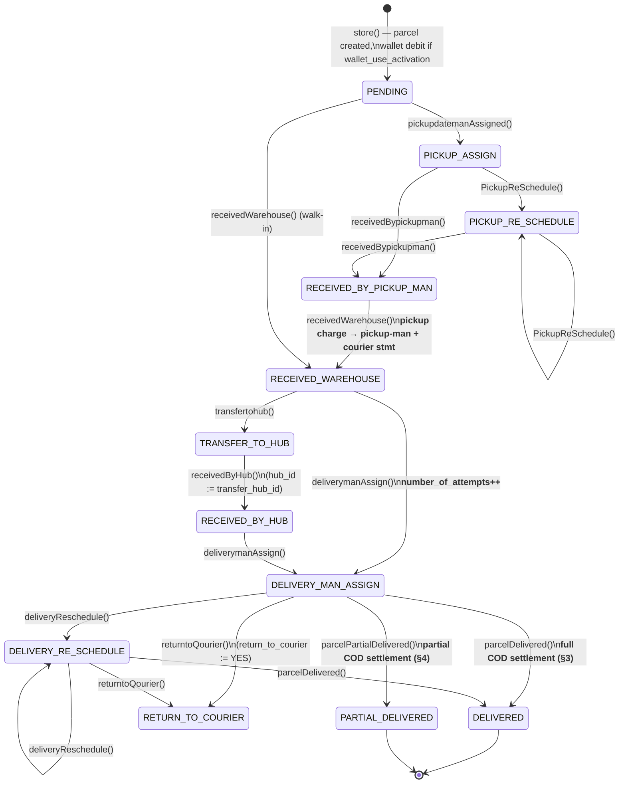
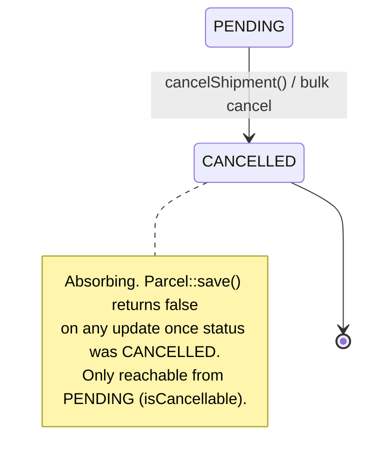
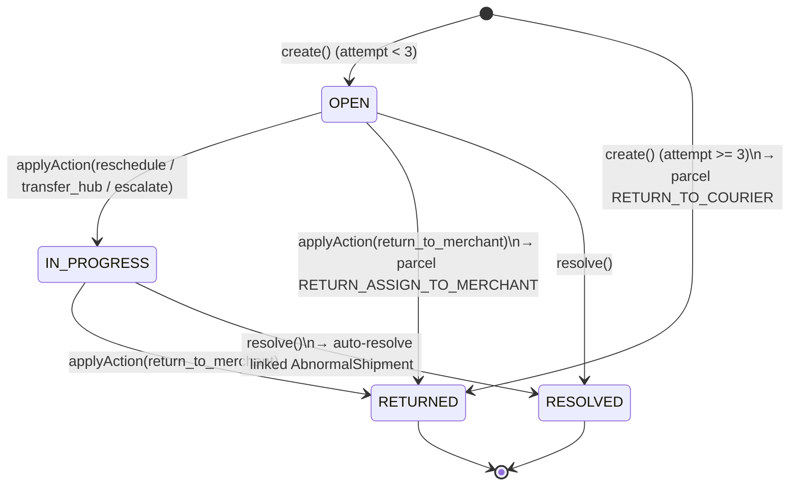
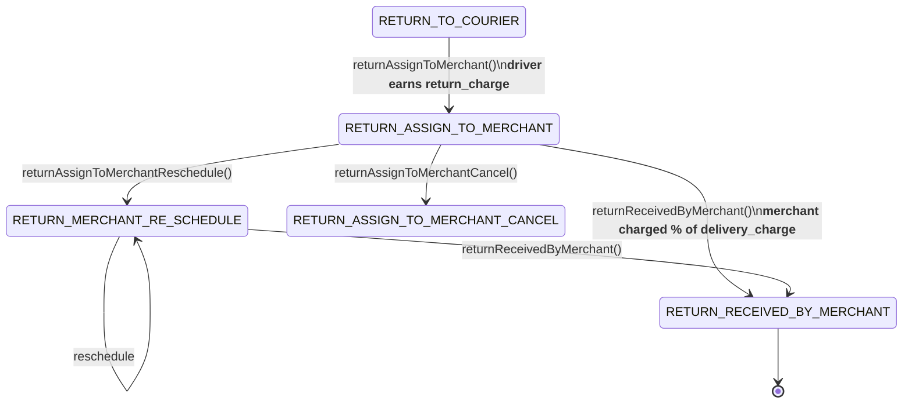
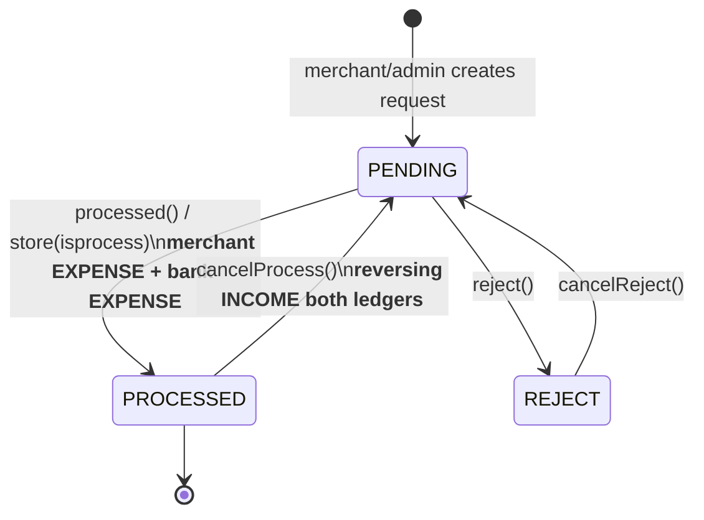
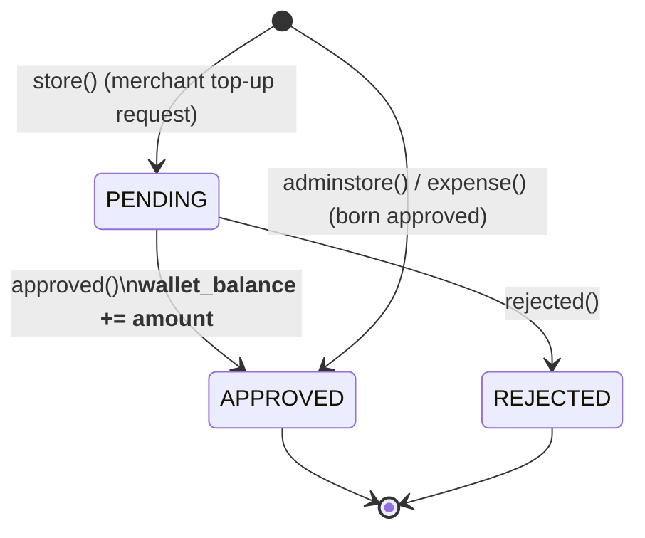

# 04 — Business Logic & Rules (Phase 3)

> Scope: the **rules** that govern money and state inside `rushly-saas` — the parcel
> status lifecycle, NDR (non-delivery report) handling, COD / cash collection &
> settlement, pricing & charges, approvals, returns, hub cash reconciliation, and the
> merchant wallet.
>
> `rushly-saas` (`/var/www/rushly-saas`) is the **single source of truth**. All Flutter
> apps (driver, merchant, admin, scanner, sorting, warehouse, fleet, supervisor) are
> clients that call these same repositories through the `Api/V10/*` controllers; they
> never own business logic. Every non-trivial claim below cites a real source file.
>
> Companion docs: [ACCOUNTING.md](../ACCOUNTING.md) is the authoritative money-movement
> reference — this doc summarises the *rule* layer and defers ledger mechanics to it.
> See also [01-Workspace-Inventory.md](01-Workspace-Inventory.md) and
> [02-Project-Overview.md](02-Project-Overview.md).

---

## 0. How state and money are actually mutated

Rushly is a **Laravel 10 monolith** (`composer.json` pins `laravel/framework ^10.10` —
`README.md`'s "Laravel 12" claim is wrong; code wins). There is **no formal state-machine
engine** and **no double-entry ledger**. Instead:

- **Parcel state** is a single integer column `parcels.status` holding one of the 41
  constants in `app/Enums/ParcelStatus.php`. Each transition is a dedicated method on
  `app/Repositories/Parcel/ParcelRepository.php` that (a) writes a `ParcelEvent` row
  (the append-only timeline), (b) sets `parcel.status`, and (c) — for money-bearing
  transitions — appends statement-ledger rows and mutates per-party balance scalars.
- **Money** is maintained by application code calling `increment`/`decrement` on
  mutable balance columns (`merchants.current_balance`, `delivery_man.current_balance`,
  `hubs.current_balance`, `accounts.balance`) plus append-only statement tables. See
  [ACCOUNTING.md](../ACCOUNTING.md) §1 for the three-layer model.

There is **no `debits = credits` invariant** — if a write path is missed, balances
drift and must be reconciled by hand (`ACCOUNTING.md` §8).

---

## 1. Parcel status lifecycle

### 1.1 The status enum

`app/Enums/ParcelStatus.php` defines 41 integer constants. Human labels come from
`lang/en/parcelStatus.php` (note several labels differ from the constant name — e.g.
`RETURN_TO_COURIER` renders as **"Not Delivered"**, `RECEIVED_BY_PICKUP_MAN` renders as
**"Received By Courier"**, `RETURNED_MERCHANT` renders as **"RTC"**).

| # | Constant | Label (`lang/en/parcelStatus.php`) | Kind |
|---|---|---|---|
| 1 | `PENDING` | Created | forward (initial) |
| 2 | `PICKUP_ASSIGN` | Pickup Assign | forward |
| 3 | `PICKUP_RE_SCHEDULE` | Pickup Re-Schedule | forward |
| 4 | `RECEIVED_BY_PICKUP_MAN` | Received By Courier | forward |
| 5 | `RECEIVED_WAREHOUSE` | Received Warehouse | forward (**pickup charge posts**) |
| 6 | `TRANSFER_TO_HUB` | Transfer to hub | forward |
| 7 | `DELIVERY_MAN_ASSIGN` | Assign to Courier | forward (**attempt counter++**) |
| 8 | `DELIVERY_RE_SCHEDULE` | Delivery Re-Schedule | forward |
| 9 | `DELIVERED` | Delivered | terminal-success (**COD settles**) |
| 10 | `DELIVER` | Deliver | legacy/unused label |
| 11 | `RETURN_WAREHOUSE` | Return Warehouse | return |
| 12 | `ASSIGN_MERCHANT` | Assign client | return |
| 13 | `RETURNED_MERCHANT` | RTC | return |
| 19 | `RECEIVED_BY_HUB` | Received by hub | forward |
| 24 | `RETURN_TO_COURIER` | Not Delivered | return (**NDR auto-target after 3 attempts**) |
| 26 | `RETURN_ASSIGN_TO_MERCHANT` | Return assign to client | return (**return charge posts**) |
| 27 | `RETURN_MERCHANT_RE_SCHEDULE` | Return assign to client Re-Schedule | return |
| 30 | `RETURN_RECEIVED_BY_MERCHANT` | Return received by client | terminal-return (**return charge finalised**) |
| 32 | `PARTIAL_DELIVERED` | Partial Delivered | terminal-partial (**COD + charges settle**) |
| 34 | `ASSIGN_TO_3PL` | *(no label — 3PL hand-off)* | forward (external courier) |
| 35 | `NDR_CREATED` | *(no label — NDR badge flag)* | flag |
| 36 | `ABNORMAL` | *(no label — abnormal shipment)* | flag |
| 37 | `WMS_FULFILLMENT_PENDING` | *(no label)* | WMS |
| 38 | `WMS_PICKING` | *(no label)* | WMS |
| 39 | `WMS_PACKING` | *(no label)* | WMS |
| 40 | `WMS_READY_TO_SHIP` | *(no label)* | WMS |
| 41 | `CANCELLED` | Cancelled | terminal-cancel (**absorbing**) |

Every forward status **N** has a matching `_CANCEL` status (15, 16, 17, 18, 20, 21, 22,
23, 25, 28, 29, 31, 33) used to reverse the corresponding step. These `_CANCEL`
constants are transient signals consumed by the `*Cancel()` repository methods (e.g.
`receivedWarehouseCancel`, `deliverymanAssignCancel`); the parcel is then rewound to the
prior forward status rather than left sitting in a `_CANCEL` state.

> ⚠️ **Doc vs Code — labels lie about semantics.** `RETURN_TO_COURIER` (24) displays as
> **"Not Delivered"** and `RECEIVED_BY_PICKUP_MAN` (4) as **"Received By Courier"**. Read
> the constant, not the badge, when reasoning about flow.

### 1.2 Forward (happy-path) state machine

Each edge is one `ParcelRepository` method (method name in the label). Money side-effects
noted in **bold**.



Key transition handlers (all in `app/Repositories/Parcel/ParcelRepository.php`):

| Transition | Method | Notable side-effects |
|---|---|---|
| create | `store()` (line 526) | wraps in `DB::beginTransaction`; generates `tracking_id`; snapshots `ParcelItem`s; optional wallet debit (line 648–665). |
| pickup assign | `pickupdatemanAssigned()` (1157) | SMS + push to pickup-man & merchant. |
| pickup reschedule | `PickupReSchedule()` (1214) | deletes prior `PICKUP_ASSIGN`/`PICKUP_RE_SCHEDULE` events, recomputes `delivery_date` by `DeliveryType`. |
| received by pickup-man | `receivedBypickupman()` (1306) | status only. |
| received at warehouse | `receivedWarehouse()` (1510) | **posts pickup charge** to pickup-man (INCOME) + courier (EXPENSE) — only if a real pickup event with a known pickup-man exists (guards retro bulk edits). |
| transfer to hub | `transfertohub()` (1406) / `transferToHubMultipleParcel()` (1346) | sets `transfer_hub_id`. |
| received by hub | `receivedByHub()` (1325) | `hub_id := transfer_hub_id`. |
| assign courier | `deliverymanAssign()` (1429) / `deliveryManAssignMultipleParcel()` (1370) | model hook increments `number_of_attempts` (see §1.4). |
| delivery reschedule | `deliveryReschedule()` (1471) | deletes prior assign/reschedule events. |
| delivered | `parcelDelivered()` (2247) | **full settlement — see §3**. |
| partial delivered | `parcelPartialDelivered()` (2709) | **partial settlement — see §4**. |

Bulk variants exist (`pickupdatemanAssignedBulk`, `AssignReturnToMerchantBulk`,
`parcelReceivedByMultipleHub`) driven by `ParcelBulkActionController`.

### 1.3 The `ParcelEvent` timeline

Every transition writes a `ParcelEvent` (`app/Models/Backend/ParcelEvent.php`) carrying
`parcel_id`, `parcel_status`, `note`, `created_by`, and role FKs
(`delivery_man_id`, `pickup_man_id`, `hub_id`, `transfer_delivery_man_id`,
`rejection_reason_id`). This is the audit trail; reschedule handlers **delete** the prior
same-phase events before writing the new one, so the timeline shows only the latest
schedule per phase. Delivery/return accounting handlers *read back* the last
`DELIVERY_RE_SCHEDULE` (or fall back to `DELIVERY_MAN_ASSIGN`) event to decide which
driver earns the commission (`ParcelRepository::parcelDelivered` line 2288).

### 1.4 Cancellation — the one hard invariant

`CANCELLED` (41) is the only genuinely enforced terminal state. Rules live on the Parcel
model itself (`app/Models/Backend/Parcel.php`):

- **`isCancellable()` (line 149):** a parcel may be cancelled **only from `PENDING`**.
  Once picked up / assigned, cancellation must go through the return/refund flow instead.
- **`cancelShipment()` (line 154):** refuses if not cancellable, else sets `CANCELLED`
  and appends a "Cancelled: {reason}" note.
- **Absorbing guard (`booted()` `updating` hook, line 100):** once
  `getOriginal('status') === CANCELLED`, **any** subsequent `save()` returns `false` —
  no further mutation of a cancelled parcel is possible at the model layer.
- **`statusUpdate()` guard (`ParcelRepository` line 493):** the generic setter also
  refuses to touch a cancelled parcel.
- **Universal cancel logger (`updated` hook, line 119):** whenever any path flips status
  to `CANCELLED`, a `ParcelEvent` is best-effort written (failure is logged, not fatal).
- **Attempt counter (`updating` hook, line 105):** transitioning *into*
  `DELIVERY_MAN_ASSIGN` increments `number_of_attempts` — this is what feeds delivery-
  attempt analytics and, indirectly, NDR attempt counts.



> ⚠️ **Doc vs Code — tenant scope.** `Parcel` also carries a `tenant` **global scope**
> (`booted()` line 81) that clamps every query to `tenant()->company_id`, skipped for
> CLI/queue/cron and super-admins. This supersedes the older per-query
> `scopeCompanywise()` (retained for back-compat). Cross-tenant tools must use
> `Parcel::withoutGlobalScope('tenant')`.

---

## 2. NDR (Non-Delivery Report) handling

NDRs capture a **failed delivery attempt** and drive the escalate → reschedule → return
decision. Enums:

- **`app/Enums/NdrStatus.php`** — `open`, `in_progress`, `resolved`, `returned`.
- **`app/Enums/NdrAction.php`** — `reschedule`, `return_to_merchant`, `transfer_hub`,
  `escalate`.
- **`app/Enums/NdrFailureReason.php`** — `customer_absent`, `wrong_address`,
  `refused_delivery`, `customer_postponed`, `access_denied`, `payment_issue`,
  `damaged_shipment`, `incomplete_address`, `other`.

Model `app/Models/Backend/Ndr.php` (table `ndrs`, soft-deletes, activity-logged) links a
parcel, the deliveryman, `created_by`/`resolved_by`, `attempt_number`, `failure_reason`,
`driver_notes`/`driver_photo`, `next_attempt_date`, and an optional
`abnormal_shipment_id`. Logic lives in `app/Repositories/NdrRepository.php`; the UI is
`app/Http/Controllers/Backend/NdrController.php` (Inertia index) and the mobile API is
`app/Http/Controllers/Api/V10/NdrApiController.php`.

### 2.1 Core business rules (`NdrRepository`)

1. **Max 3 attempts.** On `create()`, if `attempt_number >= 3` the NDR is set to
   `RETURNED` and the parcel is pushed to `RETURN_TO_COURIER` (line 70–74); otherwise the
   parcel is flagged `NDR_CREATED` (a badge flag, not a real workflow move) and an
   `ndrCreated` notification fires. The controller *also* rejects a 4th attempt before it
   reaches the repo (`NdrController::create` line 155, `store` line 182) and computes
   `attempt_number = existing NDRs for parcel + 1`.
2. **One open NDR per parcel per day.** `todayOpenForParcel()` (line 130) blocks creating
   a second NDR the same day while an `open`/`in_progress` one exists (enforced in
   `NdrController::create` line 148 and `store` line 176).
3. **Cross-module abnormal linkage.** On create, any open `AbnormalShipment` for the same
   parcel is linked (`abnormal_shipment_id`); on `resolve()` the parcel's open abnormal
   shipment is auto-resolved (`abnormalRepo->autoResolveByParcel`).
4. **Actions mutate the parcel** (`applyAction()` line 84):
   - `reschedule` → stores `next_attempt_date`, status → `in_progress`.
   - `return_to_merchant` → calls `parcelRepo->returnAssignToMerchant()` (posts the
     return charge, see §6), status → `returned`.
   - `transfer_hub` → calls `parcelRepo->transfertohub()`, status → `in_progress`.
   - `escalate` → marks `in_progress` only (downstream handling deferred to a later
     phase per the code comment).

### 2.2 NDR state machine



`NdrRepository::stats()` (line 139) exposes `today / open / in_progress / resolved /
returned / return_rate` to the admin dashboard.

---

## 3. COD & cash collection / settlement (full delivery)

COD is the money the driver collects from the customer at delivery. The **canonical
settlement** happens in `ParcelRepository::parcelDelivered()` (line 2247). This mirrors
[ACCOUNTING.md](../ACCOUNTING.md) §4.4 — read that for the full three-layer treatment.

On `DELIVERED`, in one method (not wrapped in a transaction — see gotcha below):

1. **Driver commission** — `DeliverymanStatement` INCOME = `delivery_man.delivery_charge`;
   `delivery_man.current_balance += charge`.
2. **Courier expense** — `CourierStatement` EXPENSE, same amount (company pays the driver).
3. **Cash held by driver** — `DeliverymanStatement` EXPENSE with `cash_collection = 1`,
   amount = `parcel.cash_collection`; `delivery_man.current_balance -= cash` (driver now
   "owes" the collected cash to the company).
4. **Merchant income** — `MerchantStatement` INCOME = `cash_collection`;
   `merchants.current_balance += cash_collection`.
5. **Merchant charges** — `MerchantStatement` EXPENSE = `total_delivery_amount`, then a
   second EXPENSE = `vat_amount`; `merchants.current_balance -= (charge + vat)`.
6. **Courier income** — `CourierStatement` INCOME = `total_delivery_amount`.
7. **VAT** — `VatStatement` INCOME = `vat_amount`.
8. `parcel.status = DELIVERED`, `priority_type_id = 2`.

Which driver is credited is resolved from the parcel's last `DELIVERY_RE_SCHEDULE` event,
falling back to `DELIVERY_MAN_ASSIGN` (line 2288 / 2334) — so a reassigned parcel pays the
driver who actually delivered it.

**Net merchant delta** for the parcel = `cash_collection − total_delivery_amount −
vat_amount` = what the courier owes the merchant (settled later at invoice/payout).

```mermaid
stateDiagram-v2
    direction LR
    [*] --> Collected : driver collects COD at doorstep
    Collected --> DriverHolds : parcelDelivered()\ndeliveryman_statement EXPENSE (cash_collection=1)
    DriverHolds --> HubHolds : ReceivedRepository::store()\ncash handed to hub (§8)
    HubHolds --> BankDeposited : HubPayment processed\naccounts.balance += cash
    BankDeposited --> MerchantSettled : invoice cut + merchant payout (§5,§7)
    MerchantSettled --> [*]
```

> ⚠️ **Gotcha — `parcelDelivered()` is not transactional.** Unlike `store()` /
> `returnAssignToMerchant()`, the delivered handler runs its ~8 balance writes without
> `DB::beginTransaction`; a mid-write failure leaves partial balances (consistent with
> the drift risk called out in `ACCOUNTING.md` §8). The whole method is wrapped in a
> `try/catch` that returns `false` on any throwable but does **not** roll back.

---

## 4. Pricing & charges

Charges are computed **client-side** in the Inertia/React `ParcelForm.jsx` and posted as
a JSON `chargeDetails` blob; `ParcelRepository::store()` (line 607–638) simply persists
them, reading **both** the new Inertia keys and the legacy Blade keys for backward
compatibility:

| Column | Source (`store()`) |
|---|---|
| `vat` (rate %) | `chargeDetails.vatTex ?? request.vat_tex ?? 0` |
| `vat_amount` | `chargeDetails.VatAmount ?? 0` |
| `delivery_charge` | `chargeDetails.deliveryChargeAmount ?? chargeDetails.totalDeliveryChargeAmount ?? 0` |
| `total_delivery_amount` | `chargeDetails.totalDeliveryChargeAmount ?? 0` |
| `current_payable` | `chargeDetails.currentPayable ?? 0` |
| `cod_amount` | `chargeDetails.codChargeAmount ?? 0` |
| `packaging_amount` | `chargeDetails.packagingAmount` (if `packaging_id`) |
| `liquid_fragile_amount` | `chargeDetails.liquidFragileAmount` (if `fragileLiquid == 'on'`) |

**COD charge %** is looked up server-side from the merchant's `cod_charges` JSON by
delivery-type zone (`store()` line 616–626):

- `delivery_type_id` 1 (SAMEDAY) or 2 (NEXTDAY) → `cod_charges['inside_city']`
- 3 (SUBCITY) → `cod_charges['sub_city']`
- 4 (OUTSIDECITY) → `cod_charges['outside_city']`

**Delivery/pickup dates** are auto-derived from `DeliveryType` + a same-day cutoff hour
`DeliveryTime::LAST_TIME` (`store()` line 566–605): before the cutoff the pickup is today,
after it rolls to +1 day; delivery date adds the zone's transit days.

### 4.1 Partial delivery pricing

`parcelPartialDelivered()` (line 2709) recomputes charges from the *actually collected*
amount rather than the original COD (line 2721–2730):

```
cod_charges_amount = (request.cash_collection / 100) * parcel.cod_charge
total_charges      = cod_charges_amount + delivery_charge
                     + liquid_fragile_amount + packaging_amount
vat_amount         = (total_charges / 100) * parcel.vat
chargeWithVat      = total_charges + vat_amount
```

The parcel is flagged `partial_delivered = YES`; settlement then follows the delivered
pattern but on the recomputed figures, and the parcel is picked up by invoice generation
(§5) as a delivered-type line.

### 4.2 Return charge

On `returnAssignToMerchant()` the driver earns `delivery_man.return_charge` (flat, INCOME
+ courier EXPENSE, line 1748–1770). On `returnReceivedByMerchant()` the merchant is
charged a **percentage of the delivery charge**: `return_delivery_charge =
(parcel.delivery_charge / 100) * merchant.return_charges` (line 1965 / 1973), which is
stored back onto `parcel.return_charges` and posted as a courier INCOME. See §6.

---

## 5. Invoices (merchant billing cut)

`app/Enums/InvoiceStatus.php`: `UNPAID = 0`, `PROCESSING = 2`, `PAID = 3`. New invoices
default to `PROCESSING` at the DB layer
(`database/migrations/2022_10_11_121745_create_invoices_table.php` line 26 —
`->default(InvoiceStatus::PROCESSING)`), which is why `InvoiceRepository::store()`
(`app/Repositories/Invoice/InvoiceRepository.php`) never sets `status` explicitly.

Generation rule (`store($merchant_id)` line 47): once a merchant's `payment_period` days
have elapsed since the last invoice (and none was generated today), collect all
uninvoiced (`invoice_id = null`) parcels that are `DELIVERED` **or** `partial_delivered =
YES`, plus uninvoiced returns (`RETURN_RECEIVED_BY_MERCHANT`, `RETURN_ASSIGN_TO_MERCHANT`,
`RETURN_TO_COURIER`, or `return_to_courier = 1`). Then:

```
total_charges  = Σ delivery + Σ vat + Σ return_charges
current_payable = Σ(delivered current_payable) − Σ return_charges
```

Each parcel gets an `InvoiceParcel` line and is stamped with `invoice_id`. Invoice
generation is **read-only against balances** — it snapshots, it does not move money
(`ACCOUNTING.md` §4.9). Payment happens through the merchant-payout flow (§7), which flips
the invoice/merchant balance.

```mermaid
stateDiagram-v2
    [*] --> PROCESSING : InvoiceRepository::store()\n(payment_period elapsed)
    PROCESSING --> PAID : InvoiceRepository::statusUpdate()\n(admin, after payout)
    PROCESSING --> UNPAID : statusUpdate() (manual)
    UNPAID --> PAID : statusUpdate()
    PAID --> [*]
```

> ⚠️ **Doc vs Code — invoice numbering.** `invoiceId()` (line 167) builds
> `{PREFIX}-{merchantId}{globalInvoiceCount+1}` using a **company-wide** invoice count,
> not a per-merchant sequence — concurrent generation could theoretically collide. Noted,
> not fixed.

---

## 6. Returns

Two distinct return tracks exist, both flagged via `parcels.return_to_courier` /
`parcels.partial_delivered` and the return status band (24–31).

### 6.1 "Not delivered" → back to courier

`returntoQourier()` (line 1686) sets `RETURN_TO_COURIER`, `return_to_courier = YES`, and
records an optional `rejection_reason_id`. `returntoQourierCancel()` (line 1712) rewinds
to `DELIVERY_RE_SCHEDULE` (if such an event exists) else `DELIVERY_MAN_ASSIGN`, and clears
the flag. This is also the state the **3-attempt NDR rule** auto-drives a parcel into
(§2.1).

### 6.2 Return to merchant



- **`returnAssignToMerchant()`** (line 1736, wrapped in `DB::transaction`): pays the
  assigned driver `return_charge` (deliveryman INCOME + courier EXPENSE), sets
  `RETURN_ASSIGN_TO_MERCHANT`, SMS/push to merchant. Reachable directly from the NDR
  `return_to_merchant` action (§2.1).
- **`returnReceivedByMerchant()`** (line 1893): pays the driver `return_charge` again
  (deliveryman INCOME + courier EXPENSE), then **charges the merchant** a percentage of
  the delivery charge (`(delivery_charge/100) * merchant.return_charges`), decrements
  `merchant.current_balance`, posts a courier INCOME, stores `parcel.return_charges`, and
  sets `RETURN_RECEIVED_BY_MERCHANT`. This is the terminal return state that invoice
  generation bills.

Each has a matching `*Cancel()` reversal (`returnAssignToMerchantCancel` 1801,
`returnReceivedByMerchantCancel` 2001) that reverses the balance writes.

---

## 7. Approvals

`app/Enums/ApprovalStatus.php`: `REJECT = 1`, `APPROVED = 2`, `PENDING = 3`,
`PROCESSED = 4`. Note **`APPROVED` (2) is defined but not used by the payout flows** —
merchant/hub payouts move `PENDING → PROCESSED` (or `PENDING → REJECT`), skipping
`APPROVED`. `APPROVED` is used elsewhere (dashboards, imports).

### 7.1 Merchant payout / payment request

Two entry points share the same `Payment` model and
`app/Repositories/MerchantManage/Payment/PaymentRepository.php`:

- **Merchant self-service request** —
  `app/Http/Controllers/Backend/MerchantPanel/PaymentRequestController.php`. Guards the
  request against `merchant.current_balance` (line 39/66) and only allows edit/delete
  while `status == PENDING` (line 62/88).
- **Admin payout** — creates the `Payment` directly. If `isprocess` is truthy it is born
  `PROCESSED` and immediately posts the money; else `PENDING`.

Money moves **only on PROCESSED** (`PaymentRepository::store`/`update`/`processed`):
`MerchantStatement` EXPENSE ("payment_withdrawal") → `merchant.current_balance -= amount`,
plus `BankTransaction` EXPENSE → `accounts.balance -= amount`. `cancelProcess()` (line
300) writes the exact reversal (INCOME both ledgers, balances back up) and returns the row
to `PENDING`. `reject()` → `REJECT`; `cancelReject()` → back to `PENDING`.



### 7.2 Hub payout request

Same shape via `app/Repositories/HubManage/HubPayment/HubPaymentRepository.php` and
`app/Http/Controllers/Backend/HubPanel/HubPaymentRequestController.php`: `HubPayment`
rows move `PENDING → PROCESSED` (or `REJECT`), editable/deletable only while `PENDING`
(controller line 48/65).

### 7.3 Payout gateways (`PayoutSetup`)

`app/Enums/PayoutSetup.php` enumerates the online payout providers wired per merchant
(`STRIPE=1`, `SSL_COMMERZ=2`, `PAYPAL=3`, `PAYONEER=4`, `BKASH=5`, `VISA=6`, `SKRILL=7`,
`AAMARPAY=8`, `RAZORPAY=9`, `PAYSTACK=10`, `OFFLINE=11`), configured through
`PayoutSetupController` / `PayoutSetupRepository` and consumed by `PayoutController`
(online payouts). Most bank-transfer requests in practice use the `MerchantPayment`
account-detail record (`app/Models/MerchantPayment.php`: bank/holder/account/routing or
mobile-money fields).

---

## 8. Hub cash reconciliation

When a driver hands COD cash to a hub cashier, `ReceivedRepository::store()`
(`app/Repositories/CashReceivedFromDeliveryman/ReceivedRepository.php` line 27) writes
**four** things atomically-in-intent (no `DB::transaction` wrapper, just `try/catch`):

1. `CashReceivedFromDeliveryman` row (the receipt; model
   `app/Models/CashReceivedFromDeliveryman.php`).
2. `HubStatement` EXPENSE + `hub.current_balance += (−amount)` — the hub balance is stored
   **inverted**: it *decreases* when cash is received. It reads as "amount the hub owes
   the company" (`ACCOUNTING.md` §8 flags this as easy to misread).
3. `BankTransaction` INCOME on the chosen `account` + `account.balance += amount`, tagged
   with `cash_received_dvry = receipt.id`.
4. `DeliverymanStatement` INCOME + `delivery_man.current_balance += amount` — clears the
   driver's held-cash liability created at delivery (§3 step 3).

`update()` (line 105) does a full **reverse-then-restore**: it posts the mirror-image
entries to undo the original receipt, then re-applies with the new values. `delete()`
(line 223) posts only the reversing half and destroys the row. All three are hub-scoped
(`Auth::user()->hub_id`) and tenant-scoped.

```mermaid
stateDiagram-v2
    direction LR
    DriverOwesCash --> ReceiptCreated : ReceivedRepository::store()
    ReceiptCreated --> HubHoldsCash : hub.current_balance -= amount\ndriver.current_balance += amount\naccount.balance += amount
    HubHoldsCash --> Corrected : update() (reverse + restore)
    HubHoldsCash --> Voided : delete() (reverse only)
    HubHoldsCash --> BankDeposited : HubPayment processed (§7.2)
```

---

## 9. Merchant wallet

The wallet is a **prepaid balance** merchants can top up and that parcel creation can
debit. Enums under `app/Enums/Wallet/`:

- **`WalletStatus`** — `PENDING = 1`, `APPROVED = 2`, `REJECTED = 3`.
- **`WalletType`** — `INCOME = 1` (recharge), `EXPENSE = 2` (deduction).
- **`WalletPaymentMethod`** — `OFFLINE = 1`, `WALLET = 2` (online gateway constants are
  commented out — only offline + internal-wallet are live).

Logic: `app/Repositories/Wallet/WalletRepository.php`. Balance lives on
`merchant.wallet_balance` (the `wallets` table is the append-only ledger; the scalar is
the running total).

- **Merchant recharge** (`store()`) — creates a `WalletType::INCOME`,
  `WalletPaymentMethod::OFFLINE`, `WalletStatus::PENDING` row. **No balance change yet.**
- **Approval** (`approved()`) — `merchant.wallet_balance += amount`, status → `APPROVED`,
  SMS. `rejected()` → `REJECTED` (no balance change).
- **Admin direct recharge** (`adminstore()`) — creates an already-`APPROVED` INCOME and
  credits the balance in one `DB::transaction`.
- **Parcel-create debit** (`expense()`) — called from `ParcelRepository::store()` (line
  648) **only if** `merchant.wallet_use_activation == Status::ACTIVE`: writes a
  `WalletType::EXPENSE`, `WalletPaymentMethod::WALLET`, already-`APPROVED` row for
  `total_delivery_amount` and decrements `wallet_balance` (the decrement itself happens in
  `store()` at line 654; `expense()` records the ledger row).
- **Delete** (`delete()`) — only reverses `wallet_balance` if the row was `APPROVED`.



> ⚠️ **Doc vs Code — no overdraft guard on wallet debit.** `store()` decrements
> `wallet_balance` by `total_delivery_amount` whenever `wallet_use_activation` is active,
> with no check that the balance is sufficient (line 652–655) — a wallet can go negative.
> The merchant/hub *payout* requests do guard against `current_balance`, but the wallet
> parcel-debit path does not.

---

## 10. Cross-cutting rules & gotchas

- **No state-machine engine.** Legal transitions are implied only by which repository
  method the UI/API calls and by the `_CANCEL` rewind methods. There is no central table
  of allowed edges; an out-of-order status can be forced by direct `statusUpdate()` or
  bulk action (the `receivedWarehouse` pickup-charge guard at line 1523 exists precisely
  because retro bulk edits can jump a parcel around).
- **`CANCELLED` is the only enforced terminal.** Everything else is convention.
- **Transaction coverage is uneven.** `store()`, `receivedWarehouse()`,
  `returnAssignToMerchant()`, merchant/hub payout repos wrap in `DB::transaction`;
  `parcelDelivered()`, `returnReceivedByMerchant()`, `ReceivedRepository::store()`, and
  `IncomeRepository::store()` (`ACCOUNTING.md` §4.1) do **not** — mid-write failure drifts
  balances.
- **Hardcoded account-head IDs 1–7** underpin all party-balance routing; reordering the
  seeder silently breaks it (`ACCOUNTING.md` §3).
- **Inverted hub balance** — increases on deposit-out, decreases on cash-in (§8).
- **Money mutation is app-layer, tenant isolation is app-layer.** Forgetting
  `scopeCompanywise()` / the global tenant scope leaks cross-tenant rows.
- **Balance scalars are the source of truth for "currently owed".** Statement rows are
  history; nothing replays them to derive balances.

---

## Sources

Files actually opened for this document:

**Enums**
- `app/Enums/ParcelStatus.php`
- `app/Enums/NdrStatus.php`, `app/Enums/NdrAction.php`, `app/Enums/NdrFailureReason.php`
- `app/Enums/ApprovalStatus.php`
- `app/Enums/PayoutSetup.php`
- `app/Enums/InvoiceStatus.php`
- `app/Enums/Wallet/WalletStatus.php`, `WalletType.php`, `WalletPaymentMethod.php`

**Models**
- `app/Models/Backend/Parcel.php` (status guards, cancel invariant, tenant scope)
- `app/Models/Backend/Ndr.php`
- `app/Models/CashReceivedFromDeliveryman.php`
- `app/Models/MerchantPayment.php`
- `app/Models/Backend/Wallet.php`

**Repositories (transition & money logic)**
- `app/Repositories/Parcel/ParcelRepository.php` (store, all status handlers, delivered,
  partial, returns, receivedWarehouse)
- `app/Repositories/NdrRepository.php`, `app/Repositories/NdrRepositoryInterface.php`
- `app/Repositories/CashReceivedFromDeliveryman/ReceivedRepository.php`
- `app/Repositories/Invoice/InvoiceRepository.php`
- `app/Repositories/Wallet/WalletRepository.php`
- `app/Repositories/MerchantManage/Payment/PaymentRepository.php`
- `app/Repositories/HubManage/HubPayment/HubPaymentRepository.php` (approval states)

**Controllers**
- `app/Http/Controllers/Backend/NdrController.php`
- `app/Http/Controllers/Backend/MerchantPanel/PaymentRequestController.php`
- `app/Http/Controllers/Backend/HubPanel/HubPaymentRequestController.php`

**Migrations / lang**
- `database/migrations/2022_10_11_121745_create_invoices_table.php` (invoice default status)
- `lang/en/parcelStatus.php` (status labels)

**Primary docs cross-checked**
- [ACCOUNTING.md](../ACCOUNTING.md) (money-movement authority — §§3,4,5,6,7,8 referenced)
- `docs/_CONTEXT_BRIEF.md`, `README.md` (Laravel version conflict)
