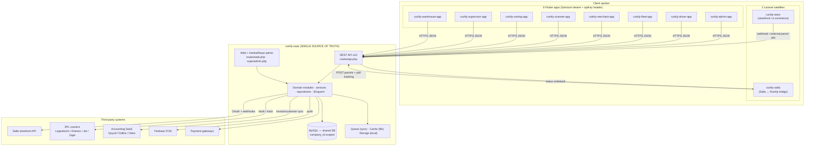
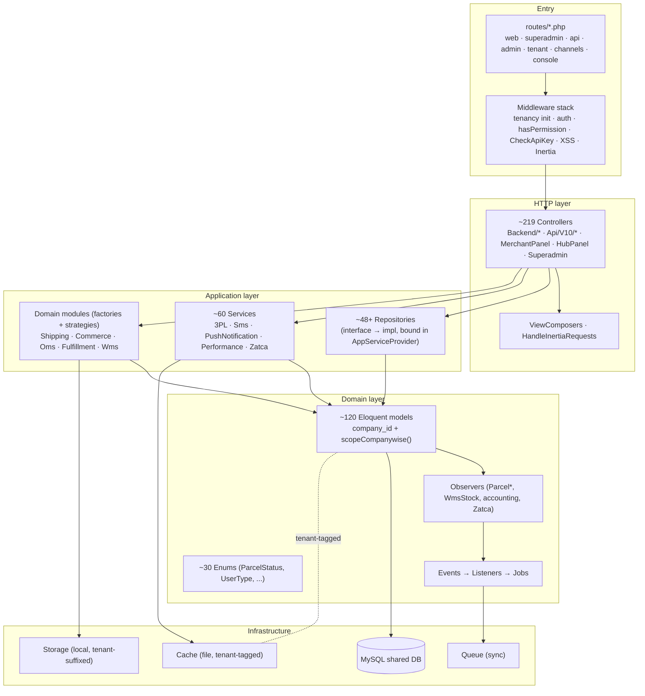
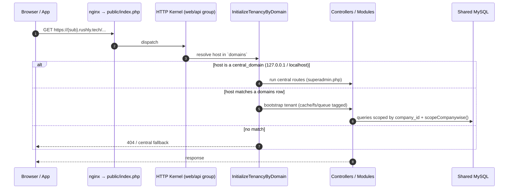
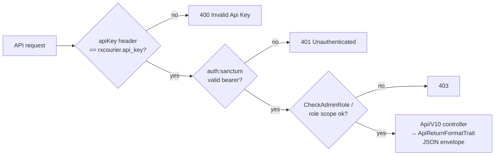
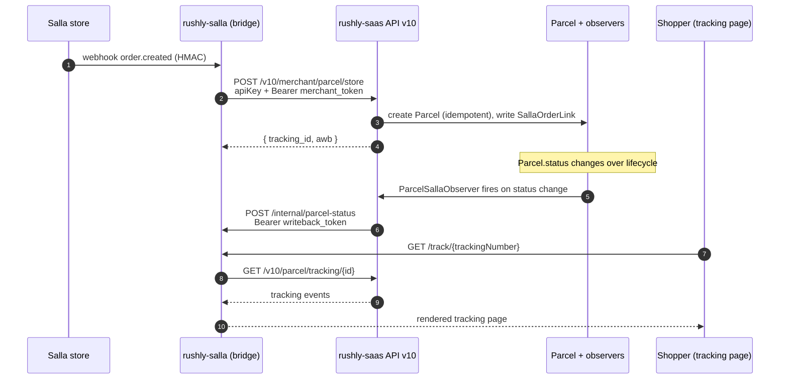
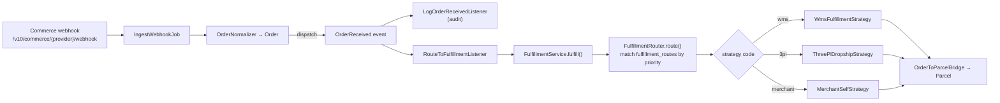
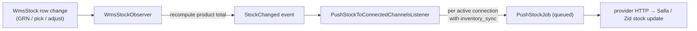
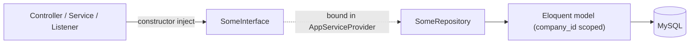

# 05 — System Architecture

> **Scope (Phase 4).** How the Rushly platform is put together: the overall topology, the
> Laravel backend architecture, how the 8 Flutter apps + 2 Laravel satellites talk to it, the
> API surface, multi-tenancy, storage/cache/queue/Redis, the event/listener/job machinery,
> notifications, and the cross-cutting patterns (repositories, services, providers, middleware,
> observers, traits, enums).
>
> `rushly-saas` (`/var/www/rushly-saas`) is the **single source of truth**. Every Flutter app and
> both Laravel satellites are **clients** of it. Every non-trivial claim below cites a real source
> file. Where the existing repo docs disagree with the code, a **⚠️ Doc vs Code** note flags it.

**Sibling docs:** see [01-Workspace-Inventory.md](01-Workspace-Inventory.md),
[02-Project-Overview.md](02-Project-Overview.md), [03-Business-Domain.md](03-Business-Domain.md),
[04-Business-Logic.md](04-Business-Logic.md). The primary in-repo source for this doc is
[`ARCHITECTURE.md`](../ARCHITECTURE.md) and [`docs/shipping-architecture.md`](shipping-architecture.md).

---

## 1. What Rushly Is (architecturally)

Rushly is a **multi-tenant logistics / courier-management SaaS** built on Laravel. One deployment
hosts a **central domain** (marketing site + super-admin) and any number of **tenant subdomains**
(one per customer logistics company). Each tenant runs the full courier workflow — parcels, hubs,
drivers, merchants, payments, WMS, accounting, support — over a **shared database** scoped by
`company_id`.

The backend is not a monolith-of-controllers only: over the last several phases the codebase grew a
set of **self-contained domain modules** under `app/<Module>/` (Shipping, Commerce, Oms,
Fulfillment, Wms, Salla, Qoyod/Daftra/Odoo, Zatca) that each follow the same folder shape and are
wired in through their own service providers. This is the defining architectural characteristic of
the current codebase.

### Stack (verified against `composer.json`)

| Layer | Choice | Source |
|---|---|---|
| Framework | **Laravel `^10.10`** | `composer.json` |
| PHP | `^8.1` | `composer.json` |
| DB | MySQL (`DB_CONNECTION=mysql`) | `.env`, `config/database.php` |
| Multi-tenancy | `stancl/tenancy ^3` (per-subdomain identify, **shared DB**) | `config/tenancy.php` |
| API auth | `laravel/sanctum ^3` (bearer tokens) + a static `apiKey` header | `app/Http/Middleware/CheckApiKeyMiddleware.php` |
| Web auth | `web` guard = `session` (only guard defined) | `config/auth.php` |
| Admin web UI | Inertia.js + React (`inertiajs/inertia-laravel ^2`), Ziggy, Vite | `composer.json`, `app/Http/Middleware/HandleInertiaRequests.php` |
| Queue | default **`sync`** (env `QUEUE_CONNECTION`) | `config/queue.php`, `.env` |
| Cache | default **`file`** (env `CACHE_DRIVER`) | `config/cache.php`, `.env` |
| Broadcast | default **`null`** (env sets `log`) | `config/broadcasting.php`, `.env` |
| Session | **`file`** | `config/session.php`, `.env` |
| Filesystem | **`local`** | `config/filesystems.php`, `.env` |
| Push | FCM legacy HTTP (`FCM_SECRET_KEY`) | `app/Http/Services/PushNotificationService.php` |
| SMS | Twilio / Vonage | `app/Http/Services/SmsService.php` |
| Audit | `spatie/laravel-activitylog` | model `LogsActivity` traits |

> **⚠️ Doc vs Code — Laravel version.** Both [`ARCHITECTURE.md`](../ARCHITECTURE.md) §2 and
> `README.md` claim **"Laravel 12 / PHP 8.4"**. `composer.json` pins `laravel/framework: ^10.10`
> and `php: ^8.1`. **Code wins: this is Laravel 10 on PHP 8.1+.** The "Laravel 12" claim is
> outdated marketing copy, not the running framework.

---

## 2. Overall System Topology

The Rushly ecosystem is a **hub-and-spoke** star: `rushly-saas` is the hub; every mobile app and
both Laravel satellites are spokes that reach it over HTTP(S). There is **no direct app-to-app
traffic** between spokes — they all rendezvous through the SaaS API.



**Key facts:**

- Every Flutter app authenticates identically: a static `apiKey` header (`CheckApiKey`) plus a
  Sanctum bearer token issued at login. Source: `app/Http/Middleware/CheckApiKeyMiddleware.php`,
  `routes/api.php`.
- `rushly-salla` calls the SaaS with the same `apiKey` header plus a per-merchant Rushly bearer
  token, and the SaaS calls **back** into `rushly-salla` for status writeback. Source:
  `/var/www/rushly-salla/app/Services/RushlyApiClient.php`, `/var/www/rushly-salla/routes/web.php`.
- `rushly-store` is an independent EcommerceGo storefront (Laravel 11) whose orders reach Rushly via
  the storefront/webhook ingest surface. Source: `/var/www/rushly-store/README.md`.

---

## 3. Laravel Backend Architecture

### 3.1 Layered view

The backend is a **layered, module-augmented Laravel app**. Requests flow HTTP → middleware →
controller → (repository | service | module factory) → Eloquent → MySQL. Cross-cutting concerns
(tenancy init, tenant DB scoping via `company_id`, auth, permissions) are middleware; domain events
fan out through observers/listeners.



### 3.2 Directory map (backend)

```
app/
├── Console/Commands/          # invoice:generate, database:autobackup, shipping:sync-tracking, wms:*, *:prune-logs …
├── Enums/                     # ParcelStatus, UserType, PaymentType, NdrStatus … (+ Wms/, Zatca/, Wallet/, Merchant_panel/)
├── Http/
│   ├── Controllers/           # Backend/* (bulk), Api/V10/*, Auth/, Frontend/, Admin/
│   ├── Middleware/            # CheckApiKey, PermissionCheck, subscriptionCheck, CompanyActivation, XSS, HandleInertiaRequests …
│   ├── Services/              # PushNotificationService, SmsService, ParcelImageService, PurchaseVerify
│   └── ViewComposer/          # PlanComposer, ServiceComposer, SocialLinkComposer
├── Providers/                 # App, Event, Route, Tenancy, Auth, Broadcast, View, IntegrationConfig, Zatca
├── Repositories/              # ~48+ repos behind interfaces (bound in AppServiceProvider)
├── Services/                  # legacy per-3PL + SallaService/ZidService/WooCommerceService, Performance/, Zatca/
├── Observers/                 # Parcel{Salla,Zid,WooCommerce,Instrumentation}Observer, Zatca/InvoiceObserver
├── Traits/                    # ApiReturnFormatTrait, PaymentTrait, TrackingTrait
├── Support/                   # ParcelStatusHelper (state machine)
│
├── Shipping/  ▲               # generic courier abstraction (factory + providers + events + jobs)
├── Commerce/  ▲               # generic storefront ingestion (feature-flag gated)
├── Oms/       ▲               # canonical Order + normalization + OrderReceived/OrderUpdated events
├── Fulfillment/ ▲             # FulfillmentRouter + 3 strategies + OrderToParcelBridge
├── Wms/       ▲               # WmsStockObserver → StockChanged event
├── Salla/                     # Salla-specific bridge (ApiClient, jobs, webhooks)
├── Qoyod/ Daftra/ Odoo/       # per-tenant accounting sync (observers → jobs)
└── Zatca/ (Services/Zatca)    # Saudi e-invoicing generator
```

`▲` = self-contained module. Every module uses the same shape:
`Contracts/ + DTOs/ + Providers|Strategies/ + Services/ + Models/ + Events/ + Listeners/ +
Jobs/ + Repositories/ + Exceptions/ + <Module>ServiceProvider.php`. Business logic never imports a
concrete provider/strategy — it goes through the module's **factory + interface**. Source:
[`ARCHITECTURE.md`](../ARCHITECTURE.md) §4, `app/Shipping/`, `app/Fulfillment/`.

### 3.3 Bootstrap & kernels

`bootstrap/app.php` is a **classic Laravel 10 bootstrap** (not the Laravel 11+ slim
`Application::configure()` form) — it binds `Http\Kernel`, `Console\Kernel`, and
`Exceptions\Handler` singletons. This is corroborating evidence for the Laravel-10 reality.
Source: `bootstrap/app.php`.

- **HTTP kernel** (`app/Http/Kernel.php`) — global middleware (CORS ×2, TrimStrings, custom `Cors`),
  a `web` group (session, CSRF, `LanguageManager`, `HandleInertiaRequests`, `TrackDriverLastSeen`,
  `SetTenantTimezone`, `RequireOnboarding`, `RecordSessionMetadata`), an `api` group (throttle,
  `SubstituteBindings`, `APIlog`, `TrackDriverLastSeen`), and ~18 route-middleware aliases (see §9).
- **Console kernel** (`app/Console/Kernel.php`) — the scheduler (see §7.4).

---

## 4. Multi-Tenancy Architecture

Powered by `stancl/tenancy ^3`. The tenant model is `App\Models\Tenant`, tenant IDs are **UUIDs**
(`Stancl\Tenancy\UUIDGenerator`), and the hostname→tenant mapping lives in the `domains` table.
Source: `config/tenancy.php`.

### 4.1 The critical design decision: shared database, not database-per-tenant

```php
// config/tenancy.php
'bootstrappers' => [
    // Stancl\Tenancy\Bootstrappers\DatabaseTenancyBootstrapper::class,   // ← COMMENTED OUT
    Stancl\Tenancy\Bootstrappers\CacheTenancyBootstrapper::class,
    Stancl\Tenancy\Bootstrappers\FilesystemTenancyBootstrapper::class,
    Stancl\Tenancy\Bootstrappers\QueueTenancyBootstrapper::class,
    // Stancl\Tenancy\Bootstrappers\RedisTenancyBootstrapper::class,      // ← COMMENTED OUT (needs phpredis)
],
```

The **`DatabaseTenancyBootstrapper` is disabled**. Rushly does **not** switch database connections
per tenant. All tenants share one MySQL database and isolation is enforced at the **application
layer**:

1. `domains` table maps a request host → `tenant_id`.
2. Stancl middleware `InitializeTenancyByDomain` sets the current tenant from the host.
3. Every domain table carries a `company_id` column and every domain model exposes a
   `scopeCompanywise()` query scope. **Forgetting the scope leaks data across tenants** — this is
   the single most important convention when adding models. Source: [`ARCHITECTURE.md`](../ARCHITECTURE.md)
   §3 & §17.

What tenancy **does** isolate automatically (active bootstrappers):

- **Cache** — `CacheTenancyBootstrapper` tags every cache entry with `tenant<tenant_id>`
  (`'tag_base' => 'tenant'`). Keys are scoped on write and read.
- **Filesystem** — `FilesystemTenancyBootstrapper` suffixes the `local` and `public` disks with
  `tenant<tenant_id>`; `asset()` calls become tenant-aware. Root overrides:
  `%storage_path%/app/` and `%storage_path%/app/public/`.
- **Queue** — `QueueTenancyBootstrapper` re-injects the tenant context when a queued job runs so a
  job keeps the tenant it was dispatched from.

> **⚠️ Doc vs Code — tenant DBs.** [`ARCHITECTURE.md`](../ARCHITECTURE.md) §3 correctly describes the
> shared-DB model, but its §4 directory comment (`96 migrations → ~116 tables`) and the
> `migration_parameters` block in `config/tenancy.php` (`--path database/migrations/tenant`) hint at
> per-tenant migrations that are **not actually used** given the disabled `DatabaseTenancyBootstrapper`.
> Treat the shared-DB + `company_id` model as current; the `tenants:migrate` machinery is dormant
> scaffolding.

### 4.2 Central vs tenant routing

`central_domains` is `['127.0.0.1', 'localhost']` (`config/tenancy.php`). A request whose host is a
central domain hits the central routes (superadmin + marketing); any other host is looked up in
`domains` and, if found, runs the tenant app.



### 4.3 Tenancy lifecycle events

`TenancyServiceProvider` wires Stancl's full event map. Notable points:

- On `TenantCreated`, the provisioning `JobPipeline` is **empty** (the `CreateDatabase` /
  `MigrateDatabase` / `SeedDatabase` jobs are commented out — consistent with the shared-DB model).
- On `TenantDeleted`, a `JobPipeline` runs `Jobs\DeleteDatabase` (`shouldBeQueued(false)`).
- `TenancyInitialized → BootstrapTenancy` and `TenancyEnded → RevertToCentralContext` run the
  bootstrappers.
- `makeTenancyMiddlewareHighestPriority()` promotes `PreventAccessFromCentralDomains` and the
  `InitializeTenancy*` middleware above everything else.

Source: `app/Providers/TenancyServiceProvider.php`.

---

## 5. API Architecture

All mobile + satellite traffic enters through `routes/api.php` (prefix `/api`, `api` middleware
group). The API is versioned **v10** (`/api/v10/*`).

### 5.1 Two-factor gate: `apiKey` header + Sanctum bearer

Every protected API route sits behind **two** checks:

1. **`CheckApiKey`** — a static shared secret. The middleware compares the `apiKey` request header
   against `config('rxcourier.api_key')`; mismatch → `400 Invalid Api Key`. Source:
   `app/Http/Middleware/CheckApiKeyMiddleware.php`, `config/rxcourier.php`.
2. **`auth:sanctum`** — a per-user bearer token issued at login. Sanctum's `guard` is `['web']`
   and token `expiration` is `null` (non-expiring). Source: `config/sanctum.php`, `config/auth.php`.

Some routes stack a **third** check — `CheckAdminRole` for the admin/ops app surface, or
`salla.webhook` / `public.tracking.key` for signed inbound calls.



### 5.2 API surface, grouped

Source: `routes/api.php` (verified line ranges cited).

| Group | Prefix | Gate | Consumers |
|---|---|---|---|
| **Public** | `/api/v10/*` | `CheckApiKey` only | register, `signin`, `deliveryman/login`, OTP, password reset, public hub list, general settings, `parcel/tracking/{id}`, contact, subscribe, rate card |
| **Merchant / driver ops** | `/api/v10/*` | `CheckApiKey` + `auth:sanctum` | merchant-app + driver-app: parcel CRUD, status change, GPS update, finance, dashboards, shops, support |
| **Admin / ops** | `/api/v10/admin/*` | `CheckApiKey` + `auth:sanctum` + `CheckAdminRole` | admin-app, fleet-app, sorting-app, supervisor-app, scanner-app, warehouse-app |
| **Storefront ingest** | `/api/v10/external/{salla,zid,woocommerce}/parcel` | `CheckApiKey` | bridge apps that push normalized orders → `Parcel` |
| **Commerce webhook** | `/api/v10/commerce/{provider}/webhook` | HMAC (no apiKey/Sanctum — the signature IS the auth) | generic Commerce module ingest |
| **3PL / partner webhooks** | `/api/olivery/webhook`, `/api/zajel/webhook`, `/api/v10/panda/*`, `/api/delivery/*` | mixed (`CheckApiKey` on `/delivery/*`) | courier callbacks |
| **Public tracking** | `/api/v10/public/tracking/{tracking_id}` | `public.tracking.key` | white-label tracking pages |

The admin surface (`v10/admin`) starts with `POST /login` (open under `apiKey`), then everything
else requires `auth:sanctum` + `CheckAdminRole`. It exposes fleet (`/fleet/*`), sorting
(`/sorting/*`), WMS (`/wms/*`), parcels, merchants, drivers, hubs, payment-requests, support, fraud,
FCM subscribe, and map endpoints — the union consumed by the six ops-facing Flutter apps.

Responses are normalized through `ApiReturnFormatTrait` (`app/Traits/ApiReturnFormatTrait.php`),
which the API controllers and even `CheckApiKeyMiddleware` use for a consistent JSON envelope.

### 5.3 Rate limiting

`RouteServiceProvider::configureRateLimiting()` defines the `api` limiter at **60 req/min**, keyed
by authenticated user id or client IP. Source: `app/Providers/RouteServiceProvider.php`.

---

## 6. App-to-App Communication

### 6.1 The 8 Flutter apps

All eight are thin clients of the v10 API. They differ only in which route group they consume and
which login endpoint they use:

| App | Path | Login endpoint | Primary API group |
|---|---|---|---|
| rushly-merchant-app | `/var/www/rushly-merchant-app` | `POST /v10/signin` | merchant ops (`/v10/*`) |
| rushly-driver-app | `/var/www/rushly-driver-app` | `POST /v10/deliveryman/login` | driver ops (`/v10/*`) |
| rushly-admin-app | `/var/www/rushly-admin-app` | `POST /v10/admin/login` | `/v10/admin/*` |
| rushly-fleet-app | `/var/www/rushly-fleet-app` | `POST /v10/admin/login` | `/v10/admin/fleet/*` |
| rushly-sorting-app | `/var/www/rushly-sorting-app` | `POST /v10/admin/login` | `/v10/admin/sorting/*` |
| rushly-supervisor-app | `/var/www/rushly-supervisor-app` | `POST /v10/admin/login` | `/v10/admin/*` |
| rushly-scanner-app | `/var/www/rushly-scanner-app` | `POST /v10/admin/login` | `/v10/admin/sorting/lookup`, WMS scan |
| rushly-warehouse-app | `/var/www/rushly-warehouse-app` | `POST /v10/admin/login` | `/v10/admin/wms/*` |

Every request carries `apiKey: <shared secret>` and, after login, `Authorization: Bearer <token>`.
The apps hold **no business logic of record** — they render state fetched from, and post mutations
to, the SaaS. Source: `routes/api.php`, `_CONTEXT_BRIEF.md` app inventory, `MOBILE_APPS.md`.

### 6.2 The 2 Laravel satellites

**`rushly-salla`** — the Salla↔Rushly bridge. It is **bidirectional**:

- **Outbound (bridge → SaaS):** `RushlyApiClient::createParcelFromOrder()` POSTs to
  `{RUSHLY_API_BASE}/merchant/parcel/store` with headers `apiKey` (shared) **and**
  `Authorization: Bearer <merchant's rushly_merchant_token>`. It also polls
  `/parcel/tracking/{trackingId}`. `RUSHLY_API_BASE` defaults to
  `https://admin.rushly.test/api/v10`. Source:
  `/var/www/rushly-salla/app/Services/RushlyApiClient.php`, `/var/www/rushly-salla/config/rushly.php`.
- **Inbound (SaaS → bridge):** the SaaS pushes parcel-status changes back to the bridge at
  `POST /internal/parcel-status`, guarded by the `rushly.writeback` middleware, which validates a
  shared `RUSHLY_SALLA_WRITEBACK_TOKEN` bearer. Source: `/var/www/rushly-salla/routes/web.php`,
  `/var/www/rushly-salla/.env.example`.

**`rushly-store`** — an EcommerceGo storefront (Laravel 11, `https://rushly.store`). It is a
full standalone e-commerce app; orders destined for Rushly fulfillment reach the SaaS through the
storefront-ingest / webhook surface (`/api/v10/external/*/parcel` or the generic Commerce webhook),
not through a shared database. Source: `/var/www/rushly-store/README.md`,
`/var/www/rushly-store/composer.json`.



---

## 7. Events, Listeners, Jobs, Observers

Rushly uses Laravel's event system as the **seam between modules**: one module fires an event, other
modules listen without a hard dependency. Wiring lives in **one place per convention** —
`EventServiceProvider` — so the graph is auditable.

### 7.1 Event → Listener map

Source: `app/Providers/EventServiceProvider.php` (`$listen`).

| Event | Listeners (in order) | Effect |
|---|---|---|
| `Illuminate\Auth\Events\Registered` | `SendEmailVerificationNotification` | stock Laravel verification email |
| `Shipping\Events\ShipmentStatusChanged` | `UpdateParcelStatus`, `StoreTrackingHistory` | mirror courier status onto the `Parcel`, persist tracking history |
| `Shipping\Events\ShipmentDelivered` | `SendShipmentNotifications` | delivery notifications |
| `Oms\Events\OrderReceived` | `LogOrderReceivedListener`, `RouteToFulfillmentListener` | audit-log, **then** run fulfillment routing (order matters) |
| `Wms\Events\StockChanged` | `PushStockToConnectedChannelsListener` | fan out stock deltas to connected storefronts |

### 7.2 Observers (registered in providers, not the `$listen` map)

| Observer | Model | Registered in | Purpose |
|---|---|---|---|
| `ParcelSallaObserver` | `Parcel` | `EventServiceProvider::boot()` | on `status` change → `SallaService::pushParcelStatus()` |
| `ParcelZidObserver` | `Parcel` | `EventServiceProvider::boot()` | Zid writeback |
| `ParcelWooCommerceObserver` | `Parcel` | `EventServiceProvider::boot()` | WooCommerce writeback |
| `ParcelInstrumentationObserver` | `Parcel` | `EventServiceProvider::boot()` | stamp `expected_delivery_at` + `distance_m` on create (Performance dashboard) |
| `WmsStockObserver` | `WmsStock` | `EventServiceProvider::boot()` | on create/update/delete → dispatch `StockChanged` (product total) |
| `Qoyod/Daftra/Odoo` observers | `Merchant`, `Invoice`, `CourierStatement` | `AppServiceProvider::boot()` | accounting sync (no-op when tenant integration disabled) |
| `Zatca\InvoiceObserver` | `Merchantpanel\Invoice` | `ZatcaServiceProvider::boot()` | Saudi e-invoice generation |

Observers keep the observed models decoupled from their side-effects: `Parcel` never imports
`SallaService`; the observer bridges them (`app/Observers/ParcelSallaObserver.php`).

### 7.3 The two flagship event chains

**A. Storefront order → parcel (OMS → Fulfillment):**



`RouteToFulfillmentListener` is deliberately **synchronous and non-throwing** — failures are
recorded on the `Fulfillment` row and surfaced via `FulfillmentFailed`, so a fulfillment error never
fails the parent `IngestWebhookJob` (which would trigger pointless Salla retries). Source:
`app/Fulfillment/Listeners/RouteToFulfillmentListener.php`,
`app/Fulfillment/Services/FulfillmentRouter.php`, `config/fulfillment.php`.

**B. WMS stock change → storefront inventory sync:**



The listener is synchronous but only **dispatches** jobs; the HTTP work runs inside the queued
`PushStockJob` on the `commerce` queue, merchant-scoped so merchant A's stock never leaks to
merchant B's connection. Source: `app/Wms/Observers/WmsStockObserver.php`,
`app/Commerce/Listeners/PushStockToConnectedChannelsListener.php`, `app/Commerce/Jobs/PushStockJob.php`.

### 7.4 Jobs & queue

**Queue driver is `sync`** (`.env` `QUEUE_CONNECTION=sync`, `config/queue.php` default) — meaning in
this environment "queued" jobs actually run **inline** in the request/console process. Production is
expected to swap to `database`/`redis` (both connections are pre-configured). The
`QueueTenancyBootstrapper` guarantees a job resumes in its origin tenant when a real queue is used.

Jobs by module:

| Module | Jobs |
|---|---|
| `app/Shipping/Jobs` | `CreateShipmentJob`, `CancelShipmentJob`, `PrintAwbJob`, `SyncTrackingJob` |
| `app/Commerce/Jobs` | `IngestWebhookJob`, `PushStockJob` |
| `app/Salla/Jobs` | `CreateParcelJob`, `ReturnWaybillJob` |
| `app/Qoyod/Jobs` | `PushInvoiceJob`, `PushInvoicePaymentJob`, `PushCourierBillJob`, `SyncMerchantJob`, `SyncVendorJob` |
| `app/Daftra/Jobs` | `PushInvoiceJob`, `PushInvoicePaymentJob`, `SyncClientJob` |
| `app/Odoo/Jobs` | `PushInvoiceJob`, `PushInvoicePaymentJob`, `PushCourierBillJob`, `SyncMerchantJob`, `SyncVendorJob` |
| `app/Jobs/Zatca` | Zatca generation |

**Scheduler** (`app/Console/Kernel.php`):

| Command | Cadence |
|---|---|
| `database:autobackup` | daily |
| `invoice:generate` | daily 13:00 |
| `shipments:detect-abnormal` | hourly |
| `wms:sla-check` | every 30 min |
| `wms:min-stock-check` | daily 07:00 |
| `wms:expiry-alert` | daily 08:00 |
| `wms:auto-fulfillment` | every 15 min |
| `aramex:sync-tracking`, `jet:sync-tracking` | every 15 min, `withoutOverlapping` |
| `shipping:sync-tracking` | every 5 min, `withoutOverlapping` (replaces legacy `logestechs:sync-tracking`) |
| `commerce:prune-logs` | daily 03:00 |
| `shipping:prune-logs` | daily 03:15 |

---

## 8. Notifications

Rushly has three outbound notification channels, all custom (no Laravel Notification classes for the
core flows):

- **Push (FCM)** — `app/Http/Services/PushNotificationService.php` calls the **legacy FCM HTTP
  endpoint** `https://fcm.googleapis.com/fcm/send` with an `Authorization: key=<fcm_secret_key>`
  header and topic-based delivery (`/topics/<fcm_topic>_<sanitized-recipient>`). Config comes from
  `notificationSettings()` (per-tenant `notification_settings` row) with `.env` `FCM_SECRET_KEY` /
  `FCM_TOPIC` as fallbacks. `fcmSubscribe()` maps a device token to a topic. `FollowupNotificationDispatcher`
  drives status follow-ups.
  > **⚠️ Doc vs Code — FCM legacy API.** The legacy `fcm/send` + server-key API is deprecated by
  > Google; the code still uses it. Any production hardening should migrate to FCM HTTP v1. Flagged
  > for [GAPS.md](../GAPS.md) tracking.
- **SMS** — `app/Http/Services/SmsService.php` (Twilio / Vonage), gated per-event by
  `sms_send_settings` rows (`SmsSendSettingHelper()`).
- **In-app / broadcast** — broadcasting is configured but **default driver is `null`** (env `log`),
  and `BroadcastServiceProvider` is **commented out** of `config/app.php` providers. The only channel
  defined is the stock `App.Models.User.{id}` private channel (`routes/channels.php`). Real-time
  push over websockets is therefore **not active** in the current codebase.

---

## 9. Middleware

Registered in `app/Http/Kernel.php`. Custom aliases:

| Alias / class | Job |
|---|---|
| `CheckApiKey` (`CheckApiKeyMiddleware`) | validate static `apiKey` header vs `rxcourier.api_key` |
| `hasPermission` (`PermissionCheckMiddleware`) | `hasPermission:{key}` against the user's JSON permission array |
| `subscriptionCheck` (`subscriptionCheckMiddleware`) | block if tenant subscription inactive |
| `CompanyActivationMiddleware` | block if tenant domain not activated |
| `CheckAdminRole` (`CheckAdminRoleMiddleware`) | restrict `/v10/admin/*` to ADMIN roles |
| `IsInstalled` / `IsNotInstalled` | gate the installer wizard |
| `XSS` | sanitize input |
| `salla.webhook` (`Salla\Http\Middleware\VerifyWebhook`) | HMAC-verify Salla webhooks |
| `public.tracking.key` (`VerifyPublicTrackingApiKey`) | validate white-label tracking API key |
| `headersCheck` (`ModifyHeaderMiddleware`) | custom header handling |
| `Cors`, `APIlog`, `LanguageManager`, `SetTenantTimezone`, `HandleInertiaRequests`, `TrackDriverLastSeen`, `RequireOnboarding`, `RecordSessionMetadata` | cross-cutting (in `web`/`api`/global groups) |

Plus Stancl's `PreventAccessFromCentralDomains` + `InitializeTenancyByDomain`, promoted to highest
priority by `TenancyServiceProvider`.

**Common stacks:**

- Tenant web: `web` group → `PreventAccessFromCentralDomains` → `InitializeTenancyByDomain` →
  `CompanyActivationMiddleware`.
- Gated backend: `auth` + `subscriptionCheck` + `hasPermission:{key}`.
- Mobile API: `CheckApiKey` + `auth:sanctum` (+ `CheckAdminRole` for ops apps).

---

## 10. Service Providers

Registered in `config/app.php` (lines 176–186). Verified against source.

| Provider | Responsibility |
|---|---|
| `AppServiceProvider` | Binds **~90+** repository interfaces → implementations; `Paginator::useBootstrapFive/Four()`; `Schema::defaultStringLength(191)`; registers the **Qoyod / Daftra / Odoo accounting observers** |
| `ViewServiceProvider` | View composers for frontend footer/navbar (`ServiceComposer`, `SocialLinkComposer`, `PlanComposer`) |
| `AuthServiceProvider` | `registerPolicies()` — no policies mapped yet (RBAC is permission-array based, not policy based) |
| `EventServiceProvider` | The event→listener `$listen` map + registers **all Parcel + WmsStock observers**; `shouldDiscoverEvents() = false` (explicit wiring only) |
| `RouteServiceProvider` | Loads `api.php` / `web.php` / `admin.php` / `superadmin.php`; `HOME = '/summary'`; api rate limiter (60/min) |
| `TenancyServiceProvider` | Stancl event map, tenancy middleware priority, `routes/tenant.php` mapping |
| `IntegrationConfigServiceProvider` | Overlays `integration_settings` DB rows onto `config('services.<platform>.*')` at boot (DB wins over `.env` per key) |
| `ZatcaServiceProvider` | Binds `ZatcaGateway → NullGateway` + Zatca repos; registers `Zatca\InvoiceObserver` |
| `Shipping\ShippingServiceProvider` | Merges `config/shipping.php`; singletons `ShippingProviderFactory`, `ApiLogger`, repos |
| `Commerce\CommerceServiceProvider` | Merges `config/commerce.php`; singletons `CommerceProviderFactory`, `ApiLogger`, repo (behavior gated by `features.commerce_layer`) |

> **Note:** `BroadcastServiceProvider` exists (`app/Providers/BroadcastServiceProvider.php`) but is
> **commented out** in `config/app.php` (line 179) — reinforcing that broadcasting is dormant.

Third-party providers also loaded: Excel, SweetAlert, Debugbar, Barcode, Toastr, Stripe (Cartalyst),
PayPal (srmklive), Skrill. Source: `config/app.php` lines 162–170.

`IntegrationConfigServiceProvider` is architecturally notable: it lets an admin edit
integration credentials through the DB-backed Integrations page and have existing code that reads
`config('services.zid.writeback_token')` transparently pick up the new value — no `.env` edit, no
deploy. It defensively no-ops if the `integration_settings` table is absent (fresh clone). Source:
`app/Providers/IntegrationConfigServiceProvider.php`.

---

## 11. Repository Pattern

All non-trivial data access goes through an **interface → implementation** pair, bound in
`AppServiceProvider::register()` (~90+ `$this->app->bind()` calls) and constructor-injected into
controllers/services. Two binding styles coexist: string-based
(`'App\Repositories\Parcel\ParcelInterface' => 'App\Repositories\Parcel\ParcelRepository'`) for the
legacy repos, and `::class` constants for the newer NDR / Abnormal / WMS / Wallet / FrontWeb repos.



Example seam: `Shipping\Listeners\UpdateParcelStatus` depends on `ParcelInterface`, not
`ParcelRepository` directly, and calls `$this->parcels->parcelDelivered(...)` so that balance
updates + notifications fire through the canonical path rather than a raw `Parcel::save()`. Source:
`app/Shipping/Listeners/UpdateParcelStatus.php`, `app/Providers/AppServiceProvider.php`. The full
repository catalog is in [`ARCHITECTURE.md`](../ARCHITECTURE.md) §10.

---

## 12. Service Layer

Three tiers of services coexist, reflecting the codebase's evolution:

1. **Module services** (current direction) — `Shipping\Services\*` (AwbService, ShipmentService,
   TrackingService, WebhookService), `Oms\Services\OrderService`, `Fulfillment\Services\{FulfillmentRouter,
   FulfillmentService}`, `Commerce\Services\WebhookIngestService`, `Salla\Services\*`, accounting
   `Services/ApiClient` + `*Sync`. Always reached through a **factory + interface**, never a concrete
   class import.
2. **Cross-cutting HTTP services** — `app/Http/Services/` (`PushNotificationService`, `SmsService`,
   `ParcelImageService`, `PurchaseVerify`).
3. **Legacy per-3PL services** — `app/Services/` (`DeliveryPandaService`, Aramex, Jet, Zajel,
   Logestechs) plus `SallaService` / `ZidService` / `WooCommerceService` writeback and the
   `Performance/` analytics services. These are being **superseded** by the `app/Shipping/` module.
   Source: [`3PL.md`](../3PL.md), [`docs/shipping-architecture.md`](shipping-architecture.md).

**Strategy pattern** in Fulfillment: `FulfillmentRouter` matches the tenant's `fulfillment_routes`
by priority (all conditions AND'd, null = wildcard) and resolves a strategy class by code from
`config('fulfillment.strategies.<code>.class')`, validating it implements
`FulfillmentStrategyInterface`. The three strategies are `WmsFulfillmentStrategy`,
`ThreePlDropshipStrategy`, `MerchantSelfStrategy`. Source:
`app/Fulfillment/Services/FulfillmentRouter.php`, `app/Fulfillment/Strategies/`.

---

## 13. Traits, Support, Enums

**Traits** (`app/Traits/`):

- `ApiReturnFormatTrait` — the standard API JSON envelope (`responseWithSuccess`, `responseWithError`);
  used by every v10 controller and `CheckApiKeyMiddleware`.
- `PaymentTrait` — bKash token generation.
- `TrackingTrait` — parcel tracking-ID generation.

**Support** (`app/Support/`):

- `ParcelStatusHelper` — the central state machine for the ~34-state parcel lifecycle (i18n keys,
  badge classes, cancel/return detection). **Never set `parcel.status` by raw value** — route
  through the helper (see [04-Business-Logic.md](04-Business-Logic.md)).

**Enums** (`app/Enums/`, ~30 total): `ParcelStatus` (34 states), `UserType`
(SUPER_ADMIN/ADMIN/HUB_MANAGER/DELIVERYMAN/MERCHANT/CUSTOMER), `PaymentType`, `NdrStatus` /
`NdrAction` / `NdrFailureReason`, `AbnormalSeverity`, `ApprovalStatus`, `InvoiceStatus`,
`AccountType` / `AccountHeads`, plus subfolders `Wms/` (PickingStrategy, LocationType, GrnStatus,
FulfillmentStatus, ItemCondition, AdjustmentReason, …), `Zatca/`, `Wallet/`, `Merchant_panel/`.
Source: `app/Enums/`, `_CONTEXT_BRIEF.md`.

---

## 14. Storage, Cache, Queues, Redis — summary

| Concern | Default | Tenant-aware? | Notes |
|---|---|---|---|
| **Filesystem** | `local` (`storage/app`) | ✅ via `FilesystemTenancyBootstrapper` (suffix `tenant<id>`) | `local` + `public` disks suffixed; `asset()` tenant-aware |
| **Cache** | `file` (`storage/framework/cache/data`) | ✅ via `CacheTenancyBootstrapper` (tag `tenant<id>`) | Redis store pre-configured but unused by default |
| **Queue** | `sync` (runs inline) | ✅ via `QueueTenancyBootstrapper` (only relevant on a real queue) | `database` + `redis` connections ready for production |
| **Redis** | configured (`REDIS_HOST=127.0.0.1`) | ❌ `RedisTenancyBootstrapper` commented out (needs phpredis) | Not the default for cache/queue/session; present for opt-in |
| **Session** | `file` | central | 120-min lifetime |
| **Broadcast** | `null` (env `log`) | — | `BroadcastServiceProvider` disabled; no live websockets |
| **DB** | single MySQL, shared | app-layer `company_id` | `DatabaseTenancyBootstrapper` disabled |

The practical implication: **this environment runs everything inline and file-backed** (sync queue,
file cache/session, local disk). Redis is wired but dormant. Production hardening = flip
`QUEUE_CONNECTION`, `CACHE_DRIVER`, `SESSION_DRIVER` to `redis`/`database`, enable the Redis
bootstrapper (with phpredis), and run a queue worker.

---

## 15. Cross-Cutting Architectural Principles (recap)

1. **SSOT + thin clients.** All business logic of record lives in `rushly-saas`. Flutter apps and
   satellites hold none — they render and mutate SaaS state over the v10 API.
2. **Shared DB, app-layer tenancy.** `company_id` + `scopeCompanywise()` on every domain model.
   Missing the scope = cross-tenant leak.
3. **Modules over concretes.** New capabilities land as `app/<Module>/` with a factory + interface;
   business code never imports a concrete provider/strategy.
4. **Explicit event wiring.** `EventServiceProvider` is the single audit point (`shouldDiscoverEvents
   = false`); modules integrate through events, not direct calls.
5. **Repository-mediated data access.** Interfaces bound in `AppServiceProvider`, injected everywhere.
6. **Config-overlay integrations.** DB rows (`integration_settings`) override `config('services.*')`
   at boot so admins reconfigure integrations without redeploys.
7. **Feature-flag gating.** `config/features.php` (`commerce_layer`, `login_otp`) gates
   user-visible behavior while the schema/module load regardless.

---

## Sources

Files and directories actually opened for this document:

- `docs/_CONTEXT_BRIEF.md` — ecosystem grounding brief
- [`ARCHITECTURE.md`](../ARCHITECTURE.md) — primary in-repo architecture reference (full read)
- [`docs/shipping-architecture.md`](shipping-architecture.md) — module walkthrough (referenced)
- `composer.json` — framework/PHP versions (Laravel `^10.10`, PHP `^8.1`)
- `bootstrap/app.php` — Laravel-10 bootstrap form
- `config/tenancy.php` — bootstrappers, central_domains, cache/filesystem/redis tenancy
- `config/queue.php`, `config/cache.php`, `config/broadcasting.php`, `config/session.php`,
  `config/filesystems.php`, `config/sanctum.php`, `config/auth.php`, `config/features.php`,
  `config/rxcourier.php`, `config/app.php` (providers list)
- `.env` — actual driver values (queue=sync, cache=file, broadcast=log, session=file, FCM keys)
- `app/Providers/AppServiceProvider.php` — repo bindings + accounting observers
- `app/Providers/EventServiceProvider.php` — event→listener map + observer registration
- `app/Providers/TenancyServiceProvider.php` — Stancl event map + middleware priority
- `app/Providers/RouteServiceProvider.php` — route loading + rate limiting
- `app/Providers/IntegrationConfigServiceProvider.php` — DB→config overlay
- `app/Providers/{Auth,Broadcast,View,Zatca}ServiceProvider.php`
- `app/Shipping/ShippingServiceProvider.php`, `app/Commerce/CommerceServiceProvider.php`
- `app/Http/Kernel.php`, `app/Console/Kernel.php`
- `app/Http/Middleware/CheckApiKeyMiddleware.php`
- `routes/api.php`, `routes/channels.php`, `routes/console.php`, `routes/tenant.php`
- `app/Fulfillment/Services/FulfillmentRouter.php`, `app/Fulfillment/Listeners/RouteToFulfillmentListener.php`,
  `app/Fulfillment/Strategies/*`, `app/Fulfillment/Bridges/OrderToParcelBridge.php`
- `app/Oms/Events/OrderReceived.php`
- `app/Wms/Observers/WmsStockObserver.php`, `app/Wms/Events/StockChanged.php`
- `app/Commerce/Listeners/PushStockToConnectedChannelsListener.php`, `app/Commerce/Jobs/*`
- `app/Shipping/Listeners/UpdateParcelStatus.php`, `app/Shipping/{Events,Jobs}/*`
- `app/Observers/ParcelSallaObserver.php`
- `app/Http/Services/PushNotificationService.php`, `app/Traits/ApiReturnFormatTrait.php`
- `app/Qoyod/Jobs/*`, `app/Daftra/Jobs/*`, `app/Odoo/Jobs/*`, `app/Salla/Jobs/*`
- `/var/www/rushly-salla/app/Services/RushlyApiClient.php`, `/var/www/rushly-salla/config/rushly.php`,
  `/var/www/rushly-salla/routes/web.php`, `/var/www/rushly-salla/.env.example`
- `/var/www/rushly-store/README.md`, `/var/www/rushly-store/composer.json`
