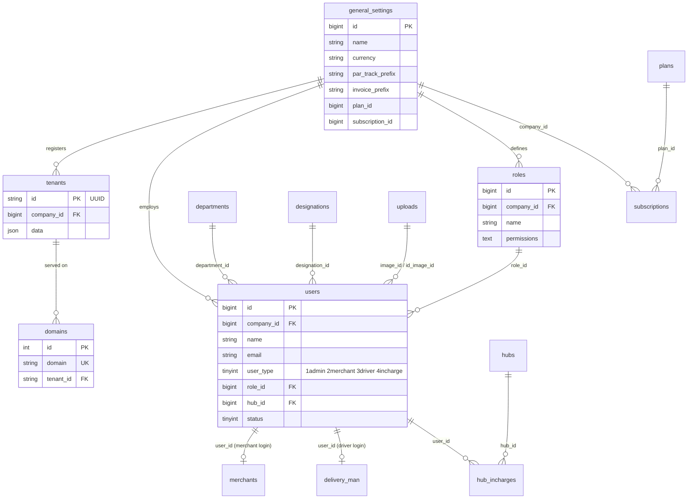
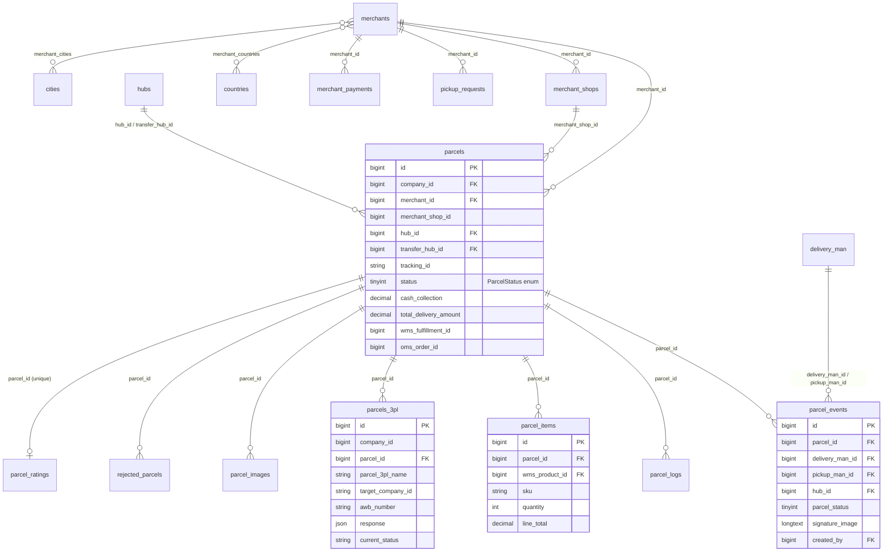
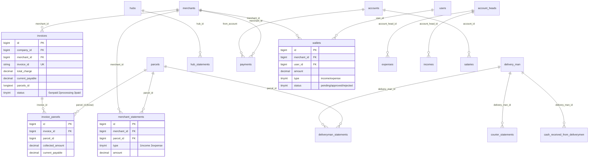
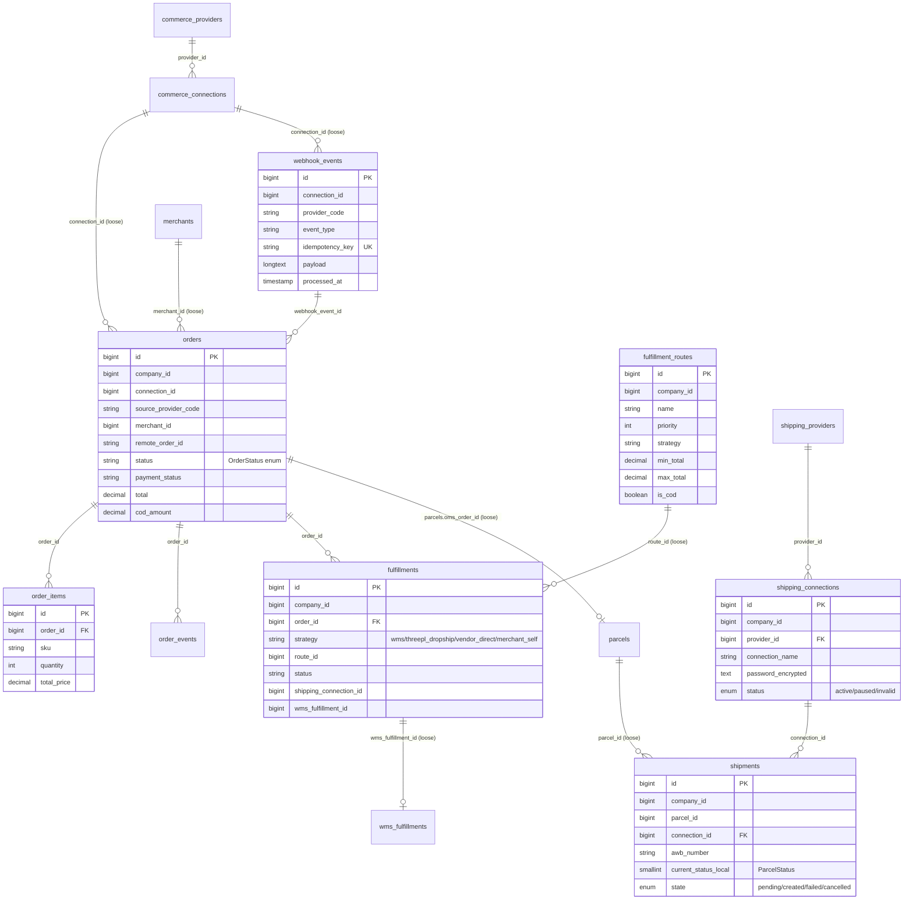
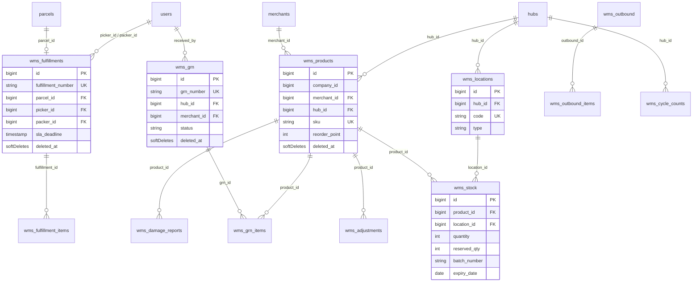
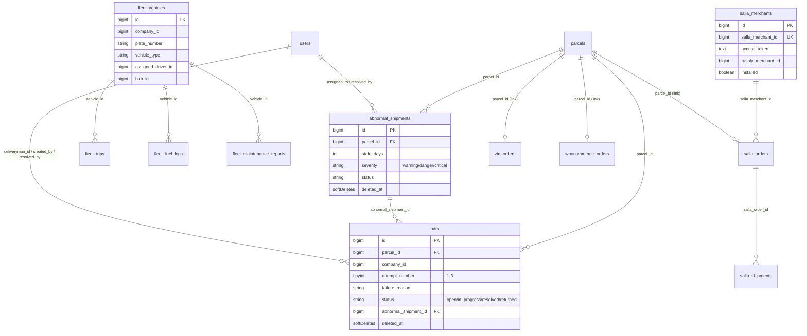

# 06 — Database (Schema, ER Diagrams, Data Dictionary)

> **Scope:** The relational schema of `rushly-saas` (the SSOT backend). Reverse-engineered
> from `database/migrations/*.php` (191 migrations) and cross-referenced against the Eloquent
> models under `app/Models/**`, `app/Oms/Models`, `app/Shipping/Models`, `app/Commerce/Models`,
> `app/Fulfillment/Models`, `app/Salla/Models`. Every claim cites a real migration or model file.
>
> Sibling docs: [02-Project-Overview.md](02-Project-Overview.md) · [03-Business-Domain.md](03-Business-Domain.md) · [04-Business-Logic.md](04-Business-Logic.md) · [shipping-architecture.md](shipping-architecture.md)

---

## 1. Tenancy model — how "tenant" actually works here

This is the single most important thing to understand before reading the schema.

**Rushly uses `stancl/tenancy ^3` for *subdomain identification only*, NOT for database separation.**
The `DatabaseTenancyBootstrapper` is **commented out** in `config/tenancy.php` (line 31):

```php
'bootstrappers' => [
    // Stancl\Tenancy\Bootstrappers\DatabaseTenancyBootstrapper::class,   // ← DISABLED
    Stancl\Tenancy\Bootstrappers\CacheTenancyBootstrapper::class,
    Stancl\Tenancy\Bootstrappers\FilesystemTenancyBootstrapper::class,
    Stancl\Tenancy\Bootstrappers\QueueTenancyBootstrapper::class,
    ...
],
```

Consequences (verified in `config/tenancy.php`, `app/Models/Tenant.php`, `app/Models/Backend/Parcel.php`):

- **One shared MySQL database.** There is **no per-tenant database** and **no `database/migrations/tenant/` folder** (confirmed: directory does not exist; `migration_parameters` points at `migrations/tenant` but that path is empty). All 191 migrations run on the central connection.
- A **"tenant" == a company == a row in `general_settings`.** The stancl `tenants` table (`2019_09_15_000010_create_tenants_table.php`) has a `company_id` FK → `general_settings`, and `tenants.id` is a UUID string keyed to a subdomain via the `domains` table.
- **Tenant isolation is enforced by a `company_id` column** on almost every business table, scoped in application code — e.g. `Parcel::booted()` adds a global scope `where('parcels.company_id', tenant()->company_id)` (`app/Models/Backend/Parcel.php:81-93`), and the codebase-wide `scopeCompanywise()` convention (`app/Models/Backend/Parcels_3pl.php:47`, `Parcel.php:409`).
- Central app domains: `127.0.0.1`, `localhost` (`config/tenancy.php` `central_domains`). Tenants are served on `{tenant}.rushly.tech` subdomains (per `_CONTEXT_BRIEF.md`).

### Central vs Tenant tables

Because everything lives in one DB, the split is **logical**, by whether a table carries a `company_id` scope:

| Class | Tables | Meaning |
|---|---|---|
| **Central / platform** (no `company_id`, or global reference data) | `general_settings` (the company/tenant registry itself), `tenants`, `domains`, `plans`, `currencies`, `nationalities`, `countries`, `cities`, `areas`/`emirates`, `packagings`, `deliverycategories`, `uploads`, `permissions`, `super_admin_permissions`, `shipping_providers`, `commerce_providers`, `integration_settings` (later tenant-scoped, see §7 Doc-vs-Code), `customer_domains`, `sessions`, `failed_jobs`, `personal_access_tokens`, `migrations`, `password_reset_tokens` | Shared reference/catalog data and the tenant registry. |
| **Tenant-scoped** (carry `company_id` → `general_settings`) | `users`, `merchants`, `delivery_man`, `hubs`, `parcels`, `orders`, `fulfillments`, `shipments`, `invoices`, `wallets`, all `*_statements`, all `wms_*`, `ndrs`, `abnormal_shipments`, `fleet_*`, `zatca_*`, `roles`, `tours`, `public_tracking_api_keys`, and ~120 more | Belong to exactly one company/tenant. |

> Note: `company_id` FKs are declared `constrained('general_settings')` in the older migrations (e.g. `users`, `parcels`, `invoices`) and as plain `unsignedBigInteger('company_id')->index()` (loose, no FK constraint) in the newer module migrations (OMS/Shipping/Commerce/WMS/Fleet) — an intentional decoupling so deleting a company doesn't cascade-nuke module history.

---

## 2. Entity-Relationship Diagrams (by domain)

The schema is far too large for one diagram, so it is split by bounded context. FKs shown reflect the migrations; `company_id → general_settings` is omitted from most diagrams for readability (assume it on every tenant table).

### 2.1 Identity, Tenancy & Access Control



### 2.2 Core Logistics — Parcels, Merchants, Hubs, Drivers



### 2.3 Finance — Invoices, Statements, Payments, Wallets



### 2.4 Commerce → OMS → Fulfillment → Shipping (the storefront pipeline)



### 2.5 WMS (Warehouse Management)



### 2.6 Exceptions (NDR / Abnormal), Fleet & Integrations



---

## 3. Data Dictionary (top ~55 tables)

Legend: **PK** primary key · **FK** foreign key · **UK** unique · **SD** soft-deletes (`deleted_at`). Money columns are `decimal`. Unless noted, every listed FK to `general_settings` is the `company_id` tenant scope.

### 3.1 Identity, Tenancy & Access

| Table | Purpose / business meaning | Key columns | Indexes / UK | FKs | Enums | SD |
|---|---|---|---|---|---|---|
| `general_settings` | **The company / tenant record.** Everything scopes to a row here. Holds branding, currency, tracking/invoice prefixes, active plan. | `name`, `currency`, `par_track_prefix`, `invoice_prefix`, `primary_color`, `plan_id`, `subscription_id`, `status` | — | (self-referenced by nearly every `company_id`) | `Status` | — |
| `tenants` | stancl subdomain-tenant registry. UUID id, one per company. | `id` (UUID PK), `data` (json) | — | `company_id`→`general_settings` | — | — |
| `domains` | Maps a hostname/subdomain to a tenant. | `domain` (UK), `tenant_id`, `domain_name` | `domain` UK | `tenant_id`→`tenants` | — | — |
| `users` | Unified account for **all** human roles (admin, merchant, driver, hub incharge) distinguished by `user_type`. Merchant/driver profiles hang off this via `merchants.user_id` / `delivery_man.user_id`. Extended with KSA HR fields (`name_en`, `nationality`, `id_type`, `id_number`, `id_expiry`). | `name`, `email`, `mobile`, `user_type`, `role_id`, `hub_id`, `permissions` (longText json), `device_token`, `status`, `first_login_at` | `unique_id` UK, `email`, `google_id`/`facebook_id` UK | `company_id`, `role_id`→roles, `hub_id`→hubs, `designation_id`, `department_id`, `image_id`→uploads | `UserType`, `Status`, `BooleanStatus` (company_owner) | — |
| `roles` | Per-company RBAC roles; permission set stored as `permissions` text (JSON). | `name`, `slug`, `permissions` | — | `company_id` | `Status` | — |
| `permissions` / `super_admin_permissions` | Permission catalog (`attribute` + `keywords`). Central (no company scope). | `attribute`, `keywords` | — | — | — | — |
| `plans` | SaaS subscription plans (parcel/deliveryman/day caps, price, `modules`, `user_count`). Central. | `name`, `parcel_count`, `deliveryman_count`, `days_count`, `price`, `modules` | — | — | `Status` | — |
| `subscriptions` | A company's active plan instance with usage caps and expiry. | `price`, `parcel_count`, `days_count`, `start_date`, `expired_date` | — | `company_id`, `plan_id` | — | — |

### 3.2 Core Logistics

| Table | Purpose | Key columns | Indexes / UK | FKs | Enums | SD |
|---|---|---|---|---|---|---|
| `merchants` | Merchant (shipper) profile & ledger. Balances, COD/VAT config, KSA KYC docs, custom theming, accounting-sync flags (qoyod/daftra/odoo). | `business_name`, `current_balance`, `wallet_balance`, `vat`, `cod_charges` (json), `return_charges`, `payment_period`, `status` | — | `company_id`, `user_id`→users, `nid_id`/`trade_license`→uploads | `Status` | — |
| `merchant_shops` | Pickup locations owned by a merchant (name, geo, `default_shop`). | `name`, `contact_no`, `merchant_lat/long`, `default_shop` | — | `merchant_id` | `Status` | — |
| `merchant_countries` / `merchant_cities` | Pivots for a merchant's geographic service coverage. | `merchant_id`, `country_id`/`city_id` | — | both sides | — | — |
| `hubs` | Warehouse / sorting-center nodes. Cash balance, geo. | `name`, `phone`, `hub_lat/long`, `current_balance` | — | `company_id` | `Status` | — |
| `hub_incharges` | Assignment pivot: which users manage which hubs. | `user_id`, `hub_id` | — | (loose) | `Status` | — |
| `delivery_man` | Driver profile & ledger extending a `user`. Per-driver charges & balances, KSA fields (`driver_type`, `license_expiry`, `iqama_expiry`, `iban`, `supplier_company_id`, `operational_area_id`). | `delivery_charge`, `pickup_charge`, `return_charge`, `current_balance`, `delivery_lat/long` | — | `company_id`, `user_id`, `direct_manager_id`→users, `supplier_company_id`, `operational_area_id` | `Status` | — |
| `parcels` | **The central shipment entity.** Sender (merchant/shop) + customer snapshot, geo, money breakdown (COD, VAT, delivery charge, payable), status lifecycle, links to hub/3PL/WMS/OMS. Global `tenant` scope on `company_id`. | `tracking_id`, `status`, `cash_collection`, `cod_amount`, `vat_amount`, `total_delivery_amount`, `current_payable`, `weight`, `pickup_date`, `delivery_date`, `wms_fulfillment_id`, `oms_order_id` | `oms_order_id`, `wms_fulfillment_id` idx | `company_id`, `merchant_id`, `hub_id`, `transfer_hub_id` | `ParcelStatus`, `BooleanStatus` | — |
| `parcel_events` | Immutable status-transition / event log per parcel (POD signature & photo, actor, geo). Drives tracking timeline. | `parcel_status`, `note`, `signature_image`, `delivered_image`, `delivery_lat/long` | — | `parcel_id`, `delivery_man_id`, `pickup_man_id`, `hub_id`, `transfer_delivery_man_id`, `created_by`, `company_id` (added later) | — | — |
| `parcel_logs` | Snapshot log of parcel field values (audit of edits). | mirror of parcel fields | — | `parcel_id`, `merchant_id`, `hub_id`, `delivery_man_id` | — | — |
| `parcel_items` | Line-items of a parcel (SKU, qty, price); optionally linked to a WMS product. | `sku`, `name`, `quantity`, `unit_price`, `line_total` | `parcel_id`, `wms_product_id` idx | `parcel_id` (cascade), `wms_product_id`→wms_products (nullOnDelete) | — | — |
| `parcels_3pl` | **Legacy 3PL dispatch record** (Aramex/Jet/Zajel/Logestechs/Panda). Stores provider name, target routing id, AWB, raw `response` JSON, last synced status. Being superseded by `shipments`. ⚠️ Table is **not created by any migration** — pre-existing/legacy; only ALTERs exist (`add_target_company_id`, `add_company_id`). | `parcel_3pl_name`, `target_company_id`, `awb_number`, `awb_pdf`, `response` (json), `current_status`, `status_datetime` | `parcels_3pl_target_company_id_idx`, `parcels_3pl_company_id_idx` | `parcel_id`, `company_id` (loose) | — | — |
| `parcel_ratings` | Post-delivery CSAT rating (1-5) per parcel; one per parcel. | `rating`, `comment`, `source`, `customer_phone` | `parcel_id` UK, company/driver+created idx | `parcel_id`, `deliveryman_id`, `merchant_id` (loose) | — | — |
| `pickup_requests` | Merchant-initiated pickup ask (regular vs express). | `request_type`, `parcel_quantity`, `cod_amount`, `weight`, `exchange` | — | `company_id`, `merchant_id` | `PickupRequestType` | — |

### 3.3 Finance

| Table | Purpose | Key columns | FKs | Enums |
|---|---|---|---|---|
| `invoices` | Merchant settlement invoice bundling delivered parcels; carries totals & payment status. `parcels_id` is a denormalized list (longText). | `invoice_id` (UK), `total_charge`, `cash_collection`, `current_payable`, `status` | `company_id`, `merchant_id` | `InvoiceStatus` (0 unpaid / 2 processing / 3 paid) |
| `invoice_parcels` | Normalized invoice↔parcel line rows with per-parcel money breakdown. | `parcel_id`, `collected_amount`, `return_charge`, `vat_amount`, `cod_amount`, `current_payable` | `invoice_id`, `company_id` | `parcel_status` |
| `merchant_statements` | Merchant ledger entries (income/expense) tied to parcels. | `type` (1 income/2 expense), `amount`, `date`, `note` | `merchant_id`, `parcel_id`, `delivery_man_id`, `company_id` | — |
| `deliveryman_statements` | Driver ledger; also records COD cash-collection flag. | `type`, `amount`, `cash_collection`, `hub_id` | `delivery_man_id`, `parcel_id`, `company_id` | — |
| `courier_statements` | Courier/3PL ledger; linked to `incomes`. Has accounting-sync fields (qoyod/odoo). | `type`, `amount` | `delivery_man_id`, `parcel_id`, `income_id`, `company_id` | — |
| `hub_statements` | Hub cash ledger (income/expense against accounts). | `type`, `amount`, `date` | `hub_id`, `user_id`, `account_id`, `delivery_man_id`, `company_id` | — |
| `vat_statements` | VAT accrual records. | — | `company_id` | — |
| `accounts` | Chart-of-accounts / bank & cash accounts with running `balance`. | `type`, `gateway`, `balance`, `account_no`, `bank` | `company_id`, `user_id` | `AccountType`, `Status` |
| `account_heads` | Income/expense category headings. | `name` | `company_id` | `AccountHeads` |
| `expenses` / `incomes` | Bookkeeping entries against an account head & account, optionally tied to parcel/merchant/driver/hub. | `amount`, `date`, `title`, `receipt` | many (`account_head_id`, `account_id`, `parcel_id`, …) | — |
| `payments` | Merchant payout/settlement transactions (approval workflow). | `amount`, `transaction_id`, `status`, `created_by` | `merchant_id`, `from_account`→accounts, `reference_file`→uploads | `ApprovalStatus`, `UserType` |
| `merchant_payments` | Merchant's saved payout method (bank/mobile). | `payment_method`, `bank_name`, `account_no`, `mobile_no` | `merchant_id` | `Status` |
| `wallets` | Merchant/user wallet ledger (top-ups & spends, approval-gated). | `amount`, `type`, `payment_method`, `status`, `transaction_id` | `merchant_id`, `user_id`, `company_id` | `WalletType`, `WalletPaymentMethod`, `WalletStatus` |
| `cash_received_from_deliverymen` | Records cash handed in by drivers to a hub/account, with receipt. | `amount`, `date`, `receipt` | `delivery_man_id`, `hub_id`, `account_id`, `user_id` | — |
| `salaries` | Monthly payroll payments to users. | `month`, `amount`, `date` | `user_id`, `account_id`, `company_id` | — |
| `fund_transfers` | Inter-account transfers. | `amount` | `company_id` | — |

### 3.4 Commerce / OMS / Fulfillment / Shipping (module layer)

| Table | Purpose | Key columns | Indexes / UK | FKs | Enums (values in code) |
|---|---|---|---|---|---|
| `commerce_providers` | Catalog of storefront platforms (`salla`, `zid`, `shopify`, `woocommerce`). Central. | `code` (UK), `name`, `status`, `supports` (json capabilities) | `code` UK | — | status active/disabled |
| `commerce_connections` | A tenant's storefront install: encrypted OAuth/API creds, webhook secret, target merchant, status. | `connection_name`, `remote_store_id`, encrypted tokens, `is_default` | `(company_id,provider_id,name)` UK, `(provider_id,remote_store_id)` UK | `provider_id`, `merchant_id` (loose), `company_id` | status active/paused/invalid/reauth_required |
| `commerce_api_logs` | Outbound API call log for commerce providers (pruned by cron `commerce:prune-logs`). | `endpoint`, `method`, `response_status`, `duration_ms`, `error` | created_at idx | `connection_id`, `company_id` | — |
| `webhook_events` | **Inbound webhook inbox** — raw payload + idempotency key + processing state. The ingestion entry point (`app/Commerce/Services/WebhookIngestService`). | `provider_code`, `event_type`, `idempotency_key` (UK), `payload`, `processed_at`, `attempts`, `last_error`, `normalized_payload` | `idempotency_key` UK | `connection_id`, `company_id` (loose) | — |
| `orders` | **Canonical OMS order** — provider-agnostic normalized order (customer + shipping snapshot, money, canonical statuses). Source of the storefront→parcel pipeline. | `source_provider_code`, `remote_order_id`, `status`, `payment_status`, `fulfillment_status`, `total`, `cod_amount`, `currency`, `normalized_snapshot` (json), `occurred_at`, `received_at` | `(connection_id,remote_order_id)` UK, many composite idx | `connection_id`, `merchant_id`, `webhook_event_id`, `company_id` (loose) | `OrderStatus`, `PaymentStatus`, `FulfillmentStatus` (string enums in `app/Oms/Enums`) |
| `order_items` | Line items of an OMS order. | `sku`, `name`, `quantity`, `unit_price`, `total_price`, `remote_product_id` | `(order_id,sort_order)` idx | `order_id` (cascade) | — |
| `order_events` | Order lifecycle audit (`created`, `status_changed`, `parcel_linked`). | `event_type`, `payload` (json), `user_id`, `occurred_at` | `(order_id,occurred_at)` idx | `order_id` (cascade), `company_id` | — |
| `fulfillments` | **Fulfillment attempt** for an order — records which strategy handled it and the strategy-specific target (shipping connection / WMS / hub). Written by `app/Fulfillment/Services/FulfillmentRouter.php`. | `strategy`, `status`, `external_reference`, `payload` (json), `last_error`, `started_at`/`completed_at`/`failed_at` | `(company_id,status)`, `(order_id,created_at)` idx | `order_id` (cascade), `route_id`, `shipping_connection_id`, `wms_fulfillment_id`, `hub_id` (loose) | strategy: wms / threepl_dropship / vendor_direct / merchant_self |
| `fulfillment_routes` | **Routing rules** — priority-ordered conditions (merchant, city, country, total range, COD flag) → target strategy. Router picks first match. | `name`, `priority`, `is_active`, `min_total`, `max_total`, `is_cod`, `strategy` | `(company_id,is_active,priority)` idx | `merchant_id`, `shipping_connection_id`, `hub_id` (loose) | — |
| `fulfillment_defaults` | Per-company (or global) default strategy selection for each service tier. | `default_strategy`, `service_last_mile_strategy`, `service_fulfillment_strategy`, `service_storage_strategy` | — | `company_id` (null = global) | — |
| `shipping_providers` | Catalog of last-mile couriers (`logestechs`, `oto`, …). Central. | `code` (UK), `name`, `status`, `supports` (json) | `code` UK | — | status active/disabled |
| `shipping_connections` | A tenant's courier account: encrypted credentials, remote company id, default flag. | `connection_name`, `remote_company_id`, `domain`, `password_encrypted`, `settings` (json), `is_default`, `last_sync_at` | `(company_id,provider_id,name)` UK | `provider_id`, `company_id` | status active/paused/invalid |
| `shipments` | **Courier shipment** created for a parcel via a connection — remote id, AWB, PDF, mapped status, raw request/response. Synced by cron `shipping:sync-tracking`. | `remote_shipment_id`, `awb_number`, `awb_pdf_url`, `current_status_raw`, `current_status_local`, `state`, `request_payload`/`response_payload` (json) | `(connection_id,remote_shipment_id)` UK | `parcel_id` (loose), `connection_id` (cascade), `company_id` | `state` pending/created/failed/cancelled; `current_status_local`→`ParcelStatus` |
| `shipping_api_logs` | Outbound courier API call log (pruned by `shipping:prune-logs`). | `endpoint`, `method`, `response_status`, `duration_ms`, `error` | created_at idx | `connection_id`, `company_id` (nullable) | — |

### 3.5 WMS

| Table | Purpose | Key columns | UK | FKs | SD |
|---|---|---|---|---|---|
| `wms_products` | Merchant SKU catalog within a hub. Reorder point, expiry tracking, dims. | `name`, `sku` (UK), `barcode`, `reorder_point`, `track_expiry`, `unit` | `sku` | `merchant_id`, `hub_id`, `company_id` | ✅ |
| `wms_locations` | Bin/rack storage locations in a hub (`code` = zone-aisle-rack-shelf-bin). | `zone`, `aisle`, `rack`, `shelf`, `bin`, `code` (UK), `type`, `capacity` | `code` | `hub_id` | — |
| `wms_stock` | On-hand + reserved quantity per product/location/batch. | `quantity`, `reserved_qty`, `batch_number`, `lot_number`, `expiry_date` | `(product_id,location_id,batch_number)` | `product_id`, `location_id` | — |
| `wms_grn` | Goods-received note (inbound receipt header). | `grn_number` (UK), `status`, `reference_number`, `received_at` | `grn_number` | `hub_id`, `merchant_id`, `received_by`→users | ✅ |
| `wms_grn_items` | GRN line items (expected vs received qty, condition, batch). | `expected_qty`, `received_qty`, `condition`, `batch_number` | — | `grn_id`, `product_id`, `location_id` | — |
| `wms_fulfillments` | Pick/pack/dispatch order tied to a parcel; SLA deadline, picker/packer, timestamps. Bridges WMS to last-mile. | `fulfillment_number` (UK), `status`, `sla_deadline`, `picked_at`, `packed_at`, `dispatched_at` | `fulfillment_number` | `parcel_id`, `hub_id`, `merchant_id`, `picker_id`/`packer_id`→users | ✅ |
| `wms_fulfillment_items` | Pick list lines (required vs picked qty). | `quantity_required`, `quantity_picked`, `status` | — | `fulfillment_id`, `product_id`, `location_id` | — |
| `wms_outbound` | Outbound movement header (`type` per `OutboundType`). Loose `fulfillment_id` pointer. | `outbound_number` (UK), `type`, `status`, `completed_at` | `outbound_number` | `hub_id`, `merchant_id`, `processed_by`→users | ✅ |
| `wms_outbound_items` | Outbound lines. | `quantity`, `batch_number` | — | `outbound_id`, `product_id`, `location_id` | — |
| `wms_adjustments` | Stock adjustment audit with **dual-approval** workflow. | `quantity_before/after/change`, `reason`, `approval_status`, `photo` | — | `product_id`, `location_id`, `adjusted_by`, `approved_by`→users | — |
| `wms_cycle_counts` | Cycle-count task (scope/zone, assignee, status). | `count_number` (UK), `scope`, `zone`, `status` | `count_number` | `hub_id`, `assigned_to`→users | — |
| `wms_damage_reports` | Damaged-stock reports with photos & action taken. | `quantity_damaged`, `cause`, `photos` (json), `action_taken` | — | `product_id`, `location_id`, `reported_by`→users | — |

### 3.6 Exceptions, Fleet, Support, Integrations

| Table | Purpose | Key columns | FKs | Enums | SD |
|---|---|---|---|---|---|
| `ndrs` | **Non-Delivery Report** — a failed delivery attempt with reason, driver evidence, resolution action, next attempt. Links to `abnormal_shipments`. | `attempt_number` (1-3), `failure_reason`, `driver_notes`, `driver_photo`, `action_taken`, `next_attempt_date`, `status` | `parcel_id`, `deliveryman_id`/`created_by`/`resolved_by`→users, `abnormal_shipment_id` | `NdrStatus`, `NdrFailureReason`, `NdrAction` | ✅ |
| `abnormal_shipments` | Stuck/stalled parcel flagged by cron (`stale_days`, `severity`), with investigation & escalation workflow. | `detected_at`, `last_event_at`, `stale_days`, `severity`, `status`, `escalated_at` | `parcel_id`, `assigned_to`/`resolved_by`→users | `AbnormalSeverity` (warning/danger/critical) | ✅ |
| `fleet_vehicles` | Owned/managed vehicles (plate, type, odometer, assigned driver). | `plate_number`, `vehicle_type`, `status`, `current_odometer` | `assigned_driver_id`, `hub_id` (loose) | type van/truck/motorbike/car | — |
| `fleet_trips` | Driver trip with start/end odometer, geo, pre-trip `start_inspection` (json). | `start_odometer`, `end_odometer`, `started_at`, `status` | `vehicle_id`, `driver_id` | status in_progress/completed | — |
| `fleet_fuel_logs` | Fuel fill-ups (liters, cost, odometer, receipt). | `liters`, `cost`, `odometer_reading`, `filled_at` | `vehicle_id`, `driver_id` | — | — |
| `fleet_maintenance_reports` | Vehicle issue reports (type, severity, resolution). | `issue_type`, `severity`, `status`, `reported_at` | `vehicle_id`, `driver_id` | severity low/medium/high/critical | — |
| `supports` | Support ticket. | `service`, `priority`, `subject`, `description`, `status` | `user_id`, `department_id`, `support_driver_id` (added later) | `SupportStatus` | — |
| `support_chats` | Threaded messages on a support ticket. | `message`, `attached_file` | `support_id`, `user_id` | — | — |
| `frauds` | Fraud watchlist (phone/name/tracking flagged). | `phone`, `name`, `tracking_id`, `details` | `created_by`→users, `company_id` | — | — |
| `integration_settings` | Global bridge config per platform (Salla/Zid/Shopify): enabled flag, app URL, writeback token, defaults. Later tenant-scoped (see §7). | `platform` (UK), `is_enabled`, `app_url`, `writeback_token`, `api_base`, `default_city_id` | — | — | — |
| `salla_merchants` | Salla store install (in the SSOT `app/Salla` bridge): OAuth tokens, linked Rushly merchant. | `salla_merchant_id` (UK), `access_token`, `refresh_token`, `rushly_merchant_id`, `installed` | `rushly_merchant_id` idx | — | — |
| `salla_orders` | Salla order mirror (customer/shipping/total snapshot + raw `payload`). ⚠️ Two migrations create `salla_orders`; the first was renamed to `salla_order_links` (see §7). | `salla_order_id`, `reference_id`, `status`, `total`, `payload` | `salla_merchant_id` (cascade) | — | — |
| `salla_order_links` | (renamed from the original `salla_orders`) Link row: Salla order ↔ Rushly parcel + pushed AWB/status. | `salla_order_id`, `parcel_id`, `salla_awb_number`, `last_pushed_status` | `merchant_id`, `parcel_id`, `company_id` (loose) | — | — |
| `salla_shipments` | Rushly-side shipment for a Salla order (tracking number, AWB, label). | `rushly_tracking_number` (UK), `awb_number`, `status`, `last_synced_at`, `shipment_number` | `salla_order_id` (cascade) | status pending/… | — |
| `salla_webhook_logs` | Salla inbound webhook audit (signature validity, rejection reason, timing). | `event`, `status`, `signature_valid`, `rejection_reason`, `duration_ms`, `ip` | — | — | — |
| `zid_orders` / `woocommerce_orders` | Storefront order↔parcel link rows for Zid / WooCommerce (mirror `salla_order_links`, keyed by `(store,order)`). | `zid_store_id`+`zid_order_id` UK / `site_url`+`wc_order_id` UK, `*_awb_number`, `last_pushed_status` | `merchant_id`, `parcel_id`, `company_id` (loose) | — | — |
| `zatca_settings` | Per-company ZATCA (Saudi e-invoicing) config: seller info, VAT number, mode, invoice counter/hash chain. | `vat_number`, `mode`, `enabled`, `auto_generate`, `last_invoice_counter`, `last_invoice_hash` | `company_id` (UK) | — | — |
| `zatca_invoices` | Generated ZATCA e-invoice: XML/QR/PDF payloads, hash chain, status. | `uuid`, `invoice_number`, `subtotal`, `vat_amount`, `total_inclusive`, `qr_payload`, `xml_payload`, `hash`, `previous_hash`, `status` | `invoice_id`, `merchant_id`, `company_id` | status pending/… | — |
| `qoyod_settings` / `daftra_settings` / `odoo_settings` | Per-company accounting-integration credentials & default mappings (one row per company, `company_id` UK). Live sync engines under `app/Qoyod`, `app/Daftra`, `app/Odoo`. | `enabled`, `api_key`, `vat_percent`, default account/journal ids, `last_synced_at` | `company_id` (UK) | — | — |
| `public_tracking_api_keys` | Hashed API keys for the public parcel-tracking API (origin allow-list, usage counters). | `key_hash` (UK), `key_prefix`, `allowed_origins` (json), `is_active`, `request_count` | `company_id` | — | — |
| `tours` / `tour_steps` / `user_tour_progress` / `tour_events` | In-app product tour/onboarding definitions, steps, per-user progress & analytics. | `key`, `module`, `role_scope`, `auto_start`, `trigger_route` | `company_id` | — | — |
| `configs` / `settings` / `merchant_settings` | Generic key/value config stores (company-level and merchant-level). | `key`, `value` | `company_id` / `merchant_id` | — | — |
| `currencies` | Currency catalog (code, symbol, exchange rate, position). Central. | `code`, `symbol`, `exchange_rate`, `position` | — | `Status` | — |
| `uploads` | Polymorphic file store (`original` + resized variants `one/two/three`). Central; referenced by dozens of `*_id`→uploads FKs. | `original`, `one`, `two`, `three` | — | — | — |

---

## 4. Relationship Overview (how the entities connect)

**The spine is `parcels`.** A parcel is created either manually (admin/merchant portal) or automatically from the storefront pipeline, and everything downstream references it:

1. **Storefront → Order → Fulfillment → Parcel pipeline**
   `commerce_connections` receive `webhook_events` → normalized into `orders` (+`order_items`) → the `FulfillmentRouter` matches a `fulfillment_routes` rule and writes a `fulfillments` row selecting a *strategy*:
   - `wms` → creates a `wms_fulfillments` (pick/pack) → eventually a `parcels` row (`parcels.wms_fulfillment_id`).
   - `threepl_dropship` / `vendor_direct` → creates a `shipments` row against a `shipping_connections` (courier) which produces an AWB.
   - `merchant_self` → merchant handles it.
   The resulting parcel back-links via `parcels.oms_order_id`. (See [FULFILLMENT.md] / `app/Fulfillment/Services/FulfillmentRouter.php`.)

2. **Last-mile execution** — `parcels` gains `parcel_events` for every state change (POD signature/photo, actor, geo). `delivery_man` (a `users` profile) is assigned via events. Status flows through the 30+ `ParcelStatus` constants (`app/Enums/ParcelStatus.php`).

3. **3PL dispatch** — legacy path writes `parcels_3pl` (Aramex/Jet/Zajel/Logestechs); the new generic path writes `shipments` via `app/Shipping`. Both hang off a parcel.

4. **Exception handling** — a failed attempt writes an `ndrs` row; a cron flags stuck parcels into `abnormal_shipments`; the two cross-link (`ndrs.abnormal_shipment_id`).

5. **Money settlement** — delivered parcels roll into `invoices` (+`invoice_parcels`) for merchant settlement; ledger movements land in `merchant_statements`, `deliveryman_statements`, `courier_statements`, `hub_statements`; payouts via `payments`; top-ups via `wallets`; cash reconciliation via `cash_received_from_deliverymen`. ZATCA e-invoices (`zatca_invoices`) and external accounting sync (qoyod/daftra/odoo) sit alongside.

6. **Store-order link tables** (`salla_order_links`, `zid_orders`, `woocommerce_orders`) map a native storefront order to a Rushly `parcel` and carry the AWB/status pushed back to the store.

**Cardinality highlights:**
- `merchants (1) → (N) parcels`, `merchant_shops`, `invoices`, `wms_products`, `payments`.
- `parcels (1) → (N) parcel_events`, `parcel_items`, `parcels_3pl`, `shipments`; `(1) → (0..1) parcel_ratings`, `wms_fulfillments`, `orders` (via `oms_order_id`).
- `orders (1) → (N) order_items`, `order_events`, `fulfillments`.
- `hubs (1) → (N) parcels`, `wms_locations`, `wms_grn`, `fleet_vehicles`, `hub_incharges`.
- `users` is the polymorphic actor: it is the login for `merchants`, `delivery_man`, and hub staff, and the `created_by`/`resolved_by`/`picker_id`/etc. on dozens of tables.

---

## 5. Enums referenced by the schema

Enums are PHP classes (mostly integer constants) under `app/Enums/**`, stored as `tinyint`/`string` columns with a DB `comment` documenting values.

| Enum | Column(s) | Values (from `app/Enums/*`) |
|---|---|---|
| `ParcelStatus` | `parcels.status`, `parcel_events.parcel_status`, `shipments.current_status_local` | 30+ constants: 1 PENDING, 2 PICKUP_ASSIGN, 4 RECEIVED_BY_PICKUP_MAN, 5 RECEIVED_WAREHOUSE, 6 TRANSFER_TO_HUB, 7 DELIVERY_MAN_ASSIGN, 9 DELIVERED, 11 RETURN_WAREHOUSE, 13 RETURNED_MERCHANT, 24 RETURN_TO_COURIER, 30 RETURN_RECEIVED_BY_MERCHANT … (+ `_CANCEL` variants) |
| `UserType` | `users.user_type` | 1 ADMIN, 2 MERCHANT, 3 DELIVERYMAN, 4 INCHARGE |
| `Status` | many `status` cols | 1 ACTIVE, 0 INACTIVE |
| `InvoiceStatus` | `invoices.status` | 0 UNPAID, 2 PROCESSING, 3 PAID |
| `ApprovalStatus` | `payments.status` | 1 REJECT, 2 APPROVED, 3 PENDING, 4 PROCESSED |
| `ParcelType` | parcel category | 1 FRAGILE, 2 LIQUID, 3 GROCERY, 4 FROZEN, 5 DRYFOOD, 6 SWEET, 7 COSMETICS |
| `WalletType` / `WalletStatus` / `WalletPaymentMethod` | `wallets.*` | INCOME/EXPENSE · PENDING/APPROVED/REJECTED · OFFLINE… |
| `NdrStatus` / `NdrFailureReason` / `NdrAction` | `ndrs.*` | open/in_progress/resolved/returned · CUSTOMER_ABSENT/WRONG_ADDRESS/REFUSED_DELIVERY/… · reschedule/return_to_merchant/transfer_hub/escalate |
| `AbnormalSeverity` | `abnormal_shipments.severity` | warning (3-4d) / danger (5-6d) / critical (7+d) |
| `PickupRequestType` | `pickup_requests.request_type` | REGULAR / EXPRESS |
| `AccountType`, `AccountHeads`, `SupportStatus`, `SmsSendStatus`, `PaymentType`, `LabelTemplate` | respective tables | see `app/Enums/*` |
| `OrderStatus`, `PaymentStatus`, `FulfillmentStatus` (string enums) | `orders.*` | `app/Oms/Enums/*` — pending/…, unknown/paid/…, unfulfilled/… |
| WMS string enums (`GrnStatus`, `OutboundType`, `PickingStrategy`, `LocationType`, `ProductUnit`, `ItemCondition`, `AdjustmentReason`, `FulfillmentStatus`) | `wms_*` string cols | `app/Enums/Wms/*` |

---

## 6. Soft deletes

Only a subset of tables use `deleted_at` (verified via `use SoftDeletes` in models):
`ndrs`, `abnormal_shipments`, `wms_products`, `wms_fulfillments`, `wms_grn`, `wms_outbound`
(and their migrations declare `$table->softDeletes()`).
Most core tables (`parcels`, `users`, `merchants`, `orders`, `invoices`, statements) are **hard-deleted or never deleted** and rely on `status` flags for lifecycle instead.

---

## 7. ⚠️ Doc vs Code notes

- **Tenancy is single-database, not multi-database.** Any doc implying per-tenant databases is outdated: `DatabaseTenancyBootstrapper` is commented out in `config/tenancy.php`, there is no `database/migrations/tenant/` directory, and isolation is via the `company_id` column + `tenant()->company_id` global scopes. `stancl/tenancy` is used purely for subdomain identification. This aligns with `_CONTEXT_BRIEF.md` (UUID tenant IDs, `tenant_model = App\Models\Tenant`) but the *database* dimension is column-scoped, not DB-scoped.
- **`parcels_3pl` has no CREATE migration.** The table is legacy/pre-existing (the model comment says "matches your table", `app/Models/Backend/Parcels_3pl.php`). Only `ALTER` migrations exist (`2026_05_29…add_target_company_id`, `2026_07_01…add_company_id`). Fresh installs must obtain this table from the base courier product's schema/seed, not from `database/migrations`.
- **`salla_orders` is defined twice.** The first migration (`2026_05_24_000001_create_salla_orders_table.php`) creates a *link* table, which `2026_06_24_100000_rename_salla_orders_to_salla_order_links.php` renames to `salla_order_links`. A **second** `2026_06_24_100002_create_salla_orders_table.php` then creates a different `salla_orders` (the Salla bridge order mirror under `app/Salla/Models/Order.php`). So today: `salla_order_links` = parcel link, `salla_orders` = Salla order snapshot. Reading migrations chronologically is required to avoid confusion.
- **`integration_settings` scope changed.** Originally central with `platform` UK (`2026_05_24_000003`); `2026_06_25_010001_scope_integration_settings_to_tenant.php` re-scopes it per tenant. Treat it as tenant-scoped in current code.
- **Framework version:** `composer.json` pins Laravel `^10.10` (not 12, despite `README.md`), so all schema uses Laravel 10 Blueprint semantics (`foreignId()->constrained()`, `useCurrent()`, `softDeletes()`).

---

## 8. Sources

Migrations read (representative — of 191 in `database/migrations/`):
- Identity/tenancy: `2014_10_11_000000_create_users_table.php`, `2019_09_15_000010_create_tenants_table.php`, `2019_09_15_000020_create_domains_table.php`, `2014_05_31_094551_create_general_settings_table.php`, `2014_10_10_040240_create_roles_table.php`, `2022_04_23_032024_create_permissions_table.php`, `2023_12_24_115931_create_super_admin_permissions_table.php`, `2023_12_24_102349_create_plans_table.php`, `2023_12_28_090620_create_subscriptions_table.php`, `2026_06_12_000001_extend_deliveryman_form.php`
- Logistics: `2014_10_11_000001_create_merchants_table.php`, `2022_04_10_050353_create_merchant_shops_table.php`, `2014_09_12_000000_create_hubs_table.php`, `2022_04_04_142330_create_hub_incharges_table.php`, `2022_04_04_142330_create_delivery_man_table.php`, `2022_04_04_142330_create_parcels_table.php`, `2022_04_27_123343_create_parcel_events_table.php`, `2022_04_24_045606_create_parcel_logs_table.php`, `2026_06_12_000003_add_merchant_services_and_parcel_items.php`, `2026_06_12_000005_add_merchant_geo_coverage.php`, `2026_05_23_100012_add_wms_fulfillment_id_to_parcels.php`, `2026_07_01_130001_add_oms_order_id_to_parcels.php`, `2026_05_29_000001_add_target_company_id_to_parcels_3pl.php`, `2026_07_01_140001_add_company_id_to_parcels_3pl.php`, `2026_06_27_130000_add_parcel_ratings_and_support_driver_id.php`, `2022_09_08_102027_create_pickup_requests_table.php`
- Finance: `2022_10_11_121745_create_invoices_table.php`, `2024_09_04_063833_create_invoice_parcels_table.php`, `2022_05_15_102801_create_merchant_statements_table.php`, `2022_05_14_112717_create_deliveryman_statements_table.php`, `2022_05_17_132716_create_courier_statements_table.php`, `2022_06_04_104751_create_hub_statements_table.php`, `2022_04_13_054047_create_accounts_table.php`, `2022_04_14_063624_create_payments_table.php`, `2022_04_13_034848_create_merchant_payments_table.php`, `2023_10_17_122352_create_wallets_table.php`, `2022_06_05_140650_create_cash_received_from_deliverymen_table.php`, `2022_05_14_112715_create_expenses_table.php`, `2022_05_17_124213_create_incomes_table.php`, `2022_05_31_150039_create_salaries_table.php`
- Modules: `2026_06_30_130301..130305_*` (shipping), `2026_06_30_140001..140004_*` + `2026_06_30_160001_create_webhook_events_table.php` (commerce), `2026_07_01_110001..110003_*` (orders), `2026_07_01_120001..120002_*`, `2026_07_01_150001_create_fulfillment_defaults_table.php` (fulfillment), `2026_05_23_100000..100011_*` (WMS), `2026_05_23_010000/020000_*` (abnormal/ndr), `2026_07_17_100000_create_fleet_tables.php`, `2026_06_20_000001..000003_*` (zatca), `2026_06_24_110001/120001/130001_*` (accounting settings), `2026_05_24_000001..000005_*` + `2026_06_24_100001..100005_*` (salla/zid/woo/integration), `2026_07_02_100001_create_public_tracking_api_keys_table.php`, `2026_07_01_100001_create_tours_table.php`
- Config: `config/tenancy.php`
- Models (relationship & soft-delete verification): `app/Models/Backend/Parcel.php`, `app/Models/Backend/Merchant.php`, `app/Models/Backend/Parcels_3pl.php`, `app/Models/User.php`, `app/Models/Tenant.php`, `app/Oms/Models/Order.php`, `app/Models/Backend/Ndr.php`, `app/Models/Backend/AbnormalShipment.php`, `app/Models/Backend/Wms/*.php`, `app/Shipping/Models/*.php`, `app/Commerce/Models/*.php`, `app/Fulfillment/Models/*.php`, `app/Salla/Models/*.php`
- Enums: `app/Enums/ParcelStatus.php`, `UserType.php`, `Status.php`, `InvoiceStatus.php`, `ApprovalStatus.php`, `ParcelType.php`, `NdrStatus.php`, `AbnormalSeverity.php`, `app/Enums/Wallet/*`, `app/Enums/Wms/*`
- Shared context: `docs/_CONTEXT_BRIEF.md`
