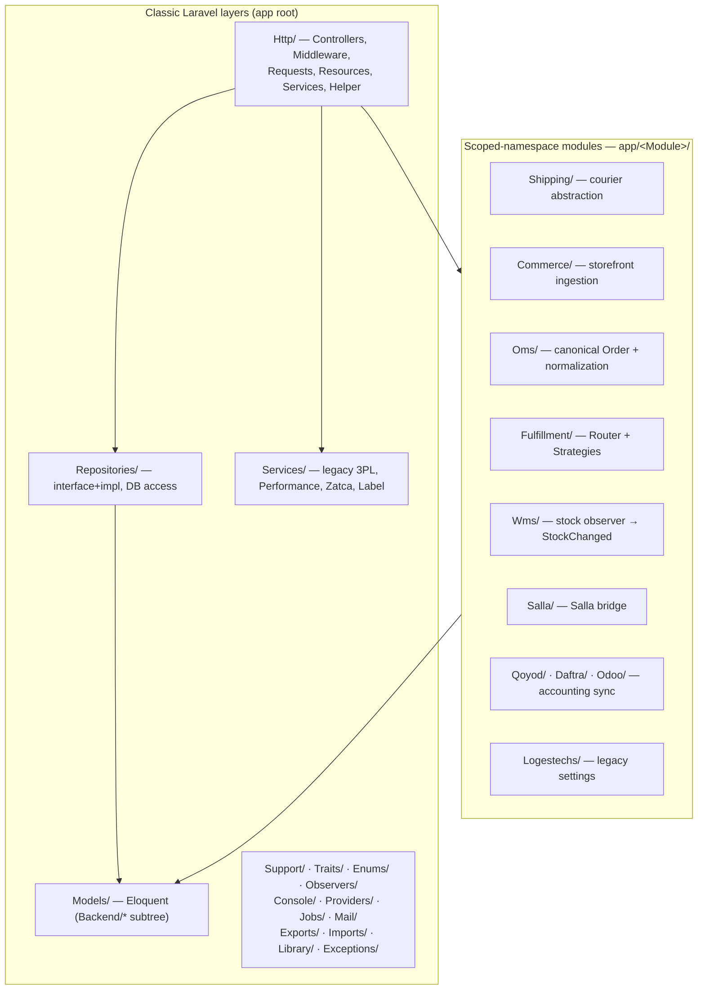
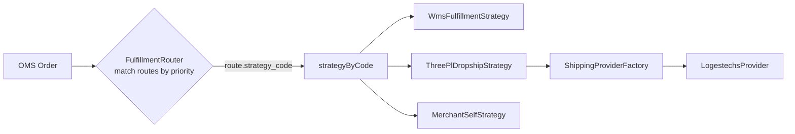
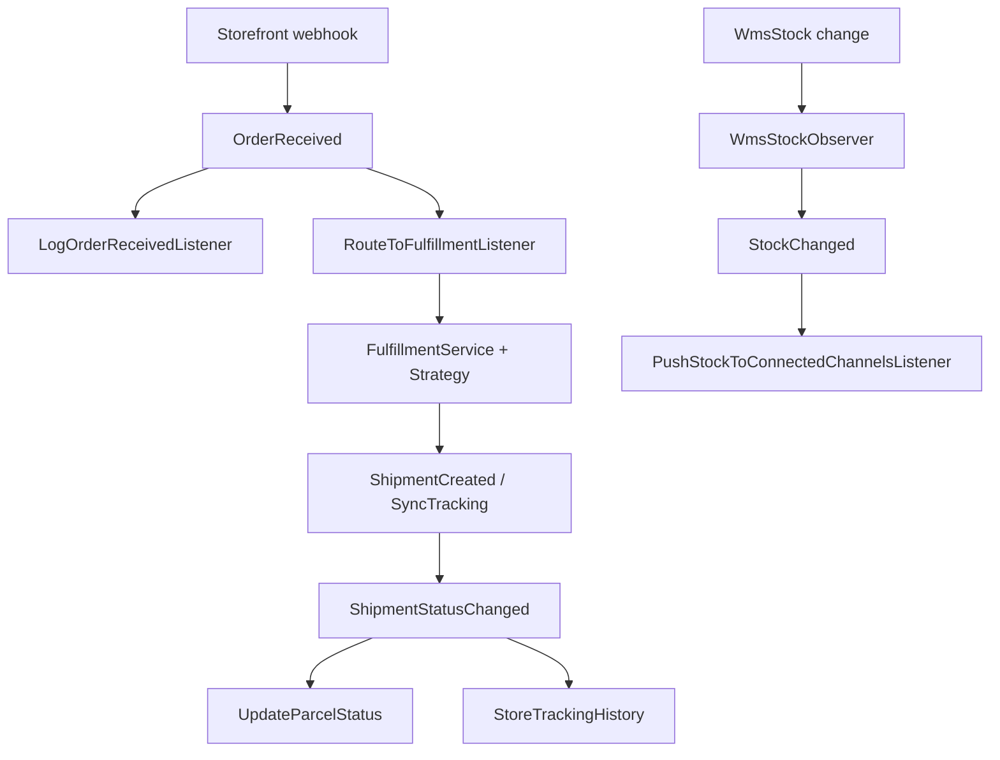
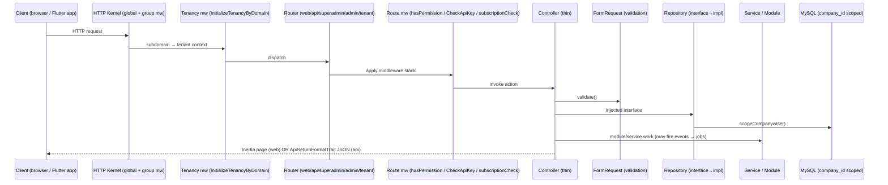

# 07 — Laravel Backend Deep-Dive

> **Scope:** Phase 4 — the `rushly-saas` Laravel backend, layer by layer: directory/module map, controllers, service layer, repositories, action/strategy classes, policies, middleware, observers, traits, enums, jobs/queues, events/listeners, console commands & scheduler, service providers, and the `app/<Module>/` scoped-namespace convention.
>
> `rushly-saas` (`/var/www/rushly-saas`) is the **single source of truth** for the whole Rushly ecosystem. Every Flutter app (driver, merchant, admin, warehouse, sorting, scanner, supervisor, fleet) is a client of this backend's API. See [_CONTEXT_BRIEF.md](_CONTEXT_BRIEF.md).
>
> Sibling docs: [05-System-Architecture.md](05-System-Architecture.md) · [06-Database.md](06-Database.md) · [04-Business-Logic.md](04-Business-Logic.md) · [03-Business-Domain.md](03-Business-Domain.md)

---

## 0. Stack & version reality (⚠️ Doc vs Code)

| Concern | Docs claim | Code truth | Source |
|---|---|---|---|
| Framework | "Laravel 12" (`README.md` line 3, `ARCHITECTURE.md` §2) | **Laravel `^10.10`** | `composer.json` `require."laravel/framework"` |
| PHP | "8.4 (production)" (`ARCHITECTURE.md` §2) | **`^8.1`** required | `composer.json` `require.php` |
| Controllers | "~125 total" (`ARCHITECTURE.md` §7) | **219 controller files** | `find app/Http/Controllers -name '*.php'` |
| Frontend | "Blade views, Vite unused" (`ARCHITECTURE.md` §2) | Mid-migration **Blade → Inertia.js + React** (191 `.jsx` pages); `inertiajs/inertia-laravel ^2` + `HandleInertiaRequests` middleware active | `composer.json`, `app/Http/Middleware/HandleInertiaRequests.php`, `_CONTEXT_BRIEF.md` |
| Policies | "AuthServiceProvider — Gates/policies" (`ARCHITECTURE.md` §13) | **No policies exist.** `$policies = []`; authorization is done entirely via permission-array middleware | `app/Providers/AuthServiceProvider.php` |

> **⚠️ Doc vs Code (general):** `ARCHITECTURE.md` is an excellent field guide but predates the WMS, ZATCA, NDR, Commerce, OMS, Fulfillment, Performance-Dashboard and Fleet build-outs. Where it lists "~125 controllers / 48 repos / 24 enums / 7 providers", the current tree has **219 controllers, 82 repository files (interface+impl pairs), 41 enums, 9 first-party providers**. This document supersedes those counts.

**Confirmed stack** (from `composer.json`):

- Laravel `^10.10` on PHP `^8.1`; MySQL (`ext-mysqli` + `ext-pdo`).
- Multi-tenancy: `stancl/tenancy ^3.7` (subdomain identification, shared DB — see [05-System-Architecture.md](05-System-Architecture.md)).
- API auth: `laravel/sanctum ^3.2`. OAuth: `laravel/socialite ^5.8`. Web guard = session.
- UI: `inertiajs/inertia-laravel ^2`, `tightenco/ziggy ^2.6`, `laravel/ui`.
- Excel `maatwebsite/excel`, PDF `carlos-meneses/laravel-mpdf`, barcode `milon/barcode`, audit `spatie/laravel-activitylog ^4.7`.
- Payments: Stripe (`cartalyst/stripe-laravel`, `stripe/stripe-php`), PayPal (`srmklive/paypal`), Razorpay, PayTM, Skrill (`obydul/laraskrill`), plus custom SSLCommerz/bKash/AamarPay.
- SMS: Twilio, Vonage. Salla OAuth: `salla/ouath2-merchant`.
- `app/Http/Helper/Helper.php` is autoloaded via `composer.json` `autoload.files`.

> Laravel 10 bootstrap style: providers are registered in `config/app.php` (there is **no** `bootstrap/providers.php`, confirming <11).

---

## 1. Top-level `app/` map



Directory-by-directory (dirs actually present under `app/`):

| Path | Role |
|---|---|
| `app/Http/Controllers/` | 219 controllers — HTTP entry points (see §2) |
| `app/Http/Middleware/` | 27 middleware (§7) |
| `app/Http/Requests/` | **110** FormRequest validators, grouped by domain subfolder (e.g. `Parcel/`, `MerchantPanel/Parcel/`, `Wallet/`) |
| `app/Http/Resources/` | **23** API Resources (`v10/`, `v10/Admin/`) — JSON transformers |
| `app/Http/Services/` | Cross-cutting HTTP-tier services: `PushNotificationService`, `SmsService`, `PurchaseVerify`, `ParcelImageService` |
| `app/Http/Helper/Helper.php` | ~60 global helper functions, autoloaded (`settings()`, `hasPermission()`, `parcelStatus()`, `subscriptionCheck()` …) |
| `app/Http/ViewComposer/` | Blade view composers |
| `app/Models/` + `app/Models/Backend/**` | 120 Eloquent models (see [06-Database.md](06-Database.md)) |
| `app/Repositories/` | Repository pattern, interface→impl (§4) |
| `app/Services/` | Legacy per-3PL services + `Performance/`, `Zatca/`, `Label/` (§3) |
| `app/Support/` | `ParcelStatusHelper` — parcel state-machine helper |
| `app/Traits/` | `ApiReturnFormatTrait`, `PaymentTrait`, `TrackingTrait` (§8) |
| `app/Enums/` | 41 enum files incl. `Wms/`, `Zatca/`, `Wallet/`, `Merchant_panel/` (§9) |
| `app/Observers/` + `app/*/Observers/` | 14 observers (§6) |
| `app/Jobs/` + `app/*/Jobs/` | 22 queued jobs (§10) |
| `app/Console/Commands/` | 15 artisan commands + `Zatca/` (§11) |
| `app/Providers/` | 9 first-party service providers (§12) |
| `app/Mail/` | 6 mailables (`MerchantSignup`, `CompanySignup`, `InvoicePDFSend`, `ContactMail`, `LoginOtpMail`, `UserCredentialsMail`) |
| `app/Exports/` + `app/Imports/` | Excel exporters (incl. `Exports/Performance/`) & 3 parcel importers |
| `app/Library/SslCommerz/` | Bespoke SSLCommerz payment adapter |
| `app/Exceptions/` | `Handler.php` + `Exceptions/Wms/` |
| **`app/Shipping/`, `Commerce/`, `Oms/`, `Fulfillment/`, `Wms/`, `Salla/`, `Qoyod/`, `Daftra/`, `Odoo/`, `Logestechs/`** | Scoped-namespace modules (§13) |

---

## 2. Controllers — categorizing the 219

`find app/Http/Controllers -name '*.php' | wc -l` → **219**. Distribution:

| Location | Count | What lives here |
|---|---:|---|
| `Backend/` (root) | 86 | The operational heart of the tenant admin panel |
| `Backend/MerchantPanel/` | 18 | Merchant self-service surface (+ `MerchantPanel/Zatca/` ×2) |
| `Backend/Wms/` | 11 (+`Concerns/`) | Warehouse UI controllers (Inertia) |
| `Backend/FrontWeb/` | 8 | Public marketing-site CMS CRUD |
| `Backend/Superadmin/` | 4 | Company/Plan/Summary/FulfillmentDefaults (central) |
| `Backend/Commerce/` | 4 | Storefront connections, health, Salla OAuth, webhook events |
| `Backend/Fulfillment/`, `Zatca/`, `HubPanel/`, `Ops/`, `Oms/`, `Settings/`, `Shipping/` | 1–2 each | Module admin surfaces |
| `Api/V10/` (root) | 25 | Mobile/public REST API |
| `Api/V10/Admin/` | 17 | Admin mobile-app API (rushly-admin-app) |
| `Api/V10/Wms/` | 5 | Warehouse-app API |
| `Api/V10/External/` | 3 | Storefront inbound: Salla / Zid / WooCommerce parcel create |
| `Api/V10/Commerce/`, `Api/V10/Fleet/`, `Api/` | 1 each | Commerce webhook, fleet-app API, `PublicTrackingController` |
| `Auth/` | 7 | Login, Register, Forgot/Reset/Confirm, Verification, **LoginOtp** |
| `Controllers/` (root) | 12 | Legacy/cross-cutting (§2.7) |
| `Admin/`, `Frontend/`, `Webhooks/` | 1 each | `Admin/ParcelController`, `Frontend/FrontendController`, `Webhooks/ZajelWebhookController` |

### 2.1 Backend — Parcels & logistics
`Backend/ParcelController`, `ParcelBulkActionController` (Assign-3PL / Change-Status / Cancel / Print-AWB / Export-XLSX), `ParcelRatingController`, `DeliveryManController`, `PickupRequestController`, `MapParcelController`, `ShipmentExportController`, `TMSController` (transport/runsheets), `LiquidFragileController`, `NdrController` + `AbnormalShipmentController` (non-delivery-report + abnormal-shipment detection).

### 2.2 Backend — Warehouse (WMS)
`Backend/WMSController` (legacy) plus the modern `Backend/Wms/*`: `WmsDashboardController`, `WmsProductController`, `WmsLocationController`, `WmsStockController`, `WmsGrnController` (goods-receipt), `WmsOutboundController`, `WmsFulfillmentController`, `WmsAdjustmentController`, `WmsCycleCountController`, `WmsDamageController`, `WmsKnowledgeBaseController`. Shared Inertia trait in `Backend/Wms/Concerns/RendersInertiaIndex.php`.

### 2.3 Backend — Merchants, hubs, finance
- **Merchants:** `MerchantController`, `MerchantProfileController`, `MerchantShopsController`, `MerchantDeliveryChargeController`, `MerchantInvoiceController`, `MerchantPaymentAccountController` (+ root `MerchantmanagePaymentController`).
- **Hubs:** `HubController`, `HubInChargeController`, `HubPaymentController`, `SettingsHubController`, `HubPanel/HubPaymentRequestController`, `HubPanel/ReceivedFromDeliverymanController`.
- **Finance/accounting:** `AccountController`, `AccountHeadsController`, `IncomeController`, `ExpenseController`, `BankTransactionController`, `FundTransferController`, `PayoutController`, `PayoutSetupController`, `SalaryController`, `SalaryGenerateController`.
- **Payment gateways:** admin pair `AdminSslCommerzController`/`AdminBkashController`/`AdminSkrillController`/`AdminAamarpayController`; merchant pair `SslCommerzPaymentController`/`BkashController`/`SkrillController` (+ root `AamarpayController`).

### 2.4 Backend — settings, ops, reporting
`GeneralSettingsController`, `CurrencyController`, `SmsSettingsController`, `SmsSendSettingsController`, `NotificationSettingsController`, `GoogleMapSettingsController`, `SocialLoginController`, `PushNotificationController`, `WebNotificationController`, `AddonController`, `DatabaseBackupController`, `IntegrationsController`, `Settings/PublicTrackingApiKeyController`, `MobileAppsController`, `LabelTemplateController`, `ApiDocsController`, `AdminKnowledgeBaseController`, `GlobalSearchController`, `OnboardingWizardController`, `TourManagerController`, `BrowserSessionsController`, `ActiveLogController`, `Ops/FailedJobsController`, `OperationsController`, `SummaryController`, `ReportsController`, `TotalSummeryReportController`, `PerformanceDashboardController`.

### 2.5 Backend — module admin surfaces
- **Accounting sync UIs:** `QoyodSettingsController`, `DaftraSettingsController`, `OdooSettingsController`.
- **ZATCA:** `Backend/Zatca/InvoiceController`, `Backend/Zatca/SettingsController`, plus merchant-scoped `Backend/MerchantPanel/Zatca/*`.
- **Shipping/Commerce/Fulfillment/OMS:** `Backend/Shipping/ShippingConnectionsController`, `Backend/Commerce/{ConnectionController,HealthController,SallaOAuthController,WebhookEventController}`, `Backend/Fulfillment/{FulfillmentController,FulfillmentRouteController}`, `Backend/Oms/OrderController`, `Backend/SallaStoresController`, `Backend/LogestechsSettingsController`.
- **Superadmin (central):** `Superadmin/CompanyController`, `Superadmin/PlanController`, `Superadmin/SummaryController`, `Superadmin/FulfillmentDefaultsController`, `ChildCompanyController`, `SupplierCompanyController`.

### 2.6 Merchant self-service panel (`Backend/MerchantPanel/`)
`MerchantParcelController`, `PaymentAccountController`, `AccountTransactionController`, `StatementsController`, `SettingsController`, `ShopsController`, `PaymentRequestController`, `InvoiceController`, `MerchantReportsController`, `ReportsController`, `NewsOfferController`, `SupportController`, `FraudController`, `WalletController`, `MerchantOnlinePaymentSetupController`, `OnlinePaymentController`, `PickupRequestController`, `MerchantKnowledgeBaseController`, `Zatca/{InvoiceController,SettingsController}`.

### 2.7 Root / legacy controllers (`app/Http/Controllers/`)
`Controller` (base), `HomeController`, `DashbordController` (typo retained), `CategoryController`, `MapParcelController`, `DeliveryPandaController` (3PL), `MerchantPaymentAccountController`, `MerchantmanagePaymentController`, `AamarpayController`, `WebhookController`, `InstallerController`, `LocalizationController`.

### 2.8 API v10 (mobile + public)
- **Auth/public:** `Api/V10/AuthController`, `DeliverymanController`, plus public `Api/PublicTrackingController` (gated by `public.tracking.key`).
- **Merchant ops:** `ParcelController`, `PaymentAccountController`, `PaymentRequestController`, `AccountTransactionController`, `StatementsController`, `InvoiceController`, `ShopsController`, `MerchantStoreConnectionsController`, `MerchantReportsController`, `DashboardController`, `AnalyticsController`, `ReportController`, `NdrApiController`, `FraudController`, `SupportController`, `NewsOfferController`, `PushNotificationController`, `SettingsController`, `HubController`, `GeneralSettingCotroller` (sic), `TourController`.
- **Driver ops:** `DeliveryManParcelController`, `DeliveryManIncomeExpenseController`.
- **Admin app (`Api/V10/Admin/`):** `AdminAuthController`, `AdminDashboardController`, `AdminParcelController`, `AdminParcel3plController`, `AdminDriverController`, `AdminMerchantController`, `AdminHubController`, `AdminHubCashController`, `AdminMapController`, `AdminFraudController`, `AdminExceptionsController`, `AdminReportsController`, `AdminSortingController`, `AdminSupportController`, `AdminWmsController`, `AdminPushController`, `AdminPaymentRequestController`.
- **WMS app (`Api/V10/Wms/`):** `WmsProductApiController`, `WmsStockApiController`, `WmsGrnApiController`, `WmsFulfillmentApiController`, `WmsAdjustmentApiController`.
- **Fleet app:** `Api/V10/Fleet/FleetDriverApiController`.
- **External storefront inbound:** `Api/V10/External/{SallaParcelController,ZidParcelController,WooCommerceParcelController}` — idempotent parcel creation from normalized order payloads.
- **Commerce webhook:** `Api/V10/Commerce/WebhookController`.

All API controllers use `ApiReturnFormatTrait` for the `{success, message, data}` JSON envelope (§8).

**Controller style.** Controllers are constructor-injected with repository *interfaces* (and, for module surfaces, module services). Business/data logic is delegated down to repositories and services — controllers stay thin, primarily orchestrating validation (FormRequest), a repo/service call, and a response.

---

## 3. Service layer (`app/Services/` + `app/Http/Services/` + module `Services/`)

Two service philosophies coexist:

**(a) Legacy flat services** — one class per 3PL/storefront, in `app/Services/`:
`AramexService`, `JetService`, `ZajelService`, `DeliveryPandaService`, `LogestechsService` (legacy — being superseded by the `Shipping/` module), plus storefront writeback services `SallaService`, `ZidService`, `WooCommerceService`, and `FollowupNotificationDispatcher` (outbound FCM). See `3PL.md`.

**(b) Structured feature services** under `app/Services/*`:

| Group | Classes | Purpose |
|---|---|---|
| `Services/Performance/` | `DriverPerformanceService`, `HubPerformanceService`, `CustomerPerformanceService`, `OperatingCompanyPerformanceService`, `KpiAggregator`, `PerformanceScoreCalculator`, `AiInsightsService`, `HaversineDistance`, `SlaProxy`, `PerformanceFilters` | KPI/analytics engine behind `PerformanceDashboardController` |
| `Services/Zatca/` | `ZatcaService`, `InvoiceBuilder`, `TlvEncoder`, `QrGenerator`, `Contracts/{ZatcaGateway,GatewayResult}`, `Gateways/NullGateway` | Saudi e-invoicing Phase 1 (TLV-encoded QR). Enums in `app/Enums/Zatca/` |
| `Services/Label/` | `LabelTemplateResolver` | AWB/label template selection (`LabelTemplate` enum) |

**HTTP-tier services** (`app/Http/Services/`): `PushNotificationService` (FCM), `SmsService` (Twilio/Vonage), `PurchaseVerify` (store-purchase code verification), `ParcelImageService`.

**Module services** live inside each module's own `Services/` folder (§13) — e.g. `app/Fulfillment/Services/FulfillmentRouter.php`, `app/Shipping/Services/ShipmentService.php`, `app/Oms/Services/OrderService.php`.

---

## 4. Repositories (`app/Repositories/`)

The dominant data-access pattern. **82 files** across `app/Repositories/**` (roughly ~60 interface→implementation pairs). Every domain folder holds a `<Name>Interface.php` + `<Name>Repository.php`:

```
app/Repositories/Parcel/ParcelInterface.php
app/Repositories/Parcel/ParcelRepository.php
```

Bindings are registered in `AppServiceProvider::register()` — **~80 `->bind()` calls** (`grep -c 'bind(' app/Providers/AppServiceProvider.php` → 80), mixing string-literal binds (older code) with `::class` binds (newer):

```php
$this->app->bind('App\Repositories\Parcel\ParcelInterface', 'App\Repositories\Parcel\ParcelRepository');
// ...
$this->app->bind(CurrencyInterface::class, CurrencyRepository::class);
$this->app->bind(\App\Repositories\Wms\WmsStockRepositoryInterface::class, \App\Repositories\Wms\WmsStockRepository::class);
```

Controllers type-hint the *interface*; Laravel's container resolves the concrete repo. This is what makes the domain layer swappable/testable.

Domain grouping (representative, not exhaustive):

| Domain | Repositories |
|---|---|
| Parcel | `Parcel`, `MerchantPanel/MerchantParcel` |
| Merchant | `Merchant`, `MerchantShops`, `MerchantProfile`, `MerchantDeliveryCharge`, `MerchantPayment`, `MerchantOnlinePaymentSetup`, `MerchantManage/*` |
| Delivery/hub | `DeliveryMan`, `DeliveryType`, `DeliveryCharge`, `DeliveryCategory`, `Hub`, `HubInCharge`, `HubPaymentRequest`, `HubManage/HubPayment` |
| Finance | `Account`, `AccountHeads`, `BankTransaction`, `PayoutSetup`, `Wallet`, `FundTransfer`, `Expense`, `Income`, `Invoice`, `CashReceivedFromDeliveryman` |
| HR/assets | `Salary`, `Department`, `Designation`, `Asset`, `AssetCategory` |
| Settings | `GeneralSettings`, `NotificationSettings`, `GoogleMapSettings`, `SmsSetting`, `SmsSendSetting`, `SocialLoginSettings`, `Currency` |
| Reporting | `Dashboard`, `Reports`, `Reports/TotalSummeryReport` |
| RBAC | `User`, `Profile`, `Role` |
| Merchant panel | `MerchantPanel/{PaymentAccount,PaymentRequest,PickupRequest,Shops,Support,Fraud}` |
| Front CMS | `FrontWeb/{Blogs,Pages,Faq,Partner,Section,Service,SocialLink,WhyCourier}` |
| Superadmin | `Superadmin/Company`, `Superadmin/Plan` |
| Onboarding | `Tour/TourRepository` |
| **Flat-root (newer)** | `NdrRepository`, `AbnormalShipmentRepository` |
| **WMS** | `Wms/{WmsProduct,WmsLocation,WmsStock,WmsGrn,WmsFulfillment,WmsOutbound,WmsAdjustment,WmsCycleCount}Repository` |
| **Zatca** | `Zatca/*` |

> Modules that follow the newer pattern keep their repositories *inside the module* (e.g. `app/Shipping/Repositories/ShipmentRepository.php`, `app/Oms/Repositories/`, `app/Commerce/Repositories/`) and bind them in their own module service provider rather than `AppServiceProvider`.

---

## 5. Action / Strategy classes

There is **no** `app/Actions/` directory. The "action" role is filled by the **Strategy + Factory** patterns inside modules.

### 5.1 Fulfillment strategies (Strategy pattern)
`app/Fulfillment/Contracts/FulfillmentStrategyInterface.php` defines `code()`, `execute(Fulfillment, Order)`, `cancel(Fulfillment)`. Three implementations in `app/Fulfillment/Strategies/`:

- `WmsFulfillmentStrategy` — pick/pack from own warehouse (may dispatch a queued job)
- `ThreePlDropshipStrategy` — dropship via a 3PL provider
- `MerchantSelfStrategy` — merchant fulfills; synchronous, no external work

Selection is driven by `app/Fulfillment/Services/FulfillmentRouter.php`: it loads the tenant's active `fulfillment_routes` (ordered by `priority`), AND-matches each route's non-null conditions (`merchant_id`, `source_provider_code`, `shipping_city_id`, `shipping_country`, `min_total`/`max_total`, `is_cod`) against the `Order`, and returns the first match. The router then resolves the strategy **by code** through the container:

```php
// app/Fulfillment/Services/FulfillmentRouter.php
$class = config('fulfillment.strategies.' . $code . '.class');
$instance = $this->container->make($class);
// must instanceof FulfillmentStrategyInterface
```

Adding a strategy = add a class + a `config/fulfillment.php` row. `FulfillmentService` guards double-execution (strategies need not be idempotent themselves). See `FULFILLMENT.md`.

### 5.2 Shipping providers (Factory pattern)
`app/Shipping/Factory/ShippingProviderFactory.php` resolves a `ShippingProviderInterface` by `config('shipping.providers.<code>.class')`, memoizing instances. Providers extend `app/Shipping/Providers/AbstractProvider.php`; first concrete: `Providers/Logestechs/LogestechsProvider.php` with request/response/status **Mappers** in `Providers/Logestechs/Mappers/`. `forConnection($conn)` resolves by the connection's `provider->code`. Adding a courier = add a row to `config/shipping.php` + a provider class. See [shipping-architecture.md](shipping-architecture.md) and `3PL.md`.

### 5.3 Commerce providers
`app/Commerce/Factory/CommerceProviderFactory.php` + `Providers/AbstractCommerceProvider.php`; first concrete `Providers/Salla/SallaProvider.php` (+ `SallaWebhookHandler`). Gated by `config('features.commerce_layer')`.

### 5.4 OMS mappers & Salla webhook handlers
- `app/Oms/Normalization/OrderNormalizer` + `Normalization/Providers/SallaOrderMapper` normalize raw storefront payloads into the canonical `Order` (see `OMS.md`).
- `app/Salla/Webhooks/` uses a Handler-per-event dispatch: `Dispatcher.php` routes to `Handlers/*Handler.php` (e.g. `OrderCreatedHandler`, `ShipmentCancelledHandler`, `AppUninstalledHandler`) each implementing `Webhooks/Contracts/Handler`.



---

## 6. Policies & authorization

**No Laravel policies.** `app/Providers/AuthServiceProvider.php` has an empty `$policies = []` and only calls `registerPolicies()`. Authorization is **permission-array based**, enforced by route middleware:

- `hasPermission:{key}` → `PermissionCheckMiddleware` checks `$permission ∈ Auth::user()->permissions` (a JSON array column on `users`). On miss → `redirect('/')`. It defensively treats a non-array `permissions` as unauthorized rather than throwing (fix noted inline in the file).
- Central/superadmin gating via `UserType::SUPER_ADMIN` checks and `CheckAdminRoleMiddleware`.

> **⚠️ Doc vs Code:** `ARCHITECTURE.md` §13 lists AuthServiceProvider as owning "Gates/policies" — in practice there are none. If you add policies, register them here; today all authz is middleware + permission arrays seeded by `RoleController`/`UserController`. Enum `UserType` values: `SUPER_ADMIN, ADMIN, HUB_MANAGER, DELIVERYMAN, MERCHANT, CUSTOMER`.

---

## 7. Middleware (`app/Http/Middleware/` — 27 files)

Registration in `app/Http/Kernel.php`.

### Global stack
`TrustProxies`, `HandleCors` (framework), `PreventRequestsDuringMaintenance`, `ValidatePostSize`, `TrimStrings`, `ConvertEmptyStringsToNull`, and the custom `App\Http\Middleware\Cors`.

### `web` group
`EncryptCookies` → `AddQueuedCookiesToResponse` → `StartSession` → `ShareErrorsFromSession` → `VerifyCsrfToken` → `SubstituteBindings` → **`LanguageManager`** (locale) → **`HandleInertiaRequests`** (Inertia shared props) → **`TrackDriverLastSeen`** → **`SetTenantTimezone`** → **`RequireOnboarding`** → **`RecordSessionMetadata`**.

### `api` group
`ThrottleRequests:api` (60/min per user-or-IP, from `RouteServiceProvider`) → `SubstituteBindings` → **`APIlog`** → **`TrackDriverLastSeen`**.

### Route middleware aliases (custom)

| Alias | Class | Job |
|---|---|---|
| `hasPermission` | `PermissionCheckMiddleware` | Permission-array gate (§6) |
| `CheckApiKey` | `CheckApiKeyMiddleware` | Requires `apiKey` header == `config('rxcourier.api_key')`, else `{success:false}` 400 |
| `subscriptionCheck` | `subscriptionCheckMiddleware` | Non-superadmin without active subscription → `subscription.index`; excludes `admin/profile*`; coerces void controller returns to 204 |
| `CheckAdminRole` | `CheckAdminRoleMiddleware` | Admin-role gate |
| `XSS` | `XSS` | Input sanitization |
| `IsInstalled` / `IsNotInstalled` | installer gates | Guard the install wizard |
| `headersCheck` | `ModifyHeaderMiddleware` | Header manipulation |
| `salla.webhook` | `Salla\Http\Middleware\VerifyWebhook` | Salla webhook signature verification |
| `public.tracking.key` | `VerifyPublicTrackingApiKey` | Public tracking-API key gate |
| `guest` | `RedirectIfAuthenticated` | |
| `auth`/`signed` | `Authenticate` / `ValidateSignature` | |

Tenancy middleware (`Stancl\Tenancy\Middleware\InitializeTenancyByDomain`, `PreventAccessFromCentralDomains`) + `CompanyActivationMiddleware` gate tenant-subdomain routes — see [05-System-Architecture.md](05-System-Architecture.md).

Other custom middleware present: `Authenticate`, `EncryptCookies`, `VerifyCsrfToken`, `RedirectIfAuthenticated`, `TrimStrings`, `TrustHosts`, `TrustProxies`, `ValidateSignature`, `PreventRequestsDuringMaintenance`, `RecordSessionMetadata`, `HandleInertiaRequests`, `SetTenantTimezone`, `TrackDriverLastSeen`, `RequireOnboarding`, `LanguageManager`, `APIlog`, `Cors`, `ModifyHeaderMiddleware`.

---

## 8. Traits (`app/Traits/`)

Only three, but load-bearing:

- **`ApiReturnFormatTrait`** — the canonical API envelope. `responseWithSuccess($message,$data,$code=200)` and `responseWithError($message,$data,$code=400)` return `{success, message, data}`. Used by every `Api/V10` controller and `CheckApiKeyMiddleware`.
- **`PaymentTrait`** — bKash token generation / payment helpers.
- **`TrackingTrait`** — parcel tracking-ID generator.

(Additional reusable behavior is realized as `Concerns` traits inside modules, e.g. `app/Http/Controllers/Backend/Wms/Concerns/RendersInertiaIndex.php` and `app/Models/Backend/Wms/Concerns/`.)

---

## 9. Enums (`app/Enums/` — 41 files)

Root enums: `ParcelStatus` (the 34-state parcel lifecycle, paired with `app/Support/ParcelStatusHelper.php`), `ParcelType`, `UserType`, `PaymentType`, `Status`, `BooleanStatus`, `ApprovalStatus`, `DeliveryType`, `DeliveryTime`, `AccountType`, `AccountHeads`, `InvoiceStatus`, `SalaryStatus`, `StatementType`, `SmsSendStatus`, `SmsSetup`, `PayoutSetup`, `PickupRequestType`, `TodoStatus`, `SupportStatus`, `SectionType`, `LabelTemplate`, `AbnormalSeverity`, `NdrStatus`, `NdrAction`, `NdrFailureReason`.

Sub-namespaced enums:
- `Enums/Wms/` — `PickingStrategy`, `LocationType`, `OutboundType`, `GrnStatus`, `ProductUnit`, `FulfillmentStatus`, `ItemCondition`, `AdjustmentReason`
- `Enums/Zatca/` — `ZatcaInvoiceStatus`, `ZatcaInvoiceType`, `ZatcaMode`
- `Enums/Wallet/` — `WalletType`, `WalletStatus`, `WalletPaymentMethod`
- `Enums/Merchant_panel/` — `PaymentMethod`

> **Golden rule:** never set `parcel.status` by raw value — go through `ParcelStatus` + `ParcelStatusHelper` (i18n keys, badge classes, cancel/return detection). See [04-Business-Logic.md](04-Business-Logic.md).

---

## 10. Jobs & queues (`app/*/Jobs/` — 22 jobs)

Queue default is **`sync`** (env `QUEUE_CONNECTION`) — so unless overridden per-environment, dispatched jobs run inline. All jobs live inside their owning module:

| Module | Jobs |
|---|---|
| `Shipping/Jobs/` | `CreateShipmentJob`, `CancelShipmentJob`, `PrintAwbJob`, `SyncTrackingJob` |
| `Commerce/Jobs/` | `IngestWebhookJob`, `PushStockJob` |
| `Salla/Jobs/` | `CreateParcelJob`, `ReturnWaybillJob` |
| `Qoyod/Jobs/` | `PushInvoiceJob`, `PushInvoicePaymentJob`, `PushCourierBillJob`, `SyncMerchantJob`, `SyncVendorJob` |
| `Odoo/Jobs/` | `PushInvoiceJob`, `PushInvoicePaymentJob`, `PushCourierBillJob`, `SyncMerchantJob`, `SyncVendorJob` |
| `Daftra/Jobs/` | `PushInvoiceJob`, `PushInvoicePaymentJob`, `SyncClientJob` |
| `Jobs/Zatca/` | `GenerateZatcaInvoiceJob` |

Failed jobs are surfaced in the admin panel via `Backend/Ops/FailedJobsController` (`failed_jobs` table).

---

## 11. Events & listeners

Wired centrally in `app/Providers/EventServiceProvider.php` (`shouldDiscoverEvents()` = false → all explicit):

| Event | Listeners |
|---|---|
| `Illuminate\Auth\Events\Registered` | `SendEmailVerificationNotification` |
| `Shipping\Events\ShipmentStatusChanged` | `UpdateParcelStatus`, `StoreTrackingHistory` |
| `Shipping\Events\ShipmentDelivered` | `SendShipmentNotifications` |
| `Oms\Events\OrderReceived` | `LogOrderReceivedListener`, **then** `RouteToFulfillmentListener` (order matters — log first, route second) |
| `Wms\Events\StockChanged` | `Commerce\Listeners\PushStockToConnectedChannelsListener` (fans out to inventory-sync-capable connections) |

Other declared events (fired within their modules): `Shipping\Events\{ShipmentCreated,ShipmentCancelled,ShipmentDelivered,ShipmentStatusChanged}`, `Fulfillment\Events\{FulfillmentRequested,FulfillmentStarted,FulfillmentCompleted,FulfillmentFailed}`, `Oms\Events\{OrderReceived,OrderUpdated}`.



---

## 12. Observers (14)

Registration is **split**:

**In `EventServiceProvider::boot()`** — `Parcel` gets four observers: `ParcelSallaObserver`, `ParcelZidObserver`, `ParcelWooCommerceObserver` (fire on `Parcel.status` change → storefront writeback via their `*Service`), and `ParcelInstrumentationObserver` (stamps `expected_delivery_at` + `distance_m` on create, for the performance dashboard). `WmsStock` gets `Wms\Observers\WmsStockObserver` (fires `StockChanged`).

**In `AppServiceProvider::boot()`** — accounting-sync observers, each a no-op when the tenant hasn't enabled that integration:
- Qoyod: `Merchant`, `Merchantpanel\Invoice`, `CourierStatement`
- Daftra: `Merchant`, `Merchantpanel\Invoice`
- Odoo: `Merchant`, `Merchantpanel\Invoice`, `CourierStatement`

**In `ZatcaServiceProvider`** — `Observers/Zatca/InvoiceObserver` (triggers `GenerateZatcaInvoiceJob`).

> Observer files by folder: `app/Observers/` (4 Parcel observers), `app/Wms/Observers/` (1), `app/{Qoyod,Daftra,Odoo}/Observers/` (8 total), `app/Observers/Zatca/` (1).

---

## 13. Console commands & scheduler (`app/Console/`)

`app/Console/Kernel.php` loads all commands from `Commands/` and defines the schedule:

| Command signature | Class | Schedule |
|---|---|---|
| `database:autobackup` | `DatabaseAutoBackup` | `daily()` |
| `invoice:generate` | `Invoice` | `daily('13:00')` |
| `shipments:detect-abnormal` | `DetectAbnormalShipments` | `hourly()` |
| `wms:sla-check` | `WmsFulfillmentSlaCheck` | `everyThirtyMinutes()` |
| `wms:min-stock-check` | `WmsMinStockCheck` | `dailyAt('07:00')` |
| `wms:expiry-alert` | `WmsExpiryAlert` | `dailyAt('08:00')` |
| `wms:auto-fulfillment` | `WmsAutoFulfillment` | `everyFifteenMinutes()` |
| `aramex:sync-tracking` | `AramexSyncTracking` | `everyFifteenMinutes()->withoutOverlapping()` |
| `jet:sync-tracking` | `JetSyncTracking` | `everyFifteenMinutes()->withoutOverlapping()` |
| `shipping:sync-tracking` | `ShippingSyncTracking` | `everyFiveMinutes()->withoutOverlapping()` — generic module sync (Logestechs + future); **replaces** the removed `logestechs:sync-tracking` |
| `commerce:prune-logs` | `CommercePruneLogs` | `dailyAt('03:00')->withoutOverlapping()` |
| `shipping:prune-logs` | `ShippingPruneLogs` | `dailyAt('03:15')->withoutOverlapping()` |

Non-scheduled (manual/backfill) commands: `PerformanceBackfill`, `Zatca/ZatcaBackfill`, `Zatca/ZatcaRegenerate`.

> **⚠️ Doc vs Code:** `ARCHITECTURE.md` §14 lists only `invoice:generate` + `DatabaseAutoBackup`. The scheduler has grown to 12 scheduled + 3 manual commands. The log-retention pair and `shipping:sync-tracking` are the current tracking-sync mechanism (per-active-connection jobs).

---

## 14. Service providers (`app/Providers/` + module SPs)

Registered in `config/app.php` (`'providers' => ServiceProvider::defaultProviders()->merge([...])`):

| Provider | Responsibility |
|---|---|
| `AppServiceProvider` | ~80 repository interface→impl binds; `Paginator::useBootstrapFive()`/`useBootstrapFour()`; `Schema::defaultStringLength(191)`; registers the Qoyod/Daftra/Odoo accounting observers |
| `ViewServiceProvider` | View composers / global Blade data |
| `AuthServiceProvider` | Empty policy map (authz is middleware-based — §6) |
| `EventServiceProvider` | Event→listener map + Parcel/WmsStock observer registration (§11–12); `shouldDiscoverEvents()=false` |
| `RouteServiceProvider` | Loads `api.php` (prefix `api`, `api` mw), `web.php`, `admin.php`, `superadmin.php` (all `web` mw); `HOME = '/summary'`; API rate limiter 60/min |
| `TenancyServiceProvider` | Stancl event map (`TenantCreated` job pipeline, `TenantDeleted → DeleteDatabase`, `TenancyInitialized → BootstrapTenancy`), tenancy middleware/bootstrappers, and `mapRoutes()` which loads `routes/tenant.php` if present |
| `IntegrationConfigServiceProvider` | Overlays DB `integration_settings` rows onto `config('services.<platform>.*')` at boot |
| `ZatcaServiceProvider` | ZATCA generation module wiring + `Zatca\InvoiceObserver` |
| `App\Shipping\ShippingServiceProvider` | `mergeConfigFrom(config/shipping.php)`; singletons `ApiLogger`, `ShippingProviderFactory`, `ShippingConnectionRepository`, `ShipmentRepository`; publishes `shipping-config` |
| `App\Commerce\CommerceServiceProvider` | `mergeConfigFrom(config/commerce.php)`; singletons `ApiLogger`, `CommerceProviderFactory`, `CommerceConnectionRepository` (behavior gated by `features.commerce_layer`) |

`BroadcastServiceProvider` exists (`require routes/channels.php`) but is commented out of the `config/app.php` providers list (broadcast driver default = `null`).

> **Module wiring note:** `Oms/`, `Fulfillment/`, `Wms/`, `Salla/`, `Qoyod/`, `Daftra/`, `Odoo/`, `Logestechs/` have **no** dedicated service provider registered in `config/app.php`. They are wired through: (a) `EventServiceProvider`/`AppServiceProvider` (listeners, observers), (b) `AppServiceProvider` repo binds (WMS), (c) `config/*.php` (Fulfillment strategy/route resolution), and (d) direct route registration + queued jobs. Only `Shipping/` and `Commerce/` carry their own module `ServiceProvider`.

---

## 15. The scoped-namespace module convention (`app/<Module>/`)

The newer, deliberately-uniform architectural spine. Each module is a **self-contained bounded context** rooted at `app/<Module>/` with its own PSR-4 namespace `App\<Module>\...` (all under the single `"App\\": "app/"` autoload root — no separate composer package). Business logic never imports a concrete provider/strategy; it goes through the module's **factory + interface**.

Canonical folder shape (not every module has every folder):

```
app/<Module>/
├── Contracts/          # Interfaces (ProviderInterface / StrategyInterface / Handler)
├── DTOs/               # Immutable data-transfer objects across the boundary
├── Factory/            # Resolve concrete impl by config-registered code
│   (or Strategies/, Providers/)
├── Services/           # Orchestration (the module's public API)
├── Repositories/       # Module-owned DB access
├── Models/             # Module-owned Eloquent models
├── Events/ + Listeners/# Domain events
├── Jobs/               # Queued out-of-band work
├── Exceptions/         # Typed failures
├── Logging/            # ApiLogger (external-call audit)
└── <Module>ServiceProvider.php   # binds factory + logger + repos (Shipping/Commerce only)
```

Module inventory:

| Module | Purpose | Key classes | Doc |
|---|---|---|---|
| `Shipping/` | Generic courier abstraction | `ShippingProviderFactory`, `AbstractProvider`, `LogestechsProvider`, `ShipmentService`, `AwbService`, `TrackingService`, `WebhookService`, `ConnectionService` | [shipping-architecture.md](shipping-architecture.md), `3PL.md` |
| `Commerce/` | Generic storefront ingestion (flag-gated) | `CommerceProviderFactory`, `SallaProvider`, `WebhookIngestService`, `ConnectionService`, `IngestWebhookJob` | `COMMERCE.md` |
| `Oms/` | Canonical `Order` + normalization pipeline | `OrderService`, `OrderNormalizer`, `SallaOrderMapper`, events `OrderReceived`/`OrderUpdated` | `OMS.md` |
| `Fulfillment/` | Routing + strategies | `FulfillmentRouter`, `FulfillmentService`, 3 strategies, `Bridges/OrderToParcelBridge`, `RouteToFulfillmentListener` | `FULFILLMENT.md` |
| `Wms/` | Warehouse stock eventing | `WmsStockObserver` → `StockChanged` (WMS **models** live at `app/Models/Backend/Wms/*`, enums at `app/Enums/Wms/*`) | — |
| `Salla/` | Salla-specific bridge | `ApiClient`, `ParcelCreationService`, `SallaWmsFulfillmentService`, `Webhooks/Dispatcher` + 16 handlers, `Http/Controllers/{OAuth,Webhook}Controller` | `INTEGRATIONS.md` |
| `Qoyod/` `Daftra/` `Odoo/` | Per-tenant live accounting/ERP sync | each: `Services/ApiClient` + Customer/Client/Invoice/Bill/Vendor/InvoicePayment sync + `Observers/*` + `Jobs/*` | `ACCOUNTING.md` |
| `Logestechs/` | **Legacy** settings model | `Models/*` (superseded by `Shipping/`) | `3PL.md` |

> Growth is predictable: a new module (e.g. a `Payments/` module) would mirror this exact shape. `Shipping/` is the reference implementation — read it first (see [shipping-architecture.md](shipping-architecture.md)).

---

## 16. Request lifecycle (putting it together)



Tenant isolation is enforced at the **application layer**: shared DB, every domain table carries `company_id`, models use `scopeCompanywise()`. See [05-System-Architecture.md](05-System-Architecture.md) and [06-Database.md](06-Database.md).

---

## 17. Gaps / notes

- **Queue = `sync` by default** — the 22 jobs run inline unless `QUEUE_CONNECTION` is set to a real driver in the target environment. Confirm production uses `database`/`redis` before relying on async semantics.
- **No `app/Actions/`, no policies** — the "action" role is Strategy/Factory classes; authz is permission-array middleware.
- **`app/Http/Controllers/Controller.php`** is the shared base controller.
- **`routes/tenant.php`** is loaded by `TenancyServiceProvider::mapRoutes()` only if the file exists; `_CONTEXT_BRIEF.md` reports it at 29 lines (largely placeholder). Route detail is out of scope here — see `ROUTES.md`.
- Exact per-strategy execution semantics (retry policy for transient faults) are marked "TBD (Phase 6.5)" in `FulfillmentStrategyInterface` docblock — **not yet finalized in the current codebase**.

---

## Sources

Key files/dirs opened for this document:

- `composer.json`, `config/app.php` (providers list), `README.md`, `ARCHITECTURE.md`
- `app/` full directory tree (`find app -type d`)
- `app/Http/Kernel.php`, `app/Console/Kernel.php`
- `app/Http/Controllers/**` (full listing, 219 files; distribution by dir)
- `app/Http/Middleware/{PermissionCheckMiddleware,CheckApiKeyMiddleware,subscriptionCheckMiddleware}.php` + full middleware listing
- `app/Providers/{AppServiceProvider,AuthServiceProvider,EventServiceProvider,RouteServiceProvider,TenancyServiceProvider}.php`
- `app/Shipping/ShippingServiceProvider.php`, `app/Commerce/CommerceServiceProvider.php`
- `app/Shipping/Factory/ShippingProviderFactory.php`
- `app/Fulfillment/Services/FulfillmentRouter.php`, `app/Fulfillment/Contracts/FulfillmentStrategyInterface.php`
- `app/Traits/ApiReturnFormatTrait.php`
- `app/Repositories/**` (structure, `Parcel/` sample), `app/Services/**`, `app/Enums/**`, `app/Observers/**`, `app/*/Jobs/**`, `app/Salla/**`
- `docs/_CONTEXT_BRIEF.md`; sibling docs `05-System-Architecture.md`, `06-Database.md`, and root `FULFILLMENT.md`, `OMS.md`, `COMMERCE.md`, `shipping-architecture.md`, `ACCOUNTING.md`, `3PL.md`
