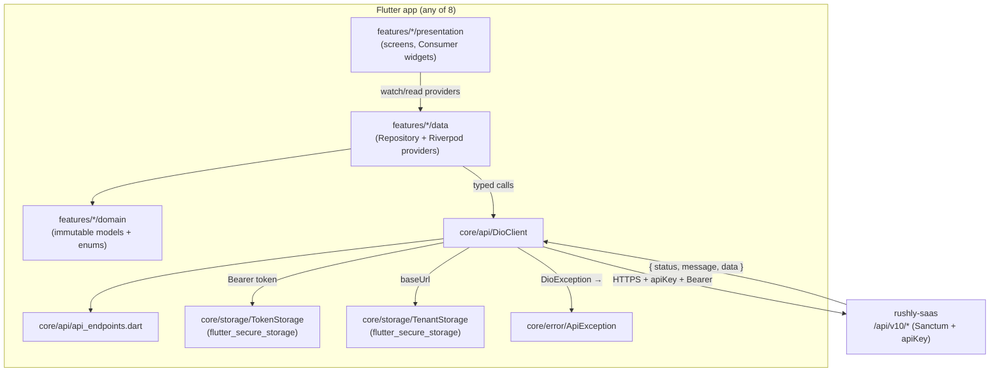
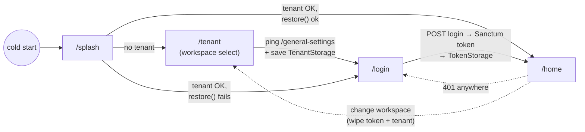
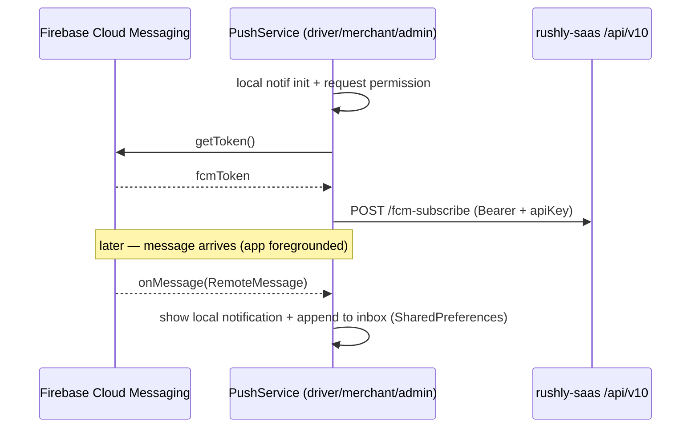

# 08 — Flutter Client Architecture (Phase 8, cross-app)

> **Scope.** This document is the **shared** architecture picture for the **eight
> Rushly Flutter mobile apps**. It covers the common stack, the `core/ + shared/ +
> features/` layout, the API layer (`DioClient`, `api_endpoints`, tenant/token
> storage), theming, localization (ar/en + RTL), push notifications, state
> management and routing — plus a comparison table of the eight apps. Per-app
> deep-dives live under `docs/apps/` (not yet populated at time of writing).
>
> **Ground truth.** `rushly-saas` (`/var/www/rushly-saas`) is the SINGLE SOURCE OF
> TRUTH. **All eight Flutter apps are pure clients** of its `/api/v10/*` HTTP API;
> they hold no business logic beyond request-building, presentation and
> device-local ephemeral state. See [05-System-Architecture.md](05-System-Architecture.md)
> and [06-Database.md](06-Database.md) for the backend.

Related primary source: `rushly-saas/MOBILE_APPS.md` (the repo-root companion doc).
Where that doc and the actual Dart/PHP code diverge, this doc adds a **⚠️ Doc vs
Code** note and treats the code as truth.

---

## 1. The eight apps at a glance

All eight live as **sibling repositories** to `rushly-saas/` (e.g.
`/var/www/rushly-driver-app`), each a standalone Flutter project. Source: directory
listing under `/var/www/` and `MOBILE_APPS.md:5-18`.

| # | Repo | Primary user | `.dart` files | Feature folders (`lib/features/*`) |
|---|---|---|---|---|
| 1 | `rushly-driver-app` | Delivery drivers (deliverymen) | 55 | auth, cash, dashboard, earnings, ndr, notifications, parcels, support, tenant |
| 2 | `rushly-merchant-app` | Merchants / shop owners | 71 | auth, dashboard, fraud, invoices, ndr, news, parcels, payments, reports, settings, shops, store_connections, support, tenant |
| 3 | `rushly-admin-app` | Back-office (`super_admin`, `admin`, `incharge`, `hub`) | 69 | approvals, auth, dashboard, drivers, fraud, hub_cash, hubs, map, merchants, parcels, support, tenant, wms |
| 4 | `rushly-supervisor-app` | Field supervisors | 33 | assignments, auth, dashboard, drivers, exceptions, reports, tenant |
| 5 | `rushly-warehouse-app` | Warehouse staff | 36 | auth, dashboard, fulfillment, tenant, wms |
| 6 | `rushly-sorting-app` | Hub sorting operators | 30 | auth, dashboard, sorting, tenant |
| 7 | `rushly-fleet-app` | Long-haul fleet drivers | 26 | auth, dashboard, fleet, tenant |
| 8 | `rushly-scanner-app` | Any pipeline staff | 27 | auth, dashboard, scanner, tenant |

`.dart` counts are live (`find lib -name '*.dart' | wc -l`, 2026-07-27). Feature
folders are from the actual `lib/features/` tree of each repo.

Every app also appears in a static in-tenant directory page at **Settings → Mobile
Apps** (`/admin/settings/mobile-apps`), backed by
`app/Http/Controllers/Backend/MobileAppsController.php` — see `MOBILE_APPS.md:404-439`.

---

## 2. Shared technology stack

Every app pins the same baseline in its `pubspec.yaml`. Verified across all eight
`pubspec.yaml` files.

| Concern | Choice | Package / evidence |
|---|---|---|
| Framework | Flutter `>=3.19.0`, Dart SDK `>=3.3.0 <4.0.0` | `environment:` block, every `pubspec.yaml` |
| State / DI | **Riverpod 2** (`flutter_riverpod ^2.5.1`) | all apps |
| HTTP | **Dio `^5.5.0`** + `pretty_dio_logger ^1.4.0` | all apps |
| Routing | **`go_router ^14.2.0`** with redirect auth-gate | all apps |
| Secure storage | `flutter_secure_storage ^9.2.2` (bearer token + tenant URL) | all apps |
| Local storage | `shared_preferences ^2.2.3` (ephemeral device state) | all apps |
| Env | `flutter_dotenv ^5.1.0` (`.env` bundled as an asset) | all apps |
| Fonts | `google_fonts ^6.2.1` — Tajawal (Arabic) / Inter (Latin) | all apps |
| i18n | `flutter_localizations` + hand-rolled `AppLocalizations` (en + ar) | all apps |
| Theming | Material 3 (`useMaterial3: true`) | all apps |
| Dates/format | `intl ^0.20.2` | all apps |
| URL launch | `url_launcher ^6.3.0` | all apps |

**Capability packages** (present only where the feature exists):

| Package | Apps that ship it | Purpose |
|---|---|---|
| `firebase_core` + `firebase_messaging ^15.0.4` + `flutter_local_notifications ^17.2.2` | driver, merchant, admin | FCM push |
| `mobile_scanner ^5.2.0` | driver, admin, scanner, sorting, warehouse | AWB barcode scan |
| `flutter_map ^7.0.2` + `latlong2 ^0.9.1` | driver, merchant, admin | OSM-tiled tracking maps |
| `geolocator ^12.0.0` + `flutter_background_service` | driver | live GPS ping |
| `google_maps_flutter ^2.7.0` | driver | (present; OSM `flutter_map` is the live map) |
| `fl_chart ^0.68.0` | merchant, admin | dashboard/report charts |
| `file_picker` + `csv` + `pdf` + `printing` | merchant | CSV bulk import, statement PDF export |
| `image_picker` + `permission_handler` | driver, merchant | photo capture (proof of delivery, ticket attachments) |
| `reactive_forms ^17.0.0`, `freezed`/`json_serializable` codegen | driver only | driver is the most codegen-heavy app |

**⚠️ Doc vs Code.** `MOBILE_APPS.md:31-43` lists `connectivity_plus` as part of the
shared baseline. In code it is present only in **driver** and **merchant**
`pubspec.yaml`; the other six do not depend on it. `MOBILE_APPS.md:39` also frames
push as "driver / merchant / admin" — that is correct (only those three depend on
`firebase_messaging`). The five ops apps (fleet, scanner, sorting, supervisor,
warehouse) have **no Firebase / no push** and **no `core/push/` folder**.

The heaviest apps by structure are **driver** (adds `core/location/`, `core/push/`)
and **merchant** (14 feature modules). The five ops apps are deliberately lean —
identical `core/` minus push/location.

---

## 3. Common `lib/` layout

Every app uses the same three-layer split. Verified against the `lib/` tree of all
eight repos (`find lib -maxdepth 2 -type d`).

```
lib/
├── main.dart              # ProviderScope boot + (optional) Firebase init
├── core/                  # app-wide infrastructure, no feature knowledge
│   ├── api/
│   │   ├── dio_client.dart     # Dio wrapper: headers, 401 handling, envelope unwrap
│   │   ├── api_endpoints.dart  # string registry mirroring routes/api.php
│   │   └── providers.dart      # Riverpod providers for storage + DioClient
│   ├── config/
│   │   └── env.dart            # dotenv loader (API_BASE_URL, API_KEY, ...)
│   ├── error/
│   │   └── api_exception.dart  # maps the Laravel { status, message, errors } envelope
│   ├── storage/
│   │   ├── token_storage.dart  # secure: auth_token, user_id, driver_id, (locale)
│   │   └── tenant_storage.dart # secure: tenant_api_base, tenant_label
│   ├── utils/
│   │   └── json_x.dart         # asInt / asDouble / asString coercers
│   ├── push/                   # driver, merchant, admin ONLY — PushService (FCM)
│   └── location/               # driver ONLY — geolocator ping
├── features/               # one folder per feature module
│   └── <feature>/
│       ├── domain/         # immutable models + enums
│       ├── data/           # repository + Riverpod providers
│       └── presentation/   # screens / tabs / sheets
└── shared/
    ├── l10n/               # AppLocalizations delegate + LocaleController
    ├── router/             # go_router config + splash + auth-gate (app_router.dart)
    └── theme/              # AppTheme.light / .dark (app_theme.dart)
```

The `core/` + `shared/` split is a convention, not a package boundary: `core/` is
infrastructure with **no feature imports**, `shared/` is cross-feature UI glue
(theme, router, i18n), and `features/*` follow a light **domain / data /
presentation** vertical-slice pattern.



---

## 4. The API layer

### 4.1 `DioClient` — the single HTTP choke point

Source: `rushly-driver-app/lib/core/api/dio_client.dart` (the twin exists in every
app with the same shape).

- Constructed with a `baseUrl` resolved from `TenantStorage` and a `TokenStorage`
  handle (`dio_client.dart:18-31`).
- **Two default headers**: `Accept: application/json` and `apiKey: <Env.apiKey>`
  (`dio_client.dart:26-29`). The bearer token is injected **per request** by an
  `InterceptorsWrapper.onRequest` that reads `TokenStorage.readToken()` and sets
  `Authorization: Bearer <token>` when present (`dio_client.dart:35-41`).
- **401 handling**: `onError` catches `statusCode == 401`, wipes the token
  (`_tokenStorage.clear()`) and fires an `_onUnauthorized` callback that the auth
  controller wires to push the user back to `/login` (`dio_client.dart:42-49`,
  `67-69`).
- **Timeouts**: connect 20 s, receive 30 s, send 30 s (`dio_client.dart:22-25`).
- **Debug logging**: `PrettyDioLogger` added only under `kDebugMode`
  (`dio_client.dart:52-61`).
- **Envelope unwrap**: `_unwrap<T>` returns the inner `data` field of the Laravel
  `{ status, message, data }` envelope, falling back to the top-level payload for
  endpoints (e.g. tracking) that don't wrap (`dio_client.dart:136-143`). The
  backend envelope is produced by `app/Traits/ApiReturnFormatTrait.php` (rushly-saas).
- Verb helpers `get/post/put/delete` all funnel `DioException` through
  `ApiException.fromDio` (`dio_client.dart:73-130`).

### 4.2 `api_endpoints.dart` — route registry

Each app keeps a hand-maintained mirror of the backend routes it needs, as `static
const String` (or `static String fn(id)` for parameterised paths). Source header:
`rushly-driver-app/lib/core/api/api_endpoints.dart:1-3` — *"Mirror of the
driver-relevant routes in `routes/api.php` (api/v10/*). Keep this file as the single
source of truth; everything else builds requests against these constants."*

Because there is **no generated client**, this registry is a manual contract with
`routes/api.php`. Backend route↔controller mapping per app is documented in
`MOBILE_APPS.md:387-401`.

### 4.3 Tenant & token storage (secure)

Both storage classes wrap `flutter_secure_storage` (Android `EncryptedSharedPreferences`
via `AndroidOptions(encryptedSharedPreferences: true)` — `core/api/providers.dart:8-12`).

- **`TenantStorage`** (`core/storage/tenant_storage.dart`) — keys `tenant_api_base`
  and `tenant_label`. `isConfigured()` gates the boot flow (`tenant_storage.dart:26-29`).
- **`TokenStorage`** (`core/storage/token_storage.dart`) — keys `auth_token`,
  `user_id`, `driver_id` (the driver app additionally persists the deliveryman id).
  `clear()` wipes all three on logout / 401. The admin app's `TokenStorage` also
  exposes `readLocale()/writeLocale()` for locale persistence (see §7).

### 4.4 Provider wiring

`core/api/providers.dart` builds the DI graph:

```
secureStorageProvider ─┬─> tokenStorageProvider  ─┐
                       └─> tenantStorageProvider ─┤
tenantBaseUrlProvider (FutureProvider) ───────────┤
                                                   └─> dioClientProvider (Provider)
```

`dioClientProvider` watches `tenantBaseUrlProvider.valueOrNull` so the Dio base URL
tracks whichever tenant is configured (`providers.dart:28-34`). The client is **not
rebuilt on tenant change** mid-session; the "change workspace" flow clears the token
and returns to `/tenant`, which re-resolves the provider on next fetch
(`dio_client.dart:12-17`).

### 4.5 Error surface — `ApiException`

`core/error/api_exception.dart` normalises every failure into one type. It maps the
Laravel `{ status:false, message, errors:{...} }` envelope, exposing `message`,
`statusCode`, `fieldErrors` (`Map<String,List<String>>`), and an `ApiErrorKind`
(`offline / server / cancelled / unknown`) derived from the `DioExceptionType`
(`api_exception.dart:52-61`). Convenience getters: `isUnauthorized` (401),
`isValidation` (422), `isOffline`.

---

## 5. Authentication, tenant identification & the boot flow

### 5.1 Two-gate boot

All apps use the same 2-gate install (`MOBILE_APPS.md:77-82`), implemented in
`shared/router/app_router.dart`:

1. **Tenant gate** (`/tenant`): user enters a workspace subdomain (simple) or full
   API URL (advanced). `Env.tenantHostSuffix` turns `acme` into
   `https://acme.rushly-logistic.com/api/v10` (`core/config/env.dart:11-18`). The
   app pings a settings endpoint before persisting to `TenantStorage`.
2. **Auth gate** (`/login`): posts credentials, stores the returned Sanctum token in
   `TokenStorage`.

The router `redirect` enforces both on every non-public route
(`app_router.dart:29-45`):

```
if (!tenantConfigured && loc != '/tenant') return '/tenant';
if (tenantConfigured  && loc == '/tenant') return '/login';
if (!isAuthed && !isAuthRoute)             return '/login';
if (isAuthed  &&  isAuthRoute)             return '/home';
```

The `/splash` screen resolves the tenant, then calls
`authControllerProvider.notifier.restore()` and routes to `/home` or `/login`
(`app_router.dart:100-124`).



### 5.2 Per-app login endpoint

Verified from each app's `api_endpoints.dart`:

| App(s) | Login endpoint |
|---|---|
| driver | `POST /deliveryman/login` (`driverLogin`) — also has `/signin` / `/register` |
| merchant | `POST /signin` (+ `/register`) |
| admin, fleet, scanner, sorting, supervisor, warehouse | `POST /admin/login` |

The six admin-authed apps reuse the **same** `/admin/login` Sanctum flow; they
differ only in which downstream `/api/v10/admin/*` (or `/wms/*`, `/fleet/*`)
endpoints they call. Fleet, scanner, sorting and warehouse are effectively thin
role-specific shells over the admin API.

### 5.3 Backend gate (rushly-saas)

Every mobile route sits behind two middleware:

- **`CheckApiKey`** — `app/Http/Middleware/CheckApiKeyMiddleware.php`. Requires an
  `apiKey` header equal to `Config::get('rxcourier.api_key')`; otherwise a 400
  "Invalid Api Key" (`CheckApiKeyMiddleware.php:22-27`). Applied in `routes/api.php`
  (e.g. `routes/api.php:62`, `:150`, `:234`).
- **`auth:sanctum`** — after login, the bearer token authenticates the user. Admin
  routes add `CheckAdminRole`; several are further hub-clamped server-side.

**⚠️ Security debt (confirmed).** The `apiKey` is a **single static shared secret**
across all tenants and all eight apps. `Env.apiKey` even hard-codes a default
(`'123456rx-ecourier123456'`, `core/config/env.dart:7`) and `Env.apiBaseUrl`
defaults to `https://api.rushly-logistic.com/api/v10` (`env.dart:5`). Rotating away
from the shared key is an open roadmap item (`MOBILE_APPS.md:341-355`).

---

## 6. State management (Riverpod 2)

- The app is wrapped in a single `ProviderScope` at `main()`
  (`main.dart:21`).
- Infrastructure is exposed as `Provider`s (`dioClientProvider`,
  `tokenStorageProvider`, …) in `core/api/providers.dart`.
- Feature state uses `StateNotifierProvider` / `AsyncNotifier`-style controllers.
  Examples: `authControllerProvider` (session state, read by the router),
  `localeProvider` (`StateNotifierProvider<LocaleController, Locale>`), and the
  sorting app's session-scoped bag list backed by a `StateNotifier`
  (`MOBILE_APPS.md:278`).
- The **router itself is a provider** (`routerProvider`, `app_router.dart:26`) and
  reads `tenantBaseUrlProvider` + `authControllerProvider` inside `redirect`, so a
  session/token change re-drives navigation.
- **Feature repositories** live in `features/<x>/data/` and take a `DioClient` via
  `ref`, keeping presentation widgets free of raw HTTP. Push, for instance, calls
  `AuthRepository.fcmSubscribe` rather than Dio directly (`core/push/push_service.dart:37-47`).

The driver app additionally depends on Riverpod codegen (`riverpod_generator`,
`riverpod_annotation`) and `freezed`/`json_serializable` for its models; the other
apps hand-write models and providers.

---

## 7. Localization (ar / en) and RTL

- **Delegate**: `shared/l10n/app_localizations.dart` — a **hand-rolled**
  `AppLocalizations` with `en` and `ar` string maps (`_en` / `_ar`) and a
  `LocalizationsDelegate` (`app_localizations.dart:5-16`). Comment explicitly notes
  it can be swapped for ARB-generated localisation later (`app_localizations.dart:3-4`).
  `supported = [Locale('en'), Locale('ar')]` (`app_localizations.dart:15`).
- **`MaterialApp.router`** registers `AppLocalizations.delegate` alongside the three
  `GlobalMaterialLocalizations` / `GlobalWidgetsLocalizations` /
  `GlobalCupertinoLocalizations` delegates (`main.dart:50-57`). Those globals are
  what make **RTL automatic**: selecting `Locale('ar')` flips the whole widget tree
  to `TextDirection.rtl` via Flutter's `Directionality`. There is **no manual
  `textDirection` handling anywhere** in the driver or merchant code
  (grep for `Directionality`/`TextDirection` returns nothing) — RTL is a free
  consequence of the locale.
- **Locale state**: `localeProvider` (`StateNotifierProvider`). Default locale is
  **Arabic** (`LocaleController() : super(const Locale('ar'))`).
- **⚠️ Per-app variance in persistence.** The **admin** app persists the chosen
  locale to secure storage via `TokenStorage.readLocale()/writeLocale()`
  (`rushly-admin-app/lib/shared/l10n/locale_controller.dart:8-34`). The **driver**
  app's `LocaleController` is **in-memory only** — its own comment says persistence
  "can be layered on later by wiring TokenStorage… (mirrors the admin app's
  LocaleController shape)" (`rushly-driver-app/lib/shared/l10n/locale_controller.dart:6-23`).
  So a driver's language choice resets on cold start; an admin's does not.
- **Fonts follow the locale**: `AppTheme` swaps `GoogleFonts.tajawalTextTheme()` for
  Arabic and `GoogleFonts.interTextTheme()` for Latin, keyed on
  `locale.languageCode == 'ar'` (`shared/theme/app_theme.dart:10-13`). Tajawal is
  also declared as a bundled font in `pubspec.yaml` (with `.env` and Tajawal ttf
  assets required to compile — `MOBILE_APPS.md:368-370`).

---

## 8. Theming (Material 3)

`shared/theme/app_theme.dart` exposes `AppTheme.light(Locale)` and
`AppTheme.dark(Locale)`, both built from `ColorScheme.fromSeed(seedColor: …)` with
`useMaterial3: true` (`app_theme.dart:5-9`, `52-60`). `main.dart` passes both to
`MaterialApp.router` (`theme:` / `darkTheme:`), so apps follow the system light/dark
setting.

The **only meaningful cross-app difference is the seed colour** — a per-app brand
identity. Verified from each `app_theme.dart`:

| App | Seed colour | Constant / value |
|---|---|---|
| driver | Rushly red | `Color(0xFFEC1C24)` |
| merchant | blue | `Color(0xFF0F62FE)` |
| admin | brand magenta | `_brandMagenta = Color(0xFFA61E5B)` (+ `_brandNavy 0xFF0A1A3A`) |
| supervisor | teal 800 | `Color(0xFF00695C)` |
| warehouse | brown 700 | `Color(0xFF5D4037)` |
| sorting | deep purple 700 | `Color(0xFF512DA8)` |
| fleet | indigo 700 | `Color(0xFF303F9F)` |
| scanner | deep orange 700 | `Color(0xFFE64A19)` |

The driver theme also sets a light scaffold background (`0xFFF6F7FB`), white
`AppBar`, rounded cards (16 px, grey-200 border), filled inputs and 48 px filled
buttons (`app_theme.dart:14-49`). The five ops apps parameterise a single
`seed`/dark-surface builder (`0xFF121212` dark background) so their light and dark
themes are generated identically apart from the seed.

**⚠️ Doc vs Code.** `MOBILE_APPS.md` describes seed colours as "teal 800", "brown
700", etc.; those match the hex values above. Note the doc's Material palette names
are approximate labels for the exact ARGB constants in code — the code is the source
of truth for the precise shade.

---

## 9. Push notifications (FCM) — driver / merchant / admin only

Only the three customer-facing apps have push; the five ops apps have **no
`core/push/` folder and no `firebase_messaging` dependency** (verified).

`core/push/push_service.dart` (`PushService`, exposed via `pushServiceProvider`):

1. Initialises `flutter_local_notifications` and requests notification permission
   (`push_service.dart:22-35`).
2. Fetches the FCM token and registers it with the backend via
   `AuthRepository.fcmSubscribe(token)`; re-registers on `onTokenRefresh`
   (`push_service.dart:37-47`). Backend endpoints: driver `POST /fcm-subscribe` /
   `/fcm-unsubscribe`; admin `POST /admin/fcm-subscribe` / `/admin/fcm-unsubscribe`
   (`MOBILE_APPS.md:95`, `:172`).
3. **Foreground handler only**: `FirebaseMessaging.onMessage` renders a local
   notification and appends the message to a device-local inbox
   (`shared_preferences`, capped FIFO) via `inboxRepository`
   (`push_service.dart:49-80`). No background/`onBackgroundMessage` isolate is
   registered, and deep-linking from a tapped notification is an open roadmap item
   (`MOBILE_APPS.md:344`).

`main()` fires `PushService.init()` fire-and-forget after first frame and is
resilient if Firebase is absent (`main.dart:33-39`); `Firebase.initializeApp()` is
wrapped in a try/catch so dev builds without `google-services.json` still run
(`main.dart:16-19`).



---

## 10. Routing (go_router)

- Single `GoRouter` provider (`routerProvider`) with `initialLocation: '/splash'`
  and a top-level `redirect` implementing the tenant+auth gate (§5.1)
  (`app_router.dart:26-45`).
- Routes are flat `GoRoute`s. Deep-link-style params are read from
  `state.pathParameters` (e.g. `/parcel/:id`) and typed objects are passed via
  `state.extra` (e.g. `DeliverScreen(parcel: s.extra! as Parcel)`)
  (`app_router.dart:55-71`).
- **Query-param deep links** drive the "clickable KPI card" pattern: the dashboard
  navigates to `/parcels?status=X&label=Y` and the list screen reads
  `state.uri.queryParameters` (`app_router.dart:77-84`). Same idea in merchant/admin
  dashboards.
- The `/home` route hosts a per-app **bottom-nav shell** (`HomeShell`) that composes
  the app's primary tabs; secondary features are reached via a drawer or pushed
  routes.

---

## 11. Feature-module anatomy (vertical slice)

Every `features/<x>/` folder is a self-contained vertical slice:

```
features/parcels/
├── domain/        # Parcel model, ParcelStatus enum (immutable, from JSON)
├── data/          # ParcelRepository + Riverpod providers (list, details, actions)
└── presentation/  # list screen, details screen, deliver/partial/not-delivered sheets
```

- **domain/** holds plain immutable models built from `Map<String,dynamic>` using
  the `core/utils/json_x.dart` coercers (`asInt`, `asDouble`, `asString`) to defend
  against the loosely-typed Laravel JSON. Status enums (e.g.
  `core/utils/parcel_status.dart`) map integer backend codes to labels.
- **data/** holds the repository (calls `DioClient` against `api_endpoints`
  constants) plus the providers presentation watches.
- **presentation/** holds `ConsumerWidget`/`ConsumerStatefulWidget` screens.

This keeps HTTP, models and UI decoupled and makes each feature independently
navigable via `go_router`.

---

## 12. Cross-app comparison table

Consolidated from the `lib/` trees, `pubspec.yaml` files, `app_theme.dart` seeds,
`api_endpoints.dart` login constants, and `MOBILE_APPS.md`.

| App | Login route | Push (FCM) | Scanner | Maps | Charts | Seed colour | Primary tabs / surfaces |
|---|---|:--:|:--:|:--:|:--:|---|---|
| driver | `/deliveryman/login` | ✅ | ✅ | ✅ (+GPS) | — | red `EC1C24` | Dashboard, Parcels, Earnings, Support, Profile |
| merchant | `/signin` | ✅ | — | ✅ | ✅ | blue `0F62FE` | Dashboard, Parcels, Shops, Payments, Support (+drawer) |
| admin | `/admin/login` | ✅ | ✅ | ✅ | ✅ | magenta `A61E5B` | Dashboard, Parcels, Drivers, Profile (+drawer) |
| supervisor | `/admin/login` | — | — | ✅* | — | teal `00695C` | Drivers, Assignments, Reports, Exceptions |
| warehouse | `/admin/login` | — | ✅ | — | — | brown `5D4037` | Receive, Pick&Pack, Inventory, Dispatch |
| sorting | `/admin/login` | — | ✅ | — | — | deep-purple `512DA8` | Scan In, Sort, Bags, Routes |
| fleet | `/admin/login` | — | — | — | — | indigo `303F9F` | Trips, Vehicle, Fuel, Maintenance |
| scanner | `/admin/login` | — | ✅ | — | — | deep-orange `E64A19` | Scan, History |

`*` supervisor uses `flutter_map`/`latlong2` for the drivers map per `MOBILE_APPS.md`
(its `pubspec.yaml` in this workspace lists the lean baseline; map rendering is via
the shared map widget pattern). Push/Scanner/Charts columns are derived from actual
`pubspec.yaml` dependencies.

**Endpoint reuse pattern** (from `MOBILE_APPS.md:387-401`):

- **admin** owns the largest surface (`/api/v10/admin/*` + WMS).
- **supervisor** reuses admin map/parcel/driver endpoints + two new
  (`/admin/reports/drivers`, `/admin/exceptions`).
- **warehouse** reuses `/api/v10/wms/*` + `/admin/wms/*` + two dispatch endpoints.
- **sorting** adds three `/admin/sorting/*` endpoints; **scanner** reuses
  `AdminSortingController::lookup` + `AdminParcelController::forceStatus` with **zero
  new endpoints**.
- **fleet** has its own `/admin/fleet/*` namespace (8 endpoints).

---

## 13. What the apps deliberately do NOT do

- **No offline write / sync engine** — repositories fetch live; only ephemeral state
  (scan history, notification inbox, sorting bags) is device-local via
  `shared_preferences`. Offline read cache is roadmap (`MOBILE_APPS.md:346`).
- **No business logic** — status transitions, SLA, COD, WMS reservations, hub
  clamping etc. are all enforced server-side. The apps only render and post intents.
- **No generated API client** — `api_endpoints.dart` is a manual mirror; drift from
  `routes/api.php` is a maintenance risk (roadmap: publish an OpenAPI/Postman spec —
  `MOBILE_APPS.md:354`).
- **No per-tenant API key** — shared static `apiKey` (see §5.3).
- **Tests are skeletons only** (`MOBILE_APPS.md:349`).

---

## 14. Build & run (any app)

From `MOBILE_APPS.md:359-383`:

```bash
cd /var/www/rushly-<driver|merchant|admin|supervisor|warehouse|sorting|fleet|scanner>-app
cp .env.example .env          # set API_BASE_URL (or blank for tenant-select), API_KEY
# drop Tajawal-Regular/Medium/Bold into assets/fonts/ (required to compile)
# driver/merchant/admin only — Firebase:
#   android/app/google-services.json  +  ios/Runner/GoogleService-Info.plist
flutter pub get
flutter run --dart-define-from-file=.env
# release: flutter build apk|appbundle|ipa --release
```

`.env` is bundled as a Flutter asset (`pubspec.yaml` `assets: - .env`) and read via
`flutter_dotenv` at `Env.load()` in `main()` (`main.dart:15`, `core/config/env.dart:19`).

---

## Sources

**rushly-saas (backend / docs — SSOT):**
- `docs/_CONTEXT_BRIEF.md`
- `MOBILE_APPS.md` (repo-root companion doc)
- `app/Http/Middleware/CheckApiKeyMiddleware.php`
- `app/Traits/ApiReturnFormatTrait.php`
- `routes/api.php` (v10 / v10/admin / v10/wms groups — lines 60-393)

**Flutter apps (clients — code read):**
- `rushly-driver-app/pubspec.yaml`, `lib/main.dart`
- `rushly-driver-app/lib/core/api/{dio_client,api_endpoints,providers}.dart`
- `rushly-driver-app/lib/core/config/env.dart`
- `rushly-driver-app/lib/core/error/api_exception.dart`
- `rushly-driver-app/lib/core/storage/{token_storage,tenant_storage}.dart`
- `rushly-driver-app/lib/core/push/push_service.dart`
- `rushly-driver-app/lib/shared/router/app_router.dart`
- `rushly-driver-app/lib/shared/theme/app_theme.dart`
- `rushly-driver-app/lib/shared/l10n/{app_localizations,locale_controller}.dart`
- `rushly-admin-app/lib/shared/l10n/locale_controller.dart`, `lib/shared/theme/app_theme.dart`
- `pubspec.yaml` + `lib/shared/theme/app_theme.dart` + `lib/core/api/api_endpoints.dart`
  for all eight apps (admin, driver, fleet, merchant, scanner, sorting, supervisor, warehouse)
- `lib/` directory trees of all eight apps

**Sibling docs:** [05-System-Architecture.md](05-System-Architecture.md),
[06-Database.md](06-Database.md).
