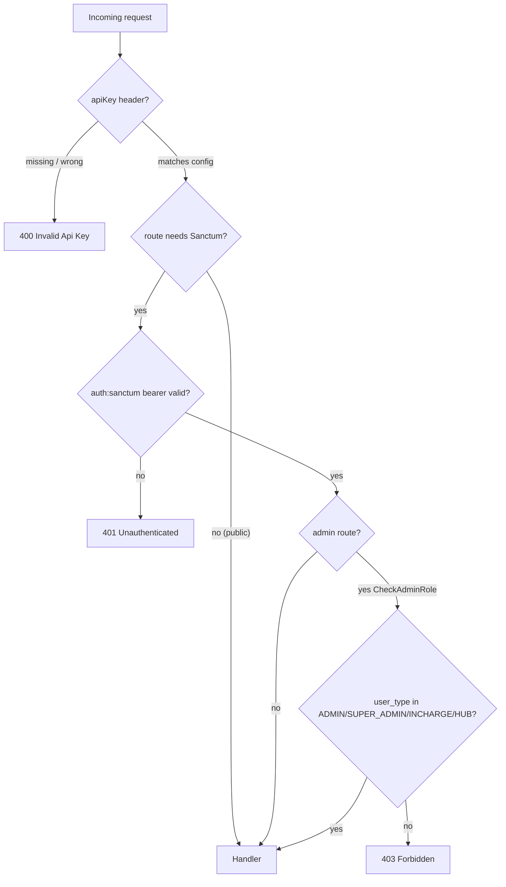
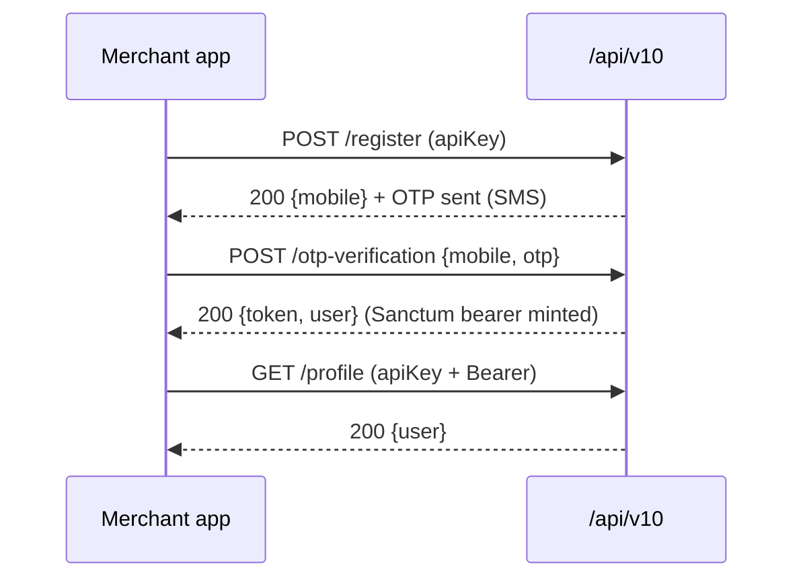
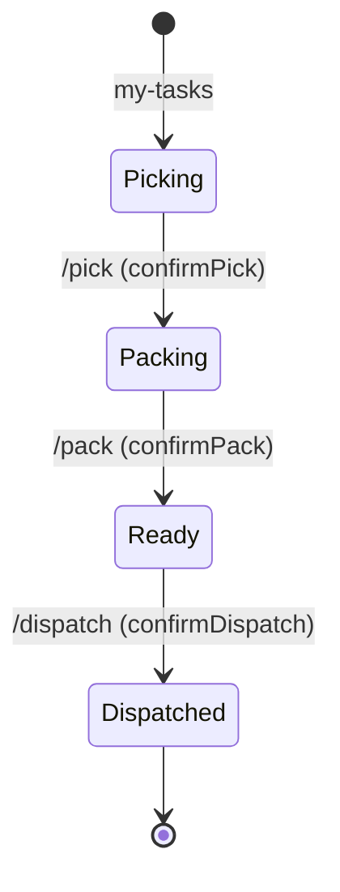

# 09 — API Reference (Phase 7)

> **Scope**: the HTTP API surface Rushly exposes to its Flutter client apps and to
> external storefront bridges. Primary source is `routes/api.php`; every claim below
> is verified against that file, the referenced controllers, form requests, resources,
> and middleware. Where an existing doc conflicts with code, a **⚠️ Doc vs Code** note
> flags it.
>
> `rushly-saas` is the single source of truth. Every Flutter app (`rushly-driver-app`,
> `rushly-merchant-app`, `rushly-admin-app`, `rushly-fleet-app`, `rushly-scanner-app`,
> `rushly-sorting-app`, `rushly-warehouse-app`, `rushly-supervisor-app`) is a **client**
> of this API. Each app ships a `lib/core/api/api_endpoints.dart` file that mirrors the
> subset of routes it consumes.

Cross-links: see [_CONTEXT_BRIEF.md](_CONTEXT_BRIEF.md) for the ecosystem map. Sibling
docs referenced here: `INTEGRATIONS.md`, `ROUTES.md`, `OMS.md`, `FULFILLMENT.md`,
`COMMERCE.md`, `3PL.md` at the repo root.

---

## 1. Base URLs, versioning, and route file

All API routes are declared in **`routes/api.php`** (410 lines) and are served under the
Laravel `/api` prefix. There is exactly one API version in active use: **`v10`**.

```
https://<tenant-host>/api/v10/<resource>          ← mobile + partner REST surface
https://<tenant-host>/api/v10/admin/<resource>    ← back-office mobile apps
https://<tenant-host>/api/v10/external/<platform>/parcel   ← storefront bridges
https://<tenant-host>/api/v10/commerce/{provider}/webhook  ← generic commerce ingest
https://<tenant-host>/api/public/tracking/{id}    ← embeddable public tracking
```

Production host referenced across the codebase and Flutter clients:
`https://admin.rushly-logistic.com` (`app/Http/Resources/v10/ParcelResource.php`,
`INTEGRATIONS.md` §4.1). Rushly is **multi-tenant** (`stancl/tenancy`); the tenant is
resolved from the request host/subdomain, so the same route paths resolve against a
per-tenant database. See [_CONTEXT_BRIEF.md](_CONTEXT_BRIEF.md).

> ⚠️ **Doc vs Code — path prefix.** `INTEGRATIONS.md` §2 documents driver routes under
> `/api/v10/delivery-man/*` and `/api/v10/merchant-panel/*`. The actual routes in
> `routes/api.php` use `deliveryman/*` (no hyphen) and flat `parcel/*`, `shops/*`, etc.
> (no `merchant-panel/` prefix). Code wins — use the paths in the tables below, which
> also match the Flutter `api_endpoints.dart` files.

> ⚠️ **Doc vs Code — no OpenAPI spec ships for the mobile surface.** These tables are
> "OpenAPI-style" but hand-derived from source. A real generated spec exists only for the
> **merchant** subset, served at `GET /admin/api-docs/merchant.json`
> (`ApiDocsController@merchantOpenApi`, `routes/web.php:270`) — not for the admin/driver
> surface.

---

## 2. The standard response envelope

Almost every `/api/v10/*` controller uses `App\Traits\ApiReturnFormatTrait`
(`app/Traits/ApiReturnFormatTrait.php`). Two helpers wrap **all** responses in a fixed
shape:

```jsonc
// responseWithSuccess($message, $data, $code=200)
{ "success": true,  "message": "<i18n string>", "data": { ... } }

// responseWithError($message, $data, $code=400)
{ "success": false, "message": "<i18n string>", "data": { ... } }
```

Consequences worth knowing when writing a client:

- **HTTP status and the `success` flag are independent.** OTP failures return HTTP `200`
  or `401` with `success:false` depending on the branch (`AuthController@otpVerification`),
  and "already subscribed" returns HTTP `200` with `success:false`
  (`ParcelController@subscribe`). Clients must check the `success` field, not only the
  HTTP code.
- **Validation errors** are returned as `422` with
  `data.message = { field: [messages...] }` (Laravel `MessageBag`). A few newer
  controllers nest under `data.errors` instead (WMS, NDR) — see per-resource notes.
- Two surfaces break the envelope:
  - **Commerce webhook** returns `{ "ok": bool, ... }` (`Api/V10/Commerce/WebhookController`).
  - **Public tracking** returns a bespoke `{ success, ... }` timeline object
    (`Api/PublicTrackingController`).

---

## 3. Authentication & authorization model

Three middleware gate the API. All live in `app/Http/Middleware/`.



### Layer 1 — `apiKey` static header (`CheckApiKeyMiddleware`)

A single shared secret gates the *door*; it does not identify the caller. The middleware
compares header `apiKey` against `config('rxcourier.api_key')`.

- Config value (`config/rxcourier.php:90`): `'api_key' => '123456rx-ecourier123456'`.
- On mismatch or missing header: **HTTP 400** `{"success":false,"message":"Invalid Api Key","data":[]}`.
- Registered as route middleware alias `CheckApiKey`.

> ⚠️ **Security note (already flagged in code).** The secret is a hard-coded shared value,
> identical for every integration and every tenant. `INTEGRATIONS.md` §7 lists this as a
> known gap. Public read routes (`/general-settings`, `/all-currencies`, `/hub`) sit behind
> only Layer 1, so anyone with the shared key can read tenant branding/config — this is
> the "Test connection" weakness noted in `INTEGRATIONS.md` §3.

### Layer 2 — Sanctum bearer token (`auth:sanctum`)

Identifies *which* tenant user is calling. Minted via
`User::createToken($name)->plainTextToken` on login. Sent as
`Authorization: Bearer <id>|<token>`. Most `/api/v10/*` routes require this in addition to
Layer 1.

### Layer 3 — `CheckAdminRole` (`CheckAdminRoleMiddleware`)

Runs **after** `auth:sanctum` on the `/api/v10/admin/*` group. Admits only
`user_type ∈ { ADMIN, SUPER_ADMIN, INCHARGE, HUB }` (`app/Enums/UserType.php`). Merchants
and deliverymen are rejected with **403 Forbidden** even with a valid token. This is what
keeps the back-office mobile apps separate from the merchant/driver apps.

### Layer 4 — `public.tracking.key` (`VerifyPublicTrackingApiKey`)

Guards the embeddable public-tracking endpoint. Accepts a per-tenant key from the
`X-API-Key` header (or legacy `apiKey`, or `?api_key=`) matched against the
`public_tracking_api_keys` table (`App\Models\PublicTrackingApiKey`). Optionally enforces
an `allowed_origins` allow-list against `Origin`/`Referer`, bumps `last_used_at` +
`request_count`, and returns **401** JSON with a machine-readable `error` code on failure.

### Other gates seen in `api.php`

| Middleware | Applies to | Auth mechanism |
|---|---|---|
| `CheckApiKey` only | Panda cron/delivery, external bridges, commerce | shared apiKey (bridges add their own per-merchant Sanctum token from the merchant they represent) |
| `throttle:5,1` | `POST v10/password/email` | rate-limit 5 req/min (added on top of apiKey) |
| shared-secret in controller | `POST /zajel/webhook` | `X-AUTH-API-KEY` checked inside `ZajelWebhookController` against `config('services.zajel.webhook_secret')` — no router-level gate |
| HMAC in service | `POST v10/commerce/{provider}/webhook` | per-connection `webhook_secret_encrypted`, verified in `WebhookIngestService`; **no** apiKey/Sanctum |

---

## 4. Consumer → surface map

Which app consumes which slice (from each app's `lib/core/api/api_endpoints.dart`):

| App | Login route | Primary surface |
|---|---|---|
| `rushly-merchant-app` | `POST v10/signin` (merchant) | `parcel/*`, `shops/*`, `payment-request/*`, `invoice-*`, `statements/*`, `fraud/*`, `dashboard/*`, `ndr/merchant`, `store-connections` |
| `rushly-driver-app` | `POST v10/deliveryman/login` | `deliveryman/*`, `ndr/*`, `support/*`, `parcel/tracking/*` |
| `rushly-admin-app` | `POST v10/admin/login` | full `v10/admin/*` (parcels, merchants, drivers, hubs, payment-requests, support, fraud, map, hub-cash, wms, reports, exceptions) + shared `wms/*` |
| `rushly-fleet-app` | `POST v10/admin/login` | `v10/admin/fleet/*` |
| `rushly-scanner-app` | `POST v10/admin/login` | `v10/admin/sorting/lookup`, `.../parcels/{id}/status` |
| `rushly-sorting-app` | `POST v10/admin/login` | `v10/admin/sorting/{lookup,hubs,handover}` |
| `rushly-warehouse-app` | `POST v10/admin/login` | `v10/admin/wms/*` + shared `wms/fulfillment/*`, `wms/grn/*`, `wms/adjustments` |
| `rushly-supervisor-app` | `POST v10/admin/login` | `v10/admin/{map,drivers,parcels/*/assign-driver,dashboard,reports/drivers,exceptions}` |

Note the fleet/scanner/sorting/warehouse/supervisor apps all authenticate through the
**admin** login (`AdminAuthController`) because their operators are back-office users
(`HUB`/`INCHARGE`/`ADMIN`), and `CheckAdminRole` is what admits them.

---

## 5. Auth & account endpoints (`AuthController`)

Controller: `app/Http/Controllers/Api/V10/AuthController.php`. Group: `v10` under
`CheckApiKey`; the authenticated block adds `auth:sanctum`.

| Method | Path | Auth | Request body | Success | Notes / source |
|---|---|---|---|---|---|
| POST | `/v10/register` | apiKey | `SignUpRequest` rules | 200 `{mobile}` | `Merchant::signUpStore`; 422 on validation, 500 on failure |
| POST | `/v10/signin` | apiKey | `merchant_id` (string), `password` (min:6) | 200 `{token, user}` | merchant-only; rejects non-`MERCHANT` user_type with 401 |
| POST | `/v10/deliveryman/login` | apiKey | `driver_id` (string), `password` (min:6) | 200 `{token, user}` | driver-only variant; 422 on validation |
| POST | `/v10/otp-verification` | apiKey | `OtpRequest` (`mobile`, `otp`) | 200 `{token, user}` | logs user in; **200 with `success:false`** on invalid OTP |
| POST | `/v10/resend-otp` | apiKey | `mobile` | 200 `{mobile}` | ⚠️ calls `resendOTP` twice (double-send bug) |
| POST | `/v10/password/email` | apiKey + `throttle:5,1` | `email` | 200 | Laravel password broker reset link |
| POST | `/v10/password/reset` | apiKey | token + password | 200 | fires `PasswordReset` event |
| GET | `/v10/refresh` | apiKey+Sanctum | — | 200 `{token, user}` | rotate token |
| GET | `/v10/profile` | apiKey+Sanctum | — | 200 `{user}` | `UserResource` |
| POST | `/v10/profile/update` | apiKey+Sanctum | `Profile\UpdateRequest` | 200 | |
| PUT | `/v10/update-password` | apiKey+Sanctum | `UpdatePasswordRequest` | 200 | |
| POST | `/v10/sign-out` | apiKey+Sanctum | — | 200 | deletes current token |
| POST | `/v10/fcm-subscribe` | apiKey+Sanctum | fcm token | 200 | `PushNotificationController@fcmSubscribe` |
| POST | `/v10/fcm-unsubscribe` | apiKey+Sanctum | fcm token | 200 | |

Auth flow (merchant OTP variant):



`UserResource` (`app/Http/Resources/v10/UserResource.php`) is the canonical `user`
payload; `DeliverymanUserResource` is used for driver logins.

---

## 6. Parcels (merchant) — `ParcelController`

Controller: `app/Http/Controllers/Api/V10/ParcelController.php`. Consumed by
`rushly-merchant-app` (`ApiEndpoints.parcel*`). Group: `v10` + `CheckApiKey` +
`auth:sanctum` (except the three public frontend routes at the bottom).

| Method | Path | Auth | Request | Success | Source detail |
|---|---|---|---|---|---|
| GET | `/v10/parcel/index` | Sanctum | — | 200 `{parcels: ParcelResource[]}` | merchant-scoped list |
| GET | `/v10/parcel/filter` | Sanctum | query filters | 200 `{parcels}` | |
| GET | `/v10/parcel/create` | Sanctum | — | 200 `{merchant, shops, deliveryCategories, deliveryCharges, codCharges, packagings, fragileLiquid, deliveryTypes}` | form-bootstrap payload |
| POST | `/v10/parcel/store` | Sanctum | `StoreRequest` | 200 | 422 on validation, 500 on failure |
| POST | `/v10/parcel/bulk-store` | Sanctum | array of rows | 200 `{...counts}` | each row validated with `StoreRequest` rules |
| GET | `/v10/parcel/details/{id}` | Sanctum | — | 200 `{parcel, parcelEvents}` | `ParcelResource` + `ParcelLogsResource` |
| GET | `/v10/parcel/edit/{id}` | Sanctum | — | 200 bootstrap payload | |
| PUT | `/v10/parcel/update/{id}` | Sanctum | `StoreRequest` | 200 | |
| GET | `/v10/parcel/logs/{id}` | Sanctum | — | 200 `{parcel, parcelEvents}` | |
| GET | `/v10/parcel/{id}/status/{statusId}` | Sanctum | — | 200 | status mutate by id (see status enum) |
| DELETE | `/v10/parcel/delete/{id}` | Sanctum | — | 200 / 422 | 422 if not deletable |
| GET | `/v10/parcel/all/status` | Sanctum | — | 200 | full status catalog |
| GET | `/v10/status-wise/parcel/list/{status}` | Sanctum | — | 200 | `StatusWiseParcelResource` |
| GET | `/v10/reports/shipments` | Sanctum | query | 200 | `MerchantReportsController@shipments` |
| GET | `/v10/store-connections` | Sanctum | — | 200 | `MerchantStoreConnectionsController@index` |

**Public frontend routes (no auth, no apiKey)** — declared *outside* the CheckApiKey group:

| Method | Path | Auth | Purpose |
|---|---|---|---|
| GET | `/v10/parcel/tracking/{tracking_id}` | **none** | timeline JSON for a tracking id (`parcelTrackingLogs`) — used by every app's `parcelTracking()` helper and by external bridges for status pull (`INTEGRATIONS.md` §4.3) |
| POST | `/v10/contact-us` | none | storefront contact form |
| POST | `/v10/subscribe` | none | newsletter subscribe (200 `success:false` if already subscribed) |
| GET | `/v10/delivery-charges` | none | public delivery-charge lookup |
| GET | `/v10/rejection_reasons` | none | NDR/rejection reason catalog (driver app also reads this) |
| GET | `/v10/customer/installation` | none | `InstallerController@customerInstallation` |

### `StoreRequest` validation (`app/Http/Requests/MerchantPanel/Parcel/StoreRequest.php`)

```
city_id           required|numeric
shop_id           required|numeric
category_id       required|numeric
delivery_type_id  required|numeric
customer_name     required|string|max:191
customer_address  required|string|max:191
customer_phone    required|string|max:191
```

`authorize()` returns `true` — authorization is enforced by the route middleware
(Sanctum + tenant scoping), not the form request.

### `ParcelResource` response shape (`app/Http/Resources/v10/ParcelResource.php`)

Key fields returned per parcel: `id`, `tracking_id`, `merchant_id`, `merchant_name`,
`merchant_user_name/email/mobile`, `merchant_address`, `customer_name`,
`customer_phone` (normalized to `+...` international format via `formatUaePhone()`),
`customer_address`, `invoice_no`, `weight` (with category title suffix),
`total_delivery_amount`, `cod_amount`, `vat_amount`, `current_payable`,
`cash_collection`, `delivery_type_id` + `deliveryType` label, `status` (int) +
`statusName` (`trans('parcelStatus.'.status)`), `pickup_date`, `delivery_date`,
`created_at`/`updated_at` (formatted), `wa_msg` (pre-built WhatsApp message string),
and geo fields `customer_lat/long`, `pickup_lat/long`.

> Note: the resource hard-codes `https://admin.rushly-logistic.com/shipment-location/...`
> in the WhatsApp message and brands it "Rushly Express". `maskLast4()` exists for phone
> masking but is not applied in `toArray()` (full `customer_phone` is returned).

---

## 7. Driver (deliveryman) endpoints

Two controllers serve the driver app: `DeliverymanController`
(`app/Http/Controllers/Api/V10/DeliverymanController.php`) and `DeliveryManParcelController`.
Consumed by `rushly-driver-app`. All Sanctum-protected under the `v10` group.

| Method | Path | Auth | Request | Purpose |
|---|---|---|---|---|
| GET | `/v10/deliveryman/dashboard` | Sanctum | — | driver home aggregates |
| GET | `/v10/deliveryman/profile` | Sanctum | — | profile |
| GET | `/v10/deliveryman/cash` | Sanctum | — | cash-in-hand (403 if no driver profile) |
| GET | `/v10/deliveryman/payment-logs` | Sanctum | — | payments to driver |
| GET | `/v10/deliveryman/parcel-payment-logs` | Sanctum | — | COD collected per parcel |
| GET | `/v10/deliveryman/parcel-status` | Sanctum | — | assignable status list |
| POST | `/v10/deliveryman/parcel-status-update` | Sanctum | `parcel_id`, `status`(+partial fields) | branch on status: return-to-courier / partial-delivered / delivered |
| POST | `/v10/deliveryman/parcel-delivered` | Sanctum | body | mark delivered |
| POST | `/v10/deliveryman/parcel-not-delivered` | Sanctum | body | mark NDR/failed |
| POST | `/v10/deliveryman/parcel-location-update` | Sanctum | `lat` (−90..90), `long` (−180..180) | GPS ping; driver derived from `Auth::user()->deliveryman` |
| GET | `/v10/deliveryman/income-expense` | Sanctum | — | `DeliveryManIncomeExpenseController` |
| GET | `/v10/deliveryman/parcel/index` | Sanctum | — | assigned parcels (`DeliveryManParcelController`) |
| GET | `/v10/deliveryman/parcel/details/{id}` | Sanctum | — | parcel detail |
| GET | `/v10/deliveryman/parcel/by-tracking/{tracking}` | Sanctum | — | resolve parcel by scan |
| POST | `/v10/deliveryman/parcel/delivered/{id}` | Sanctum | body | deliver by id |
| POST | `/v10/deliveryman/parcel/delivered-by-tracking/{id}` | Sanctum | body | deliver by tracking |
| POST | `/v10/deliveryman/parcel/partial-delivered/{id}` | Sanctum | body | partial deliver |

> **Security fix in code (commented in `api.php`).** `parcel-location-update` was
> previously outside `auth:sanctum` and took the driver id in the request body, letting
> any holder of the shared apiKey spoof a driver's GPS. It is now token-scoped: the driver
> is derived from `Auth::user()`, and `lat/long` are range-validated
> (`DeliverymanController@parcelLocationUpdate`).

---

## 8. NDR (Non-Delivery Reports) — `NdrApiController`

Controller: `app/Http/Controllers/Api/V10/NdrApiController.php`. Driver app writes NDRs;
merchant app reads its own. Under `v10` + Sanctum. Related enums: `NdrStatus`, `NdrAction`,
`NdrFailureReason` (`app/Enums/`).

| Method | Path | Auth | Request | Success / status |
|---|---|---|---|---|
| GET | `/v10/ndr` | Sanctum | query | 200 `{ndrs}` (driver scope) |
| GET | `/v10/ndr/merchant` | Sanctum | query | 200 `{...}` merchant scope; **403** if no merchant scope |
| GET | `/v10/ndr/stats` | Sanctum | — | 200 stats object |
| GET | `/v10/ndr/parcel/{parcelId}` | Sanctum | — | 200 `{...}`; 404 if parcel missing |
| GET | `/v10/ndr/{id}` | Sanctum | — | 200 `{ndr}`; 404 |
| POST | `/v10/ndr` | Sanctum | see rules | **201** `{ndr}`; **409** if an open NDR exists for the parcel today; 422 |
| POST | `/v10/ndr/{id}/notify` | Sanctum | — | 200 `{ndr_id}`; 404 |

`store` validation rules:

```
parcel_id          required|integer|exists:parcels,id
failure_reason     required|string
driver_notes       nullable|string
driver_photo       nullable|image|max:5120     (5 MB)
next_attempt_date  nullable|date
```

Validation errors here nest under `data.errors` (not `data.message`).

---

## 9. WMS (warehouse) — shared scanner surface `wms/*`

Controllers under `app/Http/Controllers/Api/V10/Wms/`. This group lives under `v10` +
`CheckApiKey` + `auth:sanctum` (any authenticated user, **not** behind `CheckAdminRole`).
Consumed by `rushly-warehouse-app` and `rushly-admin-app` (shared block). WMS models live
at `app/Models/Backend/Wms/*`; enums at `app/Enums/Wms/*`. See `FULFILLMENT.md`.

| Method | Path | Controller@method | Request | Notes / status |
|---|---|---|---|---|
| GET | `/v10/wms/products/lookup` | `WmsProductApiController@lookup` | `?sku/barcode` | product resolve for scanner |
| GET | `/v10/wms/stock/{productId}` | `WmsStockApiController@show` | — | on-hand by location |
| POST | `/v10/wms/grn/{grn}/scan` | `WmsGrnApiController@scanItem` | see rules | 200 `{line, grn_status}`; **404** GRN missing; **409** GRN finalised; 422 |
| POST | `/v10/wms/grn/{grn}/complete` | `WmsGrnApiController@complete` | — | 200; 404; 409 already finalised; 500 |
| GET | `/v10/wms/fulfillment/my-tasks` | `WmsFulfillmentApiController@myTasks` | — | picker queue for current user |
| POST | `/v10/wms/fulfillment/{id}/pick` | `@confirmPick` | `item_id`, `picked_qty` | 200 `{...}`; 404 |
| POST | `/v10/wms/fulfillment/{id}/pack` | `@confirmPack` | — | 200; 404; **409** not in packing state |
| GET | `/v10/wms/fulfillment/ready-to-dispatch` | `@readyToDispatch` | — | dispatch queue |
| POST | `/v10/wms/fulfillment/{id}/dispatch` | `@confirmDispatch` | — | 200; 404; **409** not ready |
| POST | `/v10/wms/adjustments` | `WmsAdjustmentApiController@store` | see rules | 200 `{...}`; 422; 500 |

`grn/{grn}/scan` rules:

```
product_id    required|integer|exists:wms_products,id
location_id   required|integer|exists:wms_locations,id
received_qty  required|integer|min:1
expected_qty  nullable|integer|min:0
batch_number  nullable|string|max:191
expiry_date   nullable|date
condition     nullable|string|in:good,damaged,expired
```

`adjustments` rules:

```
product_id     required|integer|exists:wms_products,id
location_id    required|integer|exists:wms_locations,id
quantity_after required|integer|min:0
reason         required|string
reference      nullable|string|max:191
notes          nullable|string
```

Fulfillment lifecycle these endpoints drive:



---

## 10. Merchant self-service resources

All under `v10` + `CheckApiKey` + Sanctum. Consumed by `rushly-merchant-app`.

### 10.1 Shops (`ShopsController`)

| Method | Path | Purpose |
|---|---|---|
| GET | `/v10/shops/index` | list merchant shops (`ShopResource`) |
| POST | `/v10/shops/store` | create shop (`MerchantShop` request) |
| GET | `/v10/shops/edit/{id}` | fetch for edit |
| PUT | `/v10/shops/update/{id}` | update |
| DELETE | `/v10/shops/delete/{id}` | delete |

### 10.2 Payment accounts (`PaymentAccountController`)

`GET /v10/payment-accounts/index`, `POST /v10/payment-account/store`,
`GET /v10/payment-account/edit/{id}`, `PUT /v10/payment-account/update`,
`DELETE /v10/payment-account/delete/{id}`. Resource: `PaymentAccountResource`.

### 10.3 Payment requests (`PaymentRequestController`)

`GET /v10/payment-request/index`, `.../create`, `POST .../store`, `.../edit/{id}`,
`PUT .../update/{id}`, `DELETE .../delete/{id}`. Merchant requests a payout of collected
COD. Related model `MerchantPayment`, request group `HubPaymentRequest`.

### 10.4 Transactions & statements

- `GET /v10/account-transaction/index`, `POST /v10/account-transaction/filter`
  (`AccountTransactionController`, `TransactionsResource`).
- `GET /v10/statements/index`, `POST /v10/statements/filter`
  (`StatementsController`, `StatementsResource`).

### 10.5 Invoices (`InvoiceController`)

`GET /v10/invoice-list/index` (list, `InvoiceResource`), `GET /v10/invoice-details/{id}`
(`InvoiceDetailsResource`). Related: `InvoiceParcelResource`, enum `InvoiceStatus`.

### 10.6 Fraud registry (`FraudController`)

`GET /v10/fraud/index`, `POST /v10/fraud/store`, `GET /v10/fraud/edit/{id}`,
`PUT /v10/fraud/update/{id}`, `DELETE /v10/fraud/delete/{id}`, plus
`POST /v10/fraud/check` (lookup a phone/customer against the shared fraud list before
shipping). Resource: `FraudResource`.

### 10.7 Support (`SupportController`)

`GET /v10/support/index`, `.../create`, `POST .../store`, `.../edit/{id}`,
`PUT .../update/{id}`, `DELETE .../delete/{id}`, `GET .../view/{id}`,
`POST /v10/support/reply`. Consumed by both merchant and driver apps. Resource:
`SupportResource`; enum `SupportStatus`.

### 10.8 News / offers, dashboard, analytics, reports

| Method | Path | Controller | Purpose |
|---|---|---|---|
| GET | `/v10/news-offer/index` | `NewsOfferController` | merchant news feed (`NewsOffersResource`) |
| GET | `/v10/dashboard` | `DashboardController@index` | merchant home |
| GET | `/v10/dashboard/filter` | `@filter` | filtered aggregates |
| GET | `/v10/dashboard/balance-details` | `@balanceDetails` | wallet balance breakdown |
| GET | `/v10/dashboard/available-parcels` | `@availableParcels` | assignable parcels |
| GET | `/v10/analytics` | `AnalyticsController@index` | merchant analytics |
| POST | `/v10/statement-reports` | `ReportController@TotalSummeryStatementReports` | summary statement |

### 10.9 Settings & general config

| Method | Path | Auth | Purpose |
|---|---|---|---|
| GET | `/v10/general-settings` | apiKey only | tenant branding/config probe (Shopify "Test connection") |
| GET | `/v10/all-currencies` | apiKey only | currency list |
| GET | `/v10/hub` | apiKey only | hub list (`HubController`, `HubResource`) |
| GET | `/v10/settings/cod-charges` | Sanctum | COD charge schedule (`SettingsController`) |
| GET | `/v10/settings/delivery-charges` | Sanctum | delivery-charge schedule |

---

## 11. Back-office admin API — `v10/admin/*`

Prefix group `v10/admin` + `CheckApiKey`; the authenticated block adds `auth:sanctum` +
`CheckAdminRole`. Controllers under `app/Http/Controllers/Api/V10/Admin/`. Consumed by
`rushly-admin-app` and (via admin login) the fleet/scanner/sorting/warehouse/supervisor
apps.

### 11.1 Auth & dashboard

| Method | Path | Auth | Request | Notes |
|---|---|---|---|---|
| POST | `/v10/admin/login` | apiKey | `email`, `password`(min:6) | 200 `{token, user:AdminUserResource}`; **401** if credentials bad OR user_type not in admin set; 422 |
| GET | `/v10/admin/profile` | +Sanctum+Role | — | `AdminUserResource` |
| POST | `/v10/admin/logout` | +Role | — | deletes **all** tokens for the user |
| GET | `/v10/admin/dashboard` | +Role | — | `AdminDashboardController@index` |
| GET | `/v10/admin/dashboard/timeseries` | +Role | — | chart series |

### 11.2 Parcels (admin) — `AdminParcelController` + `AdminParcel3plController`

| Method | Path | Request | Notes |
|---|---|---|---|
| GET | `/v10/admin/parcels` | filters | `ParcelResource` collection with pagination meta |
| GET | `/v10/admin/parcels/{id}` | — | detail |
| GET | `/v10/admin/parcels/{id}/logs` | — | events |
| POST | `/v10/admin/parcels/{id}/assign-driver` | `driver_id` (exists:delivery_men,id), `note?` | **hub match enforced** (`ensureHubMatch` → 403 on mismatch); writes `ParcelEvent` |
| POST | `/v10/admin/parcels/{id}/status` | `status` (int), `note?` | force status; **422** if status invalid; used by scanner app |
| GET | `/v10/admin/parcels/{id}/3pl` | — | 3PL shipment status |
| POST | `/v10/admin/parcels/{id}/3pl-assign` | body | assign a 3PL courier (see `3PL.md`) |

### 11.3 Merchants / drivers / hubs

| Method | Path | Notes |
|---|---|---|
| GET | `/v10/admin/merchants` | list |
| GET | `/v10/admin/merchants/pending` | approval queue |
| GET | `/v10/admin/merchants/{id}` | detail |
| POST | `/v10/admin/merchants/{id}/toggle-active` | enable/disable |
| POST | `/v10/admin/merchants/{id}/approve` | approve (enum `ApprovalStatus`) |
| POST | `/v10/admin/merchants/{id}/reject` | reject |
| GET | `/v10/admin/drivers` · `/v10/admin/drivers/{id}` | list / detail |
| GET | `/v10/admin/hubs` · `/v10/admin/hubs/{id}` | list / detail |

### 11.4 Payment requests / support / fraud (admin)

- `GET /v10/admin/payment-requests`, `POST .../{id}/approve`, `POST .../{id}/reject`.
- `GET /v10/admin/support`, `GET .../{id}`, `POST .../{id}/reply`, `POST .../{id}/close`.
- `GET /v10/admin/fraud`, `POST /v10/admin/fraud`, `DELETE /v10/admin/fraud/{id}`.

### 11.5 Map / hub-cash / reports / exceptions

| Method | Path | Purpose |
|---|---|---|
| GET | `/v10/admin/map/parcels` · `/v10/admin/map/drivers` | live map layers (supervisor + admin apps) |
| GET | `/v10/admin/hub-cash` · `/hub-cash/drivers` · `/hub-cash/accounts` | hub cash reconciliation views |
| POST | `/v10/admin/hub-cash` | record cash received from a driver — see rules below; **403** unless caller is HUB and hub matches; **error** if not enough balance |
| GET | `/v10/admin/reports/drivers` | driver KPI report (supervisor app) |
| GET | `/v10/admin/exceptions` | exception queue (supervisor app) |
| POST | `/v10/admin/fcm-subscribe` · `/fcm-unsubscribe` | admin push token registration |

`hub-cash` POST rules (`AdminHubCashController@store`):

```
delivery_man_id  required|integer|exists:delivery_man,id
account_id       required|integer|exists:accounts,id
amount           required|numeric|min:0.01
date             nullable|date
note             nullable|string|max:500
```

### 11.6 Admin WMS views — `AdminWmsController`

`GET /v10/admin/wms/grns`, `.../locations`, `.../cycle-counts`,
`POST .../cycle-counts` (create), `GET .../damage-reports`,
`POST .../damage-reports` (create). Read/report layer over WMS; the mutating scan/pick
operations use the shared `v10/wms/*` group (§9).

### 11.7 Sorting center — `AdminSortingController`

Consumed by `rushly-sorting-app` and `rushly-scanner-app`.

| Method | Path | Request | Notes |
|---|---|---|---|
| GET | `/v10/admin/sorting/lookup/{tracking}` | — | resolve parcel by scan; **404** if not found |
| GET | `/v10/admin/sorting/hubs` | — | destination hub list |
| POST | `/v10/admin/sorting/handover` | `parcel_ids[]`, `destination_hub_id` (exists:hubs,id), `note?` | bulk hub handover; **hub-scoped** for HUB/INCHARGE users; **422** if no eligible parcels |

### 11.8 Fleet driver — `FleetDriverApiController`

Under `v10/admin` (admin login) + Sanctum + Role. Consumed by `rushly-fleet-app`. Models
`FleetVehicle`, `FleetTrip`, `FleetFuelLog`, `FleetMaintenanceReport`; all scoped by
`companywise()` / `settings()->id`.

| Method | Path | Request rules | Notes |
|---|---|---|---|
| GET | `/v10/admin/fleet/vehicle` | — | assigned vehicle (200 "No vehicle assigned" if none) |
| GET | `/v10/admin/fleet/trips` | — | trip history |
| POST | `/v10/admin/fleet/trips` | `vehicle_id`(exists), `start_odometer`≥0, `start_lat/lng?`, `start_inspection?[]`, `notes?` | **201**; **409** if driver already has an in-progress trip |
| POST | `/v10/admin/fleet/trips/{id}/end` | `end_odometer`≥0, `end_lat/lng?`, `notes?` | **409** if not in progress; **422** if end < start odometer |
| GET | `/v10/admin/fleet/fuel` | — | fuel logs |
| POST | `/v10/admin/fleet/fuel` | `vehicle_id`, `liters`≥0.01, `cost`≥0, `odometer_reading`≥0, `receipt_url?`, `filled_at?`, `notes?` | **201** |
| GET | `/v10/admin/fleet/maintenance` | — | reports |
| POST | `/v10/admin/fleet/maintenance` | `vehicle_id`, `issue_type∈{mechanical,electrical,body,tires,other}`, `severity∈{low,medium,high,critical}`, `description` | **201** |

---

## 12. External storefront bridges — `v10/external/*`

Each platform has one endpoint under `app/Http/Controllers/Api/V10/External/`. Group:
`CheckApiKey` only (no Sanctum at the router — the bridge presents the apiKey plus, in
practice, its own per-merchant Sanctum token per `INTEGRATIONS.md` §3). These accept a
normalized order payload and create a Rushly parcel. See `OMS.md`, `FULFILLMENT.md`,
`INTEGRATIONS.md`, `3PL.md`.

| Method | Path | Controller | Service |
|---|---|---|---|
| POST | `/v10/external/salla/parcel` | `SallaParcelController@store` | `App\Salla\Services\ParcelCreationService` |
| POST | `/v10/external/zid/parcel` | `ZidParcelController@store` | Zid mapper |
| POST | `/v10/external/woocommerce/parcel` | `WooCommerceParcelController@store` | WooCommerce mapper |

`SallaParcelController@store` validation:

```
salla_merchant_id  required|integer
salla_order_id     required|integer
merchant_id        required|integer
shop_id            required|integer
city_id            required|integer
category_id        required|integer
delivery_type_id   required|integer
customer_name      required|string|max:191
customer_address   required|string|max:191
customer_phone     required|string|max:191
cash_collection    nullable|numeric
meta               nullable|array
```

Responses: **201** `{parcel_id, tracking_id}` on create; **200** (same body) when the
order was already linked (idempotent — "Parcel already created"); **404** if the service
throws `RuntimeException` (e.g. unknown merchant/shop); **422** on validation.

> The response deliberately returns `parcel_id` + `tracking_id` so the bridge can write
> the AWB back to the storefront and later poll `GET /v10/parcel/tracking/{tracking_id}`
> for status (see `INTEGRATIONS.md` §4). `rushly-salla` (`/var/www/rushly-salla`) is the
> standalone bridge that drives this for Salla.

### Generic commerce ingest — `v10/commerce/{provider}/webhook`

`POST /v10/commerce/{provider}/webhook` → `Api\V10\Commerce\WebhookController` (invokable).
**No apiKey / no Sanctum** — auth is the per-connection HMAC verified inside
`App\Commerce\Services\WebhookIngestService`. Feature-flag gated: the whole endpoint
returns **404** when `config('features.commerce_layer')` is off (fail-closed kill switch).
Response envelope differs (`{ ok, event_id, duplicate, message }`):

| Status | Meaning |
|---|---|
| **202** | accepted, new event persisted + job dispatched |
| **200** | accepted, duplicate (idempotent replay) |
| **4xx** | `CommerceException` (bad signature / unknown provider) — code passed through, else 422 |
| **500** | unexpected fault, logged as `commerce.webhook.controller.unhandled` |

See `COMMERCE.md`.

---

## 13. Legacy 3PL & webhook endpoints (top of `api.php`)

Older provider-specific routes, hardened in "Phase 9" to sit behind `CheckApiKey`
(previously open). See `3PL.md`.

| Method | Path | Controller | Auth | Purpose |
|---|---|---|---|---|
| GET | `/panda/schudule_tracking` | `DeliveryPandaController@schudule_tracking` | apiKey | Panda tracking cron |
| GET | `/panda/schudule_tracking_temp` | `@schudule_tracking_temp` | apiKey | temp cron |
| GET | `/delivery/test` | `@test` | apiKey | connectivity check |
| POST | `/delivery/create` | `@createShipment` | apiKey | create Panda shipment |
| POST | `/delivery/agent-create` | `@createAgentShipment` | apiKey | agent shipment |
| POST | `/delivery/customer-to-customer` | `@createCustomerToCustomerShipment` | apiKey | C2C shipment |
| POST | `/delivery/track` | `@trackShipment` | apiKey | track Panda shipment |
| GET/POST | `/olivery/webhook` | `WebhookController@webhook` | none (router) | Olivery status callback |
| POST | `/zajel/webhook` | `ZajelWebhookController@handle` | shared secret in `X-AUTH-API-KEY` (checked in controller) | Zajel status events |

> `sql`/typo note: the Panda route path is literally `schudule_tracking` (misspelled) —
> preserved here because that is the real registered path.

---

## 14. Public tracking (embeddable) — `Api/PublicTrackingController`

Read-only, per-tenant, intended for embedding on a merchant's own storefront.

| Method | Path | Auth | Behavior |
|---|---|---|---|
| GET | `/api/public/tracking/{tracking_id}` | `public.tracking.key` (`X-API-Key`) | 200 timeline `{ tracking_id, status, status_label, expected_delivery_at, events[] }`; **401** unauthenticated (missing/invalid key or origin not allowed); **404** unknown tracking id |
| OPTIONS | `/api/public/tracking/{tracking_id}` | none | CORS preflight → 204 with `Access-Control-*` headers |

The projection is deliberately narrow (`id, tracking_id, status, created_at,
expected_delivery_at` + event `{status, status_label, note, created_at}`) and uses
`ParcelStatusHelper::label()` for human status names. Key management model:
`App\Models\PublicTrackingApiKey` (`allowed_origins`, `last_used_at`, `request_count`).

---

## 15. Notable admin/superadmin JSON endpoints outside `api.php`

The back-office web app (`routes/web.php`, `routes/superadmin.php`) is Inertia/React, but a
handful of routes return JSON and act as an internal API for the React pages. These use the
**web** middleware stack (`InitializeTenancyByDomain`, `auth` session guard,
`hasPermission:*`), **not** Sanctum. From `ROUTES.md`:

| Method | Path | Controller | Purpose |
|---|---|---|---|
| GET | `/admin/api-docs/merchant.json` | `ApiDocsController@merchantOpenApi` | **generated OpenAPI spec** for the merchant API subset (the only machine-readable spec that ships) |
| GET | `/admin/parcel/tracking-json/{id}` | `ParcelController@trackingJson` | tracking timeline JSON for admin UI (`hasPermission:parcel_read`) |
| GET | `/admin/bulk_action` | `ParcelBulkActionController@parcel_bulk_action` | bulk-op launcher (Assign 3PL / Change Status / Cancel / Print AWBs / Export XLSX) |
| POST | `/admin/parcels/bulk/check` | `ParcelBulkActionController@check` | validate a bulk selection (AJAX) |
| POST | `/admin/parcels/bulk/apply` | `ParcelBulkActionController@apply` | apply the bulk action (AJAX) |
| POST | `/admin/parcel/recived-by-hub/search` | `ParcelController@parcelRecivedByHubSearch` | hub-receive scan search (AJAX) |
| POST | `/admin/assign-pickup/parcel/search` | `ParcelController@AssignPickupParcelSearch` | pickup-assignment search (AJAX) |
| POST | `/admin/payout/pay-via-ajax` | `AdminSslCommerzController@payViaAjax` | payout payment (AJAX) |

These are **not** part of the versioned partner API and are session-authenticated; they are
listed for completeness because clients occasionally reach them. For the full route
inventory (every web + superadmin route with its middleware chain), consult `ROUTES.md`
(2071 lines).

---

## 16. Status-code conventions (summary)

| Code | Used for |
|---|---|
| **200** | success; also some soft-failures (`success:false`) e.g. already-subscribed, invalid-OTP branches |
| **201** | resource created (NDR store, fleet trip/fuel/maintenance, external parcel create) |
| **202** | commerce webhook accepted (new event) |
| **204** | CORS preflight (public tracking OPTIONS) |
| **400** | invalid/missing apiKey (`CheckApiKeyMiddleware`); default `responseWithError` code |
| **401** | bad credentials / unauthenticated (login, public-tracking key) |
| **403** | wrong role (`CheckAdminRole`), hub mismatch, missing driver/merchant scope |
| **404** | resource not found (parcel, GRN, NDR, fulfillment); external service `RuntimeException`; commerce endpoint when feature flag off |
| **409** | state conflict (open NDR today, GRN finalised, fulfillment not in expected state, active trip exists) |
| **422** | validation failure (rules under `data.message` or `data.errors`); business-rule rejection (odometer, invalid status) |
| **500** | unhandled error / repository failure |

---

## 17. Gaps & things that could not be determined

- **No published OpenAPI/Swagger for the driver & admin surfaces.** Only the merchant
  subset has a generated spec (`/admin/api-docs/merchant.json`). Everything else is
  documented from source here.
- **Full request bodies for legacy driver mutations** (`deliveryman/parcel-status-update`,
  `parcel-delivered`, `parcel-not-delivered`) are not strictly validated in-controller;
  exact accepted fields depend on the repository layer (`ParcelInterface`) and were not
  exhaustively traced. Treat the fields above as the observed minimum.
- **Panda/Olivery/Zajel payloads** are provider-defined; see `3PL.md` for the mappers.
- The `resend-otp` double-call and the unapplied `maskLast4()` in `ParcelResource` look
  like bugs but are documented as-is (code is truth).

---

## Sources

Files and directories actually opened for this document:

- `routes/api.php` — primary route inventory (v10 external + mobile + admin)
- `ROUTES.md` — full route reference (grepped for admin/superadmin JSON endpoints, bulk_action, api-docs)
- `INTEGRATIONS.md` — external `/api/v10` surface, auth model, Shopify bridge, gaps
- `docs/_CONTEXT_BRIEF.md` — ecosystem grounding
- `app/Http/Middleware/CheckApiKeyMiddleware.php`, `CheckAdminRoleMiddleware.php`, `VerifyPublicTrackingApiKey.php`
- `app/Traits/ApiReturnFormatTrait.php` — response envelope
- `config/rxcourier.php` — shared apiKey value
- `app/Http/Controllers/Api/V10/AuthController.php`, `ParcelController.php`, `DeliverymanController.php`, `NdrApiController.php`, `AnalyticsController.php`, `DashboardController.php`
- `app/Http/Controllers/Api/V10/Wms/{WmsGrnApiController,WmsFulfillmentApiController,WmsAdjustmentApiController,WmsProductApiController,WmsStockApiController}.php`
- `app/Http/Controllers/Api/V10/Admin/{AdminAuthController,AdminParcelController,AdminSortingController,AdminHubCashController,AdminWmsController}.php`
- `app/Http/Controllers/Api/V10/Fleet/FleetDriverApiController.php`
- `app/Http/Controllers/Api/V10/External/SallaParcelController.php`
- `app/Http/Controllers/Api/V10/Commerce/WebhookController.php`
- `app/Http/Controllers/Api/PublicTrackingController.php`
- `app/Http/Requests/MerchantPanel/Parcel/StoreRequest.php`
- `app/Http/Resources/v10/ParcelResource.php` (+ resource directory listing)
- Flutter clients: `lib/core/api/api_endpoints.dart` in `rushly-driver-app`, `rushly-merchant-app`, `rushly-admin-app`, `rushly-fleet-app`, `rushly-scanner-app`, `rushly-sorting-app`, `rushly-warehouse-app`, `rushly-supervisor-app`

_Verified against code on 2026-07-27. `rushly-saas` is the single source of truth; where
`INTEGRATIONS.md` path prefixes disagreed with `routes/api.php`, the code was taken as
authoritative and flagged as **⚠️ Doc vs Code**._
