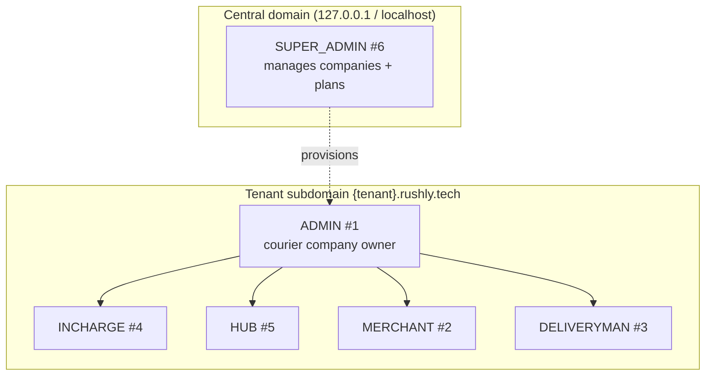
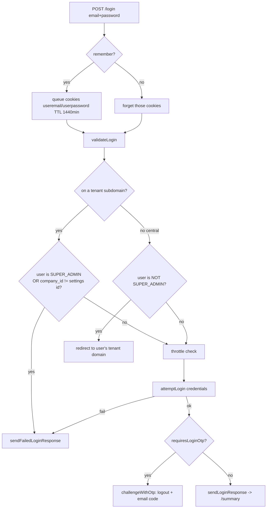
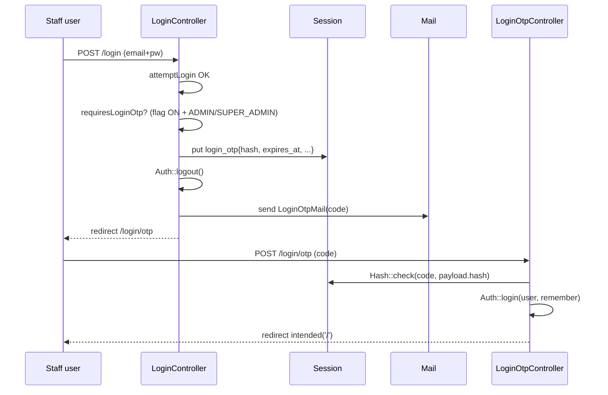
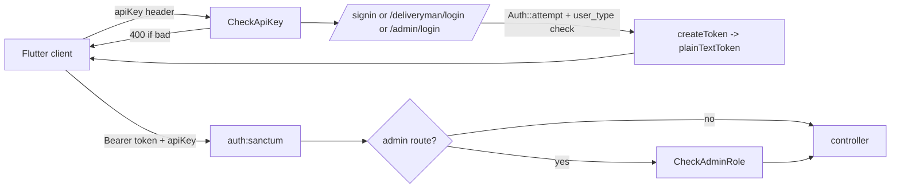
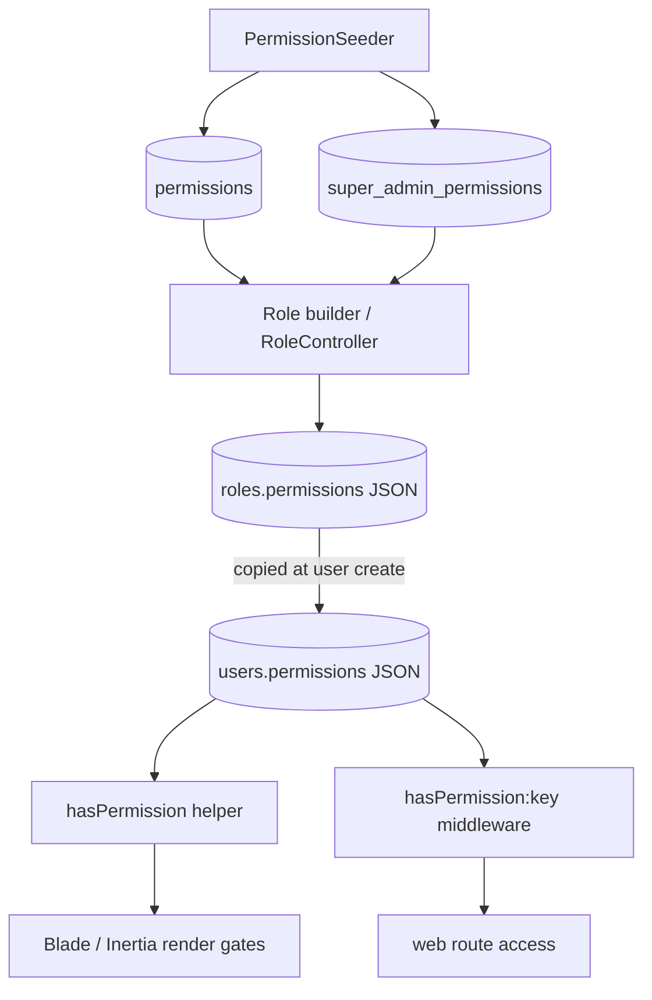

# 10 — Authentication & Authorization

> **Phase 11** of the Rushly platform documentation. Covers how users prove who
> they are (authentication) and what they are allowed to do (authorization)
> across the web back-office, the merchant portal, and the eight Flutter mobile
> clients.
>
> Scope of ground truth: `/var/www/rushly-saas` (the SSOT — see
> [_CONTEXT_BRIEF.md](_CONTEXT_BRIEF.md)). All Flutter apps are **clients** of the
> Sanctum API described here. Cross-refs:
> [05-System-Architecture.md](05-System-Architecture.md),
> [06-Database.md](06-Database.md), [07-Laravel.md](07-Laravel.md),
> [08-Flutter.md](08-Flutter.md).

---

## 1. TL;DR / mental model

Rushly uses **two authentication mechanisms** off a single `users` table and a
single Eloquent user provider:

| Surface | Mechanism | Guard | Where |
|---|---|---|---|
| Admin web / merchant portal (Blade + Inertia/React) | **Session cookies** | `web` (session) | `config/auth.php`, `App\Http\Controllers\Auth\LoginController` |
| Mobile apps (driver, merchant, admin, fleet, scanner, sorting, supervisor, warehouse) | **Sanctum personal-access tokens** (bearer) | `auth:sanctum` | `config/sanctum.php`, `routes/api.php`, `app/Http/Controllers/Api/V10/*` |

**Authorization** is *not* done with Laravel Policies or Gates. It is a flat
**string-permission array stored on each user row** (`users.permissions`,
JSON-cast to `array`), enforced by:

- the `hasPermission:<key>` route middleware (`App\Http\Middleware\PermissionCheckMiddleware`) on the web side, and
- the `CheckAdminRole` middleware (`App\Http\Middleware\CheckAdminRoleMiddleware`) plus per-endpoint checks on the admin API.

Six **user types** (`App\Enums\UserType`) form the coarse role hierarchy;
fine-grained access inside a type is governed by the permission array copied from
the user's assigned **role**.

> ⚠️ **Doc vs Code — no Policies.** `app/Providers/AuthServiceProvider.php` has an
> empty `$policies` map and there is **no `app/Policies/` directory**. Do not
> expect `authorize()` / `$user->can()` gates — authorization is entirely the
> `users.permissions` array + middleware. (Confirmed: `AuthServiceProvider::$policies = []`.)

---

## 2. User types (the role hierarchy)

`app/Enums/UserType.php` is a PHP **interface of integer constants** (not a
native enum), stored in `users.user_type` (`unsignedTinyInteger`, default =
`ADMIN`, see `database/migrations/2014_10_11_000000_create_users_table.php`).

```php
// app/Enums/UserType.php
interface UserType {
    const ADMIN       = 1;
    const MERCHANT    = 2;
    const DELIVERYMAN = 3;
    const INCHARGE    = 4;
    const HUB         = 5;
    const SUPER_ADMIN = 6;
}
```

| # | Constant | Who | Primary surface | Notes |
|---|---|---|---|---|
| 1 | `ADMIN` | Tenant admin / courier-company owner | Admin web (`/admin/*`), Admin mobile | Default `user_type`. Subject to onboarding wizard + subscription check. |
| 2 | `MERCHANT` | Tenant client shipping parcels | Merchant portal (`/merchant/*`), Merchant app | Logs in with `merchant_id` (unique_id) on the API. |
| 3 | `DELIVERYMAN` | Last-mile driver | Driver app, Fleet app | Logs in with `driver_id` (unique_id) on the API. |
| 4 | `INCHARGE` | Hub in-charge / back-office staff | Admin web + Admin API | Admitted to admin API by `CheckAdminRole`. |
| 5 | `HUB` | Hub-level operator account | Admin web + Admin API | Gets a fixed `hubPermissions()` default set at creation. |
| 6 | `SUPER_ADMIN` | Platform operator (Rushly itself) | Central domain, `/super-admin/*` | Not bound to one tenant; **bypasses** subscription + onboarding checks. |



> The `CheckAdminRole` API middleware treats **ADMIN, SUPER_ADMIN, INCHARGE, HUB**
> as the "back-office" set (`app/Http/Middleware/CheckAdminRoleMiddleware.php`,
> constant `ADMIT`). MERCHANT and DELIVERYMAN are rejected from the admin API
> even with a valid token.

---

## 3. Guards, providers & config

### 3.1 `config/auth.php`

Only **one guard** is defined — `web` (session driver) — and one provider:

```php
'defaults' => ['guard' => 'web', 'passwords' => 'users'],
'guards'   => [
    'web' => ['driver' => 'session', 'provider' => 'users'],
],
'providers' => [
    'users' => ['driver' => 'eloquent', 'model' => App\Models\User::class],
],
'passwords' => [
    'users' => ['provider' => 'users', 'table' => 'password_reset_tokens',
                'expire' => 60, 'throttle' => 60],
],
'password_timeout' => 10800, // 3h
```

There is **no explicit `sanctum` guard entry** in `config/auth.php`. Sanctum's
`auth:sanctum` guard is provided by the package itself and, per
`config/sanctum.php`, first tries the `web` session guard and otherwise falls
back to the bearer token:

```php
// config/sanctum.php
'guard'      => ['web'],
'expiration' => null,   // tokens never auto-expire
```

> ⚠️ **Doc vs Code — token lifetime.** `sanctum.php` sets `'expiration' => null`,
> so **personal-access tokens do not expire** server-side. The mobile apps rely on
> explicit `logout` / `refresh` (which delete tokens) rather than TTL. See
> `AuthController::refresh` / `::logout`.

### 3.2 The `User` model

`app/Models/User.php`:

```php
use HasApiTokens, HasFactory, Notifiable, LogsActivity; // Sanctum + activitylog
protected $casts = [ 'permissions' => 'array', /* ... */ ];
```

Key auth-relevant columns (`users` migration):

- `user_type` — role hierarchy (see §2).
- `company_id` — links the user to their tenant / `general_settings` row (scoping).
- `role_id` — FK to `roles` (nullable).
- `permissions` — `longText`, JSON, cast to `array`. **This is the authorization surface.**
- `unique_id` — merchant/driver login identifier used by the mobile API.
- `google_id` / `facebook_id` — Socialite linkage.
- `first_login_at` — stamped on first successful web login (drives the onboarding tour).

`tenantDetails()` relates a user to their `Tenant` via `company_id` (used on the
central domain to redirect a tenant user to their own subdomain — see §4.2).

---

## 4. Web session authentication

### 4.1 Controllers & routes

`app/Http/Controllers/Auth/LoginController.php` uses the framework's
`AuthenticatesUsers` trait. Routes are registered with `Auth::routes()` inside
the tenant-domain gate of `routes/web.php` (line ~198), *after* two custom
prefixes so they aren't swallowed by catch-alls:

```
GET  /login/otp          login.otp.show     (LoginOtpController@show)     [guest]
POST /login/otp          login.otp.verify   (LoginOtpController@verify)   [guest]
POST /login/otp/resend   login.otp.resend   (LoginOtpController@resend)   [guest]
GET  /login/{slug}       login.branded      (LoginController@showLoginForm)
...  Auth::routes()      login / logout / password.* / register / verify
```

- `login` (guest-gated via `RedirectIfAuthenticated`, aliased `guest`).
- `logout` → `LoginController::loggedOut()` redirects to `route('login')`.
- On success, users land on `RouteServiceProvider::HOME = '/summary'`.

The auth controller set also includes `RegisterController` (redirects to
`merchant-register`), `ForgotPasswordController`, `ResetPasswordController`,
`ConfirmPasswordController`, `VerificationController` — standard Laravel scaffolding.

### 4.2 Login flow — tenant vs central logic

`LoginController::login()` is overridden with Rushly-specific gatekeeping
(`app/Http/Controllers/Auth/LoginController.php`):



Notable behaviours:

- **Central domain** (`127.0.0.1` / `localhost`) accepts **only SUPER_ADMIN**;
  any tenant user attempting a central login is bounced to their own subdomain
  (`redirect()->to(scheme_name($user->tenantDetails->domains[0]->domain))`).
- **Tenant subdomain** rejects SUPER_ADMIN and any user whose `company_id`
  doesn't match `settings()->id` — enforcing tenant isolation at login.
- `credentials()` composes the `Auth::attempt` array: it accepts **email or
  mobile** (numeric input → `mobile` column), always requires
  `status = '1'` and `verification_status = '1'`, and on a tenant subdomain
  additionally pins `company_id = settings()->id`.

> ⚠️ **Doc vs Code — "Remember me" stores the plaintext password.** The override
> queues cookies `useremail` **and `userpassword`** (raw request password) for 24h
> when `remember` is set (`LoginController::login` lines ~39–48). This is a
> credential-in-cookie pattern separate from Laravel's normal hashed
> remember-token; treat it as a known security smell, not intended framework
> behaviour. Cookies are encrypted by `EncryptCookies`, but the plaintext
> password still round-trips.

### 4.3 Branded / multi-layout login

`showLoginForm(?string $slug)` renders one of three Blade layouts
(`auth.login` / `auth.login-centered` / `auth.login-fullbleed`) chosen by the
tenant's `login_layout`. When `slug` matches a `merchants.merchant_unique_id`,
`loginBrand()` (`app/Http/Helper/Helper.php`) overlays that merchant's
colours/logo pre-auth, so admins can hand out URLs like `/login/246981`.

### 4.4 Post-login side-effects

`authenticated()` stamps `first_login_at = now()` on the very first login
(guards the onboarding tour auto-start). `RequireOnboarding` middleware (web
group) then redirects tenant **ADMINs** to `/onboarding` until
`general_settings.onboarding_completed_at` is set (super-admins, other user
types, JSON/API traffic, and the wizard's own paths are exempt).

---

## 5. Login OTP (two-step) — `features.login_otp`

A **feature-flagged** second factor. Config (`config/features.php`):

```php
'login_otp' => (bool) env('FEATURE_LOGIN_OTP', false), // default OFF
```

Behaviour (`LoginController::requiresLoginOtp` / `::challengeWithOtp`,
`LoginOtpController`):

- Applies **only to staff** — `ADMIN` and `SUPER_ADMIN`. Merchants and
  deliverymen skip the challenge whether the flag is on or off.
- After a valid password, the user is **immediately logged back out**; a payload
  is stashed in the **session** (not cache — chosen because the file cache driver
  can't be tenant-tagged by Stancl on tenant subdomains):
  `{ user_id, remember, hash(code), expires_at (+5 min), attempts, resends }`.
- The code is emailed via `App\Mail\LoginOtpMail`.
- `LoginOtpController::verify` — validates `digits:6`, enforces **max 5 verify
  attempts** and **5-min expiry**, hash-compares, then `Auth::login($user,
  $remember)`, regenerates the session, and `redirect()->intended('/')`.
- `::resend` — regenerates + re-emails, capped at **3 resends** per session.



> ⚠️⚠️ **Doc vs Code — the OTP is a hard-coded `123456`.** Despite the elaborate
> doc-block describing a time-based deterministic `MM DD HH` code,
> `LoginController::currentOtpCode()` currently **returns the literal string
> `'123456'`** (a "TEMP: fixed dev OTP for pilot access" — its own comment). Every
> staff sign-in accepts `123456` regardless of email or clock. This is **not a
> real second factor** while the flag is on. To restore the intended behaviour,
> replace the fixed return with `now()->format('idH')` (or, per the in-file
> WARNING, `random_int(...)` for a non-predictable code). Also note the flag
> defaults **OFF**, so in the default build there is no OTP step at all.

---

## 6. Sanctum API authentication (mobile apps)

All mobile clients authenticate against `routes/api.php` (`v10` prefix). Two
layers guard the API:

1. **`CheckApiKey`** (`app/Http/Middleware/CheckApiKeyMiddleware.php`) — every
   API group requires an `apiKey` **header** equal to `config('rxcourier.api_key')`.
   Missing/invalid → `400 Invalid Api Key`. This is a shared app-level secret,
   not per-user.
2. **`auth:sanctum`** — the per-user bearer token (`HasApiTokens::createToken`).

Admin endpoints add a third: **`CheckAdminRole`** (user_type ∈ {ADMIN,
SUPER_ADMIN, INCHARGE, HUB}).

### 6.1 Endpoints

`app/Http/Controllers/Api/V10/AuthController.php` (merchant + driver) and
`app/Http/Controllers/Api/V10/Admin/AdminAuthController.php` (back-office):

| Endpoint | Body | Type gate | Token name |
|---|---|---|---|
| `POST /api/v10/signin` | `merchant_id`, `password` | must be `MERCHANT` | `createToken($merchant_id)` |
| `POST /api/v10/deliveryman/login` | `driver_id`, `password` | must be `DELIVERYMAN` | `createToken($driver_id)` |
| `POST /api/v10/register` → `POST /api/v10/otp-verification` | signup + OTP | creates `MERCHANT` | issued on OTP verify |
| `POST /api/v10/resend-otp` | `mobile` | — | — |
| `POST /api/v10/admin/login` | `email`, `password` | must be ADMIN/SUPER_ADMIN/INCHARGE/HUB | `createToken('admin:'.$email)` |
| `POST /api/v10/password/email` | `email` | throttle `5,1` | — |
| `POST /api/v10/password/reset` | `token,email,password` | — | — |
| `GET /api/v10/refresh` | (bearer) | any | deletes all tokens, mints new |
| `POST /api/v10/sign-out`, `POST /api/v10/admin/logout` | (bearer) | — | `tokens()->delete()` |

Notes:

- The merchant/driver logins use `Auth::attempt(['unique_id' => ..., 'password'
  => ...])`, then **reject the wrong user_type after** a successful password
  check (returns generic `credentials_msg` to avoid type enumeration).
- Merchant self-signup is a two-step OTP flow: `register` stores a pending
  merchant (`MerchantInterface::signUpStore`), `otpVerification` matches the SMS
  code (`MerchantInterface::otpVerification`) then `Auth::login` + `createToken`.
- `refresh` / `logout` **revoke all of a user's tokens** (`$user->tokens()->delete()`),
  not just the current one.



> ⚠️ **Doc vs Code — Sanctum SPA statefulness is disabled.** In
> `app/Http/Kernel.php` the `api` group has
> `EnsureFrontendRequestsAreStateful::class` **commented out**. The API is used as
> a pure token API (mobile), and the Inertia/React admin web runs on the `web`
> session group instead — so there is no cookie-based SPA-Sanctum path in effect.

### 6.2 Other API auth guards

- **`public.tracking.key`** (`VerifyPublicTrackingApiKey`) — gates the public
  parcel-tracking endpoints against `public_tracking_api_keys` rows (per-tenant
  API keys, model `App\Models\PublicTrackingApiKey`).
- **`salla.webhook`** (`App\Salla\Http\Middleware\VerifyWebhook`) — HMAC
  verification for the Salla bridge.
- External storefront ingest (`/api/v10/external/{salla,zid,woocommerce}`) is
  behind `CheckApiKey` only.

---

## 7. Social login (Socialite)

`app/Http/Controllers/Backend/SocialLoginController.php` supports **Google** and
**Facebook** via `laravel/socialite`:

- Enabled per-provider by `globalSettings('google_status')` /
  `globalSettings('facebook_status')` (= `Status::ACTIVE`); credentials come from
  `globalSettings('*_client_id' / '*_client_secret')` and are injected into
  config at request time.
- Routes: `GET /login/{social}` → `socialRedirect`; `GET /google/login`,
  `GET /facebook/login` → OAuth callbacks.
- On callback: matches `users.google_id` / `users.facebook_id`; if absent,
  creates a **merchant** via `MerchantInterface::socialSignupStore`, then
  `Auth::login`.
- Admin config UI: `social-login-settings` routes (`hasPermission:social_login_settings_read/_update`).

**Nafath (Saudi national identity):** **Not found in the current codebase.** A
repo-wide search of `app/`, `config/`, and `routes/` for `nafath` returns no
matches. Only Google/Facebook social auth exists.

---

## 8. Authorization model — permissions

### 8.1 How permissions are stored & checked

Rushly does **not** use Gates/Policies. Instead:

1. **Permission catalogue** is seeded into two tables by
   `database/seeders/PermissionSeeder.php`:
   - `permissions` (model `App\Models\Permission`) — tenant/back-office scope
     (~95 attribute groups, e.g. `dashboard`, `hubs`, `accounts`, `parcel`,
     `merchant`, `wms`, `performance`, …). Each row = an `attribute` group + a
     `keywords` array (cast to `array`) of granular permission strings like
     `hub_read`, `hub_create`, `account_delete`.
   - `super_admin_permissions` (model `App\Models\SuperAdminPermission`) —
     platform scope (`company`, `plans`, `roles`, `general_settings`,
     `integrations`, `currency`, front-web CMS, …).
2. **Roles** (`roles` table, model `App\Models\Backend\Role`) are
   **company-scoped** (`company_id` FK to `general_settings`) and hold a
   `permissions` text/JSON array assembled from the catalogue via the role
   builder (`RoleController` + `RoleRepository`).
3. **Assignment to a user**: when a user is created
   (`app/Repositories/User/UserRepository.php`), the assigned role's
   `permissions` array is **copied onto `users.permissions`**. HUB users get a
   fixed default via `hubPermissions()`. So at runtime a user carries their own
   flat permission list — there is no live join to the role.
4. **Enforcement**:
   - Helper `hasPermission($key)` (`app/Http/Helper/Helper.php`) →
     `in_array($key, Auth::user()->permissions, true)`. Used in controllers,
     Blade, and Inertia props (e.g. `'update' => hasPermission('...')`).
   - Route middleware `hasPermission:<key>` (`PermissionCheckMiddleware`) →
     same array check; on failure `redirect('/')`.
   - Both are **null-safe**: a user with `permissions = NULL` is treated as
     unauthorised (deny), not a 500 (this was a past `in_array(..., null)`
     TypeError, now guarded with `is_array()`).



> **Consequence of the copy-at-create model:** editing a *role's* permissions
> does **not** retroactively update users already created from it unless the user
> is re-saved (`UserRepository` update path also writes `users.permissions` from
> the request). Treat `users.permissions` as the source of truth per user.

### 8.2 Permission naming convention

Within an attribute group the keywords follow `{<entity>}_{read|create|update|delete}`
plus feature-specific verbs (`support_reply`, `support_status_update`,
`hub_incharge_assigned`, `permission_update`, `sms_settings_status_change`).
Composite/feature gates also exist (e.g. `ndr_manage`, `abnormal_manage`,
`label_template_manage`, `zatca_manage`, `wms_manage`,
`performance_dashboard_read`) applied at the prefix-group level in
`routes/web.php`.

---

## 9. Route-level access control

### 9.1 Middleware registry (`app/Http/Kernel.php`)

**Global stack:** `TrustProxies`, `HandleCors`, `PreventRequestsDuringMaintenance`,
`ValidatePostSize`, `TrimStrings`, `ConvertEmptyStringsToNull`, `HandleCors`,
`App\Http\Middleware\Cors`.

**`web` group:** `EncryptCookies` → `AddQueuedCookiesToResponse` →
`StartSession` → `ShareErrorsFromSession` → `VerifyCsrfToken` →
`SubstituteBindings` → `LanguageManager` → `HandleInertiaRequests` →
`TrackDriverLastSeen` → `SetTenantTimezone` → `RequireOnboarding` →
`RecordSessionMetadata`.

**`api` group:** `throttle:api` → `SubstituteBindings` → `APIlog` →
`TrackDriverLastSeen`. (`EnsureFrontendRequestsAreStateful` is commented out —
see §6.1.)

**Aliases (auth-relevant):**

| Alias | Class | Role |
|---|---|---|
| `auth` | `App\Http\Middleware\Authenticate` | Session/guard auth; unauthenticated web → `route('login')`, JSON → 401. |
| `guest` | `App\Http\Middleware\RedirectIfAuthenticated` | Authenticated → `RouteServiceProvider::HOME` (`/summary`). |
| `hasPermission` | `PermissionCheckMiddleware` | Per-permission gate (§8). |
| `CheckApiKey` | `CheckApiKeyMiddleware` | Shared `apiKey` header on the API. |
| `CheckAdminRole` | `CheckAdminRoleMiddleware` | Back-office user_type gate on the admin API. |
| `subscriptionCheck` | `subscriptionCheckMiddleware` | Redirects unpaid tenants to `subscription.index` (skips SUPER_ADMIN). |
| `public.tracking.key` | `VerifyPublicTrackingApiKey` | Public tracking API keys. |
| `salla.webhook` | `App\Salla\Http\Middleware\VerifyWebhook` | Salla HMAC. |
| `verified` | `EnsureEmailIsVerified` | Email-verified gate (framework default). |
| `password.confirm` | `RequirePassword` | Password re-confirm (3h timeout). |
| `signed` | `App\Http\Middleware\ValidateSignature` | Signed URLs. |

### 9.2 Web route layering (`routes/web.php`)

```
Route::middleware(['XSS','IsInstalled'])
  └─ tenant-domain gate
     ├─ CompanyActivationMiddleware  (tenant with no active settings → domain_not_activate view)
     ├─ guest group      → login / OTP / branded login / Auth::routes()
     └─ auth group
        ├─ /summary, /operations-dashboard, /onboarding, /subscription
        └─ subscriptionCheck + XSS group
           ├─ prefix 'admin'   → back-office; each route + hasPermission:<key>
           └─ prefix 'merchant'→ merchant portal; merchant-scoped permissions
```

Key observations:

- **Admin vs merchant separation is by permission, not a user_type middleware.**
  Both `/admin/*` and `/merchant/*` sit under the same `auth` + `subscriptionCheck`
  groups; individual routes are gated with `hasPermission:<key>`. A merchant's
  copied permission set simply doesn't contain admin keys, so admin routes
  `redirect('/')` for them.
- `subscriptionCheck` exempts `admin/profile*` and always lets **SUPER_ADMIN**
  through (`subscriptionCheckMiddleware` line 22).
- Profile/password-change routes use `->withoutMiddleware('subscriptionCheck')`
  so a locked-out (unpaid) tenant can still change their password.

### 9.3 Super-admin routes (`routes/superadmin.php`)

Loaded by `RouteServiceProvider` (`->group(base_path('routes/superadmin.php'))`).
Structure mirrors web.php: `XSS`+`IsInstalled` → domain gate → `guest` (OTP) and
`auth` groups → `prefix('super-admin')`. Every action is gated by a
**super-admin permission** key (`hasPermission:company_read`,
`plans_create`, `integrations_update`, …). See the route audit in
[../super-admin.md](../super-admin.md).

> ⚠️ **Doc vs Code — super-admin routing is permission-gated, not user_type-gated.**
> The `/super-admin/*` group relies on `auth` + `hasPermission:*`; there is no
> `user_type == SUPER_ADMIN` middleware on the group itself. Isolation instead
> comes from (a) the central-domain-only login rule in `LoginController` (§4.2)
> and (b) super-admin permission keys only ever being assigned to super-admin
> roles.

---

## 10. Password reset

- **Web:** standard Laravel broker (`ForgotPasswordController` /
  `ResetPasswordController`, `Auth::routes()`), `password_reset_tokens` table,
  60-minute token expiry, 60-second throttle (`config/auth.php`).
- **API:** `POST /api/v10/password/email` (throttle `5,1`) and
  `POST /api/v10/password/reset` in `AuthController` — uses the same
  `Password::sendResetLink` / `Password::reset` broker, min-8 confirmed password,
  fires `PasswordReset`, rotates the remember-token.
- **Admin-initiated:** `users/change-password/{id}` (web,
  `hasPermission:user_update`) and profile self-service password routes. Admin
  user-creation "never ships a plaintext password — the recipient uses the login
  link + forgot-password flow" (comment in `routes/web.php`).

---

## 11. Session / device management

- `RecordSessionMetadata` (web group) captures session metadata per request.
- `TrackDriverLastSeen` (web **and** api groups) updates driver last-seen for
  presence.
- `SetTenantTimezone` applies the tenant's timezone to the request.
- `admin/browser-sessions` (`BrowserSessionsController@destroy`) lets a user log
  out their *other* browser sessions — surfaced on the Profile page.
- Sanctum `refresh` / `logout` revoke **all** of a user's tokens (mobile "log out
  everywhere" semantics).

---

## 12. Permission matrix (by user type)

The matrix below is the **effective** access derived from the enforcement points
above (`CheckAdminRole`, the central/tenant login rules, `subscriptionCheck`,
`RequireOnboarding`, and typical seeded role permission sets). Fine-grained
access *within* a type still depends on the exact `users.permissions` array of
that user's role.

| Capability | SUPER_ADMIN (6) | ADMIN (1) | INCHARGE (4) | HUB (5) | MERCHANT (2) | DELIVERYMAN (3) |
|---|:--:|:--:|:--:|:--:|:--:|:--:|
| Web login on **central** domain | ✅ | ❌ (redirected to tenant) | ❌ | ❌ | ❌ | ❌ |
| Web login on **tenant** subdomain | ❌ | ✅ | ✅ | ✅ | ✅ | ✅ (portal parts) |
| `/super-admin/*` (companies, plans, platform settings) | ✅ (via perms) | ❌ | ❌ | ❌ | ❌ | ❌ |
| Admin web `/admin/*` (per `hasPermission`) | ✅ | ✅ | partial | partial (hub set) | ❌ | ❌ |
| Merchant portal `/merchant/*` | — | — | — | — | ✅ | ❌ |
| Admin API `/api/v10/admin/*` (`CheckAdminRole`) | ✅ | ✅ | ✅ | ✅ | ❌ | ❌ |
| Merchant API `/api/v10/signin` + merchant endpoints | ❌ | ❌ | ❌ | ❌ | ✅ | ❌ |
| Driver API `/api/v10/deliveryman/login` + driver endpoints | ❌ | ❌ | ❌ | ❌ | ❌ | ✅ |
| Subject to `subscriptionCheck` (unpaid → blocked) | ❌ (exempt) | ✅ | ✅ | ✅ | ✅ | ✅ |
| Forced through `/onboarding` wizard | ❌ | ✅ (until completed) | ❌ | ❌ | ❌ | ❌ |
| Login OTP challenge (when `login_otp` ON) | ✅ | ✅ | ❌ | ❌ | ❌ | ❌ |

Legend: ✅ = permitted, ❌ = denied, "partial" = depends on the granular
permission keys in the assigned role.

---

## 13. Known security notes (from code)

These are **facts observed in the current code**, surfaced here because they
directly affect the auth posture:

1. **Fixed OTP `123456`** while `login_otp` is on — not a real second factor
   (`LoginController::currentOtpCode`, §5).
2. **Plaintext password in a 24h "remember-me" cookie** (`LoginController::login`,
   §4.2). Encrypted at rest by `EncryptCookies`, but still round-trips the raw
   password.
3. **Non-expiring Sanctum tokens** (`sanctum.expiration = null`, §3.1) — relies on
   explicit revoke.
4. **Shared static API key** (`CheckApiKey` compares against a single
   `config('rxcourier.api_key')`) — an app-level secret, not per-device.
5. **Role→user permission copy is one-shot** (§8.1) — role edits don't propagate
   to existing users until re-save.

None of these are "bugs" the doc invents; each cites the exact enforcement code.
Fixing #1/#2 is called out in the code's own comments.

---

## 14. Cross-references

- Multi-tenancy & central-vs-tenant routing — [05-System-Architecture.md](05-System-Architecture.md)
- `users`, `roles`, `permissions`, `super_admin_permissions`, `password_reset_tokens` tables — [06-Database.md](06-Database.md)
- Middleware pipeline, service providers, route loading — [07-Laravel.md](07-Laravel.md)
- How the Flutter clients store tokens & call the API — [08-Flutter.md](08-Flutter.md)
- Super-admin route inventory — [../super-admin.md](../super-admin.md)

---

## Sources

Files actually opened for this document:

- `config/auth.php`
- `config/sanctum.php`
- `config/features.php`
- `app/Enums/UserType.php`
- `app/Models/User.php`
- `app/Models/Permission.php`
- `app/Models/SuperAdminPermission.php`
- `app/Http/Kernel.php`
- `app/Http/Controllers/Auth/LoginController.php`
- `app/Http/Controllers/Auth/LoginOtpController.php`
- `app/Http/Controllers/Auth/RegisterController.php` (and sibling `ForgotPassword`/`ResetPassword`/`Verification`/`ConfirmPassword` controllers present)
- `app/Http/Controllers/Api/V10/AuthController.php`
- `app/Http/Controllers/Api/V10/Admin/AdminAuthController.php`
- `app/Http/Controllers/Backend/SocialLoginController.php`
- `app/Http/Middleware/Authenticate.php`
- `app/Http/Middleware/RedirectIfAuthenticated.php`
- `app/Http/Middleware/PermissionCheckMiddleware.php`
- `app/Http/Middleware/CheckAdminRoleMiddleware.php`
- `app/Http/Middleware/CheckApiKeyMiddleware.php`
- `app/Http/Middleware/CompanyActivationMiddleware.php`
- `app/Http/Middleware/subscriptionCheckMiddleware.php`
- `app/Http/Middleware/RequireOnboarding.php`
- `app/Http/Helper/Helper.php` (`hasPermission`, `settings`, `loginBrand`)
- `app/Providers/AuthServiceProvider.php`
- `app/Providers/RouteServiceProvider.php` (`HOME`, route-file loading)
- `app/Repositories/User/UserRepository.php` (role→user permission copy, `hubPermissions`)
- `database/seeders/PermissionSeeder.php`
- `database/migrations/2014_10_11_000000_create_users_table.php`
- `database/migrations/2014_10_10_040240_create_roles_table.php`
- `routes/web.php` (auth/guest/admin/merchant groups)
- `routes/api.php` (`v10`, `v10/admin` groups)
- `routes/superadmin.php`
- `super-admin.md`
- `docs/_CONTEXT_BRIEF.md`

_Negative result verified:_ `nafath` — **Not found in the current codebase**
(searched `app/`, `config/`, `routes/`).
