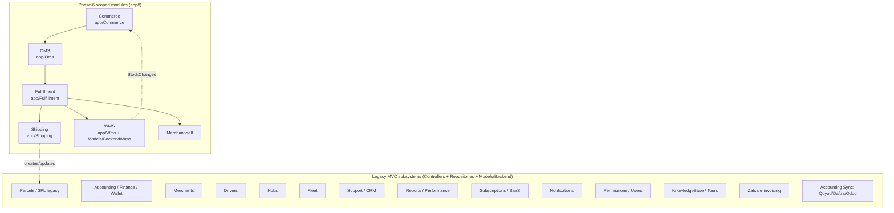

# 11 — Modules Index (Phase 6 Module Discovery)

> Master index of every discovered business module in **rushly-saas** (the SINGLE SOURCE OF TRUTH for the whole Rushly ecosystem). Each entry is a one-paragraph capability summary — purpose, responsibilities, key DB tables, services/controllers/models, API surface, which Flutter client apps consume it, notifications, permissions, and maturity. Detailed per-module deep dives live in the repo-root `.md` docs (linked inline) and, going forward, in `docs/modules/*.md` (currently empty scaffolding).
>
> Every non-trivial claim below cites a real source path. Where a claim could not be verified in code it reads "Not found in the current codebase."

Cross-references: [02-Project-Overview.md](02-Project-Overview.md) · [03-Business-Domain.md](03-Business-Domain.md) · [04-Business-Logic.md](04-Business-Logic.md) · [05-System-Architecture.md](05-System-Architecture.md) · [06-Database.md](06-Database.md) · [07-Laravel.md](07-Laravel.md) · [08-Flutter.md](08-Flutter.md) · [09-API.md](09-API.md) · [10-Authentication.md](10-Authentication.md)

---

## 0. How to read this index

Two module *styles* coexist in the codebase and this index covers both:

1. **Scoped-namespace modules** — new, clean, self-contained code under `app/<Module>/` (each with `Contracts/ + DTOs/ + Services/ + Models/ + Events/ + Listeners/`). Examples: `app/Shipping/`, `app/Commerce/`, `app/Oms/`, `app/Fulfillment/`, `app/Wms/`. These are the "Phase 6" architecture.
2. **Legacy MVC subsystems** — the original courier-management platform, organized by controller + repository + `app/Models/Backend/*`. Examples: Parcels, Accounting, Merchants, Drivers, Hubs. Mature, live, carry most of the business volume.

> ⚠️ **Doc vs Code — framework version.** `README.md` line 1/83 and `_CONTEXT_BRIEF` both note that `README.md` claims "Laravel 12", but `composer.json` pins `laravel/framework: ^10.10`. **Code wins: this is Laravel 10.** PHP `^8.1`.

### 0.1 Module → source-root → primary doc map

---

## 1. Orders / OMS — canonical order model

**Root:** `app/Oms/` · **Doc:** [OMS.md](../OMS.md) · **Status: Wired (Phase 6), feature-flag gated.**

Canonical order data model that sits between storefront ingestion (Commerce) and the fulfillment router. Every order from any source becomes one `orders` row + N `order_items` + at least one `order_events` audit entry, so downstream systems query one canonical shape. Purpose: normalize + persist + announce; it **never creates parcels** (`OMS.md` §8 non-goals). Core services: `app/Oms/Services/OrderService.php` (single entry point `receiveNormalized()`, idempotent by `(connection_id, remote_order_id)`, wrapped in `DB::transaction`), a normalization pipeline `app/Oms/Normalization/OrderNormalizer.php` + `OrderMapperInterface` + `PayloadValidator` + `AddressResolver` (first mapper `Providers/SallaOrderMapper.php`), and `app/Oms/Repositories/OrderRepository.php`. Models: `app/Oms/Models/{Order,OrderItem,OrderEvent}.php`. Events: `OrderReceived` / `OrderUpdated` (`app/Oms/Events/`), consumed by `LogOrderReceivedListener` + `RouteToFulfillmentListener`. Enums in `app/Oms/Enums/{OrderStatus,FulfillmentStatus,PaymentStatus}.php`. Migrations `2026_07_01_110001_create_orders_table.php`, `_110002_create_order_items_table.php`. Controller: `app/Http/Controllers/Backend/Oms/OrderController.php`. Feature flag: `config('features.commerce_layer')` (shared with Commerce). **APIs / Flutter:** no direct mobile client; internal to the ingestion→fulfillment pipeline. **Notifications:** none (data layer). **Permissions:** admin-panel gated (see §16). See [OMS.md](../OMS.md), [04-Business-Logic.md](04-Business-Logic.md).

---

## 2. Shipping — generic outbound courier abstraction

**Root:** `app/Shipping/` · **Doc:** [docs/shipping-architecture.md](shipping-architecture.md) · **Status: Production. First provider Logestechs, verified end-to-end.**

Multi-tenant, provider-agnostic outbound-courier layer. New couriers plug in without touching business logic — implement `ShippingProviderInterface` (`app/Shipping/Contracts/`), extend `AbstractProvider` for free HTTP + logging + retry, add a `config/shipping.php` row and a `shipping_providers` seed row (`shipping-architecture.md` §8). Services: `ConnectionService`, `ShipmentService` (`dispatchCreate`/`executeCreate`, asserts `parcel.company_id === connection.company_id`), `TrackingService`, `AwbService`, `WebhookService` (`app/Shipping/Services/`). Jobs: `CreateShipmentJob`, `CancelShipmentJob`, `SyncTrackingJob`, `PrintAwbJob`. Models: `Shipment`, `ShippingConnection`, `ShippingProvider`, `ShippingApiLog` (`app/Shipping/Models/`). Events `ShipmentCreated/StatusChanged/Delivered/Cancelled` → listeners `UpdateParcelStatus`, `StoreTrackingHistory`, `SendShipmentNotifications`. Factory `ShippingProviderFactory`. Provider impl: `app/Shipping/Providers/Logestechs/LogestechsProvider.php` + mappers. Tables: `shipping_providers`, `shipping_connections` (encrypted creds), `shipments` (properly `company_id`-scoped, unlike legacy `parcels_3pl`), `shipping_api_logs` (30-day pruned). Controller: `app/Http/Controllers/Backend/Shipping/ShippingConnectionsController.php`; UI `resources/js/Pages/Admin/Shipping/Connections/{Index,Edit}.jsx`. Cron: `shipping:sync-tracking` every 5 min (`app/Console/Commands/ShippingSyncTracking.php`), `shipping:prune-logs` 03:15. **APIs / Flutter:** admin web only; no direct mobile client (parcels surface it indirectly). **Notifications:** `SendShipmentNotifications` on `ShipmentDelivered`. **Permissions:** `integrations_read` / `integrations_update` (`shipping-architecture.md` §13). Supersedes the legacy per-provider services — see §3.

---

## 3. Parcels & Legacy 3PL — the core shipment record

**Root:** `app/Models/Backend/Parcel.php`, `app/Repositories/Parcel/ParcelRepository.php`, `app/Services/*Service.php` · **Doc:** [3PL.md](../3PL.md) · **Status: Legacy live — carries most production volume.**

The historical heart of the platform: a **Parcel** is the trackable shipment unit that all bulk-actions, tracking, timelines, and COD/cash flows are built around. The Fulfillment module deliberately bridges canonical Orders back to Parcels (`OrderToParcelBridge`, see §4) to preserve this surface. Model `app/Models/Backend/Parcel.php` plus `ParcelItem`, `ParcelEvent`, `ParcelLogs`, `ParcelImage`, `ParcelRating`, `ParcelStatusMapping`, `RejectedParcel`, `AbnormalShipment`. Massive repository `app/Repositories/Parcel/ParcelRepository.php` (~2000+ lines; also the main money-mover on delivery, `ACCOUNTING.md` §4.4). Controllers: `ParcelController`, `ParcelBulkActionController` (`/admin/bulk_action`: Assign 3PL, Change Status, Cancel, Print AWBs, Export XLSX), `ShipmentExportController`, `AbnormalShipmentController`, `MapParcelController`. Enums: `app/Enums/{ParcelStatus,ParcelType,DeliveryType,DeliveryTime,AbnormalSeverity}.php`. **Legacy 3PL providers** (still on the old pattern, `parcels_3pl` table, no `company_id`): DeliveryPanda, Zajel, Aramex (SOAP), J&T/Jet — services in `app/Services/{DeliveryPandaService,ZajelService,AramexService,JetService}.php`, crons `aramex:sync-tracking` / `jet:sync-tracking` every 15 min, webhook `app/Http/Controllers/Webhooks/ZajelWebhookController.php`. iMile is stub only (`3PL.md`). Abnormal-shipment detection: `shipments:detect-abnormal` hourly (`app/Console/Commands/DetectAbnormalShipments.php`). **APIs:** admin `Api/V10/Admin/AdminParcelController.php` (`/api/v10/admin/parcels*`), `AdminParcel3plController`, driver `Api/V10/DeliveryManParcelController.php` & `ParcelController.php`, merchant `MerchantParcelController`, external order intake `Api/V10/External/{Salla,Zid,WooCommerce}ParcelController.php`, public tracking `Api/PublicTrackingController.php`. **Flutter apps:** driver-app (parcels/ndr), merchant-app (parcels), admin-app (parcels), scanner-app, sorting-app. **Notifications:** push + SMS on status change (see §14). **Permissions:** `parcel_read`, `parcel_status_update`, etc. ⚠️ `3PL.md` flags that `parcel.3pl_details` is gated by `parcel_read` (too weak). NDR handling: `app/Models/Backend/Ndr.php`, `Api/V10/NdrApiController.php`, enums `NdrStatus/NdrAction/NdrFailureReason`. See [3PL.md](../3PL.md), [09-API.md](09-API.md).

---

## 4. Fulfillment — routing + strategy layer

**Root:** `app/Fulfillment/` · **Doc:** [FULFILLMENT.md](../FULFILLMENT.md) · **Status: Wired (Phase 6); events fire but few subscribers yet.**

Given an OMS `Order`, decides **how** to get it out the door and dispatches to the module that does the work — it never ships anything itself. Trigger: `OrderReceived` → `RouteToFulfillmentListener` → `FulfillmentService::fulfill($order)` (`app/Fulfillment/Listeners/`, `Services/FulfillmentService.php`). Pure route-matching in `FulfillmentRouter.php`. Strategies (registered in `config/fulfillment.php`): `WmsFulfillmentStrategy`, `ThreePlDropshipStrategy`, `MerchantSelfStrategy` (`vendor_direct` reserved for Phase 6.5+), all implementing `FulfillmentStrategyInterface` (`code/execute/cancel`). `OrderToParcelBridge` translates Order→Parcel idempotently (`parcels.oms_order_id`). Models: `Fulfillment` (status machine pending→in_progress→completed/failed/cancelled), `FulfillmentRoute` (ANDed priority rules), `FulfillmentDefault`. Tables: `fulfillments`, `fulfillment_routes`, `fulfillment_defaults` (migrations `2026_07_01_1200*` + `_130002_add_parcel_id_to_fulfillments`). Events: `FulfillmentRequested/Started/Completed/Failed` (no listeners wired yet — `FULFILLMENT.md` §9). Controllers: `app/Http/Controllers/Backend/Fulfillment/{FulfillmentController,FulfillmentRouteController}.php`; super-admin defaults `Superadmin/FulfillmentDefaultsController.php`. Config: `config/fulfillment.php` (`default_strategy` = env, null = manual). **APIs / Flutter:** admin web routing config only; the warehouse-app consumes the WMS side of the chosen strategy. **Notifications:** planned on `FulfillmentStarted/Failed` (not wired). **Permissions:** admin-panel gated. See [FULFILLMENT.md](../FULFILLMENT.md).

---

## 5. Commerce — storefront ingestion abstraction

**Root:** `app/Commerce/` · **Doc:** [COMMERCE.md](../COMMERCE.md) · **Status: Scaffold + Salla provider. Feature-flag gated (`FEATURE_COMMERCE_LAYER`, default off).**

Generic multi-tenant layer for talking to storefronts (Salla, Shopify, Zid, WooCommerce). Owns credentials, receives orders via webhooks, and pushes inventory/order updates back — storefront and OMS strictly decoupled. Contract `CommerceProviderInterface` + marker interfaces `SupportsOAuth/Webhooks/BulkFetch/OrderWriteback/InventorySync` (`app/Commerce/Contracts/`). Services: `ConnectionService`, `WebhookIngestService` (verify signature → persist `WebhookEvent` → dispatch `IngestWebhookJob`). Jobs: `IngestWebhookJob`, `PushStockJob`. Listener `PushStockToConnectedChannelsListener` fans out on WMS `StockChanged`. Factory `CommerceProviderFactory`; provider `app/Commerce/Providers/Salla/{SallaProvider,SallaWebhookHandler}.php`. Models: `CommerceProvider`, `CommerceConnection` (encrypted OAuth/API creds), `CommerceApiLog`, `WebhookEvent`. Tables: `commerce_providers`, `commerce_connections`, `commerce_api_logs` (30-day pruned via `commerce:prune-logs` 03:00 — `app/Console/Commands/CommercePruneLogs.php`), `webhook_events` (never auto-pruned). Config `config/commerce.php`; provider `App\Commerce\CommerceServiceProvider`. Controllers: `app/Http/Controllers/Backend/Commerce/{ConnectionController,HealthController,SallaOAuthController,WebhookEventController}.php`. **APIs:** inbound webhook `POST /api/v10/commerce/{provider}/webhook` (`Api/V10/Commerce/WebhookController.php`); merchant store-connections `Api/V10/MerchantStoreConnectionsController.php` & `ShopsController`. **Flutter apps:** merchant-app (store_connections feature). **Notifications:** none. **Permissions:** admin-panel + merchant-panel gated. See [COMMERCE.md](../COMMERCE.md), [09-API.md](09-API.md). Related standalone bridge app: `rushly-salla` (`/var/www/rushly-salla`).

---

## 6. WMS — Warehouse Management System

**Root:** `app/Wms/` (events/observers) + `app/Models/Backend/Wms/*` + `app/Enums/Wms/*` · **Doc:** in-app WMS Knowledge Base + [FULFILLMENT.md](../FULFILLMENT.md) §strategies · **Status: Live; drives the warehouse-app.**

Full inbound→storage→outbound warehouse workflow: goods receipt (GRN), put-away by location, stock ledger, cycle counts, damage reports, adjustments, and pick/pack outbound fulfillment. The scoped `app/Wms/` namespace holds only `Observers/WmsStockObserver.php` and `Events/StockChanged.php` (the inventory-sync trigger consumed by Commerce, §5); the substance lives as classic models `app/Models/Backend/Wms/{WmsStock,WmsLocation,WmsGrn,WmsGrnItem,WmsProduct,WmsOutbound,WmsOutboundItem,WmsFulfillment,WmsFulfillmentItem,WmsCycleCount,WmsDamageReport,WmsAdjustment}.php`. Enums `app/Enums/Wms/{PickingStrategy,LocationType,OutboundType,GrnStatus,ProductUnit,FulfillmentStatus,ItemCondition,AdjustmentReason}.php`. Controllers `app/Http/Controllers/Backend/Wms/{WmsDashboard,WmsGrn,WmsLocation,WmsProduct,WmsStock,WmsOutbound,WmsFulfillment,WmsCycleCount,WmsDamage,WmsAdjustment,WmsKnowledgeBase}Controller.php` plus top-level `WMSController.php`. Crons: `wms:sla-check` (30 min), `wms:min-stock-check` (07:00), `wms:expiry-alert` (08:00), `wms:auto-fulfillment` (15 min) — `app/Console/Commands/Wms*.php`. **APIs:** `Api/V10/Wms/{WmsAdjustment,WmsFulfillment,WmsGrn,WmsProduct,WmsStock}ApiController.php` and admin `Api/V10/Admin/AdminWmsController.php`. **Flutter apps:** warehouse-app (Receive/Pick&Pack/Inventory/Dispatch tabs; fulfillment + wms features), admin-app (wms feature). **Notifications:** min-stock / expiry / SLA alerts via the WMS commands. **Permissions:** WMS-scoped admin permissions. Integrates with Fulfillment via `WmsFulfillmentStrategy` and with Commerce via `StockChanged`. See [06-Database.md](06-Database.md).

---

## 7. Fleet — vehicles, trips, fuel, maintenance

**Root:** `app/Models/Backend/Fleet/*` · **Doc:** [MOBILE_APPS.md](../MOBILE_APPS.md) · **Status: Live; drives the fleet-app.**

Fleet/transport-management for company vehicles and their drivers (distinct from last-mile parcel delivery). Models `app/Models/Backend/Fleet/{FleetVehicle,FleetTrip,FleetFuelLog,FleetMaintenanceReport}.php`. Vehicle assignment, trip start/end, fuel logging, and maintenance reporting. A `TMSController` (`app/Http/Controllers/Backend/TMSController.php`) covers transport-management / driver runsheets (`BulkDriverRunsheetExport`, `DriverRunsheetExport`). **APIs:** `Api/V10/Fleet/FleetDriverApiController.php` exposes `/api/v10/.../fleet/{vehicle,trips,trips/{id}/end,fuel,maintenance}` (start/end trip, log fuel, report maintenance). **Flutter apps:** fleet-app (Trips / Vehicle / Fuel / Maintenance tabs; auth, dashboard, fleet, tenant features). **Notifications:** Not found in the current codebase (no fleet-specific notification path located). **Permissions:** driver-authenticated (Sanctum) endpoints + admin-panel management. See [08-Flutter.md](08-Flutter.md).

---

## 8. Accounting & Zatca — ledgers and Saudi e-invoicing

**Root:** `app/Repositories/*` (accounting) + `app/Services/Zatca/*` · **Doc:** [ACCOUNTING.md](../ACCOUNTING.md) · **Status: Live; Zatca = Phase-1 generator.**

**Accounting** is a three-layer, application-maintained (non-double-entry) money system: per-party running balances (`merchants/delivery_man/hubs.current_balance`, `accounts.balance`), append-only statement ledgers (`merchant_statements`, `deliveryman_statements`, `hub_statements`, `courier_statements`, `vat_statements`), and a bank/cash layer (`accounts`, `bank_transactions`, `fund_transfers`). Repositories drive every mutation: `IncomeRepository` (⚠️ not wrapped in a transaction — `ACCOUNTING.md` §4.1), `ExpenseRepository`, `FundTransferRepository`, `ParcelRepository` (main delivery-time mover), `ReceivedRepository`, `PaymentRepository`, `SalaryRepository`, `HubPaymentRepository`, `InvoiceRepository`. ⚠️ **Hardcoded account-head IDs 1–7** (`AccountHeadSeeder`) are effectively schema — reordering breaks logic. Controllers: `AccountController`, `AccountHeadsController`, `IncomeController`, `ExpenseController`, `FundTransferController`, `BankTransactionController`, `SalaryController`, `HubPaymentController`, `PayoutController`. **Zatca** (`app/Services/Zatca/`): `TlvEncoder`, `InvoiceBuilder`, `QrGenerator`, `ZatcaService`, `Contracts/ZatcaGateway` + `Gateways/NullGateway`; enums `app/Enums/Zatca/{ZatcaInvoiceStatus,ZatcaInvoiceType,ZatcaMode}.php`; controllers `Backend/Zatca/{InvoiceController,SettingsController}.php`; command group `app/Console/Commands/Zatca`. **Tables** (accounting): see [ACCOUNTING.md](../ACCOUNTING.md) §2 and [06-Database.md](06-Database.md). **APIs:** driver `Api/V10/{AccountTransactionController,DeliveryManIncomeExpenseController}.php`, merchant `Api/V10/{StatementsController,PaymentAccountController,PaymentRequestController}.php`. **Flutter apps:** merchant-app (invoices/payments/reports), driver-app (cash/earnings). **Notifications:** none direct. **Permissions:** finance-scoped admin permissions + merchant/hub panel self-service. See [ACCOUNTING.md](../ACCOUNTING.md).

---

## 9. Finance / Billing / Wallet & Invoicing

**Root:** `app/Models/Backend/{Wallet,Invoice,Payment,MerchantOnlinePayment}*` + `app/Enums/Wallet/*` · **Status: Live.**

The billing/payout/wallet surface layered on top of §8. **Wallet:** model `app/Models/Backend/Wallet.php`, enums `app/Enums/Wallet/{WalletStatus,WalletType,WalletPaymentMethod}.php`. **Invoicing:** `invoices` + `invoice_parcels` tables, `InvoiceRepository::store` (triggered by `invoice:generate` daily 13:00 — `app/Console/Commands/Invoice.php`), `MerchantInvoiceController`, merchant-panel `Merchantpanel/Invoice.php` model + `MerchantPanel/InvoiceController`. **Online payments / payouts:** gateways Stripe, PayPal (srmklive), Razorpay, PayTM, Skrill, SSLCommerz, bKash, Aamarpay (composer.json, `config/merchantpayment.php`, `config/paypal.php`); models `MerchantOnlinePayment`, `MerchantOnlinePaymentReceived`, `MerchantPayment`; controllers `PayoutController`, `PayoutSetupController`, `MerchantmanagePaymentController`, `MerchantPaymentAccountController`, `AamarpayController`, `SslCommerzPaymentController`, `BkashController`, `SkrillController`, and admin gateway-config controllers (`AdminAamarpay/AdminBkash/AdminSkrill/AdminSslCommerz`). Enums `app/Enums/{InvoiceStatus,PaymentType,PayoutSetup}.php`, `app/Enums/Merchant_panel/PaymentMethod.php`. **APIs:** merchant `Api/V10/{InvoiceController,PaymentAccountController,PaymentRequestController}.php`; admin approvals `Api/V10/Admin/AdminPaymentRequestController.php`. **Flutter apps:** merchant-app (invoices, payments, payment requests). **Notifications:** payout status via admin approval flow. **Permissions:** finance + merchant-panel gated. See [ACCOUNTING.md](../ACCOUNTING.md) §4.6/§4.9.

---

## 10. Merchants

**Root:** `app/Models/Backend/{Merchant,MerchantShops,MerchantSetting}*` · **Doc:** [MERCHANT_DASHBOARD.md](../MERCHANT_DASHBOARD.md) · **Status: Live.**

The merchant (shipper) party: onboarding/approval, shops, delivery-charge profiles, settings, and the self-service merchant panel. Models `Merchant`, `MerchantShops`, `MerchantSetting`, `MerchantDeliveryCharge`. Controllers: admin `MerchantController`, `MerchantShopsController`, `MerchantDeliveryChargeController`, `MerchantProfileController`; merchant-panel `Backend/MerchantPanel/*` (parcels, invoices, reports, payment setup, fraud, knowledge base — `MerchantParcelController`, `MerchantReportsController`, `MerchantOnlinePaymentSetupController`, `MerchantKnowledgeBaseController`, etc.). Approval status enum `app/Enums/ApprovalStatus.php`; per-merchant `current_balance` ties into Accounting (§8). **APIs:** admin `Api/V10/Admin/AdminMerchantController.php` (`/merchants`, `/merchants/pending`, `approve`, `reject`, `toggle-active`); merchant self-service across most of `Api/V10/*` (dashboard, reports, shops, store-connections, statements, support, news, tours, settings). **Flutter apps:** merchant-app (full portal: auth, dashboard, fraud, invoices, ndr, news, parcels, payments, reports, settings, shops, store_connections, support, tenant), admin-app (merchants + approvals features). **Notifications:** signup mail `app/Mail/MerchantSignup.php`; push/news offers (§14). **Permissions:** merchant management admin permissions + merchant-panel role. See [MERCHANT_DASHBOARD.md](../MERCHANT_DASHBOARD.md).

---

## 11. Drivers (Deliverymen)

**Root:** `app/Models/Backend/DeliveryMan.php` + `app/Repositories/DeliveryMan/*` · **Doc:** [MOBILE_APPS.md](../MOBILE_APPS.md) · **Status: Live.**

Last-mile delivery agents: profiles, hub assignment, parcel assignment, cash-in-hand tracking, commission/earnings, and NDR handling. Model `DeliveryMan` (with `current_balance`, `delivery_charge`); statements via `DeliverymanStatement` (§8). Controllers: admin `DeliveryManController`, transport/runsheet `TMSController`. Cash reconciliation: `CashReceivedFromDeliveryman` model + `Backend/HubPanel/ReceivedFromDeliverymanController` + `ReceivedRepository` (`ACCOUNTING.md` §4.5). Driver last-seen tracked by `app/Http/Middleware/TrackDriverLastSeen.php`. **APIs:** `Api/V10/{DeliverymanController,DeliveryManParcelController,DeliveryManIncomeExpenseController,AccountTransactionController}.php`, `NdrApiController`, admin `Api/V10/Admin/{AdminDriverController,AdminHubCashController}.php`. **Flutter apps:** driver-app (auth, cash, dashboard, earnings, ndr, notifications, parcels, support, tenant), admin-app (drivers), supervisor-app (drivers/assignments). **Notifications:** push (FCM) for assignments + status; SMS (§14). **Permissions:** driver Sanctum auth + admin driver-management permissions. See [MOBILE_APPS.md](../MOBILE_APPS.md), [10-Authentication.md](10-Authentication.md).

---

## 12. Hubs

**Root:** `app/Models/Backend/{Hub,HubInCharge,HubStatement,HubPayment}.php` · **Status: Live.**

Physical sorting/distribution hubs: staffing (in-charge), per-hub cash ledger and payouts, operational-area coverage, and the hub self-service panel. Models `Hub`, `HubInCharge`, `HubStatement`, `HubPayment`, `OperationalArea`. Controllers: admin `HubController`, `HubInChargeController`, `HubPaymentController`, `SettingsHubController`, `OperationalAreaController`; hub-panel `Backend/HubPanel/{ReceivedFromDeliverymanController,HubPaymentRequestController}.php`. ⚠️ `hubs.current_balance` semantics are inverted ("amount hub owes company") — `ACCOUNTING.md` §8. **APIs:** admin `Api/V10/HubController.php` + `Api/V10/Admin/{AdminHubController,AdminHubCashController}.php`. **Flutter apps:** admin-app (hubs, hub_cash). **Notifications:** none direct. **Permissions:** hub management admin permissions + hub-panel role. See [ACCOUNTING.md](../ACCOUNTING.md).

---

## 13. Sorting & Scanning

**Root:** `Api/V10/Admin/AdminSortingController.php` + parcel scan flows · **Status: Live; drives scanner-app & sorting-app.**

Operational scan-in / sort / bag / handover workflow at sorting centers, plus a universal barcode scanner. There is **no dedicated `app/Sorting/` namespace** — the capability is exposed as API endpoints over the Parcel model (§3): `Api/V10/Admin/AdminSortingController.php` provides `/api/v10/.../sorting/lookup/{tracking}`, `/sorting/hubs`, `POST /sorting/handover`. Scanning maps tracking numbers to parcels and transitions status; sorting groups parcels into bags/routes by destination hub. **Flutter apps:** scanner-app (Scan / History tabs; universal barcode scanner), sorting-app (Scan In / Sort / Bags / Routes tabs). **Notifications:** status-change push on scan (via parcel status pipeline, §14). **Permissions:** admin/ops Sanctum-authenticated. Backend sorting/aggregation model beyond the parcel record: Not found in the current codebase (bagging appears endpoint-driven). See [08-Flutter.md](08-Flutter.md), [09-API.md](09-API.md).

---

## 14. Notifications

**Root:** `app/Http/Services/{PushNotificationService,SmsService}.php` + `app/Mail/*` · **Status: Live.**

Multi-channel notification delivery: push (FCM), SMS (Twilio / Vonage), and transactional email. Services: `app/Http/Services/PushNotificationService.php`, `SmsService.php`; dispatcher `app/Services/FollowupNotificationDispatcher.php`; repositories `app/Repositories/PushNotification/*` and `app/Repositories/NotificationSettings/*`. Models: `PushNotification`, `NotificationSettings`, `SmsSetting`, `SmsSendSetting`. Enums `app/Enums/{SmsSendStatus,SmsSetup}.php`. Controllers: `PushNotificationController`, `NotificationSettingsController`, `WebNotificationController`, `SmsSettingsController`, `SmsSendSettingsController`; API `Api/V10/PushNotificationController.php` + admin FCM subscribe/unsubscribe (`Api/V10/Admin/AdminPushController.php`, `/fcm-subscribe`, `/fcm-unsubscribe`). Mailables `app/Mail/{CompanySignup,MerchantSignup,ContactMail,InvoicePDFSend,LoginOtpMail,UserCredentialsMail}.php`. News/offers broadcast: `NewsOffer` model + `NewsOfferController` (`Api/V10/NewsOfferController.php`). The Shipping module raises its own `SendShipmentNotifications` listener (§2). **Flutter apps:** driver-app (notifications feature), all apps receive push via FCM tokens. **Permissions:** notification-settings admin permissions. Broadcast driver default `null` (`_CONTEXT_BRIEF`). See [05-System-Architecture.md](05-System-Architecture.md).

---

## 15. Permissions / Users / Roles

**Root:** `app/Models/{Permission,SuperAdminPermission,User}.php` + `app/Http/Middleware/PermissionCheckMiddleware.php` · **Doc:** [super-admin.md](../super-admin.md) · **Status: Live.**

Custom (non-Spatie) RBAC: `Permission` model carries an array-cast `keywords` column (`app/Models/Permission.php`); roles via `app/Models/Backend/Role.php`; users `app/Models/User.php`, enum `app/Enums/UserType.php`. Enforcement through `hasPermission:<key>` route middleware (`app/Http/Middleware/PermissionCheckMiddleware.php`, e.g. `hasPermission:plans_read`) plus `CheckAdminRoleMiddleware`, `subscriptionCheckMiddleware`, `CompanyActivationMiddleware`, and `CheckApiKeyMiddleware`/`VerifyPublicTrackingApiKey` for API-key surfaces. A separate super-admin tier: `SuperAdminPermission` model + `super-admin.md`. Controllers: `UserController`, `RoleController`, `ProfileController`, `MerchantProfileController`, plus session/security controllers `BrowserSessionsController`, `SocialLoginController`. Enums `app/Enums/{ApprovalStatus,Status}.php`. Web guard = `session`; mobile = Sanctum (`_CONTEXT_BRIEF`, [10-Authentication.md](10-Authentication.md)). **APIs:** auth `Api/V10/AuthController.php` + `Admin/AdminAuthController.php`. **Flutter apps:** all apps (auth + tenant features). **Notifications:** credentials mail `UserCredentialsMail`. See [10-Authentication.md](10-Authentication.md), [super-admin.md](../super-admin.md).

---

## 16. Support / CRM

**Root:** `app/Models/Backend/{Support,SupportChat}.php` · **Status: Live.**

Ticket/chat-based customer support between merchants/drivers and the operator. Models `Support`, `SupportChat`; enum `app/Enums/SupportStatus.php`. Controllers: admin `SupportController`; merchant/driver reach it via API. **APIs:** `Api/V10/SupportController.php` and admin `Api/V10/Admin/AdminSupportController.php` (`/support`, `/support/{id}`, `reply`, `close`). Contact form via `app/Mail/ContactMail.php`. Fraud/blocklist adjacency: `Fraud` model + `FraudController` / `Api/V10/FraudController.php` / `Api/V10/Admin/AdminFraudController.php`. **Flutter apps:** merchant-app (support), driver-app (support), admin-app (support), supervisor-app (exceptions). **Notifications:** reply notifications via support flow. **Permissions:** support admin permissions + panel roles. A dedicated CRM/pipeline beyond ticketing: Not found in the current codebase.

---

## 17. Reports / Analytics / Performance

**Root:** `app/Services/Performance/*` + `app/Repositories/Reports/*` · **Status: Live; Performance subsystem is newer.**

Two layers. **Legacy reporting:** `ReportsRepository`, `TotalSummeryReportRepository` run live SUM queries against the accounting ledgers (`ACCOUNTING.md` §6); controllers `ReportsController`, `TotalSummeryReportController`, `SummaryController`, `GlobalSearchController`; dashboard rollups in `app/Http/Helper/Helper.php`. **Performance/KPI subsystem** (`app/Services/Performance/`): `DriverPerformanceService`, `HubPerformanceService`, `CustomerPerformanceService`, `OperatingCompanyPerformanceService`, `KpiAggregator`, `PerformanceScoreCalculator`, `AiInsightsService`, `SlaProxy`, `HaversineDistance`, `PerformanceFilters`; controller `PerformanceDashboardController`; backfill command `app/Console/Commands/PerformanceBackfill.php`. **APIs:** `Api/V10/{AnalyticsController,ReportController,MerchantReportsController}.php`, admin `Api/V10/Admin/{AdminReportsController,AdminDashboardController,AdminExceptionsController}.php` (incl. `/dashboard/timeseries`), map data `AdminMapController`. **Flutter apps:** merchant-app (reports), admin-app (dashboard/map), supervisor-app (reports/exceptions). **Notifications:** `AiInsightsService` surfaces insights (dashboard, not push). **Permissions:** reports/performance admin permissions. See [ACCOUNTING.md](../ACCOUNTING.md) §6, [09-API.md](09-API.md).

---

## 18. Tours / Knowledge Base (onboarding & help)

**Root:** `app/Models/Backend/{Tour,TourStep,TourEvent,UserTourProgress}.php` · **Docs:** [TOURS.md](../TOURS.md), [KNOWLEDGE_BASE.md](../KNOWLEDGE_BASE.md) · **Status: Live.**

**Tours:** in-app guided onboarding — models `Tour`, `TourStep`, `TourEvent`, `UserTourProgress`; controller `TourManagerController`; API `Api/V10/TourController.php`; onboarding wizard `OnboardingWizardController` + `RequireOnboarding` middleware. **Knowledge Base:** in-app help engine — admin `AdminKnowledgeBaseController`, per-role `Backend/MerchantPanel/MerchantKnowledgeBaseController` and `Backend/Wms/WmsKnowledgeBaseController` (KB surfaces are role/module-scoped). Section-type enum `app/Enums/SectionType.php`. **Flutter apps:** tours/KB consumed by merchant-app (news) and driver-app; universal onboarding across clients. **Notifications:** none. **Permissions:** KB admin permissions + panel roles. See [TOURS.md](../TOURS.md), [KNOWLEDGE_BASE.md](../KNOWLEDGE_BASE.md).

---

## 19. Subscriptions / SaaS platform

**Root:** `app/Models/{Subscribe}.php` + `app/Models/Backend/{Subscription,Addon,Superadmin/Plan}.php` · **Doc:** [super-admin.md](../super-admin.md) · **Status: Live.**

The multi-tenant SaaS control plane: plans, tenant subscriptions, plan-scoped modules, and add-ons, managed by the super-admin. Models: `Backend/Superadmin/Plan.php`, `Backend/Subscription.php`, `Subscribe.php`, `Backend/Addon.php`; tenant `app/Models/Tenant.php` (UUID IDs, stancl/tenancy). Controllers (super-admin, `routes/superadmin.php`): `Superadmin/PlanController` (plan CRUD + `modules/{plan_id}` mapping + subscription switch), `Superadmin/CompanyController` (tenant/company management), `Superadmin/SummaryController`; add-ons `AddonController`; child companies `ChildCompanyController`; global settings `GeneralSettingsController`; app config `MobileAppsController`; DB backup `DatabaseBackupController` + `DatabaseAutoBackup` command. Subscription enforcement middleware `app/Http/Middleware/subscriptionCheckMiddleware.php` + `CompanyActivationMiddleware`. Plan permissions: `plans_read/create/update/delete`, `company_subscribe`. Tenancy config `config/tenancy.php` (per-subdomain `{tenant}.rushly.tech`). **APIs:** super-admin surfaces are web (Inertia); tenant identification via `InitializeTenancyByDomain`. **Flutter apps:** all apps carry a `tenant` feature to target the right subdomain. **Notifications:** company signup mail `app/Mail/CompanySignup.php`. See [super-admin.md](../super-admin.md), [05-System-Architecture.md](05-System-Architecture.md).

---

## 20. Accounting Sync connectors (Qoyod / Daftra / Odoo)

**Root:** `app/Qoyod/`, `app/Daftra/`, `app/Odoo/` · **Doc:** [ACCOUNTING.md](../ACCOUNTING.md) + [INTEGRATIONS.md](../INTEGRATIONS.md) · **Status: Live per-tenant.**

Outbound, per-tenant one-way sync of the internal ledgers into external accounting SaaS. Each connector namespace has a `Services/ApiClient` plus `CustomerSync / InvoiceSync / BillSync / VendorSync / InvoicePaymentSync` services (`_CONTEXT_BRIEF` §module-architecture). Config controllers: `Backend/{QoyodSettingsController,DaftraSettingsController,OdooSettingsController}.php`. Related legacy storefront/ERP bridges also live under `app/` (`app/Salla/`, `app/Logestechs/`). **APIs / Flutter:** admin-web config only; no mobile client. **Notifications:** sync-failure logging. **Permissions:** `integrations_*` admin permissions. See [INTEGRATIONS.md](../INTEGRATIONS.md).

---

## 21. Maturity matrix (at a glance)

| # | Module | Root | Style | Primary doc | Maturity |
|---|---|---|---|---|---|
| 1 | Orders / OMS | `app/Oms/` | Scoped | OMS.md | Wired, flag-gated |
| 2 | Shipping | `app/Shipping/` | Scoped | shipping-architecture.md | Production (Logestechs) |
| 3 | Parcels / Legacy 3PL | `Models/Backend/Parcel` | Legacy | 3PL.md | Live (core) |
| 4 | Fulfillment | `app/Fulfillment/` | Scoped | FULFILLMENT.md | Wired; events unsubscribed |
| 5 | Commerce | `app/Commerce/` | Scoped | COMMERCE.md | Scaffold + Salla, flag-gated |
| 6 | WMS | `app/Wms/` + `Models/Backend/Wms` | Hybrid | WMS KB | Live |
| 7 | Fleet | `Models/Backend/Fleet` | Legacy | MOBILE_APPS.md | Live |
| 8 | Accounting & Zatca | `Repositories/*`, `Services/Zatca` | Legacy | ACCOUNTING.md | Live; Zatca Phase-1 |
| 9 | Finance/Billing/Wallet | `Models/Backend/*` | Legacy | ACCOUNTING.md | Live |
| 10 | Merchants | `Models/Backend/Merchant` | Legacy | MERCHANT_DASHBOARD.md | Live |
| 11 | Drivers | `Models/Backend/DeliveryMan` | Legacy | MOBILE_APPS.md | Live |
| 12 | Hubs | `Models/Backend/Hub` | Legacy | ACCOUNTING.md | Live |
| 13 | Sorting/Scanning | `Api/V10/Admin/AdminSorting` | Endpoint | 09-API.md | Live |
| 14 | Notifications | `Http/Services/*` | Legacy | 05-System-Architecture.md | Live |
| 15 | Permissions/Users | `Models/Permission` | Legacy | super-admin.md | Live |
| 16 | Support / CRM | `Models/Backend/Support` | Legacy | — | Live (ticketing) |
| 17 | Reports/Performance | `Services/Performance` | Hybrid | ACCOUNTING.md | Live |
| 18 | Tours / KnowledgeBase | `Models/Backend/Tour` | Legacy | TOURS.md / KNOWLEDGE_BASE.md | Live |
| 19 | Subscriptions / SaaS | `Superadmin/Plan` | Legacy | super-admin.md | Live |
| 20 | Accounting Sync | `app/Qoyod,Daftra,Odoo` | Scoped | INTEGRATIONS.md | Live per-tenant |

---

## Sources

Files and directories actually opened for this index:

- `README.md` (module map, ⚠️ Laravel-12 claim)
- `docs/_CONTEXT_BRIEF.md`
- `OMS.md`, `FULFILLMENT.md`, `COMMERCE.md`, `docs/shipping-architecture.md`, `ACCOUNTING.md`, `3PL.md`
- `composer.json` (Laravel `^10.10`, payment/SMS libs — via context brief)
- `config/` listing incl. `config/fulfillment.php`, `config/features.php`, `config/commerce.php`, `config/shipping.php`
- `app/` top-level dir listing; `app/Oms/`, `app/Commerce/`, `app/Shipping/` (via docs), `app/Wms/` (`Observers/WmsStockObserver.php`, `Events/StockChanged.php`), `app/Services/Zatca/*`, `app/Services/Performance/*`, `app/Http/Services/*`
- `app/Enums/` (+ `Wms/`, `Zatca/`, `Wallet/`, `Merchant_panel/`)
- `app/Models/` + `app/Models/Backend/` (+ `Fleet/`, `Wms/`, `Payroll/`, `Merchantpanel/`, `Superadmin/`)
- `app/Http/Controllers/` — `Backend/` (incl. `Wms/`, `Fulfillment/`, `Oms/`, `Zatca/`, `Commerce/`, `Superadmin/`, `MerchantPanel/`, `HubPanel/`, `Ops/`, `Settings/`), `Api/V10/` (+ `Admin/`, `External/`, `Fleet/`, `Wms/`, `Commerce/`), `Webhooks/`, `Api/PublicTrackingController.php`
- `app/Http/Middleware/` listing (`PermissionCheckMiddleware`, `subscriptionCheckMiddleware`, `CheckApiKeyMiddleware`, `TrackDriverLastSeen`, …)
- `app/Console/Commands/` listing + `app/Console/Kernel.php` schedule (grep: `invoice:generate`, `wms:*`, `shipments:detect-abnormal`)
- `app/Mail/` listing; `app/Models/Permission.php`
- `routes/api.php` (route grep), `routes/superadmin.php` (plan/subscription grep)
