# 12 — Operational Workflows

> **Scope:** Phase 10 end-to-end operational flows for the Rushly logistics platform, rendered as Mermaid diagrams and grounded in `rushly-saas` (the single source of truth). Flutter apps (`rushly-warehouse-app`, `rushly-sorting-app`, `rushly-driver-app`, …) are **clients** — they call the backend endpoints shown here; they never own business logic.
>
> Each workflow below cites the exact code that drives it. Where an existing repo-root doc conflicts with code, a **⚠️ Doc vs Code** note flags it.
>
> Sibling docs: [03-Business-Domain.md](03-Business-Domain.md) · [04-Business-Logic.md](04-Business-Logic.md) · [05-System-Architecture.md](05-System-Architecture.md) · [06-Database.md](06-Database.md) · [09-API.md](09-API.md). Repo-root primary sources: [`OMS.md`](../OMS.md), [`FULFILLMENT.md`](../FULFILLMENT.md), [`shipping-architecture.md`](shipping-architecture.md), [`ACCOUNTING.md`](../ACCOUNTING.md), [`COMMERCE.md`](../COMMERCE.md).

---

## 0. The two lifecycles (read this first)

Rushly runs **two orthogonal status machines** that must not be confused:

| Lifecycle | Enum | Values | Owns |
|---|---|---|---|
| **Commerce / Order** | `app/Oms/Enums/OrderStatus.php` | `pending → confirmed → in_fulfillment → shipped → delivered` (+ `cancelled`, `returned`) | Merchant-side order lifecycle. 7 string states. |
| **Courier / Parcel** | `app/Enums/ParcelStatus.php` | 41 integer constants (`PENDING=1 … CANCELLED=41`) | Physical parcel movement through hubs, drivers, WMS, 3PL. |

One OMS `Order` can produce 0..N `Parcel`s. The bridge between them is `app/Fulfillment/Bridges/OrderToParcelBridge.php` (idempotent via `parcels.oms_order_id`). Companion aggregate states live in `app/Oms/Enums/FulfillmentStatus.php` (`unfulfilled/in_progress/partial/fulfilled/cancelled`) and `app/Oms/Enums/PaymentStatus.php` (`pending/paid/partially_paid/refunded/voided/unknown`).

WMS work has **its own** status enum (`app/Enums/Wms/FulfillmentStatus.php`: `pending/picking/packing/ready/dispatched/cancelled`) that is distinct again from the OMS-level `FulfillmentStatus`.

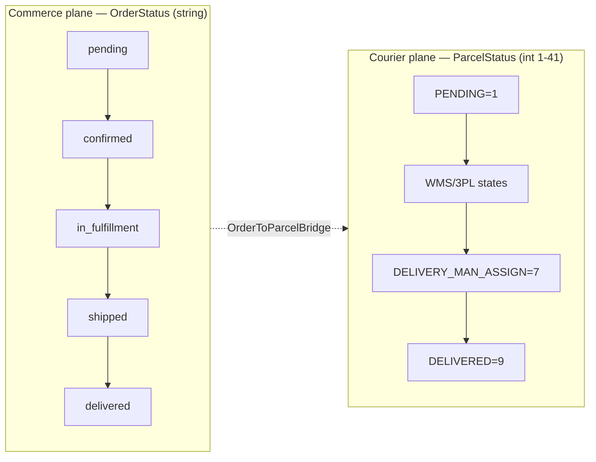

---

## 1. Order flow (storefront → canonical Order → fulfillment)

**Modules:** `app/Commerce/` → `app/Oms/` → `app/Fulfillment/`. Feature-gated behind `config('features.commerce_layer')` (default off — `config/features.php`).

A storefront webhook (first provider: Salla) is ingested, normalized into a canonical `orders` row, and an `OrderReceived` event triggers the fulfillment router. Source: `OMS.md`, `app/Oms/Services/OrderService.php`, `app/Fulfillment/Listeners/RouteToFulfillmentListener.php`.

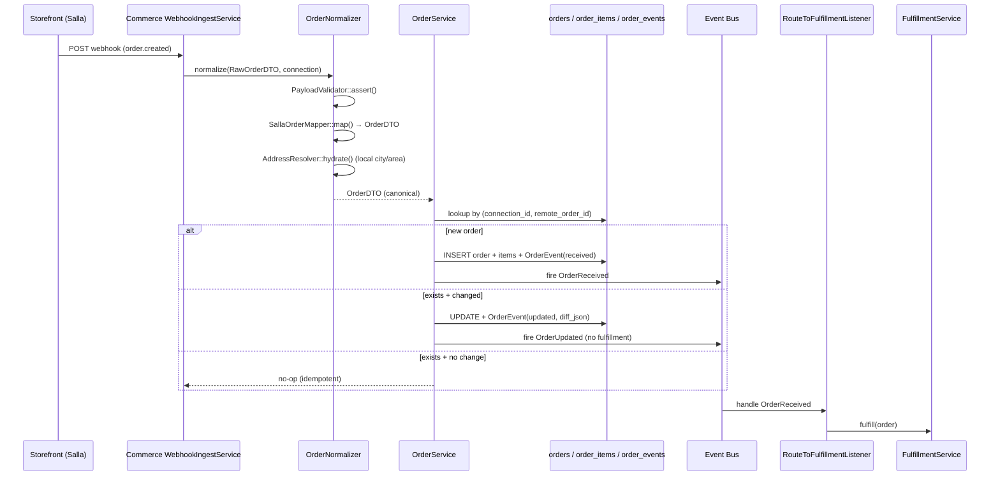

**Key facts (grounded):**
- Idempotency linchpin: `UNIQUE (connection_id, remote_order_id)` on `orders` (`OMS.md` §3). Replayed webhooks no-op or update-with-diff.
- `OrderReceived` has two listeners in `EventServiceProvider`: `LogOrderReceivedListener` (audit, first) then `RouteToFulfillmentListener` (`OMS.md` §6).
- `RouteToFulfillmentListener::handle()` **never throws** — it swallows exceptions so a failed fulfillment doesn't fail the parent `IngestWebhookJob` and trigger pointless Salla retries (`app/Fulfillment/Listeners/RouteToFulfillmentListener.php`).
- `OrderUpdated` has **no listeners today** — storefront edits after creation are a manual ops task (`OMS.md` §6).

---

## 2. Fulfillment routing (which strategy handles this order)

`FulfillmentService::fulfill($order)` picks a strategy via `FulfillmentRouter`, creates a `fulfillments` audit row, and delegates. Source: `app/Fulfillment/Services/FulfillmentService.php`, `app/Fulfillment/Services/FulfillmentRouter.php`, `FULFILLMENT.md`.

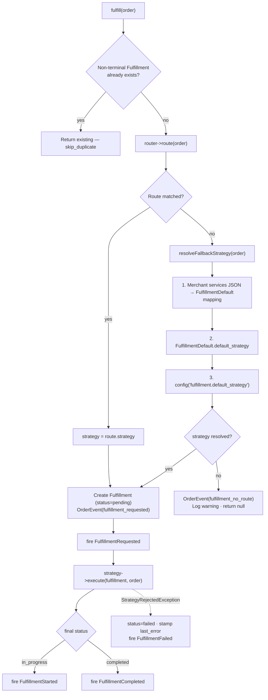

**Router matching** (`FulfillmentRouter::matches()`): all non-null route conditions are AND'd; lowest `priority` wins. Conditions checked in code: `merchant_id`, `source_provider_code`, `shipping_city_id`, `shipping_country` (case-insensitive), `min_total`, `max_total`, `is_cod` (derived from `cod_amount > 0`).

⚠️ **Doc vs Code:** `FULFILLMENT.md` §3 lists route columns as `condition_merchant_id`, `condition_country`, `condition_source_channel`, `condition_min_amount`. The **actual** router (`FulfillmentRouter::matches()`) reads `merchant_id`, `shipping_country`, `source_provider_code`, `min_total`, and adds `shipping_city_id`, `max_total`, `is_cod` that the doc omits. **Code wins.**

⚠️ **Doc vs Code:** `FULFILLMENT.md` §5 shows `resolveFallbackStrategy()` walking `FulfillmentDefault → config`. The actual precedence (code) is: **(1)** merchant `services` JSON mapped through `FulfillmentDefault::strategyForMerchantServices()`, **(2)** `FulfillmentDefault::resolvedFor()->default_strategy`, **(3)** `config('fulfillment.default_strategy')`. Also, `strategyByCode()` resolves the class from `config('fulfillment.strategies.<code>.class')` — a nested `.class` key, not the flat map shown in `FULFILLMENT.md` §8.

### The three strategies

| Strategy | `code()` | Sync/async | What it does | Source |
|---|---|---|---|---|
| `MerchantSelfStrategy` | `merchant_self` | sync | Notify merchant, park `in_progress`; they mark done manually. Skips the Parcel bridge entirely. | `app/Fulfillment/Strategies/MerchantSelfStrategy.php` |
| `ThreePlDropshipStrategy` | `threepl_dropship` | semi-async | Bridge Order→Parcel, `ShipmentService::dispatchCreate()` queues `CreateShipmentJob`, park `in_progress`. | `app/Fulfillment/Strategies/ThreePlDropshipStrategy.php` |
| `WmsFulfillmentStrategy` | `wms` | async | Bridge Order→Parcel, create `WmsFulfillment` (status=pending), park `in_progress`. Warehouse ops drive it forward. | `app/Fulfillment/Strategies/WmsFulfillmentStrategy.php` |

**Terminal roll-forward gap:** All three strategies park at `in_progress`. `FULFILLMENT.md` §9 confirms **none of the `Fulfillment*` events have listeners yet** — the roll-forward from `in_progress → completed` (on `ShipmentDelivered` / WMS `dispatched`) is described as a "future Phase 7 listener" and is **Not yet wired in the current codebase**.

---

## 3. Shipment flow (3PL dispatch via the Shipping module)

`ThreePlDropshipStrategy` hands a `Parcel` to `ShipmentService::dispatchCreate()`, which pre-creates a `shipments` row (`state=pending`) and queues `CreateShipmentJob`. The job calls the provider (first: Logestechs) and fires `ShipmentCreated`. Source: [`shipping-architecture.md`](shipping-architecture.md) §6, `app/Shipping/Services/ShipmentService.php`, `app/Shipping/Jobs/CreateShipmentJob.php`.

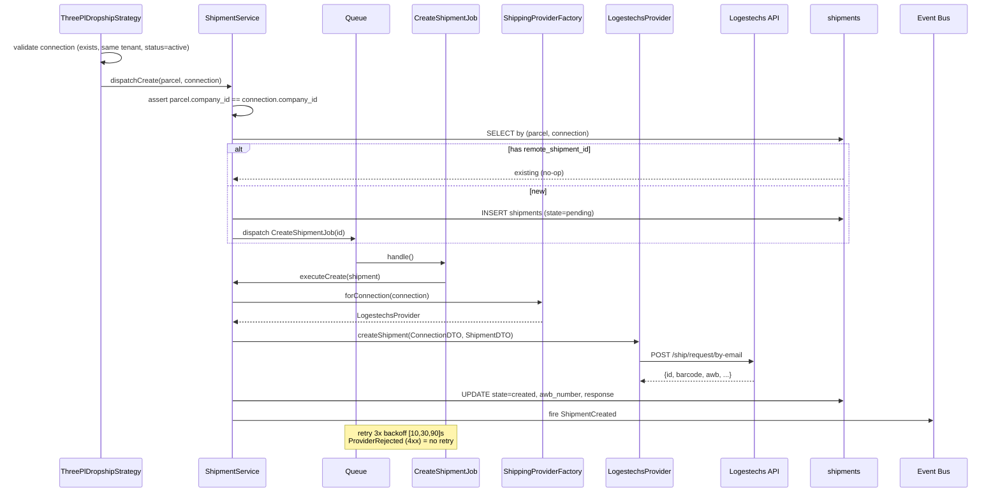

**Tenant safety** (`shipping-architecture.md` §9): every shipping table carries `company_id`; `dispatchCreate()` explicitly asserts `parcel.company_id === connection.company_id` and throws on mismatch. `ThreePlDropshipStrategy::execute()` independently re-checks cross-tenant and `status === 'active'` before dispatch.

---

## 4. Tracking sync → parcel status bridge

A cron dispatches one `SyncTrackingJob` per active connection every 5 minutes; each polls open shipments and fires `ShipmentStatusChanged` / `ShipmentDelivered`, which `UpdateParcelStatus` bridges back to the legacy `Parcel`. Source: `app/Console/Commands/ShippingSyncTracking.php`, `app/Shipping/Services/TrackingService.php`, `app/Shipping/Listeners/UpdateParcelStatus.php`.

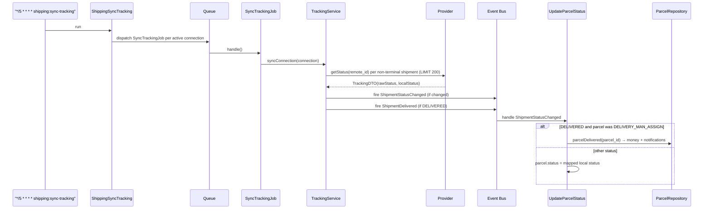

Registered listeners (`shipping-architecture.md` §13): `ShipmentStatusChanged → [UpdateParcelStatus, StoreTrackingHistory]`; `ShipmentDelivered → SendShipmentNotifications`. `ShipmentCreated` and `ShipmentCancelled` have **no listeners registered yet**.

`UpdateParcelStatus::handle()` routes a `DELIVERED` transition through `ParcelRepository::parcelDelivered()` (not a raw `status` write) precisely so the accounting + notification side effects in §11/§13/§15 fire.

---

## 5. Receiving (WMS Goods Receipt Note / GRN)

Inbound merchant stock is booked as a `wms_grn` (draft), quantities entered per line, then **completed** — which credits stock. Source: `app/Http/Controllers/Backend/Wms/WmsGrnController.php`, `app/Repositories/Wms/WmsGrnRepository.php`, `app/Enums/Wms/GrnStatus.php`.

`GrnStatus`: `draft → in_progress → completed | discrepancy`.

```mermaid
stateDiagram-v2
    [*] --> draft: create() — GRN-YYYY-NNNNN, received_by=Auth::id()
    draft --> completed: complete() — all lines expected==received
    draft --> discrepancy: complete() — any line expected≠received
    completed --> [*]
    discrepancy --> [*]
    note right of draft
      destroy() allowed only while draft
      completed/discrepancy = immutable
    end note
```

**`complete()` logic** (`WmsGrnRepository::complete()`, wrapped in `DB::transaction`):
- Per line, if `expected_qty !== received_qty` → mark GRN `discrepancy`.
- **Damaged** condition (`ItemCondition::DAMAGED`, qty>0) → auto-create `WmsDamageReport` (cause `transit_damage`), **do not credit stock**.
- **Expired** condition → **do not credit**.
- Otherwise (`received_qty > 0`) → `WmsStockRepository::adjustStock(+received_qty, FIFO, batch/expiry/reason=OTHER)` — this is the **putaway credit** (§6).
- Stamp `received_at = now()`.

---

## 6. Putaway & inventory (WmsStock — reserve / release / adjust)

There is no separate "putaway" transaction: stock is credited **into a location** at GRN completion via `WmsStockRepository::adjustStock()`, and every quantity mutation fires `StockChanged` for storefront sync. Source: `app/Repositories/Wms/WmsStockRepository.php`, `app/Wms/Observers/WmsStockObserver.php`, `app/Wms/Events/StockChanged.php`.

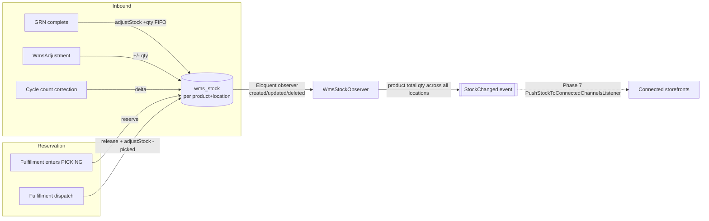

**Stock semantics (grounded):**
- `WmsStock` is keyed per `(product_id, location_id)` with `quantity` and a reserved concept. Picking **reserves**; dispatch **releases then debits**.
- `WmsStockObserver` fires `StockChanged` on `updated` (quantity dirty), `created`, and `deleted`. It skips inactive products (`is_active=false`). It reports the **product's total across all locations**, not the per-location delta.
- `StockChanged` carries `total_qty` as sellable stock — **reserved qty is intentionally excluded** (`StockChanged` docblock notes this is an "aggressive" oversell tradeoff deferred to Phase 7.5).
- `PickingStrategy` enum (`FIFO`, `FEFO`, `LIFO`) governs which stock rows are consumed; GRN credit uses `FIFO`, dispatch debit uses `FEFO` (`WmsFulfillmentRepository::dispatch()`).
- Adjustment reasons: `damage / count_correction / expiry / theft / system_error / other` (`app/Enums/Wms/AdjustmentReason.php`).

⚠️ **Doc vs Code:** The `StockChanged` docblock references a *Phase 7* `Commerce\PushStockToConnectedChannelsListener` / `PushStockJob` and `SupportsInventorySync`. Verify before relying on storefront push — the listener wiring is described as forward-looking and may be **Not yet wired in the current codebase**.

---

## 7. Picking (WmsFulfillment: pending → picking → packing)

Warehouse picker walks the warehouse one item at a time (location-code order). Entering picking **reserves** stock; all-picked auto-advances to packing. Source: `app/Http/Controllers/Backend/Wms/WmsFulfillmentController.php`, `app/Repositories/Wms/WmsFulfillmentRepository.php`.

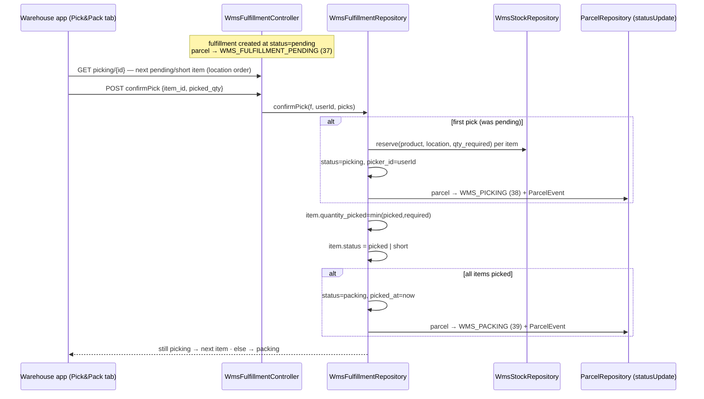

Reservation is best-effort: a `reserve()` failure is caught and the item is later flagged `short` (`quantity_picked < quantity_required`). SLA deadline is stamped at creation: `now()->addHours(config wms_sla_hours ?? 24)` (`WmsFulfillmentRepository::slaHours()`, read from `Config` key `wms_sla_hours`).

---

## 8. Packing & dispatch/loading (packing → ready → dispatched)

Packing confirmation flips to `ready`; dispatch consumes reserved stock, marks `dispatched`, and **hands the parcel to the courier workflow** (`DELIVERY_MAN_ASSIGN`). Source: `WmsFulfillmentRepository::confirmPack()` / `dispatch()`.

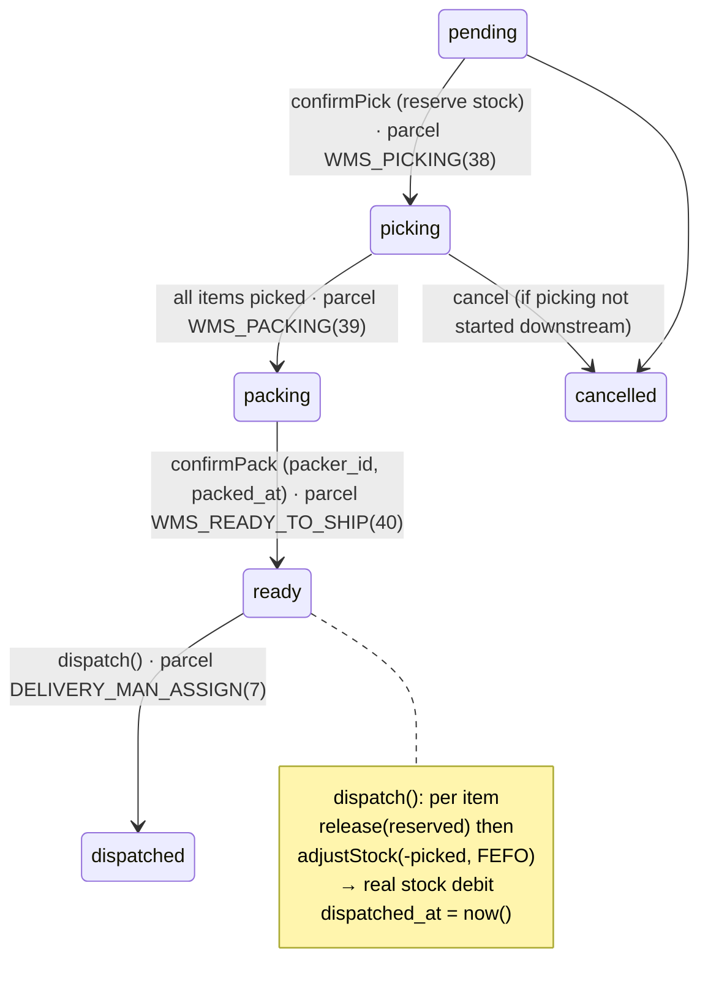

`WmsFulfillmentStrategy` maps WMS status back to the OMS `Fulfillment` row via `wms_fulfillment_id`; its `cancel()` refuses if the `WmsFulfillment` is already `dispatched` (`app/Fulfillment/Strategies/WmsFulfillmentStrategy.php`). "Loading" onto a vehicle is not a distinct DB state — dispatch directly transitions the parcel to `DELIVERY_MAN_ASSIGN`, from which the courier plane takes over.

---

## 9. Sorting (sorting center → hub transfer)

The `rushly-sorting-app` scans AWBs and hands parcels over to a destination hub in bulk. Bags/routes are **device-side ephemeral buckets**; only lookup + handover hit the server. Source: `app/Http/Controllers/Api/V10/Admin/AdminSortingController.php`, `rushly-sorting-app/lib/features/sorting/data/sorting_repository.dart`, `routes/api.php:170-172`.

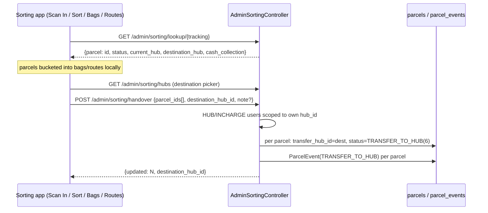

**Access control (grounded):** `UserType::HUB` and `UserType::INCHARGE` with a `hub_id` may only hand over parcels currently in their own hub (`$q->where('hub_id', $user->hub_id)`). Handover writes are wrapped in `DB::transaction`.

---

## 10. Delivery (courier plane) & the parcel status machine

Once dispatched/assigned, the parcel moves through the 41-state `ParcelStatus` machine driven by `app/Repositories/Parcel/ParcelRepository.php` and the driver/supervisor apps. `parcelDelivered()` is the money-moving terminal (§11). Source: `app/Enums/ParcelStatus.php`, `app/Repositories/Parcel/ParcelRepository.php`, `ACCOUNTING.md` §4.4.

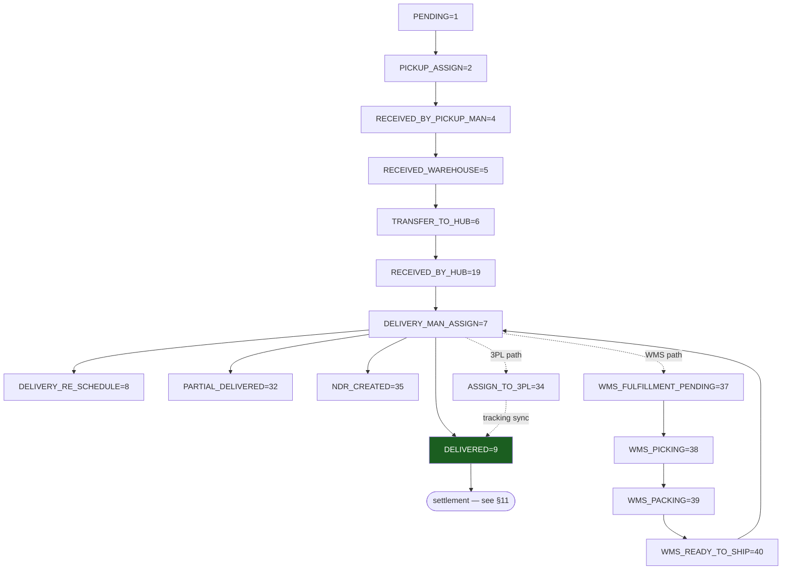

Non-happy-path branches all exist as first-class constants: reschedules (`3,8,18,27`), cancels (each state has a paired `_CANCEL`), abnormal (`ABNORMAL=36`), and the full return sub-machine (§12).

---

## 11. Settlement / parcel-driven accounting (on `delivered`)

Delivery is where most money moves. `ParcelRepository::parcelDelivered()` (≈lines 2015–2130) writes to all three accounting layers atomically. Source: `ACCOUNTING.md` §4.4 + §7, `app/Repositories/Parcel/ParcelRepository.php`.

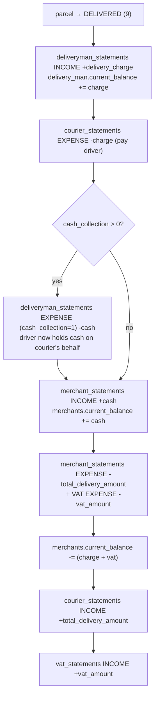

**Net merchant delta = `cash_collection − total_delivery_amount − vat_amount`** = what the courier owes the merchant for this parcel.

Three-layer model (`ACCOUNTING.md` §1): **Layer 3** mutable running balances (`merchants/delivery_man/hubs.current_balance`, `accounts.balance`) · **Layer 2** append-only statement ledgers (`*_statements`, each row `type = INCOME(1) | EXPENSE(2)` per `StatementType`) · **Layer 1** cash (`accounts` + immutable `bank_transactions`). The system is **not double-entry** — balances are maintained by application increments; a missed write path drifts.

---

## 12. Return flow

Undeliverable/refused parcels enter the return sub-machine (`ParcelStatus` 11–13, 24–31) and/or the NDR workflow. Source: `app/Enums/ParcelStatus.php`, `app/Enums/NdrStatus.php`, `app/Enums/NdrAction.php`, `ACCOUNTING.md` §4.4 (return handlers).

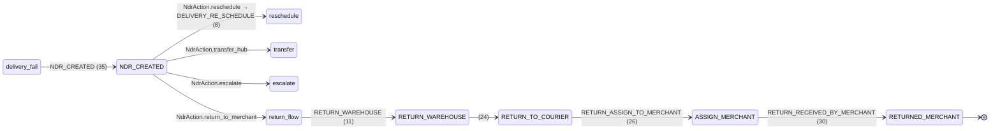

- **NDR** (`ndr_status`): `open → in_progress → resolved | returned`. Actions (`NdrAction`): `reschedule / return_to_merchant / transfer_hub / escalate`. Additional enums: `NdrFailureReason`.
- **WMS returns**: `WmsOutbound` supports `OutboundType::RETURN_TO_MERCHANT` for warehouse-side merchant return processing (`app/Enums/Wms/OutboundType.php`, `app/Repositories/Wms/WmsOutboundRepository.php`).
- **Accounting**: return / partial-delivered / return-to-merchant follow analogous per-party ledger patterns in the same `ParcelRepository` (`ACCOUNTING.md` §4.4 closing note); return charges feed the invoice (§14).

---

## 13. Cash settlement chain (driver → hub → bank)

Collected COD cash walks up the chain, each hop clearing the prior party's held balance. Source: `ACCOUNTING.md` §4.5 + §7, `app/Repositories/CashReceivedFromDeliveryman/ReceivedRepository.php`, `app/Repositories/HubManage/HubPayment/HubPaymentRepository.php`.

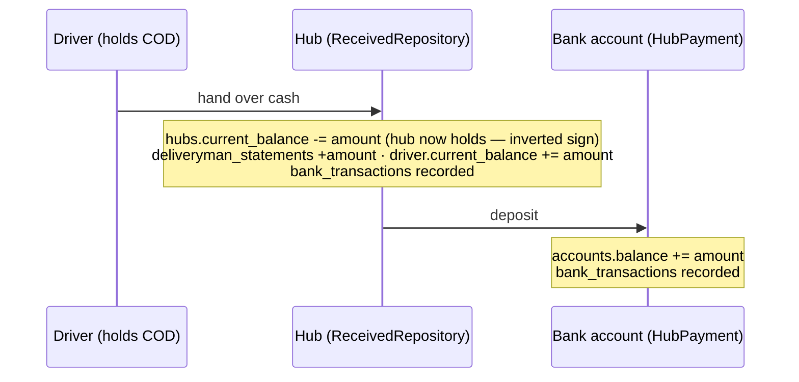

⚠️ **Gotcha (from `ACCOUNTING.md` §8):** `hubs.current_balance` is **inverted** — it *increases* when cash flows out (bank deposit) and *decreases* when cash is received from a driver. Read it as "amount the hub owes the company."

---

## 14. Invoice generation (settlement snapshot)

The scheduled `invoice:generate` command (`app/Console/Commands/Invoice.php`) snapshots each merchant's billable parcels into an `invoices` row. It is **read-only against balances** — it moves no money. Source: `ACCOUNTING.md` §4.9, `app/Repositories/Invoice/InvoiceRepository.php`, `app/Enums/InvoiceStatus.php`.

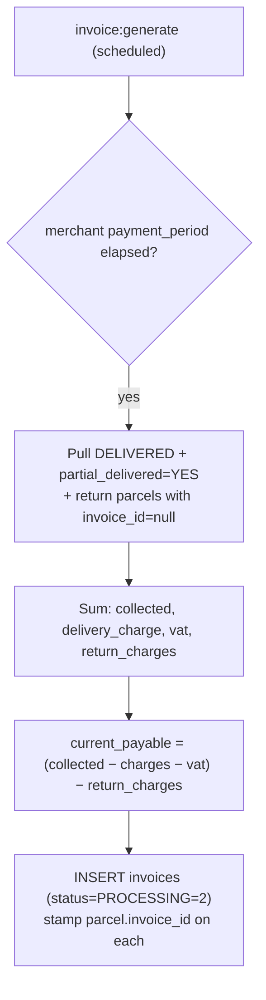

`InvoiceStatus`: `UNPAID=0`, `PROCESSING=2`, `PAID=3` (note: no `1`). Invoice **payment** happens separately via the merchant-payout flow (§15).

---

## 15. Payment / merchant payout

Merchant payouts run through `PaymentRepository::store()` (not the generic expense head). Online gateways are also available via `PayoutController`. Source: `ACCOUNTING.md` §4.6 + §5, `app/Repositories/MerchantManage/Payment/PaymentRepository.php`, `app/Enums/PaymentType.php`, `app/Enums/PayoutSetup.php`.

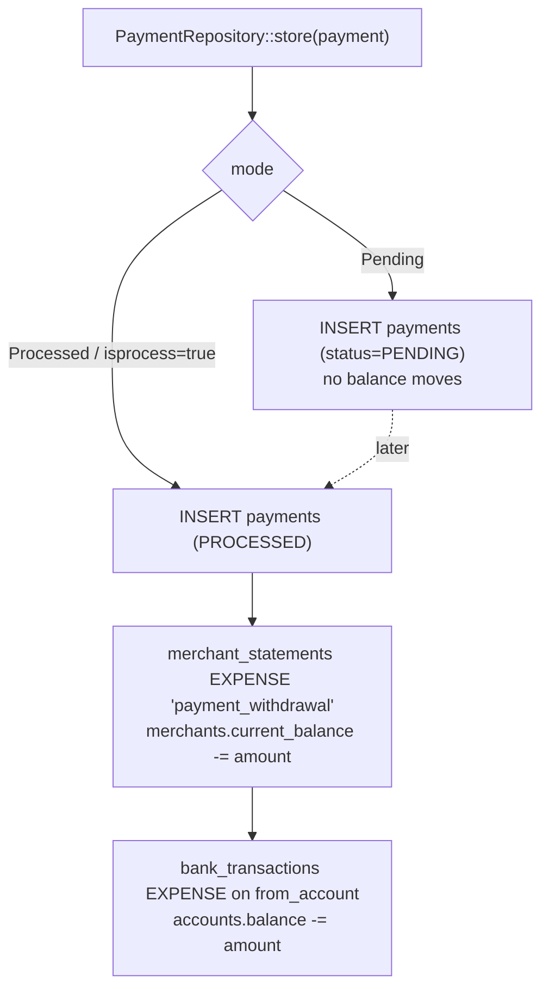

- **Gateways** (`PayoutSetup`): Stripe, SSLCommerz, PayPal, Payoneer, bKash, Visa, Skrill, AamarPay, Razorpay, Paystack, Offline. Inbound gateway receipts land in `merchant_online_payments` / `_receiveds` (`ACCOUNTING.md` §2.3).
- **Account-head hardcoding gotcha** (`ACCOUNTING.md` §3): head IDs 1–7 are positional and hardcoded in `if ($request->account_head_id == 4)` style checks. Head 4 ("Payment paid to merchant") is seeded **inactive** precisely because payouts run through `PaymentRepository` instead. Do not reorder `AccountHeadSeeder`.

---

## 16. Notification workflow

Notifications are a **side-effect layer**, not a state machine. Terminal parcel/shipment transitions call into the push + SMS pipelines, gated by per-parcel `send_sms_*` flags. Source: `app/Http/Services/PushNotificationService.php`, `app/Http/Services/SmsService.php`, `app/Shipping/Listeners/SendShipmentNotifications.php`, `app/Enums/SmsSendStatus.php`.

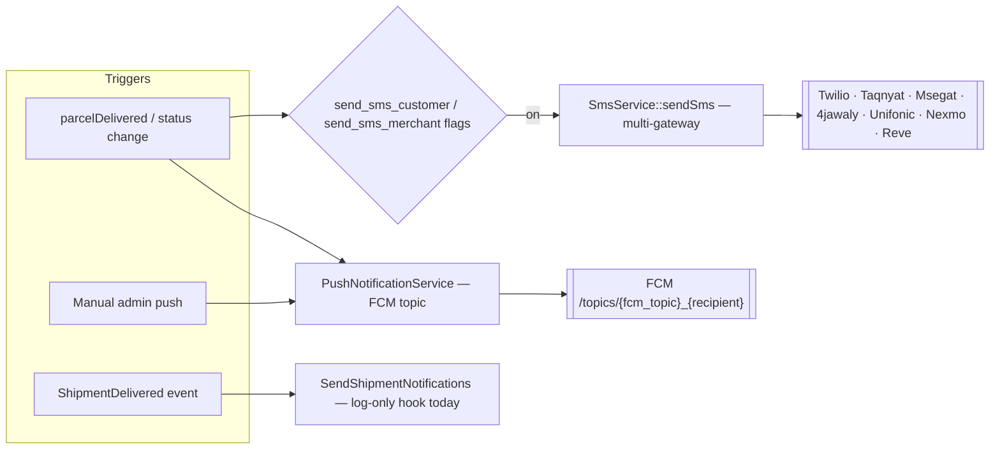

**Grounded facts:**
- `PushNotificationService::sendPushNotification()` posts to FCM legacy HTTP (`https://fcm.googleapis.com/fcm/send`) with a topic derived from `notificationSettings()->fcm_topic` + sanitized recipient.
- `SmsService` is multi-gateway (`sendSms()` dispatches to `reveSms/twilioSms/taqnyatSms/msegatSms/jawaly4Sms/unifonicSms/nexmoSms`, plus `sendOtp()`); status tracked via `SmsSendStatus` / `SmsSetup`.
- `SendShipmentNotifications` (on `ShipmentDelivered`) is **log-only today** — it defers real SMS/email to `ParcelRepository::parcelDelivered`'s existing `send_sms_*` handling and is reserved for future shipping-specific notifications (`app/Shipping/Listeners/SendShipmentNotifications.php` docblock).

⚠️ **Doc vs Code:** the FCM integration uses the **legacy** `fcm/send` + server-key API, which Google has deprecated in favor of FCM HTTP v1. Present in code as legacy; flag for modernization.

---

## 17. End-to-end: one order, both planes

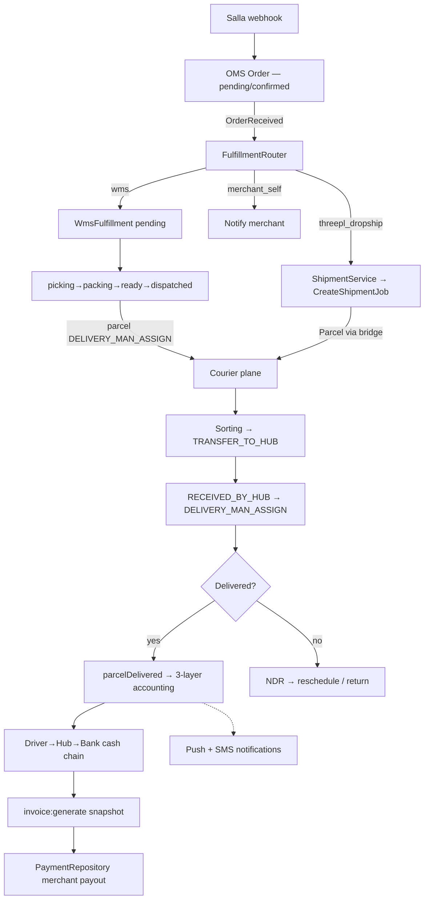

---

## Sources

**Repo-root & docs primary sources**
- [`OMS.md`](../OMS.md) · [`FULFILLMENT.md`](../FULFILLMENT.md) · [`shipping-architecture.md`](shipping-architecture.md) · [`ACCOUNTING.md`](../ACCOUNTING.md) · [`COMMERCE.md`](../COMMERCE.md) · `docs/_CONTEXT_BRIEF.md`

**Fulfillment** (`app/Fulfillment/`)
- `Services/FulfillmentService.php`, `Services/FulfillmentRouter.php`
- `Strategies/{WmsFulfillmentStrategy,ThreePlDropshipStrategy,MerchantSelfStrategy}.php`
- `Bridges/OrderToParcelBridge.php`, `Listeners/RouteToFulfillmentListener.php`, `Contracts/FulfillmentStrategyInterface.php`

**OMS** (`app/Oms/`)
- `Enums/{OrderStatus,FulfillmentStatus,PaymentStatus}.php`, `Services/OrderService.php` (per `OMS.md`)

**Shipping** (`app/Shipping/`)
- `Services/ShipmentService.php`, `Services/TrackingService.php`, `Jobs/CreateShipmentJob.php`, `Jobs/SyncTrackingJob.php`
- `Listeners/{UpdateParcelStatus,SendShipmentNotifications,StoreTrackingHistory}.php`, `Events/*`
- `app/Console/Commands/ShippingSyncTracking.php`

**WMS** (`app/Wms/`, `app/Models/Backend/Wms/`, `app/Repositories/Wms/`, `app/Enums/Wms/`)
- `Observers/WmsStockObserver.php`, `Events/StockChanged.php`
- `Http/Controllers/Backend/Wms/{WmsGrnController,WmsFulfillmentController,WmsOutboundController}.php`
- `Repositories/Wms/{WmsGrnRepository,WmsFulfillmentRepository,WmsOutboundRepository,WmsStockRepository}.php`
- `Models/Backend/Wms/{WmsFulfillment,WmsGrn,WmsOutbound}.php`
- `Enums/Wms/{GrnStatus,FulfillmentStatus,OutboundType,PickingStrategy,AdjustmentReason,ItemCondition,LocationType}.php`

**Courier / status machines** (`app/Enums/`)
- `ParcelStatus.php`, `NdrStatus.php`, `NdrAction.php`, `InvoiceStatus.php`, `PaymentType.php`, `PayoutSetup.php`, `StatementType.php`, `PickupRequestType.php`

**Sorting**
- `app/Http/Controllers/Api/V10/Admin/AdminSortingController.php`, `routes/api.php` (sorting routes)
- `rushly-sorting-app/lib/features/sorting/data/sorting_repository.dart`, `.../core/api/api_endpoints.dart`

**Accounting / settlement** (per `ACCOUNTING.md`)
- `app/Repositories/Parcel/ParcelRepository.php` (parcelDelivered money moves)
- `app/Repositories/CashReceivedFromDeliveryman/ReceivedRepository.php`, `app/Repositories/Invoice/InvoiceRepository.php`
- `app/Repositories/MerchantManage/Payment/PaymentRepository.php`, `app/Console/Commands/Invoice.php`

**Notifications**
- `app/Http/Services/PushNotificationService.php`, `app/Http/Services/SmsService.php`
