# 13 — User Journeys (Phase 10)

> Persona-by-persona, end-to-end walkthroughs of the Rushly logistics platform: **what each
> actor does, in which app, on which screen, and which backend endpoint it hits.**
> Grounded in the actual code of `rushly-saas` (the single source of truth) and its eight
> Flutter client apps. Read the shared context in [`_CONTEXT_BRIEF.md`](_CONTEXT_BRIEF.md) first.

Cross-links: architecture in [05-System-Architecture.md](05-System-Architecture.md) ·
data model in [06-Database.md](06-Database.md) · API surface in [09-API.md](09-API.md) ·
auth/tenancy in [10-Authentication.md](10-Authentication.md) ·
Flutter internals in [08-Flutter.md](08-Flutter.md) · modules in [11-Modules.md](11-Modules.md) ·
domain/lifecycle in [03-Business-Domain.md](03-Business-Domain.md) and
[04-Business-Logic.md](04-Business-Logic.md).

---

## 0. How to read this document

Every journey below is a real path through the software, not an idealised process. Each
persona section names:

- **The app / surface** they use (a Flutter mobile app, the Inertia/React admin web, the
  Blade super-admin panel, or a public web page).
- **The screens** (Flutter `*_screen.dart` / `*_tab.dart`, or React `resources/js/Pages/*`).
- **The backend endpoint** the screen calls (cited as a backticked path or route).

Two Mermaid diagram styles are used:

- **`journey`** blocks — the high-level experience map (steps + satisfaction score, kept
  qualitative here).
- **`sequenceDiagram`** blocks — the precise app → API → DB/side-effect exchange.

### Persona → app → primary backend map

| Persona | Primary app | Repo | Auth endpoint | Backend controllers (rushly-saas) |
|---|---|---|---|---|
| **Customer** (consignee) | Public web tracking page + SMS link | `rushly-saas` (Frontend) / bridge `/track` | none (public/signed) | `Frontend/FrontendController.php`, `Backend/ParcelRatingController.php`, `ParcelController@parcelTrackingLogs` |
| **Merchant** | `rushly-merchant-app` + merchant web panel | `rushly-merchant-app` / `rushly-saas` | `POST /api/v10/signin` · web `/login` | `Api/V10/*` merchant slice; web `MerchantPanel/*` |
| **Warehouse operator** | `rushly-warehouse-app` | `rushly-warehouse-app` | `POST /api/v10/admin/login` | `Api/V10/Wms/*`, `Api/V10/Admin/AdminWmsController` |
| **Driver** (last-mile) | `rushly-driver-app` | `rushly-driver-app` | `POST /api/v10/deliveryman/login` | `Api/V10/DeliveryManParcelController`, `NdrController`, `Deliveryman*` |
| **Fleet driver** | `rushly-fleet-app` | `rushly-fleet-app` | `POST /api/v10/admin/login` | `Api/V10/Fleet/FleetDriverApiController` |
| **Sorting operator** | `rushly-sorting-app` | `rushly-sorting-app` | `POST /api/v10/admin/login` | `Api/V10/Admin/AdminSortingController` |
| **Scanner operator** | `rushly-scanner-app` | `rushly-scanner-app` | `POST /api/v10/admin/login` | `AdminSortingController::lookup` + `AdminParcelController::forceStatus` |
| **Supervisor** | `rushly-supervisor-app` | `rushly-supervisor-app` | `POST /api/v10/admin/login` | `Api/V10/Admin/{AdminMap,AdminParcel,AdminReports,AdminExceptions}Controller` |
| **Admin / hub / incharge** | `rushly-admin-app` + admin web | `rushly-admin-app` / `rushly-saas` | `POST /api/v10/admin/login` · web `/login` | `Api/V10/Admin/*`; web `Backend/*` |
| **Super-admin** | Admin web (central domain) | `rushly-saas` | web `/login` (central) | `Backend/Superadmin/*`, `routes/superadmin.php` |

Source for the app/persona split: [`MOBILE_APPS.md`](../MOBILE_APPS.md) §"The 8 apps at a
glance", [`RUSHLY_APPS_OVERVIEW.md`](../RUSHLY_APPS_OVERVIEW.md), and the per-app
`lib/features/**/presentation/*` screen inventories.

---

## 1. The shared spine: parcel lifecycle & tenant login

Almost every operational persona is acting on one object — the **Parcel** — as it moves
through the `ParcelStatus` state machine (`app/Enums/ParcelStatus.php`, 41 states). The
journeys below are best understood as different actors advancing the *same* parcel:

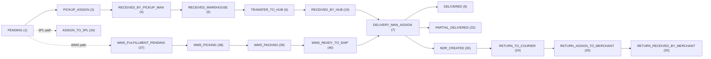

> ⚠️ **Doc vs Code:** [`RUSHLY_APPS_OVERVIEW.md`](../RUSHLY_APPS_OVERVIEW.md) and the
> WooCommerce plugin notes call this a "34-state" / "40-state" pipeline. The current enum
> `app/Enums/ParcelStatus.php` defines **41 constants** (`PENDING`=1 … `CANCELLED`=41).
> Code wins; use 41.

**Tenant-aware login (every Flutter app).** Before any journey starts, all eight apps run the
same 2-gate boot flow (`MOBILE_APPS.md` §1, and each app's
`features/tenant/presentation/tenant_select_screen.dart` +
`features/auth/presentation/login_screen.dart`):

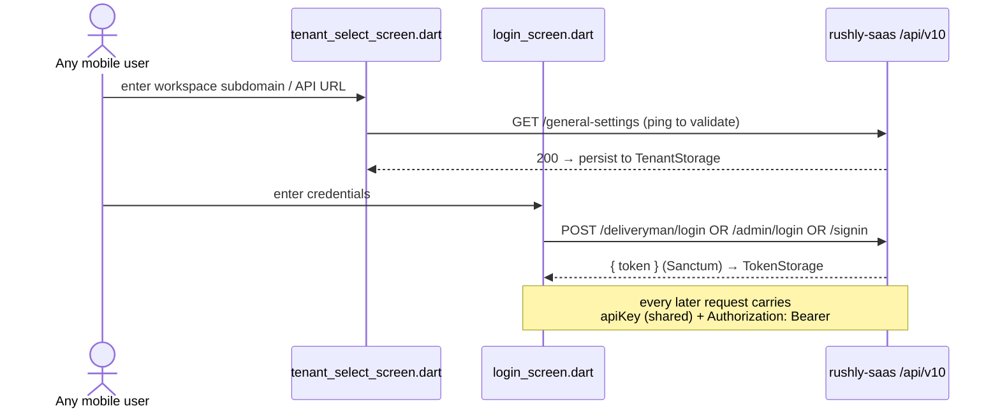

Router redirects gate every non-public route on `tenant_configured && authed`; a 401 wipes
the token and returns to `/login` (`core/api/DioClient`, per `MOBILE_APPS.md` §1).

> ⚠️ **Doc vs Code (stack):** `README.md`/`RUSHLY_APPS_OVERVIEW.md` say "Laravel 12 / PHP 8.4".
> `composer.json` pins **`laravel/framework ^10.10`, PHP `^8.1`** — code wins (see
> [`_CONTEXT_BRIEF.md`](_CONTEXT_BRIEF.md)).

---

## 2. Customer (consignee) journey

**Who:** the end recipient of a parcel. They never log in and have no app — they interact
through an SMS/tracking link and a public web page.

**Surfaces & screens**

- Public **tracking page** — `GET /tracking` → `Frontend/FrontendController::tracking`
  (`routes/web.php:226`). Live driver position via `GET /shipment-location/{shipment_id}`
  (`routes/web.php:227`).
- Storefront-bridge tracking proxies — `rushly-salla`/`rushly-zid`/`rushly-shopify`
  each expose `/track/{trackingNumber}` (`RUSHLY_APPS_OVERVIEW.md` §1–4).
- Public tracking API (for integrators) — `GET /api/v10/public/tracking/{tracking_id}`
  behind `public.tracking.key` middleware (`routes/api.php:70-77`), plus the token-less
  `GET /api/v10/parcel/tracking/{tracking_id}` → `ParcelController::parcelTrackingLogs`
  (`routes/api.php:402`) which the Shopify bridge polls.
- Post-delivery **rating** — signed-URL capture, no auth: `GET /r/parcel/{id}/rate` and
  `POST /r/parcel/{id}/rate` → `Backend/ParcelRatingController` (`routes/web.php:217-222`).

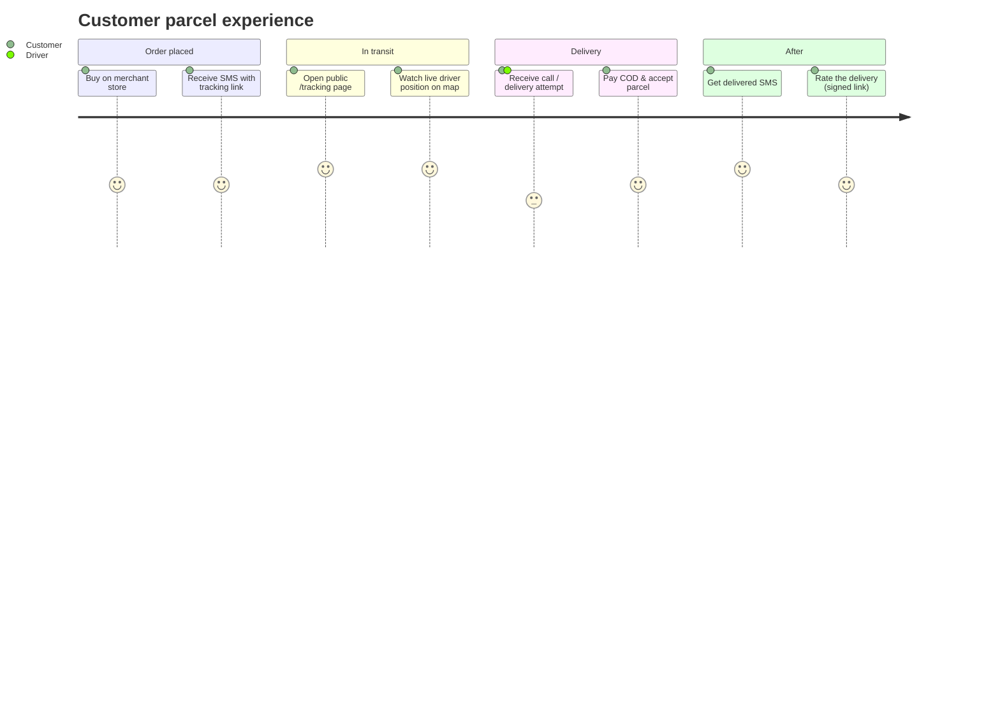

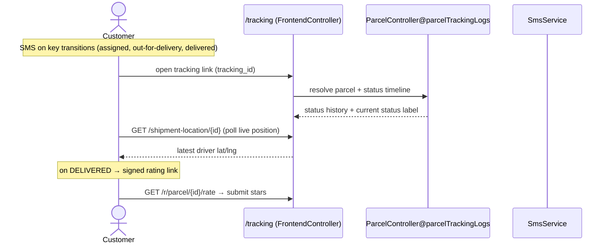

Notes:
- SMS dispatch is handled centrally (`app/Http/Services/SmsService.php`, Twilio/Vonage per
  `_CONTEXT_BRIEF.md`); which transitions send SMS is tenant-configurable under SMS Send
  Settings (`resources/js/Pages/Admin/SmsSendSettings/*`).
- The customer's live-map dot is the **driver's** location ping (see §5 Driver — the driver
  app posts `deliveryman/parcel-location-update`).

---

## 3. Merchant journey

**Who:** shop owners who hand parcels to Rushly for last-mile delivery (and optionally
storage/fulfillment). Two surfaces: the **`rushly-merchant-app`** and the **merchant web
panel** (Inertia `resources/js/Pages/Merchant/*`).

**Screens (`rushly-merchant-app/lib/features/*/presentation`)**
Bottom nav: Dashboard, Parcels, Shops, Payments, Support (+ drawer: Fraud, News, Settings,
Invoices) — `dashboard/presentation/home_shell.dart`.

| Step | Screen | Endpoint |
|---|---|---|
| Register / sign in / OTP | `auth/register_screen.dart`, `signin_screen.dart`, `otp_screen.dart` | `POST /register`, `/signin`, `/otp-verification`, `/resend-otp` |
| Dashboard KPIs | `dashboard/dashboard_screen.dart` | `GET /dashboard`, `/dashboard/filter`, `/analytics` |
| Create a shop | `shops/shop_form_screen.dart` | `POST /shops/store` |
| Create parcel (charge preview) | `parcels/parcel_form_screen.dart` | `POST /parcel/create`, `/parcel/store` |
| Bulk CSV import | `parcels/bulk_import_screen.dart` | `POST /parcel/bulk-store` (returns `{created, error_count, errors[]}`) |
| Track a parcel | `parcels/parcel_details_screen.dart` + `parcel_tracking_map.dart` | `GET /parcel/details/{id}`, `/logs/{id}` |
| Reports | `reports/reports_screen.dart` | `GET /reports/shipments?from=&to=` |
| Payments / payout | `payments/payments_hub_screen.dart`, `payment_request_form_screen.dart`, `statements_pdf.dart` | `/payment-accounts/*`, `/payment-request/*`, `/statements/index` |
| Invoices | `invoices/invoices_screen.dart` | `GET /invoice-list/index`, `/invoice-details/{id}` |
| Fraud check on phone | `fraud/fraud_screen.dart` | `POST /fraud/check`, `/fraud/store` |
| NDR feed | `ndr/ndr_screen.dart` | `GET /ndr/merchant` |
| Store connections | `store_connections/store_connections_screen.dart` | `GET /store-connections` |
| Support | `support/*` | `/support/*` |

Backend controllers: `app/Http/Controllers/Api/V10/{Auth,Dashboard,Parcel,Shops,PaymentAccount,PaymentRequest,Statements,Invoice,Fraud,Support,NewsOffer,Settings,MerchantReports,MerchantStoreConnections}Controller.php` (`MOBILE_APPS.md` §12).

Web merchant panel mirrors these (`resources/js/Pages/Merchant/{Dashboard,Parcel,Shops,Accounts,PaymentReceived,Invoice,Reports,Support,Settings}`); the ported dashboard prop
contract is documented in [`MERCHANT_DASHBOARD.md`](../MERCHANT_DASHBOARD.md).

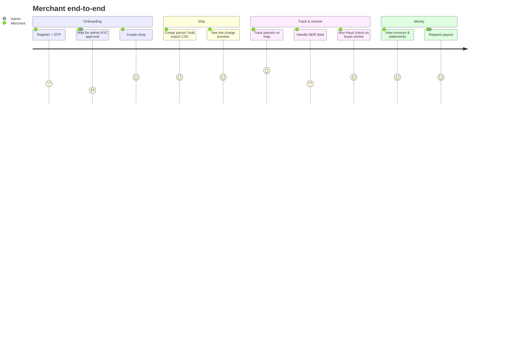

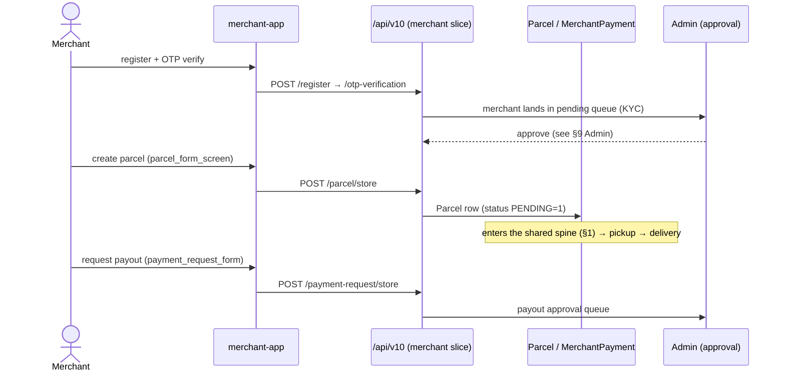

**Storefront-fed merchants** never touch the app for parcel creation: their Salla/Zid/
WooCommerce/Shopify order becomes a parcel automatically via the bridges
(`RUSHLY_APPS_OVERVIEW.md` §1–4) — the merchant only watches it in *Store connections* and
*Parcels*.

---

## 4. Warehouse operator journey

**Who:** warehouse-floor staff running WMS operations (receiving, picking, packing,
inventory, dispatch). App: **`rushly-warehouse-app`** (seed colour brown 700), 4 tabs.

**Screens (`rushly-warehouse-app/lib/features/*/presentation`)**

| Tab | Screen | Endpoint |
|---|---|---|
| **Receive** | `wms/receive_tab.dart` → `grn_list_screen.dart` → `grn_scan_screen.dart` | `GET /admin/wms/grns`, `GET /wms/products/lookup`, `POST /wms/grn/{id}/scan`, `POST /wms/grn/{id}/complete` |
| **Pick & Pack** | `fulfillment/pick_pack_tab.dart` → `fulfillment_task_screen.dart` | `GET /wms/fulfillment/my-tasks`, `POST /wms/fulfillment/{id}/pick`, `POST /wms/fulfillment/{id}/pack` |
| **Inventory** | `wms/inventory_tab.dart`, `cycle_count_screen.dart`, `damage_reports_screen.dart`, `adjustment_sheet.dart`, `stock_lookup_screen.dart` | `GET/POST /admin/wms/cycle-counts`, `/admin/wms/damage-reports`, `POST /wms/adjustments`, `GET /wms/stock/{id}` |
| **Dispatch** | `fulfillment/dispatch_tab.dart` | `GET /wms/fulfillment/ready-to-dispatch`, `POST /wms/fulfillment/{id}/dispatch` |

Backend: `app/Http/Controllers/Api/V10/Wms/{WmsFulfillment,WmsGrn,WmsProduct,WmsStock,WmsAdjustment}ApiController.php` + `Api/V10/Admin/AdminWmsController.php`. WMS models at
`app/Models/Backend/Wms/*`, enums at `app/Enums/Wms/*` (`_CONTEXT_BRIEF.md`). Module wiring:
[`11-Modules.md`](11-Modules.md) (`app/Wms/`, `WmsStockObserver`, `StockChanged`).

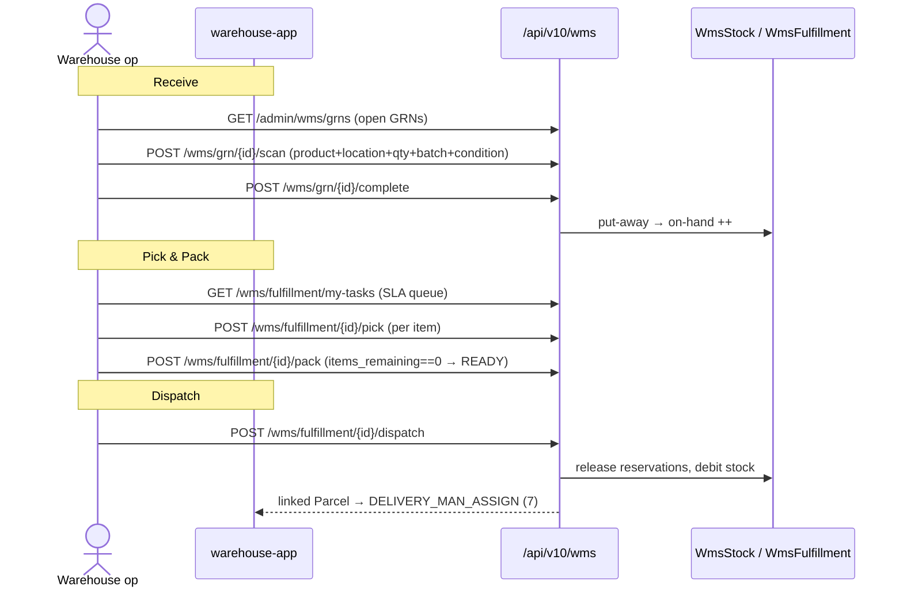

Details from `MOBILE_APPS.md` §6:
- **Adjust** auto-flags a ≥20% delta for supervisor approval (`POST /wms/adjustments`).
- **Dispatch** routes to `WmsFulfillmentApiController::confirmDispatch` (not `dispatch`,
  which collides with `Illuminate\Routing\Controller::dispatch($job)`); it flips the parcel
  to `DELIVERY_MAN_ASSIGN` (7), joining the last-mile spine (§1).
- The admin app (`rushly-admin-app/features/wms/*`) exposes the same WMS surface as a
  back-office subset (stock lookup, GRN, cycle count, damage) per `MOBILE_APPS.md` §4.

---

## 5. Driver (last-mile deliveryman) journey

**Who:** last-mile delivery drivers. App: **`rushly-driver-app`**, 5-tab shell (Dashboard,
Parcels, Earnings, Support, Profile) — `dashboard/presentation/home_shell.dart`. Login is
`POST /deliveryman/login` (distinct from admin login).

**Screens (`rushly-driver-app/lib/features/*/presentation`)**

| Step | Screen | Endpoint |
|---|---|---|
| Login / OTP | `auth/login_screen.dart` | `POST /deliveryman/login`, `/otp-verification` |
| Dashboard (clickable KPIs) | `dashboard/dashboard_screen.dart` | `GET /deliveryman/dashboard` |
| Assigned parcels | `parcels/parcel_list_screen.dart` | `GET /deliveryman/parcel/index` |
| Route-optimised runsheet | `parcels/runsheet_screen.dart` | (client-side nearest-neighbour over the assigned list) |
| Parcel detail + live map | `parcels/parcel_details_screen.dart`, `parcel_tracking_map.dart` | `GET /deliveryman/parcel/details/{id}` |
| AWB scan | AppBar scanner on `parcel_list_screen.dart` | `GET /deliveryman/parcel/by-tracking/{tracking}` (`routes/api.php:369`) |
| **Delivered** | `parcels/deliver_screen.dart` | `POST /delivered/{id}` |
| **Partial delivered** | `parcels/partial_delivery_screen.dart` | `POST /partial-delivered/{id}` |
| **Not delivered** (+photo/reason) | `parcels/not_delivered_screen.dart` | delivery-outcome POST + NDR |
| Report NDR | `ndr/ndr_create_screen.dart`, `ndr_screen.dart` | `POST /ndr`, `GET /ndr/index`, `/stats` |
| Location ping | background (geolocator) | `POST /deliveryman/parcel-location-update` (driver derived from token) |
| Earnings | `earnings/earnings_screen.dart` | `GET /deliveryman/cash`, `/payment-logs`, `/income-expense` |
| Cash reconciliation | `cash/cash_screen.dart` | `GET /deliveryman/cash` (outstanding COD + handover history) |
| Support | `support/*` | `/support/*` |

Backend: `app/Http/Controllers/Api/V10/DeliveryManParcelController.php` (`index`, `details`,
`findByTracking`, delivered flows), `NdrController`, `Deliveryman*`, `Support`,
`PushNotification` (`MOBILE_APPS.md` §2, §12).

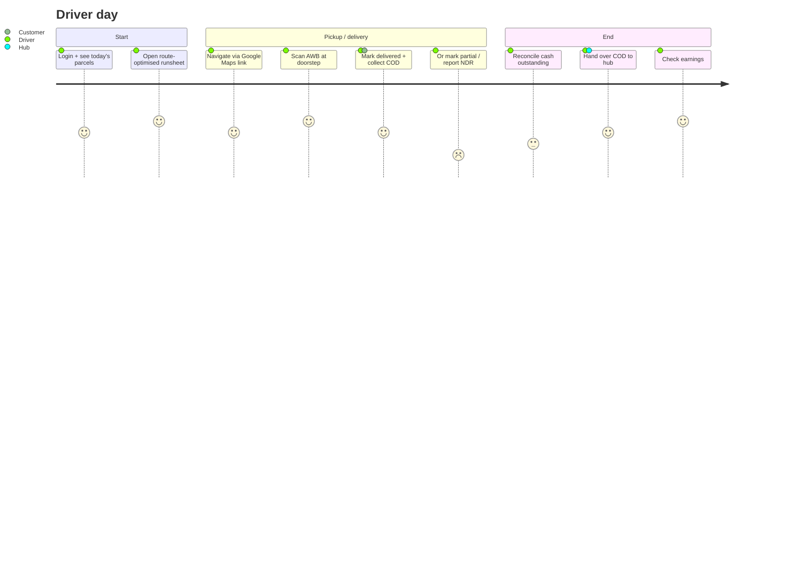

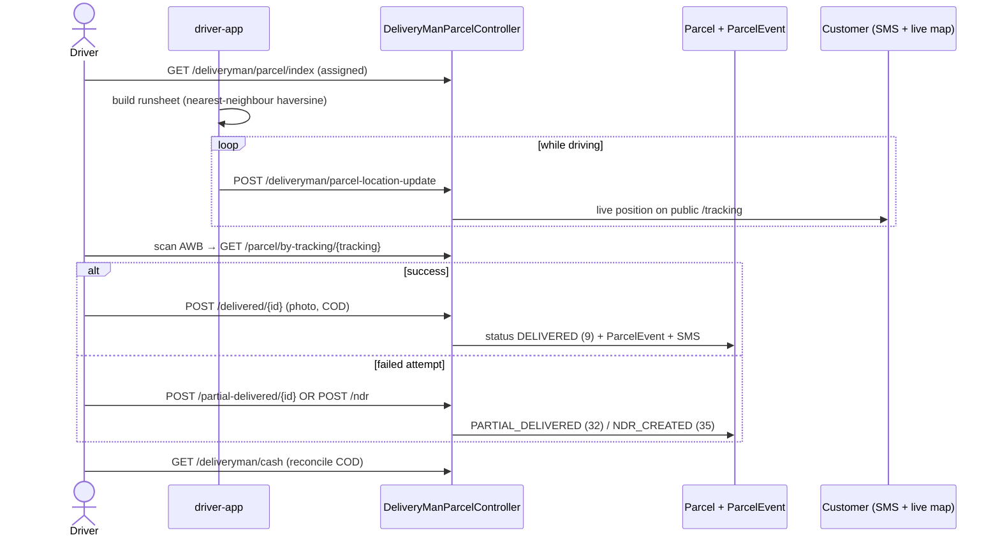

> Security note (from `MOBILE_APPS.md` §2): `parcel-location-update` moved *inside*
> `auth:sanctum` — the driver is derived from the token, not a spoofable `deliveryID` in the
> body; and `by-tracking` guards that the parcel is actually assigned to the caller.

---

## 6. Fleet driver journey

**Who:** long-haul / line-haul drivers managing a vehicle rather than parcels. App:
**`rushly-fleet-app`** (seed colour indigo 700), 4 tabs. Any authed user can use it —
`driver_id` is `Auth::id()` throughout (`MOBILE_APPS.md` §8).

**Screens (`rushly-fleet-app/lib/features/fleet/presentation`)**

| Tab | Screen | Endpoint |
|---|---|---|
| **Trips** | `trips_tab.dart` | `GET /admin/fleet/trips`, `POST /admin/fleet/trips` (start: odometer + inspection JSON), `POST /admin/fleet/trips/{id}/end` |
| **Vehicle** | `vehicle_tab.dart` | `GET /admin/fleet/vehicle` (assigned vehicle + active trip) |
| **Fuel** | `fuel_tab.dart` | `GET /admin/fleet/fuel`, `POST /admin/fleet/fuel` (liters, cost, odometer, receipt) |
| **Maintenance** | `maintenance_tab.dart` | `GET /admin/fleet/maintenance`, `POST /admin/fleet/maintenance` (type + severity + description) |

Backend: `app/Http/Controllers/Api/V10/Fleet/FleetDriverApiController.php`; tables created by
migration `2026_07_17_100000_create_fleet_tables.php` (`fleet_vehicles`, `fleet_trips`,
`fleet_fuel_logs`, `fleet_maintenance_reports`), company-scoped (`MOBILE_APPS.md` §8).

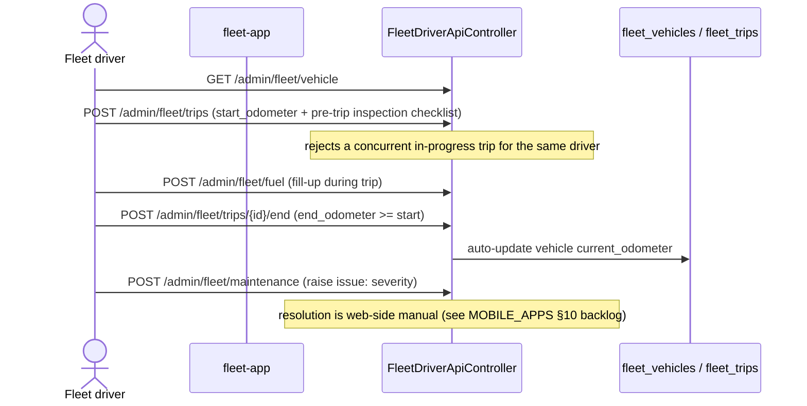

> ⚠️ **Gap (per `MOBILE_APPS.md` §10):** maintenance *resolution* has no supervisor UI yet —
> submission is mobile-only; resolution is manual web-side.

---

## 7. Sorting operator journey

**Who:** hub sorting-center staff who scan inbound parcels, bag them by destination hub, and
bulk-dispatch bags to outbound trucks. App: **`rushly-sorting-app`** (seed colour deep
purple 700), 4 tabs. Bags/routes are **ephemeral device-side state** (Riverpod
`StateNotifier`); only the handover touches the server (`MOBILE_APPS.md` §7).

**Screens (`rushly-sorting-app/lib/features/sorting/presentation`)**

| Tab | Screen | Endpoint |
|---|---|---|
| **Scan In** | `scan_in_tab.dart`, `scanner_page.dart`, `parcel_card.dart` | `GET /admin/sorting/lookup/{tracking}` |
| **Sort** | `sort_tab.dart` | (local: auto-drop into destination-hub bag) |
| **Bags** | `bags_tab.dart`, `bag_detail_screen.dart` | (local: session-scoped bag list) `GET /admin/sorting/hubs` for the hub picker |
| **Routes** | `routes_tab.dart` | `POST /admin/sorting/handover` (bulk `TRANSFER_TO_HUB`) |

Backend: `app/Http/Controllers/Api/V10/Admin/AdminSortingController.php` (`routes/api.php:170`).
HUB/INCHARGE users are clamped to their own hub on handover (`MOBILE_APPS.md` §7).

```mermaid
sequenceDiagram
    actor S as Sorting op
    participant App as sorting-app
    participant API as AdminSortingController
    participant DB as Parcel + ParcelEvent
    S->>API: GET /admin/sorting/lookup/{tracking}
    API-->>App: parcel + current hub + destination hub
    App->>App: Sort tab auto-drops parcel into destination-hub bag (local)
    Note over App: repeat for the whole inbound wave; bags fill up
    S->>App: Routes tab → group bags by destination hub → Dispatch
    App->>API: POST /admin/sorting/handover (list of AWBs)
    API->>DB: bulk TRANSFER_TO_HUB (6) + ParcelEvent per parcel
    App->>App: clear local bags for that hub
```

---

## 8. Scanner operator journey

**Who:** anyone in the pipeline who just needs "scan an AWB → apply the sensible next
status." App: **`rushly-scanner-app`** (seed colour deep orange 700), 2 tabs. Zero new
endpoints — it reuses sorting lookup + the admin force-status endpoint (`MOBILE_APPS.md` §9).

**Screens (`rushly-scanner-app/lib/features/scanner/presentation`)**

| Tab | Screen | Endpoint |
|---|---|---|
| **Scan** | `scan_tab.dart`, `scanner_page.dart` | `GET /admin/sorting/lookup/{tracking}` then `POST /admin/parcels/{id}/status` |
| **History** | `history_tab.dart` | device-local (SharedPreferences, capped 100 FIFO, 30 s dedupe) |

The **status-aware action strip** maps the current status to the one meaningful next action —
mapping lives in `lib/features/scanner/domain/action_catalog.dart` so scan buttons and
history labels stay in sync (`MOBILE_APPS.md` §9):

| Scanned status | Offered action |
|---|---|
| `TRANSFER_TO_HUB` (6) | "Received by hub" |
| `RECEIVED_BY_PICKUP_MAN` (4) | "At warehouse" |
| `DELIVERY_MAN_ASSIGN` (7) | "Delivered" |
| `RETURN_TO_COURIER` (24) | "Return received" |

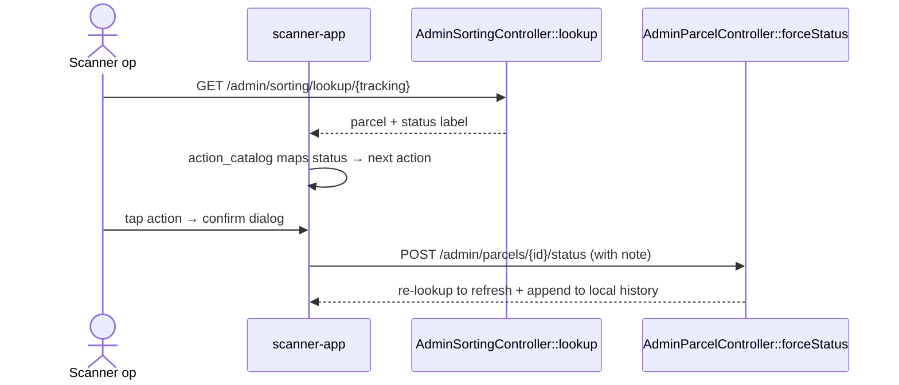

---

## 9. Supervisor journey

**Who:** field supervisors overseeing a hub's drivers. App: **`rushly-supervisor-app`** (seed
colour teal 800), 4 tabs. Reuses admin endpoints + two dedicated ones (`MOBILE_APPS.md` §5).

**Screens (`rushly-supervisor-app/lib/features/*/presentation`)**

| Tab | Screen | Endpoint |
|---|---|---|
| **Drivers** | `drivers/drivers_tab.dart` → `driver_detail_screen.dart` | `GET /admin/map/drivers`, `GET /admin/drivers/{id}` |
| **Assignments** | `assignments/assignments_tab.dart` | `GET /admin/map/parcels`, `POST /admin/parcels/{id}/assign-driver` |
| **Reports** | `reports/reports_tab.dart` | `GET /admin/reports/drivers?from=&to=&hub_id=` (hub-clamped) |
| **Exceptions** | `exceptions/exceptions_tab.dart` | `GET /admin/exceptions?stuck_days=` |

Backend: `Api/V10/Admin/{AdminMap,AdminParcel,AdminReports,AdminExceptions}Controller.php`.
Per-driver reports are hub-clamped; exceptions aggregate open NDRs + stuck parcels +
returning-to-courier (`MOBILE_APPS.md` §5, §12).

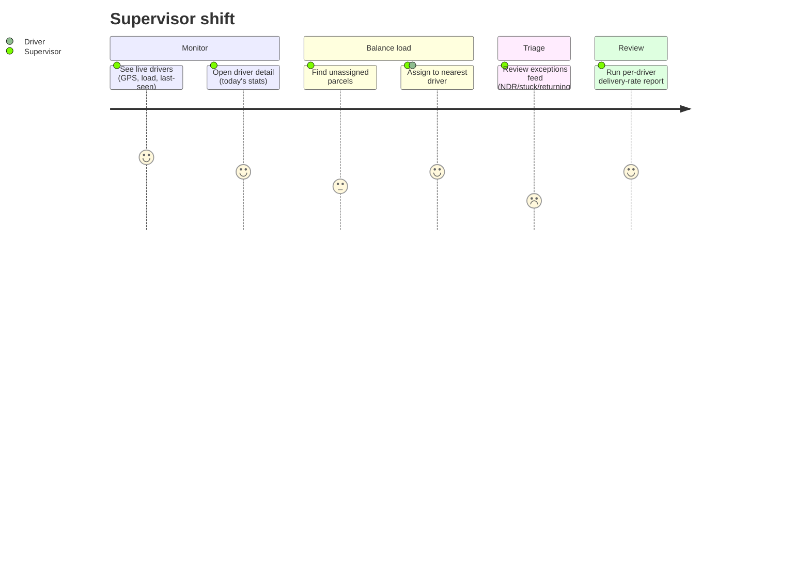

```mermaid
sequenceDiagram
    actor Sv as Supervisor
    participant App as supervisor-app
    participant Map as AdminMapController
    participant Par as AdminParcelController
    participant Ex as AdminExceptionsController
    Sv->>Map: GET /admin/map/drivers (live GPS + load)
    Sv->>Map: GET /admin/map/parcels (unassigned + geo)
    Sv->>App: pick parcel → driver-picker sorted by haversine distance
    App->>Par: POST /admin/parcels/{id}/assign-driver
    Par-->>App: parcel → DELIVERY_MAN_ASSIGN (7), driver notified
    Sv->>Ex: GET /admin/exceptions?stuck_days=N (triage)
```

---

## 10. Admin / hub / incharge journey

**Who:** back-office operators — `SUPER_ADMIN`, `ADMIN`, `INCHARGE`, `HUB` user types. Two
surfaces: **`rushly-admin-app`** (mobile back-office) and the **admin web panel** (Inertia
`resources/js/Pages/Admin/*`, ~60 page groups). Login gated by `CheckAdminRole` on mobile
(`MOBILE_APPS.md` §4).

**Mobile screens (`rushly-admin-app/lib/features/*/presentation`)**
Bottom nav: Dashboard, Parcels, Drivers, Profile (+ drawer: Merchants, Approvals, Hubs,
Support, Fraud). `Merchants`/`Approvals` are role-gated to admin/super_admin.

| Area | Screen | Endpoint |
|---|---|---|
| Dashboard | `dashboard/dashboard_screen.dart` | `GET /admin/dashboard`, `/admin/dashboard/timeseries` |
| Parcels | `parcels/parcels_screen.dart` → `parcel_details_screen.dart` | `GET /admin/parcels`, `/parcels/{id}`, `POST /parcels/{id}/assign-driver`, `/parcels/{id}/status` |
| 3PL assign | `parcels/three_pl_sheet.dart` | `GET /parcels/{id}/3pl`, `POST /parcels/{id}/3pl-assign` |
| Driver assignment map | `map/assignment_map_screen.dart` | `GET /admin/map/parcels`, `/admin/map/drivers` |
| Drivers | `drivers/drivers_screen.dart` → `driver_details_screen.dart` | `GET /admin/drivers`, `/drivers/{id}` |
| Merchants | `merchants/merchants_screen.dart` → `merchant_details_screen.dart` | `GET /admin/merchants`, `POST /merchants/{id}/toggle-active` |
| **Merchant approval (KYC)** | `merchants/pending_merchants_screen.dart` → `pending_merchant_details_screen.dart`, `approvals/approvals_screen.dart` | `GET /admin/merchants/pending`, `POST /merchants/{id}/approve`, `/reject` |
| Hubs | `hubs/hubs_screen.dart` | `GET /admin/hubs`, `/hubs/{id}` |
| Hub cash reconciliation | `hub_cash/hub_cash_screen.dart` → `hub_cash_new_screen.dart` | `GET /admin/hub-cash`, `POST /admin/hub-cash` (HUB/INCHARGE) |
| WMS subset | `wms/*` | shared WMS endpoints (see §4) |
| Payout approvals | (drawer) | `GET /admin/payment-requests`, `POST /payment-requests/{id}/approve`, `/reject` |
| Support / Fraud | `support/*`, `fraud/fraud_screen.dart` | `/admin/support/*`, `/admin/fraud` |

Backend: `app/Http/Controllers/Api/V10/Admin/*Controller.php` (`MOBILE_APPS.md` §4, §12).

**Web panel (deeper surface).** The admin web (`resources/js/Pages/Admin/*`) is where the
long-tail configuration lives that the mobile app doesn't cover — e.g. `Deliveryman`,
`Hub`, `Merchant`, `Parcel`, `Payout`, `Salary`, `DeliveryCharge`, `Ndr`, `Abnormal`,
`Reports`, `Performance`, `Shipping`, `Commerce`, `Oms`, `Wms`, `Wallet`, `Zatca`,
`Integrations`, `Settings`, `Tours`, `KnowledgeBase`, `PickupRequest`. Pickup/hub status
transitions are driven from `Backend/ParcelController` (`routes/web.php:578-583`,
`pickup-man/assigned`, `pickup/received`, `pickup/re-schedule`, etc.), and bulk operations
via `/admin/bulk_action` (Assign 3PL, Change Status, Cancel, Print AWBs, Export XLSX —
`_CONTEXT_BRIEF.md` "Standard flows").

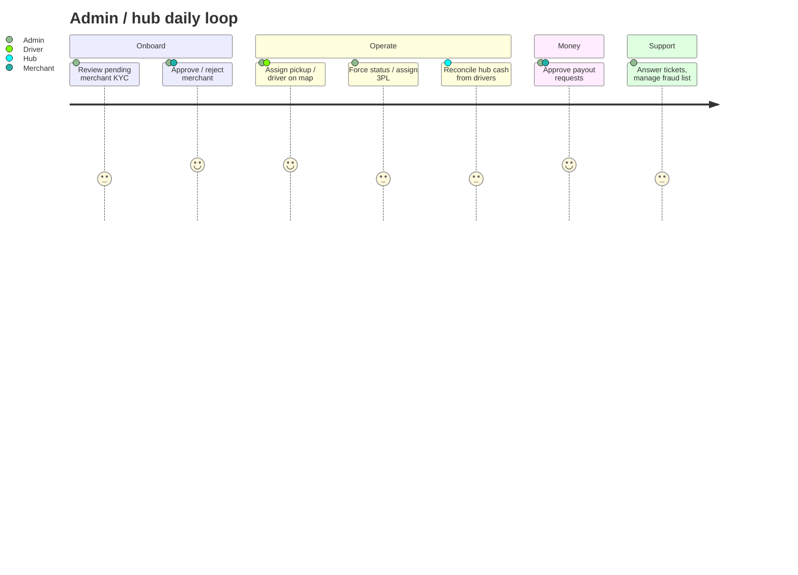

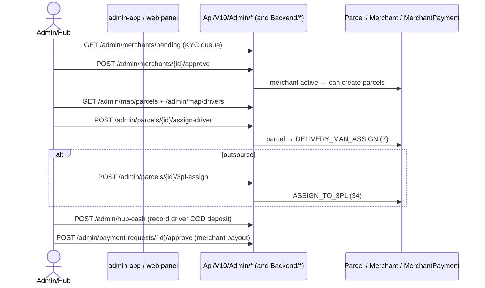

---

## 11. Super-admin journey

**Who:** the platform operator on the **central domain** (not a tenant subdomain). Manages
tenant companies, subscription plans, and cross-tenant business-logic defaults. Surface: the
admin web on the central domain; routes in `routes/superadmin.php` (mirrored in the
tenant-gated block of `web.php`) per [`super-admin.md`](../super-admin.md).

> There is **no dedicated super-admin mobile app.** The `rushly-admin-app` accepts
> `SUPER_ADMIN` logins for operational back-office work (`MOBILE_APPS.md` §4), but the
> plan/company/tenant management below is web-only.

**Screens / routes (`super-admin.md`)**

| Task | Route | Controller | UI |
|---|---|---|---|
| Manage tenant companies | `/super-admin/company/` (+ create/edit/delete) | `CompanyController` | Inertia index (`Admin/Superadmin/Company/Index`) + legacy Blade forms |
| Switch a company's subscription | `/super-admin/company/subscription/switch/{id}` | `CompanyController@switchSubscription` | Blade modal |
| Manage subscription plans | `/super-admin/plan/` (+ create/edit/delete/modules) | `PlanController` | Inertia index + Blade forms |
| Subscription history | `/super-admin/subscription/history` | `PlanController@subscriptionHistory` | Inertia (`Admin/Subscription/History`) |
| Cross-tenant fulfillment defaults | `/super-admin/business-logic/fulfillment-defaults` | `FulfillmentDefaultsController` | Inertia (feature-flag gated) |
| Super-admin dashboard | `/dashboard` (when `user_type=SUPER_ADMIN`) | `DashbordController` | legacy Blade |
| Summary | `/summary` | — | Inertia (`Admin/Superadmin/Summary/Index`) |

Sidebar uses `SUPER_NAV` in `AdminLayout.jsx` (`super-admin.md` bottom).

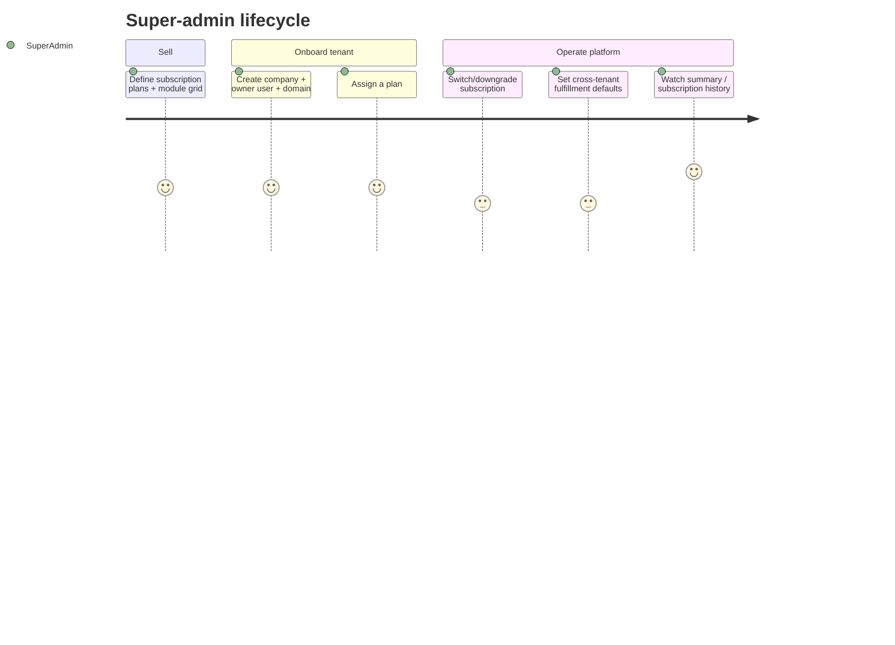

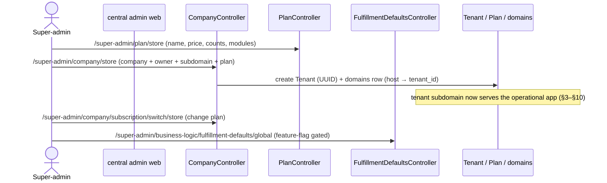

Tenancy mechanics (per `_CONTEXT_BRIEF.md`, [`10-Authentication.md`](10-Authentication.md)):
`stancl/tenancy` v3, per-subdomain identification (`{tenant}.rushly.tech`), central domains
`127.0.0.1`/`localhost`, UUID tenant IDs, `tenant_model = App\Models\Tenant`.

---

## 12. The composite journey — one parcel, all personas

Tying the personas together on a single storefront-origin parcel:

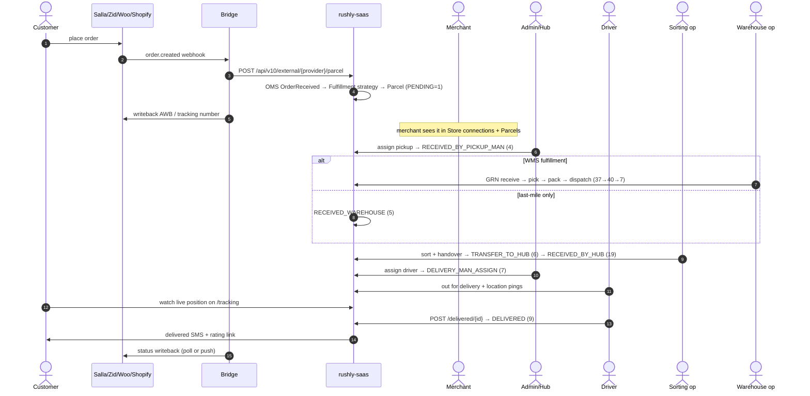

Failure branch: a failed attempt becomes `NDR_CREATED` (35) → the **NDR module**
(`app/Enums/NdrStatus`, `NdrAction`, driver `POST /ndr`; merchant `GET /ndr/merchant`;
supervisor exceptions feed) → resolution routes to `RETURN_TO_COURIER` (24) →
`RETURN_ASSIGN_TO_MERCHANT` (26) → `RETURN_RECEIVED_BY_MERCHANT` (30). See
[`04-Business-Logic.md`](04-Business-Logic.md) for the NDR/return state logic.

---

## 13. Doc vs Code summary

| Claim in docs | Reality in code | Verdict |
|---|---|---|
| "Laravel 12 / PHP 8.4" (`README.md`, `RUSHLY_APPS_OVERVIEW.md`) | `composer.json` pins `^10.10` / PHP `^8.1` | Code wins — Laravel 10 |
| "34-state" / "40-state" parcel pipeline | `app/Enums/ParcelStatus.php` = **41 constants** | Code wins — 41 |
| Dispatch endpoint named `dispatch` | Routes to `WmsFulfillmentApiController::confirmDispatch` (avoids base-controller `dispatch($job)` collision) | Code wins (`MOBILE_APPS.md` §6) |
| `deliveryID` in location-update body | Moved inside `auth:sanctum`; driver derived from token | Code wins (`MOBILE_APPS.md` §2) |
| Fleet maintenance has resolution UI | Submission only; resolution is manual web-side | Gap (`MOBILE_APPS.md` §10) |
| Per-tenant API keys | All apps still ship the same static shared `apiKey` | Known debt (`MOBILE_APPS.md` §10) |

---

## Sources

**Repo-root docs (primary):**
- [`RUSHLY_APPS_OVERVIEW.md`](../RUSHLY_APPS_OVERVIEW.md) — ecosystem, bridges, app-at-a-glance.
- [`MOBILE_APPS.md`](../MOBILE_APPS.md) — the eight Flutter apps, per-app screens/endpoints (§1–§13).
- [`MERCHANT_DASHBOARD.md`](../MERCHANT_DASHBOARD.md) — merchant dashboard prop contract.
- [`super-admin.md`](../super-admin.md) — `/super-admin/*` route + controller audit.
- [`_CONTEXT_BRIEF.md`](_CONTEXT_BRIEF.md) — shared grounding brief.

**rushly-saas code:**
- `app/Enums/ParcelStatus.php` (41-state lifecycle), `app/Enums/{NdrStatus,NdrAction}.php`.
- `routes/api.php` (`/api/v10/*`: `deliveryman/*`, `admin/*`, `wms/*`, `fleet/*`, `sorting/*`, public tracking).
- `routes/web.php` (frontend `/tracking`, `/shipment-location`, `/r/parcel/{id}/rate`, pickup/hub transitions).
- `routes/superadmin.php` (tenant/plan/company management).
- `app/Http/Controllers/Frontend/FrontendController.php`, `Backend/ParcelRatingController.php`, `Backend/ParcelController.php`.
- `app/Http/Controllers/Api/V10/DeliveryManParcelController.php` and the `Api/V10/Admin/*`, `Api/V10/Wms/*`, `Api/V10/Fleet/*` controllers.
- `resources/js/Pages/{Admin,Merchant,SuperAdmin}/*` (Inertia/React pages).

**Flutter client apps (screen inventories via `lib/features/**/presentation/*.dart`):**
- `rushly-driver-app`, `rushly-merchant-app`, `rushly-admin-app`, `rushly-supervisor-app`,
  `rushly-warehouse-app`, `rushly-sorting-app`, `rushly-fleet-app`, `rushly-scanner-app`.
