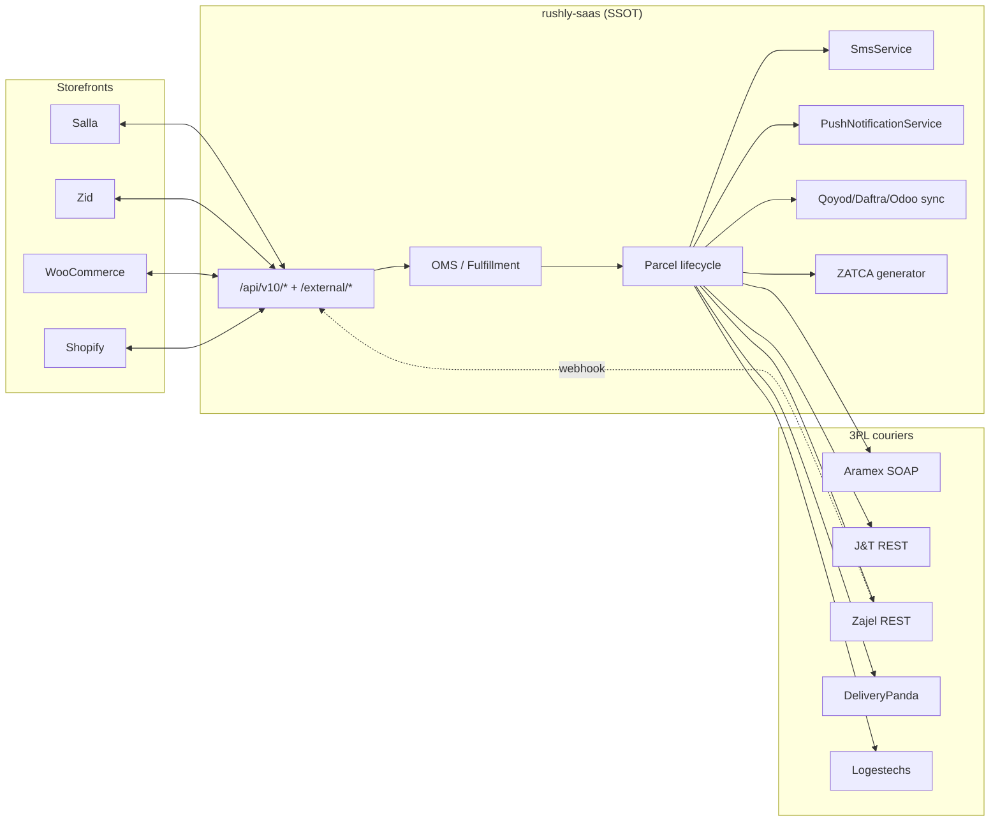
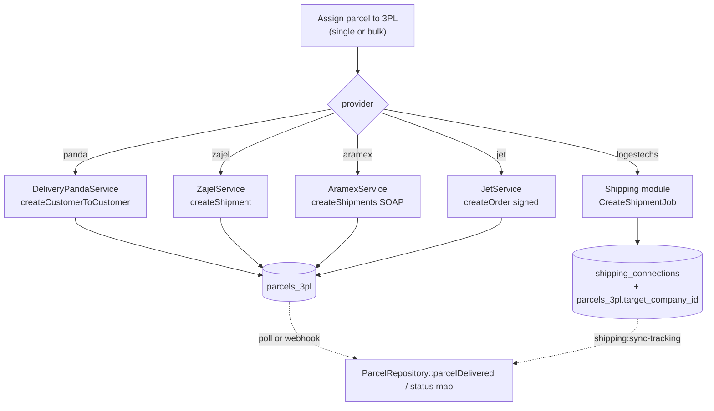

# 14 — Integrations

> External systems that Rushly talks to, and how. This document is the ground-truth
> catalogue of every third-party integration in **rushly-saas** (the single source of
> truth) plus the standalone bridge apps (`rushly-salla`, `rushly-zid`, the Shopify
> app). Every non-trivial claim cites a source file.
>
> Verified against code on 2026-07-27. Primary docs consulted first, then reconciled
> against the actual classes: `INTEGRATIONS.md`, `3PL.md`, `COMMERCE.md`,
> `ACCOUNTING.md`, `docs/shipping-architecture.md`.

Sibling docs: [05-System-Architecture.md](05-System-Architecture.md) · [09-API.md](09-API.md) · [10-Authentication.md](10-Authentication.md) · [11-Modules.md](11-Modules.md) · [12-Workflows.md](12-Workflows.md) · [06-Database.md](06-Database.md)

---

## 1. Integration landscape at a glance

Rushly integrates across six categories. Direction is always given **relative to Rushly**.

| Category | Integration | Direction | Auth scheme | Code location |
|---|---|---|---|---|
| **Commerce / storefront** | Salla | Bidirectional | OAuth2 + HMAC webhooks + Sanctum writeback | `app/Salla/`, `app/Commerce/Providers/Salla/`, `rushly-salla/`, `app/Services/SallaService.php` |
| | Zid | Bidirectional | OAuth2 (bridge) + Sanctum writeback | `app/Services/ZidService.php`, `rushly-zid/` (standalone), `/api/v10/external/zid/parcel` |
| | WooCommerce | Bidirectional | Per-site bearer token (WP plugin) | `app/Services/WooCommerceService.php`, `/api/v10/external/woocommerce/parcel` |
| | Shopify "Rushly Express" | Bidirectional | Sanctum + apiKey + Shopify HMAC | standalone Node app (`rushly-shopify-app`) |
| **Shipping / 3PL** | Aramex | Outbound + poll | SOAP (username/password + account) | `app/Services/AramexService.php` |
| | J&T Express (Jet) | Outbound + poll | REST + MD5 signature + Basic auth | `app/Services/JetService.php` |
| | Zajel | Outbound + push webhook | REST apiKey + shared-secret webhook | `app/Services/ZajelService.php` |
| | DeliveryPanda | Outbound + poll | REST apiKey | `app/Services/DeliveryPandaService.php` |
| | Logestechs | Outbound + poll | Per-shipment `company-id` header + per-call email/password | `app/Shipping/Providers/Logestechs/` |
| | iMile | — | (reserved) | **Stub only** — config block, no service class |
| **Accounting (ERP sync)** | Qoyod | Outbound (push) | `API-KEY` header | `app/Qoyod/` |
| | Daftra | Outbound (push) | `APIKEY` header | `app/Daftra/` |
| | Odoo | Outbound (push) | JSON-RPC (db + uid + password) | `app/Odoo/` |
| **E-invoicing** | ZATCA (Saudi) | Local generation (Phase 1) | N/A (QR + TLV, NullGateway) | `app/Services/Zatca/` |
| **Payments** | Stripe, PayPal, Razorpay, PayTM, Skrill, SSLCommerz, Moyasar, ClickPay | Bidirectional (checkout + callback) | Per-gateway keys | `app/Http/Controllers/Backend/*` + composer libs |
| **SMS** | Twilio, Vonage/Nexmo, Reve, Msegat, Taqnyat, 4jawaly, Unifonic | Outbound | Per-gateway keys (per-tenant settings) | `app/Http/Services/SmsService.php` |
| **Push** | Firebase Cloud Messaging (FCM) | Outbound | Legacy server key | `app/Http/Services/PushNotificationService.php` |
| **Maps / address** | Google Maps, Saudi National Address (SPL) | Outbound | API keys (per-tenant) | `app/Models/Backend/GoogleMapSetting.php`, admin settings |
| **Auth / identity** | Login OTP (email) | Local | 6-digit email challenge | `app/Http/Controllers/Auth/LoginOtpController.php` |
| | Nafath | — | — | **Not found in the current codebase** |

The super-admin console groups all of these under **`/admin/integrations`**, driven by `app/Http/Controllers/Backend/IntegrationsController.php` (sub-builders: `buildThreePls`, `buildErp`, `buildPayments`, `buildLocation`, `buildAccounting`).



---

## 2. Authentication model (inbound API gates)

Two layers guard the public API surface. Full detail in [10-Authentication.md](10-Authentication.md); summary here for the integration perspective.

### Layer 1 — static `apiKey` header

`app/Http/Middleware/CheckApiKey.php`. A single shared secret gates the door but does not identify the caller. Default value lives in `config/rxcourier.php`:

```php
'api_key' => '123456rx-ecourier123456'
```

Wrong key → HTTP 400 `{"success":false,"message":"Invalid Api Key"}`. Every storefront bridge and the driver app send this header.

### Layer 2 — Sanctum bearer token (per user)

`laravel/sanctum ^3`. Minted via `User::createToken('name')->plainTextToken`, sent as `Authorization: Bearer <id>|<token>`. Each integration gets its own token bound to the user that owns the target merchant. The Salla/Zid/WooCommerce bridges each hold a per-merchant Sanctum token used to POST parcels under the right merchant.

### Route namespaces (`routes/api.php`)

| Prefix | Purpose | Auth |
|---|---|---|
| `/api/v10/*` | Public REST surface (driver app, partners) | apiKey + Sanctum |
| `/api/v10/external/salla/parcel` | Salla bridge → create parcel | apiKey only (`CheckApiKey`) — bridge holds its own Sanctum token internally |
| `/api/v10/external/zid/parcel` | Zid bridge → create parcel | apiKey only |
| `/api/v10/external/woocommerce/parcel` | WooCommerce plugin → create parcel | apiKey only |
| `/api/v10/parcel/tracking/{id}` | PUBLIC tracking timeline | none (tracking id is the bearer) |
| `/api/zajel/webhook` | Zajel push events | shared secret (`X-AUTH-API-KEY`) |
| `/api/panda/schudule_tracking` | Panda cron pull | ⚠️ none |
| `/api/delivery/*` | Panda create/track | apiKey (was open pre-Phase-9) |

⚠️ **Doc vs Code** — `INTEGRATIONS.md` §7 flags `/general-settings` as apiKey-only (no Sanctum). Still true; the Shopify "Test connection" only validates layer 1. `3PL.md` flags `/api/panda/schudule_tracking*` as fully unauthenticated — confirmed in `routes/api.php` lines 63–64.

---

## 3. Commerce / storefront integrations

There are **three storefront patterns** in the codebase, and Salla uniquely appears in **all three** (a genuine overlap — see the note at the end of this section).

### 3.1 Shared bridge pattern (external bridge apps)

Salla, Zid and WooCommerce all follow the pattern documented in `INTEGRATIONS.md`:

- A **link table** per platform: `salla_order_links`, `zid_orders` / `ZidOrderLink`, `woocommerce_orders` / `WooCommerceOrderLink`.
- A **`<Platform>Service`** in `app/Services/` that pushes parcel-status changes back to the bridge.
- A **`Parcel<Platform>Observer`** registered in `EventServiceProvider` (fires writeback on parcel status change).
- A **controller** under `app/Http/Controllers/Api/V10/External/` mounted at `/api/v10/external/<platform>/parcel` (e.g. `SallaParcelController@store`, `routes/api.php:117-125`).

**Writeback services** (`app/Services/SallaService.php`, `ZidService.php`, `WooCommerceService.php`):

- `SallaService::pushParcelStatus(Parcel)` looks up the `SallaOrderLink`, maps `ParcelStatus` → Salla status via `mapStatus()`, and POSTs to `{app_url}/internal/parcel-status` with `Authorization: Bearer {writeback_token}`. Skips if `last_pushed_status` already equals the target (idempotent).
- `ZidService::fromConfig()` prefers per-tenant `zidBridge('app_url'/'writeback_token')`, falling back to `config('services.zid.*')`.
- `WooCommerceService` is different: because WooCommerce runs as a plugin on the merchant's own WordPress, each `WooCommerceOrderLink` row carries its own `site_url` + `site_token`; the config values are only a single-tenant fallback (`app/Services/WooCommerceService.php` header comment).

Config (`config/services.php`):

```php
'salla'       => ['app_url' => env('RUSHLY_SALLA_APP_URL'),       'writeback_token' => env('RUSHLY_SALLA_WRITEBACK_TOKEN'),       'api_base' => env('SALLA_API_BASE', 'https://api.salla.dev/admin/v2')],
'zid'         => ['app_url' => env('RUSHLY_ZID_APP_URL'),         'writeback_token' => env('RUSHLY_ZID_WRITEBACK_TOKEN'),         'api_base' => env('ZID_API_BASE', 'https://api.zid.sa/v1')],
'woocommerce' => ['app_url' => env('RUSHLY_WOOCOMMERCE_APP_URL'), 'writeback_token' => env('RUSHLY_WOOCOMMERCE_WRITEBACK_TOKEN'), 'api_base' => null],
```

### 3.2 Salla — standalone bridge app (`rushly-salla/`)

A separate Laravel app (`/var/www/rushly-salla`) that owns the Salla OAuth tokens and is the only piece that talks to the Salla API directly (`app/Services/SallaService.php` class docblock).

**Responsibilities** (`rushly-salla/README.md`):
1. OAuth + install via `salla/ouath2-merchant`.
2. Webhook receiver for `app.*`, `order.*`, `shipment.creating`, `shipment.cancelled`.
3. Order → parcel sync (on `order.created`, mirror locally and create a Rushly parcel via the v10 API).
4. AWB writeback (on `shipment.creating`, POST the Rushly tracking number back to Salla as the waybill).
5. Public tracking page `/track/{trackingNumber}` proxying Rushly's tracking endpoint.

**Salla Partner portal config** (`rushly-salla/README.md`):

| Field | Value |
|---|---|
| OAuth Redirect URI | `${APP_URL}/oauth/callback` |
| Webhook URL | `${APP_URL}/webhooks/salla` |
| Webhook strategy | Signature (HMAC-SHA256), `SALLA_WEBHOOK_SECRET` |
| Scopes | `offline_access`, `orders.read`, `shipments.read_write` |
| Events | `app.installed`, `app.uninstalled`, `app.store.authorize`, `order.created`, `order.updated`, `order.cancelled`, `shipment.creating`, `shipment.cancelled` |

**Config keys** (`rushly-salla/config/salla.php` + `.env.example`):

```
SALLA_APP_ID, SALLA_OAUTH_CLIENT_ID, SALLA_OAUTH_CLIENT_SECRET,
SALLA_OAUTH_CLIENT_REDIRECT_URI, SALLA_WEBHOOK_SECRET,
SALLA_AUTHORIZATION_MODE (default "easy"), SALLA_API_BASE (https://api.salla.dev/admin/v2)
RUSHLY_API_BASE, RUSHLY_API_KEY, RUSHLY_WRITEBACK_TOKEN,
RUSHLY_PUBLIC_TRACKING_URL, RUSHLY_DEFAULT_CITY_ID, RUSHLY_DEFAULT_DELIVERY_TYPE_ID, RUSHLY_DEFAULT_CATEGORY_ID
```

- `RUSHLY_API_KEY` is the `apiKey` header that `CheckApiKey` requires.
- Each `SallaMerchant.rushly_merchant_token` is a Sanctum token for a merchant user in rushly-saas — this is what creates parcels under the right merchant.
- `RUSHLY_WRITEBACK_TOKEN` must equal `RUSHLY_SALLA_WRITEBACK_TOKEN` in rushly-saas `.env` (the bearer that rushly-saas sends when POSTing status to `/internal/parcel-status`).

Live status (`INTEGRATIONS.md`): tunnel up at `https://salla.rushly-logistic.com`; awaiting first install.

### 3.3 Salla — in-monolith bridge (`app/Salla/`)

A **second, parallel** Salla integration lives inside rushly-saas itself, handling OAuth + webhooks directly (no external app):

- **Routes** (`routes/web.php:278-280`, tenant context):
  - `GET /integrations/salla/oauth/redirect` → `App\Salla\Http\Controllers\OAuthController@redirect`
  - `GET /integrations/salla/oauth/callback` → `OAuthController@callback`
  - `POST /integrations/salla/webhook` → `App\Salla\Http\Controllers\WebhookController`
- **Webhook verification**: `app/Salla/Http/Middleware/VerifyWebhook.php`.
- **Handlers** (`app/Salla/Webhooks/Handlers/`): 14 handlers — `AppInstalled`, `AppUpdated`, `AppUninstalled`, `AppStoreAuthorize`, `OrderCreated`, `OrderUpdated`, `OrderCancelled`, `OrderRefunded`, `OrderStatusUpdated`, `ShipmentCreating`, `ShipmentCancelled`, `ShipmentReturnCreating`, `ShipmentReturnCreated`, `ShipmentReturnCancelled` — dispatched via `app/Salla/Webhooks/Dispatcher.php`.
- **Jobs**: `CreateParcelJob`, `ReturnWaybillJob`.
- **Services**: `ApiClient` (talks to Salla API), `ParcelCreationService` (creates a Rushly `Parcel` + `SallaOrderLink` from a normalized payload, idempotent on `salla_merchant_id`+`salla_order_id`), `SallaWmsFulfillmentService` (routes Salla orders through the WMS pick/pack flow when the app's service scope is "Delivery + Fulfillment").
- **Models** (`app/Salla/Models/`): `Settings` (`salla_settings`: `auto_create_parcel`, `trigger_status`, `default_rushly_shop_id`, `default_city_id`, `default_category_id`, `default_delivery_type_id`), `Merchant`, `Order`, `Shipment`, `WebhookLog`.
- **Admin**: super-admins manage per-Salla-merchant stores at `/admin/integrations/salla/stores` (`SallaStoresController`, `routes/superadmin.php:201-203`). Per-tenant OAuth credentials are entered under Admin → Integrations → Salla and stored in `integration_settings.meta`, read via `sallaCreds('oauth_client_id')` (`config/salla.php` header comment; credentials moved to per-tenant storage 2026-06-25).

The IntegrationsController edit view (`IntegrationsController.php:345-427`) exposes, for Salla: OAuth Client ID / Secret / App ID / Webhook Secret / Redirect URI override / **service type** (`Delivery only` vs `Delivery + Fulfillment`), plus the callback URL `url('/integrations/salla/oauth/callback')` and webhook URL `url('/integrations/salla/webhook')` to paste back into the Salla Partner app.

### 3.4 Salla — generic Commerce module provider (`app/Commerce/Providers/Salla/`)

A **third** Salla path lives in the generic Commerce module (`app/Commerce/`), the "Phase 12" provider abstraction — gated behind `config('features.commerce_layer')` (default OFF, `config/features.php`).

- Registered in `config/commerce.php`:
  ```php
  'salla' => [
      'class'        => \App\Commerce\Providers\Salla\SallaProvider::class,
      'handler'      => \App\Commerce\Providers\Salla\SallaWebhookHandler::class,
      'order_mapper' => \App\Oms\Normalization\Providers\SallaOrderMapper::class,
      'config'       => [
          'base_url'            => env('SALLA_API_BASE', 'https://api.salla.dev/admin/v2'),
          'oauth_authorize_url' => env('SALLA_OAUTH_AUTHORIZE_URL', 'https://accounts.salla.sa/oauth2/auth'),
          'oauth_token_url'     => env('SALLA_OAUTH_TOKEN_URL', 'https://accounts.salla.sa/oauth2/token'),
          'timeout'             => 30,
      ],
  ],
  ```
- Webhook ingest lands at `POST /webhooks/commerce/{providerCode}` → `WebhookIngestService::handle()` → `IngestWebhookJob` → `OrderNormalizer` → `OrderService` → `OrderReceived` event → Fulfillment. Full detail in `COMMERCE.md` and [11-Modules.md](11-Modules.md).
- Central OAuth install parallels this at `/admin/connections/salla/oauth/*` (`SallaOAuthController`, `routes/superadmin.php:259-260`).
- Per-tenant credentials in `commerce_connections` (encrypted access/refresh tokens, api key/secret, webhook secret — `COMMERCE.md` §3).

> ⚠️ **Doc vs Code — three Salla implementations coexist.** (1) `app/Salla/` in-monolith bridge (routes live, tenant context); (2) `rushly-salla/` standalone app (live, awaiting first install); (3) `app/Commerce/Providers/Salla/` generic-module provider (feature-flagged OFF). This is a real transitional state: the generic Commerce layer is intended to eventually supersede the bespoke bridges, but until `FEATURE_COMMERCE_LAYER` flips on, the in-monolith `app/Salla/` module + `SallaService` writeback is the active path. Zid and WooCommerce, by contrast, only have the bridge pattern (§3.1) — the Commerce registry does not yet list them (`config/commerce.php` comment: "registry stays empty in Phase 1 … Zid second").

### 3.5 Zid

Bridge-app pattern (standalone `rushly-zid/`, hand-rolled OAuth per `INTEGRATIONS.md` — no SDK, Basic-Auth webhooks). rushly-saas side:
- `app/Services/ZidService.php` — writeback via `ZidOrderLink`, per-tenant bridge config via `zidBridge()` helper.
- `POST /api/v10/external/zid/parcel` — bridge → create parcel.
- Admin edit view surfaces the parcel-create endpoint (`url('/api/v10/external/zid/parcel')`) and writeback path to paste into the bridge config; partner portal `https://web.zid.sa/partners` (`IntegrationsController.php:353-359`, 429-434).

### 3.6 WooCommerce

Ships as a WordPress plugin on the merchant's own WP (no hosted bridge, no OAuth). `WooCommerceService` writes status back to each site's own `site_url` + `site_token`. Create endpoint: `POST /api/v10/external/woocommerce/parcel`.

### 3.7 Shopify "Rushly Express"

Standalone Node + React Router v7 + Prisma app (`rushly-shopify-app`, not in this workspace). Fully documented in `INTEGRATIONS.md` §4. Summary:
- Per-shop `ShopSettings` row holds `rushlyApiBase`, `rushlyApiKey`, `rushlyAuthToken` (Sanctum), `rushlyMerchantId`, `cronSecret`.
- Outbound: `createShipmentFromOrder` → `POST /api/v10/parcel/store` → captures tracking → `fulfillmentCreate` in Shopify.
- Inbound: cron `POST /api/sync-rushly?shop=X` (`X-Shop-Key` or global `X-Cron-Key`) polls `/api/v10/parcel/tracking/{id}` and maps 24 Rushly status codes.
- Scopes: `read_orders`, `read_customers` (PCD-restricted), `write_assigned_fulfillment_orders`, `write_products`, `write_metaobjects*`.
- Order webhooks (`orders/create`, `orders/updated`) are **commented out pending Protected Customer Data approval**.

Status: demo-mode bridge live, real wiring deferred (`INTEGRATIONS.md` §1). The rushly-saas admin lists Shopify as a platform card but there is no server-side `shopify_orders` link table yet (`IntegrationsController::parcelCount` returns 0 for shopify).

---

## 4. Shipping / 3PL integrations

Two coexisting patterns (`3PL.md`, `docs/shipping-architecture.md`):

- **Legacy** — per-provider `Service` classes + shared `parcels_3pl` table: **DeliveryPanda, Zajel, Aramex, J&T (Jet)**.
- **New generic Shipping module** (`app/Shipping/`) — `ShippingProviderInterface`, per-tenant encrypted `shipping_connections`, queued `CreateShipmentJob`, generic `shipping:sync-tracking`: **Logestechs** (first, production-verified against company 496).

Assignment entry points:
- Single: `POST /admin/parcel/details/{id}/3pl` → `ParcelController@ThirdPartyLogistics`, branch on `company ∈ {panda, zajel, aramex, jet, logestechs}`.
- Bulk: `/admin/bulk_action` → `assign_3pl` action (`ParcelBulkActionController`).

Shared model: `app/Models/Backend/Parcels_3pl.php` (`parcel_3pl_name` distinguishes provider; `target_company_id` added for Logestechs). ⚠️ No `company_id` column — cross-tenant leak risk (`3PL.md` issue #3).



### 4.1 Aramex (SOAP)

- **Transport**: SOAP via PHP `SoapClient`. `app/Services/AramexService.php`.
- **Auth**: `ClientInfo` — username + password + account number/pin/entity/country. Config `config/services.php` `aramex.*`.
- **WSDL**: test `https://ws.dev.aramex.net/ShippingAPI.V2/Shipping/Service_1_0.svc?wsdl`, prod `https://ws.aramex.net/...`.
- **Create**: `createShipments([$shipment])` — Shipper/Consignee parties, Dimensions (hardcoded 10×10×10 cm), COD enabled via `Services: "CODS"` when `cash_collection > 0`. Response `Shipments.ProcessedShipment.ID` = AWB, `ShipmentLabel.LabelURL` = PDF.
- **Status sync**: `php artisan aramex:sync-tracking`, scheduled **every 15 min** with `withoutOverlapping()` (`app/Console/Kernel.php:27`). Calls `trackShipments($awbs, lastUpdateOnly:true)`, maps description strings → `ParcelStatus`.
- **Extra service methods**: `printLabel`, `createPickup`, `cancelPickup`, `fetchCountries`/`fetchCities` (24h cached). No post-create SOAP cancel (returns error envelope; use `cancelPickup` pre-pickup).
- **Env**: `ARAMEX_USERNAME/PASSWORD/VERSION/ACCOUNT_NUMBER/ACCOUNT_PIN/ACCOUNT_ENTITY/ACCOUNT_COUNTRY_CODE/WSDL/PRODUCT_GROUP/PRODUCT_TYPE/PAYMENT_TYPE`.

### 4.2 J&T Express — Indonesia (Jet, REST)

- **Transport**: REST form-urlencoded (create) + JSON (tracking). `app/Services/JetService.php`.
- **Auth**: `data_sign = base64(md5(data_param + secret_key))` for create; **HTTP Basic** with a separate `track_password` for tracking.
- **Create**: `createOrder($payload)` wraps as `{"detail":[<order>]}`. Indonesian phone normalization (`+62`), COD as integer IDR, default pickup window now→+8h, `orderid` prefixed `RUSHLY-` truncated to 20 chars. Success = `success=true` AND `detail[0].status='Sukses'` AND non-empty `awb_no`.
- **Status sync**: `php artisan jet:sync-tracking`, **every 15 min** `withoutOverlapping()` (`Kernel.php:28`). One AWB per call; maps J&T numeric `status_code` (200→DELIVERED, 401/402→RETURN, 150-152→ABNORMAL, 100+Indonesian description phrases) → `ParcelStatus`.
- **Extra**: `cancelOrder(orderid, remark)` (pre-pickup only, not yet wired into local cancel), `checkTariff`, `trackOrder`.
- **Env**: `JET_USERNAME/API_KEY/SECRET_KEY/ECCOMPANYID/TRACK_PASSWORD/CUS_NAME/ORDER_URL/TRACK_URL/TARIFF_URL/CANCEL_URL/DEFAULT_ORIGIN_CODE/SERVICE_TYPE/EXPRESS_TYPE` (URLs come from the J&T dashboard after signing). ⚠️ Area-code mapping unsolved; currency implicitly IDR (`3PL.md` issues #24-26).

### 4.3 Zajel (REST + push webhook)

- **Transport**: REST JSON. `app/Services/ZajelService.php`. Base: staging `https://api-stg.zajel.com/services/integration`, prod `https://api.zajel.com:8443/services/integration`.
- **Auth (outbound)**: `key` + `customer_code`. `isConfigured()` guards on key+code+base_url.
- **Create**: `createShipment($payload)`; on success fetch label via `getShipmentLabel(referenceNumber)`; `referenceNumber` stored as AWB.
- **Status sync (push)**: `POST /api/zajel/webhook` → `Webhooks\ZajelWebhookController@handle`. **Auth**: shared secret in `X-AUTH-API-KEY` matched with `hash_equals` against `config('services.zajel.webhook_secret')` (`routes/api.php:91`). Maps Zajel statuses (`outfordelivery`, `pickup_completed`, `inscan_at_hub`, `rto`, `delivered`, `cancelled`, …) → `ParcelStatus`; `delivered` routes through `ParcelRepository::parcelDelivered()`.
- **Extra**: `createInternationalShipment`, `trackShipment`, `cancelShipment` (not wired to local cancel), `getCities`/`getAreas` (24h cached).
- **Env**: `ZAJEL_API_KEY/CUSTOMER_CODE/BASE_URL/SERVICE_TYPE_ID(DDN)/WEBHOOK_SECRET`.

### 4.4 DeliveryPanda (REST)

- **Transport**: REST JSON. `app/Services/DeliveryPandaService.php`. Base `https://app.deliverypanda.me/webservice/`.
- **Auth**: single `key` (`DELIVERY_PANDA_API_KEY`).
- **Create**: `createCustomerToCustomer` with a **hardcoded UAE/Dubai/AED** payload.
- **Status sync (poll)**: `GET /api/panda/schudule_tracking` (⚠️ unauthenticated, untenanted — `3PL.md` issue #1). On `DELIVERED` + parcel in `DELIVERY_MAN_ASSIGN` → `parcelDelivered`.
- **Public endpoints**: `POST /api/delivery/{create,agent-create,customer-to-customer,track}` (now apiKey-gated post-Phase-9).
- ⚠️ Most flawed provider — hardcoded `delivery_man_id=12` in bulk, no transport error handling, dead/duplicate code (`3PL.md` issues #4, #9, #11-16).

### 4.5 Logestechs (new Shipping module — production-verified)

Logestechs is a logistics *platform*, not a single courier. Each shipment carries a `target_company_id` chosen at assign time (per-shipment scoping, not per-tenant).

- **Provider**: `app/Shipping/Providers/Logestechs/LogestechsProvider.php` + mappers (`ShipmentRequestMapper`, `ShipmentResponseMapper`, `StatusMapper`).
- **Registry**: `config/shipping.php` → `providers.logestechs`. Base `https://apisv2.logestechs.com/api` (global URL sits in config, not on the connection row).
- **Auth**: a single `company-id` header (no API key, no signature — guest endpoints gated by knowing the target company id) **plus** per-call customer `email` + `password` embedded in the create body. `LOGESTECHS_API_KEY` env is dead (`3PL.md`).
- **Endpoints** (all end-to-end tested): `POST /ship/request/by-email` (create), `GET /guests/{companyId}/packages/tracking` (history), `GET /guests/packages/status` (latest — polled by sync), `PUT /guests/{companyId}/packages/{id}/cancel`, `POST /guests/{companyId}/packages/pdf` (AWB PDF), `GET /addresses/villages?search=` (village lookup — Logestechs keys on `villageId`), `GET /guests/companies/info-by-domain`, `POST /auth/customer/login` (credential validation, returns HTTP 400 + Arabic error on bad creds).
- **Storage**: `shipping_connections` (encrypted creds) + `parcels_3pl.target_company_id`.
- **Status sync**: generic `php artisan shipping:sync-tracking` — **every 5 min** `withoutOverlapping()` (`Kernel.php:31`), batch 200, terminal statuses in `config/shipping.php`.
- **Queue/retry**: dedicated `shipping` queue; `CreateShipmentJob` retries 3× with backoff `[10,30,90]s` (`config/shipping.php`).
- **Admin UI**: `/admin/shipping/connections` (legacy `/admin/integrations/logestechs` redirects here). Test connection probes `/addresses/villages`.

Full architecture: [docs/shipping-architecture.md](shipping-architecture.md).

### 4.6 iMile (stub)

Config block + `/admin/integrations` card only — **no service class, controller branch, or sync command** (`config/services.php` `imile.*`, `3PL.md` §iMile). Card shows "Needs config". API is NDA-gated. Reserved env: `IMILE_API_KEY/CUSTOMER_CODE/BASE_URL/COUNTRY(AE)`.

### 4.7 SPL / SMSA

- **SMSA**: **Not found in the current codebase** as a courier integration.
- **SPL**: present only as the **Saudi National Address** lookup (Saudi Post address API) under location integrations (§9), not as a shipping courier. `sna_api_key` per-tenant setting.

---

## 5. Accounting / ERP sync (per-tenant, live)

Three self-contained modules push Rushly financial documents into external accounting/ERP systems. All follow the same shape: `Services/ApiClient` + `Settings` model + `CustomerSync`/`InvoiceSync`/`BillSync`/`VendorSync`/`InvoicePaymentSync` + `Observers/` (fire on invoice/merchant/statement writes) + `Jobs/` (queued push). Direction is **outbound only** (Rushly → ERP). Managed at `/admin/integrations` (`buildAccounting`, `buildErp`) and their own settings pages.

Companion accounting model: [ACCOUNTING.md](../ACCOUNTING.md) covers the internal ledgers these sync from.

### 5.1 Qoyod (`app/Qoyod/`)

- **Auth**: single `API-KEY` header (generated in Qoyod General Settings). Base `https://www.qoyod.com/2.0` (`app/Qoyod/Services/ApiClient.php`).
- **Settings** (`qoyod_settings`): `enabled`, `api_key` (hidden), `default_inventory_id`, `default_product_id`, `default_account_id`, `vat_percent`, `last_synced_at`. `isReady()` requires all defaults + key.
- **Observers**: `InvoiceObserver`, `CourierStatementObserver`, `MerchantObserver`. **Jobs**: `SyncMerchantJob` (customer), `PushInvoiceJob`, `PushInvoicePaymentJob`, `PushCourierBillJob`, `SyncVendorJob`. Extra model `CourierVendor`.
- **Routes** (`routes/superadmin.php:206-211`): index/update/test/resync-all/vendors under `hasPermission:integrations_read|_update`.
- **Docs**: https://apidoc.qoyod.com/.

### 5.2 Daftra (`app/Daftra/`)

- **Auth**: `APIKEY:` header. Per-tenant subdomain `{sub}.daftra.com` (`baseUrl()` on Settings). Body wrappers `{"Client":{…}}` / `{"Invoice":{…},"InvoiceItem":[…]}` (`app/Daftra/Services/ApiClient.php`).
- **Resources**: clients, products, invoices, invoice_payments.
- **Sync**: `ClientSync`, `InvoiceSync`, `InvoicePaymentSync`. Jobs `SyncClientJob`, `PushInvoiceJob`, `PushInvoicePaymentJob`. Observers `InvoiceObserver`, `MerchantObserver`.
- **Routes**: `routes/superadmin.php:214-215` (index/update). **Docs**: https://docs.daftara.dev/.

### 5.3 Odoo (`app/Odoo/`)

- **Transport**: JSON-RPC → `POST {host}/jsonrpc` (`app/Odoo/Services/ApiClient.php`).
- **Auth**: two-step — (1) `common.authenticate([db, username, password, {}])` → `uid` (cached on the Settings row as `cached_uid`); (2) `object.execute_kw([db, uid, password, model, method, args, kwargs])`. Helpers: `create`, `write`, `search`, `read`, `call`.
- **Settings**: `host_url`, `database`, `username`, `api_key` (password), `cached_uid`. Extra model `CourierPartner`.
- **Sync**: `CustomerSync`, `InvoiceSync`, `BillSync`, `VendorSync`, `InvoicePaymentSync`. Jobs mirror Qoyod. Observers: `InvoiceObserver`, `CourierStatementObserver`, `MerchantObserver`.
- **Docs**: https://www.odoo.com/documentation/17.0/developer/reference/external_api.html.

> Note: accounting sync settings are **per-tenant DB rows**, not env keys — no `QOYOD_*`/`DAFTRA_*`/`ODOO_*` entries in `.env.example`.

---

## 6. E-invoicing — ZATCA (Saudi, Phase 1)

Saudi e-invoicing generation module (`app/Services/Zatca/`). Registered via `App\Providers\ZatcaServiceProvider` (`config/app.php`).

- **Scope**: **Phase 1 (generation only)** — builds the invoice, TLV-encodes the seller/VAT/timestamp/total fields, produces the Base64 QR. No live reporting to ZATCA's platform yet.
- **Components**: `TlvEncoder`, `InvoiceBuilder`, `QrGenerator`, `ZatcaService` (facade), `Gateways/NullGateway` implementing `Contracts/ZatcaGateway` (Phase-1 short-circuit — `isAvailable()` false → no report call), `Contracts/GatewayResult`.
- **Flow** (`app/Services/Zatca/ZatcaService.php`): `generate(Invoice $source)` → load per-tenant `ZatcaSetting` (`settingsFor(companyId)`), require `enabled`, `InvoiceBuilder::build()` → `ZatcaInvoice`; if the gateway is available (Phase 2 hook) call `report()`, else return the generated invoice. `regenerate()` and `markFailed()` also exposed.
- **Models/enums**: `App\Models\Backend\Zatca\ZatcaInvoice`, `ZatcaSetting` (`seller_name_en/ar`, `vat_number`, `enabled`). Enums `app/Enums/Zatca/`: `ZatcaInvoiceStatus`, `ZatcaInvoiceType`, `ZatcaMode`.
- **Routes**: admin `/admin/.../zatca` (`hasPermission:zatca_manage`, `routes/web.php:803`), merchant panel `/.../zatca` (`routes/web.php:1434`).
- **Config**: no dedicated `config/zatca.php`; per-tenant `ZatcaSetting` row is the config surface.

⚠️ **Doc vs Code** — this is deliberately generation-only. The `NullGateway` is the seam where a Phase-2 clearance/reporting gateway (Fatoora integration) would plug in; there is none in the current tree.

---

## 7. Payments

Payment gateways serve two purposes: **merchant payouts** (admin → merchant) and **online receipts** (merchant billing / subscription). Credentials live in per-tenant key/value settings (`globalSettings('<gateway>_secret_key')` etc.), surfaced on `/admin/integrations` (`IntegrationsController::buildPayments`).

### 7.1 Composer-backed libraries

| Gateway | Library (`composer.json`) | Controller |
|---|---|---|
| Stripe | `stripe/stripe-php ^10.17`, `cartalyst/stripe-laravel ^15.0` | via `PayoutController` |
| PayPal | `srmklive/paypal ^3.0` | via `PayoutController`; config `config/paypal.php` |
| Razorpay | `razorpay/razorpay ^2.8` | via `PayoutController` |
| PayTM | `anandsiddharth/laravel-paytm-wallet ^2.0` | config `config/services.php` `paytm-wallet.*` |
| Skrill | `obydul/laraskrill ^1.2` | `SkrillController`, `AdminSkrillController` |
| SSLCommerz | (hand-rolled) | `SslCommerzPaymentController`, `AdminSslCommerzController` |

### 7.2 Saudi-market gateways (settings-driven, no dedicated lib)

Rendered as cards in `buildPayments` (`IntegrationsController.php:158-226`):

| Gateway | Region | Methods | Ready flag |
|---|---|---|---|
| **Moyasar** | Saudi Arabia | Mada, STC Pay, Apple Pay, Card | `moyasar_secret_key` set + `moyasar_status` active |
| **Stripe** | Global | Card, Apple Pay, Google Pay | `stripe_secret_key` set |
| **ClickPay** | Saudi Arabia | Mada, STC Pay, Apple Pay, Card | `clickpay_server_key` + `clickpay_profile_id` |
| **STC Pay** | Saudi Arabia | STC Pay wallet | brokered via Moyasar/ClickPay (no standalone gateway) |

### 7.3 Payout setup enum

`app/Enums/PayoutSetup.php`: `STRIPE=1, SSL_COMMERZ=2, PAYPAL=3, PAYONEER=4, BKASH=5, VISA=6, SKRILL=7, AAMARPAY=8, RAZORPAY=9, PAYSTACK=10, OFFLINE=11`. Per-merchant payout gateway config via `PayoutSetupController`; payouts executed via `PayoutController`. Inbound receipts recorded in `merchant_online_payments` / `merchant_online_payment_receiveds` (`ACCOUNTING.md` §2.3).

### 7.4 Config keys (`config/paypal.php`, `config/services.php`, `config/merchantpayment.php`)

```
PayPal:  PAYPAL_MODE, PAYPAL_{SANDBOX,LIVE}_CLIENT_ID/SECRET, PAYPAL_PAYMENT_ACTION, PAYPAL_CURRENCY, PAYPAL_NOTIFY_URL, PAYPAL_LOCALE
Stripe:  STRIPE_SECRET (config/services.php) + per-tenant stripe_secret_key
PayTM:   PAYTM_ENVIRONMENT/MERCHANT_ID/MERCHANT_KEY/MERCHANT_WEBSITE/CHANNEL/INDUSTRY_TYPE
Moyasar/ClickPay: per-tenant settings (moyasar_secret_key, clickpay_server_key, clickpay_profile_id, *_status)
```

`config/merchantpayment.php` also defines the (Bangladesh-oriented) manual bank/mobile payout options: banks list, `account_methods` (bkash/nogod/rocket), `payment_method` (bank/mobile/cash).

> **PayTabs / MyFatoorah / HyperPay / Razorpay-as-checkout / Skrill / SSLCommerz outside payouts**: PayTabs, MyFatoorah and HyperPay are **not found in the current codebase** (no config, no controller, no library). Razorpay, Skrill, and SSLCommerz exist as libraries/controllers (§7.1) but the Saudi-focused `/admin/integrations` payments cards only render Moyasar, Stripe, ClickPay, STC Pay.

---

## 8. SMS gateways

`app/Http/Services/SmsService.php` — a fan-out dispatcher. `sendSms()` / `sendOtp()` check each gateway's per-tenant status flag (`smsSettings('<gateway>_status') == Status::ACTIVE`) and send via **every** enabled gateway. Credentials come from per-tenant `smsSettings(...)`, not env.

| Gateway | Region | Transport / auth | Method |
|---|---|---|---|
| **Reve** | Bangladesh | GET querystring, `apikey`+`secretkey`+`callerID` | `reveSms` |
| **Twilio** | Global | `Twilio\Rest\Client` (`twilio_sid`/`twilio_token`/`twilio_from`) | `twilioSms` |
| **Vonage / Nexmo** | Global | `Vonage\Client` Basic (`nexmo_key`/`nexmo_secret_key`) | `nexmoSms` |
| **Msegat** | Saudi Arabia | POST JSON to `msegat.com/gw/sendsms.php` (`userName`/`apiKey`/`sender`) | `msegatSms` |
| **Taqnyat** | Saudi Arabia | POST JSON `api.taqnyat.sa/v1/messages`, Bearer token | `taqnyatSms` |
| **4jawaly** | Saudi Arabia | POST JSON, Basic auth (`app_id`/`app_sec`) | `jawaly4Sms` |
| **Unifonic** | Saudi/GCC | form-encoded `el.cloud.unifonic.com/rest/SMS/messages` (`AppSid`) | `unifonicSms` |

- OTP messages append `"<code> is your <tenant> verification code."`; sender defaults to `settings()->name`.
- Enums: `app/Enums/SmsSendStatus.php`, `SmsSetup.php`. Model: `app/Models/Backend/SmsSetting.php`.
- Composer: `twilio/sdk`, `vonage/client` (via `laravel/vonage` — see `SmsService` `use` statements). Saudi gateways are hand-rolled cURL, no library.

---

## 9. Push notifications — Firebase Cloud Messaging

`app/Http/Services/PushNotificationService.php`. **Outbound only.**

- **Endpoint**: legacy FCM `https://fcm.googleapis.com/fcm/send` (topic + registration-ids), IID topic management `https://iid.googleapis.com/iid/v1/{token}/rel/topics/{topic}`.
- **Auth**: legacy server key — `Authorization: key=<notificationSettings()->fcm_secret_key>` (per-tenant).
- **Topic model**: `notificationSettings()->fcm_topic` + a sanitized suffix (email/phone with `@.+` stripped). `fcmSubscribe` subscribes a device to its user topic **and** the global topic; `fcmGlobalSubscribe`; `fcmUnsubscribe`.
- **Methods**: `sendPushNotification` (marketing/news), `sendStatusPushNotification` (per-parcel status), `sendWebNotification` (new-parcel merchant alert via `registration_ids`).
- Client side (driver app) registers device token via `/api/v10/device-token` and handles FCM in `lib/services/push_notification_service.dart` (`INTEGRATIONS.md` §5).

⚠️ **Doc vs Code** — this uses the **deprecated FCM legacy HTTP API** (`fcm/send` + `Authorization: key=`), not FCM HTTP v1 / OAuth. `INTEGRATIONS.md` §5 mentions `firebase/php-jwt` + "FCM HTTP v1" on the driver-app description, but the actual server implementation here is legacy-key based. Google has sunset the legacy API — a migration to HTTP v1 is implied but not present.

---

## 10. Maps / address integrations

`IntegrationsController::buildLocation` (`IntegrationsController.php:233-270`), settings at `googlemap-settings.index`.

| Integration | Host | Capabilities | Ready flag | Config |
|---|---|---|---|---|
| **Google Maps** | maps.googleapis.com | Places, Geocoding, Routes, Static maps | `googleMapSettingKey()` set | `app/Models/Backend/GoogleMapSetting.php`, per-tenant key |
| **Saudi National Address (SPL)** | api.address.gov.sa | Short-address lookup, geocoding, verify address | `globalSettings('sna_api_key')` set | per-tenant `sna_api_key` |

- Google Maps key drives customer/driver map UI, hub geocoding (`HubController`, `SettingsHubController`, `TMSController`, `ParcelController`).
- SPL lets customers/drivers paste a 4-letter + 4-digit Saudi short national address and auto-fill the full address.
- Social login (`config/services.php`): `google` and `facebook` OAuth blocks (`GOOGLE_CLIENT_ID/SECRET/REDIRECT_URL`, `FACEBOOK_*`) exist but are standard Socialite-style; no evidence of active login flow wiring in the routes reviewed.

---

## 11. Authentication / identity integrations

### 11.1 Login OTP (email)

`config/features.php` `login_otp` (env `FEATURE_LOGIN_OTP`, default OFF). When on, staff users (Admin/SuperAdmin) get a 6-digit code emailed after a valid email+password; merchants and deliverymen skip it. Controllers: `app/Http/Controllers/Auth/LoginController.php`, `LoginOtpController.php`. OTP delivery can also route through `SmsService::sendOtp` for phone-based flows.

### 11.2 Nafath

**Not found in the current codebase.** No Nafath (Saudi national digital identity) integration, config, controller, or route exists. If required for a Saudi KYC flow it is unbuilt.

---

## 12. Config-key reference (rushly-saas)

| Concern | File | Keys |
|---|---|---|
| API gate | `config/rxcourier.php` | `api_key` |
| Feature flags | `config/features.php` | `commerce_layer` (`FEATURE_COMMERCE_LAYER`), `login_otp` (`FEATURE_LOGIN_OTP`) |
| Commerce module | `config/commerce.php` | provider registry (salla), `COMMERCE_QUEUE_*`, `COMMERCE_LOG_API`, retry/logging |
| Shipping module | `config/shipping.php` | provider registry (logestechs), `SHIPPING_QUEUE_*`, `SHIPPING_LOG_API`, `LOGESTECHS_BASE_URL/INTEGRATION_SOURCE`, sync cron |
| Fulfillment | `config/fulfillment.php` | strategy registry, `FULFILLMENT_DEFAULT_STRATEGY`, `FULFILLMENT_QUEUE_*` |
| Storefront bridges | `config/services.php` | `salla.*`, `zid.*`, `woocommerce.*` |
| 3PL | `config/services.php` | `deliverypanda.*`, `zajel.*`, `aramex.*`, `jet.*`, `logestechs.*`, `imile.*` |
| Salla defaults | `config/salla.php` | `api_base` (rest per-tenant in `integration_settings.meta`) |
| PayPal | `config/paypal.php` | `PAYPAL_*` |
| Payments misc | `config/services.php` | `stripe.secret`, `paytm-wallet.*` |
| Merchant payout | `config/merchantpayment.php` | banks/methods lists |
| Mail | `config/services.php` | `mailgun.*`, `postmark.*`, `ses.*` |
| Social | `config/services.php` | `google.*`, `facebook.*` |

Per-tenant (DB row, not env): accounting (`qoyod_settings`, `daftra_settings`, `odoo_settings`), ZATCA (`ZatcaSetting`), SMS (`smsSettings(...)`), FCM (`notificationSettings()`), Google Maps (`GoogleMapSetting`), SPL (`sna_api_key`), payment gateway keys (`globalSettings('*_secret_key')`), Salla/Zid bridge creds (`integration_settings.meta`), Logestechs (`logestechs_settings`, legacy), shipping/commerce connections (encrypted).

---

## 13. Scheduled jobs touching integrations (`app/Console/Kernel.php`)

| Command | Cadence | Integration |
|---|---|---|
| `shipping:sync-tracking` | every 5 min, `withoutOverlapping()` | Logestechs (+ future Shipping-module providers) |
| `aramex:sync-tracking` | every 15 min, `withoutOverlapping()` | Aramex tracking pull |
| `jet:sync-tracking` | every 15 min, `withoutOverlapping()` | J&T tracking pull |
| `commerce:prune-logs` | daily 03:00 | Commerce `commerce_api_logs` retention |
| `shipping:prune-logs` | daily 03:15 | Shipping API-log retention |
| `invoice:generate` | daily 13:00 | feeds accounting-sync observers → Qoyod/Daftra/Odoo push |
| `wms:auto-fulfillment` | every 15 min | WMS (feeds Salla WMS fulfillment) |

DeliveryPanda tracking is **not** scheduled — pulled via the unauthenticated `GET /api/panda/schudule_tracking` endpoint from an external caller. Zajel is push-only (webhook). Accounting sync and ZATCA generation are event-driven (observers/jobs), not cron.

---

## 14. Known gaps & hardening notes (integration-specific)

Consolidated from `INTEGRATIONS.md` §7 and `3PL.md`:

- **Single shared `apiKey`** across all integrations — a leak anywhere is a leak everywhere.
- **`/general-settings` is apiKey-only** — no Sanctum; "Test connection" passes with a bogus token.
- **`parcels_3pl` has no `company_id`** — cross-tenant AWB-collision leak in Panda/Aramex/Jet sync + Zajel webhook.
- **Unauthenticated Panda endpoints** (`/api/panda/schudule_tracking*`, historically `/api/delivery/*`).
- **No Sanctum token rotation UI** — must use tinker.
- **FCM legacy API** — deprecated by Google (§9).
- **Cancellation not propagated** for Zajel / Jet / Logestechs (AWBs stay open on the courier side).
- **Three parallel Salla implementations** (§3.4) — transitional; the generic Commerce layer is gated off.
- **ZATCA is Phase-1 generation only** — no clearance/reporting gateway.

---

## Sources

Key files and directories actually opened for this document:

- `INTEGRATIONS.md`, `3PL.md`, `COMMERCE.md`, `ACCOUNTING.md`, `docs/shipping-architecture.md`, `docs/_CONTEXT_BRIEF.md`
- `config/services.php`, `config/salla.php`, `config/shipping.php`, `config/commerce.php`, `config/fulfillment.php`, `config/features.php`, `config/merchantpayment.php`, `config/paypal.php`, `config/rxcourier.php`
- `app/Http/Services/SmsService.php`, `app/Http/Services/PushNotificationService.php`
- `app/Services/SallaService.php`, `app/Services/ZidService.php`, `app/Services/WooCommerceService.php`, `app/Services/AramexService.php`, `app/Services/JetService.php`, `app/Services/ZajelService.php`, `app/Services/DeliveryPandaService.php`
- `app/Shipping/Providers/Logestechs/` (LogestechsProvider + mappers), `app/Shipping/ShippingServiceProvider.php`
- `app/Commerce/Providers/Salla/` (SallaProvider, SallaWebhookHandler), `app/Commerce/CommerceServiceProvider.php`
- `app/Salla/` (OAuthController, WebhookController, VerifyWebhook, Dispatcher, 14 Handlers, ParcelCreationService, SallaWmsFulfillmentService, ApiClient, Settings/Merchant/Order/Shipment/WebhookLog models)
- `app/Qoyod/`, `app/Daftra/`, `app/Odoo/` (ApiClient + Settings + Sync services + Jobs + Observers)
- `app/Services/Zatca/ZatcaService.php` + `TlvEncoder/InvoiceBuilder/QrGenerator/Gateways/NullGateway`, `app/Enums/Zatca/*`
- `app/Http/Controllers/Backend/IntegrationsController.php` (buildThreePls/buildErp/buildPayments/buildLocation/buildAccounting)
- `app/Enums/PayoutSetup.php`, `app/Http/Controllers/Auth/LoginOtpController.php`
- `app/Console/Kernel.php`, `routes/api.php`, `routes/web.php`, `routes/superadmin.php`
- `composer.json`
- `rushly-salla/README.md`, `rushly-salla/config/salla.php`, `rushly-salla/.env.example`
