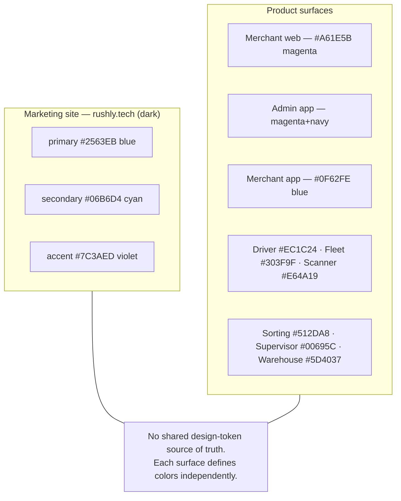
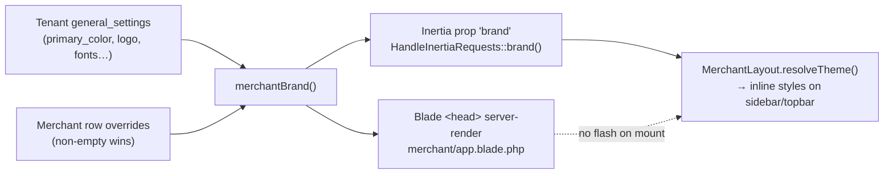

# 15 — Brand System (Phase 14)

> **Scope.** The Rushly brand as it actually exists in code: mission/positioning (from
> marketing copy & metadata), tone of voice, color palette, typography, logo/mark, iconography,
> illustration & motion language, the UI component systems, and the per-tenant white-label
> theming engine. Grounded in real assets and config across `marketing/`, `rushly-saas`
> (`tailwind.config.js`, `resources/css`, `resources/js/Components`), and the eight Flutter
> apps' `lib/shared/theme/app_theme.dart`.
>
> See the shared grounding brief in [_CONTEXT_BRIEF.md](_CONTEXT_BRIEF.md). `rushly-saas` is the
> single source of truth; Flutter apps are clients. Cross-links: [02-Project-Overview.md](02-Project-Overview.md),
> [05-System-Architecture.md](05-System-Architecture.md), [08-Flutter.md](08-Flutter.md),
> [10-Authentication.md](10-Authentication.md), [13-User-Journeys.md](13-User-Journeys.md).

> **⚠️ There is no formal brand guideline document in the codebase.** No `brand/` directory,
> no `BRAND.md`, no Figma export, no design-token JSON, no style-guide page. This document is a
> **reconstruction from design tokens and shipped assets** — every value below is cited to the
> file it was read from. Where different surfaces disagree, that is reported as a factual
> divergence, not smoothed over.

---

## 1. The brand at a glance

| Attribute | Value | Source |
|---|---|---|
| Product name | **Rushly** (styled with an "OS" pill: "Rushly · OS") | `marketing/components/sections/nav.tsx`, `marketing/app/layout.tsx` |
| Legal entity | **Rushly Technologies** | `marketing/components/sections/footer.tsx` (`© {year} Rushly Technologies`) |
| Primary domain | `rushly.tech` | `marketing/app/layout.tsx` (`metadataBase: new URL('https://rushly.tech')`) |
| Tenant domain pattern | `{tenant}.rushly.tech` | `_CONTEXT_BRIEF.md`; stancl/tenancy config |
| Tagline / category | **"The AI Logistics Operating System"** | `marketing/app/layout.tsx` (page `<title>`), `marketing/components/sections/hero.tsx` |
| One-liner | "One platform for every shipment, every warehouse, every merchant, every courier." | `marketing/app/layout.tsx` (meta description), `hero.tsx`, `footer.tsx` |
| App shell name (Laravel) | `APP_NAME`, default `'Laravel'` (unset) | `config/app.php:19` |
| PWA name | `Rushly` / short `Rushly`, theme `#ffffff` | `public/favicon/site.webmanifest` |

**Positioning statement (reconstructed from copy).** Rushly presents itself as *one* operating
system that replaces the fragmented tool stack of a logistics operation — "the spreadsheet, the
WhatsApp group and the six admin panels you check every morning"
(`marketing/components/sections/platform-overview.tsx`). It spans OMS, WMS, fulfillment,
last-mile and fleet, wrapped in an AI automation layer, and is sold as a single contract across
eight products (`marketing/components/sections/products.tsx`: "Eight products. One platform. One
contract.").

> There is no explicitly written "mission" or "vision" statement anywhere in the codebase.
> The closest artifacts are the marketing hero, the final-CTA, and the footer blurb — quoted in
> §2. Treat "mission/vision" below as **derived positioning**, not an official charter.

---

## 2. Mission, vision & voice

### 2.1 Positioning copy (verbatim, cited)

| Where it appears | Copy | Source |
|---|---|---|
| Hero H1 | "The AI Logistics **Operating System.**" | `marketing/components/sections/hero.tsx` |
| Hero sub | "One platform for every shipment, every warehouse, every merchant, every courier. Orchestrate orders, warehouses, fleets and last-mile — powered by AI, built for enterprise scale." | `hero.tsx` |
| Platform | "One system of record for logistics." | `platform-overview.tsx` |
| AI section | "An AI operations layer, running your business at 3am." / "Not features that write emails. Models that dispatch orders, route drivers, forecast stock and catch fraud — measurably, every day." | `ai-automation.tsx` |
| Warehouse | "A warehouse that runs like software." | `warehouse-showcase.tsx` |
| Performance | "Built for the scale of national logistics. … These numbers aren't marketing. They're from the Rushly workspaces running production today." | `performance.tsx` |
| Testimonials | "Operators. Not evangelists." | `testimonials.tsx` |
| Final CTA | "Start your logistics transformation today. … Live in 24 hours — no re-implementation required." | `final-cta.tsx` |
| Footer | "The AI Logistics Operating System. One platform. Every shipment, every warehouse, every merchant, every courier." / "Built for teams that ship." | `footer.tsx` |

### 2.2 Tone of voice (observed patterns)

Reconstructed from the marketing section copy. The voice is **confident, operator-first, and
anti-hype**:

1. **Declarative, short, period-terminated headlines.** "One system of record for logistics."
   "Eight products. One platform. One contract." Fragments used as full stops for rhythm.
2. **"Every X" anaphora** as a signature device — "every shipment, every warehouse, every
   merchant, every courier"; "every scan, every bin, every robot."
   (`hero.tsx`, `footer.tsx`, `warehouse-showcase.tsx`).
3. **Concrete over abstract.** Names real integrations (Salla, Zid, Shopify, WooCommerce) and
   real metrics (on-time rate, cost per order, driver utilization, first-attempt success) rather
   than adjectives (`platform-overview.tsx`).
4. **Anti-marketing self-awareness.** "These numbers aren't marketing." "Operators. Not
   evangelists." "Not features that write emails." The brand actively distances itself from
   generic SaaS AI hype.
5. **Speaks to the ops persona's pain** — the "spreadsheet + WhatsApp group + six admin panels"
   line; "the metric that matters, whichever one that is."
6. **Reassurance micro-copy** stresses low friction: "No credit card required", "Live in 24
   hours — no re-implementation required", "We reply in hours, not days" (`hero.tsx`,
   `final-cta.tsx`, `faq.tsx`).
7. **Trust signals** appear as terse compliance badges: "SOC 2 · ISO 27001 · GDPR"
   (`hero.tsx`, `final-cta.tsx`). *(Note: these are marketing claims in a public site; no
   corresponding compliance implementation was checked in code.)*

### 2.3 Product & feature naming conventions

- **`Rushly <Capability>`** for platform pillars: `Rushly OMS`, `Rushly WMS`, `Rushly Fleet`,
  `Rushly Fulfillment`, `Rushly Delivery`, `Rushly Merchant`, `Rushly Customer`, `Rushly API`
  (`marketing/components/sections/footer.tsx`, `nav.tsx`).
- **Shipment IDs** in mockups use the `RSH-######` prefix (e.g. `RSH-482910`)
  (`marketing/components/mockups/hero-dashboard.tsx`). This is illustrative marketing data, not
  the production tracking-number format — see [09-API.md](09-API.md)/[06-Database.md](06-Database.md)
  for real parcel identifiers.
- **AI features** carry proper names: "AI Dispatch", "Smart Routing", "ETA Prediction"
  (`hero.tsx`, `nav.tsx`).

---

## 3. Logo & mark

Rushly ships **two distinct visual marks** plus a set of raster logo files.

### 3.1 The marketing SVG mark (primary, code-defined)

The canonical, resolution-independent mark lives inline in the marketing nav as an SVG
(`marketing/components/sections/nav.tsx`, `Logo()`):

- **Form:** a rounded-square (`rx="9"`) badge containing an upward chevron/"A"-like glyph —
  `path d="M9 22 L16 8 L23 22 M12 17 H20"` — a stylized peak-with-crossbar suggesting an arrow /
  rising motion (speed → "Rushly").
- **Fill:** a diagonal linear gradient `#60a5fa → #22d3ee → #a78bfa` (blue → cyan → violet), the
  same three-stop gradient used everywhere as `gradient-brand` / `bg-aurora`.
- **Lockup:** mark + wordmark "Rushly" set in the display font, followed by a small outlined
  **"OS"** pill (`text-[10px] uppercase tracking-widest`).

The footer repeats a simpler mark: a `h-9 w-9` rounded-xl chip filled with
`from-primary-500 via-secondary-500 to-accent-500` and a `shadow-glow` (`footer.tsx`), plus a
giant `gradient-brand` "RUSHLY" watermark at `opacity-0.16`.

### 3.2 Raster logo assets (Laravel backend / storefront)

| File | Dimensions | Notes | Source path |
|---|---|---|---|
| `public/images/default/rushly-logo.png` | 1024×1024 | **⚠️ Not the Rushly mark** — this file is a multi-color **"FEERI LOGIS"** wordmark (purple/magenta, teal, yellow, grey brackets). It is a demo/tenant white-label logo shipped under the `rushly-logo.png` filename. | `public/images/default/rushly-logo.png` |
| `public/images/default/logo.png` | 651×710 | Default portal logo | `public/images/default/` |
| `public/images/default/light-logo.png` | — | Light-background variant | `public/images/default/` |
| `public/frontend/logo.png` | 250×39 | Storefront header logo | `public/frontend/` |
| `public/frontend/light-logo.png` | 250×40 | Storefront light variant | `public/frontend/` |
| `public/backend/images/logo.png` | — | Legacy backend admin logo | `public/backend/images/` |
| `public/favicon/*` + `site.webmanifest` | 192, 512 | PWA icons, name "Rushly" | `public/favicon/` |

> **⚠️ Doc vs Code — logo identity is inconsistent.** The default asset named `rushly-logo.png`
> is actually a "FEERI LOGIS" logo. This is consistent with the platform's white-label model
> (§9): the shipped raster logos are **placeholders/demo-tenant brands**, and the real Rushly
> identity is the code-defined SVG in the marketing site. There is no single authoritative
> master logo file (SVG/AI/EPS) checked into the repo.

### 3.3 Logo in the merchant app shell

The Inertia merchant portal renders the tenant/merchant logo (`brand.light_logo || brand.logo`)
or, when none is set, a **single-letter avatar** derived from the brand name
(`brandName.charAt(0).toUpperCase()`) — `resources/js/Layouts/MerchantLayout.jsx` (`Sidebar`).

---

## 4. Color palette

Rushly does **not** have one shared color system. Each surface defines its own palette. This is
the single most important finding in this document.

### 4.1 Marketing site (public web) — blue / cyan / violet on near-black

Defined in `marketing/tailwind.config.ts` and `marketing/app/globals.css`. This is the most
polished, deliberately-designed palette — a **dark, "aurora" gradient** aesthetic.

| Token | Hex | Role | Source |
|---|---|---|---|
| `bg` | `#020617` | Page background (near-black slate) | `tailwind.config.ts` |
| `surface` | `#0F172A` | Panels | `tailwind.config.ts` |
| `primary` (DEFAULT/600) | `#2563EB` | Brand blue (+ scale 50→900) | `tailwind.config.ts` |
| `secondary` | `#06B6D4` | Cyan | `tailwind.config.ts` |
| `accent` | `#7C3AED` | Violet | `tailwind.config.ts` |
| `muted` | `#94A3B8` | Slate text | `tailwind.config.ts` |
| `success` | `#22C55E` | Green | `tailwind.config.ts` |
| `warning` | `#F59E0B` | Amber | `tailwind.config.ts` |

The **signature gradient** (`gradient-brand`, `Logo`, aurora) uses the *lighter* trio
`#60a5fa → #22d3ee → #a78bfa`. Additional brand devices in `globals.css`:

- `.gradient-text` — white→slate→light-blue text clip for headings.
- `.glass` / `.glass-strong` — frosted panels (`rgba(255,255,255,0.04)` + `backdrop-blur`).
- `.grid-bg` + `.grid-fade-mask` — 56px technical grid, radially masked.
- `.grain::before` — SVG fractal-noise film-grain overlay at `opacity 0.35`, `mix-blend overlay`.
- `bg-aurora` — conic 3-color gradient; `boxShadow.glow` / `glow-cyan` / `glow-violet` — colored
  bloom shadows.

### 4.2 Merchant portal (Inertia/React, `rushly-saas`) — **magenta** primary

Defined as HSL CSS variables in `resources/css/merchant.css`, consumed via
`tailwind.config.js` (`hsl(var(--…))` mapping). This is a **shadcn/ui-style** token set with a
light default theme and a `.dark` override.

| Token | Light (HSL) | ≈ Hex | Dark (HSL) | Source |
|---|---|---|---|---|
| `--primary` | `330 70% 38%` | **`#A61E5B` magenta** | `330 70% 55%` | `resources/css/merchant.css` |
| `--background` | `0 0% 100%` | `#FFFFFF` | `222 84% 4.9%` | " |
| `--foreground` | `222 84% 4.9%` | `#0B1120` | `210 40% 98%` | " |
| `--secondary` / `--muted` / `--accent` | `210 40% 96.1%` | slate-100 | `217 33% 17.5%` | " |
| `--destructive` | `0 84% 60%` | red | `0 63% 50%` | " |
| `--sidebar` | `222 47% 11%` | slate-900 | `222 47% 6%` | " |
| `--radius` | `8px` | — | — | " |

> The default merchant primary is **magenta**, echoed in the Blade fallback
> `$__brandPrimary = $__brand['primary_color'] ?? '#a21f5c'` (`resources/views/merchant/app.blade.php`).

### 4.3 Flutter apps — one accent color **per app** (color-coded fleet)

Each Flutter client seeds Material 3 `ColorScheme.fromSeed()` with its **own** brand seed. There
is no shared color. From each app's `lib/shared/theme/app_theme.dart`:

| App | Seed color | Hex | Family |
|---|---|---|---|
| `rushly-admin-app` | `_brandMagenta` / `_brandNavy` | `#A61E5B` / `#0A1A3A` | **magenta + navy** |
| `rushly-merchant-app` | seed | `#0F62FE` | blue |
| `rushly-driver-app` | seed | `#EC1C24` | red |
| `rushly-fleet-app` | seed | `#303F9F` | indigo |
| `rushly-scanner-app` | seed | `#E64A19` | deep orange |
| `rushly-sorting-app` | seed | `#512DA8` | deep purple |
| `rushly-supervisor-app` | seed | `#00695C` | teal |
| `rushly-warehouse-app` | seed | `#5D4037` | brown |

The admin app's theme comments state the seeds are **"Rushly brand colors, taken from the logo
mark"** — magenta `#A61E5B` + navy `#0A1A3A` (`rushly-admin-app/lib/shared/theme/app_theme.dart`).
This magenta agrees with the merchant-web primary (`#A61E5B` ≈ `330 70% 38%`), so **magenta +
navy is the closest thing to a canonical Rushly brand color** across the *product* surfaces —
even though the *marketing* site is entirely blue/cyan/violet.

Shared Flutter conventions: light `scaffoldBackground` ≈ `#F5F7FB`/`#F6F7FB`; dark background
`#121212`; cards `radius 16`, filled buttons `radius 12`, `minimumSize 48h`; Material 3 (`useMaterial3: true`).

### 4.4 Palette divergence — summary

> **⚠️ Brand-consistency gap.** The public marketing brand (blue/cyan/violet) and the in-product
> brand (magenta/navy, plus seven other per-app accents) are **not aligned**. A user who arrives
> via `rushly.tech` (blue) and logs into the merchant portal (magenta) or opens a role app
> (any of eight colors) sees a different primary color each time. This is *by design* for the
> Flutter fleet (per-app color-coding aids recognition) but is a real inconsistency for the
> marketing↔merchant-web transition. There is no token pipeline forcing them to agree.

---

## 5. Typography

| Surface | Display / heading | Body / sans | Arabic | Source |
|---|---|---|---|---|
| Marketing site | **Space Grotesk** (`--font-display`) | **Inter** (`--font-sans`) | — | `marketing/app/layout.tsx`, `tailwind.config.ts`, `globals.css` |
| Merchant web (`rushly-saas`) | Cairo | **Cairo → Tajawal → Inter → system** | Cairo/Tajawal | `tailwind.config.js`, `resources/views/merchant/app.blade.php` |
| Flutter apps | Inter (Latin) | Inter | **Tajawal** (when `locale == ar`) | `*/lib/shared/theme/app_theme.dart` (`GoogleFonts.interTextTheme()` / `tajawalTextTheme()`) |

**Marketing type scale** (`tailwind.config.ts`, `fontSize`) — fluid display sizes with tight
tracking and weight 600:

| Token | `clamp()` | line-height | letter-spacing |
|---|---|---|---|
| `display-2xl` | `3.5rem → 7.5rem` | 0.95 | −0.04em |
| `display-xl` | `2.75rem → 5.5rem` | 1.0 | −0.035em |
| `display-lg` | `2.25rem → 4rem` | 1.05 | −0.03em |
| `display-md` | `1.75rem → 2.75rem` | 1.1 | −0.025em |

Headings (`h1–h4`) are auto-assigned the display font in `globals.css`. Eyebrows/labels use an
uppercase micro-style: `text-[11px] uppercase tracking-[0.22em]` (`eyebrow.tsx`).

**Font delivery.** Marketing uses `next/font/google` (Inter, Space Grotesk, `display:'swap'`).
Merchant web loads Inter/Cairo/Tajawal/Roboto from **`fonts.bunny.net`** (a privacy-friendly
Google Fonts proxy) with a pre-hydration `<style>` applying Cairo globally
(`resources/views/merchant/app.blade.php`). Flutter uses the `google_fonts` package.

> **⚠️ Type divergence.** Space Grotesk (the display face that gives the marketing brand its
> character) appears **only** on the marketing site. Every product surface defaults to
> Cairo/Inter. RTL/Arabic support (Cairo/Tajawal) exists in the products but **not** in the
> marketing site (`lang="en"`, Latin subsets only — `marketing/app/layout.tsx`).

---

## 6. Iconography

| Surface | Icon set | Source |
|---|---|---|
| Marketing site | **lucide-react** `^0.469.0` | `marketing/package.json`; used throughout `components/sections/*` |
| Merchant web | **lucide-react** `^0.460.0` | `package.json`; e.g. `MerchantLayout.jsx` (Search, ChevronDown, Check) |
| Legacy Blade backend | **Font Awesome** (brands/solid webfonts) | `public/backend/vendor/fonts/fontawesome/*` |
| Flutter apps | Material Icons (Material 3) | `app_theme.dart` (`iconTheme`, Material defaults) |

Lucide is the modern standard for both React surfaces — line-style, 24px grid, `1.5`–`2` stroke.
In the marketing nav, product/solution items pair a lucide glyph inside a gradient chip
(`bg-gradient-to-br from-primary-600/30 to-accent-600/30 border border-white/10`,
`nav.tsx`). Representative icons: `Boxes` (OMS), `Warehouse` (WMS), `Truck`
(Fleet/Delivery), `PackageCheck` (Fulfillment), `ShoppingCart` (Merchant), `MapPin`
(Customer/tracking), `LineChart` (Analytics), `Code2` (API), `Sparkles`/`Cpu` (AI).

---

## 7. Illustration, motion & texture language

The marketing site is the only surface with a developed illustrative system. There are **no
illustration image assets** in the repo — visuals are built entirely from code (CSS gradients,
SVG, and animated "mockup" dashboards).

**Texture & surface primitives** (`marketing/app/globals.css`):
- **Glassmorphism** — `.glass` / `.glass-strong` frosted panels with `backdrop-filter: blur + saturate`.
- **Aurora gradients** — `bg-aurora` conic 3-color glow; `bg-grid-fade` radial blue bloom.
- **Technical grid** — `.grid-bg` 56px lines under a radial `.grid-fade-mask`.
- **Film grain** — `.grain::before` SVG fractal-noise overlay.
- **Colored glow shadows** — `shadow-glow` / `glow-cyan` / `glow-violet`.

**Motion system** (`tailwind.config.ts` `animation`/`keyframes` + `framer-motion ^11`):
`marquee`, `float`, `pulse-glow`, `sheen`, `spin-slow`, `ping-soft`. Sections enter via
`framer-motion` reveals (`components/motion/reveal.tsx`, `counter.tsx`, `mouse-glow.tsx`,
`marquee.tsx`). Preferred easing curve: `[0.22, 1, 0.36, 1]` (`hero.tsx`).

**Product "illustration" = animated UI mockups.** `components/mockups/hero-dashboard.tsx` and
`mini-dashboards.tsx` are hand-built fake dashboards (shipment rows `RSH-######`, live ETAs,
sparkline charts) used in place of screenshots — reinforcing the "runs like software" narrative.

> Product apps (Flutter, merchant web) have **no illustration language** — they are functional
> Material 3 / shadcn surfaces. Illustration is a marketing-only concern today.

---

## 8. UI component systems

Three independent component systems exist; they share the *shadcn/cva* pattern in the two React
surfaces but are otherwise separate.

### 8.1 Marketing UI kit (`marketing/components/ui/`)

Built with **class-variance-authority (cva)** + `cn()` (clsx + tailwind-merge, `lib/cn.ts`):

- **`Button`** (`button.tsx`) — variants `primary` (blue gradient + inset/glow shadow, hover
  lift), `secondary` (glass), `ghost`, `outline`; sizes `sm/md/lg/xl`, all **fully rounded**
  (`rounded-full`). Focus ring `ring-primary/60`.
- **`Card`** (`card.tsx`) — `rounded-2xl` glass card, optional `hover` lift + `shadow-glow`.
- **`Badge`** + **`DotPulse`** (`badge.tsx`) — pill tones `default/success/warn/brand`; animated
  status dot (`animate-ping-soft`) → the "All systems operational" indicator.
- **`Eyebrow`** / **`SectionHeader`** (`eyebrow.tsx`) — the uppercase tracked label + gradient
  H2 pattern used by every section.

### 8.2 Merchant portal UI kit (`resources/js/Components/ui/`)

A **shadcn/ui** port (Radix primitives + cva + `hsl(var(--token))` theming):
`Button.jsx`, `Card.jsx`, `Input.jsx`, `Label.jsx`, `Select.jsx`, `Textarea.jsx`,
`DropdownMenu.jsx` (+ `@radix-ui/react-slot`, `react-dropdown-menu`, `react-label`).
`Button.jsx` variants: `default/destructive/outline/secondary/ghost/link`; sizes
`default/sm/lg/icon`; radius `rounded-md`. Additional domain component groups live under
`resources/js/Components/{merchant,parcel,wms}` plus `GlobalSearch.jsx`.

> **⚠️ Component divergence.** Marketing buttons are `rounded-full` blue gradients; merchant
> buttons are `rounded-md` solid `bg-primary` (magenta). Same cva pattern, different visual
> language. The two kits are **not** shared — they live in different projects with duplicated
> `cn` utilities.

### 8.3 Flutter (Material 3 theme)

Each app's `AppTheme` (`lib/shared/theme/app_theme.dart`) centralizes: seeded `ColorScheme`,
Google-Fonts text theme (locale-aware), `AppBarTheme` (white bg, navy title), `CardTheme`
(`radius 16`, grey-200 border, no elevation), `InputDecorationTheme` (filled, outline),
`FilledButtonTheme` (`radius 12`, full-width `48h`). Light + dark variants per app. See
[08-Flutter.md](08-Flutter.md).

---

## 9. White-label / per-tenant theming engine

The merchant portal is **fully white-labelable** — this is the reason the shipped logos and the
default primary look "not-Rushly." Branding is resolved server-side and injected into both the
Blade `<head>` (no flash) and the Inertia `brand` prop.

**Resolution order** (`app/Http/Helper/Helper.php` → `merchantBrand()`):

1. Start from **tenant** `general_settings` (`settings()`): `name`, `logo_image`,
   `light_logo_image`, `favicon_image`, `login_bg_image`, `primary_color`, `text_color`,
   `sidebar_color`, `sidebar_text_color`, `topbar_color`, `topbar_text_color`, `accent_color`,
   `sidebar_style`, `logo_style`, `logo_source`, `font_family`, `border_radius`, `density`.
2. **Merchant** row (`App\Models\Backend\Merchant` by `user_id`) **overrides per-field** — any
   non-empty merchant value wins (`business_name`, colors, styles, `logo_url`, etc.); empty →
   inherit tenant.

**Consumption in the SPA** (`resources/js/Layouts/MerchantLayout.jsx` → `resolveTheme(brand)`):
maps brand fields to concrete styles — `primary`, `sidebarBg/Fg` (driven by
`sidebar_style ∈ {dark|light|brand}`), `topbarBg/Fg`, `accent`, `radius`, `density`, `font` —
and applies them as inline styles on the sidebar/topbar (active-link tint, avatar tint, search
tint). Server side, `merchant/app.blade.php` sets `<meta name="theme-color">`, `<title>`,
favicon/OG/Twitter tags, and the pre-hydration font from the resolved brand, defaulting
`primary_color` to `#a21f5c` (magenta) and the name to `config('app.name')`.

**Implication for the brand.** Because merchants and tenants can override name, logo, colors,
fonts, radius and density, the merchant portal is a **neutral, themeable chassis** — "Rushly" is
the *platform* brand, but the *portal a merchant sees* is that merchant's/tenant's brand. The
`rushly-logo.png` = "FEERI LOGIS" asset is exactly this: a demo tenant's white-label logo. See
[10-Authentication.md](10-Authentication.md) and [13-User-Journeys.md](13-User-Journeys.md) for
tenant/merchant context.

> The marketing site and the Flutter apps do **not** consume this white-label engine — it is
> merchant-portal-only. Flutter apps hard-code their per-app seed colors; marketing is fixed.

---

## 10. Consolidated findings & recommendations

**Facts (grounded):**
- One code-defined SVG mark (blue→cyan→violet gradient chevron) is the de-facto master logo;
  no master vector file is committed. (`marketing/components/sections/nav.tsx`)
- Marketing brand = blue `#2563EB` / cyan `#06B6D4` / violet `#7C3AED` on `#020617`, Space
  Grotesk + Inter. (`marketing/tailwind.config.ts`)
- Product brand ≈ magenta `#A61E5B` + navy `#0A1A3A`, Cairo/Inter. (`resources/css/merchant.css`,
  `rushly-admin-app/.../app_theme.dart`)
- Eight Flutter apps each use a distinct seed color (color-coded fleet). (each `app_theme.dart`)
- Merchant portal is fully white-labelable per tenant/merchant. (`Helper.php::merchantBrand`)

**Gaps / inconsistencies (reported, not invented):**
1. **No single design-token source.** Colors/typography are re-declared per project with no
   shared package — marketing (blue) and product (magenta) brands disagree.
2. **No formal brand guideline / no master logo vector** in the repo.
3. **The default `rushly-logo.png` is a different brand ("FEERI LOGIS").**
4. **Space Grotesk display face is marketing-only**; products use Cairo/Inter.
5. **RTL/Arabic** is supported in products (Cairo/Tajawal) but not on the marketing site.
6. Marketing "trust badges" (SOC 2 / ISO 27001 / GDPR) are copy only — not verified in code.

*(These are documentation findings. No code changes are proposed here.)*

---

## Sources

Key files and directories actually opened for this document:

**Marketing site (`/var/www/rushly-saas/marketing/`)**
- `tailwind.config.ts` — colors, type scale, gradients, shadows, animation tokens
- `app/globals.css` — glass/grid/grain/gradient utilities, scrollbar, base type
- `app/layout.tsx` — fonts (Inter, Space Grotesk), metadata, tagline, domain
- `app/page.tsx` — section composition
- `package.json` — Next 15 / React 19 / framer-motion / lucide-react / cva
- `components/ui/{button,card,badge,eyebrow}.tsx`, `lib/cn.ts` — UI kit
- `components/sections/{nav,hero,platform-overview,final-cta,footer,products,performance,ai-automation,warehouse-showcase,solutions,testimonials,pricing,faq,integrations,dashboard-gallery}.tsx` — logo SVG, copy, tone
- `components/mockups/hero-dashboard.tsx` — mock dashboard / illustration language

**rushly-saas web (`/var/www/rushly-saas/`)**
- `tailwind.config.js` — Cairo font stack, `hsl(var(--…))` token mapping, radius
- `resources/css/merchant.css` — merchant portal HSL color tokens (light/dark), `--radius`
- `resources/css/app.css` (empty), `vite.config.js`
- `resources/views/merchant/app.blade.php` — brand `<head>`, fonts (bunny.net), theme-color
- `resources/js/Layouts/MerchantLayout.jsx` — `resolveTheme()` brand token application
- `resources/js/Components/ui/Button.jsx` (+ `ui/` dir), `Components/{merchant,parcel,wms}`
- `app/Http/Helper/Helper.php` — `merchantBrand()` resolution
- `app/Http/Middleware/HandleInertiaRequests.php` — `brand()` Inertia prop
- `config/app.php` — `APP_NAME`
- `public/images/default/rushly-logo.png` (1024², "FEERI LOGIS"), `logo.png`, `light-logo.png`
- `public/frontend/{logo,light-logo}.png`, `public/backend/images/logo.png`
- `public/favicon/site.webmanifest`

**Flutter apps** — `lib/shared/theme/app_theme.dart` in each of:
`rushly-admin-app`, `rushly-merchant-app`, `rushly-driver-app`, `rushly-fleet-app`,
`rushly-scanner-app`, `rushly-sorting-app`, `rushly-supervisor-app`, `rushly-warehouse-app`.

**Context:** [_CONTEXT_BRIEF.md](_CONTEXT_BRIEF.md).
</content>
</invoke>
