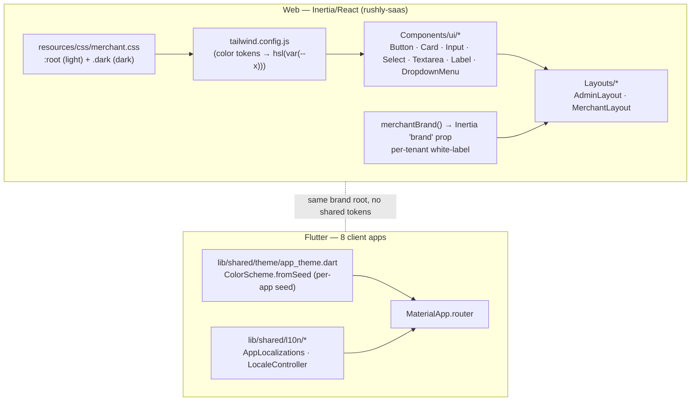
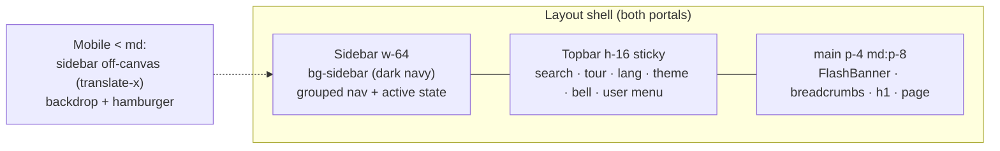

# 16 — UI / UX (Phase 13)

> **Scope.** The Rushly design language *as it exists in code*: the two parallel design
> systems (the Inertia/React admin+merchant web on `shadcn`-style primitives, and the
> eight Flutter apps on Material 3), plus theme tokens, color, typography, the component
> library (cards / buttons / inputs), navigation shells, RTL, dark mode, accessibility,
> responsive behaviour, and the per-tenant white-label theming engine.
>
> `rushly-saas` (`/var/www/rushly-saas`) is the single source of truth; the Flutter apps
> are clients. See the grounding brief in [_CONTEXT_BRIEF.md](_CONTEXT_BRIEF.md).
>
> Sibling docs: [08-Flutter.md](08-Flutter.md) (Flutter architecture),
> [15-Brand-System.md](15-Brand-System.md) (brand palette / logo / voice — read together
> with this doc; §"Color" here is the *engineering* view of the same tokens),
> [13-User-Journeys.md](13-User-Journeys.md), [05-System-Architecture.md](05-System-Architecture.md).
>
> **There is no formal design-token file, Figma export, or Storybook in the repo.** The
> design system is expressed directly in `tailwind.config.js`, `resources/css/merchant.css`,
> the components under `resources/js/Components/ui/`, and each Flutter app's
> `lib/shared/theme/app_theme.dart`. Every value below is cited to the file it was read from.

---

## 1. The two design systems at a glance

Rushly ships **two independent UI stacks** that share a brand but not a codebase:

| Surface | Stack | Design system | Token source |
|---|---|---|---|
| Admin web + Merchant portal | Inertia.js + React (`resources/js`) | shadcn/ui pattern: Radix primitives + `class-variance-authority` + `tailwind-merge`/`clsx` | HSL CSS variables in `resources/css/merchant.css`, mapped in `tailwind.config.js` |
| 8 mobile apps (admin, driver, fleet, merchant, scanner, sorting, supervisor, warehouse) | Flutter + Material 3 | `ColorScheme.fromSeed` per app, `google_fonts` | `lib/shared/theme/app_theme.dart` (one per app) |

They are visually related (same magenta brand root on admin) but **not** unified: there is
no shared token package, no design-token JSON bridging web and Flutter, and the color
values differ per surface (see §12).



---

## 2. Web: bundling & entry point (one SPA for two portals)

Both the admin and the merchant portals are served by **a single Vite bundle** —
`resources/js/merchant.jsx` and `resources/css/merchant.css` — even though the admin
Blade shell is a separate file.

- `resources/views/admin/app.blade.php` and `resources/views/merchant/app.blade.php` are
  near-identical. **Both** resolve the Vite manifest entries
  `resources/css/merchant.css` and `resources/js/merchant.jsx` (see
  `admin/app.blade.php:85-86` and `merchant/app.blade.php:75-76`). There is **no**
  `admin.jsx` entry — `ls resources/js/*.jsx` returns only `merchant.jsx`.
- `resources/js/merchant.jsx` boots Inertia (`createInertiaApp`), imports
  `../css/merchant.css`, exposes Ziggy's `route()` as `window.route`, wraps the app in
  `TourProvider`, and resolves pages from `./Pages/**/*.jsx` (`import.meta.glob`).
- Which portal you see is decided by **which page component** the server renders, not by
  which bundle loads. Admin pages wrap themselves in `AdminLayout`; merchant pages wrap in
  `MerchantLayout`.
- Vite tags are emitted manually via `global_asset('build/'.$entry)` rather than the
  `@vite` directive — a workaround so Stancl Tenancy's `asset_helper_tenancy` doesn't
  rewrite them to `/tenancy/assets/...` and 404 (`admin/app.blade.php:71-79`).

⚠️ **Doc vs Code:** `resources/css/app.css` **exists but is empty**, and `resources/js/app.js`
/ `bootstrap.js` / `components/Example.jsx` / `components/ExampleComponent.vue` are Laravel
scaffolding leftovers. The live styling pipeline is entirely `merchant.css` + `merchant.jsx`.
Treat `app.css` and the `Example*` files as dead scaffolding.

### Shared Inertia props (drive every layout)

`app/Http/Middleware/HandleInertiaRequests.php` shares on every request:

| Prop | Contents | Used by |
|---|---|---|
| `auth.user` | `id, name, email, image, user_type` | topbar avatar, super-admin nav switch |
| `auth.permissions` | flat array from `users.permissions` JSON | sidebar menu gating (UX only; server stays authoritative) |
| `brand` | `merchantBrand()` (white-label tokens, see §7) | logos, theme overrides |
| `impersonator` | admin id/name when impersonating | merchant impersonation banner |
| `app.name`, `app.locale` | app name + active locale | `<title>`, `useLocale()`/`useT()` |
| `flash` | `success / error / warning / message / errors_list` | `FlashBanner` |
| `ziggy` | route table | `window.route()` |

---

## 3. Web: color token system

Colors are defined **once** as raw HSL triples on CSS custom properties in
`resources/css/merchant.css`, then referenced in `tailwind.config.js` as
`hsl(var(--token))`. This is the canonical shadcn token convention.

`tailwind.config.js`:

```js
darkMode: ['class'],
colors: {
  border:'hsl(var(--border))', input:'hsl(var(--input))', ring:'hsl(var(--ring))',
  background:'hsl(var(--background))', foreground:'hsl(var(--foreground))',
  primary:{DEFAULT:'hsl(var(--primary))', foreground:'hsl(var(--primary-foreground))'},
  secondary, destructive, muted, accent, popover, card,
  sidebar:{DEFAULT, foreground, border, accent},
}
```

### Token values (`resources/css/merchant.css`)

| Token | Light `:root` | Dark `.dark` | Role |
|---|---|---|---|
| `--background` | `0 0% 100%` (white) | `222.2 84% 4.9%` (near-black navy) | page bg |
| `--foreground` | `222.2 84% 4.9%` | `210 40% 98%` | body text |
| `--card` / `--card-foreground` | white / dark ink | dark / near-white | card surfaces |
| `--popover` / `-foreground` | white / dark | dark / light | dropdowns, menus |
| **`--primary`** | **`330 70% 38%`** (Rushly magenta) | **`330 70% 55%`** (lighter magenta) | primary buttons, active nav, accents |
| `--primary-foreground` | `0 0% 100%` | `0 0% 100%` | text on primary |
| `--secondary` / `-foreground` | `210 40% 96.1%` / dark | `217.2 32.6% 17.5%` / light | secondary buttons |
| `--muted` / `-foreground` | `210 40% 96.1%` / `215.4 16.3% 46.9%` | dark slate / `215 20.2% 65.1%` | subtle bg, helper text |
| `--accent` / `-foreground` | `210 40% 96.1%` / dark | dark slate / light | hover states |
| `--destructive` / `-foreground` | `0 84.2% 60.2%` / white | `0 62.8% 50%` / white | delete/danger |
| `--border`, `--input` | `214.3 31.8% 91.4%` | `217.2 32.6% 17.5%` | borders, input outlines |
| `--ring` | `222.2 84% 4.9%` | `212.7 26.8% 83.9%` | focus ring |
| `--sidebar` | `222.2 47.4% 11.2%` (dark navy) | `222.2 47.4% 6%` (darker) | sidebar bg — **always dark**, both modes |
| `--sidebar-foreground` | `210 40% 96.1%` | same | sidebar text |
| `--sidebar-border` / `--sidebar-accent` | `217 19% 22%` | `217 19% 16%` | sidebar dividers / hover |
| `--radius` | `8px` | (inherits) | base corner radius |

**Notes**

- The primary `hsl(330 70% 38%)` is the web expression of the Rushly magenta. The Flutter
  admin app uses `#A61E5B` and the merchant portal Blade default is `#a21f5c`
  (`resources/views/*/app.blade.php:9`); these are the same magenta at slightly different
  code points (see [15-Brand-System.md](15-Brand-System.md)).
- The **sidebar is dark navy in both light and dark mode** — it is not tied to
  `--background`, so the shell keeps a consistent dark rail regardless of theme.
- Semantic status colors (success/warning/info) are **not** tokens; the `FlashBanner` and
  `GlobalSearch` hard-code Tailwind palette utilities (`emerald`, `rose`, `amber`, `sky`,
  `violet`) with explicit `dark:` variants — see §11.

---

## 4. Web: typography

- **Font stack (`tailwind.config.js`):** `font-sans` = `['Cairo', 'Tajawal', 'Inter',
  'system-ui', '-apple-system', 'Segoe UI', 'sans-serif']`. **Cairo is the primary
  family** because it covers both Latin and Arabic glyphs cleanly; Tajawal is the Arabic
  fallback; Inter is the Latin fallback.
- **Loading:** fonts are pulled from `fonts.bunny.net` in both Blade shells
  (`admin/app.blade.php:57`): `inter`, `cairo`, `tajawal`, `roboto` (400/500/600/700).
  `preconnect` hints to `fonts.bunny.net` + `fonts.gstatic.com`.
- **Pre-hydration baseline:** an inline `<style>` sets `:root, html, body { font-family:
  'Cairo', 'Tajawal', 'Inter', … }` so text renders in Cairo before Tailwind utilities
  hydrate (initial paint, third-party widgets). (`admin/app.blade.php:64-67`)
- **RTL line-height bump:** `html[dir="rtl"] body { line-height: 1.6 }` — Arabic renders a
  hair larger, so RTL gets extra leading, especially in dense KPI tiles.
- **Type scale (from component classes):** page `<h1>` = `text-2xl font-semibold
  tracking-tight` (`AdminLayout.jsx:519`); `CardTitle` = `text-lg font-semibold leading-none
  tracking-tight`; body/controls = `text-sm`; helper/meta = `text-xs text-muted-foreground`;
  nav group labels = `text-[11px] font-semibold uppercase tracking-wider`. `<body>` carries
  `font-sans antialiased`.

---

## 5. Web: component library (`resources/js/Components/ui/`)

Seven headless-ish primitives, all sharing the `cn()` helper (`resources/js/lib/utils.js`
= `twMerge(clsx(...))`). Documented per the shadcn/ui convention: `React.forwardRef`,
variant props via `class-variance-authority`, style overridable via `className`.

### Button — `Components/ui/Button.jsx`
`cva`-driven. Base: `inline-flex items-center justify-center rounded-md text-sm
font-medium … focus-visible:ring-2 focus-visible:ring-ring focus-visible:ring-offset-2
disabled:pointer-events-none disabled:opacity-50`.

| Variant | Classes |
|---|---|
| `default` | `bg-primary text-primary-foreground hover:bg-primary/90` |
| `destructive` | `bg-destructive text-destructive-foreground hover:bg-destructive/90` |
| `outline` | `border border-input bg-background hover:bg-accent hover:text-accent-foreground` |
| `secondary` | `bg-secondary text-secondary-foreground hover:bg-secondary/80` |
| `ghost` | `hover:bg-accent hover:text-accent-foreground` |
| `link` | `text-primary underline-offset-4 hover:underline` |

| Size | Classes |
|---|---|
| `default` | `h-10 px-4 py-2` |
| `sm` | `h-9 px-3` |
| `lg` | `h-11 px-8` |
| `icon` | `h-10 w-10` |

Supports `asChild` via Radix `Slot` (renders a `<Link>` etc. with button styling).

### Card — `Components/ui/Card.jsx`
`Card` (`rounded-lg border bg-card text-card-foreground shadow-sm`) plus `CardHeader`
(`p-6 space-y-1.5`), `CardTitle` (`text-lg font-semibold`), `CardDescription`
(`text-sm text-muted-foreground`), `CardContent` (`p-6 pt-0`), `CardFooter`
(`flex items-center p-6 pt-0`). This is the primary content container across every page.

### Input — `Components/ui/Input.jsx`
`flex h-10 w-full rounded-md border border-input bg-background px-3 py-2 text-sm …
focus-visible:ring-2 focus-visible:ring-ring focus-visible:ring-offset-2
disabled:cursor-not-allowed disabled:opacity-50`, with `file:` and
`placeholder:text-muted-foreground` handling.

### Textarea — `Components/ui/Textarea.jsx`
Same visual language as Input, `min-h-[80px]`.

### Select — `Components/ui/Select.jsx`
A styled **native `<select>`** (not a Radix listbox) — same border/height/focus tokens as
Input. Lightweight; RTL and keyboard behaviour come free from the browser.

### Label — `Components/ui/Label.jsx`
Radix `@radix-ui/react-label`. `text-sm font-medium leading-none
peer-disabled:cursor-not-allowed peer-disabled:opacity-70`.

### DropdownMenu — `Components/ui/DropdownMenu.jsx`
Full Radix `@radix-ui/react-dropdown-menu` wrapper: `Root/Trigger/Content/Item/Label/
Separator/Group/Sub/RadioGroup/Shortcut`. Content is portaled, `bg-popover
text-popover-foreground border rounded-md shadow-md`, with `tailwindcss-animate`
enter/exit + side-slide animations keyed on `data-[state]`/`data-[side]`. Items get
`focus:bg-accent focus:text-accent-foreground` and `data-[disabled]` handling. Powers the
language menu, user menu, and any contextual menus.

> The library is deliberately small. Feature-specific composites (parcel form, shipment
> drawer, WMS list chrome, merchant sub-header, pagination) live in
> `Components/parcel/`, `Components/wms/`, `Components/merchant/` — see §11.

---

## 6. Web: layout & navigation shells

Two shells, both `w-64` fixed sidebar + sticky topbar + `<main>` content, off-canvas on
mobile. Both live in `resources/js/Layouts/`.

### AdminLayout — `Layouts/AdminLayout.jsx`
- **Sidebar** (`bg-sidebar text-sidebar-foreground border-e border-sidebar-border`, dark
  navy). Nav is a static `NAV` array of grouped items; each item is
  `{ tKey, icon (lucide-react), route (Ziggy name), match[], perm? }`.
- **Nav groups (13):** Main (Summary, Ops dashboard, Dashboard, Performance, Knowledge
  Base), Parcels (Shipments, Bulk action, NDR, Abnormal), WMS (10 items), Operations (TMS,
  Hubs, Pickup), Users Management (Clients/merchants, Couriers, Users & Roles, Sub-accounts),
  Finance, HR, Productivity (Todo, Support, News, Push, Fraud), Billing, ZATCA, CMS, System,
  Settings (18 items). Empty groups (all items filtered out by permission) are hidden.
- **Super-admin nav:** when `auth.user.user_type === 6` (`UserType::SUPER_ADMIN`) the
  sidebar swaps to a terse `SUPER_NAV` (tenants, plans, billing, tickets, global settings) —
  tenant-scoped screens are meaningless on the central domain.
- **Active-state logic (`isActive`)** is self-correcting: it exact-matches the entry's
  resolved Ziggy path against the current URL, then falls back to prefix-matching the
  curated `match[]` patterns (so `/admin/parcel/bulk` still highlights "Shipments").
- **Permission gating:** `canSee(item)` checks `auth.permissions` (shared prop). Purely a
  UX filter — server middleware remains authoritative.
- **Topbar:** `GlobalSearch`, `TourLauncher`, `LanguageMenu`, dark-mode toggle, notifications
  bell, user `DropdownMenu` (profile / logout). Logout builds a real `<form>` POST with the
  CSRF token so Laravel's non-Inertia redirect lands on the login page cleanly.
- **`FlashBanner`** and breadcrumbs render inside `<main>` (§11).

### MerchantLayout — `Layouts/MerchantLayout.jsx`
- Same skeleton, fewer nav groups: Overview (Dashboard, Knowledge Base), Operations
  (Parcels, Shops, Support), Finance (Statements, Account transactions, Invoices, Payments
  received), Reports (Total summary, Parcel reports), Settings (COD charges, Delivery
  charges).
- **White-label aware** (§7): reads `resolveTheme(brand)` and applies inline styles for
  primary/sidebar/topbar/accent/radius/density/font on top of the token defaults.
- **Extra `<Head>` metadata:** per-tenant `application-name`, `theme-color`
  (`primary_color` or `#a21f5c`), favicon links, OpenGraph/Twitter cards from the brand.
- **`ImpersonationBanner`:** sticky amber bar when an admin is viewing as the merchant, with
  a "Return to admin" action (`merchant.impersonate.stop`).



---

## 7. Web: per-tenant white-label theming engine

The merchant portal is fully white-labelable **per tenant and per merchant**. The theme is
resolved server-side and applied client-side as inline styles (so it layers on top of the
static CSS-variable defaults without a build step).

### Server: `merchantBrand()` — `app/Http/Helper/Helper.php:170`
Builds a `brand` array from `general_settings` (tenant defaults), then **per-field override**
from the current merchant's `Merchant` row (empty/null → inherit tenant). Keys:
`name, logo, light_logo, favicon, login_bg, primary_color, text_color, sidebar_color,
sidebar_text_color, topbar_color, topbar_text_color, accent_color, sidebar_style,
logo_style, logo_source, font_family, border_radius, density`. Shared to Inertia as the
`brand` prop (`HandleInertiaRequests.php:48`).

### Client: `resolveTheme(brand)` — `Layouts/MerchantLayout.jsx:85`
Maps brand fields to concrete style values with fallbacks:

| Brand field | Resolved to | Notes |
|---|---|---|
| `primary_color` | active-nav bg, avatar tint | falls back to token `--primary` if unset |
| `sidebar_style` | `dark`→`#0f172a`, `light`→`#fff`, `brand`→primary | overridable by explicit `sidebar_color` |
| `sidebar_text_color` | sidebar fg | derived from style if unset |
| `topbar_color` / `topbar_text_color` | branded topbar | topbar tints search + avatar when set |
| `accent_color` | check-marks, accents | |
| `border_radius` | `--radius` via `RADIUS_VAR` | `sharp`=2px, `default`=8px, `rounded`=14px |
| `density` | `dense` → tighter paddings, `h-12` topbar | applied throughout sidebar/topbar |
| `font_family` | root `fontFamily` via `FONT_FAMILY` | `inter / cairo / tajawal / roboto / system` |

`MerchantLayout` writes `--radius` and `fontFamily` onto the root `style`, and passes
`theme` into `Sidebar`/`Topbar` which branch between token classes and inline brand styles.

### Sidebar logo modes (`AdminLayout.jsx:252`)
Driven by `brand.logo_style`: `logo_text` (icon + name, default), `logo_only` (image only,
enlarged), `text_only` (wordmark only). `brand.logo_source` picks `logo` vs `light_logo`
(falls back to `logo` so choosing "light logo" never breaks). When no logo is uploaded, a
`bg-primary` initial tile is shown.

⚠️ **Doc vs Code:** `docs/inertia/components/admin-layout.md` says admin has "no brand
overrides (admin is single-tenant)". In current code **`AdminLayout` does consume `brand`**
— for the sidebar logo/name/logo_style — but it does **not** apply the full `resolveTheme`
color/radius/density override that `MerchantLayout` does. So: admin = brand *logo/name*
only; merchant = full white-label theming.

---

## 8. Web: dark mode

- **Mechanism:** Tailwind `darkMode: ['class']`. A `.dark` class on
  `document.documentElement` flips every `hsl(var(--*))` token to its `.dark` value.
- **Toggle:** `useDarkMode()` in each layout toggles the class and persists to
  `localStorage` — key `admin-theme` in `AdminLayout.jsx:193`, key `merchant-theme` in
  `MerchantLayout.jsx:78`. The topbar button swaps a `Sun`/`Moon` lucide icon.
- **Initial paint:** the Blade shell sets `<meta name="color-scheme" content="light">`
  (`admin/app.blade.php:19`); dark mode is opt-in via the toggle.

⚠️ **Doc vs Code (divergence):** `AdminLayout`'s `useDarkMode` has a `useEffect` that
re-applies the saved `admin-theme` on mount (`AdminLayout.jsx:196-202`). **`MerchantLayout`'s
`useDarkMode` has no such effect** (`MerchantLayout.jsx:69-82`) — it writes `merchant-theme`
on toggle but never reads it back on load, so a merchant's dark-mode preference does **not**
persist across full page reloads. This looks like an oversight, not a deliberate choice.

---

## 9. Web: RTL & internationalization

### Direction (RTL)
- The Blade shell sets `<html lang="{{ $locale }}" dir="{{ $dir }}">` where `$dir = 'rtl'`
  **iff** `app()->getLocale() === 'ar'` (`admin/app.blade.php:12-14`). Direction is chosen
  **server-side per request**, so there's no LTR→RTL flash.
- **Logical properties everywhere:** components use `ps-/pe-` (padding-inline),
  `ms-/me-` (margin-inline), `start-/end-`, and `border-e/border-s` instead of
  left/right. This makes the whole UI mirror automatically under `dir="rtl"`.
- **Direction-aware transforms:** the off-canvas sidebar uses
  `ltr:-translate-x-full rtl:translate-x-full` so it slides in from the correct edge in
  each direction (`AdminLayout.jsx:237`).
- **Arabic leading:** `html[dir="rtl"] body { line-height: 1.6 }` (§4).
- `merchant.jsx:31-32` reads `isRTL = locale === 'ar'` from initial props and passes it into
  `TourProvider` so the product-tour overlay positions correctly in RTL.

### Locale & translations — `resources/js/lib/i18n.js`
- `SUPPORTED_LOCALES` advertises **7 locales**: `en`, `ar`, `fr`, `es`, `bn`, `zh`, `in`
  (English, Arabic, French, Spanish, Bengali, Chinese, Bahasa).
- `useLocale()` reads `props.app.locale`; `useT()` returns a `t(key)` lookup.
- Switching locale does a **full navigation** to `setlocalization` (not an Inertia visit) so
  the server-rendered `lang`/`dir` and session locale stay aligned
  (`AdminLayout.jsx:333`, `MerchantLayout.jsx:214`).

⚠️ **Doc vs Code:** although 7 locales are *listed*, the in-file `DICTIONARY` only contains
**`en` and `ar`** translations. `useT()` falls back to English for `fr/es/bn/zh/in`
(`i18n.js:523-524`: `dict[key] ?? DICTIONARY.en[key] ?? key`). The React chrome is
effectively **bilingual EN/AR**; the other five locales resolve to English strings. (Server
Blade pages may have their own PHP `lang/` files — out of scope here.)

---

## 10. Web: accessibility

Grounded, not aspirational — what the code actually does:

- **Focus visibility:** every interactive primitive (Button, Input, Select, Textarea,
  DropdownMenu) carries `focus-visible:outline-none focus-visible:ring-2
  focus-visible:ring-ring focus-visible:ring-offset-2`. Focus ring color is a dedicated
  `--ring` token.
- **Accessible primitives:** dropdowns/labels are Radix (`@radix-ui/react-dropdown-menu`,
  `@radix-ui/react-label`) — roving focus, `aria-*`, escape/typeahead handled by the library.
- **`aria-label` on icon-only controls:** language (`t('language')`), theme toggle
  (`t('toggle_theme')`), notifications (`t('notifications')`), dismiss (`"Dismiss"`).
- **Disabled semantics:** `disabled:opacity-50` + `disabled:pointer-events-none` /
  `disabled:cursor-not-allowed`.
- **Keyboard nav in GlobalSearch:** arrow-key stepping through a flat result list with a
  highlighted index (`GlobalSearch.jsx`).
- **Alt text / decorative images:** brand logos use `alt=""` when decorative or the brand
  name when meaningful.
- **`noindex, nofollow`** on the authenticated portals (`admin/app.blade.php:53`).

**Gaps / not found:** no skip-link, no `aria-current` on the active nav item (active state is
visual only via `bg-primary`), no automated a11y test suite, and status colors are not
guaranteed WCAG-AA contrast-checked in code. Written as "Not found in the current codebase."

---

## 11. Web: responsive design & feature composites

### Responsive
- **Breakpoint model:** mobile-first, `md:` (768px) is the primary desktop switch. The
  sidebar is `fixed w-64` and hidden off-canvas below `md` (`translate-x`), revealed by a
  backdrop + hamburger; at `md:` it's pinned and content gets `md:ps-64`.
- **Topbar:** `GlobalSearch` is `hidden md:flex`; the mobile hamburger is `md:hidden`; the
  user-name label is `hidden sm:inline`.
- **Content:** `<main className="p-4 md:p-8">`; container is centered with `2rem` padding,
  max width `1400px` at `2xl` (`tailwind.config.js`).
- Density mode (§7) can further tighten spacing for data-heavy merchants.

### Feature composites (selected)
| Component | File | Role |
|---|---|---|
| `GlobalSearch` | `Components/GlobalSearch.jsx` | Debounced admin search (`/admin/global-search`), grouped results (parcel/driver/client/product/ticket) with per-group accent colors + icons, arrow-key nav |
| `ListPage` (WMS) | `Components/wms/ListPage.jsx` | Shared index chrome: AdminLayout + optional stat row + filter form (Inertia `router.get` with `preserveState`) + table card + Prev/Next pagination |
| `MerchantSubHeader` | `Components/merchant/MerchantSubHeader.jsx` | Merchant avatar/name/id header for per-merchant sub-pages, `actions` slot |
| `Pagination` | `Components/merchant/Pagination.jsx` | Renders Laravel `linkCollection`, active page `bg-primary text-primary-foreground` |
| `FlashBanner` | inside `AdminLayout.jsx:439` | Dismissible success/error/warning/info banners; tones hard-code `emerald/rose/amber/sky` with `dark:` variants + lucide icons; expands `errors_list` (first 20) |
| Parcel composites | `Components/parcel/{ParcelForm,ShipmentDrawer,ChangeStatusModal}.jsx` | Parcel create/edit form, side drawer, status-change modal |
| Tour system | `resources/js/Tour/*` + `Tour/TourLauncher` | Product tours (overlay, step popover, welcome modal, keyboard, target resolver); RTL-aware via `TourProvider` |

---

## 12. Flutter: design language (8 apps)

Every Flutter app carries its **own** `lib/shared/theme/app_theme.dart` exposing
`AppTheme.light(locale)` and `AppTheme.dark(locale)`, both built on **Material 3**
(`useMaterial3: true`) via `ColorScheme.fromSeed`. Apps are colour-differentiated by seed so
staff can tell them apart at a glance.

### Per-app seed colors (verified)
| App | Light seed | Notes | Source |
|---|---|---|---|
| Admin | `#A61E5B` magenta (+ `#0A1A3A` navy as `secondary`) | matches web brand magenta | `rushly-admin-app/lib/shared/theme/app_theme.dart:6-16` |
| Driver | `#EC1C24` red | | `rushly-driver-app/.../app_theme.dart:7` |
| Merchant | `#0F62FE` blue | **diverges** from web merchant magenta | `rushly-merchant-app/.../app_theme.dart:7` |
| Fleet | `#303F9F` indigo | | `rushly-fleet-app/.../app_theme.dart:8` |
| Scanner | `#E64A19` deep orange | | `rushly-scanner-app/.../app_theme.dart:8` |
| Sorting | `#512DA8` deep purple | | `rushly-sorting-app/.../app_theme.dart:8` |
| Warehouse | `#5D4037` brown | | `rushly-warehouse-app/.../app_theme.dart:8` |
| Supervisor | `#00695C` teal | | `rushly-supervisor-app/.../app_theme.dart:8` |

Dark themes seed from the same colour with `Brightness.dark`; several apps use a
`#121212` dark scaffold background.

### Component & typography theming (Material 3)
From `app_theme.dart` (admin/driver are the most fully-specified; scanner/fleet/etc. use a
compact `_base()` helper):

- **Typography via `google_fonts`, locale-switched:** Arabic → `GoogleFonts.tajawalTextTheme`,
  otherwise → `GoogleFonts.interTextTheme`. (Note: Flutter uses **Inter/Tajawal**; the web
  uses **Cairo**/Tajawal/Inter — see §13.)
- **AppBar:** white background, `elevation: 0`, `surfaceTint` white, `w600` title; admin
  tints title/icons navy `#0A1A3A`.
- **Card:** `elevation: 0`, `BorderRadius.circular(16)`, 1px `grey.shade200` border, white
  fill — a flat, bordered card language (parallels the web `Card`'s `border + shadow-sm`).
- **Inputs:** `InputDecorationTheme` with `OutlineInputBorder`, `filled: true`, white fill.
- **Buttons:** `FilledButton` full-width (`Size.fromHeight(48)`), `BorderRadius.circular(12)`.
- **Scaffold bg:** light neutral (`#F5F7FB` / `#F6F7FB`).

⚠️ **Doc vs Code (typo in code):** `rushly-driver-app` uses the **deprecated** `CardTheme`
class (`cardTheme: CardTheme(...)`), whereas `rushly-admin-app` uses the current
`CardThemeData`. Cosmetic/deprecation only; both compile on their pinned Flutter.

### Localization & RTL (Flutter)
- **Custom `AppLocalizations`** (hand-rolled `Map<String,String>`, **not** `flutter gen_l10n`):
  `lib/shared/l10n/app_localizations.dart`, `static const supported = [Locale('en'),
  Locale('ar')]` — **EN + AR only** across the apps.
- **`LocaleController`** (`StateNotifier<Locale>`): default `Locale('ar')` in the admin app
  (`locale_controller.dart:8`), loads a saved code from `TokenStorage`, `toggle()` flips
  en↔ar and persists.
- **RTL is automatic:** `MaterialApp.router` wires `locale`, `supportedLocales`, and the
  `GlobalMaterialLocalizations`/`GlobalWidgetsLocalizations`/`GlobalCupertinoLocalizations`
  delegates (`rushly-admin-app/lib/main.dart:49-56`). Flutter's `Directionality` mirrors the
  UI for `ar` with no manual left/right handling.
- **`language_toggle_button.dart`** provides an in-app EN/AR switch.

### Dark mode (Flutter)
`MaterialApp.router` supplies both `theme:` and `darkTheme:` but **does not set `themeMode`**
(`main.dart:47-48`) → Flutter defaults to `ThemeMode.system`. So the mobile apps follow the
**OS** light/dark setting, whereas the web apps use a **manual in-app toggle** (§8).

### No shared widget library
There is **no `lib/shared/widgets/` directory** in any app (`find lib/shared/widgets`
returns nothing). Only `l10n/`, `router/`, and `theme/` are shared; reusable widgets live
per-feature. Each of the eight apps is an independent Flutter project — there is no shared
Flutter package or design-system module across them.

---

## 13. Web vs Flutter — divergences

| Aspect | Web (Inertia/React) | Flutter apps | Divergence |
|---|---|---|---|
| Design system | shadcn/ui (Radix + CVA + Tailwind tokens) | Material 3 (`ColorScheme.fromSeed`) | Different paradigms, no shared tokens |
| Primary font | **Cairo** (Latin+Arabic), then Tajawal/Inter | **Inter** (Latin) / **Tajawal** (Arabic) | Web = Cairo; Flutter = Inter — brand font not unified |
| Merchant primary color | Magenta `hsl(330 70% 38%)` | **Blue `#0F62FE`** | Merchant *app* is blue, merchant *web* is magenta |
| Locales | 7 advertised, **EN/AR translated** | **EN/AR only** | Both effectively bilingual; web lists 5 untranslated extras |
| Dark mode | Manual toggle, `localStorage` | `ThemeMode.system` (follows OS) | Different control model |
| Card language | `rounded-lg border shadow-sm` | `radius 16`, border, `elevation 0` | Similar flat-bordered intent, different values |
| Button | `h-10`, `rounded-md`, 6 variants | Full-width `h-48`, `radius 12`, FilledButton | Different sizing/shape |
| White-label | Per-tenant/merchant `resolveTheme` engine | None (fixed per-app seed) | Only the web is themeable per tenant |

---

## 14. ⚠️ Doc vs Code summary

1. **`resources/css/app.css` is empty** and `resources/js/app.js`/`bootstrap.js`/`Example*`
   are dead scaffolding — the live pipeline is `merchant.css` + `merchant.jsx` (§2).
2. **Admin & merchant share one JS/CSS bundle** (`merchant.jsx`/`merchant.css`); there is no
   `admin.jsx` (§2).
3. **`docs/inertia/components/admin-layout.md`** claims admin has "no brand overrides";
   current `AdminLayout` *does* consume `brand` for logo/name (but not the full theme) (§7).
4. **Merchant dark-mode preference doesn't persist across reloads** — `MerchantLayout`'s
   `useDarkMode` lacks the load-on-mount effect that `AdminLayout` has (§8).
5. **`i18n.js` advertises 7 locales but only ships EN/AR strings**; the other 5 fall back to
   English (§9).
6. **Driver app uses deprecated `CardTheme`** vs admin's `CardThemeData` (§12).
7. Per the brief, README claims "Laravel 12" while `composer.json` pins `^10.10` — code wins
   (not UI-specific, noted for completeness).

---

## 15. Sources

**Web — Inertia/React (`rushly-saas`)**
- `tailwind.config.js` — color tokens, font family, dark mode, container, radius
- `resources/css/merchant.css` — `:root` (light) + `.dark` (dark) HSL token definitions
- `resources/css/app.css` — (empty; noted)
- `resources/js/merchant.jsx` — Inertia bootstrap, single SPA entry, Tour wiring
- `resources/js/lib/utils.js` — `cn()` helper
- `resources/js/lib/i18n.js` — locales, dictionary (EN/AR), `useT`/`useLocale`
- `resources/js/Components/ui/{Button,Card,Input,Select,Textarea,Label,DropdownMenu}.jsx`
- `resources/js/Components/GlobalSearch.jsx`, `Components/wms/ListPage.jsx`,
  `Components/merchant/{MerchantSubHeader,Pagination}.jsx`
- `resources/js/Layouts/AdminLayout.jsx`, `resources/js/Layouts/MerchantLayout.jsx`
- `resources/js/Tour/*` (tour system)
- `resources/views/admin/app.blade.php`, `resources/views/merchant/app.blade.php` — shells, fonts, `dir`
- `app/Http/Middleware/HandleInertiaRequests.php` — shared props (auth/brand/app/flash)
- `app/Http/Helper/Helper.php:170` — `merchantBrand()` white-label resolver
- `docs/inertia/README.md`, `docs/inertia/components/admin-layout.md` (existing docs, verified vs code)

**Flutter (client apps)**
- `rushly-admin-app/lib/shared/theme/app_theme.dart` (+ `driver/merchant/fleet/scanner/sorting/warehouse/supervisor` equivalents)
- `rushly-admin-app/lib/shared/l10n/{app_localizations,locale_controller,language_toggle_button}.dart`
- `rushly-admin-app/lib/main.dart` — `MaterialApp.router` locale/theme/delegates wiring
- `rushly-scanner-app/lib/shared/theme/app_theme.dart`, `rushly-driver-app/lib/shared/theme/app_theme.dart` (representative variants)

**Grounding**
- [_CONTEXT_BRIEF.md](_CONTEXT_BRIEF.md), [15-Brand-System.md](15-Brand-System.md),
  [08-Flutter.md](08-Flutter.md)
