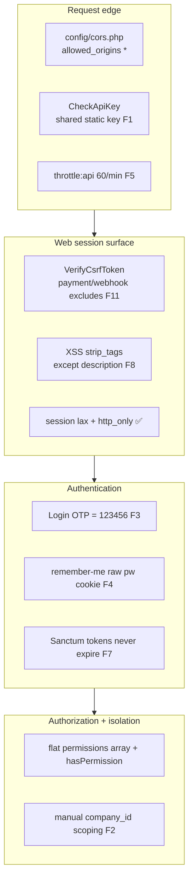
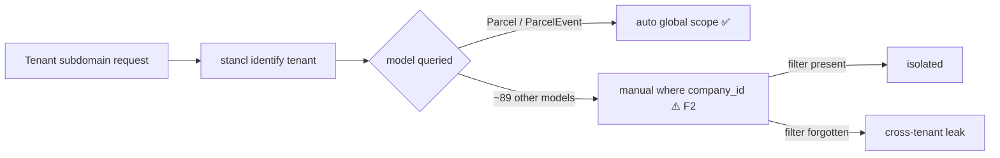

# 17 — Security Review

> **Phase 15** of the Rushly platform documentation. A code-grounded security
> review of the Rushly backend (`/var/www/rushly-saas` — the SSOT, see
> [_CONTEXT_BRIEF.md](_CONTEXT_BRIEF.md)). Every Flutter app is a **client** of
> the API reviewed here; their posture is inherited from this backend.
>
> Scope: authentication, authorization, input validation, CSRF, XSS, SQL
> injection, mass assignment, file uploads, secrets/env handling, sensitive
> data, rate limiting, and multi-tenant isolation.
>
> Method: existing repo docs (esp. [10-Authentication.md](10-Authentication.md))
> read first as primary sources, then verified against actual code. Findings cite
> the exact file. **No secret values are reproduced** — only the fact that a value
> is hard-coded / committed, plus its location.
>
> Cross-refs: [05-System-Architecture.md](05-System-Architecture.md),
> [06-Database.md](06-Database.md), [07-Laravel.md](07-Laravel.md),
> [09-API.md](09-API.md), [10-Authentication.md](10-Authentication.md),
> [14-Integrations.md](14-Integrations.md).

---

## 1. Executive summary

Rushly's security model is **conventional Laravel** in most places (session +
Sanctum auth, framework CSRF, Eloquent parameterisation, FormRequest validation)
but carries a set of **pilot-grade shortcuts and one architectural risk** that
should be closed before/at production hardening.

The single most important structural fact: **tenancy is a shared-database,
`company_id`-scoped model** (the `DatabaseTenancyBootstrapper` is commented out
in `config/tenancy.php`). Only **2 of ~120 models** carry an automatic tenant
global scope; the other ~89 tenant-owned models rely on **manual per-query
`->where('company_id', settings()->id)`**. Isolation is therefore only as strong
as the discipline of each query.

### 1.1 Prioritised findings

| # | Severity | Finding | Where |
|---|---|---|---|
| F1 | 🔴 High | **Shared API key is hard-coded in the repo** (`'…rx-ecourier123456'`), not env-driven — identical across every install, committed to source. | `config/rxcourier.php:90`, `app/Http/Middleware/CheckApiKeyMiddleware.php` |
| F2 | 🔴 High | **Tenant isolation is manual `company_id` filtering** on ~89 models; only `Parcel`/`ParcelEvent` auto-scope. A forgotten filter = cross-tenant data leak. | `config/tenancy.php` (DB bootstrapper off), `app/Models/Backend/Parcel.php:81` |
| F3 | 🟠 Med-High | **Login OTP is a fixed `123456`** ("TEMP dev OTP for pilot") — no real 2FA when `login_otp` flag is on. | `app/Http/Controllers/Auth/LoginController.php` (`currentOtpCode`) |
| F4 | 🟠 Med-High | **"Remember me" stores the raw password in a 24h cookie** (`userpassword`) alongside `useremail`. | `app/Http/Controllers/Auth/LoginController.php::login` |
| F5 | 🟠 Medium | **Mobile login endpoints have no dedicated brute-force throttle** beyond `throttle:api` (60/min); credential-stuffing on `merchant_id`/`driver_id`+password is viable. | `routes/api.php`, `app/Providers/RouteServiceProvider.php:65` |
| F6 | 🟠 Medium | **`ParcelImageService` does no validation and preserves the client extension** under `public/`. `signatureImage` uploads are **unvalidated**. | `app/Services/ParcelImageService.php`, `app/Repositories/Parcel/ParcelRepository.php:2057` |
| F7 | 🟠 Medium | **Non-expiring Sanctum tokens** (`expiration => null`) — revocation is explicit-only. | `config/sanctum.php:49` |
| F8 | 🟡 Low-Med | **Global `XSS` middleware `strip_tags` on all input except `description`** — blunt (mutates every field incl. passwords/JSON) yet leaves a deliberate raw-HTML hole (`description`). | `app/Http/Middleware/XSS.php` |
| F9 | 🟡 Low-Med | **`Tenant` model `$guarded = []`** — fully mass-assignable; `User.$fillable` includes `user_type`. | `app/Models/Tenant.php:13`, `app/Models/User.php:35` |
| F10 | 🟡 Low | **Wildcard CORS** on `api/*` (`allowed_origins ['*']`, methods `['*']`, headers `['*']`). Mitigated by `supports_credentials=false` + token auth. | `config/cors.php` |
| F11 | 🟡 Low | **Payment IPN/return URLs excluded from CSRF**; security depends on gateway-side signature verification (not always evident). Salla webhooks are HMAC-verified (good). | `app/Http/Middleware/VerifyCsrfToken.php` |
| F12 | 🟡 Low | **`.env.example` ships `APP_DEBUG=true`, `APP_ENV=local`** — must be flipped in production or stack traces/secrets leak. | `.env.example` |

Legend: 🔴 High · 🟠 Medium · 🟡 Low. "High" = exploitable or cross-tenant impact
with low effort; "Medium" = real weakness needing a specific precondition; "Low" =
hardening / defence-in-depth.



---

## 2. Authentication

The mechanics (guards, OTP flow, Sanctum endpoints, socialite) are documented in
full in [10-Authentication.md](10-Authentication.md). This section covers only the
**security posture** of those mechanisms.

### 2.1 Shared API key — hard-coded, committed (F1) 🔴

Every API route group sits behind `CheckApiKeyMiddleware`
(`app/Http/Middleware/CheckApiKeyMiddleware.php`), which compares the `apiKey`
header to `config('rxcourier.api_key')`:

```php
// app/Http/Middleware/CheckApiKeyMiddleware.php
if ($request->header('apiKey') == \Config::get('rxcourier.api_key')) { return $next($request); }
return $this->responseWithError('Invalid Api Key', [], 400);
```

The config value is a **literal string in the repository**, not `env()`-driven:

```php
// config/rxcourier.php:90
'api_key' => '…rx-ecourier123456'   // value redacted — it is a committed constant
```

Consequences:
- The key is **identical on every deployment** and **present in source control**.
- It is a plaintext `==` (loose) comparison — not `hash_equals`, so subject to
  timing analysis (minor next to the fact that the value is public).
- It gates the *external ingest* endpoints too (`/api/v10/external/{salla,zid,
  woocommerce}` — see [14-Integrations.md](14-Integrations.md)), so it is the only
  wall in front of order-injection for storefront webhooks that don't carry their
  own HMAC.

**Recommendation:** move to `env('RXCOURIER_API_KEY')` with no committed default,
rotate the value, and switch the comparison to `hash_equals`. Consider per-tenant
or per-client keys (the pattern already exists for public tracking — see §2.4).

### 2.2 Login OTP is a fixed code (F3) 🟠

`LoginController::currentOtpCode()` returns the literal `'123456'` ("TEMP: fixed
dev OTP for pilot access", per its own comment). When `FEATURE_LOGIN_OTP` is on,
the elaborate email-OTP flow in `LoginOtpController` (5-attempt cap, 5-min expiry,
hashed payload in session) is defeated because every code is `123456`. The flag
**defaults OFF** (`config/features.php`), so the default build has no OTP step at
all. Full detail in [10-Authentication.md §5](10-Authentication.md).

**Recommendation:** replace the fixed return with `random_int(100000, 999999)`
before enabling the flag in any tenant.

### 2.3 "Remember me" stores the raw password (F4) 🟠

`LoginController::login()` queues cookies `useremail` **and `userpassword`**
(the raw request password) for 1440 minutes when `remember` is checked. Cookies
are encrypted at rest by `EncryptCookies`, but the plaintext password still
round-trips the client and lives 24h in a cookie — a credential-in-cookie
pattern distinct from Laravel's hashed remember-token. See
[10-Authentication.md §4.2](10-Authentication.md).

**Recommendation:** remove the `userpassword` cookie entirely; rely on Laravel's
built-in remember-token (`remember_web_*`), which stores only a hashed selector.

### 2.4 API auth guards

| Guard | Where | Posture |
|---|---|---|
| `auth:sanctum` bearer tokens | `config/sanctum.php`, `routes/api.php` | Tokens **never expire** (`expiration => null`, F7). `refresh`/`logout` revoke **all** of a user's tokens. |
| `CheckApiKey` | §2.1 | Shared static key (F1). |
| `CheckAdminRole` | `CheckAdminRoleMiddleware` | `user_type ∈ {ADMIN, SUPER_ADMIN, INCHARGE, HUB}` gate on admin API. Good. |
| `VerifyPublicTrackingApiKey` | `app/Http/Middleware/VerifyPublicTrackingApiKey.php` | **Best-in-repo pattern:** per-tenant keys looked up via `findByPlaintext`, optional `allowed_origins` allow-list, `hash_equals`-grade lookup, revocable. |
| `salla.webhook` | `app/Salla/Http/Middleware/VerifyWebhook.php` | **HMAC-SHA256 with `hash_equals`** (see §5.2). Good. |

`EnsureFrontendRequestsAreStateful` is **commented out** in `app/Http/Kernel.php`
— the API is a pure token API; the Inertia/React admin runs on the `web` session
group. This is coherent (no cookie-based SPA-Sanctum path to mis-configure).

**Recommendation (F7):** set a finite `sanctum.expiration` (e.g. 30 days) and/or a
`prune-expired` schedule so a leaked token isn't valid forever.

### 2.5 Password reset

Web uses the standard broker (`password_reset_tokens`, 60-min expiry, 60-sec
throttle, `config/auth.php`). API `POST /api/v10/password/email` is throttled
`5,1` — the **one** endpoint with a dedicated rate limit. Admin-created users get
no plaintext password; the recipient uses the forgot-password flow. Good.

---

## 3. Authorization

### 3.1 Model: flat permission array, no Policies

Rushly does **not** use Gates/Policies (`AuthServiceProvider::$policies = []`, no
`app/Policies/`). Authorization is a **JSON string array on `users.permissions`**,
checked by the `hasPermission($key)` helper and the `hasPermission:<key>` route
middleware (`PermissionCheckMiddleware`). Six `UserType` constants form the coarse
role hierarchy. Full model in [10-Authentication.md §8](10-Authentication.md).

Security-relevant properties:
- **Deny-by-default & null-safe:** a user with `permissions = NULL` is treated as
  unauthorised (guarded `is_array()` check), not a 500.
- **Copy-at-create:** a role's permissions are **copied onto the user row** at
  create/update (`app/Repositories/User/UserRepository.php`), so editing a role
  does not retroactively re-authorise existing users. `users.permissions` is the
  runtime source of truth.
- **`user_type` reject-after-auth:** mobile login checks the password first, then
  rejects the wrong `user_type` with a generic message — avoids type enumeration
  (`AuthController`). Good.

### 3.2 FormRequest `authorize()` is uniformly `true`

Across all 107 `authorize()` methods in `app/Http/Requests/*`, **every one returns
`true`** (0 return false). Authorization is therefore **entirely delegated to route
middleware** (`hasPermission:<key>`), never to the request object. This is
internally consistent but means:
- There is **no object-level ownership check in the request layer** — e.g. a
  `Parcel/UpdateRequest` does not itself verify the parcel belongs to the caller's
  tenant/merchant. That check must exist in the controller/repository (see F2).

**Recommendation:** for tenant-owned resources, add ownership assertions in the
controller (or restore the auto tenant scope, §4) rather than trusting the route
key alone, since a valid permission key does not prove the *specific record*
belongs to the caller.

---

## 4. Multi-tenant isolation (F2) 🔴

This is the highest-leverage area. The context brief describes
`stancl/tenancy` subdomain identification — that is true for **routing/identity**,
but **data isolation is not database-per-tenant**:

```php
// config/tenancy.php  — bootstrappers
'bootstrappers' => [
    // Stancl\Tenancy\Bootstrappers\DatabaseTenancyBootstrapper::class,  // ← OFF
    Stancl\Tenancy\Bootstrappers\CacheTenancyBootstrapper::class,
    Stancl\Tenancy\Bootstrappers\FilesystemTenancyBootstrapper::class,
    Stancl\Tenancy\Bootstrappers\QueueTenancyBootstrapper::class,
];
```

The database bootstrapper is commented out ⇒ **one shared MySQL database**, and
tenant rows are separated by a **`company_id` column** (`settings()->id`).

### 4.1 Only 2 models auto-scope

A repo-wide search finds `addGlobalScope('tenant', …)` in **exactly two models**:
`app/Models/Backend/Parcel.php:81` and `app/Models/Backend/ParcelEvent.php`. Their
scope is a good template:

```php
// app/Models/Backend/Parcel.php  (booted())
static::addGlobalScope('tenant', function ($query) {
    if (!function_exists('tenant') || !tenant() || !tenant()->company_id) { return; }
    $query->where($table.'.company_id', (int) tenant()->company_id);
});
```

Every **other** tenant-owned model (~89 reference `company_id`, e.g. wallets,
statements, invoices, merchants, hubs, salaries, payments) relies on the developer
**remembering** to add `->where('company_id', settings()->id)` on each query
(pattern seen at `Parcel.php:410` and throughout the repositories). A single
missing filter — especially in a hand-written report query, an export, or a raw
builder — is a **cross-tenant read/write**.



### 4.2 Login-time isolation (partial mitigation)

`LoginController` does enforce tenant boundaries at authentication:
- Central domain (`127.0.0.1`/`localhost`) accepts **only SUPER_ADMIN**.
- Tenant subdomain rejects any user whose `company_id != settings()->id`.
- `credentials()` pins `company_id = settings()->id` on tenant subdomains.

So a user is *authenticated* into the correct tenant. The residual risk is that,
once inside, **query-level scoping is manual** for most models.

**Recommendations (in priority order):**
1. Promote the `Parcel` tenant global-scope pattern into a reusable
   `BelongsToTenant` trait and apply it to every `company_id`-bearing model.
2. Add an automated test that fails if a `company_id` model is queried without the
   scope while a tenant is active.
3. Longer term, evaluate enabling `DatabaseTenancyBootstrapper` (true DB-per-tenant)
   for hard isolation.

---

## 5. CSRF & XSS

### 5.1 CSRF

Standard `VerifyCsrfToken` on the `web` group; `same_site => 'lax'`,
`http_only => true`, `secure => env('SESSION_SECURE_COOKIE')` (`config/session.php`)
— sane defaults. The exclusion list (`app/Http/Middleware/VerifyCsrfToken.php`) is:

```
/success /cancel /fail /ipn /pay-via-ajax
/admin/payout/{success,cancel,fail,ipn,pay-via-ajax}
/aamarpay-{success,fail}
/subscription/{success,cancel}
/webhooks/salla  /integrations/salla/webhook
```

- **Payment gateway returns/IPNs (F11):** these are third-party server-to-server
  or redirect callbacks that legitimately can't carry a CSRF token. The safety of
  excluding them depends on **each handler verifying the gateway's own signature /
  transaction lookup**. This should be audited per gateway (see
  [14-Integrations.md](14-Integrations.md)); the exclusion itself is standard.
- **Salla webhooks:** excluded from CSRF but **HMAC-verified** — good (§5.2).

### 5.2 Salla webhook HMAC (good pattern)

`app/Salla/Http/Middleware/VerifyWebhook.php` supports two strategies and uses
constant-time comparison:

```php
$expected = hash_hmac('sha256', $request->getContent(), $secret);
if (! hash_equals($expected, $signature)) { $rejection = 'invalid_signature'; }
// token strategy also uses hash_equals($secret, Authorization header)
abort(401, …);   // and abort(500) if the per-tenant secret is unconfigured
```

### 5.3 XSS (F8)

Two layers:
1. **Output encoding (primary, effective):** the admin/merchant UI is Inertia +
   React (`resources/js/Pages/*.jsx`) which escapes by default; Blade `{{ }}`
   escapes. This is the real XSS defence.
2. **Global input `strip_tags` (blunt):** `app/Http/Middleware/XSS.php` runs
   `strip_tags` recursively over **all** request input **except `description`**:

```php
$input = $request->except(['description']);
array_walk_recursive($input, fn(&$v) => $v = strip_tags($v));
$request->merge($input);
```

Issues:
- It **mutates every field** including passwords and structured data — a password
  or address containing `<` is silently corrupted, and this is a fragile,
  easily-bypassed sanitiser (not context-aware).
- The **`description` exception is a deliberate raw-HTML sink**: whatever is stored
  there is *not* stripped, so any surface that renders `description` as HTML
  (Blade `{!! !!}`, React `dangerouslySetInnerHTML`) is a stored-XSS candidate.

**Recommendation:** rely on output-side encoding; if rich text is needed for
`description`, sanitise on **output** with an allow-list (e.g. HTMLPurifier) at the
render point, and drop the global input mutation (or restrict it to known
free-text fields) to avoid data corruption.

> ⚠️ **Doc vs Code — the `Cors` middleware is a no-op.** `app/Http/Middleware/Cors.php`
> just calls `return $next($request)` — CORS is actually governed by Laravel's
> `HandleCors` + `config/cors.php` (§8). The custom class in the global stack does
> nothing.

---

## 6. SQL injection

Data access is overwhelmingly **Eloquent / query-builder**, which parameterises
bindings. A repo scan finds **71 raw-SQL call sites** (`whereRaw`, `selectRaw`,
`orderByRaw`, `havingRaw`, `DB::select`, `DB::statement`) across `app/`. A targeted
scan of controllers for **request-interpolated** raw SQL (`whereRaw(...$request...)`
etc.) returned **no obvious hits** — the raw usages seen are constant expressions
(e.g. `request_count + 1` in `VerifyPublicTrackingApiKey`, aggregate `selectRaw`s).

**Residual risk / recommendation:** the 71 raw sites are not individually audited
here. Any that interpolate `$request` input, a sort column, or a tenant/merchant id
directly into the SQL string should use bindings (`whereRaw('x = ?', [$v])`) or a
column allow-list. Prioritise report/export/search endpoints, which historically
concatenate dynamic `ORDER BY`/`WHERE`.

---

## 7. Mass assignment (F9)

Baseline is healthy: **88 models declare `$fillable`**, and the **27 models that
declare neither `$fillable` nor `$guarded`** inherit Laravel's default
`$guarded = ['*']` — i.e. **fully guarded**, so `Model::create($request->all())`
throws `MassAssignmentException` and attributes must be set explicitly. That is
*safe* (if verbose).

The concerns are the few permissive declarations:

| Model | Declaration | Risk |
|---|---|---|
| `app/Models/Tenant.php:13` | `$guarded = []` | **Everything mass-assignable.** Tenant creation is super-admin-only, so exposure is low, but any handler doing `Tenant::create($request->all())` could set arbitrary columns. |
| `app/Models/User.php:35` | `$fillable` includes **`user_type`** | `user_type` is mass-assignable ⇒ **privilege-escalation surface** if any create/update path uses `User::create($request->all())` / `->update($request->all())`. In practice `UserRepository` sets `user_type` and `permissions` **explicitly** (`$user->user_type = …`), and **`permissions` is *not* fillable** (cannot be mass-assigned). So the current code is safe, but the fillable is a latent hazard. |
| Zatca models | `$guarded = ['id']` | Fine (only `id` protected) — acceptable. |

**Recommendations:** give `Tenant` an explicit `$fillable`; remove `user_type`
from `User.$fillable` (set it explicitly as the repository already does); keep
`permissions`, `company_id`, `role_id`, `status`, `verification_status` out of any
model's `$fillable`.

---

## 8. File uploads (F6)

Two upload paths exhibit **opposite** hygiene — the KB path is the model to copy.

### 8.1 KB screenshot upload — strong ✅

`app/Http/Controllers/Backend/AdminKnowledgeBaseController.php`:

```php
$request->validate([
    'screenshot' => ['required','image','mimes:png,jpg,jpeg,webp','max:5120'],
]);
// then RE-ENCODES via GD to a fixed .png (strips any embedded payload):
imagecreatefrom{png,jpeg,webp}(...); imagepng($img, $dest, 6);
```

Validation **plus GD re-encode to a canonical PNG** — this neutralises polyglot /
embedded-script images and forces the stored file type. Excellent.

### 8.2 Parcel image / signature upload — weak (F6) 🟠

`app/Services/ParcelImageService.php` (namespace `App\Services`, file under
`app/Http/Services/`) does **no validation** and **trusts the client extension**:

```php
$name = now()->format('YmdHis').'_'.uniqid().'.'.$file->getClientOriginalExtension();
$file->move(public_path($this->basePath), $name);   // → public/uploads/parcel/...
```

Files land under **`public/`** (web-served) with a **client-controlled extension**.
Safety depends entirely on the **caller** validating:

- **Delivered images — validated:** `DeliverymanController@…` validates
  `'images.*' => 'image|max:20480'` (the `image` rule enforces a real image MIME).
  Acceptable, though the `image` rule accepts SVG, which can carry script if ever
  served inline.
- **`signatureImage` — NOT validated:** `ParcelRepository.php:2057` calls
  `uploadSingle($request->file('signatureImage'), …)` and **no `mimes`/`image`/
  `max` rule for `signatureImage` was found** in the requests or controllers. A
  caller could upload an arbitrary file (e.g. `.php`, `.html`, `.svg`) that is then
  stored under a web-accessible `public/uploads/parcel/…` path with its original
  extension.

**Recommendations:**
1. Enforce `image|mimes:jpg,jpeg,png,webp|max:…` for **every** upload field
   including `signatureImage`, at the validation layer.
2. Re-encode uploads through GD/Imagick like the KB path, or store outside
   `public/` and serve via a controller (so uploaded content is never directly
   executable/servable).
3. Never derive the stored filename extension from `getClientOriginalExtension()`
   — pin it from the validated MIME.

---

## 9. Secrets & environment handling

| Item | Observation | Note |
|---|---|---|
| `config/rxcourier.php:90` | API key is a **committed literal** (F1). | Move to env, rotate. |
| `.env.example` | `APP_DEBUG=true`, `APP_ENV=local` (F12). | Fine as an example; **must** be `false`/`production` in prod or stack traces leak. |
| `.env.example` secret keys | Present as **empty placeholders**: `APP_KEY`, `DB_PASSWORD`, `MAIL_PASSWORD`, `REDIS_PASSWORD`, `PUSHER_APP_SECRET`, `AWS_SECRET_ACCESS_KEY`, `SHOPIFY_API_SECRET`. | Correct — no real secrets committed in the example. |
| `SANCTUM_STATEFUL_DOMAINS` / `SESSION_DOMAIN` / `SESSION_SECURE_COOKIE` | Not in `.env.example`. | Fall back to framework defaults; ensure `SESSION_SECURE_COOKIE=true` in production (cookies are `http_only` + `lax` already). |
| Payment/accounting/SMS provider secrets | Read from `globalSettings()` / per-tenant config or env (Stripe, PayPal, Razorpay, Twilio, Qoyod/Daftra/Odoo). | Stored per-tenant in DB — ensure those columns are not exposed in API/Inertia props. |

No secret values are reproduced in this document.

---

## 10. Sensitive data handling

- **`User.$hidden = ['password', 'remember_token']`** (`app/Models/User.php:64`) —
  never serialised. Good.
- **Activity log restraint:** `User::getActivitylogOptions()` logs **only `name`
  and `email`** (`logOnly(['name','email'])`) — no password/permission churn in the
  audit trail. Good.
- **Remember-me cookie (F4):** the one place a raw credential is persisted
  client-side. See §2.3.
- **PII in parcels:** `customer_name`, `customer_phone`, `customer_address`,
  `pickup_phone` live on `parcels` and are tenant-scoped (auto global scope, §4.1)
  — a positive: the most PII-heavy table is one of the two auto-scoped models.

---

## 11. Rate limiting (F5)

| Surface | Limit | Where |
|---|---|---|
| Whole `api` group | **60 req/min** per `user()->id ?: ip()` | `app/Providers/RouteServiceProvider.php:65` (`RateLimiter::for('api')`) |
| API password reset email | `throttle:5,1` (5/min) | `routes/api.php:242` |
| Web login | Framework `ThrottlesLogins` (5 attempts/min, from `AuthenticatesUsers`) | `LoginController` (trait) |
| Password reset broker | 60-sec throttle | `config/auth.php` |
| **Mobile `signin` / `deliveryman/login` / `admin/login`** | **No dedicated throttle** — only the shared 60/min | `routes/api.php` |
| **Public tracking API** | No throttle middleware; key row bumps `request_count` but does not rate-limit | `VerifyPublicTrackingApiKey` |

**Gap:** the mobile login endpoints allow **~60 credential attempts/min per IP**
with no login-specific `throttle:5,1` and no lockout. Combined with numeric
`merchant_id`/`driver_id` identifiers, this is a viable credential-stuffing /
enumeration surface.

**Recommendations:** add `throttle:5,1` (or a stricter named limiter keyed on
`ip + login`) to `signin`, `deliveryman/login`, `admin/login`, and
`otp-verification`/`resend-otp`; add a modest limiter to the public tracking
endpoints to protect the shared DB from key-scan abuse.

---

## 12. What's already done well

To keep the review balanced, these are genuine strengths in the code:

1. **Deny-by-default authz** with null-safe permission checks (§3.1).
2. **Login-time tenant pinning** — central=SUPER_ADMIN-only, tenant subdomain
   rejects mismatched `company_id` (§4.2).
3. **Reject-after-auth `user_type`** on mobile login (no type enumeration).
4. **Public-tracking key middleware** — per-tenant, revocable, origin allow-list.
5. **Salla webhook HMAC** with `hash_equals` (§5.2).
6. **KB upload re-encode** — the gold-standard upload path (§8.1).
7. **Delivered-image validation** (`image|max:20480`).
8. **Sane session cookie flags** (`http_only`, `same_site=lax`).
9. **`User.$hidden`** + minimal activity-log fields (§10).
10. **Mostly parameterised** data access (Eloquent) — no obvious request-interpolated raw SQL (§6).

---

## 13. Consolidated remediation plan

| Priority | Action | Finding |
|---|---|---|
| P0 | Move `rxcourier.api_key` to env (no committed default), rotate, `hash_equals`. | F1 |
| P0 | Introduce a `BelongsToTenant` global-scope trait; apply to all `company_id` models; add a leak-detection test. | F2 |
| P1 | Replace fixed `123456` OTP with `random_int` before enabling `login_otp` anywhere. | F3 |
| P1 | Remove the `userpassword` remember-me cookie; use the hashed remember-token. | F4 |
| P1 | Add `throttle:5,1`/named limiter to all mobile + admin login and OTP endpoints. | F5 |
| P1 | Validate `signatureImage` (and any un-validated upload); re-encode uploads; pin extension from MIME; consider serving from outside `public/`. | F6 |
| P2 | Set a finite Sanctum `expiration` + prune schedule. | F7 |
| P2 | Sanitise `description` on output (allow-list) instead of the global input `strip_tags`; stop mutating credentials/JSON. | F8 |
| P2 | Give `Tenant` an explicit `$fillable`; drop `user_type` from `User.$fillable`. | F9 |
| P3 | Tighten `config/cors.php` `allowed_origins` to known app/admin origins. | F10 |
| P3 | Confirm every CSRF-excluded payment callback verifies a gateway signature/lookup. | F11 |
| P3 | Ensure production `.env` sets `APP_DEBUG=false`, `APP_ENV=production`, `SESSION_SECURE_COOKIE=true`. | F12 |

---

## 14. Cross-references

- Auth mechanics (guards, OTP flow, Sanctum endpoints, permission catalogue) — [10-Authentication.md](10-Authentication.md)
- Multi-tenancy routing & central-vs-tenant model — [05-System-Architecture.md](05-System-Architecture.md)
- Tables (`users`, `roles`, `permissions`, `public_tracking_api_keys`, `parcels`) — [06-Database.md](06-Database.md)
- Middleware pipeline & providers — [07-Laravel.md](07-Laravel.md)
- API surface & endpoints — [09-API.md](09-API.md)
- Webhook / gateway integrations (payment CSRF excludes, Salla HMAC) — [14-Integrations.md](14-Integrations.md)

---

## Sources

Files actually opened for this review:

- `config/rxcourier.php`, `config/cors.php`, `config/session.php`, `config/sanctum.php`, `config/tenancy.php`, `config/features.php`
- `.env.example`
- `app/Http/Middleware/XSS.php`
- `app/Http/Middleware/VerifyCsrfToken.php`
- `app/Http/Middleware/Cors.php`
- `app/Http/Middleware/CheckApiKeyMiddleware.php`
- `app/Http/Middleware/VerifyPublicTrackingApiKey.php`
- `app/Http/Middleware/CheckAdminRoleMiddleware.php` (via 10-Authentication.md)
- `app/Http/Kernel.php` (via 10-Authentication.md; `EnsureFrontendRequestsAreStateful` commented out)
- `app/Services/ParcelImageService.php` (file at `app/Http/Services/ParcelImageService.php`)
- `app/Repositories/Parcel/ParcelRepository.php` (image/signature upload calls, lines ~2039–2058)
- `app/Http/Controllers/Api/V10/DeliverymanController.php` (delivered/not-delivered image validation)
- `app/Http/Controllers/Backend/AdminKnowledgeBaseController.php` (KB screenshot re-encode)
- `app/Http/Controllers/Auth/LoginController.php` (fixed OTP, remember-me cookie, tenant pinning — via 10-Authentication.md)
- `app/Salla/Http/Middleware/VerifyWebhook.php` (HMAC)
- `app/Models/User.php` (`$fillable`, `$hidden`, activity log)
- `app/Models/Tenant.php` (`$guarded = []`)
- `app/Models/Backend/Parcel.php` (tenant global scope), `app/Models/Backend/ParcelEvent.php`
- `app/Models/Backend/Zatca/*` (`$guarded = ['id']`)
- `app/Repositories/User/UserRepository.php` (explicit `user_type`/`permissions` assignment)
- `app/Http/Requests/**` (107 FormRequests; all `authorize()` return `true`)
- `app/Providers/RouteServiceProvider.php` (`RateLimiter::for('api')` = 60/min)
- `routes/api.php` (throttle usage), `routes/tenant.php`
- `docs/10-Authentication.md`, `docs/_CONTEXT_BRIEF.md`

_Negative results verified:_ no `addGlobalScope('tenant', …)` outside `Parcel`/
`ParcelEvent`; no `signatureImage` `mimes`/`image` validation rule found; no
obvious request-interpolated raw SQL in controllers.
