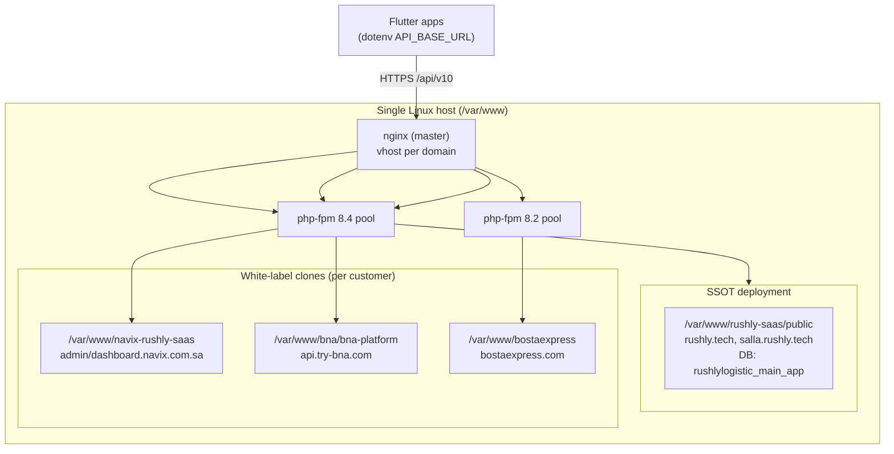
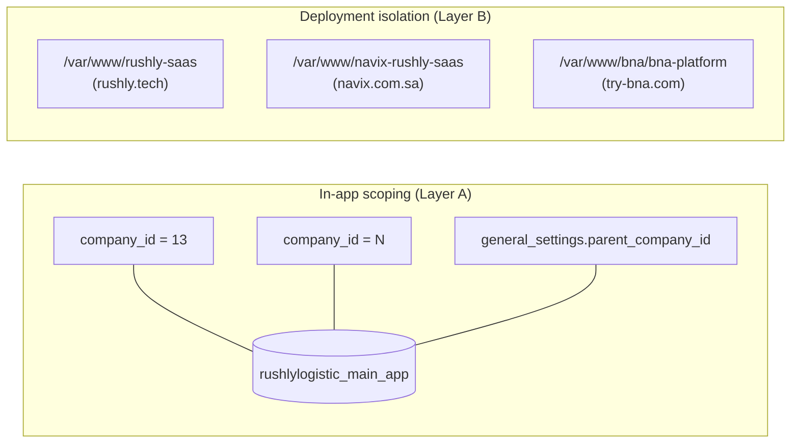

# 18 — Deployment & Infrastructure

> **Scope.** How the Rushly platform (`rushly-saas`) and its client apps are built,
> served, provisioned, migrated, scheduled, and stored in production. Grounded in the
> actual codebase and the live server configuration on the host that serves
> `rushly.tech`. Where the code implies one model but the running server does another,
> both are reported.
>
> Cross-links: [05-System-Architecture.md](05-System-Architecture.md) ·
> [06-Database.md](06-Database.md) · [07-Laravel.md](07-Laravel.md) ·
> [08-Flutter.md](08-Flutter.md) · [09-API.md](09-API.md) ·
> [10-Authentication.md](10-Authentication.md) · [14-Integrations.md](14-Integrations.md)

---

## 0. TL;DR — how it actually deploys

`rushly-saas` is a **classic bare-metal Laravel 10 deployment**: code is placed under
`/var/www/rushly-saas`, `nginx` serves `public/` and hands `.php` to `php-fpm` over a
Unix socket. There is **no containerization and no CI/CD pipeline in the repository**
(no `Dockerfile`, no `.github/`, no `.gitlab-ci.yml` — see §1).

The single most important — and most counter-intuitive — finding:

> **Multi-tenancy in production is delivered by cloning the whole application per
> customer (separate directories, databases, and nginx vhosts), NOT by the
> `stancl/tenancy` database/domain tenancy that the code ships with.** The
> `stancl/tenancy` scaffolding is installed but effectively **dormant** — its database
> bootstrapper, tenant routes, and provisioning jobs are all commented out. In-app
> scoping is done with a `company_id` / `parent_company_id` column model inside a
> **single shared database**. See §4.



---

## 1. What is present vs. what is assumed

| Concern | Status | Evidence |
|---|---|---|
| Dockerfile / docker-compose | **Not found in the current codebase** | no `Dockerfile*`, `docker-compose*` at repo root |
| CI/CD (`.github/`, `.gitlab-ci.yml`, Jenkins, etc.) | **Not found in the current codebase** | no `.github/` directory; no CI config files |
| Laravel Sail | dev-dependency present, unused in prod | `laravel/sail` in `composer.json` `require-dev` |
| Web server | **nginx + php-fpm** (live) | `/etc/nginx/sites-available/rushly.tech`; `ps` shows `nginx: master` + `php-fpm 8.4` |
| Apache/cPanel | **vestigial only** | `.htaccess` has cPanel `ea-php83` handler block, but production is nginx |
| Build tooling | Composer + npm/Vite (present) | `composer.json`, `package.json`, `vite.config.js`, built `public/build/manifest.json` |
| Queue worker (rushly-saas) | **Not running / not configured** | `QUEUE_CONNECTION=sync`; supervisor worker exists only for `rushly-store` |
| Scheduler cron (rushly-saas) | **Not installed on this host** | root crontab has `schedule:run` for `rushly-store`, `bna-platform`, `hani-yousif` — not `rushly-saas` |
| TLS | Let's Encrypt / Certbot | `ssl_certificate .../letsencrypt/live/...` in vhosts |
| Deployment automation script | **Not found in the current codebase** | `scripts/` holds only `dump-routes.php`, `verify-inertia-pages.sh` |

> **⚠️ Doc vs Code — README "Laravel 12".** `README.md` claims Laravel 12; `composer.json`
> pins `laravel/framework: ^10.10`. **Code wins: this is Laravel 10.** See
> [07-Laravel.md](07-Laravel.md). PHP requirement is `^8.1`; the live host runs the app
> under **php-fpm 8.4** (`/run/php/php8.4-fpm.sock`).

---

## 2. Build systems

### 2.1 PHP / Composer

`composer.json` is a stock Laravel skeleton with the module dependencies layered on
(tenancy, sanctum, inertia, ziggy, payment SDKs, twilio/vonage, mpdf, milon/barcode,
maatwebsite/excel, spatie/activitylog, salla oauth). Relevant to deployment:

- `config.optimize-autoloader: true` — production installs should run
  `composer install --no-dev --optimize-autoloader`.
- Composer **scripts** (`composer.json` lines 66–80) run `package:discover` on autoload
  dump, `vendor:publish --tag=laravel-assets` on update, and `.env`/`key:generate`
  bootstrap on fresh project creation. There is **no** custom build/deploy composer
  script.
- A global helper is force-loaded via `autoload.files`: `app/Http/Helper/Helper.php`.

Canonical production PHP build steps (standard for this stack; not scripted in-repo):

```bash
composer install --no-dev --optimize-autoloader
php artisan config:cache   # optional; see §7 note on APP_DEBUG
php artisan route:cache
php artisan view:cache
php artisan migrate --force
php artisan storage:link
```

### 2.2 JavaScript / Vite

- `package.json` scripts: `dev` → `vite`, `build` → `vite build`. No lint/test scripts.
- `vite.config.js` uses `laravel-vite-plugin` + `@vitejs/plugin-react`. **Inputs are a
  single merchant bundle**: `resources/css/merchant.css` and `resources/js/merchant.jsx`
  (the Inertia/React merchant surface). Aliases: `@ → resources/js`, `ziggy → vendor/tightenco/ziggy`.
- Production build output is committed/served at **`public/build/`** with a fingerprinted
  `manifest.json` (verified: `public/build/manifest.json` ~218 KB, `public/build/assets/*.js`
  present). No `public/hot` file exists in prod, i.e. the app is running against built
  assets, not the Vite dev server.
- nginx does **not** add long-cache headers for `/build/` on the `rushly.tech` vhost
  (the `rushly.store` vhost does — see §3.3). Vite fingerprints filenames, so immutable
  caching would be safe to add.

```bash
npm ci
npm run build     # emits public/build/{manifest.json,assets/*}
```

> The frontend is mid-migration Blade → React+Inertia (`docs/inertia/`). Blade views
> under `resources/views/` are still served directly and need no build step; only the
> merchant Inertia bundle is Vite-built. See [16-UI-UX.md](16-UI-UX.md).

### 2.3 Flutter clients

All eight Flutter apps (`rushly-admin-app`, `rushly-driver-app`, `rushly-fleet-app`,
`rushly-merchant-app`, `rushly-scanner-app`, `rushly-sorting-app`,
`rushly-supervisor-app`, `rushly-warehouse-app`) are standard Flutter projects built with
`flutter build apk` / `flutter build appbundle` / `flutter build ipa`. They are
**clients** of `rushly-saas`; they are not deployed to the server. See
[08-Flutter.md](08-Flutter.md).

Android build config (verified on `rushly-driver-app`, `android/app/build.gradle`):

| Setting | Value |
|---|---|
| `applicationId` | `com.rushly.driver` |
| `minSdk` / `targetSdk` | `23` / `34` |
| Java/Kotlin target | `17` |
| `multiDexEnabled` | `true` |
| Release `minifyEnabled` / `shrinkResources` | `true` / `true` (ProGuard) |
| `versionCode` / `versionName` | from `flutter.versionCode` / `flutter.versionName` |
| Push | `com.google.firebase:firebase-messaging` (BOM 33.1.2) |

> **⚠️ Signing.** The release build type is signed with the **debug** signing config
> (`android/app/build.gradle`: `release { signingConfig signingConfigs.debug }`). This is
> Flutter's template default and is **not release-signable for the Play Store** as-is — a
> real upload keystore + `key.properties` must be wired before publishing. No
> `key.properties` is present in the repo.

**Runtime tenant/host targeting (how a Flutter app picks which deployment to talk to):**
`rushly-driver-app/lib/core/config/env.dart` loads a bundled `.env` via
`flutter_dotenv` and resolves:

- `API_BASE_URL` (default `https://api.rushly-logistic.com/api/v10`)
- `API_KEY` (default `123456rx-ecourier123456`) — a shared static header key
- `TENANT_HOST_SUFFIX` (default `rushly-logistic.com`) — the "workspace name" mode:
  a user typing `acme` yields `https://acme.rushly-logistic.com/api/v10`.

The chosen base URL is persisted per-install in secure storage
(`lib/core/storage/tenant_storage.dart`) and drives the API client
(`lib/core/api/providers.dart`). This subdomain-per-tenant convention is what the
**server-side white-label clones** (§4) satisfy — each customer runs at its own host.

> iOS bundle identifier was **not found** via `ios/Runner.xcodeproj/project.pbxproj`
> in the driver app grep; iOS signing/provisioning is **Not found in the current codebase**
> (managed in Xcode/App Store Connect, not in the repo).

---

## 3. Server model (live)

### 3.1 nginx + php-fpm

The host runs a single `nginx` master with worker processes and multiple `php-fpm`
masters (versions **8.2, 8.3, 8.4** each have a `www.conf` pool). Verified via `ps`:
`nginx: master process` + `php-fpm: master process (/etc/php/8.4/fpm/php-fpm.conf)`.

The `rushly-saas` SSOT is served by two vhosts, both rooted at
`/var/www/rushly-saas/public` and both proxying PHP to `unix:/run/php/php8.4-fpm.sock`:

- `rushly.tech` (`/etc/nginx/sites-available/rushly.tech`) — `server_name rushly.tech www.rushly.tech *.rushly.tech`, HTTP→HTTPS 301, standard Laravel `try_files $uri $uri/ /index.php?$query_string`.
- `salla.rushly.tech` (`/etc/nginx/sites-available/salla.rushly.tech`) — the Salla bridge entrypoint, same root.

```nginx
# /etc/nginx/sites-available/rushly.tech (abridged)
server { listen 80; server_name rushly.tech www.rushly.tech *.rushly.tech;
         return 301 https://$host$request_uri; }
server {
  listen 443 ssl http2;
  server_name rushly.tech www.rushly.tech *.rushly.tech;
  root /var/www/rushly-saas/public;
  ssl_certificate     /etc/letsencrypt/live/salla.rushly.tech/fullchain.pem;
  ssl_certificate_key /etc/letsencrypt/live/salla.rushly.tech/privkey.pem;
  location / { try_files $uri $uri/ /index.php?$query_string; }
  location ~ \.php$ { include snippets/fastcgi-php.conf; fastcgi_pass unix:/run/php/php8.4-fpm.sock; }
  location ~ /\.ht { deny all; }
}
```

> **⚠️ TLS cert mismatch risk.** The `rushly.tech` vhost (which also claims the
> wildcard `*.rushly.tech`) presents the certificate issued for **`salla.rushly.tech`**.
> Unless that cert has SANs for `rushly.tech`/`*.rushly.tech`, subdomain hosts other than
> `salla.rushly.tech` will present a name-mismatched certificate. Worth verifying the
> issued SAN list.

### 3.2 `.htaccess` is vestigial

`public/.htaccess` (repo root `.htaccess`) contains standard Laravel rewrites **plus** a
cPanel-generated `AddHandler application/x-httpd-ea-php83 .php` block and `<Files>` deny
rules for `.env/.md/.lock/artisan`. Under nginx these Apache directives are **inert**.
They indicate the app was originally deployed on cPanel/Apache and later moved to nginx.
Under nginx the equivalent protections come from `root` pointing at `public/` and the
`location ~ /\.ht { deny all; }` rule.

### 3.3 Sibling deployments on the same box (for contrast)

- `rushly.store` (`rushly-store`, a separate storefront app — see [01-Workspace-Inventory.md](01-Workspace-Inventory.md)) has a **richer, hardened** vhost: security headers, gzip, immutable `/build/` caching, `^~ /packages/` and `^~ /themes/` static aliases with PHP execution denied, `client_max_body_size 128M`, `fastcgi_read_timeout 300`. It is the template of what a production-grade `rushly-saas` vhost could look like.
- Multiple customer white-label roots are present (see §4).

---

## 4. Multi-tenancy & provisioning — the real model

### 4.1 What the code ships (`stancl/tenancy` — largely dormant)

`config/tenancy.php` configures `stancl/tenancy ^3.7`:

- `tenant_model = App\Models\Tenant`, UUID IDs (`Stancl\Tenancy\UUIDGenerator`).
- `central_domains = ['127.0.0.1', 'localhost']`.
- `App\Models\Tenant` (`app/Models/Tenant.php`) implements `TenantWithDatabase`, uses
  `HasDatabase, HasDomains`, and adds a custom `company_id` column.
- `migration_parameters` point tenant migrations at `database_path('migrations/tenant')`.

But every mechanism that would make it a live multi-database, multi-domain system is
**disabled**:

| Mechanism | State | Evidence |
|---|---|---|
| `DatabaseTenancyBootstrapper` (per-tenant DB) | **commented out** | `config/tenancy.php` bootstrappers list — only Cache, Filesystem, Queue active |
| Tenant provisioning jobs (`CreateDatabase`, `MigrateDatabase`, `SeedDatabase`) | **commented out** | `app/Providers/TenancyServiceProvider.php` `TenantCreated` JobPipeline is empty |
| Tenant routes (`InitializeTenancyByDomain`) | **entirely commented out** | `routes/tenant.php` group is `//`-disabled |
| `database/migrations/tenant/` directory | **does not exist** | tenant migration path is empty |
| Domain-based route registration | central only | `app/Providers/RouteServiceProvider.php` registers `api`/`web`/`admin`/`superadmin` on the central app, not `tenant.php` |
| `tenant_id` columns across schema | **1 migration only** | grep of `database/migrations/` |

`DeleteDatabase` is still wired on `TenantDeleted` (`shouldBeQueued(false)`), but with no
tenant DBs created, it is a no-op in practice.

> **⚠️ Doc vs Code — "per-subdomain identification, UUID tenant IDs".** The
> `_CONTEXT_BRIEF.md` / config describe `{tenant}.rushly.tech` subdomain tenancy with
> UUID tenant IDs and per-tenant databases. **In the running system this is not active:**
> the `stancl/tenancy` database bootstrapper, tenant routes, and provisioning jobs are all
> commented out, and no per-tenant databases exist. Treat subdomain/DB tenancy as
> **scaffolding retained for a future migration**, not current behavior.

### 4.2 What actually isolates tenants — two real layers

**Layer A — In-app "company" scoping (single shared database).** Isolation inside one DB
(`rushlylogistic_main_app`) is by company id, not `stancl` tenant:

- `general_settings.parent_company_id` — added by
  `database/migrations/2026_07_05_100002_add_parent_company_id_to_general_settings.php`;
  its comment: *"Company (general_settings.id) that created this tenant. NULL = created by
  super-admin."*
- Integration credentials are scoped per company: `integration_settings.company_id` with a
  `UNIQUE (company_id, platform)` constraint —
  `database/migrations/2026_06_25_010001_scope_integration_settings_to_tenant.php`
  ("Each tenant manages their own Salla / Zid / etc. credentials"). Its backfill assigns
  legacy global rows to a demo tenant (`company_id=13`, overridable via
  `INTEGRATIONS_BACKFILL_COMPANY_ID`).
- Numerous domain tables carry `company_id` (e.g. `add_company_id_to_parcels_3pl`,
  `add_company_id_to_parcel_events`). See [06-Database.md](06-Database.md).

**Layer B — Per-customer white-label deployments (separate app + DB + vhost).** Each
paying customer gets its own clone of the application on the same host. Verified from
`/etc/nginx/sites-available/`:

| Customer host(s) | Document root | php-fpm |
|---|---|---|
| `rushly.tech`, `salla.rushly.tech` (SSOT) | `/var/www/rushly-saas/public` | 8.4 |
| `admin.navix.com.sa`, `dashboard.navix.com.sa` | `/var/www/navix-rushly-saas/public` | 8.4 |
| `api.try-bna.com` | `/var/www/bna/bna-platform/public` | 8.4 |
| `bostaexpress.com` | `/var/www/bostaexpress/` | 8.2 |

Each clone has its own `.env`, its own MySQL database, and its own scheduler cron (e.g.
`bna-platform` has a `schedule:run` line — §6). This is how "acme.rushly-logistic.com"
style tenant hosts (that the Flutter apps target, §2.3) are satisfied in practice.



> **Provisioning a new tenant is therefore an operational (ops) task, not an application
> feature:** clone the codebase, create a database, seed it, write an nginx vhost, issue a
> cert, and install a scheduler cron. There is **no in-app "create tenant" flow that
> spins up a database** in the current codebase (the `stancl` jobs that would do it are
> commented out). Within a single deployment, new "companies" are created as
> `general_settings` rows with a `parent_company_id`.

---

## 5. Database & migrations

- **Central connection:** `DB_CONNECTION=mysql`, live database
  `rushlylogistic_main_app` (from the deployed `.env`).
  `config/tenancy.php` sets `database.central_connection = env('DB_CONNECTION','central')`.
- **Migrations:** `database/migrations/` holds **191 migrations** (per
  `_CONTEXT_BRIEF.md`), applied with the standard `php artisan migrate --force`. There is
  **no** `migrations/tenant/` set, so `php artisan tenants:migrate` has nothing to run.
- **Seeders:** `database/seeders/DatabaseSeeder.php` orchestrates ~40 seeders (roles,
  permissions, config, countries/currencies, demo merchants/parcels, tours, etc.) —
  `php artisan db:seed`. `config/tenancy.php` `seeder_parameters` reference the same root
  `DatabaseSeeder`.
- **Fresh install (single deployment):**

```bash
php artisan migrate --force
php artisan db:seed --force        # roles, permissions, config, demo data
php artisan storage:link
```

See [06-Database.md](06-Database.md) for the schema and the `company_id` scoping detail.

---

## 6. Scheduler / cron

`app/Console/Kernel.php` defines the schedule (all central-DB commands, since there is one
DB):

| Command | Cadence | Source command |
|---|---|---|
| `database:autobackup` | daily | `app/Console/Commands/DatabaseAutoBackup.php` |
| `invoice:generate` | daily 13:00 | `app/Console/Commands/Invoice.php` |
| `shipments:detect-abnormal` | hourly | `DetectAbnormalShipments.php` |
| `wms:sla-check` | every 30 min | `WmsFulfillmentSlaCheck.php` |
| `wms:min-stock-check` | daily 07:00 | `WmsMinStockCheck.php` |
| `wms:expiry-alert` | daily 08:00 | `WmsExpiryAlert.php` |
| `wms:auto-fulfillment` | every 15 min | `WmsAutoFulfillment.php` |
| `aramex:sync-tracking` | every 15 min, `withoutOverlapping` | `AramexSyncTracking.php` |
| `jet:sync-tracking` | every 15 min, `withoutOverlapping` | `JetSyncTracking.php` |
| `shipping:sync-tracking` | every 5 min, `withoutOverlapping` | `ShippingSyncTracking.php` (generic module — supersedes `logestechs:sync-tracking`) |
| `commerce:prune-logs` | daily 03:00, `withoutOverlapping` | `CommercePruneLogs.php` |
| `shipping:prune-logs` | daily 03:15, `withoutOverlapping` | `ShippingPruneLogs.php` |

Driving the scheduler requires the one-minute system cron:

```cron
* * * * * cd /var/www/rushly-saas && php artisan schedule:run >> storage/logs/schedule.log 2>&1
```

> **⚠️ Finding — the rushly-saas scheduler cron is NOT installed on this host.** The
> live root crontab has `schedule:run` entries for `rushly-store`, `bna-platform`, and
> `hani-yousif`, but **none for `/var/www/rushly-saas`**. As deployed here, none of the
> Kernel-scheduled jobs above (tracking sync, WMS SLA/expiry/min-stock, daily backup,
> invoice generation, log pruning) fire for the SSOT deployment. Each white-label clone
> (e.g. `bna-platform`) has its own `schedule:run`; the SSOT appears to be missing one.
> This should be treated as an operational gap, not an intended design.

`database:autobackup` (`app/Console/Commands/DatabaseAutoBackup.php`) is a hand-rolled
`mysqldump`-equivalent: it opens a raw PDO connection using `DB_*` env vars, streams
`SHOW TABLES` unbuffered (comment notes this fixed an OOM), and writes
`storage/app/backups/database_backup_on_<ts>.sql`. It emails the result (uses
`Illuminate\Support\Facades\Mail`). Because it dumps `DB_DATABASE` only, backup coverage is
per-deployment.

---

## 7. Queue workers

- **Default connection is `sync`** (`QUEUE_CONNECTION=sync` in the live `.env`; default
  from `.env.example` too). Every `dispatch()` / queued job therefore runs **inline in the
  web/CLI request**, not in a background worker. This is the operative model for
  `rushly-saas` today.
- `config/tenancy.php` enables `QueueTenancyBootstrapper`, so *if* a real queue were used,
  jobs would carry tenant context — but with `sync` this is moot.
- **No queue worker is running for `rushly-saas`.** The only supervisor program,
  `/etc/supervisor/conf.d/rushly-queue.conf`, runs `queue:work` for **`rushly-store`**
  (a different app), `numprocs=2`. `ps` confirms the running workers belong to
  `rushly-store` and `gosmle`, not `rushly-saas`.
- Implication: heavy inline work (tracking sync, bulk AWB print/export, notifications)
  executes synchronously. Moving to a real driver (`database`/`redis`) plus a supervised
  `queue:work` would require setting `QUEUE_CONNECTION` and adding a supervisor program —
  neither is present for `rushly-saas`.

> **⚠️ Finding — `APP_DEBUG=true` in production.** The live `.env` has
> `APP_ENV=production` **and** `APP_DEBUG=true`. Debug mode in production leaks stack
> traces/config. Also note that with `APP_DEBUG=true` you generally avoid `config:cache`
> surprises, but the correct fix is `APP_DEBUG=false` in production.

---

## 8. Storage & filesystems

- `FILESYSTEM_DISK=local` (live `.env`). Public assets go through the standard symlink:
  `public/storage -> /var/www/rushly-saas/storage/app/public` (verified present; created
  by `php artisan storage:link`).
- `config/tenancy.php` `FilesystemTenancyBootstrapper` would suffix `local`/`public` disk
  roots per tenant (`%storage_path%/app/`), and `asset_helper_tenancy` is on — but since
  DB tenancy is not initialized, in practice storage is a single shared tree per
  deployment.
- DB backups land in `storage/app/backups/` (§6).
- S3 is scaffolded but **off**: `AWS_*` keys are blank in `.env.example`, the `s3` disk is
  commented out in `config/tenancy.php`, and `FILESYSTEM_DISK=local`.
- Uploaded media (parcel images, avatars, labels/AWB PDFs via `mpdf`/`milon/barcode`)
  resolve through the tenant-aware `asset()`/`tenant_asset()` helpers to the local public
  disk. See [14-Integrations.md](14-Integrations.md) for label/PDF generation.

---

## 9. Environments & configuration

Config is 12-factor via `.env` (no per-environment config files in-repo). Key values:

| Key | `.env.example` (dev) | Live prod (`.env`) |
|---|---|---|
| `APP_ENV` | `local` | `production` |
| `APP_DEBUG` | `true` | `true` ⚠️ |
| `APP_URL` | `http://localhost` | `https://rushly.tech/` |
| `DB_CONNECTION` / `DB_DATABASE` | `mysql` / `laravel` | `mysql` / `rushlylogistic_main_app` |
| `QUEUE_CONNECTION` | `sync` | `sync` |
| `CACHE_DRIVER` | `file` | `file` |
| `SESSION_DRIVER` | `file` | `file` |
| `BROADCAST_DRIVER` | `log` | `log` |
| `FILESYSTEM_DISK` | `local` | `local` |
| `FEATURE_COMMERCE_LAYER` | `false` | (gated; see `config/features.php`) |

- **Cache/session are file-based**, not Redis (Redis env vars exist but
  `CACHE_DRIVER=file`; `RedisTenancyBootstrapper` is commented out and needs phpredis).
- **Broadcasting is `log`** (no Pusher configured; `PUSHER_*` blank) — real-time features
  are effectively disabled/logged. See [09-API.md](09-API.md).
- Feature flags live in `config/features.php`: `commerce_layer` (`FEATURE_COMMERCE_LAYER`,
  default off) and `login_otp` (`FEATURE_LOGIN_OTP`, default off). See
  [10-Authentication.md](10-Authentication.md) and [11-Modules.md](11-Modules.md).
- Per-tenant integration credentials (Salla/Zid/etc.) are **not** in `.env` after the
  scoping migration — they live in `integration_settings` keyed by `company_id` (§4.2),
  managed by `app/Providers/IntegrationConfigServiceProvider.php`.
- Secrets present in `.env`: `SHOPIFY_API_SECRET`, Salla OAuth, mail, SMS (Twilio/Vonage),
  payment gateway keys. These are per-deployment.

---

## 10. Reference: end-to-end deploy of a new white-label tenant (ops runbook)

Reconstructed from the observed live topology (§4.2) — **not** a scripted flow in the repo:

```mermaid
sequenceDiagram
  participant Ops
  participant Host as Linux host
  participant MySQL
  participant nginx
  participant Certbot
  Ops->>Host: clone rushly-saas → /var/www/<tenant>-rushly-saas
  Ops->>Host: composer install --no-dev -o ; npm ci && npm run build
  Ops->>Host: cp .env, set APP_URL/DB_*/keys ; php artisan key:generate
  Ops->>MySQL: CREATE DATABASE <tenant_db>
  Ops->>Host: php artisan migrate --force ; db:seed --force ; storage:link
  Ops->>nginx: add vhost (root .../public, fastcgi php-fpm)
  Ops->>Certbot: issue Let's Encrypt cert for the host
  Ops->>Host: crontab: * * * * * schedule:run  (and, if async, supervisor queue:work)
```

Steps that are **currently skipped/misconfigured** and should be part of the runbook:
install the `schedule:run` cron for `rushly-saas` (§6), set `APP_DEBUG=false` (§7/§9), and
decide whether a real queue driver + worker is needed (§7).

---

## Sources

Files and locations actually opened for this document:

- **Build:** `composer.json`, `package.json`, `vite.config.js`, `public/build/manifest.json`, `public/build/assets/`
- **Bootstrap/routing:** `artisan`, `app/Console/Kernel.php`, `app/Providers/RouteServiceProvider.php`, `app/Providers/TenancyServiceProvider.php`, `routes/tenant.php`, `routes/console.php`, `config/app.php` (providers)
- **Tenancy/DB:** `config/tenancy.php`, `app/Models/Tenant.php`, `app/Models/CustomerDomain.php`, `database/migrations/2026_07_05_100002_add_parent_company_id_to_general_settings.php`, `database/migrations/2026_06_25_010001_scope_integration_settings_to_tenant.php`, `database/migrations/` (listing), `database/seeders/` (listing)
- **Scheduler/queue:** `app/Console/Commands/` (listing), `app/Console/Commands/DatabaseAutoBackup.php`
- **Web server (live host):** `/etc/nginx/sites-available/rushly.tech`, `/etc/nginx/sites-available/salla.rushly.tech`, `/etc/nginx/sites-enabled/rushly.store`, `/etc/nginx/sites-available/{admin,dashboard,wms}.navix.com.sa`, `/etc/nginx/sites-available/api.try-bna.com`, `/etc/nginx/sites-available/bostaexpress.com`, `.htaccess`, `ps aux` (nginx/php-fpm), `/etc/php/{8.2,8.3,8.4}/fpm/pool.d/`
- **Ops (live host):** root crontab (`schedule:run` entries), `/etc/supervisor/conf.d/rushly-queue.conf`, `public/storage` symlink
- **Env:** `.env.example`, live `.env` (selected keys)
- **Flutter:** `rushly-driver-app/pubspec.yaml`, `rushly-driver-app/android/app/build.gradle`, `rushly-driver-app/lib/core/config/env.dart`, `rushly-driver-app/lib/core/api/providers.dart`, `rushly-driver-app/lib/core/storage/tenant_storage.dart`
- **Docs cross-checked:** `docs/_CONTEXT_BRIEF.md`, `README.md`, `ARCHITECTURE.md`
