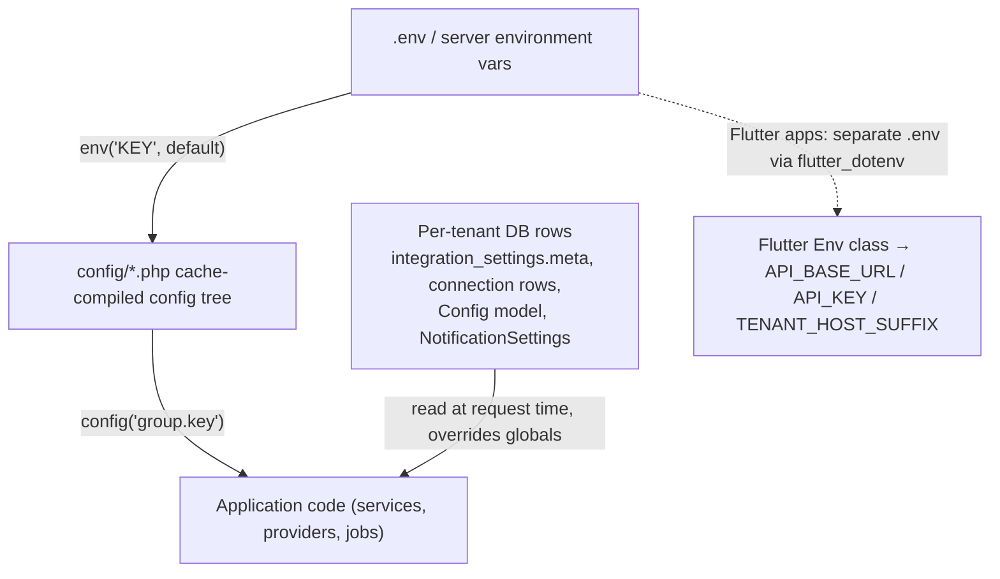
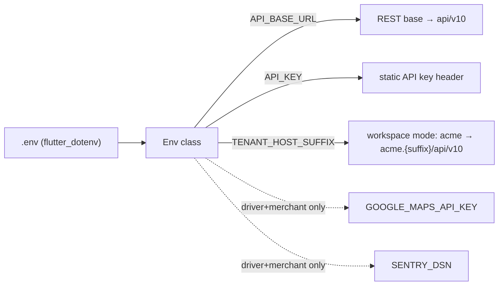

# 19 — Environment Configuration Reference

> Scope: every `config/*.php` file in `rushly-saas` and the `.env` keys they read,
> grouped by concern, plus the Flutter client env layer (`lib/core/config/env.dart`).
> `rushly-saas` (`/var/www/rushly-saas`) is the single source of truth; the Flutter
> apps are clients that only need three variables each.
>
> **No real secret values are printed here.** Where a value is a credential, this doc
> names the key and its default (from source), never a live secret.

Related docs: [05-System-Architecture.md](05-System-Architecture.md) ·
[06-Database.md](06-Database.md) · [07-Laravel.md](07-Laravel.md) ·
[08-Flutter.md](08-Flutter.md) · [10-Authentication.md](10-Authentication.md) ·
[14-Integrations.md](14-Integrations.md) · [17-Security.md](17-Security.md) ·
[shipping-architecture.md](shipping-architecture.md).

---

## 1. How configuration is layered

Rushly's runtime configuration is resolved in three layers, from most to least dynamic:

Three important architectural facts drive this reference:

1. **Global env keys are the *fallback / platform default* layer.** Many
   integrations (Salla OAuth, courier connections, Zatca, accounting) moved to
   **per-tenant database storage**. The `env`/`config` values are only defaults
   or single-tenant fallbacks. This is called out per section.
2. **`.env.example` is intentionally minimal.** It ships only the stock Laravel
   skeleton plus `SHOPIFY_API_SECRET` and `FEATURE_COMMERCE_LAYER`
   (`.env.example`). The large majority of env keys consumed by `config/*.php`
   are **not** documented in `.env.example` — see [§14 Gaps](#14-gaps--doc-vs-code).
3. **Zatca has no env keys at all.** `app/Services/Zatca/*` contains zero
   `env()` / `config()` calls — credentials are per-tenant (DB). See [§12](#12-zatca-saudi-e-invoicing).

### Config file inventory (`config/`, 29 files)

| File | Lines | Concern | Reads env? |
|---|---|---|---|
| `app.php` | 220 | App identity, providers, aliases | ✅ |
| `auth.php` | 115 | Guards / providers (web only) | — |
| `barcode.php` | 5 | milon/barcode store path | — |
| `broadcasting.php` | 71 | Pusher / Ably broadcast | ✅ |
| `cache.php` | 111 | Cache stores | ✅ |
| `commerce.php` | 65 | Commerce module (Salla provider) | ✅ |
| `cors.php` | 37 | CORS paths/origins | — |
| `database.php` | 151 | DB + Redis connections | ✅ |
| `env-editor.php` | 46 | geekcafe/stylemix env-editor UI | — |
| `excel.php` | 333 | maatwebsite/excel | — |
| `features.php` | 27 | Feature flags | ✅ |
| `filesystems.php` | 76 | Disks (local/public/s3) | ✅ |
| `fulfillment.php` | 37 | Fulfillment strategy registry | ✅ |
| `hashing.php` | 52 | bcrypt/argon | ✅ |
| `logging.php` | 131 | Log channels | ✅ |
| `mail.php` | 125 | Mailers | ✅ |
| `merchantpayment.php` | 50 | Merchant payout method catalog | — |
| `paypal.php` | 25 | PayPal (srmklive) | ✅ |
| `pdf.php` | 35 | mpdf | — |
| `queue.php` | 109 | Queue connections | ✅ |
| `rxcourier.php` | 92 | Legacy COD/delivery pricing + API key | — (hardcoded) |
| `salla.php` | 13 | Salla API base (platform default) | ✅ |
| `sanctum.php` | 67 | Sanctum stateful domains / guard | ✅ |
| `services.php` | 157 | Third-party service creds (couriers, OAuth, SMS-none) | ✅ |
| `session.php` | 201 | Session driver/cookie | ✅ |
| `shipping.php` | 62 | Shipping module (Logestechs provider) | ✅ |
| `tenancy.php` | 199 | stancl/tenancy | ✅ |
| `toastr.php` | 21 | Toast notifications | — |
| `view.php` | 36 | Blade view paths | — |

---

## 2. App (`config/app.php`)

Core application identity and the Laravel bootstrap (providers/aliases). Env keys:

| Env key | Default | Purpose | Source |
|---|---|---|---|
| `APP_NAME` | `Laravel` | Display name; also feeds cache/redis prefixes | `config/app.php:19` |
| `APP_INSTALLED` | *(none)* | **Custom** install-guard flag (non-stock Laravel key) consumed at boot | `config/app.php:20` |
| `APP_ENV` | `production` | Environment name | `config/app.php:32` |
| `APP_DEBUG` | `false` | Debug mode (stack traces). `.env.example` sets `true` for local | `config/app.php:45` |
| `APP_URL` | `http://localhost` | Canonical URL (CLI URL generation, asset base) | `config/app.php:58` |
| `ASSET_URL` | *(none)* | CDN/asset host override | `config/app.php:59` |
| `APP_KEY` | *(none)* | **Required** 32-byte encryption key (`base64:...`) | `config/app.php:124` |

`APP_KEY` also drives session cookie encryption and Sanctum cookie encryption
(see [10-Authentication.md](10-Authentication.md), [17-Security.md](17-Security.md)).

**Providers of note** registered in `config/app.php`:
`App\Providers\ZatcaServiceProvider::class` — ZATCA (Saudi e-invoicing) Phase 1
(`config/app.php:184`). See [§12](#12-zatca-saudi-e-invoicing).

Hashing (`config/hashing.php`): `BCRYPT_ROUNDS` (default `10`, `config/hashing.php:32`).

---

## 3. Database (`config/database.php`)

Default connection `DB_CONNECTION` = `mysql` (`config/database.php:18`). Full key list:

| Env key | Default | Purpose |
|---|---|---|
| `DB_CONNECTION` | `mysql` | Active connection (also used by queue + tenancy central) |
| `DATABASE_URL` | *(none)* | Single-DSN override (applies to sqlite/mysql/pgsql/sqlsrv) |
| `DB_HOST` | `127.0.0.1` (mysql/pgsql) / `localhost` (sqlsrv) | DB host |
| `DB_PORT` | `3306` (mysql) / `5432` (pgsql) / `1433` (sqlsrv) | DB port |
| `DB_DATABASE` | `forge` (server DBs) / `database.sqlite` (sqlite) | Schema name |
| `DB_USERNAME` | `forge` | DB user |
| `DB_PASSWORD` | `''` | DB password |
| `DB_SOCKET` | `''` | Unix socket (mysql) |
| `DB_FOREIGN_KEYS` | `true` | sqlite FK enforcement |
| `MYSQL_ATTR_SSL_CA` | *(none)* | MySQL TLS CA bundle path |
| `DB_ENCRYPT` | `yes` | sqlsrv encryption |
| `DB_TRUST_SERVER_CERTIFICATE` | `false` | sqlsrv cert trust |

`config/database.php:41` — `env('DB_DATABASE', database_path('database.sqlite'))`.

**Redis** (`config/database.php:124-146`):

| Env key | Default | Purpose |
|---|---|---|
| `REDIS_CLIENT` | `phpredis` | Redis client |
| `REDIS_CLUSTER` | `redis` | Cluster mode |
| `REDIS_PREFIX` | `Str::slug(APP_NAME)_database_` | Key prefix |
| `REDIS_URL` | *(none)* | DSN override |
| `REDIS_HOST` | `127.0.0.1` | Host |
| `REDIS_USERNAME` / `REDIS_PASSWORD` | *(none)* | Auth |
| `REDIS_PORT` | `6379` | Port |
| `REDIS_DB` | `0` | Default DB index |
| `REDIS_CACHE_DB` | `1` | Cache DB index |

> **Multi-tenancy note:** tenant databases are created dynamically as
> `tenant<uuid>` (`config/tenancy.php:54`, `prefix=tenant`, `suffix=''`). The
> `DB_CONNECTION` acts as the tenancy central connection — see [§8](#8-tenancy).
> Schema detail lives in [06-Database.md](06-Database.md).

---

## 4. Cache (`config/cache.php`)

Default store `CACHE_DRIVER` = `file` (`config/cache.php:18`). Stores defined:
`apc, array, database, file, memcached, redis, dynamodb, octane`.

| Env key | Default | Purpose |
|---|---|---|
| `CACHE_DRIVER` | `file` | Active cache store |
| `CACHE_PREFIX` | `Str::slug(APP_NAME)_cache_` | Cache key prefix (`config/cache.php:109`) |
| `MEMCACHED_PERSISTENT_ID` | *(none)* | Memcached persistent connection id |
| `MEMCACHED_USERNAME` / `MEMCACHED_PASSWORD` | *(none)* | SASL auth |
| `MEMCACHED_HOST` | `127.0.0.1` | Memcached host |
| `MEMCACHED_PORT` | `11211` | Memcached port |
| `AWS_ACCESS_KEY_ID` / `AWS_SECRET_ACCESS_KEY` | *(none)* | DynamoDB cache creds |
| `AWS_DEFAULT_REGION` | `us-east-1` | DynamoDB region |
| `DYNAMODB_CACHE_TABLE` | `cache` | DynamoDB table |
| `DYNAMODB_ENDPOINT` | *(none)* | Custom DynamoDB endpoint |

> **Tenant-aware caching:** `CacheTenancyBootstrapper` is enabled
> (`config/tenancy.php:32`), tagging every cache entry with `tenant<id>`
> (`tag_base='tenant'`, `config/tenancy.php:91`). Cache is isolated per tenant
> without changing the driver.

---

## 5. Queue (`config/queue.php`)

Default `QUEUE_CONNECTION` = `sync` (`config/queue.php:16`) — **jobs run inline
by default**. Connections: `sync, database, beanstalkd, sqs, redis`.

| Env key | Default | Purpose |
|---|---|---|
| `QUEUE_CONNECTION` | `sync` | Active queue connection |
| `DB_CONNECTION` | `mysql` | Backing DB for `database` queue + failed-jobs |
| `REDIS_QUEUE` | `default` | Redis queue name |
| `SQS_PREFIX` | `https://sqs.us-east-1.amazonaws.com/your-account-id` | SQS URL prefix |
| `SQS_QUEUE` | `default` | SQS queue |
| `SQS_SUFFIX` | *(none)* | SQS queue suffix |
| `AWS_ACCESS_KEY_ID` / `AWS_SECRET_ACCESS_KEY` | *(none)* | SQS creds |
| `AWS_DEFAULT_REGION` | `us-east-1` | SQS region |
| `QUEUE_FAILED_DRIVER` | `database-uuids` | Failed-jobs driver |

> **Module-specific queues** override the connection/name per subsystem so a
> misbehaving provider can't starve other tenants:
>
> | Module | Connection env | Name env | Default name |
> |---|---|---|---|
> | Commerce | `COMMERCE_QUEUE_CONNECTION` | `COMMERCE_QUEUE_NAME` | `commerce` (`config/commerce.php:38`) |
> | Shipping | `SHIPPING_QUEUE_CONNECTION` | `SHIPPING_QUEUE_NAME` | `shipping` (`config/shipping.php:31`) |
> | Fulfillment | `FULFILLMENT_QUEUE_CONNECTION` | `FULFILLMENT_QUEUE_NAME` | `fulfillment` (`config/fulfillment.php:33`) |
>
> Each defaults its connection to `config('queue.default')`. With
> `QUEUE_CONNECTION=sync` these queues still execute inline; set a real driver
> (`redis`/`database`) in production for these to matter.
>
> `QueueTenancyBootstrapper` is enabled (`config/tenancy.php:34`) so queued jobs
> re-initialize the originating tenant context.

---

## 6. Tenancy (`config/tenancy.php`) — stancl/tenancy v3

| Setting | Value | Source |
|---|---|---|
| `tenant_model` | `App\Models\Tenant` | `config/tenancy.php:9` |
| `id_generator` | `Stancl\Tenancy\UUIDGenerator` (UUID tenant IDs) | `config/tenancy.php:10` |
| `central_domains` | `127.0.0.1`, `localhost` | `config/tenancy.php:19-22` |
| DB `central_connection` | `env('DB_CONNECTION', 'central')` | `config/tenancy.php:42` |
| tenant DB naming | `prefix=tenant`, `suffix=''` → `tenant<uuid>` | `config/tenancy.php:54-55` |
| bootstrappers | Cache, Filesystem, Queue (Database + Redis bootstrappers commented out) | `config/tenancy.php:31-35` |
| filesystem suffix | `tenant<id>` on `local`, `public` disks; `suffix_storage_path=true` | `config/tenancy.php:98-129` |
| migrations | `database/migrations/tenant`, `--force=true` | `config/tenancy.php:186-189` |

The only env key here is `DB_CONNECTION` (`config/tenancy.php:42`), whose literal
fallback is the string `central`. Sanctum stateful domains (below) intersect with
the subdomain identification model. Tenant identification is by subdomain
(`{tenant}.rushly.tech` in prod per the context brief) with central domains listed above.

> ⚠️ **Doc vs Code:** `README.md` describes the stack as "Laravel 12". The
> `composer.json` pins `laravel/framework ^10.10` — **code wins, this is Laravel 10.**
> stancl/tenancy is `^3`, sanctum `^3`. Verify in `composer.json`.

---

## 7. Session (`config/session.php`) & Sanctum (`config/sanctum.php`)

Session (`config/session.php`):

| Env key | Default | Purpose |
|---|---|---|
| `SESSION_DRIVER` | `file` | Session store (`.env.example`=`file`) |
| `SESSION_LIFETIME` | `120` | Minutes |
| `SESSION_CONNECTION` | *(none)* | DB/Redis connection for session |
| `SESSION_STORE` | *(none)* | Cache store when driver is cache-backed |
| `SESSION_DOMAIN` | *(none)* | Cookie domain |
| `SESSION_SECURE_COOKIE` | *(none)* | HTTPS-only cookie |
| `APP_NAME` | `laravel` | Feeds the session cookie name |

Sanctum (`config/sanctum.php`):

| Env key | Default | Purpose |
|---|---|---|
| `SANCTUM_STATEFUL_DOMAINS` | `localhost,localhost:3000,127.0.0.1,127.0.0.1:8000,::1` + current app URL | SPA cookie-auth domains (`config/sanctum.php:18`) |

- Sanctum `guard` = `['web']`; `expiration` = `null` (tokens never expire)
  (`config/sanctum.php:36,49`). Mobile apps use bearer personal-access tokens.
- Auth guards (`config/auth.php`): only the stock `web` (session) guard/provider
  is defined — there is no dedicated `api` guard entry; Sanctum handles API auth.
  See [10-Authentication.md](10-Authentication.md).

---

## 8. Mail (`config/mail.php`)

| Env key | Default | Purpose |
|---|---|---|
| `MAIL_MAILER` | `smtp` | Default mailer |
| `MAIL_URL` | *(none)* | DSN override |
| `MAIL_HOST` | `smtp.mailgun.org` | SMTP host (`.env.example`=`mailpit`) |
| `MAIL_PORT` | `587` | SMTP port (`.env.example`=`1025`) |
| `MAIL_ENCRYPTION` | `tls` | Encryption |
| `MAIL_USERNAME` / `MAIL_PASSWORD` | *(none)* | SMTP creds |
| `MAIL_EHLO_DOMAIN` | *(none)* | EHLO domain |
| `MAIL_SENDMAIL_PATH` | `/usr/sbin/sendmail -bs -i` | sendmail transport |
| `MAIL_LOG_CHANNEL` | *(none)* | `log` mailer channel |
| `MAIL_FROM_ADDRESS` | `hello@example.com` | Default From address |
| `MAIL_FROM_NAME` | `Example` | Default From name |

Mailer-provider creds in `config/services.php`:

| Env key | Default | Purpose |
|---|---|---|
| `MAILGUN_DOMAIN` | *(none)* | Mailgun domain (`config/services.php:18`) |
| `MAILGUN_SECRET` | *(none)* | Mailgun API secret |
| `MAILGUN_ENDPOINT` | `api.mailgun.net` | Mailgun endpoint |
| `POSTMARK_TOKEN` | *(none)* | Postmark token |
| `AWS_ACCESS_KEY_ID` / `AWS_SECRET_ACCESS_KEY` / `AWS_DEFAULT_REGION` | `us-east-1` | SES creds |

> `login_otp` (see [§13](#13-feature-flags)) emails a 6-digit code to staff, so a
> working mailer is a prerequisite for that flag.

---

## 9. Filesystems, Broadcasting & Logging

### Filesystems (`config/filesystems.php`)

`FILESYSTEM_DISK` default `local` (`config/filesystems.php:16`). Disks: `local`,
`public`, `s3`. S3 keys: `AWS_ACCESS_KEY_ID`, `AWS_SECRET_ACCESS_KEY`,
`AWS_DEFAULT_REGION`, `AWS_BUCKET`, `AWS_URL`, `AWS_ENDPOINT`,
`AWS_USE_PATH_STYLE_ENDPOINT` (default `false`). The `public` URL uses `APP_URL`
(`config/filesystems.php:42`). `local`/`public` are tenant-suffixed (§6).

### Broadcasting (`config/broadcasting.php`)

`BROADCAST_DRIVER` default `null` in code (`config/broadcasting.php:18`);
`.env.example` sets `log`. Pusher/Ably keys:

| Env key | Default | Purpose |
|---|---|---|
| `PUSHER_APP_KEY` / `PUSHER_APP_SECRET` / `PUSHER_APP_ID` | *(none)* | Pusher app creds |
| `PUSHER_HOST` | *(none)* | Self-hosted Pusher host |
| `PUSHER_PORT` | `443` | Port |
| `PUSHER_SCHEME` | `https` | Scheme |
| `PUSHER_APP_CLUSTER` | `mt1` | Cluster |
| `ABLY_KEY` | *(none)* | Ably alternative |

Vite mirrors of these (`VITE_PUSHER_*`) exist for the React frontend (`.env.example:54-59`).

### Logging (`config/logging.php`)

| Env key | Default | Purpose |
|---|---|---|
| `LOG_CHANNEL` | `stack` | Default channel |
| `LOG_DEPRECATIONS_CHANNEL` | `null` | Deprecation channel |
| `LOG_LEVEL` | `debug` | Level (per channel) |
| `LOG_SLACK_WEBHOOK_URL` | *(none)* | Slack channel webhook |
| `LOG_PAPERTRAIL_HANDLER` | `SyslogUdpHandler` | Papertrail handler |
| `PAPERTRAIL_URL` / `PAPERTRAIL_PORT` | *(none)* | Papertrail endpoint |
| `LOG_STDERR_FORMATTER` | *(none)* | stderr formatter |

---

## 10. Shipping / Commerce / Fulfillment modules

These are the generic module registries (context brief §Module architecture).
Provider/strategy classes are hardcoded in the registry; env only tunes base URLs,
queues, and logging.

### Shipping (`config/shipping.php`) — see [shipping-architecture.md](shipping-architecture.md)

- Provider registry: `logestechs` → `App\Shipping\Providers\Logestechs\LogestechsProvider`.
- Env keys:
  - `LOGESTECHS_BASE_URL` (default `https://apisv2.logestechs.com/api`, `config/shipping.php:19`)
  - `LOGESTECHS_INTEGRATION_SOURCE` (default `API`, `config/shipping.php:21`)
  - `SHIPPING_QUEUE_CONNECTION` / `SHIPPING_QUEUE_NAME` (default `shipping`)
  - `SHIPPING_LOG_API` (default `true`, `config/shipping.php:56`)
- Non-env policy: retry `tries=3`, `backoff=[10,30,90]`, job timeout 60s; tracking
  sync cron `*/5 * * * *`, `batch_per_run=200`; log retention 30 days; masked
  headers `authorization, company-id, x-api-key`.

### Commerce (`config/commerce.php`) — see `COMMERCE.md`, feature-flag gated

- Provider registry: `salla` → `App\Commerce\Providers\Salla\SallaProvider`
  (handler + `SallaOrderMapper`).
- Env keys:
  - `SALLA_API_BASE` (default `https://api.salla.dev/admin/v2`, `config/commerce.php:27`)
  - `SALLA_OAUTH_AUTHORIZE_URL` (default `https://accounts.salla.sa/oauth2/auth`)
  - `SALLA_OAUTH_TOKEN_URL` (default `https://accounts.salla.sa/oauth2/token`)
  - `COMMERCE_QUEUE_CONNECTION` / `COMMERCE_QUEUE_NAME` (default `commerce`)
  - `COMMERCE_LOG_API` (default `true`, `config/commerce.php:53`)
- Retry/timeout same shape as shipping; retention 30 days; masked headers include
  `x-salla-signature`, `x-shopify-access-token`, `x-zid-signature`, etc.

### Fulfillment (`config/fulfillment.php`) — see `FULFILLMENT.md`

- Strategy registry: `merchant_self`, `wms`, `threepl_dropship` (all hardcoded FQCNs).
- Env keys:
  - `FULFILLMENT_DEFAULT_STRATEGY` (default *none* → unrouted orders stay pending
    for manual assignment, `config/fulfillment.php:29`)
  - `FULFILLMENT_QUEUE_CONNECTION` / `FULFILLMENT_QUEUE_NAME` (default `fulfillment`)

---

## 11. Salla + other storefront/courier services

### Salla (platform default) — `config/salla.php`

Only one key: `SALLA_API_BASE` (default `https://api.salla.dev/admin/v2`,
`config/salla.php:12`).

> **Per-tenant migration:** As documented in the file header
> (`config/salla.php:3-10`), Salla OAuth/webhook credentials **moved to per-tenant
> storage on 2026-06-25**. Each tenant manages its own Salla Partner app under
> *Admin → Integrations → Salla*; values land in `integration_settings.meta` and
> are read via `sallaCreds('oauth_client_id')` etc. Only platform-wide defaults
> remain in env/config. So `SALLA_*` env keys are defaults, not the live creds.

### Storefront writeback bridges — `config/services.php`

| Service | Env keys | Notes |
|---|---|---|
| `services.salla` | `RUSHLY_SALLA_APP_URL`, `RUSHLY_SALLA_WRITEBACK_TOKEN`, `SALLA_API_BASE` | AWB writeback to the `rushly-salla` bridge app |
| `services.zid` | `RUSHLY_ZID_APP_URL`, `RUSHLY_ZID_WRITEBACK_TOKEN`, `ZID_API_BASE` (default `https://api.zid.sa/v1`) | Zid bridge |
| `services.woocommerce` | `RUSHLY_WOOCOMMERCE_APP_URL`, `RUSHLY_WOOCOMMERCE_WRITEBACK_TOKEN`, `api_base=null` | Each merchant runs their own WP; env values are **single-tenant fallbacks only** — real values live on the link row (`config/services.php:150-156`, verified in `app/Services/WooCommerceService.php`) |
| `SHOPIFY_API_SECRET` | (bare env in `.env.example:61`) | Present in `.env.example`; no dedicated `config/services.php` block found |

### Courier / 3PL services — `config/services.php` (legacy per-provider, being superseded by `app/Shipping/`)

| Provider | Env keys (defaults in parens) |
|---|---|
| DeliveryPanda | `DELIVERY_PANDA_API_KEY` |
| Zajel | `ZAJEL_API_KEY`, `ZAJEL_CUSTOMER_CODE`, `ZAJEL_BASE_URL` (`https://api-stg.zajel.com/services/integration`), `ZAJEL_SERVICE_TYPE_ID` (`DDN`), `ZAJEL_WEBHOOK_SECRET` |
| Logestechs (legacy) | `LOGESTECHS_BASE_URL`, `LOGESTECHS_API_KEY` |
| iMile | `IMILE_API_KEY`, `IMILE_CUSTOMER_CODE`, `IMILE_BASE_URL`, `IMILE_COUNTRY` (`AE`) |
| Jet | `JET_USERNAME`, `JET_API_KEY`, `JET_SECRET_KEY`, `JET_ECCOMPANYID`, `JET_TRACK_PASSWORD`, `JET_CUS_NAME`, `JET_ORDER_URL`, `JET_TRACK_URL`, `JET_TARIFF_URL`, `JET_CANCEL_URL`, `JET_DEFAULT_ORIGIN_CODE` (`JKT`), `JET_SERVICE_TYPE` (`1`), `JET_EXPRESS_TYPE` (`1`) |
| Aramex | `ARAMEX_USERNAME`, `ARAMEX_PASSWORD`, `ARAMEX_VERSION` (`v1.0`), `ARAMEX_ACCOUNT_NUMBER`, `ARAMEX_ACCOUNT_PIN`, `ARAMEX_ACCOUNT_ENTITY` (`DXB`), `ARAMEX_ACCOUNT_COUNTRY_CODE` (`AE`), `ARAMEX_WSDL` (dev WSDL URL), `ARAMEX_PRODUCT_GROUP` (`DOM`), `ARAMEX_PRODUCT_TYPE` (`OND`), `ARAMEX_PAYMENT_TYPE` (`P`) |

Actual courier connections are increasingly stored per-tenant on connection rows
(e.g. `app/Services/LogestechsService.php:46` prefers the DB `base_url`, falling
back to `config('services.logestechs.base_url')`). See [14-Integrations.md](14-Integrations.md), `3PL.md`.

### OAuth login providers — `config/services.php`

| Provider | Env keys |
|---|---|
| Google | `GOOGLE_CLIENT_ID`, `GOOGLE_CLIENT_SECRET`, `GOOGLE_REDIRECT_URL` |
| Facebook | `FACEBOOK_CLIENT_ID`, `FACEBOOK_CLIENT_SECRET`, `FACEBOOK_REDIRECT_URL` |

---

## 12. Payments (`config/paypal.php` + `config/services.php`)

### PayPal (`config/paypal.php`, srmklive)

| Env key | Default | Purpose |
|---|---|---|
| `PAYPAL_MODE` | `sandbox` | `sandbox` or `live` |
| `PAYPAL_SANDBOX_CLIENT_ID` / `PAYPAL_SANDBOX_CLIENT_SECRET` | `''` | Sandbox creds |
| `PAYPAL_LIVE_CLIENT_ID` / `PAYPAL_LIVE_CLIENT_SECRET` / `PAYPAL_LIVE_APP_ID` | `''` | Live creds |
| `PAYPAL_PAYMENT_ACTION` | `Sale` | `Sale`/`Authorization`/`Order` |
| `PAYPAL_CURRENCY` | `USD` | Currency |
| `PAYPAL_NOTIFY_URL` | `''` | IPN URL |
| `PAYPAL_LOCALE` | `en_US` | Gateway locale |
| `PAYPAL_VALIDATE_SSL` | `true` | SSL validation |

(Sandbox `app_id` is hardcoded to `APP-80W284485P519543T`, `config/paypal.php:12`.)

### Stripe / PayTM (`config/services.php`)

| Provider | Env keys |
|---|---|
| Stripe | `STRIPE_SECRET` (`config/services.php:45`) |
| PayTM | `PAYTM_ENVIRONMENT` (`local`), `PAYTM_MERCHANT_ID`, `PAYTM_MERCHANT_KEY`, `PAYTM_MERCHANT_WEBSITE`, `PAYTM_CHANNEL`, `PAYTM_INDUSTRY_TYPE` |

The context brief notes additional payment libs present (Razorpay, Skrill,
Cartalyst Stripe). **No dedicated env keys for Razorpay/Skrill were found in
`config/*.php`** — those are likely configured per-tenant or per-request. Merchant
payout method catalog (bank/mobile/cash + bank list) is a static array in
`config/merchantpayment.php` (no env). Legacy COD/delivery pricing tables are
hardcoded in `config/rxcourier.php` (also holds a hardcoded `api_key` =
`123456rx-ecourier123456`, `config/rxcourier.php:90` — matches the Flutter default
`API_KEY`, see [§14](#14-flutter-client-env)).

---

## 13. SMS

> **Not found as env keys in `config/*.php`.** The context brief lists Twilio and
> Vonage libraries and an `app/Http/Services/SmsService.php`, but there is **no
> `config/sms.php`** and no SMS-provider `env()` calls in the config tree. SMS
> gateway settings are stored per-tenant (the codebase has `SmsSetup` /
> `SmsSendStatus` enums and DB-backed SMS config), not via global env. Treat SMS
> credentials as per-tenant DB configuration — see [14-Integrations.md](14-Integrations.md).

### Push notifications (FCM) — also DB-backed, not env

`app/Http/Services/PushNotificationService.php` and
`app/Models/Backend/NotificationSettings.php` handle Firebase Cloud Messaging, but
**no `FCM_*` / `FIREBASE_*` env keys exist in `config/*.php`.** FCM
service-account/server-key config is stored in `NotificationSettings` (DB) per
tenant/company. "Not found in the current codebase" for a global FCM env key.

---

## 12b. ZATCA (Saudi e-invoicing)

> **Zatca has no env keys and no dedicated config file.** `config/` contains no
> `zatca.php`, and `app/Services/Zatca/*.php` + `app/Providers/ZatcaServiceProvider.php`
> contain **zero `env()` / `config()` calls** (grep confirmed). ZATCA
> credentials/environment (compliance vs production CSID, VAT number, seller info)
> are stored **per-tenant in the database**, consistent with the platform's
> per-tenant integration pattern. The only ZATCA touchpoint in the global config
> is the provider registration `App\Providers\ZatcaServiceProvider::class`
> (`config/app.php:184`). See the context brief §Module architecture and
> [14-Integrations.md](14-Integrations.md) for the ZATCA module (TlvEncoder,
> InvoiceBuilder, QrGenerator, ZatcaService).

---

## 13. Feature flags (`config/features.php`)

Read via `config('features.<flag>')`. Convention: env key is
`FEATURE_<UPPER_SNAKE_OF_KEY>`. Both default **OFF**.

| Flag | Env key | Default | Effect | Source |
|---|---|---|---|---|
| `commerce_layer` | `FEATURE_COMMERCE_LAYER` | `false` | Gates the Commerce admin UI, webhook-ingest routes, and any code path that resolves a `CommerceProvider`. Migrations + module bindings load regardless, so schema is in place before behavior flips on. | `config/features.php:18` |
| `login_otp` | `FEATURE_LOGIN_OTP` | `false` | Two-step login: after valid email+password, **staff (Admin, SuperAdmin)** get a 6-digit code emailed to them. Merchants and deliverymen skip the challenge. | `config/features.php:25` |

`FEATURE_COMMERCE_LAYER` is the one feature flag documented in `.env.example:66`.
`FEATURE_LOGIN_OTP` is **not** in `.env.example` (see gaps). See [10-Authentication.md](10-Authentication.md) for the OTP flow.

---

## 14. Flutter client env (`lib/core/config/env.dart`)

Every Flutter app (context brief: 8 apps) shares an identical thin `Env` class
loading a `.env` via `flutter_dotenv` (`dotenv.load(fileName: '.env')`). Each app
needs only **2–4 keys**, all with hardcoded fallbacks so the app runs without a
`.env` file.

| Flutter env key | Apps | Default fallback |
|---|---|---|
| `API_BASE_URL` | all | admin: `https://api.rushly.tech/api/v10`; **all others**: `https://api.rushly-logistic.com/api/v10` |
| `API_KEY` | all | `123456rx-ecourier123456` (matches `config/rxcourier.php:90`) |
| `TENANT_HOST_SUFFIX` | all | admin: `rushly.tech`; **all others**: `rushly-logistic.com` |
| `GOOGLE_MAPS_API_KEY` | driver, merchant | *(nullable, none)* |
| `SENTRY_DSN` | driver, merchant | *(nullable, none)* |

**Per-app verified sources:**
- `rushly-admin-app/lib/core/config/env.dart` — 3 keys; distinct `rushly.tech` domain defaults.
- `rushly-driver-app/lib/core/config/env.dart` — 5 keys (adds Maps + Sentry).
- `rushly-merchant-app/lib/core/config/env.dart` — 5 keys (adds Maps + Sentry).
- `rushly-fleet-app`, `rushly-warehouse-app`, `rushly-scanner-app`,
  `rushly-sorting-app`, `rushly-supervisor-app` — 3 keys each, identical shape,
  `rushly-logistic.com` defaults.

> ⚠️ **Doc vs Code (domain drift):** The **admin app** defaults to `rushly.tech`
> while every other app defaults to `rushly-logistic.com`. The context brief cites
> production subdomains as `{tenant}.rushly.tech`. This is a real inconsistency in
> committed fallbacks — the non-admin apps should be pointed at `rushly.tech` (or
> supply an explicit `.env`) to match the SSOT domain. Flagged, not "fixed."

> **Security note:** `API_KEY` is a **static shared key** with a well-known
> default baked into both the backend (`config/rxcourier.php`) and every client
> binary. It gates the legacy public API surface, not per-user auth (that is
> Sanctum bearer tokens). See [17-Security.md](17-Security.md).

See [08-Flutter.md](08-Flutter.md) for how these feed the Dio/HTTP client and the
tenant "workspace mode" selection.

---

## 15. Gaps & Doc-vs-Code notes {#14-gaps--doc-vs-code}

- **`.env.example` is severely under-documented.** It ships only the stock Laravel
  skeleton + `SHOPIFY_API_SECRET` + `FEATURE_COMMERCE_LAYER`. Dozens of keys the
  config tree actually reads are **absent** from `.env.example`, including:
  `APP_INSTALLED`, `FEATURE_LOGIN_OTP`, all `SALLA_*` / `ZID_*` / `RUSHLY_*_WRITEBACK_TOKEN`,
  all courier keys (`ARAMEX_*`, `JET_*`, `ZAJEL_*`, `IMILE_*`, `LOGESTECHS_*`,
  `DELIVERY_PANDA_API_KEY`), payments (`PAYPAL_*`, `STRIPE_SECRET`, `PAYTM_*`),
  the module queue/log keys (`COMMERCE_*`, `SHIPPING_*`, `FULFILLMENT_*`), and
  OAuth (`GOOGLE_*`, `FACEBOOK_*`). Anyone provisioning a new environment must
  read `config/*.php`, not `.env.example`. **Recommendation:** regenerate a
  complete `.env.example`.
- **Laravel version:** `README.md` says "Laravel 12"; `composer.json` pins
  `^10.10`. **Code wins — Laravel 10.**
- **Broadcast default mismatch:** code default is `null`
  (`config/broadcasting.php:18`); `.env.example` sets `log`.
- **SMS / FCM / ZATCA / Razorpay / Skrill:** no global env keys — all per-tenant
  DB configuration. Documented as such above; "Not found in the current codebase"
  for global env keys.
- **Static `API_KEY`** shared default (`123456rx-ecourier123456`) is committed in
  both backend config and all Flutter clients — a hardening item.
- **`env-editor` package** (`config/env-editor.php`, geekcafe/stylemix) exposes a
  web UI at `/env-editor` (middleware `['web']`) that reads/writes the live `.env`
  and backs it up to `storage/env-editor`. **This is a high-privilege surface** —
  confirm it is locked down / removed in production (see [17-Security.md](17-Security.md)).

---

## Sources

Config tree (`/var/www/rushly-saas/config/`):
`app.php`, `auth.php`, `broadcasting.php`, `cache.php`, `commerce.php`,
`database.php`, `env-editor.php`, `features.php`, `filesystems.php`,
`fulfillment.php`, `hashing.php`, `logging.php`, `mail.php`, `merchantpayment.php`,
`paypal.php`, `queue.php`, `rxcourier.php`, `salla.php`, `sanctum.php`,
`services.php`, `session.php`, `shipping.php`, `tenancy.php` (plus `barcode.php`,
`cors.php`, `excel.php`, `pdf.php`, `toastr.php`, `view.php` — no env keys).

Other backend files opened / grepped:
`/var/www/rushly-saas/.env.example`,
`/var/www/rushly-saas/app/Services/Zatca/*` (no env/config),
`/var/www/rushly-saas/app/Providers/ZatcaServiceProvider.php`,
`/var/www/rushly-saas/app/Services/WooCommerceService.php`,
`/var/www/rushly-saas/app/Services/ZajelService.php`,
`/var/www/rushly-saas/app/Services/LogestechsService.php`,
`/var/www/rushly-saas/app/Http/Services/SmsService.php` & `PushNotificationService.php`,
`/var/www/rushly-saas/app/Models/Backend/NotificationSettings.php`.

Flutter env classes:
`/var/www/rushly-admin-app/lib/core/config/env.dart`,
`/var/www/rushly-driver-app/lib/core/config/env.dart`,
`/var/www/rushly-merchant-app/lib/core/config/env.dart`,
`/var/www/rushly-fleet-app/lib/core/config/env.dart`,
`/var/www/rushly-warehouse-app/lib/core/config/env.dart`,
`/var/www/rushly-scanner-app/lib/core/config/env.dart`,
`/var/www/rushly-sorting-app/lib/core/config/env.dart`,
`/var/www/rushly-supervisor-app/lib/core/config/env.dart`.

Context: `/var/www/rushly-saas/docs/_CONTEXT_BRIEF.md`.
