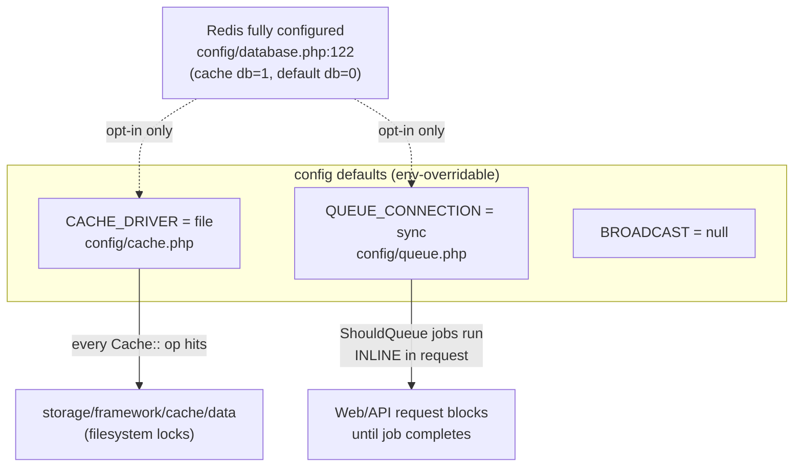
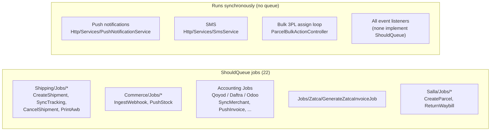

# 20 — Performance (Phase 16 Review)

> Scope: database indexing, N+1 risks, caching, Redis, queues, API performance,
> Flutter client performance (images/network/memory), and concrete optimization
> opportunities. Every non-trivial claim cites a real source file. `rushly-saas`
> (`/var/www/rushly-saas`) is the single source of truth; the Flutter apps are
> clients. Compiled from the codebase on 2026-07-27.

Cross-links: [05-System-Architecture.md](05-System-Architecture.md) ·
[06-Database.md](06-Database.md) · [07-Laravel.md](07-Laravel.md) ·
[08-Flutter.md](08-Flutter.md) · [09-API.md](09-API.md) ·
[14-Integrations.md](14-Integrations.md) · [18-Deployment.md](18-Deployment.md)

---

## 0. Executive summary

Rushly's performance profile is **bimodal**. The **new module code** (2026-era:
`app/Shipping/`, `app/Oms/`, `app/Fulfillment/`, `app/Commerce/`, WMS, Performance
dashboard) is written with modern hygiene: composite tenant-scoped indexes,
per-connection queued jobs, chunked backfills, cache-throttled writes, and
targeted column projections. The **legacy core** (2022–2023: `parcels`,
`merchants`, `delivery_man`, `hubs`, statements) is largely **unindexed beyond
foreign keys**, funnels reads through a 3,583-line `ParcelRepository`, and runs
notification/3PL work **synchronously inside web requests**.

The single most consequential runtime fact: **defaults are `QUEUE_CONNECTION=sync`
and `CACHE_DRIVER=file`** (`config/queue.php`, `config/cache.php`, confirmed in
`_CONTEXT_BRIEF.md`). Unless the deployment overrides these, every "queued" job
(`implements ShouldQueue`) actually runs **inline in the dispatching request**,
and every cache read touches the local filesystem. Redis is fully configured but
**opt-in via env** — no code path hard-requires it.

| Area | State | Headline finding |
|---|---|---|
| DB indexes (new tables) | Good | 64 of 107 `2026_*` migrations declare indexes, mostly `(company_id, status)` composites |
| DB indexes (legacy tables) | Weak | Only 4 of 66 `2022/2023_*` migrations declare indexes; `parcels.tracking_id` and `parcels.status` are **unindexed** |
| N+1 / eager loading | Mixed | Repositories eager-load (`with('parcelEvent')`); bulk 3PL assign loops **one HTTP call per parcel** synchronously |
| Caching | Sparse | 7 `Cache::` call-sites total; file driver by default; no HTTP response cache / ETag layer |
| Redis | Optional | Configured (`config/database.php`), never hard-referenced; no Horizon, no Octane |
| Queues | Partial | Only integration jobs are queued; core parcel/notification flow is synchronous; `sync` default neutralizes queueing |
| Exports | At-risk | All exports are `FromCollection` (materialize in memory); none use `WithChunkReading`/`FromQuery` |
| Flutter network | Adequate | Dio timeouts + 401 handling; **no retry, no HTTP cache interceptor** |
| Flutter images | Good | `cached_network_image` everywhere; POD photos compressed (`imageQuality: 85`) in driver app only |

---

## 1. Runtime performance defaults (the ground floor)



- **Queue** — `'default' => env('QUEUE_CONNECTION', 'sync')` (`config/queue.php`).
  Connections defined: `sync`, `database`, `beanstalkd`, `sqs`, `redis`. Failed
  jobs use `database-uuids` → `failed_jobs` table. Batching table `job_batches`.
  **No Laravel Horizon** and **no queue worker supervision config** is present in
  the repo (`composer.json` has neither `laravel/horizon` nor `laravel/octane`).
- **Cache** — `'default' => env('CACHE_DRIVER', 'file')` (`config/cache.php`),
  path `storage_path('framework/cache/data')`. A `redis` store is defined
  (`connection => 'cache'`, `lock_connection => 'default'`).
- **Redis** — `config/database.php:122-149` defines `default` (db `0`) and `cache`
  (db `REDIS_CACHE_DB`, default `1`) connections, `phpredis` client. No code does
  `Redis::` directly (grep for `Redis::` / `Facades\Redis` returns zero app hits),
  so Redis only ever participates through the cache/queue/session abstractions.

**⚠️ Doc vs Code:** `README.md` claims Laravel 12; `composer.json` pins
`laravel/framework ^10.10`. Code wins — this is Laravel 10, PHP `^8.1`. Any
performance guidance assuming L11/L12 defaults (e.g. per-second scheduling,
new cache locking) does not apply.

> Deployment implication: for production throughput the operator **must** set
> `QUEUE_CONNECTION=redis` (or `database`) + run workers, and `CACHE_DRIVER=redis`.
> See [18-Deployment.md](18-Deployment.md). If left at defaults, the "async"
> architecture below degrades to fully synchronous execution.

---

## 2. Database indexing

### 2.1 Coverage at a glance

Measured across `database/migrations` (191 files):

| Metric | Count |
|---|---|
| Migrations declaring `->index(` | 69 files, **179** total `->index(` calls |
| Migrations declaring `->unique(` | 41 files |
| Migrations declaring `foreignId`/`->foreign(` | 94 files |
| `2026_*` migrations with an index | **64 of 107** |
| `2022_*`/`2023_*` migrations with an index | **4 of 66** |

The disparity is the story: modern tables are indexed for tenant-scoped access;
legacy hot tables rely almost entirely on the single-column indexes that
`foreignId(...)->constrained()` creates as a side effect.

### 2.2 The `parcels` table — the hottest table, thinly indexed

`database/migrations/2022_04_04_142330_create_parcels_table.php` creates the
central `parcels` table. It declares FK-constrained columns (which auto-index):
`company_id`, `merchant_id`, `hub_id`, `transfer_hub_id`. It declares **no
explicit `->index()`** on the columns that drive the busiest queries:

| Column | Used by | Indexed? |
|---|---|---|
| `tracking_id` | public tracking, driver scan, global search, statements | **No** |
| `status` | every list screen, bulk actions, reports | **No** |
| `(company_id, status)` composite | tenant list screens | **No** |
| `merchant_id` | FK auto-index | Yes (single col) |

Later migrations only add narrow single-column indexes to `parcels`:
`wms_fulfillment_id` (`2026_05_23_100012`), `distance_m`
(`2026_06_27_120000`), `oms_order_id` (`2026_07_01_130001`). **None** add
`tracking_id` or `status`.

**Impact — `tracking_id` lookups do full-table scans.** Confirmed hot call-sites:

- `app/Http/Controllers/Api/PublicTrackingController.php:32` —
  `Parcel::withoutGlobalScopes()->where('company_id', …)->where('tracking_id', $trackingId)`.
  Public storefront-embeddable endpoint (permissive CORS); a scan per lookup.
- `app/Http/Controllers/Api/V10/DeliverymanController.php:313,427` and
  `DeliveryManParcelController.php:61,91` — driver scan-to-fetch by `tracking_id`.
- `app/Http/Controllers/Api/V10/StatementsController.php:34`,
  `app/Repositories/Parcel/ParcelRepository.php:470`,
  `app/Repositories/MerchantPanel/MerchantParcel/MerchantParcelRepository.php:642`.
- Fuzzy `LIKE '%q%'` scans in `GlobalSearchController.php:35`,
  `Api/V10/Admin/AdminParcelController.php:39`, `ReportsController.php:190`
  (leading wildcard — cannot use a B-tree index regardless).

> **Optimization #1 (highest ROI):** add
> `parcels.index(['company_id','tracking_id'])` and
> `parcels.index(['company_id','status'])`. The migration author is clearly aware
> of the cost of touching this table — `2026_06_27_120000_add_performance_instrumentation_columns.php`
> explicitly notes *"the parcels table is hot in this codebase and an
> UPDATE-everything would lock it"* and defers backfill to a chunked command.
> An index-add is metadata + build, but on a large table should run in a
> low-traffic window (or via `pt-online-schema-change`).

### 2.3 Where new tables get it right

New module tables ship purpose-built composite indexes, almost all tenant-scoped:

- `orders` (`2026_07_01_*create_orders`): `(company_id,status)`,
  `(company_id,received_at)`, `(merchant_id,status)` — named indexes.
- Shipments: `(company_id,current_status_local)`,
  `(company_id,state,last_synced_at)` (`sh_company_state_sync_idx`) — directly
  supports `ShipmentRepository::pendingForConnection`.
- Fulfillment: `(company_id,status)`, `(order_id,created_at)`.
- Webhook events: `(provider_code,processed_at)`, `(connection_id,received_at)`,
  `(company_id,received_at)` — supports the log-prune crons.
- Fulfillment routing rules: `(company_id,is_active,priority)`.
- Parcel ratings: `(company_id,created_at)`, `(deliveryman_id,created_at)`.
- Order events: `(order_id,occurred_at)`; order-events `event_type` single index.

**⚠️ Known deferred index (documented in code):**
`2026_07_01_140001_add_company_id_to_parcels_3pl.php` and
`2026_05_29_000001_add_target_company_id_to_parcels_3pl.php` note that a composite
index on `parcels_3pl` hits the **utf8mb4 key-length cap** (767/3072-byte limit),
so they fall back to single-column indexes and defer the composite: *"either
shorten the columns first, or use an index prefix."* This is an open item, not a
bug — call it out in any schema-hardening pass. See [06-Database.md](06-Database.md).

---

## 3. N+1 and eager-loading patterns

### 3.1 Eager loading is used, but broadly and inconsistently

- `->with([...])` appears **76×** and `->with('…')` **206×** across `app/`;
  `->load(` 17×. So relationships are generally eager-loaded rather than
  lazy-triggered inside Blade/Inertia loops.
- `ParcelRepository` (`app/Repositories/Parcel/ParcelRepository.php`, 3,583 lines)
  consistently eager-loads `parcelEvent`, `merchant`, `merchant.user`,
  `merchantShop`, `deliveryCategory`, `packaging`, `parcels_3pl` on list and
  detail queries (lines 62, 90, 247, 300, 455-487, 3478-3568).
- **Over-fetch risk:** `all($paginate)` returns `->paginate(1000)` when
  `$paginate === 'all'` (`ParcelRepository.php:101`). A 1,000-row page with all
  eager relations is a large hydration; used by "export all"/"select all" flows.

`whereHas(` is used 58× — each is a correlated `EXISTS` subquery. On the
unindexed legacy tables (§2.2) these can be expensive; they are cheap on the
new tables that carry `(company_id,…)` composites.

### 3.2 The real N+1: synchronous per-row **external HTTP** in bulk actions

`app/Http/Controllers/Backend/ParcelBulkActionController.php` (1,307 lines) is the
`/admin/bulk_action` handler. Its 3PL-assign paths iterate the selected parcels
and make **one outbound courier API call per parcel, in-request**:

```php
// ParcelBulkActionController.php ~L338 (DeliveryPanda path)
foreach ($parcels as $p) {
    $resp = $this->PandaThirdParty($p->id);   // blocking HTTP per parcel
    Parcels_3pl::create([...]);               // insert per parcel
}
```

The same shape repeats for Jet and Logestechs (`assignJetBulk`,
`assignLogestechsBulk`) and in the create/print loops at lines 428, 493, 534, 680.
This is not a database N+1 — it is an **HTTP N+1 executed synchronously in a web
request**. Selecting 100 parcels for 3PL assignment = 100 sequential remote calls
before the response returns. With `QUEUE_CONNECTION=sync` there is no async escape
hatch here — the request simply blocks (and risks PHP `max_execution_time`).

> **Optimization #2:** route bulk 3PL assignment through the new
> `app/Shipping/Jobs/CreateShipmentJob.php` (one queued job per parcel/connection),
> or a batched job, instead of the inline loop. The Shipping module already models
> this correctly — the legacy bulk controller predates it.

### 3.3 Tracking sync — bounded, per-connection, but sequential external calls

`app/Shipping/Services/TrackingService::syncConnection()` loops the pending
shipments for **one** connection and calls `provider->getStatus()` **once per
shipment** (`TrackingService.php` foreach). This is inherent to providers without
a bulk-status endpoint, and it is deliberately bounded:

- Batch capped at `config('shipping.sync.batch_per_run', 200)` (`config/shipping.php`).
- Dispatched **per connection** by `shipping:sync-tracking` so one slow provider
  can't starve other tenants (`SyncTrackingJob`, docstring).
- `SyncTrackingJob::tries() = 1`, `timeout() = 300s` — no retry pile-up on a
  5-minute cadence.

Listeners fired inside the loop (`ShipmentStatusChanged` →
`app/Shipping/Listeners/{UpdateParcelStatus, SendShipmentNotifications,
StoreTrackingHistory}.php`) are **not** `ShouldQueue` (grep confirms zero queued
listeners anywhere), so notifications send **inline** within the job. That is
acceptable while the job itself is queued, but with `sync` queue it all collapses
into the cron process.

---

## 4. Caching

### 4.1 Application cache is sparse (7 call-sites)

Total `Cache::` usage in `app/` is small and concentrated in address/geo lookups
and one write-throttle:

| Call-site | Purpose | TTL |
|---|---|---|
| `app/Oms/Normalization/AddressResolver.php:46,78` | resolve city/area name → id during order normalization | `self::CACHE_TTL` |
| `app/Services/ZajelService.php:96,105` | Zajel country/city reference lookups | 24h |
| `app/Services/AramexService.php:148,159` | Aramex country/state reference lookups (`aramex:countries`) | 24h |
| `app/Http/Middleware/TrackDriverLastSeen.php:37` | throttle `delivery_man.last_seen_at` writes | 60s |

`TrackDriverLastSeen` is a **good** pattern worth highlighting: instead of writing
`last_seen_at` on every authenticated driver request, it sets a per-driver cache
key (`driver_last_seen:{id}`) for 60s and only writes when absent — converting a
write-per-request into a write-per-minute-per-driver, wrapped in try/catch so
instrumentation never breaks the request. Note it depends on the cache driver;
with `file`, this is a filesystem check per request.

### 4.2 No HTTP-response caching layer

- No response-cache / ETag / `Cache-Control` middleware exists
  (grep of `app/Http/Middleware` for `ETag`/`Cache-Control` on response bodies
  returns none; `ModifyHeaderMiddleware` exists but is not a cache layer).
- The public tracking endpoint (`PublicTrackingController`) sets permissive CORS
  but **no cache headers** — every storefront poll re-runs the (unindexed)
  `tracking_id` query and the events query. A short `Cache-Control: public,
  max-age=…` plus the §2.2 index would cut this dramatically.
- No config/model caching evidence for hot reference tables (cities, areas,
  categories, config) beyond the two geo services above; `Config::companywise()`
  reads hit the DB (`ParcelRepository.php:131`).

> **Optimization #3:** cache the public tracking response (per `company_id` +
> `tracking_id`, short TTL invalidated on `ParcelEvent` insert) and cache the
> tenant reference tables (cities/areas/categories) that render on nearly every
> parcel form.

---

## 5. Queues & background jobs

### 5.1 What is actually queued

`implements ShouldQueue` appears on **22 jobs**, all in integration modules —
none in the core parcel lifecycle:



- **Scheduled work** (`app/Console/Kernel.php`): `database:autobackup` daily,
  `invoice:generate` 13:00, `shipments:detect-abnormal` hourly, four `wms:*`
  jobs (SLA every 30 min, min-stock 07:00, expiry 08:00, auto-fulfillment every
  15 min), tracking syncs (`aramex`/`jet` every 15 min, generic `shipping` every
  5 min) all `withoutOverlapping()`, and log prunes `commerce:prune-logs` 03:00 /
  `shipping:prune-logs` 03:15. The staggering + `withoutOverlapping()` is
  deliberate anti-contention design (see the Kernel comments).

### 5.2 Synchronous-by-design paths that should be queued

- **Push notifications** — `app/Http/Services/PushNotificationService.php` uses
  blocking `curl_exec()` (lines 37-50) with `CURLOPT_SSL_VERIFYPEER => false`
  and, critically, `die('Curl failed: …')` on failure (line 48). A remote FCM
  failure would **terminate the entire PHP request/job**, not just the
  notification. This is both a performance and a robustness defect.
- **SMS** — `app/Http/Services/SmsService.php` (`sendOtp`, `sendSms`) sends inline.
- **Event listeners** — zero queued listeners repo-wide, so any listener doing I/O
  runs in the caller's request.

> **Optimization #4:** wrap push/SMS in queued jobs (and remove the `die()`), so a
> flaky provider degrades one notification instead of the request. Also make the
> high-fanout listeners `ShouldQueue`.

### 5.3 The `sync` caveat (repeat, because it dominates everything above)

With `QUEUE_CONNECTION=sync` (default), `dispatch(new CreateShipmentJob(...))`
executes **immediately, in-process**. The queued architecture only delivers its
benefits when the operator configures a real queue backend and workers. This is
the top deployment lever for API latency. See [18-Deployment.md](18-Deployment.md).

---

## 6. API performance

- **Response envelope:** the API wraps payloads via `ApiReturnFormatTrait`
  (`{status, message, data}`) — consistent, lightweight; the Flutter clients
  unwrap `data` (`DioClient._unwrap`).
- **Pagination:** list endpoints paginate (`ParcelRepository` `paginate($n)`),
  but the `'all' → paginate(1000)` escape hatch (§3.1) and unindexed `WHERE`s
  (§2.2) mean large-tenant list/report pages are the likely latency hotspots.
- **Fuzzy search:** admin search uses `LIKE '%term%'` (leading wildcard) on
  `tracking_id`/`invoice_no`/name (`GlobalSearchController`, `AdminParcelController`,
  `AdminFraudController`) — un-indexable; on a large `parcels` table this is a full
  scan. A `FULLTEXT` index or a dedicated search column would help if search
  volume matters.
- **Bulk endpoints:** `/admin/bulk_action` blocks on N external calls (§3.2) —
  the worst single API-latency offender.
- **Rate limiting / throttling:** driver instrumentation is throttled at the app
  level (§4.1); no evidence of a response-cache tier. See [09-API.md](09-API.md).

---

## 7. Exports (Excel/PDF)

All 22 `app/Exports/*` classes implement **`FromCollection`**, not `FromQuery`;
**none** implement `WithChunkReading` (grep confirms zero `WithChunkReading` /
`FromQuery` in `app/`). `FromCollection` **materializes the entire result set in
memory** before writing the sheet:

- `app/Exports/ParcelBulkExport.php` — takes a pre-built Eloquent `Collection`
  (`__construct(private readonly Collection $parcels)`) and projects each row in
  `map()`. Whatever the caller loaded is held in RAM.
- `app/Exports/MerchantParcelExport.php` — wraps a resource collection.
- Same pattern across `NdrExport`, `ShipmentExport`, `HubReports`,
  `DeliverymanReports`, `InvoiceExport`, `ReportExports`, and the
  `app/Exports/Performance/*` sheets.

Because `map()` also calls `optional($p->merchant)`, `optional($p->city)`,
`optional($p->area)` per row (`ParcelBulkExport::map`), an export of a collection
that was **not** eager-loaded with those relations would trigger a per-row query —
a classic export N+1. Safety therefore depends on the caller eager-loading before
constructing the export.

**Positive counter-examples (chunked processing exists elsewhere):**

- `app/Console/Commands/PerformanceBackfill.php:61` — `orderBy('id')->chunkById($chunk, …)`.
- `app/Console/Commands/Zatca/ZatcaBackfill.php:46` — `select('id')->chunkById(200, …)`.
- `app/Http/Controllers/Backend/Wms/WmsStockController.php:109` —
  `orderBy('id')->chunk(500, …)` for a stock export stream.

> **Optimization #5:** convert the large parcel/shipment/report exports to
> `FromQuery` + `WithChunkReading` (and queue them via
> `ShouldQueue`/`Excel::queue`) so a 50k-row export streams in chunks instead of
> loading everything, and returns to the user asynchronously.

---

## 8. Flutter client performance

Findings apply across `rushly-driver-app`, `rushly-merchant-app`,
`rushly-admin-app` (near-identical `core/api/dio_client.dart`).

### 8.1 Network (`lib/core/api/dio_client.dart`)

**Good:**
- Explicit timeouts: `connectTimeout 20s`, `receiveTimeout 30s`, `sendTimeout 30s`.
- Single auth interceptor injects bearer + `apiKey`; centralized 401 handling
  clears the token and bounces to login (`onUnauthorized`).
- `PrettyDioLogger` (which logs full request/response bodies — expensive) is gated
  behind `kDebugMode`, so it never runs in release builds.
- `CancelToken` is threaded through `get`/`post`/`put`, enabling request
  cancellation on screen dispose (avoids wasted work + memory churn).

**Gaps:**
- **No retry interceptor.** A transient network blip surfaces straight to the UI
  as an error; the driver app (poor last-mile connectivity) would benefit most.
  `pubspec.yaml` includes `connectivity_plus: ^6.0.3` but no `dio_smart_retry` /
  custom retry, and grep finds **no `ConnectivityResult`/offline-queue usage** in
  `rushly-driver-app/lib` — connectivity awareness is declared but not wired into
  the network layer.
- **No HTTP response cache.** No `dio_cache_interceptor`, no `hive`
  (grep of all `rushly-*/pubspec.yaml` finds neither). Reference/list data is
  re-fetched every screen entry. Local persistence is `shared_preferences` only
  (tokens/tenant), so there's no offline read cache.
- Dio is built once per tenant and not rebuilt on tenant change by design
  (docstring) — fine, but means base-URL changes require the documented
  "change workspace" reset flow.

### 8.2 Images

**Good:**
- `cached_network_image: ^3.3.1` is a dependency in all three apps and is the
  image widget used (e.g. `rushly-merchant-app/.../news/presentation/news_screen.dart`).
  Grep finds **zero raw `Image.network`** usages across the apps — remote images
  are disk+memory cached, avoiding re-download and decode churn.
- **Upload compression (driver app):** proof-of-delivery capture in
  `rushly-driver-app/lib/features/parcels/presentation/deliver_screen.dart:38` and
  `not_delivered_screen.dart:37` uses `image_picker` with `maxWidth: 1920`,
  `imageQuality: 85` — bounded upload size and memory.

**Gaps:**
- **Compression is driver-app only.** `rushly-merchant-app` and
  `rushly-admin-app` also depend on `image_picker: ^1.1.2` but grep finds **no
  `imageQuality`/`maxWidth`** in their `lib/` — any image upload there ships the
  full-resolution capture (larger payloads, slower uploads, more device memory).
  Recommend the same `maxWidth`/`imageQuality` guard everywhere `image_picker` is
  used.
- No explicit `cacheWidth`/resize hints on cached images observed; for dense list
  thumbnails, decoding at display size (`memCacheWidth`) reduces memory further.

### 8.3 Memory

- `CancelToken` usage (above) and `cached_network_image`'s bounded caches are the
  main memory-hygiene wins.
- No pagination-buffer or list-virtualization concerns surfaced in the network
  layer review; list-screen widget efficiency is a UI concern — see
  [08-Flutter.md](08-Flutter.md) / [16-UI-UX.md](16-UI-UX.md).

---

## 9. Prioritized optimization backlog

| # | Item | Where | Effort | Payoff |
|---|---|---|---|---|
| 1 | Add `parcels(company_id,tracking_id)` + `(company_id,status)` indexes | new migration on `parcels` (see §2.2) | Low* | High — kills full scans on tracking + list screens |
| 2 | Queue bulk 3PL assignment (drop inline HTTP loop) | `ParcelBulkActionController` → `Shipping/Jobs/CreateShipmentJob` | Med | High — removes worst API-latency path |
| 3 | Set `QUEUE_CONNECTION=redis`+workers, `CACHE_DRIVER=redis` in prod | deploy env (`config/queue.php`, `config/cache.php`) | Low | High — activates the async design |
| 4 | Queue push/SMS; remove `die()` in `PushNotificationService` | `Http/Services/PushNotificationService.php:48`, `SmsService.php` | Low | High — provider outage no longer kills requests |
| 5 | Cache public tracking response + reference tables (cities/areas) | `PublicTrackingController`, `Config`/geo reads | Med | Med — cuts repeated storefront-poll cost |
| 6 | Convert large exports to `FromQuery` + `WithChunkReading` + queue | `app/Exports/*` (§7) | Med | Med — bounds memory on big exports |
| 7 | Add Dio retry + HTTP cache interceptor; wire `connectivity_plus` | `*/lib/core/api/dio_client.dart` | Med | Med — resilience on last-mile networks |
| 8 | Apply `imageQuality/maxWidth` to merchant + admin uploads | those apps' `image_picker` call-sites | Low | Med — smaller uploads, less device memory |
| 9 | Resolve deferred `parcels_3pl` composite index (utf8mb4 key-length) | shorten cols or index prefix (§2.3) | Med | Low/Med |

\* Low code effort; schedule the index build off-peak on the large `parcels` table.

---

## 10. What could NOT be determined from the codebase

- **Actual production values** of `QUEUE_CONNECTION`, `CACHE_DRIVER`, `REDIS_HOST`,
  worker counts, and PHP `max_execution_time` — set in `.env`/infra, not in the
  repo. This doc analyzes the **defaults and code paths**; real behavior depends on
  those env values. Not found in the current codebase.
- **Row counts / query-plan timings** — no seed data volume or slow-query log is in
  the repo, so "full scan" claims are structural (missing index on a queried
  column), not measured. Not found in the current codebase.
- **CDN / OPcache / web-server tuning** — no infra config in-repo. See
  [18-Deployment.md](18-Deployment.md).

---

## Sources

Configuration:
- `config/cache.php`, `config/queue.php`, `config/database.php` (redis block), `config/shipping.php`
- `composer.json` (no Horizon/Octane; Laravel `^10.10`)
- `app/Console/Kernel.php` (schedule)

Database / indexing:
- `database/migrations/2022_04_04_142330_create_parcels_table.php`
- `database/migrations/2026_06_27_120000_add_performance_instrumentation_columns.php`
- `database/migrations/2026_05_23_100012_add_wms_fulfillment_id_to_parcels.php`,
  `2026_07_01_130001_add_oms_order_id_to_parcels.php`
- `database/migrations/2026_07_01_140001_add_company_id_to_parcels_3pl.php`,
  `2026_05_29_000001_add_target_company_id_to_parcels_3pl.php` (deferred index note)
- Index survey across `database/migrations/*` (orders, shipments, fulfillment,
  webhook events, ratings, order events)

Eager-loading / N+1 / queues:
- `app/Repositories/Parcel/ParcelRepository.php`
- `app/Repositories/MerchantPanel/MerchantParcel/MerchantParcelRepository.php`
- `app/Http/Controllers/Backend/ParcelBulkActionController.php`
- `app/Http/Controllers/Api/PublicTrackingController.php`
- `app/Http/Controllers/Api/V10/DeliverymanController.php`, `DeliveryManParcelController.php`
- `app/Shipping/Services/TrackingService.php`, `app/Shipping/Jobs/SyncTrackingJob.php`
- `app/Shipping/Listeners/*`
- Jobs: `app/{Shipping,Commerce,Qoyod,Daftra,Odoo,Salla}/Jobs/*`, `app/Jobs/Zatca/*`

Caching:
- `app/Oms/Normalization/AddressResolver.php`, `app/Services/ZajelService.php`,
  `app/Services/AramexService.php`, `app/Http/Middleware/TrackDriverLastSeen.php`

Notifications:
- `app/Http/Services/PushNotificationService.php`, `app/Http/Services/SmsService.php`

Exports:
- `app/Exports/ParcelBulkExport.php`, `app/Exports/MerchantParcelExport.php`,
  `app/Exports/*` survey; `app/Http/Controllers/Backend/Wms/WmsStockController.php`
- `app/Console/Commands/PerformanceBackfill.php`, `app/Console/Commands/Zatca/ZatcaBackfill.php`

Flutter clients:
- `rushly-driver-app/lib/core/api/dio_client.dart` (+ merchant/admin equivalents)
- `rushly-driver-app/lib/features/parcels/presentation/{deliver_screen,not_delivered_screen}.dart`
- `rushly-{driver,merchant,admin}-app/pubspec.yaml`

Grounding: `docs/_CONTEXT_BRIEF.md`.
