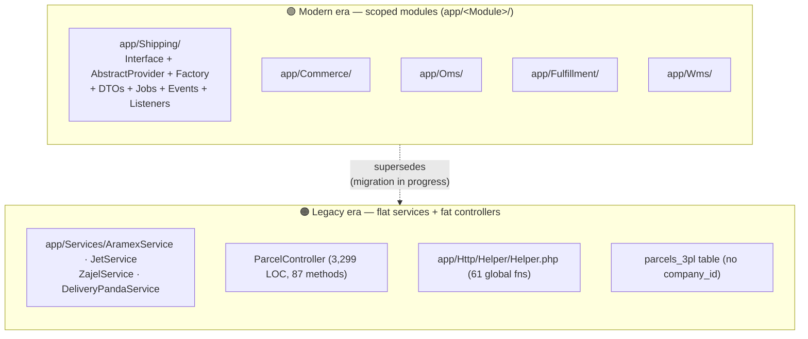
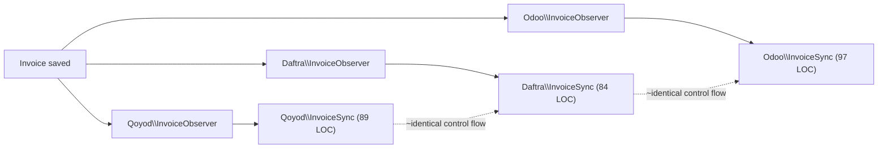

# 21 — Code Review (Phase 17)

> Engineering code-review evaluation of the Rushly platform (`rushly-saas`, the
> single source of truth, plus the Flutter client apps). Scope: SOLID, DRY,
> KISS, architecture quality, maintainability, scalability, plus a concrete
> inventory of dead code, duplicate logic, unused API routes, and unused Flutter
> screens.
>
> Every non-trivial claim below cites a real source file. This review is
> **balanced by design**: Rushly contains some of the cleanest module code in
> the codebase (the `app/Shipping/` abstraction) sitting directly beside some of
> the oldest debt (the 3.3k-line `ParcelController`, the legacy per-provider 3PL
> services, and a 61-function global `Helper.php`). Both realities are true at
> once, and the interesting engineering story is the *seam* between them.

Related docs: [05-System-Architecture.md](05-System-Architecture.md) ·
[07-Laravel.md](07-Laravel.md) · [11-Modules.md](11-Modules.md) ·
[14-Integrations.md](14-Integrations.md) · [17-Security.md](17-Security.md) ·
[08-Flutter.md](08-Flutter.md)

---

## 1. Executive summary

Rushly is a large, actively-modernising Laravel 10 monolith (~94k LOC in `app/`,
219 controllers, 120 models, 191 migrations — see the metrics in
[_CONTEXT_BRIEF.md](_CONTEXT_BRIEF.md)). It is mid-transformation from a
"fat-controller + global-helper + per-integration-service" legacy style into a
**scoped-namespace module** style (`app/<Module>/` with
`Contracts/ + DTOs/ + Providers/ + Services/ + Events/ + Listeners/`).

The verdict is two-sided:

| Dimension | Assessment | Evidence |
|---|---|---|
| **New module code** (`Shipping`, `Commerce`, `Oms`, `Fulfillment`) | **Strong.** Textbook SOLID — interface-driven, DI, DTO boundaries, typed exceptions, single HTTP chokepoint. | `app/Shipping/Contracts/ShippingProviderInterface.php`, `app/Shipping/Providers/AbstractProvider.php` |
| **Legacy 3PL services** (`Aramex`, `Jet`, `Zajel`, `DeliveryPanda`) | **Weak but improving.** Duplicated bulk/single logic, hardcoded values, multi-tenant leak, unauthenticated public endpoints. Documented, not yet remediated. | `3PL.md`, `app/Services/*Service.php` |
| **Controllers** | **Mixed.** New module controllers are thin; core `ParcelController` is a 3,299-line, 87-method god class. | `app/Http/Controllers/Backend/ParcelController.php` |
| **Cross-cutting helpers** | **Weak.** 61 global functions in one 1,273-line file, including a dead duplicate definition (latent bug). | `app/Http/Helper/Helper.php` |
| **Accounting integrations** (`Qoyod`, `Daftra`, `Odoo`) | **Clean per-module, but triplicated.** Well-structured, yet three near-identical module skeletons with no shared abstraction. | `app/Qoyod/`, `app/Daftra/`, `app/Odoo/` |
| **Flutter clients** | **Healthy.** Feature-first layout; only 3 orphaned placeholder screens found across 5 apps checked. | `rushly-warehouse-app`, `rushly-supervisor-app` |

**One-line takeaway:** The team has *already invented* the right pattern (the
Shipping module) and knows exactly where the debt is (`3PL.md`, `GAPS.md` read
like an honest debt register). The remaining work is *migration discipline* —
pulling the legacy islands onto the pattern that already exists — not
green-field design.

---

## 2. The two architectural eras

Rushly's codebase is best understood as two coexisting generations. This is
explicitly acknowledged in `3PL.md`:

> "**Two patterns coexist on purpose.** The legacy 4 providers stay on the old
> `Service` pattern for now. New providers (and any rewrite of the existing 4)
> go through the new module."



**Why this matters for the review:** you cannot score Rushly with a single
grade. The `Shipping` module would pass a senior architecture review as-is; the
legacy 3PL layer would not. The correct engineering objective is to keep
widening the green box until the orange box is empty.

---

## 3. SOLID analysis

### 3.1 Where SOLID is done well — `app/Shipping/`

`app/Shipping/Contracts/ShippingProviderInterface.php` is the reference example
for the whole codebase. Its own docblock states the design intent:

> "The single contract every shipping provider implements. Business logic
> (ShipmentService, jobs, controllers) talks to `ProviderInterface` — never to a
> concrete provider — so swapping Logestechs for OTO is purely a config change."

Scored against each SOLID letter:

- **S — Single Responsibility.** Responsibilities are cleanly separated across
  files: payload shaping in `app/Shipping/Providers/Logestechs/Mappers/ShipmentRequestMapper.php`,
  response parsing in `ShipmentResponseMapper.php`, status vocabulary in
  `StatusMapper.php`, HTTP plumbing in `AbstractProvider.php`, orchestration in
  `app/Shipping/Services/ShipmentService.php`, persistence in
  `app/Shipping/Repositories/ShipmentRepository.php`. Each class does one thing.
- **O — Open/Closed.** New providers are added by implementing the interface and
  registering with `app/Shipping/Factory/ShippingProviderFactory.php`; no
  existing service code is edited. Capability differences (webhooks, AWB PDFs,
  cancel-after-create) are expressed via optional marker interfaces
  (`SupportsWebhooks`) rather than `if (provider === 'x')` branching.
- **L — Liskov.** The contract is honest about substitutability: a provider that
  cannot cancel still implements `cancelShipment()` and throws
  `ProviderUnavailableException` (per the interface docblock) rather than
  silently no-op'ing.
- **I — Interface Segregation.** The core interface is small; niche capabilities
  are split into `Contracts/SupportsWebhooks.php` etc., so a provider isn't
  forced to implement webhook handling it doesn't have.
- **D — Dependency Inversion.** `AbstractProvider` receives its `ApiLogger` by
  constructor injection (`app/Shipping/Providers/AbstractProvider.php`), and
  `app/Shipping/ShippingServiceProvider.php` binds the factory, logger, and
  repositories as singletons in the container. Consumers depend on abstractions.

The same shape recurs (to varying maturity) in `app/Commerce/`, `app/Oms/`, and
`app/Fulfillment/` — e.g. `app/Fulfillment/` uses a Strategy pattern
(`WmsFulfillmentStrategy`, `ThreePlDropshipStrategy`, `MerchantSelfStrategy`)
behind a `FulfillmentRouter`, which is Open/Closed done right (see
[11-Modules.md](11-Modules.md)).

### 3.2 Where SOLID breaks down — legacy 3PL + ParcelController

- **SRP violated — `ParcelController`.**
  `app/Http/Controllers/Backend/ParcelController.php` is **3,299 lines with 87
  public methods** (verified: `grep -c 'public function'`). A single class owns
  parcel CRUD, tracking JSON, NDR creation, 3PL dispatch
  (`ThirdPartyLogistics()`), import/export, hub transfer, pickup assignment,
  delivery-man assignment, reschedule, cancel, and dozens of status-transition
  endpoints (`receivedByHub`, `transfertohub`, `deliverymanAssign`, …). This is
  the single largest maintainability liability in the backend.
- **OCP violated — `ThirdPartyLogistics()`.** Adding a courier means editing a
  `switch`-like branch inside this method (`panda` / `zajel` / `aramex` / `jet`
  / `logestechs` branches per `3PL.md` §Surface) **and** adding a matching
  `assign<Provider>Bulk()` method to
  `app/Http/Controllers/Backend/ParcelBulkActionController.php` (1,307 lines).
  Exactly the closed-for-modification problem the Shipping module was built to
  solve.
- **DIP violated — legacy services.** `ParcelController` `new`s /
  type-hints concrete services (`DeliveryPandaService`, `AramexService`, …)
  directly rather than a `CourierInterface`. There is no legacy-side abstraction
  to invert against.
- **LSP not applicable** to the legacy services — they share no common type, so
  there is nothing to substitute. That absence *is* the finding.

---

## 4. DRY analysis

### 4.1 🟠 Duplicate #1 — the accounting sync triplication (`Qoyod` / `Daftra` / `Odoo`)

The three accounting-integration modules are individually clean, but they are
**three parallel copies of the same module skeleton with no shared abstraction**.
`find` confirms none of them defines an `interface` or `abstract class` — there
is no `Contracts/` directory in any of the three:

```
app/Qoyod/{Jobs,Models,Services,Observers}/   — 16 files
app/Daftra/{Jobs,Models,Services,Observers}/  — 10 files
app/Odoo/{Jobs,Models,Services,Observers}/    — 16 files
```

Each ships the same set: `Services/ApiClient` + `InvoiceSync` +
`CustomerSync`/`ClientSync` + `InvoicePaymentSync` (+ `BillSync` + `VendorSync`
for Qoyod/Odoo), `Observers/InvoiceObserver` + `MerchantObserver`, and
`Jobs/PushInvoiceJob` + `PushInvoicePaymentJob` + `SyncMerchantJob`. The
`InvoiceSync::sync()` methods are structurally identical — same control flow,
differing only in the vendor payload keys:

`app/Qoyod/Services/InvoiceSync.php`:
```php
$settings = Settings::forCompany((int) $invoice->company_id);
if (! $settings->isReady()) { throw new RuntimeException(...); }
$merchant = Merchant::find($invoice->merchant_id);
if (! $merchant?->qoyod_customer_id) { (new CustomerSync())->sync($merchant); $merchant->refresh(); }
$payload = ['invoice' => ['contact_id' => ..., 'line_items' => $lineItems]];
$response = ApiClient::forCompany(...)->post('invoices', $payload);
$invoice->forceFill([...'qoyod_sync_status' => 'synced'...])->saveQuietly();
```

`app/Daftra/Services/InvoiceSync.php` — byte-for-byte the same shape, only the
payload envelope (`'Invoice'`/`'InvoiceItem'` vs `'invoice'`/`'line_items'`) and
the column prefix (`daftra_*` vs `qoyod_*`) differ.

**Assessment (balanced):** This is *deliberate, low-risk duplication*, not
sloppiness — each provider's payload genuinely differs, and keeping them
separate keeps each provider readable and independently deployable (the same
argument the team makes for the legacy 3PL split in `3PL.md`). But the
**skeleton** (settings-ready guard → ensure-customer → build-payload →
post → write-back sync columns) is identical and would benefit from an
`AbstractAccountingSync` base + a shared `Contracts/AccountingProvider`
interface — mirroring exactly what `app/Shipping/` already proves works. As-is,
a bug fixed in `Qoyod\InvoiceSync` (e.g. a null-date guard) must be manually
re-applied in two other files.

A concrete symptom: the **same three models carry three observers each**.
`app/Providers/AppServiceProvider.php` (lines 144–155) registers
`Merchant::observe(Qoyod\MerchantObserver)`, `Merchant::observe(Daftra\MerchantObserver)`,
and `Merchant::observe(Odoo\MerchantObserver)` — every `Invoice` save fans out
to three near-identical observers. A shared dispatcher keyed by "which
accounting integration is enabled for this tenant" would collapse this.



### 4.2 🟠 Duplicate #2 — legacy 3PL single vs bulk assign

Per `3PL.md` §Surface, each legacy provider implements its assign logic **twice**:
once in the `ParcelController::ThirdPartyLogistics()` single-parcel branch, and
again in a `ParcelBulkActionController::assign<Provider>Bulk()` method
(`assignZajelBulk`, `assignAramexBulk`, `assignJetBulk`). `3PL.md` explicitly
notes each bulk method is "same per-parcel logic as the single flow." The
Shipping module avoids this entirely by funnelling both single and bulk through
the same `CreateShipmentJob`.

### 4.3 🟠 Duplicate #3 — byte-identical Panda tracking methods

`app/Services/DeliveryPandaService.php` (lines ~40–49) defines two methods that
are identical:
```php
public function getTracking(array $awbNumbers)     { return $this->request('GetTracking', ['AwbNumber' => $awbNumbers]); }
public function getListTracking(array $awbNumbers)  { return $this->request('GetTracking', ['AwbNumber' => $awbNumbers]); }
```
Flagged as issue #11 in `3PL.md` ("`getTracking` and `getListTracking` are
byte-identical"). Still present.

### 4.4 🟠 Duplicate #4 — the global `Helper.php`

`app/Http/Helper/Helper.php` (1,273 lines, **61 global functions**) is a
DRY-in-name-only file: it centralises helpers, but many are thin wrappers over
per-domain repositories/models that duplicate query logic already living in
`app/Repositories/*`. Examples: `merchantPayments()`, `parcelExpense()`,
`unpaidUser()`, `dayIncomeCount()`, `dayExpenseCount()`,
`dayDeliverymanRevIncomeCount()` are business queries embedded as free
functions in a global namespace, invoked from Blade/Inertia and controllers
alike — making them impossible to mock, scope, or test in isolation.

> ⚠️ **Doc vs Code / latent bug — duplicate `user()` definition.**
> `Helper.php` defines the global function `user()` **twice**, each guarded by
> `if (!function_exists('user'))`:
> - line 253: `function user()` — no args, returns `User::companywise()->get()` (a *collection*).
> - line 524: `function user($id)` — takes an id, returns a single `User::find($id)`.
>
> Because PHP registers the first definition, the second block's guard is always
> false, so **`function user($id)` is dead code that never loads**. Any caller
> written expecting `user($someId)` silently receives the zero-arg collection
> version instead. There is even a `//todo` comment on line 251 directly above
> the first definition. This is a real correctness hazard, not just style.

---

## 5. KISS analysis

- **Against KISS — `ParcelController`.** 87 methods in one file (§3.2) is the
  antithesis of "keep it simple." Navigating it requires scrolling through
  status-transition methods that could be a resource controller per transition
  or a small state-machine service.
- **Against KISS — `Helper.php`.** 61 global functions is a "junk drawer"
  anti-pattern; simplicity would be domain-scoped services.
- **For KISS — the module HTTP chokepoint.** `AbstractProvider::http()` is a
  *good* KISS decision: a single method centralises timing, logging, header
  masking, error normalization, and HTTP-level retry
  (`app/Shipping/Providers/AbstractProvider.php`), so each provider stays "just
  payload shape + response mapping." That is genuine complexity reduction.
- **For KISS — DTO boundaries.** `app/Shipping/DTOs/*` (`ShipmentDTO`,
  `ConnectionDTO`, `TrackingDTO`, `TestResultDTO`, `AddressDTO`) give simple,
  typed data contracts between layers instead of passing arrays around.

---

## 6. Maintainability

**Strengths**
- **Repository layer.** 56 repository namespaces under `app/Repositories/*`
  (Parcel, Merchant, Invoice, Hub, Wallet, …) keep a lot of query logic out of
  controllers where the team adhered to the pattern.
- **Enum discipline.** Rich typed enums under `app/Enums/*` (ParcelStatus,
  NdrStatus, InvoiceStatus, plus `Wms/`, `Zatca/`, `Wallet/` subfolders) instead
  of magic strings — see [06-Database.md](06-Database.md).
- **Honest debt registers.** `3PL.md` and `GAPS.md` are unusually candid: they
  enumerate 27 known 3PL issues by severity with fix ordering, and log the
  2026-06-19 error triage with root causes. A codebase that documents its own
  debt this precisely is materially more maintainable than one that hides it.
- **Traits are minimal and purposeful.** Only three: `ApiReturnFormatTrait`,
  `PaymentTrait`, `TrackingTrait` (`app/Traits/`) — no trait sprawl.

**Weaknesses**
- **The god classes** (`ParcelController`, `Helper.php`) concentrate change-risk.
- **Two 3PL patterns** double the mental model: a maintainer must know whether a
  courier lives in `app/Shipping/` or `app/Services/` before touching it.
- **`parcels_3pl` shared table with no `company_id`** (`3PL.md` §Data model,
  issue #3) — a schema-level maintainability *and* correctness problem shared by
  all four legacy providers.
- **Leftover legacy on disk.** `app/Logestechs/` and the old `LogestechsService`
  / `logestechs_settings` table remain "for safety" after the Shipping-module
  migration (`3PL.md` §Logestechs, and `GAPS.md` 2026-06-30 note). Intentional,
  but it's dead weight until the cleanup PR lands.

---

## 7. Scalability

- **Queue-based provider work (good).** The Shipping module dispatches
  `CreateShipmentJob` / `CancelShipmentJob` / `SyncTrackingJob`
  (`app/Shipping/Jobs/*`), and `shipping:sync-tracking` runs one job per active
  connection every 5 min. This scales horizontally once the queue driver moves
  off `sync`.
  - ⚠️ **Doc vs Code caveat:** `QUEUE_CONNECTION` defaults to **`sync`** and
    `CACHE_DRIVER` to `file` per [_CONTEXT_BRIEF.md](_CONTEXT_BRIEF.md) /
    [19-Environment.md](19-Environment.md). Under `sync`, "queued" jobs run
    inline in the web request, so the scalability benefit is latent until a real
    queue (redis/database) is configured in production. The *architecture* is
    scalable; the *default config* is not.
- **Multi-tenancy (stancl/tenancy).** Per-subdomain isolation scales tenant
  count well ([05-System-Architecture.md](05-System-Architecture.md),
  [10-Authentication.md](10-Authentication.md)).
- **Legacy 3PL sync jobs (bounded).** `aramex:sync-tracking` (cap 500/run),
  `jet:sync-tracking` (cap 200/run), `logestechs:sync-tracking` (cap 300/run)
  are batch-capped, which is sensible, but they run **unscoped by tenant**
  (`3PL.md` issue #3) — a correctness-at-scale risk: with enough tenants, AWB
  collisions across tenants can fire `parcelDelivered()` on the wrong parcel.
- **MyISAM `parcels_3pl`** (`3PL.md` §Data model) — no row-level locking; the
  cron auto-deliver paths have a documented read-then-write race (issue #8).
  This will not scale under concurrent admin edits.
- **`Helper.php` uncached aggregate queries** (`dayIncomeCount()` etc.) invoked
  from views can N+1 under dashboard load.

---

## 8. Dead code inventory

| # | Item | Location | Evidence |
|---|---|---|---|
| 1 | **`function user($id)` never registers** — shadowed by the earlier zero-arg `user()` under the same `function_exists` guard | `app/Http/Helper/Helper.php:524` (dead) vs `:253` (live) | verified by reading both guarded blocks |
| 2 | **`schudule_tracking22()`** — stale copy of the Panda tracking handler; not routed, still writes `current_status` unscoped if ever called | `app/Http/Controllers/DeliveryPandaController.php:143` | `3PL.md` issue #12; confirmed present |
| 3 | **`getListTracking()`** — byte-identical duplicate of `getTracking()` | `app/Services/DeliveryPandaService.php:46` | `3PL.md` issue #11 |
| 4 | **Unreachable `return`** in `ThirdPartyLogistics` Panda branch | `app/Http/Controllers/Backend/ParcelController.php` | `3PL.md` issue #6 |
| 5 | **`app/Logestechs/` + `LogestechsService` + `logestechs_settings`** — superseded by Shipping module, kept "on disk for safety" | `app/Logestechs/`, `app/Services/LogestechsService.php` | `3PL.md` / `GAPS.md` 2026-06-30 |
| 6 | **Dead env key `LOGESTECHS_API_KEY`** — Logestechs auth is per-shipment, no global key used | `.env.example`, `config/services.php` | `3PL.md`: "The `LOGESTECHS_API_KEY` env entry is therefore dead. Safe to remove." |
| 7 | **Commented-out `dd()` / debug scaffolding** left in shipping-critical files | `ParcelController.php:1610`, `app/Http/Requests/Merchant/SignUpRequest.php:32`, `app/Http/Requests/Account/StoreRequest.php:27`, `MerchantRepository.php:161` | grep for `dd(`/`dump(` |

> Note on TODO/FIXME hygiene: a full-tree grep for genuine `TODO`/`FIXME`/`HACK`
> comment markers in `app/**.php` returns only **one** real marker
> (`app/Http/Controllers/Backend/ChildCompanyController.php:27` —
> `TODO(billing): child subscriptions are created against the parent's …`) plus
> a bare `//todo` in `Helper.php:251`. Low TODO count is a *good* sign — but here
> it partly reflects that debt is tracked in `3PL.md`/`GAPS.md` instead of inline.

### 8.1 🔴 Live debug calls (not just comments)

Active `dd()` calls that will hard-stop execution if their branch is hit:

- `app/Imports/ParcelImport2.php:47` — `dd($merchant);` inside an import path.
- `app/Http/Controllers/Backend/AddonController.php:83` — `dd('could not open');`.
- `app/Repositories/PushNotification/PushNotificationRepository.php:64` and `:69`
  — `dd($exception);` / `dd($e);` inside `catch` blocks (a thrown push
  notification will dump-and-die instead of logging).

These are correctness bugs, not stylistic — they should be `Log::error()` +
graceful handling.

---

## 9. Unused / risky API endpoints

| Route | Controller target | Status | Source |
|---|---|---|---|
| `GET /api/panda/schudule_tracking_temp` | `DeliveryPandaController@schudule_tracking_temp` | **Route registered but controller method does not exist** — `grep` for the method returns nothing. A hit would 500. | `routes/api.php:64`; method absent in `DeliveryPandaController.php` |
| `GET /api/panda/schudule_tracking` | `DeliveryPandaController@schudule_tracking` | Live but **unauthenticated + untenanted** and misspelled (`schudule`) | `routes/api.php:63`; `3PL.md` issues #1, #15 |
| `POST /api/delivery/{create,agent-create,customer-to-customer,track}` | `DeliveryPandaController` | Live, **no auth, no request validation** | `3PL.md` issues #1, #13 |

The unauthenticated Panda create/track endpoints are the single most serious
finding that overlaps with security — see [17-Security.md](17-Security.md).
Anyone with the URL can create shipments or pull tracking data across tenants.

---

## 10. Unused Flutter screens

The Flutter apps are the healthiest surface reviewed. A class-reference
heuristic (each `*_screen.dart` / `*_page.dart` class grepped across its own
app's `lib/`, excluding its own file) across five apps found only **three**
orphaned screens, all placeholders — not real features:

| App | File | Class | Verified |
|---|---|---|---|
| `rushly-warehouse-app` | `lib/features/wms/presentation/wms_home_screen.dart` | `WmsHomeScreen` | defined, zero external references |
| `rushly-warehouse-app` | `lib/features/dashboard/presentation/placeholder_screen.dart` | `PlaceholderScreen` | defined, zero external references |
| `rushly-supervisor-app` | `lib/features/dashboard/presentation/placeholder_screen.dart` | `PlaceholderScreen` | defined, zero external references |

`rushly-admin-app` (26 screens), `rushly-merchant-app` (27 screens), and
`rushly-driver-app` returned **no** orphaned screens — every screen is wired
into navigation. This is a sign the Flutter clients are well-maintained relative
to the backend. The `PlaceholderScreen`/`WmsHomeScreen` orphans are almost
certainly scaffolding left from a `go_router` refactor and are safe to delete.

> Caveat: this is a static heuristic (string match on class name). Screens
> resolved purely by dynamic route strings would be false-positives; a quick
> manual check of the three above confirmed the class names appear *only* in
> their own definition file.

---

## 11. Doc vs Code conflicts found during this review

- ⚠️ **Laravel version.** `README.md:3` and `:83` claim "Laravel 12". `composer.json`
  pins `laravel/framework: ^10.10`. **Code wins: this is Laravel 10.** (Also
  flagged in [_CONTEXT_BRIEF.md](_CONTEXT_BRIEF.md) and
  [07-Laravel.md](07-Laravel.md).)
- ⚠️ **`APP_DEBUG=true` in production.** `GAPS.md` §Health-check flags that
  production runs with `APP_DEBUG=true`, rendering SQL-bearing stacktraces to
  authenticated users. Left as an operational decision, but it is a live
  information-disclosure issue — cross-ref [17-Security.md](17-Security.md).
- ⚠️ **Logestechs "legacy" narrative.** `3PL.md` contains a large legacy
  Logestechs section then super-cedes it mid-document with a 2026-06-30 note
  that Logestechs now lives in `app/Shipping/`. The narrative is internally
  consistent but requires reading to the end; the on-disk `LogestechsService`
  still exists, matching the "kept for safety" note.

---

## 12. Prioritised recommendations

Ordered by risk-reduction per unit of effort. The first three overlap with
`3PL.md`'s own "Suggested fix order," which this review endorses.

1. **🔴 Authenticate the public Panda endpoints** (`/api/delivery/*`,
   `/api/panda/schudule_tracking*`) and delete the dead
   `schudule_tracking_temp` route + `schudule_tracking22` method.
   (`routes/api.php`, `DeliveryPandaController.php`.)
2. **🔴 Add `company_id` + `companywise` scope to `parcels_3pl`** and scope every
   legacy 3PL create/sync/webhook path — closes the multi-tenant leak for all
   four providers at once (`3PL.md` issue #3).
3. **🔴 Remove/replace the live `dd()` calls** in
   `PushNotificationRepository.php:64,69`, `ParcelImport2.php:47`,
   `AddonController.php:83`.
4. **🟠 Fix the `Helper.php` duplicate `user()`** — rename the id-taking variant
   (e.g. `findUser($id)`) so it actually registers, and audit call sites.
5. **🟠 Decompose `ParcelController`** — extract the status-transition family
   into a `ParcelTransitionController` (or a state-machine service) and route
   3PL dispatch through the existing `app/Shipping/` factory instead of the
   inline branch. This is the highest-leverage maintainability win.
6. **🟠 Introduce an `AbstractAccountingSync` + `AccountingProvider` contract**
   under a new `app/Accounting/Contracts/`, and have `Qoyod`/`Daftra`/`Odoo`
   extend it — collapse the triple observer registration in
   `AppServiceProvider.php:144-155` into one enabled-integration dispatcher.
   Model directly on `app/Shipping/`.
7. **🟢 Migrate the remaining legacy couriers** (Aramex, Jet, Zajel, Panda) onto
   `app/Shipping/`, then delete `app/Services/*Service.php`, `app/Logestechs/`,
   the `logestechs_settings` table, and the dead `LOGESTECHS_API_KEY` env key.
8. **🟢 Delete the three orphaned Flutter placeholder screens** (§10).
9. **🟢 Break up `Helper.php`** — move business-query helpers into their existing
   repositories; keep only truly cross-cutting view helpers.

---

## 13. Scorecard

| Area | Grade | Rationale |
|---|---|---|
| New-module architecture | **A** | Interface + factory + DTO + typed-exception + single HTTP chokepoint (`app/Shipping/`) |
| Legacy 3PL architecture | **C−** | Duplicated single/bulk, hardcoded values, no `company_id`, unauth endpoints — but documented + partly superseded |
| Controllers | **C** | Thin new controllers vs a 3,299-line god class |
| DRY | **C+** | Real reuse (repositories, DTOs) undercut by accounting triplication, 3PL dupes, `Helper.php` |
| KISS | **B−** | Excellent HTTP chokepoint / DTOs vs god-class + 61-fn helper |
| Maintainability | **B−** | Enums, repos, and unusually honest debt docs vs concentrated change-risk |
| Scalability | **B** | Queue/job + multi-tenant design is sound; held back by `sync` queue default + MyISAM `parcels_3pl` |
| Dead code / hygiene | **B** | Only 3 orphan Flutter screens + a handful of dead PHP items, all identifiable |
| **Overall** | **B−** | A modernising codebase that has already built the right pattern and honestly mapped its own debt; grade rises as the legacy islands migrate onto `app/Shipping/`-style modules |

---

## Sources

Files and directories actually opened for this review:

- `docs/_CONTEXT_BRIEF.md` — platform metrics, module map, stack facts
- `GAPS.md` — 2026-06-19 error triage + architectural-closure log
- `3PL.md` — legacy 3PL surface, data model, flows, 27 known issues, fix order
- `README.md` — Laravel-version conflict source
- `composer.json` — framework version ground truth (`^10.10`)
- `app/` (top-level) — module vs legacy layout (`ls -d app/*/`)
- `app/Shipping/**` — `Contracts/ShippingProviderInterface.php`,
  `Providers/AbstractProvider.php`, `ShippingServiceProvider.php`,
  `Factory/`, `DTOs/`, `Jobs/`, `Repositories/`, `Providers/Logestechs/Mappers/`
- `app/Services/*.php` — legacy 3PL services (LOC: Aramex 343, Logestechs 329,
  Jet 292, Zajel 247, Panda 50) + `DeliveryPandaService.php` duplicate methods
- `app/Http/Controllers/Backend/ParcelController.php` — 3,299 LOC, 87 methods
- `app/Http/Controllers/Backend/ParcelBulkActionController.php` — 1,307 LOC
- `app/Http/Controllers/DeliveryPandaController.php` — `schudule_tracking22`,
  missing `schudule_tracking_temp`
- `app/Http/Helper/Helper.php` — 1,273 LOC, 61 global functions, duplicate `user()`
- `app/Qoyod/**`, `app/Daftra/**`, `app/Odoo/**` — accounting triplication;
  `InvoiceSync.php` shape comparison
- `app/Providers/AppServiceProvider.php` — triple observer registration (144–155)
- `app/Repositories/` (56 namespaces), `app/Traits/` (3), `app/Services/Performance/`
- `app/Imports/ParcelImport2.php`, `app/Http/Controllers/Backend/AddonController.php`,
  `app/Repositories/PushNotification/PushNotificationRepository.php` — live `dd()`
- `routes/api.php` — Panda route registrations
- Flutter clients: `rushly-warehouse-app/lib/**`, `rushly-supervisor-app/lib/**`,
  `rushly-admin-app/lib/**`, `rushly-merchant-app/lib/**`, `rushly-driver-app/lib/**`
  — orphaned-screen heuristic
