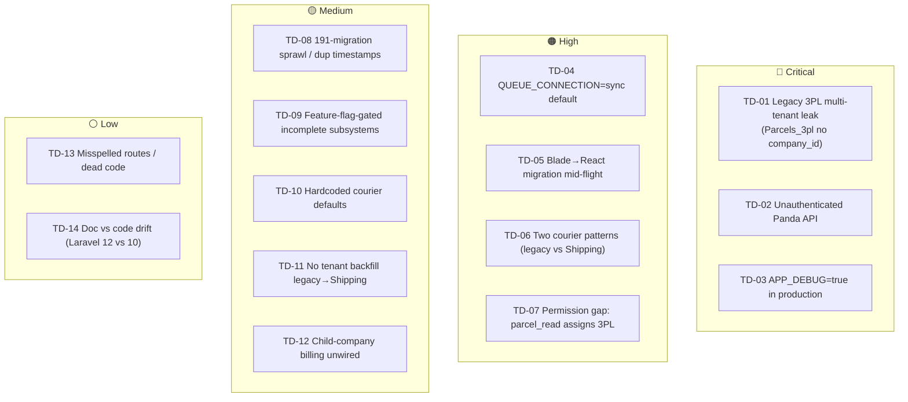
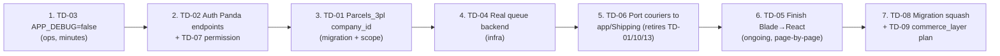

# 22 — Technical Debt Register (Phase 17)

> Scope: a concrete, source-cited inventory of technical debt in `rushly-saas`
> (`/var/www/rushly-saas`) — the single source of truth for the Rushly platform.
> Every item lists **Location**, **Impact**, and **Remediation**. This register is
> compiled from the codebase and the repo-root docs as of **2026-07-27**.
>
> Read alongside [`GAPS.md`](../GAPS.md) (recent bug triage + closures),
> [`3PL.md`](../3PL.md) (legacy courier known issues), and
> [`docs/inertia/migration-guide.md`](inertia/migration-guide.md) (Blade→React recipe).
> Cross-links: [05-System-Architecture.md](05-System-Architecture.md),
> [06-Database.md](06-Database.md), [07-Laravel.md](07-Laravel.md),
> [11-Modules.md](11-Modules.md), [14-Integrations.md](14-Integrations.md),
> [17-Security.md](17-Security.md), [18-Deployment.md](18-Deployment.md),
> [20-Performance.md](20-Performance.md), [21-Code-Review.md](21-Code-Review.md).

---

## 0. How to read this register

Each item has a stable ID (`TD-##`), a severity, and the three mandatory fields.
Severity reflects blast radius + likelihood, not effort:

- 🔴 **Critical** — active security / multi-tenant-isolation / data-integrity risk.
- 🟠 **High** — correctness or operational risk that bites under load or edge cases.
- 🟡 **Medium** — maintainability / consistency drag; slows every future change.
- ⚪ **Low** — cosmetic, cleanup, or documentation drift.

Debt here is deliberate in several places (two courier patterns coexist "on
purpose"; feature flags gate half-built subsystems). "Deliberate" is not
"harmless" — it is tracked so it stays honest as the platform grows.

### Debt heat map

---

## 1. Multi-tenancy & security debt

### TD-01 — 🔴 Legacy 3PL data model has no tenant scope (`Parcels_3pl`)

**Location:** `app/Models/Backend/Parcels_3pl.php`; write sites in
`app/Http/Controllers/Backend/ParcelController.php` (`ThirdPartyLogistics`),
`app/Http/Controllers/Backend/ParcelBulkActionController.php`,
`app/Http/Controllers/DeliveryPandaController.php`. Documented in
[`3PL.md`](../3PL.md) "Known issues" §3 (🔴 Multi-tenant data leak).

**Impact:** The shared assignment table `parcels_3pl` (used by Panda, Zajel,
Aramex, J&T, distinguished only by `parcel_3pl_name`) has **no `company_id`
column**. Creates write tenant-less rows; the Panda tracking cron and the Aramex
sync command query unscoped; the Zajel webhook resolves purely by `awb_number`.
Per `3PL.md`, one tenant's cron run can call `parcelDelivered($parcel_id, …)` on
**another tenant's parcel** when AWBs collide — a cross-tenant data-integrity and
disclosure bug. This is the single highest-risk debt item in the codebase.

**Remediation:** (from `3PL.md` §3) add a `company_id` migration with index; add
a `companywise` global scope to the model; scope every create site plus the Panda
job, the Aramex sync command, and the Zajel webhook by tenant. Also add a unique
index on `(parcel_id, parcel_3pl_name, awb_number)` (TD, `3PL.md` §10) to stop
retried assigns from duplicating rows.

⚠️ **Doc vs Code:** the app uses **single-DB tenancy** — the Stancl
`DatabaseTenancyBootstrapper` is commented out in `config/tenancy.php` (lines
31–36). Tenant isolation therefore depends **entirely** on the `companywise`
application-level scope, not on separate databases. Any model missing that scope
(like `Parcels_3pl`) is a real isolation hole, not a theoretical one. See
[17-Security.md](17-Security.md).

### TD-02 — 🔴 Unauthenticated legacy Panda courier endpoints

**Location:** `routes/api.php` — `/api/delivery/*` and
`/api/panda/schudule_tracking[_temp]`; `app/Http/Controllers/DeliveryPandaController.php`.
Documented in [`3PL.md`](../3PL.md) "Known issues" §1.

**Impact:** These endpoints carry **no Sanctum / auth middleware**. Anyone with
the URL can create Panda shipments or pull tracking data. Combined with TD-01
(no tenant scope) this is a cross-tenant write primitive.

**Remediation:** put the Panda create/track endpoints behind `auth:sanctum` (or a
signed-webhook check for inbound courier callbacks), add request validation
(`3PL.md` §13), and scope by tenant.

### TD-03 — 🔴 `APP_DEBUG=true` in production

**Location:** `.env` — `APP_ENV=production` with `APP_DEBUG=true`. Flagged in
[`GAPS.md`](../GAPS.md) "Health-check results".

**Impact:** Stack traces including raw SQL (with query bindings) are rendered to
authenticated users on any unhandled error. `GAPS.md` identifies this as the
source of SQL-string disclosure inside the logs themselves. Sensitive schema and
data leak on every 500.

**Remediation:** set `APP_DEBUG=false` in the production `.env`. `GAPS.md`
explicitly left this alone because "flipping it is an operational decision, not a
code change" — so it is an **ops action item**, tracked here to keep it visible.
See [18-Deployment.md](18-Deployment.md) / [19-Environment.md](19-Environment.md).

### TD-07 — 🟠 Read permission can dispatch to a courier

**Location:** `routes/web.php` — `POST /admin/parcel/details/{id}/3pl` →
`ParcelController@ThirdPartyLogistics` (route `parcel.3pl_details`), gated only by
`parcel_read`. Documented in [`3PL.md`](../3PL.md) "Known issues" §2.

**Impact:** A read-only operator can trigger a real 3PL shipment creation. Privilege
model is inconsistent with the write action being performed.

**Remediation:** move the route behind `parcel_status_update` or a dedicated
`parcel_3pl_assign` permission. Note the new Shipping module already does this
correctly (its endpoints require `integrations_update`, see
`docs/shipping-architecture.md` §13).

---

## 2. Runtime / infrastructure debt

### TD-04 — 🟠 Queue default is `sync` (jobs run inline)

**Location:** `config/queue.php:16` (`'default' => env('QUEUE_CONNECTION', 'sync')`);
`.env` — `QUEUE_CONNECTION=sync`. 27 classes implement `ShouldQueue`.

**Impact:** With the `sync` connection, **every dispatched job executes inline
inside the web request** instead of on a worker. All of the following become
synchronous, blocking, and un-retryable in practice:

- Shipping module jobs — `app/Shipping/Jobs/CreateShipmentJob`, `SyncTrackingJob`,
  `CancelShipmentJob`, `PrintAwbJob`. The `AbstractProvider::http()` retry
  (`docs/shipping-architecture.md` §12) still works, but a slow courier API now
  stalls the operator's HTTP request.
- Accounting sync jobs — `app/Qoyod/Jobs/*`, `app/Daftra/Jobs/*`, `app/Odoo/Jobs/*`.
- `app/Fulfillment/Listeners/RouteToFulfillmentListener` (a queued listener) — the
  storefront→parcel routing runs inside the webhook request.
- `app/Commerce/Jobs/IngestWebhookJob`, `PushStockJob`; `app/Jobs/Zatca/GenerateZatcaInvoiceJob`.

The whole module architecture is designed for async fan-out (per-connection tracking
sync every 5 min, per-order fulfillment routing) but the default connection defeats
it. `BROADCAST_DRIVER=log` and `CACHE_DRIVER=file` (from `.env`) compound this — no
real-time broadcast, and file cache doesn't share across app servers.

**Remediation:** move to a real queue backend (`database` or `redis`) and run
`queue:work` / Horizon. The Stancl `QueueTenancyBootstrapper` is already enabled in
`config/tenancy.php` (line 34), so queued jobs will re-enter tenant context
correctly once a non-sync driver is used. See [20-Performance.md](20-Performance.md).

⚠️ **Doc vs Code:** `_CONTEXT_BRIEF.md` and this register agree the default is
`sync`; there is no code change needed to *fix* it — it is an env/infra change,
but every `ShouldQueue` class is written assuming async and should be load-tested
after the switch.

---

## 3. Frontend migration debt (Blade → React + Inertia)

### TD-05 — 🟠 Blade→React+Inertia migration is mid-flight (dual UI stack)

**Location:** Legacy Blade under `resources/views/backend/**` (**405** blade files;
**482** blade files total). New stack under `resources/js/Pages/**` (**191** `.jsx`
pages). Recipe: [`docs/inertia/migration-guide.md`](inertia/migration-guide.md);
per-page status notes in `docs/inertia/pages/` (**12** documented pages).

**Impact:** Two rendering paradigms run side by side. Consequences:

- **Every controller action is in one of two shapes** — `return view('backend.…')`
  (legacy) or `return Inertia::render('Admin/…', […])` (new). A developer must
  know which world a page lives in before touching it.
- **Divergent conventions.** The new stack mandates: flatten models to arrays,
  resolve all URLs/labels/permissions server-side into four canonical prop buckets
  (`rows`/`lookups`/`urls`/`t`), gate via `hasPermission()` not role names, pass
  hex status colors not class maps (`migration-guide.md` §1–7). Legacy blades follow
  none of this; helper functions like `TodoStatus()` in `app/Http/Helper/Helper.php`
  (lines 547–585) still build raw HTML `<a>` dropdowns in PHP.
- **Shared-form / index traits** (`RendersInertiaIndex` in
  `app/Http/Controllers/Backend/Wms/Concerns/`) exist only on the migrated side, so
  index pages are inconsistent until converted.
- **i18n drift risk** — the new rule is "every user-facing string through `t.*`,
  no hardcoded English in JSX" (`migration-guide.md` §4); legacy blades mix
  `__()` and hardcoded text freely.

**Remediation:** continue page-by-page conversion using the 15-step checklist in
`migration-guide.md` §9. Track remaining legacy pages (roughly the delta between
405 backend blades and the migrated set). Retire `Helper.php` HTML-builder helpers
as their pages convert. Prioritize high-traffic operator pages (parcel, merchant,
hub, WMS) — several are already done (`docs/inertia/pages/`). See
[16-UI-UX.md](16-UI-UX.md), [07-Laravel.md](07-Laravel.md).

⚠️ Not all 482 blades are dead: root views (`app.blade.php`, `merchant.blade.php`),
mail templates, and PDF templates (mpdf) remain blade by design. The debt is the
**operator CRUD screens** still on blade, not the whole `resources/views` tree.

---

## 4. Module duplication debt

### TD-06 — 🟠 Two parallel courier integration patterns (legacy vs `app/Shipping/`)

**Location:**
- Legacy: `app/Services/AramexService.php`, `JetService.php`, `ZajelService.php`,
  `DeliveryPandaService.php`, `LogestechsService.php`; dispatched from
  `ParcelController@ThirdPartyLogistics` and `ParcelBulkActionController`; shared
  table `parcels_3pl`.
- New: `app/Shipping/` — `ShippingProviderInterface`, `Factory/`, `Providers/Logestechs`,
  per-tenant `shipping_connections`, queued jobs, `shipping:sync-tracking` poller.
  Doc: [`docs/shipping-architecture.md`](shipping-architecture.md).

**Impact:** Per [`3PL.md`](../3PL.md): **Panda / Zajel / Aramex / J&T live on the
legacy `Service` pattern**; **Logestechs lives on the new module** (verified
end-to-end since 2026-06-30). The two coexist "on purpose," but the split means:

- Courier logic, tracking-sync strategy (cron-pull vs webhook vs module poller), and
  data model differ per provider. Four different sync commands exist
  (`aramex:sync-tracking`, `jet:sync-tracking`, Panda's `schudule_tracking`,
  and the generic `shipping:sync-tracking`).
- The legacy pattern carries all of TD-01/TD-02/TD-07 plus the logic bugs in
  `3PL.md` (hardcoded defaults, auto-deliver races, duplicate-row inserts).
- New providers must be written twice-aware: the module is the target, but existing
  UI (`/admin/bulk_action`) still branches on `{panda, zajel, aramex, jet, logestechs}`.

**Remediation:** port the four legacy providers to `app/Shipping/` as additional
`Provider` classes, then repoint the controllers (`shipping-architecture.md` §12
item 2). This is explicitly a separate effort; until done, treat `parcels_3pl` and
`shipping_connections` as **two shipment records-of-truth** and never assume one.
See [11-Modules.md](11-Modules.md), [14-Integrations.md](14-Integrations.md).

### TD-11 — 🟡 No tenant backfill from `logestechs_settings` → `shipping_connections`

**Location:** `app/Logestechs/` (legacy settings model), `app/Shipping/Models/`
(`shipping_connections`). `docs/shipping-architecture.md` §12 item 1.

**Impact:** When Logestechs moved to the new module there was no data migration.
Operators must re-enter their Logestechs connection in the new UI from scratch;
old `logestechs_settings` rows are orphaned config.

**Remediation:** one-off migration/command mapping legacy rows to
`shipping_connections` (tenant-scoped), then remove the legacy model.

### TD-10 — 🟡 Hardcoded courier defaults & a hardcoded driver id

**Location:** `app/Services/DeliveryPandaService.php`, `ZajelService.php`,
`AramexService.php`; `app/Http/Controllers/Backend/ParcelBulkActionController.php`
(~line 333). Documented in [`3PL.md`](../3PL.md) "Known issues" §4–5.

**Impact:** Panda hardcodes UAE/Dubai/AED; Zajel falls back to `"DXB"`; Aramex
falls back to `"DUBAI"`/`AE`. The Panda bulk `assign_3pl` branch hardcodes
`delivery_man_id = 12`. These break for any tenant outside the UAE and for any
tenant whose driver #12 is not the intended assignee.

**Remediation:** pull country/currency from `settings()`; map cities through the
provider's city lookup + local seed data; resolve the deliveryman from request/context
instead of a literal. See `3PL.md` §4–5.

---

## 5. Feature-flag-gated incomplete subsystems

### TD-09 — 🟡 Half-built subsystems gated behind `config/features.php`

**Location:** `config/features.php`; flag consumers across
`app/Commerce/`, `app/Oms/`, `app/Fulfillment/`, `app/Http/Controllers/Auth/`.

Two flags, both **default OFF** (`config/features.php`):

| Flag | Env | Default | Gates |
|---|---|---|---|
| `commerce_layer` | `FEATURE_COMMERCE_LAYER` | `false` | The entire Commerce Integration Platform |
| `login_otp` | `FEATURE_LOGIN_OTP` | `false` | Two-step email-OTP login for staff |

**`commerce_layer`** is the larger debt. It gates a wide, wired-but-dormant surface —
every consumer 404s when the flag is off (`abort_unless(config('features.commerce_layer'), 404)`):

- `app/Http/Controllers/Api/V10/Commerce/WebhookController.php:39`
- `app/Http/Controllers/Backend/Oms/OrderController.php:27`
- `app/Http/Controllers/Backend/Commerce/WebhookEventController.php:31`,
  `ConnectionController.php:41`, `SallaOAuthController.php:45`, `HealthController.php:24`
- `app/Http/Controllers/Backend/Fulfillment/FulfillmentController.php:15`,
  `FulfillmentRouteController.php:18`
- `app/Http/Controllers/Backend/Superadmin/FulfillmentDefaultsController.php:28`
- `app/Http/Controllers/Backend/Ops/FailedJobsController.php:33`
- Route guards in `routes/api.php:133`, `routes/superadmin.php:256`, `routes/web.php:973`

Per `app/Commerce/CommerceServiceProvider.php` (lines 14, 38), further Commerce
bindings "land in later phases behind `config('features.commerce_layer')`." Migrations
and module bindings load regardless (`config/features.php` comment) so the **schema
ships ahead of the behavior**. README status: Commerce is "Scaffold + Salla provider";
OMS/Fulfillment are "Wired" but only reachable when the flag is on.

**Impact:** A meaningful fraction of the codebase (Commerce ingest, OMS order UI,
Fulfillment routing UI, superadmin fulfillment defaults, ops failed-jobs viewer) is
**dead in production** until the flag flips. It carries maintenance cost (must keep
compiling, keep migrating) with zero runtime coverage — untested-in-prod paths that
will all activate at once.

**`login_otp`** gates a complete two-step-login flow
(`app/Http/Controllers/Auth/LoginController.php:170–218`,
`app/Http/Controllers/Auth/LoginOtpController.php`) that is off by default, so the
stronger staff-auth path is dormant. See [10-Authentication.md](10-Authentication.md).

**Remediation:** for `commerce_layer`, define an activation plan — either finish and
flip it, or if it is going to stay dark for long, add CI coverage that runs the gated
paths with the flag forced on so they don't rot. For `login_otp`, decide whether it is
the intended production posture and flip on if so. Track flag→GA dates so flags don't
become permanent. See [11-Modules.md](11-Modules.md), [14-Integrations.md](14-Integrations.md).

### TD-12 — 🟡 Child-company subscriptions have no billing wiring

**Location:** `app/Http/Controllers/Backend/ChildCompanyController.php` — explicit
`TODO(billing)` comment (lines 27–31).

**Impact:** Child companies are created against the parent's chosen plan, but "there
is no billing wiring — parent pays out-of-band for now." Parent-pays-for-children
revenue flows are unbuilt; the comment marks the intended seam.

**Remediation:** implement the parent-pays-for-children billing flow at the marked
seam when that product capability is scheduled.

---

## 6. Database / migration debt

### TD-08 — 🟡 191-migration sprawl with duplicate timestamps

**Location:** `database/migrations/` — **191** migration files spanning
`2014_05_31_*` to `2026_07_27_*`. No `database/migrations/tenant/` split (single-DB
tenancy — all migrations run on the one connection; `GAPS.md` confirms "all 200+
migrations Ran on every tenant connection").

**Impact:**

- **Long, linear history** — 12 years of stamped migrations, many being
  `add_<col>_to_<table>` patches (e.g. the July 2026 run added timezone, login_bg,
  onboarding_completed_at, logo_style, logo_source to `general_settings` in five
  separate migrations). Fresh installs replay all 191; schema truth is spread across
  dozens of alter-files rather than a consolidated baseline.
- **Duplicate timestamps** create non-deterministic ordering. Two files share the
  exact prefix `2026_07_17_100000`:
  `2026_07_17_100000_add_logo_style_to_general_settings.php` and
  `2026_07_17_100000_create_fleet_tables.php`. Many older same-day collisions exist
  (`2014_09_12_000000_*` ×2, plus numerous 2022 dates). Laravel orders equal
  timestamps by filename, so ordering is stable-but-implicit — risky if a later
  migration on the same stamp depends on an earlier one.
- **Late tenant-shaped columns** — `2026_07_27_120100_add_company_id_to_salla_merchants.php`
  shows `company_id` being retrofitted onto integration tables, echoing the TD-01
  pattern (tenant scoping added after the fact).

**Remediation:** consider a **squash/baseline** (`schema:dump`) to collapse the 2014–
2024 history into one baseline SQL + keep recent migrations incremental. Enforce unique
migration timestamps in review. Audit remaining integration tables for missing
`company_id` before they repeat TD-01. See [06-Database.md](06-Database.md).

---

## 7. Cleanup / lower-severity debt

### TD-13 — ⚪ Misspelled routes, dead code, duplicate methods (legacy Panda)

**Location:** `app/Services/DeliveryPandaService.php`,
`app/Http/Controllers/DeliveryPandaController.php`,
`app/Models/Backend/Parcels_3pl.php`. From [`3PL.md`](../3PL.md) "Known issues" §6, §11–16.

**Impact / items:**
- Misspelled route `schudule_tracking` (should be `schedule`) — `3PL.md` §15.
- Dead unreachable `return` in `ThirdPartyLogistics` — §6.
- Stale un-routed handler `schudule_tracking22` that updates `current_status`
  unscoped if ever called — §12.
- Byte-identical duplicate methods `getTracking` / `getListTracking` — §11.
- `config('services.deliverypanda.timeout')` read but never applied — §14.
- Wrong FK comment on `Parcels_3pl::parcel()` — §16.

**Remediation:** delete dead/duplicate code, fix the route spelling behind a redirect
alias, apply the configured timeout. Low risk, low effort — good "boy-scout" cleanup
during the TD-06 courier port.

### TD-14 — ⚪ Documentation vs code drift

**Location:** `README.md`, `composer.json`, `config/tenancy.php`.

**Impact / items:**
- ⚠️ **Laravel version.** `README.md` (lines 3, 83) says "Laravel 12 monolith" /
  "Standard Laravel 12 application"; `composer.json` pins `laravel/framework: ^10.10`
  and PHP `^8.1`. **Code wins: this is Laravel 10.** `_CONTEXT_BRIEF.md` flags the
  same conflict. Any onboarding doc quoting "Laravel 12" is wrong.
- ⚠️ **Table count.** `README.md` says "~112 tables"; `ARCHITECTURE.md` says "~112".
  `GAPS.md` health-check counts "200+ migrations." These aren't contradictory
  (migrations ≠ tables) but the "~112 tables" figure should be re-derived from the
  live schema, not trusted verbatim.
- ⚠️ **Single-DB tenancy.** README describes stancl/tenancy per-subdomain identification
  but doesn't foreground that the `DatabaseTenancyBootstrapper` is **disabled**
  (`config/tenancy.php:31`) — i.e. one shared DB, isolation by `companywise` scope.
  This is load-bearing context for every isolation discussion (see TD-01) and belongs
  in the architecture docs prominently.

**Remediation:** correct the Laravel version claim in `README.md`; add a one-line
"single-DB tenancy; isolation is application-level" callout to the architecture docs.
See [02-Project-Overview.md](02-Project-Overview.md), [05-System-Architecture.md](05-System-Architecture.md).

### Minor markers found in `app/`

A full grep of `app/` for `TODO|FIXME|HACK|XXX|BUG|@deprecated` markers is
**mostly clean** — only three real annotations exist beyond the To-Do *feature*
module (which produces false positives on the word "todo"):

| Marker | Location | Nature |
|---|---|---|
| `TODO(billing)` | `app/Http/Controllers/Backend/ChildCompanyController.php:27` | Tracked as TD-12 |
| `// BUG FIX:` (resolved) | `app/Http/Controllers/Backend/MerchantInvoiceController.php:27` | Already-fixed paginator-iteration bug (kept as a warning comment) |
| `//todo` | `app/Http/Helper/Helper.php:251` | Bare marker above the global `user()` helper — no actionable text |

No `@deprecated` annotations and no `HACK`/`XXX` markers were found in `app/`. The
codebase does not use inline debt markers heavily; **the real debt is structural**
(the items above) and lives in the docs (`3PL.md`, `GAPS.md`,
`shipping-architecture.md` §12) rather than in code comments. That is itself worth
noting: a grep-for-TODO audit **understates** this platform's debt.

---

## 8. Recently closed debt (for continuity)

Per [`GAPS.md`](../GAPS.md) and `docs/shipping-architecture.md` §12, several items
already closed (2026-06-19 → 2026-07-22) — recorded so the register stays honest:

- ✅ `shipping:prune-logs` (03:15) + `commerce:prune-logs` (03:00) AWB/API log retention jobs.
- ✅ HTTP-level retry in `AbstractProvider::http()` (`ConnectionException`-filtered, 4xx never retried).
- ✅ Bulk-assign UX now uses a saved-connection picker (no per-submit email/password).
- ✅ Route-order fix — literal `POST /connections/test` no longer swallowed by the `{provider}` wildcard.
- ✅ Edit-page `__keep__` password sentinel replaced by `connection_id` hydration.
- ✅ `Parcel.php` `in_array(null)` TypeError coerced to array (`GAPS.md` "Fixed").
- ✅ `MerchantInvoiceController` paginator-iteration crash fixed (feeds `->items()`).

These are **closed** — listed only to prevent re-reporting.

---

## 9. Prioritized remediation order (suggested)

Rationale: cheapest-highest-impact first (a one-line `APP_DEBUG` flip removes active
disclosure), then close the tenant-isolation hole, then the infra multiplier
(`sync`→real queue makes the whole async architecture actually async), then the two
large structural efforts (courier consolidation, frontend migration) which retire
multiple smaller items as a side effect.

---

## Sources

Files and directories actually opened for this register:

- `docs/_CONTEXT_BRIEF.md` — shared grounding brief
- `GAPS.md` — 2026-06-19 log triage, fixes, and 2026-06-30→07-22 closures; `APP_DEBUG` note
- `3PL.md` — legacy courier "Known issues" (§1–17), two-pattern rationale, surface tables
- `docs/shipping-architecture.md` §12–13 — Shipping module gaps + quick reference
- `docs/inertia/migration-guide.md` — Blade→React conversion recipe + checklist
- `README.md` — module index + statuses (Scaffold/Wired/Legacy), Laravel-version claim
- `config/features.php` — `commerce_layer`, `login_otp` flags (both default off)
- `config/queue.php` (`'default' => env('QUEUE_CONNECTION','sync')`), `config/tenancy.php` (bootstrappers; DatabaseTenancyBootstrapper disabled)
- `.env` — `APP_ENV=production`, `APP_DEBUG=true`, `QUEUE_CONNECTION=sync`, `CACHE_DRIVER=file`, `BROADCAST_DRIVER=log`
- `composer.json` — `laravel/framework ^10.10`, PHP `^8.1`
- `database/migrations/` — 191 files; duplicate timestamp `2026_07_17_100000`; late `add_company_id_to_salla_merchants`
- `app/Services/` — legacy `AramexService`, `JetService`, `ZajelService`, `DeliveryPandaService`, `LogestechsService`
- `app/Shipping/` — module tree (`Contracts/`, `Factory/`, `Providers/Logestechs`, `Jobs/`, `ShippingServiceProvider.php`)
- `app/Commerce/CommerceServiceProvider.php` — flag-gated later-phase bindings
- `app/Http/Controllers/Backend/ChildCompanyController.php` — `TODO(billing)`; single-DB tenancy note
- `app/Http/Controllers/Backend/MerchantInvoiceController.php` — resolved paginator `// BUG FIX`
- `app/Http/Helper/Helper.php` — `//todo` marker; legacy `TodoStatus()` HTML builder
- `app/Http/Controllers/Auth/LoginController.php`, `LoginOtpController.php` — `login_otp` flow
- Grep sweeps: `TODO|FIXME|HACK|XXX|BUG|@deprecated` across `app/`; `config('features.*')` consumers; `ShouldQueue` classes (27); blade (482) vs `.jsx` pages (191) counts
