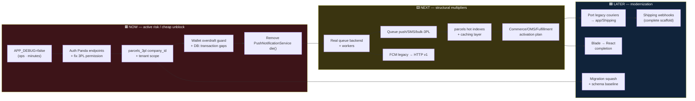
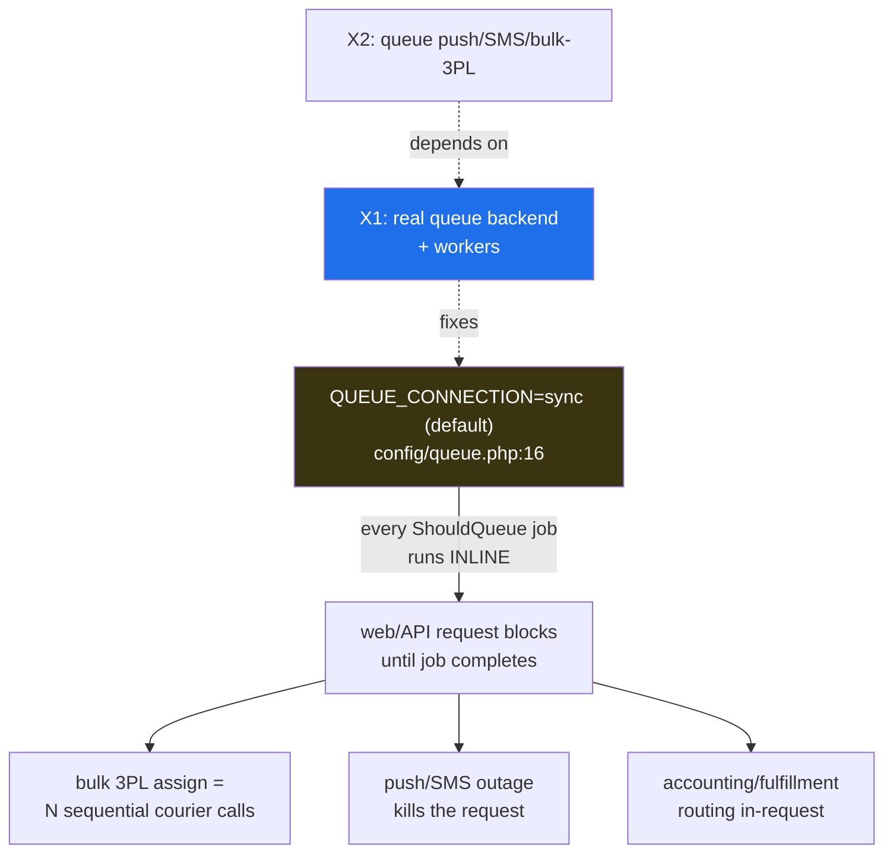
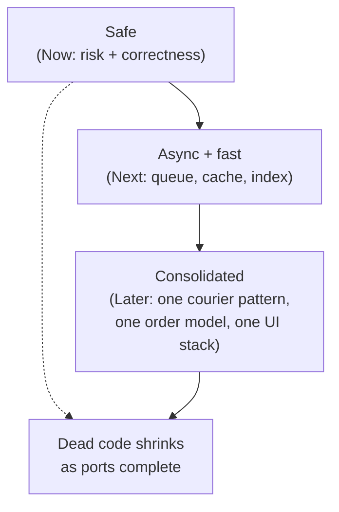

# 23 — Roadmap

> A phased, prioritized engineering roadmap for **`rushly-saas`** — the single
> source of truth for the Rushly platform (Laravel 10; the Flutter apps are
> clients). This is **synthesis, not new investigation**: every item traces to an
> already-written finding in the knowledge base. It reorders the debt, security,
> and performance registers into a sequence a team can actually execute, with
> rationale and effort signals for each move.
>
> Read alongside the source registers this document consolidates:
> [22-Technical-Debt.md](22-Technical-Debt.md) ·
> [17-Security.md](17-Security.md) ·
> [20-Performance.md](20-Performance.md) ·
> [26-Architecture-Decisions.md](26-Architecture-Decisions.md) ·
> [`GAPS.md`](../GAPS.md) · [`_FINDINGS.md`](_FINDINGS.md).
> Module-level detail: [11-Modules.md](11-Modules.md),
> [14-Integrations.md](14-Integrations.md),
> [`docs/shipping-architecture.md`](shipping-architecture.md),
> [`COMMERCE.md`](../COMMERCE.md), [`OMS.md`](../OMS.md),
> [`FULFILLMENT.md`](../FULFILLMENT.md), [`3PL.md`](../3PL.md).

---

## 0. How to read this roadmap

Work is grouped into three horizons by **urgency × dependency**, not by calendar:

- **🟥 Now** — active risk or a cheap unblock. Ship before the platform takes
  meaningful production load. Mostly small, high-leverage changes.
- **🟨 Next** — the structural multipliers. Larger efforts that retire several
  smaller debts as a side effect and make the modern architecture actually
  behave as designed.
- **🟦 Later** — modernization and consolidation. Real value, but sequenced after
  the foundations are safe and async.

Each item carries:

- **Effort** — 🟢 hours · 🟡 days · 🔴 weeks (engineering time, not blast radius).
- **Type** — `ops` (env/infra flip, no code), `fix` (correctness/security),
  `build` (net-new/complete a subsystem), `platform` (cross-cutting hardening),
  `modernize` (migration/cleanup).
- **Traces to** — the register + ID this item comes from. Nothing here is new;
  it is the existing findings, sequenced.

> **Grounding caveat carried from every source doc:** production `.env` values
> (`QUEUE_CONNECTION`, `CACHE_DRIVER`, `APP_DEBUG`) are **Not found in the current
> codebase** — the repo ships defaults (`sync`, `file`) and `.env.example` ships
> `APP_DEBUG=true`. Several "Now" items are therefore *ops decisions* whose real
> state only the operator can confirm. See [20-Performance.md §10](20-Performance.md),
> [22-Technical-Debt.md TD-03/TD-04](22-Technical-Debt.md).

### Roadmap at a glance

---

## 1. 🟥 Now — close active risk, unblock cheaply

These are the items where the cost of waiting is data exposure, silent balance
corruption, or a single provider outage taking down a request. Most are small.

### N1 — Set `APP_DEBUG=false` in production `ops · 🟢`

**Traces to:** [22-Technical-Debt.md TD-03](22-Technical-Debt.md),
[17-Security.md F12](17-Security.md), [`GAPS.md`](../GAPS.md) "Health-check results".

`APP_ENV=production` with `APP_DEBUG=true` renders stack traces **including raw
SQL and bindings** to any authenticated user on a 500 — the confirmed source of
the SQL-string disclosure inside the logs themselves. `GAPS.md` explicitly left
this alone because "flipping it is an operational decision, not a code change."
It is the single cheapest risk removal on the board. While here, also set
`SESSION_SECURE_COOKIE=true` (F12). See [19-Environment.md](19-Environment.md).

### N2 — Authenticate the legacy Panda endpoints + fix the read-can-dispatch permission `fix · 🟢`

**Traces to:** [22-Technical-Debt.md TD-02, TD-07](22-Technical-Debt.md),
[`3PL.md`](../3PL.md) Known-issues §1–2, [_FINDINGS.md](_FINDINGS.md)
(21-Code-Review: `/api/panda/schudule_tracking_temp` route with no controller
method → 500).

Two coupled authorization holes on the legacy courier surface:

- `/api/delivery/*` and `/api/panda/schudule_tracking[_temp]` carry **no Sanctum /
  auth middleware** (`DeliveryPandaController`) — an unauthenticated create/track
  primitive. Put them behind `auth:sanctum` (or a signed-webhook check for inbound
  courier callbacks) + request validation, and delete the dead
  `schudule_tracking_temp` route that would 500.
- `POST /admin/parcel/details/{id}/3pl` (`ParcelController@ThirdPartyLogistics`) is
  gated only by `parcel_read`, so a **read-only operator can trigger a real 3PL
  shipment**. Move it behind `parcel_status_update` or a new `parcel_3pl_assign`
  key. The new Shipping module already does this correctly (requires
  `integrations_update`, [`docs/shipping-architecture.md`](shipping-architecture.md) §13).

> These two are a deliberate pair with N3: TD-02's unauthenticated write + TD-01's
> missing tenant scope compose into a **cross-tenant write primitive**. Fix the
> auth first (cheap), then the scope (below).

### N3 — Add `company_id` + tenant scope to `parcels_3pl` `fix · 🟡`

**Traces to:** [22-Technical-Debt.md TD-01](22-Technical-Debt.md) (🔴 highest-risk
item), [17-Security.md F2](17-Security.md), [`3PL.md`](../3PL.md) §3,
[26-Architecture-Decisions.md ADR-001/ADR-003](26-Architecture-Decisions.md),
[_FINDINGS.md](_FINDINGS.md) (14-Integrations: "cross-tenant AWB-collision leak").

The shared `parcels_3pl` table (Panda / Zajel / Aramex / J&T, distinguished only
by `parcel_3pl_name`) has **no `company_id`**. Because tenancy is
**single-DB, `company_id`-scoped** (the `DatabaseTenancyBootstrapper` is commented
out in `config/tenancy.php` — ADR-001, F2), an unscoped table is a *real* isolation
hole. Per `3PL.md`, one tenant's tracking cron can call
`parcelDelivered($parcel_id, …)` on **another tenant's parcel** when AWBs collide.

Remediation (from `3PL.md` §3): add a `company_id` migration + index; add a
`companywise` global scope to `Parcels_3pl`; scope every write site plus the Panda
job, Aramex sync command, and Zajel webhook; add a unique index on
`(parcel_id, parcel_3pl_name, awb_number)` to stop retried assigns duplicating rows.

> ⚠️ **Doc-vs-code note carried forward:** `parcels_3pl` has **no CREATE
> migration** in the repo (its columns are inferred from the model fillable +
> ALTER migrations — [06-Database.md](06-Database.md), [_FINDINGS.md](_FINDINGS.md)).
> The `2026_07_01_140001` / `2026_05_29_000001` ALTERs already began retrofitting
> `company_id`/`target_company_id`, but hit the utf8mb4 767-byte key-length cap and
> **deferred the composite index** — resolve that here or in L4 (see
> [20-Performance.md §2.3](20-Performance.md)).

### N4 — Wallet overdraft guard + wrap ledger writes in `DB::transaction` `fix · 🟡`

**Traces to:** [_FINDINGS.md](_FINDINGS.md) (04-Business-Logic + Finance +
Hubs modules), [04-Business-Logic.md](04-Business-Logic.md),
[modules/finance-billing-wallet.md](modules/finance-billing-wallet.md).

Two correctness defects in the money path — the highest-consequence non-security
debt, because it silently corrupts balances rather than erroring:

- **No overdraft guard.** `ParcelRepository::store()` debits the merchant wallet
  (`$w_merchant->wallet_balance = $w_merchant->wallet_balance - $parcel->total_delivery_amount`,
  verified at `ParcelRepository.php:654,924`) with **no `current_balance` check** —
  `wallet_balance` can go negative, unlike merchant/hub *payout* requests which do
  guard. Add the same pre-debit guard the payout paths already use.
- **Missing transactions.** `parcelDelivered()`, `parcelPartialDelivered()`, and
  `ReceivedRepository::store()` each run ~8 coordinated balance/ledger writes with
  **only try/catch, no `DB::transaction`** (unlike `store` / `receivedWarehouse` /
  payout / `HubPaymentRepository`, which are wrapped). A mid-write failure drifts
  company/merchant/driver balances against the receipt. Wrap each in a transaction.

> Context: the ledger is **single-entry per-party scalar balances**, not
> double-entry ([_FINDINGS.md](_FINDINGS.md) 03-Business-Domain,
> [modules/accounting-sync.md](modules/accounting-sync.md)) — so there is no
> reconciliation safety net that would catch drift after the fact. That is exactly
> why the transaction wrap matters.

### N5 — Remove the `die()` in `PushNotificationService` `fix · 🟢`

**Traces to:** [20-Performance.md §5.2 / Optimization #4](20-Performance.md).

`PushNotificationService.php:48` calls `die('Curl failed: …')` on an FCM failure
(verified). Because notifications send **synchronously in the request**, a single
remote FCM hiccup **terminates the entire PHP request/job**, not just the
notification. Replacing `die()` with logged error handling is a one-line
robustness fix; queuing the send is the fuller fix in **X2**. (Related dead path:
`FollowupNotificationDispatcher::push()` calls methods that don't exist on the
service — a silent no-op, [_FINDINGS.md](_FINDINGS.md) Notifications — worth
fixing in the same pass.)

**Now, in one line each — the security P0/P1 tail** (from
[17-Security.md §13](17-Security.md), fold into this horizon as capacity allows):
move `rxcourier.api_key` to env + rotate + `hash_equals` (**F1**); replace the
fixed `123456` OTP with `random_int` *before* enabling `login_otp` anywhere
(**F3**); drop the raw-password `userpassword` remember-me cookie (**F4**);
validate `signatureImage` uploads (**F6**); add `throttle:5,1` to mobile/admin
login endpoints (**F5**).

---

## 2. 🟨 Next — the structural multipliers

The single most consequential runtime fact across the whole codebase: **defaults
are `QUEUE_CONNECTION=sync` and `CACHE_DRIVER=file`**. The entire module
architecture (per-connection tracking sync, per-order fulfillment routing, queued
accounting sync) is designed for async fan-out, and the default connection
**defeats it** — every `ShouldQueue` job runs inline in the dispatching request.
Fixing this is the top lever, and it unlocks the value of the fixes above.

### X1 — Move to a real queue backend + run workers `ops/platform · 🟡`

**Traces to:** [22-Technical-Debt.md TD-04](22-Technical-Debt.md),
[20-Performance.md §1, §5, Optimization #3](20-Performance.md),
[_FINDINGS.md](_FINDINGS.md) (07-Laravel: "22 jobs run inline unless overridden").

Set `QUEUE_CONNECTION=redis` (or `database`) + run `queue:work`, and
`CACHE_DRIVER=redis`. Redis is **already fully configured** but opt-in
(`config/database.php`); the Stancl `QueueTenancyBootstrapper` is **already enabled**
(`config/tenancy.php`), so queued jobs re-enter tenant context correctly once a
non-sync driver is used. No Horizon/Octane is present — decide whether to add
Horizon for worker supervision. **Load-test every `ShouldQueue` class after the
flip** — they were all written assuming async and have never actually run async in
this configuration.

### X2 — Queue the synchronous-by-design paths `platform · 🟡`

**Traces to:** [20-Performance.md §3.2, §5.2, Optimization #2/#4](20-Performance.md).

Once X1 lands, move the inline I/O off the request:

- **Bulk 3PL assign** (`ParcelBulkActionController`, ~1,307 lines) makes **one
  outbound courier call per parcel, in-request** — selecting 100 parcels = 100
  sequential remote calls before the response returns, risking
  `max_execution_time`. Route it through `app/Shipping/Jobs/CreateShipmentJob`
  (one queued job per parcel/connection). This is the worst single API-latency
  path.
- **Push + SMS** (`PushNotificationService`, `SmsService`) — wrap in queued jobs so
  a flaky provider degrades one notification, not the request (completes N5).
- **Event listeners** — zero queued listeners exist repo-wide; make the
  high-fanout ones (`ShipmentStatusChanged` handlers) `ShouldQueue`.

### X3 — Migrate FCM from the deprecated legacy API to HTTP v1 `fix · 🟡`

**Traces to:** [_FINDINGS.md](_FINDINGS.md) (05-System-Architecture, 12-Workflows,
14-Integrations, Notifications — cited five times),
[14-Integrations.md](14-Integrations.md),
[modules/notifications.md](modules/notifications.md).

`PushNotificationService` uses Google's **deprecated legacy `fcm/send` +
`Authorization: key=` server-key API** (verified: `fcm.googleapis.com/fcm/send`
across the file). Google has sunset this API — push will stop working. Migrate to
**FCM HTTP v1** (OAuth2 service-account tokens; `firebase/php-jwt` is already
described on the driver-app side per INTEGRATIONS.md §5). Do this together with X2
so the rewrite lands directly in the queued-job form. Note push is only wired for
driver/merchant/admin apps; the five ops apps have no FCM ([08-Flutter.md](08-Flutter.md)).

### X4 — Index the hot `parcels` paths + add a caching layer `platform · 🟡`

**Traces to:** [20-Performance.md §2.2, §4, Optimization #1/#5](20-Performance.md).

The legacy hot tables are unindexed beyond FKs while the new module tables ship
composite `(company_id, …)` indexes. Highest-ROI items:

- **`parcels(company_id, tracking_id)` + `(company_id, status)` indexes.** Today
  `tracking_id` and `status` are **unindexed** → full-table scans on public
  tracking, driver scan-to-fetch, statements, and every list/report screen.
  *Low code effort; schedule the build off-peak* — the migration author explicitly
  notes `parcels` is hot and an UPDATE-everything would lock it.
- **Cache the public tracking response** (per `company_id` + `tracking_id`, short
  TTL, invalidated on `ParcelEvent` insert) and the tenant reference tables
  (cities/areas/categories) that render on nearly every parcel form. App cache is
  sparse today (7 call-sites) and there is **no HTTP-response/ETag layer**.
- **Exports:** convert the large parcel/shipment/report exports from
  `FromCollection` (materializes everything in memory) to `FromQuery` +
  `WithChunkReading` + queue (Optimization #5).

> Also resolve the deferred `parcels_3pl` composite index (utf8mb4 key-length cap,
> §2.3) — naturally pairs with N3/L4.

### X5 — Decide and execute the Commerce / OMS / Fulfillment activation plan `build · 🔴`

**Traces to:** [22-Technical-Debt.md TD-09](22-Technical-Debt.md),
[26-Architecture-Decisions.md ADR-003/004/005/006](26-Architecture-Decisions.md),
[`COMMERCE.md`](../COMMERCE.md), [`OMS.md`](../OMS.md),
[`FULFILLMENT.md`](../FULFILLMENT.md),
[_FINDINGS.md](_FINDINGS.md) (12-Workflows, OMS, Fulfillment, Commerce).

This is the largest "wired-but-dormant" surface. Everything gated by
`FEATURE_COMMERCE_LAYER` (**default OFF**) 404s in production today: Commerce
webhook ingest, the OMS order UI, Fulfillment routing UI, superadmin fulfillment
defaults, and the ops failed-jobs viewer. The schema and module bindings ship in
every environment ("ship the schema, gate the behavior" — ADR-006), so it carries
maintenance cost with **zero runtime coverage** — untested-in-prod paths that will
all activate at once when the flag flips.

The decision is binary and must be made, not drifted:

1. **Finish and flip it** — complete the known unfinished seams (below), then GA
   the flag; **or**
2. **Keep it dark** — add CI that runs the gated paths with the flag forced on, so
   they don't rot, and set a flag→GA date so the flag doesn't become permanent.

Known unfinished seams to close before flip (all documented, none surprises):

| Seam | State | Source |
|---|---|---|
| `OrderUpdated` has **no listeners** | storefront edits (e.g. changed address pre-pickup) don't propagate to an already-created parcel — manual ops task today | ADR-004, OMS.md §6, [_FINDINGS.md](_FINDINGS.md) |
| Fulfillment lifecycle events (`Requested/Started/Completed/Failed`) fired with **zero subscribers** | the `in_progress→completed` roll-forward from `ShipmentDelivered`/WMS-dispatch is unwired | ADR-005, FULFILLMENT.md §9 |
| Storefront **writeback on `FulfillmentCompleted`** (intended `Commerce::pushOrderUpdate`) | documented next step, **not live** | ADR-005 |
| Strategy **retry policy** for transient faults | marked "TBD (Phase 6.5)" in the interface docblock | ADR-005, [_FINDINGS.md](_FINDINGS.md) 07-Laravel |
| `vendor_direct` strategy | scaffolded but commented out (Phase 6.5+) | FULFILLMENT.md, ADR-005 |
| **StockChanged → storefront push** (`SupportsInventorySync`) | forward-looking; could not be confirmed active | [_FINDINGS.md](_FINDINGS.md) 12-Workflows/WMS |

> Also fold in **child-company billing** (TD-12): `ChildCompanyController` has an
> explicit `TODO(billing)` — child companies are created against the parent's plan
> but "parent pays out-of-band for now." Schedule the parent-pays-for-children
> wiring when that product capability is prioritized.

---

## 3. 🟦 Later — modernization & consolidation

Real value, correctly sequenced *after* the platform is safe (Now) and async
(Next). Each of these is a large, deliberate, non-destructive effort.

### L1 — Port the legacy couriers to `app/Shipping/` `modernize · 🔴`

**Traces to:** [22-Technical-Debt.md TD-06, TD-10, TD-11, TD-13](22-Technical-Debt.md),
[26-Architecture-Decisions.md ADR-003](26-Architecture-Decisions.md),
[`3PL.md`](../3PL.md), [`docs/shipping-architecture.md`](shipping-architecture.md) §12.

Two courier patterns coexist "on purpose": **Panda / Zajel / Aramex / J&T** on the
legacy `Service` + `parcels_3pl` pattern, **Logestechs** on the new `app/Shipping/`
module (verified end-to-end since 2026-06-30). The legacy pattern carries
N2/N3's holes *plus* hardcoded defaults (Panda hardcodes UAE/Dubai/AED and driver
id `12`; Zajel `"DXB"`; Aramex `"DUBAI"`/`AE` — TD-10) and dead/duplicate code
(TD-13). Porting each legacy provider to a `Shipping\Providers\*` class and
repointing the controllers **retires TD-01/02/07/10/11/13 as a side effect** and
collapses four sync commands into the generic `shipping:sync-tracking`.

Include the **`logestechs_settings` → `shipping_connections` backfill** (TD-11,
ADR-003) — there was no data migration when Logestechs moved, so operators
currently re-enter connections by hand and old rows are orphaned config. Until the
port is done, treat `parcels_3pl` and `shipping_connections` as **two records-of-
truth** and never assume one.

### L2 — Complete the Shipping webhooks scaffold `build · 🟡`

**Traces to:** [_FINDINGS.md](_FINDINGS.md) (Shipping module),
[`docs/shipping-architecture.md`](shipping-architecture.md),
[12-Workflows.md](12-Workflows.md).

`app/Shipping/Services/WebhookService.php` and the `SupportsWebhooks` marker
interface exist, but **no provider implements `SupportsWebhooks` and no
`/api/shipping/webhooks/{providerCode}` route exists** (verified) — webhooks are
**scaffolding only**. Tracking is currently poll-based (`shipping:sync-tracking`
every 5 min). Completing this (wire the route, implement the interface on at least
one provider, verify signatures) turns tracking push-based for providers that
support it. Naturally follows L1. Related deferred item: **cancel propagation** —
parcel-cancel does not auto-dispatch `CancelShipmentJob`, and cancellation is
unimplemented for Zajel/Jet/Logestechs, leaving AWBs open courier-side
([_FINDINGS.md](_FINDINGS.md) 12-Workflows/14-Integrations).

### L3 — Finish the Blade → React + Inertia migration `modernize · 🔴`

**Traces to:** [22-Technical-Debt.md TD-05](22-Technical-Debt.md),
[26-Architecture-Decisions.md ADR-007](26-Architecture-Decisions.md),
[`docs/inertia/migration-guide.md`](inertia/migration-guide.md),
[16-UI-UX.md](16-UI-UX.md).

Two rendering stacks run side by side: **~405 legacy backend Blade files** vs
**~191 `.jsx` Inertia pages**. Every controller action is in one of two shapes and
follows divergent conventions (the new stack mandates flattened props,
server-resolved URLs/labels/permissions, `hasPermission()` gating, hex status
colors, `t.*` i18n — the legacy blades follow none). Continue page-by-page using
the 15-step checklist in `migration-guide.md` §9, prioritizing high-traffic
operator pages (parcel, merchant, hub, WMS); retire `Helper.php` HTML-builder
helpers as their pages convert.

> Scope note: **not all 482 blades are dead** — root/mail/PDF templates stay Blade
> by design (TD-05). The debt is the **operator CRUD screens** still on Blade. Also
> note the migration is further along than some docs claim: the super-admin
> plan/company screens were **already ported to Inertia** after the audit
> ([_FINDINGS.md](_FINDINGS.md) SaaS-Tenancy). Verify current state per page before
> counting it as remaining.

### L4 — Squash the migration history + schema baseline `platform · 🟡`

**Traces to:** [22-Technical-Debt.md TD-08](22-Technical-Debt.md),
[06-Database.md](06-Database.md).

**191 migrations** span `2014_05_31` → `2026_07_27`, many being
`add_<col>_to_<table>` patches, with **duplicate timestamps** creating
non-deterministic ordering (e.g. two files share `2026_07_17_100000`). Consider a
`schema:dump` baseline collapsing 2014–2024 into one SQL file, keep recent
migrations incremental, and **enforce unique timestamps in review**. Also **audit
remaining integration tables for missing `company_id`** before they repeat the
TD-01 pattern (the late `add_company_id_to_salla_merchants` migration shows this is
an active retrofit). This is the natural home for the deferred `parcels_3pl`
composite index from N3/X4.

---

## 4. Sequencing rationale

The order is **cheapest-highest-impact first, then multipliers, then large
structural work that retires multiple smaller items**:

1. **Now** removes active exposure and silent corruption for near-zero effort — an
   `APP_DEBUG` flip, an auth middleware, a `company_id` column, a balance guard, a
   deleted `die()`. Nothing here is a week of work; all of it is a live risk.
2. **Next** flips the async switch (`sync` → real queue) that the entire module
   architecture was designed around, then moves the blocking I/O off the request
   and indexes the hot paths — turning the *design* into the *behavior*. X5 forces
   the Commerce/OMS/Fulfillment decision so a large dormant surface stops rotting.
3. **Later** consolidates the "half-migrated dualities" the ADRs call the
   platform's dominant open risk (legacy 3PL vs Shipping; `Parcel` vs `Order`;
   Blade vs React) — each intentional, each doubling the surface a developer must
   hold in their head. These retire whole clusters of smaller debt (L1 alone
   closes six TD items) but only pay off once the foundation underneath is safe.

### Dependency notes

- **N2 before N3** — fix the unauthenticated write, then the missing scope; alone
  each is bad, together they compose into a cross-tenant write primitive.
- **X1 before X2/X3** — queuing push/SMS/bulk-3PL and rewriting FCM only help once
  a non-`sync` backend exists; otherwise the "queued" jobs still run inline.
- **X5 before L1/L2** — settle the Commerce/OMS/Fulfillment direction before
  investing weeks porting couriers into the module those flows depend on.
- **N3 feeds L4** — the `parcels_3pl` `company_id` work and its deferred composite
  index are cheapest to finish inside the schema-baseline pass.

---

## 5. What this roadmap deliberately excludes

- **New product features** beyond completing already-scaffolded subsystems. The
  roadmap is grounded in *real current state* (debt, security, performance,
  dormant-but-wired modules) per the task scope — it does not invent net-new
  capabilities.
- **Flutter client rework** beyond what the platform requires. Client-side items
  (Dio retry/HTTP cache, image compression parity, locale persistence, dead
  navigation) are catalogued in [20-Performance.md §8](20-Performance.md),
  [08-Flutter.md](08-Flutter.md), and per-app docs under
  [`apps/`](apps/) — they are client hardening, sequenced by each app team.
- **ZATCA Phase 2** (live clearance/reporting), **Nafath**, **SMSA**, and other
  integrations that are **Not found in the current codebase** as anything beyond
  stubs ([14-Integrations.md](14-Integrations.md), [_FINDINGS.md](_FINDINGS.md)) —
  these are future product decisions, not debt.

---

## Sources

Registers consolidated (read in full for this synthesis):

- [22-Technical-Debt.md](22-Technical-Debt.md) — TD-01…TD-14, remediation order,
  recently-closed items
- [17-Security.md](17-Security.md) — F1…F12, consolidated remediation plan (P0–P3)
- [20-Performance.md](20-Performance.md) — runtime defaults, indexing, N+1, caching,
  queues, exports; Optimization backlog #1–#9
- [26-Architecture-Decisions.md](26-Architecture-Decisions.md) — ADR-001…ADR-009,
  cross-cutting "half-migrated dualities" theme
- [`GAPS.md`](../GAPS.md) — 2026-06-19 log triage, `APP_DEBUG` note, 06-30→07-22
  architectural closures
- [`_FINDINGS.md`](_FINDINGS.md) — 243 doc-vs-code conflicts + 246 gaps (wallet
  overdraft, DB-transaction gaps, FCM legacy API, shipping webhook scaffold,
  `OrderUpdated`/Fulfillment unwired events, parcels_3pl leak)

Code spot-verified while writing (cheap checks, cited inline):

- `config/features.php` — `commerce_layer` / `login_otp`, both `env(…, false)`
- `config/queue.php:16` — `'default' => env('QUEUE_CONNECTION', 'sync')`
- `app/Http/Services/PushNotificationService.php` — `fcm/send` legacy endpoint,
  `Authorization: key=`, `die('Curl failed…')` at line 48
- `app/Shipping/Services/WebhookService.php`, `app/Shipping/Contracts/SupportsWebhooks.php`
  — webhook scaffold present, no route/provider wired
- `app/Repositories/Parcel/ParcelRepository.php:654,924` — unguarded wallet debit

Cross-referenced module/design docs:
[11-Modules.md](11-Modules.md) · [14-Integrations.md](14-Integrations.md) ·
[`docs/shipping-architecture.md`](shipping-architecture.md) ·
[`COMMERCE.md`](../COMMERCE.md) · [`OMS.md`](../OMS.md) ·
[`FULFILLMENT.md`](../FULFILLMENT.md) · [`3PL.md`](../3PL.md) ·
[`docs/inertia/migration-guide.md`](inertia/migration-guide.md) ·
[modules/finance-billing-wallet.md](modules/finance-billing-wallet.md) ·
[modules/notifications.md](modules/notifications.md).

Grounding: [`_CONTEXT_BRIEF.md`](_CONTEXT_BRIEF.md).
