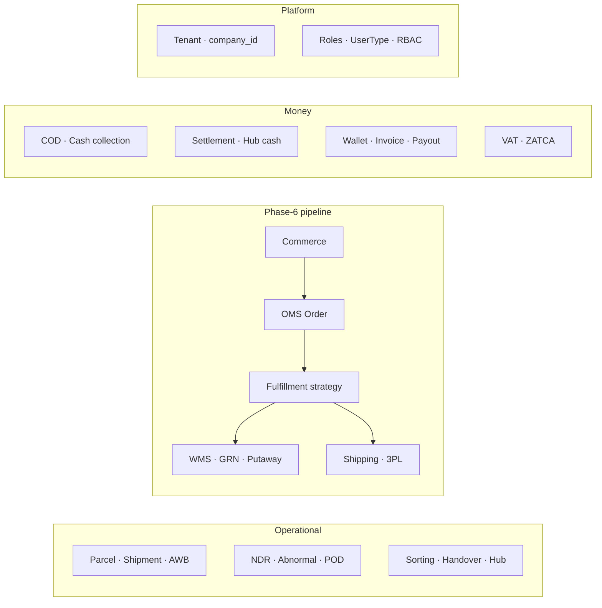

# 24 — Glossary

> Alphabetized reference for every domain term, entity, role, enum, acronym, and system name in the Rushly platform. Each entry gives a crisp definition plus **where it lives** — the code path(s) and/or the deep-dive doc that owns it.
>
> **Scope note:** `rushly-saas` (`/var/www/rushly-saas`, **Laravel 10** — the README's "Laravel 12" is wrong, `composer.json` pins `^10.10`) is the **single source of truth**. All Flutter apps are thin clients. This glossary is a synthesis index — it points at the authoritative docs rather than re-deriving them. For the narrative, read [03-Business-Domain.md](03-Business-Domain.md), [04-Business-Logic.md](04-Business-Logic.md), [06-Database.md](06-Database.md), and [11-Modules.md](11-Modules.md).
>
> Enum values below were read directly from `app/Enums/*`. Where a term has no code home, the entry says **"Not found in the current codebase."**

Cross-references: [03-Business-Domain.md](03-Business-Domain.md) · [04-Business-Logic.md](04-Business-Logic.md) · [06-Database.md](06-Database.md) · [11-Modules.md](11-Modules.md) · [14-Integrations.md](14-Integrations.md) · [_CONTEXT_BRIEF.md](_CONTEXT_BRIEF.md)

---

## How to read an entry

**Term** *(kind — enum / entity / role / acronym / system / concept)* — one-line definition. `code/path.php` or Doc.md.

Enum values are shown as `NAME(value)` exactly as declared in source. The colon-separated "kind" tag lets you skim for just roles, just enums, etc.

## Term categories at a glance

---

## A

**Abnormal shipment** *(concept / entity)* — a parcel that has stalled (no status activity) for N days, flagged by the hourly `shipments:detect-abnormal` watchdog. Persisted as `abnormal_shipments` rows; parcel may move to `ABNORMAL(36)`. `app/Models/Backend/AbnormalShipment.php`, `app/Console/Commands/DetectAbnormalShipments.php`, `AbnormalShipmentRepository::detect()`. See [03-Business-Domain.md](03-Business-Domain.md) §11.3.

**AbnormalSeverity** *(enum)* — staleness grade for abnormal shipments: `warning` (3–4 days), `danger` (5–6), `critical` (7+). `app/Enums/AbnormalSeverity.php`.

**Account / Chart of accounts** *(entity)* — the bank/cash layer of the ledger. `accounts` table (each row has a mutable `balance`) mirrored by append-only `bank_transactions`. `AccountController`. See [ACCOUNTING.md](../ACCOUNTING.md), [11-Modules.md](11-Modules.md) §8.

**AccountHeads / account_heads** *(entity / concept)* — categorization of money movements. **IDs 1–7 are hardcoded** in application logic (`AccountHeadSeeder`); reordering silently breaks the parcel/income/expense money paths. `app/Enums/AccountHeads.php`. ⚠️ documented gotcha, [ACCOUNTING.md](../ACCOUNTING.md) §3/§8.

**AccountType** *(enum)* — `ADMIN(1)`, `USER(2)`. `app/Enums/AccountType.php`.

**Addon** *(entity)* — a purchasable add-on layered on a subscription plan. `app/Models/Backend/Addon.php`, `AddonController`. [super-admin.md](../super-admin.md).

**Admin** *(role — `UserType::ADMIN(1)`)* — tenant back-office operator. Served by `routes/web.php`, `Api/V10/Admin/*`, the Inertia web panel, and `rushly-admin-app`.

**AiInsightsService** *(system)* — generates narrative KPI insights for the Performance Dashboard (surfaced on dashboard, not pushed). `app/Services/Performance/AiInsightsService.php`.

**Aramex** *(system — 3PL provider)* — legacy external courier (SOAP integration). Status pulled by `aramex:sync-tracking` cron (every 15 min). `app/Services/AramexService.php`. Uses the `parcels_3pl` table. [3PL.md](../3PL.md).

**AWB (Air Waybill)** *(acronym / concept)* — the tracking number / shipping label assigned by an external courier. Stored on `parcels_3pl.awb_number` with label URL in `awb_pdf` (legacy) or minted by the Shipping module's `AwbService` (`app/Shipping/Services/AwbService.php`). Printed in bulk via `/admin/bulk_action` → "Print AWBs". Also written back to the storefront by the `rushly-salla` bridge. See [3PL.md](../3PL.md), [docs/shipping-architecture.md](shipping-architecture.md).

---

## B

**Bag** *(concept)* — an ephemeral per-shift grouping of parcels at a sorting center, tracked **device-side** in `rushly-sorting-app` (Bags tab), **not persisted server-side**. See [03-Business-Domain.md](03-Business-Domain.md) §8.2.

**Bank transaction** *(entity)* — append-only mirror of every balance move in the bank/cash layer. `bank_transactions` table, `BankTransactionController`. [ACCOUNTING.md](../ACCOUNTING.md).

**BooleanStatus** *(enum)* — generic yes/no status flag used across models. `app/Enums/BooleanStatus.php`.

**Bulk action** *(concept)* — the `/admin/bulk_action` surface (`ParcelBulkActionController`) for multi-parcel operations: Assign 3PL, Change Status, Cancel, Print AWBs, Export XLSX. Pre-flight rule: a parcel must be in `RECEIVED_WAREHOUSE` before bulk 3PL assignment. [11-Modules.md](11-Modules.md) §3.

---

## C

**Cash collection** *(concept / field)* — the COD amount a driver collects from the end customer, stored on `parcels.cash_collection`. Drives the settlement math on delivery. See **COD**, **Settlement**.

**CashReceivedFromDeliveryman** *(entity)* — records the driver→hub cash hand-off during reconciliation. `app/Models/CashReceivedFromDeliveryman.php` + `ReceivedRepository`. [ACCOUNTING.md](../ACCOUNTING.md) §4.5.

**COD (Cash on Delivery)** *(acronym / concept)* — the core courier-economy money flow: driver collects cash from the customer at delivery, cash flows driver→hub→bank, and the merchant is credited net of fees. Net merchant delta per parcel = `cash_collection − total_delivery_amount − vat_amount`. Booked at `ParcelRepository::parcelDelivered`. [03-Business-Domain.md](03-Business-Domain.md) §12.2.

**Commerce (module)** *(system)* — generic, multi-tenant storefront-ingestion layer (`app/Commerce/`). Receives orders via signed webhooks and pushes inventory back. **Feature-flag gated** (`FEATURE_COMMERCE_LAYER`, default off). First provider: Salla. [COMMERCE.md](../COMMERCE.md), [11-Modules.md](11-Modules.md) §5.

**commerce_layer** *(concept — feature flag)* — `config('features.commerce_layer')`, env `FEATURE_COMMERCE_LAYER`, **default off**. Gates the entire Commerce→OMS→Fulfillment pipeline. `config/features.php`.

**CommerceConnection** *(entity)* — a tenant's stored, encrypted credentials for one storefront. `app/Commerce/Models/CommerceConnection.php`.

**company_id** *(concept)* — the tenant-isolation foreign key present on almost every business table. Enforced by a global scope (`Parcel::booted()`) and the `Companywise` trait/`scopeCompanywise()`, with a `SUPER_ADMIN` bypass. ⚠️ `parcels_3pl` notably has **no** `company_id` — a documented multi-tenant risk. [03-Business-Domain.md](03-Business-Domain.md) §3.1, [3PL.md](../3PL.md).

**Companywise** *(concept — trait/scope)* — the tenant-scoping mechanism (`Companywise` trait / `scopeCompanywise()`) applied to models to clamp queries to the current `company_id`.

**Courier statement** *(entity)* — per-courier append-only ledger (`courier_statements`), one leg of the three-layer accounting model. [ACCOUNTING.md](../ACCOUNTING.md).

**current_balance** *(concept / field)* — per-party mutable running balance scalar (`merchants.current_balance`, `delivery_man.current_balance`, `hubs.current_balance`, `accounts.balance`). The source of truth for "currently owed"; can drift because the system is **not** double-entry. ⚠️ `hubs.current_balance` semantics are **inverted** (rises when cash flows out to a bank). [ACCOUNTING.md](../ACCOUNTING.md) §8.

**current_payable** *(concept / field)* — the net amount owed to a merchant for a parcel/invoice = `(cash collected − delivery charges − VAT) − return charges`. Computed at invoice generation. `parcels.current_payable`. [03-Business-Domain.md](03-Business-Domain.md) §12.4.

**CustomerDomain** *(entity)* — supports customer-facing custom tracking domains. `app/Models/CustomerDomain.php`. See **Public tracking**.

**Cycle count** *(concept / entity)* — a scoped warehouse stock re-count (audit) whose variance produces a `WmsAdjustment`. `app/Models/Backend/Wms/WmsCycleCount.php`. [03-Business-Domain.md](03-Business-Domain.md) §6.1.

---

## D

**Daftra** *(system)* — external accounting SaaS; one of three per-tenant one-way sync connectors. `app/Daftra/` (ApiClient + CustomerSync/InvoiceSync/BillSync/VendorSync/InvoicePaymentSync). [INTEGRATIONS.md](14-Integrations.md), [ACCOUNTING.md](../ACCOUNTING.md).

**Deliveryman / DeliveryMan** *(role — `UserType::DELIVERYMAN(3)` / entity)* — last-mile delivery agent. Carries `current_balance` (cash in hand) and `delivery_charge` (commission). `app/Models/Backend/DeliveryMan.php`, `DeliveryManParcelController`, served by `rushly-driver-app`. [11-Modules.md](11-Modules.md) §11.

**Deliveryman statement** *(entity)* — per-driver append-only ledger (`deliveryman_statements`). [ACCOUNTING.md](../ACCOUNTING.md).

**DeliveryPanda** *(system — 3PL provider)* — legacy external courier. `app/Services/DeliveryPandaService.php`, `parcels_3pl`. ⚠️ some `/api/panda/*` routes are unauthenticated. [3PL.md](../3PL.md).

**DeliveryTime** *(enum)* — promised delivery window: `LAST_TIME(16)` (4pm cutoff hour), `SUBCITY(2 days)`, `OUTSIDECITY(3 days)`. `app/Enums/DeliveryTime.php`.

**DeliveryType** *(enum)* — service level: `SAMEDAY(1)`, `NEXTDAY(2)`, `SUBCITY(3)`, `OUTSIDECITY(4)`. Basis for the on-time SLA proxy in performance scoring. `app/Enums/DeliveryType.php`.

**Double-entry** *(concept — NOT used)* — Rushly accounting is **not** double-entry; there is no `debits = credits` invariant. Per-party scalar balances are authoritative and can drift. [ACCOUNTING.md](../ACCOUNTING.md) §8.

---

## F

**FCM (Firebase Cloud Messaging)** *(acronym / system)* — the push-notification channel for all Flutter apps. `PushNotificationService`, admin `/fcm-subscribe` / `/fcm-unsubscribe`. `app/Http/Services/PushNotificationService.php`. [11-Modules.md](11-Modules.md) §14.

**Feature flag** *(concept)* — toggles in `config/features.php`: `commerce_layer` (default off) and `login_otp` (default off). See **commerce_layer**.

**FEFO / FIFO / LIFO** *(enum — `PickingStrategy`)* — warehouse stock-consumption order: `FIFO` (First-In-First-Out), `FEFO` (First-Expired-First-Out — matters for perishables), `LIFO`. `app/Enums/Wms/PickingStrategy.php`.

**Fleet** *(system / module)* — company-vehicle transport management, distinct from last-mile parcel delivery. Models `app/Models/Backend/Fleet/{FleetVehicle,FleetTrip,FleetFuelLog,FleetMaintenanceReport}.php`; API `Api/V10/Fleet/FleetDriverApiController.php`; served by `rushly-fleet-app` (Trips / Vehicle / Fuel / Maintenance). [11-Modules.md](11-Modules.md) §7.

**Fleet driver** *(role)* — driver operating a company vehicle via the Fleet subsystem. Sanctum-authenticated; served by `rushly-fleet-app`.

**FSM (Finite State Machine)** *(acronym / concept)* — ⚠️ Rushly parcel transitions are **not** a formal FSM; there is no single transition table. Transitions are imperative across `ParcelRepository`, 3PL sync jobs, and per-app controllers. State diagrams in the docs are descriptive. [03-Business-Domain.md](03-Business-Domain.md) §3.2.

**Fulfillment (module)** *(system / entity)* — decides **how** an OMS order ships and dispatches to the doer; never ships anything itself. `app/Fulfillment/`. Triggered by `OrderReceived` → `RouteToFulfillmentListener` → `FulfillmentService::fulfill()`. Entity `Fulfillment` (status `pending → in_progress → completed | failed | cancelled`). [FULFILLMENT.md](../FULFILLMENT.md), [11-Modules.md](11-Modules.md) §4.

**Fulfillment strategy** *(concept)* — the pluggable "how to ship" implementation chosen by the router. Registered strategies: `wms` (`WmsFulfillmentStrategy`), `threepl_dropship` (`ThreePlDropshipStrategy`), `merchant_self` (`MerchantSelfStrategy`); `vendor_direct` is reserved/not-yet-implemented. All implement `FulfillmentStrategyInterface` (`code/execute/cancel`). `config/fulfillment.php`. [FULFILLMENT.md](../FULFILLMENT.md) §4.

**FulfillmentDefault** *(entity)* — fallback strategy configuration used when no `FulfillmentRoute` matches. `app/Fulfillment/Models/FulfillmentDefault.php`.

**FulfillmentRoute** *(entity)* — a priority-ordered routing rule; every non-null condition column (`condition_merchant_id`, `condition_country`, `condition_source_channel`, `condition_min_amount`) is ANDed. First match wins. `fulfillment_routes` table. [FULFILLMENT.md](../FULFILLMENT.md) §3.

**FulfillmentStatus (OMS)** *(enum)* — order-level fulfillment progress: `UNFULFILLED / PARTIAL / FULFILLED`. `app/Oms/Enums/FulfillmentStatus.php`.

**FulfillmentStatus (WMS)** *(enum)* — warehouse fulfillment lifecycle: `pending / picking / packing / ready / dispatched / cancelled`. `app/Enums/Wms/FulfillmentStatus.php`.

---

## G

**Global scope (tenant)** *(concept)* — the `booted()` global scope on `Parcel` (and `Companywise` on others) that clamps every query to the current tenant's `company_id`, with CLI/queue/cron guards and a `SUPER_ADMIN` bypass. Escape hatch: `Parcel::withoutGlobalScope('tenant')`. [03-Business-Domain.md](03-Business-Domain.md) §3.1.

**GRN (Goods Receipt Note)** *(acronym / entity)* — the inbound-receiving document created when a merchant sends stock to a warehouse; scanned and counted, then materializes `WmsStock`. `app/Models/Backend/Wms/{WmsGrn,WmsGrnItem}.php`, `GrnStatus` enum. [03-Business-Domain.md](03-Business-Domain.md) §6.1.

**GrnStatus** *(enum)* — `draft / in_progress / completed / discrepancy`. `app/Enums/Wms/GrnStatus.php`.

---

## H

**Handover** *(concept)* — `POST /admin/sorting/handover`: bulk-transfers parcels between hubs (flips each to `TRANSFER_TO_HUB`, sets `transfer_hub_id`, writes a `ParcelEvent`). **Domain rule:** HUB/INCHARGE users may only hand over parcels currently in their own hub. `AdminSortingController::handover`. [03-Business-Domain.md](03-Business-Domain.md) §8.2.

**Haversine / HaversineDistance** *(system)* — point-to-point great-circle distance used for KPI/proximity. **Not** a route optimizer. `app/Services/Performance/HaversineDistance.php`. [03-Business-Domain.md](03-Business-Domain.md) §8.4.

**HMAC signature** *(concept)* — the webhook-authenticity check performed by `WebhookIngestService` before persisting a `WebhookEvent`. [COMMERCE.md](../COMMERCE.md) §5.

**Hub** *(entity / role — `UserType::HUB(5)`)* — a physical sorting/distribution center. Has staffing (in-charge), a per-hub cash ledger, and coverage areas. `app/Models/Backend/Hub.php`, `HubController`. [11-Modules.md](11-Modules.md) §12.

**Hub cash** *(concept)* — the cash a hub is holding (COD collected by its drivers, awaiting bank deposit), tracked via `hubs.current_balance`. ⚠️ **inverted semantics** — the balance rises when cash flows *out* to a bank. Deposited via `HubPayment` → `accounts.balance`. `rushly-admin-app` (hub_cash feature). [ACCOUNTING.md](../ACCOUNTING.md) §8.

**HubInCharge** *(entity / role — `UserType::INCHARGE(4)`)* — the staff member managing a hub. `app/Models/Backend/HubInCharge.php`.

**HubPayment / HubStatement** *(entity)* — per-hub payout record and append-only ledger (`hub_statements`). `app/Models/Backend/{HubPayment,HubStatement}.php`, `HubPaymentRepository`.

---

## I

**iMile** *(system — 3PL provider stub)* — external courier present only as config + card; **no service class implemented**. [3PL.md](../3PL.md).

**Incharge** *(role — `UserType::INCHARGE(4)`)* — hub in-charge / supervisor-level operator. See **HubInCharge**.

**Inertia** *(system)* — `inertiajs/inertia-laravel ^2`; the admin web panel is React pages (`resources/js/Pages/*.jsx`) served over Inertia. Mid-migration from Blade (`docs/inertia/`). [_CONTEXT_BRIEF.md](_CONTEXT_BRIEF.md).

**Invoice** *(entity)* — a merchant billing snapshot cut by `invoice:generate` (daily 13:00) over delivered/partial/return parcels not yet invoiced. `invoices` + `invoice_parcels` tables, `InvoiceRepository::store`. **Read-only against balances** — money moves only on payout. [ACCOUNTING.md](../ACCOUNTING.md) §4.9.

**InvoiceStatus** *(enum)* — `UNPAID(0)`, `PROCESSING(2)`, `PAID(3)`. `app/Enums/InvoiceStatus.php`.

---

## J

**J&T / Jet** *(system — 3PL provider)* — legacy external courier. `app/Services/JetService.php`, `jet:sync-tracking` cron (every 15 min), `parcels_3pl`. [3PL.md](../3PL.md).

---

## K

**KPI / KpiAggregator** *(acronym / system)* — the executive KPI grid computing delivery/cancellation/COD/revenue metrics live against ledgers + parcels (respecting the companywise scope + a `PerformanceFilters` DTO). Metrics the data can't express are returned `proxy: true` with a note. Groups twelve statuses into `CANCELLED_STATUSES`. `app/Services/Performance/KpiAggregator.php`. [03-Business-Domain.md](03-Business-Domain.md) §13.

**Knowledge Base** *(system)* — in-app, role/module-scoped help engine (admin, merchant-panel, WMS). `AdminKnowledgeBaseController`, `SectionType` enum. [KNOWLEDGE_BASE.md](../KNOWLEDGE_BASE.md), [11-Modules.md](11-Modules.md) §18.

---

## L

**LabelTemplate** *(enum)* — AWB/shipping-label layout template selector. `app/Enums/LabelTemplate.php`.

**Logestechs** *(system — 3PL provider)* — the first courier on the **new** Shipping module (`app/Shipping/`), production-verified end-to-end. Also has a legacy settings model (`app/Logestechs/`). Routing uses `parcels_3pl.target_company_id`. [docs/shipping-architecture.md](shipping-architecture.md).

**login_otp** *(concept — feature flag)* — `config('features.login_otp')`, env `FEATURE_LOGIN_OTP`, default off. Gates OTP-based login (`LoginOtpMail`). `config/features.php`.

---

## M

**Merchant** *(role — `UserType::MERCHANT(2)` / entity)* — the shipper party (sells goods, ships via Rushly). Onboarding/approval, shops, delivery-charge profiles, self-service panel. `app/Models/Backend/Merchant.php`, served by `rushly-merchant-app`. [MERCHANT_DASHBOARD.md](../MERCHANT_DASHBOARD.md), [11-Modules.md](11-Modules.md) §10.

**Merchant payout** *(concept)* — paying a merchant what the courier owes them. Two modes: **pending** (row only) and **processed** (decrements merchant balance + bank account). Online rails via Stripe/PayPal/Razorpay/SSLCommerz. `payments` table, `PaymentRepository`, `PayoutController`. [ACCOUNTING.md](../ACCOUNTING.md) §4.6.

**Merchant statement** *(entity)* — per-merchant append-only ledger (`merchant_statements`). [ACCOUNTING.md](../ACCOUNTING.md).

**Merchant wallet** *(entity / concept)* — the merchant's balance/wallet surface layered on accounting. `app/Models/Backend/Wallet.php`, enums `app/Enums/Wallet/{WalletType,WalletStatus,WalletPaymentMethod}.php`. The authoritative "owed now" scalar is `merchants.current_balance`. [11-Modules.md](11-Modules.md) §9.

**MerchantSelfStrategy** *(system)* — fulfillment strategy `merchant_self`: notify the merchant, they fulfill themselves (synchronous). `app/Fulfillment/Strategies/MerchantSelfStrategy.php`.

**MerchantShops** *(entity)* — a merchant's individual storefront/shop. `app/Models/MerchantShops.php`; `parcels.merchant_shop_id`.

---

## N

**NDR (Non-Delivery Report)** *(acronym / entity)* — created when a delivery attempt fails; parcel moves to `NDR_CREATED(35)`. Captures `attempt_number`, `failure_reason`, `driver_notes`, `driver_photo`, `customer_notified`, `next_attempt_date`, resolution, and links to an abnormal shipment. `app/Models/Backend/Ndr.php`, `NdrController`, `NdrApiController`. [03-Business-Domain.md](03-Business-Domain.md) §11.1.

**NdrAction** *(enum)* — resolution decision: `reschedule`, `return_to_merchant`, `transfer_hub`, `escalate`. `app/Enums/NdrAction.php`.

**NdrFailureReason** *(enum)* — `customer_absent`, `wrong_address`, `refused_delivery`, `customer_postponed`, `access_denied`, `payment_issue`, `damaged_shipment`, `incomplete_address`, `other`. `app/Enums/NdrFailureReason.php`.

**NdrStatus** *(enum)* — `open → in_progress → resolved | returned`. `app/Enums/NdrStatus.php`.

**NewsOffer** *(entity)* — merchant-facing news/offers broadcast. `app/Models/.../NewsOffer.php`, `NewsOfferController`. [11-Modules.md](11-Modules.md) §14.

---

## O

**Odoo** *(system)* — external accounting/ERP SaaS; per-tenant one-way sync connector. `app/Odoo/`. [INTEGRATIONS.md](14-Integrations.md).

**OMS (Order Management System)** *(acronym / module)* — the canonical order layer (`app/Oms/`) between storefront ingestion and fulfillment. Every order becomes one `orders` row + N `order_items` + ≥1 `order_events`. **Never creates parcels** (that's Fulfillment's job). Idempotent by `(connection_id, remote_order_id)`. [OMS.md](../OMS.md), [11-Modules.md](11-Modules.md) §1.

**Operational area** *(entity)* — geographic coverage zone for hubs. `app/Models/Backend/OperationalArea.php`, `OperationalAreaController`.

**Order (OMS)** *(entity)* — the canonical storefront order. `app/Oms/Models/Order.php`, table `orders`. See **OMS**.

**OrderEvent** *(entity)* — audit-trail row for an OMS order. `app/Oms/Models/OrderEvent.php`, `order_events` table.

**OrderStatus (OMS)** *(enum)* — `PENDING / CONFIRMED / SHIPPED / CANCELLED / …`. `app/Oms/Enums/OrderStatus.php`.

**OrderToParcelBridge** *(system)* — idempotently translates a canonical OMS `Order` into a legacy `Parcel` (keyed on `parcels.oms_order_id`) so the mature Parcel surface (tracking, COD, bulk actions) is preserved. `app/Fulfillment/Bridges/OrderToParcelBridge.php`. [03-Business-Domain.md](03-Business-Domain.md) §3.1.

**OTP (One-Time Password)** *(acronym)* — login OTP, feature-flag gated (`login_otp`). `LoginOtpMail`. See **login_otp**.

**OutboundType** *(enum)* — WMS outbound classification: `fulfillment`, `manual`, `transfer`, `return_to_merchant`. `app/Enums/Wms/OutboundType.php`.

---

## P

**Parcel** *(entity — the core operational unit)* — the trackable shipment record at the center of the last-mile business; all bulk actions, tracking, timelines, COD, 3PL, and WMS surfacing key on it. `app/Models/Backend/Parcel.php` (+ `ParcelItem`, `ParcelEvent`, `ParcelLogs`, `ParcelImage`, `ParcelRating`). Repository `app/Repositories/Parcel/ParcelRepository.php` (~2000+ lines, also the main money-mover on delivery). [03-Business-Domain.md](03-Business-Domain.md) §3.1, [11-Modules.md](11-Modules.md) §3.

**ParcelEvent** *(entity)* — a per-parcel audit-timeline row. `app/Models/Backend/ParcelEvent.php`.

**Parcels_3pl** *(entity)* — the shared row linking a parcel to its external courier: `awb_number`, `awb_pdf`, `parcel_3pl_name`, `target_company_id`, raw `response`. ⚠️ **has no `company_id`** — documented multi-tenant risk. `parcels_3pl` table. [3PL.md](../3PL.md).

**ParcelStatus** *(enum — the master lifecycle)* — **41 integer statuses** covering pickup, hub/warehouse, delivery, returns/RTO, partial delivery, 3PL, NDR, abnormal, WMS sub-pipeline, and per-stage `*_CANCEL` shadow states. Key values: `PENDING(1)`, `PICKUP_ASSIGN(2)`, `RECEIVED_BY_PICKUP_MAN(4)`, `RECEIVED_WAREHOUSE(5)`, `TRANSFER_TO_HUB(6)`, `DELIVERY_MAN_ASSIGN(7)`, `DELIVERED(9)`, `RETURN_WAREHOUSE(11)`, `RECEIVED_BY_HUB(19)`, `RETURN_TO_COURIER(24)`, `PARTIAL_DELIVERED(32)`, `ASSIGN_TO_3PL(34)`, `NDR_CREATED(35)`, `ABNORMAL(36)`, `WMS_FULFILLMENT_PENDING(37)`, `WMS_PICKING(38)`, `WMS_PACKING(39)`, `WMS_READY_TO_SHIP(40)`, `CANCELLED(41)`. `app/Enums/ParcelStatus.php`. Full table in [03-Business-Domain.md](03-Business-Domain.md) §3.2.

**ParcelType** *(enum)* — handling class: `FRAGILE(1)`, `LIQUID(2)`, `GROCERY(3)`, `FROZEN(4)`, `DRYFOOD(5)`, `SWEET(6)`, `COSMETICS(7)`. Priced via `liquid_fragile_amount`. `app/Enums/ParcelType.php`.

**Payment** *(entity)* — a merchant payout record. `payments` table, `PaymentRepository`. [ACCOUNTING.md](../ACCOUNTING.md) §4.6.

**PaymentStatus (OMS)** *(enum)* — `UNPAID / PAID / REFUNDED`. `app/Oms/Enums/PaymentStatus.php`.

**PaymentType** *(enum)* — payment classification. `app/Enums/PaymentType.php`.

**PayoutSetup** *(enum)* — payout gateway selector: `STRIPE(1)`, `SSL_COMMERZ(2)`, `PAYPAL(3)`, `PAYONEER(4)`, `BKASH(5)`, `VISA(6)`, `SKRILL(7)`, `AAMARPAY(8)`, `RAZORPAY(9)`, `PAYSTACK(10)`, `OFFLINE(11)`. `app/Enums/PayoutSetup.php`.

**Performance score / PerformanceScoreCalculator** *(system)* — a weighted 0–100 score reused across Driver/Customer/Hub/Operating-Company views (20% Productivity, 20% Completion, 15% Rating, 15% On-Time, 15% Revenue, 10% SLA, 5% Growth; missing components renormalized). `app/Services/Performance/PerformanceScoreCalculator.php`. [03-Business-Domain.md](03-Business-Domain.md) §13.

**Permission / RBAC** *(entity / concept)* — custom (non-Spatie) role-based access control. `Permission` model carries an array-cast `keywords` column; enforced via `hasPermission:<key>` route middleware. `app/Models/Permission.php`, `app/Http/Middleware/PermissionCheckMiddleware.php`. [11-Modules.md](11-Modules.md) §15.

**Pick / Pack** *(concept)* — warehouse fulfillment steps: reserve + pull stock (pick), then box it (pack). Tracked on `WmsFulfillment` (`picker_id`, `packer_id`, `picked_at`, `packed_at`) via `FulfillmentStatus (WMS)`. [03-Business-Domain.md](03-Business-Domain.md) §6.

**PickingStrategy** *(enum)* — see **FEFO / FIFO / LIFO**. `app/Enums/Wms/PickingStrategy.php`.

**Pickup** *(concept)* — collecting a parcel from the merchant. Flow: `PENDING → PICKUP_ASSIGN → RECEIVED_BY_PICKUP_MAN → RECEIVED_WAREHOUSE`. [03-Business-Domain.md](03-Business-Domain.md) §7.

**PickupRequest** *(entity)* — a merchant's request to have parcels collected. `app/Models/PickupRequest.php`.

**PickupRequestType** *(enum)* — `REGULAR(1)`, `EXPRESS(2)`. `app/Enums/PickupRequestType.php`.

**Plan** *(entity)* — a subscription plan (super-admin managed), scoping modules and add-ons. `app/Models/Backend/Superadmin/Plan.php`, `Superadmin/PlanController`. [super-admin.md](../super-admin.md).

**POD (Proof of Delivery)** *(acronym / concept)* — confirmation that a parcel was delivered. Delivery is confirmed via `DeliveryManParcelController` → `ParcelRepository::parcelDelivered()`. ⚠️ **no structured POD artifact** (signature/photo/OTP) is persisted at successful delivery — **Not found in the current codebase**; only NDR *failures* capture `driver_photo`/`driver_notes`. [03-Business-Domain.md](03-Business-Domain.md) §10.

**ProductUnit** *(enum)* — WMS unit of measure: `piece / box / kg / liter / pallet`. `app/Enums/Wms/ProductUnit.php`.

**Public tracking** *(concept)* — customer-facing tracking surface secured by an API key. `PublicTrackingApiKey` + `CustomerDomain` models, `VerifyPublicTrackingApiKey` middleware, `Api/PublicTrackingController.php`; the `rushly-salla` bridge exposes `/track/{tn}`. [03-Business-Domain.md](03-Business-Domain.md) §10.

**Putaway (Put-away)** *(concept)* — the WMS step of storing received stock into bin locations after GRN. Described as "put-away by location" but there is **no dedicated putaway model/enum** — it is realized through `WmsStock` rows (product × location × batch). [11-Modules.md](11-Modules.md) §6, [03-Business-Domain.md](03-Business-Domain.md) §6.

---

## Q

**Qoyod** *(system)* — Saudi external accounting SaaS; per-tenant one-way sync connector. `app/Qoyod/`. [INTEGRATIONS.md](14-Integrations.md).

---

## R

**RBAC** *(acronym)* — see **Permission / RBAC**.

**Reorder point** *(concept / field)* — the stock threshold (`WmsProduct.reorder_point`) that triggers a `wms:min-stock-check` reorder alert when `quantity ≤ reorder_point`. [03-Business-Domain.md](03-Business-Domain.md) §6.4.

**Reverse logistics / Returns** *(concept)* — the return sub-pipeline: `RETURN_WAREHOUSE(11) → RETURN_TO_COURIER(24) → RETURN_ASSIGN_TO_MERCHANT(26) → (RETURN_MERCHANT_RE_SCHEDULE(27)) → RETURN_RECEIVED_BY_MERCHANT(30)`, each with a `*_CANCEL` shadow. On the WMS side, returns come back as `OutboundType::return_to_merchant`. [03-Business-Domain.md](03-Business-Domain.md) §11.2.

**Role** *(entity)* — a named permission bundle. `app/Models/Backend/Role.php`. Distinct from `UserType` (the coarse actor kind).

**Route (sorting)** *(concept)* — a manual bag→route grouping in `rushly-sorting-app` (Routes tab), device-side, not persisted. **No route-optimization/TSP algorithm exists** — Not found in the current codebase. [03-Business-Domain.md](03-Business-Domain.md) §8.4.

**RTO (Return to Origin)** *(acronym / concept)* — returning an undelivered parcel to the merchant; realized through the returns sub-pipeline (see **Reverse logistics**).

---

## S

**SaaS control plane** *(concept)* — the multi-tenant platform layer: plans, subscriptions, add-ons, tenants, managed by the super-admin. `routes/superadmin.php`. [super-admin.md](../super-admin.md), [11-Modules.md](11-Modules.md) §19.

**Salla** *(system)* — Saudi storefront platform; the first Commerce/OMS provider (`app/Commerce/Providers/Salla/`, `app/Oms/Normalization/Providers/SallaOrderMapper.php`, `app/Salla/`). Also a **standalone bridge app** `rushly-salla` (OAuth, webhooks, order→parcel, AWB writeback, `/track/{tn}`). [COMMERCE.md](../COMMERCE.md), [apps/rushly-salla.md](apps/rushly-salla.md).

**Sanctum** *(system)* — `laravel/sanctum ^3`; token auth for all mobile apps. Web guard is `session`. [10-Authentication.md](10-Authentication.md).

**Scanner operator** *(role)* — operator of `rushly-scanner-app` (universal barcode scanner: Scan / History), resolving `tracking_id` / `WmsProduct.barcode` via lookup + WMS endpoints. [11-Modules.md](11-Modules.md) §13.

**SectionType** *(enum)* — Knowledge Base section classification. `app/Enums/SectionType.php`.

**Settlement** *(concept)* — closing out the COD money loop: driver→hub cash hand-off (`CashReceivedFromDeliveryman` + `ReceivedRepository`), hub→bank deposit (`HubPayment`), and merchant credit, culminating in an invoice and payout. [03-Business-Domain.md](03-Business-Domain.md) §12.2.

**Shipment** *(entity)* — the Shipping module's outbound-courier record (properly `company_id`-scoped, unlike legacy `parcels_3pl`). `app/Shipping/Models/Shipment.php`. Lifecycle events `ShipmentCreated/StatusChanged/Delivered/Cancelled`. [docs/shipping-architecture.md](shipping-architecture.md).

**Shipping (module)** *(system)* — the new, provider-agnostic outbound-courier abstraction (`app/Shipping/`) that supersedes the legacy per-provider 3PL services. Implement `ShippingProviderInterface` to add a courier. First provider Logestechs. Cron `shipping:sync-tracking` (5 min). [docs/shipping-architecture.md](shipping-architecture.md), [11-Modules.md](11-Modules.md) §2.

**ShippingConnection** *(entity)* — a tenant's encrypted credentials for one Shipping courier. `app/Shipping/Models/ShippingConnection.php`, `shipping_connections` table.

**Shopify / Zid / WooCommerce** *(systems — storefronts)* — additional storefront platforms targeted by the Commerce abstraction and legacy external intake controllers (`Api/V10/External/{Zid,WooCommerce}ParcelController.php`). [COMMERCE.md](../COMMERCE.md).

**SLA proxy / SlaProxy** *(concept / system)* — the performance layer's honest stand-in for a true per-parcel SLA clock: on-time is derived from `DeliveryType` windows, not a real timestamp comparison. `app/Services/Performance/SlaProxy.php`. [03-Business-Domain.md](03-Business-Domain.md) §13.

**SmsSetup / SmsSendStatus** *(enums)* — SMS provider configuration and per-message send status. `app/Enums/{SmsSetup,SmsSendStatus}.php`; providers Twilio / Vonage. [11-Modules.md](11-Modules.md) §14.

**Sorting** *(concept)* — the scan-in / sort / bag / handover workflow at a sorting center. **No dedicated `app/Sorting/` namespace** — exposed as API endpoints over the Parcel model via `AdminSortingController` (`lookup/{tracking}`, `hubs`, `handover`). Served by `rushly-sorting-app`. [03-Business-Domain.md](03-Business-Domain.md) §8.2, [11-Modules.md](11-Modules.md) §13.

**SSOT (Single Source of Truth)** *(acronym)* — `rushly-saas`. All other Rushly projects (Flutter apps, `rushly-store`, `rushly-salla`) are clients/bridges. [_CONTEXT_BRIEF.md](_CONTEXT_BRIEF.md).

**stancl/tenancy** *(system)* — `stancl/tenancy ^3`, the multi-tenancy library. Per-subdomain identification (`{tenant}.rushly.tech`), UUID tenant IDs, `tenant_model = App\Models\Tenant`. `DatabaseTenancyBootstrapper` is **disabled** — tenants share one DB, isolated by `company_id`. `config/tenancy.php`. [05-System-Architecture.md](05-System-Architecture.md).

**StatementType** *(enum)* — ledger row direction: `INCOME(1)`, `EXPENSE(2)`. `app/Enums/StatementType.php`.

**Status** *(enum)* — generic active/inactive status used across models. `app/Enums/Status.php`.

**StockChanged** *(system — event)* — fired by `WmsStockObserver` when a `WmsStock` quantity changes; drives inventory push-back to connected storefronts (`PushStockToConnectedChannelsListener` → `PushStockJob`), filtered by `merchant_id`. `app/Wms/Events/StockChanged.php`. [03-Business-Domain.md](03-Business-Domain.md) §6.3.

**Subscribe / Subscription** *(entity)* — a tenant's active plan subscription. `app/Models/Subscribe.php`, `app/Models/Backend/Subscription.php`. Enforced by `subscriptionCheckMiddleware`. [super-admin.md](../super-admin.md).

**Super Admin** *(role — `UserType::SUPER_ADMIN(6)`)* — the platform-wide operator above tenants; bypasses the tenant global scope. Separate `SuperAdminPermission` tier, `routes/superadmin.php`. [super-admin.md](../super-admin.md).

**Supervisor** *(role)* — operator of `rushly-supervisor-app` (assignments, exceptions, driver oversight). Surfaced via `AdminExceptionsController` etc.

**Support** *(entity)* — ticket/chat customer support between merchants/drivers and the operator. `app/Models/Backend/{Support,SupportChat}.php`, `SupportStatus` enum. [11-Modules.md](11-Modules.md) §16.

---

## T

**Tenant / Tenancy** *(entity / concept)* — one independent logistics operator ("company") on its own subdomain (`{tenant}.rushly.tech`), isolated by `company_id` (not a separate DB). `app/Models/Tenant.php` (UUID IDs). See **stancl/tenancy**, **company_id**. [03-Business-Domain.md](03-Business-Domain.md) §1.

**ThreePlDropshipStrategy** *(system)* — fulfillment strategy `threepl_dropship`: bridge Order→Parcel synchronously, queue the Shipping module's `CreateShipmentJob`, sit in `in_progress` until a shipment event rolls it forward. `app/Fulfillment/Strategies/ThreePlDropshipStrategy.php`. [FULFILLMENT.md](../FULFILLMENT.md) §4.

**3PL (Third-Party Logistics)** *(acronym / concept)* — sub-contracting the physical move to an external courier. Two coexisting patterns: **legacy** per-provider services + `parcels_3pl` (DeliveryPanda, Zajel, Aramex, J&T) and the **new** Shipping module (Logestechs). Parcel moves to `ASSIGN_TO_3PL(34)`. [3PL.md](../3PL.md), [11-Modules.md](11-Modules.md) §3.

**TLV (Tag-Length-Value)** *(acronym / concept)* — the encoding for the ZATCA QR code. `app/Services/Zatca/TlvEncoder.php`. [ACCOUNTING.md](../ACCOUNTING.md).

**TMS (Transport Management System)** *(acronym / concept)* — transport/runsheet management for company vehicles and driver runsheets. `app/Http/Controllers/Backend/TMSController.php` (`DriverRunsheetExport`, `BulkDriverRunsheetExport`); Fleet models. [11-Modules.md](11-Modules.md) §7.

**Tour** *(entity)* — in-app guided onboarding. `app/Models/Backend/{Tour,TourStep,TourEvent,UserTourProgress}.php`, `TourController`. [TOURS.md](../TOURS.md).

**Tracking** *(concept)* — keeping a parcel's timeline current. Inbound status sync (per-provider cron/webhook mappers → `ParcelStatus`; Shipping's `StoreTrackingHistory` listener), plus the public tracking surface. [03-Business-Domain.md](03-Business-Domain.md) §10.

---

## U

**User** *(entity)* — the account record for every actor. `app/Models/User.php`; kind set by `UserType`. [11-Modules.md](11-Modules.md) §15.

**UserType** *(enum — roles)* — `ADMIN(1)`, `MERCHANT(2)`, `DELIVERYMAN(3)`, `INCHARGE(4)`, `HUB(5)`, `SUPER_ADMIN(6)`. `app/Enums/UserType.php`.

**UUID tenant IDs** *(concept)* — tenants use UUID primary keys (stancl/tenancy config). See **Tenant**.

---

## V

**VAT (Value Added Tax)** *(acronym / concept)* — tax booked per parcel; `parcels.vat` / `vat_amount`, and a dedicated `vat_statements` ledger (`StatementType::INCOME`). Feeds ZATCA e-invoicing. [03-Business-Domain.md](03-Business-Domain.md) §12.

**vendor_direct** *(concept — reserved)* — a fulfillment strategy referenced in the contract but **not yet implemented** (Phase 6.5+). [FULFILLMENT.md](../FULFILLMENT.md) §4.

---

## W

**Wallet** *(entity)* — see **Merchant wallet**. Enums `app/Enums/Wallet/{WalletType,WalletStatus,WalletPaymentMethod}.php`.

**WalletStatus** *(enum)* — `PENDING(1)`, `APPROVED(2)`, `REJECTED(3)`. `app/Enums/Wallet/WalletStatus.php`.

**WalletType** *(enum)* — `INCOME(1)`, `EXPENSE(2)`. `app/Enums/Wallet/WalletType.php`.

**Warehouse operator** *(role)* — operator of `rushly-warehouse-app` (Receive / Pick&Pack / Inventory / Dispatch). Drives WMS via `Api/V10/Wms/*` and `AdminWmsController`. [11-Modules.md](11-Modules.md) §6.

**WebhookEvent** *(entity)* — a persisted inbound storefront webhook (verified, then processed by `IngestWebhookJob`). `webhook_events` table (never auto-pruned). `app/Commerce/Models/WebhookEvent.php`. [COMMERCE.md](../COMMERCE.md) §5.

**WMS (Warehouse Management System)** *(acronym / module)* — the full inbound→storage→outbound warehouse workflow: GRN receiving, put-away, stock ledger, cycle counts, damage reports, adjustments, and pick/pack outbound. Scoped glue at `app/Wms/`; substance at `app/Models/Backend/Wms/*`; enums at `app/Enums/Wms/*`. [03-Business-Domain.md](03-Business-Domain.md) §6, [11-Modules.md](11-Modules.md) §6.

**WmsAdjustment** *(entity)* — stock correction with an `AdjustmentReason` (`damage / count_correction / expiry / theft / system_error / other`). `app/Models/Backend/Wms/WmsAdjustment.php`.

**WmsFulfillment** *(entity)* — a warehouse pick/pack/dispatch work order. Fields `picker_id`, `packer_id`, `picked_at`, `packed_at`, `dispatched_at`, `sla_deadline`; `FulfillmentStatus (WMS)`. `app/Models/Backend/Wms/{WmsFulfillment,WmsFulfillmentItem}.php`.

**WmsFulfillmentStrategy** *(system)* — fulfillment strategy `wms`: create a `WmsFulfillment` (`status=pending`), stamp `parcels.wms_fulfillment_id`, drive pick→pack→dispatch asynchronously; fully idempotent (`WMS-<date>-<random>` number). Cancel is **refused** once `dispatched`. `app/Fulfillment/Strategies/WmsFulfillmentStrategy.php`.

**WmsLocation** *(entity)* — a warehouse bin location (`zone/aisle/rack/shelf/bin`, auto-built `code`, `LocationType`, `capacity`). `LocationType`: `standard / bulk / cold / hazmat`. `app/Models/Backend/Wms/WmsLocation.php`.

**WmsProduct** *(entity)* — the warehouse catalog item (`sku`, `barcode`, `merchant_id`, `hub_id`, `unit`, `reorder_point`, `track_expiry`). `app/Models/Backend/Wms/WmsProduct.php`.

**WmsStock** *(entity)* — on-hand stock at a location: `quantity`, `reserved_qty`, `batch_number`, `lot_number`, `expiry_date`; `available = quantity − reserved_qty`. `app/Models/Backend/Wms/WmsStock.php`.

---

## Z

**Zajel** *(system — 3PL provider)* — legacy external courier; status comes back by **webhook** (`ZajelWebhookController`). `app/Services/ZajelService.php`, `parcels_3pl`. [3PL.md](../3PL.md).

**ZATCA** *(acronym / system)* — the Saudi tax authority; Rushly implements **Phase-1 e-invoicing** (QR/TLV generation on invoices). `app/Services/Zatca/` (`TlvEncoder`, `InvoiceBuilder`, `QrGenerator`, `ZatcaService`, `Gateways/NullGateway`). [ACCOUNTING.md](../ACCOUNTING.md), [11-Modules.md](11-Modules.md) §8, [modules/zatca-einvoicing.md](modules/zatca-einvoicing.md).

**ZatcaInvoiceType** *(enum)* — `Standard`, `Simplified`. `app/Enums/Zatca/ZatcaInvoiceType.php`.

**ZatcaMode** *(enum)* — `Sandbox`, `Production`. `app/Enums/Zatca/ZatcaMode.php`.

**Ziggy** *(system)* — `tightenco/ziggy`; exposes Laravel named routes to the React/Inertia frontend. [_CONTEXT_BRIEF.md](_CONTEXT_BRIEF.md).

---

## Doc vs Code cautions (quick reference)

| Term | Caution |
|---|---|
| Laravel version | README says "Laravel 12"; `composer.json` = **^10.10** (Laravel 10). Code wins. |
| ParcelStatus as FSM | No transition table; transitions are imperative. Diagrams are descriptive. |
| POD | No structured proof-of-delivery artifact stored at successful delivery. |
| Route optimization | Not found — only Haversine distance + manual sorting routes. |
| Parcels_3pl / 3PL endpoints | `parcels_3pl` has no `company_id`; several `/api/delivery/*` and `/api/panda/*` routes unauthenticated. |
| Accounting | Not double-entry; scalar balances authoritative and can drift. `account_heads` IDs 1–7 hardcoded. |
| Commerce/OMS/Fulfillment | Feature-flag gated (default off); Fulfillment events have no subscribers yet. |
| Putaway / vendor_direct | Concepts named but not distinct code objects (Putaway realized via `WmsStock`; `vendor_direct` reserved). |

---

## Sources

Primary docs read for this synthesis:
- [03-Business-Domain.md](03-Business-Domain.md) — the richest single source for domain objects, enums, flows, and Doc-vs-Code notes.
- [04-Business-Logic.md](04-Business-Logic.md), [06-Database.md](06-Database.md), [11-Modules.md](11-Modules.md) — module index, tables, and rules.
- Repo-root deep dives: [OMS.md](../OMS.md), [FULFILLMENT.md](../FULFILLMENT.md), [COMMERCE.md](../COMMERCE.md), [3PL.md](../3PL.md), [ACCOUNTING.md](../ACCOUNTING.md), [super-admin.md](../super-admin.md), [docs/shipping-architecture.md](shipping-architecture.md), [KNOWLEDGE_BASE.md](../KNOWLEDGE_BASE.md), [TOURS.md](../TOURS.md), [_CONTEXT_BRIEF.md](_CONTEXT_BRIEF.md).

Enum values verified directly from source:
- `app/Enums/{UserType,ParcelType,DeliveryType,DeliveryTime,StatementType,AccountType,ApprovalStatus,PayoutSetup,InvoiceStatus,NdrStatus,NdrAction,NdrFailureReason,AbnormalSeverity,PickupRequestType}.php`
- `app/Enums/Wms/{PickingStrategy,LocationType,OutboundType,GrnStatus,ProductUnit,FulfillmentStatus,ItemCondition,AdjustmentReason}.php`
- `app/Enums/Wallet/{WalletType,WalletStatus,WalletPaymentMethod}.php`, `app/Enums/Zatca/{ZatcaMode,ZatcaInvoiceType,ZatcaInvoiceStatus}.php`
- `app/Oms/Enums/{OrderStatus,FulfillmentStatus,PaymentStatus}.php`

Grounding checks: `grep` for `putaway` (no code home — confirmed a concept, not a model), `UserType.php` and `PayoutSetup.php` full read for exact role/gateway values.
