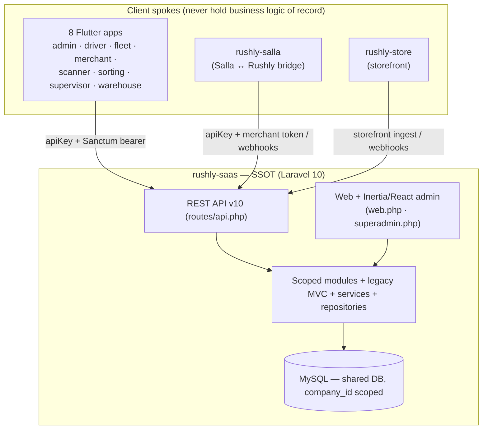
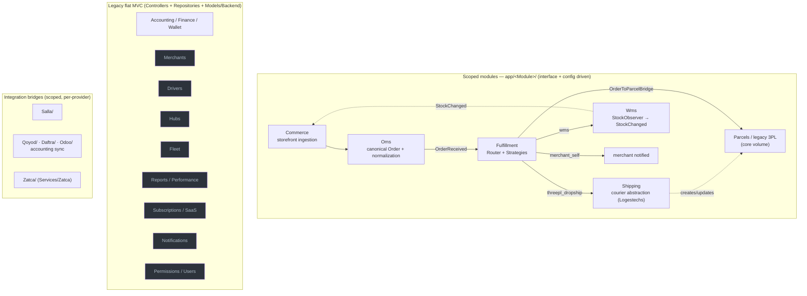
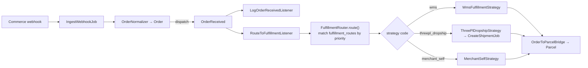

# 25 — AI_CONTEXT

> **The AI knowledge-base entry point for future AI-assisted development on Rushly.**
> Read this first, then jump to the deep-dive it points you at. This doc is a *synthesis* —
> it does not restate every table and route; it gives you the mental model, the rules you
> must not break, and the exact recipes for the common change requests. Every specific claim
> traces to a numbered doc, a repo-root design doc, or a real source file. When something is
> genuinely unknown it says **"Not found in the current codebase."**
>
> **Golden context facts (memorize these):**
> - `rushly-saas` (`/var/www/rushly-saas`) is the **Single Source of Truth (SSOT)**. Every Flutter app and both Laravel satellites are **clients**.
> - The framework is **Laravel `^10.10` on PHP `^8.1`** — verified in `composer.json`. **`README.md`/`ARCHITECTURE.md` say "Laravel 12 / PHP 8.4" — that is WRONG.** Do not trust it.
> - Multi-tenancy is **`stancl/tenancy ^3`, single shared DB, `company_id`-scoped**. There is NO database-per-tenant (`DatabaseTenancyBootstrapper` is commented out).
> - There are **two coexisting architectures**: legacy flat MVC (carries production volume) and newer scoped-namespace modules `app/<Module>/`. Know which world you are in before you touch anything.
>
> **Sibling docs:** [05-System-Architecture.md](05-System-Architecture.md) · [06-Database.md](06-Database.md) · [07-Laravel.md](07-Laravel.md) · [09-API.md](09-API.md) · [11-Modules.md](11-Modules.md) · [12-Workflows.md](12-Workflows.md) · [26-Architecture-Decisions.md](26-Architecture-Decisions.md) · [_CONTEXT_BRIEF.md](_CONTEXT_BRIEF.md). Known issues: [_FINDINGS.md](_FINDINGS.md) (243 doc-vs-code conflicts + 246 gaps).

---

## 1. What Rushly is (business + architecture in one screen)

**Business:** Rushly is a **multi-tenant logistics / courier-management SaaS**. One deployment hosts a **central domain** (marketing + super-admin, where logistics companies sign up and pick a plan) and any number of **tenant subdomains** (`{tenant}.rushly.tech`), one per customer logistics company. Each tenant runs the full courier workflow — parcels, hubs, drivers, merchants, payments, WMS, accounting, support — plus newer storefront-ingestion and fulfillment-routing layers. Revenue is per-tenant subscriptions (plans/add-ons managed by the super-admin). See [03-Business-Domain.md](03-Business-Domain.md), [11-Modules.md](11-Modules.md) §19.

**Architecture (hub-and-spoke):** `rushly-saas` is the hub. **8 Flutter apps** + **2 Laravel satellites** are spokes. No spoke talks to another spoke — everything rendezvous through the SaaS `/api/v10/*` surface. See [05-System-Architecture.md](05-System-Architecture.md) §2.



The 8 apps and their login/surface split are in [09-API.md](09-API.md) §4 and [05-System-Architecture.md](05-System-Architecture.md) §6. The satellites' bidirectional bridge flow is [05-System-Architecture.md](05-System-Architecture.md) §6.2.

---

## 2. Module map — the two worlds and how they relate

Two module *styles* coexist ([11-Modules.md](11-Modules.md) §0, ADR-002 in [26](26-Architecture-Decisions.md)):

1. **Scoped-namespace modules** — new, clean, self-contained under `app/<Module>/`, each with the same folder shape and its own PSR-4 namespace `App\<Module>\`. This is the "Phase 6" spine. `Shipping/` is the reference implementation — read it first.
2. **Legacy flat MVC** — the original courier platform: controllers + repositories + `app/Models/Backend/*`. Mature, live, carries most business volume.

The seam between them is `OrderToParcelBridge` — the newer Order/Fulfillment world reconnects to the legacy `Parcel` surface because bulk-actions, tracking, and COD flows are all built on `Parcel`.



**Full module inventory with roots, docs, and maturity:** [11-Modules.md](11-Modules.md) §21 (maturity matrix). One-line pointers:

| Module | Root | Style | Primary doc | Maturity |
|---|---|---|---|---|
| OMS | `app/Oms/` | Scoped | [OMS.md](../OMS.md) | Wired, flag-gated |
| Shipping | `app/Shipping/` | Scoped | [shipping-architecture.md](shipping-architecture.md) | Production (Logestechs) |
| Parcels / legacy 3PL | `Models/Backend/Parcel` | Legacy | [3PL.md](../3PL.md) | Live (core volume) |
| Fulfillment | `app/Fulfillment/` | Scoped | [FULFILLMENT.md](../FULFILLMENT.md) | Wired; events unsubscribed |
| Commerce | `app/Commerce/` | Scoped | [COMMERCE.md](../COMMERCE.md) | Scaffold + Salla, flag-gated |
| WMS | `app/Wms/` + `Models/Backend/Wms` | Hybrid | WMS KB | Live (warehouse-app) |
| Fleet | `Models/Backend/Fleet` | Legacy | [MOBILE_APPS.md](../MOBILE_APPS.md) | Live (fleet-app) |
| Accounting & Zatca | `Repositories/*`, `Services/Zatca` | Legacy | [ACCOUNTING.md](../ACCOUNTING.md) | Live; Zatca Phase-1 |
| Merchants / Drivers / Hubs | `Models/Backend/*` | Legacy | MERCHANT_DASHBOARD / MOBILE_APPS | Live |
| Reports / Performance | `Services/Performance` | Hybrid | ACCOUNTING §6 | Live |
| Subscriptions / SaaS | `Superadmin/Plan` | Legacy | [super-admin.md](../super-admin.md) | Live |
| Accounting sync | `app/Qoyod,Daftra,Odoo` | Scoped-ish | [ACCOUNTING.md](../ACCOUNTING.md) | Live per-tenant |

---

## 3. Where does X live? (folder / namespace guide)

Everything hangs off the single autoload root `"App\\": "app/"`. There is no separate composer package per module. Full directory-by-directory table: [07-Laravel.md](07-Laravel.md) §1.

**Legacy flat layers (app root):**

| You need… | Look in |
|---|---|
| HTTP entry points (219 controllers) | `app/Http/Controllers/` — `Backend/*` (tenant admin), `Api/V10/*` (mobile/public), `Api/V10/Admin/*` (back-office apps), `Auth/*`, `Backend/Superadmin/*` (central) |
| Request validation (110 FormRequests) | `app/Http/Requests/` (domain subfolders, e.g. `MerchantPanel/Parcel/StoreRequest.php`) |
| API JSON transformers (23 Resources) | `app/Http/Resources/v10/` (+ `v10/Admin/`) |
| Cross-cutting HTTP services | `app/Http/Services/` — `PushNotificationService`, `SmsService`, `PurchaseVerify`, `ParcelImageService` |
| Global helpers (autoloaded) | `app/Http/Helper/Helper.php` — `settings()`, `hasPermission()`, `parcelStatus()`, `subscriptionCheck()` … |
| Eloquent models (120) | `app/Models/` + `app/Models/Backend/**` (incl. `Fleet/`, `Wms/`, `Merchantpanel/`, `Superadmin/`) |
| Data access (the dominant pattern) | `app/Repositories/<Domain>/<Name>Interface.php` + `<Name>Repository.php` |
| Legacy per-3PL / storefront services | `app/Services/` — `AramexService`, `JetService`, `ZajelService`, `DeliveryPandaService`, `SallaService`, `ZidService`, `WooCommerceService` |
| KPI/analytics engine | `app/Services/Performance/` |
| Saudi e-invoicing | `app/Services/Zatca/` + `app/Enums/Zatca/` + `app/Observers/Zatca/` + `app/Jobs/Zatca/` |
| Enums (41) | `app/Enums/` (+ `Wms/`, `Zatca/`, `Wallet/`, `Merchant_panel/`) |
| Parcel state machine | `app/Enums/ParcelStatus.php` + `app/Support/ParcelStatusHelper.php` (**always** go through the helper) |
| Traits | `app/Traits/` — `ApiReturnFormatTrait` (API envelope), `PaymentTrait`, `TrackingTrait` |
| Observers (14) | `app/Observers/`, `app/Wms/Observers/`, `app/{Qoyod,Daftra,Odoo}/Observers/` |
| Jobs (22) | inside each owning module's `Jobs/` folder (not a single `app/Jobs/` dump) |
| Console commands + scheduler | `app/Console/Commands/` + `app/Console/Kernel.php` |
| Service providers (9) | `app/Providers/` + `Shipping/Commerce` module SPs |

**Scoped modules (`app/<Module>/`):** `Shipping/`, `Commerce/`, `Oms/`, `Fulfillment/`, `Wms/`, `Salla/`, `Qoyod/`, `Daftra/`, `Odoo/`, `Logestechs/` (legacy). Canonical shape ([07-Laravel.md](07-Laravel.md) §15, verified in `app/Shipping/`):

```
app/<Module>/
├── Contracts/          # Interfaces: ProviderInterface / StrategyInterface / Handler
├── DTOs/               # Immutable data-transfer objects across the boundary
├── Factory/            # Resolve concrete impl by config-registered code
│   (or Strategies/, or Providers/)
├── Services/           # Orchestration — the module's public API
├── Repositories/       # Module-owned DB access (bound in the module SP)
├── Models/             # Module-owned Eloquent models
├── Events/ + Listeners/
├── Jobs/               # Queued out-of-band work
├── Exceptions/         # Typed failures
├── Logging/            # ApiLogger (external-call audit, masked headers)
└── <Module>ServiceProvider.php   # binds factory + logger + repos (Shipping/Commerce only)
```

> Note: **WMS substance is NOT in `app/Wms/`.** `app/Wms/` holds only `Observers/WmsStockObserver.php` + `Events/StockChanged.php`. The real WMS models are `app/Models/Backend/Wms/*` and enums `app/Enums/Wms/*`. See [11-Modules.md](11-Modules.md) §6.

---

## 4. Coding standards & naming rules

Grounded in [07-Laravel.md](07-Laravel.md) §2-15 and [26-Architecture-Decisions.md](26-Architecture-Decisions.md) ADR-002/003/005.

- **Thin controllers.** Controllers constructor-inject repository *interfaces* (and, for module surfaces, module services). Logic lives in repositories/services. A controller validates (FormRequest), calls a repo/service, returns a response.
- **Repository pattern (legacy).** `app/Repositories/<Domain>/<Name>Interface.php` + `<Name>Repository.php`. Bind the pair in `AppServiceProvider::register()` (~80 `->bind()` calls). Type-hint the interface; the container resolves the impl. Newer modules keep repositories *inside* the module and bind them in the module's own SP.
- **Depend on interfaces + config, never concrete classes.** This is the single most important design value. Shipping/Commerce **factories**, Fulfillment **strategies**, and OMS **mappers** all resolve implementations from `config/*.php` by a string `code`. "Add a class + a config row" is the recurring extension story.
- **DTOs** are immutable objects that cross a module boundary (`RawOrderDTO` → `OrderDTO`, etc.). Don't pass raw arrays or Eloquent models across module seams.
- **Contracts** = the interface a provider/strategy/handler must implement (`ShippingProviderInterface`, `FulfillmentStrategyInterface`, `CommerceProviderInterface` + marker interfaces `SupportsOAuth/Webhooks/BulkFetch/OrderWriteback/InventorySync`).
- **Strategies vs Providers:** *Strategy* = a way to fulfill an order (`app/Fulfillment/Strategies/`); *Provider* = an external system adapter (`app/Shipping/Providers/`, `app/Commerce/Providers/`). Both resolved by `code` through a factory/container.
- **Services** = orchestration; the public API of a module (`OrderService`, `ShipmentService`, `FulfillmentService`).
- **API envelope:** every `Api/V10` controller uses `ApiReturnFormatTrait` → `{success, message, data}`. `success` is independent of HTTP status — clients must check `success`.
- **Enums drive state.** Never set `parcel.status` by raw integer — go through `ParcelStatus` + `ParcelStatusHelper` (i18n keys, badge classes, cancel/return detection).
- **No policies, no `app/Actions/`.** `AuthServiceProvider` has `$policies = []`. Authorization is entirely **permission-array middleware** (`hasPermission:<key>` → `PermissionCheckMiddleware`, checking a JSON `permissions` column). The "action" role is filled by Strategy/Factory classes.
- **Events are the seam between modules.** Wiring is explicit and centralized in `EventServiceProvider` (`shouldDiscoverEvents()=false`) — one auditable place. One module fires, others listen without a hard dependency.
- **Bootstrap style is classic Laravel 10** (`bootstrap/app.php` binds kernels; providers in `config/app.php`; no `bootstrap/providers.php`). Do not introduce Laravel 11+ slim-bootstrap idioms.

---

## 5. API overview

Full reference: [09-API.md](09-API.md). One active version: **`v10`**, all in `routes/api.php`. Base shapes:

```
https://<tenant-host>/api/v10/<resource>                    ← merchant + driver + public
https://<tenant-host>/api/v10/admin/<resource>              ← back-office apps
https://<tenant-host>/api/v10/external/{salla,zid,woocommerce}/parcel   ← storefront bridges
https://<tenant-host>/api/v10/commerce/{provider}/webhook   ← generic commerce ingest (HMAC)
https://<tenant-host>/api/public/tracking/{id}              ← embeddable public tracking
```

**Auth is layered** ([09-API.md](09-API.md) §3):

| Layer | Middleware | Role |
|---|---|---|
| 1. Static door key | `CheckApiKey` | `apiKey` header == `config('rxcourier.api_key')`; missing/wrong → **400**. Gates the door, does not identify the caller. ⚠️ hard-coded shared secret across all tenants (known gap). |
| 2. Identity | `auth:sanctum` | per-user bearer token (non-expiring); identifies which tenant user calls. |
| 3. Back-office gate | `CheckAdminRole` | admits only `user_type ∈ {ADMIN, SUPER_ADMIN, INCHARGE, HUB}`; keeps merchant/driver apps out of `/admin/*`. |
| 4. Public tracking | `public.tracking.key` | per-tenant key in `X-API-Key`, matched against `public_tracking_api_keys`, optional origin allow-list. |
| — | HMAC in service | commerce webhook: per-connection `webhook_secret` verified in `WebhookIngestService` — **no** apiKey/Sanctum. |

**Status-code conventions:** [09-API.md](09-API.md) §16 (200 success incl. soft `success:false`, 201 created, 202 webhook accepted, 400 bad apiKey, 403 role/hub mismatch, 409 state conflict, 422 validation, 500 unhandled). **Rate limit:** 60 req/min per user-or-IP. **Only machine-readable spec that ships:** `GET /admin/api-docs/merchant.json` (merchant subset only).

---

## 6. Workflow summary

Detailed diagrams: [12-Workflows.md](12-Workflows.md). The two **orthogonal status machines you must never confuse** ([12-Workflows.md](12-Workflows.md) §0):

- **Order plane** — `app/Oms/Enums/OrderStatus.php` (string states `pending→confirmed→in_fulfillment→shipped→delivered` + cancelled/returned).
- **Parcel plane** — `app/Enums/ParcelStatus.php` (41 integer constants, physical movement). One Order → 0..N Parcels, bridged idempotently by `OrderToParcelBridge` via `parcels.oms_order_id`.

**Flagship chain A — storefront order → parcel** ([05-System-Architecture.md](05-System-Architecture.md) §7.3, [12-Workflows.md](12-Workflows.md) §1; feature-flag gated):



`RouteToFulfillmentListener` is deliberately **synchronous and non-throwing** — failures land on the `Fulfillment` row (surfaced via `FulfillmentFailed`) so a fulfillment error never fails the ingest job.

**Flagship chain B — WMS stock change → storefront inventory sync:** `WmsStock` change → `WmsStockObserver` → `StockChanged` → `PushStockToConnectedChannelsListener` → per-connection `PushStockJob` (merchant-scoped) → provider HTTP.

**Other standard flows** (README + [11-Modules.md](11-Modules.md)): bulk ops at `/admin/bulk_action` (Assign 3PL / Change Status / Cancel / Print AWBs / Export XLSX); tracking sync cron `shipping:sync-tracking` (every 5 min, one job per active connection); accounting sync via observers → queued jobs (Qoyod/Daftra/Odoo). Scheduler inventory: [07-Laravel.md](07-Laravel.md) §13.

---

## 7. Developer guidelines (baseline expectations)

- **Know which world you're in.** New generic capability that a provider/strategy could plug into → scoped module. Change to existing parcel/accounting/merchant behavior → legacy MVC. When bridging, follow `OrderToParcelBridge` as the pattern.
- **Queue reality:** default `QUEUE_CONNECTION=sync` → "queued" jobs run **inline**. Do not assume async ordering/retry in dev. Production is expected to use `database`/`redis`; the `QueueTenancyBootstrapper` re-injects tenant context when a real queue runs.
- **External calls go through a module's `AbstractProvider`/`ApiLogger`** — you get retry (4xx never retried), masked-header logging to `*_api_logs` (30-day pruned), and consistent error typing for free. Don't hand-roll `Http::` calls in a provider.
- **Validation in FormRequests**, not controllers. `authorize()` typically returns `true` because authorization is route middleware.
- **i18n:** user-facing strings go through `trans()`/`__()`. Status labels come from `ParcelStatusHelper`.
- **Cite reality, not the README.** Counts and versions in `ARCHITECTURE.md`/`README.md` are stale (see the Doc-vs-Code table in [07-Laravel.md](07-Laravel.md) §0). Verify against `composer.json` and the tree.
- **Check [_FINDINGS.md](_FINDINGS.md)** before assuming a documented behavior is real — 243 conflicts + 246 gaps are already catalogued.

---

## 8. AI DEVELOPMENT INSTRUCTIONS

This is the operative section. Follow these recipes; they encode the architecture's intent.

### 8.1 Recipe — add a Shipping courier (provider)

Six steps, **no business-logic change** ([shipping-architecture.md](shipping-architecture.md) §8, ADR-003):

1. Create `app/Shipping/Providers/<Name>/<Name>Provider.php` extending `app/Shipping/Providers/AbstractProvider.php` (inherits HTTP retry + logging).
2. Implement `ShippingProviderInterface` (`app/Shipping/Contracts/`) — create/cancel/track/AWB.
3. Add request/response/status **Mappers** under `Providers/<Name>/Mappers/` (mirror `Logestechs/Mappers/`).
4. Add a row to `config/shipping.php` → `providers.<code>.class => \App\Shipping\Providers\<Name>\<Name>Provider::class`.
5. Seed a `shipping_providers` catalog row (so the admin "Add integration" picker lists it — it reads `Factory::codes()`).
6. Optionally add a webhook route wired to `WebhookService`.

The factory `ShippingProviderFactory::make($code)` / `forConnection($conn)` does the resolution. **Do not** add an `if provider == X` branch anywhere in business logic.

### 8.2 Recipe — add a Fulfillment strategy

([FULFILLMENT.md](../FULFILLMENT.md) §8, ADR-005, verified in `config/fulfillment.php`):

1. Create `app/Fulfillment/Strategies/<Name>Strategy.php` implementing `FulfillmentStrategyInterface` (`code()`, `execute(Fulfillment, Order)`, `cancel(Fulfillment)`).
2. Mutate the `Fulfillment` status row (`pending→in_progress→completed/failed/cancelled`). **Don't self-guard double-execute** — `FulfillmentService` already does.
3. Add a row to `config/fulfillment.php` → `strategies.<code>.class`.

The `FulfillmentRouter` loops `fulfillment_routes` by priority regardless of which strategies exist — **no routing logic to change**. Existing codes: `merchant_self`, `wms`, `threepl_dropship` (`vendor_direct` is scaffolded/commented for Phase 6.5+).

### 8.3 Recipe — add a Commerce storefront (provider)

([COMMERCE.md](../COMMERCE.md) §7, ADR-003): create `app/Commerce/Providers/<Name>/` extending `AbstractCommerceProvider`, implement `CommerceProviderInterface` + only the marker interfaces the platform actually supports (`SupportsOAuth/Webhooks/BulkFetch/OrderWriteback/InventorySync`), add a `config/commerce.php` row, seed `commerce_providers` (mirror capabilities in its `supports` JSON), add a `SallaWebhookHandler`-style handler if it does webhooks. **All Commerce behavior is gated by `config('features.commerce_layer')` — respect the flag.**

### 8.4 Recipe — add an OMS storefront mapper

([OMS.md](../OMS.md) §4, ADR-004): create `app/Oms/Normalization/Providers/<Name>OrderMapper.php` implementing `OrderMapperInterface` (`RawOrderDTO → OrderDTO`), register it, add a config row. Central steps (`PayloadValidator::assert()`, `AddressResolver::hydrate()`) are OMS-owned — **do not** re-implement validation or geo lookup in the mapper. Idempotency is `UNIQUE(connection_id, remote_order_id)`; OMS fires `OrderReceived` (new) vs `OrderUpdated` (replay diff) so downstream runs once.

### 8.5 Recipe — add a whole new scoped module

Mirror `app/Shipping/` exactly ([07-Laravel.md](07-Laravel.md) §15): create `app/<Module>/` with the canonical folder shape, its own `App\<Module>\` namespace, a `<Module>ServiceProvider` (if it needs a factory/logger/repo binds) registered in `config/app.php`, a `config/<module>.php`, its own migrations, events wired in `EventServiceProvider`, and observers registered in the appropriate provider `boot()`. Keep business logic behind a factory + interface.

### 8.6 Tenancy scoping rules (NEVER break these)

This is the top cross-cutting risk (ADR-001, [05-System-Architecture.md](05-System-Architecture.md) §4). The DB is **shared**; isolation is application-layer only.

- **Every new domain table MUST carry a `company_id` column.**
- **Every new domain model MUST expose/use `scopeCompanywise()`** (or the module equivalent) on every read. **Forgetting it leaks data across tenants.**
- **In modules, re-assert tenant safety explicitly.** Follow `ShipmentService::dispatchCreate()`, which asserts `parcel.company_id === connection.company_id` and throws on mismatch. Do the same for any cross-entity operation.
- Newer modules re-enforce scoping at **three** points: routes, repositories, and service asserts. Match that discipline.
- Cache/filesystem/queue are auto-tenant-tagged by the active bootstrappers; **the DB is not** — that's on you.

### 8.7 Feature-flag discipline

(ADR-006, verified in `config/features.php`):

- Flags live in `config/features.php`, env key `FEATURE_<UPPER_SNAKE>`, **default OFF**. Current flags: `commerce_layer`, `login_otp`.
- **Module bindings + migrations load unconditionally; only behavior is gated.** Ship the schema, gate the behavior.
- Enforce with the exact greppable guard at the top of every gated controller/action: `abort_unless(config('features.commerce_layer'), 404)`. Use **404** (hide), not 403. There is **no** `FeatureFlagMiddleware` — a new Commerce/OMS/Fulfillment controller that forgets the guard silently exposes the surface. **Never forget the guard.**

### 8.8 What to NEVER break

- **Never bypass tenant scoping** (§8.6). This is the #1 rule.
- **Never set `parcel.status` by raw value** — go through `ParcelStatus` + `ParcelStatusHelper`.
- **Never `if provider == X` in business logic** — resolve via the factory/config. The whole point of the abstractions is that adding a provider touches zero business logic.
- **Never reorder or renumber the hardcoded account-head IDs 1–7** (`AccountHeadSeeder`) — they are effectively schema; accounting logic depends on them ([ACCOUNTING.md](../ACCOUNTING.md), [11-Modules.md](11-Modules.md) §8).
- **Never break the `{success, message, data}` API envelope** — every Flutter client parses it; and `success` is independent of HTTP status.
- **Never let a fulfillment error fail the ingest job** — `RouteToFulfillmentListener` is intentionally non-throwing.
- **Never add a scoped-module controller behind the commerce flag without the `abort_unless(...,404)` guard.**
- **Never assume the framework is Laravel 12** — it is Laravel 10; the `README`/`ARCHITECTURE` claim is wrong.
- **Never touch the legacy `parcels_3pl` table expecting `company_id`** — it has none and no unique index (a known multi-tenant bug); new courier work belongs in the Shipping module's `shipments` table instead.

### 8.9 Known deliberate incompleteness (don't "fix" without checking)

Several things are intentionally shipped-but-dark (ADR-005/006, [FULFILLMENT.md](../FULFILLMENT.md) §9, [OMS.md](../OMS.md) §6):

- `Fulfillment\Events\{FulfillmentRequested,Started,Completed,Failed}` are **fired with no listeners** — including the intended storefront writeback on `FulfillmentCompleted`.
- `Oms\Events\OrderUpdated` has **no listeners** — storefront edits don't propagate into an existing parcel (manual ops task today).
- Only **Logestechs** is on the new Shipping module; Aramex/Jet/Zajel/Panda remain legacy. Migration is deliberately non-destructive; there is no backfill from `logestechs_settings` → `shipping_connections`.
- Retry policy for non-`StrategyRejectedException` faults is "TBD (Phase 6.5)".

Confirm intent (and check [_FINDINGS.md](_FINDINGS.md)) before wiring these — they may be pending by design.

---

## Sources

Docs synthesized (read in full or in relevant part):
- [_CONTEXT_BRIEF.md](_CONTEXT_BRIEF.md) — ecosystem grounding, ground-truth metrics
- [05-System-Architecture.md](05-System-Architecture.md) — topology, tenancy, API gate, events/observers, satellites
- [07-Laravel.md](07-Laravel.md) — `app/` map, controllers, repositories, strategies/factories, middleware, providers, module convention
- [09-API.md](09-API.md) — v10 surface, auth layers, envelope, status codes, consumer→surface map
- [11-Modules.md](11-Modules.md) — module index + maturity matrix
- [12-Workflows.md](12-Workflows.md) — the two status planes, order→parcel flow
- [26-Architecture-Decisions.md](26-Architecture-Decisions.md) — ADR-001..009 (tenancy, scoped modules, provider abstractions, OMS, fulfillment strategy, feature flags, Inertia, Sanctum, accounting sync)
- [README.md](../README.md), [ARCHITECTURE.md](../ARCHITECTURE.md) — module map + standard flows (⚠️ stale on Laravel version, controller counts, Blade-vs-Inertia)
- Repo-root module docs referenced: [shipping-architecture.md](shipping-architecture.md), [COMMERCE.md](../COMMERCE.md), [OMS.md](../OMS.md), [FULFILLMENT.md](../FULFILLMENT.md), [3PL.md](../3PL.md), [ACCOUNTING.md](../ACCOUNTING.md), [super-admin.md](../super-admin.md), [MOBILE_APPS.md](../MOBILE_APPS.md)

Code/config spot-verified on 2026-07-27:
- `composer.json` — `laravel/framework ^10.10`
- `config/features.php` — `commerce_layer`, `login_otp`, default OFF
- `config/fulfillment.php` — `merchant_self` / `wms` / `threepl_dropship` strategies; `vendor_direct` commented (Phase 6.5+)
- `app/` module dirs (`Commerce Daftra Fulfillment Logestechs Odoo Oms Qoyod Salla Shipping Wms …`) and `app/Shipping/` canonical folder shape

_`rushly-saas` is the single source of truth. Where repo-root docs disagreed with code, code was taken as authoritative and flagged._
