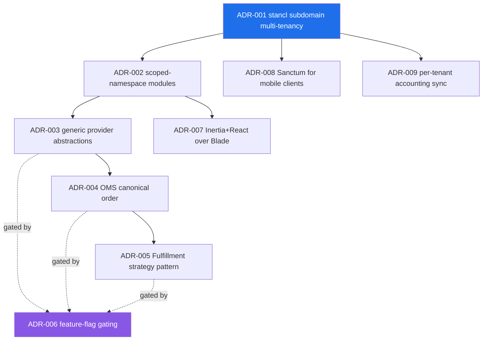

# 26 — Architecture Decision Records (ADRs)

> Reconstructed decision log for the **Rushly** enterprise logistics platform (`rushly-saas`, the single source of truth). Most of these decisions were never written down as formal ADRs at the time they were made — they are **reconstructed** here from the code, the config, and the repo-root design docs (`ARCHITECTURE.md`, `docs/shipping-architecture.md`, `COMMERCE.md`, `OMS.md`, `FULFILLMENT.md`). Each record is tagged:
>
> - **[Documented]** — the decision is explicitly stated in a primary design doc and the code matches.
> - **[Inferred]** — the decision is not written as such, but is unambiguous from the code/config structure.
> - **[Doc vs Code]** — a primary doc conflicts with what the code actually does; the code wins and the discrepancy is called out.

Related docs: [05-System-Architecture.md](05-System-Architecture.md) · [10-Authentication.md](10-Authentication.md) · [11-Modules.md](11-Modules.md) · [14-Integrations.md](14-Integrations.md) · [17-Security.md](17-Security.md).

---

## How to read an ADR

Each record uses the classic three-part shape:

- **Context** — the forces in play when the decision was taken.
- **Decision** — what was chosen.
- **Consequences** — what became easier, what became harder, what the team now has to live with.

Plus **Status**, **Evidence** (backticked source paths), and **Alternatives considered** where they can be reconstructed.

### Decision map



---

## ADR-001 — Multi-tenancy via `stancl/tenancy`, one DB, subdomain identification

**Status:** Accepted · Live · **[Documented]**

### Context

Rushly is sold as an installable SaaS: many logistics companies ("tenants") run on one deployment. A **central domain** hosts the marketing site + super-admin (where companies sign up and plans are managed); each customer company operates on its own **subdomain** (`{tenant}.rushly.tech`). The platform needed tenant isolation without the operational cost of one-database-per-tenant, while still being able to add tenants cheaply from the super-admin UI.

### Decision

Adopt **`stancl/tenancy` `^3.7`** with a **single shared database** and **host-based tenant identification**:

- `tenant_model = App\Models\Tenant`, tenant IDs are UUID/string keys — `config/tenancy.php` line 9 (`'tenant_model' => App\Models\Tenant::class`).
- A `domains` table maps request hostname → `tenant_id` (Stancl-managed).
- Central domains are declared in `config/tenancy.php` (`central_domains` = `127.0.0.1`, `localhost` in this checkout) — anything not central is resolved as a tenant.
- Tenant routes are wrapped in Stancl's `InitializeTenancyByDomain` middleware (`routes/web.php:178`), plus `PreventAccessFromCentralDomains`.
- Because the DB is shared, **application-layer scoping** is the real isolation boundary: every domain table carries a `company_id` column and models use a `scopeCompanywise()` query scope.

### Consequences

- **+** Adding a tenant is an `INSERT` into `tenants` + `domains` (or via the super-admin `CompanyController`) — no schema provisioning per tenant.
- **+** Cross-tenant reporting/administration is possible at the central layer because all rows live in one DB.
- **−** Isolation is only as strong as discipline: **forgetting `company_id` + `scopeCompanywise()` on a new model leaks data across tenants.** `ARCHITECTURE.md` §17 flags this explicitly as the top cross-cutting risk. Newer modules re-enforce it at three points (routes / repositories / service asserts) — see `docs/shipping-architecture.md` §9.
- **−** Central-domain misconfiguration is a live footgun: `config/tenancy.php` lists only `127.0.0.1`/`localhost` as central, so any other host is treated as a tenant lookup (`ARCHITECTURE.md` §3 warning).

> The `stancl/tenancy` package **registers** `InitializeTenancyByDomain`, `InitializeTenancyBySubdomain`, and `InitializeTenancyByDomainOrSubdomain` (`app/Providers/TenancyServiceProvider.php:135-137`), but the tenant route group actually uses **`InitializeTenancyByDomain`** (`routes/web.php:178`) — full-host matching against the `domains` table, not pure subdomain parsing. In practice the `domains` rows *are* subdomains (`{tenant}.rushly.tech`), so the effect is subdomain-scoped tenancy backed by explicit domain rows.

### ⚠️ Doc vs Code

- `README.md` line 95 and `ARCHITECTURE.md` §3 describe the tenant host as `{tenant}.rushly.tech`, while `ARCHITECTURE.md` §18 (dev-env section) uses `{tenant}.rushly.test`. The former is the product URL scheme; the latter is the local Valet dev host. No code conflict — just two environments.

**Evidence:** `config/tenancy.php`, `app/Providers/TenancyServiceProvider.php`, `routes/web.php:146,178`, `app/Models/Tenant.php`, `ARCHITECTURE.md` §3/§17.

---

## ADR-002 — Scoped-namespace modules under `app/<Module>/`

**Status:** Accepted · Live · **[Documented]**

### Context

The original codebase was a large flat Laravel app: ~219 controllers, ~60 services, ~120 models, ~94k LOC in `app/`. New capabilities (generic shipping, storefront ingestion, canonical orders, fulfillment routing) needed a home that wouldn't drown in the existing `app/Http/Controllers/Backend/*` sprawl and could evolve independently.

### Decision

Introduce **self-contained module namespaces** at `app/<Module>/`, each following the **same fixed folder shape**:

```
Contracts/ + DTOs/ + Providers/ (or Strategies/) + Services/
+ Models/ + Events/ + Listeners/ + Repositories/ + Exceptions/
+ Jobs/ + Logging/ + a <Module>ServiceProvider.php
```

Modules present: `app/Shipping/`, `app/Commerce/`, `app/Oms/`, `app/Fulfillment/`, `app/Wms/`, plus the integration bridges `app/Salla/`, `app/Qoyod/`, `app/Daftra/`, `app/Odoo/`, `app/Zatca/`. Each module's `<Module>ServiceProvider` binds its factory + logger + repositories.

### Consequences

- **+** Predictable growth — "a fifth module would follow the exact same shape" (`ARCHITECTURE.md` §4). New capability = drop a class in + add a config row.
- **+** Business logic **never imports a concrete provider/strategy** — it goes through the module's factory + interface. This is the enabling constraint for ADR-003 and ADR-005.
- **+** Each module owns its own migrations, config file (`config/shipping.php`, `commerce.php`, `fulfillment.php`), events, and service provider, so it can be reasoned about in isolation.
- **−** Two parallel worlds now coexist: the legacy flat app (`app/Http/Controllers/Backend/*`, `app/Services/*`, `app/Repositories/*`) and the module world. Developers must know which pattern applies where. The `OrderToParcelBridge` (ADR-004/005) exists precisely to glue the new module world onto the legacy `Parcel` surface.

**Evidence:** `ARCHITECTURE.md` §4 ("Modular sub-namespace pattern"), `README.md` "Quick module map", directory listings of `app/Shipping|Commerce|Oms|Fulfillment`, `_CONTEXT_BRIEF.md` §"Module architecture".

---

## ADR-003 — Generic provider abstractions (Shipping / Commerce) replacing per-provider services

**Status:** Accepted · Shipping in production, Commerce scaffold+Salla · **[Documented]**

### Context

The legacy integration style was **one bespoke service class per external system**: `app/Services/AramexService`, `JetService`, `ZajelService`, `DeliveryPandaService`, `LogestechsService`, plus `SallaService` / `ZidService` / `WooCommerceService` for storefronts, each with its own observers and link tables (`salla_orders`, `zid_orders`, `woocommerce_orders`). This produced N copies of "authenticate → call API → map status → update parcel," inconsistent tenant scoping (the shared `parcels_3pl` table has **no `company_id` and no unique index** — a known multi-tenant bug), and no shared logging/retry.

### Decision

Introduce **two generic provider abstractions** where business logic depends only on an interface + a factory, and concrete providers are resolved from config:

**Shipping (`app/Shipping/`)** — outbound couriers:
- `ShippingProviderInterface` (contract) + `AbstractProvider` (shared HTTP, logging, retry) + per-provider classes (`LogestechsProvider` first).
- `ShippingProviderFactory::make($code)` / `forConnection($conn)` resolve via `config('shipping.providers.<code>.class')` — the factory is "a thin pure dispatcher, no provider-specific knowledge" (`app/Shipping/Factory/ShippingProviderFactory.php`).
- New table `shipments` (properly `company_id`-scoped, `(connection_id, remote_shipment_id)` unique) instead of the legacy `parcels_3pl`.

**Commerce (`app/Commerce/`)** — inbound storefronts:
- `CommerceProviderInterface` (core: `code`/`testConnection`/`authenticate`/`fetchOrder`/`pushOrderUpdate`) + `AbstractCommerceProvider` + `CommerceProviderFactory`.
- Wider capability variance handled with **marker interfaces**: `SupportsOAuth`, `SupportsWebhooks`, `SupportsBulkFetch`, `SupportsOrderWriteback`, `SupportsInventorySync` (`app/Commerce/Contracts/*`). The `commerce_providers.supports` JSON column mirrors these so the admin UI renders capability chips without instantiating the class.
- First provider: Salla (`app/Commerce/Providers/Salla/`).

### Consequences

- **+** Adding a courier or storefront is a **six-step, no-business-logic-change** exercise: implement the provider class, optional mappers, add a `config/*.php` row, seed the catalog row, optionally add a webhook route, done (`docs/shipping-architecture.md` §8, `COMMERCE.md` §7). The admin "Add integration" picker auto-lists new providers via `Factory::codes()`.
- **+** Cross-cutting concerns are solved **once** in the abstract base: HTTP retry (`AbstractProvider::http()` wraps `->retry()` with a `ConnectionException` filter; 4xx never retries), API logging to `shipping_api_logs` / `commerce_api_logs` with sensitive-header masking, and bounded 30-day retention pruned by `shipping:prune-logs` / `commerce:prune-logs`.
- **+** Tenant safety is enforced structurally: `ShipmentService::dispatchCreate()` asserts `parcel.company_id === connection.company_id` and throws otherwise (`docs/shipping-architecture.md` §9).
- **−** **Migration is incomplete and deliberately non-destructive.** Only Logestechs is on the new Shipping module; **Aramex / Jet / Zajel / Panda remain on the legacy per-service pattern and the untouched `parcels_3pl` table** (`docs/shipping-architecture.md` §11, §12.2). Legacy Logestechs files (`app/Services/LogestechsService.php`, `app/Logestechs/`, `LogestechsSettingsController`) are still on disk, just unreferenced by the new flow.
- **−** No automatic backfill from `logestechs_settings` → `shipping_connections`; operators re-enter connections in the new UI (`docs/shipping-architecture.md` §12.1).

**Evidence:** `app/Shipping/Factory/ShippingProviderFactory.php`, `app/Shipping/Contracts/ShippingProviderInterface.php`, `app/Commerce/Contracts/CommerceProviderInterface.php`, `app/Commerce/Contracts/Supports*.php`, `config/shipping.php`, `config/commerce.php`, `docs/shipping-architecture.md`, `COMMERCE.md`, `3PL.md`.

---

## ADR-004 — OMS canonical `Order` + provider-specific normalization pipeline

**Status:** Accepted · Wired (Commerce-flag gated) · **[Documented]**

### Context

Once storefronts (Salla, Zid, Shopify, WooCommerce) can all feed orders in, downstream systems (fulfillment, dashboards, reports) shouldn't have to understand each storefront's raw payload shape. The legacy path went storefront → directly create a `Parcel`, coupling every consumer to per-platform quirks and the parcel model.

### Decision

Insert a **canonical Order Management layer (`app/Oms/`)** between Commerce and Fulfillment. Every order — regardless of source — becomes one `orders` row + N `order_items` + ≥1 `order_events` audit row. Key design points:

- **Two-step normalization** (`OMS.md` §4): provider-specific `OrderMapperInterface` (`app/Oms/Normalization/Providers/SallaOrderMapper.php`) maps `RawOrderDTO` → `OrderDTO`; then OMS-owned steps run centrally — `PayloadValidator::assert()` (throws `NormalizationException` on missing critical fields) and `AddressResolver::hydrate()` (local `city_id`/`area_id` lookup). Rationale: providers can't be trusted to know a tenant's local geography, and validation should be guarded once, not re-implemented per provider.
- **Idempotency via `UNIQUE (connection_id, remote_order_id)`** — a webhook fired twice hits the same key. `OrderService::receiveNormalized()` inserts on first sight (fires `OrderReceived`), or computes a diff on replay (no-op if empty, else `OrderUpdated` with `diff_json`). Wrapped in `DB::transaction()`.
- **Two distinct events** — `OrderReceived` vs `OrderUpdated` — so downstream fulfillment runs **once per order** and storefront edit/replay webhooks don't re-trigger it (`OMS.md` §5).
- **Explicit non-goals:** OMS never creates parcels, never writes back to the storefront, never sends notifications (`OMS.md` §8).

### Consequences

- **+** Downstream consumers query one stable shape; adding a storefront only requires a new `OrderMapper` + config row.
- **+** Idempotent replay is trivial and auditable via `order_events` (+ `source_webhook_event_id` link back to the raw webhook).
- **−** An extra hop and a bridge back to the legacy world: because the rest of the app is built on `Parcel`, not `Order`, the Fulfillment layer needs `OrderToParcelBridge` (ADR-005) to reconnect. The docs acknowledge "long-term the Order model may absorb Parcel's role and the bridge disappears" (`FULFILLMENT.md` §6).
- **−** `OrderUpdated` currently has **no listeners** — storefront edits (e.g. changed shipping address before pickup) don't propagate into an already-created parcel; it's a manual ops task today (`OMS.md` §6).

**Evidence:** `app/Oms/Services/OrderService.php`, `app/Oms/Normalization/OrderNormalizer.php`, `app/Oms/Normalization/OrderMapperInterface.php`, `app/Oms/Events/{OrderReceived,OrderUpdated}.php`, `app/Oms/Enums/*`, `OMS.md`.

---

## ADR-005 — Fulfillment as a routing + strategy pattern

**Status:** Accepted · Wired (Commerce-flag gated), events shipped without subscribers · **[Documented]**

### Context

Given a canonical `Order` (ADR-004), the platform must decide **how** to get it out the door — pick/pack in Rushly's own WMS, dropship straight to a courier via the Shipping module, ship from a vendor's warehouse, or hand it to the merchant. That decision varies per tenant, per merchant, per country, per source channel, per order value. Hard-coding it, or embedding it in each storefront path, wouldn't scale.

### Decision

Build a dedicated **Fulfillment module (`app/Fulfillment/`)** that is a *routing + strategy* layer and delegates the real work:

- **Router (`FulfillmentRouter`)** — pure, side-effect-free route matching over `fulfillment_routes` (tenant rules, ANDed non-null conditions: merchant / country / source channel / min amount, ordered by `priority`, first match wins). No match → `FulfillmentService::resolveFallbackStrategy()` walks `fulfillment_defaults` → `config('fulfillment.default_strategy')` (default env-driven, may be null = stays pending for manual assignment).
- **Strategy contract (`FulfillmentStrategyInterface`)** — `code()` / `execute(Fulfillment,$order)` / `cancel(Fulfillment)`. Strategies mutate the `Fulfillment` status row directly (`pending → in_progress → completed/failed/cancelled`); `FulfillmentService` guards against double-execute so strategies don't self-guard (`app/Fulfillment/Contracts/FulfillmentStrategyInterface.php`).
- **Registered strategies** (`config/fulfillment.php`): `merchant_self` (sync — notify merchant), `wms` (async — creates `WmsFulfillment`, pick job runs out-of-band), `threepl_dropship` (semi-async — `OrderToParcelBridge` then queue `CreateShipmentJob` from the Shipping module). `vendor_direct` is scaffolded but commented out (Phase 6.5+).
- **Trigger:** `OrderReceived` → `RouteToFulfillmentListener` → `FulfillmentService::fulfill()` (`FULFILLMENT.md` §5, `app/Providers/EventServiceProvider.php`).
- **Idempotency:** skips if a non-terminal Fulfillment already exists for the order.

### Consequences

- **+** Adding a strategy is "add a class + a `config/fulfillment.php` row" with **no routing logic to change** — the router loops routes by priority regardless of which strategies exist (`FULFILLMENT.md` §8).
- **+** The strategy boundary cleanly composes ADR-003 and ADR-004: `threepl_dropship` reuses the Shipping abstraction, `wms` reuses the WMS module, both start from the same canonical `Order`.
- **−** The `OrderToParcelBridge` (idempotent via `parcels.oms_order_id` unique key) is technical debt-by-design: it exists only because bulk-actions/tracking/COD flows are built on `Parcel`. It's the seam that must be maintained until (if) Order absorbs Parcel.
- **−** **Lifecycle events shipped without subscribers:** `FulfillmentRequested/Started/Completed/Failed` are all fired but "none of these are currently wired to listeners — Phase 6 fulfillment ships with events + no subscribers" (`FULFILLMENT.md` §9). Notably, **storefront writeback on `FulfillmentCompleted` is not yet wired** — the intended `Commerce::pushOrderUpdate` callback is a documented next step, not live.
- **−** Retry policy for non-`StrategyRejectedException` faults is marked "TBD (Phase 6.5)" in the interface doc block.

**Evidence:** `app/Fulfillment/Contracts/FulfillmentStrategyInterface.php`, `app/Fulfillment/Services/{FulfillmentService,FulfillmentRouter}.php`, `app/Fulfillment/Strategies/*.php`, `app/Fulfillment/Bridges/OrderToParcelBridge.php`, `config/fulfillment.php`, `FULFILLMENT.md`.

---

## ADR-006 — Feature-flag gating for not-yet-stable subsystems

**Status:** Accepted · Live · **[Documented]**

### Context

The Commerce/OMS/Fulfillment stack (ADR-003b/004/005) and a two-step staff login were being merged into `main` while still stabilizing. The team needed the **schema and module bindings present in every environment** (so migrations run and the code path exists) without exposing unfinished behavior to users.

### Decision

A tiny `config/features.php` returning boolean flags, each backed by an env var `FEATURE_<UPPER_SNAKE>` defaulting **OFF**:

- `commerce_layer` (`FEATURE_COMMERCE_LAYER`, default `false`) — gates the entire Commerce/OMS/Fulfillment admin UI and webhook-ingest routes.
- `login_otp` (`FEATURE_LOGIN_OTP`, default `false`) — two-step email-code challenge for Admin/SuperAdmin (merchants/deliverymen skip it either way).

The convention (stated in the file header): "flipping a flag is the only thing that should activate user-visible behavior." The **module bindings and migrations load unconditionally** — only behavior is gated. Controllers enforce the flag with `abort_unless(config('features.commerce_layer'), 404)` at the top of the constructor/action, so a disabled subsystem is indistinguishable from "route doesn't exist."

### Consequences

- **+** Schema-first rollout: `commerce_*`, `orders`, `fulfillments` tables exist everywhere before the behavior flips on (`config/features.php` comment; `CommerceServiceProvider` loads regardless).
- **+** Consistent, greppable enforcement — the exact `abort_unless(config('features.commerce_layer'), 404)` guard appears across every Commerce/OMS/Fulfillment controller (`app/Http/Controllers/Backend/Commerce/*`, `.../Oms/OrderController.php`, `.../Fulfillment/*`, `.../Api/V10/Commerce/WebhookController.php`, `.../Superadmin/FulfillmentDefaultsController.php`, `.../Ops/FailedJobsController.php`).
- **+** `login_otp` gates a security feature at the `LoginController` level (`app/Http/Controllers/Auth/LoginController.php:85,178`) — see [10-Authentication.md](10-Authentication.md).
- **−** Flag checks are **scattered per controller rather than centralized in middleware** — a new Commerce controller that forgets the `abort_unless` guard would silently expose the surface. There is no `FeatureFlagMiddleware` enforcing this class-wide.
- **−** Returning `404` (not `403`) when the flag is off is a deliberate "hide, don't deny" choice; correct for pre-release concealment but means no telemetry on attempted access.

**Evidence:** `config/features.php`, grep of `config('features.*')` across `app/Http/Controllers/**` and `routes/*.php`, `app/Commerce/CommerceServiceProvider.php`, `app/Http/Controllers/Auth/LoginController.php`.

---

## ADR-007 — Inertia.js + React for new UI, migrating off Blade

**Status:** Accepted · In progress (mid-migration) · **[Documented, with a Doc-vs-Code caveat]**

### Context

The original operator/admin UI is server-rendered **Blade** (`resources/views/backend|admin|frontend|auth|installer`). New surfaces — the Shipping connections manager, Commerce/OMS/Fulfillment admin, onboarding tours, richer merchant/admin dashboards — needed client-side interactivity that Blade + jQuery made painful, without abandoning Laravel's routing/controllers or standing up a separate SPA + API.

### Decision

Adopt **Inertia.js (`inertiajs/inertia-laravel ^2.0`) + React** for new pages, keeping Laravel controllers as the backend. Controllers return `Inertia::render('Admin/Shipping/Connections/Index', [...])`; pages live in `resources/js/Pages/**/*.jsx` (organized `Admin/`, `Merchant/`, `SuperAdmin/`). Ziggy exposes named routes to JS; Vite builds assets; `app/Http/Middleware/HandleInertiaRequests.php` supplies shared props. This is an **incremental Blade → React migration**, documented under `docs/inertia/`, not a big-bang rewrite — Blade views remain for un-migrated surfaces.

### Consequences

- **+** Server-driven routing/auth/permissions stay in Laravel; React handles interactivity. No separate API contract to maintain for the web app (the mobile API is separate — ADR-008).
- **+** New module UIs are built React-first (`resources/js/Pages/Admin/Shipping/Connections/{Index,Edit}.jsx`, per `docs/shipping-architecture.md` §2).
- **−** Two rendering stacks coexist during the migration — Blade and Inertia/React — doubling the surface a developer must understand and keeping jQuery-era views alive.

### ⚠️ Doc vs Code

- **`ARCHITECTURE.md` §2 claims the frontend is "Blade views with pre-compiled `public/css` + `public/js` (no `@vite`/`mix()`… Vite config exists but is unused)."** This is **outdated**. The code shows an active Inertia+React stack: `inertiajs/inertia-laravel ^2.0` in `composer.json`, `app/Http/Middleware/HandleInertiaRequests.php`, `Inertia::render(...)` used across many controllers (e.g. `DashbordController`, `UserController`, `TMSController`), ~191 `resources/js/Pages/*.jsx`, and `docs/inertia/`. Current truth: **mid-migration Blade → Inertia/React**, per `README.md` (line 3, "Inertia" not mentioned but module docs are React) and `_CONTEXT_BRIEF.md` §metrics ("Frontend: Inertia.js + React … Mid-migration Blade→React+Inertia").
- **Framework version:** `README.md` (line 3/83) and `ARCHITECTURE.md` §2 say **Laravel 12 / PHP 8.4**. `composer.json` pins **`laravel/framework ^10.10`** and **`php ^8.1`**. **Code wins: Laravel 10, PHP 8.1+.**

**Evidence:** `composer.json` (lines 8, 21), `app/Http/Middleware/HandleInertiaRequests.php`, `resources/js/Pages/`, `docs/inertia/`, `ARCHITECTURE.md` §2 (contradicting), `_CONTEXT_BRIEF.md`.

---

## ADR-008 — Laravel Sanctum for mobile API auth; session for web

**Status:** Accepted · Live · **[Documented]**

### Context

Rushly has **eight Flutter client apps** (admin, driver, fleet, merchant, scanner, sorting, supervisor, warehouse — see [08-Flutter.md](08-Flutter.md)) that all consume `rushly-saas`'s `/api/v10/*` REST surface. These need token-based stateless auth, while the web admin/merchant panels use cookie sessions. A single unified guard wouldn't serve both cleanly.

### Decision

Two auth models, split by surface:

- **Web:** Laravel session guard. `config/auth.php` defines **only** the `web` guard (`driver => session`, provider `users`). Default guard is `web`.
- **Mobile / API:** **`laravel/sanctum ^3.2`** issuing personal access tokens. `/api/v10/*` routes are protected by `auth:sanctum` + a custom `CheckApiKeyMiddleware` (validates an `apiKey` header) as a second gate. Login endpoints (`POST /signin`, `POST /deliveryman/login`) issue Sanctum tokens; tokens persist in `personal_access_tokens`.

### Consequences

- **+** Clean separation: browsers get CSRF-protected sessions; mobile gets bearer tokens without cookie/CSRF friction. The API stays stateless and horizontally scalable.
- **+** Defense in depth on the API: **both** `auth:sanctum` **and** `CheckApiKey` must pass (`ARCHITECTURE.md` §6/§8, §9).
- **−** `config/auth.php` declares no explicit `sanctum` guard entry — Sanctum's guard is provided by the package's own config (`config/sanctum.php` exists) and the `auth:sanctum` middleware alias, so the auth story is split across two config files rather than one obvious place.
- **−** Two auth surfaces means two places to reason about session fixation / token revocation / rate-limiting; see [17-Security.md](17-Security.md).

**Evidence:** `composer.json` (`laravel/sanctum ^3.2`, line 23), `config/auth.php` (only `web`/session guard), `config/sanctum.php`, `ARCHITECTURE.md` §8 ("Auth flow uses Sanctum tokens"), §9 (`CheckApiKeyMiddleware`), `_CONTEXT_BRIEF.md` §Stack.

---

## ADR-009 — Per-tenant, event-driven accounting sync (Qoyod / Daftra / Odoo)

**Status:** Accepted · Live per-tenant · **[Documented]**

### Context

Tenants keep their books in external accounting systems (Qoyod, Daftra, Odoo — all common in the Saudi/MENA market). Rushly's internal triple-ledger (company / merchant / deliveryman statements, anchored on `AccountHeads`) generates invoices, payments, and courier bills that must flow into whichever system each tenant uses — **live, and independently per tenant**.

### Decision

One **dedicated module per accounting provider** (`app/Qoyod/`, `app/Daftra/`, `app/Odoo/`), each with an identical internal shape: `Services/` (`ApiClient` + `CustomerSync` / `InvoiceSync` / `InvoicePaymentSync` / `BillSync` / `VendorSync`), `Models/` (`Settings` — the per-tenant connection/config — + provider-specific models), `Observers/`, and `Jobs/`. The sync is **event-driven**: Eloquent **observers** on domain models (`InvoiceObserver`, `MerchantObserver`, `CourierStatementObserver`) dispatch **queued jobs** (`PushInvoiceJob`, `PushInvoicePaymentJob`, `PushCourierBillJob`, `SyncMerchantJob`, `SyncVendorJob`) that call the provider's sync services. Per-tenant credentials/toggle live in each module's `Settings` model, and `IntegrationConfigServiceProvider` overlays DB-managed integration settings onto `config('services.*')` at boot so existing code reads tenant-scoped values transparently.

### Consequences

- **+** Each provider is isolated and follows the same template — adding "Wafeq" or "Zoho Books" mirrors an existing folder.
- **+** Sync is decoupled from the write path via observers → queued jobs, so a slow/failing accounting API doesn't block the operational transaction that triggered it.
- **+** Because `Settings` is per-tenant and observers run inside tenant context, each tenant syncs to its own accounting instance with its own credentials.
- **−** Three near-duplicate modules (`Qoyod`/`Daftra`/`Odoo` share the same Services/Observers/Jobs skeleton) — no shared `AccountingProviderInterface` + factory like Shipping/Commerce have (ADR-003). This is the **one integration area that did *not* adopt the generic-provider abstraction**; it kept the per-provider-module style. A future ADR could unify them behind a contract.
- **−** Sync correctness depends on the observers firing on every relevant mutation — the same "did you remember the hook?" fragility as tenant scoping (ADR-001).

**Evidence:** `app/Qoyod/{Services,Observers,Jobs,Models}/`, `app/Daftra/`, `app/Odoo/`, `app/Providers/IntegrationConfigServiceProvider.php`, `ACCOUNTING.md`, `_CONTEXT_BRIEF.md` §"Accounting sync".

---

## Cross-cutting themes

Reading the nine records together, three consistent design values emerge across Rushly's newer architecture:

1. **Depend on interfaces + config, never on concrete classes.** Shipping/Commerce factories (ADR-003), Fulfillment strategies (ADR-005), and OMS mappers (ADR-004) all resolve implementations from `config/*.php`. "Add a class + a config row" is the recurring extension story.
2. **Tenant isolation is an application-layer contract, re-asserted everywhere.** From `scopeCompanywise()` (ADR-001) to `ShipmentService`'s cross-tenant assert (ADR-003) to per-tenant `Settings` (ADR-009), isolation is enforced by convention + explicit checks because the DB is shared.
3. **Ship the schema, gate the behavior.** Feature flags (ADR-006) let the whole Commerce/OMS/Fulfillment stack land in `main` with tables and bindings live but behavior dark — and much of it (writeback listeners, `OrderUpdated` handlers, retry policy) is deliberately unfinished-but-present.

The dominant open risk is **half-migrated dualities**: legacy 3PL services vs the Shipping module (ADR-003), `Parcel` vs `Order` bridged by `OrderToParcelBridge` (ADR-004/005), and Blade vs Inertia/React (ADR-007). Each is intentional and non-destructive, but each doubles the surface area a developer must hold in their head.

---

## Sources

Primary design docs (read first, then verified against code):
- `ARCHITECTURE.md` (§2 stack, §3 tenancy, §4 module pattern, §6–9 routes/API/middleware, §13 providers, §17 cross-cutting)
- `docs/shipping-architecture.md` (full — provider abstraction, factory, tenant safety, migration §11, gaps §12)
- `COMMERCE.md` (provider contract, marker interfaces, ingestion flow, adding a provider)
- `OMS.md` (canonical order, normalization pipeline, idempotency, events, non-goals)
- `FULFILLMENT.md` (router + strategy pattern, strategy contract, bridge, events)
- `README.md` (module map, framework-version claim), `ACCOUNTING.md`, `3PL.md`, `_CONTEXT_BRIEF.md`

Code + config verified:
- `composer.json` (Laravel `^10.10`, PHP `^8.1`, Sanctum `^3.2`, Inertia `^2.0`, stancl/tenancy `^3.7`)
- `config/features.php`, `config/tenancy.php`, `config/auth.php`, `config/sanctum.php`, `config/fulfillment.php` (+ `config/shipping.php`, `config/commerce.php` referenced)
- `app/Shipping/Factory/ShippingProviderFactory.php`, `app/Shipping/Contracts/ShippingProviderInterface.php`
- `app/Commerce/Contracts/CommerceProviderInterface.php`, `app/Commerce/Contracts/Supports*.php`, `app/Commerce/CommerceServiceProvider.php`
- `app/Oms/` (Services, Normalization, Events, Enums)
- `app/Fulfillment/Contracts/FulfillmentStrategyInterface.php`, `app/Fulfillment/Strategies/*`
- `app/Providers/TenancyServiceProvider.php`, `app/Providers/IntegrationConfigServiceProvider.php`
- `app/Http/Middleware/HandleInertiaRequests.php`, `resources/js/Pages/`
- `app/Http/Controllers/Auth/LoginController.php` and Commerce/OMS/Fulfillment controllers (feature-flag `abort_unless` guards)
- `app/Qoyod/`, `app/Daftra/`, `app/Odoo/` (Services / Observers / Jobs / Models)
- `routes/web.php` (tenant middleware group), `routes/api.php`
