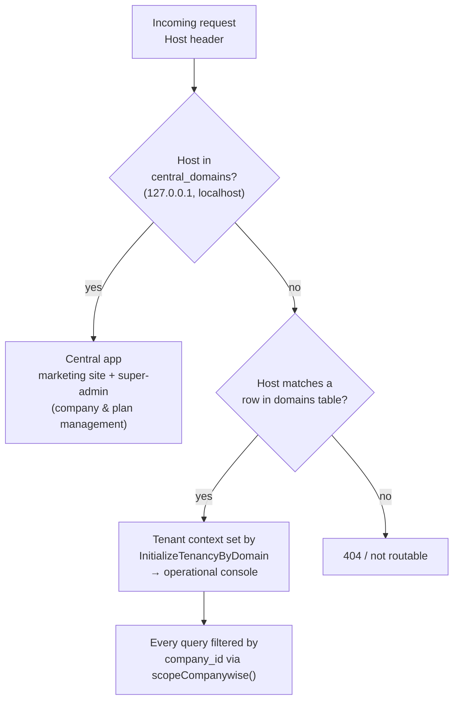
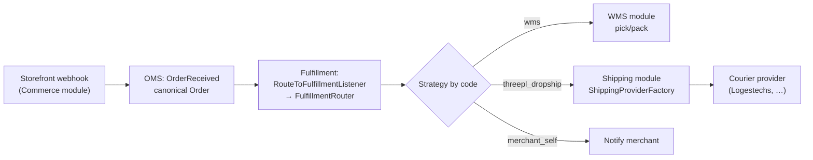

# 27 — Developer Guide

> **Scope:** Practical onboarding for a new engineer joining Rushly. Gets you from a
> fresh clone to a running backend + Flutter client, explains the module architecture
> well enough to extend it, and shows the exact "drop-a-class + add-a-config-row"
> recipes for the three pluggable subsystems (couriers, storefronts, fulfillment).
> Ends with testing, conventions, PR expectations, and the gotchas that will bite you.
>
> `rushly-saas` (`/var/www/rushly-saas`) is the **single source of truth (SSOT)** for the
> whole ecosystem. Every Flutter app (admin, driver, fleet, merchant, scanner, sorting,
> supervisor, warehouse) is a **client** of this backend's API. See
> [_CONTEXT_BRIEF.md](_CONTEXT_BRIEF.md).
>
> Sibling docs you will lean on: [07-Laravel.md](07-Laravel.md) ·
> [19-Environment.md](19-Environment.md) · [05-System-Architecture.md](05-System-Architecture.md) ·
> [06-Database.md](06-Database.md) · [08-Flutter.md](08-Flutter.md) ·
> [10-Authentication.md](10-Authentication.md) · [11-Modules.md](11-Modules.md) ·
> [18-Deployment.md](18-Deployment.md) · [26-Architecture-Decisions.md](26-Architecture-Decisions.md).

---

## 0. First, get the version reality straight

Before you read anything else, internalize one thing: **`README.md` and `ARCHITECTURE.md`
say "Laravel 12". That is wrong.** `composer.json` pins `laravel/framework ^10.10` on
PHP `^8.1`. **This is a Laravel 10 app** — Laravel-10 bootstrap style (providers in
`config/app.php`, no `bootstrap/providers.php`). When a doc and the code disagree, the
code wins. This is the single most repeated doc-vs-code conflict in the knowledge base;
see [07-Laravel.md §0](07-Laravel.md) and [19-Environment.md §6](19-Environment.md).

| Concern | Docs claim | Code truth | Source |
|---|---|---|---|
| Framework | Laravel 12 | **Laravel `^10.10`** | `composer.json` |
| PHP | 8.4 | **`^8.1`** required | `composer.json` |
| Frontend | "Blade, Vite unused" | Mid-migration **Blade → Inertia + React** (191 `.jsx` pages) | `composer.json`, `docs/inertia/` |
| Policies | "Gates/policies" | **None** — authz is permission-array middleware | `app/Providers/AuthServiceProvider.php` |

---

## 1. Local backend setup (`rushly-saas`)

### 1.1 Prerequisites

- **PHP 8.1+** with `ext-mysqli`, `ext-pdo` (`ARCHITECTURE.md §18` runs it on 8.3; avoid
  8.4 unless you've confirmed the vendor deprecations are clean in your checkout).
- **Composer 2**, **Node 18+ / npm** (for Vite + the React frontend).
- **MySQL 8** (the app is a shared-DB multi-tenant Laravel — see [§3](#3-multi-tenancy-what-you-must-know)).
- Optionally **Redis** (only if you switch queue/cache off the defaults).

### 1.2 The happy path

```bash
git clone <repo> rushly-saas && cd rushly-saas

composer install
npm install

cp .env.example .env          # or let composer's post-root-package-install do it
php artisan key:generate      # writes APP_KEY (required — encrypts sessions, Sanctum cookies,
                              #                 and every *_encrypted credential column)

# point .env at your local MySQL (see 1.3), then:
php artisan migrate           # runs all 191 migrations into the shared DB
php artisan db:seed           # if seeders are needed for your task (see 1.4)

npm run dev                   # Vite dev server (HMR) — or `npm run build` for prod assets
php artisan serve             # http://127.0.0.1:8000  (a central domain — see §3)
```

> **⚠️ Doc vs Code — the `.env.example` trap.** `.env.example` ships only the stock
> Laravel skeleton plus `SHOPIFY_API_SECRET` and `FEATURE_COMMERCE_LAYER`. **Dozens of
> keys the config tree actually reads are absent from it** (all `SALLA_*`, `ARAMEX_*`,
> `JET_*`, `PAYPAL_*`, `GOOGLE_*`, the module queue keys, `FEATURE_LOGIN_OTP`, …).
> When provisioning an environment, read `config/*.php`, **not** `.env.example`. The full
> key catalogue by concern is in [19-Environment.md](19-Environment.md). Do not assume a
> variable is unused just because it isn't in the example file.

### 1.3 The `.env` keys that actually matter for local dev

You can run the whole backend with a surprisingly small `.env`. The load-bearing keys:

| Key | Local value | Why |
|---|---|---|
| `APP_KEY` | `base64:...` (from `key:generate`) | Required; encrypts everything |
| `APP_URL` | `http://127.0.0.1:8000` | URL/asset generation; a **central** domain |
| `APP_DEBUG` | `true` | Stack traces locally |
| `DB_CONNECTION` | `mysql` | Also the tenancy *central* connection |
| `DB_DATABASE` / `DB_USERNAME` / `DB_PASSWORD` | your local MySQL | Shared tenant DB |
| `QUEUE_CONNECTION` | `sync` (default) | Jobs run **inline** — fine for dev, see [§9](#9-gotchas) |
| `CACHE_DRIVER` | `file` (default) | No Redis needed |
| `SESSION_DRIVER` | `file` (default) | — |
| `MAIL_MAILER` | `log` or `smtp`→mailpit | `login_otp` and signup mails need a working mailer |

Everything else (courier creds, Salla OAuth, ZATCA, accounting, SMS, FCM) is
**per-tenant database configuration**, not env — you set it in the admin UI, not the
`.env`. See [19-Environment.md §1](19-Environment.md) for the three-layer config model
(`.env` → `config/*.php` → per-tenant DB rows).

### 1.4 Seeding & the install wizard

The repo also carries an `InstallerController` first-run wizard and `IsInstalled` /
`IsNotInstalled` middleware (`app/Http/Middleware`, `ARCHITECTURE.md §12`). For a dev
box the fastest route to a working tenant is usually **importing a known-good SQL dump**
(the way `ARCHITECTURE.md §18` does it — the dump already has `domains` rows patched to
the local host) rather than running the wizard from scratch. Confirm with your team which
of {`php artisan migrate` + seeders, SQL dump, install wizard} is the sanctioned local
bootstrap for your task.

---

## 2. Frontend (Inertia + React) & assets

The tenant admin panel is **mid-migration from Blade to Inertia.js + React** — 191
`.jsx` pages under `resources/js/Pages/*.jsx`, wired through `inertiajs/inertia-laravel ^2`,
`HandleInertiaRequests` middleware, `tightenco/ziggy` (named routes in JS), and Vite.

- `npm run dev` — Vite dev server with HMR while working on `.jsx` pages.
- `npm run build` — production bundle.
- Not every screen is React yet; many are still Blade in `resources/views/`. Check the
  route/controller to know which surface you're editing. See `docs/inertia/` for the
  migration guide and [16-UI-UX.md](16-UI-UX.md) / [15-Brand-System.md](15-Brand-System.md).

---

## 3. Multi-tenancy: what you MUST know

Rushly uses **`stancl/tenancy ^3.7`** with a **single shared database** and
**host-based tenant identification** (ADR-001, [26-Architecture-Decisions.md](26-Architecture-Decisions.md)).
This shapes everything you do.



Key facts:

- **Central domains** are `127.0.0.1` and `localhost` (`config/tenancy.php`). Anything
  else is treated as a tenant lookup. Production tenants are `{tenant}.rushly.tech`.
- A tenant = a row in `tenants` (UUID id) + a row in `domains` mapping host → tenant_id.
  Adding a tenant is an `INSERT` (or the super-admin `Superadmin/CompanyController`) —
  **no per-tenant schema provisioning.**
- **Isolation is application-layer, not DB-layer.** The DB is shared; every domain table
  carries a `company_id` and models use `scopeCompanywise()`. Forgetting either on a new
  model **leaks data across tenants** — this is the single biggest correctness risk in the
  codebase ([26-Architecture-Decisions.md ADR-001](26-Architecture-Decisions.md),
  [17-Security.md](17-Security.md)).

### 3.1 Central vs. tenant migrations — the reality

- `php artisan migrate` runs the **191 central migrations** in `database/migrations/` —
  this is the shared schema every tenant uses.
- `config/tenancy.php` points `tenants:migrate` at `database/migrations/tenant/`, **but
  that directory is currently empty (0 files)**, and the stancl **`DatabaseTenancyBootstrapper`
  is commented out** (`config/tenancy.php`, [19-Environment.md §6](19-Environment.md)).
  There are **no separate per-tenant databases** in this deployment — tenancy is purely
  shared-DB with `company_id` scoping.
- **Practical upshot:** for local setup, `php artisan migrate` is all you need. Running
  `php artisan tenants:migrate` is currently a no-op (empty tenant-migration set). If you
  ever add a genuinely tenant-private table, that's the directory + bootstrapper you'd
  wire up — coordinate with the team first, because it's a structural change.

### 3.2 Setting up a local tenant subdomain

To exercise a tenant subdomain locally you need (a) a resolvable host and (b) matching
`domains` + `tenants` rows:

1. Add your central + tenant hosts to `/etc/hosts` (or use Valet/dnsmasq for `*.test`),
   e.g. `127.0.0.1 rushly.test admin.rushly.test`.
2. If you change the **central** host from `127.0.0.1`/`localhost` (e.g. to `rushly.test`),
   you **must add it to `central_domains` in `config/tenancy.php`** — otherwise Stancl
   treats it as a tenant lookup and the central app 404s.
3. Ensure a `domains` row maps your tenant host → an existing `tenants.id`. `ARCHITECTURE.md §18`
   ships a SQL dump with `admin.rushly.test → rushly-logistic` and
   `tolgaplusa.rushly.test → TolgaPlusa` already inserted.
4. `*.test` under a secured Valet site is HTTPS-only (HTTP returns 403) — use `https://`.

> **⚠️ Gotcha:** a hardcoded post-login redirect to `admin.rushly-logistic.com` exists in
> the auth flow (`ARCHITECTURE.md §18`); locally you may need to re-target it (look in the
> login/company controllers). Flagged, not fixed.

---

## 4. Running the Flutter apps

All eight apps are thin API clients with an **identical, tiny env layer**. See
[08-Flutter.md](08-Flutter.md) and [19-Environment.md §14](19-Environment.md).

### 4.1 Standard run

```bash
cd /var/www/rushly-<app>-app     # e.g. rushly-driver-app
flutter pub get
flutter run                       # pick a device/emulator
```

### 4.2 Pointing an app at your backend

Each app reads config through a single `Env` class in `lib/core/config/env.dart` that
loads a `.env` via `flutter_dotenv` — **with hardcoded fallbacks, so the app runs even
without a `.env` file** (it will just hit the production defaults). To point at your local
backend, create `<app>/.env`:

```dotenv
API_BASE_URL=http://10.0.2.2:8000/api/v10   # 10.0.2.2 = host loopback from Android emulator
API_KEY=123456rx-ecourier123456             # must match config/rxcourier.php on the backend
TENANT_HOST_SUFFIX=rushly.tech              # workspace-mode suffix: "acme" → acme.<suffix>/api/v10
# driver & merchant apps also read (optional):
# GOOGLE_MAPS_API_KEY=...
# SENTRY_DSN=...
```

Reference `Env` class (`rushly-admin-app/lib/core/config/env.dart`), verbatim:

```dart
class Env {
  static String get apiBaseUrl =>
      dotenv.maybeGet('API_BASE_URL') ?? 'https://api.rushly.tech/api/v10';
  static String get apiKey =>
      dotenv.maybeGet('API_KEY') ?? '123456rx-ecourier123456';
  static String get tenantHostSuffix { /* → 'rushly.tech' */ }
  static Future<void> load() => dotenv.load(fileName: '.env');
}
```

Notes that will save you an hour:

- **`API_KEY` is a static shared key** (`123456rx-ecourier123456`) baked into both the
  backend (`config/rxcourier.php`) and every client binary. It gates the legacy public API
  surface via `CheckApiKeyMiddleware` — it is **not** per-user auth. Per-user auth is
  **Sanctum bearer tokens** ([10-Authentication.md](10-Authentication.md),
  [17-Security.md](17-Security.md)).
- **Domain drift (⚠️ Doc vs Code):** the **admin app** defaults to `rushly.tech`; **every
  other app** defaults to `rushly-logistic.com`. If you rely on fallbacks you'll hit two
  different backends. Always supply an explicit `.env` for local work.
- **"Workspace mode":** the tenant selector turns a typed slug `acme` into
  `https://acme.<TENANT_HOST_SUFFIX>/api/v10`. Your backend tenant subdomain must be
  reachable from the device for this to work (emulators can't see `*.test` without extra
  DNS plumbing — prefer a real hostname or `API_BASE_URL` override for local).

---

## 5. Module architecture (the part you extend)

Rushly's newer code lives in **scoped-namespace modules** under `app/<Module>/`, each a
self-contained bounded context with its own `App\<Module>\...` namespace (all under the
single `"App\\": "app/"` autoload root — no separate Composer packages). This is ADR-002
([26-Architecture-Decisions.md](26-Architecture-Decisions.md)); the full layer-by-layer
tour is [07-Laravel.md §15](07-Laravel.md) and [11-Modules.md](11-Modules.md).

**The golden rule:** business logic never imports a concrete provider/strategy. It goes
through the module's **factory (or router) + interface**. That's what makes new couriers /
storefronts / strategies a "drop a class, add a config row" change with **zero business-logic
edits**.

Canonical module shape:

```
app/<Module>/
├── Contracts/     # Interfaces (ProviderInterface / StrategyInterface / Handler)
├── DTOs/          # Immutable data crossing the boundary
├── Factory/       # Resolve concrete impl by config-registered code
│   (or Strategies/, Providers/)
├── Services/      # Orchestration — the module's public API
├── Repositories/  # Module-owned, company_id-scoped DB access
├── Models/        # Module-owned Eloquent models
├── Events/ + Listeners/
├── Jobs/          # Queued out-of-band work
├── Exceptions/    # Typed failures
├── Logging/       # ApiLogger — external-call audit trail
└── <Module>ServiceProvider.php   # Shipping & Commerce only
```

The end-to-end spine — how a storefront order becomes a shipped parcel:



Reference module is **`app/Shipping/`** — read
[shipping-architecture.md](shipping-architecture.md) first; the others mirror its shape.
Module docs: `Shipping/` → [shipping-architecture.md](shipping-architecture.md);
`Commerce/` → [../COMMERCE.md](../COMMERCE.md); `Oms/` → `OMS.md`; `Fulfillment/` →
[../FULFILLMENT.md](../FULFILLMENT.md); accounting → `ACCOUNTING.md`; legacy 3PL → `3PL.md`.

---

## 6. Recipes: adding a provider / strategy

All three follow the same philosophy — **implement an interface, register a config row**.
The differences are which factory resolves you and whether a DB catalog row is needed.

### 6.1 Add a courier provider (Shipping module)

Resolution: `ShippingProviderFactory` reads `config('shipping.providers.<code>.class')` and
memoizes the instance; connections resolve by `ShippingConnection->provider->code`. Full
walkthrough: [shipping-architecture.md §8](shipping-architecture.md).

1. **Provider class** — `app/Shipping/Providers/Foo/FooProvider.php` extends
   `AbstractProvider`. Override `code()` (e.g. `'oto'`) and implement the
   `ShippingProviderInterface` methods. Use `$this->http(...)` for outbound calls — you get
   API logging (`shipping_api_logs`) + HTTP retries for free.
2. **(Optional) Mappers** — `app/Shipping/Providers/Foo/Mappers/{Request,Response,Status}Mapper.php`
   to keep the provider lean.
3. **Register in `config/shipping.php`:**
   ```php
   'oto' => [
       'class'  => \App\Shipping\Providers\Oto\OtoProvider::class,
       'config' => ['base_url' => env('OTO_BASE_URL'), 'timeout' => 30],
   ],
   ```
4. **Seed the catalog row** via a migration — `shipping_providers` (`code`, `name`,
   `status`, `supports` json).
5. **(Optional) Webhooks** — implement `SupportsWebhooks` on the provider + add a route
   `POST /shipping/webhooks/oto → WebhookService::handle('oto', $r)`.
6. **Done.** The "Add integration" picker auto-lists it; bulk/single assign and the
   `shipping:sync-tracking` cron pick it up automatically. **No business-logic edits.**

### 6.2 Add a commerce (storefront) provider

Resolution: `CommerceProviderFactory` by `config('commerce.providers.<code>')`. Feature-flag
gated by `config('features.commerce_layer')`. Full walkthrough:
[../COMMERCE.md §7](../COMMERCE.md).

1. `app/Commerce/Providers/Foo/FooProvider.php` extends `AbstractCommerceProvider`; override
   `code()` + the `CommerceProviderInterface` methods; opt into capabilities via marker
   interfaces (`SupportsOAuth`, `SupportsWebhooks`, `SupportsInventorySync`, …).
2. If webhook-based, add `FooWebhookHandler` (parses raw payload → `RawOrderDTO`).
3. Seed a `commerce_providers` catalog row.
4. **Register in `config/commerce.php`:**
   ```php
   'foo' => [
       'class'        => \App\Commerce\Providers\Foo\FooProvider::class,
       'handler'      => \App\Commerce\Providers\Foo\FooWebhookHandler::class,
       'order_mapper' => \App\Oms\Normalization\Providers\FooOrderMapper::class,
       'config'       => ['base_url' => env('FOO_API_BASE'), 'timeout' => 30],
   ],
   ```
5. **Write the OMS mapper** — `app/Oms/Normalization/Providers/FooOrderMapper.php` so OMS
   can normalize the raw payload into the canonical `OrderDTO`. This is the step people
   forget: the Commerce provider ingests, but OMS is what standardizes.

### 6.3 Add a fulfillment strategy

Resolution: `FulfillmentRouter` matches tenant `fulfillment_routes` by priority, then
resolves the strategy by code via `config('fulfillment.strategies.<code>.class')` through
the container (must be `instanceof FulfillmentStrategyInterface`). Full walkthrough:
[../FULFILLMENT.md §8](../FULFILLMENT.md), [07-Laravel.md §5.1](07-Laravel.md).

1. `app/Fulfillment/Strategies/FooStrategy.php implements FulfillmentStrategyInterface` —
   declare `code()`, implement `execute(Fulfillment, Order)` + `cancel(Fulfillment)`.
   Strategies **mutate the `Fulfillment` row directly** (transition to `in_progress` /
   `completed` / `failed`). `FulfillmentService` guards double-execution, so you don't have
   to make `execute()` idempotent yourself.
2. **Register in `config/fulfillment.php`** (note the real shape is `['class'=>…, 'label'=>…]`,
   not the bare-FQCN shorthand some docs show):
   ```php
   'strategies' => [
       'merchant_self'    => ['class' => \App\Fulfillment\Strategies\MerchantSelfStrategy::class,  'label' => 'Merchant self-fulfillment'],
       'wms'              => ['class' => \App\Fulfillment\Strategies\WmsFulfillmentStrategy::class, 'label' => 'Warehouse Management (Rushly WMS)'],
       'threepl_dropship' => ['class' => \App\Fulfillment\Strategies\ThreePlDropshipStrategy::class,'label' => '3PL dropship (via Shipping module)'],
       'foo'              => ['class' => \App\Fulfillment\Strategies\FooStrategy::class,            'label' => 'Foo'],
   ],
   ```
3. Tenants can now target it via `fulfillment_routes.strategy = 'foo'`. **No router edits** —
   the router loops routes by priority regardless of which strategies exist.

> If no route matches and `FULFILLMENT_DEFAULT_STRATEGY` is unset (the default), the order
> stays **pending for manual assignment** and logs `fulfillment.no_route`. That's by design,
> not a bug.

---

## 7. Testing

Dev tooling (from `composer.json require-dev`): **PHPUnit `^10.1`**, **Laravel Pint `^1.0`**,
**Mockery**, **Faker**, **Collision**, **laravel-debugbar**, **laravel-ignition**, Sail.

### 7.1 PHPUnit

```bash
php artisan test                    # or: ./vendor/bin/phpunit
php artisan test --filter=Shipping  # one suite/class
```

- **Config (`phpunit.xml`):** tests run with `APP_ENV=testing`, **`DB_CONNECTION=sqlite`,
  `DB_DATABASE=:memory:`** (fast, disposable), `CACHE_DRIVER=array`, `QUEUE_CONNECTION=sync`,
  `MAIL_MAILER=array`, `BCRYPT_ROUNDS=4`, activity-logger/telescope disabled, and the Salla/
  Zid/Woo writeback app URLs blanked so tests never hit external bridges.
- **Suites:** `tests/Unit` and `tests/Feature` (**32 test files**). Coverage clusters around
  the new modules — `tests/Unit/Shipping`, `tests/Unit/Zatca`, and feature suites
  `Oms`, `Commerce`, `Fulfillment`, `External`, `Security`, `Companies`, `Ops` — with
  fixtures under `tests/fixtures/` (e.g. `tests/fixtures/salla`).
- Because tests use in-memory SQLite, **write DB-agnostic migrations/queries** where you can;
  MySQL-only SQL will pass in prod and fail (or silently differ) under the test DB.
- Multi-tenant behavior is exercised in `tests/Feature/{Security,Companies}` — when you touch
  anything with `company_id`, add/extend a test proving cross-tenant isolation.

### 7.2 Pint (code style)

Laravel Pint is the formatter/linter. No custom `pint.json` is committed, so it uses the
**default `laravel` preset**.

```bash
./vendor/bin/pint            # format in place
./vendor/bin/pint --test     # CI mode: fail if anything is unformatted (no writes)
./vendor/bin/pint --dirty    # only files changed vs. git — handy pre-commit
```

Run `pint` before every PR; run `pint --test` in CI.

---

## 8. Coding conventions & PR expectations

Conventions distilled from the codebase (see [21-Code-Review.md](21-Code-Review.md),
[07-Laravel.md](07-Laravel.md), [22-Technical-Debt.md](22-Technical-Debt.md)):

**Architecture**
- **New pluggable capability → new module** under `app/<Module>/`, mirroring the Shipping
  shape (Contracts/DTOs/Factory/Services/…). Don't add a courier/storefront as a flat
  `app/Services/FooService.php` — that's the **legacy** pattern being retired (`3PL.md`).
- **Controllers stay thin** — constructor-inject repository *interfaces* (and module
  services); delegate business/data logic down. Validate via a `FormRequest`.
- **Repositories**: bind `<Name>Interface` → `<Name>Repository` in `AppServiceProvider`
  (or the module's own service provider for new modules). Type-hint the interface.
- **Business logic talks to a module's Service + Contract, never a concrete provider/strategy.**

**Tenant safety (non-negotiable)**
- Every domain table gets a `company_id`; every model gets `scopeCompanywise()`; every query
  goes through it. New cross-tenant leak = the worst class of bug here. Enforce at three
  points like the Shipping module does (route / repository / service assert —
  [shipping-architecture.md §9](shipping-architecture.md)).

**Domain correctness**
- **Never set `parcel.status` by raw value.** Go through the `ParcelStatus` enum +
  `app/Support/ParcelStatusHelper.php` (i18n keys, badge classes, cancel/return detection).
  See [04-Business-Logic.md](04-Business-Logic.md).
- Authorization is **permission-array middleware** (`hasPermission:{key}`), not policies.
  New protected route → add the permission key + seed it via `RoleController`/`UserController`.
  There are **no** Laravel policies; don't invent a `$policies` map expecting it to be wired.
- API controllers return the `{success, message, data}` envelope via `ApiReturnFormatTrait` —
  match it for any new API endpoint ([09-API.md](09-API.md)).

**Style & hygiene**
- Pass **`pint`** (default Laravel preset) and **`php artisan test`** before opening a PR.
- Secrets are **per-tenant DB rows**, not env — don't add courier/OAuth/ZATCA creds to
  `config/*.php` or `.env` ([19-Environment.md](19-Environment.md)).
- Adding an env key the config tree reads? **Also add it to `.env.example`** — the current
  gap between the two is itself flagged tech debt.
- External HTTP goes through the module `AbstractProvider`/`ApiLogger` so it's logged +
  retried + sensitive-header-masked. Don't hand-roll `Http::get()` in a new provider.

**PR checklist**

- [ ] `pint --test` clean · `php artisan test` green
- [ ] New/changed DB tables carry `company_id` + `scopeCompanywise()`; a tenant-isolation
      test exists
- [ ] New provider/strategy = class + config row (+ catalog seed for shipping/commerce),
      **no business-logic edits**
- [ ] New API endpoint uses `ApiReturnFormatTrait` + the right `hasPermission` middleware
- [ ] New env keys mirrored into `.env.example`; secrets kept per-tenant
- [ ] Docs cross-referenced/updated if you changed a documented flow (this KB flags
      doc-vs-code drift aggressively — don't add more)

---

## 9. Gotchas

The short list of things that will cost you time if you don't know them up front:

1. **It's Laravel 10, not 12.** `README.md`/`ARCHITECTURE.md` lie about the version. Ignore
   Laravel-11/12-only features and docs. ([§0](#0-first-get-the-version-reality-straight))
2. **`QUEUE_CONNECTION=sync` by default** — the ~22 module jobs run **inline**. Async
   semantics (retry, backoff, isolation) only apply once you set a real driver
   (`database`/`redis`). Don't assume prod is async without checking ([07-Laravel.md §17](07-Laravel.md)).
3. **Shared DB, `company_id` scoping is the only isolation.** Forget it on a new model and
   you leak across tenants. There are **no per-tenant databases** (the tenant-migration dir
   is empty and the DB bootstrapper is off).
4. **`tenants:migrate` is effectively a no-op** here — all schema lives in the central
   `php artisan migrate`. Don't go looking for per-tenant migrations.
5. **`.env.example` is radically incomplete.** Source of truth for config is `config/*.php`
   + per-tenant DB rows, not the example file.
6. **Central-domain config footgun:** change the central host without updating
   `config/tenancy.php` `central_domains` and Stancl treats it as a tenant → central app
   404s.
7. **Static shared `API_KEY`** (`123456rx-ecourier123456`) is committed in both backend and
   every Flutter binary. It's a legacy gate, not per-user auth; it's also a documented
   hardening item ([17-Security.md](17-Security.md)).
8. **Flutter domain drift:** admin app defaults to `rushly.tech`, all others to
   `rushly-logistic.com`. Always supply an explicit `.env`.
9. **Two coexisting patterns for the same job:** legacy flat `app/Services/{Aramex,Jet,Zajel}Service.php`
   vs. the new `app/Shipping/` module. New work uses the module; don't extend the legacy
   services ([shipping-architecture.md §11](shipping-architecture.md), `3PL.md`).
10. **`env-editor` package** exposes a `/env-editor` web UI that reads/writes the live `.env`.
    High-privilege surface — confirm it's locked down/removed in any shared/prod environment
    ([19-Environment.md §15](19-Environment.md)).
11. **Config shape drift:** `FULFILLMENT.md` shows bare-FQCN strategy rows; the real
    `config/fulfillment.php` uses `['class'=>…, 'label'=>…]`. When in doubt, read the config
    file, not the doc.

---

## 10. Where to go next

- **Backend internals** — [07-Laravel.md](07-Laravel.md) (controllers, repos, jobs, events,
  scheduler, providers).
- **Config & every env key** — [19-Environment.md](19-Environment.md).
- **Tenancy & request lifecycle** — [05-System-Architecture.md](05-System-Architecture.md),
  [06-Database.md](06-Database.md).
- **The pluggable modules** — [shipping-architecture.md](shipping-architecture.md) (read
  first), [../COMMERCE.md](../COMMERCE.md), [../FULFILLMENT.md](../FULFILLMENT.md), `OMS.md`.
- **Clients** — [08-Flutter.md](08-Flutter.md), [09-API.md](09-API.md),
  [10-Authentication.md](10-Authentication.md).
- **Decisions & debt** — [26-Architecture-Decisions.md](26-Architecture-Decisions.md),
  [22-Technical-Debt.md](22-Technical-Debt.md), [21-Code-Review.md](21-Code-Review.md).

---

## Sources

Docs read/synthesized (relative to `/var/www/rushly-saas`):

- `docs/_CONTEXT_BRIEF.md`, `docs/07-Laravel.md`, `docs/19-Environment.md`,
  `docs/26-Architecture-Decisions.md`, `docs/shipping-architecture.md`
- `README.md`, `ARCHITECTURE.md` (§3 tenancy, §12–13 controllers/installer, §18 local dev),
  `COMMERCE.md`, `FULFILLMENT.md`
- Sibling KB docs cross-linked above (04, 05, 06, 08, 09, 10, 11, 15, 16, 17, 21, 22, 24)

Source files spot-verified for this doc:

- `composer.json` (Laravel `^10.10`, PHP `^8.1`, `require-dev`: Pint, PHPUnit `^10.1`,
  Mockery, Faker; Composer scripts incl. `key:generate`)
- `phpunit.xml` (sqlite `:memory:` test DB, testing env)
- `config/fulfillment.php` (real strategy-registry shape), `config/shipping.php` /
  `config/commerce.php` referenced via [19-Environment.md](19-Environment.md)
- `database/migrations/` (191 central migrations) and `database/migrations/tenant/`
  (empty — confirms shared-DB tenancy)
- `tests/` tree (32 files across `Unit` + `Feature`, module suites + `tests/fixtures/`)
- `rushly-admin-app/lib/core/config/env.dart` (the shared Flutter `Env` class + defaults)
