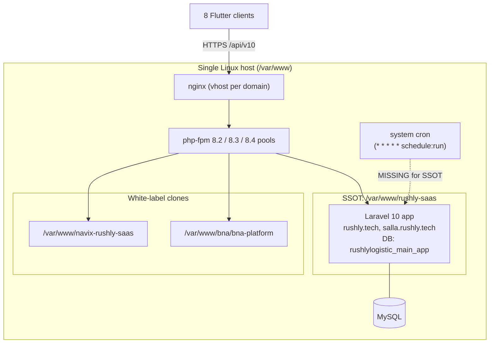
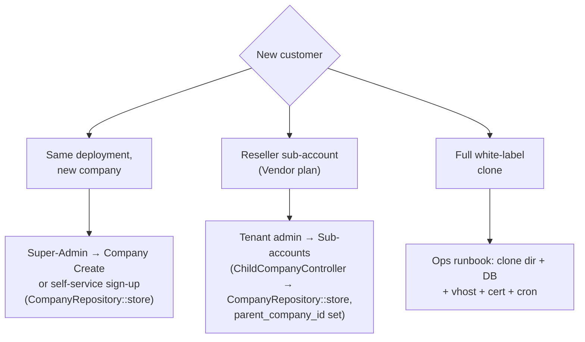

# 28 — Operations Manual

> **Scope.** How to *run* the Rushly platform (`rushly-saas`) in production: deploying
> code, driving the scheduler and its cron jobs, understanding the queue model,
> provisioning/onboarding a new tenant, managing storage and uploads, log & API-log
> retention, backups, monitoring/health, and step-by-step runbooks for routine ops.
>
> This document is a **synthesis / operator's view**. The authoritative detail lives in
> the sibling docs — this manual stitches them into task-oriented procedures and flags
> the operational gaps an on-call engineer must know about. `rushly-saas`
> (`/var/www/rushly-saas`) is the single source of truth; the Flutter apps are clients.
>
> **Read alongside:** [18-Deployment.md](18-Deployment.md) ·
> [19-Environment.md](19-Environment.md) · [05-System-Architecture.md](05-System-Architecture.md) ·
> [06-Database.md](06-Database.md) · [17-Security.md](17-Security.md) ·
> [20-Performance.md](20-Performance.md) · [22-Technical-Debt.md](22-Technical-Debt.md) ·
> [modules/saas-tenancy-subscriptions.md](modules/saas-tenancy-subscriptions.md).

---

## 0. TL;DR — the operating model in one screen

Rushly runs as a **classic bare-metal Laravel 10 deployment**: nginx serves `public/`,
php-fpm executes PHP, MySQL is the single database, and there is **no container / CI-CD /
orchestration** in the repo. Multi-tenancy in production is delivered two ways at once:

- **Layer A — in-app `company_id` scoping** inside one shared database
  (`stancl/tenancy`'s DB-per-tenant bootstrapper is installed but *dormant*).
- **Layer B — per-customer white-label clones** (separate directory + DB + nginx vhost +
  cron), each an independent deployment on the same host.

Four facts dominate every ops decision below, and each is a **live risk**:

| Fact | Consequence | Detail |
|---|---|---|
| `QUEUE_CONNECTION=sync` | Every "queued" job runs **inline** in the web/CLI request. No worker exists for `rushly-saas`. | [§4](#4-queue-workers) |
| The `schedule:run` cron is **not installed** for `/var/www/rushly-saas` | None of the Kernel-scheduled jobs (tracking sync, backups, invoices, log pruning, WMS checks) fire for the SSOT deployment. | [§3](#3-scheduler--cron-jobs) |
| `APP_DEBUG=true` while `APP_ENV=production` | Stack traces / SQL leak to authenticated users. | [§9](#9-configuration--secrets-hygiene) |
| `database:autobackup` **emails** the dump and deletes the local file | No durable, versioned backup store exists in the codebase. | [§7](#7-backups) |

Treat these as the top of the ops backlog, not as design intent. See
[22-Technical-Debt.md](22-Technical-Debt.md).



---

## 1. Environments & topology

| Concern | Value | Source |
|---|---|---|
| Framework / PHP | **Laravel 10** (`^10.10`) on PHP `^8.1`, run under **php-fpm 8.4** | [18-Deployment.md §1](18-Deployment.md) |
| Web server | nginx + php-fpm over Unix socket (`/run/php/php8.4-fpm.sock`) | 18 §3 |
| SSOT hosts | `rushly.tech`, `salla.rushly.tech` → `/var/www/rushly-saas/public` | 18 §3 |
| DB | MySQL, `rushlylogistic_main_app` (single shared DB) | 18 §5 |
| Queue / Cache / Session | `sync` / `file` / `file` (no Redis in use) | [19-Environment.md](19-Environment.md) §4–7 |
| Broadcast | `log` (no Pusher; realtime effectively off) | 19 §9 |
| TLS | Let's Encrypt / Certbot per vhost | 18 §3 |
| CI/CD, Docker | **Not found in the current codebase** — manual deploys | 18 §1 |

> **⚠️ Doc vs Code — "Laravel 12".** `README.md` / `ARCHITECTURE.md` say Laravel 12;
> `composer.json` pins `^10.10`. **Code wins: Laravel 10.** See
> [05-System-Architecture.md §1](05-System-Architecture.md).

The full environment-variable reference (every `config/*.php` key and its `.env`
mapping) is [19-Environment.md](19-Environment.md). The full build/server/tenancy
topology is [18-Deployment.md](18-Deployment.md). This manual does not repeat them.

---

## 2. Deploying code

### 2.1 Build steps (standard for this stack — not scripted in-repo)

There is **no deploy script** in the repository (`scripts/` holds only `dump-routes.php`
and `verify-inertia-pages.sh`). The canonical sequence, applied by hand or by your own
wrapper:

```bash
cd /var/www/rushly-saas

# 1. Pull code
git pull            # or rsync/deploy artifact

# 2. PHP deps (production)
composer install --no-dev --optimize-autoloader

# 3. Frontend (only the merchant Inertia/React bundle is Vite-built)
npm ci
npm run build       # emits public/build/{manifest.json,assets/*}

# 4. Database
php artisan migrate --force

# 5. Caches (see caveat below)
php artisan config:cache
php artisan route:cache
php artisan view:cache

# 6. Storage symlink (idempotent)
php artisan storage:link
```

> **Caveat — `config:cache` + `APP_DEBUG`.** The live `.env` currently has
> `APP_DEBUG=true` in production ([§9](#9-configuration--secrets-hygiene)). Fix that
> *before* caching config, or you will cache the wrong debug flag. `config:cache` also
> means `.env` changes require a re-cache to take effect.

Only the **merchant** surface is Vite-built (`resources/js/merchant.jsx`,
`resources/css/merchant.css`); the rest of the admin UI is still Blade + directly-served
views (mid-migration Blade→React). Blade views need no build step. See
[18-Deployment.md §2.2](18-Deployment.md) and [16-UI-UX.md](16-UI-UX.md).

### 2.2 Post-deploy verification checklist

1. `php artisan migrate:status` — confirm the new migrations are `Ran`.
2. Hit a page that renders the merchant bundle — confirm `public/build/manifest.json`
   fingerprints resolve (no stale-asset 404s). No `public/hot` file must exist in prod.
3. Tail `storage/logs/laravel.log` for boot errors.
4. **Confirm the scheduler cron is present** (it is currently missing — [§3.4](#34-the-missing-cron)).
5. Confirm `APP_DEBUG=false`.

### 2.3 Flutter clients

The 8 Flutter apps are **not deployed to this server** — they are built and shipped
through the app stores (`flutter build appbundle` / `ipa`) and point at the platform by
`API_BASE_URL` / `TENANT_HOST_SUFFIX` (see [19-Environment.md §14](19-Environment.md) and
[08-Flutter.md](08-Flutter.md)). A backend deploy does not require a client release unless
the API contract changed. Note the committed signing/domain drift caveats in
[18-Deployment.md §2.3](18-Deployment.md) (release build signed with the **debug** key;
non-admin apps default to `rushly-logistic.com`, not `rushly.tech`).

---

## 3. Scheduler & cron jobs

`app/Console/Kernel.php` defines the full schedule. Because the platform runs on a single
shared DB, these are effectively platform-wide commands; the multi-tenant ones iterate
`Tenant::all()` internally and `tenancy()->initialize()` per tenant (see [§3.2](#32-per-tenant-iteration-model)).

### 3.1 The full schedule (verified from `app/Console/Kernel.php`)

| Command | Cadence | Overlap guard | What it does | Source |
|---|---|---|---|---|
| `database:autobackup` | daily | — | Raw-PDO dump of `DB_DATABASE`, **emailed** then deleted locally ([§7](#7-backups)) | `app/Console/Commands/DatabaseAutoBackup.php` |
| `invoice:generate` | daily 13:00 | — | Auto-generates merchant invoices for every merchant in the list | `Invoice.php` |
| `shipments:detect-abnormal` | hourly | — | Per-tenant: upserts `abnormal_shipments` for parcels stalled ≥ threshold days | `DetectAbnormalShipments.php` |
| `wms:sla-check` | every 30 min | — | Per-tenant: flags WMS fulfillments whose SLA deadline has passed (logs `wms.sla.breached`) | `WmsFulfillmentSlaCheck.php` |
| `wms:min-stock-check` | daily 07:00 | — | Per-tenant: products at/under reorder point (logs `wms.min-stock.hit`) | `WmsMinStockCheck.php` |
| `wms:expiry-alert` | daily 08:00 | — | Per-tenant: stock batches expiring within N (default 7) days (logs `wms.expiry.soon`) | `WmsExpiryAlert.php` |
| `wms:auto-fulfillment` | every 15 min | — | Per-tenant: auto-creates WMS fulfillments for eligible orders | `WmsAutoFulfillment.php` |
| `aramex:sync-tracking` | every 15 min | `withoutOverlapping` | Legacy per-provider Aramex tracking poll | `AramexSyncTracking.php` |
| `jet:sync-tracking` | every 15 min | `withoutOverlapping` | Legacy per-provider Jet tracking poll | `JetSyncTracking.php` |
| `shipping:sync-tracking` | **every 5 min** | `withoutOverlapping` | Generic module: dispatches **one `SyncTrackingJob` per active connection** — supersedes the removed `logestechs:sync-tracking` | `ShippingSyncTracking.php` |
| `commerce:prune-logs` | daily 03:00 | `withoutOverlapping` | Prunes `commerce_api_logs` + processed `webhook_events` older than retention ([§6](#6-log--api-log-retention)) | `CommercePruneLogs.php` |
| `shipping:prune-logs` | daily 03:15 | `withoutOverlapping` | Prunes `shipping_api_logs` older than retention | `ShippingPruneLogs.php` |

Additional commands present but **not scheduled** (run manually / on demand):

- `performance:backfill` (`PerformanceBackfill.php`) — backfills KPI/performance
  aggregates. See [modules/reports-analytics-performance.md](modules/reports-analytics-performance.md).
- ZATCA commands under `app/Console/Commands/Zatca/` — see
  [modules/zatca-einvoicing.md](modules/zatca-einvoicing.md).
- `inspire` (Laravel stock demo closure in `routes/console.php`).

> **⚠️ Doc vs Code.** `_CONTEXT_BRIEF.md` §Standard flows names
> `commerce:prune-logs` / `shipping:prune-logs` and the 5-minute `shipping:sync-tracking`
> correctly; older repo docs (`ARCHITECTURE.md`) list only two console commands. The
> Kernel is the truth: **12 scheduled + several manual commands.**

### 3.2 Per-tenant iteration model

The abnormal-detection and WMS commands loop `Tenant::all()`, call
`tenancy()->initialize($tenant)`, skip tenants with no `settings()`, do their work, then
`tenancy()->end()` in a `finally`. Even though the **database** is shared, the tenant
registry rows exist (one per subdomain), and `CacheTenancyBootstrapper` /
`FilesystemTenancyBootstrapper` / `QueueTenancyBootstrapper` are enabled — so per-tenant
cache tags and storage paths are honoured during the loop
(`config/tenancy.php`; see [modules/saas-tenancy-subscriptions.md §3](modules/saas-tenancy-subscriptions.md)).

Useful operator flags (verified in the command signatures):

- `shipments:detect-abnormal --tenant=<id>` (single tenant) · `--threshold=<days>` (override).
- `wms:sla-check --tenant=<id>`, `wms:min-stock-check --tenant=<id>`,
  `wms:expiry-alert --tenant=<id> --days=<n>`.
- `shipping:sync-tracking --provider=<code>` (limit to one provider).
- `commerce:prune-logs --dry-run` / `shipping:prune-logs --dry-run` (report counts, delete nothing — run this in staging before scheduling in prod).

### 3.3 Driving the scheduler

A single system cron entry runs the Laravel scheduler once a minute; Laravel then decides
which commands are due:

```cron
* * * * * cd /var/www/rushly-saas && php artisan schedule:run >> storage/logs/schedule.log 2>&1
```

### 3.4 ⚠️ The missing cron (top operational gap)

> **The `schedule:run` cron is NOT installed for `/var/www/rushly-saas`.** The live root
> crontab has `schedule:run` for `rushly-store`, `bna-platform`, and `hani-yousif`, but
> **none for the SSOT.** As deployed, *none* of the scheduled jobs above fire for the main
> platform — no tracking sync, no daily backup, no invoice generation, no log pruning, no
> WMS SLA/expiry/stock checks. Each white-label clone carries its own cron; the SSOT
> appears to have been missed. **Installing this cron is the single highest-value ops fix.**
> See [18-Deployment.md §6](18-Deployment.md) and [_FINDINGS.md](_FINDINGS.md) (18-Deployment).

---

## 4. Queue workers

- **Default connection is `sync`** (`QUEUE_CONNECTION=sync`, `config/queue.php:16`). Every
  `dispatch()` / `ShouldQueue` job therefore executes **inline in the same request or CLI
  process** — there is no background execution. This is the operative model today.
- **No queue worker runs for `rushly-saas`.** The only supervisor program on the host
  (`/etc/supervisor/conf.d/rushly-queue.conf`) runs `queue:work` for the *separate*
  `rushly-store` app. See [18-Deployment.md §7](18-Deployment.md).
- The module-specific queue names (`commerce`, `shipping`, `fulfillment`) and
  `QueueTenancyBootstrapper` are configured, but **inert under `sync`** — they only matter
  once a real driver is set ([19-Environment.md §5](19-Environment.md)).

**Operational implications** (see [20-Performance.md §5](20-Performance.md)):

- Heavy inline work runs in the request: `shipping:sync-tracking` dispatches per-connection
  jobs that execute **synchronously in the scheduler process**; bulk AWB print/export,
  notifications (SMS/push/email), accounting sync, and ZATCA generation all run inline in
  the triggering web request. Long external-API loops can therefore stall a request.
- `failed_jobs` will rarely populate (there is no async worker to fail), so the failed-jobs
  admin viewer ([§8](#8-monitoring-health--ops-dashboards)) is mostly relevant to a future
  async setup.

**To move to real async** (recommended for tracking sync, bulk ops, notifications):

1. Set `QUEUE_CONNECTION=redis` (or `database`) in `.env` and re-cache config.
2. Add a supervised worker, e.g.:

   ```ini
   [program:rushly-saas-worker]
   command=php /var/www/rushly-saas/artisan queue:work --queue=shipping,commerce,fulfillment,default --sleep=3 --tries=3 --max-time=3600
   directory=/var/www/rushly-saas
   autostart=true
   autorestart=true
   numprocs=2
   user=www-data
   redirect_stderr=true
   stdout_logfile=/var/www/rushly-saas/storage/logs/worker.log
   ```

3. `supervisorctl reread && supervisorctl update`.
4. Add `php artisan queue:restart` to the deploy sequence so workers pick up new code.

Neither the driver change nor the worker is present today — both are ops decisions.

---

## 5. Tenant provisioning & onboarding

There are **three** ways a "tenant" comes into being; know which one applies:



### 5.1 In-app company provisioning (Layers A & B-reseller)

Creating a company **inside** an existing deployment is an *application feature*, not an
ops task. `app/Repositories/Superadmin/Company/CompanyRepository::store()` transactionally
provisions the whole graph: `general_settings` row → `tenants` row (id = chosen subdomain)
→ `domains` row (`{sub}.{host}`) → owner `User` (permissions derived from the plan's
`modules`) → `subscriptions` row (caps snapshotted, `expired_date` computed) → back-fill of
`general_settings.subscription_id/plan_id` → `CompanyFrontendDataSeeder`. It rolls back on
any throw. Full detail (plans, subscriptions, seat caps, Vendor/reseller model, OTP
sign-up) is in [modules/saas-tenancy-subscriptions.md](modules/saas-tenancy-subscriptions.md).

Key onboarding facts an operator should hold:

- A new tenant is reachable at `{subdomain}.{host}` once its `domains` row exists and its
  `general_settings` is active. `CompanyActivationMiddleware` renders `domain_not_activate`
  when a resolved tenant has no/inactive settings.
- Self-service sign-up starts on a **trial subscription that is already expired**
  (forces contact/pay before use) and requires email-OTP verification.
- Subscription expiry is enforced **reactively** by `subscriptionCheckMiddleware` at request
  time — there is **no proactive "expiring soon" notifier** (Not found in the current
  codebase). Ops should watch `subscriptions.expired_date` manually if renewals matter.
- Reseller sub-accounts are Vendor-plan-only (enforced server-side); each child is a *full*
  tenant tied back only via `general_settings.parent_company_id`.

### 5.2 White-label clone provisioning (Layer B — the ops runbook)

A full white-label customer gets its **own deployment**. This is **not** an in-app flow —
the `stancl` DB-per-tenant provisioning jobs are commented out
([18-Deployment.md §4.1](18-Deployment.md)). Runbook, reconstructed from the live topology:

```bash
# 1. Clone the codebase
git clone <rushly-saas> /var/www/<tenant>-rushly-saas
cd /var/www/<tenant>-rushly-saas

# 2. Build
composer install --no-dev --optimize-autoloader
npm ci && npm run build

# 3. Environment
cp .env.example .env
#   set APP_URL, APP_ENV=production, APP_DEBUG=false,
#   DB_DATABASE/DB_USERNAME/DB_PASSWORD, mail, keys
php artisan key:generate

# 4. Database
mysql -e "CREATE DATABASE <tenant_db> CHARACTER SET utf8mb4"
php artisan migrate --force
php artisan db:seed --force          # roles, permissions, config, demo data
php artisan storage:link

# 5. nginx vhost  (root .../public, fastcgi php-fpm socket) — model it on
#    the hardened rushly.store vhost (security headers, gzip, immutable /build/)
# 6. TLS
certbot --nginx -d <host>

# 7. Cron (DO NOT SKIP — see §3.4)
crontab -e
#   * * * * * cd /var/www/<tenant>-rushly-saas && php artisan schedule:run >> storage/logs/schedule.log 2>&1

# 8. (optional) queue driver + supervisor worker if moving off sync — §4
```

Each clone has its own `.env`, MySQL DB, vhost, cert, and cron. See
[18-Deployment.md §4.2 and §10](18-Deployment.md) for the observed live examples
(`navix-rushly-saas`, `bna/bna-platform`, `bostaexpress`).

### 5.3 Onboarding checklist (either path)

1. Subdomain / host resolves and TLS is valid (watch the SAN mismatch caveat in
   [18-Deployment.md §3.1](18-Deployment.md)).
2. Owner user can log in; permissions match the plan's `modules`.
3. Per-tenant integrations wired via **Admin → Integrations** (Salla/Zid/courier creds,
   SMS provider, FCM key) — these live in the DB (`integration_settings`,
   `NotificationSettings`), **not** `.env` ([19-Environment.md §11, §13](19-Environment.md)).
4. Subscription is active (`expired_date` in the future).
5. Scheduler cron installed for that deployment.

---

## 6. Log & API-log retention

Two classes of "logs" to operate:

### 6.1 Application logs (Monolog)

`config/logging.php` — default channel `stack`, `LOG_LEVEL` default `debug`. Files land in
`storage/logs/`. There is **no built-in rotation configured in the repo** beyond Laravel's
`daily` channel option; on the host, size management is an OS concern (`logrotate`) or the
`daily` driver. The scheduled WMS/SLA commands write structured warnings here
(`wms.sla.breached`, `wms.min-stock.hit`, `wms.expiry.soon`) — these are the primary signal
for those subsystems today (notification dispatch is a "Phase 6/7" TODO in the code).

Operator note: with `APP_DEBUG=true`, error responses (not just log files) leak traces —
fix per [§9](#9-configuration--secrets-hygiene).

### 6.2 API-call audit tables (pruned by cron)

The Shipping and Commerce modules write one DB row per outbound HTTP call, for diagnostics.
These are high-volume and are pruned by the two `prune-logs` commands ([§3.1](#31-the-full-schedule-verified-from-appconsolekernelphp)):

| Table | Written by | Retention default | Pruned by | Rule |
|---|---|---|---|---|
| `shipping_api_logs` | `app/Shipping/Logging/ApiLogger.php` | `config('shipping.logging.retention_days')` = **30** | `shipping:prune-logs` @ 03:15 | `created_at < now-30d`, chunked deletes of 5000 |
| `commerce_api_logs` | `app/Commerce/Models/CommerceApiLog.php` | `config('commerce.logging.retention_days')` = **30** | `commerce:prune-logs` @ 03:00 | `created_at < now-30d` |
| `webhook_events` (processed) | Commerce webhook ingest | 30 days | `commerce:prune-logs` @ 03:00 | drop only where `processed_at IS NOT NULL AND received_at < cutoff`; **unprocessed/failed rows are kept** |

Retention is tunable via `SHIPPING_LOG_API` / `COMMERCE_LOG_API` (enable/disable) and the
`retention_days` config ([19-Environment.md §10](19-Environment.md)). API logging masks
sensitive headers (`authorization`, `x-api-key`, `x-salla-signature`, etc.) at write time —
see [shipping-architecture.md](shipping-architecture.md) and
[modules/commerce-integrations.md](modules/commerce-integrations.md).

> **Because the SSOT scheduler cron is missing ([§3.4](#34-the-missing-cron)), these prune
> jobs are not running there** — `*_api_logs` will grow unbounded until the cron is
> installed. Run `php artisan commerce:prune-logs` / `shipping:prune-logs` manually as an
> interim measure (use `--dry-run` first to size the delete).

Activity audit (`spatie/laravel-activitylog`) writes an `activity_log` table for model
changes; it has **no pruning job** in the current codebase — monitor its growth.

---

## 7. Backups

The only backup mechanism in the codebase is `database:autobackup`
(`app/Console/Commands/DatabaseAutoBackup.php`), scheduled `daily`:

- Opens a **raw PDO** connection from `DB_*` env vars and streams `SHOW TABLES` with
  buffering disabled (a fix for prior OOM fatals).
- Writes `SHOW CREATE TABLE` + per-row `INSERT` statements to
  `storage/app/backups/database_backup_on_<ts>.sql`.
- **Emails** the `.sql` as an attachment to `settings()->email` (the tenant's configured
  address, also used as the From), then **`@unlink`s the local file**.

> **⚠️ Operational risk — no durable backup store.** Because the file is deleted after
> emailing, there is **no versioned, on-disk or off-site backup repository** in the code.
> Recovery depends entirely on the recipient mailbox retaining attachments, on the mailer
> actually being configured, and — critically — on the scheduler cron running (which it is
> not, [§3.4](#34-the-missing-cron)). It dumps `DB_DATABASE` only, so coverage is
> per-deployment. There is **no `mysqldump`-based, no S3, and no point-in-time / binlog**
> backup found in the current codebase.

**Recommended ops hardening (not implemented in-repo):**

- Add a host-level `mysqldump`/`xtrabackup` job writing to off-host storage (S3/rclone) with
  a retention policy, independent of the app's email-based command.
- Enable MySQL binary logging for point-in-time recovery.
- Verify restores periodically.

Restore of the app-produced dump is a plain `mysql <db> < backup.sql` against a fresh DB.

---

## 8. Monitoring, health & ops dashboards

### 8.1 In-app ops surfaces (Super-Admin, Inertia)

Several operator dashboards exist under the central Super-Admin routes
(`routes/superadmin.php`), all gated by `hasPermission:integrations_read` /
`integrations_update`:

| Surface | Route name | Controller | Purpose |
|---|---|---|---|
| **Health dashboard** (Phase 9) | `commerce.health.index` (`.../commerce/health`) | `Backend\Commerce\HealthController` | Consolidated integration/connection health view |
| **Webhook events** viewer + replay (Phase 3) | `commerce.webhook-events.*` | `WebhookEventController` | Inspect ingested webhooks; **replay** a failed one |
| **OMS orders** viewer (Phase 5) | `commerce.oms.orders.*` | `Oms\OrderController` | Inspect canonical orders |
| **Failed-jobs** viewer (Phase 8) | `commerce.ops.failed-jobs.*` | `Ops\FailedJobsController` | List / **retry** / **forget** failed queue jobs |
| **Fulfillment routes** CRUD | `commerce.fulfillment.routes.*` | `Fulfillment\FulfillmentRouteController` | Manage routing rules |

These are the primary operator-facing tools inside the app. The failed-jobs viewer becomes
meaningful only once a real queue driver is running ([§4](#4-queue-workers)).

### 8.2 Infrastructure health

- **No dedicated HTTP health/liveness endpoint** (`/up`, `/health`) is defined in the
  central routes — "Not found in the current codebase." Use nginx status + a synthetic
  check against a cheap authenticated route, or add a Laravel health endpoint.
- **No APM / metrics stack** (Prometheus, etc.) is wired in the repo. `Sentry` DSN slots
  exist only in the **Flutter** driver/merchant apps ([19-Environment.md §14](19-Environment.md)),
  not the backend.
- Log channels for Slack / Papertrail exist in `config/logging.php` but are **unconfigured**
  (blank env). Wiring `LOG_SLACK_WEBHOOK_URL` gives cheap alerting on `error`+.

### 8.3 What to watch (practical signals)

| Signal | Where | Why |
|---|---|---|
| `storage/logs/schedule.log` | host | Confirms the scheduler is actually firing |
| `storage/logs/laravel.log` (`wms.*`, `shipping.api_log_write_failed`) | host | WMS SLA/stock/expiry breaches; API log write failures |
| `shipping_api_logs` / `commerce_api_logs` row counts | DB | Table bloat = prune cron not running |
| `abnormal_shipments` rows | DB | Output of hourly `detect-abnormal` |
| `subscriptions.expired_date` | DB | No proactive expiry notifier exists |
| php-fpm slow log / nginx 5xx | host | Inline `sync` work stalling requests |

---

## 9. Configuration & secrets hygiene

- **⚠️ `APP_DEBUG=true` in production.** The live `.env` has `APP_ENV=production` *and*
  `APP_DEBUG=true`, leaking stack traces (with SQL) to authenticated users. Set
  `APP_DEBUG=false` and re-cache config. Top security/ops fix. See
  [18-Deployment.md §7](18-Deployment.md), [17-Security.md](17-Security.md).
- **⚠️ `/env-editor` web UI.** The `geekcafe/stylemix` env-editor package
  (`config/env-editor.php`) exposes a `['web']`-middleware UI that **reads/writes the live
  `.env`**. Confirm it is removed or locked down in production
  ([19-Environment.md §15](19-Environment.md)).
- **Static shared `API_KEY`** (`123456rx-ecourier123456`) is baked into both
  `config/rxcourier.php` and every Flutter binary — a legacy public-API gate, not per-user
  auth. Rotate/harden ([19-Environment.md §14](19-Environment.md), [17-Security.md](17-Security.md)).
- **Per-tenant credentials are in the DB, not `.env`** — Salla/Zid OAuth, courier
  connections, SMS, FCM, ZATCA. `.env.example` is severely under-documented; provision new
  environments from `config/*.php`, not `.env.example` ([19-Environment.md §15](19-Environment.md)).
- Cache/session/broadcast are file/`log`-based (no Redis, no Pusher). Realtime features are
  effectively disabled.

---

## 10. Runbooks (routine ops tasks)

### 10.1 "Deploy a code change"
See [§2.1](#21-build-steps-standard-for-this-stack--not-scripted-in-repo). Then the
[§2.2](#22-post-deploy-verification-checklist) checklist. If async queues are enabled, add
`php artisan queue:restart`.

### 10.2 "Tracking is stale for a courier"
1. Confirm the scheduler cron exists ([§3.4](#34-the-missing-cron)) and `schedule.log` shows recent runs.
2. Run manually for the provider: `php artisan shipping:sync-tracking --provider=<code>`.
3. Check `shipping_api_logs` for errors on that connection; masked headers show which
   connection/tenant. Legacy Aramex/Jet use their own `*:sync-tracking` commands.

### 10.3 "A webhook didn't turn into an order"
1. Super-Admin → Commerce → **Webhook events** (`commerce.webhook-events.index`); find the event.
2. Inspect payload / `processed_at`; use **Replay** on a failed event.
3. Check `commerce_api_logs` and the Health dashboard for the connection.

### 10.4 "Run log pruning now" (interim, because cron is missing)
```bash
php artisan commerce:prune-logs --dry-run   # size it
php artisan commerce:prune-logs
php artisan shipping:prune-logs --dry-run
php artisan shipping:prune-logs
```

### 10.5 "Take a manual DB backup"
The app command emails the dump ([§7](#7-backups)). For a durable local dump prefer:
```bash
mysqldump --single-transaction --quick <DB_DATABASE> | gzip > /backups/<db>_$(date +%F).sql.gz
```

### 10.6 "Provision a new tenant"
In-app company → [§5.1](#51-in-app-company-provisioning-layers-a--b-reseller). Full
white-label clone → [§5.2](#52-white-label-clone-provisioning-layer-b--the-ops-runbook).
Then [§5.3](#53-onboarding-checklist-either-path).

### 10.7 "Clear caches after a config/route change"
```bash
php artisan config:clear && php artisan config:cache
php artisan route:clear  && php artisan route:cache
php artisan view:clear   && php artisan view:cache
```
(Remember `config:cache` freezes `.env`; re-run after any `.env` edit.)

### 10.8 "Regenerate merchant frontend assets"
```bash
npm ci && npm run build   # public/build/manifest.json + assets/*
```
Ensure no `public/hot` file lingers (that would force Vite dev-server mode).

### 10.9 "Retry a failed job"
Super-Admin → Ops → **Failed jobs** (`commerce.ops.failed-jobs.*`), or CLI
`php artisan queue:retry all`. Only meaningful once an async driver + worker exist ([§4](#4-queue-workers)).

---

## 11. Known operational gaps (the ops backlog)

Consolidated from [_FINDINGS.md](_FINDINGS.md), [18-Deployment.md](18-Deployment.md),
[20-Performance.md](20-Performance.md), and [22-Technical-Debt.md](22-Technical-Debt.md):

1. **SSOT `schedule:run` cron missing** → no scheduled jobs run for the main platform ([§3.4](#34-the-missing-cron)). *Highest priority.*
2. **`APP_DEBUG=true` in production** → trace/SQL leakage ([§9](#9-configuration--secrets-hygiene)).
3. **No durable backup store** → email-only, auto-deleted dump; no off-site/PITR ([§7](#7-backups)).
4. **`QUEUE_CONNECTION=sync` + no worker** → all "async" work runs inline; heavy external loops stall requests ([§4](#4-queue-workers)).
5. **No proactive subscription-expiry notifier** → expiry enforced only reactively at request time ([§5.1](#51-in-app-company-provisioning-layers-a--b-reseller)).
6. **No backend health endpoint / APM** → limited external observability ([§8.2](#82-infrastructure-health)).
7. **`/env-editor` high-privilege surface** exposed unless locked down ([§9](#9-configuration--secrets-hygiene)).
8. **`activity_log` has no pruning job** → unbounded audit-table growth ([§6.2](#62-api-call-audit-tables-pruned-by-cron)).
9. **No CI/CD or deploy automation in-repo** → manual, error-prone deploys ([§2.1](#21-build-steps-standard-for-this-stack--not-scripted-in-repo)).
10. **TLS SAN mismatch risk** on the wildcard `*.rushly.tech` vhost ([18-Deployment.md §3.1](18-Deployment.md)).

---

## Sources

Files and docs actually read for this manual:

- **Scheduler / commands:** `app/Console/Kernel.php`, `routes/console.php`, and the command
  bodies in `app/Console/Commands/`: `DatabaseAutoBackup.php`, `Invoice.php`,
  `DetectAbnormalShipments.php`, `WmsFulfillmentSlaCheck.php`, `WmsMinStockCheck.php`,
  `WmsExpiryAlert.php`, `ShippingSyncTracking.php`, `CommercePruneLogs.php`,
  `ShippingPruneLogs.php` (+ `AramexSyncTracking.php`, `JetSyncTracking.php`,
  `WmsAutoFulfillment.php`, `PerformanceBackfill.php` by listing).
- **Retention / API logs:** `app/Shipping/Logging/ApiLogger.php`,
  `app/Commerce/Models/CommerceApiLog.php`, `config/commerce.php`, `config/shipping.php`.
- **Ops dashboards:** `routes/superadmin.php` (Phase 3/5/8/9 health, webhook-events, oms,
  ops/failed-jobs, fulfillment routes).
- **Tenancy / provisioning:** `config/tenancy.php`,
  `app/Repositories/Superadmin/Company/CompanyRepository.php` (via
  [modules/saas-tenancy-subscriptions.md](modules/saas-tenancy-subscriptions.md)).
- **Sibling docs synthesized:** [18-Deployment.md](18-Deployment.md),
  [19-Environment.md](19-Environment.md), [05-System-Architecture.md](05-System-Architecture.md),
  [20-Performance.md](20-Performance.md), [22-Technical-Debt.md](22-Technical-Debt.md),
  [modules/saas-tenancy-subscriptions.md](modules/saas-tenancy-subscriptions.md),
  [shipping-architecture.md](shipping-architecture.md), [_FINDINGS.md](_FINDINGS.md),
  [_CONTEXT_BRIEF.md](_CONTEXT_BRIEF.md).
</content>
</invoke>
