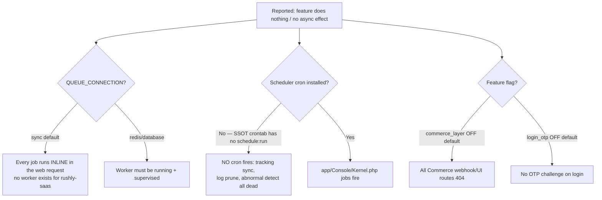
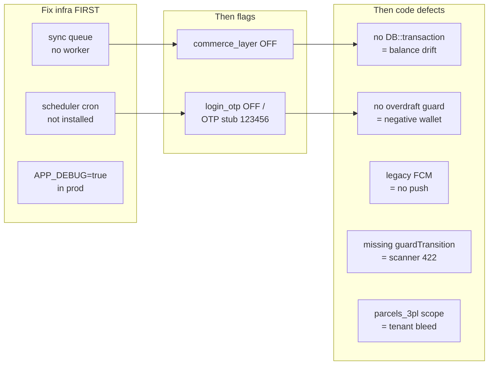

# 29 — Troubleshooting

> **Scope.** A field guide to the *known* failure modes of the Rushly platform: real defects, config traps, and design seams surfaced by the code audit. Each entry follows **Symptom → Root cause (with file ref) → Resolution → Prevention**. Every claim traces to a source file or an existing doc. Where a doc and the code disagree, the code wins (`rushly-saas` is the SSOT; it is **Laravel 10** — the README's "Laravel 12" is wrong per [_FINDINGS.md](_FINDINGS.md)).
>
> **How to use this.** Start at the [Symptom Index](#symptom-index), jump to the entry, confirm the root cause against the cited file before you change anything, then apply the fix. Most of these are *latent* — they only bite under a specific flag, deployment topology, or concurrency window.

Related deep-dives: [17-Security.md](17-Security.md) · [20-Performance.md](20-Performance.md) · [22-Technical-Debt.md](22-Technical-Debt.md) · [28-Operations-Manual.md](28-Operations-Manual.md) · [GAPS.md](../GAPS.md) and module docs under [modules/](modules/).

---

## The two settings that cause most "it does nothing" reports

Before triaging any specific bug, confirm the deployment posture. A large share of "feature X is broken" tickets are actually **the platform running exactly as configured** — with everything inline and two flags off.



- **`QUEUE_CONNECTION=sync`** (default) — there is **no queue worker** for `rushly-saas` in production; the only supervised `queue:work` targets `rushly-store` ([_FINDINGS.md](_FINDINGS.md), 18-Deployment). Every `ShouldQueue` job, SMS, push, and accounting sync runs **synchronously inside the triggering HTTP request**. "Async" queue names (`zatca`, `fulfillment.queue`) have no effect.
- **Scheduler not installed** — `schedule:run` is **not** in the live root crontab for the SSOT ([_FINDINGS.md](_FINDINGS.md), 18-Deployment). Every `app/Console/Kernel.php` entry (`shipping:sync-tracking`, `commerce:prune-logs`, `shipping:prune-logs`, courier sync commands) silently never fires.
- **Feature flags** in `config/features.php` (verified): `commerce_layer` (`FEATURE_COMMERCE_LAYER`, default **false**) and `login_otp` (`FEATURE_LOGIN_OTP`, default **false**).

> Fix the topology first. Many entries below are *only* reproducible because these three conditions hold. See [28-Operations-Manual.md](28-Operations-Manual.md).

---

## Symptom Index

| # | Symptom | Area | Severity |
|---|---------|------|----------|
| [1](#1-storefront-webhook-does-not-create-a-parcel) | Storefront webhook does not create a parcel | Commerce/OMS | High |
| [2](#2-balance-drift--ledger-and-scalar-balances-disagree) | Balances drift after delivery/return | Finance | High |
| [3](#3-wallet-goes-negative) | Merchant wallet goes negative | Finance | High |
| [4](#4-push-notifications-not-delivered) | Push notifications never arrive | Notifications | High |
| [5](#5-tracking-status-not-updating) | Tracking/3PL status stops updating | Shipping | High |
| [6](#6-cross-tenant-data-bleed-parcels_3pl--3pl-endpoints) | Cross-tenant AWB collision / data bleed | Multi-tenancy | Critical |
| [7](#7-accounting-sync-silently-fails-or-duplicates) | Qoyod/Daftra/Odoo sync fails or duplicates | Accounting | Medium |
| [8](#8-zatca-invoice-has-no-clearance--qr-only) | ZATCA invoice never clears / QR only | ZATCA | Medium (by design) |
| [9](#9-login-otp-either-absent-or-accepts-123456) | Login OTP absent, or accepts `123456` | Auth | Critical |
| [10](#10-scanner-app-force-status-always-returns-422) | Scanner "apply action" always 422s | Sorting/Scanner | High |
| [11](#11-parcel-status-shows-the-wrong-label--wrong-code) | Parcel status shows wrong label / wrong code | Parcels | Medium |
| [12](#12-merchant-dark-mode--locale-resets) | Dark-mode / locale preference resets | UI | Low |
| [13](#13-followup-notifications-and-some-sms-never-send) | Follow-up push / some SMS never send | Notifications | Medium |
| [14](#14-support-ticket-stuck-in-pending) | Support ticket stuck in PENDING | Support | Medium |
| [15](#15-fleet-driver-cannot-log-in-403) | Fleet/warehouse driver gets 403 | Auth/Fleet | High |
| [16](#16-app_debug-leaks-sql-in-production) | Stack traces / SQL leak to users | Security | Critical |
| [17](#17-tracking-number--awb-phantom-parcels-salla-bridge) | Salla bridge creates phantom `RX-` parcels | Integrations | Medium |
| [18](#18-invoice-number-collision) | Duplicate/colliding invoice numbers | Finance | Low |
| [19](#19-first-login-tour-never-auto-opens) | Onboarding tour never auto-starts | Tours | Low |
| [20](#20-broadcast--realtime-features-do-nothing) | Realtime/broadcast features do nothing | Architecture | Low |

---

## 1. Storefront webhook does not create a parcel

**Symptom.** A Salla/WooCommerce/Zid order is placed, the storefront reports the webhook delivered, but no order or parcel appears in Rushly.

**Root cause — three independent traps:**
1. **Feature flag off.** The generic Commerce ingestion layer (`app/Commerce/`) is gated by `commerce_layer`, default **false** (`config/features.php`, verified). The invokable `App\Http\Controllers\Api\V10\Commerce\WebhookController` **404s** when the flag is off (`routes/api.php:135`, comment confirms "controller 404s when `config('features.commerce_layer')` is off"). So the generic pipeline **Commerce → OMS `OrderReceived` → Fulfillment → parcel** is dormant in production.
2. **Route-shape mismatch.** Callers frequently POST the documented path. The real endpoint is `POST /api/v10/commerce/{provider}/webhook` (`routes/api.php:135`), **not** the `COMMERCE.md`-documented `POST /webhooks/commerce/{providerCode}` ([_FINDINGS.md](_FINDINGS.md), Commerce). The active Salla path today is the bespoke bridge (`app/Salla/` + `SallaService` writeback), whose route lives in `web.php` — *not* the generic Commerce route.
3. **No provider mapper.** Even with the flag on, `OrderNormalizer` only implements a **Salla** mapper; Zid/WooCommerce/Shopify **throw** ([_FINDINGS.md](_FINDINGS.md), OMS).

**Resolution.**
- Confirm which pipeline you intend. For live Salla today, use the `app/Salla/` bridge, not `commerce_layer`.
- To enable the generic layer: set `FEATURE_COMMERCE_LAYER=true`, register the `CommerceConnection`, and point the storefront at `POST /api/v10/commerce/{provider}/webhook`.
- Inspect `webhook_events` for the row: check `idempotency_key`, `attempts`, `last_error`, `normalization_error` (real columns per [_FINDINGS.md](_FINDINGS.md); *not* the `COMMERCE.md` column list). A populated `normalization_error` means the mapper rejected the payload.
- Remember: with `QUEUE_CONNECTION=sync`, `IngestWebhookJob` runs inline — a 500 on the webhook *is* the ingestion failing.

**Prevention.** Centralize the flag guard (today each controller does its own `abort_unless`; a new Commerce controller can forget it — [_FINDINGS.md](_FINDINGS.md), 26-Architecture-Decisions). Add a mapper before onboarding a non-Salla provider. See [modules/commerce-integrations.md](modules/commerce-integrations.md), [modules/oms-orders.md](modules/oms-orders.md), [12-Workflows.md](12-Workflows.md).

> ⚠️ **Doc vs Code.** `COMMERCE.md` describes route, columns, and job signatures that do not match code. Trust `routes/api.php` and the migration.

---

## 2. Balance drift — ledger and scalar balances disagree

**Symptom.** Merchant/hub/driver COD balances no longer reconcile against parcel cash collections; a delivery or return that partially failed left balances half-updated.

**Root cause.** The COD/settlement path in `app/Repositories/Parcel/ParcelRepository.php` performs **multiple coordinated balance + ledger writes with no `DB::transaction`** wrapper. `parcelDelivered()`, `parcelPartialDelivered()`, and `ReceivedRepository::store()` each issue ~8 balance writes; a mid-sequence failure drifts balances ([_FINDINGS.md](_FINDINGS.md), 04-Business-Logic & Finance). Contrast the transaction-wrapped `store`/`receivedWarehouse`/payout repos and `HubPaymentRepository`. The same pattern hits hub cash: `ReceivedRepository` store/update/delete do four coordinated ledger writes under bare `try/catch` only ([_FINDINGS.md](_FINDINGS.md), Hubs).

Compounding it: accounting is **not double-entry** — per-party **scalar balances** (`current_balance`, `wallet_balance`) are the source of truth despite the ledger appearance, so a drifted scalar has no self-correcting counter-entry (`ACCOUNTING.md §8`; [_FINDINGS.md](_FINDINGS.md), 03-Business-Domain).

**Resolution.**
- To repair a drifted account, recompute from the parcel cash-collection ledger and correct the scalar manually — there is no automatic reconciliation.
- Wrap the offending methods in `DB::transaction(function () { … })` so partial writes roll back. These are the specific unguarded methods: `parcelDelivered()`, `parcelPartialDelivered()`, `returnReceivedByMerchant()`, `ReceivedRepository::store()`.

**Prevention.** Add DB transactions to all multi-write balance mutations; add a periodic reconciliation job comparing ledger sums to scalar balances. See [modules/finance-billing-wallet.md](modules/finance-billing-wallet.md), [04-Business-Logic.md](04-Business-Logic.md).

---

## 3. Wallet goes negative

**Symptom.** A prepaid merchant creates parcels past their wallet balance; `wallet_balance` becomes negative and the merchant keeps shipping for free.

**Root cause.** The wallet debit on parcel create has **no overdraft guard**. In `app/Repositories/Parcel/ParcelRepository.php:654` (and again at `:924`):

```php
$w_merchant->wallet_balance = $w_merchant->wallet_balance - $parcel->total_delivery_amount;
```

There is no `if (wallet_balance >= amount)` check before the subtraction ([_FINDINGS.md](_FINDINGS.md), 04-Business-Logic & Finance). This is inconsistent with the payout paths (merchant/hub payout requests), which **do** validate `current_balance` before withdrawing.

**Resolution.** Guard the debit — reject parcel creation (or flag for approval) when `wallet_balance < total_delivery_amount`. Wrap it in the same `DB::transaction` recommended in [entry 2](#2-balance-drift--ledger-and-scalar-balances-disagree) so a concurrent create can't double-spend.

**Prevention.** A single `WalletService::debit()` with an overdraft policy would remove the duplicated unguarded subtractions at `:654`/`:924`. See [modules/finance-billing-wallet.md](modules/finance-billing-wallet.md).

---

## 4. Push notifications not delivered

**Symptom.** Driver/merchant/admin apps register FCM tokens but push notifications never arrive (or arrive intermittently then stop entirely).

**Root cause.** `app/Http/Services/PushNotificationService.php` calls Google's **deprecated legacy FCM HTTP API** — verified at `:30` and `:197` (`https://fcm.googleapis.com/fcm/send`) with `Authorization: key=<server key>` at `:33, :74, :102, :134, :171` — not FCM HTTP v1 ([_FINDINGS.md](_FINDINGS.md) ×5 docs). Google has **sunset** the legacy `fcm/send` endpoint, so calls now fail. Two aggravating factors:
- On error the service uses `die()`/`dd()` ([_FINDINGS.md](_FINDINGS.md), Notifications) — a push failure can **halt** the surrounding request.
- With `QUEUE_CONNECTION=sync`, push is sent inline, so a failing/blocking push directly degrades the API call that triggered it.
- `INTEGRATIONS.md §5` claims the driver side uses `firebase/php-jwt` + HTTP v1 — that is **not** the server implementation ([_FINDINGS.md](_FINDINGS.md), 14-Integrations).

**Resolution.**
- Migrate `PushNotificationService` to **FCM HTTP v1** (OAuth2 bearer via a service-account JSON, `POST /v1/projects/<id>/messages:send`). This is required — the legacy key path cannot be revived.
- Replace `die()`/`dd()` with logged exceptions so a push failure degrades gracefully.
- Note some apps never wire push at all (supervisor, warehouse, scanner, sorting, fleet — [_FINDINGS.md](_FINDINGS.md)); "no push" there is *expected*, not a bug.

**Prevention.** Queue push off the request path once a worker exists; centralize FCM credentials (currently in the `NotificationSettings` DB model per tenant — [_FINDINGS.md](_FINDINGS.md), 19-Environment). See [modules/notifications.md](modules/notifications.md), [14-Integrations.md](14-Integrations.md).

---

## 5. Tracking status not updating

**Symptom.** 3PL/Logestechs shipments stop advancing; the admin/merchant tracking view is stale.

**Root cause.** Tracking sync is cron-driven: `shipping:sync-tracking` runs `everyFiveMinutes()` (verified `app/Console/Kernel.php:31`), and legacy `aramex:sync-tracking`/`jet:sync-tracking` run every 15 min (`:27–28`). **But** `schedule:run` is not installed in the SSOT crontab ([_FINDINGS.md](_FINDINGS.md), 18-Deployment) — so **none of these fire in production**. Secondary causes:
- **Webhooks are scaffolding only.** No provider implements `SupportsWebhooks` and no `/shipping/webhooks` route exists ([_FINDINGS.md](_FINDINGS.md), Shipping) — so there is *no* push-based fallback if the cron is dead.
- A dead Panda route: `GET /panda/schudule_tracking_temp` (verified `routes/api.php:64`, note the typo) references `DeliveryPandaController::schudule_tracking_temp`, which — per [_FINDINGS.md](_FINDINGS.md) (21-Code-Review) — has no matching method and 500s if hit.

**Resolution.**
- Install the scheduler cron: `* * * * * cd /var/www/rushly-saas && php artisan schedule:run >> /dev/null 2>&1`.
- Verify with `php artisan schedule:list`, then run `php artisan shipping:sync-tracking` once manually to confirm connections resolve.
- With `sync` queue, the per-connection sync jobs run inline within the command — a stuck provider blocks the batch; consider a real queue + worker.

**Prevention.** Add scheduler + worker to the deploy runbook and a healthcheck that alerts if `shipping:sync-tracking` hasn't run in >10 min. See [modules/shipping-couriers.md](modules/shipping-couriers.md), [shipping-architecture.md](shipping-architecture.md), [28-Operations-Manual.md](28-Operations-Manual.md).

---

## 6. Cross-tenant data bleed (`parcels_3pl` / 3PL endpoints)

**Symptom.** A tenant sees, or a sync job mutates, another tenant's 3PL shipment; an AWB from company A resolves parcel data for company B.

**Root cause.** The legacy per-provider 3PL surface (`parcels_3pl`) historically had **no `company_id`** and several 3PL endpoints are **unauthenticated** (`3PL.md` issues #1/#3; [_FINDINGS.md](_FINDINGS.md) 03-Business-Domain, 14-Integrations, 21-Code-Review). Legacy sync jobs (Panda/Aramex/Jet) and the Zajel webhook run **untenanted**, so an AWB collision across tenants can cross-write.

> ⚠️ **Doc vs Code (partially remediated).** The **model** `app/Models/Backend/Parcels_3pl.php` now declares a `company_id` fillable ("Phase 9 — tenant scope", verified `:17`), a `companywise()` scope (`:50`), and a `booted()` hook that auto-populates `company_id` from the linked parcel on insert (`:70–84`). **However**: (a) `parcels_3pl` has **no CREATE migration** in the repo — its schema is inferred from the model + ALTER migrations ([_FINDINGS.md](_FINDINGS.md), 06-Database); (b) the *legacy sync jobs* that write it were flagged as still untenanted; and (c) the auto-populate only helps rows that go through the model's insert path with a resolvable parcel link. Rows created by raw courier callbacks or before Phase 9 can still lack scope.

**Resolution.**
- Verify the live `parcels_3pl` table actually has the `company_id` column (no canonical migration means you must introspect the DB, not trust the model).
- Backfill `company_id` on legacy rows from the linked parcel.
- Ensure every 3PL sync job and courier webhook applies `companywise()` / an explicit `company_id`.
- Authenticate the exposed 3PL endpoints ([17-Security.md](17-Security.md)).

**Prevention.** Migrate the remaining legacy providers (Aramex/Jet/Zajel/Panda) onto the tenant-scoped `app/Shipping/` module (only Logestechs migrated so far — [_FINDINGS.md](_FINDINGS.md), 26-Architecture-Decisions). Remember the platform is **single shared DB with `company_id` scoping** — `DatabaseTenancyBootstrapper` is commented out ([_FINDINGS.md](_FINDINGS.md), 17-Security), so isolation is *entirely* application-layer. See [17-Security.md](17-Security.md), [06-Database.md](06-Database.md), [modules/saas-tenancy-subscriptions.md](modules/saas-tenancy-subscriptions.md).

---

## 7. Accounting sync silently fails or duplicates

**Symptom.** Invoices/customers/bills don't appear in Qoyod/Daftra/Odoo, or appear **twice** after a retry, with no user-facing error.

**Root cause.**
- **Push-only, fire-and-forget.** There is no reconciliation or pull-back; drift is invisible and failures live only in logs and `*_sync_status` columns ([_FINDINGS.md](_FINDINGS.md), Accounting).
- **Idempotency gap.** A crash *between* remote-create and local id write-back **duplicates** the remote document on retry ([_FINDINGS.md](_FINDINGS.md), Accounting).
- **Runs inline.** Default sync queue means "async" jobs run inside the web request, so a slow accounting API stalls the user action ([_FINDINGS.md](_FINDINGS.md), Accounting).
- **Uneven provider parity.** Daftra lacks `VendorSync`/`BillSync`/courier-map and has no `CourierStatement` observer, unlike Qoyod/Odoo — so "sync" covers fewer documents than expected ([_FINDINGS.md](_FINDINGS.md), Accounting).
- **Odoo `cached_uid` never invalidated on auth failure** — a rotated Odoo password leaves a stale session id that keeps failing.
- **Credentials are per-tenant DB rows**, not env — `config/services.php` has **no** accounting entries ([_FINDINGS.md](_FINDINGS.md), Accounting). A missing/expired credential is a DB-row problem, not a `.env` problem.

**Resolution.**
- Check the tenant's accounting credential rows and `*_sync_status` columns first.
- On duplicates, dedupe on the remote system and add an idempotency key before the retry.
- For Odoo auth errors, clear `cached_uid` to force re-auth.
- Stand up a queue worker so syncs don't block the request.

**Prevention.** Add an `AccountingProviderInterface` (the three modules are near-duplicates with no shared abstraction — [_FINDINGS.md](_FINDINGS.md), 26-Architecture-Decisions), a reconciliation job, and idempotency keys. See [modules/accounting-sync.md](modules/accounting-sync.md), `ACCOUNTING.md`.

---

## 8. ZATCA invoice has no clearance / QR only

**Symptom.** A KSA tenant expects cleared/reported e-invoices; only a QR code is produced, `xml_payload`/`pdf_path` stay empty.

**Root cause — by design (Phase 1 only).** ZATCA is **generation-only**: `NullGateway::isAvailable()` always returns false (verified `app/Services/Zatca/Gateways/NullGateway.php:12`; `ZatcaService.php:45` gates all clearance on `isAvailable()`). No UBL XML, XAdES signing, CSID onboarding, or clearance/reporting exists — the `xml_payload` and `pdf_path` columns are declared but never written ([_FINDINGS.md](_FINDINGS.md), ZATCA ×2). This is **Phase 1 (Generation)**, not a bug.

**Secondary real defects:**
- `GenerateZatcaInvoiceJob::failed()` does **not** call `markFailed()`, so a permanently-failed async generation can leave **no failed row** ([_FINDINGS.md](_FINDINGS.md)).
- **Tenant-bleed history:** `ZatcaSetting` scopes by `settings()->id` while `ZatcaInvoice`/`ZatcaAuditLog` scope by `settings('company_id')`; an inline comment documents a prior bug where `(int)settings('company_id')` fell through to `0` ([_FINDINGS.md](_FINDINGS.md)).
- The merchant-panel `/zatca` route group (`routes/web.php:1434`) has **no** `hasPermission` middleware, unlike the admin group's `hasPermission:zatca_manage` ([_FINDINGS.md](_FINDINGS.md)). `zatca_read`/`zatca_settings`/`zatca_regenerate` are seeded but gate nothing — only `zatca_manage` is enforced.
- VAT inclusive-vs-exclusive on `total_charge` is **unvalidated** — silent over/under-reporting risk if totals are exclusive.

**Resolution.**
- Set expectations: clearance is not implemented. To add it, implement a real `ZatcaGateway` behind the existing seam.
- Patch `GenerateZatcaInvoiceJob::failed()` to call `markFailed()`.
- Unify the `companywise()` scope key across `ZatcaSetting`/`ZatcaInvoice`/`ZatcaAuditLog` and add `hasPermission:zatca_manage` to the merchant `/zatca` group.

**Prevention.** Credentials/environment are per-tenant DB rows (no `config/zatca.php`, zero `env()`/`config()` usage — [_FINDINGS.md](_FINDINGS.md), 19-Environment). Validate VAT mode against billing config. See [modules/zatca-einvoicing.md](modules/zatca-einvoicing.md).

---

## 9. Login OTP either absent or accepts `123456`

**Symptom (A).** Staff two-step login isn't challenged at all. **Symptom (B).** The OTP challenge accepts the literal code `123456` from anyone.

**Root cause.**
- (A) `login_otp` defaults **false** (`config/features.php`, verified). With the flag off, Admin/SuperAdmin skip the challenge; merchants/deliverymen skip it either way (flag comment).
- (B) **Critical.** Even with the flag *on*, `LoginController::currentOtpCode()` returns a hard-coded `'123456'` regardless of the clock — verified `app/Http/Controllers/Auth/LoginController.php:235–240` (`return '123456';`, `:199` consumes it). The doc-block describes a time-based `idH` code that is commented out. This is a **TEMP dev stub** — anyone who knows it can pass the second factor.

**Additional auth traps (same area):** remember-me stores the **raw plaintext password** in a 24h cookie (`useremail`/`userpassword`); `config/sanctum.php` sets `expiration=null` so personal-access tokens **never expire** ([_FINDINGS.md](_FINDINGS.md), 10-Authentication, 17-Security).

**Resolution.**
- **Do not enable `login_otp` in production until `currentOtpCode()` is fixed** — restore `now()->format('idH')` (or a proper random emailed code) at `LoginController.php:240`. Shipping the flag on with the stub is worse than off.
- Replace the plaintext remember-me cookie with Laravel's hashed remember-token.
- Set a Sanctum token expiration.

**Prevention.** Gate the stub behind `APP_ENV !== 'production'`. See [10-Authentication.md](10-Authentication.md), [17-Security.md](17-Security.md), [modules/permissions-users-roles.md](modules/permissions-users-roles.md).

---

## 10. Scanner app "force status" always returns 422

**Symptom.** The scanner/sorting app can *look up* a parcel but every apply-action / status-advance returns HTTP 422 "status invalid".

**Root cause.** `AdminParcelController::forceStatus` calls `ParcelStatusHelper::guardTransition()` (verified `app/Http/Controllers/Api/V10/Admin/AdminParcelController.php:153`) — a method that **does not exist** in `app/Support/ParcelStatusHelper.php` (verified: no `guardTransition` definition). The call is wrapped in `class_exists() + try/catch(\Throwable)` (`:151–160`), so instead of a fatal it is caught and returned as a generic **422 for every call** ([_FINDINGS.md](_FINDINGS.md), Sorting & Scanning). Lookup works because only the *advance* path hits the missing method.

**Resolution.** Implement `ParcelStatusHelper::guardTransition($current, $next)` (a real transition validator), **or** remove the `class_exists`/`guardTransition` block so the save proceeds. Confirm against the client-side action catalog — the scanner hard-codes status ids in `action_catalog.dart` and can drift from the server ([_FINDINGS.md](_FINDINGS.md)).

**Prevention.** There is **no central state-machine guard table** — only `PENDING→CANCELLED` is enforced model-side; raw `statusUpdate()` and API force-status can jump arbitrary states ([_FINDINGS.md](_FINDINGS.md), Parcels). Build one authoritative transition map shared by web + scanner. See [modules/sorting-scanning.md](modules/sorting-scanning.md), [modules/parcels.md](modules/parcels.md).

---

## 11. Parcel status shows the wrong label / wrong code

**Symptom (A, web).** A status renders a misleading label (e.g. a returned parcel reads "Not Delivered"). **Symptom (B, mobile).** The admin app's force-status sheet sends the *wrong* numeric code.

**Root cause.**
- (A) `parcelStatus.php` labels contradict the constant semantics: `RETURN_TO_COURIER` renders "Not Delivered", `RECEIVED_BY_PICKUP_MAN` renders "Received By Courier", `RETURNED_MERCHANT` renders "RTC" ([_FINDINGS.md](_FINDINGS.md), 04-Business-Logic). The live enum has **41** states (`app/Enums/ParcelStatus.php`), not the 9-value set in the `parcels.status` column comment ([_FINDINGS.md](_FINDINGS.md), Parcels, 13-User-Journeys).
- (B) **rushly-admin-app** force-status sheet uses **local** `ParcelStatus` constants that mismatch the backend enum: `deliveryManAssign 5 vs 7`, `receivedWarehouse 4 vs 5`, `returnToCourier 7 vs 24`, `returnReceivedByMerchant 10 vs 30` — it can send the **wrong status code** ([_FINDINGS.md](_FINDINGS.md), rushly-admin-app). Merchant app has an analogous KPI-vs-filter code mismatch (`1/7/9/30` vs `5/9/10`) that yields empty deep-linked lists.

**Resolution.**
- Treat `app/Enums/ParcelStatus.php` (41 constants) as authoritative and reconcile the label map and every Flutter `core/utils/parcel_status.dart`.
- For the admin app, correct the local constants to match backend codes before trusting force-status.

**Prevention.** Status ids are duplicated across every Flutter app with **no shared source** ([_FINDINGS.md](_FINDINGS.md), Parcels) — generate them from one canonical list. See [modules/parcels.md](modules/parcels.md), [13-User-Journeys.md](13-User-Journeys.md), [04-Business-Logic.md](04-Business-Logic.md).

---

## 12. Merchant dark-mode / locale resets

**Symptom.** The merchant web portal forgets dark-mode after a full reload; Flutter apps reset language to Arabic on cold start.

**Root cause.**
- Web: `MerchantLayout` `useDarkMode` writes `localStorage['merchant-theme']` on toggle but has **no load-on-mount effect** (AdminLayout does), so the preference doesn't persist across full reloads — apparent bug ([_FINDINGS.md](_FINDINGS.md), 16-UI-UX).
- Flutter: driver/merchant/warehouse `LocaleController` is **in-memory only** and resets to Arabic on every cold start, despite `shared_preferences` being available; admin persists via secure storage ([_FINDINGS.md](_FINDINGS.md) ×3).

**Resolution.** Add a mount-time read of `localStorage['merchant-theme']` in `MerchantLayout`; persist `LocaleController` to `shared_preferences`/secure storage in the affected apps.

**Prevention.** Mirror AdminLayout's persistence pattern. See [16-UI-UX.md](16-UI-UX.md), [08-Flutter.md](08-Flutter.md).

---

## 13. Follow-up notifications and some SMS never send

**Symptom.** NDR follow-ups and lifecycle SMS don't fire even though the admin SMS toggle looks enabled.

**Root cause.**
- **Silent no-op push.** `FollowupNotificationDispatcher::push()` (`app/Services/FollowupNotificationDispatcher.php`) calls `sendNotification`/`send` — methods that **don't exist** on `PushNotificationService`; the `method_exists` guards never match, so the follow-up push path is wired but non-functional ([_FINDINGS.md](_FINDINGS.md), Notifications).
- **Partial SMS gating.** Only **3** parcel-lifecycle SMS sends are gated by the `SmsSendStatus`/`sms_send_settings` toggle; the rest (pickup/reschedule/assign/return) fire **unconditionally** — the admin toggle controls fewer messages than it appears ([_FINDINGS.md](_FINDINGS.md)).
- **Enum-key mismatch.** The dispatcher's SMS gating uses free-form keys (`ndr_attempt_three`, `shipment_closed_lost`) that aren't in the `SmsSendStatus` enum, so those SMS are effectively **off by default** ([_FINDINGS.md](_FINDINGS.md)).
- SMS gateways **swallow failures** (return the exception object instead of throwing) and disable SSL peer verification ([_FINDINGS.md](_FINDINGS.md)) — failures are invisible.

**Resolution.** Point `FollowupNotificationDispatcher::push()` at a real `PushNotificationService` method; align the free-form event keys with the `SmsSendStatus` enum; decide which lifecycle SMS the toggle should govern and gate them consistently.

**Prevention.** There is **no unified Notification/Notifiable layer** and no persisted `notifications` table — messages aren't stored server-side ([_FINDINGS.md](_FINDINGS.md)). A single dispatcher with enum-typed events would remove the mismatch class of bug. See [modules/notifications.md](modules/notifications.md).

---

## 14. Support ticket stuck in PENDING

**Symptom.** Merchant/driver support tickets never leave PENDING; status changes from the mobile/merchant surface don't stick.

**Root cause.** The `status` column exists but is **not in the `Support` `$fillable`** and is never written by merchant/mobile/merchant-web paths — tickets stay PENDING **unless an admin acts** via the admin API/web ([_FINDINGS.md](_FINDINGS.md), Support & CRM). Related: admin-web status transitions are **UI-only** (`nextStatusOptions`); the `statusUpdate` route accepts **any** `?status=` value with no server-side state-machine guard. `SupportResource` also dereferences `$this->user->name`/`$this->department->title` with **no null-safety** — a ticket with a deleted user/department **throws on serialization**.

**Resolution.** Add `status` to `Support::$fillable` (or an explicit setter) and let the merchant/mobile paths write it; add server-side validation to `statusUpdate`; null-guard `SupportResource`.

**Prevention.** Merchant web support routes carry **no permission middleware** (session auth only) — add gating. There is no SLA/assignment/notes layer ([_FINDINGS.md](_FINDINGS.md)). See [modules/support-crm.md](modules/support-crm.md).

---

## 15. Fleet/warehouse driver cannot log in (403)

**Symptom.** A genuine fleet **deliveryman** cannot log in to the fleet app — every fleet endpoint returns 403.

**Root cause.** The fleet app is named "Fleet Driver" and the backend migration ties vehicles to `deliveryman` users, but `CheckAdminRoleMiddleware` (and `AdminAuthController@login`) admit only **ADMIN/INCHARGE/HUB/SUPER_ADMIN** and **reject DELIVERYMAN(3)** — so a real fleet deliveryman gets 403 on all fleet endpoints ([_FINDINGS.md](_FINDINGS.md), Fleet ×2). Only admin-type accounts can currently use the fleet app.

**Resolution.** Decide the intended audience. Either (a) admit `DELIVERYMAN` in `CheckAdminRoleMiddleware` for the fleet route group, or (b) provision fleet operators as `INCHARGE`/`HUB`. Note the login tagline advertises GPS that the client never captures — unrelated cosmetic gap.

**Prevention.** Reconcile the `user_type` model with the middleware allow-list per app. `users.user_type` enum adds `HUB=5`/`SUPER_ADMIN=6` beyond the stale migration comment ([_FINDINGS.md](_FINDINGS.md), Permissions). See [modules/fleet.md](modules/fleet.md), [modules/permissions-users-roles.md](modules/permissions-users-roles.md).

---

## 16. `APP_DEBUG=true` leaks SQL in production

**Symptom.** Authenticated users see full Laravel stack traces containing SQL, table names, and bindings on any 500.

**Root cause.** The live `.env` has `APP_DEBUG=true` **while** `APP_ENV=production` ([_FINDINGS.md](_FINDINGS.md), 18-Deployment, 21-Code-Review; `GAPS.md`). Every unhandled exception renders Ignition's SQL-bearing trace. This compounds several 500-prone code paths documented here (dead Panda route [#5](#5-tracking-status-not-updating), unbound Salla client, null-deref `SupportResource` [#14](#14-support-ticket-stuck-in-pending)).

**Resolution.** Set `APP_DEBUG=false` in production immediately and `php artisan config:clear`. Verify with a deliberate 404/500 that no trace renders.

**Prevention.** Add a deploy-time assertion that `APP_DEBUG=false` whenever `APP_ENV=production`. Also note the no-op custom `Cors.php` middleware and the hard-coded `config/rxcourier.php` api_key ([_FINDINGS.md](_FINDINGS.md), 17-Security). See [17-Security.md](17-Security.md), [18-Deployment.md](18-Deployment.md), [19-Environment.md](19-Environment.md).

---

## 17. Tracking number / AWB phantom parcels (Salla bridge)

**Symptom.** The standalone `rushly-salla` bridge reports a created parcel, but Rushly has a parcel with a fabricated `RX-…` tracking number that no courier recognizes.

**Root cause.** `CreateRushlyParcelJob` in `rushly-salla` **fabricates an `RX-` tracking number** on a 2xx response that lacks a `tracking_id`, persisting a **phantom parcel** ([_FINDINGS.md](_FINDINGS.md), rushly-salla). Compounding it: the bridge POSTs `/v10/merchant/parcel/store` but `rushly-saas` exposes `/v10/parcel/store` and `/v10/external/salla/parcel` (no `merchant/` segment); token-less `GET /v10/parcel/tracking/{id}` may 401 vs the real public `/api/public/tracking/{id}`; and `RushlyApiClient` is type-hinted with no container binding + a primitive constructor → probable `BindingResolutionException` ([_FINDINGS.md](_FINDINGS.md)).

**Resolution.** Fix the bridge to treat a 2xx-without-`tracking_id` as a **failure** (don't fabricate); correct the endpoint paths to the real `rushly-saas` routes; add the container binding for `RushlyApiClient`; use the public tracking route.

**Prevention.** The generic Commerce/OMS layer is intended to supersede these bespoke bridges but is flag-gated off ([entry 1](#1-storefront-webhook-does-not-create-a-parcel)). See [apps/rushly-salla.md](apps/rushly-salla.md), [14-Integrations.md](14-Integrations.md).

---

## 18. Invoice number collision

**Symptom.** Two invoices race to the same number under concurrent generation (a UNIQUE constraint violation, or a retried failure).

**Root cause.** `invoiceId()` uses a **company-wide `Invoice` count** rather than a per-merchant sequence — a theoretical collision under concurrent generation despite the UNIQUE constraint ([_FINDINGS.md](_FINDINGS.md), Finance, 04-Business-Logic).

**Resolution.** Generate numbers from a locked per-merchant sequence (or an atomic counter), inside a transaction, rather than counting rows.

**Prevention.** Same DB-transaction discipline as [entry 2](#2-balance-drift--ledger-and-scalar-balances-disagree). Note also: no scheduled cron auto-generates invoices — the "auto" is only a `payment_period`-elapsed guard inside `store()` ([_FINDINGS.md](_FINDINGS.md), Finance). See [modules/finance-billing-wallet.md](modules/finance-billing-wallet.md).

---

## 19. First-login tour never auto-opens

**Symptom.** The WelcomeModal / onboarding tour never auto-starts for genuine first-login users.

**Root cause.** `LoginController::authenticated()` stamps `users.first_login_at` **at login time**, *before* the SPA calls `/tours/for-me`; so `forMe()` sees `first_login=false` and the WelcomeModal likely never auto-opens ([_FINDINGS.md](_FINDINGS.md), Tours — flagged, not runtime-verified). Also `TourRepository` does **not** cache per-user for 5 min as `TOURS.md` claims — it uses a per-request in-memory `$memo` only (Cache::remember is avoided because stancl/tenancy's tagged CacheManager fails on the file driver).

**Resolution.** Stamp `first_login_at` **after** the tour eligibility check, or have `forMe()` compute first-login independently of the stamp.

**Prevention.** Add a feature test asserting the modal opens on the very first authenticated `/tours/for-me`. See [modules/tours-knowledge-base.md](modules/tours-knowledge-base.md).

> ⚠️ **Doc vs Code.** `TOURS.md`'s "5-minute Cache::remember" is inaccurate; code uses in-memory memo.

---

## 20. Broadcast / realtime features do nothing

**Symptom.** Expected live/websocket updates (dashboards, presence) never arrive.

**Root cause.** Broadcasting is **dormant**: `config/broadcasting.php` default is `null` (`.env.example` sets `log`) and `BroadcastServiceProvider` is **commented out** of `config/app.php` — no live websocket broadcasting is active despite the provider/`channels.php` files existing ([_FINDINGS.md](_FINDINGS.md), 05-System-Architecture, rushly-saas). Only one per-user channel is defined.

**Resolution.** If realtime is required, configure a real driver (Pusher/Reverb/Redis), uncomment `BroadcastServiceProvider`, and set `BROADCAST_DRIVER`. Otherwise, treat all "live" surfaces as **pull/refresh-only** (which is how the Flutter apps already behave).

**Prevention.** Don't assume broadcast-backed features work until a driver is wired. See [05-System-Architecture.md](05-System-Architecture.md).

---

## Quick triage cheat-sheet



| If you see… | Check first |
|---|---|
| "Async thing didn't happen" | `QUEUE_CONNECTION` + is a worker running? |
| "Cron thing didn't happen" | Is `schedule:run` in crontab? (`php artisan schedule:list`) |
| Stack traces to users | `APP_DEBUG` |
| Webhook → no parcel | `commerce_layer` flag + route shape + which bridge |
| Balances off | unguarded multi-write in `Parcel/ParcelRepository.php` |
| Wallet negative | overdraft guard at `ParcelRepository.php:654/924` |
| No push | legacy FCM in `PushNotificationService.php` |
| Cross-tenant data | `parcels_3pl` `company_id` + untenanted sync jobs |
| Scanner 422 | missing `ParcelStatusHelper::guardTransition` |
| OTP weak | `currentOtpCode()` returns `'123456'` |

---

## Sources

**Primary (audit findings & gaps):**
- [_FINDINGS.md](_FINDINGS.md) — 243 doc-vs-code conflicts + 246 gaps (the backbone of this guide)
- [_CONTEXT_BRIEF.md](_CONTEXT_BRIEF.md) — grounding brief (stack, flags, module map)
- `GAPS.md` (repo root) — health-check items (APP_DEBUG, migrations count)

**Cross-linked knowledge-base docs:**
- [04-Business-Logic.md](04-Business-Logic.md) · [10-Authentication.md](10-Authentication.md) · [12-Workflows.md](12-Workflows.md) · [13-User-Journeys.md](13-User-Journeys.md) · [17-Security.md](17-Security.md) · [18-Deployment.md](18-Deployment.md) · [19-Environment.md](19-Environment.md) · [20-Performance.md](20-Performance.md) · [22-Technical-Debt.md](22-Technical-Debt.md) · [28-Operations-Manual.md](28-Operations-Manual.md)
- Module docs: [commerce-integrations](modules/commerce-integrations.md), [oms-orders](modules/oms-orders.md), [finance-billing-wallet](modules/finance-billing-wallet.md), [notifications](modules/notifications.md), [shipping-couriers](modules/shipping-couriers.md), [parcels](modules/parcels.md), [sorting-scanning](modules/sorting-scanning.md), [accounting-sync](modules/accounting-sync.md), [zatca-einvoicing](modules/zatca-einvoicing.md), [support-crm](modules/support-crm.md), [fleet](modules/fleet.md), [permissions-users-roles](modules/permissions-users-roles.md), [saas-tenancy-subscriptions](modules/saas-tenancy-subscriptions.md), [tours-knowledge-base](modules/tours-knowledge-base.md)
- App docs: [apps/rushly-salla.md](apps/rushly-salla.md)

**Source files spot-verified for this doc:**
- `config/features.php` — `commerce_layer` + `login_otp` both default `false`
- `app/Http/Services/PushNotificationService.php:30,33,197` — legacy `fcm/send` + `Authorization: key=`
- `routes/api.php:135` (commerce webhook, 404s when flag off), `:64` (dead `panda/schudule_tracking_temp`)
- `app/Repositories/Parcel/ParcelRepository.php:654,924` — unguarded `wallet_balance` debit
- `app/Http/Controllers/Api/V10/Admin/AdminParcelController.php:151-160` — `guardTransition` call
- `app/Support/ParcelStatusHelper.php` — `guardTransition` **not defined**
- `app/Services/Zatca/Gateways/NullGateway.php:12`, `ZatcaService.php:45` — `isAvailable()` gate
- `app/Http/Controllers/Auth/LoginController.php:199,235-240` — hard-coded `'123456'`
- `app/Models/Backend/Parcels_3pl.php:17,50,70-84` — Phase-9 `company_id` scope + auto-populate
- `app/Console/Kernel.php:27,28,31` — `shipping:sync-tracking` (5 min), courier sync (15 min)
- `app/Services/FollowupNotificationDispatcher.php` — no-op push path

> **Accuracy note.** Where an issue is marked "flagged, not runtime-verified" (e.g. [entry 19](#19-first-login-tour-never-auto-opens)) it comes from static analysis in [_FINDINGS.md](_FINDINGS.md); confirm at runtime before shipping a fix. Anything not traceable to a file is labeled *Not found in the current codebase* rather than guessed.
