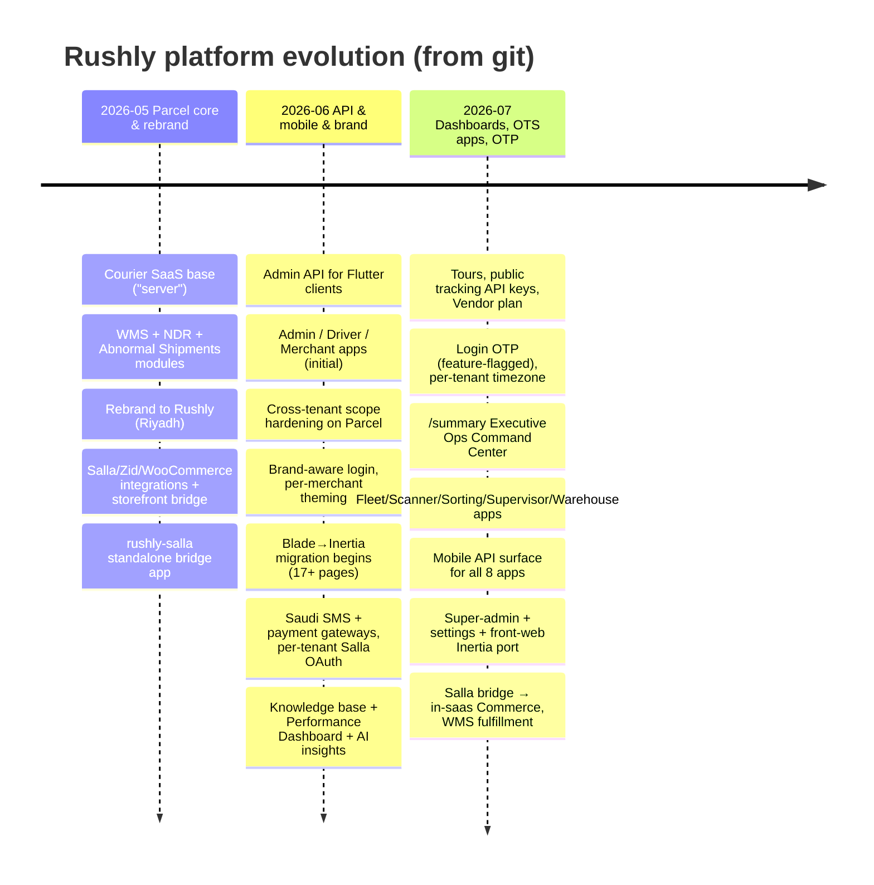
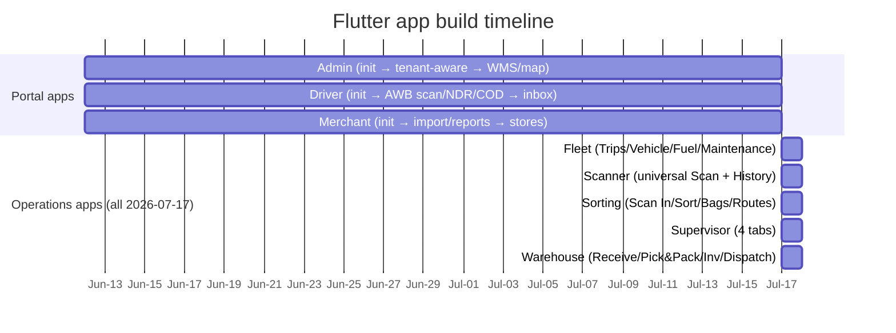

# 30 — Changelog

> **Reconstructed from git history, not a hand-maintained changelog.** Rushly ships no
> `CHANGELOG.md`; this document is assembled from `git log` across the eleven Rushly
> repositories (`rushly-saas` + 8 Flutter apps + `rushly-store` + `rushly-salla`),
> cross-checked against the existing knowledge base. Commit subjects are quoted verbatim.
> Dates are whatever git records for each commit (this checkout carries 2026 authored
> dates). Where the git story and the architecture story diverge, the architecture is
> documented in **[26-Architecture-Decisions.md](26-Architecture-Decisions.md)** — read
> the two together.
>
> **Scope caveat.** `git log` reflects what was *committed to these working copies*, which
> is not the full project history — several capabilities (the generic `app/Shipping` /
> `app/Commerce` / `app/Oms` / `app/Fulfillment` modules) are documented in the ADRs and
> present in code, but landed under broad commit subjects like "Add Salla, Zid,
> WooCommerce integrations" and "Ignore storefront bridge directories" rather than as
> self-announcing commits. Treat the module architecture as **evidence-in-code first**,
> git-subjects second.

`rushly-saas` is the single source of truth (**Laravel 10** — the README's "Laravel 12" is
a doc bug, see [26-Architecture-Decisions.md](26-Architecture-Decisions.md#adr-007--inertiajs--react-for-new-ui-migrating-off-blade)).
The Flutter apps and `rushly-store` are clients.

---

## Repository snapshot (as of this checkout, 2026-07-27)

| Repo | Commits | First → last commit | Role |
|---|---:|---|---|
| `rushly-saas` | 264 | 2026-05-22 → 2026-07-27 | Backend platform, API, admin/merchant/super-admin web. SSOT. |
| `rushly-store` | ~20 visible | → 2026-07-27 | Separate storefront / e-commerce app (own history). |
| `rushly-salla` | 8 | 2026-05-25 → 2026-05-28 | Standalone Salla↔Rushly bridge (later merged into saas). |
| `rushly-admin-app` | 8 | 2026-06-12 → 2026-07-17 | Flutter back-office app. |
| `rushly-driver-app` | 7 | 2026-06-12 → 2026-07-17 | Flutter last-mile driver app. |
| `rushly-merchant-app` | 7 | 2026-06-12 → 2026-07-17 | Flutter merchant portal. |
| `rushly-fleet-app` | 2 | 2026-07-17 | Flutter fleet app (Trips/Vehicle/Fuel/Maintenance). |
| `rushly-scanner-app` | 2 | 2026-07-17 | Flutter universal scanner. |
| `rushly-sorting-app` | 2 | 2026-07-17 | Flutter sorting-center app. |
| `rushly-supervisor-app` | 2 | 2026-07-17 | Flutter supervisor app. |
| `rushly-warehouse-app` | 2 | 2026-07-17 | Flutter warehouse ops app. |

Cross-repo per-app detail lives in [`apps/`](apps/); this doc is the timeline that ties
them together.

---

## The arc at a glance

The platform started life as a **parcel-centric courier/logistics management system** (a
Laravel courier SaaS base, initial commit subject simply `server`), was rebranded to
**Rushly**, then grew outward along the spine the ADRs describe: generic provider
abstractions → a canonical order layer → fulfillment routing → warehouse ops → a mobile
app fleet → an in-progress Blade→Inertia/React UI migration.



The three **half-migrated dualities** the ADRs call out are visible in the commit stream
too: legacy per-provider 3PL vs the generic Shipping module, `Parcel` vs the canonical
`Order`, and Blade vs Inertia/React. Each is intentional and non-destructive. See
[26-Architecture-Decisions.md § Cross-cutting themes](26-Architecture-Decisions.md#cross-cutting-themes)
and [22-Technical-Debt.md](22-Technical-Debt.md).

---

## rushly-saas — timeline by theme

### Phase 0 · Parcel core & rebrand (2026-05-22 → 2026-05-31)

The foundation: a working parcel/courier platform onto which the WMS, NDR (non-delivery
report), and Abnormal Shipments modules were bolted, per-tenant scheduled commands were
hardened, and the storefront-integration surface was first opened.

- `8c3e06e` **server** — base courier SaaS platform (parcel-centric core).
- `47ac54a` **Add WMS, NDR, Abnormal Shipments modules + login redesign** — the first big
  capability expansion beyond plain parcels. See [modules/wms-warehouse.md](modules/wms-warehouse.md),
  [modules/parcels.md](modules/parcels.md).
- `d5987b0` / `27453f8` **Skip detect()/empty tenants in per-tenant scheduled commands** —
  early multi-tenant robustness for the shared-DB, subdomain model
  ([26-ADR-001](26-Architecture-Decisions.md#adr-001--multi-tenancy-via-stancltenancy-one-db-subdomain-identification)).
- `6e07b2a` **Add INTEGRATIONS.md**, `fd0484e` **Add Salla, Zid, WooCommerce integrations
  + Integrations admin**, `4a800e7` **Ignore storefront bridge directories** — the
  storefront-ingestion surface opens. This is the seed of both the legacy per-provider
  services and (in code) the generic `app/Commerce` module. See
  [modules/commerce-integrations.md](modules/commerce-integrations.md),
  [14-Integrations.md](14-Integrations.md).
- `ee3f6e9` / `58fb24a` **Rebrand seeder data to Rushly (Riyadh)** — the "Rushly" identity.

### Phase 1 · Admin API + mobile foundations (2026-06-10 → 2026-06-13)

- `026efed` **Add 3PL integrations, Arabic translations, and frontend updates** — legacy
  per-provider 3PL courier services (Aramex/Jet/Zajel/Panda/Logestechs family). See
  [3PL.md](../3PL.md) via [modules/shipping-couriers.md](modules/shipping-couriers.md).
- `07731c0` / `50f478a` **Add admin API for rushly-admin Flutter app** (merged from an
  `admin-api` branch) — the first `/api` surface for a mobile client, i.e. the start of the
  Sanctum-token API story ([26-ADR-008](26-Architecture-Decisions.md#adr-008--laravel-sanctum-for-mobile-api-auth-session-for-web)).
- Deliveryman onboarding overhaul: `f1c22d0` **CRUD for supplier_companies and
  operational_areas**, `71feffd` **7-step deliveryman create wizard**, nationality table,
  per-step validation. See [modules/drivers-deliverymen.md](modules/drivers-deliverymen.md).
- `98baa0f` **Parcel: global tenant scope to close cross-tenant find() leaks** — a concrete
  instance of the ADR-001 "forgot `company_id`" risk being paid down.
- `72d711e` **Wire WMS product picker into parcel-create for fulfillment merchants** — first
  visible seam between WMS inventory and parcel creation.
- `fd1ca25` **Merchant geographic coverage: countries + cities**, `dbc6d4f` **Rushly
  favicon**.

### Phase 2 · Branding, theming, and the Inertia migration begins (2026-06-18 → 2026-06-24)

- `f724439` **Brand-aware login + 3 layout options (split / centered / fullbleed)**,
  `d7071b2` **per-merchant brand overrides + Inertia profile page**, `f809723` **full theme
  palette merchants inherit**, `ba6a00e` **Admin can impersonate a merchant**. See
  [15-Brand-System.md](15-Brand-System.md), [16-UI-UX.md](16-UI-UX.md).
- **Inertia/React migration wave** — the single most dominant theme of the whole history
  ([26-ADR-007](26-Architecture-Decisions.md#adr-007--inertiajs--react-for-new-ui-migrating-off-blade)):
  - `4a67185` **port 17 admin pages to Inertia/React stack**, `1210ffd` **verify-inertia-pages
    helper**, then a steady stream porting general-settings, integrations, delivery-charge,
    sms-settings, accounts, users, salarys, etc.
- Saudi-market integrations: `8a04084` **MSEGAT** + `0f12be3` **Taqnyat** SMS gateways,
  `19da41f` **merge Salla bridge into saas + add 4jawaly/Unifonic SMS**, `a4896ee`
  **Payment Integrations (Moyasar / Stripe / ClickPay / STC Pay)**, `0da50e4` **per-tenant
  Salla OAuth + webhook credentials**. See [14-Integrations.md](14-Integrations.md),
  [modules/notifications.md](modules/notifications.md).
- `27ebbf3` **api-docs: OpenAPI 3.1 spec + Redoc renderer**, `2e0232b` **merchant-app API
  reference page**. See [09-API.md](09-API.md).

> **Merge note:** `19da41f` folds the standalone `rushly-salla` bridge into `rushly-saas`.
> That standalone repo's own history stops at 2026-05-28 (see below); from here Salla lives
> inside the platform as part of the Commerce/integrations surface.

### Phase 3 · Knowledge base, performance analytics, tours (2026-06-26 → 2026-07-05)

- **Knowledge base system**: `1aee0b5` **central hub + per-section operator handbooks**,
  `5f5882c`/`abf586e` populate Operations/Finance/HR/Productivity/Billing/ZATCA/CMS/System
  handbooks, `64c8e18` **WMS admin handbook**, `4c24086` gate uploads behind
  `knowledge_base_update`. See [modules/tours-knowledge-base.md](modules/tours-knowledge-base.md).
- **Performance Dashboard**: `2862d3e` **ship /admin/performance with executive + driver +
  customer + branch + operating-company + AI insights**, `ecccf42` **fix cross-tenant data
  leak in Performance Dashboard**, `c5baafd` **parcel_events: company_id + tenant global
  scope** (another ADR-001 leak paydown). See
  [modules/reports-analytics-performance.md](modules/reports-analytics-performance.md),
  [20-Performance.md](20-Performance.md).
- Full Arabic/RTL translation pass + `9696214` **Cairo default font on admin + merchant
  Inertia portals**.
- `8030d95` **tours: interactive onboarding tour system with per-role scoping**, `7ef4cf5`
  **public tracking API keys (per-tenant)**, `db035ed` **per-key response-field control +
  Postman**.
- Bulk-action reliability: `a98e10b` **fix four bugs that made every browser submit fail**,
  `f87adce` **delete dead pre-Inertia blade views**. See [12-Workflows.md](12-Workflows.md).
- `a92d561` **plans+billing: Vendor plan, TMS gate, tenant-context sub-account creation** +
  test coverage — the SaaS commercial model gains a Vendor tier and child companies. See
  [modules/saas-tenancy-subscriptions.md](modules/saas-tenancy-subscriptions.md).

### Phase 4 · Login OTP, timezone, onboarding wizard (2026-07-14)

- `02e6ae0` **two-step login OTP for staff, behind features.login_otp** — feature-flag-gated
  security feature ([26-ADR-006](26-Architecture-Decisions.md#adr-006--feature-flag-gating-for-not-yet-stable-subsystems),
  [10-Authentication.md](10-Authentication.md)). Note the pilot-mode temporary codes
  (`a69ab8d` **fixed OTP 123456 (TEMP, pilot mode)**, and DDHHMM-derived codes) — flagged in
  [_FINDINGS.md](_FINDINGS.md) / [17-Security.md](17-Security.md) as a risk to remove before GA.
- `25fefc2` **switch app timezone Asia/Dubai → Asia/Riyadh**, `a9b53e6` **per-tenant timezone
  via general_settings.timezone**.
- `da76ca6` **onboarding: first-run setup wizard for new tenants**.

### Phase 5 · The `/summary` Executive Operations Command Center (2026-07-15 → 2026-07-17)

A dense, iterative build-out (30+ commits) of the tenant-admin landing dashboard —
`8cb786b` **new /summary landing, now the HOME target** → `09e0bc6` **rebuild as Executive
Operations Command Center** → donut/area charts, weekly success ring, per-hub OFD card, and
merchant/deliveryman/hub/city leaderboards, ending with `4d01018` **Split /summary +
/operations-dashboard so both dashboards coexist** and `25830ac` **clickable KPIs / donut
slices / leaderboard rows**. See [modules/reports-analytics-performance.md](modules/reports-analytics-performance.md).

### Phase 6 · Mobile API surface for all eight apps + super-admin port (2026-07-16 → 2026-07-17)

The backend endpoints that light up the Flutter fleet all land in this window (the apps
themselves are built the same day — see the mobile timeline below):

- `63ba0b3` **admin api: FCM push + merchant approvals + map + hub cash + WMS + 3PL**.
- `07d1530` **WMS cycle count + damage report endpoints**, `2d02871` **wms api: dispatch
  endpoints for warehouse app**, `82f1782` **rename dispatch() → confirmDispatch() (base
  Controller collision)**.
- `0a37785` **driver api: barcode lookup + COD reconciliation**, `470b816` **auth-guard
  /parcel-location-update**.
- `f0595af` **merchant api: bulk parcel import + shipment reports**, `1f00a62` **NDR feed,
  store connections, parcel geo fields**.
- `eb7894d` **admin api: reports/drivers + exceptions feed for supervisor app**, `24c99ec`
  **fleet api: tables + /admin/fleet endpoints**, `51e4f89` **sorting api: /admin/sorting
  endpoints**. See [09-API.md](09-API.md), [08-Flutter.md](08-Flutter.md).
- **Super-admin Inertia port**: `f146bdd` **dedicated /summary (cross-tenant)**, `064a9b4`
  **SUPER_NAV (only platform surfaces)**, `bfa4d72` **port all remaining Blade pages to
  Inertia**. See [modules/permissions-users-roles.md](modules/permissions-users-roles.md).
- **AWB label templates**: `a807a6b` **5 more AWB styles → 10 total**, `112edf0` port to
  Inertia, `54c7fbb` **render tenant logo**, later `bb7dbb5`/`1c1c5d3` **strip brand names
  from preview PDFs/pickers**. See [modules/parcels.md](modules/parcels.md).
- Account security: `2feb26f` **Browser Sessions page (Jetstream-style)**, `9f23a91`
  **persist real IP + user-agent per session**.

### Phase 7 · Front-web + settings Inertia port, Vendor/sub-accounts UI (2026-07-17 → 2026-07-22)

- `41fbe6b` **port all 7 index pages to Inertia + shared SimpleList shell**, `fbd04d7`
  **port create + edit forms for 6 modules to Inertia**, `7054bff` **port 5 legacy Blade
  settings pages**, `36736f7` **zatca/settings: fix two real bugs blocking the page**.
- Bulk-action UX overhaul (`ab944df`…`73c4f1f`): action pills, live preview table, clickable
  status badges, "Print AWBs", wiring dead bulk actions to the modern apply endpoint.
- **Child companies / Vendor plan UI**: `75b231a` **restrict plan selector to Vendor only**,
  `adb2424` **portal link + copy button per row**, `286eb78` currency typeahead. See
  [modules/saas-tenancy-subscriptions.md](modules/saas-tenancy-subscriptions.md),
  [VENDOR.md](../VENDOR.md).

### Phase 8 · Salla bridge → in-saas Commerce + WMS fulfillment (2026-07-27, latest)

The most recent `rushly-saas` work reconnects the Salla storefront path to WMS fulfillment
and hardens the AWB writeback — the live edge of the Commerce → OMS → Fulfillment story from
[26-ADR-004](26-Architecture-Decisions.md#adr-004--oms-canonical-order--provider-specific-normalization-pipeline)/[005](26-Architecture-Decisions.md#adr-005--fulfillment-as-a-routing--strategy-pattern):

- `6c33cea` **salla → wms: create fulfillment on order.created for delivery+fulfillment
  tenants** — order intake now branches on a per-store **Service scope** (`46a7d5b` **add
  Service scope field: delivery vs delivery+fulfillment**).
- `85d7cb9` **fix silent AWB writeback + add access token refresh**, `8917d10` **switch to
  PUT /shipments/{id} + cover 6 more webhook events**, `da2ba74` **fix Salla-initiated
  installs + scope stores by tenant**, `8d92516` **use real Salla payload paths for total +
  phone**. See [modules/commerce-integrations.md](modules/commerce-integrations.md),
  [apps/rushly-salla.md](apps/rushly-salla.md).
- `c31401c` **admin/parcel-reports: port to Inertia + AdminLayout** — the Inertia migration
  is still going.

---

## Mobile apps — timeline (Flutter clients)

All eight Flutter apps are thin clients of the `rushly-saas` API and were built in two
pushes: three "portal" apps in June, five "operations" apps on 2026-07-17. Detail per app in
[`apps/`](apps/) and [08-Flutter.md](08-Flutter.md).



- **Admin app** (`701cd38` init 06-12 → `b4f802e` 07-17): API base URL → tenant-aware
  install → FCM/approvals/map/hub-cash/WMS/3PL surfaces → parcel tracking map + WMS cycle
  count & damage reports → rebrand to `rushly.tech`.
- **Driver app** (`118fa10` init 06-12 → `b7c4458` 07-17): tenant-aware install, AWB scan,
  NDR create, COD reconciliation, runsheet, earnings, notifications inbox. Note `94f52da`
  **fix FCM subscribe payload: token → device_token** (a real client/server contract bug).
- **Merchant app** (`29fe68f` init 06-12 → `c32363d` 07-17): bulk import, reports, PDF
  export, ticket search+attach, charge preview, NDR view, store connections, tenant-aware.
- **Fleet / Scanner / Sorting / Supervisor / Warehouse** — each is a `Initial scaffold —
  tenant-aware install, login, placeholder home shell` followed by a single "feature-complete
  tabs" commit, all dated **2026-07-17**. Tab layouts:
  - Fleet: Trips · Vehicle · Fuel · Maintenance ([apps/rushly-fleet-app.md](apps/rushly-fleet-app.md), [modules/fleet.md](modules/fleet.md))
  - Scanner: Scan · History ([apps/rushly-scanner-app.md](apps/rushly-scanner-app.md))
  - Sorting: Scan In · Sort · Bags · Routes ([apps/rushly-sorting-app.md](apps/rushly-sorting-app.md), [modules/sorting-scanning.md](modules/sorting-scanning.md))
  - Supervisor: 4 tabs — assignments/exceptions/reports ([apps/rushly-supervisor-app.md](apps/rushly-supervisor-app.md))
  - Warehouse: Receive · Pick&Pack · Inventory · Dispatch ([apps/rushly-warehouse-app.md](apps/rushly-warehouse-app.md), [modules/wms-warehouse.md](modules/wms-warehouse.md))

> **Doc vs code caveat:** commit subjects like "feature-complete (4 tabs)" describe the app's
> own tab shells. The depth behind each tab (real vs placeholder screens) is assessed
> per-app in [`apps/`](apps/) and in [_FINDINGS.md](_FINDINGS.md) — the changelog records the
> commit's *claim*, not an independent completeness verdict.

---

## rushly-salla — standalone bridge (2026-05-25 → 2026-05-28)

A short-lived independent Laravel app that predates the in-saas Commerce module: `b2e9851`
**first commit** → `d086ae2` **global request logger for incoming Salla traffic** →
`61bbd3e` **persist every Salla webhook to the database** → `67dcfc9` **bridge dashboard
with KPIs, store health, config readout** → `4838dae` **log unknown-merchant skips**.

Its capability was folded into `rushly-saas` at `19da41f` (2026-06-24). The Salla flow now
lives inside the platform's Commerce/OMS path (Phase 8 above). See
[apps/rushly-salla.md](apps/rushly-salla.md) for how the standalone bridge and the in-saas
provider relate today.

---

## rushly-store — separate storefront app (latest visible: 2026-07-27)

`rushly-store` has its own git history (this checkout shows its most recent 2026-07-26/27
wave, not its origin). Recent themes:

- **Theming**: `53c0a1c0` **Theme scaffold command + Uniform demo theme**, `758d4b7c`
  **Uniform theme: premium fashion visual pass**.
- **Mail transport**: `477a5b0a` **Wire Resend as mail transport**, `4f4ede77` **fix
  misleading "SMTP not configured" error blocking Resend + non-SMTP transports**.
- **Super-admin store verification**: `7d450903` **"Mark as Verified" action**, `8c28985f`
  **Verified/Unverified badge on /stores**, `7389bc07` **cache-flush-resilient
  markVerified()**.
- **Roles / permissions robustness**: `0565ad04` **hoist addRole() before notification so
  registrations can't leave a user roleless**, `ba3f65a2` **replayable DeliveryPermissions
  seeder**.
- **i18n**: `a31985b8` **translation:audit artisan command**, then commits closing every
  `__()` gap in en + ar.
- **Seeders/fixes**: `de5e92f4` **products:seed-demo --count option**, `14b39f44` **fix demo
  product image paths**, `7585b2f8` **fix DecryptException on every AdminHub click**.

See [apps/rushly-store.md](apps/rushly-store.md).

---

## Notable bug-fix threads worth remembering

These recur across the history and map directly to the platform's known risk areas
([_FINDINGS.md](_FINDINGS.md), [17-Security.md](17-Security.md), [22-Technical-Debt.md](22-Technical-Debt.md)):

- **Cross-tenant data leaks** — the ADR-001 "forgot `company_id`" footgun, paid down
  repeatedly: `98baa0f` (Parcel global scope), `ecccf42` (Performance Dashboard leak),
  `c5baafd` (parcel_events company_id + global scope). New models remain the risk surface.
- **Mobile contract drift** — `94f52da` / `e40f346` **FCM subscribe payload: token →
  device_token** across driver + merchant apps; `82f1782` **dispatch() → confirmDispatch()**
  base-controller collision on the WMS API.
- **Inertia migration regressions** — `5bd2d86` **import Layers icon (fixes white-page)**,
  `d42a24e` **guard manifest.json read to survive Vite rebuild race**, `7ef4cf5` **fix
  Inertia closure crash**, `a8354e4` **safeRoute every url so a stale cache doesn't crash**.
- **Pilot-mode temporary auth** — `a69ab8d` fixed OTP `123456`, DDHHMM-derived codes: convenient
  for pilots, **must be removed before GA** (see [17-Security.md](17-Security.md)).
- **Branded-string leakage** — `bb7dbb5` / `1c1c5d3` / `6a30cd8` strip template/brand names
  from AWB label preview PDFs, picker labels, and URL slugs — a white-labeling hygiene thread.

---

## How to regenerate this changelog

```bash
# Platform (SSOT)
git -C /var/www/rushly-saas log --format='%ad %h %s' --date=short

# Every client repo
for app in rushly-admin-app rushly-driver-app rushly-fleet-app \
           rushly-merchant-app rushly-scanner-app rushly-sorting-app \
           rushly-supervisor-app rushly-warehouse-app rushly-store rushly-salla; do
  echo "=== $app ==="
  git -C /var/www/$app log --format='%ad %h %s' --date=short
done
```

Because no `CHANGELOG.md` is maintained, the commit stream *is* the changelog. Group by the
theme prefixes the team already uses in subjects (`summary:`, `bulk-action:`, `admin api:`,
`salla/`, `parcel/`, `super-admin:`, `label-templates:`, etc.).

---

## Sources

**Git history (primary):**
- `git -C /var/www/rushly-saas log` — 264 commits, 2026-05-22 → 2026-07-27.
- `git log` for the 8 Flutter apps + `rushly-store` + `rushly-salla` (see command above).

**Knowledge base cross-references (read, not duplicated):**
- [26-Architecture-Decisions.md](26-Architecture-Decisions.md) — the architectural arc (ADR-001…009) this timeline mirrors.
- [23-Roadmap.md](23-Roadmap.md), [22-Technical-Debt.md](22-Technical-Debt.md), [_FINDINGS.md](_FINDINGS.md) — forward-looking and known-issue context.
- [08-Flutter.md](08-Flutter.md), [09-API.md](09-API.md), [10-Authentication.md](10-Authentication.md), [14-Integrations.md](14-Integrations.md), [17-Security.md](17-Security.md), [20-Performance.md](20-Performance.md).
- App docs under [`apps/`](apps/) and module docs under [`modules/`](modules/).
- `_CONTEXT_BRIEF.md` — ground-truth metrics and repo roster.

**Non-authoritative / corrected:** `README.md` "Laravel 12 / PHP 8.4" — corrected to
**Laravel 10 / PHP 8.1+** per `composer.json` (see [26-ADR-007](26-Architecture-Decisions.md#adr-007--inertiajs--react-for-new-ui-migrating-off-blade)).
