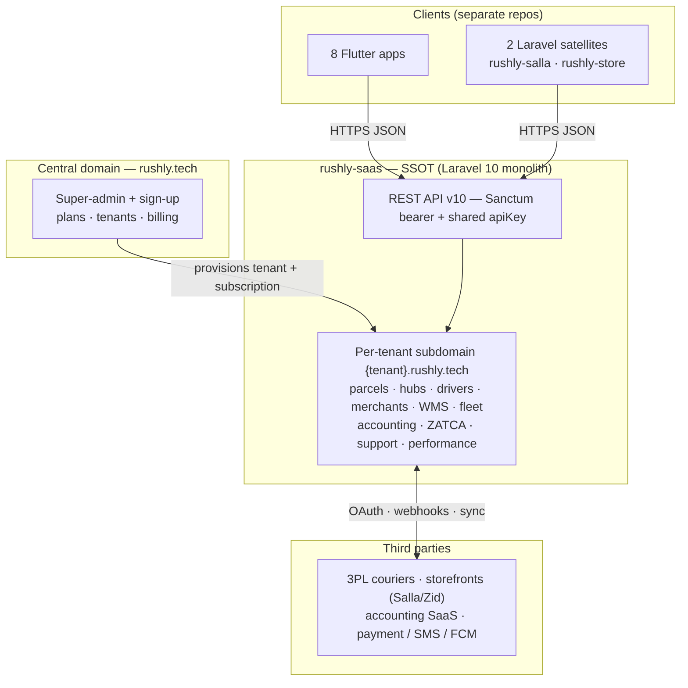
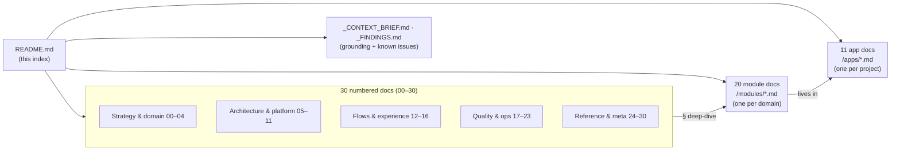

# README — Knowledge Base Index

> **What this is:** the master landing page for the Rushly knowledge base. It gives you
> a one-screen picture of what Rushly is, a **"start here" reading order** for each kind
> of reader, and a **complete, link-verified table of contents** for every doc in this
> `/docs` tree.
>
> **Provenance:** this entire knowledge base was **reverse-engineered from the actual
> source code on 2026-07-27** — not from product marketing, not from tribal memory.
> `rushly-saas` (`/var/www/rushly-saas`, **Laravel 10**) is the **single source of truth
> (SSOT)**; every other project is a client of it. Where a doc says something the code
> contradicts, the code wins and the discrepancy is logged in
> [_FINDINGS.md](_FINDINGS.md) (**243 doc-vs-code conflicts + 246 gaps**).
>
> ⚠️ **Read-me caveat that colors everything:** the repo `README.md`/`ARCHITECTURE.md`
> claim "Laravel 12 / PHP 8.4". **`composer.json` is authoritative — Laravel `^10.10`,
> PHP `^8.1`.** Treat any "Laravel 12" reference in older material as wrong.

---

## 1. Rushly in 90 seconds

Rushly is a **MENA-first, multi-tenant B2B logistics SaaS**: one Laravel 10 monolith
(`rushly-saas`) that runs an entire courier / 3PL / fulfillment operation — parcels,
hubs, drivers, merchants, cash/COD, WMS, fleet, accounting, ZATCA e-invoicing — for many
operator companies at once. Each operator is one **tenant** on its own subdomain
(`{tenant}.rushly.tech`). Around that hub orbits a **free ecosystem of 8 Flutter apps**
(admin, driver, fleet, merchant, scanner, sorting, supervisor, warehouse) and **2
Laravel satellites** (`rushly-store` storefront, `rushly-salla` bridge). It is a
**hub-and-spoke star**: every client talks to the SSOT over the versioned `v10` REST API;
**no spoke talks to another spoke**.

**Maturity, in one breath:** the **legacy MVC core** (parcels + 34-state lifecycle,
drivers, hubs, merchants, WMS, fleet, accounting, ZATCA, subscriptions) is **live and
carries real volume**. The next-gen **Commerce → OMS → Fulfillment** pipeline is
**architecturally clean but feature-flagged OFF** (`commerce_layer`, default off) — the
schema ships, the behavior is dark. The frontend is **mid-migration** Blade → Inertia/React.
Three risks gate scale: a **cross-tenant leak on the legacy 3PL path**, a
**non-double-entry accounting model that can drift**, and a **`sync` queue that runs
"async" jobs inline**. Full leadership read: **[00-Executive-Summary.md](00-Executive-Summary.md)**.

---

## 2. Start here — reading order by audience

Pick the row that matches you and read those docs, in that order. Every link is verified
to exist in this tree.

### 🆕 New engineer (get productive)
1. [00-Executive-Summary.md](00-Executive-Summary.md) — the whole platform in one read
2. [27-Developer-Guide.md](27-Developer-Guide.md) — setup, conventions, how to run it
3. [05-System-Architecture.md](05-System-Architecture.md) — topology, tenancy, request flow
4. [07-Laravel.md](07-Laravel.md) — backend deep-dive (the SSOT you'll edit)
5. [06-Database.md](06-Database.md) — schema, ER diagrams, data dictionary
6. [11-Modules.md](11-Modules.md) — module index + maturity matrix → then the relevant `modules/*.md`
7. [22-Technical-Debt.md](22-Technical-Debt.md) — the traps before you touch anything

### 🛠️ Ops / SRE / on-call
1. [28-Operations-Manual.md](28-Operations-Manual.md) — run/operate the platform
2. [18-Deployment.md](18-Deployment.md) — infrastructure & deploy
3. [19-Environment.md](19-Environment.md) — env-var reference
4. [20-Performance.md](20-Performance.md) — perf posture (`sync` queue, `file` cache, Redis dormant)
5. [17-Security.md](17-Security.md) — tenant isolation, API key, findings F1–F12
6. [14-Integrations.md](14-Integrations.md) — third-party surfaces (couriers, accounting, SMS, FCM)

### 📊 Business / PM / leadership
1. [00-Executive-Summary.md](00-Executive-Summary.md) — maturity, risks, marketing-vs-code
2. [02-Project-Overview.md](02-Project-Overview.md) — business model, market, revenue
3. [03-Business-Domain.md](03-Business-Domain.md) — domain map & business lines
4. [13-User-Journeys.md](13-User-Journeys.md) — who does what, end to end
5. [23-Roadmap.md](23-Roadmap.md) — where it's headed
6. [24-Glossary.md](24-Glossary.md) — the vocabulary

### 🤖 AI agent (context-loading order)
1. [25-AI_CONTEXT.md](25-AI_CONTEXT.md) — the purpose-built agent primer
2. [_CONTEXT_BRIEF.md](_CONTEXT_BRIEF.md) — ground-truth metrics & module map (read first, always)
3. [_FINDINGS.md](_FINDINGS.md) — 243 conflicts + 246 gaps (never repeat a debunked claim)
4. [11-Modules.md](11-Modules.md) + the specific `modules/*.md` for the task at hand
5. [24-Glossary.md](24-Glossary.md) — resolve domain terms before reasoning

---

## 3. How this knowledge base is organized

- **Numbered docs (00–30)** — the *cross-cutting narrative*: one topic per file, read
  in sequence or à la carte. (Numbering runs 00–28 then 30; **there is no 29**.)
- **Module docs (`modules/`)** — one file per *business domain* (parcels, WMS, finance…),
  the deepest ground-truth per subject.
- **App docs (`apps/`)** — one file per *project/repo* in the ecosystem, including the
  SSAS backend itself.
- **`_` meta files** — the grounding brief every doc was written against, and the
  aggregated findings ledger.

---

## 4. Numbered docs — complete table of contents (30 docs)

| # | Doc | What it covers |
|---|---|---|
| 00 | [00-Executive-Summary.md](00-Executive-Summary.md) | Leadership read: what ships today, maturity, top risks, marketing-vs-code |
| 01 | [01-Workspace-Inventory.md](01-Workspace-Inventory.md) | The 11 projects, stack, ground-truth metrics |
| 02 | [02-Project-Overview.md](02-Project-Overview.md) | Business model, market, revenue, plan/module gating |
| 03 | [03-Business-Domain.md](03-Business-Domain.md) | Domain map, business lines, entities |
| 04 | [04-Business-Logic.md](04-Business-Logic.md) | Rules, state machines, money-movers, invariants |
| 05 | [05-System-Architecture.md](05-System-Architecture.md) | Topology, multi-tenancy, API, events, runtime |
| 06 | [06-Database.md](06-Database.md) | Schema, 6 ER diagrams, data dictionary, enums |
| 07 | [07-Laravel.md](07-Laravel.md) | Backend deep-dive: routing, controllers, services, modules |
| 08 | [08-Flutter.md](08-Flutter.md) | Cross-app Flutter client architecture |
| 09 | [09-API.md](09-API.md) | API v10 reference (endpoints, auth, contracts) |
| 10 | [10-Authentication.md](10-Authentication.md) | Auth & authorization (session web, Sanctum mobile, permissions) |
| 11 | [11-Modules.md](11-Modules.md) | Module index + maturity matrix (gateway to `modules/`) |
| 12 | [12-Workflows.md](12-Workflows.md) | Operational workflows (pickup→delivery, bulk ops, crons) |
| 13 | [13-User-Journeys.md](13-User-Journeys.md) | End-to-end journeys per role |
| 14 | [14-Integrations.md](14-Integrations.md) | Third parties: couriers, storefronts, accounting, SMS, FCM, payments |
| 15 | [15-Brand-System.md](15-Brand-System.md) | Brand system & design tokens |
| 16 | [16-UI-UX.md](16-UI-UX.md) | UI/UX patterns (Inertia/React + Blade) |
| 17 | [17-Security.md](17-Security.md) | Security review: tenant isolation, API key, F1–F12 |
| 18 | [18-Deployment.md](18-Deployment.md) | Deployment & infrastructure |
| 19 | [19-Environment.md](19-Environment.md) | Environment-variable reference |
| 20 | [20-Performance.md](20-Performance.md) | Performance review (queue/cache posture) |
| 21 | [21-Code-Review.md](21-Code-Review.md) | Codebase quality review |
| 22 | [22-Technical-Debt.md](22-Technical-Debt.md) | Debt register TD-01…TD-14 + remediation order |
| 23 | [23-Roadmap.md](23-Roadmap.md) | Forward roadmap |
| 24 | [24-Glossary.md](24-Glossary.md) | Domain glossary |
| 25 | [25-AI_CONTEXT.md](25-AI_CONTEXT.md) | Purpose-built context primer for AI agents |
| 26 | [26-Architecture-Decisions.md](26-Architecture-Decisions.md) | ADR-001…ADR-009 (reconstructed) |
| 27 | [27-Developer-Guide.md](27-Developer-Guide.md) | Dev setup, conventions, workflow |
| 28 | [28-Operations-Manual.md](28-Operations-Manual.md) | Run-the-platform operations manual |
| 30 | [30-Changelog.md](30-Changelog.md) | Changelog |

> There is intentionally **no `29-*.md`** — the sequence jumps 28 → 30.

Also present in this directory: **[shipping-architecture.md](shipping-architecture.md)**
(the ported-in Shipping-module architecture note) and the **[inertia/](inertia/)** folder
(Blade→React migration guide: [inertia/README.md](inertia/README.md),
[inertia/setup.md](inertia/setup.md), [inertia/migration-guide.md](inertia/migration-guide.md),
plus `components/` and `pages/`).

---

## 5. Module docs — complete table of contents (20 docs)

One file per business domain, under [`modules/`](modules/). These are the deepest,
most code-grounded references — read `11-Modules.md` first for the map, then drill in.

| Domain | Doc | Focus |
|---|---|---|
| Parcels | [modules/parcels.md](modules/parcels.md) | Core courier shipment domain, 34-state lifecycle |
| Drivers | [modules/drivers-deliverymen.md](modules/drivers-deliverymen.md) | Deliverymen & last-mile |
| Hubs | [modules/hubs-network.md](modules/hubs-network.md) | Hub network & hub cash |
| Merchants | [modules/merchants.md](modules/merchants.md) | Merchant portal & management |
| Fleet | [modules/fleet.md](modules/fleet.md) | Vehicles, trips, fuel, maintenance |
| WMS | [modules/wms-warehouse.md](modules/wms-warehouse.md) | Warehouse management |
| Sorting/Scanning | [modules/sorting-scanning.md](modules/sorting-scanning.md) | Sorting center & scanning |
| Shipping | [modules/shipping-couriers.md](modules/shipping-couriers.md) | Generic courier abstraction (`app/Shipping/`) |
| Commerce | [modules/commerce-integrations.md](modules/commerce-integrations.md) | Storefront ingestion layer (flag-gated) |
| OMS | [modules/oms-orders.md](modules/oms-orders.md) | Canonical orders & normalization (flag-gated) |
| Fulfillment | [modules/fulfillment.md](modules/fulfillment.md) | Router & strategies (flag-gated) |
| Finance | [modules/finance-billing-wallet.md](modules/finance-billing-wallet.md) | Billing, COD, wallet, settlement |
| Accounting Sync | [modules/accounting-sync.md](modules/accounting-sync.md) | Qoyod / Daftra / Odoo sync |
| ZATCA | [modules/zatca-einvoicing.md](modules/zatca-einvoicing.md) | Saudi e-invoicing (Phase 1) |
| Reports/KPI | [modules/reports-analytics-performance.md](modules/reports-analytics-performance.md) | Reports, analytics, performance/KPI |
| SaaS | [modules/saas-tenancy-subscriptions.md](modules/saas-tenancy-subscriptions.md) | Tenancy, subscriptions, super-admin |
| Permissions | [modules/permissions-users-roles.md](modules/permissions-users-roles.md) | Users, roles, permissions |
| Notifications | [modules/notifications.md](modules/notifications.md) | SMS, push, email |
| Support/CRM | [modules/support-crm.md](modules/support-crm.md) | Support & CRM |
| Tours/KB | [modules/tours-knowledge-base.md](modules/tours-knowledge-base.md) | Onboarding tours & in-app knowledge base |

---

## 6. App docs — complete table of contents (11 docs)

One file per project in the ecosystem, under [`apps/`](apps/). All Flutter apps are
**thin clients** of the SSOT.

| Project | Doc | Type & role |
|---|---|---|
| **rushly-saas** | [apps/rushly-saas.md](apps/rushly-saas.md) | Laravel 10 — backend, API, admin web. **SSOT** |
| rushly-admin-app | [apps/rushly-admin-app.md](apps/rushly-admin-app.md) | Flutter — admin / back-office mobile |
| rushly-driver-app | [apps/rushly-driver-app.md](apps/rushly-driver-app.md) | Flutter — last-mile driver |
| rushly-fleet-app | [apps/rushly-fleet-app.md](apps/rushly-fleet-app.md) | Flutter — fleet driver |
| rushly-merchant-app | [apps/rushly-merchant-app.md](apps/rushly-merchant-app.md) | Flutter — merchant portal |
| rushly-scanner-app | [apps/rushly-scanner-app.md](apps/rushly-scanner-app.md) | Flutter — universal scanner |
| rushly-sorting-app | [apps/rushly-sorting-app.md](apps/rushly-sorting-app.md) | Flutter — sorting center |
| rushly-supervisor-app | [apps/rushly-supervisor-app.md](apps/rushly-supervisor-app.md) | Flutter — supervisor |
| rushly-warehouse-app | [apps/rushly-warehouse-app.md](apps/rushly-warehouse-app.md) | Flutter — warehouse ops |
| rushly-store | [apps/rushly-store.md](apps/rushly-store.md) | Laravel — standalone storefront / e-commerce |
| rushly-salla | [apps/rushly-salla.md](apps/rushly-salla.md) | Laravel — standalone Salla ↔ Rushly bridge |

---

## 7. Grounding & known-issues files

| File | Purpose |
|---|---|
| [_CONTEXT_BRIEF.md](_CONTEXT_BRIEF.md) | The shared ground-truth brief every doc was written against — workspace map, stack, module architecture, metrics. **Read first.** |
| [_FINDINGS.md](_FINDINGS.md) | Aggregated ledger of **243 doc-vs-code conflicts + 246 gaps** discovered while writing the KB. Consult before trusting any surprising claim. |

---

## 8. How to use this knowledge base (ground rules)

- **Code is truth.** These docs were reverse-engineered from source on **2026-07-27**;
  they describe *what the code does*, not what marketing says. When a legacy doc and the
  code disagree, the code wins — and it's probably already logged in [_FINDINGS.md](_FINDINGS.md).
- **`rushly-saas` is the SSOT.** It is **Laravel 10** (`composer.json` → `^10.10`),
  *not* Laravel 12. Flutter apps and the Laravel satellites are clients that render and
  mutate SaaS state.
- **Feature-flag awareness.** The Commerce → OMS → Fulfillment stack is real code but
  **off by default** (`config/features.php` → `commerce_layer`). Don't assume it's the
  live order path; the production courier flow is Parcel-centric.
- **When a fact isn't in the code,** the honest answer is "Not found in the current
  codebase" — several docs say exactly that on purpose.
- **Time-box.** These docs are a snapshot; re-verify against source before high-stakes
  changes.

---

## Sources

Synthesized from the knowledge base itself (directory listings verified with `ls` on
2026-07-27; every link target confirmed to exist):

- Directory inventories of `/var/www/rushly-saas/docs`, `docs/modules/`, `docs/apps/`,
  and `docs/inertia/`
- [00-Executive-Summary.md](00-Executive-Summary.md) — intro, maturity model, risk framing
- [_CONTEXT_BRIEF.md](_CONTEXT_BRIEF.md) — ecosystem map, stack, module architecture, ground-truth metrics
- [_FINDINGS.md](_FINDINGS.md) — 243 conflicts + 246 gaps (Laravel-version conflict, tenancy model, flag-gating)
- Section-heading survey of all 30 numbered docs, 20 module docs, and 11 app docs (for accurate one-line descriptions)
- Code/config corroboration cited throughout the KB: `composer.json` (Laravel `^10.10`),
  `config/features.php` (`commerce_layer` default off), `config/tenancy.php`
  (shared-DB tenancy)
