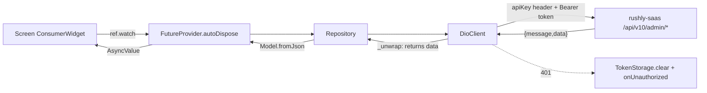
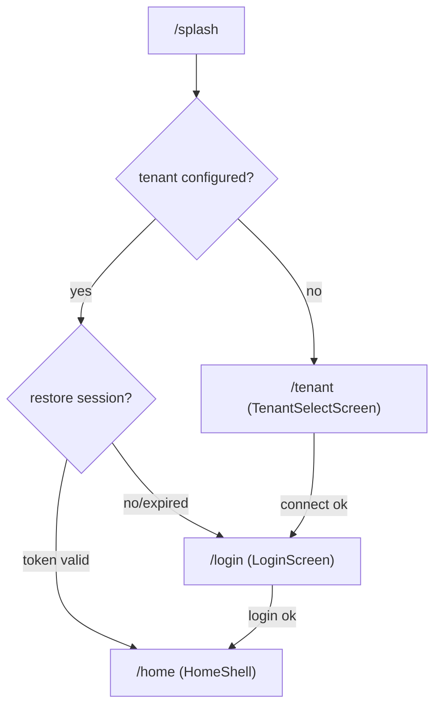
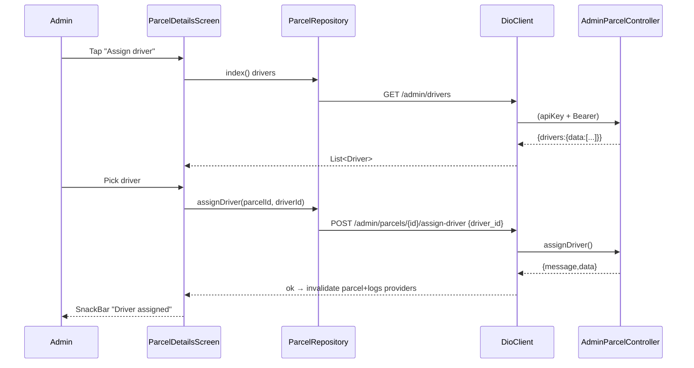

# rushly-admin-app — Admin / Back-office Mobile

> **Scope.** Deep-dive engineering doc for the **Rushly Admin** Flutter app
> (`/var/www/rushly-admin-app`). Covers purpose, target users, architecture
> (`core/ + shared/ + features/`), routing (`go_router`), theme, localization
> (ar/en + RTL), packages, state management (Riverpod), the API layer, models,
> token/tenant storage, push notifications, and **per-screen** documentation —
> each screen mapped to the backend endpoint it calls and to the relevant module
> doc under [`../modules/`](../modules/).
>
> **Ground truth.** `rushly-saas` (`/var/www/rushly-saas`) is the **SINGLE SOURCE
> OF TRUTH**. This app is a **pure client** of its `/api/v10/admin/*` HTTP surface
> and holds **no business logic** beyond request-building, presentation, role
> gating and device-local ephemeral state. Every non-trivial claim below cites a
> real source file. Where an existing doc (the app `README.md`) disagrees with the
> code, a **⚠️ Doc vs Code** note calls it out and the **code wins**.
>
> **Cross-references.** Shared Flutter architecture: [../08-Flutter.md](../08-Flutter.md).
> API surface: [../09-API.md](../09-API.md). Auth: [../10-Authentication.md](../10-Authentication.md).
> Multi-tenancy: [../05-System-Architecture.md](../05-System-Architecture.md).
> Module docs referenced throughout: [../modules/parcels.md](../modules/parcels.md),
> [../modules/drivers-deliverymen.md](../modules/drivers-deliverymen.md),
> [../modules/merchants.md](../modules/merchants.md),
> [../modules/hubs-network.md](../modules/hubs-network.md),
> [../modules/finance-billing-wallet.md](../modules/finance-billing-wallet.md),
> [../modules/wms-warehouse.md](../modules/wms-warehouse.md),
> [../modules/shipping-couriers.md](../modules/shipping-couriers.md),
> [../modules/support-crm.md](../modules/support-crm.md),
> [../modules/notifications.md](../modules/notifications.md),
> [../modules/permissions-users-roles.md](../modules/permissions-users-roles.md).

---

## 1. Purpose & target user

The Admin app is the **back-office mobile console** for Rushly Logistics. It is the
mobile companion to the Laravel admin web (Inertia/React) and exposes operational
controls that previously had **no JSON API at all** — the admin web returned Blade
views, so a fresh `/api/v10/admin/*` surface was built alongside this app.
Source: `README.md` ("What's new (server side)"), and the route group
`rushly-saas/routes/api.php:150`.

It powers all four **non-merchant / non-driver** roles (`README.md`):

| Role string (`AdminUser.role`) | `user_type` | Scope | Source |
|---|---|---|---|
| `super_admin` | 6 | Full cross-tenant back-office | `app/Enums/UserType.php`, `AdminUserResource::roleName()` |
| `admin` | 1 | Full back-office | same |
| `incharge` | 4 | Hub-clamped | same |
| `hub` | 5 | Hub-clamped | same |

**Role gating is enforced twice:** in the UI (drawer/nav items hidden by role) and
**server-side** by `CheckAdminRoleMiddleware` (rejects merchants/deliverymen with
403) and per-controller hub clamping (`AdminParcelController::clampToHub`). See
[§10 Permissions](#10-permissions--role-gating).

> ⚠️ **Doc vs Code.** `AdminUserResource::roleName()`
> (`app/Http/Resources/v10/Admin/AdminUserResource.php`) maps `user_type` 1→`admin`,
> 4→`incharge`, 5→`hub`, 6→`super_admin`. There is **no dedicated `role` column**;
> the string is derived from `user_type` at serialization time. The Flutter
> `AdminUser.role` therefore reflects `user_type`, not a stored role.

---

## 2. Stack & packages (`pubspec.yaml`)

`name: rushly_admin`, `version: 1.0.0+1`, Dart SDK `>=3.3.0 <4.0.0`,
Flutter `>=3.19.0`. Source: `pubspec.yaml`.

| Concern | Package(s) | Notes |
|---|---|---|
| State management | `flutter_riverpod ^2.5.1` | `ProviderScope` root in `main.dart`; `Notifier`/`FutureProvider.autoDispose` throughout |
| HTTP | `dio ^5.5.0`, `pretty_dio_logger ^1.4.0` | Single `DioClient` wrapper; logger only in `kDebugMode` |
| Secure storage | `flutter_secure_storage ^9.2.2` | Token, email, role, locale, tenant base URL |
| Prefs | `shared_preferences ^2.2.3` | Declared; not directly referenced in `lib/` (only `flutter_secure_storage` is used for persistence) |
| Fonts / images | `google_fonts ^6.2.1`, `cached_network_image ^3.3.1` | Inter (en) + Tajawal (ar) via `google_fonts` |
| i18n / format | `intl ^0.20.2`, `flutter_dotenv ^5.1.0` | Hand-rolled `AppLocalizations`; `.env` via dotenv |
| Routing | `go_router ^14.2.0` | Auth+tenant-guarded, see [§5](#5-routing-go_router) |
| Charts | `fl_chart ^0.68.0` | 14-day line chart on dashboard |
| Push | `firebase_core ^3.3.0`, `firebase_messaging ^15.0.4`, `flutter_local_notifications ^17.2.2`, `permission_handler ^11.3.1` | FCM + foreground local notifications |
| Misc | `url_launcher ^6.3.0` (tel:, AWB PDFs), `package_info_plus ^8.0.1` | |
| Maps | `flutter_map ^7.0.2`, `latlong2 ^0.9.1` | OSM tiles — **not** Google Maps SDK |
| Scanning | `mobile_scanner ^5.2.0` | Barcode scan in WMS screens |

Assets: `assets/images/`, `assets/icons/`, `.env` (bundled). Only
`assets/images/logo.png` currently exists (`ls assets`).

> ⚠️ **Doc vs Code.** `README.md` setup step 3 tells you to drop Tajawal `.ttf`
> files into `assets/fonts/`, but the theme loads Tajawal via **`google_fonts`**
> (`GoogleFonts.tajawalTextTheme()` in `lib/shared/theme/app_theme.dart`), i.e.
> fetched/cached at runtime, not from bundled font files. There is no `fonts:`
> section in `pubspec.yaml`. The README instruction is stale.

---

## 3. Architecture (`core/ + shared/ + features/`)

69 Dart files (`_CONTEXT_BRIEF.md`; `find lib -name '*.dart' | wc -l`). Clean
layered structure per feature: `data/` (repository + Riverpod providers),
`domain/` (immutable models with `fromJson`), `presentation/` (screens/widgets).

```
lib/
├── main.dart                     # bootstrap: dotenv → Firebase → ProviderScope
├── core/
│   ├── api/
│   │   ├── api_endpoints.dart     # static registry of /admin/* paths
│   │   ├── dio_client.dart        # Dio wrapper: apiKey header, bearer, 401 handler, unwrap
│   │   └── providers.dart         # secureStorage/token/tenant/dio Riverpod providers
│   ├── config/env.dart            # dotenv accessors (API_BASE_URL, API_KEY, TENANT_HOST_SUFFIX)
│   ├── error/api_exception.dart   # normalizes Laravel error envelope → ApiException
│   ├── push/push_service.dart     # FCM init, foreground notifications, token (un)subscribe
│   ├── storage/
│   │   ├── token_storage.dart     # auth_token/email/role/locale
│   │   └── tenant_storage.dart    # tenant_api_base + label
│   └── utils/
│       ├── json_x.dart            # asInt/asDouble/asString/asListOfMaps coercers
│       └── parcel_status.dart     # ParcelStatus + UserRole constants (⚠ see §11)
├── shared/
│   ├── l10n/                      # AppLocalizations (en+ar), LocaleController, toggle button
│   ├── router/app_router.dart     # go_router config + splash
│   └── theme/app_theme.dart       # brand colors, M3 light/dark, RTL-aware fonts
└── features/
    ├── auth/          approvals/    dashboard/   drivers/
    ├── fraud/         hub_cash/     hubs/        map/
    ├── merchants/     parcels/      support/     tenant/     wms/
```

Feature-to-layer mapping is uniform: every `features/<x>/data/<x>_repository.dart`
depends on `dioClientProvider` and exposes `FutureProvider.autoDispose` providers;
screens `ref.watch` them and render `.when(loading/error/data)`. Source: every
`*_repository.dart` file.

### 3.1 Request/response flow



---

## 4. API layer (`lib/core/api/*`)

### 4.1 `DioClient` (`lib/core/api/dio_client.dart`)

- **Base options:** `baseUrl` resolved from `TenantStorage` at construction (falls
  back to `Env.apiBaseUrl`); connect 20s / receive 30s / send 30s; default headers
  `Accept: application/json` and **`apiKey: <Env.apiKey>`** (the shared,
  hard-coded API key — see [§9](#9-storage-token--tenant) security note).
- **Request interceptor:** reads the bearer token from `TokenStorage` on every
  request and sets `Authorization: Bearer <token>` when present.
- **Error interceptor:** on **HTTP 401** it clears the token and fires
  `_onUnauthorized` (wired by the router/auth flow) — i.e. **auto-logout** on token
  expiry.
- **Verbs:** `get/post/put/delete<T>` all funnel `DioException` → `ApiException.fromDio`.
- **`_unwrap<T>`:** if the response body is a `Map` containing a `data` key, returns
  `data['data']`; otherwise returns the raw body. This matches the Laravel
  `ApiReturnFormatTrait` envelope `{ message, data: {...} }` used by every admin
  controller (e.g. `responseWithSuccess(...)` in `AdminAuthController`).

### 4.2 `ApiEndpoints` (`lib/core/api/api_endpoints.dart`)

Static path registry mirroring `routes/api.php`. Full listing appears in the
**endpoint map** ([§12](#12-endpoint-map-app--backend--module)). Note two path
**families**:

- `/admin/*` — admin console endpoints, guarded by `CheckApiKey` + `auth:sanctum`
  + `CheckAdminRole`.
- `/wms/*` — **shared** scanner endpoints (`wmsProductLookup`, `wmsStock`,
  `wmsGrnScan`, `wmsGrnComplete`, `wmsAdjustment`) documented as "any authed user"
  in the source comment. ⚠️ **Doc vs Code:** these `/wms/*` (non-`/admin`) paths are
  declared in `api_endpoints.dart` but **`wmsProductLookup`, `wmsStock`,
  `wmsGrnScan`, `wmsGrnComplete`, `wmsAdjustment` were not found in the
  `/api/v10/admin` route group** (`routes/api.php:150-233`). The GRN scan/stock
  screens call them; confirm the shared `/api/v10/wms/*` group is registered
  elsewhere before relying on them. The admin-scoped WMS endpoints that **are**
  wired are `/admin/wms/{grns,locations,cycle-counts,damage-reports}`.

### 4.3 `ApiException` (`lib/core/error/api_exception.dart`)

Normalizes the Laravel envelope: pulls `message`/`error`, parses `errors` (or a
`message` map) into `fieldErrors: Map<String,List<String>>`, and classifies the
`DioExceptionType` into `ApiErrorKind {offline, server, cancelled, unknown}`.
Convenience getters `isUnauthorized/isForbidden/isValidation/isOffline`. Screens
currently surface `e.toString()` (the message) in SnackBars; field-level errors are
parsed but not yet rendered inline.

### 4.4 Providers (`lib/core/api/providers.dart`)

```
secureStorageProvider → tokenStorageProvider / tenantStorageProvider
tenantBaseUrlProvider (FutureProvider<String?>)  ← read once from TenantStorage
dioClientProvider (Provider<DioClient>)          ← baseUrl = tenantBaseUrl.valueOrNull
```

Changing tenant **invalidates `tenantBaseUrlProvider`**, which rebuilds
`dioClientProvider` and every downstream repository. The app does not hot-swap Dio;
a workspace change clears the token and returns to the tenant-select screen
(`dio_client.dart` class comment; `profile_screen.dart::_switchWorkspace`).

---

## 5. Routing (`go_router`)

`lib/shared/router/app_router.dart` — a single `GoRouter` behind `routerProvider`,
`initialLocation: '/splash'`. Two gates run in the top-level `redirect`:

1. **Tenant gate.** Every route except `/tenant` requires a configured tenant
   (`tenantBaseUrlProvider.valueOrNull` non-empty). Unconfigured → `/tenant`.
   Configured user landing on `/tenant` → `/login`.
2. **Auth gate.** Non-public routes require `authControllerProvider.isAuthenticated`.
   Public routes = `/login` + `/tenant`. Unauth → `/login`; authed on `/login` →
   `/home`.

`_Splash` resolves tenant (`tenantBaseUrlProvider.future`) then attempts
`AuthController.restore()` (validates the stored token via `GET /admin/profile`),
routing to `/home` or `/login`.



### 5.1 Route table

| Path | Screen | Params | Feature |
|---|---|---|---|
| `/splash` | `_Splash` | — | bootstrap |
| `/tenant` | `TenantSelectScreen` | — | tenant |
| `/login` | `LoginScreen` | — | auth |
| `/home` | `HomeShell` | — | dashboard shell (bottom-nav + drawer) |
| `/parcels` | `ParcelsScreen` (in `Scaffold`) | `?status=`, `?label=` (query) | parcels |
| `/parcel/:id` | `ParcelDetailsScreen` | `id` path | parcels |
| `/drivers` | `DriversScreen` | — | drivers |
| `/driver/:id` | `DriverDetailsScreen` | `id` path | drivers |
| `/merchants` | `MerchantsScreen` | — | merchants |
| `/merchant/:id` | `MerchantDetailsScreen` | `id` path | merchants |
| `/merchants/pending` | `PendingMerchantsScreen` | — | merchants |
| `/merchants/pending/:id` | `PendingMerchantDetailsScreen` | `id` path | merchants |
| `/hubs` | `HubsScreen` | — | hubs |
| `/hub/:id` | `HubDetailsScreen` | `id` path | hubs |
| `/support/:id` | `SupportTicketScreen` | `id` path | support |
| `/map/assign` | `AssignmentMapScreen` | — | map |
| `/hub-cash` | `HubCashScreen` | — | hub_cash |
| `/hub-cash/new` | `HubCashNewScreen` | — | hub_cash |
| `/wms` | `WmsHomeScreen` | — | wms |
| `/wms/stock` | `StockLookupScreen` | — | wms |
| `/wms/grn` | `GrnListScreen` | — | wms |
| `/wms/grn/:id` | `GrnScanScreen` | `id` path | wms |
| `/wms/cycle-count` | `CycleCountScreen` | — | wms |
| `/wms/damage` | `DamageReportsScreen` | — | wms |

Note: `SupportScreen`, `ApprovalsScreen`, `FraudScreen`, `MerchantsScreen` etc. are
also reachable as **imperative** `MaterialPageRoute` pushes from `HomeShell`'s
drawer (not all have `GoRoute` entries). Source: `home_shell.dart`.

---

## 6. Theme (`lib/shared/theme/app_theme.dart`)

- **Brand colors** (from the logo mark): magenta `#A61E5B` (primary), navy
  `#0A1A3A` (secondary). Material 3 (`useMaterial3: true`) with
  `ColorScheme.fromSeed(seedColor: magenta)`.
- **Light theme:** off-white scaffold `#F5F7FB`, white AppBar (navy title/icons,
  0 elevation), 16px rounded bordered cards, filled buttons min-height 48 with 12px
  radius.
- **Dark theme:** M3 dark scheme from the same seed (minimal customization).
- **RTL-aware fonts:** Arabic locale → `GoogleFonts.tajawalTextTheme()`; otherwise
  `GoogleFonts.interTextTheme()`. `MaterialApp.router` in `main.dart` selects
  `AppTheme.light(locale)` / `AppTheme.dark(locale)`.

Brand alignment with the platform: see [../15-Brand-System.md](../15-Brand-System.md)
and [../16-UI-UX.md](../16-UI-UX.md).

---

## 7. Localization (ar/en + RTL)

Hand-rolled, **no ARB/gen-l10n**. `lib/shared/l10n/app_localizations.dart` (494
lines) holds inline `_en` / `_ar` string maps and typed getters; `supported =
[en, ar]`. Registered in `main.dart` via `AppLocalizations.delegate` +
`GlobalMaterialLocalizations/Widgets/Cupertino` delegates.

- **Default locale is Arabic** (`LocaleController` seeds `Locale('ar')`) — RTL by
  default. Flutter flips layout direction automatically for `ar`.
- **Persistence:** `TokenStorage.writeLocale` (key `app_locale`). The locale is
  **intentionally preserved across logout** (`TokenStorage.clear()` deletes token/
  email/role but not locale).
- **Switching:** `LocaleController.toggle()` / `setLocale()` (StateNotifier);
  `LanguageToggleButton` on pre-auth screens (shows the *other* language label);
  `ProfileScreen` language picker bottom-sheet post-auth.

Cross-app i18n/RTL notes: [../08-Flutter.md](../08-Flutter.md) §localization,
[../16-UI-UX.md](../16-UI-UX.md).

---

## 8. State management (Riverpod)

- **Root:** `ProviderScope` in `main.dart`.
- **Auth:** `authControllerProvider` = `NotifierProvider<AuthController, AuthState>`.
  `AuthState { user, isLoading, error }`; `isAuthenticated = user != null`.
  Methods `restore()`, `login()`, `logout()`. On successful auth it calls
  `pushServiceProvider.subscribe()` (FCM token registration).
- **Locale:** `localeProvider` = `StateNotifierProvider<LocaleController, Locale>`.
- **Data:** every feature exposes `FutureProvider.autoDispose` (often `.family`)
  providers backed by a `Provider`-wrapped repository. Lists auto-dispose when the
  screen leaves the tree; refresh = `ref.invalidate(...)` (used by every
  `RefreshIndicator`). Examples: `parcelsProvider.family<List<Parcel>, ParcelFilter>`,
  `driverDetailsProvider.family<DriverDetails,int>`, `dashboardSnapshotProvider`.

---

## 9. Storage, token & tenant

- **`TokenStorage`** (`flutter_secure_storage`, AES via `encryptedSharedPreferences`
  on Android): keys `auth_token`, `auth_email`, `auth_role`, `app_locale`.
  `clear()` wipes token/email/role but **keeps locale**.
- **`TenantStorage`:** keys `tenant_api_base` (full API base URL Dio uses) +
  `tenant_label` (what the user typed). A "tenant" = a rushly-saas subdomain (one
  per courier company). `isConfigured()` gates the router.
- **Auth token** = Laravel **Sanctum** personal access token
  (`$user->createToken('admin:'.$email)`), stored as a bearer. See
  [../10-Authentication.md](../10-Authentication.md).

> **Security ⚠️.** `Env.apiKey` defaults to the hard-coded shared value
> `123456rx-ecourier123456` (`.env.example`, `lib/core/config/env.dart`) sent as the
> `apiKey` header on every request and shared across tenants. `README.md` "Known
> gaps" flags this: *"Hardcoded apiKey shared across tenants — rotate before public
> release."* See [../17-Security.md](../17-Security.md).

---

## 10. Push notifications (`lib/core/push/push_service.dart`)

- **Init** (`PushService.init()`, called post-first-frame in `main.dart`, guarded by
  a try/catch since Firebase config may be absent in dev): registers
  `flutter_local_notifications` channels, requests FCM + OS notification
  permissions, listens to `FirebaseMessaging.onMessage` (foreground → local
  notification on channel `rushly_admin_default`), and re-subscribes on
  `onTokenRefresh`.
- **Subscribe/unsubscribe:** `subscribe()` (called after login/restore) fetches the
  FCM token and `POST /admin/fcm-subscribe` `{device_token}`; `unsubscribe()` (called
  on logout) `POST /admin/fcm-unsubscribe`. Backed by
  `AuthRepository.fcmSubscribe/fcmUnsubscribe` and `AdminPushController`.

> ⚠️ **Doc vs Code.** `README.md` "Known gaps" says: *"Admin push subscription
> endpoint (`/admin/fcm-subscribe`) — Flutter side initializes FCM but doesn't
> forward the token yet."* **Code contradicts this** — `push_service.dart` +
> `auth_repository.dart` **do** forward the token (`fcmSubscribe`), and
> `AdminPushController` + the `/fcm-subscribe`+`/fcm-unsubscribe` routes exist
> (`routes/api.php:207-208`). The README gap is stale; the flow is implemented.

Notifications module: [../modules/notifications.md](../modules/notifications.md).

---

## 11. Permissions & role gating

Two enforcement layers:

**Client (UI hints):** `AdminUser` getters `canManageMerchants` /
`canApprovePayouts` = `isAdmin || isSuperAdmin`. `HomeShell` hides *Merchants*,
*Pending Merchants* and *Approvals* drawer items for `incharge`/`hub`; the
dashboard *Merchants* KPI tile is non-tappable for them. Source:
`admin_user.dart`, `home_shell.dart`, `dashboard_screen.dart`,
`core/utils/parcel_status.dart::UserRole`.

**Server (authoritative):**
- `CheckAdminRoleMiddleware` — admits only `user_type` 1/4/5/6, else **403**.
- **Hub clamping** — `AdminParcelController::clampToHub` / `ensureHubMatch`
  auto-restrict `hub`/`incharge` users to their own `hub_id` on parcel/driver
  queries (`README.md`: *"Hub-scoped users (HUB/INCHARGE) are automatically clamped
  to their own hub"*).
- `AdminPaymentRequestController::guardSuperOrAdmin` — approvals restricted to
  admin/super_admin server-side too.

Full role model: [../modules/permissions-users-roles.md](../modules/permissions-users-roles.md),
[../10-Authentication.md](../10-Authentication.md).

---

## 12. Endpoint map (app → backend → module)

All paths are relative to `API_BASE_URL` (`https://<tenant>.rushly.tech/api/v10`).
Backend group: `Route::prefix('v10/admin')->middleware(['CheckApiKey'])` with an
inner `['auth:sanctum','CheckAdminRole']` group (`routes/api.php:150-233`).

| App call (`ApiEndpoints`) | Method | Path | Backend controller@method | Module doc |
|---|---|---|---|---|
| `login` | POST | `/admin/login` | `AdminAuthController@login` | [permissions-users-roles](../modules/permissions-users-roles.md) |
| `profile` | GET | `/admin/profile` | `AdminAuthController@profile` | — |
| `logout` | POST | `/admin/logout` | `AdminAuthController@logout` | — |
| `dashboard` | GET | `/admin/dashboard` | `AdminDashboardController@index` | [reports-analytics](../modules/reports-analytics-performance.md) |
| `timeseries` | GET | `/admin/dashboard/timeseries` | `AdminDashboardController@timeseries` | same |
| `parcels` | GET | `/admin/parcels` | `AdminParcelController@index` | [parcels](../modules/parcels.md) |
| `parcel(id)` | GET | `/admin/parcels/{id}` | `AdminParcelController@show` | parcels |
| `parcelLogs(id)` | GET | `/admin/parcels/{id}/logs` | `AdminParcelController@logs` | parcels |
| `parcelAssign(id)` | POST | `/admin/parcels/{id}/assign-driver` | `AdminParcelController@assignDriver` | [drivers](../modules/drivers-deliverymen.md) |
| `parcelStatus(id)` | POST | `/admin/parcels/{id}/status` | `AdminParcelController@forceStatus` | parcels |
| `parcel3plStatus(id)` | GET | `/admin/parcels/{id}/3pl` | `AdminParcel3plController@status` | [shipping-couriers](../modules/shipping-couriers.md) |
| `parcel3plAssign(id)` | POST | `/admin/parcels/{id}/3pl-assign` | `AdminParcel3plController@assign` | shipping-couriers |
| `merchants` | GET | `/admin/merchants` | `AdminMerchantController@index` | [merchants](../modules/merchants.md) |
| `merchantsPending` | GET | `/admin/merchants/pending` | `AdminMerchantController@pending` | merchants |
| `merchant(id)` | GET | `/admin/merchants/{id}` | `AdminMerchantController@show` | merchants |
| `merchantToggle(id)` | POST | `/admin/merchants/{id}/toggle-active` | `AdminMerchantController@toggleActive` | merchants |
| `merchantApprove(id)` | POST | `/admin/merchants/{id}/approve` | `AdminMerchantController@approve` | merchants |
| `merchantReject(id)` | POST | `/admin/merchants/{id}/reject` | `AdminMerchantController@reject` | merchants |
| `drivers` | GET | `/admin/drivers` | `AdminDriverController@index` | drivers |
| `driver(id)` | GET | `/admin/drivers/{id}` | `AdminDriverController@show` | drivers |
| `hubs` | GET | `/admin/hubs` | `AdminHubController@index` | [hubs-network](../modules/hubs-network.md) |
| `hub(id)` | GET | `/admin/hubs/{id}` | `AdminHubController@show` | hubs-network |
| `paymentRequests` | GET | `/admin/payment-requests` | `AdminPaymentRequestController@index` | [finance-billing-wallet](../modules/finance-billing-wallet.md) |
| `paymentRequestApprove(id)` | POST | `/admin/payment-requests/{id}/approve` | `AdminPaymentRequestController@approve` | finance |
| `paymentRequestReject(id)` | POST | `/admin/payment-requests/{id}/reject` | `AdminPaymentRequestController@reject` | finance |
| `support` | GET | `/admin/support` | `AdminSupportController@index` | [support-crm](../modules/support-crm.md) |
| `supportTicket(id)` | GET | `/admin/support/{id}` | `AdminSupportController@show` | support-crm |
| `supportReply(id)` | POST | `/admin/support/{id}/reply` | `AdminSupportController@reply` | support-crm |
| `supportClose(id)` | POST | `/admin/support/{id}/close` | `AdminSupportController@close` | support-crm |
| `fraud` | GET | `/admin/fraud` | `AdminFraudController@index` | [support-crm](../modules/support-crm.md) / fraud |
| `fraud` | POST | `/admin/fraud` | `AdminFraudController@store` | same |
| `fraudDelete(id)` | DELETE | `/admin/fraud/{id}` | `AdminFraudController@destroy` | same |
| `fcmSubscribe` | POST | `/admin/fcm-subscribe` | `AdminPushController@subscribe` | [notifications](../modules/notifications.md) |
| `fcmUnsubscribe` | POST | `/admin/fcm-unsubscribe` | `AdminPushController@unsubscribe` | notifications |
| `mapParcels` | GET | `/admin/map/parcels` | `AdminMapController@parcels` | parcels / hubs |
| `mapDrivers` | GET | `/admin/map/drivers` | `AdminMapController@drivers` | drivers |
| `hubCash` | GET/POST | `/admin/hub-cash` | `AdminHubCashController@index`/`store` | finance |
| `hubCashDrivers` | GET | `/admin/hub-cash/drivers` | `AdminHubCashController@drivers` | finance / drivers |
| `hubCashAccounts` | GET | `/admin/hub-cash/accounts` | `AdminHubCashController@accounts` | finance |
| `wmsGrns` | GET | `/admin/wms/grns` | `AdminWmsController@grns` | [wms-warehouse](../modules/wms-warehouse.md) |
| `wmsLocations` | GET | `/admin/wms/locations` | `AdminWmsController@locations` | wms-warehouse |
| `wmsCycleCounts` | GET/POST | `/admin/wms/cycle-counts` | `AdminWmsController@cycleCounts`/`cycleCountsStore` | wms-warehouse |
| `wmsDamageReports` | GET/POST | `/admin/wms/damage-reports` | `AdminWmsController@damageReports`/`damageReportsStore` | wms-warehouse |
| `wmsProductLookup` | GET | `/wms/products/lookup` | ⚠️ not in `/admin` group (see §4.2) | wms-warehouse |
| `wmsStock(id)` | GET | `/wms/stock/{id}` | ⚠️ not in `/admin` group | wms-warehouse |
| `wmsGrnScan(id)` | POST | `/wms/grn/{id}/scan` | ⚠️ not in `/admin` group | wms-warehouse |
| `wmsGrnComplete(id)` | POST | `/wms/grn/{id}/complete` | ⚠️ not in `/admin` group | wms-warehouse |
| `wmsAdjustment` | POST | `/wms/adjustments` | ⚠️ not in `/admin` group; not referenced by any screen | wms-warehouse |

**Backend endpoints that exist but the app does not call** (extra surface in the
route group, some shared with sibling apps): `/admin/fleet/*` (fleet driver app),
`/admin/sorting/*` (`AdminSortingController`), `/admin/reports/drivers`
(`AdminReportsController`), `/admin/exceptions` (`AdminExceptionsController`).
Source: `routes/api.php:161-232`.

> ⚠️ **Doc vs Code.** `README.md`'s "files added on the server" table lists only the
> original controllers (auth, dashboard, parcel, merchant, driver, hub,
> paymentRequest, support, fraud) and does **not** mention `AdminMapController`,
> `AdminHubCashController`, `AdminWmsController`, `AdminParcel3plController`,
> `AdminPushController`, `AdminReportsController`, `AdminExceptionsController`,
> `AdminSortingController`, or the merchants `pending/approve/reject` endpoints — all
> of which exist and are (mostly) called by the app. The README table is an early
> snapshot; the route group is the truth.

---

## 13. Domain models (Dart)

All models are immutable with defensive `fromJson` via the `json_x` coercers
(tolerant of string/number/null from the Laravel resources). Key models:

| Model | File | Notable fields |
|---|---|---|
| `AdminUser` | `auth/domain/admin_user.dart` | `role`, `userType`, `hubId`, role getters |
| `DashboardSnapshot` / `DashboardTotals` / `StatusBucket` / `TimeseriesPoint` | `dashboard/domain/dashboard.dart` | totals, `by_status[]`, 14-day series |
| `Parcel` / `ParcelEvent` / `ParcelFilter` | `parcels/domain/parcel.dart` | tracking, COD, cash_collection, customer/pickup lat-lng, filter→query |
| `ThreePlProvider` / `ThreePlAssignment` / `ThreePlStatus` | `parcels/domain/three_pl.dart` | provider `configured`, past AWBs + PDF URLs |
| `Driver` / `DriverDetails` | `drivers/domain/driver.dart` | balance, today's assigned/delivered, last GPS |
| `Merchant` / `MerchantUser` / `MerchantTotals` | `merchants/domain/merchant.dart` | `isActive = user.status==1`, COD/payable totals |
| `PendingMerchant` | `merchants/domain/pending_merchant.dart` | KYC (CR, tax, IBAN, files map) |
| `HubCashDriver` / `HubCashAccount` / `HubCashEntry` | `hub_cash/domain/hub_cash.dart` | `owed` = -balance when negative |
| `MapParcel` / `MapDriver` | `map/domain/*` | lat/lng, load, `seenAt` |
| `WmsProduct` / `WmsStockRow` / `WmsStockView` / `WmsGrnSummary` / `WmsLocation` / `WmsCycleCountEntry` / `WmsDamageReportEntry` | `wms/domain/wms_models.dart` | on-hand/available/reserved, GRN totals |

Approvals, support, fraud, and hub list screens consume **raw `Map<String,dynamic>`**
(no dedicated model), read via `json_x` coercers directly in the widgets.

---

## 14. Per-screen documentation

Each entry: **Purpose · UI · Business logic · API calls · Validation · Navigation ·
Permissions.**

### 14.1 TenantSelectScreen — `features/tenant/presentation/tenant_select_screen.dart`
- **Purpose.** First-boot workspace picker (which courier-company subdomain to talk to).
- **UI.** Logo, hint, single "workspace name" field with `.rushly.tech` suffix, Connect button, inline error, `LanguageToggleButton`.
- **Business logic.** Two modes described in source: workspace-name (default → builds `https://<slug>.<TENANT_HOST_SUFFIX>/api/v10`) and advanced (paste full URL). Before persisting it **pings `GET /general-settings`** (open under `apiKey`) to prove the URL is a live Rushly API, giving a clearer error than "connection refused". On success: `TenantStorage.write` + `ref.invalidate(tenantBaseUrlProvider)` → `/login`.
- **API calls.** `GET /general-settings` (via a throwaway `Dio` with 8s timeouts, `apiKey` header). `GeneralSettingCotroller` on the backend.
- **Validation.** Non-empty; slug regex `^[a-z0-9][a-z0-9-]*$` (`workspaceNameInvalid`).
- **Navigation.** → `/login` on success. **Permissions.** Pre-auth, public.

### 14.2 LoginScreen — `features/auth/presentation/login_screen.dart`
- **Purpose.** Email/password sign-in for back-office roles.
- **UI.** Logo, title, email field (`mail_outline`), password field with obscure toggle, Sign-in button (spinner while loading), `LanguageToggleButton`.
- **Business logic.** `AuthController.login()` → `POST /admin/login`; stores token/email/role; sets `AuthState.user`; triggers `pushService.subscribe()`. Failure → SnackBar with server message.
- **API calls.** `POST /admin/login {email,password}` → `{token, user}`.
- **Validation.** Email required + must contain `@`; password required + min 6 (mirrors server `min:6`).
- **Navigation.** → `/home` on success (also enforced by router redirect).
- **Permissions.** Server rejects non-admin `user_type` with 401 even on valid creds (`AdminAuthController::ADMIN_TYPES`).

### 14.3 HomeShell — `features/dashboard/presentation/home_shell.dart`
- **Purpose.** Authenticated container: bottom-nav (Dashboard/Parcels/Drivers/Profile via `IndexedStack`) + drawer for everything else.
- **UI.** AppBar title per tab; `UserAccountsDrawerHeader` (name/email/avatar initial); drawer items with role-gated visibility.
- **Business logic.** Reads `authControllerProvider.user`; `canManageMerchants`/`canApprovePayouts` gate the *Merchants*, *Pending Merchants*, *Approvals* drawer entries. Other sections open via `MaterialPageRoute` push.
- **API calls.** None directly. **Validation.** N/A.
- **Navigation.** Bottom tabs switch `IndexedStack`; drawer pushes MerchantsScreen, PendingMerchantsScreen, HubsScreen, AssignmentMapScreen, HubCashScreen, WmsHomeScreen, ApprovalsScreen, SupportScreen, FraudScreen.
- **Permissions.** Merchants/Approvals hidden for `hub`/`incharge`.

### 14.4 DashboardScreen — `features/dashboard/presentation/dashboard_screen.dart`
- **Purpose.** KPI overview + 14-day trend + status buckets.
- **UI.** 2-col KPI grid (Parcels, Merchants, Drivers, Hubs, Delivered today, COD today, Pending pickup, In transit), `fl_chart` line chart, status list with count + COD total; pull-to-refresh.
- **Business logic.** Tiles are tappable deep-links to filtered `/parcels?status=&label=`. `_BackendStatus` (pending=1, deliveryManAssign=7, delivered=9) is used for the tile filters — a deliberate correction over the local `ParcelStatus` (see §11 note). COD-today reuses the `delivered` filter. Merchants tile only tappable when `canManageMerchants`.
- **API calls.** `GET /admin/dashboard` (`dashboardSnapshotProvider`), `GET /admin/dashboard/timeseries?days=14` (`dashboardTimeseriesProvider`).
- **Validation.** N/A. **Navigation.** → `/parcels?...`, `/merchants`, `/drivers`, `/hubs`.
- **Permissions.** Server scopes totals by role (hub-clamped counts for hub users).

### 14.5 ProfileScreen — `features/dashboard/presentation/profile_screen.dart`
- **Purpose.** Identity, language, workspace, logout.
- **UI.** Avatar initial, name/email/role label, language row (bottom-sheet picker), workspace row (host + Change), red logout tile.
- **Business logic.** `_switchWorkspace` confirms, then `logout()` + `TenantStorage.clear()` + invalidate → `/tenant`. Role label localized (`roleSuperAdmin/Admin/Incharge/Hub`).
- **API calls.** Logout → `POST /admin/logout` (+ `fcmUnsubscribe`).
- **Navigation.** → `/tenant` (change workspace), `/login` (logout). **Permissions.** All roles.

### 14.6 ParcelsScreen — `features/parcels/presentation/parcels_screen.dart`
- **Purpose.** Cross-tenant (hub-clamped) parcel list with search + status filter.
- **UI.** Search field (tracking#/name/phone), status filter, list rows → details; empty state `noParcels`. Accepts `initialStatus`/`initialLabel` from the route query.
- **Business logic.** Builds a `ParcelFilter` → `parcelsProvider(filter)`. Repo reads Laravel paginator shape `{parcels:{data:[...]}}`.
- **API calls.** `GET /admin/parcels?status=&q=&merchant_id=&hub_id=&driver_id=&from=&to=`.
- **Validation.** N/A (free-text search).
- **Navigation.** → `/parcel/:id`. **Permissions.** `hub`/`incharge` clamped server-side via `clampToHub`.

### 14.7 ParcelDetailsScreen — `features/parcels/presentation/parcel_details_screen.dart`
- **Purpose.** Full parcel record + live tracking map + event history + operator actions.
- **UI.** Info card (tracking, status, merchant, customer with **tel: call** button, address, COD, collect), action row (Assign driver / Force status), Assign-to-3PL button, `ParcelTrackingMap`, event history list.
- **Business logic.** *Assign driver* → bottom-sheet driver list (`driverRepository.index()`), then `assignDriver`. *Force status* → bottom-sheet of status codes, then `forceStatus`. *3PL* → `ThreePlSheet`. Each action invalidates `parcelProvider`+`parcelLogsProvider`.
- **API calls.** `GET /admin/parcels/{id}`, `GET /admin/parcels/{id}/logs`, `POST /admin/parcels/{id}/assign-driver {driver_id,note?}`, `POST /admin/parcels/{id}/status {status,note?}`, `GET /admin/drivers` (picker).
- **Validation.** None on the client (status/driver chosen from lists).
- **Navigation.** Modal sheets; `tel:`/map deep-links via `url_launcher`.
- **Permissions.** Hub-scoped users can only open in-hub parcels (`ensureHubMatch`).
- **⚠️ Correctness (see §16).** The Force-status sheet feeds the **local `ParcelStatus` constants**, several of which don't match the backend enum.

### 14.8 ThreePlSheet — `features/parcels/presentation/three_pl_sheet.dart`
- **Purpose.** Assign a parcel to a 3PL courier; review past AWBs.
- **UI.** Draggable sheet; provider rows (configured/disabled state, spinner while assigning); past-assignment rows with AWB, status, timestamp, **AWB PDF** open button.
- **Business logic.** Tapping a **configured** provider calls `threePlAssign`; the backend returns provider-specific JSON — the UI shows `error` if present, else a success snack; invalidates `parcel3plStatusProvider`.
- **API calls.** `GET /admin/parcels/{id}/3pl` (providers + past), `POST /admin/parcels/{id}/3pl-assign {company, connection_id?}`.
- **Backend.** `AdminParcel3plController` delegates to the same provider services as web; `configured` computed per provider (`aramex` via `AramexService::isConfigured`, `logestechs` via a `ShippingConnection` row). Providers whitelisted via `in:` validation.
- **Validation.** Server `company in:<PROVIDERS>`. **Permissions.** Admin roles. Module: [shipping-couriers](../modules/shipping-couriers.md).

### 14.9 ParcelTrackingMap — `features/parcels/presentation/parcel_tracking_map.dart`
- **Purpose.** OSM map (`flutter_map`) plotting pickup/customer/event locations for a parcel. No standalone route (embedded in details). Uses `Parcel` lat/lng + `ParcelEvent.deliveryLat/Lng`.

### 14.10 DriversScreen — `features/drivers/presentation/drivers_screen.dart`
- **Purpose.** Driver directory with search.
- **UI.** Search field, list (name, phone, hub, balance) → details.
- **API calls.** `GET /admin/drivers?q=&hub_id=` (`driversProvider`).
- **Navigation.** → `/driver/:id`. **Permissions.** Hub-clamped server-side. Module: [drivers-deliverymen](../modules/drivers-deliverymen.md).

### 14.11 DriverDetailsScreen — `features/drivers/presentation/driver_details_screen.dart`
- **Purpose.** Driver profile + today's stats + last GPS.
- **UI.** Identity, balance, today assigned/delivered, last-location with **Open in maps**.
- **API calls.** `GET /admin/drivers/{id}` → `{driver, today:{assigned,delivered}, last_location:{lat,lng,updated_at}}`.
- **Navigation.** `url_launcher` to maps. **Permissions.** Hub-scoped.

### 14.12 MerchantsScreen — `features/merchants/presentation/merchants_screen.dart`
- **Purpose.** Merchant directory (admin/super_admin only).
- **API calls.** `GET /admin/merchants?q=&status=`.
- **Navigation.** → `/merchant/:id`. **Permissions.** Drawer entry hidden for hub/incharge; server-side merchant endpoints effectively admin-scoped.

### 14.13 MerchantDetailsScreen — `features/merchants/presentation/merchant_details_screen.dart`
- **Purpose.** Merchant profile + totals + activate/deactivate.
- **UI.** Business info, totals (parcels, COD total, payable), Activate/Deactivate toggle.
- **Business logic.** `toggleActive` flips `user.status` (1↔0) server-side (`AdminMerchantController::toggleActive`).
- **API calls.** `GET /admin/merchants/{id}` → `{merchant, totals}`; `POST /admin/merchants/{id}/toggle-active`.
- **Permissions.** Admin/super_admin. Module: [merchants](../modules/merchants.md).

### 14.14 PendingMerchantsScreen — `features/merchants/presentation/pending_merchants_screen.dart`
- **Purpose.** Queue of merchants awaiting KYC review (`merchant.status = 0`).
- **API calls.** `GET /admin/merchants/pending?q=`.
- **Navigation.** → `/merchants/pending/:id`. **Permissions.** Admin/super_admin.

### 14.15 PendingMerchantDetailsScreen — `features/merchants/presentation/pending_merchant_details_screen.dart`
- **Purpose.** Review a merchant application (KYC: CR number/expiry, tax number, owner ID, classification, delivery type, expected daily shipments, national address, IBAN/bank/SWIFT, services, uploaded document URLs) and **approve/reject**.
- **Business logic.** Approve → `status=1` (leaves queue); Reject → `status=2` (leaves queue). Source: `AdminMerchantController::pending` doc comment. Files map opened via `url_launcher`.
- **API calls.** `POST /admin/merchants/{id}/approve`, `POST /admin/merchants/{id}/reject`.
- **Permissions.** Admin/super_admin. Module: [merchants](../modules/merchants.md).

### 14.16 HubsScreen / HubDetailsScreen — `features/hubs/presentation/hubs_screen.dart`
- **Purpose.** Hub directory + hub detail (raw map payload). `HubDetailsScreen` lives in the same file.
- **API calls.** `GET /admin/hubs?q=`, `GET /admin/hubs/{id}`.
- **Navigation.** → `/hub/:id`. **Permissions.** All admin roles (view). Module: [hubs-network](../modules/hubs-network.md).

### 14.17 ApprovalsScreen — `features/approvals/presentation/approvals_screen.dart`
- **Purpose.** Merchant payment-request (payout) approvals — **admin/super_admin only**.
- **UI.** Two tabs: Pending / Approved. Pending tile → approve (transaction id + from-account + description) or reject (reason).
- **Business logic.** *"Pending" = `transaction_id IS NULL`* (no status column). Approve fills `transaction_id`+`from_account`; reject deletes and stamps reason. Source: `AdminPaymentRequestController` class doc.
- **API calls.** `GET /admin/payment-requests?filter=pending|approved&q=`, `POST /admin/payment-requests/{id}/approve {transaction_id, from_account, description?}`, `POST /admin/payment-requests/{id}/reject {reason}`.
- **Validation (server).** `transaction_id required|max:120`; `from_account required|exists:accounts,id`; `description nullable|max:500`. Double-approve returns **409**.
- **Permissions.** `guardSuperOrAdmin` server-side + drawer hidden for hub/incharge. Module: [finance-billing-wallet](../modules/finance-billing-wallet.md).
- **⚠️ Doc vs Code.** `README.md` "Known gaps": *"PaymentRequest model has no native `status` column — 'pending' is defined as `transaction_id IS NULL`."* Confirmed in controller; both agree.

### 14.18 SupportScreen / SupportTicketScreen — `features/support/presentation/*`
- **Purpose.** Support ticket queue + thread with reply/close.
- **UI.** List of tickets; ticket screen shows the thread, a reply composer, and a Close action.
- **API calls.** `GET /admin/support?status=&q=`, `GET /admin/support/{id}`, `POST /admin/support/{id}/reply {message}`, `POST /admin/support/{id}/close`.
- **Validation.** Non-empty reply message. **Permissions.** All admin roles. Module: [support-crm](../modules/support-crm.md).

### 14.19 FraudScreen — `features/fraud/presentation/fraud_screen.dart`
- **Purpose.** Fraud/blacklist by customer phone.
- **UI.** List (phone, name, details) with delete; AppBar `+` opens an add dialog (phone, name, tracking id, details).
- **API calls.** `GET /admin/fraud?q=`, `POST /admin/fraud {phone, name?, tracking_id?, details?}`, `DELETE /admin/fraud/{id}`.
- **Validation.** Phone required in the dialog. **Permissions.** All admin roles. Module: [support-crm](../modules/support-crm.md).

### 14.20 AssignmentMapScreen — `features/map/presentation/assignment_map_screen.dart`
- **Purpose.** Live ops map for driver-assignment planning: undelivered parcels + active drivers on one OSM map.
- **UI.** `flutter_map` with layer toggle (Both / Parcels / Drivers), refresh action, auto-fit camera to points. Only drivers with a location are plotted.
- **API calls.** `GET /admin/map/parcels?limit=200&hub_id=`, `GET /admin/map/drivers?hub_id=`.
- **Permissions.** Hub-scoped server-side. Modules: [parcels](../modules/parcels.md), [drivers-deliverymen](../modules/drivers-deliverymen.md).

### 14.21 HubCashScreen / HubCashNewScreen — `features/hub_cash/presentation/*`
- **Purpose.** Hub COD cash reconciliation — record cash received from a driver into a hub account.
- **UI (list).** Entries (amount, date, driver, received-by, account, note). **UI (new form).** Driver picker (shows outstanding `owed`), account picker, amount, date picker, optional note.
- **Business logic.** `HubCashDriver.owed` = `-currentBalance` when negative (driver owes COD). Submit posts the collection and invalidates entries+drivers providers.
- **API calls.** `GET /admin/hub-cash`, `GET /admin/hub-cash/drivers`, `GET /admin/hub-cash/accounts`, `POST /admin/hub-cash {delivery_man_id, account_id, amount, date?, note?}`.
- **Validation.** Form: driver+account required, amount parses to double. **Permissions.** Admin + hub roles. Module: [finance-billing-wallet](../modules/finance-billing-wallet.md).

### 14.22 WMS screens — `features/wms/presentation/*`
Shared warehouse module (also in warehouse app). Module: [wms-warehouse](../modules/wms-warehouse.md).
- **WmsHomeScreen** (`/wms`) — hub overview / entry point to the WMS sub-screens.
- **StockLookupScreen** (`/wms/stock`) — barcode/SKU lookup (`mobile_scanner`) → `GET /wms/products/lookup?barcode=|sku=`, then `GET /wms/stock/{productId}` → rows + on-hand/available.
- **GrnListScreen** (`/wms/grn`) — `GET /admin/wms/grns` (GRN summaries: number, status, hub, merchant, expected/received totals).
- **GrnScanScreen** (`/wms/grn/:id`) — receive session: scans products (`_ScannedLine` audit trail in memory), `POST /wms/grn/{id}/scan {product_id, location_id, received_qty, expected_qty?, batch_number?, expiry_date?, condition?}`, then `POST /wms/grn/{id}/complete`.
- **CycleCountScreen** (`/wms/cycle-count`) — `GET /admin/wms/cycle-counts`; open new via `POST /admin/wms/cycle-counts {hub_id, scope, zone?, assigned_to?}`.
- **DamageReportsScreen** (`/wms/damage`) — `GET /admin/wms/damage-reports`; file via `POST /admin/wms/damage-reports {product_id, location_id, quantity_damaged, cause, action_taken?, notes?}`.
- **⚠️ Endpoint note.** The non-`/admin` `/wms/*` scan/lookup/stock/complete/adjustment paths are declared in `api_endpoints.dart` but were not found in the `/api/v10/admin` route group (§4.2). Verify the shared `/api/v10/wms/*` group registration before relying on GRN scan/stock lookup.

---

## 15. End-to-end sequence (assign driver to a parcel)



---

## 16. ⚠️ Doc vs Code conflicts & risks (summary)

1. **Force-status uses wrong status codes.** `parcel_details_screen.dart::_forceStatus`
   feeds the **local `ParcelStatus`** constants (`core/utils/parcel_status.dart`):
   `receivedWarehouse=4, deliveryManAssign=5, returnToCourier=7,
   returnReceivedByMerchant=10`. The **backend enum** (`app/Enums/ParcelStatus.php`)
   is `RECEIVED_WAREHOUSE=5, DELIVERY_MAN_ASSIGN=7, RETURN_TO_COURIER=24,
   RETURN_RECEIVED_BY_MERCHANT=30` (only `PENDING=1`, `PICKUP_ASSIGN=2`,
   `DELIVERED=9` coincide). Forcing "delivery man assign" from this sheet would send
   `5` = *received at warehouse* on the server. The dashboard sidesteps this with its
   own corrected `_BackendStatus` (`pending=1, deliveryManAssign=7, delivered=9`),
   which is evidence the local constants are known-stale. **Treat the local
   `ParcelStatus` map as unreliable; the backend enum is the truth.**
2. **README server-file table is an early snapshot** — omits Map, HubCash, Wms,
   Parcel3pl, Push, Reports, Exceptions, Sorting controllers and merchant
   pending/approve/reject that all exist and are used (§12).
3. **FCM forwarding is implemented**, contrary to the README "Known gaps" (§10).
4. **Tajawal fonts come from `google_fonts`, not bundled TTFs** (§2), contrary to
   README setup step 3.
5. **Shared `/wms/*` scanner endpoints** referenced by the app aren't in the admin
   route group (§4.2 / §14.22).
6. **Hard-coded shared `apiKey`** across tenants (§9) — README-acknowledged security
   debt. See [../17-Security.md](../17-Security.md), [../22-Technical-Debt.md](../22-Technical-Debt.md).

---

## Sources

**Flutter app (`/var/www/rushly-admin-app`):**
- `pubspec.yaml`, `README.md`, `.env.example`, `analysis_options.yaml`
- `lib/main.dart`
- `lib/core/api/api_endpoints.dart`, `dio_client.dart`, `providers.dart`
- `lib/core/config/env.dart`, `lib/core/error/api_exception.dart`, `lib/core/push/push_service.dart`
- `lib/core/storage/token_storage.dart`, `lib/core/storage/tenant_storage.dart`
- `lib/core/utils/json_x.dart`, `lib/core/utils/parcel_status.dart`
- `lib/shared/router/app_router.dart`, `lib/shared/theme/app_theme.dart`
- `lib/shared/l10n/app_localizations.dart`, `locale_controller.dart`, `language_toggle_button.dart`
- `lib/features/auth/{data/auth_repository,domain/admin_user,presentation/auth_controller,presentation/login_screen}.dart`
- `lib/features/tenant/presentation/tenant_select_screen.dart`
- `lib/features/dashboard/{data/dashboard_repository,domain/dashboard,presentation/dashboard_screen,presentation/home_shell,presentation/profile_screen}.dart`
- `lib/features/parcels/{data/parcel_repository,domain/parcel,domain/three_pl,presentation/parcel_details_screen,presentation/three_pl_sheet,presentation/parcels_screen,presentation/parcel_tracking_map}.dart`
- `lib/features/drivers/*`, `lib/features/merchants/*`, `lib/features/hubs/*`
- `lib/features/approvals/*`, `lib/features/support/*`, `lib/features/fraud/*`
- `lib/features/hub_cash/*`, `lib/features/map/*`, `lib/features/wms/*`

**Backend (`/var/www/rushly-saas`):**
- `routes/api.php` (`v10/admin` group, lines 150-233)
- `app/Http/Middleware/CheckAdminRoleMiddleware.php`
- `app/Http/Controllers/Api/V10/Admin/` — `AdminAuthController.php`, `AdminParcelController.php`, `AdminPaymentRequestController.php`, `AdminMerchantController.php`, `AdminParcel3plController.php` (+ Dashboard/Driver/Hub/Support/Fraud/Map/HubCash/Wms/Push controllers listed)
- `app/Http/Resources/v10/Admin/AdminUserResource.php`
- `app/Enums/UserType.php`, `app/Enums/ParcelStatus.php`

**Sibling docs:** `_CONTEXT_BRIEF.md`, [../08-Flutter.md](../08-Flutter.md), and the module docs under [../modules/](../modules/).
