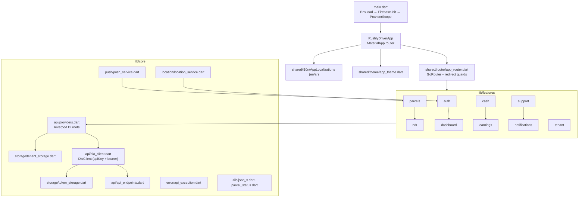
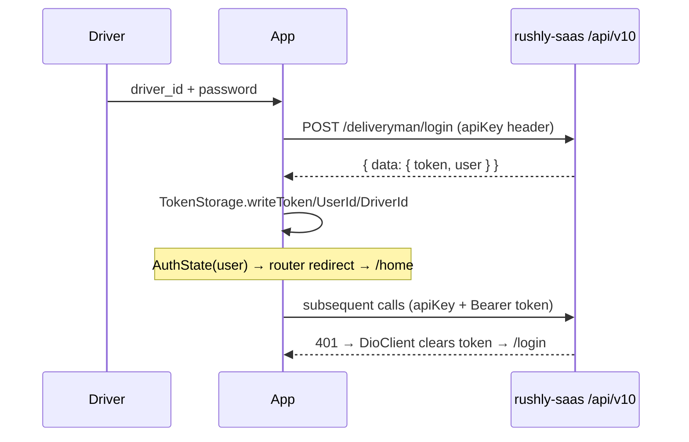
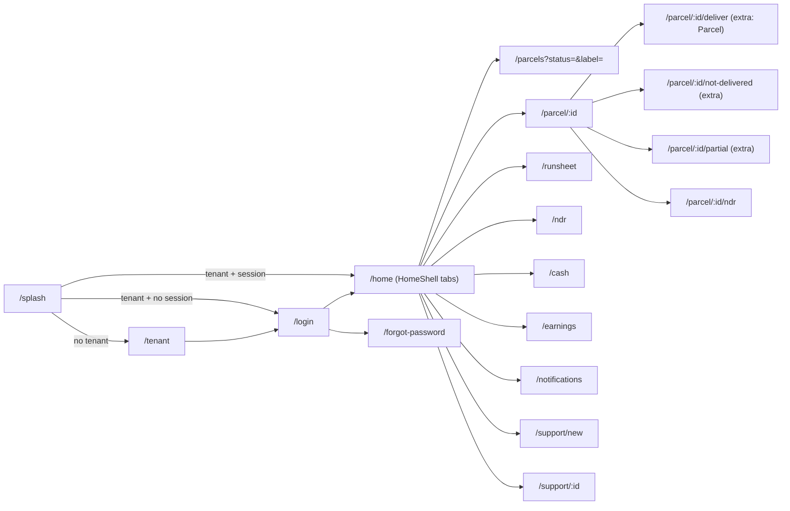

# rushly-driver-app — Last-Mile Driver

> **Scope.** Deep-dive on the Rushly **driver** Flutter client (`/var/www/rushly-driver-app`).
> Covers purpose, architecture (`core/ + shared/ + features/`), routing, theme,
> localization, packages, state management, the API layer, models, storage,
> push, and **per-screen** docs (purpose, UI, business logic, API calls,
> validation, navigation, permissions). Every screen is mapped to a backend
> endpoint in `rushly-saas/routes/api.php` and to the numbered reference docs.
>
> **Ground truth.** `rushly-saas` (`/var/www/rushly-saas`) is the SINGLE SOURCE OF
> TRUTH. This app holds **no business logic** beyond request-building, presentation
> and device-local ephemeral state. For the shared Flutter picture see
> [../08-Flutter.md](../08-Flutter.md); for the API surface
> [../09-API.md](../09-API.md); for auth [../10-Authentication.md](../10-Authentication.md).
> Where the app README or in-repo comments diverge from code, a **⚠️ Doc vs Code**
> note treats **code as truth**.
>
> Primary sources read for this doc are listed in [§16 Sources](#16-sources).

---

## 1. Purpose & target user

`rushly-driver-app` (`name: rushly_driver`, `pubspec.yaml:1`) is the **last-mile
delivery driver** mobile app for Rushly Logistics. The target user is a
**deliveryman** (`user_type` = deliveryman in the backend) who:

- receives assigned parcels for the day,
- navigates to customers (route-optimised runsheet + maps),
- captures **proof of delivery** (photos, optional OTP, notes),
- records **not-delivered** / **partial** outcomes and **NDR** (non-delivery
  reports),
- reconciles **COD cash** owed to the hub,
- tracks **earnings** (income / expense / per-parcel payment logs),
- raises **support tickets**.

It is one of eight sibling Flutter clients (see [../08-Flutter.md §1](../08-Flutter.md)).
55 Dart files, feature folders: `auth, cash, dashboard, earnings, ndr,
notifications, parcels, support, tenant` (`README.md:37-49`, verified against
`lib/features/*`).

⚠️ **Doc vs Code:** `README.md:44` lists a `settings/` "(placeholder)" feature
folder — it **does not exist**. The real folders are `tenant/`, `cash/` and
`notifications/`, which the README layout omits.

---

## 2. Stack & packages (`pubspec.yaml`)

| Layer | Choice | Package(s) |
|---|---|---|
| Framework | Flutter (Dart `>=3.3.0 <4.0.0`) | — |
| State / DI | **Riverpod 2** | `flutter_riverpod ^2.5.1`, `riverpod_annotation ^2.3.5` |
| HTTP | Dio + pretty logger | `dio ^5.5.0`, `pretty_dio_logger ^1.4.0`, `connectivity_plus ^6.0.3` |
| Storage | Secure + prefs | `flutter_secure_storage ^9.2.2`, `shared_preferences ^2.2.3` |
| Codegen (declared, not yet generated) | Freezed / json | `freezed_annotation`, `json_annotation` (+ dev `build_runner`, `freezed`, `json_serializable`, `riverpod_generator`) |
| Router | **go_router `^14.2.0`** | — |
| Forms | `reactive_forms ^17.0.0` (declared; screens use plain `Form`/`TextFormField`) |
| Camera / scan | `image_picker ^1.1.2`, `mobile_scanner ^5.2.0`, `permission_handler ^11.3.1` |
| Location | `geolocator ^12.0.0`, `flutter_background_service ^5.0.6` (declared; not wired) |
| Push | `firebase_core ^3.3.0`, `firebase_messaging ^15.0.4`, `flutter_local_notifications ^17.2.2` |
| Maps | `flutter_map ^7.0.2` + `latlong2` (used); `google_maps_flutter ^2.7.0` (declared, unused in code) |
| Misc | `google_fonts`, `intl ^0.20.2`, `flutter_dotenv ^5.1.0`, `url_launcher`, `cached_network_image`, `flutter_svg`, `package_info_plus`, `logger`, `equatable`, `collection` |

Fonts bundled: **Tajawal** (Arabic) via assets; **Inter** pulled at runtime by
`google_fonts` (`app_theme.dart:12-13`). Assets: `assets/images/`, `assets/icons/`,
`.env` (`pubspec.yaml`).

⚠️ **Doc vs Code (declared vs used):** `freezed`/`json_serializable` codegen,
`reactive_forms`, `google_maps_flutter`, `flutter_background_service`,
`riverpod_generator` are all in `pubspec.yaml` but **not used** in `lib/` today —
models are hand-written (`json_x.dart` coercers), forms are plain Material, maps
use `flutter_map`/OpenStreetMap, and there are no `*.g.dart`/`*.freezed.dart`
files. Treat these as scaffolding for future work.

---

## 3. Architecture (`core / shared / features`)

Standard Rushly-Flutter layout (matches [../08-Flutter.md §3](../08-Flutter.md)):
`core/` = infra, `shared/` = cross-cutting UI/i18n/router, `features/<name>/{data,domain,presentation}`.



**Data-flow per feature:** `presentation/` (widgets + Riverpod providers) →
`data/<x>_repository.dart` (calls `DioClient`) → `domain/<model>.dart`
(`fromJson` via `json_x` coercers). Repositories are exposed as `Provider`s;
screens watch `FutureProvider.autoDispose` wrappers.

---

## 4. API layer (`lib/core/api/*`)

### 4.1 `DioClient` (`dio_client.dart`)

One thin Dio wrapper. Construction (`dio_client.dart:19-31`):

- `baseUrl` resolved from **TenantStorage** at construction (via
  `dioClientProvider`), falling back to `Env.apiBaseUrl`.
- Static headers: `Accept: application/json` + **`apiKey: <Env.apiKey>`**.
- Timeouts: connect 20s, receive 30s, send 30s.

Interceptors (`dio_client.dart:33-61`):

1. **onRequest** — reads the bearer from `TokenStorage` and sets
   `Authorization: Bearer <token>` when present.
2. **onError** — on **401** clears the token and fires `_onUnauthorized` (the
   auth controller hooks this to bounce to `/login`).
3. In debug builds, `PrettyDioLogger` (bodies on, headers off).

**Envelope unwrapping** (`dio_client.dart:136-143`): the Laravel
`ApiReturnFormatTrait` wraps payloads as `{ status, message, data }`. `_unwrap`
returns the inner `data` when a `data` key exists, else the raw body (tracking
endpoints sometimes return top-level). All of `get/post/put/delete` funnel
`DioException` → `ApiException`.

### 4.2 `ApiEndpoints` (`api_endpoints.dart`)

A hand-maintained mirror of the driver-relevant slice of `routes/api.php`
(prefix `/api/v10`). Grouped: auth, helpers (`hub`, `general-settings`,
`all-currencies`, cod/delivery charges), profile/push, driver-specific,
rejection, NDR, support, public tracking. See the full mapping table in
[§14](#14-endpoint--screen-map).

Note some declared constants are **unused** by the driver app (`register`,
`signin`, `otpVerify`, `resendOtp`, `driverParcelStatus`,
`driverParcelStatusUpdate`, `driverParcelDeliveredLegacy`,
`driverParcelDeliveredByTracking`, `parcelTracking`, `codCharges`,
`deliveryCharges`, `currencies`, `hub`) — they mirror the backend but no screen
calls them yet.

### 4.3 `providers.dart` (Riverpod DI roots)

```
secureStorageProvider ─► tokenStorageProvider ─┐
                      └─► tenantStorageProvider ─► tenantBaseUrlProvider (FutureProvider<String?>)
                                                        │
                                          dioClientProvider (rebuilds when baseUrl resolves)
```

`dioClientProvider` **watches** `tenantBaseUrlProvider` so the client re-points
after tenant selection; it does **not** rebuild on every tenant change — the
"change workspace" flow clears the token + invalidates the provider
(`dio_client.dart:11-17`, `providers.dart:28-34`).

### 4.4 `ApiException` (`error/api_exception.dart`)

Normalises the Laravel error envelope `{status:false, message, errors:{}}` into
`{message, statusCode, fieldErrors, kind}`. Helpers: `isUnauthorized` (401),
`isValidation` (422), `isOffline`. `kind` derived from `DioExceptionType`
(offline / server / cancelled / unknown). Field errors are read from `errors`
**or** a map-shaped `message`.

---

## 5. Storage (token / tenant)

Two `FlutterSecureStorage`-backed stores (Android uses
`encryptedSharedPreferences`, `providers.dart:9-11`):

**`TokenStorage`** (`storage/token_storage.dart`) — keys `auth_token`,
`user_id`, `driver_id`. `clear()` wipes all three (called on logout + on 401).

**`TenantStorage`** (`storage/tenant_storage.dart`) — keys `tenant_api_base`,
`tenant_label`. `write({baseUrl,label})`, `readBaseUrl()`, `clear()`,
`isConfigured()`. Documented as the twin of the admin app's implementation
(same keys). This is how the app is **multi-tenant on the client**: the driver
picks a workspace subdomain and the base URL is persisted, so a single build
serves any Rushly tenant. See tenancy in [../05-System-Architecture.md](../05-System-Architecture.md)
and [../10-Authentication.md](../10-Authentication.md).

The **local notification inbox** uses `SharedPreferences` (key `inbox_v1`, FIFO
cap 100) — not secure storage (`inbox_repository.dart:14-27`).

---

## 6. Authentication & session

Backend: `POST /api/v10/deliveryman/login` → `AuthController::deliveryManLogin`
(`routes/api.php:239`, guarded by `CheckApiKey` only). Sanctum bearer for
everything else (`routes/api.php:249`).

Flow (`auth_repository.dart`, `auth_controller.dart`):



- **`AuthController`** (`Notifier<AuthState>`): `restore()` (reads token → `GET
  /profile`; clears on failure), `login()`, `logout()` (`POST /sign-out` then
  clear). `AuthState.isAuthenticated == user != null`.
- **Token restore** happens in the router splash (`app_router.dart:107-124`).
- **Other auth endpoints wired:** `GET /profile`, `POST /profile/update`,
  `PUT /update-password`, `POST /password/email`, `POST /password/reset`,
  `GET /refresh`, `POST /fcm-subscribe|unsubscribe`.

⚠️ **Doc vs Code:** `refresh()` exists in the repo (`auth_repository.dart:70-74`)
but nothing calls it — there is **no proactive token refresh**; sessions rely on
Sanctum longevity and the 401 → re-login bounce.

---

## 7. Routing (`shared/router/app_router.dart`, go_router)

Single `GoRouter` behind `routerProvider`. Initial location `/splash`.

**Redirect guards** (`app_router.dart:29-45`), evaluated in order:

1. `/splash` passes through (does its own async bootstrap).
2. **Tenant gate:** if `tenantBaseUrlProvider` is empty and route ≠ `/tenant` →
   `/tenant`. If configured and on `/tenant` → `/login`.
3. **Auth gate:** if not authed and not on `/login`/`/forgot-password` →
   `/login`. If authed and on an auth route → `/home`.



Routes carrying a `Parcel` via `state.extra` (deliver / not-delivered / partial)
**require** navigation from a screen that has the object — deep-linking them by
URL alone throws (`s.extra! as Parcel`). `/parcels` reads `status` + `label`
query params to pre-filter and title the list.

⚠️ **Doc vs Code (dead nav):** `ProfileScreen` pushes `/update-password`
(`profile_screen.dart:70`) and `/language` (`:75`) — **neither route is
registered** in `app_router.dart`. Tapping those rows will fail. The password
row/screen exists in the repository layer (`updatePassword`) but has no screen;
language is toggled via the AppBar `LanguageToggleButton` instead. Gap to fix.

---

## 8. Theme (`shared/theme/app_theme.dart`)

Material 3, seeded from Rushly red **`#EC1C24`** (`app_theme.dart:7,54`).

- **Light** (fully styled): off-white scaffold `#F6F7FB`, white AppBar (no
  elevation, black87 icons), outlined 16-radius cards with a grey border, filled
  inputs, 48-height 12-radius filled buttons.
- **Dark** (minimal): only `colorScheme` + `textTheme` — none of the light
  theme's card/input/button refinements.
- **Font by locale:** Arabic → `GoogleFonts.tajawalTextTheme`, else
  `GoogleFonts.interTextTheme` (`app_theme.dart:11-13,57-60`). Both themes are
  rebuilt when the locale changes (`main.dart:48-49` passes `locale` in).

See brand tokens in [../15-Brand-System.md](../15-Brand-System.md).

---

## 9. Localization (ar / en, RTL)

Hand-rolled `AppLocalizations` (`shared/l10n/app_localizations.dart`) — two inline
`Map<String,String>` dictionaries (`_en`, `_ar`) with typed getters; `_t()` falls
back ar → en → key. Supported locales: `en`, `ar` (`:15`). Delegate registered in
`main.dart` alongside the three `GlobalMaterialLocalizations` delegates, which
provide **automatic RTL** for Arabic.

**Locale state** (`locale_controller.dart`): `StateNotifier<Locale>` **defaulting
to Arabic** (`Locale('ar')`), toggled by `LanguageToggleButton`
(`language_toggle_button.dart`, shows the *other* language's name). `MaterialApp`
watches `localeProvider` (`main.dart:44,50`).

⚠️ **Doc vs Code:** the locale is **in-memory only** — `locale_controller.dart:6-7`
explicitly notes persistence is not wired, so language resets to Arabic on every
cold start. The README's "hand-rolled AppLocalizations" claim (`README.md:19`) is
accurate. `RejectionReason.label()` picks ar/en by locale prefix for
API-supplied reason text (`parcel.dart:178`).

---

## 10. State management (Riverpod)

- **DI roots** in `providers.dart` (storages, tenant base URL, Dio).
- **Controllers:** `AuthController` (`NotifierProvider`), `LocaleController`
  (`StateNotifierProvider`).
- **Feature data** exposed as `FutureProvider.autoDispose` (dashboard, parcels,
  cash, earnings, ndr, support, inbox) — each `ref.watch`es its repository.
  `.family` variants for by-id fetches (`parcelDetailsProvider(id)`,
  `supportTicketProvider(id)`).
- **Invalidation** is the refresh idiom: screens `ref.invalidate(...)` after
  mutations and on pull-to-refresh (e.g. `deliver_screen.dart:67-68` invalidates
  both `assignedParcelsProvider` and `parcelDetailsProvider(id)`).
- **Inbox reactivity:** `inboxVersionProvider` (a `StateProvider<int>`) is bumped
  by `PushService` and the inbox screen; `inboxProvider` watches it to rebuild
  without polling (`inbox_repository.dart:56-68`).

---

## 11. Notifications / push (`core/push/push_service.dart`)

FCM + local notifications, initialised fire-and-forget from `main.dart:36-38`
(resilient if Firebase config is absent — `main.dart:16-20` swallows init
errors).

`PushService.init()` (`push_service.dart:22-50`):
1. init `flutter_local_notifications`,
2. request FCM + `Permission.notification`,
3. get FCM token → `POST /fcm-subscribe {device_token}`; re-subscribe on
   `onTokenRefresh`,
4. `FirebaseMessaging.onMessage` (foreground) → show a local notification on
   channel `rushly_driver_default` **and** append the message to the local inbox
   (`_ref.read(inboxRepositoryProvider).add(...)`, bump `inboxVersionProvider`).

Backend: `POST /api/v10/fcm-subscribe|unsubscribe` →
`PushNotificationController` (`routes/api.php:256-257`, auth:sanctum). Server-side
push is `app/Http/Services/PushNotificationService` — see
[../14-Integrations.md](../14-Integrations.md).

Notes / gaps:
- No **background** (`onBackgroundMessage`) or **tap/open** handler — only
  foreground messages reach the inbox. Notifications received while the app is
  backgrounded won't be logged.
- The inbox is **local-only** (SharedPreferences), not a server feed
  (`inbox_repository.dart:9-11`).
- `PushService.unsubscribe()` exists but is not called on logout (`logout()` only
  clears the token) — FCM tokens are not cleaned up server-side on sign-out.

---

## 12. Live location (`core/location/location_service.dart`)

`LocationService.start()` streams `geolocator` positions (default 30s / 25m
filter) and pings `POST /deliveryman/parcel-location-update {lat, long}`
(`location_service.dart:41-58`, `parcel_repository.dart:109-116`). Driver
identity is derived **server-side from the Sanctum token** — no id in the body.

⚠️ **Doc vs Code (resolved gap):** `README.md:112-118` warns this endpoint is
*unauthenticated* (citing `routes/api.php:247`) and spoofable via a body
`deliveryID`. **Code contradicts this:** the route now lives **inside** the
`auth:sanctum` group at `routes/api.php:395`, with an in-code comment
(`api.php:392-394`) stating it was moved and is now token-scoped. The app body
carries no driver id. The README "Known gaps" section is **stale** on this point.

⚠️ Also: `LocationService` is defined and provider-wired but **no screen calls
`start()`** — continuous live-location tracking is **not activated** anywhere in
the current UI. Only the runsheet takes a one-shot fix. Background service
(`flutter_background_service`) is unwired (matches `README.md:121-122`).

---

## 13. Per-screen documentation

Legend: **API** = backend endpoint (`routes/api.php`), **→** = navigation.

### 13.1 Splash — `_Splash` (`app_router.dart:100-132`, route `/splash`)
- **Purpose/UI:** centered `CircularProgressIndicator` while bootstrapping.
- **Logic:** resolve tenant base URL → if empty go `/tenant`; else
  `AuthController.restore()` → `/home` or `/login`.
- **API:** indirectly `GET /profile` (via `restore`). **Perms:** none.

### 13.2 Tenant select — `TenantSelectScreen` (`tenant/…/tenant_select_screen.dart`, `/tenant`)
- **Purpose:** first-boot workspace picker (which courier company / tenant).
- **UI:** icon, hint, **two modes** — (1) *workspace name* → builds
  `https://<slug>.<TENANT_HOST_SUFFIX>/api/v10`; (2) *advanced* full URL. Live
  preview line; mode toggle; Connect button; inline error.
- **Logic:** builds base URL (`_buildBaseUrl`), **pings `GET /general-settings`**
  with a throwaway Dio (8s timeout) to validate before persisting, then
  `TenantStorage.write` + invalidate `tenantBaseUrlProvider` → `/login`.
- **Validation:** workspace slug regex `^[a-z0-9][a-z0-9-]*$`; advanced requires a
  parseable URL with scheme.
- **API:** `GET /general-settings` (`routes/api.php:246`, apiKey only). **→** `/login`.
- **Perms:** none. See tenancy in [../10-Authentication.md](../10-Authentication.md).

### 13.3 Login — `LoginScreen` (`auth/…/login_screen.dart`, `/login`)
- **UI:** logo (falls back to a shipping icon), title, **Driver ID** + **Password**
  (obscure toggle), forgot-password link, Sign-in button (spinner while loading),
  `LanguageToggleButton` in AppBar.
- **Logic:** `AuthController.login(driverId, password)`; on success `→ /home`, on
  failure snackbar with `AuthState.error`.
- **Validation:** driver id required; password required + **min 6 chars**.
- **API:** `POST /deliveryman/login` (`routes/api.php:239`). **→** `/home`,
  `/forgot-password`. **Perms:** none.

### 13.4 Forgot password — `ForgotPasswordScreen` (`auth/…`, `/forgot-password`)
- **UI:** intro text, email field, Send button.
- **Validation:** email required + must contain `@`.
- **API:** `POST /password/email {email}` (`routes/api.php:242`, **throttle 5/min**).
  Success snackbar → `pop()`. **Perms:** none.

### 13.5 Home shell — `HomeShell` (`dashboard/…/home_shell.dart`, `/home`)
- **Purpose:** bottom-nav container (`IndexedStack`) with 5 tabs:
  **Dashboard, Parcels, Earnings, Support, Profile**. Local `_index` state; no API.

### 13.6 Dashboard — `DashboardScreen` (`dashboard/…/dashboard_screen.dart`, tab 0)
- **UI:** summary **stat grid** (Balance, Earnings, COD, In-progress, Delivered) +
  four expandable **buckets** (Assigned/Re-scheduled/Return-to-courier/Delivered),
  each listing up to 8 parcels with a "view all" deep-link. Refresh button +
  pull-to-refresh.
- **Logic:** watches `dashboardProvider` + `driverProfileSummaryProvider`. Stat
  cards deep-link: money cards → `/earnings` or `/cash`; count cards →
  `/parcels?status=<enum>&label=…`. Bucket status codes come from the mirrored
  `ParcelStatus` enum (`parcel_status.dart`).
- **API:** `GET /deliveryman/dashboard` (`routes/api.php:377`) →
  `DriverDashboard.fromJson` (keys `deliveryman_assign`,
  `deliveryman_re_schedule`, `return_to_courier`, `delivered`); `GET
  /deliveryman/profile` (`:378`) → `DriverProfileSummary` (`current_balance`,
  `deliveryman_earn`, `total_cod`, `delivery_in_progress`, `completed_delivered`,
  `canceled_delivered`). **→** parcels list, earnings, cash, parcel details.

### 13.7 Profile — `ProfileScreen` (`dashboard/…/profile_screen.dart`, tab 4)
- **UI:** avatar/name/email/phone (from `AuthState.user`), profile-summary rows,
  and action tiles: **Cash reconciliation → `/cash`**, **Notifications →
  `/notifications`**, Update password → `/update-password`⚠️, Language →
  `/language`⚠️, **Workspace** (host + *Change workspace*), **Log out**.
- **Logic:** *Change workspace* → confirm dialog → `logout()` + `TenantStorage.clear()`
  + invalidate → `/tenant`. Logout → `AuthController.logout()` → `/login`.
- **API:** `GET /deliveryman/profile` (summary); `POST /sign-out` on logout. **⚠️**
  `/update-password` and `/language` routes are **unregistered** (see §7).

### 13.8 Parcel list — `ParcelListScreen` (`parcels/…/parcel_list_screen.dart`, tab 1 + `/parcels`)
- **UI:** search field (tracking / name / phone), **status filter** bottom sheet
  (driver buckets), AppBar actions **Runsheet** + **Scan (AWB)**, list tiles
  (colour-coded by status) with COD + date, pull-to-refresh.
- **Logic:** watches `assignedParcelsProvider`. Client-side filter by
  `initialStatus`/query. **Scan:** `mobile_scanner` (EAN/Code128/Code39/QR/UPC-A) →
  match cached list, else `findByTracking` server lookup → `/parcel/:id`.
- **API:** `GET /deliveryman/parcel/index` (`routes/api.php:367`) → `parcels[]`;
  `GET /deliveryman/parcel/by-tracking/{tracking}` (`:369`) on scan miss.
- **Nav:** `/parcel/:id`, `/runsheet`. **Perms:** **camera** (scanner).

### 13.9 Parcel details — `ParcelDetailsScreen` (`parcels/…/parcel_details_screen.dart`, `/parcel/:id`)
- **UI:** header (tracking + status), **Customer** section (call / WhatsApp /
  directions actions), **Merchant** section (call), **Shipment** section (invoice,
  weight, status, COD, collect), a read-only **tracking map**, event **timeline**,
  and action buttons: **Mark delivered / Not delivered / Partial / Report NDR**.
- **Logic:** watches `parcelDetailsProvider(id)`; deep-links external apps via
  `url_launcher` (`tel:`, `wa.me/…?text=<wa_msg>`, Google Maps search).
- **API:** `GET /deliveryman/parcel/details/{id}` (`routes/api.php:368`) →
  `{parcel, parcelEvents[]}`. **→** `/parcel/:id/{deliver,not-delivered,partial}`
  (passing the `Parcel` as `extra`) and `/parcel/:id/ndr`.
- **Perms:** none directly (dial/WhatsApp handled by OS).

### 13.10 Parcel tracking map — `ParcelTrackingMap` (`parcels/…/parcel_tracking_map.dart`, embedded)
- **UI:** `flutter_map` + **OpenStreetMap** tiles, up to 3 markers (pickup =
  blue store, customer = orange pin, driver = green scooter from latest event with
  coords). Empty-state card when no coordinates. Default center Riyadh
  (24.7136, 46.6753). Read-only (pinch-zoom + drag).
- **API:** none (consumes the details payload). Twin of the merchant app's map.

### 13.11 Deliver (POD) — `DeliverScreen` (`parcels/…/deliver_screen.dart`, `/parcel/:id/deliver`)
- **UI:** parcel header, **OTP (optional)**, **Note (optional)**, **photo capture**
  strip (camera, thumbnails removable), Confirm button.
- **Validation:** **≥1 photo required** (else snackbar); OTP/note optional.
- **Logic:** builds `FormData` (`tracking_id`, optional `note`/`otp`, `images[]`)
  → `markDelivered` → invalidate list + details → snackbar → `pop`.
- **API:** `POST /deliveryman/parcel-delivered` (`routes/api.php:389`, multipart).
- **Perms:** **camera** (`image_picker`, camera source).

### 13.12 Not delivered — `NotDeliveredScreen` (`parcels/…/not_delivered_screen.dart`, `/parcel/:id/not-delivered`)
- **UI:** parcel header, **rejection-reason dropdown** (from API, ar/en label),
  Note (optional), photo strip, Confirm button.
- **Validation:** reason **required** + **≥1 photo required**.
- **Logic:** `markNotDelivered` (`FormData`: `tracking_id`,
  `rejection_reason_id`, optional `note`, `images[]`) → invalidate → `pop`.
- **API:** `GET /rejection_reasons` (`routes/api.php:406`) for the dropdown;
  `POST /deliveryman/parcel-not-delivered` (`:390`, multipart).
- **Perms:** camera.

### 13.13 Partial delivery — `PartialDeliveryScreen` (`parcels/…/partial_delivery_screen.dart`, `/parcel/:id/partial`)
- **UI:** parcel header (shows COD), **Cash collected** field, Note, Submit.
- **Validation:** cash required, parseable double, **≥0**.
- **Logic:** `markPartial(id, cashCollection, note)` → invalidate → `pop`.
- **API:** `POST /deliveryman/parcel/partial-delivered/{id}`
  (`routes/api.php:372`, JSON `{cash_collection, note}`). **Perms:** none.

### 13.14 Runsheet — `RunsheetScreen` (`parcels/…/runsheet_screen.dart`, `/runsheet`)
- **Purpose:** route-optimised stop list for today's assigned parcels.
- **UI:** ordered stops (index, tracking, customer, **leg distance km**, directions
  button → Google Maps dir), my-location + refresh actions, permission/empty
  states.
- **Logic:** one-shot GPS fix (`geolocator`), keeps parcels with `customer_lat/long`
  and status **DeliveryManAssign**, then **greedy nearest-neighbour** ordering via
  a client-side haversine (`_nearestNeighbor`, `runsheet_screen.dart:144-177`) —
  explicitly not optimal TSP.
- **API:** `GET /deliveryman/parcel/index` (reuses `assignedParcelsProvider`).
- **Perms:** **location** (while-in-use).

### 13.15 NDR list — `NdrScreen` (`ndr/…/ndr_screen.dart`, `/ndr`)
- **UI:** stats row (**Total / Open / Resolved**), NDR list tiles (tracking,
  reason • status) each with a **notify** action, pull-to-refresh.
- **Logic:** watches `ndrListProvider` + `ndrStatsProvider`; notify → snackbar.
- **API:** `GET /ndr` (`routes/api.php:304`), `GET /ndr/stats` (`:306`),
  `POST /ndr/{id}/notify` (`:310`). **Perms:** none.

### 13.16 NDR create — `NdrCreateScreen` (`ndr/…/ndr_create_screen.dart`, `/parcel/:id/ndr`)
- **UI:** **failure-reason** dropdown (const list mirroring
  `App\Enums\NdrFailureReason`: customer_absent, wrong_address, refused_delivery,
  customer_postponed, access_denied, payment_issue, damaged_shipment,
  incomplete_address, other), driver notes, **next-attempt** date picker (today..+30d),
  Submit.
- **Validation:** reason required (form validator + guard).
- **Logic:** `create(parcelId, failureReason, driverNotes?, nextAttemptDate?)` →
  invalidate ndr list/stats → `pop`.
- **API:** `POST /ndr` (`routes/api.php:309`) — body `parcel_id`, `failure_reason`,
  optional `driver_notes`, `next_attempt_date` (matches `NdrApiController::store`).
  See NDR domain in [../11-Modules.md](../11-Modules.md) / [../04-Business-Logic.md](../04-Business-Logic.md).

⚠️ **Doc vs Code:** `README.md:122-124` says "NDR create UI: only listing + notify
are wired." The create screen **is** implemented and routed (`/parcel/:id/ndr`) —
the README is stale here.

### 13.17 Cash reconciliation — `CashScreen` (`cash/…/cash_screen.dart`, `/cash`)
- **UI:** **balance card** (owed-to-hub big number, red if >0 else green; handed-over
  total + raw balance stats), **handover history** list. Refresh + pull-to-refresh.
- **Logic:** watches `cashSummaryProvider`; renders `CashSummary`
  (`current_balance`, `owed`, `total_handed_over`, `handovers[]`); each handover
  shows amount, date, account label (holder — no.), received-by.
- **API:** `GET /deliveryman/cash` (`routes/api.php:379`). **Read-only** — the app
  does not initiate handovers. **Perms:** none. Backend model
  `CashReceivedFromDeliveryman` (see [../06-Database.md](../06-Database.md)).

### 13.18 Earnings — `EarningsScreen` (`earnings/…/earnings_screen.dart`, tab 2 + `/earnings`)
- **UI:** summary header (Income / Expense / **Net**, computed client-side) + 3
  tabs: **Income**, **Expense**, **Parcels** (grouped by day with subtotals).
  Refresh action.
- **Logic:** `paymentLogsProvider` (income/expense) + `parcelPaymentLogsProvider`.
  Parcel entries deep-link `#parcelId → /parcel/:id`.
- **API:** `GET /deliveryman/payment-logs` (`routes/api.php:380`) → `{income[],
  expense[]}`; `GET /deliveryman/parcel-payment-logs` (`:381`) →
  `parcel_payment_logs[]`. (`GET /deliveryman/income-expense` (`:374`) is wired in
  the repo but not surfaced by a screen.) **Perms:** none.

### 13.19 Notifications inbox — `InboxScreen` (`notifications/…/inbox_screen.dart`, `/notifications`)
- **UI:** message list (read/unread styling), **Mark all read** + **Clear** actions,
  empty state. Tapping a message marks read and, if it carries `parcel_id`,
  deep-links `/parcel/:id`.
- **Logic:** local `InboxRepository` (SharedPreferences); reacts to
  `inboxVersionProvider`. **No API** — populated by `PushService` foreground
  handler. **Perms:** none.

### 13.20 Support list — `SupportScreen` (`support/…/support_screen.dart`, tab 3)
- **UI:** ticket list (subject, message preview, status), **+** to create,
  pull-to-refresh. **API:** `GET /support/index` (`routes/api.php:328`). **→**
  `/support/new`, `/support/:id`.

### 13.21 New ticket — `NewTicketScreen` (`support/…/new_ticket_screen.dart`, `/support/new`)
- **UI:** Subject + Message (6 lines) + Submit. **Validation:** both required.
- **API:** `POST /support/store {subject, message}` (`routes/api.php:330`) →
  invalidate list → `pop`.

### 13.22 Ticket thread — `SupportTicketScreen` (`support/…/support_ticket_screen.dart`, `/support/:id`)
- **UI:** subject/date, original message card, reply cards (author/date/body),
  bottom reply composer (send button).
- **Logic:** `supportTicketProvider(id)`; reply → invalidate that ticket.
- **API:** `GET /support/view/{id}` (`routes/api.php:334`); `POST /support/reply
  {support_id, message}` (`:335`). **Perms:** none.

---

## 14. Endpoint ↔ screen map

All under `/api/v10/*`. Auth column: **K** = `CheckApiKey` only, **K+S** =
`CheckApiKey` + `auth:sanctum`. Verified against `routes/api.php`.

| Method & path | `routes/api.php` | Auth | Repository method | Screen(s) |
|---|---|---|---|---|
| `POST /deliveryman/login` | 239 | K | `AuthRepository.driverLogin` | Login (13.3) |
| `GET /general-settings` | 246 | K | (inline Dio) | Tenant select (13.2) |
| `POST /password/email` | 242 | K (throttle 5/1) | `sendPasswordResetEmail` | Forgot pw (13.4) |
| `POST /password/reset` | 243 | K | `resetPassword` | *(wired, no screen)* |
| `GET /profile` | 253 | K+S | `AuthRepository.profile` | Splash/restore (6) |
| `POST /profile/update` | 254 | K+S | `updateProfile` | *(wired, no screen)* |
| `PUT /update-password` | 259 | K+S | `updatePassword` | *(no route/screen ⚠️)* |
| `GET /refresh` | 250 | K+S | `refresh` | *(wired, uncalled)* |
| `POST /sign-out` | 260 | K+S | `logout` | Profile logout (13.7) |
| `POST /fcm-subscribe` | 256 | K+S | `fcmSubscribe` | PushService (11) |
| `POST /fcm-unsubscribe` | 257 | K+S | `fcmUnsubscribe` | PushService (11) |
| `GET /deliveryman/dashboard` | 377 | K+S | `fetchDashboard` | Dashboard (13.6) |
| `GET /deliveryman/profile` | 378 | K+S | `fetchProfileSummary` | Dashboard/Profile |
| `GET /deliveryman/cash` | 379 | K+S | `CashRepository.summary` | Cash (13.17) |
| `GET /deliveryman/payment-logs` | 380 | K+S | `paymentLogs` | Earnings (13.18) |
| `GET /deliveryman/parcel-payment-logs` | 381 | K+S | `parcelPaymentLogs` | Earnings (13.18) |
| `GET /deliveryman/income-expense` | 374 | K+S | `incomeExpense` | *(wired, no screen)* |
| `GET /deliveryman/parcel/index` | 367 | K+S | `assigned` | Parcel list / runsheet / dashboard |
| `GET /deliveryman/parcel/details/{id}` | 368 | K+S | `details` | Parcel details (13.9) |
| `GET /deliveryman/parcel/by-tracking/{tracking}` | 369 | K+S | `findByTracking` | Scan (13.8) |
| `POST /deliveryman/parcel-delivered` | 389 | K+S | `markDelivered` | Deliver (13.11) |
| `POST /deliveryman/parcel-not-delivered` | 390 | K+S | `markNotDelivered` | Not delivered (13.12) |
| `POST /deliveryman/parcel/partial-delivered/{id}` | 372 | K+S | `markPartial` | Partial (13.13) |
| `POST /deliveryman/parcel-location-update` | 395 | K+S | `updateLocation` | LocationService (12) |
| `GET /rejection_reasons` | 406 | **none** | `rejectionReasons` | Not delivered (13.12) |
| `GET /ndr` · `/ndr/stats` · `POST /ndr` · `/ndr/{id}/notify` · `GET /ndr/parcel/{id}` | 304-310 | K+S | `NdrRepository.*` | NDR list/create (13.15-16) |
| `GET /support/index` · `view/{id}` · `POST /support/store` · `reply` · `DELETE /support/delete/{id}` | 328-335 | K+S | `SupportRepository.*` | Support (13.20-22) |

⚠️ **Doc vs Code:** `GET /rejection_reasons` (`routes/api.php:406`) sits **outside**
both the `CheckApiKey` and `auth:sanctum` groups — it is a **fully public**
endpoint. The app still sends apiKey+bearer (all `DioClient` calls do), but the
server enforces nothing. Backend hardening candidate — see
[../17-Security.md](../17-Security.md).

⚠️ **Two parallel delivery APIs.** `api_endpoints.dart` also mirrors the older
per-parcel `POST /deliveryman/parcel/delivered/{id}` (`api.php:370`) and
`delivered-by-tracking/{id}` (`:371`), but the app uses the newer flat
`POST /deliveryman/parcel-delivered` (form with `tracking_id`, `:389`). The
legacy constants are declared but unused.

---

## 15. Cross-references

- Shared Flutter architecture & app comparison: [../08-Flutter.md](../08-Flutter.md)
- API surface & envelopes: [../09-API.md](../09-API.md)
- Auth / Sanctum / tenancy: [../10-Authentication.md](../10-Authentication.md)
- Parcel status / NDR / COD domain: [../03-Business-Domain.md](../03-Business-Domain.md), [../04-Business-Logic.md](../04-Business-Logic.md), [../11-Modules.md](../11-Modules.md)
- DB models (`CashReceivedFromDeliveryman`, parcels, NDR): [../06-Database.md](../06-Database.md)
- Push / SMS integrations: [../14-Integrations.md](../14-Integrations.md)
- Brand tokens (`#EC1C24`, Tajawal): [../15-Brand-System.md](../15-Brand-System.md)
- Security notes (shared apiKey, public routes): [../17-Security.md](../17-Security.md)
- Sibling app doc: [rushly-admin-app.md](rushly-admin-app.md)

### Known gaps & risks (summary)
1. Shared static apiKey (`123456rx-ecourier123456`) across all tenants (`env.dart:6-7`, `README.md:119`).
2. `/rejection_reasons` publicly reachable (`api.php:406`).
3. Dead nav to `/update-password` & `/language` (`profile_screen.dart:70,75`).
4. Locale not persisted; resets to Arabic each launch (`locale_controller.dart:6`).
5. Live-location tracking + background service defined but never started (`location_service.dart`).
6. Push: no background/tap handlers; `unsubscribe()` not called on logout.
7. Dark theme under-styled vs light (`app_theme.dart:52-66`).
8. Codegen/`reactive_forms`/`google_maps_flutter` declared but unused.

---

## 16. Sources

**rushly-driver-app (`/var/www/rushly-driver-app`):** `pubspec.yaml`, `.env.example`,
`README.md`, `lib/main.dart`; `lib/core/api/{dio_client,api_endpoints,providers}.dart`,
`lib/core/config/env.dart`, `lib/core/error/api_exception.dart`,
`lib/core/storage/{token_storage,tenant_storage}.dart`,
`lib/core/push/push_service.dart`, `lib/core/location/location_service.dart`,
`lib/core/utils/{json_x,parcel_status}.dart`;
`lib/shared/router/app_router.dart`, `lib/shared/theme/app_theme.dart`,
`lib/shared/l10n/{app_localizations,locale_controller,language_toggle_button}.dart`;
`lib/features/auth/*`, `dashboard/*`, `parcels/*`, `earnings/*`, `cash/*`, `ndr/*`,
`notifications/*`, `support/*`, `tenant/*` (data/domain/presentation).

**rushly-saas (`/var/www/rushly-saas`):** `routes/api.php` (lines 232-406 verified),
`docs/_CONTEXT_BRIEF.md`, `docs/08-Flutter.md`, `docs/09-API.md`.

*Verified against code on 2026-07-27. Backend is authoritative; this app is a client.*
