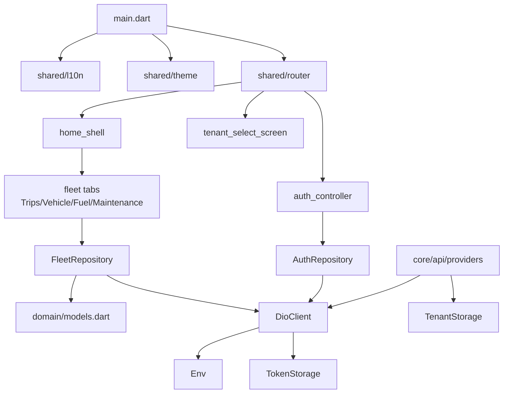
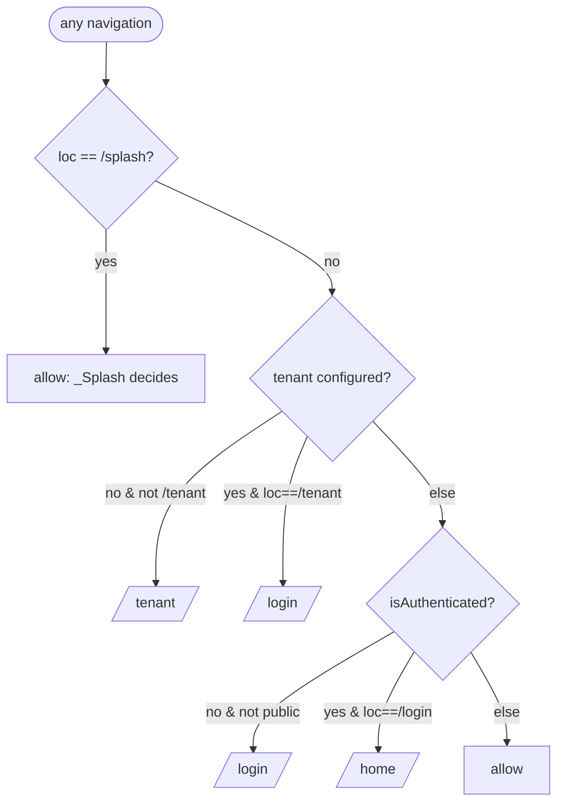
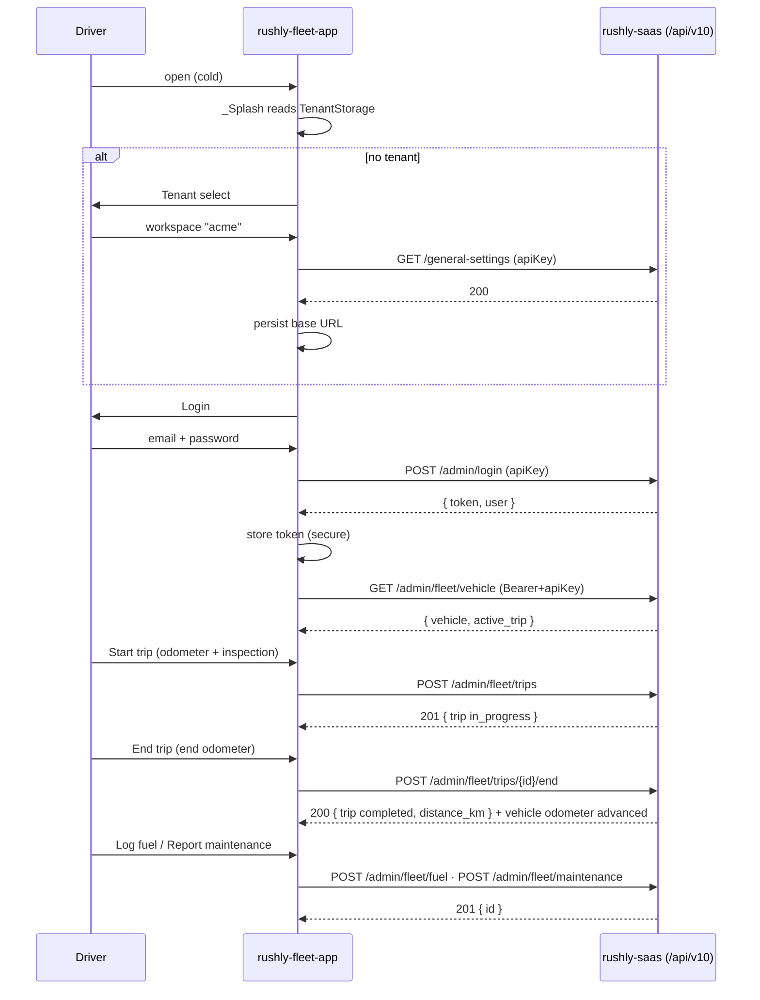

# rushly-fleet-app — Fleet Driver

> Flutter client for the Rushly **Fleet** slice: a driver's phone view of the
> vehicle assigned to them, their trip/shift log (odometer + pre-trip
> inspection), fuel fill-ups, and maintenance issue reports. It is a thin
> client — **all** business logic and persistence live in `rushly-saas` (the
> single source of truth). This doc goes deep on the *client*; for the backend
> module see [../modules/fleet.md](../modules/fleet.md).

**Project root:** `/var/www/rushly-fleet-app`
**pubspec name:** `rushly_fleet` · **version** `1.0.0+1` · **26 dart files**
**Backend it consumes:** `rushly-saas` `/api/v10/admin/fleet/*` (8 endpoints)

**Cross-links:** [../08-Flutter.md](../08-Flutter.md) ·
[../09-API.md](../09-API.md) · [../10-Authentication.md](../10-Authentication.md) ·
[../modules/fleet.md](../modules/fleet.md) ·
[../modules/saas-tenancy-subscriptions.md](../modules/saas-tenancy-subscriptions.md) ·
[../modules/notifications.md](../modules/notifications.md) ·
[./rushly-admin-app.md](./rushly-admin-app.md) ·
[../_CONTEXT_BRIEF.md](../_CONTEXT_BRIEF.md)

---

## 1. Purpose & target user

`rushly-fleet-app` is a **vehicle-operations logbook** in the driver's pocket. It
is the counterpart of the last-mile `rushly-driver-app`, but its unit of work is
a **vehicle trip / shift**, not individual parcels. From one phone the operator:

1. sees **which vehicle** is assigned to them and its current odometer
   (Vehicle tab);
2. **starts a trip** with a start-odometer reading and a 5-point pre-trip
   inspection, and **ends** it with a final odometer (Trips tab);
3. logs **fuel** fill-ups — litres, cost, odometer, receipt URL (Fuel tab);
4. **files maintenance** issues, severity-graded (Maintenance tab).

**Target user (as designed vs. as gated).** `lang/en/mobile_apps.php` in the
backend labels the audience *"long-haul fleet drivers,"* and the fleet migration
ties a vehicle to a `deliveryman` user. **However**, the API sits behind
`CheckAdminRole`, which **rejects `DELIVERYMAN`** — so in practice today the app
is usable only by **admin / incharge / hub** back-office users. This is a real
inconsistency carried over from the backend; see
[../modules/fleet.md §8](../modules/fleet.md#8-permissions--auth) and the ⚠️
notes in [§9](#9-backend-endpoint-map) and [§12](#12-doc-vs-code--gaps) below.

> **Scope reality:** the entire app is 4 feature tabs over 8 endpoints. There is
> **no** parcel handling, no cash/COD, no earnings, no maps/telematics, no push
> notifications. It is a deliberately minimal MVP scaffold (git history:
> `8c8de6e Initial scaffold` → `40bcc48 fleet: F1-F4 tabs`).

---

## 2. Tech stack (from `pubspec.yaml`)

| Concern | Package | Version | Notes |
|---|---|---|---|
| State management | `flutter_riverpod` | `^2.5.1` | `Notifier`/`FutureProvider`, `ProviderScope` at root |
| HTTP | `dio` | `^5.5.0` | single `DioClient` wrapper, interceptors |
| HTTP logging | `pretty_dio_logger` | `^1.4.0` | debug-mode only |
| Secure storage | `flutter_secure_storage` | `^9.2.2` | token + tenant base URL (encrypted) |
| Prefs | `shared_preferences` | `^2.2.3` | **declared but unused** in `lib/` (⚠️ [§12](#12-doc-vs-code--gaps)) |
| Fonts | `google_fonts` | `^6.2.1` | Tajawal (ar) / Inter (en) |
| i18n / formatting | `intl` | `^0.20.2` | `DateFormat` in list tiles |
| Env | `flutter_dotenv` | `^5.1.0` | loads `.env` asset |
| Routing | `go_router` | `^14.2.0` | 4 routes + redirect guard |
| Deep links / dialer | `url_launcher` | `^6.3.0` | **declared but unused** in `lib/` (⚠️ [§12](#12-doc-vs-code--gaps)) |
| Lints | `flutter_lints` | `^4.0.0` | `avoid_print: true` (`analysis_options.yaml`) |

SDK: Dart `>=3.3.0 <4.0.0`, Flutter `>=3.19.0`. `generate: true` is set but the
app ships **hand-written** localization (see [§7](#7-localization-ar--en--rtl)),
not `.arb`-generated. No `firebase_*`, no `google_maps_*`, no `geolocator` — so
**no push and no GPS capture** (⚠️ [§12](#12-doc-vs-code--gaps)). This is the same
lean stack as the other Rushly scaffold apps — see [../08-Flutter.md](../08-Flutter.md).

---

## 3. Architecture

The app uses the standard Rushly Flutter layout: a shared `core/` (cross-cutting
infra), `shared/` (router / theme / l10n), and vertically-sliced `features/`
each split into `data / domain / presentation`.

```
lib/
├── main.dart                         # bootstrap: load .env, ProviderScope, MaterialApp.router
├── core/
│   ├── config/env.dart               # dotenv accessors (baseUrl, apiKey, tenantHostSuffix)
│   ├── api/
│   │   ├── api_endpoints.dart        # path constants (auth + fleet surface)
│   │   ├── dio_client.dart           # Dio wrapper: auth header, 401 handling, unwrap {data}
│   │   └── providers.dart            # Riverpod providers: storage, tenant baseUrl, DioClient
│   ├── error/api_exception.dart      # normalized error from DioException
│   ├── storage/
│   │   ├── token_storage.dart        # secure: auth_token, auth_user
│   │   └── tenant_storage.dart       # secure: tenant_api_base, tenant_label
│   └── utils/json_x.dart             # null-safe JSON coercion helpers
├── shared/
│   ├── router/app_router.dart        # go_router + redirect guard + splash
│   ├── theme/app_theme.dart          # M3 light/dark, seed #303F9F, locale-aware fonts
│   └── l10n/
│       ├── app_localizations.dart    # hand-written en/ar map + delegate
│       ├── locale_controller.dart    # StateNotifier<Locale>, default 'ar'
│       └── language_toggle_button.dart
└── features/
    ├── auth/       data/auth_repository.dart · presentation/{auth_controller,login_screen}.dart
    ├── tenant/     presentation/tenant_select_screen.dart
    ├── dashboard/  presentation/{home_shell,placeholder_screen}.dart
    └── fleet/      data/fleet_repository.dart · domain/models.dart
                    presentation/{trips_tab,vehicle_tab,fuel_tab,maintenance_tab}.dart
```

### 3.1 Layer dependencies



Rule of thumb visible in the code: `presentation` watches Riverpod providers →
providers build `Repository` objects → repositories call the single `DioClient`
→ `DioClient` reads `TokenStorage`/`Env` and unwraps the API envelope. Models are
plain `fromJson` factories with **no** codegen (`json_serializable` is absent).

---

## 4. Bootstrap & state management (Riverpod)

`main.dart` awaits `Env.load()` (reads the `.env` asset) then runs
`ProviderScope(child: RushlyFleetdriverApp())`. The root widget is a
`ConsumerWidget` that watches two providers:

- `routerProvider` → the `GoRouter` instance (`shared/router/app_router.dart`);
- `localeProvider` → current `Locale`, feeding `MaterialApp.router.locale`,
  `theme`, and `darkTheme`.

**Provider graph** (`core/api/providers.dart` + feature files):

| Provider | Type | Builds |
|---|---|---|
| `secureStorageProvider` | `Provider` | `FlutterSecureStorage` (Android `encryptedSharedPreferences`) |
| `tokenStorageProvider` | `Provider` | `TokenStorage` |
| `tenantStorageProvider` | `Provider` | `TenantStorage` |
| `tenantBaseUrlProvider` | `FutureProvider<String?>` | reads persisted tenant base URL |
| `dioClientProvider` | `Provider` | `DioClient(tokens, baseUrl: tenantBaseUrl.valueOrNull)` |
| `authRepositoryProvider` | `Provider` | `AuthRepository(dio, tokens)` |
| `authControllerProvider` | `NotifierProvider` | `AuthController` → `AuthState` |
| `localeProvider` | `StateNotifierProvider` | `LocaleController` → `Locale` |
| `fleetRepositoryProvider` | `Provider` | `FleetRepository(dio)` |
| `myVehicleProvider` | `FutureProvider.autoDispose` | `VehicleStatus` (vehicle + active trip) |
| `tripsProvider` | `FutureProvider.autoDispose` | `List<FleetTrip>` (limit 50) |
| `fuelLogsProvider` | `FutureProvider.autoDispose` | `List<FuelLog>` |
| `maintenanceProvider` | `FutureProvider.autoDispose` | `List<MaintenanceReport>` |

**Key reactive behaviour:** `dioClientProvider` watches `tenantBaseUrlProvider`.
When the user *changes workspace*, `home_shell` calls
`ref.invalidate(tenantBaseUrlProvider)`, which rebuilds `DioClient` against the
new base URL. The four fleet data providers are `autoDispose` and are refreshed
by `ref.invalidate(...)` from each tab's `RefreshIndicator` and after every
successful write (start/end trip, log fuel, report issue).

---

## 5. Routing (go_router)

`shared/router/app_router.dart` defines four routes and a single global
`redirect` guard. `initialLocation` is `/splash`.

| Path | Widget | Public? |
|---|---|---|
| `/splash` | `_Splash` (in router file) | yes (bypasses guard) |
| `/tenant` | `TenantSelectScreen` | yes |
| `/login` | `LoginScreen` | yes |
| `/home` | `HomeShell` (4 tabs) | authed only |

### 5.1 Redirect logic



The `_Splash` widget runs once post-frame: it reads
`tenantBaseUrlProvider.future`; if unset → `/tenant`, else it calls
`authControllerProvider.notifier.restore()` (which pings `/admin/profile` with
the stored token) and routes to `/home` on success or `/login` on failure.

> ⚠️ The redirect guard reads `ref.read(...)` synchronously and there is **no
> `refreshListenable`** wired to `GoRouter`. Navigation is driven imperatively by
> screens (`context.go(...)`) after auth/tenant state changes rather than by the
> guard reacting to provider updates. This works because every state transition
> is paired with an explicit `context.go`.

---

## 6. Theme

`shared/theme/app_theme.dart` — Material 3 (`useMaterial3: true`),
`ColorScheme.fromSeed` with **seed `#303F9F`** (indigo) for both light and dark.
Light scaffold background `Colors.white`; dark `#121212`. Fonts are
locale-aware: **Tajawal** for `ar`, **Inter** for `en`, applied via
`google_fonts` over the base text theme. Indigo (`Colors.indigo`) recurs as the
accent in fleet tabs (active-trip card, vehicle avatar, fuel tile). For the
platform brand system see [../15-Brand-System.md](../15-Brand-System.md).

---

## 7. Localization (ar / en + RTL)

**Two locales, `ar` first.** `AppLocalizations.supported = [en, ar]` but
`LocaleController` **defaults to `Locale('ar')`** (`locale_controller.dart`),
so the app opens in Arabic with full RTL layout (driven by Flutter's
`Directionality` via `MaterialApp.locale` + the `GlobalMaterialLocalizations`
delegates registered in `main.dart`).

Localization is **hand-written**, not `.arb`/gen-l10n: `app_localizations.dart`
holds two `Map<String,String>` (`_en`, `_ar`) and exposes ~90 typed getters via a
`_t(key)` lookup that falls back `ar → en → key`. `LanguageToggleButton` flips
the locale at runtime (`localeProvider.notifier.toggle()`), shown on the login
screen app bar.

> ⚠️ **Partial Arabic translation.** Many fleet-domain strings are **English in
> both maps** — e.g. `appTagline`, all four `tab_*` labels/descriptions
> (`Trips`, `Vehicle`, `Fuel`, `Maintenance`), and most trip/vehicle/fuel/
> maintenance field labels (`noTrips`, `startTrip`, `plate`, `liters`,
> `mechanical`, …) are identical strings in `_en` and `_ar`. Only the auth /
> tenant / shell chrome (login, workspace, logout, coming-soon) is genuinely
> translated to Arabic. So an Arabic user gets RTL layout + Arabic chrome but
> English fleet vocabulary. Tracked as an i18n gap. See [../16-UI-UX.md](../16-UI-UX.md).

The `generate: true` flag and `flutter_localizations` are present, but no
`l10n.yaml` / `.arb` pipeline exists — the custom delegate is the actual
mechanism.

---

## 8. Networking, storage & the API envelope

### 8.1 DioClient (`core/api/dio_client.dart`)

Constructed by `dioClientProvider` with `baseUrl` resolved from the persisted
tenant (falls back to `Env.apiBaseUrl`). `BaseOptions`:
- headers `Accept: application/json` and **`apiKey: <Env.apiKey>`** (static app
  key — the backend `CheckApiKey` middleware requires it);
- timeouts: connect 20s, receive 30s, send 30s.

Interceptors:
1. **request** — attaches `Authorization: Bearer <token>` when `TokenStorage`
   holds one;
2. **onError** — on **HTTP 401** it clears the token and fires the optional
   `onUnauthorized` callback (a session-expiry hook; not currently registered by
   any screen);
3. **PrettyDioLogger** — request/response bodies, **debug builds only**
   (`kDebugMode`).

`get`/`post` funnel `DioException` into `ApiException.fromDio` (which extracts the
server `message`), and `_unwrap<T>` peels the standard Rushly
`{ status, message, data }` envelope by returning `data['data']` when present.
See the shared envelope in [../09-API.md](../09-API.md).

### 8.2 Storage

Both stores use `flutter_secure_storage` (encrypted):

| Store | Keys | Holds |
|---|---|---|
| `TokenStorage` | `auth_token`, `auth_user` | Sanctum bearer token; user JSON (`auth_user` is **written nowhere** in current code — reserved) |
| `TenantStorage` | `tenant_api_base`, `tenant_label` | resolved API base URL + human label of the chosen workspace |

Token lifecycle: written on login (`AuthRepository.login`), read by the Dio
request interceptor, cleared on logout, on 401, and on change-workspace.

### 8.3 Env & tenant base-URL construction

`core/config/env.dart` reads three keys from `.env` with hard-coded fallbacks:

| Key | `.env.example` value | `env.dart` fallback |
|---|---|---|
| `API_BASE_URL` | `https://admin.rushly-logistic.com/api/v10` | `https://api.rushly-logistic.com/api/v10` |
| `API_KEY` | `123456rx-ecourier123456` | `123456rx-ecourier123456` |
| `TENANT_HOST_SUFFIX` | `rushly-logistic.com` | `rushly-logistic.com` |

> ⚠️ **Doc vs Code:** the `.env.example` default host (`admin.…`) differs from the
> `env.dart` fallback host (`api.…`). Whichever wins depends on whether `.env`
> ships the key. Neither is used once a tenant is selected — `TenantStorage`'s
> base URL overrides it. See [../19-Environment.md](../19-Environment.md).

---

## 9. Backend endpoint map

Every network call the app makes, and where it lands in `rushly-saas`. Path
constants live in `core/api/api_endpoints.dart`; the app base URL already
includes `/api/v10`, so the effective path is `/api/v10<constant>`.

| App call site | Const / method | HTTP | Effective backend route | Controller |
|---|---|---|---|---|
| Tenant probe | `generalSettings` `/general-settings` | GET | `/api/v10/general-settings` | `GeneralSettingCotroller@index` (`routes/api.php:246`) |
| Login | `login` `/admin/login` | POST | `/api/v10/admin/login` | `AdminAuthController@login` |
| Session restore | `profile` `/admin/profile` | GET | `/api/v10/admin/profile` | `AdminAuthController@profile` |
| Logout | `logout` `/admin/logout` | POST | `/api/v10/admin/logout` | `AdminAuthController@logout` |
| Vehicle tab / all tabs | `fleetVehicle` `/admin/fleet/vehicle` | GET | `/api/v10/admin/fleet/vehicle` | `FleetDriverApiController@myVehicle` |
| Trips list | `fleetTrips` `/admin/fleet/trips?limit=50` | GET | `…/fleet/trips` | `@trips` |
| Start trip | `fleetTrips` | POST | `…/fleet/trips` | `@startTrip` |
| End trip | `fleetTripEnd(id)` `/admin/fleet/trips/{id}/end` | POST | `…/fleet/trips/{id}/end` | `@endTrip` |
| Fuel list | `fleetFuel` `/admin/fleet/fuel` | GET | `…/fleet/fuel` | `@fuelLogs` |
| Log fuel | `fleetFuel` | POST | `…/fleet/fuel` | `@logFuel` |
| Maintenance list | `fleetMaintenance` `/admin/fleet/maintenance` | GET | `…/fleet/maintenance` | `@maintenanceReports` |
| Report issue | `fleetMaintenance` | POST | `…/fleet/maintenance` | `@reportMaintenance` |

Routes: `routes/api.php:161-168` (fleet), `:151-155` (auth), `:246`
(general-settings). Controller:
`app/Http/Controllers/Api/V10/Fleet/FleetDriverApiController.php`. Full endpoint
semantics, request rules, and response shapes are documented once in
[../modules/fleet.md §7](../modules/fleet.md#7-controllers--api) — not duplicated
here.

**Middleware stack for every `/admin/*` call:** `CheckApiKey` → `auth:sanctum`
→ `CheckAdminRole` (except `/login`, which is apiKey-only). See
[../10-Authentication.md](../10-Authentication.md).

> ⚠️ **Role gate.** `CheckAdminRole` admits `ADMIN / SUPER_ADMIN / INCHARGE /
> HUB` and **rejects `DELIVERYMAN` with 403**. The login endpoint *also*
> self-checks the same allow-list (`AdminAuthController@login` → 401 for
> non-admin types). A driver who is a `deliveryman` user simply **cannot log
> in**, despite the app being named for fleet drivers. Backend-level issue —
> [../modules/fleet.md §8](../modules/fleet.md#8-permissions--auth).

### 9.1 Response envelope shape the app expects

`FleetRepository` unwraps the outer `{data}` (via `DioClient._unwrap`) then reads
inner keys directly:

| Method | Reads keys | Model |
|---|---|---|
| `myVehicle()` | `data.vehicle`, `data.active_trip` | `VehicleStatus{FleetVehicle?, FleetTrip?}` |
| `trips()` | `data.trips[]` | `List<FleetTrip>` |
| `startTrip()` / `endTrip()` | `data.trip` | `FleetTrip` |
| `fuelLogs()` | `data.logs[]` | `List<FuelLog>` |
| `maintenance()` | `data.reports[]` | `List<MaintenanceReport>` |

`logFuel()` / `reportMaintenance()` ignore the body (backend returns `{id}`).

---

## 10. Domain models (`features/fleet/domain/models.dart`)

Four data classes + one aggregate, all immutable with `fromJson` factories that
route every field through the null-safe coercers in `core/utils/json_x.dart`
(`asInt`, `asIntOrNull`, `asDouble`, `asStringOrNull`, `asListOfMaps`, and a
private `_p` for `DateTime.tryParse`).

| Model | Fields (client-side) | Backend column source |
|---|---|---|
| `FleetVehicle` | `id, plateNumber, make?, model?, year?, vehicleType, status, currentOdometer, hubId?, notes?` | `fleet_vehicles` |
| `FleetTrip` | `id, vehicleId, vehiclePlate?, startOdometer, endOdometer?, distanceKm?, startedAt?, endedAt?, startLat?, startLng?, endLat?, endLng?, startInspection?(Map), notes?, status` + `isInProgress` getter (`status == 'in_progress'`) | `fleet_trips` |
| `FuelLog` | `id, vehicleId, liters, cost, odometerReading, receiptUrl?, filledAt?, notes?` | `fleet_fuel_logs` |
| `MaintenanceReport` | `id, vehicleId, issueType, severity, description, status, reportedAt?, resolvedAt?, resolutionNotes?` | `fleet_maintenance_reports` |
| `VehicleStatus` | `vehicle?`, `activeTrip?` (assembled in the repository from `myVehicle`) | derived |

Notes:
- `distanceKm` is **server-computed** (`end_odometer - start_odometer`, null while
  in progress — `FleetTrip::distanceKm()` on the backend); the client never
  calculates it.
- `startLat/Lng` / `endLat/Lng` are **parsed but never sent** by the app (see
  [§12](#12-doc-vs-code--gaps)).
- `startInspection` is a free-form `Map` mirroring the backend's unvalidated
  JSON.

For the full DB schema/ER of these tables see
[../06-Database.md](../06-Database.md) and
[../modules/fleet.md §4](../modules/fleet.md#4-data-model).

---

## 11. Per-screen documentation

### 11.0 `_Splash` (`/splash`)

- **Purpose:** decide the entry route on cold start.
- **UI:** centered `CircularProgressIndicator`.
- **Logic:** post-frame → read persisted tenant base URL; if none → `/tenant`;
  else `restore()` (pings `/admin/profile`) → `/home` on success else `/login`.
- **API:** `GET /admin/profile` (indirectly, via `AuthController.restore`).
- **Navigation:** imperative `GoRouter.of(context).go(...)`.

---

### 11.1 Tenant select (`/tenant`) — `features/tenant/presentation/tenant_select_screen.dart`

- **Purpose:** pick the courier company (tenant) workspace the app connects to,
  before any login. Same pattern across all Rushly mobile apps — see
  [../modules/saas-tenancy-subscriptions.md](../modules/saas-tenancy-subscriptions.md).
- **UI:** truck icon, hint text, a single input in one of two modes:
  - **Simple** (default): `workspaceName` field with suffix `.` + `TENANT_HOST_SUFFIX`;
  - **Advanced:** full `apiUrl` field. A live `→ preview` shows the resolved base
    URL; a text button toggles modes; `Connect` button; inline red error.
- **Business logic — `_buildBaseUrl()`:**
  - simple: `https://<slug-lowercased>.<TENANT_HOST_SUFFIX>/api/v10`;
  - advanced: trims trailing `/`, and if the URL has no `/api/` segment appends
    `/api/v10`.
- **API call:** `_connect()` builds a throwaway `Dio` (8s timeouts, `apiKey`
  header) and does `GET /general-settings` as a **reachability probe**. On any
  `2x/3xx` it persists `TenantStorage.write(baseUrl,label)`, invalidates
  `tenantBaseUrlProvider`, and navigates to `/login`. Non-2xx / network error →
  inline error (`HTTP <code>` or Dio message).
- **Validation:**
  - simple: required + regex `^[a-z0-9][a-z0-9-]*$` (`workspaceNameInvalid`);
  - advanced: required + `Uri.tryParse(...).hasScheme` (`invalidUrl`).
- **Navigation:** → `/login` on success. Reached from `/splash` or the guard when
  no tenant is configured.
- **Permissions:** none (pre-auth; only the static `apiKey`).

---

### 11.2 Login (`/login`) — `features/auth/presentation/login_screen.dart`

- **Purpose:** authenticate against the selected tenant.
- **UI:** truck icon, app title + tagline, email field (`mail_outline`),
  password field with obscure toggle, `Sign in` filled button (spinner while
  loading), `LanguageToggleButton` in the app bar.
- **Business logic:** `_submit()` validates the form then
  `authControllerProvider.notifier.login(email.trim(), password)`. On success →
  `context.go('/home')`; on failure → SnackBar with the controller error or
  `loginFailed`.
- **API call:** `POST /admin/login` `{email, password}` via `AuthRepository.login`
  → reads `data['token']`, writes it to `TokenStorage`. (`AdminAuthController`
  also returns a `user` object which the app currently **ignores**.)
- **Validation (client):** email required + must contain `@` (`emailInvalid`);
  password required + `length >= 6` (`passwordTooShort`).
- **Navigation:** → `/home` on success; guard sends authed users away from
  `/login`.
- **Permissions:** the backend rejects non-admin `user_type` at login (401) and
  again at every `/admin/*` call (`CheckAdminRole`, 403). ⚠️ see
  [§9](#9-backend-endpoint-map).

**`AuthController` / `AuthState`** (`auth_controller.dart`): a Riverpod `Notifier`
holding `{userEmail?, isLoading, error}`; `isAuthenticated == userEmail != null`.
`login` stores the email into state; `restore` pings `/admin/profile` and, on
success, sets `userEmail = 'unknown'` (⚠️ profile body is not parsed — the app
never surfaces the real display name); `logout` calls `/admin/logout` and clears
state.

---

### 11.3 Home shell (`/home`) — `features/dashboard/presentation/home_shell.dart`

- **Purpose:** container for the four fleet tabs.
- **UI:** `AppBar` (title = app title; actions: **switch-workspace** business
  icon, **logout** icon) + `NavigationBar` (bottom) with 4 destinations; body is
  an `IndexedStack` (state of each tab is preserved across switches).
- **Tabs:** index 0 `TripsTab` (route icon), 1 `VehicleTab` (car), 2 `FuelTab`
  (gas station), 3 `MaintenanceTab` (build). Labels from `tab0..3Label`.
- **Logic:**
  - **logout** → `authController.logout()` → `context.go('/login')`;
  - **switch workspace** → confirm dialog → `authController.logout()` +
    `TenantStorage.clear()` + `invalidate(tenantBaseUrlProvider)` →
    `context.go('/tenant')`.
- **API:** none directly (delegates to auth + tab providers).
- **Navigation:** child tabs are in-place; app-bar actions leave to
  `/login`/`/tenant`.

> Note: `placeholder_screen.dart` (`PlaceholderScreen`, "Coming soon") exists as
> the shared scaffold stub but is **not referenced** by the fleet home shell —
> all four tabs are real. It is dead code retained from the scaffold commit.

---

### 11.4 Trips tab — `features/fleet/presentation/trips_tab.dart`

- **Purpose:** show/close the active trip and browse completed trips; start a new
  trip.
- **UI:** `RefreshIndicator` list. If an in-progress trip exists → an
  `_ActiveTripCard` (indigo) with start odometer, started-at, and a red **End
  trip** button. Completed trips render as `_TripTile` (check avatar, plate,
  distance • date, `start → end` odometer). Empty completed list → `noTrips`.
  A `FloatingActionButton.extended` **Start trip** appears only when a vehicle is
  assigned **and** no active trip.
- **Business logic:**
  - watches `myVehicleProvider` (for FAB gating + start-trip vehicle) and
    `tripsProvider` (list; server limit 50);
  - partitions rows into `active` (`isInProgress`) vs `done`.
  - **Start-trip sheet** (`_openStartTripSheet`): odometer field prefilled from
    `vehicle.currentOdometer`; 5 inspection switches (`tires_ok, brakes_ok,
    lights_ok, fluids_ok, body_ok`, all default true); optional note.
  - **End-trip sheet** (`_openEndTripSheet`): end-odometer field + optional note;
    client rejects `end < start` with the `endLtStart` SnackBar before calling.
- **API calls:**
  - `POST /admin/fleet/trips` `{vehicle_id, start_odometer, start_inspection?,
    notes?}` → `FleetRepository.startTrip`;
  - `POST /admin/fleet/trips/{id}/end` `{end_odometer, notes?}` →
    `endTrip`;
  - reads via `tripsProvider` (`GET /admin/fleet/trips`) and `myVehicleProvider`.
- **Validation:** start — `int.tryParse(odometer)` non-null (silent no-op
  otherwise); end — parseable **and** `>= startOdometer`. Server re-validates:
  single-active-trip (**409**), odometer monotonicity (**422**). See
  [../modules/fleet.md §3](../modules/fleet.md#3-business-rules-verified-in-code).
- **Navigation:** modal bottom sheets; on success pop + invalidate
  `myVehicleProvider` + `tripsProvider`. Errors → SnackBar with server message.
- **Permissions:** admin/incharge/hub only (role gate).

> ⚠️ **GPS not captured.** The start/end sheets collect **no** location; the
> backend accepts `start_lat/lng` & `end_lat/lng` but the app never sends them,
> and the login tagline "…GPS…" is aspirational. See [§12](#12-doc-vs-code--gaps).

---

### 11.5 Vehicle tab — `features/fleet/presentation/vehicle_tab.dart`

- **Purpose:** display the vehicle assigned to the driver.
- **UI:** `RefreshIndicator`. If `vehicle == null` → empty state (`noVehicle`).
  Else `_VehicleView`: a card with a car avatar, plate number (headline),
  make/model/year line, divider, and `_Row`s for **type**, **status**
  (color-highlighted: green if `active`, orange otherwise), **odometer**, and
  **notes** (if present).
- **Business logic:** watches `myVehicleProvider` → renders `v.vehicle`. No local
  computation.
- **API call:** `GET /admin/fleet/vehicle` (`myVehicle()` → `{vehicle,
  active_trip}`; the tab uses only `vehicle`).
- **Validation:** none (read-only).
- **Navigation:** none (leaf tab). Pull-to-refresh invalidates
  `myVehicleProvider`.
- **Permissions:** role gate; data scoped to `assigned_driver_id = Auth::id()`
  server-side. If no vehicle is assigned, this tab is empty and the Trips/Fuel/
  Maintenance FABs are all hidden (they gate on `v.vehicle != null`).

---

### 11.6 Fuel tab — `features/fleet/presentation/fuel_tab.dart`

- **Purpose:** list fuel fill-ups and log new ones.
- **UI:** `RefreshIndicator` list of `_FuelTile` (gas-station avatar; title
  `"<liters> L • <cost>"`; subtitle `odometer • filled-at`; receipt icon if a URL
  exists). Empty → `noFuel`. FAB **Log fuel** (shown when a vehicle is assigned).
- **Business logic — `_openLogFuelSheet`:** fields for liters, cost, odometer
  (prefilled `currentOdometer`), receipt URL, optional note.
- **API calls:** `GET /admin/fleet/fuel` (`fuelLogsProvider`); `POST
  /admin/fleet/fuel` `{vehicle_id, liters, cost, odometer_reading, receipt_url?,
  notes?}` → `FleetRepository.logFuel`.
- **Validation:** client requires liters, cost, odometer all parse to a
  number/int (silent no-op if any fails). Server enforces `liters >= 0.01`,
  `cost >= 0`, `odometer_reading >= 0`; `filled_at` defaults to `now()`.
- **Navigation:** modal sheet; success → pop + invalidate `fuelLogsProvider`.
  Errors → SnackBar.
- **Permissions:** role gate.

> Receipt is captured as a **plain URL string**, not an upload — there is no
> image picker or file upload in the app. See [§12](#12-doc-vs-code--gaps).

---

### 11.7 Maintenance tab — `features/fleet/presentation/maintenance_tab.dart`

- **Purpose:** list vehicle maintenance reports and file new issues.
- **UI:** `RefreshIndicator` list of `_MaintTile` (severity-colored build avatar
  — red/deepOrange/amber/blueGrey for critical/high/medium/other; title
  `"<issueType> • <severity>"`; subtitle description + reported date; status chip
  green `resolved` / orange `reported`). Empty → `noMaintenance`. FAB **Report
  issue**.
- **Business logic — `_openReportSheet`:** issue-type dropdown
  (`mechanical, electrical, body, tires, other`), severity dropdown
  (`low, medium, high, critical`), multiline description. Submit disabled until
  description is non-empty.
- **API calls:** `GET /admin/fleet/maintenance` (`maintenanceProvider`); `POST
  /admin/fleet/maintenance` `{vehicle_id, issue_type, severity, description}` →
  `reportMaintenance`.
- **Validation:** client — description required (button gated). Server — enums:
  `issue_type ∈ {mechanical, electrical, body, tires, other}` (note the dropdown
  key is `tires` while the label uses the string `tyres`), `severity ∈ {low,
  medium, high, critical}`, `description` ≤ 1000; new report gets `status =
  reported`.
- **Navigation:** modal sheet; success → pop + invalidate `maintenanceProvider`.
- **Permissions:** role gate. **Report-only** — the app can file but **never
  resolve** an issue (no resolution endpoint exists;
  [../modules/fleet.md §11](../modules/fleet.md#11-maturity-status--gaps)).

---

## 12. Doc vs Code & gaps

Client-side observations (backend gaps are catalogued in
[../modules/fleet.md §11](../modules/fleet.md#11-maturity-status--gaps); these are
things visible in **this repo**):

1. ⚠️ **Named for deliverymen, gated to admins.** The app title/tagline and the
   backend migration frame it for "fleet/long-haul drivers," but `/admin/login`
   and `CheckAdminRole` block `DELIVERYMAN` — only admin/incharge/hub can log in.
2. ⚠️ **No push notifications.** No `firebase_messaging` (or any push SDK) in
   `pubspec.yaml`; nothing registers a device token. A `critical` maintenance
   report raises no alert. Cross-ref [../modules/notifications.md](../modules/notifications.md).
3. ⚠️ **No GPS.** Model parses `start_lat/lng` & `end_lat/lng`, backend accepts
   them, but the app captures/sends nothing — no `geolocator`/maps dependency.
   The login tagline "…GPS…" is unimplemented.
4. ⚠️ **Receipt = URL, not upload.** Fuel receipts are typed URLs; no image
   picker/upload flow exists.
5. ⚠️ **Partial Arabic i18n.** Fleet-domain strings are English in both locale
   maps; only chrome is translated (see [§7](#7-localization-ar--en--rtl)).
6. ⚠️ **Unused declared packages.** `shared_preferences` and `url_launcher` are
   in `pubspec.yaml` but never used in `lib/` (`shared_preferences` appears only
   as the `encryptedSharedPreferences` storage flag, unrelated).
7. ⚠️ **Env host mismatch.** `.env.example` (`admin.…`) vs `env.dart` fallback
   (`api.…`) — see [§8.3](#83-env--tenant-base-url-construction).
8. ⚠️ **`restore()` sets `userEmail='unknown'`** and ignores the `/admin/profile`
   and `/admin/login` `user` payloads — the real driver identity is never
   surfaced in the UI.
9. ⚠️ **Dead code:** `PlaceholderScreen` is unreferenced by the fleet build.
10. ⚠️ **No tests.** `test/` is absent; `flutter_test` is declared but unused.
11. ⚠️ **`onUnauthorized` hook unused.** `DioClient.onUnauthorized` exists for
    session-expiry redirect but no screen registers a callback, so a mid-session
    401 clears the token silently without routing to `/login` until the next
    guarded navigation.

---

## 13. End-to-end flow (put together)



---

## 14. How it ties to the platform

- **Single source of truth:** every rule (single-active-trip, odometer
  monotonicity, odometer-advance-on-end, enum validation, company scoping) is
  enforced in `FleetDriverApiController` — the app only mirrors a subset as
  client-side pre-checks. See [../modules/fleet.md](../modules/fleet.md) and
  [../04-Business-Logic.md](../04-Business-Logic.md).
- **Tenancy:** the tenant-select → base-URL → `companywise()` scope chain is the
  isolation boundary; see
  [../modules/saas-tenancy-subscriptions.md](../modules/saas-tenancy-subscriptions.md)
  and [../10-Authentication.md](../10-Authentication.md).
- **Sibling apps:** shares the exact tenant/auth/Dio plumbing with
  [./rushly-admin-app.md](./rushly-admin-app.md) and the other Flutter clients
  ([../08-Flutter.md](../08-Flutter.md)), but touches only the `fleet_*` tables —
  **no join** to parcels/cash/earnings (contrast with the last-mile
  `rushly-driver-app`).
- **Fleet vs last-mile:** the defining distinction table lives in
  [../modules/fleet.md §9](../modules/fleet.md#9-fleet-driver-vs-last-mile-driver).

---

## Sources

**rushly-fleet-app (`/var/www/rushly-fleet-app`)** — read in full:
- `pubspec.yaml`, `.env.example`, `analysis_options.yaml`
- `lib/main.dart`
- `lib/core/config/env.dart`, `lib/core/api/{api_endpoints,dio_client,providers}.dart`,
  `lib/core/error/api_exception.dart`, `lib/core/storage/{token_storage,tenant_storage}.dart`,
  `lib/core/utils/json_x.dart`
- `lib/shared/router/app_router.dart`, `lib/shared/theme/app_theme.dart`,
  `lib/shared/l10n/{app_localizations,locale_controller,language_toggle_button}.dart`
- `lib/features/auth/data/auth_repository.dart`,
  `lib/features/auth/presentation/{auth_controller,login_screen}.dart`
- `lib/features/tenant/presentation/tenant_select_screen.dart`
- `lib/features/dashboard/presentation/{home_shell,placeholder_screen}.dart`
- `lib/features/fleet/domain/models.dart`, `lib/features/fleet/data/fleet_repository.dart`,
  `lib/features/fleet/presentation/{trips_tab,vehicle_tab,fuel_tab,maintenance_tab}.dart`
- `git log` (scaffold + F1–F4 commits)

**rushly-saas (`/var/www/rushly-saas`)** — verified against:
- `routes/api.php` (lines 150-168, 246 — auth, fleet, general-settings)
- `app/Http/Controllers/Api/V10/Fleet/FleetDriverApiController.php`
- `app/Http/Controllers/Api/V10/Admin/AdminAuthController.php` (login/profile/logout, ADMIN_TYPES)
- `app/Models/Backend/Fleet/{FleetVehicle,FleetTrip,FleetFuelLog,FleetMaintenanceReport}.php` (via module doc)

**Sibling docs cross-linked:** `docs/_CONTEXT_BRIEF.md`,
`docs/modules/fleet.md`, `docs/08-Flutter.md`, `docs/09-API.md`,
`docs/10-Authentication.md`, `docs/modules/saas-tenancy-subscriptions.md`,
`docs/modules/notifications.md`, `docs/apps/rushly-admin-app.md`.
