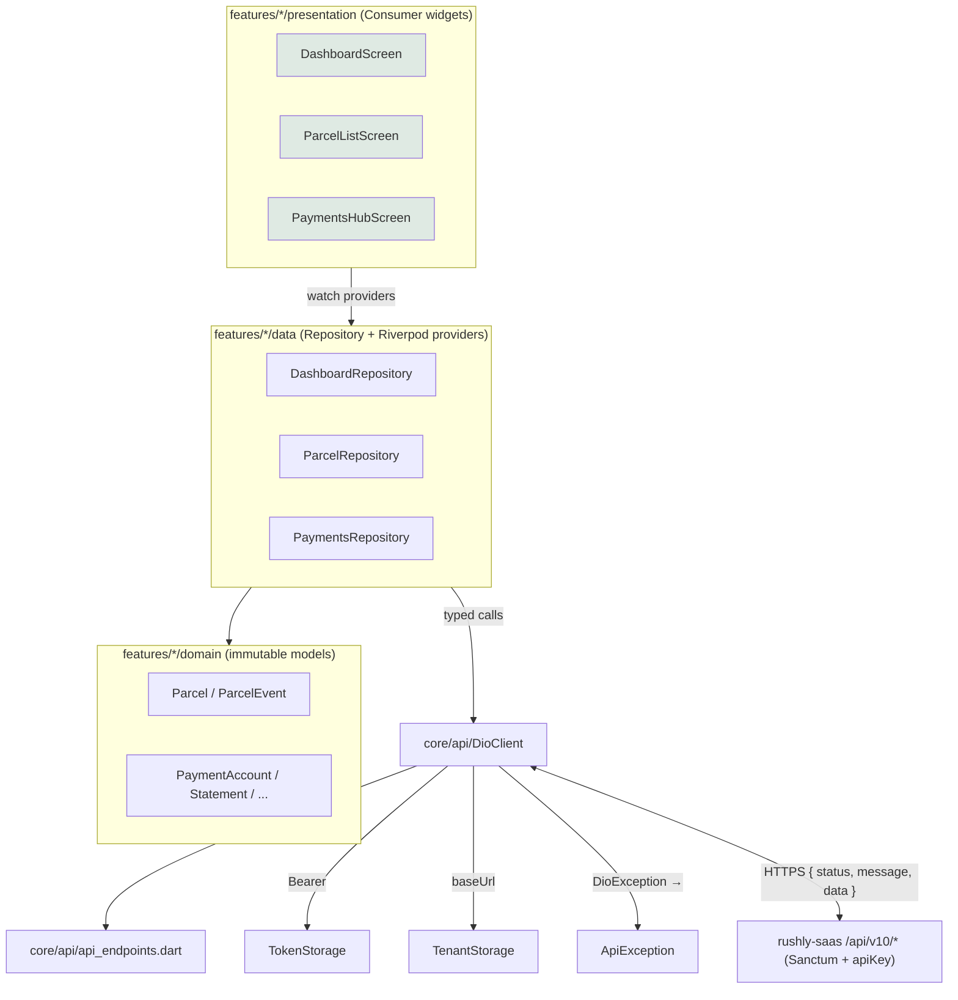
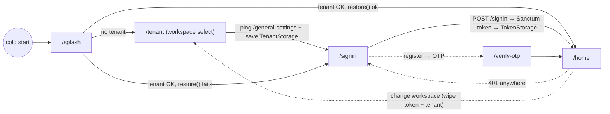
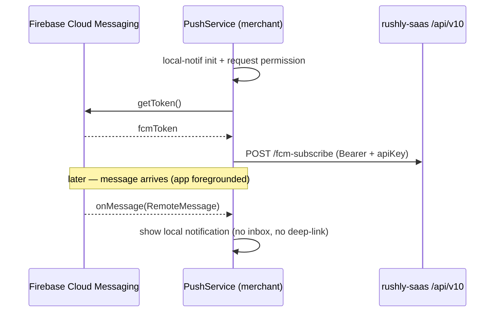

# rushly-merchant-app — Merchant Portal

> **Scope.** Deep-dive on the Flutter **merchant** mobile app at
> `/var/www/rushly-merchant-app` — its purpose, architecture, routing, theming,
> localization, packages, state management, API layer, storage, push, and a
> **per-screen** breakdown (purpose, UI, business logic, API calls, validation,
> navigation, permissions), with every screen mapped to a `rushly-saas`
> `/api/v10/*` endpoint and to the relevant module docs.
>
> **Ground truth.** `rushly-saas` (`/var/www/rushly-saas`) is the **single source of
> truth**. The merchant app is a **pure client** — it holds no business logic beyond
> request-building, presentation, and device-local ephemeral state. Cross-links:
> shared Flutter architecture in [../08-Flutter.md](../08-Flutter.md); API contract
> in [../09-API.md](../09-API.md); auth in [../10-Authentication.md](../10-Authentication.md);
> DB in [../06-Database.md](../06-Database.md). Module docs are referenced per-feature
> below. Where a repo doc and the actual code diverge, a **⚠️ Doc vs Code** note is
> added and **the code is treated as truth**.

---

## 1. Purpose & target user

The merchant app is the **shop-owner / seller** face of the Rushly logistics platform.
A merchant is a tenant-scoped `User` with `user_type = MERCHANT` who books last-mile
parcels against a courier company (the tenant), tracks them, reconciles COD/payouts,
and manages their storefront integrations. It is the mobile counterpart to the
web merchant panel (`resources/js/Pages/Merchant/*` in `rushly-saas`, documented in
`rushly-saas/MERCHANT_DASHBOARD.md`).

What a merchant does with the app (verified from `lib/features/*`):

| Job | Feature folder | Backend module doc |
|---|---|---|
| Book & track parcels (single + CSV bulk) | `parcels/` | [../modules/parcels.md](../modules/parcels.md) |
| See balance, KPIs, analytics | `dashboard/` | [../modules/reports-analytics-performance.md](../modules/reports-analytics-performance.md) |
| Manage pickup shops | `shops/` | [../modules/merchants.md](../modules/merchants.md) |
| Wallet: statements, transactions, payout requests, payout accounts | `payments/` | [../modules/finance-billing-wallet.md](../modules/finance-billing-wallet.md) |
| View invoices (parcels + returns) | `invoices/` | [../modules/finance-billing-wallet.md](../modules/finance-billing-wallet.md) |
| Screen a customer phone / see reported frauds | `fraud/` | [../modules/merchants.md](../modules/merchants.md) |
| Review failed delivery attempts (NDR) | `ndr/` | [../modules/parcels.md](../modules/parcels.md) |
| Read news/offers feed | `news/` | [../modules/support-crm.md](../modules/support-crm.md) |
| Raise & reply to support tickets | `support/` | [../modules/support-crm.md](../modules/support-crm.md) |
| Shipment reports (by driver / city / trend) | `reports/` | [../modules/reports-analytics-performance.md](../modules/reports-analytics-performance.md) |
| View COD / delivery charge tables | `settings/` | [../modules/finance-billing-wallet.md](../modules/finance-billing-wallet.md) |
| See connected storefronts (Salla/Zid/Woo/Shopify) | `store_connections/` | [../modules/commerce-integrations.md](../modules/commerce-integrations.md) |

**Metrics (live, 2026-07-27):** 71 `.dart` files, 27 screens, 14 feature folders
(incl. `tenant/`). Source: `find lib -name '*.dart' | wc -l` and the `lib/` tree.

---

## 2. At a glance

| Property | Value | Source |
|---|---|---|
| Package name | `rushly_merchant` | `pubspec.yaml:1` |
| Framework | Flutter `>=3.19.0`, Dart `>=3.3.0 <4.0.0` | `pubspec.yaml` `environment:` |
| State / DI | Riverpod 2 (`flutter_riverpod ^2.5.1`) | `pubspec.yaml` |
| HTTP | Dio `^5.5.0` + `pretty_dio_logger` | `pubspec.yaml` |
| Router | `go_router ^14.2.0` (redirect auth-gate) | `lib/shared/router/app_router.dart` |
| Login endpoint | `POST /api/v10/signin` (merchant_id + password) | `lib/features/auth/data/auth_repository.dart:1165` |
| Registration | `POST /register` → OTP (`/otp-verification`) | `auth_repository.dart:1134`, `1142` |
| Seed colour | blue `0xFF0F62FE` | `lib/shared/theme/app_theme.dart:217` |
| Default locale | **Arabic** (`Locale('ar')`), en + ar, RTL automatic | `lib/shared/l10n/locale_controller.dart:888` |
| Push | FCM (`firebase_messaging ^15.0.4`) + local notifications | `lib/core/push/push_service.dart` |
| Maps | `flutter_map ^7.0.2` (OSM tiles) + `latlong2` | `lib/features/parcels/presentation/parcel_tracking_map.dart` |
| Charts | `fl_chart ^0.68.0` | dashboard + reports |
| Bulk/PDF | `file_picker` + `csv` (import), `pdf` + `printing` (statement export) | `pubspec.yaml` |
| Primary tabs | Dashboard · Parcels · Wallet · Invoices · News · Profile | `lib/features/dashboard/presentation/home_shell.dart:580` |

The merchant app is one of only three apps (driver, merchant, admin) that ship FCM
push and one of three with `flutter_map`; it is the only app that ships CSV bulk
import + statement-PDF export. See the cross-app comparison in
[../08-Flutter.md](../08-Flutter.md) §2, §12.

---

## 3. Architecture — `core / shared / features`

The app uses the standard Rushly three-layer split (identical convention across all
eight apps — [../08-Flutter.md](../08-Flutter.md) §3). `core/` is infrastructure with
no feature knowledge; `shared/` is cross-feature UI glue (theme, router, i18n);
`features/<x>/` are vertical slices of `domain/ + data/ + presentation/`.

```
lib/
├── main.dart                         # ProviderScope boot + optional Firebase init
├── core/
│   ├── api/
│   │   ├── dio_client.dart           # Dio wrapper: headers, 401 wipe, envelope unwrap
│   │   ├── api_endpoints.dart        # string registry mirroring routes/api.php v10
│   │   └── providers.dart            # secureStorage / token / tenant / dioClient providers
│   ├── config/env.dart               # dotenv loader (API_BASE_URL, API_KEY, TENANT_HOST_SUFFIX…)
│   ├── error/api_exception.dart      # maps { status, message, errors } envelope
│   ├── push/push_service.dart        # FCM init + foreground local notif
│   ├── storage/
│   │   ├── token_storage.dart        # secure: auth_token, merchant_id, pending_mobile
│   │   └── tenant_storage.dart       # secure: tenant_api_base, tenant_label
│   └── utils/
│       ├── json_x.dart               # asInt/asDouble/asString/asBool/asListOfMaps coercers
│       └── parcel_status.dart        # ParcelStatus code→label mirror of the PHP enum
├── features/
│   ├── auth/            signin, register, otp, forgot-password
│   ├── tenant/          workspace (tenant subdomain) select
│   ├── dashboard/       home shell (bottom nav), dashboard, profile
│   ├── parcels/         list, details (+map), create/edit form, bulk CSV import
│   ├── shops/           list + form (CRUD)
│   ├── payments/        wallet hub (statements/transactions/requests/accounts) + forms + PDF
│   ├── invoices/        list + details (parcels + returns)
│   ├── fraud/           phone check + reported list
│   ├── ndr/             failed-attempt feed
│   ├── news/            news/offers feed
│   ├── support/         tickets list + new + thread/reply
│   ├── reports/         shipment reports (overview/driver/city/trend)
│   ├── settings/        COD + delivery charge tables (read-only)
│   └── store_connections/ storefront connection cards
└── shared/
    ├── l10n/            AppLocalizations delegate + LocaleController + language toggle
    ├── router/          go_router config + splash + auth gate
    └── theme/           AppTheme.light / .dark
```



---

## 4. Packages (`pubspec.yaml`)

Full dependency inventory (`pubspec.yaml`), grouped by role:

| Role | Packages |
|---|---|
| State / DI | `flutter_riverpod ^2.5.1` |
| HTTP | `dio ^5.5.0`, `pretty_dio_logger ^1.4.0`, `connectivity_plus ^6.0.3` |
| Storage | `flutter_secure_storage ^9.2.2`, `shared_preferences ^2.2.3` |
| Config / i18n | `flutter_dotenv ^5.1.0`, `flutter_localizations` (SDK), `intl ^0.20.2` |
| UI / fonts / images | `google_fonts ^6.2.1`, `cached_network_image ^3.3.1` |
| Routing | `go_router ^14.2.0` |
| Charts | `fl_chart ^0.68.0` |
| Camera / permissions | `image_picker ^1.1.2`, `permission_handler ^11.3.1` |
| Push | `firebase_core ^3.3.0`, `firebase_messaging ^15.0.4`, `flutter_local_notifications ^17.2.2` |
| Platform utils | `url_launcher ^6.3.0`, `package_info_plus ^8.0.1`, `share_plus ^9.0.0`, `logger ^2.4.0`, `collection ^1.18.0` |
| Bulk import / export | `file_picker ^8.1.2`, `csv ^6.0.0`, `pdf ^3.11.1`, `printing ^5.13.2` |
| Maps | `flutter_map ^7.0.2`, `latlong2 ^0.9.1` |
| Lints (dev) | `flutter_lints ^4.0.0` |

Bundled assets: `assets/images/`, `assets/icons/`, `.env`; font family **Tajawal**
(Regular/Medium/Bold) declared in `pubspec.yaml` and required to compile. `generate:
true` is set but the app does **not** use ARB codegen — localisation is hand-rolled
(§9). `analysis_options.yaml` enables `strict-casts / strict-inference /
strict-raw-types` and lints `prefer_const_*`, `avoid_print`, `use_key_in_widget_constructors`.

**⚠️ Doc vs Code.** `package_info_plus`, `share_plus`, `logger`, and `connectivity_plus`
are declared but **not referenced** anywhere in `lib/` (grep). Sharing is done via
`url_launcher` (parcel details) and `printing`'s share sheet (statements), not
`share_plus`. These are latent/unused deps.

---

## 5. The API layer (`lib/core/api/*`)

### 5.1 `DioClient` — the single HTTP choke point (`lib/core/api/dio_client.dart`)

- Constructed with a `baseUrl` resolved from `TenantStorage` (via `dioClientProvider`)
  and a `TokenStorage` handle (`dio_client.dart:18`). Falls back to `Env.apiBaseUrl`.
- **Two static headers**: `Accept: application/json` and `apiKey: <Env.apiKey>`
  (`dio_client.dart:26`). The bearer token is injected **per-request** by an
  `InterceptorsWrapper.onRequest` that reads `TokenStorage.readToken()` and sets
  `Authorization: Bearer <token>` when present (`dio_client.dart:33-40`).
- **401 handling**: `onError` catches `statusCode == 401`, wipes the token
  (`_tokens.clear()`) and fires an optional `_onUnauthorized` callback
  (`dio_client.dart:42-47`). *(The callback setter exists but the merchant app
  currently drives re-auth through the router `redirect` + splash `restore()`, not
  through this hook.)*
- **Timeouts**: connect 20 s, receive/send 30 s (`dio_client.dart:21-24`).
- **Debug logging**: `PrettyDioLogger` only under `kDebugMode` (`dio_client.dart:51`).
- **Envelope unwrap** (`_unwrap<T>`, `dio_client.dart:117`): returns the inner `data`
  field of the Laravel `{ status, message, data }` envelope; falls back to the raw
  payload for endpoints that don't wrap (e.g. public tracking). The backend envelope
  is produced by `app/Traits/ApiReturnFormatTrait.php` (rushly-saas). See
  [../09-API.md](../09-API.md) for the contract.
- Verb helpers `get/post/put/delete` funnel every `DioException` through
  `ApiException.fromDio`. `post` also accepts a `FormData? form` for multipart
  (used by support-ticket attachments).

### 5.2 `api_endpoints.dart` — the route registry

A hand-maintained mirror of the merchant-relevant `routes/api.php` v10 routes, as
`static const String` (or `static String fn(id)` for parameterised paths). There is
**no generated client**; this file is the manual contract with the backend. Every
constant is enumerated in the endpoint map in §14.

### 5.3 Storage — tenant & token (secure)

Both wrap `flutter_secure_storage` with `AndroidOptions(encryptedSharedPreferences:
true)` (`providers.dart:9`).

- **`TenantStorage`** (`tenant_storage.dart`) — keys `tenant_api_base`, `tenant_label`.
  `isConfigured()` gates the boot flow. Same shape as the driver/admin apps.
- **`TokenStorage`** (`token_storage.dart`) — keys `auth_token`, `merchant_id`,
  `pending_mobile` (the merchant id typed at login is persisted; `pending_mobile`
  bridges register → OTP). `clear()` wipes all three on logout / 401.

### 5.4 Provider wiring (`providers.dart`)

```
secureStorageProvider ─┬─> tokenStorageProvider  ─┐
                       └─> tenantStorageProvider ─┤
tenantBaseUrlProvider (FutureProvider<String?>) ──┤
                                                  └─> dioClientProvider
```

`dioClientProvider` watches `tenantBaseUrlProvider.valueOrNull`, so the Dio base URL
tracks the configured tenant. The client is **not** rebuilt mid-session on a tenant
change; the "change workspace" flow clears the token, invalidates
`tenantBaseUrlProvider`, and returns to `/tenant` (`profile_screen.dart:1109`).

### 5.5 Error surface — `ApiException` (`api_exception.dart`)

Normalises every failure into one type: `message`, `statusCode`,
`fieldErrors: Map<String,List<String>>`, and an `ApiErrorKind`
(`offline / server / cancelled / unknown`) derived from the `DioExceptionType`.
It maps both the `{ errors: {...} }` shape and the legacy `{ message: {...} }`
validation shape. Getters: `isUnauthorized` (401), `isValidation` (422), `isOffline`.

**⚠️ Code smell.** UI layers surface errors with `e.toString()` (e.g.
`SnackBar(content: Text(e.toString()))`), which renders `ApiException(422): ...` rather
than the structured `fieldErrors`. `fieldErrors`/`isValidation` are defined but never
consumed anywhere in `lib/` — form-level field errors are not shown.

---

## 6. Authentication, tenant identification & boot flow

### 6.1 Two-gate boot

Implemented in `lib/shared/router/app_router.dart`. The router's top-level `redirect`
enforces both gates on every non-public route (`app_router.dart:38-64`):

```
if (loc == '/splash') return null;                       // splash resolves both gates
if (!tenantConfigured && loc != '/tenant') → '/tenant';
if (tenantConfigured  && loc == '/tenant') → '/signin';
if (!isAuthed && !isPublicRoute)           → '/signin';  // public = signin/register/verify-otp/forgot-password/tenant
if (isAuthed && isAuthRoute)               → '/home';
```

`_Splash` (`app_router.dart:182-210`) resolves the tenant via
`tenantBaseUrlProvider.future`; if none → `/tenant`; otherwise calls
`authControllerProvider.notifier.restore()` and routes to `/home` (ok) or `/signin`.



### 6.2 Tenant identification (`tenant/presentation/tenant_select_screen.dart`)

First-boot screen where the merchant names the courier company (tenant subdomain)
that hosts their account. Two modes:

1. **Workspace name** (default) — typing `acme` builds
   `https://acme.<TENANT_HOST_SUFFIX>/api/v10` (`_buildBaseUrl`, `env.dart:11`).
   Validated with `^[a-z0-9][a-z0-9-]*$`.
2. **Advanced** — paste a full base URL; if it lacks `/api/`, `/api/v10` is appended.

Before persisting, it **pings `GET /general-settings`** (a public, apiKey-only route)
with an 8-second Dio so bad URLs fail here rather than at login. On success it writes
`TenantStorage`, invalidates `tenantBaseUrlProvider`, and routes to `/signin`. A live
`→ <preview URL>` string echoes the resolved base URL under the input.

### 6.3 Login / registration (`auth/data/auth_repository.dart`)

| Flow | Method | Endpoint | Notes |
|---|---|---|---|
| Sign in | `signin(merchantId, password)` | `POST /signin` (`merchant_id`, `password`) | Stores `token` + `merchant_id`; parses `data['user']` into `MerchantUser` |
| Register | `register(body)` | `POST /register` | Server stores draft + sends OTP; persists `pending_mobile`, returns mobile for the OTP screen |
| Verify OTP | `verifyOtp(mobile, otp)` | `POST /otp-verification` | Returns `token` + `user`; writes token + merchant unique_id; clears pending mobile |
| Resend OTP | `resendOtp(mobile)` | `POST /resend-otp` | — |
| Forgot password | `sendPasswordResetEmail(email)` | `POST /password/email` | Backend throttled `5,1` |
| Reset password | `resetPassword(...)` | `POST /password/reset` | token + email + password + confirmation |
| Restore session | `profile()` | `GET /profile` | Called by `AuthController.restore()` on splash |
| Update profile | `updateProfile(body)` | `POST /profile/update` | *(repo method exists; no screen wires it — see §13)* |
| Update password | `updatePassword(...)` | `PUT /update-password` | *(repo method exists; route `/update-password` is not registered in the router — see §13)* |
| Logout | `logout()` | `POST /sign-out` then `TokenStorage.clear()` | — |
| FCM (un)subscribe | `fcmSubscribe/Unsubscribe(token)` | `POST /fcm-subscribe` `/fcm-unsubscribe` | body `{ device_token }` |

Session state lives in `AuthController` (`Notifier<AuthState>`, `auth_controller.dart`),
read by the router `redirect`. `AuthState.isAuthenticated == user != null`.

### 6.4 Backend gate (rushly-saas)

Every merchant route sits behind **`CheckApiKey`** (`app/Http/Middleware/CheckApiKeyMiddleware.php`)
plus, after login, **`auth:sanctum`** (`routes/api.php:234`, `:248`). The `apiKey` is a
**single static shared secret** across all tenants/apps — `Env.apiKey` even hard-codes
a default (`'123456rx-ecourier123456'`, `env.dart:8`) and `Env.apiBaseUrl` defaults to
`https://api.rushly-logistic.com/api/v10` (`env.dart:5`). See the security debt note in
[../08-Flutter.md](../08-Flutter.md) §5.3 and [../17-Security.md](../17-Security.md).

**⚠️ Doc vs Code.** `.env.example` sets `API_BASE_URL=https://admin.rushly-logistic.com/api/v10`
while the app's hard-coded fallback and the README both say `api.rushly-logistic.com`.
The `.env` value wins at runtime when present.

**Permissions note.** The merchant API is **not** role-clamped by a middleware the way
admin routes are (`CheckAdminRole`). Instead each controller derives the merchant from
`Auth::user()` and scopes queries to that merchant server-side. The app carries **no
client-side role model** — every authenticated screen is reachable for any logged-in
merchant; data isolation is entirely a server concern. This is called out per-screen
under "Permissions" as *tenant + merchant-scoped server-side (no client gate)*.

---

## 7. State management (Riverpod 2)

- Single `ProviderScope` at `main()` (`main.dart:21`).
- Infrastructure exposed as `Provider`s in `core/api/providers.dart`.
- **Session** uses a `Notifier` (`authControllerProvider`); **locale** a
  `StateNotifier` (`localeProvider`); the **router itself is a provider**
  (`routerProvider`) reading `tenantBaseUrlProvider` + `authControllerProvider` in its
  `redirect`, so a token/tenant change re-drives navigation.
- **Feature reads** are almost all `FutureProvider.autoDispose` (list/detail fetches),
  with `.family` for id-parameterised details (`parcelDetailsProvider(id)`,
  `invoiceDetailsProvider(id)`, `supportTicketProvider(id)`, `shipmentReportProvider(ReportRange)`).
  Screens consume them with `AsyncValue.when(loading/error/data)` and refresh via
  `ref.invalidate(...)` (pull-to-refresh + explicit refresh buttons).
- **Repositories** live in `features/<x>/data/` and take a `DioClient` via `ref`,
  keeping widgets free of raw HTTP. `PushService` calls `AuthRepository.fcmSubscribe`
  rather than Dio directly.
- Models are **hand-written** (no `freezed`/`json_serializable`), built from
  `Map<String,dynamic>` through the `json_x.dart` coercers to defend against
  loosely-typed Laravel JSON.

---

## 8. Theming (`shared/theme/app_theme.dart`)

`AppTheme.light(Locale)` / `AppTheme.dark(Locale)` both build from
`ColorScheme.fromSeed(seedColor: Color(0xFF0F62FE))` with `useMaterial3: true`. Light
theme customises: scaffold background `0xFFF5F7FB`, white flat `AppBar`, rounded 16 px
cards with a grey-200 border, filled white inputs, and 48 px filled buttons (12 px
radius). `main.dart` passes both to `MaterialApp.router` so the app follows the system
light/dark setting. The seed blue (`0F62FE`) is the merchant brand colour in the
cross-app palette ([../08-Flutter.md](../08-Flutter.md) §8, [../15-Brand-System.md](../15-Brand-System.md)).

Fonts follow the locale: `GoogleFonts.tajawalTextTheme()` for Arabic,
`GoogleFonts.interTextTheme()` for Latin, keyed on `locale.languageCode == 'ar'`.

---

## 9. Localization (ar / en) & RTL (`shared/l10n/*`)

- **Delegate** (`app_localizations.dart`): a hand-rolled `AppLocalizations` with `_en`
  and `_ar` string maps and typed getters (compile-time-safe access). `supported =
  [Locale('en'), Locale('ar')]`; `isSupported` accepts `en`/`ar`. A `%s` interpolation
  helper exists for `otpSentTo(mobile)`.
- **`MaterialApp.router`** registers `AppLocalizations.delegate` alongside the three
  `GlobalMaterialLocalizations` / `GlobalWidgetsLocalizations` /
  `GlobalCupertinoLocalizations` delegates (`main.dart:51-56`). Those globals make
  **RTL automatic**: selecting `Locale('ar')` flips the whole widget tree to
  `TextDirection.rtl` via Flutter's `Directionality`. There is **no manual
  `textDirection` handling** anywhere (grep) — screens use `AlignmentDirectional` /
  `centerStart`/`centerEnd` so they mirror correctly. RTL is a free consequence of the
  locale.
- **Locale state** (`locale_controller.dart`): `localeProvider`
  (`StateNotifierProvider<LocaleController, Locale>`), **default Arabic**
  (`super(const Locale('ar'))`). `toggle()` flips ar↔en. A `LanguageToggleButton`
  (`language_toggle_button.dart`) is placed in the sign-in AppBar and shows the *other*
  language's label.
- **⚠️ Persistence gap (as in the driver app).** `LocaleController` is **in-memory
  only** — its own comment says persistence "can be layered on later by wiring
  TokenStorage (mirrors the admin app's LocaleController)". A merchant's language choice
  **resets to Arabic on cold start**. Contrast the admin app, which persists locale.

**⚠️ Doc vs Code — the l10n file does not compile as committed (two defects):**

1. **Duplicate getters.** `String get returned` is declared **twice** (once in the
   dashboard block, again in the reports block) and `String get payable` **twice**
   (`app_localizations.dart` — the pairs at the `returned`/`payable` getters). The
   `_en`/`_ar` map literals likewise contain the keys `'returned'` and `'payable'`
   twice. Dart treats duplicate getter declarations *and* equal constant map keys as
   **compile-time errors**.
2. **Missing getter.** `reports_screen.dart` calls `s.noData` in three places
   (`reports_screen.dart:157,181,205`) but `AppLocalizations` defines **no `noData`
   getter** (it has `noRecords`, `noParcels`, etc.). This is an undefined-getter
   compile error.

Both must be fixed for the app to build. Confirmed by
`grep -n "get returned\|get payable\|noData"` over `lib/`. Flagged again in §13.

---

## 10. Push notifications (`core/push/push_service.dart`)

`PushService` (via `pushServiceProvider`), fired fire-and-forget from
`_RushlyMerchantAppState.initState` after the first frame (`main.dart:37`):

1. Initialises `flutter_local_notifications` (Android `@mipmap/ic_launcher`, iOS Darwin).
2. Requests notification permission (`FirebaseMessaging.requestPermission` +
   `Permission.notification.request()`).
3. Fetches the FCM token and registers it via `AuthRepository.fcmSubscribe(token)` →
   `POST /fcm-subscribe { device_token }`; re-registers on `onTokenRefresh`.
4. **Foreground-only handler**: `FirebaseMessaging.onMessage` renders a local
   notification on channel `rushly_merchant_default` ("Parcel + payout updates").

`main()` wraps `Firebase.initializeApp()` in try/catch so dev builds without
`google-services.json` still run; `PushService.init()` is guarded with `.catchError`.
There is **no background/`onBackgroundMessage` isolate**, **no device-local inbox**
(unlike the driver app), and **no deep-linking** from a tapped notification. Backend
sender: `app/Http/Services/PushNotificationService.php` (see
[../modules/notifications.md](../modules/notifications.md)).



---

## 11. Routing (`shared/router/app_router.dart`)

Single `GoRouter` (`routerProvider`), `initialLocation: '/splash'`, flat `GoRoute`s.
Deep-link params come from `state.pathParameters` (`/parcel/:id`), typed objects from
`state.extra` (e.g. `ShopFormScreen(shop: s.extra as Shop?)`), and query params drive
the "clickable KPI card" pattern (`/parcels?status=X&label=Y`).

| Route | Screen | Auth | Params |
|---|---|---|---|
| `/splash` | `_Splash` | — | resolves gates |
| `/tenant` | `TenantSelectScreen` | public | — |
| `/signin` | `SigninScreen` | public | — |
| `/register` | `RegisterScreen` | public | — |
| `/verify-otp` | `OtpScreen` | public | `extra` = mobile string |
| `/forgot-password` | `ForgotPasswordScreen` | public | — |
| `/home` | `HomeShell` (bottom-nav) | ✅ | — |
| `/parcels` | `ParcelListScreen` | ✅ | `?status=`, `?label=` |
| `/parcel/new` | `ParcelFormScreen` | ✅ | — |
| `/parcel/bulk-import` | `BulkImportScreen` | ✅ | — |
| `/parcel/:id` | `ParcelDetailsScreen` | ✅ | path `id` |
| `/parcel/:id/edit` | `ParcelFormScreen` | ✅ | path `id` |
| `/reports` | `ReportsScreen` | ✅ | — |
| `/payments` | `PaymentsHubScreen` | ✅ | — |
| `/payments/accounts/new` | `AccountFormScreen` | ✅ | — |
| `/payments/accounts/:id/edit` | `AccountFormScreen` | ✅ | `extra` = `PaymentAccount?` |
| `/payments/requests/new` | `PaymentRequestFormScreen` | ✅ | — |
| `/payments/requests/:id/edit` | `PaymentRequestFormScreen` | ✅ | path `id` |
| `/invoice/:id` | `InvoiceDetailsScreen` | ✅ | path `id` |
| `/shops` | `ShopsScreen` | ✅ | — |
| `/shops/new` | `ShopFormScreen` | ✅ | — |
| `/shops/:id/edit` | `ShopFormScreen` | ✅ | `extra` = `Shop?` |
| `/fraud` | `FraudScreen` | ✅ | — |
| `/ndr` | `NdrScreen` | ✅ | — |
| `/store-connections` | `StoreConnectionsScreen` | ✅ | — |
| `/support` | `SupportScreen` | ✅ | — |
| `/support/new` | `NewTicketScreen` | ✅ | — |
| `/support/:id` | `SupportTicketScreen` | ✅ | path `id` |
| `/settings` | `SettingsScreen` | ✅ | — |

**⚠️ Doc vs Code — two dead nav targets.** `ProfileScreen` pushes `/update-password`
(`profile_screen.dart:1073`) and `/language` (`:1078`), but **neither route is
registered** in `app_router.dart`. Tapping those rows resolves to `/signin` via the
redirect (or a "no route" error) rather than opening a screen. The underlying
`AuthRepository.updatePassword` exists but has no UI; language change is only reachable
via the pre-auth AppBar toggle. Flagged in §13.

---

## 12. Per-screen documentation

Every screen below is documented as **Purpose · UI · Business logic · API calls ·
Validation · Navigation · Permissions**. Permissions are uniform: all `/home`-and-below
screens require a valid Sanctum session (enforced by the router `redirect` + backend
`auth:sanctum`), and data is **tenant + merchant-scoped server-side** — there is no
client-side role gate. This is stated once here and abbreviated as *"authed;
merchant-scoped"* per screen.

### 12.1 Auth & tenant

**TenantSelectScreen** (`tenant/presentation/tenant_select_screen.dart`)
- **Purpose:** pick the courier tenant (workspace) before anything else loads.
- **UI:** storefront icon, hint, a workspace-name field with `.suffix` = host suffix
  (or a full-URL field in advanced mode), a live `→ preview` of the resolved base URL,
  a simple/advanced toggle, and a Connect button with spinner + inline error.
- **Business logic:** builds base URL from slug or full URL; pings before persisting.
- **API:** `GET /general-settings` (probe, apiKey only — no auth).
- **Validation:** workspace `^[a-z0-9][a-z0-9-]*$` (else `workspaceNameInvalid`); URL
  must parse with a scheme (else `invalidUrl`); empty → `required`.
- **Navigation:** on success → `/signin`.
- **Permissions:** public (pre-tenant).

**SigninScreen** (`auth/presentation/signin_screen.dart`)
- **Purpose:** merchant login by Merchant ID + password.
- **UI:** logo (falls back to an icon), Merchant-ID field, obscured password with
  show/hide, "Forgot password?" link, Sign-in button (spinner), "Sign up" link, and a
  `LanguageToggleButton` in the AppBar.
- **API:** `POST /signin { merchant_id, password }` via `AuthController.signin`.
- **Validation:** merchant id `required`; password `required` + min 6 (`passwordTooShort`).
- **Navigation:** ok → `/home`; failure → SnackBar (controller `error` or `loginFailed`);
  → `/forgot-password`, `/register`.
- **Permissions:** public.

**RegisterScreen** (`auth/presentation/register_screen.dart`)
- **Purpose:** self-service merchant sign-up (draft + OTP).
- **UI:** name, business name, email, mobile, password, confirm-password fields; submit.
- **API:** `POST /register { name, email, mobile, business_name, password,
  password_confirmation }` → returns mobile (persisted as `pending_mobile`).
- **Validation:** name/business/mobile `required`; email `required` + must contain `@`
  (`emailInvalid`); password `required` + min 6; confirm must equal password
  (`passwordMismatch`).
- **Navigation:** → `/verify-otp` (extra = mobile).
- **Permissions:** public.

**OtpScreen** (`auth/presentation/otp_screen.dart`)
- **Purpose:** verify the SMS OTP to activate the account.
- **UI:** "OTP sent to <mobile>", numeric OTP field, Verify button, Resend button.
- **API:** `POST /otp-verification { mobile, otp }` (via `AuthController.verifyOtp`);
  `POST /resend-otp { mobile }`.
- **Validation:** OTP `required`, min 4 chars (`otpTooShort`).
- **Navigation:** ok → `/home`; failure → SnackBar (`invalidOtp`).
- **Permissions:** public.

**ForgotPasswordScreen** (`auth/presentation/forgot_password_screen.dart`)
- **Purpose:** request a password-reset email.
- **UI:** intro text, email field, "Send reset link" button.
- **API:** `POST /password/email { email }` (backend throttled `5,1`).
- **Validation:** email `required` + contains `@`.
- **Navigation:** always shows a neutral `resetLinkSent` SnackBar (no account
  enumeration) then `pop()`.
- **Permissions:** public.

### 12.2 Dashboard shell

**HomeShell** (`dashboard/presentation/home_shell.dart`)
- **Purpose:** the authenticated container — 6-tab bottom nav via `IndexedStack`.
- **UI:** tabs Dashboard · Parcels · Wallet · Invoices · News · Profile; a
  `FloatingActionButton.extended` "New parcel" shown **only on the Parcels tab**
  (`_index == 1`).
- **Business logic:** in-memory tab index; keeps all six pages alive (IndexedStack).
- **Navigation:** FAB → `/parcel/new`.
- **Permissions:** authed; merchant-scoped.

**DashboardScreen** (`dashboard/presentation/dashboard_screen.dart`)
- **Purpose:** balance + KPI + status-count + analytics overview; jump-off to reports.
- **UI:** balance card (current / payable / received, tappable → `/payments`); a 2×2 KPI
  grid (Total, Delivered, In progress, Returned — each tappable); a status list; a
  `fl_chart` line chart of analytics. AppBar has a Reports button and a Refresh button.
- **Business logic:** four independent `FutureProvider.autoDispose`s — `dashboardSummaryProvider`,
  `balanceDetailsProvider`, `analyticsProvider`, `allStatusCountsProvider`; pull-to-refresh
  invalidates all four. KPI cards deep-link with **backend status codes**
  (`_BackendStatus`: pending 1, deliveryManAssign 7, delivered 9,
  returnReceivedByMerchant 30) — note these **differ** from the mobile `ParcelStatus`
  util's numbering (see §13). Balance/summary read loosely (`current_balance` **or**
  `balance`, `total_parcels` **or** `parcels`, …) to tolerate backend key drift.
- **API:** `GET /dashboard`, `GET /dashboard/balance-details`, `GET /analytics`,
  `GET /parcel/all/status`.
- **Navigation:** balance → `/payments`; KPI/status tiles → `/parcels?status=&label=`;
  AppBar → `/reports`.
- **Permissions:** authed; merchant-scoped. Backend: `DashboardController@index`
  merchant branch (see `MERCHANT_DASHBOARD.md`, [../modules/reports-analytics-performance.md](../modules/reports-analytics-performance.md)).

**ProfileScreen** (`dashboard/presentation/profile_screen.dart`)
- **Purpose:** account header + drawer-style menu to secondary features + workspace/logout.
- **UI:** avatar (network image or icon), business name / email / phone, then list rows:
  Shops, Fraud check, NDR, Store connections, Support, Settings, Update password,
  Language, Workspace (with change action), Logout.
- **Business logic:** reads `authControllerProvider.user`; workspace subtitle is the
  tenant host; "change workspace" confirms, then `logout()` + `TenantStorage.clear()` +
  invalidate `tenantBaseUrlProvider` → `/tenant`.
- **API:** `POST /sign-out` (logout).
- **Navigation:** `/shops`, `/fraud`, `/ndr`, `/store-connections`, `/support`,
  `/settings`, and (dead) `/update-password`, `/language`; logout → `/signin`.
- **Permissions:** authed; merchant-scoped.

### 12.3 Parcels ([../modules/parcels.md](../modules/parcels.md))

**ParcelListScreen** (`parcels/presentation/parcel_list_screen.dart`)
- **Purpose:** browse/search/filter the merchant's parcels; entry to bulk import.
- **UI:** search field (tracking / name / phone), a filter icon → bottom sheet of
  `ParcelStatus.merchantSummary` statuses, bulk-import AppBar action, list tiles
  (status-coloured avatar, tracking id, customer, address, status, COD, date).
- **Business logic:** loads `parcelsProvider` (`GET /parcel/index`) once, then filters
  **client-side** by status + query. `initialStatus`/`title` seed the filter so
  dashboard KPI cards open a pre-filtered, titled subpage. **⚠️** Dashboard KPI links
  pass *backend* status codes via the query string, but the list filters `p.status ==
  _filter` and the bottom-sheet uses *mobile* `ParcelStatus` codes — the two numbering
  schemes don't align, so a KPI deep-link may filter to an empty list (see §13).
- **API:** `GET /parcel/index`.
- **Navigation:** tile → `/parcel/:id`; AppBar → `/parcel/bulk-import`.
- **Permissions:** authed; merchant-scoped.

**ParcelDetailsScreen** (`parcels/presentation/parcel_details_screen.dart`)
- **Purpose:** full parcel view with live tracking map, event timeline, and actions.
- **UI:** header (tracking + status), Customer section (name, tap-to-call phone,
  tap-to-open-maps address), Shipment section (invoice, weight, status, COD, total
  charge, payable), a `ParcelTrackingMap`, an event timeline, and action row: Share
  tracking (always) + Edit + Delete (only when `status == pending`).
- **Business logic:** `parcelDetailsProvider(id)` → `{ parcel, events }`. `canEdit =
  status == ParcelStatus.pending` gates Edit/Delete client-side (server enforces too).
  Delete confirms via dialog, invalidates `parcelsProvider`, pops.
- **API:** `GET /parcel/details/{id}`; `DELETE /parcel/delete/{id}`.
- **Navigation:** Edit → `/parcel/:id/edit`; Share opens
  `https://rushly-logistic.com/track/<trackingId>` externally.
- **Permissions:** authed; merchant-scoped; edit/delete only while pending.

**ParcelTrackingMap** (`parcels/presentation/parcel_tracking_map.dart`)
- **Purpose:** read-only OSM map plotting up to three markers.
- **UI:** `FlutterMap` (OSM tiles) with a blue store pin (pickup), green scooter (latest
  driver location from the most recent event with coords), red destination pin
  (customer). Friendly empty-state card (`noLocationYet`) when no coordinates exist.
- **Business logic:** picks markers from `parcel.customer_lat/long`, `pickup_lat/long`,
  and the first event with `delivery_lat/long`. One point → zoom 14; many →
  `CameraFit.bounds`; default centre Riyadh `24.7136, 46.6753`.
- **API:** none (data comes with parcel details).
- **Permissions:** authed; merchant-scoped.

**ParcelFormScreen** (`parcels/presentation/parcel_form_screen.dart`) — create & edit
- **Purpose:** book a new parcel or edit a pending one, with a live charge estimate.
- **UI:** dropdowns Shop / Delivery type / Delivery category (from the create-form
  reference data); fields customer name/phone/address, invoice, weight, COD, cash to
  collect, note; Fragile/Liquid checkboxes; a **`_ChargePreview`** card; submit.
- **Business logic:** loads `parcelCreateFormProvider` (`GET /parcel/create`) for the
  dropdown reference data and charge tables. `_ChargePreview` **replicates the backend
  delivery-charge + COD% + fragile/liquid + VAT pipeline client-side** so the merchant
  sees the estimated total and "you receive" before submitting — explicitly a preview;
  the server's booked charges are authoritative. Type→field maps: delivery
  (`same_day/next_day/sub_city/outside_city`) and COD key (`inside_city/sub_city/
  outside_city`). Submits a `ParcelDraft.toJson()`.
- **API:** `GET /parcel/create` (form data); create → `POST /parcel/store`; edit →
  `PUT /parcel/update/{id}`. On success invalidates `parcelsProvider`
  (+`parcelDetailsProvider(id)` on edit).
- **Validation:** customer name/phone/address `required`; COD `required`; shop + type +
  category must all be chosen (else `chooseMissing` SnackBar). Weights/amounts parsed
  leniently via `double.tryParse` (default 0).
- **Navigation:** success → SnackBar `parcelSaved` + `pop()`.
- **Permissions:** authed; merchant-scoped. **⚠️** In edit mode the form still reads
  `parcelCreateFormProvider` (the *create* endpoint) and does **not** prefill from
  `GET /parcel/edit/{id}`; `editFormData(id)` exists in the repo but is unused, so
  editing starts from blank fields (see §13).

**BulkImportScreen** (`parcels/presentation/bulk_import_screen.dart`)
- **Purpose:** create many parcels from a CSV upload.
- **UI:** hint card listing required/optional columns; "Pick CSV file"; OK-rows /
  issue-rows chips; a scrollable preview `DataTable` (first 50 rows, issue rows tinted
  red); Submit (with row count); a result banner (created / errors, first 10 error rows).
- **Business logic:** picks a CSV with `file_picker` (`withData`), parses with the `csv`
  package, normalises headers to `lower_snake`, checks required columns
  (`shop_id, city_id, category_id, delivery_type_id, customer_name, customer_phone,
  customer_address`), coerces numeric/boolean cells, and flags rows missing any required
  field client-side before POSTing the whole array. Backend returns
  `{ created, error_count, errors:[{row, errors|message}] }`.
- **API:** `POST /parcel/bulk-store { rows: [...] }`.
- **Validation:** header presence of required columns (else parse error); per-row
  required-field check (local, advisory).
- **Navigation:** stays on screen, renders the result banner.
- **Permissions:** authed; merchant-scoped.

### 12.4 Shops ([../modules/merchants.md](../modules/merchants.md))

**ShopsScreen** (`shops/presentation/shops_screen.dart`)
- **Purpose:** list the merchant's pickup shops/warehouses.
- **UI:** list tiles (name, address, contact, default-star), per-tile popup menu
  (Edit / Delete with confirm dialog), AppBar `+` to add.
- **API:** `GET /shops/index`; `DELETE /shops/delete/{id}`.
- **Navigation:** `+` → `/shops/new`; Edit → `/shops/:id/edit` (extra = Shop).
- **Permissions:** authed; merchant-scoped.

**ShopFormScreen** (`shops/presentation/shop_form_screen.dart`) — create & edit
- **Purpose:** add/update a pickup shop.
- **UI:** name, phone, address (2-line), lat/lng row, "Default shop" switch, submit.
- **API:** create → `POST /shops/store`; edit → `PUT /shops/update/{id}`. Body maps to
  `name, contact_no, address, merchant_lat, merchant_long, default_shop`. Invalidates
  `shopsProvider`.
- **Validation:** name/phone/address `required`; lat/lng free decimal (optional).
- **Navigation:** success → `pop()`.
- **Permissions:** authed; merchant-scoped.

### 12.5 Payments / Wallet ([../modules/finance-billing-wallet.md](../modules/finance-billing-wallet.md))

**PaymentsHubScreen** (`payments/presentation/payments_hub_screen.dart`)
- **Purpose:** the wallet — 4 tabs: Statements, Transactions, Requests, Accounts.
- **UI/logic per tab:**
  - *Statements* — `statementsProvider` list (type avatar, note/typeName, date, amount +
    currency). A floating "Export PDF" button renders + shares a statement PDF via
    `StatementsPdf` (`pdf` + `printing`), including per-currency totals.
    API: `GET /statements/index`.
  - *Transactions* — `transactionsProvider` list (transaction id, method + date, amount,
    status). API: `GET /account-transaction/index`.
  - *Requests* — `paymentRequestsProvider` list (amount • method, status • date), per-row
    delete, FAB "New request". API: `GET /payment-request/index`;
    `DELETE /payment-request/delete/{id}`.
  - *Accounts* — `paymentAccountsProvider` list (method • bank, holder, account no),
    per-row delete, FAB "New account". API: `GET /payment-accounts/index`;
    `DELETE /payment-account/delete/{id}`.
- **Navigation:** request tile → `/payments/requests/:id/edit`; account tile →
  `/payments/accounts/:id/edit` (extra = account); FABs → `/payments/{requests,accounts}/new`.
- **Permissions:** authed; merchant-scoped.

**AccountFormScreen** (`payments/presentation/account_form_screen.dart`) — create & edit
- **Purpose:** add/update a payout (bank/mobile) account.
- **UI:** payment method, bank name, holder name, account no, branch, routing, mobile no.
- **API:** create → `POST /payment-account/store`; edit → `PUT /payment-account/update`
  (id sent in body — matches the backend route which has **no `{id}`** on update).
  Invalidates `paymentAccountsProvider`.
- **Validation:** payment method `required`; holder name `required`.
- **Navigation:** success → `pop()`.
- **Permissions:** authed; merchant-scoped.

**PaymentRequestFormScreen** (`payments/presentation/payment_request_form_screen.dart`) — create & edit
- **Purpose:** request a payout against a chosen account.
- **UI:** account dropdown (from `paymentAccountsProvider`), amount, note.
- **API:** create → `POST /payment-request/store`; edit → `PUT /payment-request/update/{id}`.
  Body `{ amount, payment_account_id, note }`.
- **Validation:** account must be chosen (`chooseAccount` SnackBar); amount `required`
  and `> 0` (`invalidAmount`).
- **Navigation:** success → `pop()`.
- **Permissions:** authed; merchant-scoped. **Note:** `GET /payment-request/create`
  (`requestFormData`) exists in the repo but the form sources accounts from the shared
  provider instead, so it's unused.

### 12.6 Invoices ([../modules/finance-billing-wallet.md](../modules/finance-billing-wallet.md))

**InvoicesScreen** (`invoices/presentation/invoices_screen.dart`)
- **Purpose:** list settlement invoices. **UI:** receipt tiles (invoice id, status •
  date, amount). **API:** `GET /invoice-list/index`. **Navigation:** tile →
  `/invoice/:id`. **Permissions:** authed; merchant-scoped.

**InvoiceDetailsScreen** (`invoices/presentation/invoice_details_screen.dart`)
- **Purpose:** one invoice with its parcels and returns. **UI:** header card (id, status,
  date, amount), a "Parcels" section (tracking / customer / current payable) and a
  "Returned" section (tracking / customer / return charges). **API:**
  `GET /invoice-details/{id}`. **Business logic:** `InvoiceDetails.fromJson` tolerates
  `parcels`, `returns`/`return_parcels`, `totals` variants. **Permissions:** authed;
  merchant-scoped.

### 12.7 Fraud ([../modules/merchants.md](../modules/merchants.md))

**FraudScreen** (`fraud/presentation/fraud_screen.dart`)
- **Purpose:** screen a customer phone before shipping + browse the merchant's reported
  frauds.
- **UI:** a check card (phone field + Check button + coloured result line) and a
  "Reported frauds" list (name, phone, description, date).
- **Business logic:** `check()` interprets `data['exists'] == true || data['is_fraud']
  == true` as a hit; shows the returned `description` when present, else `fraudHit`/
  `fraudClear`.
- **API:** `POST /fraud/check { phone }`; `GET /fraud/index`. *(Repo also exposes
  store/update/delete — no create/edit screen ships, so the app is check + read only.)*
- **Validation:** empty phone → no-op.
- **Permissions:** authed; merchant-scoped.

### 12.8 NDR — failed delivery attempts ([../modules/parcels.md](../modules/parcels.md))

**NdrScreen** (`ndr/presentation/ndr_screen.dart`)
- **Purpose:** review non-delivery reports for the merchant's parcels.
- **UI:** list tiles — attempt-number avatar, prettified failure reason, subtitle
  (`#tracking • customer • by driver • attempt N`), status chip (colour by
  open/resolved/returned), date; AppBar + pull-to-refresh.
- **Business logic:** `index()` unwraps the Laravel paginator shape
  `{ ndrs: { data: [...] } }`; `NdrEntry.fromJson` digs `deliveryman.user.name` for the
  driver.
- **API:** `GET /ndr/merchant` (list). `GET /ndr/{id}` (`show()`) exists in the repo but
  no detail screen wires it.
- **Navigation:** tile with a parcel → `/parcel/:id`.
- **Permissions:** authed; merchant-scoped. Backend: `NdrApiController@merchantIndex`
  (`routes/api.php:305`). **⚠️** The route file comments the NDR block as "deliveryman
  mobile app", but `merchantIndex`/`show` are the merchant-facing endpoints — a
  cross-consumer route group.

### 12.9 News ([../modules/support-crm.md](../modules/support-crm.md))

**NewsScreen** (`news/presentation/news_screen.dart`)
- **Purpose:** courier news/offers feed. **UI:** cards with a 16:9 `CachedNetworkImage`,
  title, author • date, description; pull-to-refresh; empty state `noNews`. **API:**
  `GET /news-offer/index`. **Permissions:** authed; merchant-scoped. (This is the
  "News" bottom-nav tab — note the tab icon is a bell, but it's a content feed, not a
  push inbox.)

### 12.10 Support ([../modules/support-crm.md](../modules/support-crm.md))

**SupportScreen** (`support/presentation/support_screen.dart`)
- **Purpose:** list + search support tickets. **UI:** search field (subject/department/
  description), tiles (subject, department • priority, date), AppBar `+`. **API:**
  `GET /support/index`. **Navigation:** tile → `/support/:id`; `+` → `/support/new`.
  **Permissions:** authed; merchant-scoped.

**NewTicketScreen** (`support/presentation/new_ticket_screen.dart`)
- **Purpose:** open a ticket. **UI:** department dropdown (from create-form data, shown
  only if departments exist), subject, priority (low/medium/high), message. **API:**
  `GET /support/create` (form data, loaded in `initState`); `POST /support/store
  { subject, description, department_id?, priority }`. **Validation:** subject + message
  `required`. **Navigation:** success → `pop()` (+ invalidate list). **Permissions:**
  authed; merchant-scoped.

**SupportTicketScreen** (`support/presentation/support_ticket_screen.dart`)
- **Purpose:** read a thread and reply, optionally with an image. **UI:** subject +
  meta, original message card, reply cards (author, timestamp, message), and a bottom
  composer with an attach-image button, multiline field, and send. **Business logic:**
  `_send()` posts text and/or an image; on success clears the field, drops the
  attachment, invalidates `supportTicketProvider(id)`. **API:** `GET /support/view/{id}`;
  `POST /support/reply` — JSON `{ support_id, message }` or **multipart** `FormData`
  (`support_id, message, attached_file`) when an image is attached (only path in the app
  that sends multipart). **Validation:** empty text + no attachment → no-op.
  **Permissions:** authed; merchant-scoped.

### 12.11 Reports ([../modules/reports-analytics-performance.md](../modules/reports-analytics-performance.md))

**ReportsScreen** (`reports/presentation/reports_screen.dart`)
- **Purpose:** date-ranged shipment analytics in 4 tabs.
- **UI:** date-range picker + refresh in the AppBar; tabs **Overview** (KPI cards:
  parcels, delivered, returned, COD, payable), **By driver** (ranked list), **By city**
  (list), **Trend** (a two-series `fl_chart` line: parcels vs delivered per day).
- **Business logic:** `shipmentReportProvider(ReportRange(from,to))` fetches a
  `ShipmentReport`; default range = last 30 days; range capped to the last 3 years / today.
- **API:** `GET /reports/shipments?from=YYYY-MM-DD&to=YYYY-MM-DD` (`MerchantReportsController@shipments`).
- **Navigation:** reached from the Dashboard AppBar.
- **Permissions:** authed; merchant-scoped. **⚠️ Will not compile** — uses the undefined
  `s.noData` getter (§9, §13).

### 12.12 Settings ([../modules/finance-billing-wallet.md](../modules/finance-billing-wallet.md))

**SettingsScreen** (`settings/presentation/settings_screen.dart`)
- **Purpose:** read-only view of the merchant's COD and delivery charge tables.
- **UI:** two labelled cards, each a key→value `ListTile` list of the returned map.
- **API:** `GET /settings/cod-charges`; `GET /settings/delivery-charges`.
- **Permissions:** authed; merchant-scoped. (The `SettingsRepository` also exposes
  `generalSettings()` and `hub()` — unused here.)

### 12.13 Store connections ([../modules/commerce-integrations.md](../modules/commerce-integrations.md))

**StoreConnectionsScreen** (`store_connections/presentation/store_connections_screen.dart`)
- **Purpose:** show the merchant's connected storefronts and their sync health.
- **UI:** per-connection card — provider badge (Salla pink / Zid blue / Woo purple /
  Shopify green / generic), connection or provider name, domain, an ACTIVE/INACTIVE
  status chip, and `Last sync / Last event / Last tested` rows (localised via
  `DateFormat.yMMMd().add_jm()`, `Never` when null), plus a default-star.
- **Business logic:** read-only; `StoreConnection.fromJson` parses ISO timestamps.
- **API:** `GET /store-connections` (`MerchantStoreConnectionsController@index`).
- **Permissions:** authed; merchant-scoped. Connecting/disconnecting a storefront is a
  **web-only** flow (OAuth) — the app only displays status. See
  [../14-Integrations.md](../14-Integrations.md) and `rushly-salla`.

---

## 13. Known gaps, dead code & ⚠️ Doc-vs-Code findings

Prioritised, all verified against the code:

1. **App does not compile (l10n).** Duplicate `returned`/`payable` getters *and*
   duplicate map keys in `app_localizations.dart`, plus the missing `noData` getter used
   in `reports_screen.dart:157/181/205`. Both are compile-time errors (§9). **Fix
   before build.**
2. **KPI deep-link status mismatch.** `dashboard_screen.dart` `_BackendStatus`
   (pending 1, deliveryManAssign 7, delivered 9, returnReceivedByMerchant 30) vs
   `core/utils/parcel_status.dart` (delivered 9, deliveryManAssign 5,
   returnReceivedByMerchant 10, …). The list screen filters on `p.status == query`, so a
   dashboard KPI card can open an empty filtered list. The dashboard even carries a code
   comment acknowledging the two numbering schemes diverge. Reconcile against
   `app/Enums/ParcelStatus.php` (the true source — [../06-Database.md](../06-Database.md)).
3. **Dead nav targets.** `ProfileScreen` pushes `/update-password` and `/language`,
   neither registered in `app_router.dart` (§11). Update-password has a working repo
   method (`AuthRepository.updatePassword`) but no screen.
4. **Edit-parcel prefill.** `ParcelFormScreen` in edit mode loads
   `parcelCreateFormProvider` (create endpoint) and never calls
   `editFormData(id)`/`GET /parcel/edit/{id}`, so edit opens with empty fields.
5. **Unused repo methods / endpoints** (declared, no caller): `AuthRepository.refresh`
   + `GET /refresh`; `AuthRepository.updateProfile` + `POST /profile/update`;
   `ParcelRepository` `filter/allStatuses/statusWise/trackPublic` +
   `/parcel/filter`, `/status-wise/parcel/list/{status}`, `/parcel/tracking/{id}`;
   `parcelStatusUpdate`, `statementReports`, `dashboardFilter` endpoint constants;
   `PaymentsRepository.requestFormData`, `transactions/statements` filter overloads;
   `SettingsRepository.generalSettings/hub`; `FraudRepository.store/update/delete`;
   `NdrRepository.show`.
6. **Unused packages:** `package_info_plus`, `share_plus`, `logger`, `connectivity_plus`
   (declared, not imported in `lib/`).
7. **Locale not persisted** — resets to Arabic on cold start (§9).
8. **Env/host inconsistency** — `.env.example` uses `admin.rushly-logistic.com`;
   code/README default to `api.rushly-logistic.com` (§6.4).
9. **Shared static apiKey** across tenants/apps, with a hard-coded fallback in
   `env.dart` — platform-wide security debt ([../17-Security.md](../17-Security.md)).
10. **Validation surface** — `ApiException.fieldErrors`/`isValidation` never consumed;
    errors shown as `e.toString()` (§5.5).
11. **No offline cache / no push inbox / no notification deep-link** — the merchant app
    is thinner than the driver app on push (§10); repositories always fetch live.

---

## 14. Endpoint → backend map

Every `ApiEndpoints` constant, its HTTP verb, the consuming feature, and the backend
route/controller in `rushly-saas/routes/api.php` (v10 group). Auth column: **K** =
`CheckApiKey` only (public), **K+S** = `CheckApiKey` + `auth:sanctum`.

| App endpoint | Verb | Feature | Backend controller (`routes/api.php`) | Auth |
|---|---|---|---|---|
| `/register` | POST | auth | `AuthController@register` | K |
| `/signin` | POST | auth | `AuthController@signin` | K |
| `/otp-verification` | POST | auth | `AuthController@otpVerification` | K |
| `/resend-otp` | POST | auth | `AuthController@resendOTP` | K |
| `/password/email` | POST | auth | `AuthController@sendPasswordResetLinkEmail` (throttle 5,1) | K |
| `/password/reset` | POST | auth | `AuthController@resetPassword` | K |
| `/general-settings` | GET | tenant probe / settings | `GeneralSettingCotroller@index` | K |
| `/all-currencies` | GET | (unused) | `GeneralSettingCotroller@currencies` | K |
| `/hub` | GET | (unused) | `HubController@index` | K |
| `/refresh` | GET | (unused) | `AuthController@refresh` | K+S |
| `/profile` | GET | auth restore | `AuthController@profile` | K+S |
| `/profile/update` | POST | (unused) | `AuthController@profileUpdate` | K+S |
| `/update-password` | PUT | (dead nav) | `AuthController@updatePassword` | K+S |
| `/sign-out` | POST | profile logout | `AuthController@logout` | K+S |
| `/fcm-subscribe` · `/fcm-unsubscribe` | POST | push | `PushNotificationController@fcmSubscribe/fcmUnsubscribe` | K+S |
| `/dashboard` | GET | dashboard | `DashboardController@index` | K+S |
| `/dashboard/balance-details` | GET | dashboard | `DashboardController@balanceDetails` | K+S |
| `/dashboard/available-parcels` | GET | (repo only) | `DashboardController@availableParcels` | K+S |
| `/analytics` | GET | dashboard | `AnalyticsController@index` | K+S |
| `/parcel/all/status` | GET | dashboard/parcels | `ParcelController@parcelAllStatus` | K+S |
| `/settings/cod-charges` | GET | settings | `SettingsController@codCharges` | K+S |
| `/settings/delivery-charges` | GET | settings | `SettingsController@deliveryCharges` | K+S |
| `/shops/index` | GET | shops | `ShopsController@index` | K+S |
| `/shops/store` | POST | shops | `ShopsController@store` | K+S |
| `/shops/edit/{id}` | GET | (repo only) | `ShopsController@edit` | K+S |
| `/shops/update/{id}` | PUT | shops | `ShopsController@update` | K+S |
| `/shops/delete/{id}` | DELETE | shops | `ShopsController@delete` | K+S |
| `/payment-accounts/index` | GET | payments | `PaymentAccountController@index` | K+S |
| `/payment-account/store` | POST | payments | `PaymentAccountController@store` | K+S |
| `/payment-account/update` | PUT | payments | `PaymentAccountController@update` (id in body) | K+S |
| `/payment-account/delete/{id}` | DELETE | payments | `PaymentAccountController@delete` | K+S |
| `/account-transaction/index` · `/filter` | GET · POST | payments | `AccountTransactionController@index/filter` | K+S |
| `/statements/index` · `/filter` | GET · POST | payments | `StatementsController@index/filter` | K+S |
| `/payment-request/index` | GET | payments | `PaymentRequestController@index` | K+S |
| `/payment-request/create` | GET | (repo only) | `PaymentRequestController@create` | K+S |
| `/payment-request/store` | POST | payments | `PaymentRequestController@store` | K+S |
| `/payment-request/update/{id}` | PUT | payments | `PaymentRequestController@update` | K+S |
| `/payment-request/delete/{id}` | DELETE | payments | `PaymentRequestController@delete` | K+S |
| `/fraud/index` | GET | fraud | `FraudController@index` | K+S |
| `/fraud/check` | POST | fraud | `FraudController@check` | K+S |
| `/fraud/store` `/update/{id}` `/delete/{id}` | POST/PUT/DELETE | (repo only) | `FraudController@store/update/destroy` | K+S |
| `/news-offer/index` | GET | news | `NewsOfferController@index` | K+S |
| `/support/index` | GET | support | `SupportController@index` | K+S |
| `/support/create` | GET | support | `SupportController@create` | K+S |
| `/support/store` | POST | support | `SupportController@store` | K+S |
| `/support/view/{id}` | GET | support | `SupportController@view` | K+S |
| `/support/reply` | POST | support | `SupportController@supportReply` (multipart-capable) | K+S |
| `/support/edit/{id}` `/update/{id}` `/delete/{id}` | GET/PUT/DELETE | (repo delete only) | `SupportController@edit/update/destroy` | K+S |
| `/parcel/index` | GET | parcels | `ParcelController@index` | K+S |
| `/parcel/create` | GET | parcels form | `ParcelController@create` | K+S |
| `/parcel/store` | POST | parcels | `ParcelController@store` | K+S |
| `/parcel/bulk-store` | POST | bulk import | `ParcelController@bulkStore` | K+S |
| `/parcel/details/{id}` | GET | parcels | `ParcelController@details` | K+S |
| `/parcel/edit/{id}` | GET | (repo only) | `ParcelController@edit` | K+S |
| `/parcel/update/{id}` | PUT | parcels | `ParcelController@update` | K+S |
| `/parcel/logs/{id}` | GET | (const only) | `ParcelController@logs` | K+S |
| `/parcel/filter` | GET | (repo only) | `ParcelController@filter` | K+S |
| `/parcel/{id}/status/{statusId}` | GET | (const only) | `ParcelController@statusUpdate` | K+S |
| `/parcel/delete/{id}` | DELETE | parcels | `ParcelController@destroy` | K+S |
| `/status-wise/parcel/list/{status}` | GET | (repo only) | `ParcelController@statusWiseParcelList` | K+S |
| `/parcel/tracking/{trackingId}` | GET | (repo only) | `ParcelController@parcelTrackingLogs` (public, outside auth) | K |
| `/invoice-list/index` | GET | invoices | `InvoiceController@invoiceLists` | K+S |
| `/invoice-details/{id}` | GET | invoices | `InvoiceController@invoiceDetails` | K+S |
| `/reports/shipments` | GET | reports | `MerchantReportsController@shipments` | K+S |
| `/store-connections` | GET | store connections | `MerchantStoreConnectionsController@index` | K+S |
| `/ndr/merchant` | GET | ndr | `NdrApiController@merchantIndex` | K+S |
| `/ndr/{id}` | GET | (repo only) | `NdrApiController@show` | K+S |
| `/statement-reports` | POST | (const only) | `ReportController@TotalSummeryStatementReports` | K+S |
| `/dashboard/filter` | GET | (const only) | `DashboardController@filter` | K+S |

All backend routes are in `rushly-saas/routes/api.php` lines 232–408 (v10 group).
Full route inventory: `rushly-saas/ROUTES.md`; API contract: [../09-API.md](../09-API.md).

---

## 15. Data models (`features/*/domain`)

Hand-written immutable models, all built via `json_x.dart` coercers. Key ones:

- **`MerchantUser`** / **`Merchant`** (`auth/domain/merchant_user.dart`) — mirror of the
  backend `UserResource`; carries `merchant_total_parcel`, `merchant_current_payable`,
  and a nested `Merchant` (unique_id, business_name, `cod_charges` map).
- **`Parcel`** / **`ParcelEvent`** / **`ParcelDraft`** (`parcels/domain/parcel.dart`) —
  Parcel has customer + shipment + money fields + optional customer/pickup coords;
  `ParcelDraft.toJson()` is the create/update payload (`shop_id, customer_*, invoice_no,
  weight, cod_amount, cash_collection, delivery_type_id, delivery_category_id, note,
  fragile, liquid`).
- **`PaymentAccount` / `Transaction` / `Statement` / `PaymentRequest`**
  (`payments/domain/payment_models.dart`).
- **`Invoice` / `InvoiceDetails`** (`invoices/domain/invoice.dart`).
- **`FraudEntry`**, **`NdrEntry` / `NdrParcelBrief`**, **`NewsOffer`**,
  **`SupportTicket` / `SupportReply`**, **`Shop`**, **`StoreConnection`**,
  **`ShipmentReport`** (+ `ReportTotals/Driver/City/Daily`).

Status codes are mirrored in `core/utils/parcel_status.dart` ("Mirror of
`app/Enums/ParcelStatus.php`"); the canonical enum lives in `rushly-saas`
([../06-Database.md](../06-Database.md), [../11-Modules.md](../11-Modules.md)).

---

## Sources

**Merchant app (client — code read in full):**
- `pubspec.yaml`, `.env.example`, `analysis_options.yaml`, `README.md`, `lib/main.dart`
- `lib/core/api/{dio_client,api_endpoints,providers}.dart`
- `lib/core/config/env.dart`, `lib/core/error/api_exception.dart`, `lib/core/push/push_service.dart`
- `lib/core/storage/{token_storage,tenant_storage}.dart`, `lib/core/utils/{json_x,parcel_status}.dart`
- `lib/shared/router/app_router.dart`, `lib/shared/theme/app_theme.dart`
- `lib/shared/l10n/{app_localizations,locale_controller,language_toggle_button}.dart`
- `lib/features/auth/**`, `lib/features/tenant/**`, `lib/features/dashboard/**`
- `lib/features/parcels/**`, `lib/features/shops/**`, `lib/features/payments/**`
- `lib/features/invoices/**`, `lib/features/fraud/**`, `lib/features/ndr/**`, `lib/features/news/**`
- `lib/features/support/**`, `lib/features/reports/**`, `lib/features/settings/**`, `lib/features/store_connections/**`

**rushly-saas (backend — SSOT):**
- `routes/api.php` (v10 group, lines 232–408)
- `MERCHANT_DASHBOARD.md`, `MOBILE_APPS.md`, `ROUTES.md`
- `app/Http/Middleware/CheckApiKeyMiddleware.php`, `app/Traits/ApiReturnFormatTrait.php`
- `app/Enums/ParcelStatus.php`

**Sibling docs:** [../08-Flutter.md](../08-Flutter.md), [../09-API.md](../09-API.md),
[../10-Authentication.md](../10-Authentication.md), [../06-Database.md](../06-Database.md),
[../14-Integrations.md](../14-Integrations.md), [../17-Security.md](../17-Security.md),
and module docs [../modules/parcels.md](../modules/parcels.md),
[../modules/merchants.md](../modules/merchants.md),
[../modules/finance-billing-wallet.md](../modules/finance-billing-wallet.md),
[../modules/support-crm.md](../modules/support-crm.md),
[../modules/commerce-integrations.md](../modules/commerce-integrations.md),
[../modules/reports-analytics-performance.md](../modules/reports-analytics-performance.md),
[../modules/notifications.md](../modules/notifications.md).
