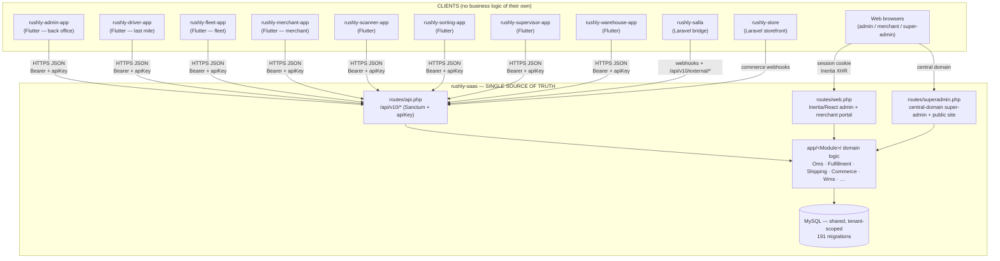
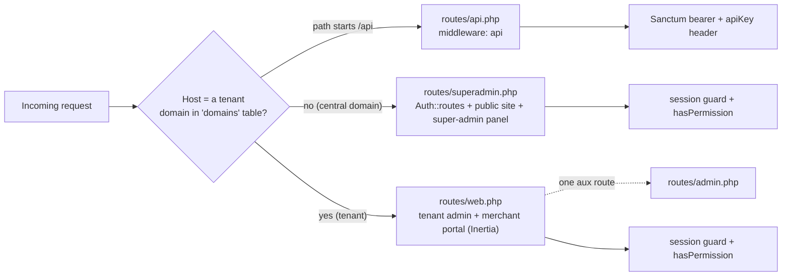
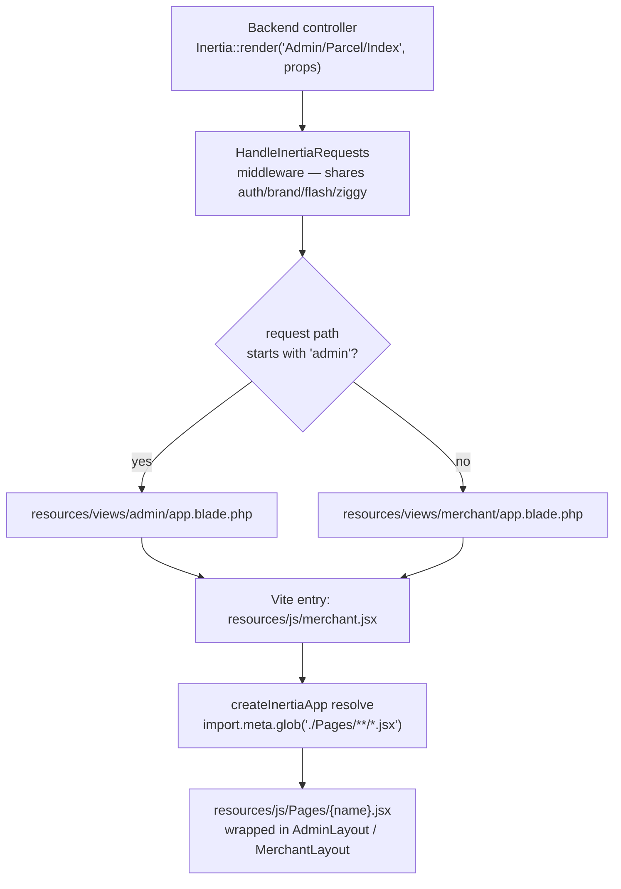

# rushly-saas — Backend Platform (SSOT)

> **Scope of this doc.** This is the *app-level index* for the Rushly backend platform itself
> — treated as one "app" in the Rushly ecosystem. It explains the platform's role as the
> **Single Source of Truth (SSOT)**, its Inertia/React admin web (`resources/js/Pages`), its
> five route surfaces (web / admin / superadmin / api / tenant), and how every client (the 8
> Flutter apps + 2 Laravel satellites) connects to it.
>
> It is an **overview that cross-links** the numbered reference docs — it deliberately does *not*
> repeat their content. For depth, follow the links to
> [`../05-System-Architecture.md`](../05-System-Architecture.md),
> [`../06-Database.md`](../06-Database.md),
> [`../07-Laravel.md`](../07-Laravel.md),
> [`../09-API.md`](../09-API.md),
> [`../10-Authentication.md`](../10-Authentication.md), and
> [`../11-Modules.md`](../11-Modules.md).
>
> Grounding: every non-trivial claim below cites a real source file. Where the repo's own
> markdown disagrees with the code, the code wins and the conflict is flagged
> **⚠️ Doc vs Code**. Compiled and verified against the codebase on 2026-07-27.

---

## 1. What rushly-saas *is*

`rushly-saas` (`/var/www/rushly-saas`) is a **multi-tenant logistics + order-management
platform**: a Laravel monolith with a scoped-namespace module architecture (`app/<Module>/`)
and an Inertia.js + React admin/merchant web front-end. It is the **only system in the Rushly
ecosystem that owns data and business logic** — every other Rushly project is a *client* that
reads from and writes to it over HTTP.

| Fact | Value | Source |
|---|---|---|
| Framework | **Laravel `^10.10`** | `composer.json` |
| PHP | `^8.1` | `composer.json` |
| Front-end | Inertia.js `^2.0` + React 18, Ziggy `^2.6`, Vite | `composer.json`, `resources/js/merchant.jsx` |
| Multi-tenancy | stancl/tenancy `^3.7`, subdomain identification | `composer.json`, `config/tenancy.php` |
| API auth | laravel/sanctum `^3.2` (bearer) + static `apiKey` header | `composer.json`, `app/Http/Kernel.php` |
| Web auth | single `web` guard, `session` driver | `config/auth.php` |
| Route files | `web.php` (1545 ln), `superadmin.php` (441), `api.php` (410), `tenant.php` (29), `admin.php` (9), `console.php`, `channels.php` | `routes/` |
| React pages | **191** `.jsx` — 169 Admin, 21 Merchant, 1 SuperAdmin | `resources/js/Pages/` |
| Scale | 191 migrations · 120 models · 219 controllers · 60 services · ~94k LOC in `app/` | `docs/_CONTEXT_BRIEF.md` |

### ⚠️ Doc vs Code — the Laravel version

`README.md` line 1 says *"Laravel 12 monolith"* and the "Getting started" section repeats
*"Standard Laravel 12 application."* **This is wrong.** `composer.json` pins
`laravel/framework: ^10.10` and the dev toolchain (`nunomaduro/collision ^7.0`,
`phpunit/phpunit ^10.1`, `spatie/laravel-ignition ^2.0`) is the Laravel-10 generation.
**Treat this platform as Laravel 10.** See [`../07-Laravel.md` §0](../07-Laravel.md) for the
full version-reality breakdown.

---

## 2. Role as SSOT: how everything connects

Rushly is *one integrated platform*, not a set of independent apps. `rushly-saas` holds the
canonical database, the domain models (Parcel, Order, Merchant, Hub, Deliveryman, WMS stock,
invoices, wallets…) and all business rules. Every other project is a thin client.



The Flutter apps are enumerated in [`../08-Flutter.md`](../08-Flutter.md) and
`MOBILE_APPS.md`; the app-to-app topology is detailed in
[`../05-System-Architecture.md` §6](../05-System-Architecture.md) and
`RUSHLY_APPS_OVERVIEW.md`. **Never analyze a client app in isolation** — its screens are views
onto data and endpoints that live here.

---

## 3. Multi-tenancy — the platform's foundation

Tenancy is provided by **stancl/tenancy `^3.7`** (`config/tenancy.php`):

- **Identification is by domain / subdomain.** Each operating company gets its own subdomain
  (e.g. `{tenant}.rushly.tech`); the *central* domains are `127.0.0.1` and `localhost`
  (`config/tenancy.php` → `central_domains`).
- **Tenant model** = `App\Models\Tenant`; **IDs are UUIDs**
  (`id_generator => Stancl\Tenancy\UUIDGenerator`).
- **⚠️ Shared database, not database-per-tenant.** The `DatabaseTenancyBootstrapper` is
  **commented out** in `config/tenancy.php` — only the Cache / Filesystem / Queue
  bootstrappers are active. In practice tenancy here is *row-scoped within one shared MySQL
  database*, not a physically separate DB per tenant. This is the single most important
  architectural nuance of the platform; it is analyzed in full in
  [`../06-Database.md` §1](../06-Database.md) and
  [`../05-System-Architecture.md` §4.1](../05-System-Architecture.md).
- **Central vs tenant routing.** Wiring is in `app/Providers/RouteServiceProvider.php` and the
  host-check at the top of `routes/superadmin.php` (see §4.3 below).

`routes/tenant.php` exists but its route group is **entirely commented out** — the platform
does *not* use the package's default tenant-route file; tenant vs central behavior is decided
inside `web.php`/`superadmin.php` via a runtime host lookup instead. Registered tenancy events
and lifecycle hooks live in `app/Providers/TenancyServiceProvider.php`
(see [`../05-System-Architecture.md` §4.3](../05-System-Architecture.md)).

---

## 4. Route surfaces — the five entry points

All non-console routing is registered in **`app/Providers/RouteServiceProvider.php`**:

```php
Route::prefix('api')->middleware('api')->group(base_path('routes/api.php'));
Route::middleware('web')->group(base_path('routes/web.php'));
Route::middleware('web')->group(base_path('routes/admin.php'));
Route::middleware('web')->group(base_path('routes/superadmin.php'));
public const HOME = '/summary';   // post-login landing for tenant admins
```

Note that `admin.php` and `superadmin.php` are **not** given a URL prefix at registration — any
prefixing happens *inside* those files. The complete, route-by-route listing is in the repo's
`ROUTES.md` (243 KB) and the endpoint reference in [`../09-API.md`](../09-API.md); this section
is the map, not the territory.



### 4.1 `routes/web.php` — the Inertia/React platform (1545 lines)

This is the main web application: the **tenant admin back-office** and the **merchant
self-service portal**. It is registered under the `web` middleware group and its controllers
return **Inertia responses** (`Inertia::render(...)`) that resolve to the React page tree in
`resources/js/Pages/`. It imports ~80 `App\Http\Controllers\Backend\*` controllers covering
parcels, WMS, hubs, merchants, finance/accounts, NDR, fraud, ZATCA, SMS, label templates, and
the merchant-panel (`Backend\MerchantPanel\*`) and hub-panel (`Backend\HubPanel\*`) surfaces.
Per-route access is gated with the `hasPermission:<perm>` middleware
(`app/Http/Middleware/PermissionCheckMiddleware.php`). Controller categorization is in
[`../07-Laravel.md` §2](../07-Laravel.md); the web-route layering (auth → subscription →
permission) is in [`../10-Authentication.md` §9.2](../10-Authentication.md).

### 4.2 `routes/admin.php` — a single auxiliary route (9 lines)

Despite the name, this file holds **one** route:
`GET /admin/parcels/{parcel}/details` → `Admin\ParcelController@details`
(named `admin.parcels.details`). The bulk of "admin" surfaces actually live in `web.php` under
the `admin.*` name space. Treat `admin.php` as a small overflow file, not the admin surface.

### 4.3 `routes/superadmin.php` — central-domain router + super-admin (441 lines)

This file is the **central-domain application**. Its top-level group
(`Route::middleware(['XSS', 'IsInstalled'])`) performs a **runtime host check**:

```php
$domain = in_array(request()->getHost(), Domain::pluck('domain')->toArray());
if (!$domain) {
    Auth::routes();                    // login / register / password reset
    // login OTP challenge routes (features.login_otp)
    // FrontendController public marketing site (/, /tracking, /about-us, …)
    // super-admin panel under prefix('super-admin') and prefix('admin')
}
```

So when the request host is **not** a registered tenant domain, this file serves: Laravel's
auth scaffolding, the two-step login-OTP challenge
(`App\Http\Controllers\Auth\LoginOtpController`), the public marketing/tracking site
(`Frontend\FrontendController`), and the **SaaS-owner super-admin** surfaces — plans, companies
(tenant provisioning), business-logic defaults, front-web CMS, integrations, salary, support.
Super-admin routes are individually guarded with `hasPermission:<perm>` (e.g. `plans_read`,
`company_create`, `integrations_update`). See `super-admin.md` and
[`../10-Authentication.md` §9.3](../10-Authentication.md).

> The super-admin surfaces are **almost entirely Blade** (`resources/views/backend/*`). Only
> one super-admin page has been migrated to React so far:
> `resources/js/Pages/SuperAdmin/BusinessLogic/FulfillmentDefaults/Index.jsx`
> (served by `Backend\Superadmin\FulfillmentDefaultsController`). The admin + merchant panels
> are the migrated-to-React surfaces; super-admin is mid-migration.

### 4.4 `routes/api.php` — the mobile + integration API (410 lines)

The `/api/v10/*` surface consumed by all 8 Flutter clients and the storefront bridges. It is
protected by a **two-factor gate**: a static `apiKey` header
(`App\Http\Middleware\CheckApiKeyMiddleware`) plus a **Sanctum bearer token**
(`auth:sanctum`), with `CheckAdminRole` for back-office endpoints and
`public.tracking.key` (`VerifyPublicTrackingApiKey`) for embeddable tracking. Consumer→surface
map, response envelope, and every endpoint are documented in
[`../09-API.md`](../09-API.md) and the repo's `INTEGRATIONS.md`. The API architecture summary is
in [`../05-System-Architecture.md` §5](../05-System-Architecture.md).

### 4.5 `routes/tenant.php`, `console.php`, `channels.php`

- **`tenant.php`** — the stancl/tenancy default file, but its route group is **fully commented
  out**. Not in use (see §3).
- **`console.php`** — Laravel default (only the `inspire` demo command). The platform's real
  artisan commands + scheduler live in `app/Console/` — see
  [`../07-Laravel.md` §13](../07-Laravel.md).
- **`channels.php`** — one broadcast channel, `App.Models.User.{id}` (per-user private
  channel). Broadcast driver defaults to `null` (`docs/_CONTEXT_BRIEF.md`), so broadcasting is
  effectively dormant.

---

## 5. The Inertia / React web front-end

The admin and merchant portals are a **single-page React app served through Inertia** — not a
separate SPA project. There is **one Vite entrypoint** shared by both surfaces.

### 5.1 Entry, root views, and the render pipeline



- **Root Blade views** decide the shell: `HandleInertiaRequests::rootView()` returns
  `admin.app` when the request path starts with `admin`, else `merchant.app`
  (`app/Http/Middleware/HandleInertiaRequests.php:13`). Both Blade files
  (`resources/views/admin/app.blade.php`, `resources/views/merchant/app.blade.php`) load the
  **same** Vite bundle: `resources/js/merchant.jsx` + `resources/css/merchant.css`.
- **Client entry** `resources/js/merchant.jsx` calls `createInertiaApp`, resolves pages via
  `import.meta.glob('./Pages/**/*.jsx')`, exposes Ziggy's `route()` as `window.route`, and
  wraps the app in a `TourProvider` (onboarding tours — see repo `TOURS.md`). It supports SSR
  hydration (`hydrateRoot` when the node already has children).
- **Brand-aware shell.** `admin/app.blade.php` resolves the tenant brand (name, logo, favicon,
  primary color `#a21f5c`) server-side via the `merchantBrand()` helper so there's no flash;
  the same data is shared to React as the `brand` Inertia prop
  (`HandleInertiaRequests::brand()`). This whitelabel/brand system is detailed in
  [`../15-Brand-System.md`](../15-Brand-System.md).
- **Vite tags are emitted manually** (not `@vite`) via `global_asset()` and a `file_exists`
  guard — a deliberate workaround so stancl/tenancy's asset-URL rewriting doesn't 404 the
  bundle, and so a missing build manifest doesn't 500 the page (see the comment block in
  `resources/views/admin/app.blade.php`).

### 5.2 Page tree (`resources/js/Pages/` — 191 pages)

| Surface | Pages | Root view | Layout |
|---|---:|---|---|
| `Pages/Admin/*` | 169 | `admin.app` | `resources/js/Layouts/AdminLayout.jsx` |
| `Pages/Merchant/*` | 21 | `merchant.app` | `resources/js/Layouts/MerchantLayout.jsx` |
| `Pages/SuperAdmin/*` | 1 | `merchant.app` | — |

Admin page directories mirror the domain modules — `Parcel`, `Wms`, `Ndr`, `Fraud`, `Hub`,
`Merchant`, `Payout`, `Salary`, `Account`, `Shipping`, `Commerce`, `Oms`, `Tms`, `Zatca`,
`Performance`, `Reports`, `Support`, `KnowledgeBase`, `Tours`, `Settings`, `Integrations`,
`GeneralSettings`, `Subscription`, and more. Merchant covers `Parcel`, `Shops`, `Invoice`,
`PaymentReceived`, `Accounts`, `Reports`, `Settings`, `Support`, `KnowledgeBase`, `Dashboard`.
Shared building blocks live in `resources/js/Components/` (incl. `GlobalSearch.jsx`, `ui/`,
`wms/`, `parcel/`, `merchant/`), with i18n + utilities in `resources/js/lib/`. UI/UX detail is
in [`../16-UI-UX.md`](../16-UI-UX.md).

> **⚠️ Legacy Vue stub.** `resources/js/app.js` is the *original Laravel/Vue* scaffold and is
> not the live entrypoint — the app is React via `merchant.jsx`. The lowercase
> `resources/js/components/ExampleComponent.vue` is likewise dead scaffolding. The Blade→React
> migration is ongoing (`docs/inertia/`); many super-admin and installer screens are still
> Blade under `resources/views/`.

### 5.3 Inertia shared props (every page receives these)

`app/Http/Middleware/HandleInertiaRequests.php::share()` injects, on every response:
`auth.user` (id, name, email, image, `user_type`) and `auth.permissions` (flat array from the
`users.permissions` JSON — **UX-only**, server middleware stays authoritative); `brand`;
`impersonator` (drives the "viewing as X" banner for the impersonation feature); `app`
(name, locale); `flash` (success/error/warning/message/errors_list); and `ziggy` (named-route
table + current location). Auth model detail is in
[`../10-Authentication.md`](../10-Authentication.md).

---

## 6. Authentication & authorization at a glance

- **Web:** a single `web` guard, `session` driver, `users` provider — `config/auth.php` defines
  **no** `api` guard block (Sanctum uses its own). Login/register/password-reset come from
  `Auth::routes()` in `superadmin.php`; the post-login landing is `/summary`
  (`RouteServiceProvider::HOME`).
- **Two-step login OTP:** feature-flagged (`config/features.php` → `login_otp`,
  env `FEATURE_LOGIN_OTP`, default **off**). When on, staff users (Admin/SuperAdmin) get a
  6-digit emailed code; merchants and deliverymen skip it. Handled by `Auth\LoginOtpController`.
- **API:** Sanctum bearer + static `apiKey` header (two-factor gate), plus `CheckAdminRole` and
  `public.tracking.key` for specific surfaces.
- **Authorization:** a **custom permission system** — permissions are a JSON array on the
  `users` row, checked by the `hasPermission:<perm>` route middleware
  (`PermissionCheckMiddleware`) and the `hasPermission()` helper. This is *not* Laravel Gates or
  spatie/permission for the main flow.
- Full guard/provider/permission/OTP/social-login breakdown, plus the permission matrix by user
  type, is in [`../10-Authentication.md`](../10-Authentication.md). Security posture is in
  [`../17-Security.md`](../17-Security.md).

Custom middleware aliases registered in `app/Http/Kernel.php`: `hasPermission`, `XSS`,
`CheckApiKey`, `CheckAdminRole`, `headersCheck`, `IsInstalled`, `IsNotInstalled`,
`subscriptionCheck`, `salla.webhook`, `public.tracking.key`.

---

## 7. Module architecture (the domain core)

Business logic lives in **scoped-namespace modules under `app/<Module>/`**, each following the
convention `Contracts/ + DTOs/ + Providers|Strategies/ + Services/ + Models/ + Events/ +
Listeners/`. Adding a capability is meant to be "drop a class in, add a config row." The
canonical index — with source roots, maturity, and per-module docs — is
[`../11-Modules.md`](../11-Modules.md). Summary of the principal modules:

| Module | Source root | Role | Deep-dive |
|---|---|---|---|
| Orders / OMS | `app/Oms/` | Canonical `Order` + normalization pipeline | `OMS.md`, [`../11`](../11-Modules.md) §1 |
| Shipping | `app/Shipping/` | Generic courier abstraction (Factory) — first provider Logestechs | `docs/shipping-architecture.md`, [`../11`](../11-Modules.md) §2 |
| Fulfillment | `app/Fulfillment/` | Router + Strategies (WMS / 3PL / merchant-self) | `FULFILLMENT.md`, [`../11`](../11-Modules.md) §4 |
| Commerce | `app/Commerce/` | Storefront ingestion (feature-flagged) | `COMMERCE.md`, [`../11`](../11-Modules.md) §5 |
| WMS | `app/Wms/` + `app/Models/Backend/Wms/*` | Warehouse mgmt + stock observers | [`../11`](../11-Modules.md) §6 |
| Salla bridge | `app/Salla/` | Salla-specific ingest + fulfillment | `INTEGRATIONS.md` |
| Accounting sync | `app/Qoyod/`, `app/Daftra/`, `app/Odoo/` | Per-tenant live accounting sync | `ACCOUNTING.md`, [`../14`](../14-Integrations.md) |
| ZATCA | `app/Services/Zatca/` | Saudi e-invoicing Phase 1 | [`../11`](../11-Modules.md) §8 |
| Performance | `app/Services/Performance/` | KPI / analytics | [`../20`](../20-Performance.md) |
| Legacy 3PL | `app/Services/` (Aramex, Jet, Zajel, Panda…) | Per-provider services — being superseded by `app/Shipping/` | `3PL.md` |

The flagship end-to-end flow is **Storefront → parcel**: a Commerce webhook →
OMS `OrderReceived` → Fulfillment strategy → Shipping / WMS / vendor. The event/listener chains
are mapped in [`../05-System-Architecture.md` §7](../05-System-Architecture.md); the workflows
in [`../12-Workflows.md`](../12-Workflows.md); module internals in
[`../11-Modules.md`](../11-Modules.md).

Two feature flags gate not-yet-stable subsystems (`config/features.php`): `commerce_layer`
(`FEATURE_COMMERCE_LAYER`, default off) and `login_otp` (`FEATURE_LOGIN_OTP`, default off).

Service providers (`app/Providers/` + module SPs) are registered in `config/app.php`:
`AppServiceProvider`, `ViewServiceProvider`, `AuthServiceProvider`, `EventServiceProvider`,
`RouteServiceProvider`, `TenancyServiceProvider`, `IntegrationConfigServiceProvider` (overlays
DB `integration_settings` onto `config('services.*')`), `ZatcaServiceProvider`,
`Shipping\ShippingServiceProvider`, and `Commerce\CommerceServiceProvider`.

---

## 8. Data layer

One **shared MySQL database**, tenant-scoped by row (see §3). ~112 live tables across 191
migrations spanning identity/tenancy, core logistics (parcels/merchants/hubs/drivers), finance
(invoices/statements/wallets), the Commerce→OMS→Fulfillment→Shipping pipeline, WMS, and
exceptions/fleet/integrations. The full ER diagrams, data dictionary, and soft-delete/enum
notes are in [`../06-Database.md`](../06-Database.md). Repositories (`app/Repositories/`) and
the service layer sit between controllers and Eloquent — see
[`../07-Laravel.md` §3–4](../07-Laravel.md).

---

## 9. How each client connects (quick reference)

| Client | Path | Connects via | Auth |
|---|---|---|---|
| rushly-admin-app | `/var/www/rushly-admin-app` | `/api/v10/admin/*` | Sanctum bearer + apiKey + `CheckAdminRole` |
| rushly-driver-app | `/var/www/rushly-driver-app` | `/api/v10/*` (deliveryman) | Sanctum bearer + apiKey |
| rushly-fleet-app | `/var/www/rushly-fleet-app` | `/api/v10/*` (fleet) | Sanctum bearer + apiKey |
| rushly-merchant-app | `/var/www/rushly-merchant-app` | `/api/v10/*` (merchant) | Sanctum bearer + apiKey |
| rushly-scanner / sorting / warehouse | resp. dirs | `/api/v10/wms/*` shared scanner surface | Sanctum bearer + apiKey |
| rushly-supervisor-app | `/var/www/rushly-supervisor-app` | `/api/v10/*` | Sanctum bearer + apiKey |
| rushly-salla | `/var/www/rushly-salla` | `/api/v10/external/*` + webhooks | `salla.webhook` signature + apiKey |
| rushly-store | `/var/www/rushly-store` | commerce webhooks | webhook auth |
| Web browsers | — | `web.php` (tenant) / `superadmin.php` (central) via Inertia | session cookie |

Endpoint-level detail per consumer is in [`../09-API.md` §4](../09-API.md); the client apps
themselves in [`../08-Flutter.md`](../08-Flutter.md) and `MOBILE_APPS.md`.

---

## 10. Where to go next (cross-link map)

| To understand… | Read |
|---|---|
| System topology, tenancy, events/jobs, middleware, providers | [`../05-System-Architecture.md`](../05-System-Architecture.md) |
| Schema, ER diagrams, data dictionary, tenancy-in-DB | [`../06-Database.md`](../06-Database.md) |
| Controllers, services, repositories, strategies, enums, request lifecycle | [`../07-Laravel.md`](../07-Laravel.md) |
| The Flutter client apps | [`../08-Flutter.md`](../08-Flutter.md) |
| `/api/v10/*` reference, envelopes, consumer map | [`../09-API.md`](../09-API.md) |
| Guards, permissions, login OTP, social login, matrix | [`../10-Authentication.md`](../10-Authentication.md) |
| Module-by-module index + maturity matrix | [`../11-Modules.md`](../11-Modules.md) |
| Integrations (Salla / storefront / accounting) | [`../14-Integrations.md`](../14-Integrations.md) |
| Brand / whitelabel system | [`../15-Brand-System.md`](../15-Brand-System.md) |
| UI/UX of the React portals | [`../16-UI-UX.md`](../16-UI-UX.md) |
| Repo-root primary sources | `README.md`, `ARCHITECTURE.md`, `ROUTES.md`, `RUSHLY_APPS_OVERVIEW.md`, `INTEGRATIONS.md` |

---

## Sources

Files and directories opened while writing this doc:

- `composer.json`, `README.md` — stack, version conflict (Laravel 10 vs README's "12")
- `docs/_CONTEXT_BRIEF.md` — shared ground-truth metrics
- `routes/` — `web.php` (head + sizing), `superadmin.php` (host-check group + super-admin), `admin.php`, `api.php` (head), `tenant.php` (commented-out), `console.php`, `channels.php`
- `app/Providers/RouteServiceProvider.php` — route registration + `HOME = /summary`
- `app/Providers/` (listing) + `config/app.php` — registered service providers
- `config/tenancy.php` — subdomain identification, central domains, UUID ids, bootstrappers (Database bootstrapper commented out)
- `config/auth.php` — single `web`/session guard, no `api` guard
- `config/features.php` — `commerce_layer`, `login_otp` flags
- `app/Http/Kernel.php` — custom middleware aliases
- `app/Http/Middleware/HandleInertiaRequests.php` — root-view switch (`admin.app`/`merchant.app`), shared props, brand
- `resources/views/admin/app.blade.php`, `resources/views/merchant/app.blade.php` — Inertia root shells, manual Vite tag emission
- `resources/js/merchant.jsx` — Inertia+React entrypoint; `resources/js/app.js` (legacy Vue stub)
- `resources/js/Pages/` (Admin/Merchant/SuperAdmin trees, 191 jsx), `resources/js/Layouts/`, `resources/js/Components/`, `resources/js/lib/`
- Numbered reference docs cross-linked: `docs/05`, `06`, `07`, `08`, `09`, `10`, `11`, `14`, `15`, `16`, `17`, `20`
