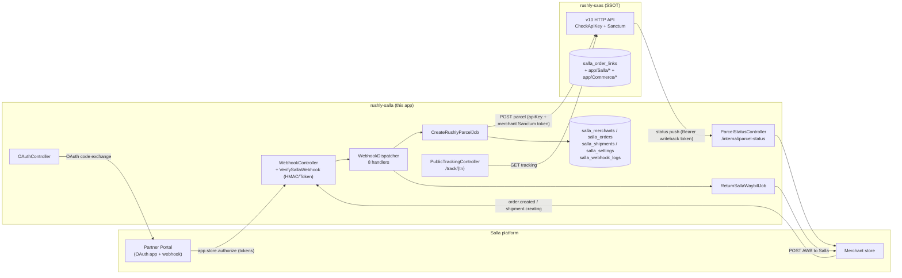
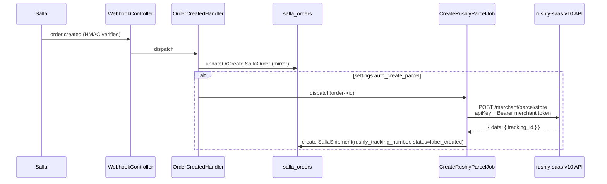
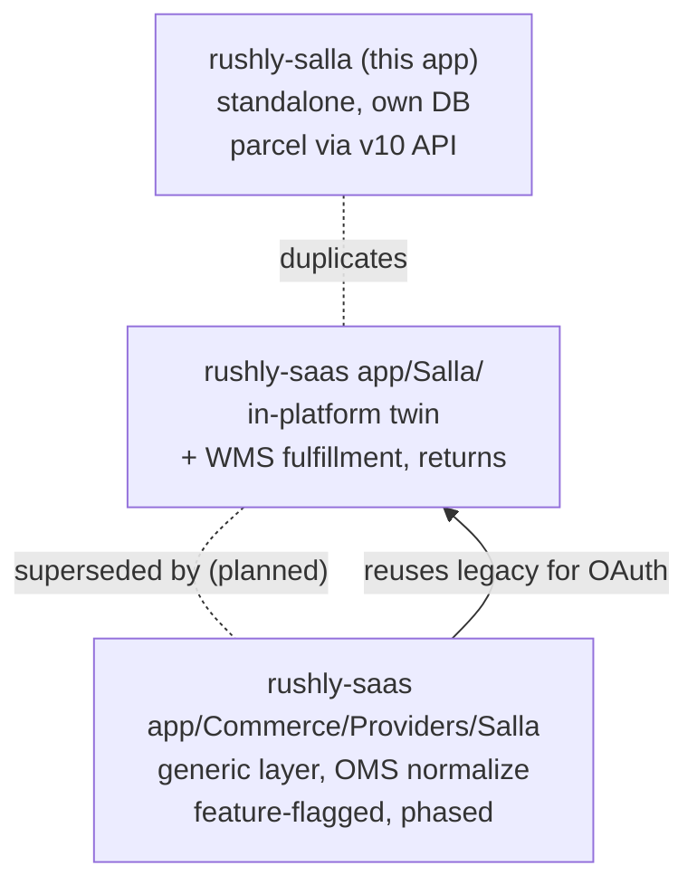

# rushly-salla — Salla ↔ Rushly Bridge

> **Project root:** `/var/www/rushly-salla` · **Type:** standalone Laravel 10 app (NOT part of `rushly-saas`) · **Namespace:** `App\` (default skeleton, PSR-4 `app/`)
> **Role:** A thin OAuth + webhook bridge that connects a **Salla** merchant store to the **rushly-saas** logistics platform. It receives Salla webhooks, mirrors orders locally, creates Rushly parcels via the rushly-saas **v10 HTTP API**, writes the Rushly waybill (AWB) back to Salla, and serves a public `/track/{trackingNumber}` page.
> **Ground truth:** verified against source on 2026-07-27. `rushly-saas` is the single source of truth (see [`../_CONTEXT_BRIEF.md`](../_CONTEXT_BRIEF.md)); this app is a **client** of its API and holds only bridge-local state.

**Cross-links:** [14-Integrations](../14-Integrations.md) (integration catalogue) · [../modules/commerce-integrations.md](../modules/commerce-integrations.md) (the in-platform Commerce/Salla path this app duplicates) · [09-API](../09-API.md) (the v10 API consumed) · [10-Authentication](../10-Authentication.md) (`apiKey` + Sanctum) · [06-Database](../06-Database.md) · [../modules/oms-orders.md](../modules/oms-orders.md) · [../modules/parcels.md](../modules/parcels.md)

---

## 1. What this app is (and is not)

`rushly-salla` is a **separate Laravel application** with its own database, its own `composer.json`, its own routes, and its own deploy target (`https://salla.rushly.test` per `.env.example`). It is not a module inside `rushly-saas`. It talks to `rushly-saas` **only over HTTP** — there is no shared database, no shared code, no tenancy package.

It exists to solve one problem: Salla's Partner Portal requires a single OAuth app + webhook endpoint per Salla app registration, and that endpoint must be a stable public URL that authenticates Salla's HMAC-signed webhooks and speaks Salla's OAuth2 dance. This app is that endpoint.

| Responsibility | Where | Source |
|---|---|---|
| OAuth install (Easy/Custom mode) | `GET /oauth/redirect`, `GET /oauth/callback` | `app/Http/Controllers/OAuthController.php` |
| Webhook receiver (`app.*` / `order.*` / `shipment.*`) | `POST /webhooks/salla` | `app/Http/Controllers/WebhookController.php`, `app/Webhooks/WebhookDispatcher.php` |
| Order → Rushly parcel sync | queued job on `order.created` | `app/Jobs/CreateRushlyParcelJob.php`, `app/Services/RushlyApiClient.php` |
| AWB writeback (Rushly TN → Salla waybill) | queued job on `shipment.creating` | `app/Jobs/ReturnSallaWaybillJob.php`, `app/Services/SallaApiClient.php` |
| Parcel-status writeback (Rushly → Salla) | `POST /internal/parcel-status` | `app/Http/Controllers/Internal/ParcelStatusController.php` |
| Public tracking page | `GET /track`, `GET /track/{tn}` | `app/Http/Controllers/PublicTrackingController.php` |
| Operator dashboard | `GET /dashboard` | `app/Http/Controllers/DashboardController.php` |

**It does NOT:** decide fulfillment strategy, mutate WMS stock, normalize orders into the canonical OMS `Order`, or hold any tenant business logic. All of that lives in `rushly-saas`. This app only mirrors enough of a Salla order to POST a parcel and to render a tracking page.

### ⚠️ Doc vs Code — Laravel version
`composer.json` pins `laravel/framework: ^10.10` and `php: ^8.1`. Any claim of "Laravel 12" (a common README boilerplate) is wrong for this repo — **code wins: Laravel 10**. Dev tooling: `phpunit ^10.1`, `laravel/pint`, `nunomaduro/collision ^7`, `spatie/laravel-ignition ^2`. The only non-skeleton runtime dependency is `salla/ouath2-merchant: ^2.0` (Salla's OAuth2 client; note the upstream typo "ouath" in the package name).

---

## 2. Where this sits in the ecosystem



**Two independent Salla integrations exist** — this standalone bridge AND an in-platform path (`app/Salla/` + `app/Commerce/Providers/Salla/`) inside `rushly-saas`. They overlap heavily. See [§9 The duplication](#9-the-duplication--three-salla-code-paths).

---

## 3. OAuth install flow

Source: `app/Http/Controllers/OAuthController.php`, `config/salla.php`.

Salla supports two authorization modes, switched by `SALLA_AUTHORIZATION_MODE` (`config('salla.authorization_mode')`, default `easy`):

### Easy Mode (default)
The **webhook is authoritative** for token delivery, not the browser redirect.

1. Merchant installs the app from the Salla marketplace.
2. Salla fires the `app.store.authorize` **webhook** carrying `access_token` / `refresh_token` / `expires` / `scope` → handled by `AppStoreAuthorizeHandler` which `updateOrCreate`s the `salla_merchants` row.
3. The browser `GET /oauth/callback` is treated as a **landing page only** — the state/CSRF check is deliberately skipped, the `oauth2state` session key is cleared, and the user is redirected to `/dashboard` with a "tokens delivered via webhook" flash. It tolerates a callback with `code`+`state` **or** with no params at all (direct marketplace install). See `OAuthController::callback()` lines 42–52.

### Custom Mode (`SALLA_AUTHORIZATION_MODE != easy`)
Classic OAuth2 authorization-code flow, done in-app via `salla/ouath2-merchant`:

1. `GET /oauth/redirect` builds `Salla::getAuthorizationUrl(['scope' => 'offline_access'])`, stashes `oauth2state` in session, redirects to Salla.
2. `GET /oauth/callback` validates `state` with `hash_equals` (CSRF), exchanges `code` → `AccessToken`, fetches the resource owner (merchant profile), and `updateOrCreate`s `salla_merchants` with tokens + store metadata (name, domain, owner email, `token_expires_at`). `SallaSettings::firstOrCreate` seeds a settings row.

On any failure `OAuthController::fail()` logs `salla.oauth.callback.failed` and, when `APP_DEBUG`, renders `resources/views/errors/oauth.blade.php`; otherwise `abort($status)`.

> ⚠️ **Doc vs Code — scope breadth.** README's Partner Portal table lists required scopes `offline_access`, `orders.read`, `shipments.read_write`, but `OAuthController::redirect()` requests only `scope=offline_access` in the authorization URL (Custom Mode). Salla grants scopes configured in the Partner Portal regardless, so this is not necessarily a runtime bug — but the code does not itself request the order/shipment scopes.

---

## 4. Webhook receiver

Source: `routes/web.php`, `app/Http/Middleware/VerifySallaWebhook.php`, `app/Http/Controllers/WebhookController.php`, `app/Webhooks/WebhookDispatcher.php`.

```
POST /webhooks/salla   →  middleware 'salla.webhook' (VerifySallaWebhook)  →  WebhookController::__invoke  →  WebhookDispatcher::dispatch
```

### 4.1 Signature verification (`VerifySallaWebhook`)
Reads `X-Salla-Security-Strategy` header (defaults to `Signature`):

- **Signature strategy (HMAC-SHA256):** `hash_hmac('sha256', $request->getContent(), $secret)` compared with the `X-Salla-Signature` header via `hash_equals`. `$secret` = `config('salla.webhook_secret')` (`SALLA_WEBHOOK_SECRET`).
- **Token strategy:** `hash_equals($secret, Authorization header)`.
- Missing secret → persists a `rejected`/`missing_secret` log and `abort(500)`.
- Bad sig/token → persists `rejected` with `invalid_signature`/`invalid_token` and `abort(401)`.

On success it stamps `salla_webhook_received_at` and `salla_webhook_strategy` request attributes and passes through. Note `/webhooks/salla` is a **web** route, so it runs the web middleware group including `VerifyCsrfToken` — Salla webhooks carry no CSRF token, so `POST /webhooks/salla` must be CSRF-exempt.

> ⚠️ **Verify in deploy:** `app/Http/Middleware/VerifyCsrfToken.php` must list `webhooks/salla` (and `internal/parcel-status`) in `$except`, otherwise inbound webhooks 419. The route is registered under `web.php`, not `api.php`. Confirm the exception array in the running deploy.

### 4.2 Dispatch + logging (`WebhookController` + `WebhookDispatcher`)
`WebhookDispatcher` is a static map of `event name → handler class` (`app/Webhooks/WebhookDispatcher.php`):

| Salla event | Handler | Effect |
|---|---|---|
| `app.installed` | `AppInstalledHandler` | upsert merchant (keyed on `data.app_id`), seed `SallaSettings` |
| `app.store.authorize` | `AppStoreAuthorizeHandler` | upsert merchant **with tokens** (Easy-mode token delivery) |
| `app.uninstalled` | `AppUninstalledHandler` | `installed=false`, `uninstalled_at=now`, null out tokens |
| `order.created` | `OrderCreatedHandler` | mirror order → `salla_orders`; if `auto_create_parcel`, dispatch `CreateRushlyParcelJob` |
| `order.updated` | `OrderUpdatedHandler` | update mirrored order status + payload |
| `order.cancelled` | `OrderCancelledHandler` | set mirrored order `status='cancelled'` |
| `shipment.creating` | `ShipmentCreatingHandler` | dispatch `ReturnSallaWaybillJob` (AWB writeback) |
| `shipment.cancelled` | `ShipmentCancelledHandler` | set matching `salla_shipments.status='cancelled'` |

Unknown events log `salla.webhook.unhandled` and return `false` (recorded as `unhandled`, not an error).

`WebhookController::__invoke` wraps the dispatch in try/catch, then **always** writes a `salla_webhook_logs` row with `status` ∈ {`handled`, `unhandled`, `failed`}, sanitized payload/headers (secrets redacted — see `SallaWebhookLog::sanitisePayload`/`sanitiseHeaders`), `duration_ms`, and `ip`. It returns `{"ok": <bool>}` — `ok=false` only when the handler threw. Handler failures do **not** propagate a 5xx to Salla (Salla sees 200 with `ok:false`); the retry surface is the queue job's `$tries=3`, not Salla's webhook retry.

Merchant id resolution across the payload is defensive: `payload['merchant'] ?? data.merchant.id ?? data.store.id` (`WebhookController::merchantId`, mirrored in the middleware).

---

## 5. Order → Rushly parcel sync

Sources: `app/Webhooks/Handlers/OrderCreatedHandler.php`, `app/Jobs/CreateRushlyParcelJob.php`, `app/Services/RushlyApiClient.php`, `config/rushly.php`.



### 5.1 Order mirroring (`OrderCreatedHandler`)
Resolves the local merchant by `salla_merchant_id`. If unknown, logs `salla.order.created.unknown_merchant` (hint: `app.store.authorize` never ran — a **race**: an order webhook can arrive before the store is authorized) and returns without creating anything.

Otherwise `updateOrCreate`s a `salla_orders` row keyed on `(salla_merchant_id, salla_order_id)`, extracting `reference_id`, `status.name`, customer name/mobile, `shipping.address.street`/`city`, `total.amount`/`currency`, and storing the **full raw `data`** in the `payload` JSON column.

Parcel creation is **gated by `settings.auto_create_parcel`** (`salla_settings.auto_create_parcel`, default `true`). If enabled, `CreateRushlyParcelJob::dispatch($order->id)`.

> Note: `salla_settings` also has a `trigger_status` column (default `payment_pending`, migration `..._create_salla_settings_table.php`) that is **not read** by any handler — `OrderCreatedHandler` fires on `order.created` regardless of order status. This is dormant config. **Not found in the current codebase:** any code path reading `trigger_status`.

### 5.2 The job (`CreateRushlyParcelJob`)
`ShouldQueue`, `$tries=3`, `$backoff=30`. Idempotency guard: returns early if `!$order || $order->shipment` (a shipment already exists). Calls `RushlyApiClient::createParcelFromOrder($order->merchant, $order)`, reads `data.tracking_id` from the response, and creates a `salla_shipments` row (`status='label_created'`, `last_rushly_status='pending'`).

> ⚠️ **Silent-fallback risk.** If the Rushly response lacks `data.tracking_id`, the job **fabricates** a tracking number `RX-<10 random chars>` (`CreateRushlyParcelJob` line 32) and persists it as if real. This masks a malformed/failed-but-2xx API response and creates a phantom parcel that will never match a real Rushly parcel. `RushlyApiClient::createParcelFromOrder` does throw on non-2xx, so this only bites on a 2xx-with-unexpected-body.

### 5.3 The Rushly API call (`RushlyApiClient`)
Builds the parcel payload from merchant settings with config fallbacks:

| Payload field | Source |
|---|---|
| `shop_id` | `settings.default_rushly_shop_id` ?? `merchant.rushly_shop_id` |
| `city_id` | `settings.default_city_id` ?? `config('rushly.defaults.city_id')` |
| `category_id` | `settings.default_category_id` ?? `config('rushly.defaults.category_id')` |
| `delivery_type_id` | `settings.default_delivery_type_id` ?? config default |
| `customer_name` / `customer_address` / `customer_phone` | mirrored `salla_orders` columns |
| `cash_collection` | `(float) order.total` (**whole order total is treated as COD**) |
| `external_ref` | `salla:<salla_order_id>` |

Request headers (`RushlyApiClient::request`): `apiKey: <RUSHLY_API_KEY>` (satisfies `CheckApiKeyMiddleware` in rushly-saas — see [10-Authentication](../10-Authentication.md)) **and** `Authorization: Bearer <merchant.rushly_merchant_token>`. The Sanctum bearer is a **per-merchant** token (`salla_merchants.rushly_merchant_token`) so the parcel is created under the correct merchant user in rushly-saas. If that token is null the job throws a `RuntimeException` (the token must be provisioned out-of-band — nothing in this app sets it; see [§8](#8-configuration--environment)).

**Endpoint & base:** `POST {RUSHLY_API_BASE}/merchant/parcel/store` where `RUSHLY_API_BASE` defaults to `https://admin.rushly.test/api/v10`.

> ⚠️ **Doc vs Code — endpoint path divergence (high-value).** The bridge posts to `…/api/v10/**merchant/parcel/store**`, but the rushly-saas route table (`rushly-saas/routes/api.php`) exposes the merchant parcel-create endpoint as **`v10/parcel/store`** (`ParcelController@store`, inside the `v10` + `CheckApiKey` + `auth:sanctum` group) — there is **no `merchant/` path segment**. rushly-saas also has a purpose-built **`v10/external/salla/parcel`** (`SallaParcelController@store`, `CheckApiKey` only) which this bridge does **not** use. So the bridge neither hits the generic merchant route (wrong prefix) nor the dedicated Salla external route. Reconcile the exact live path against `rushly-saas/routes/api.php` before trusting this call in production; as written the path looks mismatched.

### 5.4 Tracking read
`RushlyApiClient::tracking($trackingId)` → `GET {RUSHLY_API_BASE}/parcel/tracking/{id}` with the `apiKey` header but **no bearer token** (`token: null`). Used by the public `/track` page (§7).

> ⚠️ In rushly-saas, `v10/parcel/tracking/{tracking_id}` (`ParcelController@parcelTrackingLogs`) sits inside a `CheckApiKey` group; the truly public, key-scoped endpoint is `/api/public/tracking/{tracking_id}` (`public.tracking.key` middleware, `PublicTrackingApiKey`). Confirm which one answers an apiKey-only, unauthenticated request. If `v10/parcel/tracking` requires Sanctum, the token-less call returns null and the `/track` page silently shows "no data."

---

## 6. AWB writeback (Rushly tracking number → Salla waybill)

Sources: `app/Webhooks/Handlers/ShipmentCreatingHandler.php`, `app/Jobs/ReturnSallaWaybillJob.php`, `app/Services/SallaApiClient.php`.

Salla fires `shipment.creating` when the merchant (or Salla) begins creating a shipment for an order, expecting the shipping app to return a waybill.

1. `ShipmentCreatingHandler` resolves merchant + mirrored `salla_orders` row (by `data.order_id ?? data.order.id`). Unknown merchant/order → warn + return. Otherwise `ReturnSallaWaybillJob::dispatch($order->id, $sallaShipmentId)`.
2. `ReturnSallaWaybillJob` (`$tries=3`) loads order+shipment; returns early if no local `salla_shipments` row exists yet (i.e. the parcel must have been created first — §5). Computes:
   - `awb = shipment.awb_number ?? shipment.rushly_tracking_number`
   - `label_url = shipment.label_url ?? {RUSHLY_PUBLIC_TRACKING_URL}/parcel/{rushly_tracking_number}/label`
3. `SallaApiClient::returnWaybill($sallaShipmentId, $awb, $labelUrl)` → `POST {SALLA_API_BASE}/shipments/{id}/awb` with `{awb_number, label_url}`, authenticated with the merchant's Salla `access_token` (`Http::withToken`). `SALLA_API_BASE` default `https://api.salla.dev/admin/v2`.
4. On success updates the local `salla_shipments` row: `salla_shipment_id`, `awb_number`, `label_url`, `status='awb_returned'`.

`SallaApiClient` also exposes `updateShipmentStatus($id, $status, $note)` → `POST /shipments/{id}/status` and `getOrder($id)` → `GET /orders/{id}`; all throw `RuntimeException` on non-2xx via `ensureSuccess`.

---

## 7. Public tracking page & status writeback

### 7.1 `/track` (public)
Source: `app/Http/Controllers/PublicTrackingController.php`, views `resources/views/track/landing.blade.php` + `track/show.blade.php`.

- `GET /track` — form (`track.landing`).
- `POST /track` — trims `tracking_number`, redirects to `track.show`.
- `GET /track/{trackingNumber}` — looks up a local `salla_shipments` row by `rushly_tracking_number` **or** `awb_number`, then calls `RushlyApiClient::tracking(...)` (§5.4) and renders `track.show` with the shipment + live tracking payload. Works even if no local shipment matches (falls back to the raw tracking number).

This is a **proxy** to Rushly's tracking API, not an independent tracking store.

### 7.2 `/internal/parcel-status` (inbound from rushly-saas)
Source: `app/Http/Controllers/Internal/ParcelStatusController.php`, middleware `app/Http/Middleware/InternalWritebackAuth.php`.

`POST /internal/parcel-status` (middleware `rushly.writeback`) is how **rushly-saas pushes parcel status changes back into this bridge** so the bridge can relay them to Salla. Auth = shared bearer token `RUSHLY_WRITEBACK_TOKEN` (`hash_equals`, must match `RUSHLY_SALLA_WRITEBACK_TOKEN` on the rushly-saas side per `.env.example`).

Validated body: `salla_merchant_id`, `salla_order_id`, optional `salla_shipment_id`/`tracking_id`, `rushly_status`, `salla_status`. It (a) updates the local `salla_shipments` row (`last_rushly_status`, `status`, `last_synced_at`) and (b) if `salla_shipment_id` is present, calls `SallaApiClient::updateShipmentStatus(...)` to push the mapped Salla status onto the Salla shipment (best-effort; failures are logged, not fatal).

> The Rushly→Salla **status mapping** (which Rushly parcel status becomes which `salla_status`) is decided **in rushly-saas** before it calls this endpoint — this app receives the already-mapped `salla_status`. Not found in this codebase: the mapping table itself.

---

## 8. Configuration & environment

Config files: `config/salla.php`, `config/rushly.php`. Env template: `.env.example`.

| Env var | Purpose | Default |
|---|---|---|
| `SALLA_OAUTH_CLIENT_ID` / `_SECRET` / `_REDIRECT_URI` | Salla OAuth app creds | — / — / `${APP_URL}/oauth/callback` |
| `SALLA_WEBHOOK_SECRET` | HMAC/Token webhook secret | — |
| `SALLA_AUTHORIZATION_MODE` | `easy` (webhook token delivery) or custom | `easy` |
| `SALLA_API_BASE` | Salla Admin API base | `https://api.salla.dev/admin/v2` |
| `SALLA_APP_ID` | Partner app id | — |
| `RUSHLY_API_BASE` | rushly-saas tenant v10 API base | `https://admin.rushly.test/api/v10` |
| `RUSHLY_API_KEY` | `apiKey` header for `CheckApiKeyMiddleware` | — |
| `RUSHLY_PUBLIC_TRACKING_URL` | base for label URLs + tracking links | `https://admin.rushly.test` |
| `RUSHLY_DEFAULT_CITY_ID` / `_DELIVERY_TYPE_ID` / `_CATEGORY_ID` | parcel defaults when a merchant has none | — |
| `RUSHLY_WRITEBACK_TOKEN` | shared bearer for `/internal/parcel-status` | — |
| `QUEUE_CONNECTION` | queue driver | `sync` (`.env.example`) |
| `DB_CONNECTION` | database | `mysql` |

**Provisioning gap:** `salla_merchants.rushly_merchant_token` and `rushly_shop_id` are **never written by this app's code** (no handler or controller sets them). They must be seeded out-of-band (manual, tinker, or a rushly-saas-side process) before `CreateRushlyParcelJob` can succeed — otherwise the job throws "has no Rushly merchant token." This is the operational coupling that binds a Salla merchant to a rushly-saas merchant user. **Not found in the current codebase:** the mechanism that populates these two fields.

> ⚠️ **DI wiring risk — `RushlyApiClient`.** `RushlyApiClient::__construct(string $baseUrl, string $apiKey)` takes two primitive strings, and a static `fromConfig()` factory exists — but **no container binding is registered** (`app/Providers/AppServiceProvider::register()` is empty). Yet `CreateRushlyParcelJob::handle(RushlyApiClient $client)` and `PublicTrackingController::show(..., RushlyApiClient $client)` type-hint it for **auto-resolution**. Laravel's container cannot auto-resolve unbound string constructor params, so these resolutions will throw `BindingResolutionException` at runtime unless a binding is added (e.g. `$this->app->bind(RushlyApiClient::class, fn () => RushlyApiClient::fromConfig())`). Confirm against the running app; as committed this looks broken. `SallaApiClient` is unaffected — it's always `new`'d manually with a `SallaMerchant`.

---

## 9. The duplication — three Salla code paths

This is the single most important architectural fact about Salla in the Rushly ecosystem: **the same Salla bridge logic is implemented three times.** See also [../modules/commerce-integrations.md](../modules/commerce-integrations.md) and [14-Integrations §Commerce](../14-Integrations.md).

| # | Location | Home | State | Status |
|---|---|---|---|---|
| 1 | **`rushly-salla/`** (this app) | standalone Laravel 10 app | own DB: `salla_merchants`, `salla_orders`, `salla_shipments`, `salla_settings`, `salla_webhook_logs` | Live standalone bridge |
| 2 | **`rushly-saas/app/Salla/`** | inside the platform | rushly-saas DB: same table names (see below) | In-platform mirror of the same bridge |
| 3 | **`rushly-saas/app/Commerce/Providers/Salla/`** | inside the platform, generic Commerce layer | `commerce_connections` / `webhook_events` | Phased rebuild (feature-flag `commerce_layer`, default OFF) |

### 9.1 vs `rushly-saas/app/Salla/` (near-identical twin)
`rushly-saas/app/Salla/` is a **structural clone** of this app, folded into the platform (`rushly-saas/app/Salla/{Http,Jobs,Models,Services,Webhooks}`):
- Same `OAuthController`, `WebhookController`, `VerifyWebhook` middleware.
- Same `WebhookDispatcher` + per-event handlers — but **more of them**: the in-platform version adds `AppUpdatedHandler`, `OrderRefundedHandler`, `OrderStatusUpdatedHandler`, and full return-shipment handlers (`ShipmentReturnCreatingHandler`, `ShipmentReturnCreatedHandler`, `ShipmentReturnCancelledHandler`). This bridge handles only the 8 core events.
- Same models (`Merchant`, `Order`, `Shipment`, `Settings`, `WebhookLog`) and same jobs (`CreateParcelJob`, `ReturnWaybillJob`) — renamed but 1:1.
- The in-platform version additionally has `SallaWmsFulfillmentService` + `ParcelCreationService` (real WMS-aware fulfillment), which this bridge lacks — this bridge just calls the v10 API and trusts it.
- **Table-name collision:** both apps define `salla_merchants` / `salla_orders` / `salla_shipments` / `salla_settings` / `salla_webhook_logs`. In rushly-saas, migration `..._rename_salla_orders_to_salla_order_links.php` renamed its `salla_orders` → `salla_order_links` (a link table between a Salla order and a canonical Rushly parcel), and `..._add_company_id_to_salla_merchants.php` adds tenancy. This bridge's `salla_orders` is a **full local mirror**, not a link table. They are **separate databases** — no shared rows — but the naming overlap is a real trap when reading logs/queries across repos.

### 9.2 vs `rushly-saas/app/Commerce/Providers/Salla/` (the intended future)
The Commerce module (`app/Commerce/`) is the **generic, multi-provider, feature-flagged** storefront layer meant to eventually replace both bespoke Salla paths. Its `SallaProvider` is explicitly a "Phase 2 minimal" implementation (see its class docblock): `testConnection`, `fetchOrder`, `verifyWebhook`, `parseWebhookEvent` are wired; `pushOrderUpdate`, OAuth install, and token refresh are stubbed to later phases, and it **defers OAuth installs to the legacy `app/Salla/Http/Controllers/OAuthController`**. It normalizes into the canonical OMS `Order` and never creates parcels directly — the opposite of this bridge, which creates parcels straight from a thin local mirror.



**Takeaway for maintainers:** a change to Salla behavior may need to be made in **up to three places**. The bridge (this app) is the one Salla's Partner Portal actually points its webhook/OAuth URLs at when deployed standalone; the in-platform `app/Salla/` is used when Salla is served from within rushly-saas. Determine which is live for a given tenant before editing. This is flagged as technical debt — see [22-Technical-Debt](../22-Technical-Debt.md).

---

## 10. Data model (this app's own DB)

Migrations: `database/migrations/2026_05_23_00000{1..4}_*` + `2026_05_28_000001_create_salla_webhook_logs_table.php`. Models: `app/Models/Salla*.php`.

```mermaid
erDiagram
    salla_merchants ||--o{ salla_orders : "has"
    salla_merchants ||--|| salla_settings : "one"
    salla_orders ||--|| salla_shipments : "one"
    salla_merchants {
        bigint salla_merchant_id UK
        string store_name
        string store_domain
        text access_token "hidden"
        text refresh_token "hidden"
        timestamp token_expires_at
        string rushly_merchant_token "hidden, seeded out-of-band"
        bigint rushly_shop_id
        bool installed
        json scopes
    }
    salla_orders {
        bigint salla_order_id
        string reference_id
        string status
        string customer_name
        string customer_phone
        string shipping_address
        decimal total
        json payload "full raw Salla order"
    }
    salla_shipments {
        bigint salla_order_id FK
        string rushly_tracking_number UK
        string salla_shipment_id
        string awb_number
        string label_url
        string status
        string last_rushly_status
        timestamp last_synced_at
    }
    salla_settings {
        bigint salla_merchant_id FK_UK
        bool auto_create_parcel
        string trigger_status "dormant"
        bigint default_rushly_shop_id
        bigint default_city_id
        bigint default_category_id
        bigint default_delivery_type_id
    }
    salla_webhook_logs {
        string event
        string strategy
        string status
        bool signature_valid
        string rejection_reason
        json payload "sanitized"
        json headers "sanitized"
        int duration_ms
        string ip
    }
```

Notes:
- `access_token`, `refresh_token`, `rushly_merchant_token` are in `$hidden` on `SallaMerchant` (kept out of serialized output) but stored as **plaintext `text`/`string`** columns — no `encrypted` cast. Compare with the Commerce layer which encrypts creds at rest (see [../modules/commerce-integrations.md](../modules/commerce-integrations.md)). ⚠️ security note — see [17-Security](../17-Security.md).
- `salla_webhook_logs` has no `updated_at` (`SallaWebhookLog::UPDATED_AT = null`), `created_at` via `useCurrent()`, indexed on `event`/`status`/`created_at`/`salla_merchant_id`.
- `salla_shipments.rushly_tracking_number` is **unique** — the phantom `RX-…` fallback (§5.2) could in principle collide, though astronomically unlikely.
- There is **no cron/scheduler** in this app: `app/Console/Kernel.php` schedule is empty and `routes/console.php` only has the stock `inspire` command. All status sync is push-driven (webhooks in, `/internal/parcel-status` in). No polling of Rushly. (Contrast rushly-saas's `shipping:sync-tracking` cron — see [../modules/shipping-couriers.md](../modules/shipping-couriers.md).)

---

## 11. Routes summary

Source: `routes/web.php` (all app routes live here; `routes/api.php` only has the stock `GET /api/user` behind `auth:sanctum`).

| Method | Path | Middleware | Controller |
|---|---|---|---|
| GET | `/` | web | redirect → `dashboard` |
| GET | `/oauth/redirect` | web | `OAuthController@redirect` |
| GET | `/oauth/callback` | web | `OAuthController@callback` |
| POST | `/webhooks/salla` | `salla.webhook` | `WebhookController` |
| POST | `/internal/parcel-status` | `rushly.writeback` | `Internal\ParcelStatusController` |
| GET | `/dashboard` | web | `DashboardController@index` |
| GET | `/track` | web | `PublicTrackingController@landing` |
| POST | `/track` | web | `PublicTrackingController@submit` |
| GET | `/track/{trackingNumber}` | web | `PublicTrackingController@show` |

Middleware aliases (`app/Http/Kernel.php`): `salla.webhook` → `VerifySallaWebhook`, `rushly.writeback` → `InternalWritebackAuth`. Global stack adds `LogRequests` (`app/Http/Middleware/LogRequests.php`). `/dashboard` is **not** behind any auth guard — it exposes store health, order/webhook stats, and config hints publicly unless protected at the web-server/deploy layer. ⚠️ deploy-time access control needed.

---

## 12. Operational dashboard

`DashboardController@index` (view `resources/views/dashboard.blade.php`) computes, all against the local DB:
- Store counts (total / installed / token-expired), order counts (total / today), parcel counts (total / with-AWB), `failed_jobs` count, orders-without-parcel.
- Webhook stats (total / 24h / rejected / failed) and per-event breakdown.
- Per-store **health** badge: `uninstalled` / `expired` / `expiring` (<3 days) / `ok`.
- 14-day order trend, order-status breakdown, latest 20 orders + 20 webhook logs.
- A `config` panel echoing `bridge_url`, `oauth_mode`, Salla/Rushly API bases, and the webhook + OAuth callback URLs (handy for filling the Partner Portal).

Purely observational — no actions/mutations from the dashboard.

---

## 13. Known issues & watch-list (summary of ⚠️ flags)

1. **Endpoint path mismatch (§5.3):** bridge posts `…/v10/merchant/parcel/store`; rushly-saas exposes `…/v10/parcel/store` and `…/v10/external/salla/parcel`. Likely broken as written — verify against `rushly-saas/routes/api.php`.
2. **DI wiring (§8):** `RushlyApiClient` is type-hint-resolved but has no container binding and a primitive constructor → probable `BindingResolutionException`.
3. **Phantom tracking number (§5.2):** a 2xx-without-`tracking_id` fabricates `RX-…` and persists a fake parcel.
4. **Tracking auth (§5.4):** token-less call to `/v10/parcel/tracking/{id}` may 401 if that route needs Sanctum; the real public endpoint is `/api/public/tracking/{id}`.
5. **Plaintext tokens (§10):** OAuth + Rushly tokens stored unencrypted (only `$hidden`).
6. **Unauthenticated `/dashboard` (§11):** exposes operational data unless gated at deploy.
7. **Triple duplication (§9):** Salla logic in 3 places; edits may need to land in all.
8. **Dormant `trigger_status` (§5.1)** and **out-of-band token provisioning (§8)** — undocumented operational coupling.
9. **CSRF exemption (§4.1):** confirm `webhooks/salla` + `internal/parcel-status` are in `VerifyCsrfToken::$except`.

None of these are cosmetic; #1 and #2 in particular would prevent the core parcel-create flow from working as committed and should be verified first against the live deploy.

---

## Sources

Files and directories read for this document:

**rushly-salla (`/var/www/rushly-salla`)**
- `README.md`, `composer.json`, `.env.example`
- `config/salla.php`, `config/rushly.php`
- `routes/web.php`, `routes/api.php`, `routes/console.php`
- `app/Http/Controllers/OAuthController.php`, `WebhookController.php`, `DashboardController.php`, `PublicTrackingController.php`, `Internal/ParcelStatusController.php`
- `app/Http/Middleware/VerifySallaWebhook.php`, `InternalWritebackAuth.php`; `app/Http/Kernel.php`
- `app/Webhooks/WebhookDispatcher.php`, `Contracts/WebhookHandler.php`, all 8 `Handlers/*.php`
- `app/Jobs/CreateRushlyParcelJob.php`, `ReturnSallaWaybillJob.php`
- `app/Services/RushlyApiClient.php`, `SallaApiClient.php`
- `app/Models/SallaMerchant.php`, `SallaOrder.php`, `SallaSettings.php`, `SallaShipment.php`, `SallaWebhookLog.php`
- `app/Providers/AppServiceProvider.php`
- `database/migrations/2026_05_23_00000{1,3,4}_*.php`, `2026_05_28_000001_create_salla_webhook_logs_table.php`
- `resources/views/` (tree listing)

**rushly-saas (`/var/www/rushly-saas`, for contrast)**
- `app/Salla/` (full tree)
- `app/Commerce/Providers/Salla/SallaProvider.php`
- `routes/api.php` (v10 groups: `parcel/store`, `external/salla/parcel`, `parcel/tracking`, `public/tracking`)
- `database/migrations/` (Salla table + rename-to-`salla_order_links` migrations)
- `docs/_CONTEXT_BRIEF.md`, `docs/14-Integrations.md`, `docs/modules/commerce-integrations.md`
