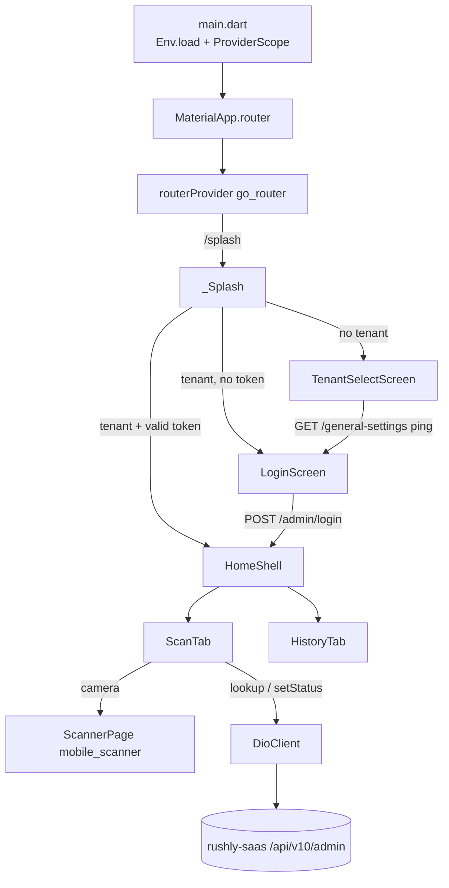
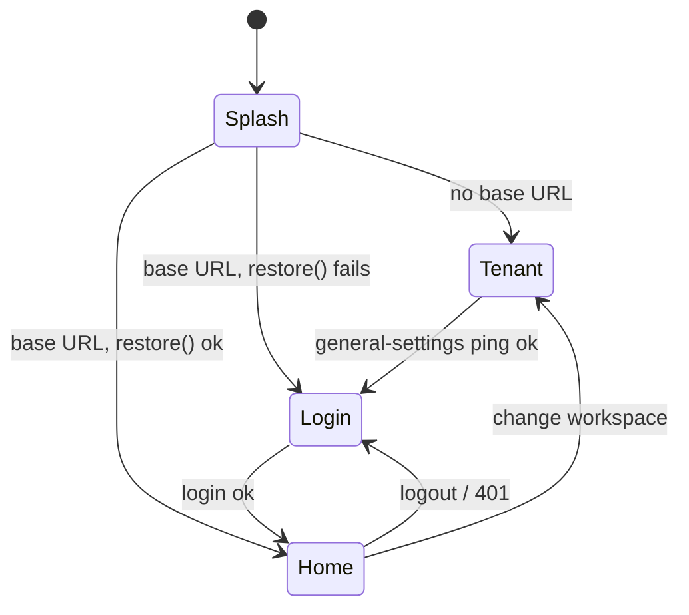
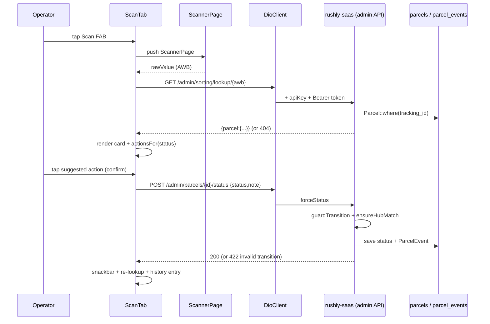

# rushly-scanner-app — Universal Scanner

> **Scope:** Engineering reference for the Flutter **universal scanner** mobile app at
> `/var/www/rushly-scanner-app`. Covers architecture, routing, theme, localization,
> packages, state management, the API layer, models, storage, and **per-screen** docs
> (purpose, UI, business logic, API calls, validation, navigation, permissions), with
> each screen mapped to its backend endpoint in `rushly-saas` (the single source of
> truth) and to the module docs.
>
> **Grounding:** Every non-trivial claim cites a real source file as a backticked path.
> Where a doc and the code disagree, a **⚠️ Doc vs Code** note calls it out. Read the
> shared [`_CONTEXT_BRIEF.md`](../_CONTEXT_BRIEF.md) first. The Flutter app is a **client**;
> all business rules live in `rushly-saas`.

**Cross-links:** module [sorting-scanning.md](../modules/sorting-scanning.md) (this app's home module) · [08-Flutter.md](../08-Flutter.md) (shared Flutter conventions) · [09-API.md](../09-API.md) (admin API) · [10-Authentication.md](../10-Authentication.md) (Sanctum / admin login) · [06-Database.md](../06-Database.md) (`parcels`, `hubs`, `parcel_events`) · sibling modules [parcels.md](../modules/parcels.md), [hubs-network.md](../modules/hubs-network.md) · sibling app docs [rushly-fleet-app.md](rushly-fleet-app.md), [rushly-admin-app.md](rushly-admin-app.md).

---

## 1. Purpose & target user

A single-purpose "scan anything, anywhere" operator app. An operator scans an AWB
(barcode/QR) with the camera or types it, the app **resolves** the parcel against the
backend, shows its current state, and offers a small set of **suggested status
transitions** to advance it. It also keeps a **device-local history** of recent scans.

- **Purpose (from the code):** `pubspec.yaml` — *"Rushly Logistics — Scanner mobile app
  (Flutter)."* App tagline in `lib/shared/l10n/app_localizations.dart`: *"Dedicated
  barcode / RFID scanning for anywhere in the pipeline."*
- **Target user:** back-office operators — `ADMIN`, `SUPER_ADMIN`, `INCHARGE`, `HUB`
  user types. The backend admin API rejects merchants/deliverymen even with a valid
  token (`routes/api.php` header comment; enforced by `CheckAdminRole` and the
  `ADMIN_TYPES` allow-list in `app/Http/Controllers/Api/V10/Admin/AdminAuthController.php`).
- **Tabs:** **Scan** and **History** (`lib/features/dashboard/presentation/home_shell.dart`).

Unlike the sorting app, the scanner does **not** manage bags/routes; it owns only
per-parcel **lookup** and **status forcing**. See the shared design intent captured in
the module doc [sorting-scanning.md](../modules/sorting-scanning.md) §1.

> **⚠️ Doc vs Code — RFID:** the tagline mentions "RFID", but the only scanning mechanism
> in code is a camera barcode/QR reader via the `mobile_scanner` package
> (`lib/features/scanner/presentation/scanner_page.dart`). No RFID/NFC code exists. RFID
> is aspirational copy, not a feature.

---

## 2. Project metrics & stack

| Fact | Value | Source |
|---|---|---|
| Dart files | 27 | `find lib -name '*.dart'` |
| App name / version | `rushly_scanner` · `1.0.0+1` | `pubspec.yaml` |
| Dart SDK | `>=3.3.0 <4.0.0`, Flutter `>=3.19.0` | `pubspec.yaml` |
| State management | Riverpod (`flutter_riverpod ^2.5.1`) | `pubspec.yaml` |
| Routing | `go_router ^14.2.0` | `pubspec.yaml` |
| HTTP | `dio ^5.5.0` + `pretty_dio_logger ^1.4.0` | `pubspec.yaml` |
| Secure storage | `flutter_secure_storage ^9.2.2` (token + tenant) | `pubspec.yaml` |
| Local prefs | `shared_preferences ^2.2.3` (scan history) | `pubspec.yaml` |
| Scanner | `mobile_scanner ^5.2.0` | `pubspec.yaml` |
| Fonts | `google_fonts ^6.2.1` (Inter / Tajawal) | `pubspec.yaml` |
| Config | `flutter_dotenv ^5.1.0` (`.env` asset) | `pubspec.yaml` |
| i18n | `flutter_localizations` + `intl ^0.20.2` | `pubspec.yaml` |
| Deep-link / dialer | `url_launcher ^6.3.0` (declared; **no call sites found** in `lib`) | `pubspec.yaml` |
| Lints | `flutter_lints ^4.0.0` | `pubspec.yaml` |

> **⚠️ Doc vs Code — declared-but-unused packages:** `url_launcher` is a dependency but
> has no import/call in `lib/`. It is scaffold carry-over from sibling apps. Treated as
> dead dependency until a feature uses it.

---

## 3. Architecture

Feature-first layout under `lib/`, split into `core/` (cross-cutting infra), `shared/`
(app-wide UI/config), and `features/` (vertical slices). Each feature further splits into
`data/` (repositories + stores), `domain/` (models + pure logic), and `presentation/`
(widgets/screens). This mirrors the convention in [08-Flutter.md](../08-Flutter.md).

```
lib/
├── main.dart                         # bootstrap: load .env → ProviderScope → MaterialApp.router
├── core/
│   ├── api/
│   │   ├── api_endpoints.dart         # endpoint path constants/builders
│   │   ├── dio_client.dart            # Dio wrapper: base URL, apiKey header, bearer injection, 401 handling, {data} unwrap
│   │   └── providers.dart             # Riverpod providers: secure storage, token, tenant, base-url, DioClient
│   ├── config/env.dart                # dotenv accessors (API_BASE_URL, API_KEY, TENANT_HOST_SUFFIX)
│   ├── error/api_exception.dart       # DioException → ApiException (message + statusCode)
│   ├── storage/
│   │   ├── tenant_storage.dart        # persist tenant base URL + label (secure)
│   │   └── token_storage.dart         # persist auth token + user blob (secure)
│   └── utils/json_x.dart              # null-safe JSON coercion helpers
├── shared/
│   ├── l10n/                          # AppLocalizations (en/ar), locale controller, toggle button
│   ├── router/app_router.dart         # go_router config + splash + redirect guard
│   └── theme/app_theme.dart           # Material 3 light/dark, deep-orange seed, RTL-aware fonts
└── features/
    ├── auth/          data/ (auth_repository) · presentation/ (auth_controller, login_screen)
    ├── tenant/        presentation/ (tenant_select_screen)
    ├── dashboard/     presentation/ (home_shell, placeholder_screen)
    └── scanner/       data/ (scanner_repository, scan_history_store) · domain/ (scanned_parcel, action_catalog) · presentation/ (scan_tab, history_tab, scanner_page)
```



### 3.1 State management (Riverpod)

`ProviderScope` wraps the app in `main.dart`. Providers:

| Provider | Type | Role | Source |
|---|---|---|---|
| `secureStorageProvider` | `Provider<FlutterSecureStorage>` | encrypted storage handle (Android `encryptedSharedPreferences`) | `core/api/providers.dart` |
| `tokenStorageProvider` | `Provider<TokenStorage>` | auth token/user persistence | `core/api/providers.dart` |
| `tenantStorageProvider` | `Provider<TenantStorage>` | tenant base URL/label persistence | `core/api/providers.dart` |
| `tenantBaseUrlProvider` | `FutureProvider<String?>` | reads persisted tenant base URL | `core/api/providers.dart` |
| `dioClientProvider` | `Provider<DioClient>` | HTTP client bound to resolved base URL | `core/api/providers.dart` |
| `authRepositoryProvider` | `Provider<AuthRepository>` | login/profile/logout | `features/auth/data/auth_repository.dart` |
| `authControllerProvider` | `NotifierProvider<AuthController, AuthState>` | auth session state | `features/auth/presentation/auth_controller.dart` |
| `scannerRepositoryProvider` | `Provider<ScannerRepository>` | lookup + setStatus | `features/scanner/data/scanner_repository.dart` |
| `scanHistoryProvider` | `StateNotifierProvider<ScanHistoryStore, List<ScanHistoryEntry>>` | local scan history | `features/scanner/data/scan_history_store.dart` |
| `localeProvider` | `StateNotifierProvider<LocaleController, Locale>` | UI locale | `shared/l10n/locale_controller.dart` |
| `routerProvider` | `Provider<GoRouter>` | route table + redirect guard | `shared/router/app_router.dart` |

`dioClientProvider` `ref.watch`es `tenantBaseUrlProvider`, so **invalidating**
`tenantBaseUrlProvider` (on connect / change-workspace) rebuilds the Dio client against
the new tenant host — see `tenant_select_screen.dart` and `home_shell.dart`.

---

## 4. Routing (go_router)

`lib/shared/router/app_router.dart` defines four routes and a global `redirect` guard.

| Path | Screen | Public? |
|---|---|---|
| `/splash` | `_Splash` (bootstrapping spinner) | yes (bypasses guard) |
| `/tenant` | `TenantSelectScreen` | yes |
| `/login` | `LoginScreen` | yes |
| `/home` | `HomeShell` (Scan + History tabs) | authed only |

**Redirect logic** (`redirect:` in `app_router.dart`):
1. `/splash` returns `null` (never redirected — it does its own routing after async work).
2. If **no tenant** configured and not on `/tenant` → `/tenant`.
3. If tenant configured and on `/tenant` → `/login`.
4. If **not authenticated** and route is not public (`/login`, `/tenant`) → `/login`.
5. If authenticated and on `/login` → `/home`.

**Splash bootstrapping** (`_SplashState.initState`): awaits `tenantBaseUrlProvider.future`;
if empty → `/tenant`; else calls `AuthController.restore()` (validates token via
`GET /admin/profile`) and routes to `/home` on success, `/login` otherwise.



---

## 5. Theme

`lib/shared/theme/app_theme.dart` — Material 3 (`useMaterial3: true`), seeded from
**deep-orange `0xFFE64A19`** for both light and dark. Light scaffold `Colors.white`;
dark scaffold `0xFF121212`. Font is locale-aware: **Tajawal** for `ar`, **Inter** for
everything else (`google_fonts`). Applied in `main.dart` as `theme`/`darkTheme`, with the
live locale passed in so the font theme rebuilds on language toggle.

---

## 6. Localization (ar / en, RTL)

- **Delegate:** hand-rolled `AppLocalizations` in `lib/shared/l10n/app_localizations.dart`
  (not ARB-generated), holding `_en` and `_ar` string maps plus typed getters.
  `pubspec.yaml` sets `generate: true`, but no `l10n.yaml`/ARB files exist — the generated
  pipeline is unused.
- **Supported locales:** `[en, ar]` (`AppLocalizations.supported`).
- **Default locale:** **Arabic** — `LocaleController` initial state is `Locale('ar')`
  (`shared/l10n/locale_controller.dart`).
- **Toggle:** `LanguageToggleButton` flips ar↔en via `localeProvider.notifier.toggle()`;
  shown on the login screen app-bar (`login_screen.dart`).
- **RTL:** no explicit `textDirection` is set anywhere; Flutter's
  `GlobalWidgetsLocalizations` (wired in `main.dart`'s `localizationsDelegates`) supplies
  RTL automatically for `ar`. So Arabic renders right-to-left through the framework default.

> **⚠️ Doc vs Code — partial Arabic coverage:** several strings are **not** translated —
> `appTagline`, and the tab labels/descriptions (`tab_0`="Scan", `tab_1`="History",
> `tab_0_desc`, `tab_1_desc`) are identical English text in both `_en` and `_ar`
> (`app_localizations.dart`). The parcel-card field labels used on the Scan tab
> (`customer`, `city`, `area`, `merchant`, `destination`, `currentHub`, `cod`,
> `suggestedActions`, etc.) resolve through getters that **do exist**, but their `_ar`
> entries are truncated in the map after `status` — any missing key falls back to `_en`
> via `_t()` (`m[k] ?? _en[k] ?? k`). Net effect: an Arabic user sees a mix of Arabic
> chrome and English data labels. A real gap for RTL polish.

---

## 7. API layer (`lib/core/api/*`)

### 7.1 Base URL, headers, envelope

`DioClient` (`core/api/dio_client.dart`) constructs `Dio` with:
- **baseUrl** = tenant base URL from `TenantStorage`, falling back to `Env.apiBaseUrl`.
- **headers**: `Accept: application/json` + `apiKey: <Env.apiKey>` (the shared API key
  gate — backend middleware `CheckApiKey`).
- Timeouts: connect 20s, receive 30s, send 30s.

**Interceptors:**
- `onRequest`: reads token from `TokenStorage`; if present, adds `Authorization: Bearer <token>`.
- `onError`: on **HTTP 401** → clears the token (`_tokens.clear()`) and fires the
  `onUnauthorized` callback (settable via `set onUnauthorized`; **no assignment found** in
  `lib` — the callback is currently never wired, so the redirect-to-login on 401 relies on
  the router guard, not this hook).
- Debug-only `PrettyDioLogger` when `kDebugMode`.

**Response unwrapping** (`_unwrap`): if the JSON body is a `Map` containing a `data` key,
returns `data['data']`; else returns the raw body. This matches the backend envelope
`{ status, message, data }` produced by `App\Traits\ApiReturnFormatTrait`
(`responseWithSuccess`/`responseWithError`).

### 7.2 Endpoints (`api_endpoints.dart`)

| Constant / builder | Path | Used by |
|---|---|---|
| `login` | `/admin/login` | `AuthRepository.login` |
| `profile` | `/admin/profile` | `AuthRepository.profile` (token restore) |
| `logout` | `/admin/logout` | `AuthRepository.logout` |
| `generalSettings` | `/general-settings` | tenant-select ping (called via raw Dio, see §9.2) |
| `lookupTracking(t)` | `/admin/sorting/lookup/{t}` | `ScannerRepository.lookup` |
| `hubs` | `/admin/sorting/hubs` | **declared, no call site** in `lib` |
| `setStatus(id)` | `/admin/parcels/{id}/status` | `ScannerRepository.setStatus` |

> Note: the base URL already includes `/api/v10` (e.g. `.env.example`
> `API_BASE_URL=https://admin.rushly-logistic.com/api/v10`), so `/admin/login` resolves to
> `/api/v10/admin/login`. The backend prefix is `Route::prefix('v10/admin')`
> (`routes/api.php`).

> **⚠️ Doc vs Code — unused `hubs` endpoint:** `ApiEndpoints.hubs` exists but the scanner
> has no destination-hub picker; only the **sorting** app uses `/admin/sorting/hubs`. Dead
> in this app. Same for the `handover` endpoint (sorting-only).

### 7.3 Error model

`core/error/api_exception.dart` maps `DioException` → `ApiException(message, statusCode)`,
preferring the backend `data['message']`. `toString()` returns the message (shown verbatim
in snackbars).

---

## 8. Storage (token & tenant)

Both use `flutter_secure_storage` (encrypted). Keys are deliberately shared with sibling
Rushly apps so operators keep "which workspace am I on" muscle memory
(`tenant_storage.dart` docblock).

| Store | Keys | Written by | Cleared by |
|---|---|---|---|
| `TokenStorage` (`core/storage/token_storage.dart`) | `auth_token`, `auth_user` | `AuthRepository.login` (writes `auth_token`) | logout, 401 interceptor, failed restore |
| `TenantStorage` (`core/storage/tenant_storage.dart`) | `tenant_api_base`, `tenant_label` | `TenantSelectScreen._connect` | change-workspace in `HomeShell` |

> Note: `TokenStorage` exposes `writeUser`/`readUser` for `auth_user`, but no code path
> calls `writeUser` — the login response's `user` object is not persisted. `AuthController`
> tracks only an email (or the literal `'unknown'` after a token-restore) in memory.

### 8.1 Local scan history

`ScanHistoryStore` (`features/scanner/data/scan_history_store.dart`) persists scan history
in **`shared_preferences`** (key `scan_history_v1`, **not** secure storage), FIFO-capped at
**100** entries. `add()` de-dupes: an entry with the same `tracking_id` scanned within 30s
replaces the prior one. This is entirely device-local; the backend has no scan-history
table for this app.

---

## 9. Models

### 9.1 `ScannedParcel` (`features/scanner/domain/scanned_parcel.dart`)

Maps the `parcel` object returned by `/admin/sorting/lookup/{tracking}`. Fields (with the
backend JSON keys) are decoded through the null-safe helpers in `core/utils/json_x.dart`:

| Dart field | JSON key | Backend source (`AdminSortingController::lookup`) |
|---|---|---|
| `id` | `id` | `$parcel->id` |
| `trackingId` | `tracking_id` | `$parcel->tracking_id` |
| `customerName` | `customer_name` | `$parcel->customer_name` |
| `customerCity` | `customer_city` | `$parcel->customer_city` |
| `customerArea` | `customer_area` | `$parcel->customer_area` |
| `status` | `status` | `$parcel->status` (int enum) |
| `currentHubId` / `currentHubName` | `current_hub_id` / `current_hub_name` | `$parcel->hub_id` / `optional($parcel->hub)->name` |
| `destinationHubId` / `destinationHub` | `destination_hub_id` / `destination_hub` | `$parcel->transfer_hub_id` / `optional($parcel->transferHub)->name` |
| `merchantName` | `merchant_name` | `optional(optional($parcel->merchant)->user)->name` |
| `cashCollection` | `cash_collection` | `(float) $parcel->cash_collection` |

### 9.2 `ScanHistoryEntry` (same file)

Device-local record: `trackingId`, `scannedAt` (ISO), `parcelId` (null = not found),
`statusAtScan`, `actionTaken` (label of the applied action, or null = lookup-only). JSON
round-tripped via `toJson`/`fromJson` for `shared_preferences`.

### 9.3 Status catalog & action mapping (`features/scanner/domain/action_catalog.dart`)

`ParcelStatus` mirrors the backend `App\Enums\ParcelStatus` integer codes (e.g. `pending=1`,
`transferToHub=6`, `deliveryManAssign=7`, `delivered=9`, `receivedByHub=19`,
`wmsReadyToShip=40`, `cancelled=41`) and provides human labels. `actionsFor(status)` returns
a **small ranked list of suggested next transitions** (the button strip on the Scan tab).
Examples: `transferToHub → receivedByHub`; `pending/pickupAssign/pickupReSchedule → picked up`;
`receivedByPickupMan → at warehouse`; `receivedWarehouse/receivedByHub → transfer to hub`;
`deliveryManAssign → delivered`; return flows → return-received.

> **Important — client suggestion vs server truth:** `actionsFor` is a **UX convenience
> only**. The authoritative transition rules live server-side: `forceStatus`
> (`AdminParcelController`) calls `ParcelStatusHelper::guardTransition($current, $next)` and
> returns **422 `admin.parcel.status_invalid`** if the transition is illegal, plus enforces
> hub scoping (`ensureHubMatch`). The client mapping can drift from the backend guard — the
> server always wins. See [parcels.md](../modules/parcels.md).

---

## 10. Per-screen documentation

### 10.1 TenantSelectScreen — `features/tenant/presentation/tenant_select_screen.dart`

- **Purpose:** pick the courier-company workspace (tenant) before login. Rushly is
  multi-tenant per-subdomain ([saas-tenancy](../modules/saas-tenancy-subscriptions.md)); the
  app must know which tenant host to talk to.
- **UI:** scanner icon, hint text, one input, a computed base-URL **preview** line
  (`→ https://…`), a **simple/advanced** mode toggle, a **Connect** button, and an inline
  error line. Localized via `AppLocalizations`.
- **Two modes** (`_buildBaseUrl`):
  - *Simple* — "workspace name" (e.g. `acme`) → `https://acme.<TENANT_HOST_SUFFIX>/api/v10`
    (suffix from `Env.tenantHostSuffix`, default `rushly-logistic.com`).
  - *Advanced* — full API URL; trailing `/` trimmed, and `/api/v10` appended if the URL has
    no `/api/` segment.
- **Validation:** simple mode requires `^[a-z0-9][a-z0-9-]*$` (`workspaceNameInvalid`);
  advanced mode requires a parseable URL with a scheme (`invalidUrl`); both require non-empty.
- **Business logic (`_connect`):** builds the URL, fires a **health-check** GET
  `/general-settings` using a **throwaway** `Dio` (8s timeouts, `apiKey` header) — note it
  bypasses `DioClient`. On a <400 response it persists `{baseUrl, label}` via
  `TenantStorage.write`, invalidates `tenantBaseUrlProvider` (rebuilding `DioClient`), and
  navigates to `/login`. Errors surface HTTP code or Dio message.
- **API call:** `GET /general-settings` → `GeneralSettingCotroller::index`
  (`routes/api.php:246`, inside `v10` + `CheckApiKey`, **no auth required** — a valid
  reachability probe). Maps to [09-API.md](../09-API.md).
- **Navigation:** on success `GoRouter.go('/login')`.
- **Permissions:** none (network only).

### 10.2 LoginScreen — `features/auth/presentation/login_screen.dart`

- **Purpose:** authenticate an operator into the selected tenant.
- **UI:** big scanner icon, title/tagline, **email** + **password** fields (password with
  show/hide toggle), a **Sign in** filled button with inline spinner, and a language toggle
  in the app-bar. Snackbar on failure.
- **Validation (client):** email required + must contain `@` (`emailInvalid`); password
  required + min **6** chars (`passwordTooShort`).
- **Business logic (`_submit`):** `AuthController.login(email, password)` →
  `AuthRepository.login` POSTs `{email, password}` to `/admin/login`, reads
  `data['token']`, and writes it to `TokenStorage`. On success `context.go('/home')`;
  on failure shows `AuthState.error` (or `loginFailed`).
- **API call → backend:** `POST /api/v10/admin/login` →
  `AdminAuthController::login` (`app/Http/Controllers/Api/V10/Admin/AdminAuthController.php`).
  Server validates `email` + `password|min:6`, `Auth::attempt`, **rejects non-admin
  user_types** (401), then issues a Sanctum token `createToken('admin:'.$email)` and returns
  `{ token, user }`. See [10-Authentication.md](../10-Authentication.md).
- **Navigation:** `/home` on success; router guard also bounces authed users off `/login`.
- **Permissions:** requires an admin-class account (`ADMIN`, `SUPER_ADMIN`, `INCHARGE`,
  `HUB`); enforced server-side, not in the app.

### 10.3 HomeShell — `features/dashboard/presentation/home_shell.dart`

- **Purpose:** authenticated container with the two-tab bottom navigation and top actions.
- **UI:** `AppBar` (title, **Workspace** switch icon, **Logout** icon), an `IndexedStack`
  body (keeps both tabs alive), and a `NavigationBar` with **Scan** (`qr_code_scanner`) and
  **History** (`history`).
- **Business logic:**
  - *Logout* — `AuthController.logout()` (POST `/admin/logout`, then clears token) → `/login`.
  - *Change workspace* (`_switchWorkspace`) — confirm dialog, then `logout()` +
    `TenantStorage.clear()` + invalidate `tenantBaseUrlProvider` → `/tenant`.
- **API calls:** `POST /admin/logout` → `AdminAuthController::logout` (deletes all the
  user's Sanctum tokens).
- **Navigation:** `/login` (logout) or `/tenant` (change workspace).
- **Permissions:** authed session (guard-enforced).

### 10.4 ScanTab — `features/scanner/presentation/scan_tab.dart` (Tab 0)

- **Purpose:** the core loop — scan/type an AWB, resolve it, view details, apply a status
  action. Ties to [sorting-scanning.md](../modules/sorting-scanning.md) §"universal scanner".
- **UI:** a top text field (`scanOrType` = "Scan or type AWB") with a search icon button, a
  `LinearProgressIndicator` while busy, an error line, a `_ParcelCard` (tracking, status
  chip, customer/city/area/merchant/destination/current-hub rows, COD when > 0), an
  `_ActionStrip` of suggested-action buttons, and a **Scan** FAB that opens the camera.
- **Business logic:**
  - `_openScanner()` pushes `ScannerPage`; its returned raw barcode feeds `_lookup`.
  - `_lookup(code)` → `ScannerRepository.lookup` GET `/admin/sorting/lookup/{code}`. On a
    hit it sets `_parcel` and appends a history entry (`actionTaken: null` = lookup-only); on
    a miss it shows `notFound: <code>` and records a **not-found** history entry
    (`parcelId: null`).
  - `_applyAction(action)` shows a confirm dialog, then `ScannerRepository.setStatus`
    (POST `/admin/parcels/{id}/status` with `{status, note:'Scanner: <label>'}`), appends a
    history entry with the action label, snackbars `applied`, and **re-looks-up** to refresh
    the card.
- **Validation (client):** empty code is ignored; **no status-transition validation** on the
  client beyond which buttons `actionsFor(status)` renders. The server guards the transition
  (§9.3) and may return 422 — surfaced verbatim in a snackbar.
- **API calls → backend + module map:**

  | Action | Client call | Backend endpoint | Controller | Module |
  |---|---|---|---|---|
  | Resolve AWB | `ScannerRepository.lookup` | `GET /api/v10/admin/sorting/lookup/{tracking}` | `AdminSortingController::lookup` | [sorting-scanning.md](../modules/sorting-scanning.md), [parcels.md](../modules/parcels.md) |
  | Advance status | `ScannerRepository.setStatus` | `POST /api/v10/admin/parcels/{id}/status` | `AdminParcelController::forceStatus` | [parcels.md](../modules/parcels.md) |

  `forceStatus` validates `status|required|integer`, `note|nullable|max:500`, checks
  `ensureHubMatch` (HUB/INCHARGE users limited to their own hub), enforces
  `ParcelStatusHelper::guardTransition`, saves the parcel, and writes a `ParcelEvent` row
  (audit trail in `parcel_events`, see [06-Database.md](../06-Database.md)).
- **Navigation:** pushes/pops `ScannerPage` for the camera; otherwise stays in-tab.
- **Permissions:** camera permission (requested by `mobile_scanner` on the scanner page);
  admin token for the API.

### 10.5 ScannerPage — `features/scanner/presentation/scanner_page.dart`

- **Purpose:** full-screen camera barcode/QR reader.
- **UI:** `MobileScanner` viewfinder with app-bar **torch** and **flip-camera** actions.
- **Business logic:** `onDetect` reads the first barcode's `rawValue` and `Navigator.pop`s it
  back to `ScanTab`. Controller disposed on teardown.
- **API calls:** none (pure device).
- **Permissions:** **camera** (platform runtime permission via `mobile_scanner`).

### 10.6 HistoryTab — `features/scanner/presentation/history_tab.dart` (Tab 1)

- **Purpose:** review recent device-local scans; clear the log.
- **UI:** empty-state (`noHistory`), else a `ListView` of `_HistoryTile`s (leading avatar
  color-coded: red=not-found, orange=hit; trailing text = `notFound` / action label /
  `lookupOnly`; subtitle = status label + timestamp via `intl DateFormat`). A **Clear
  history** FAB (confirm dialog) when non-empty.
- **Business logic:** reads `scanHistoryProvider`; `_confirmClear` → `ScanHistoryStore.clear()`
  (also wipes the `shared_preferences` blob).
- **API calls:** **none** — history is entirely local (§8.1). No server round-trip; the
  trailing "tap to see the referenced record" description (`tab_1_desc`) is **not wired** —
  tiles are not tappable.
- **Navigation / permissions:** none.

### 10.7 PlaceholderScreen — `features/dashboard/presentation/placeholder_screen.dart`

Reusable "coming soon" scaffold-carryover widget. **Not referenced** by the scanner's two
real tabs (both are live). Kept for parity with sibling apps; effectively dead in this app.

---

## 11. Notifications / push

**Not found in the current codebase.** The scanner app has no FCM/push dependency
(`pubspec.yaml` has no `firebase_*`/`firebase_messaging`) and no notification code in `lib`.
The backend *does* expose admin push endpoints (`POST /api/v10/admin/fcm-subscribe` /
`fcm-unsubscribe` → `AdminPushController`, `routes/api.php`), but this app never calls them.
See [notifications.md](../modules/notifications.md) for the platform push story used by other
apps.

---

## 12. Environment / config

`.env` (asset, loaded in `main.dart` via `Env.load()`), accessed through
`lib/core/config/env.dart`:

| Var | `.env.example` value | Code default (`env.dart`) |
|---|---|---|
| `API_BASE_URL` | `https://admin.rushly-logistic.com/api/v10` | `https://api.rushly-logistic.com/api/v10` |
| `API_KEY` | `123456rx-ecourier123456` | `123456rx-ecourier123456` |
| `TENANT_HOST_SUFFIX` | `rushly-logistic.com` | `rushly-logistic.com` |

The `apiKey` header is the shared static gate checked by backend `CheckApiKey` middleware.

> **⚠️ Doc vs Code — default host mismatch & shipped secret:** the fallback in `env.dart`
> (`api.rushly-logistic.com`) differs from `.env.example` (`admin.rushly-logistic.com`).
> Because tenant selection overrides the base URL at runtime, the fallback rarely matters,
> but it is a latent inconsistency. Also note the API key is a hard-coded shared secret
> committed in both `.env.example` and `env.dart` — see [17-Security.md](../17-Security.md).

---

## 13. End-to-end scan flow (sequence)



---

## 14. Gaps, risks & tech debt

- **Partial Arabic localization** — data labels/tabs fall back to English (§6). RTL polish gap.
- **`onUnauthorized` hook never wired** — 401 recovery relies solely on the router guard;
  the DioClient callback is dead (§7.1).
- **History tiles non-interactive** — `tab_1_desc` promises "tap to see the referenced
  record" but tiles have no `onTap` (§10.6).
- **Dead code/deps** — `PlaceholderScreen`, `url_launcher`, `ApiEndpoints.hubs`,
  `TokenStorage.writeUser`/`auth_user` are unused scaffold carry-over.
- **Hard-coded shared API key** in VCS (§12) — see [17-Security.md](../17-Security.md).
- **Client status mapping can drift** from the server `guardTransition` rules (§9.3); the
  server is authoritative, so worst case is a rejected 422, not corruption.
- **RFID copy without RFID feature** (§1).
- See [22-Technical-Debt.md](../22-Technical-Debt.md) for platform-wide items.

---

## Sources

**rushly-scanner-app (`/var/www/rushly-scanner-app`):**
- `pubspec.yaml`, `.env.example`, `analysis_options.yaml`
- `lib/main.dart`
- `lib/core/api/api_endpoints.dart`, `lib/core/api/dio_client.dart`, `lib/core/api/providers.dart`
- `lib/core/config/env.dart`, `lib/core/error/api_exception.dart`
- `lib/core/storage/tenant_storage.dart`, `lib/core/storage/token_storage.dart`, `lib/core/utils/json_x.dart`
- `lib/features/auth/data/auth_repository.dart`, `lib/features/auth/presentation/auth_controller.dart`, `lib/features/auth/presentation/login_screen.dart`
- `lib/features/tenant/presentation/tenant_select_screen.dart`
- `lib/features/dashboard/presentation/home_shell.dart`, `lib/features/dashboard/presentation/placeholder_screen.dart`
- `lib/features/scanner/data/scanner_repository.dart`, `lib/features/scanner/data/scan_history_store.dart`
- `lib/features/scanner/domain/scanned_parcel.dart`, `lib/features/scanner/domain/action_catalog.dart`
- `lib/features/scanner/presentation/scan_tab.dart`, `lib/features/scanner/presentation/history_tab.dart`, `lib/features/scanner/presentation/scanner_page.dart`
- `lib/shared/router/app_router.dart`, `lib/shared/theme/app_theme.dart`
- `lib/shared/l10n/app_localizations.dart`, `lib/shared/l10n/locale_controller.dart`, `lib/shared/l10n/language_toggle_button.dart`

**rushly-saas (`/var/www/rushly-saas`) — backend endpoints & rules:**
- `routes/api.php` (v10/admin group, `CheckApiKey` + `auth:sanctum` + `CheckAdminRole`)
- `app/Http/Controllers/Api/V10/Admin/AdminAuthController.php` (login/profile/logout)
- `app/Http/Controllers/Api/V10/Admin/AdminSortingController.php` (lookup/hubs/handover)
- `app/Http/Controllers/Api/V10/Admin/AdminParcelController.php` (`forceStatus`)
- `app/Traits/ApiReturnFormatTrait.php` (`{status,message,data}` envelope)

**Cross-referenced docs:** [_CONTEXT_BRIEF.md](../_CONTEXT_BRIEF.md), [modules/sorting-scanning.md](../modules/sorting-scanning.md), [08-Flutter.md](../08-Flutter.md), [09-API.md](../09-API.md), [10-Authentication.md](../10-Authentication.md), [06-Database.md](../06-Database.md), [modules/parcels.md](../modules/parcels.md), [modules/hubs-network.md](../modules/hubs-network.md), [modules/notifications.md](../modules/notifications.md), [17-Security.md](../17-Security.md), [22-Technical-Debt.md](../22-Technical-Debt.md).
