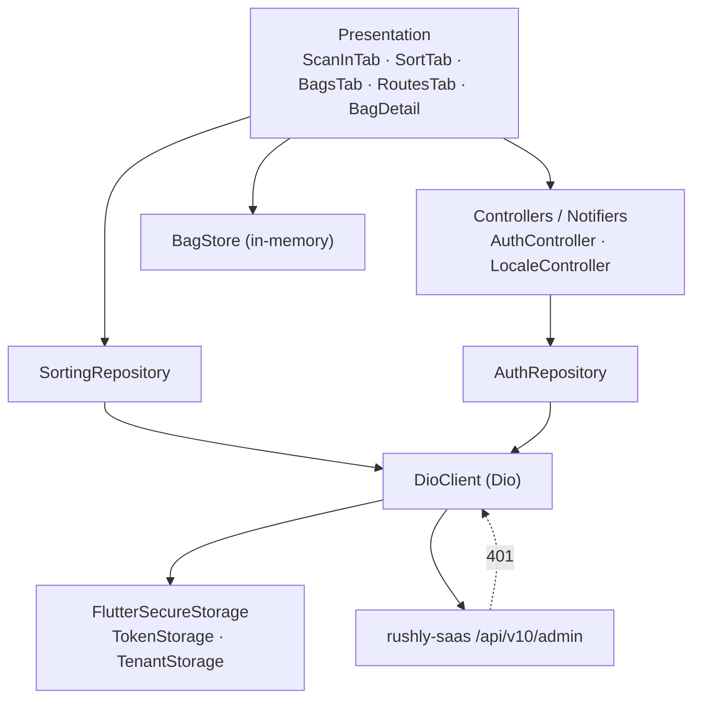
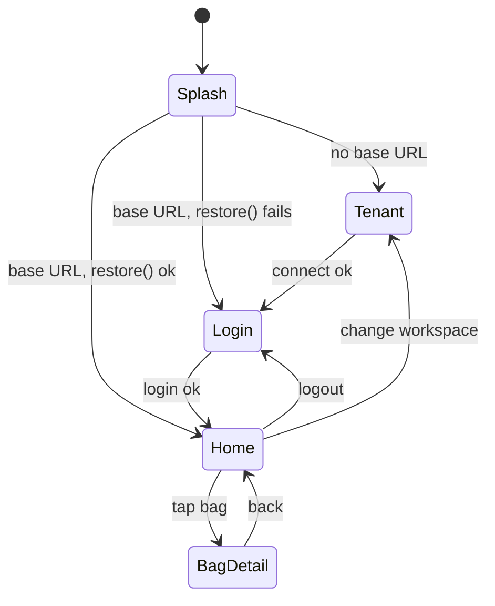
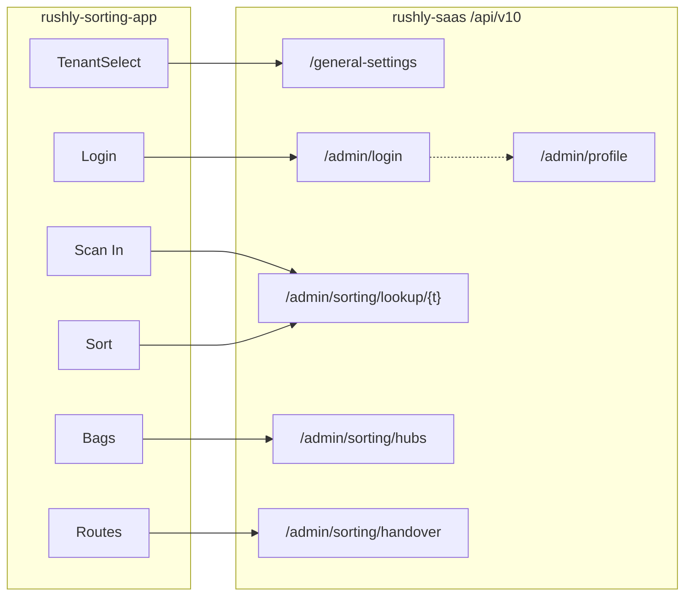

# rushly-sorting-app — Sorting Center

> Flutter mobile client for a **Rushly sorting center / hub**. Frontline hub staff scan
> inbound parcels, sort them into destination-hub **bags**, and dispatch those bags to
> outbound **routes** with a single server-side handover write.
>
> **rushly-saas is the single source of truth.** This app is a thin client of the
> `v10/admin` API. See the shared context in [`../_CONTEXT_BRIEF.md`](../_CONTEXT_BRIEF.md)
> and the platform-wide Flutter overview in [`../08-Flutter.md`](../08-Flutter.md).

- **Project root:** `/var/www/rushly-sorting-app`
- **Package:** `rushly_sorting` (`pubspec.yaml`)
- **Version:** `1.0.0+1`
- **Dart SDK:** `>=3.3.0 <4.0.0`, Flutter `>=3.19.0`
- **Size:** 30 Dart files. Tabs: **Scan In · Sort · Bags · Routes**
- **Backend surface:** `app/Http/Controllers/Api/V10/Admin/AdminSortingController.php` (3 endpoints) + shared admin auth.

Cross-references: [`../09-API.md`](../09-API.md) (API conventions), [`../10-Authentication.md`](../10-Authentication.md) (Sanctum/tenant), [`../06-Database.md`](../06-Database.md) (Parcel/Hub schema), [`../03-Business-Domain.md`](../03-Business-Domain.md) (parcel lifecycle), [`../15-Brand-System.md`](../15-Brand-System.md) (theme).

---

## 1. Purpose & Target User

### Purpose
A sorting center is the middle leg of the network: parcels arrive from origin hubs / pickups,
get **sorted by destination hub**, grouped into physical **bags**, and handed off to outbound
transfer routes. This app digitizes that floor workflow:

1. **Scan In** — resolve a scanned AWB to its parcel record (read-only lookup).
2. **Sort** — scan a parcel and it is auto-dropped into the bag for its destination hub (creating the bag on first parcel).
3. **Bags** — manually create / label / close / inspect bags built during the shift.
4. **Routes** — group active bags by destination hub and **dispatch** (server handover → `TRANSFER_TO_HUB`).

### Target user
Back-office / hub operators. The backend admits only four `user_type` values on this API:
`ADMIN`, `SUPER_ADMIN`, `INCHARGE`, `HUB` — enforced by `CheckAdminRoleMiddleware`
(`app/Http/Middleware/CheckAdminRoleMiddleware.php`) and re-checked in
`AdminAuthController::login` (`app/Http/Controllers/Api/V10/Admin/AdminAuthController.php`).
Merchants and deliverymen are rejected even with a valid token.

**Hub scoping:** in `handover`, if the caller is `HUB` or `INCHARGE` and has a `hub_id`, they can
only hand over parcels currently sitting in *their own* hub (`AdminSortingController::handover`).
`ADMIN` / `SUPER_ADMIN` are unscoped.

> ⚠️ **Doc vs Code — "bags & routes" are device-local, not backend entities.** The controller
> docblock is explicit: *"The app tracks bags/routes device-side (ephemeral per-shift buckets);
> this controller only owns the two operations that need server writes."* There is **no** `bags`
> table, no `routes` table, and no bag/route API. A bag is an in-memory Dart object
> (`BagStore`, `lib/features/sorting/data/bag_store.dart`) that lives only until the app process
> ends or the bag is dispatched. Closing the app loses un-dispatched bags. This is a real
> operational constraint, not a bug — but worth flagging for anyone expecting persistence.

---

## 2. Architecture

Standard Rushly Flutter layout: `core/` (cross-cutting infra) + `shared/` (app-wide UI/routing/i18n) +
`features/<feature>/{data,domain,presentation}`. State is **Riverpod**; navigation is **go_router**.

```
lib/
├── main.dart                         # bootstrap: load .env, ProviderScope, MaterialApp.router
├── core/
│   ├── config/env.dart               # dotenv accessors (base URL, apiKey, tenant host suffix)
│   ├── api/
│   │   ├── api_endpoints.dart        # endpoint path constants
│   │   ├── dio_client.dart           # Dio wrapper: auth header, 401 handling, {data} unwrap
│   │   └── providers.dart            # Riverpod graph: storage → dio
│   ├── error/api_exception.dart      # DioException → ApiException(message,statusCode)
│   ├── storage/
│   │   ├── token_storage.dart        # secure-storage: auth_token, auth_user
│   │   └── tenant_storage.dart       # secure-storage: tenant_api_base, tenant_label
│   └── utils/json_x.dart             # null-safe JSON coercion helpers
├── shared/
│   ├── router/app_router.dart        # go_router + redirect guard + splash
│   ├── theme/app_theme.dart          # Material 3, seed #512DA8, per-locale fonts
│   └── l10n/                         # hand-rolled ar/en localization + locale controller
└── features/
    ├── auth/{data,presentation}      # repository, controller (Notifier), login screen
    ├── tenant/presentation           # workspace/tenant select screen
    ├── dashboard/presentation        # home shell (4 tabs) + reusable placeholder
    └── sorting/{data,domain,presentation}   # the actual product
```

### Layer diagram



**Provider graph** (`lib/core/api/providers.dart`):
`secureStorageProvider` → `tokenStorageProvider` / `tenantStorageProvider` → `tenantBaseUrlProvider`
(FutureProvider reading persisted base URL) → `dioClientProvider` (rebuilds when tenant changes).
`sortingRepositoryProvider` and `sortingHubsProvider` sit on top of `dioClientProvider`;
`bagStoreProvider` is standalone in-memory state.

---

## 3. Routing (go_router)

`lib/shared/router/app_router.dart` — `routerProvider` returns a `GoRouter` with a global
`redirect` guard.

| Path | Screen | Guard behavior |
|---|---|---|
| `/splash` | `_Splash` (private) | Initial location. Post-frame: reads tenant base URL → `/tenant` if none; else `restore()` → `/home` or `/login`. Exempt from redirect. |
| `/tenant` | `TenantSelectScreen` | Shown when no tenant configured. If tenant *is* configured, redirect → `/login`. |
| `/login` | `LoginScreen` | Public. If already authed, redirect → `/home`. |
| `/home` | `HomeShell` (4 tabs) | Requires auth; else → `/login`. |
| `/bag/:id` | `BagDetailScreen` | Requires auth. `id` = client bag id (e.g. `B-1737…-3`). |

Redirect precedence (from `redirect`):
1. `/splash` is always allowed.
2. Tenant not configured & not on `/tenant` → `/tenant`.
3. Tenant configured & on `/tenant` → `/login`.
4. Not authed & not on a public route (`/login`, `/tenant`) → `/login`.
5. Authed & on `/login` → `/home`.



> **Note:** `authControllerProvider` state is not `watch`ed by the router, so the guard does not
> reactively re-route on auth changes — navigation is done imperatively (`context.go(...)`) inside
> screens after login/logout. The guard is a safety net on cold navigation.

---

## 4. Theme

`lib/shared/theme/app_theme.dart` — Material 3, `ColorScheme.fromSeed`.

- **Seed color:** `#512DA8` (deep purple) for both light and dark. Accent tint `Colors.deepPurple` is
  used ad-hoc across sorting cards/tiles.
- **Light:** white scaffold. **Dark:** `#121212` scaffold.
- **Fonts (google_fonts):** Arabic → `Tajawal`; everything else → `Inter`, selected per active locale.
- `MaterialApp.router` passes both `theme` and `darkTheme`; system brightness picks.

See platform palette conventions in [`../15-Brand-System.md`](../15-Brand-System.md).

---

## 5. Localization (ar / en, RTL)

Hand-written delegate `lib/shared/l10n/app_localizations.dart` (no ARB/gen-l10n despite
`generate: true` in `pubspec.yaml`). Two in-code maps `_en` / `_ar`; `_t(key)` falls back ar→en→key.

- **Default locale is Arabic** (`LocaleController() : super(const Locale('ar'))`,
  `lib/shared/l10n/locale_controller.dart`). Flutter applies **RTL** automatically for `ar` via
  `GlobalWidgetsLocalizations`.
- **Toggle:** `LanguageToggleButton` (`lib/shared/l10n/language_toggle_button.dart`) flips ar↔en at
  runtime; not persisted (resets to `ar` on relaunch).
- Tab labels/descriptions are keyed `tab_0..tab_3` / `tab_0_desc..tab_3_desc`.

> ⚠️ **Doc vs Code — partial Arabic.** `appTitle` in Arabic is the mixed string
> `"رشلي Sorting Center"` and `appTagline` is left in English in both maps. Minor polish gap.

---

## 6. Packages (pubspec.yaml)

| Package | Version | Role in this app |
|---|---|---|
| `flutter_riverpod` | `^2.5.1` | State management (providers, `Notifier`, `StateNotifier`). |
| `dio` | `^5.5.0` | HTTP client (`DioClient`). |
| `pretty_dio_logger` | `^1.4.0` | Debug-only request logging (`kDebugMode`). |
| `flutter_secure_storage` | `^9.2.2` | Encrypted token + tenant persistence. |
| `shared_preferences` | `^2.2.3` | Declared; **no usage found in `lib/`** (candidate dead dep). |
| `google_fonts` | `^6.2.1` | Tajawal / Inter text themes. |
| `intl` | `^0.20.2` | Locale infra (no explicit formatter usage in `lib/`). |
| `flutter_dotenv` | `^5.1.0` | `.env` loading (`Env`). |
| `go_router` | `^14.2.0` | Routing. |
| `url_launcher` | `^6.3.0` | Declared; **no usage found in `lib/`**. |
| `mobile_scanner` | `^5.2.0` | Camera barcode/QR scanning (`ScannerPage`). |
| `flutter_localizations` | sdk | ar/en material/widget localizations, RTL. |

Lints: `flutter_lints ^4.0.0` + `avoid_print: true` (`analysis_options.yaml`).

**No push/notification dependency** — `firebase_messaging`, `flutter_local_notifications`, etc. are
absent. **Push notifications: Not found in the current codebase.** (Contrast with driver/merchant apps,
which integrate `app/Http/Services/PushNotificationService.php` server-side.)

---

## 7. State Management (Riverpod)

- **Auth:** `authControllerProvider` = `NotifierProvider<AuthController, AuthState>`
  (`lib/features/auth/presentation/auth_controller.dart`). `AuthState { userEmail, isLoading, error }`;
  `isAuthenticated == userEmail != null`.
  - `restore()` reads token, calls `profile()`; on success sets `userEmail: 'unknown'` (it does **not**
    hydrate the real email/name from the profile response — ⚠️ minor: `home_shell` never displays it).
  - `login()` / `logout()` delegate to `AuthRepository`.
- **Bags:** `bagStoreProvider` = `StateNotifierProvider<BagStore, List<Bag>>` — the whole bag/route
  domain, purely in-memory (see §2 flag).
- **Hubs:** `sortingHubsProvider` = `FutureProvider<List<SortingHub>>` — cached hub list for the
  destination picker.
- **Locale:** `localeProvider` = `StateNotifierProvider<LocaleController, Locale>`.
- **Base URL:** `tenantBaseUrlProvider` = `FutureProvider<String?>`; invalidated on connect / change
  workspace so `dioClientProvider` rebuilds against the new tenant host.

---

## 8. API Layer (`lib/core/api/*`)

### `DioClient` (`dio_client.dart`)
- **Base options:** `baseUrl` (from tenant or `Env.apiBaseUrl`), timeouts 20/30/30s, default headers
  `Accept: application/json` and **`apiKey: <Env.apiKey>`** (required by `CheckApiKeyMiddleware`).
- **Request interceptor:** injects `Authorization: Bearer <token>` from `TokenStorage` when present.
- **Error interceptor:** on **401**, clears the token and fires `onUnauthorized` callback (settable),
  then propagates. All `DioException`s are converted to `ApiException` (`error/api_exception.dart`),
  which extracts `data['message']` when the backend returns one.
- **Envelope unwrap:** `_unwrap` returns `data['data']` when the JSON has a top-level `data` key —
  matching the backend `ApiReturnFormatTrait` envelope `{ success, message, data }`. So repositories
  receive the *inner* `data` object directly.

### `ApiEndpoints` (`api_endpoints.dart`)
```
login            = /admin/login
profile          = /admin/profile
logout           = /admin/logout
generalSettings  = /general-settings
sortingLookup(t) = /admin/sorting/lookup/{t}
sortingHubs      = /admin/sorting/hubs
sortingHandover  = /admin/sorting/handover
```
Paths are relative to the tenant base URL, which already includes `/api/v10`
(e.g. `https://acme.rushly-logistic.com/api/v10`).

### Endpoint → backend map

| App call | Method + full path | Backend handler | Auth |
|---|---|---|---|
| Tenant reachability ping | `GET /api/v10/general-settings` | `GeneralSettingCotroller@index` (`routes/api.php:246`) | apiKey only (public) |
| Login | `POST /api/v10/admin/login` | `AdminAuthController@login` (`routes/api.php:151`) | apiKey (`CheckApiKey`) |
| Restore/profile | `GET /api/v10/admin/profile` | `AdminAuthController@profile` | apiKey + `auth:sanctum` + `CheckAdminRole` |
| Logout | `POST /api/v10/admin/logout` | `AdminAuthController@logout` (deletes all tokens) | apiKey + sanctum + role |
| Scan lookup | `GET /api/v10/admin/sorting/lookup/{tracking}` | `AdminSortingController@lookup` (`routes/api.php:170`) | apiKey + sanctum + role |
| Hub picker | `GET /api/v10/admin/sorting/hubs` | `AdminSortingController@hubs` (`:171`) | apiKey + sanctum + role |
| Dispatch/handover | `POST /api/v10/admin/sorting/handover` | `AdminSortingController@handover` (`:172`) | apiKey + sanctum + role |

The `v10/admin` group is defined at `routes/api.php:150`
(`Route::prefix('v10/admin')->middleware(['CheckApiKey'])`), with the authed sub-group wrapped in
`['auth:sanctum','CheckAdminRole']`. See [`../10-Authentication.md`](../10-Authentication.md).

### Backend endpoint behavior (`AdminSortingController.php`)
- **`lookup($tracking)`** — `Parcel::with(['hub','transferHub','merchant.user'])->where('tracking_id',$tracking)->first()`.
  404 `Parcel not found` if missing; else returns a flat `parcel` map (fields below). `current_hub` =
  `hub_id`/`hub.name`; `destination_hub` = **`transfer_hub_id`/`transferHub.name`** (the sorting
  target). `merchant_name` = `merchant.user.name`.
- **`hubs()`** — all `Hub` rows `orderBy('name')`, selecting `id,name,address` (unscoped — every hub,
  not just the caller's).
- **`handover()`** — validates `parcel_ids[] (required,min:1,int)`, `destination_hub_id
  (required,int,exists:hubs,id)`, optional `note (max:500)`. Hub/incharge users are constrained to
  `hub_id = user.hub_id`. In a DB transaction, each eligible parcel is set to
  `transfer_hub_id = destination_hub_id`, `status = ParcelStatus::TRANSFER_TO_HUB` (**= 6**,
  `app/Enums/ParcelStatus.php:11`), and a `ParcelEvent` row is written (`note` default
  `"Sorted for hub transfer"`). Returns `{ updated, destination_hub_id }`; **422** `No parcels eligible`
  if the filtered set is empty.

See [`../06-Database.md`](../06-Database.md) for `parcels` / `hubs` / `parcel_events` schema and
[`../03-Business-Domain.md`](../03-Business-Domain.md) / [`../04-Business-Logic.md`](../04-Business-Logic.md)
for the parcel status lifecycle.

---

## 9. Models (`lib/features/sorting/domain/models.dart`)

All parse defensively via `core/utils/json_x.dart` coercers.

**`ScannedParcel`** — mirror of the `lookup` `parcel` map:
`id (int)`, `trackingId`, `customerName?`, `customerCity?`, `customerArea?`, `status (int)`,
`currentHubId?`, `currentHubName?`, `destinationHubId?` (← `transfer_hub_id`),
`destinationHub?`, `merchantName?`, `cashCollection (double)`.

**`SortingHub`** — `id`, `name`, `address?` (from `hubs`).

**`Bag`** *(client-only)* — `id (String, e.g. B-<millis>-<seq>)`, `label`, `destinationHubId`,
`destinationHubName`, `parcels (List<ScannedParcel>)`, `createdAt`, `closed (bool)`. Immutable with
`copyWith`. No JSON serialization — never leaves the device except as the flattened `parcel_ids` list
sent to `handover`.

---

## 10. Storage (token / tenant)

Both use `FlutterSecureStorage` (`AndroidOptions(encryptedSharedPreferences: true)`).

- **`TokenStorage`** (`core/storage/token_storage.dart`) — keys `auth_token`, `auth_user`
  (`auth_user` write path exists but is never called; only the token is stored). `clear()` wipes both;
  called on logout and on any 401.
- **`TenantStorage`** (`core/storage/tenant_storage.dart`) — keys `tenant_api_base`, `tenant_label`.
  Same key names as sibling Rushly apps by design ("shared muscle memory"). `readBaseUrl()` drives
  `tenantBaseUrlProvider`; `clear()` runs on change-workspace.

The `apiKey` header value comes from `.env` (`API_KEY`), not secure storage — it is a shared static
key checked against `config('rxcourier.api_key')` server-side.

---

## 11. Per-Screen Documentation

### 11.1 TenantSelectScreen — `features/tenant/presentation/tenant_select_screen.dart`
- **Purpose:** pick the courier workspace (tenant) before any auth. First-run gate.
- **UI:** sort icon, hint text, one text field, a live URL preview `→ <computed base url>`, a
  simple/advanced toggle, Connect button, inline error.
  - **Simple mode:** "Workspace name" field with `suffixText: .<TENANT_HOST_SUFFIX>` → builds
    `https://<slug>.<hostSuffix>/api/v10`.
  - **Advanced mode:** full "API URL" field; trailing `/` stripped; `/api/v10` appended if the URL has
    no `/api/` segment.
- **Business logic:** `_connect()` builds base URL, then does a **standalone Dio GET**
  `/general-settings` (8s timeouts, `apiKey` header) purely to verify reachability. On success:
  `TenantStorage.write(baseUrl,label)`, `invalidate(tenantBaseUrlProvider)`, go `/login`. `label` =
  workspace slug (simple) or URL host (advanced).
- **Validation:** simple slug regex `^[a-z0-9][a-z0-9-]*$` (lowercase, digits, hyphens);
  advanced requires a parseable URI with a scheme; both reject empty.
- **API:** `GET /general-settings` (reachability only).
- **Navigation:** → `/login` on success. **Permissions:** none (pre-auth).

### 11.2 LoginScreen — `features/auth/presentation/login_screen.dart`
- **Purpose:** authenticate a back-office user against the selected tenant.
- **UI:** sort icon, title/tagline, email field, password field (obscure toggle), Sign-in
  `FilledButton` (spinner while loading), language toggle in the app bar.
- **Business logic:** `_submit()` validates form → `AuthController.login(email.trim(), password)`.
  Success → `context.go('/home')`; failure → snackbar with `AuthState.error` or localized
  `loginFailed`.
- **Validation (client):** email required + must contain `@`; password required + min 6 chars.
  (Backend also enforces `min:6` and rejects non-admin `user_type` with 401.)
- **API:** `POST /admin/login` → `{ token, user }`; token persisted by `AuthRepository`.
- **Navigation:** → `/home`. **Permissions:** backend admits only ADMIN/SUPER_ADMIN/INCHARGE/HUB.

### 11.3 HomeShell — `features/dashboard/presentation/home_shell.dart`
- **Purpose:** authenticated container; hosts the 4 tabs via `IndexedStack` (tab state preserved).
- **UI:** app bar (title, **workspace** icon, **logout** icon) + `NavigationBar` with 4 destinations:
  `download` (Scan In), `call_split` (Sort), `backpack` (Bags), `route` (Routes).
- **Business logic:**
  - **Logout icon** → `AuthController.logout()` (`POST /admin/logout`) → `/login`.
  - **Workspace icon** → confirm dialog → `logout()` + `TenantStorage.clear()` +
    `invalidate(tenantBaseUrlProvider)` → `/tenant`.
- **API:** `POST /admin/logout` (indirect). **Navigation:** → `/login` or `/tenant`.

### 11.4 ScanInTab (Tab 0) — `features/sorting/presentation/scan_in_tab.dart`
- **Purpose:** inbound scan / reconciliation — resolve a scanned AWB to its parcel, **read-only**
  (no write). Corresponds to `tab_0_desc`: *"Inbound scanning, hub-to-hub reconciliation."*
- **UI:** text field ("Scan or type AWB") + search button, linear progress while busy, inline
  not-found error, a `ParcelCard` for the resolved parcel, and a scan `FloatingActionButton` opening
  the camera.
- **Business logic:** `_lookup(code)` → `SortingRepository.lookup` → sets `_parcel` or a
  `notFound: <code>` error. Camera path pushes `ScannerPage`, fills the field with the decoded value,
  and looks it up.
- **Validation:** ignores empty input. **API:** `GET /admin/sorting/lookup/{tracking}`.
- **Navigation:** pushes `ScannerPage`. **Permissions:** admin API role.

### 11.5 SortTab (Tab 1) — `features/sorting/presentation/sort_tab.dart`
- **Purpose:** the core sort action — scan a parcel and it drops into the bag for its **destination
  hub** (`transfer_hub_id`), creating the bag on first parcel. `tab_1_desc`: *"Sort to destination
  bin / bag by zone."*
- **UI:** description + scan button, error line, a highlighted "current bag" card
  (label · hub · parcel count), the last-scanned `ParcelCard`, and an **Undo** snackbar.
- **Business logic:** `_sort(code)`:
  1. `lookup(code)` → not found → error.
  2. `destinationHubId == null` → show parcel + `noHubSet` error (no bag created).
  3. `BagStore.bagFor(destHubId)` reuses an open bag for that hub, else `openBag(...)`.
  4. `BagStore.addParcel(bag.id, parcel)` (de-dupes by parcel id).
  5. Snackbar `Added to bag: <label>` with **Undo** → `removeParcel`.
- **Validation:** empty ignored; parcels without a destination hub can't be sorted.
- **API:** `GET /admin/sorting/lookup/{tracking}` (no write — the write happens later at dispatch).
- **State:** `bagStoreProvider` (in-memory). **Permissions:** admin API role.

### 11.6 BagsTab (Tab 2) — `features/sorting/presentation/bags_tab.dart`
- **Purpose:** manage the shift's bags — create, label, close, remove, inspect. `tab_2_desc`:
  *"Bag & container creation, seal, weigh"* (weigh/seal are **not implemented** — labels only; ⚠️).
- **UI:** list of bag tiles (icon by open/closed, label, `hub · N parcels · Active/Closed`, overflow
  menu Close/Remove) or an empty state; `New bag` FAB opens a bottom sheet.
- **Business logic — new-bag sheet:** loads `sortingHubsProvider` (`GET /admin/sorting/hubs`), a hub
  `DropdownButtonFormField`, optional label field, `Open bag` (disabled until a hub is picked) →
  `BagStore.openBag`. Tile overflow → `closeBag` / `removeBag`. Tapping a tile →
  `context.push('/bag/<id>')`.
- **Validation:** open-bag disabled without a selected hub; label optional (auto `Bag N`).
- **API:** `GET /admin/sorting/hubs`. **Navigation:** → `/bag/:id`. **Permissions:** admin API role.

### 11.7 BagDetailScreen — `features/sorting/presentation/bag_detail_screen.dart`
- **Purpose:** inspect one bag's parcels; close it; remove a parcel.
- **UI:** app bar (bag label + lock action when open), destination summary card, list of parcels
  (tracking id, customer · city, remove ✕ when open). Empty → `empty`. Missing bag → `notFound`.
- **Business logic:** `bagStoreProvider.where(id).firstOrNull`; lock → `closeBag`; ✕ → `removeParcel`.
  Closed bags hide remove controls.
- **API:** none (pure local state). **Navigation:** back to `/home`. **Permissions:** admin API role
  (route is auth-guarded).

### 11.8 RoutesTab (Tab 3) — `features/sorting/presentation/routes_tab.dart`
- **Purpose:** group active bags by destination hub into outbound "routes" and **dispatch** (the one
  server write for the whole domain). `tab_3_desc`: *"Assign bags to outbound routes and drivers."*
  (driver assignment is **not implemented** — dispatch is a hub-to-hub handover; ⚠️).
- **UI:** `ExpansionTile` per destination hub (hub name, `N bags · M parcels`, **Dispatch** button),
  expanding to per-bag rows. Empty → `noActiveBags`.
- **Business logic — `_confirmDispatch`:**
  1. Collect the de-duped set of parcel ids across all bags for that hub.
  2. Confirm dialog (hub · bag count · parcel count).
  3. `SortingRepository.handover(parcelIds, destinationHubId)` →
     `POST /admin/sorting/handover`.
  4. On success, `removeBag` every dispatched bag and snackbar `Dispatched: <updated>`.
  5. On error, snackbar with the exception message.
- **Validation:** Dispatch disabled unless a hub has ≥1 parcel. Backend re-validates ids/hub existence
  and hub-scoping (422 if nothing eligible).
- **API:** `POST /admin/sorting/handover` → flips parcels to `TRANSFER_TO_HUB` + `ParcelEvent`.
- **Permissions:** admin role; hub/incharge users only affect parcels in their own hub.

### 11.9 ScannerPage — `features/sorting/presentation/scanner_page.dart`
- **Purpose:** full-screen camera barcode/QR reader (`mobile_scanner`).
- **Business logic:** on first non-empty `rawValue`, `Navigator.pop(value)` back to the caller
  (Scan In or Sort). **Permissions:** requires OS **camera** permission (platform-manifest, not shown
  in `lib/`).

### 11.10 PlaceholderScreen — `features/dashboard/presentation/placeholder_screen.dart`
Reusable "coming soon" scaffold shared across Rushly apps. **Not wired into any route** in this app —
all four tabs are real. Kept for scaffold parity.

---

## 12. Screen → Endpoint → Module Map



| Screen | Endpoint(s) | Writes | Module doc |
|---|---|---|---|
| TenantSelect | `GET /general-settings` | — | [`../10-Authentication.md`](../10-Authentication.md), [`../19-Environment.md`](../19-Environment.md) |
| Login / HomeShell | `POST /admin/login`, `GET /admin/profile`, `POST /admin/logout` | Sanctum token | [`../10-Authentication.md`](../10-Authentication.md) |
| Scan In | `GET /admin/sorting/lookup/{t}` | — | [`../06-Database.md`](../06-Database.md) (Parcel/Hub), [`../03-Business-Domain.md`](../03-Business-Domain.md) |
| Sort | `GET /admin/sorting/lookup/{t}` | — (device bag) | [`../04-Business-Logic.md`](../04-Business-Logic.md) |
| Bags | `GET /admin/sorting/hubs` | — | [`../06-Database.md`](../06-Database.md) (Hub) |
| Routes | `POST /admin/sorting/handover` | `parcels.status=6`, `parcel_events` | [`../04-Business-Logic.md`](../04-Business-Logic.md), [`../12-Workflows.md`](../12-Workflows.md) |

---

## 13. End-to-End Sort Flow

```mermaid
sequenceDiagram
  participant U as Hub operator
  participant App as Sorting app
  participant Store as BagStore (device)
  participant API as AdminSortingController

  U->>App: Sort tab → scan AWB
  App->>API: GET /admin/sorting/lookup/{tracking}
  API-->>App: parcel { destination_hub_id=transfer_hub_id, ... }
  App->>Store: bagFor(hubId) ?? openBag(); addParcel()
  Note over Store: repeat for many parcels across a shift
  U->>App: Routes tab → Dispatch (destination hub)
  App->>API: POST /admin/sorting/handover { parcel_ids[], destination_hub_id }
  API->>API: status→TRANSFER_TO_HUB(6), set transfer_hub_id, write ParcelEvent (txn)
  API-->>App: { updated }
  App->>Store: removeBag() for dispatched bags
```

---

## 14. Configuration & Environment

`.env` (asset, loaded by `Env.load()` in `main.dart`); defaults in `core/config/env.dart`.

| Key | `.env.example` value | Fallback in `Env` | Use |
|---|---|---|---|
| `API_BASE_URL` | `https://admin.rushly-logistic.com/api/v10` | `https://api.rushly-logistic.com/api/v10` | Base URL when no tenant chosen |
| `API_KEY` | `123456rx-ecourier123456` | same | `apiKey` header (`CheckApiKeyMiddleware`) |
| `TENANT_HOST_SUFFIX` | `rushly-logistic.com` | `rushly-logistic.com` | Simple-mode workspace URL suffix |

> ⚠️ **Doc vs Code:** `.env.example` `API_BASE_URL` uses host `admin.rushly-logistic.com`; the code
> fallback uses `api.rushly-logistic.com`. In practice the tenant base URL (from `TenantSelectScreen`)
> overrides both once a workspace is connected.

Multi-tenancy is subdomain-based (`<slug>.rushly-logistic.com`), aligning with the platform's
`stancl/tenancy` per-subdomain identification — see [`../_CONTEXT_BRIEF.md`](../_CONTEXT_BRIEF.md) and
[`../05-System-Architecture.md`](../05-System-Architecture.md).

---

## 15. Gaps, Risks & Doc-vs-Code Notes

- **Bags/routes are non-persistent, device-only** (§2). App restart loses un-dispatched bags. No
  backend bag entity. This is by design but is the app's biggest operational caveat.
- **No push notifications** — absent from `pubspec.yaml` and `lib/` (§6).
- **`restore()` sets `userEmail:'unknown'`** — profile data (name/email/hub) is fetched but discarded;
  the shell shows no user identity.
- **Unused deps:** `shared_preferences`, `url_launcher`, `intl` have no `lib/` usages.
- **Localization partial:** Arabic `appTitle`/`appTagline` still contain English (§5).
- **`seal / weigh` (Bags) and `assign drivers` (Routes)** appear in tab descriptions but are **not
  implemented** — dispatch is a plain hub-to-hub handover.
- **No automated tests** — only the default `flutter_test` dev dependency; no test files in the repo.
- **Hub picker unscoped:** `/admin/sorting/hubs` returns every hub regardless of caller, while
  `handover` is hub-scoped for HUB/INCHARGE — a user can *select* a source they can't act on (backend
  safely returns 422).

---

## Sources

**Flutter app (`/var/www/rushly-sorting-app`):**
- `pubspec.yaml`, `.env.example`, `analysis_options.yaml`
- `lib/main.dart`
- `lib/core/config/env.dart`
- `lib/core/api/api_endpoints.dart`, `lib/core/api/dio_client.dart`, `lib/core/api/providers.dart`
- `lib/core/error/api_exception.dart`
- `lib/core/storage/token_storage.dart`, `lib/core/storage/tenant_storage.dart`
- `lib/core/utils/json_x.dart`
- `lib/shared/router/app_router.dart`, `lib/shared/theme/app_theme.dart`
- `lib/shared/l10n/app_localizations.dart`, `locale_controller.dart`, `language_toggle_button.dart`
- `lib/features/auth/data/auth_repository.dart`, `lib/features/auth/presentation/{auth_controller,login_screen}.dart`
- `lib/features/tenant/presentation/tenant_select_screen.dart`
- `lib/features/dashboard/presentation/{home_shell,placeholder_screen}.dart`
- `lib/features/sorting/domain/models.dart`
- `lib/features/sorting/data/{bag_store,sorting_repository}.dart`
- `lib/features/sorting/presentation/{scan_in_tab,sort_tab,bags_tab,routes_tab,bag_detail_screen,scanner_page,parcel_card}.dart`
- `git log` (2 commits: scaffold + F1–F4 tabs)

**Backend (`/var/www/rushly-saas`, SSOT):**
- `routes/api.php` (lines 150–172, 246 — `v10/admin` group, sorting routes, general-settings)
- `app/Http/Controllers/Api/V10/Admin/AdminSortingController.php`
- `app/Http/Controllers/Api/V10/Admin/AdminAuthController.php`
- `app/Http/Middleware/CheckAdminRoleMiddleware.php`, `app/Http/Middleware/CheckApiKeyMiddleware.php`
- `app/Enums/ParcelStatus.php` (`TRANSFER_TO_HUB = 6`)

**Sibling docs:** [`../_CONTEXT_BRIEF.md`](../_CONTEXT_BRIEF.md), [`../08-Flutter.md`](../08-Flutter.md),
[`../09-API.md`](../09-API.md), [`../10-Authentication.md`](../10-Authentication.md),
[`../06-Database.md`](../06-Database.md), [`../03-Business-Domain.md`](../03-Business-Domain.md),
[`../04-Business-Logic.md`](../04-Business-Logic.md), [`../12-Workflows.md`](../12-Workflows.md),
[`../15-Brand-System.md`](../15-Brand-System.md), and sibling app doc
[`rushly-scanner-app.md`](rushly-scanner-app.md).
