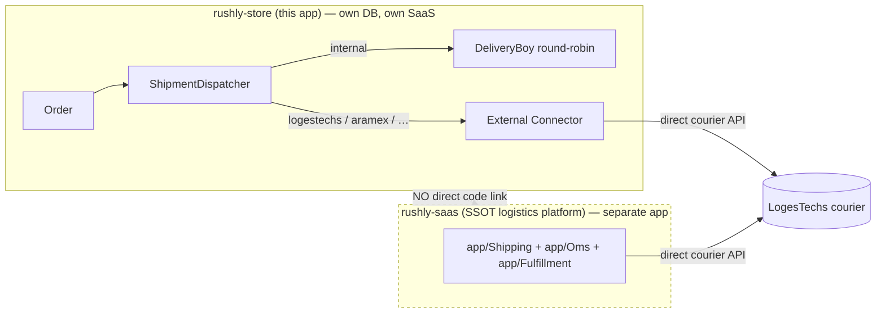
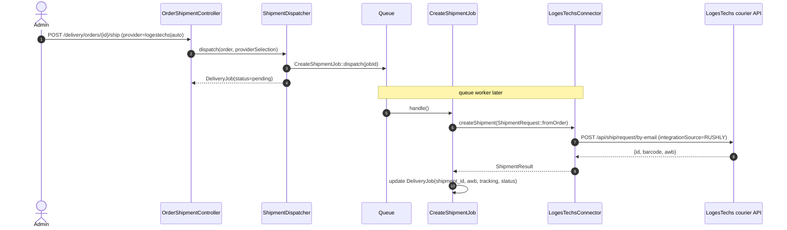

# rushly-store — Storefront System

> Scope: the standalone Laravel storefront / e-commerce SaaS at `/var/www/rushly-store`,
> deployed at **https://rushly.store**. This doc goes deep on what the app *is*, its stack,
> its custom **Delivery Integration Platform**, and — critically — **how (if at all) it feeds
> orders into the `rushly-saas` logistics platform**.
>
> Grounding: every non-trivial claim cites a real source file. Where a relationship does not
> exist in code, this doc says so explicitly rather than inventing one.
>
> Cross-refs: [../01-Workspace-Inventory.md](../01-Workspace-Inventory.md) ·
> [../05-System-Architecture.md](../05-System-Architecture.md) ·
> [../06-Database.md](../06-Database.md) ·
> [../11-Modules.md](../11-Modules.md) ·
> [../14-Integrations.md](../14-Integrations.md) ·
> [../shipping-architecture.md](../shipping-architecture.md)

---

## 1. TL;DR — what this is, and how it relates to rushly-saas

`rushly-store` is a **separate, self-contained multi-store e-commerce SaaS** — a customized build
of the **EcommerceGo / WorkDo** commerce platform (`README.md`; codebase markers such as the
`packages/workdo/*` path repository in `composer.json` and the WorkDo `LandingPage` package).
It runs its **own** Laravel 11 application, its **own** MySQL database (`rushly_store`), its
**own** subscription/plan billing (Paddle via `laravel/cashier-paddle`), and its **own** admin
+ storefront UI. It is **not** a client of the `rushly-saas` backend the way the Flutter apps
are (see [../01-Workspace-Inventory.md](../01-Workspace-Inventory.md)).

**Integration path into the rushly-saas logistics platform: Not found in the current codebase (as a
direct code link).** There is no API client, connector, webhook, or job in `rushly-store` that
posts orders to `rushly-saas` (`rushly.tech`) or its parcel API. A repo-wide search for
`rushly.tech`, `rushly-saas`, `parcels`, `createParcel`, `/api/parcel` across all PHP/MD/env files
(excluding `vendor/` and `node_modules/`) returns **only** an unrelated subdomain-seeder comment
(`database/seeders/SubdomainRoutingSeeder.php:41`, which uses `rushly.tech` merely as an example
`SUBDOMAIN_BASE` for storefront subdomains).

What the two systems **do** share is a **courier**, not a code path:

- `rushly-saas` ships parcels through **LogesTechs** as its first `app/Shipping/` provider
  (see [../shipping-architecture.md](../shipping-architecture.md)).
- `rushly-store` also has a **LogesTechs connector**
  (`app/Delivery/Connectors/LogesTechs/Connector.php`) — but it calls the **LogesTechs courier
  API directly** (`POST /api/ship/request/by-email`, tagged `integrationSource => 'RUSHLY'`),
  **not** rushly-saas.

So the relationship is **brand-level and courier-level, not integration-level**: two independent
Rushly products that can both hand shipments to the same regional courier. If a business goal is
for storefront orders to become parcels *inside* the rushly-saas logistics platform, that bridge
**does not exist in code today** — the closest analogue is the standalone `rushly-salla` app
(Salla↔Rushly order→parcel bridge), which `rushly-store` does **not** replicate.

⚠️ **Doc vs Code / expectation check:** One might expect a "storefront → parcel" flow into
rushly-saas (that pattern *is* documented for rushly-saas itself in the context brief:
`Commerce webhook → OMS OrderReceived → Fulfillment → Shipping`). That pipeline lives entirely in
**rushly-saas** (`app/Commerce/`, `app/Oms/`, `app/Fulfillment/`) and is fed by connectors like
Salla/WooCommerce/Zid — **not** by this `rushly-store` app. See
[../11-Modules.md](../11-Modules.md) and [../14-Integrations.md](../14-Integrations.md).

---

## 2. Tech stack (verified against `composer.json`)

| Layer | Choice | Source |
|---|---|---|
| Framework | **Laravel `^11.9`**, PHP **`^8.2`** | `composer.json` (require) |
| Deploy runtime | PHP-FPM **8.4** socket, nginx, MySQL 8, Let's Encrypt | `README.md` (Production deployment) |
| Auth | `laravel/sanctum ^4`, `laravel/socialite ^5.16`, `php-open-source-saver/jwt-auth ^2.6`, `santigarcor/laratrust ^8.3` (roles/permissions), `pragmarx/google2fa*` (2FA) | `composer.json` |
| Billing (SaaS plans) | `laravel/cashier-paddle ^1.9` | `composer.json` |
| Frontend | Vite + Tailwind + Alpine.js (built to `public/build/`); `tailwind.config.js`, `postcss.config.js`, `vite.config.js` | `README.md`, root config files |
| Theming | `qirolab/laravel-themer ^2.3` | `composer.json` |
| PDF / barcode / QR | `barryvdh/laravel-dompdf ^3`, `milon/barcode ^11`, `simplesoftwareio/simple-qrcode ^4.2` | `composer.json` |
| Tables / export | `yajra/laravel-datatables ^11`, `maatwebsite/excel ^3.1.x-dev` | `composer.json` |
| Model caching | `genealabs/laravel-model-caching ^12` (file-cache layer over Eloquent) | `composer.json`; behavior detailed in `docs/delivery/deployment.md` |
| Installer | `rachidlaasri/laravel-installer ^4.1` (web `/install` wizard) | `composer.json`, `README.md` |
| Impersonation | `lab404/laravel-impersonate ^1.7` | `composer.json` |
| AI | `orhanerday/open-ai ^5.2` (+ dev `openai-php/client`) — `AITemplateController` | `composer.json` |
| Storage | `league/flysystem-aws-s3-v3`, `aws/aws-sdk-php` (S3 disk optional) | `composer.json` |

⚠️ **Doc vs Code (versions):** Here the README is **consistent** with code — `README.md` says
"Laravel 11.9 / PHP 8.2+" and `composer.json` pins `laravel/framework ^11.9` + `php ^8.2`. This is
the **opposite** of `rushly-saas`, where the README claims Laravel 12 but `composer.json` pins
`^10.10` (see context brief). The two apps are on **different major Laravel versions** (store = 11,
saas = 10), which reinforces that they are separate codebases, not a shared monolith.

### Multi-tenancy model — different from rushly-saas

`rushly-store` is multi-**store**, scoped by a `store_id` foreign key and a `Store` model
(`app/Models/Store.php`, `app/Models/Order.php:43` has `store_id` in `$fillable`;
`getCurrentStore()` helper used throughout, e.g. `app/Models/Order.php:183`). Stores are addressed
by **slug / subdomain / custom domain** (`routes/customer.php` uses `{storeSlug?}` prefixes;
`StoreController@subDomain`/`@customDomain` in `routes/web.php:25-26`;
`database/seeders/SubdomainRoutingSeeder.php`).

This is **NOT** the `stancl/tenancy` per-tenant-DB model that `rushly-saas` uses
(see [../05-System-Architecture.md](../05-System-Architecture.md)). `rushly-store` keeps all stores
in **one** database, partitioned by `store_id`. The two apps therefore have **no shared tenancy
context** either.

---

## 3. Payment gateways (~30, all self-contained)

The commerce layer bundles roughly 30 payment integrations — one controller per gateway under
`app/Http/Controllers/` and a matching SDK in `composer.json`. Examples (non-exhaustive):
Stripe (`stripe/stripe-php`), PayPal (`srmklive/paypal`), Braintree, Paytm
(`anandsiddharth/laravel-paytm-wallet`), PhonePe, eSewa, Khalti, Mercado Pago, Mollie, Midtrans,
Xendit, Iyzico, PayTabs, MyFatoorah, Skrill (`obydul/laraskrill`), Authorize.net, CoinGate,
YooKassa, FedaPay, PayHere, Cashfree, Flutterwave, Ozow, DPO, SSLCommerz, Easebuzz, etc.
(`composer.json` require block; `routes/customer.php` imports 30+ `*PaymentController`/`*Controller`
classes). All are gateway-direct — none route money through rushly-saas.

---

## 4. Themes

Storefront rendering uses `qirolab/laravel-themer`. Installed themes live **outside** `public/`
under `themes/` and are served via nginx aliases with PHP execution denied (`README.md` nginx
block):

| Theme dir | Notes |
|---|---|
| `themes/greentic` | `assets/`, `views/`, `theme_json/`, `theme_img/`, `default_data/`, `verification.php` |
| `themes/stylique` | same structure |
| `themes/techzonix` | same structure |
| `themes/uniform` | present on disk (newest — `Jul 26`); README lists only the first three |

⚠️ **Doc vs Code:** `README.md` names three themes (`greentic`, `stylique`, `techzonix`); the
filesystem has a **fourth**, `themes/uniform/` (referenced as a `theme_id` example in
`docs/delivery/deployment.md`'s model-cache recipe). Code/disk wins — there are **four** themes.

Active theme selection is per-store (`Store.theme_id`) and applied by the `ActiveTheme` middleware
(`App\Http\Middleware\ActiveTheme`, wired in `routes/customer.php`). A separate `ThemeCustomize`
model + `ThemeCustomizeController` drives per-store visual customization. Storefront pages
(product list, product detail, cart, checkout, blog, FAQ, wishlist, order-track) are all rendered
through the theme layer via `HomeController` (`routes/customer.php`).

Custom landing pages are provided by the path-repo package **`packages/workdo/LandingPage`**
(symlinked via the Composer `repositories` path entry; migrations in a non-standard path
`packages/workdo/LandingPage/src/database/migrations` that must be run explicitly per `README.md`).

---

## 5. Key modules & domain models

85 Eloquent models live in `app/Models/` (`ls app/Models | wc -l` = 85). The commerce domain:

- **Catalog:** `Product`, `ProductVariant`, `ProductAttribute(+Option)`, `ProductImage`,
  `ProductBrand`, `ProductLabel`, `ProductQuestion`, `Category`, `Tag`, `FlashSale(+Condition)`.
- **Cart / checkout / orders:** `Cart`, `Order`, `OrderBillingDetail`, `OrderTaxDetail`,
  `OrderCouponDetail`, `OrderNote`, `OrderRefund(+Setting)`, `DeliveryAddress`, `Coupon`,
  `UserCoupon`, `Shipping`, `ShippingMethod`, `ShippingZone`, `Tax(Method/Option)`, `Currency`.
- **Customers & CMS:** `Customer`, `Blog(+Category)`, `Page`, `Menu(+Item)`, `Faq`, `Testimonial`,
  `Newsletter`, `Contact`, `SupportTicket`/`SupportConversion`.
- **SaaS platform:** `Store`, `Plan`, `PlanOrder`, `PlanRequest`, `PlanCoupon`, `PlanUserCoupon`,
  `User`, `Role`, `Permission`, `AddOnManager`/`Addon`, `Setting`/`AppSetting`.
- **Commerce connectors (inbound to the store):** `ShopifyConection` model +
  `codexshaper/laravel-woocommerce` package — i.e. the store can *import* from Shopify/WooCommerce.
  (Note direction: these pull products/orders **into** rushly-store; they do not push to
  rushly-saas.)
- **Delivery (the integration-relevant module):** `DeliveryConnector`, `DeliveryProvider`,
  `DeliveryProviderCredential`, `DeliveryJob`, `DeliveryWebhook`, `DeliveryBoy` — see §6.

Route surface: `routes/web.php` (~57 KB — admin/superadmin + delivery admin),
`routes/customer.php` (~17 KB — storefront), `routes/api.php` (~20 KB — mobile/JSON API),
`routes/auth.php`, `routes/console.php`. 123 top-level controllers in `app/Http/Controllers/`.

---

## 6. The Delivery Integration Platform (the closest thing to a logistics bridge)

This is a **custom, first-party module** (`app/Delivery/`) added to the EcommerceGo base — a
connector-based delivery abstraction with its own admin UI, webhook framework, auto-selection
scoring engine, and scaffolding command. It is documented in-repo under `docs/delivery/` and is the
only part of `rushly-store` that talks to external logistics at all. **It is an in-app alternative
to — not a client of — the rushly-saas logistics platform.**

### 6.1 The 9 connectors (`docs/delivery/README.md`, verified on disk)

| Driver | Class | Talks to | Status |
|---|---|---|---|
| `internal` | `Connectors/Internal/Connector.php` | **in-store `DeliveryBoy`** round-robin driver assignment (writes `orders.deliveryboy_id`) — no external API | Production-ready |
| `logestechs` | `Connectors/LogesTechs/Connector.php` | **LogesTechs courier API directly** (`/api/ship/request/by-email`, guest + customer-login flows) | Production-ready |
| `custom_rest` | `Connectors/CustomRest/Connector.php` | any REST endpoint the merchant configures (HMAC-SHA256 webhook verify) | Production-ready |
| `aramex` | `Connectors/Aramex/` | Aramex (credential schema real; `createShipment` stubbed) | Skeleton |
| `smsa` | `Connectors/SMSA/` | SMSA (passkey) | Skeleton |
| `ajex` | `Connectors/AJEX/` | AJEX (OAuth2) | Skeleton |
| `dhl` | `Connectors/DHL/` | MyDHL (basic-auth) | Skeleton |
| `fedex` | `Connectors/FedEx/` | FedEx (OAuth2 client-credentials) | Skeleton |
| `ups` | `Connectors/UPS/` | UPS (OAuth2) | Skeleton |

**Notably absent: a `rushly` / `rushly-saas` connector.** The set is *internal drivers* +
*direct-to-courier* connectors. None targets the rushly-saas parcel/AWB API.

### 6.2 Architecture

Every connector implements `App\Delivery\Contracts\DeliveryConnectorInterface`
(`createShipment`, `cancelShipment`, `printLabel`, `trackShipment`, `getShipmentStatus`,
`calculateRate`, `createPickup`, `syncStatuses`, `verifyWebhook`, `webhook`, `healthCheck`, …) and
extends `App\Delivery\Support\AbstractConnector` (unsupported methods throw `NotSupportedException`).
Discovery is dynamic: `Providers/DeliveryServiceProvider.php` auto-registers each
`Connectors/*/ServiceProvider.php` into `ConnectorRegistry`; `DeliveryConnectorFactory` resolves a
`DeliveryProvider` row → a live connector instance.

`Services/ShipmentDispatcher.php` is the entry point:

- `internal` driver → **synchronous** (`runInternal()` picks a driver, sets
  `orders.deliveryboy_id`, writes the `DeliveryJob`).
- every other driver → **queued** via `Jobs/Delivery/CreateShipmentJob` (retries 3× with backoff),
  so admin UI returns instantly and courier-API failures never block the order.
- provider selection can be a specific `provider_id` **or** `"auto"` →
  `Services/AutoSelectService::pickFor($order)` (hard filters on coverage/weight/COD/return, then
  weighted scoring on priority/load/ETA/cost/working-hours; `docs/delivery/auto-selection.md`).

Idempotency: `DeliveryJob::firstOrCreate([order_id, provider_id])`
(`Services/ShipmentDispatcher.php`).

### 6.3 Data model (5 delivery tables)

Per `docs/delivery/diagrams.md` + models in `app/Models/`:

| Table | Grain | Purpose |
|---|---|---|
| `delivery_connectors` | 1 per installed plugin | global catalog, seeded by `DeliveryConnectorsSeeder` |
| `delivery_providers` | many per store (`store_id`) | a store's configured instance of a connector (priority, coverage, `supports_cod`, `settings_json`) |
| `delivery_provider_credentials` | 1 per (provider, env) | secrets — `password/token/secret/refresh_token` use Eloquent `encrypted` cast (APP_KEY) |
| `delivery_jobs` | 1 per (order, provider) | the shipment — idempotent `firstOrCreate`; holds `awb`, `tracking_number`, `status` |
| `delivery_webhooks` | 1 per inbound event | raw payload + headers + `dedup_key` (unique) |

These tables are **local to `rushly_store`** (see [../06-Database.md](../06-Database.md) for the
rushly-saas schema, which is entirely separate — different DB, different parcel model).

### 6.4 Inbound webhooks

Public receiver `POST /webhooks/{driver}` (`routes/web.php:138`, CSRF-exempt via `bootstrap/app.php`
`webhooks/*`) → `Http/Controllers/Delivery/WebhookController@receive` stores + dedups
(`X-Event-Id`/`X-Request-Id` → body `event_id`/`id` → `sha256(body|timestamp)`) → queues
`Jobs/Delivery/ProcessWebhookJob` → per-connector `verifyWebhook()` (HMAC) then `webhook()` →
matches `TrackingUpdate.trackingNumber` to a `DeliveryJob` → updates status → fires
`TrackingUpdated` / `ShipmentDelivered`. Never returns 5xx on business errors
(`docs/delivery/webhooks.md`). These webhooks come **from couriers**, not from rushly-saas.

### 6.5 Scheduling & ops

- `routes/console.php` schedules **`delivery-sync-tracking`** every 15 min: for each active
  `DeliveryProvider`, dispatch `SyncTrackingJob` to poll open shipments (`withoutOverlapping`).
- Admin UI under `/delivery/*` (`routes/web.php:515-537`): provider CRUD + credential wizard +
  test-connection, per-order ship/cancel/tracking/explain-auto, webhooks list/detail/retry.
- Scaffolding: `php artisan delivery:make-connector "Name"` generates a 4-file connector from
  `stubs/delivery/connector/` (`Console/Commands/MakeDeliveryConnector.php`).
- **Model-cache gotcha:** delivery models use `genealabs/laravel-model-caching`; direct
  `DB::table()->update()` does **not** invalidate — must go through Eloquent + `modelCache:clear`
  (full recipe in `docs/delivery/deployment.md`).

---

## 7. Deployment & operational notes (`README.md`)

- App root `/var/www/rushly-store`, doc root `.../public`, nginx vhost
  `/etc/nginx/sites-available/rushly.store`, PHP-FPM `php8.4-fpm.sock`, DB `rushly_store` (MySQL 8).
- `packages/*` and `themes/*` live outside `public/` and are exposed via nginx aliases with
  PHP execution denied.
- Storage bridge: `storage/app/public/uploads → ../../uploads` symlink so seeded landing-page
  image paths resolve via the standard Laravel disk (recreate after clone).
- **Autoload gotcha:** `app/Helper/helper.php` must sit in `autoload.files` (it does —
  `composer.json:91-93`), because production seeders call helpers like `defaultSetting()`;
  `composer install --no-dev` would fail seeding otherwise.
- Fresh installs redirect to `/install` (`rachidlaasri/laravel-installer`); mark complete via
  `storage/installed` if seeded through CLI.
- `storage/framework/{sessions,views,cache,testing}` are not in the repo — create before first
  `artisan` run.
- Queue worker is **required** (all shipment creation, tracking polls, webhook processing, label
  generation run on the queue); Supervisor config in `docs/delivery/deployment.md`. Default
  `QUEUE_CONNECTION=database` (`.env.example`), Redis recommended for volume.

---

## 8. Summary — integration verdict

| Question | Answer | Evidence |
|---|---|---|
| Is `rushly-store` part of the `rushly-saas` monolith? | **No** — separate app, separate DB, separate Laravel major version (11 vs 10) | `composer.json`, `README.md` |
| Is it a client of the rushly-saas API (like the Flutter apps)? | **No** — no rushly-saas/rushly.tech API calls exist | repo-wide grep (only a subdomain-seeder comment matches) |
| Does it push storefront orders into the rushly-saas logistics platform? | **Not found in the current codebase** | no `rushly` connector; `app/Delivery/Connectors/*` are internal + direct-to-courier |
| Then how do orders get shipped? | Via its **own** Delivery Integration Platform — `internal` (DeliveryBoy) or direct courier connectors (LogesTechs live; Aramex/SMSA/AJEX/DHL/FedEx/UPS skeleton) | `app/Delivery/*`, `docs/delivery/*` |
| What actually connects the two products? | A **shared courier (LogesTechs)** and the **Rushly brand** — not code | `app/Delivery/Connectors/LogesTechs/Connector.php` vs `rushly-saas` `app/Shipping/` |

**Architectural note for future work:** if orders from `rushly-store` should become parcels inside
the rushly-saas logistics platform, the missing piece is a connector/bridge analogous to
`rushly-salla` (order→parcel + AWB writeback). One could be added as a `rushly` driver under
`app/Delivery/Connectors/` calling the rushly-saas Commerce/OMS ingestion endpoint — but **no such
connector exists today.** See [../14-Integrations.md](../14-Integrations.md) and
[../11-Modules.md](../11-Modules.md) for the rushly-saas side that would receive it.

---

## Sources

Files and directories opened for this doc (all under `/var/www/rushly-store` unless noted):

- `README.md`, `composer.json`, `.env.example`
- `routes/web.php`, `routes/customer.php`, `routes/console.php`
- `app/` (top-level listing), `app/Models/` (full listing), `app/Http/Controllers/` (listing)
- `app/Models/Order.php`
- `app/Delivery/` (full tree) — `Contracts/`, `DTO/`, `Services/ShipmentDispatcher.php`,
  `Services/AutoSelectService.php` (via docs), `Support/AbstractConnector.php`, `ConnectorRegistry.php`,
  `DeliveryConnectorFactory.php`
- `app/Delivery/Connectors/Internal/Connector.php`, `.../LogesTechs/Connector.php`,
  `.../LogesTechs/Config.php`
- `database/seeders/DeliveryConnectorsSeeder.php`, `database/seeders/SubdomainRoutingSeeder.php`
- `docs/delivery/README.md`, `webhooks.md`, `auto-selection.md`, `deployment.md`, `diagrams.md`,
  `adding-connectors.md`
- `themes/` (listing), `packages/workdo/LandingPage/src/` (listing)
- `/var/www/rushly-saas/docs/_CONTEXT_BRIEF.md` (shared context)
- Cross-referenced (not re-derived): `/var/www/rushly-saas/docs/shipping-architecture.md`,
  `../11-Modules.md`, `../14-Integrations.md`
