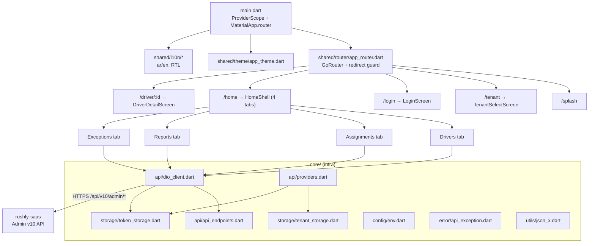
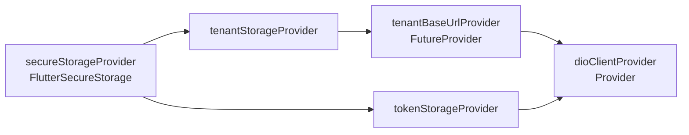
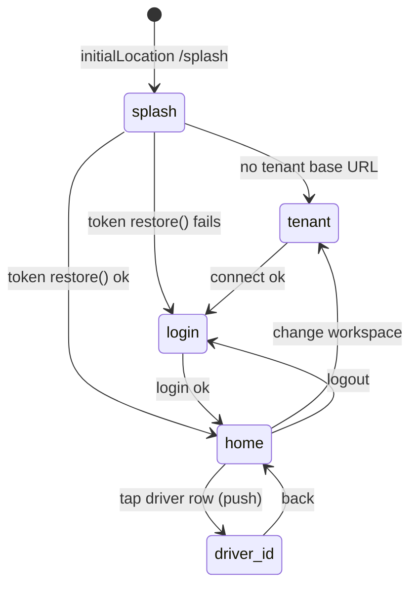
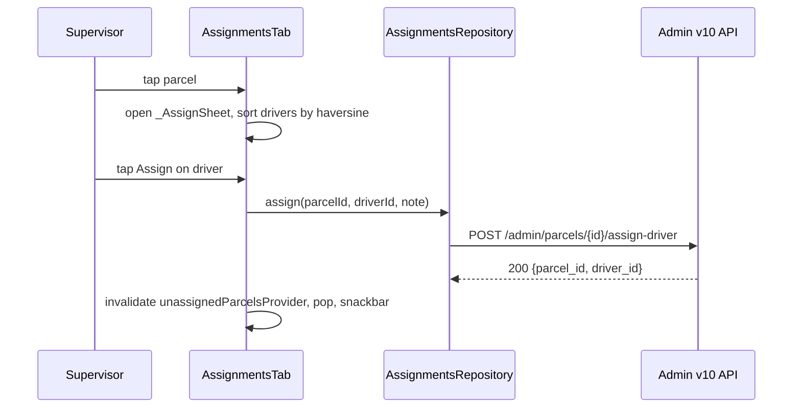

# rushly-supervisor-app — Supervisor

> Field-supervision mobile client for the Rushly logistics platform. A thin, read-mostly
> Flutter app that lets a **back-office supervisor / hub incharge** watch drivers live,
> assign unassigned parcels to the nearest driver, review per-driver performance, and
> triage delivery exceptions (open NDRs, stuck parcels, returns).
>
> **Ground truth:** this app is a *client* of `rushly-saas` (SSOT). Every screen maps to
> the admin mobile API under `routes/api.php` → `Route::prefix('v10/admin')`. Nothing is
> computed locally that the backend doesn't already return; the app is a presentation +
> light-orchestration layer.

**Project root:** `/var/www/rushly-supervisor-app`
**Backend:** `/var/www/rushly-saas` (Laravel 10 — see [_CONTEXT_BRIEF](../_CONTEXT_BRIEF.md))
**Size:** 32 Dart files, 4 feature tabs + 2 auth/tenant screens + 1 driver-detail screen.

Cross-references:
- [../08-Flutter.md](../08-Flutter.md) — shared Flutter conventions across all Rushly apps
- [../09-API.md](../09-API.md) — the v10 API surface
- [../10-Authentication.md](../10-Authentication.md) — Sanctum + apiKey + role gating
- [../modules/drivers-deliverymen.md](../modules/drivers-deliverymen.md) — driver domain
- [../modules/parcels.md](../modules/parcels.md) — parcel statuses & assignment
- [../modules/reports-analytics-performance.md](../modules/reports-analytics-performance.md) — reporting
- Sibling client: [rushly-admin-app.md](rushly-admin-app.md) (same `/admin/*` backend, broader scope)

---

## 1. Purpose & target user

| | |
|---|---|
| **Who** | A courier-company **supervisor** — mapped on the backend to `user_type` ∈ {`ADMIN`=1, `SUPER_ADMIN`=6, `INCHARGE`=4, `HUB`=5}. Merchants (2) and deliverymen (3) are rejected even with a valid token. |
| **Job to be done** | Stand over a hub's live operation: *who is where*, *what still needs a driver*, *who is performing*, *what is going wrong*. |
| **Not** | Not a driver app (no self-delivery flow), not the full admin console (no merchant approvals, cash, WMS, fraud, support — those live in `rushly-admin-app`). |
| **Scope guard** | For `HUB` / `INCHARGE` users every backend query is **hub-clamped** to `user.hub_id`; `ADMIN` / `SUPER_ADMIN` see the whole tenant. This clamp is enforced server-side, not in the app (see [§10 Permissions](#10-permissions--hub-scoping)). |

The app deliberately reuses the **admin** backend controllers rather than a bespoke
"supervisor" API. Several controllers (`AdminMapController`, `AdminReportsController`,
`AdminExceptionsController`) carry docblocks stating they exist *"primarily for the
supervisor mobile app"* — so the coupling is intentional and documented on the server side.

---

## 2. High-level architecture

Feature-first layout under `lib/`, each feature split `data / domain / presentation`
(Riverpod repository → immutable model → widget). Shared plumbing lives in `core/`
(cross-cutting infra) and `shared/` (cross-feature UI: router, theme, l10n).

**Layer responsibilities**

| Layer | Files | Role |
|---|---|---|
| Presentation | `features/*/presentation/*.dart` | `ConsumerWidget` / `ConsumerStatefulWidget` screens; watch `FutureProvider`s, render `AsyncValue.when(...)`. |
| State | Riverpod providers colocated in `data/*_repository.dart` | `FutureProvider.autoDispose` per read; one `NotifierProvider` for auth session. |
| Data (repository) | `features/*/data/*_repository.dart` | Wrap `DioClient`, hit an endpoint, map JSON → domain model. |
| Domain (model) | `features/*/domain/*.dart` | Immutable value objects with `fromJson` factories + computed getters (`isActive`, `hasLocation`, `total`, `deliveryRate`). |
| Core infra | `core/api`, `core/storage`, `core/config`, `core/error`, `core/utils` | Dio + interceptors, secure storage, env, error envelope, JSON coercion helpers. |
| Shared UI | `shared/router`, `shared/theme`, `shared/l10n` | Routing, Material-3 theme, in-code localization. |

---

## 3. Packages (`pubspec.yaml`)

`name: rushly_supervisor`, `version: 1.0.0+1`, Dart SDK `>=3.3.0 <4.0.0`, Flutter `>=3.19.0`.

| Package | Version | Used for |
|---|---|---|
| `flutter_riverpod` | ^2.5.1 | All state / DI (providers, `Notifier`). |
| `dio` | ^5.5.0 | HTTP client (`core/api/dio_client.dart`). |
| `pretty_dio_logger` | ^1.4.0 | Debug-only request logging (added only when `kDebugMode`). |
| `flutter_secure_storage` | ^9.2.2 | Encrypted token + tenant base-URL storage. |
| `shared_preferences` | ^2.2.3 | Declared in deps but **no usage found in `lib/`** — reserved, currently dead. |
| `google_fonts` | ^6.2.1 | Inter (en) / Tajawal (ar) text themes. |
| `intl` | ^0.20.2 | Date formatting (`DateFormat.MMMd()`, `yyyy-MM-dd`) + relative times. |
| `flutter_dotenv` | ^5.1.0 | Loads `.env` (bundled as a Flutter asset). |
| `go_router` | ^14.2.0 | Declarative routing + redirect auth-gate. |
| `url_launcher` | ^6.3.0 | "Directions" deep-link to Google Maps from driver detail. |
| `flutter_localizations` (SDK) | — | Global Material/Widgets/Cupertino localization delegates. |

Dev: `flutter_test`, `flutter_lints ^4.0.0`. `flutter: generate: true` is set but l10n is
hand-rolled (see [§7](#7-localization-aren-rtl)) — **⚠️ no `l10n.yaml` / `.arb` files exist**, so
`generate` currently does nothing.

> **⚠️ Doc vs Code — no push / Firebase.** The `_CONTEXT_BRIEF` lists no notification feature
> for this app, and indeed there is **no `firebase_messaging` / FCM dependency and no
> notification code anywhere in `lib/`**. The backend *does* expose `POST /admin/fcm-subscribe`
> / `/admin/fcm-unsubscribe` (`routes/api.php:206-207`, `AdminPushController`), but the
> supervisor app never calls them. Push is **Not implemented in the current codebase** for this
> client. See [§11 Notifications](#11-notifications--push).

---

## 4. Configuration & environment (`core/config/env.dart`, `.env.example`)

`.env` is bundled as an asset (`pubspec.yaml → flutter.assets: [.env]`) and loaded in
`main()` before `runApp`. `Env` reads it via `dotenv.maybeGet` with hardcoded fallbacks.

| Key | `.env.example` value | Fallback in `Env` | Meaning |
|---|---|---|---|
| `API_BASE_URL` | `https://admin.rushly-logistic.com/api/v10` | `https://api.rushly-logistic.com/api/v10` | Default base URL when no tenant is selected. |
| `API_KEY` | `123456rx-ecourier123456` | same | Sent as `apiKey` header on **every** request; validated by `CheckApiKeyMiddleware` against `config('rxcourier.api_key')`. |
| `TENANT_HOST_SUFFIX` | `rushly-logistic.com` | `rushly-logistic.com` | Suffix appended to a typed workspace slug → `https://<slug>.<suffix>/api/v10`. |

> **⚠️ Doc vs Code — two different default hosts.** `.env.example` ships `admin.` but the
> in-code fallback is `api.`. In practice neither default is used at runtime because the
> tenant-select screen always writes a concrete per-tenant base URL to secure storage before
> login (see [§6 Tenant / multi-tenancy](#6-tenant-selection--multi-tenancy)). The `Env.apiBaseUrl`
> value only applies if `tenantBaseUrlProvider` resolves null, which the router guard prevents.

> **⚠️ Security note.** The `apiKey` is a *static shared secret baked into the shipped binary*
> and the same across the fleet of apps. It is a coarse gate, **not** per-user auth — the real
> auth is the Sanctum bearer token (see [../17-Security.md](../17-Security.md)).

---

## 5. Networking / API layer (`core/api/*`)

### 5.1 `ApiEndpoints` (`core/api/api_endpoints.dart`)

Central constant table. All paths are relative to the tenant base URL (`…/api/v10`).

| Constant | Path | Consumed by | Backend route |
|---|---|---|---|
| `login` | `/admin/login` | `AuthRepository.login` | `api.php:151` `AdminAuthController@login` |
| `profile` | `/admin/profile` | `AuthRepository.profile` | `api.php:154` `@profile` |
| `logout` | `/admin/logout` | `AuthRepository.logout` | `api.php:155` `@logout` |
| `generalSettings` | `/general-settings` | *(tenant screen uses the literal string, not this const)* | `api.php:246` `GeneralSettingCotroller@index` |
| `mapDrivers` | `/admin/map/drivers` | `DriversRepository.live` | `api.php:210` `AdminMapController@drivers` |
| `drivers` | `/admin/drivers` | **unused** (declared, no caller) | `api.php:187` `AdminDriverController@index` |
| `driver(id)` | `/admin/drivers/{id}` | `DriversRepository.detail` | `api.php:188` `AdminDriverController@show` |
| `mapParcels` | `/admin/map/parcels` | `AssignmentsRepository.unassigned` | `api.php:209` `AdminMapController@parcels` |
| `parcelAssign(id)` | `/admin/parcels/{id}/assign-driver` | `AssignmentsRepository.assign` | `api.php:177` `AdminParcelController@assignDriver` |
| `dashboardSnap` | `/admin/dashboard` | **unused** | `api.php:157` `AdminDashboardController@index` |
| `dashboardTimeseries` | `/admin/dashboard/timeseries` | **unused** | `api.php:158` `@timeseries` |
| `reportsDrivers` | `/admin/reports/drivers` | `ReportsRepository.drivers` | `api.php:224` `AdminReportsController@drivers` |
| `exceptions` | `/admin/exceptions` | `ExceptionsRepository.feed` | `api.php:225` `AdminExceptionsController@index` |

> **Doc note.** `drivers`, `dashboardSnap`, `dashboardTimeseries` are declared but have no
> caller in `lib/` — reserved for a future "dashboard" surface. The Reports tab uses only
> `reports/drivers`; there is **no dashboard tab** despite the endpoints existing.

### 5.2 `DioClient` (`core/api/dio_client.dart`)

- Constructed with a resolved `baseUrl` (from `TenantStorage`, via `dioClientProvider`).
- Base headers: `Accept: application/json`, `apiKey: <Env.apiKey>`.
- Timeouts: connect 20s, receive 30s, send 30s.
- **Request interceptor** injects `Authorization: Bearer <token>` when a token exists in
  `TokenStorage`.
- **Error interceptor**: on HTTP **401** it clears the token and fires the `onUnauthorized`
  callback (a hook; not wired to navigation in the current build — the router guard and
  `AuthController.restore()` handle re-auth instead).
- **Response unwrapping** (`_unwrap`): if the body is a `Map` containing a `data` key, it
  returns `body['data']`; otherwise the raw body. This peels the standard success envelope
  `{ success, message, data }` produced by `ApiReturnFormatTrait::responseWithSuccess`
  (`rushly-saas app/Traits/ApiReturnFormatTrait.php`), so repositories receive the inner
  `data` object directly.
- `PrettyDioLogger` added only in `kDebugMode`.

### 5.3 Providers (`core/api/providers.dart`)

Because `dioClientProvider` `watch`es `tenantBaseUrlProvider`, invalidating the base-URL
provider (on connect / change-workspace) rebuilds the Dio client against the new tenant host.

### 5.4 Error model (`core/error/api_exception.dart`)

`ApiException.fromDio` extracts `response.data['message']` when present, else `DioException.message`,
and preserves `statusCode`. Repositories throw it; screens render `e.toString()` inside
`AsyncValue.when(error: …)`. There is no localized error mapping — server messages surface raw.

### 5.5 JSON coercion (`core/utils/json_x.dart`)

Defensive helpers (`asInt`, `asIntOrNull`, `asDouble` — strips commas — `asString`,
`asListOfMaps`) used by every `fromJson`. This tolerates the backend returning numbers as
strings or nulls, a common quirk of the legacy `rxcourier` payloads.

---

## 6. Tenant selection & multi-tenancy

`rushly-saas` uses **stancl/tenancy** with per-subdomain identification
(`{tenant}.rushly.tech` in prod config; here `{slug}.rushly-logistic.com`). The app models
this as a *workspace* the user connects to **before** logging in — mirroring the other Rushly
mobile clients (`TenantStorage` docblock notes the shared key shape for "muscle memory").

`core/storage/tenant_storage.dart` persists two encrypted keys: `tenant_api_base`
(full base URL) and `tenant_label` (display name).

**`TenantSelectScreen` (`features/tenant/presentation/tenant_select_screen.dart`)** — two modes:

| Mode | Input | URL built (`_buildBaseUrl`) | Validation |
|---|---|---|---|
| Simple (default) | Workspace slug, e.g. `acme` | `https://acme.<TENANT_HOST_SUFFIX>/api/v10` | `^[a-z0-9][a-z0-9-]*$` (lowercase letters/digits/hyphens); non-empty. |
| Advanced | Full URL | trims trailing `/`; if no `/api/` in it, appends `/api/v10` | must parse as a URI with a scheme. |

A live `→ <preview>` line shows the resolved URL as the user types. On **Connect**
(`_connect`) the screen makes a *throwaway* Dio call to `GET /general-settings` (8s timeout,
`apiKey` header, **no** bearer) as a reachability probe. On success it writes
`{baseUrl, label}` to `TenantStorage`, invalidates `tenantBaseUrlProvider`, and routes to
`/login`. Failures surface `HTTP <code>` or the Dio message in red.

**Change workspace** (from `HomeShell` app-bar business icon → confirm dialog): logs out,
clears `TenantStorage`, invalidates the base-URL provider, routes back to `/tenant`.

---

## 7. Localization (ar/en, RTL)

- Supported locales: `en`, `ar` (`AppLocalizations.supported`).
- **Default locale is Arabic** — `LocaleController() : super(const Locale('ar'))`
  (`shared/l10n/locale_controller.dart`). RTL is applied automatically by Flutter's
  `Directionality` since `ar` is an RTL language and the app uses `MaterialApp.router` with the
  global localization delegates registered in `main.dart`.
- **Hand-rolled dictionary** — `shared/l10n/app_localizations.dart` holds two inline maps
  (`_en`, `_ar`) and typed getters; there are **no `.arb` files** and no generated
  `AppLocalizations`. `_t(key)` falls back ar → en → key.
- `LanguageToggleButton` flips locale at runtime via `localeProvider.notifier.toggle()`.
- Theme swaps font per locale: **Tajawal** for `ar`, **Inter** for `en`
  (`shared/theme/app_theme.dart`).

> **⚠️ Doc vs Code — partial Arabic coverage.** Several strings are English-only even in the
> `_ar` map: `appTagline` (identical English string in both maps), and the four tab labels
> `tab_0..tab_3` ("Drivers / Assignments / Reports / Exceptions") plus their `_desc` values are
> hardcoded English in **both** locales. So Arabic users see English tab labels. The
> `stuckParcels(days)` and `assignedSnack(...)` helpers, by contrast, are correctly localized.

---

## 8. Theme (`shared/theme/app_theme.dart`)

- Material 3 (`useMaterial3: true`), `ColorScheme.fromSeed`.
- Seed color **`#00695C` (Teal 800)** for both light and dark.
- Light scaffold background `Colors.white`; dark `#121212`.
- Per-locale Google Fonts text theme (Tajawal/Inter) as above.
- Both `theme` and `darkTheme` supplied; the OS drives light/dark (no in-app theme toggle).

---

## 9. Routing (`shared/router/app_router.dart`, go_router)

**Routes**

| Path | Builder | Notes |
|---|---|---|
| `/splash` | `_Splash` | Bootstraps: reads tenant base URL, else `restore()`; routes to `/tenant`, `/home`, or `/login`. |
| `/tenant` | `TenantSelectScreen` | Public. |
| `/login` | `LoginScreen` | Public. |
| `/home` | `HomeShell` | Guarded; 4-tab shell. |
| `/driver/:id` | `DriverDetailScreen` | Guarded; `id` parsed to `int`. Reached via `context.push`. |

**Redirect guard** (`GoRouter.redirect`), evaluated on each navigation:
1. `/splash` → no redirect (let splash decide).
2. If no tenant base URL configured and not on `/tenant` → `/tenant`.
3. If tenant configured and on `/tenant` → `/login`.
4. If not authenticated and route is not public (`/login`,`/tenant`) → `/login`.
5. If authenticated and on `/login` → `/home`.

Guard reads `tenantBaseUrlProvider` and `authControllerProvider` synchronously via
`ref.read`. `_Splash` does the async bootstrapping: it awaits `tenantBaseUrlProvider.future`,
then `AuthController.restore()`.

---

## 10. Authentication & session

### 10.1 Backend contract

The `/admin/*` group is gated by **two** middlewares (`routes/api.php:150,153`):
`CheckApiKey` (static `apiKey` header) then `auth:sanctum` + `CheckAdminRole`.
`CheckAdminRoleMiddleware` admits only `user_type` ∈ {ADMIN, SUPER_ADMIN, INCHARGE, HUB};
merchants/deliverymen get `403 Forbidden` even with a valid token.

`AdminAuthController@login` (`app/Http/Controllers/Api/V10/Admin/AdminAuthController.php`):
- Validates `email`, `password` (min 6).
- `Auth::attempt`; on success re-checks `user_type` is a back-office type, else `401`.
- Issues a Sanctum token `createToken('admin:<email>')`, returns
  `{ token, user: AdminUserResource }`.
- `@profile` returns `{ user }`; `@logout` deletes **all** the user's tokens.

### 10.2 App side

| File | Role |
|---|---|
| `core/storage/token_storage.dart` | Secure-storage keys `auth_token`, `auth_user`. |
| `features/auth/data/auth_repository.dart` | `login` (POST, stores `token`), `profile` (GET), `logout` (POST then always `clear()`). |
| `features/auth/presentation/auth_controller.dart` | `Notifier<AuthState>` — `isAuthenticated == userEmail != null`. |

**Session restore** (`AuthController.restore`): reads stored token; if present, calls
`profile()` — success ⇒ authenticated. **Quirk:** on restore it sets
`AuthState(userEmail: 'unknown')` (it does not read the real email from the profile
response), so after a cold start the session is valid but `userEmail` is the literal
`'unknown'`. On failure it clears the token. The user email is only accurate right after an
in-session `login`.

> **⚠️ Note.** `TokenStorage` has `writeUser` / `readUser`, but no code ever calls `writeUser`,
> so `auth_user` is never populated — the `userEmail: 'unknown'` fallback is a direct
> consequence.

---

## 11. Notifications / push

**Not implemented in the current codebase.** No FCM/APNs dependency, no permission request,
no token registration, no `AdminPushController` call. Exceptions and driver status are surfaced
**pull-only** (pull-to-refresh + `autoDispose` re-fetch on tab focus). See the
[../modules/notifications.md](../modules/notifications.md) module doc for the backend push
infrastructure this app deliberately does not use yet.

---

## 12. Home shell (`features/dashboard/presentation/home_shell.dart`)

A `NavigationBar` over an `IndexedStack` (tab state preserved when switching). App bar:
title = app name, **business** icon (change workspace, with confirm dialog), **logout** icon.

| Index | Tab | Icon | Screen |
|---|---|---|---|
| 0 | Drivers | `delivery_dining` | `DriversTab` |
| 1 | Assignments | `assignment_ind` | `AssignmentsTab` |
| 2 | Reports | `insights` | `ReportsTab` |
| 3 | Exceptions | `priority_high` | `ExceptionsTab` |

`placeholder_screen.dart` (`PlaceholderScreen`, "coming soon") exists as a scaffold helper but
is **not referenced** by the shell — all four tabs are real, implemented features.

---

## 13. Per-screen documentation

### 13.1 Login (`features/auth/presentation/login_screen.dart`)

| | |
|---|---|
| **Purpose** | Authenticate a back-office user against the selected tenant. |
| **UI** | Supervisor icon, title/tagline, email field (autofocus, email keyboard), password field (obscure toggle), Sign-in `FilledButton` (spinner while loading). Language toggle in app bar. |
| **Validation** | Email: required + must contain `@`. Password: required + min 6 chars. |
| **Business logic** | `AuthController.login(email.trim(), password)` → `AuthRepository.login` POST `/admin/login`; token persisted to secure storage. |
| **API** | `POST /admin/login` → `AdminAuthController@login`. Body `{email, password}`. Envelope `data.token`, `data.user`. |
| **Navigation** | On success `context.go('/home')`; on failure a SnackBar shows `state.error` (raw server message) or localized `loginFailed`. |
| **Permissions** | None client-side; server enforces back-office `user_type` (else 401). |

### 13.2 Tenant select — covered in [§6](#6-tenant-selection--multi-tenancy).

### 13.3 Drivers tab (`features/drivers/presentation/drivers_tab.dart`)

| | |
|---|---|
| **Purpose** | Live roster of drivers with online status, current load, and last-seen freshness. |
| **UI** | `ListView.separated` of `_DriverTile`: colored avatar (green = active/`status==1`, grey otherwise), name (or `#id`), subtitle `hub • load: N • <relative seen>`, trailing GPS icon (`gps_fixed` green if located, else `gps_off` grey). Pull-to-refresh. Empty → `noDrivers`. |
| **Business logic** | `liveDriversProvider` (`FutureProvider.autoDispose`) → `DriversRepository.live()`. `_relative(seenAt)`: `just now` < 1m, `Nm` < 1h, `Nh` < 24h, else `MMM d`. |
| **API** | `GET /admin/map/drivers` → `AdminMapController@drivers`. Returns `data.drivers[]` with `{id,name,phone,status,hub_id,hub_name,load,lat,lng,seen_at}`. `load` = parcels assigned & not delivered/returned; `lat/lng/seen_at` = driver's most recent `ParcelEvent` coords (no dedicated `driver_locations` table). |
| **Navigation** | Tap → `context.push('/driver/:id')`. |
| **Permissions** | HUB/INCHARGE list is hub-clamped server-side (`clampToHub`). |

### 13.4 Driver detail (`features/drivers/presentation/driver_detail_screen.dart`)

| | |
|---|---|
| **Purpose** | Deep view of one driver: identity, balance, today's throughput, last GPS fix. |
| **UI** | Identity card (name, unique_id, phone, email, hub, current balance); two stat cards (Assigned today / Delivered today); optional last-location card with a **Directions** button that opens Google Maps via `url_launcher`. Pull-to-refresh. |
| **Business logic** | `driverDetailProvider(id)` (family) → `DriversRepository.detail(id)`. Balance formatted to 2 dp; coords to 5 dp. |
| **API** | `GET /admin/drivers/{id}` → `AdminDriverController@show`. Returns `data.driver{...}`, `data.today{assigned,delivered}`, `data.last_location{lat,lng,updated_at}|null`. `assigned` = parcels whose `updated_at` is today; `delivered` = today's DELIVERED count; `last_location` = latest `ParcelEvent`. |
| **Navigation** | Back to Drivers tab. External deep-link to Google Maps. |
| **Permissions** | Server `ensureHubMatch` → **403 "Hub mismatch"** if a HUB/INCHARGE opens a driver outside their hub. The app renders that 403 message raw in the error state. |

### 13.5 Assignments tab (`features/assignments/presentation/assignments_tab.dart`)

| | |
|---|---|
| **Purpose** | Work queue of **unassigned** parcels; assign each to the nearest available driver. |
| **UI** | `ListView` of `_ParcelTile` (shipping avatar, tracking id, `customer • phone • merchant`, trailing COD). Tap opens a `DraggableScrollableSheet` (`_AssignSheet`) listing drivers **sorted by haversine distance** to the parcel, each row `hub • load N • X.X km` (or `noLocation`) + per-row **Assign** button with inline spinner. Pull-to-refresh. Empty → `noUnassignedParcels`. |
| **Business logic** | `unassignedParcelsProvider` → `AssignmentsRepository.unassigned()`; `driversForAssignmentProvider` re-uses `DriversRepository.live()`. Distance computed **client-side** in `_distanceKm` (haversine, R=6371 km); drivers without a location sort last (`double.infinity`). On assign, invalidates `unassignedParcelsProvider`, closes the sheet, shows `assignedSnack(tracking, driver)`. |
| **API** | List: `GET /admin/map/parcels?limit=200` → `AdminMapController@parcels` (`data.parcels[]` with `{id,tracking_id,status,lat,lng,customer_name,customer_phone,hub_id,merchant_name,cod}`; only parcels with `delivery_man_id NULL`, an **open** status, and non-null customer coords). Assign: `POST /admin/parcels/{id}/assign-driver` body `{driver_id, note}` → `AdminParcelController@assignDriver`. |
| **Validation** | Server: `driver_id` required + `exists:delivery_men,id`; `note` nullable max 500. App sends a fixed note `"Assigned via supervisor app"`. |
| **Backend effect** | Sets `parcel.delivery_man_id` (+ inherits driver's `hub_id`), then appends a `ParcelEvent` via `deliverymanAssign` (which may flip status to `DELIVERY_MAN_ASSIGN`=7); on repo error falls back to a manual `ParcelEvent` insert. |
| **Permissions** | `assignDriver` calls `ensureHubMatch` on the parcel (403 on cross-hub). `map/parcels` and driver list are hub-clamped. |

### 13.6 Reports tab (`features/reports/presentation/reports_tab.dart`)

| | |
|---|---|
| **Purpose** | Per-driver performance over a chosen date range. |
| **UI** | Date-range button (default = last 7 days) opening `showDateRangePicker` (bounded to the last 2 years → today). Totals card (Parcels / Delivered / COD). Per-driver rows: avatar = integer delivery-rate, subtitle `delivered / parcels • COD`, and a `LinearProgressIndicator` colored green ≥ 80%, orange ≥ 50%, else red. Pull-to-refresh. Empty → `noData`. |
| **Business logic** | `driversReportProvider(ReportRange(from,to))` (family, value-equality key) → `ReportsRepository.drivers` GET with `from`/`to` as `yyyy-MM-dd`. Totals (`totalParcels`, `totalDelivered`, `totalCod`) folded client-side from rows. |
| **API** | `GET /admin/reports/drivers?from=&to=` → `AdminReportsController@drivers`. Returns `data.from`, `data.to`, `data.drivers[]` with `{driver_id,driver_name,phone,parcels,delivered,cod,delivery_rate}`. `delivered` counts DELIVERED + PARTIAL_DELIVERED; `delivery_rate` = delivered/parcels×100 (server-rounded 1 dp); grouped by driver, top 200 by parcel count, over `created_at` in range. |
| **Permissions** | Hub-clamped for HUB/INCHARGE. |

### 13.7 Exceptions tab (`features/exceptions/presentation/exceptions_tab.dart`)

| | |
|---|---|
| **Purpose** | Single ranked "needs attention" feed in three sections. |
| **UI** | If `feed.total==0` → green check + `noExceptions`. Else three `_SectionHeader` groups: **Open NDRs** (red, avatar = attempt number, subtitle prettified failure reason + customer, trailing created time), **Stuck parcels (N+ days)** (orange, subtitle `status N • driver #id`, trailing `Nd`), **Returning to courier** (blue-grey, trailing updated time). Pull-to-refresh. |
| **Business logic** | `exceptionsFeedProvider` → `ExceptionsRepository.feed()`. `_prettyReason` title-cases `snake_case`; `_fmt` = `MMM d, h:mm a` in local tz; `feed.total` sums the three lists. |
| **API** | `GET /admin/exceptions` → `AdminExceptionsController@index`. Returns `data.stuck_days_threshold` (default 3, clamp 1–30), `data.open_ndrs[]` (`Ndr` in `open`/`in_progress`, ≤100), `data.stuck[]` (parcels not delivered/returned, `updated_at ≤ now-Ndays`, ≤100), `data.returning[]` (`status = RETURN_TO_COURIER`=24, ≤100). NDR rows carry `{ndr_id,parcel_id,tracking_id,customer_name,failure_reason,attempt_number,created_at}`. |
| **Permissions** | Hub-clamped for HUB/INCHARGE (NDRs clamped via `whereHas('parcel')`). `Ndr::companywise()` scopes to tenant. |

---

## 14. Data models (`features/*/domain/*.dart`)

| Model | File | Key fields / computed |
|---|---|---|
| `SupDriver` | `drivers/domain/driver.dart` | `id,name,phone,status,hubId,hubName,load,lat,lng,seenAt`; `isActive = status==1`, `hasLocation`. |
| `SupDriverDetail` / `SupDriverBrief` | same | detail wraps brief + `today{assigned,delivered}` + `lastLocation` (Dart record `({lat,lng,updatedAt})`). Brief adds `uniqueId,email,currentBalance`. |
| `UnassignedParcel` | `assignments/domain/map_parcel.dart` | `id,trackingId,status,lat,lng,customerName,customerPhone,hubId,merchantName,cod`. |
| `DriverReportEntry` / `DriversReport` | `reports/domain/driver_report.dart` | entry: `parcels,delivered,cod,deliveryRate`; report: `from,to,drivers[]` + folded totals. |
| `OpenNdr`,`StuckParcel`,`ReturningParcel`,`ExceptionsFeed` | `exceptions/domain/exceptions.dart` | feed: `stuckDaysThreshold` + three lists + `total`. |

All models are immutable with `fromJson` factories built on the `json_x` coercers; none have
`toJson` (the only write, assign, sends a hand-built map literal).

---

## 15. Storage summary

| Store | Backend | Keys | Written by | Read by |
|---|---|---|---|---|
| Auth | `flutter_secure_storage` (encrypted) | `auth_token`, `auth_user` (unused) | `TokenStorage.writeToken` (login) | Dio interceptor, `restore()` |
| Tenant | `flutter_secure_storage` | `tenant_api_base`, `tenant_label` | `TenantStorage.write` (connect) | `tenantBaseUrlProvider`, splash/guard |

Both cleared on logout / change-workspace and on any **401** (Dio error interceptor clears the
token). Android uses `encryptedSharedPreferences: true`.

---

## 16. State-management summary (Riverpod)

| Provider | Type | Purpose |
|---|---|---|
| `secureStorageProvider` / `tokenStorageProvider` / `tenantStorageProvider` | `Provider` | Infra singletons. |
| `tenantBaseUrlProvider` | `FutureProvider<String?>` | Resolves the active tenant base URL. |
| `dioClientProvider` | `Provider<DioClient>` | Tenant-scoped HTTP client; rebuilds when base URL invalidated. |
| `authControllerProvider` | `NotifierProvider<AuthController,AuthState>` | Session state (login/restore/logout). |
| `liveDriversProvider` / `driverDetailProvider(id)` | `FutureProvider.autoDispose` (+ family) | Drivers list / detail. |
| `unassignedParcelsProvider` / `driversForAssignmentProvider` | `FutureProvider.autoDispose` | Assignment queue + driver picker. |
| `assignmentsRepositoryProvider` / `driversRepositoryProvider` / `reportsRepositoryProvider` / `exceptionsRepositoryProvider` | `Provider` | Repositories. |
| `driversReportProvider(ReportRange)` | `FutureProvider.autoDispose.family` | Range-keyed report. |
| `localeProvider` | `StateNotifierProvider<LocaleController,Locale>` | UI locale (default `ar`). |
| `routerProvider` | `Provider<GoRouter>` | Router with redirect guard. |

Refresh model: every read is `autoDispose`, so leaving/returning to a tab re-fetches; explicit
`ref.invalidate(...)` powers pull-to-refresh and post-assign refresh.

---

## 17. Screen → backend → module map

| Screen | Endpoint(s) | Controller | Module doc |
|---|---|---|---|
| Login | `POST /admin/login` | `AdminAuthController@login` | [permissions-users-roles](../modules/permissions-users-roles.md), [../10-Authentication.md](../10-Authentication.md) |
| Tenant select | `GET /general-settings` | `GeneralSettingCotroller@index` | [saas-tenancy-subscriptions](../modules/saas-tenancy-subscriptions.md) |
| Drivers tab | `GET /admin/map/drivers` | `AdminMapController@drivers` | [drivers-deliverymen](../modules/drivers-deliverymen.md) |
| Driver detail | `GET /admin/drivers/{id}` | `AdminDriverController@show` | [drivers-deliverymen](../modules/drivers-deliverymen.md) |
| Assignments | `GET /admin/map/parcels`, `POST /admin/parcels/{id}/assign-driver` | `AdminMapController@parcels`, `AdminParcelController@assignDriver` | [parcels](../modules/parcels.md), [hubs-network](../modules/hubs-network.md) |
| Reports | `GET /admin/reports/drivers` | `AdminReportsController@drivers` | [reports-analytics-performance](../modules/reports-analytics-performance.md) |
| Exceptions | `GET /admin/exceptions` | `AdminExceptionsController@index` | [parcels](../modules/parcels.md) (NDR), [support-crm](../modules/support-crm.md) |

---

## 18. Permissions & hub scoping

- **Coarse gate:** static `apiKey` header (`CheckApiKeyMiddleware`) — same secret across apps.
- **AuthN:** Sanctum bearer token from `/admin/login`.
- **AuthZ:** `CheckAdminRoleMiddleware` admits only `user_type` ∈ {ADMIN, SUPER_ADMIN, INCHARGE, HUB}.
- **Hub scoping (data-level):** for `HUB` (5) / `INCHARGE` (4) users **with** a `hub_id`, every
  admin query used by this app is clamped to that hub (`clampToHub` / `applyHubScope` /
  `ensureHubMatch`). `ADMIN` / `SUPER_ADMIN` are unscoped. The app has **no client-side role
  logic** — it renders whatever the (already-scoped) API returns and surfaces `403` as an error
  string.

See [../17-Security.md](../17-Security.md) and [../10-Authentication.md](../10-Authentication.md).

---

## 19. Known gaps, quirks & Doc-vs-Code flags

1. **No push/FCM** despite backend `fcm-subscribe` endpoints — pull-only refresh. (§3, §11)
2. **`userEmail: 'unknown'`** after cold-start restore; `auth_user` key never written. (§10.2)
3. **English-only tab labels + tagline** in the Arabic locale. (§7)
4. **Unused endpoint constants:** `drivers` (list), `dashboardSnap`, `dashboardTimeseries` —
   there is no Dashboard tab. (§5.1)
5. **`shared_preferences`** declared but unused; **`PlaceholderScreen`** defined but unwired;
   **`DioClient.onUnauthorized`** hook set but never assigned by callers. (§3, §12, §5.2)
6. **`.env` default host mismatch** (`admin.` vs `api.`) — harmless because tenant select always
   overrides. (§4)
7. **`generate: true`** without any `l10n.yaml`/`.arb` — no generated localizations. (§3, §7)
8. **Distance-based sort is client-side and best-effort** — driver coords come from the last
   `ParcelEvent`, not a real-time location feed, so "nearest driver" is only as fresh as the
   driver's last scan/event. (§13.5)

See also the platform-wide [../22-Technical-Debt.md](../22-Technical-Debt.md).

---

## Sources

**Flutter app (`/var/www/rushly-supervisor-app`):**
- `pubspec.yaml`, `.env.example`, `analysis_options.yaml`
- `lib/main.dart`
- `lib/core/config/env.dart`, `lib/core/api/{api_endpoints,dio_client,providers}.dart`,
  `lib/core/error/api_exception.dart`, `lib/core/storage/{token_storage,tenant_storage}.dart`,
  `lib/core/utils/json_x.dart`
- `lib/shared/router/app_router.dart`, `lib/shared/theme/app_theme.dart`,
  `lib/shared/l10n/{app_localizations,locale_controller,language_toggle_button}.dart`
- `lib/features/auth/{data/auth_repository,presentation/auth_controller,presentation/login_screen}.dart`
- `lib/features/tenant/presentation/tenant_select_screen.dart`
- `lib/features/dashboard/presentation/{home_shell,placeholder_screen}.dart`
- `lib/features/drivers/{data/drivers_repository,domain/driver,presentation/drivers_tab,presentation/driver_detail_screen}.dart`
- `lib/features/assignments/{data/assignments_repository,domain/map_parcel,presentation/assignments_tab}.dart`
- `lib/features/reports/{data/reports_repository,domain/driver_report,presentation/reports_tab}.dart`
- `lib/features/exceptions/{data/exceptions_repository,domain/exceptions,presentation/exceptions_tab}.dart`

**Backend (`/var/www/rushly-saas`):**
- `routes/api.php` (v10 admin group, lines ~150–228, 246)
- `app/Http/Controllers/Api/V10/Admin/{AdminAuthController,AdminMapController,AdminReportsController,AdminExceptionsController,AdminDriverController,AdminParcelController}.php`
- `app/Http/Middleware/{CheckApiKeyMiddleware,CheckAdminRoleMiddleware}.php`
- `app/Http/Kernel.php` (middleware aliases)
- `app/Traits/ApiReturnFormatTrait.php`
- `app/Enums/{UserType,ParcelStatus}.php`

**Shared docs:** `docs/_CONTEXT_BRIEF.md`, `docs/08-Flutter.md`, `docs/09-API.md`,
`docs/10-Authentication.md`, `docs/17-Security.md`, `docs/22-Technical-Debt.md`, and the
`docs/modules/*` referenced inline.
