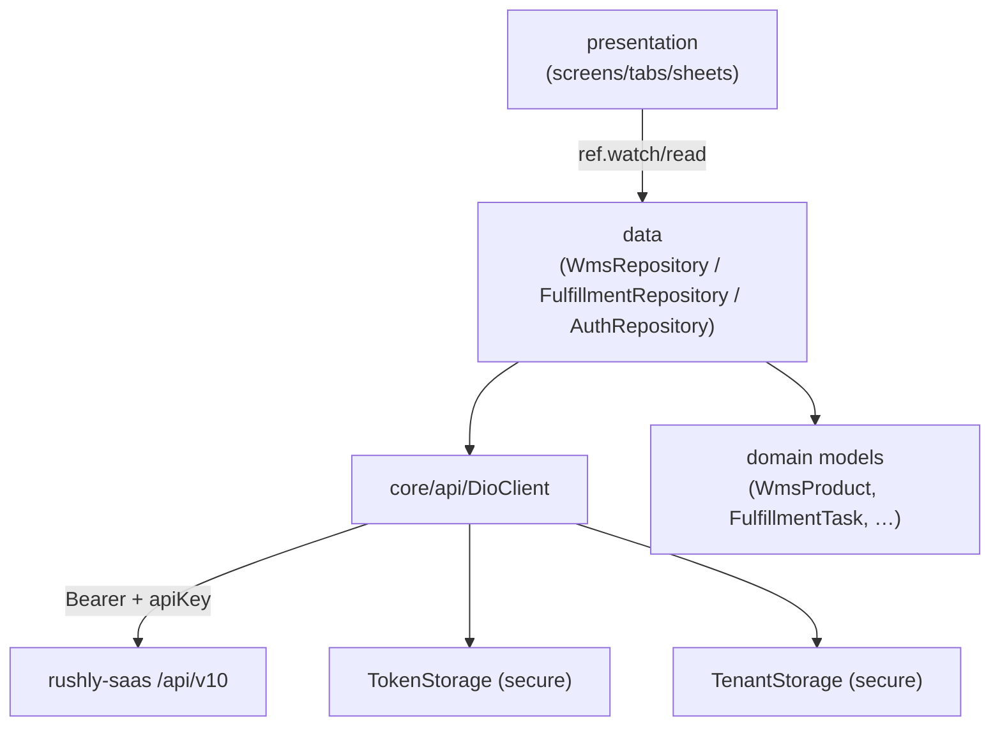
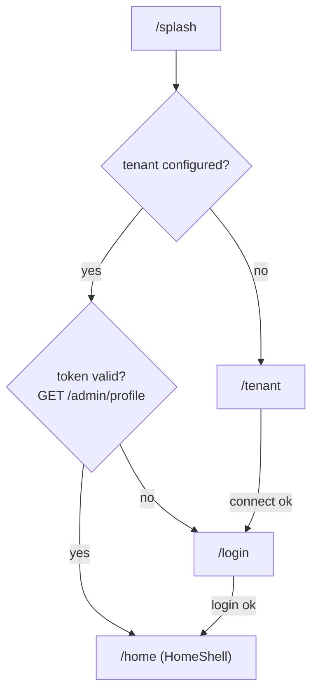
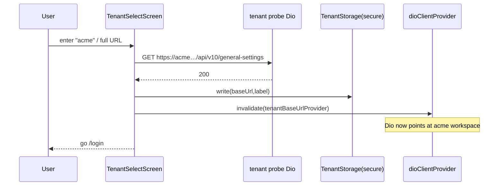
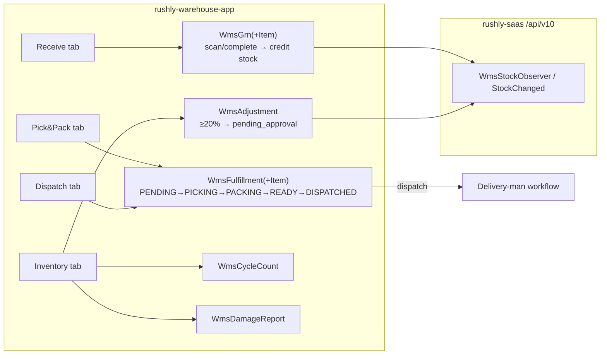

# rushly-warehouse-app — Warehouse Ops

> **Project root:** `/var/www/rushly-warehouse-app` · **Type:** Flutter (Dart) mobile client · **Version:** `1.0.0+1` (`pubspec.yaml`)
> **Role:** Hands-on warehouse-floor app for **Receive → Pick & Pack → Inventory → Dispatch**. A thin **client** of `rushly-saas` — it holds *no* business logic of its own; every stock mutation, SLA calc and approval rule lives server-side.
> **Metrics (2026-07-27):** 36 Dart files · 4 bottom-nav tabs · 2 feature modules (`wms`, `fulfillment`) · 15 concrete screens/sheets.
>
> `rushly-saas` is the **single source of truth**. This doc goes deep on the Flutter slice and maps every screen to a backend endpoint and to the module docs — it does not restate them. Read the shared [`_CONTEXT_BRIEF.md`](../_CONTEXT_BRIEF.md) first. Cross-links: WMS module [`../modules/wms-warehouse.md`](../modules/wms-warehouse.md), Fulfillment module [`../modules/fulfillment.md`](../modules/fulfillment.md), Flutter reference [`../08-Flutter.md`](../08-Flutter.md), API reference [`../09-API.md`](../09-API.md), Auth reference [`../10-Authentication.md`](../10-Authentication.md).

---

## 1. Purpose & target user

The warehouse app is the **operator terminal** for a fulfilment-centre floor worker. It replaces clipboard + desktop-WMS round-trips with a barcode-driven phone flow across the four warehouse phases:

| Tab | Arabic label | Job it does | Backing feature |
|---|---|---|---|
| **Receive** | الاستلام | Scan GRN (goods-received note) lines into bins, batch/expiry/condition, complete the GRN to credit stock | `features/wms` |
| **Pick & Pack** | الاختيار والتغليف | Work the personal picker queue, confirm picked qty per line, mark packed | `features/fulfillment` |
| **Inventory** | المخزون | Stock lookup, cycle counts, damage reports, stock adjustments | `features/wms` |
| **Dispatch** | التسليم | Scan a ready parcel and hand it off to the courier (READY → DISPATCHED) | `features/fulfillment` |

**Target user:** back-office / warehouse staff — `user_type` ∈ `ADMIN`, `SUPER_ADMIN`, `INCHARGE` (hub-incharge), `HUB` (hub manager). The app authenticates through the **admin** auth surface (`AdminAuthController`), so merchants and delivery-men are rejected at login even with a valid token — see [§5 Authentication](#5-authentication--authorization). Labels list `roleIncharge`/`roleHub` in the shared l10n table (`lib/shared/l10n/app_localizations.dart`).

⚠️ **Doc vs Code — one built-in feature-set, four apps.** The l10n table (`app_localizations.dart`) carries strings for parcels, drivers, merchants, hub-cash, fraud, support, maps etc. that this app never renders. This is the **shared scaffold string table** copied across the Rushly Flutter apps; only the WMS/fulfillment/auth/tenant strings are actually wired here. Treat the extra keys as inert.

---

## 2. Architecture (core / shared / features)

Classic **feature-first Clean-ish layering**: `core/` (cross-cutting infra) + `shared/` (app-wide widgets/services) + `features/<name>/{data,domain,presentation}`.

```
lib/
├── main.dart                         # bootstrap: Env.load() → ProviderScope → MaterialApp.router
├── core/
│   ├── api/
│   │   ├── api_endpoints.dart         # all path constants (auth + WMS + fulfillment)
│   │   ├── dio_client.dart            # Dio wrapper: baseUrl, apiKey, Bearer interceptor, 401 handler, _unwrap('data')
│   │   └── providers.dart             # Riverpod graph: secureStorage → token/tenant storage → dioClient
│   ├── config/env.dart               # dotenv: API_BASE_URL, API_KEY, TENANT_HOST_SUFFIX
│   ├── error/api_exception.dart      # DioException → ApiException(message, statusCode)
│   ├── storage/
│   │   ├── token_storage.dart         # secure store: auth_token, auth_user
│   │   └── tenant_storage.dart        # secure store: tenant_api_base, tenant_label
│   └── utils/json_x.dart             # defensive asInt/asDouble/asString/asListOfMaps coercers
├── shared/
│   ├── router/app_router.dart        # go_router + redirect guard + _Splash
│   ├── theme/app_theme.dart          # Material3 seed theme + Tajawal/Inter fonts
│   └── l10n/                          # AppLocalizations (map-based), LocaleController, LanguageToggleButton
└── features/
    ├── auth/       {data/auth_repository, presentation/auth_controller, login_screen}
    ├── tenant/     {presentation/tenant_select_screen}
    ├── dashboard/  {presentation/home_shell, placeholder_screen}
    ├── wms/        {data/wms_repository, domain/wms_models, presentation/*}
    └── fulfillment/{data/fulfillment_repository, domain/fulfillment_task, presentation/*}
```

**Dependency direction:** `presentation` → `data` (repository) → `core/api` (DioClient). `domain` holds pure model classes with `fromJson` factories built on `core/utils/json_x.dart` coercers. Nothing in `features` imports another feature except through `shared`/`core`. See [`../08-Flutter.md`](../08-Flutter.md) for the ecosystem-wide convention.



---

## 3. Packages (`pubspec.yaml`)

| Package | Version | Used for |
|---|---|---|
| `flutter_riverpod` | `^2.5.1` | State management / DI (providers, notifiers) |
| `dio` | `^5.5.0` | HTTP client (`core/api/dio_client.dart`) |
| `pretty_dio_logger` | `^1.4.0` | Debug-only request/response logging (guarded by `kDebugMode`) |
| `flutter_secure_storage` | `^9.2.2` | Encrypted token + tenant persistence (Android `encryptedSharedPreferences`) |
| `shared_preferences` | `^2.2.3` | Declared; **no usage found in `lib/`** (locale is in-memory only) |
| `google_fonts` | `^6.2.1` | Tajawal (ar) / Inter (en) text themes |
| `intl` | `^0.20.2` | `DateFormat` in cycle-count & damage tiles |
| `flutter_dotenv` | `^5.1.0` | `.env` loading (bundled asset) |
| `go_router` | `^14.2.0` | Declarative routing + auth redirect guard |
| `url_launcher` | `^6.3.0` | Declared; **no usage found in `lib/`** (shared-scaffold leftover) |
| `mobile_scanner` | `^5.2.0` | Camera barcode scanning (stock lookup, GRN receive, dispatch) |

Dev: `flutter_lints ^4.0.0` with `avoid_print: true` (`analysis_options.yaml`). SDK: Dart `>=3.3.0 <4.0.0`, Flutter `>=3.19.0`.

⚠️ **Doc vs Code — no push/FCM.** Despite the ecosystem having FCM endpoints (`POST /api/v10/fcm-subscribe` / `fcm-unsubscribe`, `routes/api.php:256-257`), this app declares **no** `firebase_messaging`/`firebase_core` dependency and contains **no** notification code. Push notifications are *not implemented* in the warehouse app — see [§11 Notifications](#11-notifications--push). For the server-side notification module see [`../modules/notifications.md`](../modules/notifications.md).

---

## 4. Configuration & environment

`core/config/env.dart` reads three `.env` keys (loaded from the bundled asset `.env`, declared under `flutter.assets` in `pubspec.yaml`):

| Key | `.env.example` value | Fallback in code | Meaning |
|---|---|---|---|
| `API_BASE_URL` | `https://admin.rushly-logistic.com/api/v10` | `https://api.rushly-logistic.com/api/v10` | Default base URL when no tenant is selected |
| `API_KEY` | `123456rx-ecourier123456` | same literal | Static `apiKey` header required by the `CheckApiKey` middleware |
| `TENANT_HOST_SUFFIX` | `rushly-logistic.com` | `rushly-logistic.com` | Suffix for workspace-name mode: `acme` → `https://acme.rushly-logistic.com/api/v10` |

The effective base URL is **not** `API_BASE_URL` at runtime — it is whatever the tenant-select screen persisted (`tenantBaseUrlProvider`), falling back to `Env.apiBaseUrl` only if nothing is stored (`dio_client.dart` constructor). See [§10 Multi-tenancy](#10-multi-tenancy-workspace-selection). Environment reference: [`../19-Environment.md`](../19-Environment.md).

---

## 5. Authentication & authorization

**Login** (`features/auth/data/auth_repository.dart`):

```
POST /api/v10/admin/login   body { email, password }   → { token, user }
```

`AuthRepository.login` writes `data['token']` to `TokenStorage` (secure key `auth_token`). Backend controller: `app/Http/Controllers/Api/V10/Admin/AdminAuthController@login`. It `Auth::attempt`s, then **rejects any `user_type` not in `[ADMIN, SUPER_ADMIN, INCHARGE, HUB]`** (`AdminAuthController::ADMIN_TYPES`), and issues a Sanctum personal-access token named `admin:<email>`.

**Every request** carries two headers (`dio_client.dart`): a static `apiKey` (satisfies `CheckApiKey` middleware) and, once logged in, `Authorization: Bearer <token>` injected by the request interceptor.

**Session restore** (`auth_controller.dart::restore`): on cold start `_Splash` reads the stored token and calls `GET /admin/profile`; success → authenticated, failure → clears token and routes to `/login`.

⚠️ **Known limitation — opaque auth identity.** `AuthController.restore()` sets `AuthState(userEmail: 'unknown')` on success and never parses the returned `user` object; the profile response is fetched but discarded. So the app knows *that* you are authed but keeps no profile/role/hub context client-side. Any role-gating therefore happens **server-side only**.

**401 handling** (`dio_client.dart` `onError`): a 401 clears the token and invokes `_onUnauthorized`. ⚠️ **Gap:** the `onUnauthorized` setter exists but **nothing assigns it anywhere in `lib/`**, so a mid-session 401 silently drops the token without forcing a redirect — the user is bounced to `/login` only on the next full app restart (via the router guard). Minor UX gap; flag for follow-up.

### Authorization surfaces (two middleware tiers)

The app talks to **two** endpoint groups with different guards (`routes/api.php`):

| Endpoint group | Path prefix | Middleware chain | Used by |
|---|---|---|---|
| **Admin surface** | `/api/v10/admin/*` | `CheckApiKey` → `auth:sanctum` → **`CheckAdminRole`** | login, profile, logout, `wms/grns`, `wms/locations`, `wms/cycle-counts`, `wms/damage-reports` |
| **Shared WMS surface** | `/api/v10/wms/*` | `CheckApiKey` → `auth:sanctum` (no admin gate) | product lookup, stock, GRN scan/complete, fulfillment pick/pack/dispatch, adjustments |

`CheckAdminRoleMiddleware` (`app/Http/Middleware/CheckAdminRoleMiddleware.php`) admits the same four `user_type`s and 403s everyone else. Because the warehouse app logs in through the admin surface, its Sanctum token satisfies both tiers. Auth reference: [`../10-Authentication.md`](../10-Authentication.md); security: [`../17-Security.md`](../17-Security.md); roles: [`../modules/permissions-users-roles.md`](../modules/permissions-users-roles.md).

---

## 6. API layer (`lib/core/api/*`)

**`DioClient`** (`dio_client.dart`) is the single HTTP surface:

- **Base options:** `baseUrl` (tenant-resolved), `connectTimeout 20s`, `receiveTimeout 30s`, `sendTimeout 30s`, headers `{Accept: application/json, apiKey: <Env.apiKey>}`.
- **Request interceptor:** injects `Authorization: Bearer <token>` when a token exists.
- **Error interceptor:** 401 → clear token + `_onUnauthorized?.call()`.
- **Debug interceptor:** `PrettyDioLogger` only under `kDebugMode`.
- **Response unwrapping:** `_unwrap<T>` returns `data['data']` when the body is a map containing a `data` key, else the raw body. This matches the server's `ApiReturnFormatTrait` envelope `{ success, message, data: {...} }` — so repositories receive the **inner** `data` map directly.
- Only `get` and `post` are implemented (the whole app is GET/POST; no PUT/DELETE).

**`providers.dart`** wires the Riverpod graph:

```
secureStorageProvider (FlutterSecureStorage)
  → tokenStorageProvider (TokenStorage)
  → tenantStorageProvider (TenantStorage)
  → tenantBaseUrlProvider (FutureProvider<String?>)  ← reads persisted base URL
  → dioClientProvider (DioClient, baseUrl = tenant value)
```

`dioClientProvider` `watch`es `tenantBaseUrlProvider`, so **invalidating the tenant provider rebuilds the Dio client against a new workspace** — the mechanism behind "change workspace".

**`api_endpoints.dart`** centralises all paths (see mapping table in [§8](#8-per-screen-documentation)). **`api_exception.dart`** normalises `DioException` → `ApiException(message, statusCode)`, preferring the server's `data['message']`. **`json_x.dart`** provides null-safe coercers (`asInt`, `asDoubleOrNull`, `asStringOrNull`, `asListOfMaps`) used by every `fromJson`.

---

## 7. State, routing, theme, localization

### 7.1 State management (Riverpod)

- **Infra providers** (`core/api/providers.dart`): plain `Provider`s for storage + Dio.
- **Auth:** `authControllerProvider` = `NotifierProvider<AuthController, AuthState>`; `AuthState{userEmail, isLoading, error}` with `isAuthenticated => userEmail != null`.
- **Locale:** `localeProvider` = `StateNotifierProvider<LocaleController, Locale>`.
- **Data:** `FutureProvider.autoDispose` for each list feed — `wmsGrnsProvider`, `wmsLocationsProvider`, `wmsCycleCountsProvider`, `wmsDamageReportsProvider`, `myFulfillmentTasksProvider`, `readyToDispatchProvider`. Screens `ref.watch` them and use `.when(loading/error/data)`; mutations call `ref.invalidate(...)` to refetch. Repositories are exposed as `Provider`s (`wmsRepositoryProvider`, `fulfillmentRepositoryProvider`, `authRepositoryProvider`).

### 7.2 Routing (`go_router`)

`routerProvider` builds a `GoRouter` with `initialLocation: '/splash'` and a **redirect guard**:



Guard rules (`app_router.dart` `redirect`): no tenant → force `/tenant`; tenant set but on `/tenant` → `/login`; not authed on a protected route → `/login`; authed on `/login` → `/home`. `/splash` and `/tenant`/`/login` are public.

**Route table:**

| Path | Screen | Params |
|---|---|---|
| `/splash` | `_Splash` | — |
| `/tenant` | `TenantSelectScreen` | — |
| `/login` | `LoginScreen` | — |
| `/home` | `HomeShell` (4 tabs) | — |
| `/wms/stock` | `StockLookupScreen` | — |
| `/wms/grn` | `GrnListScreen` | — |
| `/wms/grn/:id` | `GrnScanScreen` | `id` (int) |
| `/wms/cycle-count` | `CycleCountScreen` | — |
| `/wms/damage` | `DamageReportsScreen` | — |
| `/pick-pack/:id` | `FulfillmentTaskScreen` | `id` (int) |

⚠️ **Dead code:** `lib/features/wms/presentation/wms_home_screen.dart` (`WmsHomeScreen`) is a standalone WMS launcher grid that is **not registered in the router** and never navigated to — the four tabs replaced it. Likewise `dashboard/placeholder_screen.dart` (`PlaceholderScreen`) is a shared-scaffold "coming soon" widget with **no references** in this app. Both are inert.

### 7.3 Theme (`shared/theme/app_theme.dart`)

Material 3, `ColorScheme.fromSeed(seedColor: 0xFF5D4037)` — a **brown** brand seed (`Colors.brown[700]`-ish), distinct per Rushly app. Light scaffold `Colors.white`, dark scaffold `0xFF121212`. Fonts are locale-switched: **Tajawal** for Arabic, **Inter** for English (Google Fonts). See brand reference [`../15-Brand-System.md`](../15-Brand-System.md) and UI/UX [`../16-UI-UX.md`](../16-UI-UX.md).

### 7.4 Localization (ar / en, RTL)

- Custom **map-based** `AppLocalizations` (`shared/l10n/app_localizations.dart`) — *not* ARB/gen-l10n. Two inline maps `_en` / `_ar`, resolved by `_t(key)` with English fallback.
- Supported locales: `en`, `ar`. **Default locale is Arabic** (`LocaleController() : super(const Locale('ar'))`).
- RTL is automatic: `MaterialApp.router` + `GlobalWidgetsLocalizations.delegate` flip directionality for `ar`; screens use `AlignmentDirectional`/`textAlign` so mirroring is correct.
- `LanguageToggleButton` toggles ar↔en at runtime via `localeProvider.notifier.toggle()`.
- ⚠️ **Locale not persisted:** `LocaleController` is pure in-memory `StateNotifier`; language resets to Arabic on every cold start (no `shared_preferences` write despite the dependency being declared).

---

## 8. Per-screen documentation

Every screen below lists **Purpose · UI · Business logic · API calls · Validation · Navigation · Permissions**. Endpoint paths are shown relative to the tenant base (`…/api/v10`). Full backend contract lives in [`../modules/wms-warehouse.md`](../modules/wms-warehouse.md) and [`../modules/fulfillment.md`](../modules/fulfillment.md).

### Endpoint map (single source for the whole app)

| App constant (`api_endpoints.dart`) | HTTP | Full path | Backend controller (`routes/api.php`) |
|---|---|---|---|
| `login` | POST | `/admin/login` | `AdminAuthController@login` |
| `profile` | GET | `/admin/profile` | `AdminAuthController@profile` |
| `logout` | POST | `/admin/logout` | `AdminAuthController@logout` |
| `generalSettings` | GET | `/general-settings` | `GeneralSettingCotroller@index` |
| `wmsGrns` | GET | `/admin/wms/grns` | `AdminWmsController@grns` |
| `wmsLocations` | GET | `/admin/wms/locations` | `AdminWmsController@locations` |
| `wmsCycleCounts` | GET/POST | `/admin/wms/cycle-counts` | `AdminWmsController@cycleCounts` / `cycleCountsStore` |
| `wmsDamageReports` | GET/POST | `/admin/wms/damage-reports` | `AdminWmsController@damageReports` / `damageReportsStore` |
| `wmsProductLookup` | GET | `/wms/products/lookup` | `WmsProductApiController@lookup` |
| `wmsStock(id)` | GET | `/wms/stock/{id}` | `WmsStockApiController@show` |
| `wmsGrnScan(id)` | POST | `/wms/grn/{id}/scan` | `WmsGrnApiController@scanItem` |
| `wmsGrnComplete(id)` | POST | `/wms/grn/{id}/complete` | `WmsGrnApiController@complete` |
| `wmsAdjustment` | POST | `/wms/adjustments` | `WmsAdjustmentApiController@store` |
| `wmsFulfillmentMyTasks` | GET | `/wms/fulfillment/my-tasks` | `WmsFulfillmentApiController@myTasks` |
| `wmsFulfillmentPick(id)` | POST | `/wms/fulfillment/{id}/pick` | `WmsFulfillmentApiController@confirmPick` |
| `wmsFulfillmentPack(id)` | POST | `/wms/fulfillment/{id}/pack` | `WmsFulfillmentApiController@confirmPack` |
| `wmsFulfillmentReadyToDispatch` | GET | `/wms/fulfillment/ready-to-dispatch` | `WmsFulfillmentApiController@readyToDispatch` |
| `wmsFulfillmentDispatch(id)` | POST | `/wms/fulfillment/{id}/dispatch` | `WmsFulfillmentApiController@confirmDispatch` |

---

### 8.1 TenantSelectScreen — `/tenant`

- **Purpose:** pick the courier-company workspace (tenant) before login. Multi-tenant entry point.
- **UI:** warehouse icon, hint text, one field. **Simple mode** = workspace-name field with `.rushly-logistic.com` suffix; **Advanced mode** = full API-URL field. Live `→ <preview>` of the resolved base URL, mode-toggle button, `Connect` button, inline error.
- **Business logic:** `_buildBaseUrl()` — simple: `https://<slug>.<TENANT_HOST_SUFFIX>/api/v10`; advanced: trims trailing `/`, appends `/api/v10` if the URL lacks `/api/`. On connect it **probes** the workspace with a throwaway 8-s Dio client, then persists `{baseUrl, label}` and invalidates `tenantBaseUrlProvider`.
- **API calls:** `GET /general-settings` (probe only; `CheckApiKey`, no auth). Non-2xx/timeout → inline error.
- **Validation:** simple mode regex `^[a-z0-9][a-z0-9-]*$` (`workspaceNameInvalid`); advanced mode requires a parseable URI with a scheme (`invalidUrl`); empty → `required`.
- **Navigation:** success → `context.go('/login')`.
- **Permissions:** none (pre-auth, public endpoint).
- See tenancy module [`../modules/saas-tenancy-subscriptions.md`](../modules/saas-tenancy-subscriptions.md).

### 8.2 LoginScreen — `/login`

- **Purpose:** email/password sign-in for warehouse/back-office staff.
- **UI:** warehouse icon, app title + tagline, email field, password field with show/hide toggle, `Sign in` button (spinner while loading), language toggle in the app-bar.
- **Business logic:** `AuthController.login(email, password)` → `AuthRepository.login` stores the token, sets `AuthState(userEmail: email)`.
- **API calls:** `POST /admin/login` `{email, password}`.
- **Validation:** email non-empty + contains `@` (`emailInvalid`); password non-empty + `length >= 6` (`passwordTooShort`).
- **Navigation:** success → `/home`; failure → SnackBar with server message or `loginFailed`.
- **Permissions:** backend rejects non-admin `user_type` with 401.

### 8.3 _Splash — `/splash`

- **Purpose:** cold-start router/decision screen.
- **UI:** centred `CircularProgressIndicator`.
- **Business logic:** await `tenantBaseUrlProvider.future`; if empty → `/tenant`; else `authController.restore()` → `/home` or `/login`.
- **API calls:** `GET /admin/profile` (via `restore()`).
- **Navigation:** as above. **Permissions:** none.

### 8.4 HomeShell — `/home` (tab host)

- **Purpose:** the 4-tab warehouse shell.
- **UI:** `AppBar` (title, **workspace** icon-button, **logout** icon-button) + `NavigationBar` (Receive · Pick&Pack · Inventory · Dispatch) over an `IndexedStack` (tabs keep state when switching).
- **Business logic:** local `_index`; **logout** → `authController.logout()` (`POST /admin/logout` + clear token) → `/login`; **switch workspace** → confirm dialog → logout + `tenantStorage.clear()` + invalidate `tenantBaseUrlProvider` → `/tenant`.
- **API calls:** `POST /admin/logout` (indirect). **Permissions:** authed admin.

---

### 8.5 ReceiveTab (tab 0) — `features/wms`

- **Purpose:** landing for the Receive phase — quick stock-lookup shortcut + list of open GRNs.
- **UI:** a `Stock lookup` card, a "Receive goods" section header with refresh, then a GRN list. Each GRN tile: status avatar (orange `in_progress` / grey draft), GRN number, `merchant • hub • ref` subtitle, `received/expected` trailing. `RefreshIndicator` pull-to-refresh.
- **Business logic:** `ref.watch(wmsGrnsProvider)` → `.when`. GRNs are DRAFT/IN_PROGRESS only (server filters).
- **API calls:** `GET /admin/wms/grns` (paginated; app reads the `grns.data` wrapper — `WmsRepository.grns` unwraps `grns` then its `data`).
- **Validation:** none (read-only). **Navigation:** lookup card → `/wms/stock`; GRN tile → `/wms/grn/{id}`.
- **Permissions:** `CheckAdminRole` (admin surface). Server also applies `applyHubScope` so hub-scoped users see only their hub.

### 8.6 GrnListScreen — `/wms/grn`

- **Purpose:** full-screen version of the GRN list (reached from the unused `WmsHomeScreen` route; still routable directly).
- **UI/logic/API:** identical GRN feed to ReceiveTab (`wmsGrnsProvider`, `GET /admin/wms/grns`), in a `Scaffold` with refresh action. Tile tap → `/wms/grn/{id}`.
- **Permissions:** admin surface.

### 8.7 GrnScanScreen — `/wms/grn/:id`

- **Purpose:** the receive-session workhorse — scan items into a GRN and finalise it.
- **UI:** app-bar `GRN #<id>` + **complete** action; **Scan** FAB; body shows an in-memory session list of scanned lines (green ✓, product name, `sku • location • batch • condition`, `+qty`) or an empty-session hint. On scan, a bottom sheet (`_ReceiveSheet`) collects **location** (dropdown from `wmsLocationsProvider`), **quantity**, optional **batch**, and **condition** (`good/damaged/expired` segmented button).
- **Business logic:** camera scan → `mobile_scanner` returns a barcode → `WmsRepository.lookup(barcode)` then `lookup(sku)` fallback → resolve `WmsProduct` → sheet → `scanIntoGrn`. The session list is a client-side audit trail only ("server is source of truth", per code comment); it is **not** re-hydrated from the server. **Complete** confirms via dialog then credits stock.
- **API calls:**
  - `GET /wms/products/lookup?barcode=…|sku=…` (`WmsProductApiController@lookup`)
  - `POST /wms/grn/{id}/scan` `{product_id, location_id, received_qty, batch_number?, expiry_date?, condition?}` (`WmsGrnApiController@scanItem`)
  - `POST /wms/grn/{id}/complete` (`@complete`)
  - `GET /admin/wms/locations` (bin dropdown)
- **Validation:** client requires a chosen location + `qty > 0`. Server (`scanItem`): `received_qty >= 1`, `product_id`/`location_id` must exist, `condition in good,damaged,expired`, `expiry_date` a date; a COMPLETED/DISCREPANCY GRN → 409. First scan flips DRAFT → IN_PROGRESS.
- **Navigation:** complete → SnackBar + `context.pop()`. **Permissions:** scan/complete are the **shared** `/wms/*` surface (`auth:sanctum`); locations are admin surface.
- Barcode formats: EAN-13/8, Code128, QR, Code39, UPC-A.

### 8.8 PickPackTab (tab 1) — `features/fulfillment`

- **Purpose:** the picker's personal queue.
- **UI:** list of task tiles — SLA avatar (red breached / teal ok), fulfillment number, `parcel • hub • status`, a `LinearProgressIndicator` (`progress`), and `picked/total • SLA` line. Empty state = beach icon + `noTasks`. Pull-to-refresh.
- **Business logic:** `myFulfillmentTasksProvider` → `GET /wms/fulfillment/my-tasks`. Server returns fulfillments in PENDING/PICKING that are unassigned **or** assigned to me (`picker_id`), ordered by `sla_deadline`, limit 20, with a precomputed `next_item`.
- **API calls:** `GET /wms/fulfillment/my-tasks`. **Validation:** none.
- **Navigation:** tile → `/pick-pack/{id}`. **Permissions:** shared `/wms/*` (`auth:sanctum`).

### 8.9 FulfillmentTaskScreen — `/pick-pack/:id`

- **Purpose:** work a single fulfillment: pick each line, then pack.
- **UI:** header card (number, parcel, hub, `remaining/total`, progress bar, SLA chip); a **Next item** card (`#productId`, location, remaining qty, `Pick` button); a full-width **Pack** button (enabled only when `itemsRemaining == 0`).
- **Business logic:** finds the task in `myFulfillmentTasksProvider` by id. **Pick** opens a qty dialog (prefilled with `remaining`) → `confirmPick` → invalidate list. **Pack** → `confirmPack` → invalidate + pop.
- **API calls:**
  - `POST /wms/fulfillment/{id}/pick` `{item_id, picked_qty}` (`@confirmPick`)
  - `POST /wms/fulfillment/{id}/pack` (`@confirmPack`)
- **Validation:** client — qty parseable and `>= 0`; pack disabled until zero remaining. Server — `picked_qty >= 0`; pack requires status PACKING else 409.
- **Navigation:** pack success → `maybePop()`. **Permissions:** shared `/wms/*`.

### 8.10 InventoryTab (tab 2) — `features/wms`

- **Purpose:** inventory-tools launcher.
- **UI:** 2×2 grid — **Stock lookup**, **Cycle count**, **Damage reports**, **Adjust stock**.
- **Business logic/Navigation:** stock → `/wms/stock`; cycle → `/wms/cycle-count`; damage → `/wms/damage`; adjust → opens `AdjustmentSheet` modal.
- **Permissions:** downstream screens each carry their own guard.

### 8.11 StockLookupScreen — `/wms/stock`

- **Purpose:** find a product and see on-hand / available / by-location stock.
- **UI:** search field (`scanOrType`) + camera button; `LinearProgressIndicator` while busy; result = product card (name, SKU, barcode, on-hand/available/reorder stats) + per-location rows (`available/quantity`, batch/expiry/reserved chips) or `noStock`.
- **Business logic:** `_lookup` tries barcode axis then falls back to SKU axis (and vice-versa) before giving up with `notFound`; on hit, fetches stock. Scanner returns a code that pre-fills and triggers a barcode lookup.
- **API calls:** `GET /wms/products/lookup?barcode|sku` then `GET /wms/stock/{productId}` (`WmsStockApiController@show`).
- **Validation:** empty input ignored. **Navigation:** self-contained. **Permissions:** shared `/wms/*`.

### 8.12 CycleCountScreen — `/wms/cycle-count`

- **Purpose:** list and open cycle-count sessions.
- **UI:** list of session tiles (status-coloured avatar open/in_progress/completed, `count_number`, `scope • zone • hub • by`, status + started-at); **Open session** FAB; refresh action. New-session sheet collects **hub id**, **scope** (default `full`), optional **zone**.
- **Business logic:** `wmsCycleCountsProvider` → list; submit → open → invalidate.
- **API calls:** `GET /admin/wms/cycle-counts` (`@cycleCounts`); `POST /admin/wms/cycle-counts` `{hub_id, scope, zone?, assigned_to?}` (`@cycleCountsStore`).
- **Validation:** `hub_id` must be an int; `scope` non-empty. **Permissions:** **admin surface** (`CheckAdminRole`).

### 8.13 DamageReportsScreen — `/wms/damage`

- **Purpose:** list and file damage reports.
- **UI:** list of damage tiles (`-qty` red avatar, product name, `sku • location • cause • action • by`, created-at); **Report damage** FAB; refresh. New-report sheet: **Product ID**, **Location ID**, **Quantity**, **Cause**, optional **Action taken** + **Notes**.
- **Business logic:** `wmsDamageReportsProvider` → list; submit → invalidate.
- **API calls:** `GET /admin/wms/damage-reports` (`@damageReports`); `POST /admin/wms/damage-reports` `{product_id, location_id, quantity_damaged, cause, action_taken?, notes?}` (`@damageReportsStore`).
- **Validation:** the three numeric fields must parse; cause required. ⚠️ Note: this form takes **raw numeric Product/Location IDs** (no barcode resolve) — a rougher UX than the adjustment sheet.
- **Permissions:** admin surface.

### 8.14 AdjustmentSheet (modal, from InventoryTab)

- **Purpose:** set a location's on-hand to a corrected value.
- **UI:** bottom sheet — code field + search button (resolves product), resolved-product card, **location** dropdown (`wmsLocationsProvider`), **new quantity**, **cause/reason**, optional **notes**, `Save`.
- **Business logic:** `_resolveProduct` calls `lookup(barcode: code, sku: code)`. On save, `submitAdjustment` posts the **absolute** target quantity (`quantity_after`). The response's `requires_approval` flag drives the SnackBar: `pendingApproval` vs `saved`.
- **API calls:** `POST /wms/adjustments` `{product_id, location_id, quantity_after, reason, reference?, notes?}` (`WmsAdjustmentApiController@store`); plus `GET /wms/products/lookup` + `GET /admin/wms/locations`.
- **Validation:** client — product+location resolved, `qty >= 0`, reason non-empty. Server — same, `quantity_after >= 0`. **Approval rule (server-side):** a delta ≥ 20% marks the adjustment `pending_approval` and **stock is not changed** until a supervisor approves via the web UI (`WmsAdjustmentApiController` docblock + `requires_approval` in the response). This is the app's one "maker-checker" surface.
- **Navigation:** success → `maybePop()`. **Permissions:** adjustment is shared `/wms/*`; locations are admin surface.

### 8.15 DispatchTab (tab 3) — `features/fulfillment`

- **Purpose:** hand ready parcels to the courier.
- **UI:** list of ready tiles (deep-orange box avatar, fulfillment number, `parcel • hub • N items`, `Dispatch` button); **Scan** FAB; empty state = truck icon + `noReadyToDispatch`. Pull-to-refresh.
- **Business logic:** `readyToDispatchProvider` → `GET /wms/fulfillment/ready-to-dispatch` (status READY, ordered by `packed_at`, limit 50). **Scan** fetches the ready list and matches the scanned code against `fulfillment_number` or `parcel`; match → confirm dialog → dispatch. Tile button does the same without scanning.
- **API calls:** `GET /wms/fulfillment/ready-to-dispatch` (`@readyToDispatch`); `POST /wms/fulfillment/{id}/dispatch` (`@confirmDispatch`).
- **Validation:** dispatch requires status READY server-side else 409 ("Not in ready state"). No-match scan → `notFound` SnackBar.
- **Navigation:** stays on tab; invalidates the list on success. **Permissions:** shared `/wms/*`.

---

## 9. Domain models

### WMS (`features/wms/domain/wms_models.dart`)

| Model | Key fields | Source endpoint |
|---|---|---|
| `WmsProduct` | id, sku, name, barcode, unit, reorderPoint, onHand, available, hubId | `/wms/products/lookup` (`product`) |
| `WmsStockRow` | stockId, locationId, locationCode, quantity, reserved, available, batch, expiry | `/wms/stock/{id}` (`rows[]`) |
| `WmsStockView` | rows, onHand, available | `/wms/stock/{id}` |
| `WmsGrnSummary` | id, grnNumber, status, hubName, merchantName, itemsCount, expectedTotal, receivedTotal, referenceNumber | `/admin/wms/grns` |
| `WmsLocation` | id, code, zone, type, hubId, hubName | `/admin/wms/locations` |
| `WmsCycleCountEntry` | id, countNumber, scope, zone, status, hub, assignedName, startedAt, completedAt | `/admin/wms/cycle-counts` |
| `WmsDamageReportEntry` | id, productSku, productName, locationCode, quantityDamaged, cause, actionTaken, notes, reportedBy, createdAt | `/admin/wms/damage-reports` |

### Fulfillment (`features/fulfillment/domain/fulfillment_task.dart`)

- **`FulfillmentTask`** — id, fulfillmentNumber, status, parcel, hub, slaDeadline, slaBreached, itemsRemaining, itemsTotal, nextItem; computed `progress` and `readyToPack`.
- **`NextItem`** — id, productId, locationId, quantityRequired, quantityPicked; computed `remaining`.

All `fromJson` factories lean on the `json_x.dart` coercers, so malformed/absent fields degrade to safe defaults rather than throwing. These mirror the server models `WmsGrn`, `WmsLocation`, `WmsStock`, `WmsCycleCount`, `WmsDamageReport`, `WmsFulfillment(+Item)` — see [`../modules/wms-warehouse.md`](../modules/wms-warehouse.md) and DB reference [`../06-Database.md`](../06-Database.md).

---

## 10. Multi-tenancy (workspace selection)

`rushly-saas` uses **stancl/tenancy** with per-subdomain identification (`{tenant}.rushly.tech` in prod; here `{slug}.rushly-logistic.com`). The app models this entirely as a **base-URL swap** — there is no tenant header; the subdomain in the persisted base URL *is* the tenant identity.

- `TenantStorage` (secure keys `tenant_api_base`, `tenant_label`) persists the chosen workspace.
- `tenantBaseUrlProvider` feeds `dioClientProvider`; changing it rebuilds every subsequent request against the new host.
- **Change workspace** (HomeShell) clears token + tenant and returns to `/tenant`, forcing a fresh probe + login.



Tenancy reference: [`../modules/saas-tenancy-subscriptions.md`](../modules/saas-tenancy-subscriptions.md).

---

## 11. Notifications / push

**Not found in the current codebase.** The warehouse app has **no** push/FCM implementation: no `firebase_*` dependency in `pubspec.yaml`, no notification handler in `lib/`. The backend *does* expose `POST /api/v10/fcm-subscribe` / `fcm-unsubscribe` (`PushNotificationController`, `routes/api.php:256-257`) used by other Rushly apps, but this client never calls them. All task delivery here is **pull-based** (pull-to-refresh + `ref.invalidate`). If push is added later it would wire into the server notification module — [`../modules/notifications.md`](../modules/notifications.md).

---

## 12. Storage summary

| Store | Backend | Keys | Written by |
|---|---|---|---|
| Token | `flutter_secure_storage` | `auth_token`, `auth_user` | `TokenStorage` (login/restore/logout) |
| Tenant | `flutter_secure_storage` | `tenant_api_base`, `tenant_label` | `TenantStorage` (tenant-select / change-workspace) |
| Locale | in-memory only | — | `LocaleController` (⚠️ not persisted) |

`auth_user` is defined in `TokenStorage` but ⚠️ **never written** (login stores only the token; the user object is discarded). Android uses `encryptedSharedPreferences`. Security reference: [`../17-Security.md`](../17-Security.md).

---

## 13. How this app ties to the WMS + Fulfillment modules



- The **Receive** and **Inventory** flows write to WMS stock tables; the server's `WmsStockObserver` fires `StockChanged` on mutation (see [`../modules/wms-warehouse.md`](../modules/wms-warehouse.md)).
- The **Pick&Pack / Dispatch** flows advance the `WmsFulfillment` state machine via `FulfillmentStatus` (`PENDING → PICKING → PACKING → READY → DISPATCHED`). Fulfillments themselves are created upstream by the `WmsFulfillmentStrategy` in `app/Fulfillment/` when an order is routed to the warehouse — the app only works the tail of that pipeline. See [`../modules/fulfillment.md`](../modules/fulfillment.md) and the repo-root `FULFILLMENT.md`.
- **Dispatch** hands the parcel to the delivery-man workflow (`confirmDispatch` docblock), tying WMS into last-mile — parcels module [`../modules/parcels.md`](../modules/parcels.md), hubs [`../modules/hubs-network.md`](../modules/hubs-network.md).

---

## 14. Gaps, risks & Doc-vs-Code notes

- ⚠️ **`onUnauthorized` never wired** — mid-session 401 drops the token but doesn't redirect until next app launch (`dio_client.dart`). See [§5](#5-authentication--authorization).
- ⚠️ **No push notifications** — pull-based only (§11).
- ⚠️ **Locale not persisted** — resets to Arabic every launch (§7.4).
- ⚠️ **Auth identity opaque** — profile fetched then discarded; `userEmail:'unknown'` after restore; no client-side role/hub context (§5).
- ⚠️ **Dead code** — `WmsHomeScreen`, `PlaceholderScreen` unreferenced; l10n table carries many strings for features this app doesn't render (§2, §7.2).
- ⚠️ **Damage-report form uses raw numeric IDs** (no barcode resolve) — inconsistent with the adjustment sheet (§8.13).
- ⚠️ **`shared_preferences` & `url_launcher` declared but unused** in `lib/` (§3).
- Technical-debt reference: [`../22-Technical-Debt.md`](../22-Technical-Debt.md).

---

## Sources

**Flutter app (`/var/www/rushly-warehouse-app`):**
- `pubspec.yaml`, `.env.example`, `analysis_options.yaml`
- `lib/main.dart`
- `lib/core/api/{api_endpoints,dio_client,providers}.dart`, `lib/core/config/env.dart`, `lib/core/error/api_exception.dart`, `lib/core/storage/{token_storage,tenant_storage}.dart`, `lib/core/utils/json_x.dart`
- `lib/shared/router/app_router.dart`, `lib/shared/theme/app_theme.dart`, `lib/shared/l10n/{app_localizations,locale_controller,language_toggle_button}.dart`
- `lib/features/auth/{data/auth_repository,presentation/auth_controller,presentation/login_screen}.dart`
- `lib/features/tenant/presentation/tenant_select_screen.dart`
- `lib/features/dashboard/presentation/{home_shell,placeholder_screen}.dart`
- `lib/features/wms/{data/wms_repository,domain/wms_models}.dart` + `presentation/{receive_tab,inventory_tab,wms_home_screen,stock_lookup_screen,grn_list_screen,grn_scan_screen,cycle_count_screen,damage_reports_screen,adjustment_sheet}.dart`
- `lib/features/fulfillment/{data/fulfillment_repository,domain/fulfillment_task}.dart` + `presentation/{pick_pack_tab,fulfillment_task_screen,dispatch_tab}.dart`

**Backend (`/var/www/rushly-saas`):**
- `routes/api.php` (v10 admin + shared WMS groups)
- `app/Http/Controllers/Api/V10/Admin/AdminAuthController.php`, `app/Http/Controllers/Api/V10/Admin/AdminWmsController.php`
- `app/Http/Controllers/Api/V10/Wms/{WmsProductApiController,WmsStockApiController,WmsGrnApiController,WmsFulfillmentApiController,WmsAdjustmentApiController}.php`
- `app/Http/Middleware/CheckAdminRoleMiddleware.php`
- `app/Http/Kernel.php` (middleware alias)

**Cross-linked docs:** [`../_CONTEXT_BRIEF.md`](../_CONTEXT_BRIEF.md), [`../06-Database.md`](../06-Database.md), [`../08-Flutter.md`](../08-Flutter.md), [`../09-API.md`](../09-API.md), [`../10-Authentication.md`](../10-Authentication.md), [`../15-Brand-System.md`](../15-Brand-System.md), [`../16-UI-UX.md`](../16-UI-UX.md), [`../17-Security.md`](../17-Security.md), [`../19-Environment.md`](../19-Environment.md), [`../22-Technical-Debt.md`](../22-Technical-Debt.md), [`../modules/wms-warehouse.md`](../modules/wms-warehouse.md), [`../modules/fulfillment.md`](../modules/fulfillment.md), [`../modules/notifications.md`](../modules/notifications.md), [`../modules/parcels.md`](../modules/parcels.md), [`../modules/hubs-network.md`](../modules/hubs-network.md), [`../modules/permissions-users-roles.md`](../modules/permissions-users-roles.md), [`../modules/saas-tenancy-subscriptions.md`](../modules/saas-tenancy-subscriptions.md).
