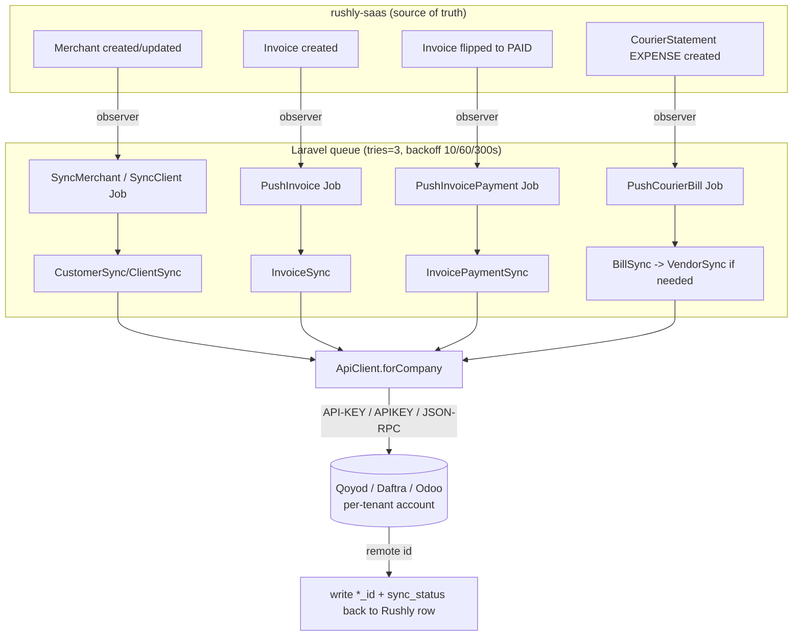

# Accounting — Qoyod / Daftra / Odoo Sync

> **Module scope:** the per-tenant, one-way (push) bridge that mirrors Rushly's internal money records — merchants, merchant invoices, invoice payments, and courier (3PL) bills — into an external accounting / ERP system of record. Three providers are wired: **Qoyod**, **Daftra**, and **Odoo**. They share one architectural shape.
>
> This doc goes DEEP on the sync layer only. For how money actually moves *inside* Rushly (statements, balances, the parcel-delivery accounting engine), see the repo-root primary source `ACCOUNTING.md`. For the wider integrations catalogue see [../14-Integrations.md](../14-Integrations.md); for the maturity/debt view see [../22-Technical-Debt.md](../22-Technical-Debt.md).

---

## 1. Purpose

Rushly (`rushly-saas`) is the **single source of truth** for delivery operations and the money that flows through them. Many tenants (courier companies) still keep their statutory books — VAT filing, chart of accounts, AP/AR — in a dedicated accounting package. In Saudi Arabia that is typically **Qoyod** (ZATCA-compliant) or **Daftra**; larger tenants run **Odoo** as a full ERP.

This module keeps those external books in sync **without the tenant re-keying anything**. When Rushly creates a merchant, cuts a merchant invoice, records that an invoice was paid, or books a courier (3PL) charge, the corresponding record is pushed to the tenant's own accounting account.

Key design facts:

- **Per-tenant.** Each Rushly company (`company_id`) has its own provider account and its own credentials row. There is no shared/global accounting account. (`app/Qoyod/Models/Settings.php`, `app/Daftra/Models/Settings.php`, `app/Odoo/Models/Settings.php` — all keyed `company_id` unique.)
- **One-way push.** Rushly is upstream; the accounting system is downstream. Nothing is pulled back except the remote record's ID (stored so we can update/link later). No webhooks inbound.
- **Event-driven + queued.** Eloquent observers on `Merchant`, `Invoice`, and `CourierStatement` enqueue jobs; the actual HTTP/RPC happens on the queue with retries.
- **Opt-in per provider.** All three run simultaneously as observers, but each no-ops unless that provider's `Settings` row is `enabled` and holds credentials. A tenant can enable zero, one, or several at once.

> ⚠️ **Doc vs Code — this is a distinct subsystem from `ACCOUNTING.md`.** The repo-root `ACCOUNTING.md` documents Rushly's *internal* ledger engine (statements, `current_balance` scalars, `bank_transactions`, the non-double-entry model). It does **not** mention Qoyod/Daftra/Odoo at all. This module is the *outbound mirror* of that engine. Both are accurate; they cover different layers. The internal ledger is the source; this module is the sync.

---

## 2. The shared shape (all three providers)

Every provider directory (`app/Qoyod/`, `app/Daftra/`, `app/Odoo/`) is organised identically:

```
app/<Provider>/
├── Services/
│   ├── ApiClient.php          # thin transport (REST or JSON-RPC), per-company creds
│   ├── CustomerSync / ClientSync   # Merchant  → remote customer/contact
│   ├── InvoiceSync.php        # Rushly Invoice → remote sales invoice
│   ├── InvoicePaymentSync.php # Invoice PAID  → remote invoice payment
│   ├── BillSync.php           # courier_statements EXPENSE → remote AP bill  (Qoyod, Odoo)
│   └── VendorSync.php         # courier → remote vendor/supplier             (Qoyod, Odoo)
├── Jobs/                      # queued wrappers (tries=3, backoff [10,60,300])
├── Observers/                 # Merchant / Invoice / CourierStatement observers
└── Models/
    ├── Settings.php           # per-tenant credentials + default IDs
    └── CourierVendor / CourierPartner   # courier ⇄ remote-vendor mapping    (Qoyod, Odoo)
```

Five sync concerns, mapped to Rushly's internal accounting objects:

| Sync service | Rushly source object | Direction | Becomes (remote) |
|---|---|---|---|
| `CustomerSync` / `ClientSync` | `Merchant` (`app/Models/Backend/Merchant.php`) | push | Customer / Contact / Partner (AR) |
| `VendorSync` | `CourierVendor` / `CourierPartner` (per-courier map) | push | Vendor / Supplier partner (AP) |
| `InvoiceSync` | `Invoice` (`app/Models/Backend/Merchantpanel/Invoice.php`) | push | Sales invoice, with per-parcel line items |
| `InvoicePaymentSync` | `Invoice` flipped to PAID | push | Invoice payment / receipt |
| `BillSync` | `courier_statements` row (`type = 2` EXPENSE) | push | Vendor bill (AP) |

### 2.1 End-to-end flow



### 2.2 Provider comparison at a glance

| Aspect | Qoyod | Daftra | Odoo |
|---|---|---|---|
| Transport | REST | REST | **JSON-RPC** (`/jsonrpc`) |
| Auth | `API-KEY` header | `APIKEY` header | db + username + password(api_key) → cached `uid` |
| Base URL | `https://www.qoyod.com/2.0` (const) | `https://{subdomain}.daftra.com/api2` | tenant `host_url` + `/jsonrpc` |
| Customer sync | `CustomerSync` | `ClientSync` | `CustomerSync` (`res.partner`) |
| Vendor sync | ✅ `VendorSync` | ❌ none | ✅ `VendorSync` (`res.partner`) |
| Bill sync (3PL AP) | ✅ `BillSync` | ❌ none | ✅ `BillSync` (`account.move` `in_invoice`) |
| Invoice model | `invoices`(Qoyod) | `Invoice`/`InvoiceItem` | `account.move` `out_invoice` + `action_post` |
| Payment model | `invoice_payments` | `InvoicePayment` | `account.payment` + `action_post` |
| Settings table | `qoyod_settings` | `daftra_settings` | `odoo_settings` |
| Courier map table | `qoyod_courier_vendors` | — | `odoo_courier_partners` |

> **Daftra is the lightest integration:** it syncs **merchants, invoices and invoice payments only**. It has **no** vendor or courier-bill sync — there is no `Daftra\Services\BillSync`, no `Daftra\Services\VendorSync`, no courier-map model, and its observers are only registered for `Merchant` and `Invoice` (see §7). Verified: `find app/Daftra` shows only `ApiClient`, `ClientSync`, `InvoiceSync`, `InvoicePaymentSync`.

---

## 3. Responsibilities

**In scope for this module:**

- Hold per-tenant credentials and default remote IDs (`Settings`).
- Detect meaningful changes to `Merchant`, `Invoice`, `CourierStatement` and enqueue a push (Observers).
- Transform a Rushly record into the provider's payload shape (Sync services).
- Ensure prerequisites exist first — a customer/contact before its invoice, a vendor before its bill (dependency chaining inside the sync services).
- Perform the HTTP/RPC call, parse the remote ID, and write it + a sync status back onto the Rushly row (Sync services + `ApiClient`).
- Retry transient failures and record terminal failures as `*_sync_status = 'failed'` with the error text (Jobs `failed()` handlers).
- Provide an admin UI to configure, test the connection, and force a full resync (Settings controllers + Inertia pages).

**Explicitly NOT in scope:**

- Computing the money itself — that is the internal ledger engine (`ACCOUNTING.md`). This module only mirrors what the ledger already produced.
- Pulling data back from the accounting system (no reconciliation, no drift detection).
- Double-entry correctness — see §11.
- Any Flutter/mobile surface — this is an **admin-web-only** feature (see §9).

---

## 4. Business rules

### 4.1 Enablement gate
An observer fires a job only if the provider is configured for that company. The gate lives in each observer's `enabledForCompany()`:

- Qoyod / Odoo: `Settings.enabled === true` **and** `api_key !== ''` (`app/Qoyod/Observers/MerchantObserver.php:28`).
- Daftra: additionally requires `subdomain` (`app/Daftra/Observers/InvoiceObserver.php:31`).

A stricter `isReady()` on the Settings model is what the **sync services** check before actually pushing — it also requires the default IDs to be set (product/inventory/account for Qoyod; journals+product for Odoo). So an enabled-but-incomplete config will *enqueue* jobs that then throw `"... settings incomplete"` and land in `failed` (`app/Qoyod/Services/InvoiceSync.php:17`, `app/Odoo/Models/Settings.php:41`).

### 4.2 Merchant → Customer
- On `Merchant::created` → sync (`MerchantObserver::created`).
- On `Merchant::updated` → resync **only** if a watched field changed: `business_name`, `title`, `tax_number`, `address` (`app/Qoyod/Observers/MerchantObserver.php:22`). Avoids a remote write on every unrelated merchant save.
- Create vs update is decided by the presence of the stored remote id: `qoyod_customer_id` / `daftra_client_id` / `odoo_partner_id`. Present → `PUT`/`write`; absent → `POST`/`create` (`CustomerSync.php:29`).
- Country is hard-coded `'Saudi Arabia'` for Qoyod billing address (`app/Qoyod/Services/CustomerSync.php:24`).

### 4.3 Invoice → Sales invoice
- On `Invoice::created` → push (`InvoiceObserver::created`).
- **Customer-first dependency:** if the merchant has no remote id yet, `InvoiceSync` synchronously calls `CustomerSync` first, then `refresh()`es (`app/Qoyod/Services/InvoiceSync.php:22`).
- **Line items:** built from `invoice_parcels` (`InvoiceParcel::where('invoice_id', …)`). One line per parcel, described `"Delivery #{tracking_id}"`, priced at `total_charge_amount ?? total_delivery_amount`. If there are no parcel rows, a **single fallback line** for the whole `total_charge` is emitted (`InvoiceSync::buildLineItems`, `:65`).
- **VAT** on each line comes from `Settings.vat_percent` (default 15.00). Qoyod/Daftra pass it as a line `tax_percent`/`tax1_rate`; Odoo attaches `default_tax_id` via the many2many command `[[6,0,[taxId]]]` (`app/Odoo/Services/InvoiceSync.php:92`).
- **Reference / idempotency key:** `invoice_id` if set, else `"rushly-inv-{id}"` — stored back as `*_invoice_reference`.
- **Odoo posts the invoice** (`action_post` moves Draft → Posted); if posting fails it logs a warning and leaves it Draft rather than failing the whole sync (`app/Odoo/Services/InvoiceSync.php:44`).

### 4.4 Invoice PAID → Payment
- On `Invoice::updated`, if `status` changed to `InvoiceStatus::PAID` (`app/Enums/InvoiceStatus.php`): push the payment **if** the invoice already has a remote id, otherwise push the invoice first (payment retried later) (`app/Qoyod/Observers/InvoiceObserver.php:24`).
- **Amount paid** is derived as `total_charge − current_payable` (i.e. how much has been settled). If `≤ 0`, the sync **returns silently** — nothing is pushed (`app/Qoyod/Services/InvoicePaymentSync.php:24`).
- Odoo reads `partner_id` back off the `account.move`, creates an `account.payment` (`inbound`/`customer`), reconciles it against the invoice, and posts it (`app/Odoo/Services/InvoicePaymentSync.php`).

### 4.5 CourierStatement EXPENSE → Vendor bill (Qoyod, Odoo only)
- On `CourierStatement::created`, **only `type === 2` (EXPENSE)** rows become AP bills; income rows are ignored (`app/Qoyod/Observers/CourierStatementObserver.php:16`). `BillSync` re-checks this defensively (`BillSync::sync`, `:23`).
- **Courier resolution:** the courier is looked up from the latest `parcels_3pl.parcel_3pl_name` for that `parcel_id`, lower-cased/trimmed as the `courier_key` (`BillSync::resolveCourierKey`, `:80`). If no courier can be resolved, the job throws.
- **Vendor-first dependency:** a `CourierVendor`/`CourierPartner` row is found-or-created for `(company_id, courier_key)`; if it has no remote vendor id, `VendorSync` runs first (`BillSync::sync`, `:42`).
- Bill reference/idempotency key: `"rushly-cs-{courier_statement_id}"`. Result written back onto the `courier_statements` row via raw `DB::table(...)->update(...)` (`app/Qoyod/Services/BillSync.php:71`).

### 4.6 Write-back is quiet
Sync services write results with `saveQuietly()` (or raw `DB::table` for `courier_statements`) so the write-back does **not** re-trigger the observers and cause an infinite sync loop (`CustomerSync.php:45`, `InvoiceSync.php:55`).

---

## 5. Database tables

All migrations dated `2026_06_24_*` under `database/migrations/`.

### 5.1 Settings tables (one row per tenant)

| Table | Key columns | Source |
|---|---|---|
| `qoyod_settings` | `company_id` (unique), `enabled`, `api_key` (text, hidden), `default_inventory_id`, `default_product_id`, `default_account_id`, `vat_percent` (default 15.00), `last_synced_at` | `..._110001_create_qoyod_settings_table.php` |
| `daftra_settings` | `company_id` (unique), `enabled`, `subdomain`, `api_key`, `default_payment_method` (default `cash`), `vat_percent`, `last_synced_at` | `..._120001_create_daftra_settings_table.php` |
| `odoo_settings` | `company_id` (unique), `enabled`, `host_url`, `database`, `username`, `api_key`, `cached_uid`, `default_invoice_journal_id`, `default_bill_journal_id`, `default_payment_journal_id`, `default_product_id`, `default_tax_id`, `vat_percent`, `last_synced_at` | `..._130001_create_odoo_settings_table.php` |

`api_key` is `protected $hidden` on every Settings model, so it never leaks through model serialization / Inertia props (the controllers expose only `api_key_set` + last-4 tail — `QoyodSettingsController::index`).

### 5.2 Courier↔vendor map tables (Qoyod, Odoo)

| Table | Columns |
|---|---|
| `qoyod_courier_vendors` | `company_id`, `courier_key`, `display_name`, `qoyod_vendor_id`, `qoyod_sync_status`, `qoyod_synced_at`, `qoyod_sync_error` |
| `odoo_courier_partners` | `company_id`, `courier_key`, `display_name`, `odoo_partner_id`, `odoo_sync_status`, `odoo_synced_at`, `odoo_sync_error` |

### 5.3 Sync columns added to existing tables

Each provider **adds tracking columns** to core tables (not new tables). Shape per provider: a remote id, an optional reference, an optional payment id, a `*_sync_status` (16-char string: `synced` / `failed` / `paid`), a `*_synced_at` timestamp, and a `*_sync_error` text blob.

| Core table | Qoyod columns | Daftra columns | Odoo columns |
|---|---|---|---|
| `merchants` | `qoyod_customer_id`, `qoyod_sync_status`, `qoyod_synced_at`, `qoyod_sync_error` | `daftra_client_id`, … | `odoo_partner_id`, … |
| `invoices` | `qoyod_invoice_id`, `qoyod_invoice_reference`, `qoyod_payment_id`, `qoyod_sync_status`, `qoyod_synced_at`, `qoyod_sync_error` | `daftra_invoice_id`, `daftra_invoice_reference`, `daftra_payment_id`, … | `odoo_invoice_id`, `odoo_invoice_reference`, `odoo_payment_id`, … |
| `courier_statements` | `qoyod_bill_id`, `qoyod_sync_status`, `qoyod_synced_at`, `qoyod_sync_error` | — (no Daftra bill sync) | `odoo_bill_id`, … |

Each remote-id column is indexed. See the broader schema map in [../06-Database.md](../06-Database.md); the internal ledger tables (`courier_statements`, `invoices`, `merchant_statements`, …) are documented in `ACCOUNTING.md`.

---

## 6. Services

### 6.1 ApiClient (transport)

- **Qoyod** (`app/Qoyod/Services/ApiClient.php`): `get/post/patch/put` helpers over `Http`, `API-KEY` header, 30s timeout. Base URL is a class const `https://www.qoyod.com/2.0`. On non-2xx it logs `qoyod.api.failed` (with a `sanitisePayload` that redacts any embedded `api_key`) and throws `RuntimeException`. `forCompany(int)` loads the tenant Settings and throws if unconfigured.
- **Daftra** (`app/Daftra/Services/ApiClient.php`): same REST pattern, `APIKEY` header, base URL derived from `Settings::baseUrl()` = `https://{subdomain}.daftra.com/api2`. Logs `daftra.api.failed`.
- **Odoo** (`app/Odoo/Services/ApiClient.php`): **JSON-RPC**, not REST. Two-step auth — `common.authenticate(db, user, pw, {})` → `uid`, cached on the Settings row (`cached_uid`) to skip re-auth; then `object.execute_kw` for `create/write/search/read/call`. Odoo-level `error` objects in the JSON body are surfaced as `RuntimeException` (`odoo.rpc.error`). Odoo many2many/one2many fields use the command-triplet convention (`[0,0,{...}]` to create a line, `[6,0,[ids]]` to replace a relation).

### 6.2 Sync services
Covered by concern in §2 and by rule in §4. Each is a plain (non-injected, `new`-ed) class with a single `sync(...)` method; the Jobs resolve the top-level one from the container. Cross-service chaining (`InvoiceSync`→`CustomerSync`, `BillSync`→`VendorSync`) is done by direct `new` instantiation.

### 6.3 Jobs (queueing)
All jobs share: `implements ShouldQueue`, `public int $tries = 3`, `public array $backoff = [10, 60, 300]` (10s/1min/5min), a scalar id constructor, a `handle()` that resolves the sync service, and a `failed(Throwable)` that logs and stamps `*_sync_status = 'failed'` + truncated error onto the row.

| Job | Provider(s) | Wraps |
|---|---|---|
| `SyncMerchantJob` / `SyncClientJob`(Daftra) | all | `CustomerSync`/`ClientSync` |
| `SyncVendorJob` | Qoyod, Odoo | `VendorSync` |
| `PushInvoiceJob` | all | `InvoiceSync` (guards: skip if remote id already set) |
| `PushInvoicePaymentJob` | all | `InvoicePaymentSync` |
| `PushCourierBillJob` | Qoyod, Odoo | `BillSync` |

> **Queue driver caveat.** Per [../19-Environment.md](../19-Environment.md) and the context brief, the default `QUEUE_CONNECTION` is **`sync`**. On a stock config these "queued" jobs run **inline in the web request** — the merchant/invoice save blocks on the external HTTP/RPC call, and `backoff` delays are effectively ignored. Production tenants must set a real queue driver (`database`/`redis`) for the retry/async behaviour to actually apply. This is the single biggest operational gotcha of the module.

---

## 7. Observers (registration & triggers)

Registered in `app/Providers/AppServiceProvider.php::boot()` (`:144–156`):

```
Merchant          → Qoyod\MerchantObserver, Daftra\MerchantObserver, Odoo\MerchantObserver
Invoice           → Qoyod\InvoiceObserver,  Daftra\InvoiceObserver,  Odoo\InvoiceObserver
CourierStatement  → Qoyod\CourierStatementObserver, Odoo\CourierStatementObserver   (NO Daftra)
```

So a single `Merchant::create` can enqueue up to three provider jobs; each self-gates on its own `enabledForCompany()`. The comment in the provider is explicit: *"observers no-op for tenants without enabled settings."* There is **no feature flag** in `config/features.php` for accounting sync — enablement is purely the per-tenant Settings row.

---

## 8. Controllers, routes & permissions

### 8.1 Controllers
`app/Http/Controllers/Backend/{Qoyod,Daftra,Odoo}SettingsController.php` (Inertia). Each exposes:

- `index` — renders the settings page with masked config, sync counts (`merchants_total`/`synced`/`failed`), the courier-vendor table (Qoyod/Odoo), and permission flags.
- `update` — validates & saves the Settings row. **API-key masking:** only overwrites `api_key` if a fresh, non-masked value is provided (`if (!empty($api_key) && ! str_starts_with($api_key, '••'))` — `QoyodSettingsController::update`, `:85`).
- `test` — live connection check (Qoyod: `GET accounts` and count).
- `resyncAll` — enqueues `SyncMerchantJob` for every merchant of the company.
- `storeVendor` / `syncVendor` — (Qoyod/Odoo) manage the courier-vendor map and enqueue `SyncVendorJob`.

### 8.2 Routes
Mounted **twice** — under the tenant admin panel (`routes/web.php:920–1022`) and under super-admin (`routes/superadmin.php:205–310`), e.g. `integrations/qoyod`, `integrations/daftra`, `integrations/odoo` with `index`(GET) / `update`(PUT) / `test` / `resync-all` (+ `vendors`, `vendors/{id}/sync` for Qoyod/Odoo). See the route inventory in [../09-API.md](../09-API.md).

### 8.3 Permissions
Every route is guarded by middleware `hasPermission:integrations_read` (view) or `hasPermission:integrations_update` (mutate). Both permissions are seeded in `database/seeders/PermissionSeeder.php:207` (and `:520`) and granted to roles in `RoleSeeder.php:256`. There is **no accounting-sync-specific permission** — it rides on the generic `integrations_*` pair. See [../10-Authentication.md](../10-Authentication.md) / [../17-Security.md](../17-Security.md) for the permission model.

---

## 9. Flutter / mobile surface

**None.** This module has no client-app footprint. A repo-wide grep for `qoyod|daftra|odoo` across `rushly-merchant-app/lib` and `rushly-admin-app/lib` returns nothing. Configuration and monitoring are **admin-web-only** (Inertia pages `resources/js/Pages/Admin/Integrations/{Qoyod,Daftra,Odoo}/Index.jsx`). Merchants never see or touch the accounting sync; it is a back-office concern of the courier company (tenant) admin. See the client-app catalogue in [../08-Flutter.md](../08-Flutter.md) — accounting sync is deliberately absent from all of them.

---

## 10. Dependencies, notifications & config

**Upstream (Rushly) dependencies:**
- `Merchant`, `Invoice` (`Merchantpanel\Invoice`), `CourierStatement`, `InvoiceParcel` models — the objects being mirrored.
- `parcels_3pl` table — courier resolution for bills.
- The internal ledger engine (`ACCOUNTING.md`) — it *produces* the `courier_statements` / `invoices` this module reads.
- The 3PL/Shipping layer — `parcel_3pl_name` values originate there ([../modules/shipping-couriers.md](shipping-couriers.md)).
- Laravel queue + `Illuminate\Support\Facades\Http`.

**External dependencies:** the tenant's own Qoyod / Daftra / Odoo account. No third-party SDK/composer package — all three clients are hand-rolled over Laravel's `Http` facade. No entries in `config/services.php` (verified — credentials are DB-per-tenant, not env). No env vars beyond the shared queue/log config.

**Notifications:** there is **no user-facing notification** on sync success or failure. Failures surface only as (a) `Log::error(...)` lines (`qoyod.api.failed`, `odoo.rpc.error`, `*.sync.*.failed`) and (b) the `*_sync_status = 'failed'` + `*_sync_error` columns, which the admin settings page renders as counts. There is no push/email/SMS alert and no dead-letter escalation. (See the notifications overview in [../14-Integrations.md](../14-Integrations.md).)

---

## 11. Known characteristics & gotchas

- **Not double-entry, and this module doesn't add it.** The internal engine is single-entry balance mutation (`ACCOUNTING.md` §8). This module pushes *documents* (invoice/bill/payment) into a real double-entry system, but it does **not** reconcile — it never checks that what Rushly thinks was paid matches what the accounting system booked. Drift between Rushly and the ledger is invisible here.
- **`sync` queue = synchronous side effects.** See §6.3. On default config the external call runs inside the web request.
- **No idempotency enforcement on the remote side.** References like `rushly-inv-{id}` / `rushly-cs-{id}` are sent as `reference`/`ref`, but nothing prevents a duplicate remote document if the remote-id write-back fails after a successful create (e.g. crash between POST and `saveQuietly`). A retry would create a second remote record. The jobs guard on `if ($invoice->qoyod_invoice_id) return;` (`PushInvoiceJob:28`) which mitigates the common case but not the create-succeeded-write-failed window.
- **Payment amount heuristic.** `total_charge − current_payable` assumes `current_payable` tracks the outstanding balance; partial payments and the exact semantics of `current_payable` come from the invoice engine and aren't re-validated here.
- **Courier resolution is best-effort.** `BillSync` takes the *latest* `parcels_3pl` row for the parcel; if a parcel was re-assigned across couriers, the bill may attach to the wrong vendor. If none exists the whole bill fails.
- **Odoo `cached_uid` never invalidated.** If the Odoo password/api_key rotates, the cached uid can go stale; there is no clear-on-auth-failure path (`app/Odoo/Services/ApiClient.php:40`).
- **Hard-coded assumptions:** Qoyod customer country `'Saudi Arabia'`; Daftra client `type = 3` (business) / `category = 'customers'`; VAT default 15%. Fine for the KSA target market, brittle elsewhere.
- **Tenant isolation is application-layer.** Everything keys on `company_id` (matching the internal `scopeCompanywise()` convention). A query that forgets the filter could cross tenants — same caveat as the rest of the accounting subsystem.

Tracked as technical debt in [../22-Technical-Debt.md](../22-Technical-Debt.md) (accounting sync jobs, line 154).

---

## 12. Maturity / status

| Signal | Assessment |
|---|---|
| Code present & wired | ✅ All three providers coded, observers registered, routes + Inertia pages + permissions live. |
| Migrations | ✅ Present (`2026_06_24_*`), recent. |
| Provider parity | ⚠️ Uneven — Qoyod & Odoo are full (customer+vendor+invoice+payment+bill); **Daftra is partial** (no vendor/bill sync). |
| Tests | ❌ **Not found in the current codebase** — no `tests/**` covering `App\Qoyod`/`App\Daftra`/`App\Odoo`. |
| Reconciliation / pull-back | ❌ None — push-only, fire-and-forget. |
| Failure visibility | ⚠️ Logs + `*_sync_status` columns only; no alerting. |
| Queue posture | ⚠️ Correct only with a real (non-`sync`) queue driver. |

**Overall: functional / early-production.** The architecture is clean and consistent, but it is a young (June 2026) push-only mirror with no tests, no reconciliation, and provider gaps. Treat as beta per-tenant integration.

---

## 13. Future improvements

1. **Reconciliation pass** — periodic job comparing Rushly `*_sync_status` vs remote document state; surface drift.
2. **Bring Daftra to parity** — add `VendorSync` + `BillSync` + courier-map so 3PL AP bills also flow.
3. **Proper idempotency** — check remote by `reference` before create, or use provider idempotency keys, to close the create-succeeded/write-failed duplicate window.
4. **Failure notifications** — email/dashboard alert (or a dead-letter queue view) when a job exhausts its 3 retries.
5. **Odoo uid invalidation** — clear `cached_uid` on auth error and re-authenticate.
6. **Test coverage** — HTTP-faked unit tests per sync service + observer gate tests.
7. **De-hardcode locale assumptions** (country, VAT, client type) into Settings.
8. **Extract a shared contract/abstract** — the three ApiClients + sync services duplicate structure; a common `AccountingProvider` interface would cut drift.

---

## Sources

**Primary docs**
- `ACCOUNTING.md` (repo root — internal ledger engine; this module is its outbound mirror)
- `docs/_CONTEXT_BRIEF.md`, `docs/14-Integrations.md`, `docs/22-Technical-Debt.md`

**Code — Qoyod** `app/Qoyod/Services/{ApiClient,CustomerSync,InvoiceSync,InvoicePaymentSync,BillSync,VendorSync}.php`, `app/Qoyod/Jobs/{SyncMerchantJob,SyncVendorJob,PushInvoiceJob,PushInvoicePaymentJob,PushCourierBillJob}.php`, `app/Qoyod/Observers/{MerchantObserver,InvoiceObserver,CourierStatementObserver}.php`, `app/Qoyod/Models/{Settings,CourierVendor}.php`

**Code — Daftra** `app/Daftra/Services/{ApiClient,ClientSync,InvoiceSync,InvoicePaymentSync}.php`, `app/Daftra/Jobs/*`, `app/Daftra/Observers/{MerchantObserver,InvoiceObserver}.php`, `app/Daftra/Models/Settings.php`

**Code — Odoo** `app/Odoo/Services/{ApiClient,CustomerSync,InvoiceSync,InvoicePaymentSync,BillSync,VendorSync}.php`, `app/Odoo/Jobs/*`, `app/Odoo/Observers/{MerchantObserver,InvoiceObserver,CourierStatementObserver}.php`, `app/Odoo/Models/{Settings,CourierPartner}.php`

**Wiring** `app/Providers/AppServiceProvider.php:144–156`, `app/Http/Controllers/Backend/{Qoyod,Daftra,Odoo}SettingsController.php`, `routes/web.php:920–1022`, `routes/superadmin.php:205–310`, `resources/js/Pages/Admin/Integrations/{Qoyod,Daftra,Odoo}/Index.jsx`, `database/seeders/PermissionSeeder.php`, `database/seeders/RoleSeeder.php`

**Migrations** `database/migrations/2026_06_24_11000{1..5}_*` (Qoyod), `..._12000{1..3}_*` (Daftra), `..._13000{1..5}_*` (Odoo)

**Checked & absent** `config/services.php` (no accounting entries), `config/features.php` (no flag), `rushly-merchant-app/lib` & `rushly-admin-app/lib` (no client consumption), `tests/**` (no coverage)
