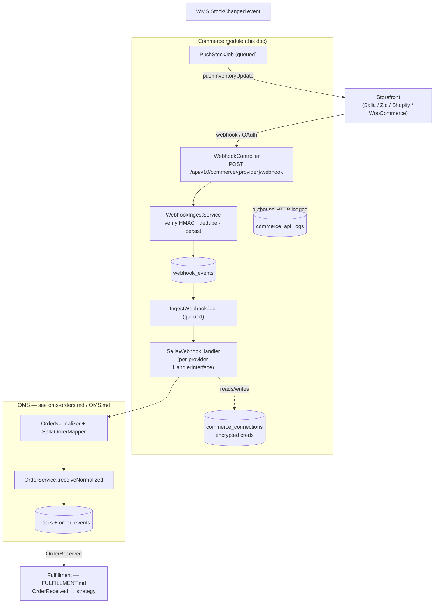
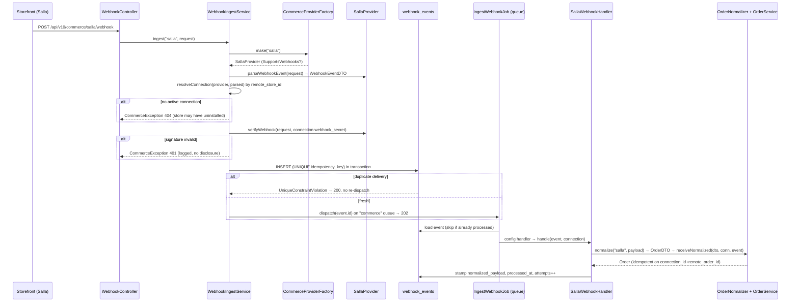
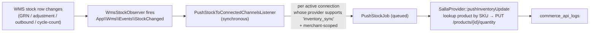

# Commerce — Storefront Ingestion Layer

> **Module root:** `app/Commerce/` · **Config:** `config/commerce.php`, `config/features.php` · **Feature flag:** `commerce_layer` (`FEATURE_COMMERCE_LAYER`, default **OFF**)
> **Primary source doc:** [`COMMERCE.md`](../../COMMERCE.md) (repo root) — this doc goes deeper and flags where that doc has drifted from code.
> **Status:** Phased build, partially live. Salla is the only wired provider. See [§13 Maturity & Status](#13-maturity--status).

This module is a generic, multi-tenant abstraction for talking to storefront platforms (Salla, Zid, Shopify, WooCommerce, …). It sits **between the storefront and the OMS**: it owns credentials, receives inbound webhooks, normalizes raw orders enough to hand off to the OMS, and pushes inventory + order updates back to the storefront. The storefront and the business logic (OMS, Fulfillment) are strictly decoupled — a new provider plugs in via config + one class, touching no business logic.

It is the **inbound-commerce sibling** of the outbound-courier Shipping module (see [`../shipping-architecture.md`](../shipping-architecture.md) / [`shipping-couriers.md`](shipping-couriers.md)) and deliberately mirrors its shape (factory, `AbstractProvider`, `ApiLogger`, `ConnectionService`, prune command) so the two read side-by-side.

**Cross-links:** [02-Project-Overview](../02-Project-Overview.md) · [06-Database](../06-Database.md) · [11-Modules](../11-Modules.md) · [12-Workflows](../12-Workflows.md) · [14-Integrations](../14-Integrations.md) · sibling module docs [oms-orders.md](oms-orders.md), [shipping-couriers.md](shipping-couriers.md) · root [`OMS.md`](../../OMS.md), [`FULFILLMENT.md`](../../FULFILLMENT.md).

---

## 1. Purpose

`rushly-saas` is the single source of truth; the Flutter apps are read-only/thin clients (see [02-Project-Overview](../02-Project-Overview.md)). The Commerce module is the platform's **front door for orders that originate on an external storefront**. Its job is narrow and deliberate:

1. **Own storefront credentials** per tenant, per store install (`commerce_connections`), each secret encrypted at rest.
2. **Receive inbound webhooks** from storefronts, authenticate them by per-connection HMAC, persist them idempotently (`webhook_events`), and queue processing.
3. **Resolve a provider by code** through a config-driven factory so business code never references a concrete provider class.
4. **Push outbound provider-side effects** — inventory-level updates (from WMS `StockChanged`) and, in later phases, order/shipment writebacks.
5. **Never** create parcels, decide fulfillment, or mutate WMS stock. It normalizes to a `RawOrderDTO`/canonical `OrderDTO` and hands off to the OMS (`OrderService`). What happens next is the OMS's and Fulfillment's job.

Source of the "never touches business logic" contract: `app/Commerce/Contracts/CommerceProviderInterface.php` (class docblock), `app/Commerce/Providers/Salla/SallaWebhookHandler.php` (handler is the only place domain logic fires).

### Where it sits in the pipeline



---

## 2. Responsibilities & boundaries

| Owns | Explicitly does **not** own |
|---|---|
| Storefront credentials + OAuth tokens (`commerce_connections`) | Canonical `Order` entity (OMS owns it — [oms-orders.md](oms-orders.md)) |
| Inbound webhook authentication, dedupe, audit trail (`webhook_events`) | Parcel creation / fulfillment routing (Fulfillment — [`FULFILLMENT.md`](../../FULFILLMENT.md)) |
| Provider resolution (factory), capability negotiation (marker interfaces) | WMS stock mutation (WMS owns it; Commerce only *reads* `StockChanged`) |
| Outbound HTTP to storefronts + logging (`commerce_api_logs`) | Order→canonical mapping rules (OMS `SallaOrderMapper` owns them) |
| Inventory push fan-out on stock change | Courier/AWB writeback (Shipping module) |

The symmetry rule: just as the Shipping module never touches parcel status (a listener does), the Commerce module never touches order/parcel business state directly — its `SallaWebhookHandler` hands the normalized DTO to `OrderService` and stops.

---

## 3. Folder structure (actual, verified against `app/Commerce/`)

```
app/Commerce/
├── CommerceServiceProvider.php          # registers ApiLogger, Factory, Repository singletons; merges config
├── Contracts/
│   ├── CommerceProviderInterface.php     # code / testConnection / authenticate / fetchOrder / pushOrderUpdate
│   ├── SupportsOAuth.php                 # buildAuthorizationUrl / handleOAuthCallback / refreshAccessToken
│   ├── SupportsWebhooks.php              # verifyWebhook / parseWebhookEvent
│   ├── SupportsBulkFetch.php             # fetchOrders(conn, filter): {orders[], next_cursor}
│   ├── SupportsOrderWriteback.php        # pure marker (no methods)
│   └── SupportsInventorySync.php         # pushInventoryUpdate(conn, updates[])
├── DTOs/
│   ├── CommerceConnectionDTO.php         # immutable connection snapshot; withTokens()/withSettings()
│   ├── RawOrderDTO.php                   # provider-native order payload (pre-normalization)
│   ├── WebhookEventDTO.php               # parsed inbound envelope + idempotencyKey
│   └── TestResultDTO.php                 # ok()/fail() + diagnostics
├── Exceptions/
│   ├── CommerceException.php             # base; carries payload[] + int code (mapped to HTTP)
│   ├── ProviderUnavailableException.php  # transport / 5xx / not-supported
│   ├── ProviderRejectedRequestException.php # provider validated + refused (4xx / OAuth error)
│   └── ConnectionTestFailedException.php # thrown by ConnectionService::store on failed test
├── Factory/CommerceProviderFactory.php   # make(code) / forConnection(conn) / codes()
├── Jobs/
│   ├── IngestWebhookJob.php              # per-event: resolve handler → handle() → stamp processed
│   └── PushStockJob.php                  # per-connection: pushInventoryUpdate(updates[])
├── Listeners/PushStockToConnectedChannelsListener.php  # fan-out on WMS StockChanged (synchronous)
├── Logging/ApiLogger.php                 # writes commerce_api_logs; masks sensitive headers; never throws
├── Models/
│   ├── CommerceProvider.php              # catalog row; supports()/isActive()
│   ├── CommerceConnection.php            # per-tenant creds; encrypted casts + $hidden; companywise scope
│   ├── CommerceApiLog.php                # outbound HTTP log (created_at only)
│   └── WebhookEvent.php                  # inbound envelope + normalized payload; scopes unprocessed/failed
├── Providers/
│   ├── AbstractCommerceProvider.php      # shared $this->http(): timed + logged + retried + typed errors
│   └── Salla/
│       ├── SallaProvider.php             # implements all 5 markers
│       └── SallaWebhookHandler.php       # per-event business logic
├── Repositories/CommerceConnectionRepository.php  # lookups + setDefault + activeForSync
├── Services/
│   ├── ConnectionService.php             # create / test / update / setDefault / deactivate
│   └── WebhookIngestService.php          # verify → resolve → persist → dispatch
└── Webhooks/HandlerInterface.php         # per-provider handle(WebhookEvent, CommerceConnection): void
```

`CommerceServiceProvider` is a **Phase-1 scaffold**: `register()` merges config and binds three singletons; `boot()` only publishes config. Event subscriptions live in the app-level `app/Providers/EventServiceProvider.php` (see [§9](#9-events--listeners)), not here. Registration is unconditional and safe — the factory has nothing to resolve until a provider row exists in config; the feature flag gates *user-visible* behavior, not module loading (`config/features.php` docblock).

---

## 4. Business rules (verified from code)

1. **Feature flag is a fail-closed kill switch.** Every user-visible surface — the webhook ingest endpoint, all `/admin/commerce/*` pages, the health dashboard — calls `abort_unless(config('features.commerce_layer'), 404)` (skipped only during console reflection so `route:list` works). Flipping `FEATURE_COMMERCE_LAYER=false` immediately 404s ingest. Routes still *register* so `route('commerce.…')` never throws. Sources: `app/Http/Controllers/Api/V10/Commerce/WebhookController.php`, `.../Backend/Commerce/ConnectionController.php`, `HealthController.php`, `WebhookEventController.php`, `SallaOAuthController.php`.
2. **Webhook auth = the signature, not a bearer token.** The ingest endpoint has no Sanctum/apiKey middleware. Trust is established by verifying HMAC/token against the resolved connection's `webhook_secret`. An attacker who knows the URL and even the `remote_store_id` still cannot forge an event. Source: `WebhookController` docblock + `WebhookIngestService::ingest()`.
3. **Verify *after* connection resolution.** The secret lives on the connection row, so the service must resolve the connection (by provider-emitted `remote_store_id`/merchant from the *unsigned* payload) before it can verify. The body-HMAC check against that connection's secret then completes the trust chain. Source: `WebhookIngestService` docblock.
4. **Idempotent ingest.** `webhook_events.idempotency_key` is UNIQUE. Each provider composes a stable key (`salla:{merchant}:{event}:{event_id}`). A duplicate delivery raises a unique-constraint violation which is caught and treated as success (HTTP 200) **without re-dispatching** the job; a fresh delivery returns 202. Source: `WebhookIngestService::ingest()`, migration `2026_06_30_160001`.
5. **Fast ACK, queued work.** The controller persists + dispatches inside a transaction and returns immediately; all heavy work runs in `IngestWebhookJob` on a dedicated `commerce` queue so a misbehaving storefront can't starve other tenant work. Source: `config/commerce.php` (`queue`), `WebhookIngestService`.
6. **Retry policy is config-driven & uniform.** Jobs read `commerce.retry` (`tries=3`, `backoff=[10,30,90]s`, `timeout=60s`). `AbstractCommerceProvider::http()` additionally does a cheap HTTP-level retry (`http_tries=2`, `http_sleep_ms=250`) on transport faults only. Source: `IngestWebhookJob`, `PushStockJob`, `AbstractCommerceProvider`.
7. **Replay-safe by design.** A final job failure stamps `attempts` + `last_error` but never clears the row; the admin "Replay" button re-dispatches `IngestWebhookJob` against the same row/payload/idempotency key — a fixed bug can be re-run without storefront help. Source: `IngestWebhookJob`, `WebhookEventController::replay`.
8. **Secrets never overwritten by mask sentinels.** On update, secret fields are only rewritten when the caller supplies a real value — the sentinels `''`, `__keep__`, and any value starting with `••` mean "keep stored ciphertext". Mirrors how the Shipping connections controller treats its password field. Source: `ConnectionService::maybeUpdateSecret()`.
9. **First connection per (company, provider) becomes default;** `setDefault` demotes siblings in one transaction. `deactivate` sets `status='paused'` (not delete). Source: `ConnectionService::store()`, `CommerceConnectionRepository::setDefault()`.
10. **Merchant-scoped stock fan-out.** On `StockChanged`, only connections wired to the event's `merchantId` (or with a null `merchant_id` = feed-all) receive a push — merchant A's stock never leaks to merchant B's Salla store. Products with no SKU are skipped (every current provider keys on SKU). Source: `PushStockToConnectedChannelsListener`.
11. **Inventory pushes use absolute-value semantics** (set-quantity-to-X), so retries are safe; unknown SKUs are logged + skipped, never thrown, so one bad SKU can't fail a batch. Source: `PushStockJob` + `SallaProvider::pushInventoryUpdate()`.
12. **Store credentials are provider-shape-specific columns**, not one JSON blob — OAuth tokens, static API key/secret, and webhook HMAC secret each get their own encrypted column so they can be masked in logs and rotated individually. Source: migration `2026_06_30_140002` docblock.

---

## 5. Database tables

Four tables (+ one alter migration). Every table is scoped by `company_id` per the codebase-wide `companywise` convention; tenant tables are **not** FK-constrained to the tenant (matches platform convention — see [06-Database](../06-Database.md)).

### `commerce_providers` — seeded catalog
`2026_06_30_140001_create_commerce_providers_table.php`

| Column | Type | Notes |
|---|---|---|
| `id` | bigint PK | |
| `code` | string(32) **UNIQUE** | `salla`, `zid`, `shopify`, `woocommerce`, `magento`, `opencart`, `custom_rest` |
| `name` | string(64) | Display name |
| `logo_url` | string(255) null | `/images/partners/*.svg` |
| `status` | enum(`active`,`disabled`) default `active` | Seeded **disabled**, flipped active per-provider |
| `supports` | json null | e.g. `["oauth","webhooks","bulk_fetch","order_writeback","inventory_sync"]` — mirrors the marker interfaces so the UI renders capability chips without instantiating the class |

Seeded by `2026_06_30_140004_seed_commerce_providers.php` (7 providers, all `disabled`). `2026_06_30_150001_activate_salla_commerce_provider.php` flips **salla → active**. All others remain disabled until a concrete impl lands.

### `commerce_connections` — per-tenant, per-store install
`2026_06_30_140002_create_commerce_connections_table.php`

| Column | Type | Notes |
|---|---|---|
| `id` | bigint PK | |
| `company_id` | bigint, indexed | Tenant scope |
| `provider_id` | FK → `commerce_providers`, cascade delete | |
| `connection_name` | string(100) | Human label; disambiguates multiple installs |
| `remote_store_id` | string(191) null | salla merchant id / zid store id / shopify shop domain / WC site_url |
| `domain` | string(255) null | Public storefront URL (display only) |
| `merchant_id` | bigint null, indexed | Which Rushly merchant this store feeds (loose FK) |
| `access_token_encrypted` | text null | **`encrypted` cast** |
| `refresh_token_encrypted` | text null | **`encrypted` cast** |
| `token_expires_at` | timestamp null | |
| `api_key_encrypted` | text null | **`encrypted` cast** (static-cred providers) |
| `api_secret_encrypted` | text null | **`encrypted` cast** |
| `webhook_secret_encrypted` | text null | **`encrypted` cast** — per-connection HMAC secret |
| `settings` | json null | Provider-specific extras |
| `status` | enum(`active`,`paused`,`invalid`,`reauth_required`) default `active` | |
| `is_default` | bool default false | |
| `last_tested_at` / `last_sync_at` / `last_event_at` | timestamp null | Liveness surfaced in UI + health dashboard |

**Constraints:** UNIQUE `(company_id, provider_id, connection_name)`; UNIQUE `(provider_id, remote_store_id)` (one external store install ↔ one connection, cross-tenant); INDEX `(company_id, is_default)`, `(provider_id, status)`.
All five `*_encrypted` columns are also in the model's `$hidden` array, so API serializations never leak them (relied on by the merchant app feed — [§10](#10-apis)).

### `commerce_api_logs` — outbound HTTP audit (high-volume, pruned)
`2026_06_30_140003_create_commerce_api_logs_table.php` · model has `public $timestamps = false` (`created_at` only, `useCurrent()`).

Columns: `id`, `company_id` (null), `connection_id` (null), `provider_code`, `endpoint(255)`, `method(10)`, `request_headers` (json, sensitive-masked), `request_body` (longText), `response_status` (smallint), `response_body` (longText), `duration_ms`, `error`, `created_at` (indexed). Extra indexes `(company_id, created_at)`, `(connection_id, created_at)`. Written only by `ApiLogger` (never by providers directly).

### `webhook_events` — inbound audit + normalized snapshot
`2026_06_30_160001_create_webhook_events_table.php` + `2026_07_01_100001_add_normalized_payload_to_webhook_events.php`

| Column | Type | Notes |
|---|---|---|
| `id` | bigint PK | |
| `company_id` | bigint null, indexed | Resolved after connection lookup |
| `connection_id` | bigint null, indexed | Loose FK to `commerce_connections` |
| `provider_code` | string(32), indexed | |
| `event_type` | string(100) null | `order.created`, `shipment.creating`, `app.uninstalled`, … |
| `idempotency_key` | string(191) **UNIQUE** | Dedupe key; catches retried deliveries |
| `signature` | string(191) null | `X-Salla-Signature` / `X-Shopify-Hmac` |
| `payload` | longText (json cast) | Full raw body — kept for reprocessing after mapper changes |
| `normalized_payload` | longText null (json cast) | Canonical `OrderDTO` dump (Phase 4) |
| `normalization_error` | text null | `NormalizationException` message if mapping failed |
| `received_at` | timestamp, indexed | |
| `processed_at` | timestamp null, indexed | Stamped on first successful handler run |
| `attempts` | smallint default 0 | Retry counter |
| `last_error` | text null | Per-attempt handler error |

Indexes: `(provider_code, processed_at)`, `(connection_id, received_at)`, `(company_id, received_at)`.

> **⚠️ Doc vs Code — `webhook_events` schema.** [`COMMERCE.md`](../../COMMERCE.md) §3 lists columns `remote_event_id`, `headers`, `raw_payload`, `verified`, `error`, `received_at`. The **actual** migration has none of `remote_event_id` / `headers` / `verified`; the raw body column is `payload` (not `raw_payload`), the error column is `last_error`, and the table adds `idempotency_key` (UNIQUE), `attempts`, `normalized_payload`, `normalization_error`. The migration is the source of truth.

---

## 6. Provider contract & capability model

The base contract is intentionally tiny — the irreducible core every provider can honor. Source: `app/Commerce/Contracts/CommerceProviderInterface.php`.

```php
interface CommerceProviderInterface {
    public function code(): string;
    public function testConnection(CommerceConnectionDTO $c): TestResultDTO;   // must not mutate state
    public function authenticate(CommerceConnectionDTO $c): CommerceConnectionDTO; // idempotent; OAuth refresh
    public function fetchOrder(CommerceConnectionDTO $c, string $remoteOrderId): RawOrderDTO;
    public function pushOrderUpdate(CommerceConnectionDTO $c, string $remoteOrderId, array $update): void;
}
```

Capability variance on the commerce side is wider than shipping (some providers only push, some only pull, some don't accept writeback). Providers **opt into** extra behavior via marker interfaces; the `commerce_providers.supports` JSON mirrors them so the admin UI can render capability chips without instantiating the class.

| Marker interface | Method(s) | Meaning |
|---|---|---|
| `SupportsOAuth` | `buildAuthorizationUrl`, `handleOAuthCallback`, `refreshAccessToken` | Provider uses OAuth 2.0 install/refresh |
| `SupportsWebhooks` | `verifyWebhook(Request, ?secret)`, `parseWebhookEvent(Request): WebhookEventDTO` | Provider pushes events; enables ingest |
| `SupportsBulkFetch` | `fetchOrders(conn, filter): {orders[], next_cursor}` | Provider can list orders (backfill/gap-repair) |
| `SupportsOrderWriteback` | *(pure marker, no methods)* | `pushOrderUpdate()` is safe to call |
| `SupportsInventorySync` | `pushInventoryUpdate(conn, updates[])` | Provider accepts stock pushes |

> **⚠️ Doc vs Code — inventory method name.** `COMMERCE.md` calls the stock method `pushStock(...)`; the actual `SupportsInventorySync` method is **`pushInventoryUpdate(CommerceConnectionDTO $c, array $updates)`** where `$updates` is `[['sku'=>string,'quantity'=>int], …]`.

### Factory
`CommerceProviderFactory` resolves `config('commerce.providers.<code>.class')` via the container (so providers can constructor-inject `ApiLogger`), caches instances, and validates the resolved class implements the interface. `make(string $code)`, `forConnection(CommerceConnection)`, `codes()`. Pure dispatcher — no provider knowledge. Intentional mirror of `App\Shipping\Factory\ShippingProviderFactory`.

### AbstractCommerceProvider — the HTTP chokepoint
`AbstractCommerceProvider::http($method, $endpoint, ?$connection, \Closure $build, ?$rawBody)` is the single outbound-HTTP path. Every call is automatically timed, logged to `commerce_api_logs` (with sensitive-header masking), HTTP-retried on transport faults, and error-normalized: transport error / `serverError()` → `ProviderUnavailableException`. Concrete providers only supply payload shape + response mapping and never write logs themselves.

---

## 7. Ingestion flow (inbound webhook)

Entry point: **`POST /api/v10/commerce/{provider}/webhook`** → invokable `App\Http\Controllers\Api\V10\Commerce\WebhookController` (route name `commerce.webhook.ingest`, `routes/api.php:135`). No auth middleware — the HMAC is the auth.



**HTTP status mapping** (`WebhookController` → `CommerceException::getCode()`): 400 (not-a-webhook-provider / parse fail), 401 (bad signature), 404 (no connection), 200 (duplicate), 202 (accepted), 500 (unexpected). 

**IngestWebhookJob** resolves the per-provider handler from `config('commerce.providers.<code>.handler')` via the container (constructor injection), guards against double-dispatch (`isProcessed()`), calls `handle()`, and on success stamps `processed_at`/`attempts`/clears `last_error`. On handler exception it stamps `attempts`+`last_error` and rethrows so Laravel's queue retries per `commerce.retry`. `failed()` logs `commerce.ingest.exhausted`.

**SallaWebhookHandler** (the per-provider domain logic) dispatches on `event_type`:
- `app.uninstalled` → set connection `status='paused'`.
- `app.installed` / `app.store.authorize` → log only (token delivery wiring is a later phase).
- `order.*` → `OrderNormalizer::normalize('salla', payload, company_id)` → persist `normalized_payload` → `OrderService::receiveNormalized(dto, connection, event)` (materializes the canonical Order; idempotent on `(connection_id, remote_order_id)`). `NormalizationException` is caught (non-retryable — bad payload won't improve), stamps `normalization_error`, event still marked processed. Any other exception rethrows for retry.
- `shipment.*` → log only (writeback handoff is a Fulfillment-phase item).
- default → log at info.
Every event stamps `connection.last_event_at` for liveness.

> **⚠️ Doc vs Code — ingest route & pipeline split.** `COMMERCE.md` §5 shows the route as `POST /webhooks/commerce/{providerCode}` to a `WebhookIngestController`, and shows `IngestWebhookJob` itself calling `HandlerInterface::parse → RawOrderDTO → OrderNormalizer → OrderService`. **Actual:** the route is `POST /api/v10/commerce/{provider}/webhook` (invokable `WebhookController`); `HandlerInterface` has a single `handle(WebhookEvent, CommerceConnection): void` method (no `parse`); parsing lives on the **provider** (`parseWebhookEvent`), and normalization + OMS handoff live in the **handler** (`SallaWebhookHandler`), not in the job.

### Failure semantics
| Failure | Result |
|---|---|
| Provider not registered / lacks `SupportsWebhooks` | `CommerceException` 400, nothing persisted |
| Parse throws | 400, nothing persisted |
| No active connection for `remote_store_id` | 404, nothing persisted |
| Bad signature | 401 (logged `commerce.webhook.signature_invalid`), nothing persisted |
| Duplicate `idempotency_key` | 200, existing event returned, job **not** re-dispatched |
| Handler throws (non-normalization) | Job retries with backoff; `last_error` stamped |
| `NormalizationException` | Event marked processed with `normalization_error`; no retry |

---

## 8. Inventory sync flow (outbound stock push)



- `StockChanged` (`app/Wms/Events/StockChanged.php`) carries `companyId`, `productId`, `sku`, `merchantId`, `previousQuantity`, `newQuantity`, `reason`. It reports **total on-hand across all locations** (reserved qty is intentionally excluded — an explicit oversell/pricing tradeoff flagged for a later "sellable = total − reserved" refinement).
- `PushStockToConnectedChannelsListener` is **not queued** (dispatching jobs is cheap; HTTP runs in the job). It filters connections by `company_id` + `status='active'` + a `LIKE '%"inventory_sync"%'` match on the provider's `supports` JSON (portable across MySQL/sqlite), then applies merchant scoping (`merchant_id = event.merchantId OR merchant_id IS NULL`). No SKU → skip.
- `PushStockJob` re-loads the connection, skips cleanly if it was paused between dispatch and run, verifies the provider is `SupportsInventorySync`, and calls `pushInventoryUpdate(DTO, updates)`. Retries per `commerce.retry`.
- `SallaProvider::pushInventoryUpdate` resolves each SKU to a Salla product id (`GET /products?sku=`), then `PUT /products/{id}/quantity` with absolute quantity. Unknown SKUs → `commerce.salla.push_stock.sku_not_found`, skipped. Per-SKU errors logged and swallowed; transport/5xx bubble up as `ProviderUnavailableException` for job retry.

> **⚠️ Doc vs Code — PushStockJob signature.** `COMMERCE.md` §6 shows `PushStockJob(connection_id, sku, quantity)`. Actual constructor is `PushStockJob(int $connectionId, array $updates)` where `$updates = [['sku'=>…,'quantity'=>…], …]` (batchable).

---

## 9. Events & listeners

Wired in `app/Providers/EventServiceProvider.php` (not in `CommerceServiceProvider`):

```php
StockChanged::class => [ PushStockToConnectedChannelsListener::class ],
```

The module **consumes** `App\Wms\Events\StockChanged`. It does not currently define its own domain events — order/parcel state events belong to OMS (`OrderReceived`/`OrderUpdated`, see [oms-orders.md](oms-orders.md)) and Fulfillment. The commerce → OMS handoff is a direct service call (`OrderService::receiveNormalized`), and the OMS then emits `OrderReceived` which `RouteToFulfillmentListener` picks up (see [`FULFILLMENT.md`](../../FULFILLMENT.md)).

---

## 10. APIs

### Inbound webhook (public, HMAC-authenticated)
`POST /api/v10/commerce/{provider}/webhook` — name `commerce.webhook.ingest` (`routes/api.php:135`). No Sanctum. 404s when `commerce_layer` is off. Response: `{ ok, event_id, duplicate, message }` with 202 (accepted) / 200 (duplicate) / 4xx-5xx per [§7](#7-ingestion-flow-inbound-webhook).

### Merchant mobile API (Sanctum)
`GET /api/v10/store-connections` → `App\Http\Controllers\Api\V10\MerchantStoreConnectionsController@index` (`routes/api.php:345`, inside the `v10` + `auth:sanctum` group). **Read-only.** Returns the authenticated merchant's connections scoped by `companywise()` + `merchant_id`, with secrets stripped by the model's `$hidden`. Payload per row: `id, provider_code, provider_name, connection_name, domain, status, is_default, last_tested_at, last_sync_at, last_event_at`. Consumed by the merchant Flutter app ([§11](#11-flutter-screens-that-consume-it)).

### Admin web (Inertia/React, session-guarded)
Registered in **both** `routes/web.php` (tenant admin, `commerce.*` names, ~L979) and `routes/superadmin.php` (~L257), each gated by `hasPermission:integrations_read|integrations_update` and the feature flag. Controllers under `app/Http/Controllers/Backend/Commerce/`:

| Route (name) | Controller@method | Renders / does |
|---|---|---|
| `GET commerce/connections` (`commerce.connections.index`) | `ConnectionController@index` | `Admin/Commerce/Connections/Index` |
| `GET commerce/connections/create` | `ConnectionController@create` | `Admin/Commerce/Connections/Edit` (create mode) |
| `POST commerce/connections/test` | `ConnectionController@test` | Runs `ConnectionService::test` |
| `POST commerce/connections/{provider}` (`store`) | `ConnectionController@store` | Test-then-persist |
| `GET commerce/connections/{id}/edit`, `PUT commerce/connections/{id}`, `DELETE …`, `POST …/default` | `ConnectionController` | Edit / update / destroy / set-default |
| `GET commerce/connections/salla/oauth/redirect` \| `…/callback` | `SallaOAuthController@redirect` \| `@callback` | OAuth install → upserts a connection keyed on `remote_store_id` (superadmin.php only) |
| `GET commerce/webhook-events` \| `…/{id}` \| `POST …/{id}/replay` | `WebhookEventController` | Read-only viewer + replay (re-dispatch `IngestWebhookJob`) |
| `GET commerce/health` (`commerce.health.index`) | `HealthController@index` | `Admin/Commerce/Health/Index` — combined Commerce + Shipping connection health |

`HealthController` computes a per-connection health verdict (`ok` / `stale` (>30d since last event/test) / `invalid` (status `invalid`/`reauth_required`) / `paused` / `unknown`) and a tenant summary — the "is any integration broken?" dashboard.

---

## 11. Flutter screens that consume it

Only the **merchant app** (`rushly-merchant-app`) consumes this module; it is a read-only client (SSOT is `rushly-saas` — [02-Project-Overview](../02-Project-Overview.md)). Feature folder `lib/features/store_connections/`:

| File | Role |
|---|---|
| `data/store_connections_repository.dart` | Calls `GET /store-connections` (`ApiEndpoints.storeConnections`), maps to `StoreConnection`; exposes a `FutureProvider.autoDispose` |
| `domain/store_connection.dart` | `StoreConnection` model: `id, providerCode, providerName, connectionName, domain, status, isDefault, lastTestedAt, lastSyncAt, lastEventAt`; `isActive` getter |
| `presentation/store_connections_screen.dart` | `StoreConnectionsScreen` — lists connected storefronts with per-provider icon/color (handles `woocommerce`, etc.); reached from `profile_screen.dart` → `context.push('/store-connections')` (`app_router.dart:159`) |

The screen is **display-only** — it surfaces which storefronts are connected and their liveness (`last_event_at`, `status`), matching the read-only backend endpoint. No create/edit/OAuth from mobile; connection management is admin-web only. No driver/fleet/warehouse/scanner/sorting/supervisor/admin app consumes Commerce (verified against the app inventory in [_CONTEXT_BRIEF](../_CONTEXT_BRIEF.md)).

---

## 12. Dependencies, notifications & permissions

### Dependencies
- **OMS** (`app/Oms/`) — `OrderNormalizer`, `SallaOrderMapper` (registered in `config/commerce.php` as `order_mapper`), `OrderService::receiveNormalized`, `NormalizationException`. Downstream target of every order webhook. See [oms-orders.md](oms-orders.md) / [`OMS.md`](../../OMS.md).
- **WMS** (`app/Wms/`) — source of the `StockChanged` event that drives inventory push.
- **Fulfillment** (`app/Fulfillment/`) — indirectly, via OMS `OrderReceived`. See [`FULFILLMENT.md`](../../FULFILLMENT.md).
- **Shipping** (`app/Shipping/`) — sibling module; `HealthController` aggregates both. Shared design DNA (factory / AbstractProvider / ApiLogger / prune). See [shipping-couriers.md](shipping-couriers.md).
- **Tenant Salla creds** — `sallaCreds($key)` helper (`app/Http/Helper/Helper.php:1004`) reads per-tenant `integration_settings.meta` JSON (OAuth `client_id`/`client_secret`/`redirect_uri`/`webhook_secret`). Each tenant registers its own Salla Partner app; this replaces the old `.env`-based `config('salla.oauth.*')`.
- **Laravel HTTP client** (`Illuminate\Http`), queue, `encrypted` casts (survive `php artisan key:rotate`).
- **Legacy Salla stays live in parallel:** `app/Salla/` (ApiClient/OAuthController) and `salla_merchants` continue to serve existing installs; the new pipeline lands installs in `commerce_connections` instead. `SallaProvider` deliberately re-implements the handful of API calls via `$this->http()` rather than coupling to the legacy `ApiClient` (which takes a `Merchant` model).

### Notifications
**Not found in the current codebase.** The Commerce module emits **no** user/merchant/push/SMS/email notifications. All observability is via structured `Log::` tags (`commerce.webhook.*`, `commerce.ingest.*`, `commerce.push_stock.*`, `commerce.salla.*`, `commerce.api_log_write_failed`) and the DB audit trail (`webhook_events`, `commerce_api_logs`) surfaced in the admin viewer + health dashboard. No listener dispatches a Notification.

### Permissions
Reuses the shared integrations permissions (no module-scoped perms yet):
- `integrations_read` — view connections, webhook events, health.
- `integrations_update` — create/edit/delete/test/set-default, replay, OAuth install.

Seeded/backfilled by `database/migrations/2026_05_24_000004_seed_integrations_permissions.php`: roles/users with `general_settings_read` get `integrations_read`, `general_settings_update` get `integrations_update`, and the Super Admin slug gets both. Enforced via `middleware('hasPermission:…')` on every admin route. See [10-Authentication](../10-Authentication.md) / [17-Security](../17-Security.md).

---

## 13. Maturity & status

The module was built in explicit phases (docblocks reference "Phase N" throughout). Verified state as of 2026-07-27:

| Area | Status | Evidence |
|---|---|---|
| Schema (4 tables + alter) | ✅ Present, migrated | `database/migrations/2026_06_30_140001…160001`, `2026_07_01_100001` |
| Provider registry / factory / abstract HTTP / logging | ✅ Complete | `config/commerce.php`, `Factory/`, `AbstractCommerceProvider`, `ApiLogger` |
| Connection lifecycle (create/test/update/default/deactivate) | ✅ Complete | `ConnectionService`, `ConnectionController` |
| Webhook ingest (verify/dedupe/persist/dispatch) | ✅ Complete | `WebhookIngestService`, `WebhookController`, `IngestWebhookJob` |
| Salla `testConnection` / `fetchOrder` / webhook verify+parse | ✅ Wired | `SallaProvider` |
| Salla OAuth install (redirect/callback/refresh) | ✅ Wired (Phase 3.5) | `SallaOAuthController`, `SallaProvider::handleOAuthCallback/refreshAccessToken` |
| Order webhook → OMS materialization | ✅ Wired (Phase 4/5) | `SallaWebhookHandler` → `OrderService::receiveNormalized` |
| Inventory push (WMS → Salla) | ✅ Wired (Phase 7) | listener + `PushStockJob` + `pushInventoryUpdate` |
| Retention prune | ✅ Scheduled daily 03:00 | `CommercePruneLogs`, `Console/Kernel.php:36` |
| Admin UI (connections/events/health) | ✅ Present (Inertia pages `Admin/Commerce/*`) | Backend controllers |
| Merchant mobile feed | ✅ Read-only | `MerchantStoreConnectionsController` + Flutter `store_connections` |
| Salla `pushOrderUpdate` (status/tracking writeback) | ⛔ Stub — throws `ProviderUnavailableException` | `SallaProvider::pushOrderUpdate` |
| Salla `authenticate` proactive refresh scheduler | ⚠️ Partial — refresh method exists, no scheduled job flips `reauth_required` | `SallaProvider::authenticate` |
| `SupportsBulkFetch` (backfill on install / gap repair) | ⛔ Not implemented on Salla (marker not declared) | `SallaProvider` implements only OAuth/Webhooks/Writeback-marker/InventorySync |
| Zid / Shopify / WooCommerce / Magento / OpenCart / Custom REST | ⛔ Catalog rows only, `status='disabled'`, no provider class | seed migration |
| **Whole module in production** | ⚠️ **Dormant by default** — `FEATURE_COMMERCE_LAYER` defaults `false` | `config/features.php` |

**Net:** The Salla inbound path (OAuth install → webhook → OMS order) and the WMS→Salla stock push are functionally complete; outbound order/shipment writeback to Salla is stubbed; all other providers are catalog placeholders; and the entire surface is off unless the tenant/environment flips the feature flag. See also [22-Technical-Debt](../22-Technical-Debt.md).

---

## 14. Adding a new provider

Same pattern as Shipping ([shipping-couriers.md](shipping-couriers.md)):

1. `class FooProvider extends AbstractCommerceProvider` — implement `code()` + the 5 core methods, using `$this->http(...)` for HTTP (free logging/retry/error-normalization). Declare whichever `SupportsX` markers apply.
2. If webhook-driven, also write a `FooWebhookHandler implements HandlerInterface` in the same namespace.
3. Add a `commerce_providers` seed row (and flip `status='active'` when ready) with a matching `supports` array.
4. Write `app/Oms/Normalization/Providers/FooOrderMapper.php` so the OMS can translate the raw payload.
5. Register in `config/commerce.php` under `providers.foo` (`class`, `handler`, `order_mapper`, `config`).

Business logic (`OrderService`, `FulfillmentRouter`, listeners, controllers) is unchanged.

---

## 15. Observability & retention

- **Prune:** `commerce:prune-logs` runs daily at **03:00** (`Console/Kernel.php:36`, `withoutOverlapping`). It prunes `commerce_api_logs` older than `config('commerce.logging.retention_days')` (default 30) **and** processed `webhook_events` (`processed_at IS NOT NULL AND received_at < cutoff`). Unprocessed/failed events are kept regardless. Chunked deletes (5000/batch). `--dry-run` reports counts only.
  > **⚠️ Doc vs Code — webhook_events pruning.** `COMMERCE.md` §8 states `webhook_events` "is intentionally never pruned automatically." The actual `CommercePruneLogs` command **does** prune *processed* webhook events past retention (unprocessed/failed rows are exempt). Also, the folder-listing comment in `COMMERCE.md` says `commerce_api_logs` is "pruned by shipping:prune-logs sibling" — it is pruned by **`commerce:prune-logs`** (`shipping:prune-logs` is the separate Shipping-side command at 03:15).
- **Sensitive-header masking:** `ApiLogger` masks `config('commerce.logging.sensitive_headers')` (`authorization`, `x-api-key`, `x-manager-token`, `x-shopify-access-token`, `x-salla-signature`, `x-zid-signature`) before persisting.
- **Log tags** (structured): `commerce.webhook.signature_invalid`, `commerce.webhook.duplicate`, `commerce.webhook.controller.unhandled`, `commerce.ingest.event_missing|no_handler|handler_failed|exhausted`, `commerce.push_stock.dispatched|failed|connection_missing|provider_does_not_support`, `commerce.salla.webhook.*`, `commerce.salla.push_stock.*`, `commerce.salla.oauth.redirect`, `commerce.api_log_write_failed`.

---

## 16. Future improvements (grounded in code TODOs / stubs)

1. **Wire Salla `pushOrderUpdate`** — status/tracking writeback to `/shipments/{id}/status`, driven by OMS/Fulfillment (`ParcelStatusChanged` → Commerce writeback). Currently throws. (`SallaProvider::pushOrderUpdate`.)
2. **Scheduled token refresher** — a job that calls `authenticate()`/`refreshAccessToken()` before `token_expires_at` and flips `status='reauth_required'` on refresh-token revocation. The methods exist; the scheduler does not. (`SallaProvider::authenticate` docblock.)
3. **Implement `SupportsBulkFetch` for Salla** — backfill on install + webhook-gap repair; contract is defined, no provider implements it yet.
4. **Sellable-vs-total stock** — make `total − reserved` an explicit, per-tenant configurable choice instead of pushing gross on-hand (`StockChanged` docblock, "Phase 7.5").
5. **Second provider (Zid/Shopify)** — catalog rows + `supports` already seeded; needs a provider class + `OrderMapper` to prove the abstraction beyond Salla.
6. **Module-scoped permissions** — replace shared `integrations_read/update` with per-module perms ("Phase 9" per controller docblocks).
7. **Reconcile `COMMERCE.md`** with the shipped route path, handler split, method names, `webhook_events` schema, and pruning behavior (all flagged above).

---

## Sources

**Config & flags:** `config/commerce.php`, `config/features.php`, `app/Console/Kernel.php`
**Module code:** `app/Commerce/CommerceServiceProvider.php`; `Contracts/{CommerceProviderInterface,SupportsOAuth,SupportsWebhooks,SupportsBulkFetch,SupportsOrderWriteback,SupportsInventorySync}.php`; `DTOs/{CommerceConnectionDTO,RawOrderDTO,WebhookEventDTO,TestResultDTO}.php`; `Exceptions/{CommerceException,ProviderUnavailableException,ProviderRejectedRequestException,ConnectionTestFailedException}.php`; `Factory/CommerceProviderFactory.php`; `Providers/AbstractCommerceProvider.php`; `Providers/Salla/{SallaProvider,SallaWebhookHandler}.php`; `Services/{WebhookIngestService,ConnectionService}.php`; `Jobs/{IngestWebhookJob,PushStockJob}.php`; `Listeners/PushStockToConnectedChannelsListener.php`; `Logging/ApiLogger.php`; `Models/{CommerceProvider,CommerceConnection,CommerceApiLog,WebhookEvent}.php`; `Repositories/CommerceConnectionRepository.php`; `Webhooks/HandlerInterface.php`
**Controllers:** `app/Http/Controllers/Api/V10/Commerce/WebhookController.php`, `app/Http/Controllers/Api/V10/MerchantStoreConnectionsController.php`, `app/Http/Controllers/Backend/Commerce/{ConnectionController,SallaOAuthController,WebhookEventController,HealthController}.php`
**Commands / events / helpers:** `app/Console/Commands/CommercePruneLogs.php`, `app/Wms/Events/StockChanged.php`, `app/Providers/EventServiceProvider.php`, `app/Http/Helper/Helper.php` (`sallaCreds`)
**Migrations:** `database/migrations/2026_06_30_140001…140004`, `2026_06_30_150001`, `2026_06_30_160001`, `2026_07_01_100001`, `2026_05_24_000004_seed_integrations_permissions.php`
**Routes:** `routes/api.php` (L135, L345), `routes/web.php` (~L979), `routes/superadmin.php` (~L257)
**Flutter (rushly-merchant-app):** `lib/features/store_connections/{data/store_connections_repository,domain/store_connection,presentation/store_connections_screen}.dart`, `lib/core/api/api_endpoints.dart`, `lib/shared/router/app_router.dart`
**Primary docs cross-checked:** `COMMERCE.md` (root), `docs/_CONTEXT_BRIEF.md`, `docs/14-Integrations.md`, `docs/02-Project-Overview.md`
