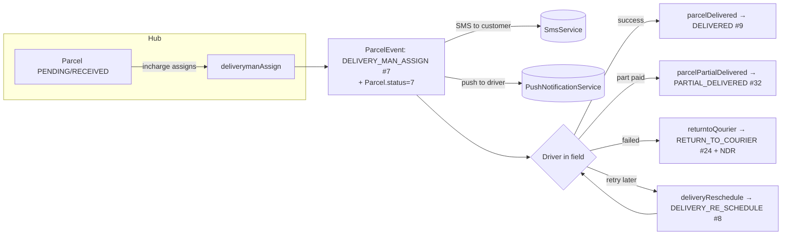
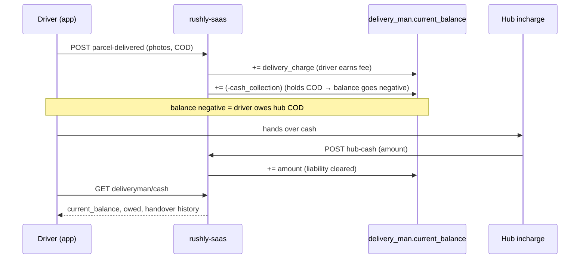
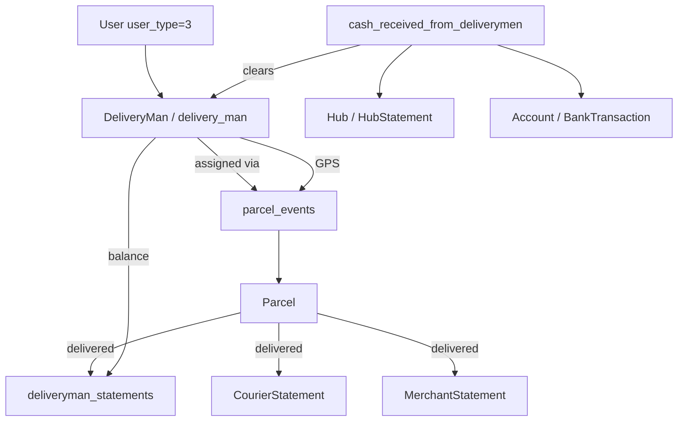

# Drivers — Deliverymen & Last-Mile

> **Module scope:** the *deliveryman* (last-mile courier) domain in `rushly-saas` — the entity, how a parcel gets assigned to a driver, the pickup → delivery → cash-in-hand → earnings lifecycle, the driver mobile app flows that consume it, and the driver performance analytics that grade it.
>
> **Grounding:** every non-trivial claim below cites a real source file. `rushly-saas` is the single source of truth; `rushly-driver-app` (Flutter) is a pure client. Read the [shared context brief](../_CONTEXT_BRIEF.md) first.
>
> **Not covered here** (see siblings): long-haul fleet drivers → [`fleet.md`](fleet.md); the parcel entity & full status machine → [`parcels.md`](parcels.md); NDR internals → [`parcels.md`](parcels.md) + [`14-Integrations.md`](../14-Integrations.md); WMS picker/packer flows → [`wms-warehouse.md`](wms-warehouse.md).

---

## 1. Purpose & responsibilities

A **DeliveryMan** (used interchangeably with "driver", "courier", "deliveryman" in code) is the human who physically completes the last leg of a parcel's journey: receiving parcels at a hub, carrying them to the customer, collecting Cash-on-Delivery (COD) money, and handing that money back to the hub. The module is responsible for:

| Responsibility | Where it lives |
|---|---|
| Driver identity, employment, licence & bank records | `app/Models/Backend/DeliveryMan.php`, `delivery_man` table |
| Admin CRUD (create/edit/list couriers) | `app/Http/Controllers/Backend/DeliveryManController.php` |
| Assigning parcels to a driver | `app/Repositories/Parcel/ParcelRepository.php` (`deliverymanAssign`, `deliveryManAssignMultipleParcel`) |
| Delivery outcome capture (delivered / partial / not-delivered) | `app/Http/Controllers/Api/V10/DeliverymanController.php`, `DeliveryManParcelController.php`, `ParcelRepository::parcelDelivered` |
| Cash-in-hand ledger (COD held vs. handed over) | `delivery_man.current_balance`, `deliveryman_statements`, `cash_received_from_deliverymen` |
| Driver earnings (delivery/pickup/return charges) | `deliveryman_statements`, `DeliveryManIncomeExpenseController.php` |
| Driver mobile app API | `routes/api.php` (v10 group, `deliveryman/*`) |
| Driver performance KPIs / leaderboard | `app/Services/Performance/DriverPerformanceService.php` |

> Cross-links: this module sits on top of the parcel status machine documented in [`parcels.md`](parcels.md) and [`12-Workflows.md`](../12-Workflows.md); it feeds the accounting statements described in [`04-Business-Logic.md`](../04-Business-Logic.md); and it is exposed to mobile via the API surface in [`09-API.md`](../09-API.md). See also [`13-User-Journeys.md`](../13-User-Journeys.md) (driver journey) and [`20-Performance.md`](../20-Performance.md) (the perf dashboard).

---

## 2. The DeliveryMan entity

### 2.1 Model

`app/Models/Backend/DeliveryMan.php` maps to the **`delivery_man`** table (singular, no `s` — note this when writing queries). Key traits and structure:

- `use HasFactory, LogsActivity;` — every change to `user.name` and `current_balance` is written to the Spatie activity log under log name `DeliveryMan` (`getActivitylogOptions`).
- A DeliveryMan **is a thin profile attached to a `User` row** — the login identity, name, mobile, email, address, hub and salary all live on `users`, while pay-rates, balances, employment and documents live on `delivery_man`. The link is `delivery_man.user_id → users.id` (`user()` relation).
- The user's `user_type` is `UserType::DELIVERYMAN = 3` (`app/Enums/UserType.php`).

Relations (`DeliveryMan.php`):

| Relation | Target | FK | Meaning |
|---|---|---|---|
| `user()` | `User` | `user_id` | Login identity / contact info |
| `hub()` | `Hub` | `hub_id` | Home hub (⚠️ `hub_id` is read off the model but is not in `$fillable` / base migration — see §2.4) |
| `supplierCompany()` | `SupplierCompany` | `supplier_company_id` | For outsourced drivers |
| `operationalArea()` | `OperationalArea` | `operational_area_id` | Zone the driver serves |
| `directManager()` | `User` | `direct_manager_id` | Reporting line |
| `uploadLicense()` | `Upload` | `driving_license_image_id` | Driving licence scan |
| `iqamaImage()` / `contractImage()` / `promissoryNoteImage()` | `Upload` | resp. ids | Compliance documents |
| `deliveries()` | `ParcelEvent` | `delivery_man_id` | All delivery-side events |
| `pickups()` | `ParcelEvent` | `pickup_man_id` | All pickup-side events |
| `assignedShipments()` / `deliveredShipments()` / `pendingShipments()` | `ParcelEvent` (+`parcel`) | `delivery_man_id` | Assignment roll-ups; "delivered" = related parcel `status = 9` |

Scopes: `active()` (status = `Status::ACTIVE`), `companywise()` (`where company_id = settings()->id` — the per-tenant guard used everywhere), `orderByDesc($col)`.

Helper: `isContractExpiringSoon(int $days = 30)` — true when `contract_end_date` is within N days.

### 2.2 `driver_type` — three kinds of driver

Introduced by `2026_06_12_000001_extend_deliveryman_form.php`, `delivery_man.driver_type` is a free-string with three UI-driven values (from the create form labels in `DeliveryManController::deliverymanLabels`):

- `freelancer`
- `outsourced` (pairs with `supplier_company_id`)
- `company_courier` (the default when editing legacy rows — `DeliveryManController::edit`)

### 2.3 `delivery_man` table columns

Base table — `2022_04_04_142330_create_delivery_man_table.php`:

| Column | Type | Notes |
|---|---|---|
| `id` | bigint PK | |
| `company_id` | FK → `general_settings` | tenant scope |
| `user_id` | FK → `users` | login identity |
| `status` | tinyint | `Status::ACTIVE=1` default |
| `delivery_lat` / `delivery_long` | string | driver base coords (used as event coords at assign time) |
| `delivery_charge` | decimal(13,2) | **driver's fee per delivered parcel** |
| `pickup_charge` | decimal(13,2) | driver's fee per pickup |
| `return_charge` | decimal(13,2) | driver's fee per return |
| `current_balance` | decimal(13,2) | **cash-in-hand ledger** (see §5) |
| `opening_balance` | decimal(13,2) | starting balance at onboarding |
| `driving_license_image_id` | FK → `uploads` | |
| `timestamps` | | |

Employment / compliance extension — `2026_06_12_000001_extend_deliveryman_form.php` adds: `driver_type`, `employee_number`, `joining_date`, `contract_end_date`, `direct_manager_id` (FK users), `license_number`, `license_expiry`, `iqama_expiry`, `bank_account_no`, `iban`, `supplier_company_id` (FK `supplier_companies`), `operational_area_id` (FK `operational_areas`), `iqama_image_id`, `contract_image_id`, `promissory_note_image_id` (all FK `uploads`). The same migration also creates the **`supplier_companies`** and **`operational_areas`** lookup tables and enriches the `users` table with identity/address fields (`name_en`, `alt_mobile`, `gender`, `dob`, `nationality`, `id_type`, `id_number`, `id_expiry`, `id_image_id`, `district`, `short_national_address`).

Performance instrumentation — `2026_06_27_120000_add_performance_instrumentation_columns.php` adds `delivery_man.last_seen_at` (nullable timestamp, indexed) — bumped by middleware to power the "online drivers" KPI (§7).

> See [`06-Database.md`](../06-Database.md) for the full schema catalogue; this doc goes deep only on the driver-owned tables.

### 2.4 ⚠️ Doc vs Code notes

- **`hub_id` on `delivery_man`.** The model exposes a `hub()` relation on `delivery_man.hub_id` and `DeliveryManRepository::all()` eager-loads `'hub'`, yet neither the base migration nor `2026_06_12...` defines a `hub_id` column on `delivery_man`, and it is absent from `$fillable`. In practice the *home hub is set on the `users` row* (`DeliveryManRepository::store` writes `$deliveryUser->hub_id`), and `DeliveryManController::edit` falls back to `optional($dm->user)->hub_id`. Treat `delivery_man.hub_id` as best-effort / possibly-migrated-elsewhere; the reliable source of a driver's hub is `users.hub_id`. **Not found in the base migrations** for `delivery_man`.
- **`delivery_lat` / `delivery_long` fillable.** Written by the repository (`store`/`update`) and present in the migration, but **absent from the model `$fillable`** — they are set via direct attribute assignment, which works because they're set on a fresh model instance, not mass-assigned.
- **`driving_license_image_id` fillable.** Same pattern — column exists, set directly, not in `$fillable`.

---

## 3. Assignment — how a parcel reaches a driver

Drivers do not self-assign. A hub incharge / admin (web or admin-app) assigns parcels; the driver app is read-only about *which* parcels it holds.

### 3.1 The assignment write

Two repository methods in `app/Repositories/Parcel/ParcelRepository.php` create the assignment:

- **Single:** `deliverymanAssign($id, $request)` (line ~1429)
- **Bulk:** `deliveryManAssignMultipleParcel($request)` (line ~1370) — loops `$request->parcel_ids_`

Both do the same two-write pattern:

1. Insert a **`ParcelEvent`** row: `parcel_id`, `delivery_man_id`, `note`, `delivery_lat/long` copied from the driver's base coords, `parcel_status = ParcelStatus::DELIVERY_MAN_ASSIGN (7)`, `created_by = Auth::id()`.
2. Update the parent **`Parcel.status = DELIVERY_MAN_ASSIGN`**.

Side effects on assign (`deliverymanAssign`):

- **Customer SMS** (if `send_sms == 'on'`) via `app(SmsService::class)->sendSms(...)` — bilingual (Bangla/English) template naming the driver and COD amount.
- **Driver push notification** via `app(PushNotificationService::class)->sendStatusPushNotification($parcel, $driver->user->email, $msg, 'deliveryMan')` — wrapped in try/catch so a push failure never blocks the assign.

`deliveryReschedule($id, $request)` (line ~1471) is the re-attempt variant: it **deletes** any existing `DELIVERY_MAN_ASSIGN` / `DELIVERY_RE_SCHEDULE` events for the parcel, inserts a fresh `DELIVERY_RE_SCHEDULE (8)` event, updates `parcel.delivery_date`, and fires the same SMS + push.

### 3.2 Assignment entry points

| Surface | Route | Handler |
|---|---|---|
| Admin web | `POST admin/parcel/delivery-man-assign` | `ParcelController::deliverymanAssign` → repo (`routes/web.php:599`, gated `hasPermission:parcel_status_update`) |
| Admin web (bulk multi) | `POST admin/parcel/search-delivery-man-assing-multiple-parcel` | `ParcelController::searchDeliveryManAssingMultipleParcel` (`routes/web.php:588`) |
| Admin web (cancel) | `POST admin/parcel/delivery-man/assign/cancel` | `ParcelController::deliverymanAssignCancel` (`routes/web.php:600`) |
| Admin / supervisor mobile | `POST /api/v10/admin/parcels/{id}/assign-driver` | see [`MOBILE_APPS.md`](../../MOBILE_APPS.md) §admin/§supervisor |

> The **driver-picker sorted by haversine distance** (admin-app & supervisor-app) is a client feature; the server just needs `delivery_man_id`. See [`13-User-Journeys.md`](../13-User-Journeys.md).

### 3.3 The `parcel_events` timeline

`parcel_events` (`2022_04_27_123343_create_parcel_events_table.php`) is the append-mostly ledger that ties drivers to parcels over time. Driver-relevant columns: `delivery_man_id`, `pickup_man_id`, `transfer_delivery_man_id` (all FK `delivery_man`), `parcel_status`, `note`, `delivery_lat/long`, `signature_image`, `delivered_image`, `created_by`. A later migration (`2026_06_27_000002_add_company_id_to_parcel_events.php`) adds `company_id` for tenant scoping of raw `DB::table('parcel_events')` queries.



---

## 4. Pickup & delivery flows (driver app → backend)

### 4.1 Delivery outcome endpoints

All under the v10 group, gated by `CheckApiKey` (static shared secret) **+** `auth:sanctum` (`routes/api.php`, §`//deliveryman`).

| Endpoint | Handler | Status set | Notes |
|---|---|---|---|
| `GET deliveryman/parcel/index` | `DeliveryManParcelController::index` → `ParcelRepository::deliveryManParcel()` | — | driver's assigned parcels |
| `GET deliveryman/parcel/details/{id}` | `DeliveryManParcelController::details` | — | parcel + its `parcel_events` |
| `GET deliveryman/parcel/by-tracking/{tracking}` | `DeliveryManParcelController::findByTracking` | — | **scan→open**; guards `parcel.delivery_man_id === caller.deliveryMan.id` (403 otherwise) |
| `POST deliveryman/parcel-delivered` | `DeliverymanController::parcelDelivered` | `DELIVERED (9)` | **preferred**; tx-wrapped, `lockForUpdate`, dedup guard, requires `images[]` |
| `POST deliveryman/parcel-not-delivered` | `DeliverymanController::parcelNotDelivered` | `RETURN_TO_COURIER (24)` | requires `rejection_reason_id` + `images[]` |
| `POST deliveryman/parcel/delivered/{id}` | `DeliveryManParcelController::parcelDelivered` | `DELIVERED` | legacy id-based variant |
| `POST deliveryman/parcel/partial-delivered/{id}` | `DeliveryManParcelController::parcelPartialDelivered` | `PARTIAL_DELIVERED (32)` | requires `cash_collection` |
| `POST deliveryman/parcel-status-update` | `DeliverymanController::parcelStatusUpdate` | dispatch by `status_action` | switch → `returntoQourier` / `parcelPartialDelivered` / `parcelDelivered` |
| `POST deliveryman/parcel-location-update` | `DeliverymanController::parcelLocationUpdate` | — | GPS ping (see §4.3) |

### 4.2 The hardened `parcelDelivered` (POST `/deliveryman/parcel-delivered`)

`DeliverymanController::parcelDelivered` is the modern, production path and is materially safer than the older `DeliveryManParcelController` variants:

- Validates `tracking_id` (`exists:parcels`), optional `note`/`otp`, and **requires** `images` array (`image|max:20480`, ≥1).
- Opens a DB transaction, `Parcel::where('tracking_id',…)->lockForUpdate()->firstOrFail()`.
- **Duplicate-delivery guard:** returns 400 if `parcel.status == DELIVERED`.
- Delegates the financial/event write to `ParcelRepository::parcelDelivered($parcel->id, $request)`.
- Saves each uploaded photo to `parcel_images` (disk `public`, `type='delivered'`, `created_by=auth()->id()`).
- On any throwable: `DB::rollBack()` + `Log::error('Parcel Delivered Error', …)`.

> **⚠️ Doc vs Code — OTP & ownership guards are commented out.** In `parcelDelivered` the OTP check block is commented; in `parcelNotDelivered` the "is this parcel mine?" ownership check (`$parcel->delivery_man_id !== auth()->id()`) is commented (and would have been wrong anyway — it compares a `delivery_man.id` FK against a `users.id`). Only `findByTracking` currently enforces ownership. This is a known soft spot — see §12.

### 4.3 Location ping

`parcelLocationUpdate` validates `lat`/`long`, derives the driver from the Sanctum token (`Auth::user()->deliveryman`), and stamps `delivery_lat/long` onto **all** of that driver's `ParcelEvent` rows. This feeds the "driver's latest known position" marker on the admin/merchant/driver tracking maps.

> Security history (from the route comment `routes/api.php:392`): this endpoint used to live *outside* `auth:sanctum` and accepted a `deliveryID` in the body — any holder of the shared apiKey could spoof any driver's GPS. It is now token-scoped. Same fix applied client-side in `rushly-driver-app/lib/features/parcels/data/parcel_repository.dart` (`updateLocation` no longer sends `deliveryID`). See [`17-Security.md`](../17-Security.md).

### 4.4 Runsheet (route optimisation)

The driver app builds a **route-optimised runsheet** (`lib/features/parcels/presentation/runsheet_screen.dart`): nearest-neighbour haversine ordering of today's assigned parcels with per-leg distance and a Google-Maps "directions" shortcut. This is entirely client-side over the `deliveryman/parcel/index` payload — no dedicated backend endpoint.

---

## 5. Cash-in-hand (COD reconciliation)

This is the most business-critical part of the module: the driver physically holds customer money and must reconcile it against the hub.

### 5.1 The `current_balance` convention

`delivery_man.current_balance` is a signed ledger:

- Starts at `opening_balance` at onboarding (`DeliveryManRepository::store`).
- On **delivery**, the driver's delivery fee is **added** (`+ delivery_charge`) and the collected COD is **subtracted** (`+ (-cash_collection)`) — see `ParcelRepository::parcelDelivered` (lines ~2286–2374).
- On **cash handover** to the hub, the received amount is **added back** (`+ amount`) — see `ReceivedRepository::store`.

Net effect: a **negative `current_balance` means the driver is holding COD cash that has not yet been turned in.** The API surfaces this explicitly (`DeliverymanController::cash`): `owed = balance < 0 ? -balance : 0`.

### 5.2 What `parcelDelivered` writes (the accounting fan-out)

For a delivered parcel, `ParcelRepository::parcelDelivered` (there is a re-schedule branch and a direct-assign branch, both symmetric) writes, per parcel:

1. **`DeliverymanStatement`** — type `INCOME`, `amount = driver.delivery_charge` (the driver *earns* the delivery fee). `delivery_man.current_balance += delivery_charge`.
2. **`CourierStatement`** — type `EXPENSE`, mirror of the driver fee (company-side cost).
3. **`DeliverymanStatement`** — type `EXPENSE`, `cash_collection = 1`, `amount = parcel.cash_collection` (the COD the driver now holds). `delivery_man.current_balance += (-cash_collection)`.
4. **`MerchantStatement`** rows — the merchant is credited the COD (`INCOME`) and debited the delivery charges/VAT (`EXPENSE`); `merchant.current_balance += cash_collection`.

So a single delivery both *pays the driver their fee* and *puts the customer's cash on the driver's books as a liability*.

### 5.3 Hub cash handover (`cash_received_from_deliverymen`)

When the driver hands cash to the hub, a **hub incharge** records it (web: `hub/cash-received-deliveryman/*`; admin-app: `POST /admin/hub-cash`). Handler `ReceivedFromDeliverymanController::store` → `ReceivedRepository::store` (`app/Repositories/CashReceivedFromDeliveryman/ReceivedRepository.php`) performs a **five-write posting** inside the tenant/hub guard:

1. **`CashReceivedFromDeliveryman`** — the receipt row (`user_id`=incharge, `hub_id`, `account_id`, `delivery_man_id`, `amount`, `date`, optional `receipt` upload, note).
2. **`HubStatement`** — type `EXPENSE`, `hub.current_balance += (-amount)`.
3. **`BankTransaction`** — type `INCOME` into the chosen `Account`, `account.balance += amount`, back-referenced via `cash_received_dvry`.
4. **`DeliverymanStatement`** — type `INCOME`.
5. **`delivery_man.current_balance += amount`** — this is what zeroes-out the driver's held-COD liability.

Guardrail (`ReceivedFromDeliverymanController::store`/`update`): the handover is **rejected** unless the driver actually owes at least that much — `if ($deliveryman->current_balance > -$request->amount || … == 0)` → `not_enough_balance` warning. Prevents recording a handover larger than the outstanding COD.

`cash_received_from_deliverymen` table — `2022_06_05_140650_create_cash_received_from_deliverymen_table.php`: `company_id`, `user_id`, `hub_id` (FK hubs), `account_id` (FK accounts), `delivery_man_id`, `amount` decimal(16,2), `date` datetime, `receipt` (FK uploads), `note`. Model `app/Models/CashReceivedFromDeliveryman.php` (activity-logged).

### 5.4 Driver-facing cash view

`GET deliveryman/cash` (`DeliverymanController::cash`) returns the driver's reconciliation state so they can cross-check what the hub says they turned in:

```json
{
  "current_balance": -450.00,
  "owed": 450.00,
  "handovers": [ { "id", "amount", "date", "note", "received_by", "account", "created_at" } ],
  "total_handed_over": 1200.00
}
```

`handovers` = last 50 `cash_received_from_deliverymen` rows for this driver. Consumed by `rushly-driver-app/lib/features/cash/` (`cash_repository.dart` → `CashScreen`).



---

## 6. Earnings & statements

### 6.1 `deliveryman_statements`

The per-driver ledger table (`2022_05_14_112717_create_deliveryman_statements_table.php`), model `app/Models/Backend/DeliverymanStatement.php`. Columns: `company_id`, `expense_id`, `parcel_id`, `delivery_man_id`, `hub_id`, `type` (`StatementType::INCOME=1` / `EXPENSE=2`), `amount` decimal(16,2), `cash_collection` (1/0 flag — distinguishes COD-liability rows from fee rows), `date`, `note`.

Interpretation:
- `type=INCOME` rows = money the driver **earns** (delivery/pickup/return charges, cash-handover credits).
- `type=EXPENSE, cash_collection=1` rows = **COD held** by the driver.

### 6.2 Earnings endpoints

| Endpoint | Handler | Returns |
|---|---|---|
| `GET deliveryman/profile` | `DeliverymanController::profile` | `current_balance`, `deliveryman_earn` (Σ INCOME), `total_cod`, today's in-progress/completed/cancelled counts |
| `GET deliveryman/income-expense` | `DeliveryManIncomeExpenseController::deliverymanIncomeExpense` | income/expense statement collections + a computed `deliveryInfo` summary (COD collection totals, commission, cash received) |
| `GET deliveryman/payment-logs` | `DeliverymanController::paymentLogs` → `DeliveryManRepository::paymentLogs` | `Income` (account_head 2) + `Expense` (account_head 5) rows for the driver |
| `GET deliveryman/parcel-payment-logs` | `DeliverymanController::parcelPaymentLogs` → `parcelPaymentLogs()` | per-parcel COD settlement rows (`type=EXPENSE, cash_collection=1`) |
| `GET deliveryman/dashboard` | `DeliverymanController::dashboard` | parcel collections bucketed by status (assign / re-schedule / return-to-courier / delivered) |

Repository queries (`DeliveryManRepository`): `deliverymanEarn($type)`, `totalCOD($type)` (filters `cash_collection=1`), `paymentLogs()`, `parcelPaymentLogs()` — all scoped `company_id = settings()->id` and `delivery_man_id = Auth::user()->deliveryman->id`.

> **⚠️ Doc vs Code — bug in income/expense totals.** `DeliveryManIncomeExpenseController::deliverymanIncomeExpense` computes `$totalExpenses = $incomes->sum('amount')` (line 41) — it sums **incomes** twice instead of `$expenses`. The `deliveryInfo.totalDeliveryExpense` figure is therefore wrong (equals total income). Flagged for [`22-Technical-Debt.md`](../22-Technical-Debt.md).

### 6.3 Driver-app earnings client

`rushly-driver-app/lib/features/earnings/` — `earnings_repository.dart` calls `deliveryman/payment-logs`, `deliveryman/parcel-payment-logs`, `deliveryman/income-expense`; `EarningsScreen` renders income/expense breakdown, payment logs and a per-parcel settlement view. Cash lives in the separate `cash/` feature (§5.4).

---

## 7. Driver performance (`DriverPerformanceService`)

`app/Services/Performance/DriverPerformanceService.php` powers the **Performance Dashboard** (web, admin-only). It is analytics-only — it never writes. Consumed by `app/Http/Controllers/Backend/PerformanceDashboardController.php` (`$this->drivers->payload($filters)`), routed under `admin/performance/*` behind `hasPermission:performance_dashboard_read` (`routes/web.php:815`).

`payload(PerformanceFilters $f, int $limit = 20)` returns four blocks:

| Block | Method | Content |
|---|---|---|
| `kpi` | `kpiBlock` | total/active/online drivers, completed & cancelled deliveries, acceptance/rejection rate, avg pickup & delivery hours, distance km, revenue/driver, complaints, customer rating, cohort composite score/band |
| `ranking` | `ranking` | per-driver leaderboard (delivered, handled, completion %, on-time %, rating, revenue, blended score/band) via `PerformanceScoreCalculator` |
| `time_series` | `dailySeries` | daily delivered / assigned / total for charts |
| `rating_distribution` | `ratingDistributionProxy` | completion-rate → 1★–5★ buckets (proxy when real ratings sparse) |

Notable mechanics (all scoped to the tenant via `tenantParcelIds()` — a subquery of `parcels.company_id = settings()->id`, needed because raw `DB::table('parcel_events')` bypasses the Parcel global scope):

- **"Online" drivers** = `delivery_man.last_seen_at >= now()-5min`, with a fallback to "distinct drivers with a `parcel_event` in the last 24h" when `last_seen_at` is not yet populated (`online_is_real` flag distinguishes). Fed by the `TrackDriverLastSeen` middleware (§8).
- **Acceptance rate** = completed deliveries ÷ `DELIVERY_MAN_ASSIGN` events; **rejection** = 1 − acceptance.
- **Avg pickup hours** = `PENDING → RECEIVED_BY_PICKUP_MAN`; **avg delivery hours** = `DELIVERY_MAN_ASSIGN → DELIVERED` (`avgHoursBetween`).
- **On-time rate** = real when `parcels.expected_delivery_at` set, else SLA-proxy by `delivery_type_id` hours (`SlaProxy`, `onTimeRateForDrivers` / `perDriverOnTimeMap`).
- **Distance** = Σ `parcels.distance_m` for delivered parcels in-window (km).
- **Customer rating** = `AVG(parcel_ratings.rating)` joined on `deliveryman_id` (captured via public signed URL — Phase 4b).
- **Complaints** = `supports.driver_id` linkage, fallback to all tickets in window.

Each proxy is self-documenting in the returned `proxies` map so the UI can badge "real vs. estimated". See [`20-Performance.md`](../20-Performance.md) for the wider dashboard and the sibling services (`HubPerformanceService`, `KpiAggregator`, `AiInsightsService`).

> The **supervisor app** exposes a lighter, hub-clamped per-driver report — `GET /admin/reports/drivers?from=&to=&hub_id=` (parcels, delivered, COD, delivery-rate %) — separate from this executive dashboard. See [`MOBILE_APPS.md`](../../MOBILE_APPS.md) §7.

---

## 8. Dependencies & cross-module wiring



- **`User` + Sanctum** — driver auth; `TrackDriverLastSeen` middleware bumps `last_seen_at`. See [`10-Authentication.md`](../10-Authentication.md).
- **Parcel module** — the status machine, `parcel_events`, delivery/return/partial repository methods. See [`parcels.md`](parcels.md).
- **Accounting** — `DeliverymanStatement`, `CourierStatement`, `MerchantStatement`, `HubStatement`, `BankTransaction`, `Account`. See [`04-Business-Logic.md`](../04-Business-Logic.md), [`accounting-sync.md`](accounting-sync.md).
- **NDR** — a failed delivery (`RETURN_TO_COURIER` / not-delivered) is where drivers file NDRs (`POST /api/v10/ndr`). See [`parcels.md`](parcels.md).
- **SMS / Push** — `app/Http/Services/SmsService.php`, `PushNotificationService.php`.
- **Uploads** — licence/iqama/contract/promissory docs + delivery photos (`uploads`, `parcel_images`).

---

## 9. Middleware & instrumentation

`app/Http/Middleware/TrackDriverLastSeen.php` — registered in **both** the `web` and `api` middleware groups (`app/Http/Kernel.php:44,55`). On any authenticated request where `user_type == DELIVERYMAN`, it bumps `delivery_man.last_seen_at = now()`, **throttled to once per 60s per driver** via `Cache` and wrapped in try/catch (instrumentation must never break the driver flow). This is the heartbeat behind the "online drivers" KPI.

---

## 10. Notifications

| Trigger | Channel | Source |
|---|---|---|
| Parcel assigned to driver | Push (FCM) to driver + SMS to customer | `ParcelRepository::deliverymanAssign` |
| Parcel re-scheduled | Push to driver + SMS to customer | `ParcelRepository::deliveryReschedule` |
| Assign (bulk) | SMS to customer (per parcel) | `ParcelRepository::deliveryManAssignMultipleParcel` |

Driver-app inbox is client-side (SharedPreferences, FIFO cap 100) with an FCM foreground handler (`rushly-driver-app/lib/features/notifications/`, per [`MOBILE_APPS.md`](../../MOBILE_APPS.md)). FCM tokens are (un)registered via `POST /deliveryman/fcm-subscribe` / `fcm-unsubscribe`.

---

## 11. Permissions

Seeded in `database/seeders/PermissionSeeder.php`:

| Group | Permissions |
|---|---|
| `delivery_man` | `delivery_man_read`, `delivery_man_create`, `delivery_man_update`, `delivery_man_delete` (enforced on `admin/deliveryman/*` web routes) |
| `cash_received_from_delivery_man` | `_read`, `_create`, `_update`, `_delete` (hub-cash routes) |
| Reports | `total_delivery_man`, `total_deliveryman_assigned`, `deliveryman_revenue_charts`, `merchant_hub_deliveryman` |
| Perf dashboard | `performance_dashboard_read`, `performance_dashboard_export` |

The admin index also passes per-action flags to React via `hasPermission()` (`DeliveryManController::renderIndex`). **Driver API** auth is different: `driver_id + password` → Sanctum token, and the caller must be `user_type == DELIVERYMAN` (`AuthController::deliveryManLogin`); there is no fine-grained permission layer on the driver endpoints beyond the token + `CheckApiKey`. See [`17-Security.md`](../17-Security.md).

**Subscription cap:** creating a driver is blocked when `settings()->subscription->deliveryman_count <= existing count` (`DeliveryManController::store`).

---

## 12. Maturity & status

**Overall: production / feature-complete**, with known correctness gaps.

| Area | Status | Notes |
|---|---|---|
| Driver entity + admin CRUD | ✅ Mature | Inertia/React wizard (`Admin/Deliveryman/Create`), rich employment/compliance form |
| Assignment (single/bulk/reschedule) | ✅ Mature | SMS + push wired |
| Delivery outcome capture | ✅ Mature | Hardened `parcelDelivered` (tx, lock, dedup, photo-required) |
| Cash-in-hand reconciliation | ✅ Mature | 5-write handover posting + not-enough-balance guard + driver-facing view |
| Earnings | 🟡 Works, has bug | `totalDeliveryExpense` double-counts income (§6.2) |
| Driver app | ✅ Feature-complete | 5-tab shell, scan, runsheet, tracking map, cash, earnings, NDR ([`MOBILE_APPS.md`](../../MOBILE_APPS.md) §2) |
| Performance analytics | 🟡 Proxy-heavy | Several KPIs still proxy/fallback until instrumentation backfills (`online`, `complaints`, `on_time`, `distance`) |
| Ownership enforcement on outcome endpoints | 🔴 Partial | OTP + "is this mine" guards commented out in `Deliveryman*Controller` (only `findByTracking` guards) |

### Known issues / tech debt

- **Ownership guards disabled** (§4.2) — any authenticated driver can potentially POST a delivered/not-delivered against a parcel not assigned to them (the tracking-lookup guard is the only enforced one).
- **`totalDeliveryExpense` double-counts income** (§6.2).
- **`delivery_man.hub_id` phantom column** (§2.4) — model/relation exist without a base-migration column; hub of record is `users.hub_id`.
- **Duplicated / dead delivery code** — `ParcelRepository::parcelDelivered222`, multiple commented-out controller stubs, and near-identical re-schedule/assign branches inside `parcelDelivered`.
- **`ParcelStatus::DELIVERED = 9` hardcoded as literal `9`** in several `DeliveryMan` relations (`deliveredShipments`, `pendingShipments`, repo `shipments`) instead of the enum constant.

---

## 13. Future improvements

- Re-enable + correct the parcel-ownership guard on `parcel-delivered` / `parcel-not-delivered` (compare `parcel.delivery_man_id` against `auth()->user()->deliveryman->id`, not `auth()->id()`).
- Re-enable OTP-on-delivery for zero-COD parcels (block already scaffolded, just commented).
- Fix the `totalDeliveryExpense` sum bug.
- Replace hardcoded status `9` with `ParcelStatus::DELIVERED` throughout the model.
- Finish the performance backfill (`performance:backfill` command referenced in the instrumentation migration) so `online`, `on_time`, `distance` and `complaints` KPIs graduate from proxy → real for all tenants.
- Consolidate the three overlapping "delivered" code paths (`DeliverymanController::parcelDelivered`, `DeliveryManParcelController::parcelDelivered`, `parcelByTrackDelivered`) into one.
- Promote a formal `driver_type` enum (currently free-string) and a proper `delivery_man.hub_id` column with backfill.
- Background/high-frequency location streaming (currently foreground-only ping).

---

## Sources

**rushly-saas (backend — SSOT):**
- `app/Models/Backend/DeliveryMan.php`
- `app/Models/Backend/DeliverymanStatement.php`
- `app/Models/CashReceivedFromDeliveryman.php`
- `app/Http/Controllers/Backend/DeliveryManController.php`
- `app/Http/Controllers/Api/V10/DeliverymanController.php`
- `app/Http/Controllers/Api/V10/DeliveryManParcelController.php`
- `app/Http/Controllers/Api/V10/DeliveryManIncomeExpenseController.php`
- `app/Http/Controllers/Api/V10/AuthController.php` (`deliveryManLogin`)
- `app/Http/Controllers/Backend/HubPanel/ReceivedFromDeliverymanController.php`
- `app/Http/Controllers/Backend/PerformanceDashboardController.php`
- `app/Repositories/DeliveryMan/DeliveryManRepository.php` (+ `DeliveryManInterface.php`)
- `app/Repositories/CashReceivedFromDeliveryman/ReceivedRepository.php` (+ `ReceivedInterface.php`)
- `app/Repositories/Parcel/ParcelRepository.php` (`deliverymanAssign`, `deliveryManAssignMultipleParcel`, `deliveryReschedule`, `parcelDelivered`)
- `app/Services/Performance/DriverPerformanceService.php`
- `app/Http/Middleware/TrackDriverLastSeen.php`
- `app/Http/Resources/v10/DeliverymanUserResource.php`
- `app/Http/Kernel.php`
- `app/Enums/ParcelStatus.php`, `StatementType.php`, `UserType.php`, `Status.php`
- `routes/api.php` (v10 deliveryman group), `routes/web.php` (admin deliveryman + hub-cash + performance)
- `database/migrations/2022_04_04_142330_create_delivery_man_table.php`
- `database/migrations/2022_04_27_123343_create_parcel_events_table.php`
- `database/migrations/2022_05_14_112717_create_deliveryman_statements_table.php`
- `database/migrations/2022_06_05_140650_create_cash_received_from_deliverymen_table.php`
- `database/migrations/2026_06_12_000001_extend_deliveryman_form.php`
- `database/migrations/2026_06_27_120000_add_performance_instrumentation_columns.php`
- `database/seeders/PermissionSeeder.php`
- `MOBILE_APPS.md` (§2 rushly-driver-app, §7 supervisor)

**rushly-driver-app (Flutter client):**
- `lib/features/cash/data/cash_repository.dart`
- `lib/features/earnings/data/earnings_repository.dart`
- `lib/features/parcels/data/parcel_repository.dart`
- `lib/features/parcels/presentation/{parcel_list_screen,deliver_screen,not_delivered_screen,partial_delivery_screen,runsheet_screen,parcel_details_screen,parcel_tracking_map}.dart`
- `lib/features/{cash,earnings,ndr,parcels}/` feature trees

**Reference docs cross-linked:** [`_CONTEXT_BRIEF.md`](../_CONTEXT_BRIEF.md), [`04-Business-Logic.md`](../04-Business-Logic.md), [`06-Database.md`](../06-Database.md), [`09-API.md`](../09-API.md), [`10-Authentication.md`](../10-Authentication.md), [`12-Workflows.md`](../12-Workflows.md), [`13-User-Journeys.md`](../13-User-Journeys.md), [`17-Security.md`](../17-Security.md), [`20-Performance.md`](../20-Performance.md), [`22-Technical-Debt.md`](../22-Technical-Debt.md), and sibling modules [`parcels.md`](parcels.md), [`fleet.md`](fleet.md), [`wms-warehouse.md`](wms-warehouse.md), [`accounting-sync.md`](accounting-sync.md).
