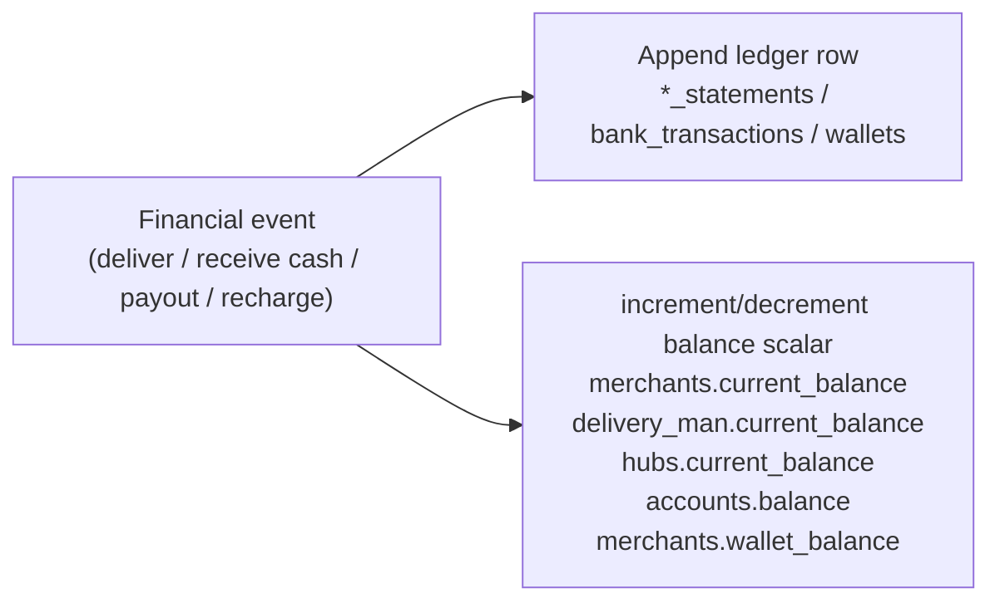
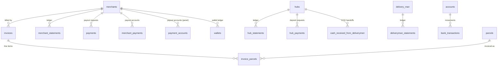
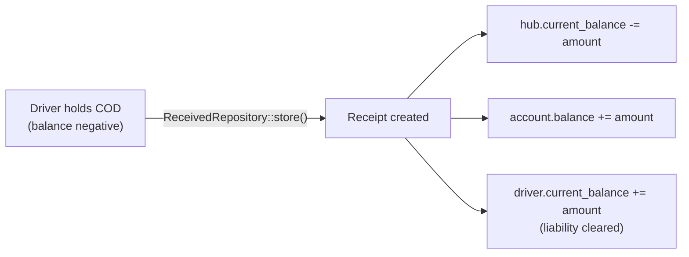
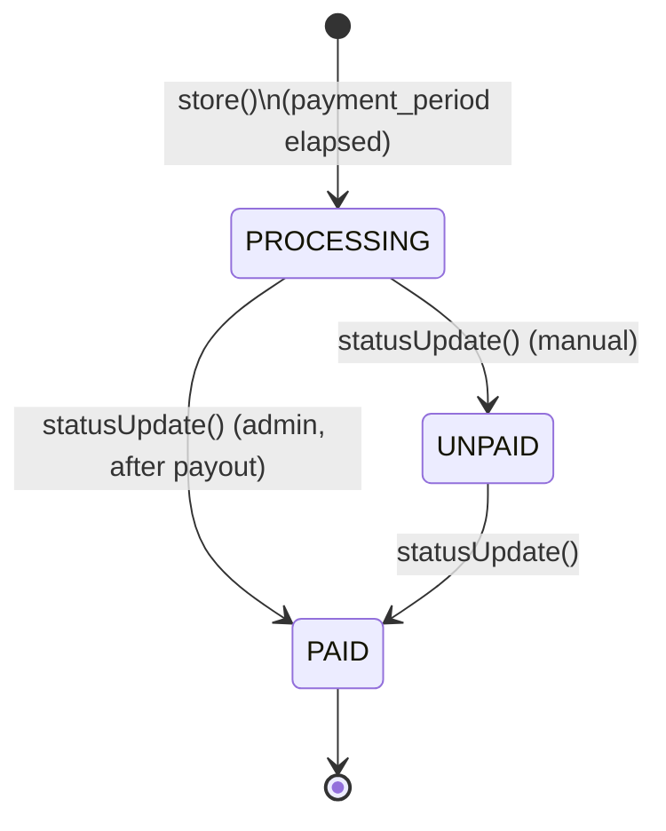
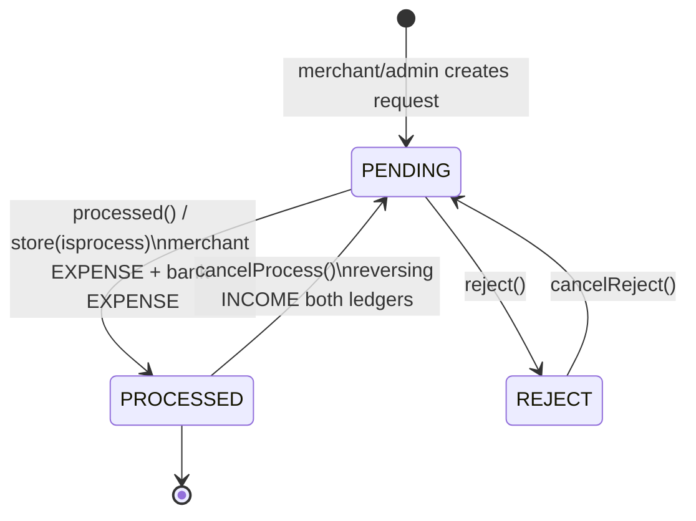
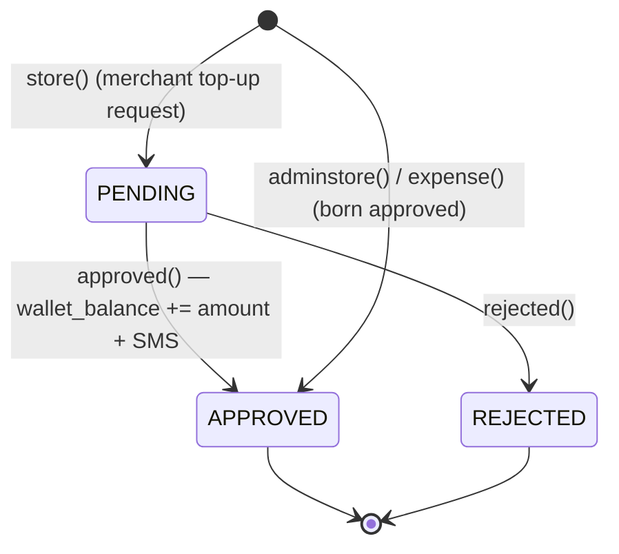

# Finance — Billing, COD, Wallet, Settlement

> **The money model of Rushly.** How COD cash flows from a customer's doorstep, through
> the driver and hub, into the company's bank account, and finally back to the merchant as
> a payout — plus the invoices, statements, wallet top-ups and payment methods that wrap
> that flow.
>
> This doc goes DEEPER on the finance slice than the reference docs. For the surrounding
> context read first:
> [../04-Business-Logic.md](../04-Business-Logic.md) (COD/settlement narrative, §3–§9),
> [../06-Database.md](../06-Database.md) (schema), and
> [../14-Integrations.md](../14-Integrations.md) (accounting sync / payment gateways).
> The canonical accounting treatment lives in the repo-root [../../ACCOUNTING.md](../../ACCOUNTING.md).
>
> **Grounding:** every non-trivial claim below cites a real source file. Where a claim
> could not be verified against code it says so. `README.md` claims "Laravel 12"; the
> truth is `composer.json`'s `laravel/framework ^10.10` — see `_CONTEXT_BRIEF.md`.

---

## 1. Purpose & scope

Rushly is a COD-first (cash-on-delivery) last-mile courier platform. Almost all money in
the system originates as **cash the customer pays the driver at the door**. The finance
module's job is to track that cash accurately as it changes hands across four parties —
**driver → hub → company bank account → merchant** — and to bill the merchant for the
courier's services along the way.

This module covers:

| Area | What it does | Primary code |
|---|---|---|
| **COD settlement** | Splits collected cash into party ledgers on delivery | `app/Repositories/Parcel/ParcelRepository.php` (`parcelDelivered`, `parcelPartialDelivered`) |
| **Hub cash reconciliation** | Driver hands COD to hub cashier; balances clear | `app/Repositories/CashReceivedFromDeliveryman/ReceivedRepository.php` |
| **Merchant invoices** | Periodic billing cut of delivered/returned parcels | `app/Repositories/Invoice/InvoiceRepository.php` |
| **Merchant payouts** | Pays the merchant their net COD balance | `app/Repositories/MerchantManage/Payment/PaymentRepository.php`, `app/Http/Controllers/Backend/PayoutController.php` |
| **Hub payouts** | Hub deposits its held cash to the company | `app/Repositories/HubManage/HubPayment/HubPaymentRepository.php` |
| **Merchant wallet** | Prepaid balance for parcel-creation charges | `app/Repositories/Wallet/WalletRepository.php` |
| **Payment methods** | Merchant bank / mobile-money payout accounts | `app/Models/MerchantPayment.php`, `app/Models/Backend/Merchantpanel/PaymentAccount.php` |
| **Statements** | Per-party append-only ledgers | `MerchantStatement`, `CourierStatement`, `DeliverymanStatement`, `HubStatement`, `VatStatement`, `BankTransaction` |
| **Payout gateways** | Online payout provider config (Stripe/PayPal/…) | `app/Enums/PayoutSetup.php`, `PayoutSetupController` |

**Out of scope here** (cross-linked, not duplicated): parcel status lifecycle & pricing
computation → [parcels.md](parcels.md) and [../04-Business-Logic.md](../04-Business-Logic.md) §1–§4;
external accounting sync (Qoyod/Daftra/Odoo) → [accounting-sync.md](accounting-sync.md);
ZATCA e-invoicing → [zatca-einvoicing.md](zatca-einvoicing.md).

---

## 2. The core design: balance scalars + append-only ledgers

There is **no double-entry accounting engine and no state-machine**. Money is maintained
by application code that does two things on every financial event
(`../04-Business-Logic.md` §0, `ACCOUNTING.md` §1):

1. **Appends a statement row** to the relevant party's ledger table (history).
2. **Mutates a balance scalar** on that party's master row (the "currently owed" figure).



> ⚠️ **Doc vs Code — nothing replays the ledger.** The balance scalars are the source of
> truth for "currently owed"; statement rows are history only. If a scalar drifts (e.g. a
> non-transactional mid-write failure), it must be reconciled by hand
> (`ACCOUNTING.md` §8). Statement rows are never summed to re-derive a balance.

### The five balance scalars

| Scalar | On table | Meaning | Sign convention |
|---|---|---|---|
| `delivery_man.current_balance` | `delivery_man` | Cash the driver is holding / owed commission | +commission, −held COD; goes **negative** while holding uncollected COD |
| `hubs.current_balance` | `hubs` | Amount the hub owes the company | **Inverted** — *decreases* when cash is received (§6) |
| `accounts.balance` | `accounts` | Real bank / cash-drawer balance | +deposits, −payouts |
| `merchants.current_balance` | `merchants` | Net COD the company owes the merchant | +collected, −(charges + payouts) |
| `merchants.wallet_balance` | `merchants` | Prepaid wallet balance | +recharge, −parcel-create debit (§7) |

### Account heads (hardcoded IDs)

`app/Enums/AccountHeads.php` — `INCOME = 1`, `EXPENSE = 2` — is the type flag on every
ledger row. `app/Enums/AccountType.php` — `ADMIN = 1`, `USER = 2` — classifies the
`accounts` table rows. `app/Enums/StatementType.php` — `INCOME = 1`, `EXPENSE = 2` — is a
parallel duplicate used by report aggregation.

> ⚠️ **Gotcha — hardcoded account-head IDs 1–7** underpin all party-balance routing
> (`ACCOUNTING.md` §3); reordering the `AccountHeadSeeder` silently breaks routing. The
> `account_heads` table (`database/migrations/2022_05_14_112714_create_account_heads_table.php`,
> model `app/Models/Backend/AccountHead.php`) seeds these.

---

## 3. Data model (tables)

All finance tables carry `company_id` (FK → `general_settings`) and are query-scoped by
`scopeCompanywise()` (`->where('company_id', settings()->id)`) **on top of** the
stancl/tenancy per-subdomain DB isolation. See [../06-Database.md](../06-Database.md).



| Table | Migration | Purpose | Key columns |
|---|---|---|---|
| `merchant_payments` | `2022_04_13_034848_*` | Merchant payout account details (bank / mobile-money) | `payment_method`, `bank_name`, `holder_name`, `account_no`, `routing_no`, `mobile_company`, `mobile_no`, `account_type`, `status` |
| `payment_accounts` | `2022_04_17_061311_*` | Same shape, merchant-panel-managed variant with a `status` field | (mirrors `merchant_payments`) |
| `accounts` | `2022_04_13_054047_*` | Company bank / cash accounts (the deposit targets) | `type` (`AccountType`), `balance`, `opening_balance`, `account_holder_name`, `account_no`, `gateway`, `bank` |
| `payments` | `2022_04_14_063624_*` | **Merchant payout request** (the `Payment` model) | `amount(16,2)`, `merchant_account`, `transaction_id`, `from_account` (FK accounts), `reference_file`, `created_by`, `status` (`ApprovalStatus`, default PENDING) |
| `hub_payments` | `2022_05_6_063624_*` | **Hub deposit request** | `amount`, `transaction_id`, `from_account`, `created_by`, `status` (`ApprovalStatus`) |
| `invoices` | `2022_10_11_121745_*` | Merchant billing cut | `invoice_id` (unique string), `invoice_date`, `total_charge`, `cash_collection`, `current_payable`, `parcels_id` (longText JSON), `status` (`InvoiceStatus`, **default PROCESSING**) |
| `invoice_parcels` | `2024_09_04_063833_*` | Per-parcel invoice line items | `invoice_id`, `parcel_id`, `parcel_status`, `total_delivery_amount`, `collected_amount`, `return_charge`, `vat_amount`, `cod_amount`, `total_charge_amount`, `current_payable` |
| `wallets` | `2023_10_17_122352_*` | Prepaid-wallet ledger | `source`, `transaction_id`, `amount(22,2)`, `type` (`WalletType`), `payment_method` (`WalletPaymentMethod`), `status` (`WalletStatus`, default PENDING) |
| `merchant_statements` | `2022_05_15_102801_*` | Merchant ledger | `expense_id`, `parcel_id`, `merchant_id`, `type` (income=1/expense=2), `amount`, `date`, `note` |
| `courier_statements` | `2022_05_17_132716_*` | Company/courier ledger | (income/expense against courier) |
| `deliveryman_statements` | `2022_05_14_112717_*` | Driver ledger (commission, held-cash, cash-received) | `type`, `amount`, `cash_collection` flag |
| `hub_statements` | `2022_06_04_104751_*` | Hub ledger | `type`, `amount` |
| `vat_statements` | `2022_05_24_141546_*` | VAT ledger | `amount` |
| `bank_transactions` | `2022_05_26_093710_*` | Movements on `accounts` | `account_id`, `user_type`, `type`, `amount`, `cash_received_dvry` (FK back to the cash receipt) |
| `cash_received_from_deliverymen` | `2022_06_05_140650_*` | Driver→hub COD handoff receipt | `hub_id`, `account_id`, `delivery_man_id`, `amount`, `date`, `receipt` (FK uploads), `note` |
| `merchant_online_payments` / `_receiveds` | `2022_10_30_*`, `2022_11_02_*` | Merchant online-payment gateway setup + receipts | (online payment settlement) |

> ⚠️ **Doc vs Code — dual account-detail tables.** Two near-identical tables hold merchant
> payout accounts: `merchant_payments` (model `app/Models/MerchantPayment.php`, no
> `status` in `$fillable`) and `payment_accounts` (model
> `app/Models/Backend/Merchantpanel/PaymentAccount.php`, which *does* carry `status`). The
> V10 API (`PaymentRequestController::create`/`edit`) reads `MerchantPayment`; the
> merchant-panel account CRUD (`app/Http/Controllers/Backend/MerchantPanel/PaymentAccountController.php`
> and the V10 `PaymentAccountController`) uses `PaymentAccount`. They are not kept in sync
> by any code seen; treat this as historical duplication.

---

## 4. Enums (the finance vocabulary)

| Enum | File | Values |
|---|---|---|
| `InvoiceStatus` | `app/Enums/InvoiceStatus.php` | `UNPAID = 0`, `PROCESSING = 2`, `PAID = 3` (**no value 1**) |
| `ApprovalStatus` | `app/Enums/ApprovalStatus.php` | `REJECT = 1`, `APPROVED = 2`, `PENDING = 3`, `PROCESSED = 4` |
| `PaymentType` | `app/Enums/PaymentType.php` | `STRIPE=1, SSL_COMMERZ=2, PAYPAL=3, PAYONEER=4, BKASH=5, VISA=6, SKRILL=7, AAMARPAY=8, RAZORPAY=9` |
| `PayoutSetup` | `app/Enums/PayoutSetup.php` | `PaymentType` + `PAYSTACK=10`, `OFFLINE=11` |
| `WalletStatus` | `app/Enums/Wallet/WalletStatus.php` | `PENDING=1, APPROVED=2, REJECTED=3` |
| `WalletType` | `app/Enums/Wallet/WalletType.php` | `INCOME=1` (recharge), `EXPENSE=2` (deduction) |
| `WalletPaymentMethod` | `app/Enums/Wallet/WalletPaymentMethod.php` | `OFFLINE=1`, `WALLET=2` (gateway constants commented out — only offline + internal-wallet are live) |
| `PaymentMethod` (merchant panel) | `app/Enums/Merchant_panel/PaymentMethod.php` | `bank`, `mobile`, `cash` (string values) |
| `StatementType` | `app/Enums/StatementType.php` | `INCOME=1, EXPENSE=2` |
| `AccountType` | `app/Enums/AccountType.php` | `ADMIN=1, USER=2` |
| `AccountHeads` | `app/Enums/AccountHeads.php` | `INCOME=1, EXPENSE=2` |

> ⚠️ **Doc vs Code — `ApprovalStatus::APPROVED (2)` is skipped by payout flows.** Merchant
> and hub payouts move `PENDING → PROCESSED` (or `PENDING → REJECT`); `APPROVED` is never
> written by the payout repositories (`../04-Business-Logic.md` §7). It is used elsewhere
> (dashboards, imports).

> ⚠️ **Doc vs Code — `PaymentType`/`PayoutSetup` enumerate gateways that are mostly
> latent.** These list every payment library present in `composer.json` (Stripe, PayPal,
> Razorpay, PayTM, SSLCommerz, Skrill, AamarPay, Paystack). In practice most payouts use
> the **OFFLINE bank-transfer** path recorded via `MerchantPayment` account details; the
> online gateway wiring exists but is not the default. Bank/mobile-money names for the
> account form are hardcoded in `config/merchantpayment.php` (Bangladesh banks + bKash /
> Nagad / Rocket) — a legacy regional artifact.

---

## 5. COD collection & settlement (the heart of the module)

COD is the cash the driver collects from the customer. The **canonical settlement** runs
inside `ParcelRepository::parcelDelivered()` (`app/Repositories/Parcel/ParcelRepository.php`,
line ~2247). Detailed narrative: [../04-Business-Logic.md](../04-Business-Logic.md) §3;
three-layer accounting treatment: `ACCOUNTING.md` §4.4.

On `DELIVERED`, in one method, the following ledger rows + balance mutations happen:

| # | Ledger row | Balance move | Amount |
|---|---|---|---|
| 1 | `DeliverymanStatement` INCOME | `delivery_man.current_balance += charge` | `delivery_man.delivery_charge` (driver commission) |
| 2 | `CourierStatement` EXPENSE | — | same (company pays driver) |
| 3 | `DeliverymanStatement` EXPENSE (`cash_collection = 1`) | `delivery_man.current_balance −= cash` | `parcel.cash_collection` (driver now owes the collected cash) |
| 4 | `MerchantStatement` INCOME | `merchants.current_balance += cash_collection` | `parcel.cash_collection` |
| 5 | `MerchantStatement` EXPENSE ×2 | `merchants.current_balance −= (charge + vat)` | `total_delivery_amount`, then `vat_amount` |
| 6 | `CourierStatement` INCOME | — | `total_delivery_amount` |
| 7 | `VatStatement` INCOME | — | `vat_amount` |

**Net merchant delta per parcel** = `cash_collection − total_delivery_amount − vat_amount`
= what the courier owes the merchant, settled later at payout (§8).

Which driver is credited is resolved from the parcel's last `DELIVERY_RE_SCHEDULE` event,
falling back to `DELIVERY_MAN_ASSIGN` — so a reassigned parcel pays whoever actually
delivered it (`../04-Business-Logic.md` §3).

```mermaid
stateDiagram-v2
    direction LR
    [*] --> DriverHolds : parcelDelivered()\ndriver.current_balance -= cash\nmerchant.current_balance += net
    DriverHolds --> HubHolds : ReceivedRepository::store() (§6)\ncash handed to hub cashier
    HubHolds --> BankDeposited : HubPayment processed (§8.2)\naccounts.balance already credited on receipt
    BankDeposited --> MerchantSettled : invoice cut (§7) + merchant payout (§8.1)
    MerchantSettled --> [*]
```

**Partial delivery** (`parcelPartialDelivered()`, line ~2709) recomputes charges from the
*actually collected* amount and flags `partial_delivered = YES`; settlement then follows
the same pattern on the recomputed figures. Pricing formula: [../04-Business-Logic.md](../04-Business-Logic.md) §4.1.

> ⚠️ **Gotcha — `parcelDelivered()` is NOT transactional.** Unlike `store()` /
> `returnAssignToMerchant()`, the delivered handler runs its ~8 balance writes without
> `DB::beginTransaction`; it is wrapped in a `try/catch` that returns `false` but does
> **not** roll back. A mid-write failure leaves partial balances
> (`../04-Business-Logic.md` §3, `ACCOUNTING.md` §8).

---

## 6. Hub cash reconciliation

When a driver physically hands COD cash to the hub cashier,
`ReceivedRepository::store()`
(`app/Repositories/CashReceivedFromDeliveryman/ReceivedRepository.php`, line 27) writes
**four** things (no `DB::transaction` wrapper — just `try/catch`):

1. **`CashReceivedFromDeliveryman`** row — the receipt (model
   `app/Models/CashReceivedFromDeliveryman.php`), with an optional uploaded `receipt`.
2. **`HubStatement` EXPENSE** + `hub.current_balance += (−amount)` — the hub balance is
   stored **inverted**; it *decreases* when cash is received (reads as "amount the hub
   still owes the company").
3. **`BankTransaction` INCOME** on the chosen `account` + `account.balance += amount`,
   tagged with `cash_received_dvry = receipt.id`.
4. **`DeliverymanStatement` INCOME** + `delivery_man.current_balance += amount` — clears
   the driver's held-cash liability created at delivery (§5 step 3).

`update()` (line 105) does a full **reverse-then-restore** (post mirror-image entries,
then re-apply with new values). `delete()` (line 223) posts only the reversing half and
destroys the row. All three are hub-scoped (`Auth::user()->hub_id`) and tenant-scoped.



**Overdraft guard (API):** `AdminHubCashController::store()`
(`app/Http/Controllers/Api/V10/Admin/AdminHubCashController.php`) rejects a handoff unless
the driver is actually holding at least `amount` in outstanding COD — i.e.
`driver.current_balance < 0` AND `<= -amount`. Only `UserType::HUB`/`INCHARGE` with a
`hub_id` may post, and the driver must belong to that hub. Both the admin mobile app and
the web (`Backend/HubPanel/ReceivedFromDeliverymanController`) delegate to the **same
`ReceivedRepository`**, so both surfaces hit identical plumbing.

---

## 7. Invoices (merchant billing cut)

`InvoiceRepository::store($merchant_id)`
(`app/Repositories/Invoice/InvoiceRepository.php`, line 47) generates a periodic invoice.

**Generation rule:** once a merchant's `payment_period` days have elapsed since the last
invoice (and none was generated today), collect all uninvoiced (`invoice_id = null`)
parcels that are `DELIVERED` **or** `partial_delivered = YES`, plus uninvoiced returns
(`RETURN_RECEIVED_BY_MERCHANT`, `RETURN_ASSIGN_TO_MERCHANT`, `RETURN_TO_COURIER`, or
`return_to_courier = 1` with `partial_delivered = NO`). Then:

```
total_charge    = Σ delivery_charge + Σ vat + Σ return_charges
cash_collection = Σ(delivered cash_collection)
current_payable = Σ(delivered current_payable) − Σ return_charges
```

Each parcel becomes an `InvoiceParcel` line (delivered lines carry charge + VAT; pure
return lines carry a negative `current_payable` of `−return_charges`) and is stamped with
`invoice_id`. Invoice generation is **read-only against balances** — it snapshots figures,
it does **not** move money (`ACCOUNTING.md` §4.9). Money moves only at payout (§8).

New invoices default to `PROCESSING` at the DB layer
(`2022_10_11_121745_create_invoices_table.php` line 26, `->default(InvoiceStatus::PROCESSING)`),
which is why `store()` never sets `status`. Admin flips it via
`InvoiceRepository::statusUpdate()`.



**Generation triggers:** auto per-merchant (`merchant/invoice-generate/{id}` →
`MerchantController::invoiceGenerate`), and manual bulk
(`settings/invoice-generate-menually` → `MerchantInvoiceController::InvoiceGenerateMenually`,
permission `invoice_generate_menually`). Not found in the current codebase: a scheduled
cron that runs invoice generation automatically — generation is triggered by these
admin-facing routes / merchant views. (The doc-level "auto" refers to the
`payment_period`-elapsed guard inside `store()`, not a scheduler.)

> ⚠️ **Doc vs Code — invoice numbering collision risk.** `invoiceId()` (line 167) builds
> `{invoice_prefix}-{merchantId}{globalInvoiceCount+1}` using a **company-wide** invoice
> count (`Invoice::companywise()->count()`), not a per-merchant sequence — concurrent
> generation could theoretically collide despite the `invoice_id` UNIQUE constraint.
> Noted, not fixed.

**Invoice output:** PDF (`MerchantInvoiceController::InvoicePdf`, mpdf) and CSV
(`InvoiceCSV`); model accessors `getInvoiceParcelsExportAttribute`,
`getParcelsGroupByAttribute` on `app/Models/Backend/Merchantpanel/Invoice.php`.

Cross-reference: external accounting mirrors these invoices to Qoyod/Daftra/Odoo — see
`add_qoyod_sync_to_invoices` etc. migrations and [accounting-sync.md](accounting-sync.md).
ZATCA (Saudi) e-invoices are a separate model `ZatcaInvoice` — see
[zatca-einvoicing.md](zatca-einvoicing.md).

---

## 8. Payouts / settlement (approvals)

Payouts are the only place money actually leaves the company to a party. Both merchant and
hub payouts use the `ApprovalStatus` lifecycle and **move money only on `PROCESSED`**.

### 8.1 Merchant payout / payment request

Two entry points, one `Payment` model + `app/Repositories/MerchantManage/Payment/PaymentRepository.php`:

- **Merchant self-service request** — web
  `app/Http/Controllers/Backend/MerchantPanel/PaymentRequestController.php`, API
  `app/Http/Controllers/Api/V10/PaymentRequestController.php`. Both guard the request
  amount against `merchant.current_balance` (API: `store()`/`update()` return 422
  `not_enough_balance`) and allow edit/delete only while `status == PENDING`.
- **Admin payout** — `app/Http/Controllers/Backend/PayoutController.php`
  (`merchantPayout()`, line 80). If `isprocess` is truthy the `Payment` is born `PROCESSED`
  and immediately posts the money; else `PENDING`.
- **Admin approve/reject via API** — `app/Http/Controllers/Api/V10/Admin/AdminPaymentRequestController.php`
  (`/payment-requests/{id}/approve`, `/reject`).

Money moves on `PROCESSED` (`PaymentRepository::store`/`update`/`processed`):
`MerchantStatement` EXPENSE ("payment_withdrawal") → `merchant.current_balance −= amount`,
plus `BankTransaction` EXPENSE → `accounts.balance −= amount`. `cancelProcess()` (line 300)
writes the exact reversal (INCOME both ledgers) and returns the row to `PENDING`.
`reject()` → `REJECT`; `cancelReject()` → back to `PENDING`.



### 8.2 Hub payout / deposit request

Same shape via `app/Repositories/HubManage/HubPayment/HubPaymentRepository.php` and
`app/Http/Controllers/Backend/HubPanel/HubPaymentRequestController.php`: `HubPayment` rows
move `PENDING → PROCESSED` (or `REJECT`), editable/deletable only while `PENDING`. This is
how a hub deposits its accumulated cash to the company bank account.

### 8.3 Payout gateways (`PayoutSetup`)

`PayoutSetupController` / `PayoutSetupRepository` configure the online payout provider per
merchant (web `settings/pay-out/setup`, permissions `payout_setup_settings_read/update`);
`PayoutController` consumes them for online payouts. As noted in §4, most real-world
payouts use the OFFLINE bank-transfer path against a `MerchantPayment` account record.

---

## 9. Merchant wallet

The wallet is a **prepaid balance** merchants top up and that parcel creation can debit.
Logic: `app/Repositories/Wallet/WalletRepository.php`; balance scalar
`merchant.wallet_balance`; ledger table `wallets`.

| Action | Method | Effect |
|---|---|---|
| Merchant top-up request | `store()` | `WalletType::INCOME`, `WalletPaymentMethod::OFFLINE`, `WalletStatus::PENDING` — **no balance change yet** |
| Approve | `approved($id)` | `wallet_balance += amount`, status → `APPROVED`, **SMS to merchant** |
| Reject | `rejected($id)` | status → `REJECTED` (no balance change) |
| Admin direct recharge | `adminstore()` | already-`APPROVED` INCOME + credit balance, in one `DB::transaction`, + SMS |
| Parcel-create debit | `expense()` | `WalletType::EXPENSE`, `WalletPaymentMethod::WALLET`, already-`APPROVED` row for `total_delivery_amount` |
| Delete | `delete()` | reverses `wallet_balance` **only if** the row was `APPROVED` |

The debit fires from `ParcelRepository::store()` **only if**
`merchant.wallet_use_activation == Status::ACTIVE`: `store()` decrements `wallet_balance`
by `total_delivery_amount`; `expense()` records the ledger row.



> ⚠️ **Doc vs Code — no overdraft guard on wallet debit.** `ParcelRepository::store()`
> decrements `wallet_balance` whenever `wallet_use_activation` is active, with no check
> that the balance is sufficient — a wallet can go **negative**. (The merchant/hub payout
> requests DO guard against `current_balance`; the wallet parcel-debit path does not.)
> `../04-Business-Logic.md` §9.

> ⚠️ **Doc vs Code — online wallet top-up is latent.** `WalletPaymentMethod` has the
> `STRIPE/PAYPAL/SKRILL` constants commented out; only `OFFLINE` (manual, admin-approved)
> and internal `WALLET` deduction are live. `WalletRepository::paymentStatus()` exists to
> receive a gateway callback but the online recharge UI path is not wired in the surfaces
> reviewed.

---

## 10. APIs (mobile app surface — V10 / Sanctum)

Consumed by the Flutter apps (`app/Http/Controllers/Api/V10/*`, `laravel/sanctum` auth).
See [../09-API.md](../09-API.md) for the full API doc.

**Merchant app (merchant-scoped, `auth()->user()->merchant`):**

| Method & path | Controller::method | Purpose |
|---|---|---|
| `GET /payment-accounts/index` | `PaymentAccountController::index` | List payout accounts |
| `POST /payment-account/store` | `::store` | Add account |
| `PUT /payment-account/update` | `::update` | Edit account |
| `DELETE /payment-account/delete/{id}` | `::delete` | Remove account |
| `GET /statements/index` | `StatementsController::index` | Merchant ledger (`MerchantStatement`) |
| `POST /statements/filter` | `::filter` | Filter by date / type / tracking id |
| `GET /account-transaction/index` + `/filter` | `AccountTransactionController` | Account transactions |
| `GET /payment-request/index` | `PaymentRequestController::index` | Payout requests |
| `GET /payment-request/create` | `::create` | Balance + accounts for the form |
| `POST /payment-request/store` | `::store` | New request (422 if `amount > current_balance`) |
| `PUT /payment-request/update/{id}` | `::update` | Edit (PENDING only) |
| `DELETE /payment-request/delete/{id}` | `::delete` | Delete (PENDING only) |
| `GET /invoice-list/index` | `InvoiceController::invoiceLists` | Invoice list |
| `GET /invoice-details/{id}` | `InvoiceController::invoiceDetails` | Invoice detail |

**Admin app (`/admin/*`):**

| Method & path | Controller | Purpose |
|---|---|---|
| `GET /admin/payment-requests` | `AdminPaymentRequestController::index` | Pending merchant payouts |
| `POST /admin/payment-requests/{id}/approve` \| `/reject` | `::approve` / `::reject` | Approve or reject payout |
| `GET /admin/hub-cash` | `AdminHubCashController::index` | Recent COD handoffs |
| `GET /admin/hub-cash/drivers` | `::drivers` | Drivers + current balance |
| `GET /admin/hub-cash/accounts` | `::accounts` | Deposit target accounts |
| `POST /admin/hub-cash` | `::store` | Record a driver→hub cash handoff |

**Response shape:** `ApiReturnFormatTrait` (`responseWithSuccess`/`responseWithError`),
serialized by `app/Http/Resources/v10/*` (`StatementsResource`, `PaymentResource`,
`InvoiceResource`, `InvoiceDetailsResource`).

---

## 11. Flutter screens that consume this module

All Flutter apps are clients of rushly-saas (`_CONTEXT_BRIEF.md`). See
[../08-Flutter.md](../08-Flutter.md).

**Merchant app** (`rushly-merchant-app`) — the "Payments hub" is a tabbed screen:

| Screen / file | Backs onto |
|---|---|
| `features/payments/presentation/payments_hub_screen.dart` | Tabs: **Statements · Transactions · Requests · Accounts** (title "Wallet") |
| `features/payments/presentation/payment_request_form_screen.dart` | `payment-request/store` + `/create` |
| `features/payments/presentation/account_form_screen.dart` | `payment-account/store` + `/update` |
| `features/payments/presentation/statements_pdf.dart` | Local PDF of statements |
| `features/payments/data/payments_repository.dart` | Dio calls to all payment/statement/account endpoints (`ApiEndpoints`) |
| `features/invoices/presentation/invoices_screen.dart` | `invoice-list/index` |
| `features/invoices/presentation/invoice_details_screen.dart` | `invoice-details/{id}` |
| `features/invoices/data/invoices_repository.dart` | Dio calls to invoice endpoints |

**Admin app** (`rushly-admin-app`) — `features/hub_cash/`:

| Screen | Backs onto |
|---|---|
| `presentation/hub_cash_screen.dart` | `GET /admin/hub-cash` |
| `presentation/hub_cash_new_screen.dart` | `POST /admin/hub-cash` (+ `/drivers`, `/accounts`) |
| `data/hub_cash_repository.dart` | Dio calls |

**Driver app** (`rushly-driver-app`) — `features/cash/presentation/cash_screen.dart` and
`features/earnings/presentation/earnings_screen.dart` surface the driver's held-COD /
commission balance (`delivery_man.current_balance`), the read-side of §5–§6.

---

## 12. Notifications

| Trigger | Channel | Source |
|---|---|---|
| Wallet recharge approved / admin direct recharge | **SMS** ("you are recharges {currency}{amount} to your {name} wallet") | `WalletRepository::approved()` / `adminstore()` via `app/Http/Services/SmsService.php` |
| Return assigned / received by merchant | SMS + push to merchant | `ParcelRepository::returnAssignToMerchant()` / `returnReceivedByMerchant()` (§ [../04-Business-Logic.md](../04-Business-Logic.md) §6) |

Not found in the current codebase: dedicated notifications on invoice generation or on
merchant/hub payout `PROCESSED` inside the finance repositories reviewed
(`PaymentRepository`, `HubPaymentRepository`, `InvoiceRepository` contain no SMS/push
calls). Push infra is `app/Http/Services/PushNotificationService.php` — see
[../14-Integrations.md](../14-Integrations.md).

---

## 13. Permissions (spatie-style, seeded)

Guarded by the `hasPermission:*` route middleware; seeded in
`database/seeders/PermissionSeeder.php` (+ `RoleSeeder`, `UserSeeder`). See
[../17-Security.md](../17-Security.md) and [../10-Authentication.md](../10-Authentication.md).

| Domain | Permissions |
|---|---|
| Invoices | `invoice_read`, `invoice_status_update`, `invoice_generate`, `invoice_generate_menually` |
| Merchant payout | `payment_request_read/create/update/delete` (merchant panel) |
| Hub payout | `hub_payment_request_read/create/update/delete` |
| Hub cash | `cash_received_from_delivery_man_read/create/update/delete` |
| Wallet | `wallet_request_read/create/delete/approve/reject` |
| Payout setup | `payout_setup_settings_read/update` |

Additionally the API enforces role logic in code: hub-cash `store` requires
`UserType::HUB`/`INCHARGE` + matching `hub_id` (`AdminHubCashController`); merchant
endpoints are scoped to `auth()->user()->merchant`.

---

## 14. Dependencies

- **Parcel module** — settlement is a side effect of `parcelDelivered()`/`parcelPartialDelivered()`
  and pricing comes from parcel charge columns. See [parcels.md](parcels.md).
- **Merchant / Hub / DeliveryMan master rows** — hold the balance scalars mutated here.
- **`accounts` table** — the real bank/cash accounts that back deposits and payouts.
- **`settings()` helper** — resolves the current company (`company_id` = `settings()->id`),
  `currency`, `invoice_prefix`, and is the tenant/company anchor for every `scopeCompanywise`.
- **spatie/laravel-activitylog** — `MerchantPayment` and `CashReceivedFromDeliveryman`
  (and `PaymentAccount`) use `LogsActivity` for audit trails.
- **External accounting sync** — Qoyod / Daftra / Odoo mirror invoices & courier
  statements (`add_*_sync_to_invoices` / `_to_courier_statements` migrations). See
  [accounting-sync.md](accounting-sync.md).
- **Payment libraries** — Stripe / PayPal / Razorpay / SSLCommerz / Skrill / AamarPay /
  Paystack present in `composer.json`; mostly latent (§4). SSLCommerz web callback lives
  at `app/Http/Controllers/Backend/SslCommerzPaymentController.php`.
- **mpdf / maatwebsite-excel** — invoice/statement PDF & CSV export.

---

## 15. Maturity & status

| Sub-area | Maturity | Notes |
|---|---|---|
| COD settlement | **Production, load-bearing** | Core flow; but non-transactional (drift risk) |
| Hub cash reconciliation | **Production** | Web + admin API share one repo; API has an overdraft guard the web path relies on the UI for |
| Invoices | **Production** | Company-wide numbering collision risk; read-only vs balances |
| Merchant/hub payouts | **Production** | Approval lifecycle solid; `APPROVED` state skipped |
| Wallet | **Production (offline only)** | Online recharge latent; no overdraft guard on debit |
| Online payout gateways | **Latent / partial** | Enums + config exist; OFFLINE is the real path |
| Dual account tables | **Tech debt** | `merchant_payments` vs `payment_accounts` duplication |

See [../22-Technical-Debt.md](../22-Technical-Debt.md) for the debt register.

---

## 16. Future improvements

1. **Wrap `parcelDelivered()`, `parcelPartialDelivered()`, and `ReceivedRepository::store()`
   in `DB::transaction`** to eliminate balance drift on mid-write failure (currently only
   `try/catch`). Highest-value correctness fix.
2. **Add an overdraft guard to the wallet debit path** in `ParcelRepository::store()` so
   `wallet_balance` cannot go negative.
3. **Per-merchant invoice sequence** instead of company-wide count in `invoiceId()` to
   remove the theoretical collision.
4. **Consolidate `merchant_payments` and `payment_accounts`** into a single payout-account
   table.
5. **A ledger-replay reconciliation job** that recomputes balance scalars from statement
   rows and flags divergence (today reconciliation is manual — `ACCOUNTING.md` §8).
6. **Finish the online gateway wiring** (or remove the dead enum constants) so
   `PaymentType`/`PayoutSetup`/`WalletPaymentMethod` reflect what actually runs.
7. **Replace the hardcoded Bangladesh bank list** in `config/merchantpayment.php` with a
   tenant-configurable, region-neutral list.
8. **Notifications on payout `PROCESSED` and invoice generation** for merchant visibility.

---

## Sources

Files actually opened for this document:

**Enums**
- `app/Enums/InvoiceStatus.php`, `app/Enums/PaymentType.php`, `app/Enums/PayoutSetup.php`
- `app/Enums/StatementType.php`, `app/Enums/AccountType.php`, `app/Enums/AccountHeads.php`, `app/Enums/ApprovalStatus.php`
- `app/Enums/Wallet/WalletStatus.php`, `WalletType.php`, `WalletPaymentMethod.php`
- `app/Enums/Merchant_panel/PaymentMethod.php`

**Config**
- `config/merchantpayment.php`

**Models**
- `app/Models/MerchantPayment.php`, `app/Models/CashReceivedFromDeliveryman.php`
- `app/Models/Backend/Wallet.php`, `app/Models/Backend/MerchantStatement.php`, `app/Models/Backend/InvoiceParcel.php`
- `app/Models/Backend/Merchantpanel/Invoice.php`, `app/Models/Backend/Merchantpanel/PaymentAccount.php`

**Repositories**
- `app/Repositories/Wallet/WalletRepository.php`
- `app/Repositories/CashReceivedFromDeliveryman/ReceivedRepository.php`
- `app/Repositories/Invoice/InvoiceRepository.php`
- (referenced) `app/Repositories/MerchantManage/Payment/PaymentRepository.php`, `app/Repositories/HubManage/HubPayment/HubPaymentRepository.php`, `app/Repositories/Parcel/ParcelRepository.php`

**Controllers**
- `app/Http/Controllers/Api/V10/StatementsController.php`, `PaymentRequestController.php`, `InvoiceController.php`
- `app/Http/Controllers/Api/V10/Admin/AdminHubCashController.php`
- `app/Http/Controllers/Backend/PayoutController.php` (grep)
- (referenced) `Backend/MerchantPanel/*`, `Backend/HubPanel/*`, `MerchantInvoiceController`, `PayoutSetupController`, `WalletController`

**Migrations**
- `create_merchant_payments_table`, `create_payment_accounts_table`, `create_accounts_table`, `create_payments_table`, `create_hub_payments_table`, `create_invoices_table`, `create_invoice_parcels_table`, `create_wallets_table`, `create_merchant_statements_table`, `create_cash_received_from_deliverymen_table` (all under `database/migrations/`)

**Routes & seeders**
- `routes/api.php`, `routes/web.php`
- `database/seeders/PermissionSeeder.php` (grep)

**Flutter (clients)**
- `rushly-merchant-app/lib/features/payments/*`, `rushly-merchant-app/lib/features/invoices/*`
- `rushly-admin-app/lib/features/hub_cash/*`
- `rushly-driver-app/lib/features/cash/*`, `rushly-driver-app/lib/features/earnings/*`

**Reference docs cross-linked**
- `docs/04-Business-Logic.md` (§3–§10), `docs/06-Database.md`, `docs/09-API.md`, `docs/14-Integrations.md`, `docs/17-Security.md`, `docs/22-Technical-Debt.md`
- `docs/modules/parcels.md`, `docs/modules/accounting-sync.md`, `docs/modules/zatca-einvoicing.md`
- `ACCOUNTING.md` (repo root), `_CONTEXT_BRIEF.md`
