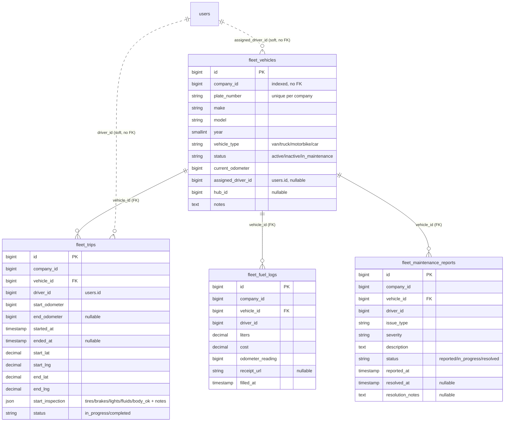
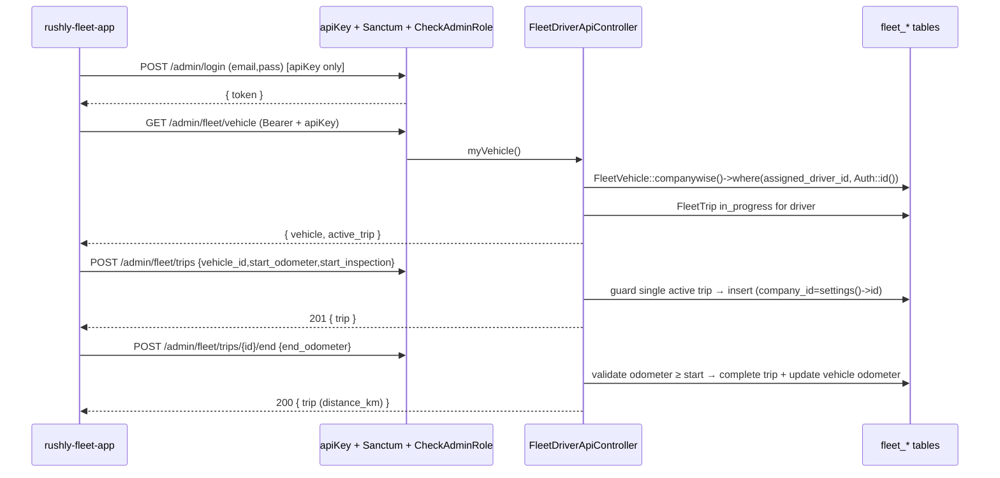

# Fleet — Vehicles, Trips, Fuel, Maintenance

> Module doc for the Rushly **Fleet** slice: company vehicles, driver shift/trip
> logs, fuel fill-ups, and maintenance reporting — plus the `rushly-fleet-app`
> Flutter client that consumes it.
>
> Grounding: `rushly-saas` is the single source of truth; the Flutter app is a
> thin client. Every non-trivial claim below cites a real source file. Where a
> comment/doc disagrees with the code, a **⚠️ Doc vs Code** note calls it out.
> See the shared [../_CONTEXT_BRIEF.md](../_CONTEXT_BRIEF.md).

**Cross-links:** [../06-Database.md](../06-Database.md) ·
[../09-API.md](../09-API.md) · [../10-Authentication.md](../10-Authentication.md) ·
[../11-Modules.md](../11-Modules.md) · [../08-Flutter.md](../08-Flutter.md) ·
[../13-User-Journeys.md](../13-User-Journeys.md) ·
[./parcels.md](./parcels.md) · [./fulfillment.md](./fulfillment.md)

---

## 1. Purpose

The Fleet module is a lightweight **vehicle-operations logbook** for companies
that run their own trucks/vans (long-haul or line-haul), distinct from the
per-parcel last-mile courier flow. It captures, from the driver's phone:

- which **vehicle** is assigned to the driver and its current odometer;
- a **trip** (shift/session) log — start with an odometer reading + a pre-trip
  inspection snapshot, end with a final odometer and optional GPS;
- **fuel** fill-ups, one row per receipt;
- driver-raised **maintenance** issues (severity-graded).

It is deliberately minimal: the whole backend is **one migration, four models,
one API controller, and eight routes**. There is no telematics, no route
optimization, no parcel linkage. Source of that scope statement: the migration
docblock in
`database/migrations/2026_07_17_100000_create_fleet_tables.php`.

⚠️ **Doc vs Code (audience).** `lang/en/mobile_apps.php` labels the fleet
audience *"Long-haul fleet drivers"* and the migration comment says a vehicle is
*"assigned to a driver (`users.id` where `user_type = deliveryman`)."* But the
API is mounted behind `CheckAdminRole` middleware, which **rejects
`DELIVERYMAN`** (see [§8](#8-permissions--auth)). In practice the module today
serves back-office roles (admin / hub / incharge), not last-mile deliverymen.
This is a real inconsistency, not a documentation choice — flagged again below.

---

## 2. Responsibilities

| Concern | Owned here? | Where |
|---|---|---|
| Vehicle master data (plate, make/model, type, odometer, assignment) | ✅ | `fleet_vehicles` table + `FleetVehicle` model |
| Driver shift / trip logging + pre-trip inspection | ✅ | `fleet_trips` + `startTrip`/`endTrip` |
| Fuel fill-up capture | ✅ | `fleet_fuel_logs` + `logFuel`/`fuelLogs` |
| Maintenance issue reporting | ✅ (report only) | `fleet_maintenance_reports` + `reportMaintenance` |
| Vehicle **provisioning UI** (create/edit vehicles, assign drivers) | ❌ Not found | see [§11 Gaps](#11-maturity-status--gaps) |
| Maintenance **resolution** workflow (close a report) | ❌ Not found | columns exist; no endpoint writes them |
| Parcel / delivery assignment | ❌ (out of scope) | see [./parcels.md](./parcels.md) |
| Fuel-cost / distance analytics dashboards | ❌ Not found | only a raw vehicle count is surfaced |

The only backend read of fleet data outside the driver API is an operational
KPI tile: `OperationsController` counts active vehicles
(`app/Http/Controllers/Backend/OperationsController.php:122-125`, surfaced as the
`vehicles` metric at line 170).

---

## 3. Business rules (verified in code)

All rules live in `app/Http/Controllers/Api/V10/Fleet/FleetDriverApiController.php`
unless noted.

- **One active trip per driver.** `startTrip` refuses to open a new trip if the
  caller already has a `status = in_progress` trip, returning **HTTP 409** with
  the existing `trip_id` (lines 86-94).
- **Odometer monotonicity on close.** `endTrip` rejects an `end_odometer` lower
  than the trip's `start_odometer` with **HTTP 422** (lines 129-131).
- **Ending a trip advances the vehicle odometer.** On successful `endTrip`, the
  parent `fleet_vehicles.current_odometer` is set to the trip's end reading
  (lines 142-143). Note this is an unconditional overwrite, not a max() — see
  gaps.
- **Trip can only be ended once.** `endTrip` 409s unless the trip is still
  `in_progress` (lines 126-128).
- **Distance = odometer delta.** `FleetTrip::distanceKm()` returns
  `end_odometer - start_odometer`, or `null` while in progress
  (`app/Models/Backend/Fleet/FleetTrip.php`). GPS lat/lng is stored but **not**
  used to compute distance.
- **End-trip notes are appended, not replaced** — concatenated onto existing
  trip notes with a newline (lines 137-139).
- **Fuel** requires `liters >= 0.01`, `cost >= 0`, `odometer_reading >= 0`;
  `filled_at` defaults to `now()` if omitted (lines 181-198).
- **Maintenance** `issue_type` ∈ `{mechanical, electrical, body, tires, other}`,
  `severity` ∈ `{low, medium, high, critical}`; a new report is created with
  `status = reported` and `reported_at = now()` (lines 235-250).
- **Company scoping.** Every model has a `companywise()` scope filtering on
  `company_id = settings()->id`; every read query applies it, and every write
  stamps `company_id = settings()->id`. `settings()` resolves the current
  company from the tenant / authed user
  (`app/Http/Helper/Helper.php:105-116`). This is the tenant-isolation boundary
  for fleet data — see [../10-Authentication.md](../10-Authentication.md).

---

## 4. Data model

### 4.1 ER diagram



### 4.2 Tables

Source: `database/migrations/2026_07_17_100000_create_fleet_tables.php`.
For the platform-wide schema conventions see [../06-Database.md](../06-Database.md).

**`fleet_vehicles`** — company vehicle master.
- `company_id` (indexed), `plate_number`, `make?`, `model?`, `year?`.
- `vehicle_type` default `van` (van/truck/motorbike/car), `status` default
  `active` (active/inactive/in_maintenance).
- `current_odometer` default 0, `assigned_driver_id?` (`users.id`), `hub_id?`.
- Constraints: composite index `(company_id, status)`; **unique
  `(company_id, plate_number)`** — plates are unique within a company.

**`fleet_trips`** — shift/session log.
- `vehicle_id` → **FK constrained** to `fleet_vehicles`; `driver_id` (`users.id`).
- `start_odometer` (required), `end_odometer?`; `started_at`, `ended_at?`.
- Start/end lat/lng (`decimal(10,7)`), `start_inspection` JSON
  (`{tires_ok, brakes_ok, lights_ok, fluids_ok, body_ok, notes}` per the
  migration comment).
- `status` default `in_progress`; index `(company_id, driver_id, status)`.

**`fleet_fuel_logs`** — one row per fuel receipt.
- `vehicle_id` FK, `driver_id`, `liters decimal(8,2)`, `cost decimal(10,2)`,
  `odometer_reading`, `receipt_url?`, `filled_at`.
- Index `(company_id, vehicle_id, filled_at)`.

**`fleet_maintenance_reports`** — driver-raised issues.
- `vehicle_id` FK, `driver_id`, `issue_type`, `severity`, `description`.
- `status` default `reported`; `reported_at`, `resolved_at?`, `resolution_notes?`.
- Index `(company_id, vehicle_id, status)`.

**Referential-integrity note:** only `vehicle_id` is a real foreign key. `company_id`,
`driver_id`, `assigned_driver_id`, and `hub_id` are plain (mostly indexed)
integers with **no FK constraint** — deleting a user or hub leaves dangling
references. Consistent with the platform's loose-coupling style but worth noting.

---

## 5. Models

Location: `app/Models/Backend/Fleet/` (namespace `App\Models\Backend\Fleet`).

| Model | File | Notable |
|---|---|---|
| `FleetVehicle` | `FleetVehicle.php` | `companywise()` scope only; no relations declared. |
| `FleetTrip` | `FleetTrip.php` | `companywise()`, `vehicle()` belongsTo, `distanceKm()` helper; casts `start_inspection→array`, `started_at`/`ended_at→datetime`. |
| `FleetFuelLog` | `FleetFuelLog.php` | `companywise()`, `vehicle()`; casts `liters`/`cost→decimal:2`, `filled_at→datetime`. |
| `FleetMaintenanceReport` | `FleetMaintenanceReport.php` | `companywise()`, `vehicle()`; casts `reported_at`/`resolved_at→datetime`. |

All four are plain `Illuminate\Database\Eloquent\Model` subclasses with explicit
`$table` and `$fillable`, and an identical `scopeCompanywise` that filters on
`settings()->id`. No soft deletes, no activity-log, no events/observers.

---

## 6. Services

**There is no `app/Fleet/` service module.** Unlike Shipping/OMS/Fulfillment
(see [../11-Modules.md](../11-Modules.md)), Fleet has **no Contracts / DTOs /
Services / Events layer** — all logic lives directly in the API controller. This
is appropriate for the current CRUD-logbook scope but means business rules
(odometer checks, single-active-trip) are not reusable outside HTTP.

> **Not found in the current codebase:** any `FleetService`, DTO, event, listener,
> job, or scheduled command for fleet.

---

## 7. Controllers & API

### 7.1 Controller

`app/Http/Controllers/Api/V10/Fleet/FleetDriverApiController.php` — the single
controller. Uses `ApiReturnFormatTrait` for `responseWithSuccess` /
`responseWithError`. Key private helpers: `serializeVehicle()` and
`serializeTrip()` (the latter injects the computed `distance_km` and the
`vehicle_plate`).

### 7.2 Endpoints

All routes are registered in `routes/api.php:161-168` under the
`v10/admin` prefix (`/api/v10/admin/...`). Middleware stack:
`CheckApiKey` → `auth:sanctum` → `CheckAdminRole` (see [§8](#8-permissions--auth)).

| Method | Path | Controller method | Purpose |
|---|---|---|---|
| GET  | `/api/v10/admin/fleet/vehicle` | `myVehicle` | Caller's assigned vehicle + active trip (`assigned_driver_id = Auth::id()`). Returns `{vehicle:null}` when none. |
| GET  | `/api/v10/admin/fleet/trips?limit=` | `trips` | Caller's trips, newest first, limit 1–100 (default 20). |
| POST | `/api/v10/admin/fleet/trips` | `startTrip` | Open a trip. 409 if one already active. → 201. |
| POST | `/api/v10/admin/fleet/trips/{id}/end` | `endTrip` | Close a trip; advances vehicle odometer. |
| GET  | `/api/v10/admin/fleet/fuel?vehicle_id=` | `fuelLogs` | Fuel logs by vehicle, else by driver; limit 50. |
| POST | `/api/v10/admin/fleet/fuel` | `logFuel` | Record a fill-up. → 201. |
| GET  | `/api/v10/admin/fleet/maintenance?vehicle_id=` | `maintenanceReports` | Reports by vehicle, else by driver; limit 50. |
| POST | `/api/v10/admin/fleet/maintenance` | `reportMaintenance` | File an issue (`status = reported`). → 201. |

Response envelope (from `ApiReturnFormatTrait`) is the standard Rushly admin-API
shape — see [../09-API.md](../09-API.md). Example `myVehicle` payload:

```json
{
  "vehicle": { "id": 1, "plate_number": "…", "vehicle_type": "van",
               "status": "active", "current_odometer": 84210, "hub_id": 3, … },
  "active_trip": { "id": 55, "vehicle_plate": "…", "start_odometer": 84100,
                   "distance_km": null, "status": "in_progress", … }
}
```

### 7.3 Request flow



---

## 8. Permissions & auth

The fleet endpoints inherit the **admin-mobile** security stack (`routes/api.php`
`v10/admin` group):

1. **`CheckApiKey`** — requires header `apiKey` == `config('rxcourier.api_key')`
   (`app/Http/Middleware/CheckApiKeyMiddleware.php`). A shared static app key,
   400 on mismatch.
2. **`auth:sanctum`** — bearer token from `/admin/login`
   (`app/Http/Controllers/Api/V10/Admin/AdminAuthController.php`).
3. **`CheckAdminRole`** — admits only `user_type` ∈ `{ADMIN(1), INCHARGE(4),
   HUB(5), SUPER_ADMIN(6)}`; **rejects `MERCHANT(2)` and `DELIVERYMAN(3)`** with
   403 (`app/Http/Middleware/CheckAdminRoleMiddleware.php`,
   `app/Enums/UserType.php`).

There are **no granular `permission()` checks** inside the fleet controller —
authorization is purely role-gate + `company_id`/`driver_id` row scoping. Data is
isolated per-company by the `companywise()` scope and per-driver by `Auth::id()`.

⚠️ **Doc vs Code (who can actually use Fleet).** The controller docblock says the
API *"works for deliverymen, hub staff, and admins alike,"* and the migration ties
vehicles to `user_type = deliveryman`. But `CheckAdminRole` **blocks
`DELIVERYMAN`**. So a genuine deliveryman-typed fleet driver receives a **403**
on every fleet endpoint. Today the module is usable only by admin/incharge/hub
users. Either the middleware needs to admit deliverymen (or a new fleet role), or
the docs/comments are aspirational. Track as a bug/gap.

---

## 9. Fleet driver vs. last-mile driver

This is the module's defining distinction. See also
[../13-User-Journeys.md](../13-User-Journeys.md) and
[./parcels.md](./parcels.md).

| Dimension | **Last-mile driver** | **Fleet driver** |
|---|---|---|
| App | `rushly-driver-app` (55 dart; features: parcels, cash, earnings, ndr, notifications) | `rushly-fleet-app` (26 dart; features: fleet, auth, dashboard, tenant) |
| Unit of work | Individual **parcels** / stops (pick up, deliver, COD, NDR) | A **vehicle trip / shift** (odometer + inspection) |
| Backend surface | Parcel/NDR/cash/earnings APIs | The 8 `fleet/*` endpoints only |
| Data captured | Delivery status, COD cash, proof-of-delivery, NDR reasons | Odometer, pre-trip inspection, fuel, maintenance |
| Auth role expected | `DELIVERYMAN(2 as merchant? no — 3)` via the **driver** login | Logs in through the **admin** login + `CheckAdminRole` (admin/hub/incharge) — see the ⚠️ above |
| Notifications | Push (assignments, NDR) | None wired (see §10) |
| Money flow | COD collection, hub cash, earnings | None — cost is only *recorded* in fuel logs |

In short: the last-mile driver moves **parcels**; the fleet driver operates a
**vehicle** and logs its usage/health. The two apps share the same Rushly
backend and Sanctum/tenant plumbing but touch entirely different tables — there
is **no join** between `fleet_trips` and any parcel table today.

⚠️ Note the contradiction already flagged: although the app is *named* for fleet
drivers and vehicles are conceptually assigned to `deliveryman` users, the live
role gate admits back-office users, not deliverymen.

---

## 10. Notifications

> **Not found in the current codebase.** No push/SMS/email is dispatched by the
> fleet controller or any fleet listener. A high-severity maintenance report
> (`severity = critical`) triggers **no** alert; grep for `fleet` across
> `app/Http/Services/` (PushNotificationService, SmsService) returns nothing.
> This is a clear improvement opportunity — see below.

For the platform notification services see
[../14-Integrations.md](../14-Integrations.md).

---

## 11. Maturity, status & gaps

**Status: v1 / MVP scaffold.** Migration dated `2026_07_17`, i.e. very recent
relative to the 191-migration baseline. The vertical slice is coherent
(migration → models → API → Flutter tabs) and internally consistent, but shallow.

**Working today:**
- Vehicle lookup, trip start/end with inspection + odometer guards, fuel logging,
  maintenance reporting — all functional and company-scoped.

**Gaps / not-found:**
1. **No vehicle-provisioning UI or API.** Nothing creates or edits
   `fleet_vehicles` or sets `assigned_driver_id`; the only web touchpoint is a
   read-only count in `OperationsController`. Vehicles must be seeded directly in
   the DB. *(Not found: any admin controller/Inertia page for fleet CRUD.)*
2. **No maintenance-resolution path.** `status`, `resolved_at`,
   `resolution_notes` columns exist but no endpoint writes them — reports can be
   filed but never closed via the API.
3. **Odometer overwrite is unconditional.** `endTrip` sets
   `current_odometer = end_odometer` without a `max()` guard; an out-of-order or
   mistaken lower reading on a later trip could roll the vehicle odometer
   backward.
4. **`start_inspection` is unvalidated.** Accepted as a free-form `array`; the
   documented `{tires_ok,…}` shape is not enforced server-side.
5. **Role gate blocks the nominal audience** (deliverymen) — see [§8](#8-permissions--auth).
6. **No notifications, no analytics/reporting, no fuel-efficiency (L/100km)
   derivation**, no telematics/GPS-track ingestion (only start/end points), no
   scheduled/preventive maintenance from odometer thresholds.

### Future improvements (suggested)
- Add a fleet management screen in the admin web (Inertia) for vehicle CRUD +
  driver assignment, mirroring other back-office modules.
- Add `PATCH /fleet/maintenance/{id}` (or admin action) to move reports through
  `reported → in_progress → resolved` and alert on `critical`.
- Introduce an `app/Fleet/` service layer + events (`TripEnded`,
  `MaintenanceReported`) so notifications and analytics can subscribe.
- Compute fuel efficiency and per-vehicle running cost from
  `fleet_fuel_logs` + odometer deltas; feed the Performance module
  (`app/Services/Performance/`).
- Resolve the deliveryman/admin role contradiction — either a dedicated
  `FLEET` role or admit deliverymen for the `fleet/*` subgroup only.
- Guard the vehicle odometer with `max(current, end)`.

---

## 12. Flutter client (`rushly-fleet-app`)

A 26-dart Riverpod + go_router + Dio app; all fleet UI lives under
`lib/features/fleet/`. See [../08-Flutter.md](../08-Flutter.md) and
[../apps](../apps) for the app-family conventions.

### 12.1 Screens / tabs

`lib/features/dashboard/presentation/home_shell.dart` builds a 4-tab
`NavigationBar` (order matters — it maps to the API surface):

| Tab | Widget | Consumes |
|---|---|---|
| **Trips** (route icon) | `presentation/trips_tab.dart` | `myVehicleProvider`, `tripsProvider`; active-trip card + start-trip sheet (odometer + inspection) + end-trip flow |
| **Vehicle** (car icon) | `presentation/vehicle_tab.dart` | `myVehicleProvider` |
| **Fuel** (gas-pump icon) | `presentation/fuel_tab.dart` | `fuelLogsProvider` + log-fuel form |
| **Maintenance** (build icon) | `presentation/maintenance_tab.dart` | `maintenanceProvider` + report form |

Pre-auth screens: `features/tenant/presentation/tenant_select_screen.dart`
(workspace/subdomain pick) and `features/auth/presentation/login_screen.dart`.
The app bar offers **switch workspace** (clears tenant + token) and **logout**.

### 12.2 Data layer

- `lib/features/fleet/data/fleet_repository.dart` — `FleetRepository` wraps the 8
  endpoints; exposes Riverpod `FutureProvider`s: `myVehicleProvider`,
  `tripsProvider` (`limit:50`), `fuelLogsProvider`, `maintenanceProvider`.
- `lib/features/fleet/domain/models.dart` — `FleetVehicle`, `FleetTrip`
  (`isInProgress` getter, `distanceKm`), `FuelLog`, `MaintenanceReport`,
  `VehicleStatus` (vehicle + active trip). Note the client `FleetVehicle` model
  **omits `assigned_driver_id`** even though the API returns it.
- `lib/core/api/api_endpoints.dart` — endpoint constants (`/admin/fleet/...`),
  confirming the app calls the admin-mobile surface. Auth via
  `features/auth/data/auth_repository.dart` (`/admin/login` → bearer token in
  `TokenStorage`).

### 12.3 Client ↔ server contract

The Dart `fromJson` factories match the controller's `serialize*` output
field-for-field (snake_case → camelCase), including the server-computed
`distance_km` and `vehicle_plate`. Writes (`startTrip`, `logFuel`,
`reportMaintenance`) send exactly the fields the controller `validate()`s, so the
contract is tight and 1:1 with §7.2.

---

## Sources

Backend (`/var/www/rushly-saas`):
- `database/migrations/2026_07_17_100000_create_fleet_tables.php`
- `app/Http/Controllers/Api/V10/Fleet/FleetDriverApiController.php`
- `app/Models/Backend/Fleet/{FleetVehicle,FleetTrip,FleetFuelLog,FleetMaintenanceReport}.php`
- `routes/api.php` (lines 145-168, `v10/admin` group)
- `app/Http/Middleware/CheckAdminRoleMiddleware.php`
- `app/Http/Middleware/CheckApiKeyMiddleware.php`
- `app/Enums/UserType.php`
- `app/Http/Helper/Helper.php` (`settings()` helper)
- `app/Http/Controllers/Backend/OperationsController.php` (vehicle count metric)
- `app/Http/Controllers/Backend/MobileAppsController.php` (fleet app card)
- `lang/en/mobile_apps.php` (fleet title/audience/desc)

Flutter (`/var/www/rushly-fleet-app`):
- `lib/features/fleet/data/fleet_repository.dart`
- `lib/features/fleet/domain/models.dart`
- `lib/features/fleet/presentation/{trips_tab,vehicle_tab,fuel_tab,maintenance_tab}.dart`
- `lib/features/dashboard/presentation/home_shell.dart`
- `lib/core/api/api_endpoints.dart`
- `lib/features/auth/data/auth_repository.dart`

Shared context / sibling docs: `docs/_CONTEXT_BRIEF.md`,
`docs/06-Database.md`, `docs/09-API.md`, `docs/10-Authentication.md`,
`docs/11-Modules.md`, `docs/13-User-Journeys.md`, `docs/modules/parcels.md`.
