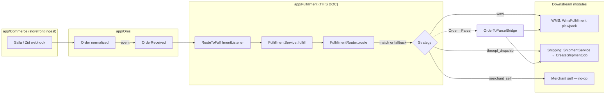

# Fulfillment — Router & Strategies

> **Module:** `app/Fulfillment/` · **Repo-root design doc:** [`../../FULFILLMENT.md`](../../FULFILLMENT.md) · **Phase:** 6 / 6.5 (MVP shipped, downstream roll-forward listeners still TBD)
>
> `rushly-saas` is the **single source of truth**; every Flutter app is a client. This doc goes deeper on the Fulfillment slice than the numbered reference docs — cross-link, don't duplicate: [`../03-Business-Domain.md`](../03-Business-Domain.md) (domain map), [`../12-Workflows.md`](../12-Workflows.md) (end-to-end flows), [`../26-Architecture-Decisions.md`](../26-Architecture-Decisions.md) (ADRs). See [`_CONTEXT_BRIEF.md`](../_CONTEXT_BRIEF.md) first.
>
> Every non-trivial claim cites a real source file. Where the repo-root design doc conflicts with code, a **⚠️ Doc vs Code** note flags it — **code wins**.

---

## 1. Purpose

Given a canonical OMS `Order`, the Fulfillment module decides **how** to get it out the door and dispatches the work. It is a **routing + strategy** layer, not a shipping engine: it does not pick, pack, print AWBs, or call couriers. It picks a *strategy* and hands off to the module that does the physical work — WMS, the Shipping module, a future vendor bridge, or the merchant themselves.

Source of intent (`app/Fulfillment/Contracts/FulfillmentStrategyInterface.php` docblock): *"how do we actually get this order out the door — WMS pick/pack, dropship via 3PL, ship from vendor's warehouse, or hand it to the merchant."*

The module owns three things:
- **The routing decision** — which strategy handles this order (`FulfillmentRouter`).
- **The audit row** — one `fulfillments` row tying the `Order` to whichever downstream did the work, with a status machine (`Fulfillment` model).
- **The cancel / retry entry points** — `FulfillmentService::cancel()` / `::retry()`.

It does **not** own pick-and-pack, courier hand-off, or vendor coordination — those live in the modules the strategies delegate to (`app/Wms/…`, `app/Shipping/…`).

### Where it sits in the pipeline



`app/Providers/EventServiceProvider.php:48-51` wires the trigger: `OrderReceived` → `[LogOrderReceivedListener, RouteToFulfillmentListener]`.

---

## 2. Responsibilities & folder structure

```
app/Fulfillment/
├── Contracts/FulfillmentStrategyInterface.php   # code() / execute() / cancel()
├── Services/
│   ├── FulfillmentService.php                   # orchestrator: fulfill / retry / cancel
│   └── FulfillmentRouter.php                     # pure route-matching + strategy resolution
├── Strategies/
│   ├── MerchantSelfStrategy.php                  # synchronous no-op → completed
│   ├── WmsFulfillmentStrategy.php                # creates WmsFulfillment → in_progress
│   └── ThreePlDropshipStrategy.php               # bridges to Parcel + Shipping → in_progress
├── Bridges/OrderToParcelBridge.php              # Order → legacy Parcel (idempotent)
├── Models/
│   ├── Fulfillment.php                           # per-order audit + status machine
│   ├── FulfillmentRoute.php                      # tenant routing rule (AND'd conditions)
│   └── FulfillmentDefault.php                    # two-tier super-admin fallback config
├── Events/
│   ├── FulfillmentRequested.php                  # fired on row create, before execute()
│   ├── FulfillmentStarted.php                    # strategy → in_progress
│   ├── FulfillmentCompleted.php                  # terminal success
│   └── FulfillmentFailed.php                     # strategy rejected / transient fault (carries reason)
├── Exceptions/
│   ├── FulfillmentException.php                  # base; carries a $payload array
│   └── StrategyRejectedException.php             # non-retryable validation failure
└── Listeners/RouteToFulfillmentListener.php     # OMS OrderReceived → FulfillmentService::fulfill
```

This mirrors the standard scoped-module shape described in [`../11-Modules.md`](../11-Modules.md) (`Contracts/ + Services/ + Strategies/ + Models/ + Events/ + Listeners/`).

---

## 3. Business rules

### 3.1 Routing — first active match by priority
`FulfillmentRouter::route()` (`app/Fulfillment/Services/FulfillmentRouter.php`) loads active routes for the order's `company_id`, orders by `priority` ASC (lower = higher priority), and returns the **first** route whose conditions all match. Conditions are **AND'd** — every non-null condition column on the route must match the order; a null column means "don't filter on this".

Condition columns and the matcher logic (`FulfillmentRouter::matches()`):

| Route column | Compared against Order field | Rule |
|---|---|---|
| `merchant_id` | `order.merchant_id` | integer equality |
| `source_provider_code` | `order.source_provider_code` | exact string (`'salla'`, `'zid'`, …) |
| `shipping_city_id` | `order.shipping_city_id` | integer equality |
| `shipping_country` | `order.shipping_country` | case-insensitive (`strcasecmp`) |
| `min_total` | `order.total` | `total >= min_total` |
| `max_total` | `order.total` | `total <= max_total` |
| `is_cod` | `order.cod_amount > 0` | boolean equality (order is COD iff `cod_amount > 0`) |

> ⚠️ **Doc vs Code.** The repo-root [`../../FULFILLMENT.md`](../../FULFILLMENT.md) §3 lists the route columns as `condition_merchant_id`, `condition_country`, `condition_source_channel`, `condition_min_amount`, plus a `strategy_config (json)` column. **None of those column names exist.** The real schema (`database/migrations/2026_07_01_120002_create_fulfillment_routes_table.php`) uses un-prefixed columns (`merchant_id`, `source_provider_code`, `shipping_city_id`, `shipping_country`, `min_total`, `max_total`, `is_cod`) and there is **no `strategy_config` JSON** — strategy targets are two dedicated columns, `shipping_connection_id` and `hub_id`.

`priority` ties are **not** broken deterministically (`FulfillmentRoute` docblock explicitly warns: *"add explicit priority values in production"*). The router is **pure** — no side effects, no persistence.

### 3.2 Fallback when no route matches
When `route()` returns null, `FulfillmentService::resolveFallbackStrategy($order)` runs a **three-tier precedence** (first non-null wins):

1. **Merchant service mapping** — reads `merchants.services` (JSON) for the order's merchant and maps the first listed service to a strategy via `FulfillmentDefault::strategyForMerchantServices()`. Service→column map: `last_mile → service_last_mile_strategy`, `fulfillment → service_fulfillment_strategy`, `storage → service_storage_strategy` (`FulfillmentDefault::SERVICE_STRATEGY_MAP`). The merchant lookup uses `withoutGlobalScopes()`.
2. **`fulfillment_defaults.default_strategy`** — resolved via `FulfillmentDefault::resolvedFor($companyId)`, which merges the tenant override row on top of the global row (`company_id IS NULL`); non-null tenant fields win.
3. **`config('fulfillment.default_strategy')`** — the legacy env fallback (`FULFILLMENT_DEFAULT_STRATEGY`).

If all three yield nothing → **no Fulfillment row is created**. The service writes an `OrderEvent` of type `fulfillment_no_route` to the order's audit trail, logs `fulfillment.no_route`, and returns `null`. The order sits in the OMS untouched until an operator adds a route or the default is configured (`FulfillmentService::fulfill()`).

> ⚠️ **Doc vs Code.** [`../../FULFILLMENT.md`](../../FULFILLMENT.md) §5 describes only a two-tier fallback (`FulfillmentDefault → config`). The code adds a **first tier**: merchant `services`-JSON mapping. This is driven by `FulfillmentDefaultsController` (super-admin) and the `service_*_strategy` columns, none of which the design doc mentions.

### 3.3 Idempotency
`FulfillmentService::fulfill()` refuses to stack fulfillments: it looks for an existing row on the same `order_id` whose status is **not** in `[failed, cancelled]`. If one exists, it logs `fulfillment.skip_duplicate` and returns the existing row without re-executing. So `pending`, `in_progress`, and `completed` all block re-creation; a `failed` or `cancelled` order can be fulfilled afresh.

Each strategy is **additionally** idempotent on retry (see §5).

### 3.4 Status machine
`Fulfillment` (`app/Fulfillment/Models/Fulfillment.php`) defines five states as class constants:

```
pending ──execute()──► in_progress ──(downstream callback, Phase 7 TBD)──► completed
   │                        │
   └──StrategyRejected──► failed        cancel() ──► cancelled
```

`isTerminal()` = status in `{completed, failed, cancelled}`. `MerchantSelfStrategy` jumps straight `pending → completed`; the WMS and 3PL strategies park at `in_progress` and rely on a **future** listener to roll forward (see §7 maturity).

### 3.5 Multi-tenancy
Every table carries `company_id`. Both `Fulfillment` and `FulfillmentRoute` expose a `scopeCompanywise()` that filters on `settings()->id` (the tenant helper used app-wide — see [`../10-Authentication.md`](../10-Authentication.md) / [`../05-System-Architecture.md`](../05-System-Architecture.md)). `ThreePlDropshipStrategy` hard-blocks **cross-tenant** fulfillment: if the resolved `ShippingConnection.company_id` differs from the order's, it throws `StrategyRejectedException` (*"Cross-tenant fulfillment blocked"*).

---

## 4. Database tables

See the platform-wide schema doc [`../06-Database.md`](../06-Database.md) for cross-table context. The three tables owned by this module:

### `fulfillments` — per-order audit + status machine
`database/migrations/2026_07_01_120001_create_fulfillments_table.php` (+ `2026_07_01_130002_add_parcel_id_to_fulfillments.php`).

| Column | Type | Notes |
|---|---|---|
| `id` | bigint PK | |
| `company_id` | bigint, indexed | tenant |
| `order_id` | FK → `orders`, cascade delete | |
| `strategy` | string(32), indexed | matches `FulfillmentStrategyInterface::code()` |
| `route_id` | bigint nullable | `fulfillment_routes.id`, null if fallback/manual |
| `status` | string(32), default `pending`, indexed | `pending / in_progress / completed / failed / cancelled` |
| `shipping_connection_id` | bigint nullable | set by `threepl_dropship` |
| `wms_fulfillment_id` | bigint nullable | set by `wms` |
| `hub_id` | bigint nullable | chosen warehouse (wms) |
| `parcel_id` | bigint nullable, indexed | denormalized (Phase 6.5); populated by wms/3pl after bridge |
| `external_reference` | string(191) nullable | AWB / WMS fulfillment number / vendor PO# |
| `payload` | json nullable | strategy diagnostics + route snapshot (cast `array`) |
| `last_error` | text nullable | truncated to 65k chars |
| `started_at` / `completed_at` / `failed_at` | timestamps nullable | |
| indexes | | `(company_id,status)`, `(order_id,created_at)`, `parcel_id` |

### `fulfillment_routes` — tenant routing rules
`database/migrations/2026_07_01_120002_create_fulfillment_routes_table.php`.

| Column | Type | Role |
|---|---|---|
| `id`, `company_id` | | tenant scope |
| `name` | string(191) | human label |
| `priority` | uint, default 100 | ASC, lower wins |
| `is_active` | bool, default true | |
| `merchant_id`, `source_provider_code`, `shipping_city_id`, `shipping_country`, `min_total`, `max_total`, `is_cod` | all **nullable** | AND'd conditions (§3.1) |
| `strategy` | string(32) | required target |
| `shipping_connection_id`, `hub_id` | nullable | strategy-specific targets |
| `notes` | text | |
| index | | `(company_id, is_active, priority)` |

### `fulfillment_defaults` — two-tier super-admin fallback
`database/migrations/2026_07_01_150001_create_fulfillment_defaults_table.php`.

| Column | Notes |
|---|---|
| `company_id` | **nullable** — `NULL` = global platform row; non-null = per-tenant override |
| `default_strategy` | last-resort fallback |
| `service_last_mile_strategy` / `service_fulfillment_strategy` / `service_storage_strategy` | merchant service→strategy map |
| `updated_by` | audit |

No `UNIQUE(company_id)` — MySQL treats each NULL as distinct, so uniqueness is enforced in app code via `firstOrCreate` / `updateOrCreate` on `company_id`.

> ⚠️ **Doc vs Code.** [`../../FULFILLMENT.md`](../../FULFILLMENT.md) §3 describes `fulfillment_defaults` as `applies_when (json), strategy, strategy_config (json)`. **Wrong** — the real table has the four `*_strategy` string columns above and no JSON. The design doc predates the service-mapping design.

### Related (downstream, not owned here)
`WmsFulfillmentStrategy` writes into `wms_fulfillments` (`database/migrations/2026_05_23_100005_create_wms_fulfillments_table.php`; columns include `fulfillment_number` UNIQUE, `parcel_id`, `hub_id`, `merchant_id`, `status`, picker/packer, SLA). `OrderToParcelBridge` writes into the legacy `parcels` table, using the `parcels.wms_fulfillment_id` column (`2026_05_23_100012_add_wms_fulfillment_id_to_parcels.php`) and a `parcels.oms_order_id` reverse link.

---

## 5. Services & strategies

### 5.1 `FulfillmentService::fulfill($order)` — the pipeline
(`app/Fulfillment/Services/FulfillmentService.php`)

```mermaid
sequenceDiagram
    participant L as RouteToFulfillmentListener
    participant S as FulfillmentService
    participant R as FulfillmentRouter
    participant DB as fulfillments / order_events
    participant St as Strategy
    L->>S: fulfill(order)
    S->>S: idempotency guard (non-terminal exists?)
    S->>R: route(order)
    alt no route
        S->>S: resolveFallbackStrategy() (merchant svc → defaults → env)
    end
    alt no strategy at all
        S->>DB: OrderEvent 'fulfillment_no_route'; return null
    end
    S->>DB: create Fulfillment(status=pending) + OrderEvent 'fulfillment_requested'
    S->>S: dispatch FulfillmentRequested
    S->>St: strategyByCode(code)->execute(f, order)
    St->>DB: mutate fulfillment (in_progress / completed)
    alt StrategyRejectedException
        S->>DB: status=failed, last_error; dispatch FulfillmentFailed; return
    else other Throwable
        S->>DB: status=failed; dispatch FulfillmentFailed; rethrow
    end
    S->>S: refresh; dispatch FulfillmentCompleted OR FulfillmentStarted
```

Key details:
- Row creation + the `fulfillment_requested` `OrderEvent` happen in a single `DB::transaction`. `payload` captures a `routeSnapshot()` (route id/name/priority/strategy/targets, or `{route:null, reason:'default_strategy fallback'}`).
- The **terminal event is chosen by inspecting the row after `execute()`**: `completed` → `FulfillmentCompleted`; `in_progress` → `FulfillmentStarted`. A strategy that leaves it `pending` fires neither.
- **Two catch arms.** `StrategyRejectedException` → stamp `failed`, fire `FulfillmentFailed`, **swallow** (non-retryable). Any other `\Throwable` → stamp `failed`, fire `FulfillmentFailed`, **rethrow** (so a queue wrapper can retry a transient fault).

### 5.2 `retry($fulfillment)` and `cancel($fulfillment)`
- `retry()` — resets `status=pending`, clears `last_error/failed_at/started_at`, keeps `route_id` and the `payload` audit, re-runs `execute()`. Only the `StrategyRejectedException` arm is handled (transient faults propagate). It does **not** re-route.
  > ⚠️ **Doc vs Code.** [`../../FULFILLMENT.md`](../../FULFILLMENT.md) §7 says retry is *"only allowed on failed fulfillments"*. **The code enforces no such guard** — `retry()` will reset and re-execute a fulfillment in any status. Callers are responsible for only calling it on failed rows.
- `cancel()` — delegates to `strategy->cancel($fulfillment)`. Strategies may refuse (throw `StrategyRejectedException`) when already terminal or past a non-cancellable state.

### 5.3 `FulfillmentRouter::strategyByCode($code)`
Resolves a strategy **instance** from `config('fulfillment.strategies.<code>.class')` via the container (so strategy constructors get their dependencies injected — the 3PL/WMS strategies take `OrderToParcelBridge`, `ShipmentService`). Throws `InvalidArgumentException` for an unknown code or a class that doesn't implement the interface.

### 5.4 The three strategies

| | `MerchantSelfStrategy` | `WmsFulfillmentStrategy` | `ThreePlDropshipStrategy` |
|---|---|---|---|
| `code()` | `merchant_self` | `wms` | `threepl_dropship` |
| Sync/async | synchronous | semi-async (WMS ops out of band) | semi-async (queued CreateShipmentJob) |
| Uses bridge? | no | yes | yes |
| Terminal state on `execute()` | **`completed`** | `in_progress` | `in_progress` |
| Downstream write | none | `WmsFulfillment` row + `parcels.wms_fulfillment_id` | `Parcel` + `ShipmentService::dispatchCreate()` |
| `external_reference` | — | `WmsFulfillment.fulfillment_number` (`WMS-<Ymd>-<hex>`) | `shipment.awb_number` (null until job runs) |
| Idempotent-retry guard | — | short-circuit if `wms_fulfillment_id` set; reuse existing `WmsFulfillment` by `parcel_id` | short-circuit if `parcel_id && external_reference` set; `dispatchCreate` also dedupes |
| `cancel()` refuses when | already terminal | already terminal (best-effort flips WMS row to `cancelled` unless `DISPATCHED`) | already terminal; best-effort `dispatchCancel` (provider may reject post-pickup) |
| Validation failures (`StrategyRejectedException`) | cancel-when-terminal | (via bridge) missing `merchant_id` | missing `shipping_connection_id`; connection not found; cross-tenant; connection not `active` |

`ThreePlDropshipStrategy` delegates to `app/Shipping/Services/ShipmentService.php` — see [`../shipping-architecture.md`](../shipping-architecture.md) / [`../14-Integrations.md`](../14-Integrations.md). `WmsFulfillmentStrategy` feeds the WMS pick/pack workflow — see [`../03-Business-Domain.md`](../03-Business-Domain.md) (WMS section).

### 5.5 `OrderToParcelBridge` — the Order → Parcel jump
(`app/Fulfillment/Bridges/OrderToParcelBridge.php`)

Translates a canonical OMS `Order` into a legacy courier-side `Parcel` (`app/Models/Backend/Parcel.php`). **Idempotent** via `parcels.oms_order_id` — same order always resolves to the same parcel; repeat calls return the existing row.

- **Why it exists:** the rest of the platform (bulk-actions, tracking, timelines, COD flows) is built around `Parcel`, not `Order`. The bridge preserves that surface while OMS/Fulfillment are added non-breakingly (`Phase 6.5 glue between two eras of the data model`). See the "two lifecycles" note in [`../12-Workflows.md`](../12-Workflows.md) §0.
- **Field mapping:** only `merchant_id` is strictly required on `parcels`; the bridge fills what it knows (customer name/phone, assembled address string from shipping lines, city/area, `cod_amount`/`cash_collection`, `reference_number`, provenance `note`) and leaves hub/driver/category null for later assignment. It mints a `tracking_id` via `App\Traits\TrackingTrait::trackingId()` and sets `status = ParcelStatus::PENDING`.
- **Notable quirk:** `oms_order_id` is **not** in the `Parcel` model's `$fillable`, so the bridge sets it directly and calls `save()` a second time (deliberate — avoids touching a widely-used domain model's fillable).
- **Throws** `StrategyRejectedException` (non-retryable) when the order has no `merchant_id` (*"Wire the CommerceConnection to a Rushly merchant first"*).

`MerchantSelfStrategy` skips the bridge entirely — no Parcel is created for merchant-self orders.

---

## 6. Config — `config/fulfillment.php`

```php
'strategies' => [
    'merchant_self'    => ['class' => MerchantSelfStrategy::class,    'label' => 'Merchant self-fulfillment'],
    'wms'              => ['class' => WmsFulfillmentStrategy::class,   'label' => 'Warehouse Management (Rushly WMS)'],
    'threepl_dropship' => ['class' => ThreePlDropshipStrategy::class,  'label' => '3PL dropship (via Shipping module)'],
    // 'vendor_direct' => [ ... ]  — Phase 6.5+ (commented out, not implemented)
],
'default_strategy' => env('FULFILLMENT_DEFAULT_STRATEGY'),   // null = no env fallback
'queue' => [
    'connection' => env('FULFILLMENT_QUEUE_CONNECTION', config('queue.default')),
    'name'       => env('FULFILLMENT_QUEUE_NAME', 'fulfillment'),
],
```

- **Strategy registry** is the single place to register a strategy. Adding one = add a row here + write a class implementing `FulfillmentStrategyInterface`. The `array_keys()` of this registry also drives the `in:` validation rule for the `strategy` field in both the route and defaults controllers, and the strategy dropdowns in the admin UI.
- `default_strategy` is the **legacy env fallback** (tier 3 in §3.2). Docblock note: set to `'merchant_self'` if you want unrouted orders to silently no-op.
- The `queue.*` block is **reserved for Phase 6.5+** — no queued strategy job currently reads it; the whole pipeline runs synchronously today (see §7).

---

## 7. Controllers, web routes & Inertia screens

The Fulfillment module has **no dedicated mobile/Sanctum API** — it is server-side routing driven by events, plus admin/super-admin web UI. All three controllers hard-gate on the `commerce_layer` feature flag: `abort_unless(config('features.commerce_layer'), 404)` (default **off** per [`../_CONTEXT_BRIEF.md`](../_CONTEXT_BRIEF.md) / `config/features.php`).

| Controller | Routes (file) | Inertia page | Permission |
|---|---|---|---|
| `Backend/Fulfillment/FulfillmentController` | `GET /superadmin…/fulfillment/fulfillments` (`routes/superadmin.php:301`) | `Admin/Oms/Fulfillments/Index.jsx` | `integrations_read` |
| `Backend/Fulfillment/FulfillmentRouteController` | routes CRUD (`routes/superadmin.php:294-300`) | `Admin/Oms/FulfillmentRoutes/{Index,Edit}.jsx` | `integrations_read` / `integrations_update` |
| `Backend/Superadmin/FulfillmentDefaultsController` | defaults surface (`routes/superadmin.php:89-96`) | `SuperAdmin/BusinessLogic/FulfillmentDefaults/Index.jsx` | `integrations_read` / `integrations_update` |

- **`FulfillmentController@index`** — read-only viewer of up to 200 fulfillment rows, filterable by `status` / `strategy`, eager-loading `order` + `route`. No mutation actions (no cancel/retry button wired to the UI yet).
- **`FulfillmentRouteController`** — full CRUD (index/create/store/edit/update/destroy). `validateForm()` validates `strategy` against the config registry; the Edit form is fed the strategy list, commerce providers (`CommerceProvider`), and the tenant's `ShippingConnection`s for the `shipping_connection_id` picker.
- **`FulfillmentDefaultsController`** — super-admin two-tier config: `updateGlobal` (the `company_id IS NULL` row) and `storeOverride` / `destroyOverride` (per-tenant). Override candidates come from `GeneralSettings`. A code comment documents a real Inertia gotcha: the destroy URL is passed as a `__ID__` template because nested closures with required params crash Inertia's `resolveArrayableProperties()`.

These are **Inertia.js + React** pages (`resources/js/Pages/**`), consistent with the platform's mid-flight Blade→React migration ([`../_CONTEXT_BRIEF.md`](../_CONTEXT_BRIEF.md); [`../05-System-Architecture.md`](../05-System-Architecture.md)).

---

## 8. Flutter apps that consume it

The Fulfillment module exposes **no API of its own**, so no Flutter app calls it directly. The relationship is indirect and important to state precisely:

- **`rushly-warehouse-app`** has a `fulfillment` feature (`lib/features/fulfillment/…`) — `pick_pack_tab.dart`, `dispatch_tab.dart`, `fulfillment_task_screen.dart`. Its repository (`lib/features/fulfillment/data/fulfillment_repository.dart`) calls the **WMS fulfillment API** (`ApiEndpoints.wmsFulfillmentMyTasks`, `wmsFulfillmentPick(id)`, `wmsFulfillmentPack(id)`, `wmsFulfillmentReadyToDispatch`, `wmsFulfillmentDispatch(id)`), served by `app/Http/Controllers/Api/V10/Wms/WmsFulfillmentApiController.php` (`routes/api.php:318-322`). That is the **downstream WMS pick/pack workflow** that `WmsFulfillmentStrategy` *feeds* by creating `wms_fulfillments` rows — it is **not** the `app/Fulfillment` router.

So the chain is: storefront order → `WmsFulfillmentStrategy` creates a `WmsFulfillment` → warehouse staff pick/pack/dispatch it from the warehouse app. The router decides *that a WMS fulfillment should exist*; the warehouse app drives it to completion. See [`../12-Workflows.md`](../12-Workflows.md) and the WMS API endpoints in [`../09-API.md`](../09-API.md).

Other apps (merchant, driver, sorting, etc. — [`../_CONTEXT_BRIEF.md`](../_CONTEXT_BRIEF.md)) consume the resulting `Parcel` (created by `OrderToParcelBridge`) and `Shipment`, not the `Fulfillment` row.

---

## 9. Events & notifications

### Events emitted
| Event | Fired when | Payload |
|---|---|---|
| `FulfillmentRequested` | row created, before `execute()` | `Fulfillment` |
| `FulfillmentStarted` | strategy left row at `in_progress` | `Fulfillment` |
| `FulfillmentCompleted` | strategy left row at `completed` | `Fulfillment` |
| `FulfillmentFailed` | `StrategyRejectedException` **or** any transient fault | `Fulfillment` + `string $reason` |

Plus two `OrderEvent` audit rows on the OMS order: `fulfillment_requested` (on create) and `fulfillment_no_route` (nothing routed).

### Notifications
**None.** `grep` across `app/Fulfillment/**` finds **no** mail, SMS, push, or `Notification` usage. There are no notifications fired by this module today.

> ⚠️ **Doc vs Code / Maturity.** [`../../FULFILLMENT.md`](../../FULFILLMENT.md) §9 already admits *"None of these events are currently wired to listeners — Phase 6 fulfillment ships with events + no subscribers."* Confirmed against `app/Providers/EventServiceProvider.php`: only `OrderReceived` has fulfillment-related listeners; **`FulfillmentRequested/Started/Completed/Failed` have zero subscribers.** They are emitted into the void, awaiting Phase 7+ consumers (storefront writeback on completion, ops alerting on failure). The design doc's mentions of merchant "we've started" notifications and Commerce `pushOrderUpdate` writeback are **aspirational, not implemented.**

---

## 10. Permissions

- **Web UI** (routes + fulfillments viewer + defaults): guarded by `hasPermission:integrations_read` (view) and `hasPermission:integrations_update` (mutate) middleware, plus the `commerce_layer` feature-flag `abort_unless`. Permission slugs defined in `database/seeders/PermissionSeeder.php:207-208`.
- **Downstream WMS pick/pack** (the warehouse-app path in §8): a separate `wms_fulfillment` permission (`PermissionSeeder.php:437`, under the `wms` module group).
- There is **no** dedicated `fulfillment_*` permission — the routing/config surface deliberately reuses the `integrations_*` permissions. See [`../10-Authentication.md`](../10-Authentication.md) / [`../17-Security.md`](../17-Security.md).

---

## 11. Dependencies

| Depends on | For |
|---|---|
| `app/Oms` (`Order`, `OrderEvent`, `OrderReceived`) | input order + audit trail; trigger event |
| `app/Commerce` | upstream — normalizes storefront webhooks into orders (also `commerce_layer` gated) |
| `app/Shipping` (`ShippingConnection`, `ShipmentService`, `Shipment`) | `threepl_dropship` hand-off |
| `app/Models/Backend/Wms/WmsFulfillment` + `app/Enums/Wms/FulfillmentStatus` | `wms` strategy target |
| `app/Models/Backend/Parcel` + `app/Enums/ParcelStatus` + `App\Traits\TrackingTrait` | bridge target |
| `app/Models/Backend/Merchant` | fallback service-mapping lookup |
| `config/features.php` (`commerce_layer`) | gates the whole UI surface |

**Depended on by:** `app/Providers/EventServiceProvider.php` (listener wiring) and the three admin controllers. Nothing else in `app/` imports `FulfillmentService`/`FulfillmentRouter` (verified by grep) — the module is cleanly isolated behind its listener + controllers.

---

## 12. Maturity / status

| Aspect | Status |
|---|---|
| Router + AND-condition matching | ✅ Implemented, pure, testable |
| 3-tier fallback (merchant svc → defaults → env) | ✅ Implemented |
| `merchant_self` strategy | ✅ Complete (sync → completed) |
| `wms` strategy | 🟡 Creates WMS work + parks `in_progress`; **no roll-forward to `completed`** (Phase 7 listener TBD) |
| `threepl_dropship` strategy | 🟡 Bridges + queues shipment + parks `in_progress`; **no roll-forward** |
| `vendor_direct` strategy | ❌ Commented-out config stub only, not implemented |
| Events | 🟡 Emitted but **zero subscribers** |
| Notifications | ❌ None |
| Retry status guard | ⚠️ Missing (docblock claims failed-only; code doesn't enforce) |
| Async queueing (`config.queue`) | ❌ Reserved; pipeline runs synchronously in the request/webhook path |
| Admin web UI | ✅ Behind `commerce_layer` flag (default off) |
| Mobile API | ❌ None (warehouse app hits WMS API downstream) |

Overall: a **Phase 6 MVP** — routing and dispatch work end-to-end for `merchant_self`; `wms`/`threepl_dropship` correctly *initiate* downstream work but the loop that marks a Fulfillment `completed` is not yet closed. See [`../26-Architecture-Decisions.md`](../26-Architecture-Decisions.md) for the strategy-pattern / bridge decisions.

---

## 13. Future improvements

Grounded in the code's own TODO docblocks and the gaps above:

1. **Close the completion loop** — add Phase 7 listeners on Shipping's `ShipmentCreated`/`ShipmentDelivered` and WMS "dispatched" to roll parked `in_progress` fulfillments to `completed`/`failed` (called out in `WmsFulfillmentStrategy` and `ThreePlDropshipStrategy` docblocks).
2. **Storefront writeback** on `FulfillmentCompleted` via Commerce's `pushOrderUpdate` (the obvious first subscriber — see [`../../COMMERCE.md`](../../COMMERCE.md)).
3. **Ops alerting / retry queue** on `FulfillmentFailed`.
4. **Async execution** — make `RouteToFulfillmentListener` `ShouldQueue` and honor `config('fulfillment.queue')` once strategies do real out-of-band work (listener docblock).
5. **`vendor_direct` strategy** — ship-from-vendor path (config stub reserved).
6. **Split fulfillment** — one Order → multiple Fulfillments over item subsets (`Fulfillment` + `fulfillments` migration docblocks).
7. **Enforce the retry status guard** and deterministic `priority` tie-breaking (`FulfillmentRoute` docblock).
8. **Retire the bridge** long-term if `Order` absorbs `Parcel`'s role (`OrderToParcelBridge` docblock).

---

## Sources

Files and directories opened for this doc:

- `app/Fulfillment/Contracts/FulfillmentStrategyInterface.php`
- `app/Fulfillment/Services/FulfillmentService.php`, `.../FulfillmentRouter.php`
- `app/Fulfillment/Strategies/{MerchantSelfStrategy,WmsFulfillmentStrategy,ThreePlDropshipStrategy}.php`
- `app/Fulfillment/Bridges/OrderToParcelBridge.php`
- `app/Fulfillment/Models/{Fulfillment,FulfillmentRoute,FulfillmentDefault}.php`
- `app/Fulfillment/Events/{FulfillmentRequested,FulfillmentStarted,FulfillmentCompleted,FulfillmentFailed}.php`
- `app/Fulfillment/Exceptions/{FulfillmentException,StrategyRejectedException}.php`
- `app/Fulfillment/Listeners/RouteToFulfillmentListener.php`
- `config/fulfillment.php`, `config/features.php` (feature flag)
- `database/migrations/2026_07_01_120001_create_fulfillments_table.php`, `…120002_create_fulfillment_routes_table.php`, `…130002_add_parcel_id_to_fulfillments.php`, `…150001_create_fulfillment_defaults_table.php`, `2026_05_23_100005_create_wms_fulfillments_table.php`, `…100012_add_wms_fulfillment_id_to_parcels.php`
- `app/Providers/EventServiceProvider.php`
- `app/Http/Controllers/Backend/Fulfillment/{FulfillmentController,FulfillmentRouteController}.php`, `app/Http/Controllers/Backend/Superadmin/FulfillmentDefaultsController.php`
- `routes/superadmin.php`, `routes/api.php`, `routes/web.php`
- `resources/js/Pages/Admin/Oms/{Fulfillments/Index,FulfillmentRoutes/Index,FulfillmentRoutes/Edit}.jsx`, `resources/js/Pages/SuperAdmin/BusinessLogic/FulfillmentDefaults/Index.jsx`
- `database/seeders/PermissionSeeder.php`
- `rushly-warehouse-app/lib/features/fulfillment/data/fulfillment_repository.dart`
- Repo-root design doc `FULFILLMENT.md` (verified against code; conflicts flagged)
- Cross-linked: `docs/03-Business-Domain.md`, `docs/12-Workflows.md`, `docs/26-Architecture-Decisions.md`, `docs/_CONTEXT_BRIEF.md`
