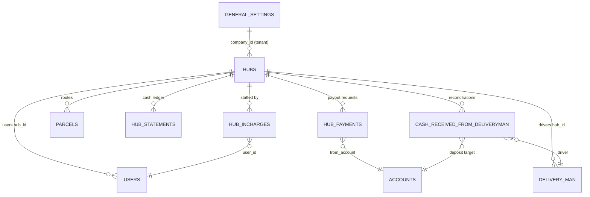
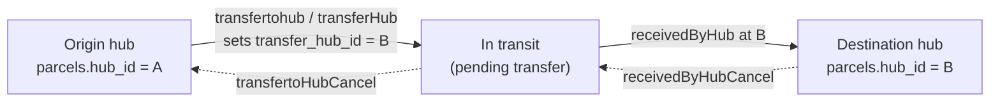
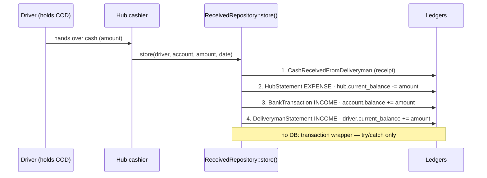
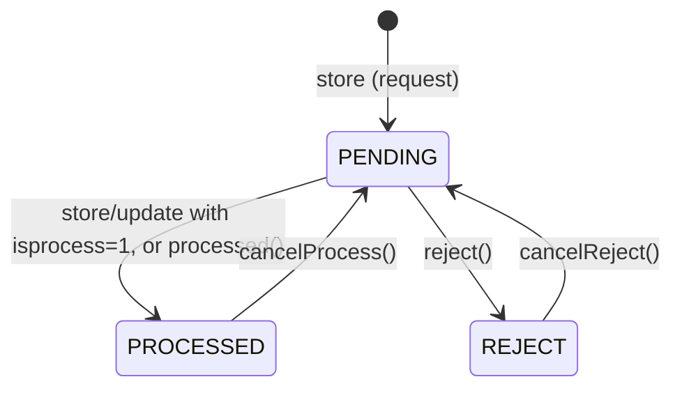

# Hubs — Network & Hub Cash

> Module slice: the **hub** (branch / delivery station) entity, the parcel routing that
> moves shipments between hubs, the **hub cash reconciliation** ledger that settles COD
> cash handed from drivers to hub cashiers, the **hub payout** approval flow, and the
> **hub performance** analytics roll-up.
>
> Source of truth: `rushly-saas` (Laravel 10). The Flutter `rushly-admin-app` is a
> **client** that consumes the `/api/v10/admin/hub*` endpoints. Every non-trivial claim
> below cites a real file. Where a claim could not be verified it says
> **"Not found in the current codebase."**

**Cross-links:** [../04-Business-Logic.md](../04-Business-Logic.md) (§7.2 Hub payout, §8 Hub
cash reconciliation, §3 COD) · [../13-User-Journeys.md](../13-User-Journeys.md) (§10 Admin /
hub / incharge journey) · [../06-Database.md](../06-Database.md) ·
[../09-API.md](../09-API.md) · [../11-Modules.md](../11-Modules.md) ·
[../20-Performance.md](../20-Performance.md) · [./parcels.md](./parcels.md) ·
[./finance-billing-wallet.md](./finance-billing-wallet.md).

---

## 1. Purpose

A **Hub** is a physical delivery station / branch in a courier tenant's network (also called
a "branch" in the performance code, `app/Services/Performance/HubPerformanceService.php`
comment line 17). Hubs are the anchor for:

- **Routing** — a parcel carries a `hub_id`; parcels are transferred hub-to-hub and
  "received" at a hub as they move through the network (`Parcel::hub_id`, methods in
  `app/Http/Controllers/Backend/ParcelController.php`).
- **Cash custody** — drivers assigned to a hub collect COD; the hub cashier reconciles that
  cash back into a company bank/cash account (`app/Repositories/CashReceivedFromDeliveryman/ReceivedRepository.php`).
- **Staffing** — hub in-charges (`hub_incharges`) and hub users (`users.hub_id`) are the
  people who operate the station.
- **Payouts** — a hub can request a cash withdrawal/settlement from head office
  (`hub_payments`, `HubPaymentController`).
- **Analytics** — revenue / expense / success-rate / SLA per hub
  (`HubPerformanceService`).

The hub itself is a deliberately **thin** entity (name, phone, address, geo-coordinates,
running cash balance, status). All the "weight" lives in the ledgers and the parcel
routing that reference it.

---

## 2. Responsibilities

| Responsibility | Owned by | Notes |
|---|---|---|
| Hub CRUD (web/Inertia) | `HubController` + `HubRepository` | tenant-scoped by `company_id` |
| Hub read-only (mobile) | `Api/V10/Admin/AdminHubController` + `Api/V10/HubController` | Sanctum + role gated |
| Hub in-charge assignment | `HubInChargeController` + `HubInChargeRepository` | `hub_incharges` M:N of user↔hub |
| Parcel routing between hubs | `ParcelController` (`transfertohub`, `receivedByHub`, `transferHub`) | mutates `parcels.hub_id` |
| Driver→hub COD reconciliation | `ReceivedFromDeliverymanController` (web) + `AdminHubCashController` (mobile) → `ReceivedRepository` | 4-ledger posting |
| Hub payout / withdrawal | `HubPaymentController` (admin) + `HubPaymentRequestController` (hub panel) → `HubPaymentRepository` | `PENDING→PROCESSED/REJECT` |
| Hub performance KPIs | `HubPerformanceService` (via `PerformanceDashboardController`) | read-only aggregation |
| Hub cash export | `app/Exports/HubReports.php`, `app/Exports/Performance/HubsSheet.php` | XLSX |

---

## 3. Domain model & the four ledgers it touches

The `company_id` on every hub-related table points at `general_settings` — this is the
**tenant / operating-company** scope (see the `companywise()` scopes and
[../06-Database.md](../06-Database.md)). All reads are filtered by `settings()->id`.

---

## 4. Database tables

### 4.1 `hubs` — `database/migrations/2014_09_12_000000_create_hubs_table.php`

| Column | Type | Notes |
|---|---|---|
| `id` | bigint PK | |
| `company_id` | FK → `general_settings` | tenant scope; `onDelete cascade` |
| `name` | string nullable | |
| `phone` | string nullable | |
| `address` | string nullable | |
| `hub_lat` | string nullable | latitude (note: stored as **string**) |
| `hub_long` | string nullable | longitude |
| `current_balance` | decimal(16,2) nullable | **running cash balance, stored inverted** (see §6) |
| `status` | tinyint, default `Status::ACTIVE(1)` | `1=Active, 0=Inactive` (`app/Enums/Status.php`) |
| `timestamps` | | |

Model: `app/Models/Backend/Hub.php`. `$fillable = ['name','phone','address']` only — the
other columns (`company_id`, `hub_lat`, `hub_long`, `status`, `current_balance`) are set by
**direct property assignment** in the repository, not mass assignment. Traits:
`LogsActivity` (spatie) logging `name/phone/address` under log-name `Hub`. Relations:
`parcels()` hasMany, scope `companywise()` = `where('company_id', settings()->id)`.

> **⚠️ Doc vs Code — `lat`/`long` vs `hub_lat`/`hub_long`.** The table columns are
> `hub_lat` / `hub_long`, and `HubRepository::store/update` write to those. But
> `HubController::edit()` returns `'lat' => $hub->lat` / `'long' => $hub->long`
> (`app/Http/Controllers/Backend/HubController.php` lines 158–159) — attributes that **do
> not exist** on the model, so the edit form always receives `null` coordinates. The
> `view()` method hedges with `$hub->hub_long ?? $hub->lat` (line 286). Net effect: hub
> coordinates cannot round-trip through the edit screen. Confirm before relying on hub
> geo-data.

### 4.2 `hub_incharges` — `2022_04_04_142330_create_hub_incharges_table.php`

Junction of user↔hub: `id`, `user_id`, `hub_id`, `status` (default ACTIVE), timestamps.
Model `app/Models/Backend/HubInCharge.php` — `belongsTo(User)`, `belongsTo(Hub)`, scope
`active()`. **Note:** this table has **no `company_id`**; tenant scoping is done by joining
through `users` (see `HubPerformanceService` employee count, lines 64–72).

### 4.3 `hub_payments` — `2022_05_6_063624_create_hub_payments_table.php`

Hub payout / withdrawal request. Columns: `id`, `company_id`, `hub_id` (FK `hubs`),
`amount` decimal(16,2), `transaction_id`, `from_account` (FK `accounts`), `reference_file`
(FK `uploads`), `description` longtext, `created_by` (`1=admin, 4=incharge` per
`UserType`), `status` (default `ApprovalStatus::PENDING(3)`; values `1=Reject, 2=Approved,
3=Pending, 4=Processed`). Model `app/Models/Backend/HubPayment.php`: `belongsTo` Hub,
`Account` (`fromPayment`/`frompayment`), `Upload` (`referenceFile`/`referencefile`), `User`
(`createdBy`).

### 4.4 `hub_statements` — `2022_06_04_104751_create_hub_statements_table.php`

Per-hub cash ledger line. Columns: `id`, `company_id`, `user_id`, `hub_id`, `account_id`,
`delivery_man_id`, `type` (`income=1, expense=2` — matches `AccountHeads::INCOME=1 /
EXPENSE=2`, `app/Enums/AccountHeads.php`), `amount` decimal(16,2), `date`, `note`. Model
`app/Models/Backend/HubStatement.php` is minimal (only a `companywise()` scope; no
`$fillable`, relies on property assignment).

### 4.5 `cash_received_from_deliveryman` (the reconciliation receipt)

Model `app/Models/CashReceivedFromDeliveryman.php` (top-level, not under `Backend`). Written
by `ReceivedRepository::store()`. Fields used: `company_id`, `user_id` (cashier), `hub_id`,
`account_id`, `delivery_man_id`, `amount`, `date`, `receipt` (upload id), `note`. See
[../06-Database.md](../06-Database.md) for the full schema; the reconciliation semantics are
in §6 below.

---

## 5. Hub network & parcel routing

A parcel's location in the network is a single column, `parcels.hub_id`. Movement between
hubs is a set of `ParcelController` actions (all under
`app/Http/Controllers/Backend/ParcelController.php`, web routes in
`routes/web.php` ~lines 591–630, permission `parcel_status_update`):

| Action | Route name | What it does |
|---|---|---|
| `transfertohub` | `parcel.transfer-to-hub` | flags a parcel for transfer to a target `hub_id` (requires `hub_id`) |
| `transferToHubMultipleParcel` | `parcel.transfer-to-hub-multiple-parcel` | bulk transfer |
| `transfertohubSelectedHub` | `transertohub.selected.hub` | transfer for parcels already at a hub |
| `transferHub` | `parcel.transferHub` | picks a destination hub excluding the current one (`whereNotIn('id',[hub_id])`, line 1963) and writes `transfer_hub_id` |
| `transfertoHubCancel` | `parcel.transfer-to-hub-cancel` | cancels a pending transfer |
| `receivedByHub` | `parcel.received-by.hub` | marks a parcel as received at the destination hub |
| `receivedByHubCancel` | `parcel.received-by-hub-cancel` | reverses a receive |
| `parcelReceivedByMultipleHub` | `parcel.received-by-mulbiple-hub` | bulk receive |
| `getHub` / `parcel.hub.get` | `parcel.hub.get` | AJAX hub lookup for the transfer UI |

> This module documents the **hub side** of routing (the entity being routed between). The
> parcel status machine that these transfers ride on (statuses, `ParcelEvent` timeline,
> cancellation invariant) is owned by [./parcels.md](./parcels.md) and
> [../04-Business-Logic.md §1](../04-Business-Logic.md). Sorting-center handover to hubs is
> in `Api/V10/Admin/AdminSortingController` (`/sorting/hubs`, `/sorting/handover`).

There is **no dynamic routing engine / graph optimizer** in the codebase — routing is
manual, operator-driven hub-to-hub transfer. "Network" here means the set of hubs plus the
transfer operations, not an algorithmic shortest-path system. *(Not found in the current
codebase: automatic hub selection / route optimization.)*

---

## 6. Hub cash reconciliation (the core business logic)

When a driver returns COD cash to the hub cashier, `ReceivedRepository::store()`
(`app/Repositories/CashReceivedFromDeliveryman/ReceivedRepository.php` line 27) posts
**four coordinated writes**. Deeper than [../04-Business-Logic.md §8](../04-Business-Logic.md),
here is exactly what each write does:

1. **Receipt** — a `CashReceivedFromDeliveryman` row (company/user/hub/account/driver/
   amount/date/receipt/note). This is the auditable document.
2. **Hub ledger** — a `HubStatement` of type `EXPENSE` **and** `hub.current_balance +=
   (−amount)` (line 59). The hub balance is stored **inverted**: receiving cash *decreases*
   it. It reads as "cash the hub still owes upstream / holds against the company." Easy to
   misread — see the `ACCOUNTING.md §8` flag referenced by doc 04.
3. **Bank/cash account** — a `BankTransaction` of type `INCOME` on the chosen `account`,
   plus `account.balance += amount` (lines 64–77), tagged
   `cash_received_dvry = receipt.id` so the deposit is traceable back to the receipt.
4. **Driver ledger** — a `DeliverymanStatement` of type `INCOME` **and**
   `delivery_man.current_balance += amount` (lines 82–94). The driver's held-cash
   liability (a negative balance created at delivery, [../04-Business-Logic.md §3](../04-Business-Logic.md))
   is cleared toward zero.

### Guardrails
- **Hub-scoped:** only a user with a `hub_id` can post (`Auth::user()->hub_id`, line 29;
  mobile: `UserType::HUB(5)` or `INCHARGE(4)` with a `hub_id`, `AdminHubCashController::store`
  lines 94–96).
- **Sufficient-balance check:** the driver must actually be holding ≥ `amount` of
  uncollected COD. Web: `ReceivedFromDeliverymanController::store` lines 49–52
  (`current_balance > -amount || == 0` → reject). Mobile mirrors it:
  `AdminHubCashController::store` lines 116–120
  (`current_balance >= 0 || current_balance > -amount` → 422 `not_enough_balance`).
- **Wrong-hub check (mobile):** driver's `hub_id` must equal the caller's (lines 112–115).
- **Tenant-scoped:** `company_id == settings()->id` on every write and on delete (line 230).

### `update()` and `delete()` — reverse-then-restore
`update()` (line 105) posts the **mirror-image** entries (INCOME↔EXPENSE, sign flipped) to
fully undo the original receipt across all four ledgers, then re-posts fresh entries with
the new values. `delete()` (line 223) posts only the reversing half and destroys the
receipt row. Both are hub- and tenant-scoped.

> **⚠️ Integrity risk (worth flagging).** None of `store/update/delete` wraps the four
> writes in a `DB::transaction`; they use a bare `try/catch` that returns `false` on
> failure (`ReceivedRepository` lines 28/100). A partial failure mid-sequence can leave the
> hub balance, account balance, and driver balance out of sync with the receipt. Contrast
> `HubPaymentRepository`, which **does** use `DB::beginTransaction()/commit()/rollBack()`.
> This is a real technical-debt item; see [../22-Technical-Debt.md](../22-Technical-Debt.md).

---

## 7. Hub payout / withdrawal flow (`hub_payments`)

Two entry points, one repository (`app/Repositories/HubManage/HubPayment/HubPaymentRepository.php`):

- **Hub panel (self-service request):** `HubPaymentRequestController` — a hub in-charge
  creates a `HubPayment` in `PENDING` status; editable/deletable **only while PENDING**
  (`HubPaymentRequestController` lines 48, 65). Routes `hub-panel.payment-request.*`,
  permissions `hub_payment_request_{read,create,update,delete}`.
- **Admin (approve & settle):** `HubPaymentController` — lists all requests, and drives the
  state machine. Routes `hub.hub-payment.*` + `hub-payment.{reject,process,cancel-*,processed}`.

**Money movement on process** (`HubPaymentRepository::processed`, lines 209–248): posts a
`BankTransaction` `EXPENSE` on `from_account` and `account.balance -= amount` (the company
pays the hub out of a courier bank/cash account). `cancelProcess` (line 250) posts the
INCOME reversal and restores the balance. `store/update` with `isprocess` do the same debit
inline (lines 50–66, 102–119). A pre-check in the controller blocks processing when the
source account has insufficient balance (`HubPaymentController::processed` lines 245–249,
`not_enough_courier_balance`). All payout writes are wrapped in `DB::beginTransaction()`.

See [../04-Business-Logic.md §7.2](../04-Business-Logic.md) for the approval framing.

---

## 8. Services

### `app/Services/Performance/HubPerformanceService.php`
Read-only aggregation over `parcels` grouped by `hub_id`, consumed by
`PerformanceDashboardController` (which composes driver/customer/hub/company services into
one payload for the `Admin/Performance/Index` Inertia page, plus JSON-refresh, XLSX and PDF
exports). Definitions (from the service's own header comment, lines 17–27):

| Metric | Formula |
|---|---|
| Revenue / hub | `SUM(parcels.cash_collection)` for `DELIVERED` at the hub |
| Expenses / hub | `SUM(parcels.delivery_charge)` for `DELIVERED` at the hub |
| Profit | revenue − expense |
| Orders | `COUNT(parcels)` in the window at the hub |
| Success rate | delivered / total |
| Avg processing time | `AVG(TIMESTAMPDIFF(HOUR, created_at, delivery_date))` for delivered |
| Employees | `users.hub_id` count + `hub_incharges` (joined to users for tenancy) |
| Vehicles | `assets` with a `hub_id` |
| SLA compliance | `1 − open abnormal_shipments / total parcels in window` (proxy) |
| Satisfaction | `1 − support_tickets / orders` (cohort-level proxy) |

`payload()` returns `kpi` (roll-up across hubs), `ranking` (per-hub, top-N ordered by
revenue, each scored via `PerformanceScoreCalculator` into a band), and `trend` (monthly
revenue/orders/profit). SLA/satisfaction are explicitly labelled **proxies** in the output
(`proxies` key). See [../20-Performance.md](../20-Performance.md) for the analytics module.

### Repositories (service-layer stand-ins)
`HubRepository` (CRUD + `parcelFilter` for the hub detail view),
`HubInChargeRepository`, `HubPaymentRepository` (payout state machine),
`ReceivedRepository` (cash reconciliation), `HubPaymentRequestRepository`. All resolved via
interfaces (`App\Repositories\...\*Interface`) bound in the container.

---

## 9. Controllers

| Controller | Surface | Key methods |
|---|---|---|
| `Backend/HubController` | Inertia web | `index/filter/create/store/edit/update/destroy/quickStore/view` |
| `Backend/HubInChargeController` | Inertia/Blade web | in-charge assignment CRUD + `assigned` |
| `Backend/HubPaymentController` | Inertia/Blade web | payout list + `reject/process/processed/cancel*` |
| `Backend/HubPanel/HubPaymentRequestController` | Blade (hub panel) | hub self-service payout request |
| `Backend/HubPanel/ReceivedFromDeliverymanController` | Blade (hub panel) | cash reconciliation web UI |
| `Api/V10/HubController` | mobile (generic) | `index` → `HubResource` list |
| `Api/V10/Admin/AdminHubController` | admin mobile | `index` (search/paginate), `show` (+ driver/parcel totals) |
| `Api/V10/Admin/AdminHubCashController` | admin mobile | `drivers/accounts/index/store` (reconciliation) |
| `Backend/PerformanceDashboardController` | Inertia web | composes `HubPerformanceService` |
| `Backend/SettingsHubController` | Inertia web | **unrelated** — the settings landing page, not the hub entity |

`HubController::index/filter/view` render Inertia pages (`Admin/Hub/Index`, `Admin/Hub/Create`,
`Admin/Hub/View`) and hand permission flags + translated strings to React. `view()` computes
a per-hub COD breakdown (delivered / partial / in-transit cash, delivery charges, VAT, status
histogram) from the hub's parcels.

---

## 10. APIs

### Admin mobile (`routes/api.php`, prefix `v10/admin`)
Guarded by `CheckApiKey` + `auth:sanctum` + `CheckAdminRole` — open to `ADMIN`,
`SUPER_ADMIN`, `INCHARGE`, `HUB` user types; merchants/deliverymen are rejected even with a
valid token (route file comment lines 147–149).

| Method | Path | Controller | Purpose |
|---|---|---|---|
| GET | `/v10/admin/hubs` | `AdminHubController@index` | search (`q`) + paginate |
| GET | `/v10/admin/hubs/{id}` | `AdminHubController@show` | hub + `{drivers, parcels}` totals |
| GET | `/v10/admin/hub-cash` | `AdminHubCashController@index` | reconciliation entries (hub-scoped for HUB/INCHARGE; admin may pass `hub_id`) |
| GET | `/v10/admin/hub-cash/drivers` | `AdminHubCashController@drivers` | drivers + `current_balance` (negative = owes COD) |
| GET | `/v10/admin/hub-cash/accounts` | `AdminHubCashController@accounts` | caller's own bank/cash accounts (deposit target) |
| POST | `/v10/admin/hub-cash` | `AdminHubCashController@store` | record a reconciliation (HUB/INCHARGE only) |

### Generic mobile (`routes/api.php`)
| Method | Path | Controller | Purpose |
|---|---|---|---|
| GET | `/v10/.../hub` | `Api/V10/HubController@index` | hub list via `HubResource` (id/name/phone/address) |

`AdminHubCashController` explicitly delegates writes to the **same** `ReceivedRepository` as
the web controller (class docblock lines 16–22), so both surfaces hit identical balance /
statement / bank-transaction plumbing. See [../09-API.md](../09-API.md).

---

## 11. Flutter screens that consume it (`rushly-admin-app`)

Endpoints declared in `lib/core/api/api_endpoints.dart` (`hubs`, `hub(id)`, `hubCash`,
`hubCashDrivers`, `hubCashAccounts`).

| Feature | Files | Consumes |
|---|---|---|
| `features/hubs` | `data/hubs_repository.dart`, `presentation/hubs_screen.dart` | `GET /admin/hubs`, `GET /admin/hubs/{id}` (Riverpod `hubsProvider`, `hubDetailsProvider`) |
| `features/hub_cash` | `data/hub_cash_repository.dart`, `domain/hub_cash.dart`, `presentation/hub_cash_screen.dart`, `presentation/hub_cash_new_screen.dart` | `drivers/accounts/entries` GETs + record POST |

The Flutter domain (`hub_cash.dart`) models `HubCashDriver.currentBalance` with the same
inverted-sign convention as the backend: *"`-500` means the driver owes 500 in COD"*, and
exposes `owed = max(0, -currentBalance)` for display. This is the client mirror of the
server rule in §6. The `hub_cash_new_screen` is the record-a-payment form (driver + account
+ amount → POST `/admin/hub-cash`). See [../08-Flutter.md](../08-Flutter.md) and
[../13-User-Journeys.md §10](../13-User-Journeys.md).

---

## 12. Dependencies

**Upstream (hub depends on):** `general_settings` (tenant/company scope), `accounts`
(deposit + payout source), `users` / `delivery_man` (staff & drivers, both carry `hub_id`),
`uploads` (receipt & reference files), `parcels` (routed cargo), `assets` (vehicles counted
in performance).

**Downstream (depend on hub):** `parcels.hub_id` (routing), `hub_statements`,
`hub_payments`, `cash_received_from_deliveryman`, `deliveryman_statement.hub_id`,
`bank_transactions.hub_id`, the performance dashboard, and all four Flutter reconciliation
flows.

**Enums:** `Status` (1/0), `UserType` (HUB=5, INCHARGE=4, ADMIN=1), `AccountHeads`
(INCOME=1, EXPENSE=2), `ApprovalStatus` (REJECT=1, APPROVED=2, PENDING=3, PROCESSED=4).

---

## 13. Notifications

**Not found in the current codebase.** No hub-specific notification classes exist
(`app/Notifications/` has none matching `hub`), and neither `ReceivedRepository`,
`HubPaymentRepository`, nor `AdminHubCashController` dispatch a notification / push on
reconciliation or payout. Hub actions are recorded via **spatie activity-log** (the
`LogsActivity` trait on `Hub`, `HubPayment`, `HubInCharge`) rather than pushed to users.

---

## 14. Permissions

Enforced by the `hasPermission:*` route middleware (web) and `hasPermission()` flags surfaced
to React; seeded in `database/seeders/PermissionSeeder.php` and assigned in
`database/seeders/RoleSeeder.php`.

| Area | Permissions |
|---|---|
| Hub CRUD | `hub_read`, `hub_create`, `hub_update`, `hub_delete`, `hub_view` |
| Hub in-charge | `hub_incharge_read`, `hub_incharge_create`, `hub_incharge_update`, `hub_incharge_delete`, `hub_incharge_assigned` |
| Hub payout (admin) | `hub_payment_read`, `hub_payment_create`, `hub_payment_update`, `hub_payment_delete`, `hub_payment_reject`, `hub_payment_process` |
| Hub payout request (hub panel) | `hub_payment_request_read`, `hub_payment_request_create`, `hub_payment_request_update`, `hub_payment_request_delete` |
| Cash reconciliation | `cash_received_from_delivery_man_read/create/update/delete` |

Mobile APIs are gated by user-type instead of granular permissions: `CheckAdminRole` admits
ADMIN/SUPER_ADMIN/INCHARGE/HUB; `hub-cash` writes are additionally restricted to HUB/INCHARGE
with a `hub_id` (`AdminHubCashController::store` lines 94–96). See
[../17-Security.md](../17-Security.md), [../10-Authentication.md](../10-Authentication.md).

---

## 15. Maturity / status

| Aspect | Status |
|---|---|
| Hub entity + CRUD | **Stable / mature.** Oldest migration (`2014_09_12`); Inertia web UI + read-only mobile. |
| Cash reconciliation | **Functionally complete, but risky.** Four-ledger posting works and is mirrored web↔mobile, but lacks DB transactions (§6 risk). |
| Hub payout | **Stable.** Transaction-wrapped state machine with reversals. |
| Parcel↔hub routing | **Mature but manual** — operator-driven transfers, no optimizer. |
| Hub performance | **Newer analytics layer**; SLA & satisfaction are explicit **proxies**, not measured metrics. |
| Coordinate handling | **Broken edit round-trip** (§4.1 ⚠️). |
| Hub network topology | **Flat** — hubs are an unordered set; no parent/region/zone hierarchy modelled. |

---

## 16. Future improvements

1. **Wrap reconciliation writes in `DB::transaction`** (match `HubPaymentRepository`) to
   eliminate the partial-failure integrity risk in §6.
2. **Fix hub coordinate round-trip** — align `HubController::edit()` on `hub_lat`/`hub_long`
   (§4.1) and store lat/long as numeric rather than string.
3. **Model a hub hierarchy / zones** (region → hub → sub-hub) to enable automatic routing
   and coverage reporting; today routing is a flat manual transfer.
4. **Notifications** — no push/notification on reconciliation, payout approval/rejection, or
   transfer receipt; wire these into the existing `PushNotificationService`.
5. **Add `company_id` (or a scoping guarantee) to `hub_incharges`** so tenant scoping does
   not depend on a `users` join (`HubPerformanceService` lines 64–72 note the gap).
6. **Promote SLA/satisfaction from proxies to measured metrics** once real SLA windows and
   CSAT capture exist.
7. **Idempotency on mobile `hub-cash` POST** — currently a double-submit can double-post
   ledgers (no dedupe key).

---

## Sources

**rushly-saas**
- `app/Models/Backend/Hub.php`, `HubPayment.php`, `HubInCharge.php`, `HubStatement.php`
- `app/Models/CashReceivedFromDeliveryman.php` (referenced)
- `database/migrations/2014_09_12_000000_create_hubs_table.php`
- `database/migrations/2022_04_04_142330_create_hub_incharges_table.php`
- `database/migrations/2022_05_6_063624_create_hub_payments_table.php`
- `database/migrations/2022_06_04_104751_create_hub_statements_table.php`
- `app/Services/Performance/HubPerformanceService.php`
- `app/Http/Controllers/Backend/HubController.php`, `HubPaymentController.php`, `PerformanceDashboardController.php`
- `app/Http/Controllers/Backend/HubPanel/ReceivedFromDeliverymanController.php`, `HubPaymentRequestController.php`
- `app/Http/Controllers/Api/V10/HubController.php`, `Api/V10/Admin/AdminHubController.php`, `Api/V10/Admin/AdminHubCashController.php`
- `app/Repositories/Hub/HubRepository.php`, `HubManage/HubPayment/HubPaymentRepository.php`, `CashReceivedFromDeliveryman/ReceivedRepository.php`
- `app/Http/Resources/v10/HubResource.php`
- `app/Http/Controllers/Backend/ParcelController.php` (transfer/receive-by-hub methods)
- `app/Enums/Status.php`, `UserType.php`, `AccountHeads.php`, `ApprovalStatus.php`
- `routes/api.php`, `routes/web.php`
- `database/seeders/PermissionSeeder.php`, `RoleSeeder.php`

**rushly-admin-app (Flutter client)**
- `lib/features/hubs/data/hubs_repository.dart`, `presentation/hubs_screen.dart`
- `lib/features/hub_cash/data/hub_cash_repository.dart`, `domain/hub_cash.dart`, `presentation/hub_cash_screen.dart`, `presentation/hub_cash_new_screen.dart`
- `lib/core/api/api_endpoints.dart`

**Existing docs cross-referenced**
- `docs/_CONTEXT_BRIEF.md`, `docs/04-Business-Logic.md` (§7.2, §8, §3, §1), `docs/13-User-Journeys.md` (§10)
